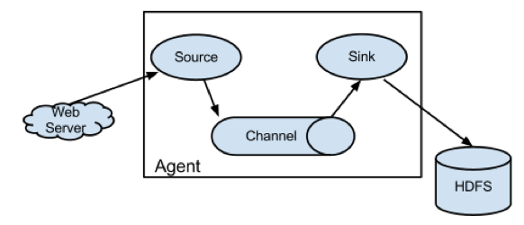
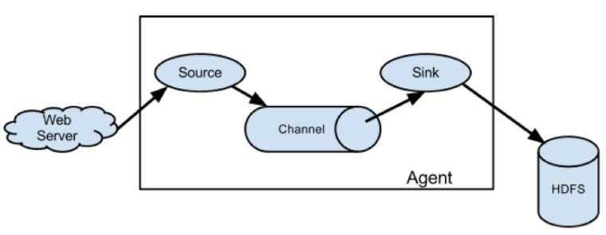
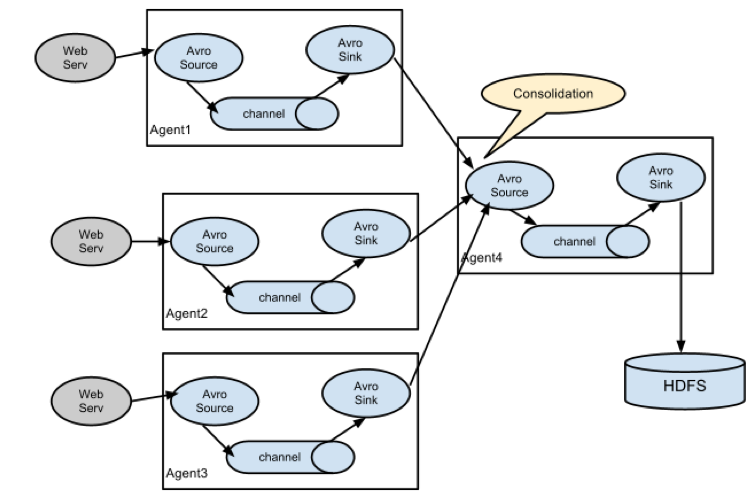
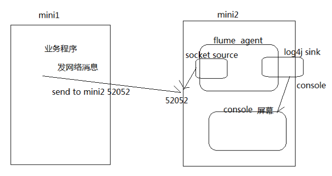
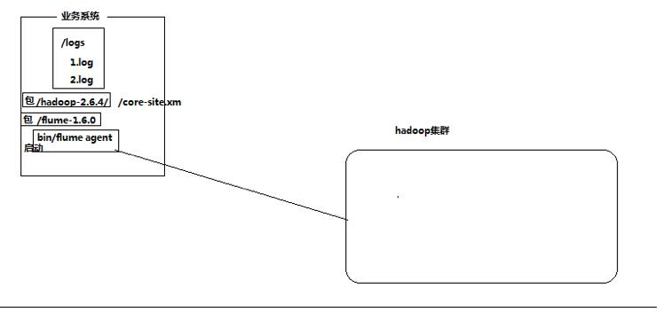

## 1. Flume 介绍

### 1.1. 概述

Flume是一个分布式、可靠、和高可用的海量日志采集、聚合和传输的系统.
Flume可以采集文件,socket数据包、文件、文件夹、kafka等各种形式源数据,又可以将采集到的数据(下沉sink)输出到HDFS、hbase、hive、kafka等众多外部存储系统中
一般的采集需求,通过对flume的简单配置即可实现
Flume针对特殊场景也具备良好的自定义扩展能力,
因此,flume可以适用于大部分的日常数据采集场景

### 1.2. 运行机制

1. Flume分布式系统中最核心的角色是agent,flume采集系统就是由一个个agent所连接起来形成
2. 每一个agent相当于一个数据传递员,内部有三个组件：
    1. Source：采集组件,用于跟数据源对接,以获取数据
    2. Sink：下沉组件,用于往下一级agent传递数据或者往最终存储系统传递数据
    3. Channel：传输通道组件,用于从source将数据传递到sink

       

### 1.3. Flume 结构图

#### 简单结构

单个 Agent 采集数据


##### 复杂结构

多级 Agent 之间串联


## 2. Flume 实战案例

案例：使用网络telent命令向一台机器发送一些网络数据,然后通过flume采集网络端口数据


### 2.1. Flume 的安装部署

#### Step 1: 下载解压修改配置文件

下载地址：

<http://archive.apache.org/dist/flume/1.8.0/apache-flume-1.8.0-bin.tar.gz>
Flume的安装非常简单,只需要解压即可,当然,前提是已有hadoop环境
上传安装包到数据源所在节点上
这里我们采用在第三台机器来进行安装

```shell
[root@node03 ~]# cd  /export/softwares/
# 上传fulme 安装包
[root@node03 softwares]# tar -zxvf apache-flume-1.8.0-bin.tar.gz -C /export/servers/
[root@node03 softwares]# cd  /export/servers/apache-flume-1.8.0-bin/conf/
[root@node03 conf]# cp flume-env.sh.template flume-env.sh
[root@node03 conf]# which java
/export/servers/jdk1.8.0_141/bin/java
# 修改JAVA_HOME路径
[root@node03 conf]# vim flume-env.sh
export JAVA_HOME=/export/servers/jdk1.8.0_141
```

##### Step 2: 开发配置文件

根据数据采集的需求配置采集方案,描述在配置文件中(文件名可任意自定义)
配置我们的网络收集的配置文件
在flume的conf目录下新建一个配置文件（采集方案）

```shell
[root@node03 conf]# vim /export/servers/apache-flume-1.8.0-bin/conf/netcat-logger.conf
```

```properties
# 定义这个agent中各组件的名字
a1.sources = r1
a1.sinks = k1
a1.channels = c1

# 描述和配置source组件：r1
a1.sources.r1.type = netcat
#注意IP绑定数据源的IP
a1.sources.r1.bind = 192.168.34.120
a1.sources.r1.port = 44444

# 描述和配置sink组件：k1
a1.sinks.k1.type = logger

# 描述和配置channel组件,此处使用是内存缓存的方式
a1.channels.c1.type = memory
a1.channels.c1.capacity = 1000
a1.channels.c1.transactionCapacity = 100

# 描述和配置source  channel   sink之间的连接关系
a1.sources.r1.channels = c1
a1.sinks.k1.channel = c1
```

##### Step 3: 启动配置文件

指定采集方案配置文件,在相应的节点上启动flume agent

先用一个最简单的例子来测试一下程序环境是否正常
启动agent去采集数据

```shell
[root@node03 conf]# /export/servers/apache-flume-1.8.0-bin/bin/flume-ng agent -c conf -f /export/servers/apache-flume-1.8.0-bin/conf/netcat-logger.conf -n a1  -Dflume.root.logger=INFO,console

8 13:48:54 INFO source.NetcatSource: Created serverSocket:sun.nio.ch.ServerSocketChannelImpl[/192.168.34.120:44444]
19/08/18 13:50:05 INFO sink.LoggerSink: Event: { headers:{} body: 68 65 6C 6C 6F 0D                               hello. }
```

`-c conf`   指定flume自身的配置文件所在目录
`-f conf/netcat-logger.con`  指定我们所描述的采集方案
`-n a1`  指定我们这个agent的名字

##### Step 4: 安装 Telnet 准备测试

在node02机器上面安装telnet客户端,用于模拟数据的发送

```shell
# 复制一个新的会话,
[root@node03 ~]# yum -y install telnet
# 使用telnet模拟数据发送
[root@node03 ~]# telnet node03 44444
Trying 192.168.34.120...
Connected to node03.
Escape character is '^]'.
hello
OK
## 在接收端能收到hello 即使表示成功
```

### 2.2. 采集案例

#### 2.2.3. 采集目录到 HDFS



##### 需求

某服务器的某特定目录下,会不断产生新的文件,每当有新文件出现,就需要把文件采集到HDFS中去

##### 思路

根据需求,首先定义以下3大要素

1. 数据源组件,即source ——监控文件目录:spooldir
    1. 监视一个目录,只要目录中出现新文件,就会采集文件中的内容
    2. 采集完成的文件,会被agent自动添加一个后缀：COMPLETED
    3. 所监视的目录中不允许重复出现相同文件名的文件
2. 下沉组件,即sink——HDFS文件系统 :hdfs sink
3. 通道组件,即channel——可用file channel 也可以用内存channel

##### Step 1: Flume 配置文件

```shell
[root@node03 conf]# cd  /export/servers/apache-flume-1.8.0-bin/conf
[root@node03 conf]# mkdir -p /export/servers/dirfile
vim spooldir.conf
```

```shell
# Name the components on this agent
a1.sources = r1
a1.sinks = k1
a1.channels = c1
# Describe/configure the source
##注意：不能往监控目中重复丢同名文件
a1.sources.r1.type = spooldir
a1.sources.r1.spoolDir = /export/servers/dirfile
a1.sources.r1.fileHeader = true
# Describe the sink
a1.sinks.k1.type = hdfs
a1.sinks.k1.channel = c1
a1.sinks.k1.hdfs.path = hdfs://node01:8020/spooldir/files/%y-%m-%d/%H%M/
a1.sinks.k1.hdfs.filePrefix = events-
a1.sinks.k1.hdfs.round = true
a1.sinks.k1.hdfs.roundValue = 10
a1.sinks.k1.hdfs.roundUnit = minute
a1.sinks.k1.hdfs.rollInterval = 3
a1.sinks.k1.hdfs.rollSize = 20
a1.sinks.k1.hdfs.rollCount = 5
a1.sinks.k1.hdfs.batchSize = 1
a1.sinks.k1.hdfs.useLocalTimeStamp = true
#生成的文件类型,默认是Sequencefile,可用DataStream,则为普通文本
a1.sinks.k1.hdfs.fileType = DataStream
# Use a channel which buffers events in memory
a1.channels.c1.type = memory
a1.channels.c1.capacity = 1000
a1.channels.c1.transactionCapacity = 100
# Bind the source and sink to the channel
a1.sources.r1.channels = c1
a1.sinks.k1.channel = c1
```

Channel参数解释

capacity：默认该通道中最大的可以存储的event数量
trasactionCapacity：每次最大可以从source中拿到或者送到sink中的event数量
keep-alive：event添加到通道中或者移出的允许时间

##### Step 2: 启动 Flume

```shell
[root@node03 conf]# cd ..
[root@node03 apache-flume-1.8.0-bin]# bin/flume-ng agent -c ./conf -f ./conf/spooldir.conf -n a1 -Dflume.root.logger=INFO,console
```

##### Step 3: 上传文件到指定目录

将不同的文件放到下面目录里面去,注意文件不能重名

```shell
[root@node03 servers]# cd /export/servers/
[root@node03 servers]# cp hive.sql /export/servers/dirfile/
# 查询是否将数据上传到hdfs 集群中
[root@node03 servers]# hdfs dfs -ls -R /spooldir/files
drwxr-xr-x   - root supergroup          0 2019-08-18 13:58 /spooldir/files/19-08-18
drwxr-xr-x   - root supergroup          0 2019-08-18 13:58 /spooldir/files/19-08-18/1350
-rw-r--r--   3 root supergroup         41 2019-08-18 13:58 /spooldir/files/19-08-18/1350/events-.1566107902580
-rw-r--r--   3 root supergroup         53 2019-08-18 13:58 /spooldir/files/19-08-18/1350/events-.156610790258
```

#### 2.2.4. 采集文件到 HDFS

需求
比如业务系统使用log4j生成的日志,日志内容不断增加,需要把追加到日志文件中的数据实时采集到hdfs
分析
根据需求,首先定义以下3大要素

采集源,即source——监控文件内容更新:`exec  ‘tail -F  file’`
下沉目标,即sink——HDFS文件系统 :hdfs sink
Source和sink之间的传递通道——channel,可用file channel 也可以用 内存channel

Step 1: 定义 Flume 配置文件

```shell
[root@node03 servers]# cd /export/servers/apache-flume-1.8.0-bin/conf
vim tail-file.conf
```

```shell
agent1.sources = source1
agent1.sinks = sink1
agent1.channels = channel1

# Describe/configure tail -F source1
agent1.sources.source1.type = exec
agent1.sources.source1.command = tail -F /export/servers/taillogs/access_log
agent1.sources.source1.channels = channel1
# Describe sink1
agent1.sinks.sink1.type = hdfs
#a1.sinks.k1.channel = c1
agent1.sinks.sink1.hdfs.path = hdfs://node01:8020/weblog/flume-collection/%y-%m-%d/%H-%M
agent1.sinks.sink1.hdfs.filePrefix = access_log
agent1.sinks.sink1.hdfs.maxOpenFiles = 5000
agent1.sinks.sink1.hdfs.batchSize= 100
agent1.sinks.sink1.hdfs.fileType = DataStream
agent1.sinks.sink1.hdfs.writeFormat =Text

agent1.sinks.sink1.hdfs.round = true
agent1.sinks.sink1.hdfs.roundValue = 10
agent1.sinks.sink1.hdfs.roundUnit = minute
agent1.sinks.sink1.hdfs.useLocalTimeStamp = true

# Use a channel which buffers events in memory
agent1.channels.channel1.type = memory
agent1.channels.channel1.keep-alive = 120
agent1.channels.channel1.capacity = 500000
agent1.channels.channel1.transactionCapacity = 600

# Bind the source and sink to the channel
agent1.sources.source1.channels = channel1
agent1.sinks.sink1.channel = channel1
```

```shell
##Step 2 启动 Flume
[root@node03 conf]#cd  /export/servers/apache-flume-1.8.0-bin
[root@node03 apache-flume-1.8.0-bin]# bin/flume-ng agent -c conf -f conf/tail-file.conf -n agent1  -Dflume.root.logger=INFO,console
```

```shell
#Step 3: 开发 Shell 脚本定时追加文件内容
#复制一个新的会话
[root@node03 apache-flume-1.8.0-bin]# mkdir -p /export/servers/shells/
[root@node03 apache-flume-1.8.0-bin]# cd  /export/servers/shells/
## 写一个脚本，把当前时间写入指定文件中
[root@node03 shells]# vim tail-file.sh
#!/bin/bash
while true
do
 date >> /export/servers/taillogs/access_log;
  sleep 0.5;
done

# Step 4: 启动脚本
# 创建文件夹
[root@node03 shells]# mkdir -p /export/servers/taillogs
# 启动脚本
[root@node03 shells]# sh /export/servers/shells/tail-file.sh
# 回到启动的会话，查看日志是否有收集到数据，并去hdfs 中查看 已成功写入到hdfs
[root@node03 shells]# hdfs dfs -ls -R /weblog/flume-collection
drwxr-xr-x   - root supergroup          0 2019-08-18 14:11 /weblog/flume-collection/19-08-18
drwxr-xr-x   - root supergroup          0 2019-08-18 14:12 /weblog/flume-collection/19-08-18/14-10
-rw-r--r--   3 root supergroup        290 2019-08-18 14:11 /weblog/flume-collection/19-08-18/14-10/access_log.1566108664800
-rw-r--r--   3 root supergroup        290 2019-08-18 14:11 /weblog/flume-collection/19-08-18/14-10/access_log.1566108664801
-rw-r--r--   3 root supergroup        290 2019-08-18 14:11 /weblog/flume-collection/19-08-18/14-10/access_log.1566108664802

```

#### 2.2.5. Agent 级联


分析
第一个agent负责收集文件当中的数据,通过网络发送到第二个agent当中去
第二个agent负责接收第一个agent发送的数据,并将数据保存到hdfs上面去

```shell
#Step 1: Node02 安装 Flume
#将node03机器上面解压后的flume文件夹拷贝到node02机器上面去
[root@node03 shells]# cd  /export/servers
[root@node03 servers]# scp -r apache-flume-1.8.0-bin/ node02:$PWD
# 查看node节点是否成功有flume
[root@node03 servers]# ssh node02
Last login: Thu Aug  8 20:38:03 2019 from 192.168.34.21
[root@node02 ~]# cd /export/servers/apache-flume-1.8.0-bin/
# Step 2: Node02 配置 Flume
# 在node02机器配置我们的flume
[root@node02 ~]# cd /export/servers/apache-flume-1.8.0-bin/conf
vim tail-avro-avro-logger.conf

# Name the components on this agent
a1.sources = r1
a1.sinks = k1
a1.channels = c1
# Describe/configure the source
a1.sources.r1.type = exec
a1.sources.r1.command = tail -F /export/servers/taillogs/access_log
a1.sources.r1.channels = c1
# Describe the sink
##sink端的avro是一个数据发送者
a1.sinks = k1
a1.sinks.k1.type = avro
a1.sinks.k1.channel = c1
a1.sinks.k1.hostname = node03
a1.sinks.k1.port = 4141
a1.sinks.k1.batch-size = 10
# Use a channel which buffers events in memory
a1.channels.c1.type = memory
a1.channels.c1.capacity = 1000
a1.channels.c1.transactionCapacity = 100
# Bind the source and sink to the channel
a1.sources.r1.channels = c1
a1.sinks.k1.channel = c1
#step 3: 开发脚本向文件中写入数据
#直接将node03下面的脚本和数据拷贝到node02即可,node03机器上执行以下命令
[root@node03 ~]# cd  /export/servers
[root@node03 servers]# scp -r shells/ taillogs/ node02:$PWD
```

Step 4: Node03 Flume 配置文件
在node03机器上开发flume的配置文件

```shell
[root@node03 servers]# cd /export/servers/apache-flume-1.8.0-bin/conf
# 添加配置文件
[root@node03 conf]# vim avro-hdfs.conf

# Name the components on this agent
a1.sources = r1
a1.sinks = k1
a1.channels = c1
# Describe/configure the source
##source中的avro组件是一个接收者服务
a1.sources.r1.type = avro
a1.sources.r1.channels = c1
a1.sources.r1.bind = node03
a1.sources.r1.port = 4141
# Describe the sink
a1.sinks.k1.type = hdfs
a1.sinks.k1.hdfs.path = hdfs://node01:8020/av/%y-%m-%d/%H%M/
a1.sinks.k1.hdfs.filePrefix = events-
a1.sinks.k1.hdfs.round = true
a1.sinks.k1.hdfs.roundValue = 10
a1.sinks.k1.hdfs.roundUnit = minute
a1.sinks.k1.hdfs.rollInterval = 3
a1.sinks.k1.hdfs.rollSize = 20
a1.sinks.k1.hdfs.rollCount = 5
a1.sinks.k1.hdfs.batchSize = 1
a1.sinks.k1.hdfs.useLocalTimeStamp = true
#生成的文件类型,默认是Sequencefile,可用DataStream,则为普通文本
a1.sinks.k1.hdfs.fileType = DataStream
# Use a channel which buffers events in memory
a1.channels.c1.type = memory
a1.channels.c1.capacity = 1000
a1.channels.c1.transactionCapacity = 100

# Bind the source and sink to the channel
a1.sources.r1.channels = c1
a1.sinks.k1.channel = c1
```

Step 5: 顺序启动
node03机器启动flume进程

```shell
[root@node03 conf]# cd /export/servers/apache-flume-1.8.0-bin
bin/flume-ng agent -c conf -f conf/avro-hdfs.conf -n a1  -Dflume.root.logger=INFO,console
```

```shell
# node02机器启动flume进程
[root@node02 conf]# cd /export/servers/apache-flume-1.8.0-bin/
[root@node02 apache-flume-1.8.0-bin]# bin/flume-ng agent -c conf -f conf/tail-avro-avro-logger.conf -n a1  -Dflume.root.logger=INFO,console
```

node02机器启shell脚本生成文件

```shell
[root@node02 ~]# cd  /export/servers/shells
[root@node02 shells]# sh tail-file.sh
## 查看node03 的日志，并查询Hdfs是否有数据
[root@node02 shells]# hdfs dfs -ls -R /av/19-08-18/1420
-rw-r--r--   3 root supergroup         29 2019-08-18 14:25 /av/19-08-18/1420/events-.1566109540252
-rw-r--r--   3 root supergroup         29 2019-08-18 14:25 /av/19-08-18/1420/events-.1566109540253
-rw-r--r--   3 root supergroup         29 2019-08-18 14:25 /av/19-08-18/1420/events-.1566109540254
-rw-r--r--   3 root supergroup         29 2019-08-18 14:25 /av/19-08-18/1420/events-.1566109540255
-rw-r--r--   3 root supergroup         29 2019-08-18 14:25 /av/19-08-18/1420/events-.1566109540256
-rw-r--r--   3 root supergroup         29 2019-08-18 14:25 /av/19-08-18/1420/events-.1566109540257
-rw-r--r--   3 root supergroup         29 2019-08-18 14:25 /av/19-08-18/1420/events-.1566109540258
-rw-r--r--   3 root supergroup         29 2019-08-18 14:25 /av/19-08-18/1420/events-.1566109540259
-rw-r--r--   3 root supergroup         29 2019-08-18 14:25 /av/19-08-18/1420/events-.1566109540260
-rw-r--r--   3 root supergroup         29 2019-08-18 14:25 /av/19-08-18/1420/events-.1566109540261
-rw-r--r--   3 root supergroup         29 2019-08-18 14:26 /av/19-08-18/1420/events-.1566109606591
-rw-r--r--   3 root supergroup         29 2019-08-18 14:26 /av/19-08-18/1420/events-.1566109606592
-rw-r--r--   3 root supergroup         29 2019-08-18 14:26 /av/19-08-18/1420/events-.1566109606593
```

## 3. flume的高可用方案-failover

在完成单点的Flume NG搭建后,下面我们搭建一个高可用的Flume NG集群,架构图如下所示：

### 3.1. 角色分配

Flume的Agent和Collector分布如下表所示：
| 名称　|   HOST    | 角色 |
| --- | --- | --- |
| Agent1    | node01    | Web Server|
| Collector1    | node02    | AgentMstr1|
| Collector2    | node03    | AgentMstr2|

图中所示,Agent1数据分别流入到Collector1和Collector2,Flume NG本身提供了Failover机制,可以自动切换和恢复.在上图中,有3个产生日志服务器分布在不同的机房,要把所有的日志都收集到一个集群中存储.下 面我们开发配置Flume NG集群

### 3.2. Node01 安装和配置

将node03机器上面的flume安装包以及文件生产的两个目录拷贝到node01机器上面去

node03机器执行以下命令

```shell
[root@node03 apache-flume-1.8.0-bin]# cd /export/servers
[root@node03 servers]# scp -r apache-flume-1.8.0-bin/ node01:$PWD
[root@node03 servers]# scp -r shells/ taillogs/ node01:$PWD
```

node01机器配置agent的配置文件

```shell
[root@node01 ~]# cd /export/servers/apache-flume-1.8.0-bin/conf
[root@node01 conf]# vim agent.conf

#agent1 name
agent1.channels = c1
agent1.sources = r1
agent1.sinks = k1 k2
##set gruop
agent1.sinkgroups = g1
agent1.sources.r1.channels = c1
agent1.sources.r1.type = exec
agent1.sources.r1.command = tail -F /export/servers/taillogs/access_log
#
##set channel
agent1.channels.c1.type = memory
agent1.channels.c1.capacity = 1000
agent1.channels.c1.transactionCapacity = 100
## set sink1
agent1.sinks.k1.channel = c1
agent1.sinks.k1.type = avro
agent1.sinks.k1.hostname = node02
agent1.sinks.k1.port = 52020
## set sink2
agent1.sinks.k2.channel = c1
agent1.sinks.k2.type = avro
agent1.sinks.k2.hostname = node03
agent1.sinks.k2.port = 52020
##set sink group
agent1.sinkgroups.g1.sinks = k1 k2
##set failover
agent1.sinkgroups.g1.processor.type = failover
agent1.sinkgroups.g1.processor.priority.k1 = 10
agent1.sinkgroups.g1.processor.priority.k2 = 1
agent1.sinkgroups.g1.processor.maxpenalty = 10000
```

### 3.3. Node02 与 Node03 配置 FlumeCollection

node02机器修改配置文件

```shell
[root@node02 conf]# cd /export/servers/apache-flume-1.8.0-bin/conf
vim collector.conf
#set Agent name
a1.sources = r1
a1.channels = c1
a1.sinks = k1
#
##set channel
a1.channels.c1.type = memory
a1.channels.c1.capacity = 1000
a1.channels.c1.transactionCapacity = 100
#
## other node,nna to nns
a1.sources.r1.type = avro
a1.sources.r1.bind = node02
a1.sources.r1.port = 52020
a1.sources.r1.channels = c1
#
##set sink to hdfs
a1.sinks.k1.type=hdfs
a1.sinks.k1.hdfs.path= hdfs://node01:8020/flume/failover/
a1.sinks.k1.hdfs.fileType=DataStream
# 需要添加这个否则会报 Expected timestamp in the Flume event headers, but it was null
a1.sinks.k1.hdfs.useLocalTimeStamp = true
a1.sinks.k1.hdfs.writeFormat=TEXT
a1.sinks.k1.hdfs.rollInterval=10
a1.sinks.k1.channel=c1
a1.sinks.k1.hdfs.filePrefix=%Y-%m-%d

### node03机器修改配置文件


[root@node03 servers]# cd  /export/servers/apache-flume-1.8.0-bin/conf
vim collector.conf
#set Agent name
a1.sources = r1
a1.channels = c1
a1.sinks = k1
#
##set channel
a1.channels.c1.type = memory
a1.channels.c1.capacity = 1000
a1.channels.c1.transactionCapacity = 100
#
## other node,nna to nns
a1.sources.r1.type = avro
a1.sources.r1.bind = node03
a1.sources.r1.port = 52020
a1.sources.r1.channels = c1
#
##set sink to hdfs
a1.sinks.k1.type=hdfs
a1.sinks.k1.hdfs.path= hdfs://node01:8020/flume/failover/
a1.sinks.k1.hdfs.fileType=DataStream
a1.sinks.k1.hdfs.writeFormat=TEXT
# 需要添加这个否则会报 Expected timestamp in the Flume event headers, but it was null
a1.sinks.k1.hdfs.useLocalTimeStamp = true
a1.sinks.k1.hdfs.rollInterval=10
a1.sinks.k1.channel=c1
a1.sinks.k1.hdfs.filePrefix=%Y-%m-%d
```

 3.4. 顺序启动

node03机器上面启动flume

```shell
[root@node03 conf]# cd /export/servers/apache-flume-1.8.0-bin
[root@node03 apache-flume-1.8.0-bin]# bin/flume-ng agent -n a1 -c conf -f conf/collector.conf -Dflume.root.logger=DEBUG,console
```

node02机器上面启动flume

```shell
[root@node02 shells]# cd /export/servers/apache-flume-1.8.0-bin
[root@node02 apache-flume-1.8.0-bin]# bin/flume-ng agent -n a1 -c conf -f conf/collector.conf -Dflume.root.logger=DEBUG,console
```

node01机器上面启动flume

```shell
[root@node01 conf]# cd /export/servers/apache-flume-1.8.0-bin
[root@node01 apache-flume-1.8.0-bin]# bin/flume-ng agent -n agent1 -c conf -f conf/agent.conf -Dflume.root.logger=DEBUG,console
```

node01机器启动文件产生脚本

```shell
[root@node01 ~]# cd  /export/servers/shells
[root@node01 shells]# sh tail-file.sh
## 查询HDFS 是否有数据
[root@node02 conf]# hdfs dfs -ls -R /flume/failover
```

3.5. Failover 测试

下面我们来测试下Flume NG集群的高可用（故障转移）.场景如下：我们在Agent1节点上传文件,由于我们配置Collector1的权重比Collector2大,所以 Collector1优先采集并上传到存储系统.然后我们kill掉Collector1,此时有Collector2负责日志的采集上传工作,之后,我 们手动恢复Collector1节点的Flume服务,再次在Agent1上次文件,发现Collector1恢复优先级别的采集工作.具体如下所 示：
Collector1优先上传
HDFS集群中上传的log内容预览
Collector1宕机,Collector2获取优先上传权限
重启Collector1服务,Collector1重新获得优先上传的权限

## 4. flume 的负载均衡

负载均衡是用于解决一台机器(一个进程)无法解决所有请求而产生的一种算法.Load balancing Sink Processor 能够实现 load balance 功能,如下图Agent1 是一个路由节点,负责将 Channel 暂存的 Event 均衡到对应的多个 Sink组件上,而每个 Sink 组件分别连接到一个独立的 Agent 上,
在此处我们通过三台机器来进行模拟flume的负载均衡
三台机器规划如下：
node01：采集数据,发送到node02和node03机器上去
node02：接收node01的部分数据
node03：接收node01的部分数据

### 第一步：开发node01服务器的flume配置

node01服务器配置：

```shell
[root@node01 conf]# cd /export/servers/apache-flume-1.8.0-bin/conf
[root@node01 conf]# vim load_banlancer_client.conf
#agent name
a1.channels = c1
a1.sources = r1
a1.sinks = k1 k2
#set gruop
a1.sinkgroups = g1
#set channel
a1.channels.c1.type = memory
a1.channels.c1.capacity = 1000
a1.channels.c1.transactionCapacity = 100
a1.sources.r1.channels = c1
a1.sources.r1.type = exec
a1.sources.r1.command = tail -F /export/servers/taillogs/access_log
# set sink1
a1.sinks.k1.channel = c1
a1.sinks.k1.type = avro
a1.sinks.k1.hostname = node02
a1.sinks.k1.port = 52020
# set sink2
a1.sinks.k2.channel = c1
a1.sinks.k2.type = avro
a1.sinks.k2.hostname = node03
a1.sinks.k2.port = 52020
#set sink group
a1.sinkgroups.g1.sinks = k1 k2
#set failover
a1.sinkgroups.g1.processor.type = load_balance
a1.sinkgroups.g1.processor.backoff = true
a1.sinkgroups.g1.processor.selector = round_robin
a1.sinkgroups.g1.processor.selector.maxTimeOut=10000

```

### 第二步：开发node02服务器的flume配置

```shell
[root@node02 conf]# cd /export/servers/apache-flume-1.8.0-bin/conf
[root@node02 conf]# vim load_banlancer_server.conf

# Name the components on this agent
a1.sources = r1
a1.sinks = k1
a1.channels = c1
# Describe/configure the source
a1.sources.r1.type = avro
a1.sources.r1.channels = c1
a1.sources.r1.bind = node02
a1.sources.r1.port = 52020
# Describe the sink
a1.sinks.k1.type = logger
# Use a channel which buffers events in memory
a1.channels.c1.type = memory
a1.channels.c1.capacity = 1000
a1.channels.c1.transactionCapacity = 100
# Bind the source and sink to the channel
a1.sources.r1.channels = c1
a1.sinks.k1.channel = c1

```

### 第三步：开发node03服务器flume配置

node03服务器配置

```shell
[root@node03 conf]# cd /export/servers/apache-flume-1.8.0-bin/conf
[root@node03 conf]# vim load_banlancer_server.conf
# Name the components on this agent
a1.sources = r1
a1.sinks = k1
a1.channels = c1

# Describe/configure the source
a1.sources.r1.type = avro
a1.sources.r1.channels = c1
a1.sources.r1.bind = node03
a1.sources.r1.port = 52020

# Describe the sink
a1.sinks.k1.type = logger
# Use a channel which buffers events in memory
a1.channels.c1.type = memory
a1.channels.c1.capacity = 1000
a1.channels.c1.transactionCapacity = 100

# Bind the source and sink to the channel
a1.sources.r1.channels = c1
a1.sinks.k1.channel = c1
```

### 第四步：准备启动flume服务

启动node03的flume服务

```shell
[root@node03 conf]# cd /export/servers/apache-flume-1.8.0-bin
[root@node03 conf]# bin/flume-ng agent -n a1 -c conf -f conf/load_banlancer_server.conf -Dflume.root.logger=DEBUG,console
```

启动node02的flume服务

```shell
[root@node02 apache-flume-1.8.0-bin]# cd /export/servers/apache-flume-1.8.0-bin
[root@node02 apache-flume-1.8.0-bin]# bin/flume-ng agent -n a1 -c conf -f conf/load_banlancer_server.conf -Dflume.root.logger=DEBUG,console
```

启动node01的flume服务

```shell
[root@node01 shells]# cd /export/servers/apache-flume-1.8.0-bin
[root@node01 shells]# bin/flume-ng agent -n a1 -c conf -f conf/load_banlancer_client.conf -Dflume.root.logger=DEBUG,console
```

### 第五步：node01服务器运行脚本产生数据

```shell
[root@node01 conf]# cd /export/servers/shells
[root@node01 shells]# sh tail-file.sh
```

## 5. Flume 案例-静态拦截器

### 1. 案例场景

A、B两台日志服务机器实时生产日志主要类型为access.log、nginx.log、web.log
现在要求：
把A、B 机器中的access.log、nginx.log、web.log 采集汇总到C机器上然后统一收集到hdfs中.
但是在hdfs中要求的目录为：

```shell
/source/logs/access/20180101/**
/source/logs/nginx/20180101/**
/source/logs/web/20180101/**
```

### 2. 场景分析


图一

### 3. 数据流程处理分析


### 4、实现

服务器A对应的IP为 node01
服务器B对应的IP为 node02
服务器C对应的IP为 node03

#### 采集端配置文件开发

node01与node02服务器开发flume的配置文件

```shell
[root@node01 conf]# cd /export/servers/apache-flume-1.8.0-bin/conf
[root@node01 conf]# vim exec_source_avro_sink.conf
# Name the components on this agent
a1.sources = r1 r2 r3
a1.sinks = k1
a1.channels = c1
# Describe/configure the source
a1.sources.r1.type = exec
a1.sources.r1.command = tail -F /export/servers/taillogs/access.log
a1.sources.r1.interceptors = i1
a1.sources.r1.interceptors.i1.type = static
##  static拦截器的功能就是往采集到的数据的header中插入自己定## 义的key-value对
a1.sources.r1.interceptors.i1.key = type
a1.sources.r1.interceptors.i1.value = access

a1.sources.r2.type = exec
a1.sources.r2.command = tail -F /export/servers/taillogs/nginx.log
a1.sources.r2.interceptors = i2
a1.sources.r2.interceptors.i2.type = static
a1.sources.r2.interceptors.i2.key = type
a1.sources.r2.interceptors.i2.value = nginx

a1.sources.r3.type = exec
a1.sources.r3.command = tail -F /export/servers/taillogs/web.log
a1.sources.r3.interceptors = i3
a1.sources.r3.interceptors.i3.type = static
a1.sources.r3.interceptors.i3.key = type
a1.sources.r3.interceptors.i3.value = web

# Describe the sink
a1.sinks.k1.type = avro
a1.sinks.k1.hostname = node03
a1.sinks.k1.port = 41414
# Use a channel which buffers events in memory
a1.channels.c1.type = memory
a1.channels.c1.capacity = 20000
a1.channels.c1.transactionCapacity = 10000

# Bind the source and sink to the channel
a1.sources.r1.channels = c1
a1.sources.r2.channels = c1
a1.sources.r3.channels = c1
a1.sinks.k1.channel = c1

##node02 操作同上一样
[root@node02 conf]# cd /export/servers/apache-flume-1.8.0-bin/conf
[root@node02 conf]# vim exec_source_avro_sink.conf
```

#### 服务端配置文件开发

在node03上面开发flume配置文件

```shell
[root@node03 conf]# cd /export/servers/apache-flume-1.8.0-bin/conf
[root@node03 conf]# vim avro_source_hdfs_sink.conf
a1.sources = r1
a1.sinks = k1
a1.channels = c1
#定义source
a1.sources.r1.type = avro
a1.sources.r1.bind = node03
a1.sources.r1.port =41414

#添加时间拦截器
a1.sources.r1.interceptors = i1
a1.sources.r1.interceptors.i1.type = org.apache.flume.interceptor.TimestampInterceptor$Builder
#定义channels
a1.channels.c1.type = memory
a1.channels.c1.capacity = 20000
a1.channels.c1.transactionCapacity = 10000
#定义sink
a1.sinks.k1.type = hdfs
a1.sinks.k1.hdfs.path=hdfs://node01:8020/source/logs/%{type}/%Y%m%d
a1.sinks.k1.hdfs.filePrefix =events
a1.sinks.k1.hdfs.fileType = DataStream
a1.sinks.k1.hdfs.writeFormat = Text
#时间类型
a1.sinks.k1.hdfs.useLocalTimeStamp = true
#生成的文件不按条数生成
a1.sinks.k1.hdfs.rollCount = 0
#生成的文件按时间生成
a1.sinks.k1.hdfs.rollInterval = 30
#生成的文件按大小生成
a1.sinks.k1.hdfs.rollSize  = 10485760
#批量写入hdfs的个数
a1.sinks.k1.hdfs.batchSize = 10000
#flume操作hdfs的线程数（包括新建,写入等）
a1.sinks.k1.hdfs.threadsPoolSize=10
#操作hdfs超时时间
a1.sinks.k1.hdfs.callTimeout=30000
#组装source、channel、sink
a1.sources.r1.channels = c1
a1.sinks.k1.channel = c1
```

#### 采集端文件生成脚本

在node01与node02上面开发shell脚本,模拟数据生成

```shell
[root@node01 conf]# cd /export/servers/shells
[root@node01 shells]# vim server.sh

#!/bin/bash
while true
do  
 date >> /export/servers/taillogs/access.log;
 date >> /export/servers/taillogs/web.log;
 date >> /export/servers/taillogs/nginx.log;
 sleep 0.5;
done
## node02 也执上以上操作
[root@node02 conf]# cd /export/servers/shells
[root@node02 shells]# vim server.sh
```

#### 顺序启动服务

node03启动flume实现数据收集

```shell
[root@node03 conf]# cd /export/servers/apache-flume-1.8.0-bin
[root@node03 apache-flume-1.8.0-bin]# bin/flume-ng agent -c conf -f conf/avro_source_hdfs_sink.conf -name a1 -Dflume.root.logger=DEBUG,console
```

node01与node02启动flume实现数据监控

```shell
[root@node01 ~]# cd /export/servers/apache-flume-1.8.0-bin
[root@node01 apache-flume-1.8.0-bin]# bin/flume-ng agent -c conf -f conf/exec_source_avro_sink.conf -name a1 -Dflume.root.logger=DEBUG,console
##节点node02 执行相同操作
[root@node02 shells]# cd /export/servers/apache-flume-1.8.0-bin
[root@node02 apache-flume-1.8.0-bin]# bin/flume-ng agent -c conf -f conf/exec_source_avro_sink.conf -name a1 -Dflume.root.logger=DEBUG,console
```

node01与node02启动生成文件脚本

```shell
[root@node01 shells]# cd /export/servers/shells
[root@node01 shells]# sh server.sh
###节点node02 执行相同操作
[root@node02 apache-flume-1.8.0-bin]# cd /export/servers/shells
[root@node02 shells]# sh server.sh

## 查询是否生成数据
[root@node01 servers]# cd /export/servers/taillogs
[root@node01 taillogs]# ll
total 128
-rw-r--r-- 1 root root 102892 Aug 18 15:48 access_log
-rw-r--r-- 1 root root   5626 Aug 18 15:48 access.log
-rw-r--r-- 1 root root   5626 Aug 18 15:48 nginx.log
-rw-r--r-- 1 root root   5626 Aug 18 15:48 web.log
# 节点node02
[root@node02 ~]# cd /export/servers/taillogs
[root@node02 taillogs]# ll
total 36
-rw-r--r-- 1 root root 11513 Aug 18 14:28 access_log
-rw-r--r-- 1 root root  6322 Aug 18 15:49 access.log
-rw-r--r-- 1 root root  6322 Aug 18 15:49 nginx.log
-rw-r--r-- 1 root root  6322 Aug 18 15:49 web.log
## 查询hdfs 上是否有数据，有即表示成功
[root@node02 taillogs]# hdfs dfs -ls  /source/logs  
Found 3 items
drwxr-xr-x   - root supergroup          0 2019-08-18 15:47 /source/logs/access
drwxr-xr-x   - root supergroup          0 2019-08-18 15:47 /source/logs/nginx
drwxr-xr-x   - root supergroup          0 2019-08-18 15:47 /source/logs/web
```

## 6. Flume 案例二

### 案例需求

在数据采集之后,通过flume的拦截器,实现不需要的数据过滤掉,并将指定的第一个字段进行加密,加密之后再往hdfs上面保存

### 原始数据与处理之后的数据对比

原始文件内容

```shell
[root@node03 intercept]# cat testdata.txt.COMPLETED 
13601249301     100     200     300     400     500     600     700
13601249302     100     200     300     400     500     600     700
13601249303     100     200     300     400     500     600     700
13601249304     100     200     300     400     500     600     700
13601249305     100     200     300     400     500     600     700
13601249306     100     200     300     400     500     600     700
13601249307     100     200     300     400     500     600     700
13601249308     100     200     300     400     500     600     700
13601249309     100     200     300     400     500     600     700
13601249310     100     200     300     400     500     600     700
13601249311     100     200     300     400     500     600     700
13601249312     100     200     300     400     500     600     700
13601249313     100     200     300     400     500     600     700
```

HDFS上产生收集到的处理数

```shell
[root@node03 intercept]# hdfs dfs -cat /flume/intercept/20190820/event.1566265580800.log
b261bde7454af9f7873b40b6f029b066        100     300     500     600
da45efaff4d0a9014b695dfcb2587f00        100     300     500     600
e7ef10782ddbd1d7c1e23dafaaa5cee7        100     300     500     600
bbe82adebcd7e1db9945a4f83d5b9fdb        100     300     500     600
53954f3e0ba4a96a4f619ac1c4e964e2        100     300     500     600
d47280e6e260000c7c23666b3be3b543        100     300     500     600
7e4ee93e8d23be2e8823442c29d2446d        100     300     500     600
7ef681128d253e9f763c6480b7237d3c        100     300     500     600
53b3b8dab7de7c3f4f81abe3c1ec900f        100     300     500     600
5e57e5ecde99f8c120860be18a1b6732        100     300     500     600
5d2d99c87faa75b9e05bb7f938de2e82        100     300     500     600
afcf5b5f42caaece99e0d207c83bd293        100     300     500     600
7a8cf0bcfe31e5d725658fc472675812        100     300     500     600
```


### 实现步骤

#### 第一步：创建maven java工程,导入jar包

```xml
<?xml version="1.0" encoding="UTF-8"?>
<project xmlns="http://maven.apache.org/POM/4.0.0"
         xmlns:xsi="http://www.w3.org/2001/XMLSchema-instance"
         xsi:schemaLocation="http://maven.apache.org/POM/4.0.0 http://maven.apache.org/xsd/maven-4.0.0.xsd">
    <modelVersion>4.0.0</modelVersion>

    <groupId>cn.xhchen.cloud</groupId>
    <artifactId>example-flume-intercepter</artifactId>
    <version>1.0-SNAPSHOT</version>

    <dependencies>
        <dependency>
            <groupId>org.apache.flume</groupId>
            <artifactId>flume-ng-sdk</artifactId>
            <version>1.8.0</version>
        </dependency>
        <dependency>
            <groupId>org.apache.flume</groupId>
            <artifactId>flume-ng-core</artifactId>
            <version>1.8.0</version>
        </dependency>
    </dependencies>

    <build>
        <plugins>
            <plugin>
                <groupId>org.apache.maven.plugins</groupId>
                <artifactId>maven-compiler-plugin</artifactId>
                <version>3.0</version>
                <configuration>
                    <source>1.8</source>
                    <target>1.8</target>
                    <encoding>UTF-8</encoding>
                    <!--    <verbal>true</verbal>-->
                </configuration>
            </plugin>
            <plugin>
                <groupId>org.apache.maven.plugins</groupId>
                <artifactId>maven-shade-plugin</artifactId>
                <version>3.1.1</version>
                <executions>
                    <execution>
                        <phase>package</phase>
                        <goals>
                            <goal>shade</goal>
                        </goals>
                        <configuration>
                            <filters>
                                <filter>
                                    <artifact>*:*</artifact>
                                    <excludes>
                                        <exclude>META-INF/*.SF</exclude>
                                        <exclude>META-INF/*.DSA</exclude>
                                        <exclude>META-INF/*.RSA</exclude>
                                    </excludes>
                                </filter>
                            </filters>
                            <transformers>
                                <transformer implementation="org.apache.maven.plugins.shade.resource.ManifestResourceTransformer">
                                    <mainClass></mainClass>
                                </transformer>
                            </transformers>
                        </configuration>
                    </execution>
                </executions>
            </plugin>
        </plugins>
    </build>
</project>
```

#### 第二步：自定义flume的拦截器

```java
package com.xhchen;
import com.google.common.base.Charsets;
import org.apache.flume.Context;
import org.apache.flume.Event;
import org.apache.flume.interceptor.Interceptor;
import java.security.MessageDigest;
import java.security.NoSuchAlgorithmException;
import java.util.ArrayList;
import java.util.List;
import java.util.regex.Matcher;
import java.util.regex.Pattern;

import static com.xhchen.CustomParameterInterceptor.Constants.*;

/**
 * Created by xhchen
 */
public class CustomParameterInterceptor implements Interceptor{


    /** The field_separator.指明每一行字段的分隔符 */
    private final String fields_separator;

    /** The indexs.通过分隔符分割后，指明需要那列的字段 下标*/
    private final String indexs;

    /** The indexs_separator. 多个下标的分隔符*/
    private final String indexs_separator;

    /** The encrypted_field_index. 需要加密的字段下标*/
    private final String encrypted_field_index;


    /**
     *
     */
    public CustomParameterInterceptor( String fields_separator,
                                       String indexs, String indexs_separator,String encrypted_field_index) {
        String f = fields_separator.trim();
        String i = indexs_separator.trim();
        this.indexs = indexs;
        this.encrypted_field_index=encrypted_field_index.trim();
        if (!f.equals("")) {
            f = UnicodeToString(f);
        }
        this.fields_separator =f;
        if (!i.equals("")) {
            i = UnicodeToString(i);
        }
        this.indexs_separator = i;
    }

    /**
     *
     * \t 制表符 ('\u0009')
     * * \t 制表符 ('\u0009') \n 新行（换行）符 (' ') \r 回车符 (' ') \f 换页符 ('\u000C') \a 报警
     *      * (bell) 符 ('\u0007') \e 转义符 ('\u001B') \cx  空格(\u0020)对应于 x 的控制符
     */

    public static String UnicodeToString(String str) {
        Pattern pattern = Pattern.compile("(\\\\u(\\p{XDigit}{4}))");
        Matcher matcher = pattern.matcher(str);
        char ch;
        while (matcher.find()) {
            ch = (char) Integer.parseInt(matcher.group(2), 16);
            str = str.replace(matcher.group(1), ch + "");
        }
        return str;
    }

    /*
     * @see org.apache.flume.interceptor.Interceptor#intercept(org.apache.flume.Event)
     */
    @Override
    public Event intercept(Event event) {
        if (event == null) {
            return null;
        }
        try {
            String line = new String(event.getBody(), Charsets.UTF_8);
            String[] fields_spilts = line.split(fields_separator);
            String[] indexs_split = indexs.split(indexs_separator);
            String newLine="";
            for (int i = 0; i < indexs_split.length; i++) {
                int parseInt = Integer.parseInt(indexs_split[i]);
                //对加密字段进行加密
                if(!"".equals(encrypted_field_index)&&encrypted_field_index.equals(indexs_split[i])){
                    newLine+=StringUtils.GetMD5Code(fields_spilts[parseInt]);
                }else{
                    newLine+=fields_spilts[parseInt];
                }

                if(i!=indexs_split.length-1){
                    newLine+=fields_separator;
                }
            }
            event.setBody(newLine.getBytes(Charsets.UTF_8));
            return event;
        } catch (Exception e) {
            return event;
        }
    }

    /** 批量event拦截逻辑
     * @see org.apache.flume.interceptor.Interceptor#intercept(java.util.List)
     */
    @Override
    public List<Event> intercept(List<Event> events) {
        List<Event> out = new ArrayList<Event>();
        for (Event event : events) {
            Event outEvent = intercept(event);
            if (outEvent != null) {
                out.add(outEvent);
            }
        }
        return out;
    }

    /*
     * @see org.apache.flume.interceptor.Interceptor#initialize()
     */
    @Override
    public void initialize() {
        // TODO Auto-generated method stub

    }

    /*
     * @see org.apache.flume.interceptor.Interceptor#close()
     */
    @Override
    public void close() {
        // TODO Auto-generated method stub

    }


    /**
     * 相当于自定义Interceptor的工厂类
     * 在flume采集配置文件中通过制定该Builder来创建Interceptor对象
     * 可以在Builder中获取、解析flume采集配置文件中的拦截器Interceptor的自定义参数：
     * 字段分隔符,字段下标,下标分隔符、加密字段下标 ...等
     * @author
     *
     */
    public static class Builder implements Interceptor.Builder {

        /** The fields_separator.指明每一行字段的分隔符 */
        private  String fields_separator;

        /** The indexs.通过分隔符分割后，指明需要那列的字段 下标*/
        private  String indexs;

        /** The indexs_separator. 多个下标下标的分隔符*/
        private  String indexs_separator;

        /** The encrypted_field. 需要加密的字段下标*/
        private  String encrypted_field_index;

        /*
         * @see org.apache.flume.conf.Configurable#configure(org.apache.flume.Context)
         */
        @Override
        public void configure(Context context) {
            fields_separator = context.getString(FIELD_SEPARATOR, DEFAULT_FIELD_SEPARATOR);
            indexs = context.getString(INDEXS, DEFAULT_INDEXS);
            indexs_separator = context.getString(INDEXS_SEPARATOR, DEFAULT_INDEXS_SEPARATOR);
            encrypted_field_index= context.getString(ENCRYPTED_FIELD_INDEX, DEFAULT_ENCRYPTED_FIELD_INDEX);

        }

        /*
         * @see org.apache.flume.interceptor.Interceptor.Builder#build()
         */
        @Override
        public Interceptor build() {

            return new CustomParameterInterceptor(fields_separator, indexs, indexs_separator,encrypted_field_index);
        }
    }


    /**
     * The Class Constants.
     *
     */
    public static class Constants {
        /** The Constant FIELD_SEPARATOR. */
        public static final String FIELD_SEPARATOR = "fields_separator";

        /** The Constant DEFAULT_FIELD_SEPARATOR. */
        public static final String DEFAULT_FIELD_SEPARATOR =" ";

        /** The Constant INDEXS. */
        public static final String INDEXS = "indexs";

        /** The Constant DEFAULT_INDEXS. */
        public static final String DEFAULT_INDEXS = "0";

        /** The Constant INDEXS_SEPARATOR. */
        public static final String INDEXS_SEPARATOR = "indexs_separator";

        /** The Constant DEFAULT_INDEXS_SEPARATOR. */
        public static final String DEFAULT_INDEXS_SEPARATOR = ",";

        /** The Constant ENCRYPTED_FIELD_INDEX. */
        public static final String ENCRYPTED_FIELD_INDEX = "encrypted_field_index";

        /** The Constant DEFAUL_TENCRYPTED_FIELD_INDEX. */
        public static final String DEFAULT_ENCRYPTED_FIELD_INDEX = "";

        /** The Constant PROCESSTIME. */
        public static final String PROCESSTIME = "processTime";
        /** The Constant PROCESSTIME. */
        public static final String DEFAULT_PROCESSTIME = "a";

    }


    /**
     * 字符串md5加密
     */
    public static class StringUtils {
        // 全局数组
        private final static String[] strDigits = { "0", "1", "2", "3", "4", "5",
                "6", "7", "8", "9", "a", "b", "c", "d", "e", "f" };

        // 返回形式为数字跟字符串
        private static String byteToArrayString(byte bByte) {
            int iRet = bByte;
            // System.out.println("iRet="+iRet);
            if (iRet < 0) {
                iRet += 256;
            }
            int iD1 = iRet / 16;
            int iD2 = iRet % 16;
            return strDigits[iD1] + strDigits[iD2];
        }

        // 返回形式只为数字
        private static String byteToNum(byte bByte) {
            int iRet = bByte;
            System.out.println("iRet1=" + iRet);
            if (iRet < 0) {
                iRet += 256;
            }
            return String.valueOf(iRet);
        }

        // 转换字节数组为16进制字串
        private static String byteToString(byte[] bByte) {
            StringBuffer sBuffer = new StringBuffer();
            for (int i = 0; i < bByte.length; i++) {
                sBuffer.append(byteToArrayString(bByte[i]));
            }
            return sBuffer.toString();
        }

        public static String GetMD5Code(String strObj) {
            String resultString = null;
            try {
                resultString = new String(strObj);
                MessageDigest md = MessageDigest.getInstance("MD5");
                // md.digest() 该函数返回值为存放哈希值结果的byte数组
                resultString = byteToString(md.digest(strObj.getBytes()));
            } catch (NoSuchAlgorithmException ex) {
                ex.printStackTrace();
            }
            return resultString;
        }
    }

}
```

#### 第三步：打包上传服务器

将我们的拦截器打成jar包放到flume的lib目录下

#### 第四步：开发flume的配置文件

第三台机器开发flume的配置文件

```shell
cd  /export/servers/apache-flume-1.8.0-bin/conf
vim spool-interceptor-hdfs.conf
a1.channels = c1
a1.sources = r1
a1.sinks = s1
#channel
a1.channels.c1.type = memory
a1.channels.c1.capacity=100000
a1.channels.c1.transactionCapacity=50000
#source
a1.sources.r1.channels = c1
a1.sources.r1.type = spooldir
a1.sources.r1.spoolDir = /export/servers/intercept
a1.sources.r1.batchSize= 50
a1.sources.r1.inputCharset = UTF-8

a1.sources.r1.interceptors =i1 i2
a1.sources.r1.interceptors.i1.type =com.xhchen.CustomParameterInterceptor$Builder
a1.sources.r1.interceptors.i1.fields_separator=\\u0009

a1.sources.r1.interceptors.i1.indexs =0,1,3,5,6
a1.sources.r1.interceptors.i1.indexs_separator =\\u002c
a1.sources.r1.interceptors.i1.encrypted_field_index =0
a1.sources.r1.interceptors.i2.type = org.apache.flume.interceptor.TimestampInterceptor$Builder

#sink

a1.sinks.s1.channel = c1

a1.sinks.s1.type = hdfs

a1.sinks.s1.hdfs.path =hdfs://192.168.34.100:8020/flume/intercept/%Y%m%d
a1.sinks.s1.hdfs.filePrefix = event
a1.sinks.s1.hdfs.fileSuffix = .log
a1.sinks.s1.hdfs.rollSize = 10485760
a1.sinks.s1.hdfs.rollInterval =20
a1.sinks.s1.hdfs.rollCount = 0
a1.sinks.s1.hdfs.batchSize = 1500

a1.sinks.s1.hdfs.round = true
a1.sinks.s1.hdfs.roundUnit = minute
a1.sinks.s1.hdfs.threadsPoolSize = 25
a1.sinks.s1.hdfs.useLocalTimeStamp = true
a1.sinks.s1.hdfs.minBlockReplicas = 1
a1.sinks.s1.hdfs.fileType =DataStream
a1.sinks.s1.hdfs.writeFormat = Text
a1.sinks.s1.hdfs.callTimeout = 60000
a1.sinks.s1.hdfs.idleTimeout =60
```

#### 第五步：上传测试数据

上传我们的测试数据到/export/servers/intercept 这个目录下面去,如果目录不存在则创建

```shell
[root@node03 conf]# mkdir  -p /export/servers/intercept
[root@node03 conf]# cd /export/servers/intercept
[root@node03 intercept]# vim test.text
```

测试数据如下 注意以下数据分割符，以防数据污染

 ```shell
13601249301	100	200	300	400	500	600	700
13601249302	100	200	300	400	500	600	700
13601249303	100	200	300	400	500	600	700
13601249304	100	200	300	400	500	600	700
13601249305	100	200	300	400	500	600	700
13601249306	100	200	300	400	500	600	700
13601249307	100	200	300	400	500	600	700
13601249308	100	200	300	400	500	600	700
13601249309	100	200	300	400	500	600	700
13601249310	100	200	300	400	500	600	700
13601249311	100	200	300	400	500	600	700
13601249312	100	200	300	400	500	600	700
13601249313	100	200	300	400	500	600	700
 ```

#### 第六步：启动flume

```shell
[root@node03 intercept]# cd /export/servers/apache-flume-1.8.0-bin
bin/flume-ng agent -c conf -f conf/spool-interceptor-hdfs.conf -name a1 -Dflume.root.logger=DEBUG,console
## 运行完在查看结果：
[root@node03 intercept]# hdfs dfs -cat /flume/intercept/20190820/event.1566265580800.log
b261bde7454af9f7873b40b6f029b066        100     300     500     600
da45efaff4d0a9014b695dfcb2587f00        100     300     500     600
e7ef10782ddbd1d7c1e23dafaaa5cee7        100     300     500     600
bbe82adebcd7e1db9945a4f83d5b9fdb        100     300     500     600
53954f3e0ba4a96a4f619ac1c4e964e2        100     300     500     600
d47280e6e260000c7c23666b3be3b543        100     300     500     600
7e4ee93e8d23be2e8823442c29d2446d        100     300     500     600
7ef681128d253e9f763c6480b7237d3c        100     300     500     600
53b3b8dab7de7c3f4f81abe3c1ec900f        100     300     500     600
5e57e5ecde99f8c120860be18a1b6732        100     300     500     600
5d2d99c87faa75b9e05bb7f938de2e82        100     300     500     600
afcf5b5f42caaece99e0d207c83bd293        100     300     500     600
7a8cf0bcfe31e5d725658fc472675812        100     300     500     600

```

## 笔记

Apache Flume

概述
flume是一款大数据中海量数据采集传输汇总的软件。特别指的是数据流转的过程，或者说是数据搬运的过程。把数据从一个存储介质通过flume传递到另一个存储介质中。
核心组件
  source ：用于对接各个不同的数据源
  sink：用于对接各个不同存储数据的目的地（数据下沉地）
  channel：用于中间临时存储缓存数据
运行机制
  flume本身是java程序 在需要采集数据机器上启动 ----->agent进程
  agent进程里面包含了：source  sink  channel
  在flume中，数据被包装成event 真是的数据是放在event body中
    event是flume中最小的数据单元
运行架构
  简单架构
    只需要部署一个agent进程即可
  复杂架构
    多个agent之间的串联  相当于大家手拉手共同完成数据的采集传输工作
    在串联的架构中没有主从之分 大家的地位都是一样的
flume的安装部署
  在conf/flume-env.sh  导入java环境变量
    保证flume工作的时候一定可以正确的加载到环境变量
flume开发步骤
  中的就是根据业务需求编写采集方案配置文件
  文件名见名知意  通常以souce——sink.conf
  具体需要描述清楚sink source channel组件配置信息 结合官网配置
  启动命令

```shell
    bin/flume-ng agent --conf conf --conf-file conf/netcat-logger.conf --name a1 -Dflume.root.logger=INFO,console  命令完整版

    bin/flume-ng agent -c ./conf -f ./conf/spool-hdfs.conf -n a1 -Dflume.root.logger=INFO,console  命令精简版

    --conf指定配置文件的目录
    --conf-file指定采集方案路径
    --name  agent进程名字 要跟采集方案中保持一致
```

案例：监控目录数据变化到hdfs
  hdfs sink

```text
    roll控制写入hdfs文件 以何种方式进行滚动
    a1.sinks.k1.hdfs.rollInterval = 3  以时间间隔
    a1.sinks.k1.hdfs.rollSize = 20     以文件大小
    a1.sinks.k1.hdfs.rollCount = 5     以event个数
    如果三个都配置  谁先满足谁触发滚动
    如果不想以某种属性滚动  设置为0即可

    是否开启时间上的舍弃  控制文件夹以多少时间间隔滚动
    以下述为例：就会每10分钟生成一个文件夹
    a1.sinks.k1.hdfs.round = true
    a1.sinks.k1.hdfs.roundValue = 10
    a1.sinks.k1.hdfs.roundUnit = minute
```

spooldir  source
  注意其监控的文件夹下面不能有同名文件的产生
  如果有 报错且罢工 后续就不再进行数据的监视采集了
  在企业中通常给文件追加时间戳命名的方式保证文件不会重名
案例：监控文件的变化采集到hdfs
  exec source  可以执行指定的linux command  把命令的结果作为数据进行收集

```text
    while true; do date >> /root/logs/test.log; done
    使用该脚本模拟数据实时变化的过程
```

flume的负载均衡
  所谓的负载均衡 用于解决一个进程或者程序处理不了所有请求 多个进程一起处理的场景
  同一个请求只能交给一个进行处理 避免数据重复
  如何分配请求就涉及到了负载均衡的算法：轮询（round_robin）  随机（random）  权重
flume串联跨网络传输数据
  avro sink  
  avro source
    使用上述两个组件指定绑定的端口ip 就可以满足数据跨网络的传递 通常用于flume串联架构中
flume串联启动
  通常从远离数据源的那一级开始启动
flume failover
  容错又称之为故障转移  容忍错误的发生。
  通常用于解决单点故障 给容易出故障的地方设置备份
  备份越多 容错能力越强  但是资源的浪费越严重
静态拦截器

```text
  如果没有使用静态拦截器
  Event: { headers:{} body:  36 Sun Jun  2 18:26 }
  
  使用静态拦截器之后 自己添加kv标识对
  Event: { headers:{type=access} body:  36 Sun Jun  2 18:26 }
  Event: { headers:{type=nginx} body:  36 Sun Jun  2 18:26 }
  Event: { headers:{type=web} body:  36 Sun Jun  2 18:26 }
```

  后续在存放数据的时候可以使用flume的规则语法获取到拦截器添加的kv内容

```text
  %{type}
```

模拟数据实时产生

```text
  while true; do echo "access access....." >> /root/logs/access.log;sleep 0.5;done
  while true; do echo "web web....." >> /root/logs/web.log;sleep 0.5;done
  while true; do echo "nginx nginx....." >> /root/logs/nginx.log;sleep 0.5;done
```

## 自定义组件案例

## 1自定义source

### example-flume-

#### pom.xml

/1自定义source/example-flume/pom.xml

```xml
<?xml version="1.0" encoding="UTF-8"?>
<project xmlns="http://maven.apache.org/POM/4.0.0"
         xmlns:xsi="http://www.w3.org/2001/XMLSchema-instance"
         xsi:schemaLocation="http://maven.apache.org/POM/4.0.0 http://maven.apache.org/xsd/maven-4.0.0.xsd">
    <modelVersion>4.0.0</modelVersion>

    <groupId>cn.xhchen.cloud</groupId>
    <artifactId>example-flume</artifactId>
    <version>1.1</version>


    <dependencies>
        <dependency>
            <groupId>org.apache.flume</groupId>
            <artifactId>flume-ng-core</artifactId>
            <version>1.8.0</version>
            <scope>provided</scope>
        </dependency>

        <dependency>
            <groupId>mysql</groupId>
            <artifactId>mysql-connector-java</artifactId>
            <version>5.1.38</version>
        </dependency>
        <dependency>
            <groupId>org.apache.commons</groupId>
            <artifactId>commons-lang3</artifactId>
            <version>3.6</version>
        </dependency>
    </dependencies>
    <build>
        <plugins>
            <plugin>
                <groupId>org.apache.maven.plugins</groupId>
                <artifactId>maven-compiler-plugin</artifactId>
                <version>3.0</version>
                <configuration>
                    <source>1.8</source>
                    <target>1.8</target>
                    <encoding>UTF-8</encoding>
                    <!--    <verbal>true</verbal>-->
                </configuration>
            </plugin>
            <plugin>
                <groupId>org.apache.maven.plugins</groupId>
                <artifactId>maven-shade-plugin</artifactId>
                <version>3.1.1</version>
                <executions>
                    <execution>
                        <phase>package</phase>
                        <goals>
                            <goal>shade</goal>
                        </goals>
                        <configuration>
                            <filters>
                                <filter>
                                    <artifact>*:*</artifact>
                                    <excludes>
                                        <exclude>META-INF/*.SF</exclude>
                                        <exclude>META-INF/*.DSA</exclude>
                                        <exclude>META-INF/*.RSA</exclude>
                                    </excludes>
                                </filter>
                            </filters>
                            <transformers>
                                <transformer implementation="org.apache.maven.plugins.shade.resource.ManifestResourceTransformer">
                                    <mainClass></mainClass>
                                </transformer>
                            </transformers>
                        </configuration>
                    </execution>
                </executions>
            </plugin>
        </plugins>
    </build>

</project>
```

##### dependency-reduced-pom.xml

/1自定义source/example-flume/dependency-reduced-pom.xml

```xml
<?xml version="1.0" encoding="UTF-8"?>
<project xmlns="http://maven.apache.org/POM/4.0.0" xmlns:xsi="http://www.w3.org/2001/XMLSchema-instance" xsi:schemaLocation="http://maven.apache.org/POM/4.0.0 http://maven.apache.org/maven-v4_0_0.xsd">
  <modelVersion>4.0.0</modelVersion>
  <groupId>cn.xhchen.cloud</groupId>
  <artifactId>example-flume</artifactId>
  <version>1.1</version>
  <build>
    <plugins>
      <plugin>
        <artifactId>maven-compiler-plugin</artifactId>
        <version>3.0</version>
        <configuration>
          <source>1.8</source>
          <target>1.8</target>
          <encoding>UTF-8</encoding>
        </configuration>
      </plugin>
      <plugin>
        <artifactId>maven-shade-plugin</artifactId>
        <version>3.1.1</version>
        <executions>
          <execution>
            <phase>package</phase>
            <goals>
              <goal>shade</goal>
            </goals>
            <configuration>
              <filters>
                <filter>
                  <artifact>*:*</artifact>
                  <excludes>
                    <exclude>META-INF/*.SF</exclude>
                    <exclude>META-INF/*.DSA</exclude>
                    <exclude>META-INF/*.RSA</exclude>
                  </excludes>
                </filter>
              </filters>
              <transformers>
                <transformer>
                  <mainClass />
                </transformer>
              </transformers>
            </configuration>
          </execution>
        </executions>
      </plugin>
    </plugins>
  </build>
  <dependencies>
    <dependency>
      <groupId>org.apache.flume</groupId>
      <artifactId>flume-ng-core</artifactId>
      <version>1.8.0</version>
      <scope>provided</scope>
      <exclusions>
        <exclusion>
          <artifactId>flume-ng-sdk</artifactId>
          <groupId>org.apache.flume</groupId>
        </exclusion>
        <exclusion>
          <artifactId>flume-ng-configuration</artifactId>
          <groupId>org.apache.flume</groupId>
        </exclusion>
        <exclusion>
          <artifactId>flume-ng-auth</artifactId>
          <groupId>org.apache.flume</groupId>
        </exclusion>
        <exclusion>
          <artifactId>slf4j-api</artifactId>
          <groupId>org.slf4j</groupId>
        </exclusion>
        <exclusion>
          <artifactId>guava</artifactId>
          <groupId>com.google.guava</groupId>
        </exclusion>
        <exclusion>
          <artifactId>commons-io</artifactId>
          <groupId>commons-io</groupId>
        </exclusion>
        <exclusion>
          <artifactId>commons-codec</artifactId>
          <groupId>commons-codec</groupId>
        </exclusion>
        <exclusion>
          <artifactId>log4j</artifactId>
          <groupId>log4j</groupId>
        </exclusion>
        <exclusion>
          <artifactId>slf4j-log4j12</artifactId>
          <groupId>org.slf4j</groupId>
        </exclusion>
        <exclusion>
          <artifactId>commons-cli</artifactId>
          <groupId>commons-cli</groupId>
        </exclusion>
        <exclusion>
          <artifactId>commons-lang</artifactId>
          <groupId>commons-lang</groupId>
        </exclusion>
        <exclusion>
          <artifactId>avro</artifactId>
          <groupId>org.apache.avro</groupId>
        </exclusion>
        <exclusion>
          <artifactId>avro-ipc</artifactId>
          <groupId>org.apache.avro</groupId>
        </exclusion>
        <exclusion>
          <artifactId>netty</artifactId>
          <groupId>io.netty</groupId>
        </exclusion>
        <exclusion>
          <artifactId>joda-time</artifactId>
          <groupId>joda-time</groupId>
        </exclusion>
        <exclusion>
          <artifactId>servlet-api</artifactId>
          <groupId>org.mortbay.jetty</groupId>
        </exclusion>
        <exclusion>
          <artifactId>jetty-util</artifactId>
          <groupId>org.mortbay.jetty</groupId>
        </exclusion>
        <exclusion>
          <artifactId>jetty</artifactId>
          <groupId>org.mortbay.jetty</groupId>
        </exclusion>
        <exclusion>
          <artifactId>gson</artifactId>
          <groupId>com.google.code.gson</groupId>
        </exclusion>
        <exclusion>
          <artifactId>libthrift</artifactId>
          <groupId>org.apache.thrift</groupId>
        </exclusion>
        <exclusion>
          <artifactId>mina-core</artifactId>
          <groupId>org.apache.mina</groupId>
        </exclusion>
      </exclusions>
    </dependency>
  </dependencies>
</project>
```

#### resources

##### jdbc.properties

/1自定义source/example-flume/src/main/resources/jdbc.properties

```properties
dbDriver=com.mysql.jdbc.Driver
dbUrl=jdbc:mysql://node-1:3306/mysqlsource?useUnicode=true&characterEncoding=utf-8
dbUser=root
dbPassword=hadoop
```

##### log4j.properties

/1自定义source/example-flume/src/main/resources/log4j.properties

```properties
#--------console-----------
log4j.rootLogger=info,myconsole,myfile
log4j.appender.myconsole=org.apache.log4j.ConsoleAppender
log4j.appender.myconsole.layout=org.apache.log4j.SimpleLayout
#log4j.appender.myconsole.layout.ConversionPattern =%d [%t] %-5p [%c] - %m%n

#log4j.rootLogger=error,myfile
log4j.appender.myfile=org.apache.log4j.DailyRollingFileAppender
log4j.appender.myfile.File=/tmp/flume.log
log4j.appender.myfile.layout=org.apache.log4j.PatternLayout
log4j.appender.myfile.layout.ConversionPattern =%d [%t] %-5p [%c] - %m%n
```

#### flumesource

##### MySqlSource.java

/1自定义source/example-flume/src/main/java/cn/xhchen/flumesource/MySqlSource.java

```java


import org.apache.flume.Context;
import org.apache.flume.Event;
import org.apache.flume.EventDeliveryException;
import org.apache.flume.PollableSource;
import org.apache.flume.conf.Configurable;
import org.apache.flume.event.SimpleEvent;
import org.apache.flume.source.AbstractSource;
import org.slf4j.Logger;

import java.util.ArrayList;
import java.util.HashMap;
import java.util.List;

import static org.slf4j.LoggerFactory.*;

public class MySqlSource extends AbstractSource implements Configurable, PollableSource {

    //打印日志
    private static final Logger LOG = getLogger(MySqlSource.class);
    //定义sqlHelper
    private QueryMySql sqlSourceHelper;


    @Override
    public long getBackOffSleepIncrement() {
        return 0;
    }

    @Override
    public long getMaxBackOffSleepInterval() {
        return 0;
    }

    @Override
    public void configure(Context context) {
        //初始化
        sqlSourceHelper = new QueryMySql(context);
    }

    @Override
    public PollableSource.Status process() throws EventDeliveryException {
        try {
            //查询数据表
            List<List<Object>> result = sqlSourceHelper.executeQuery();
            //存放event的集合
            List<Event> events = new ArrayList<>();
            //存放event头集合
            HashMap<String, String> header = new HashMap<>();
            //如果有返回数据，则将数据封装为event
            if (!result.isEmpty()) {
                List<String> allRows = sqlSourceHelper.getAllRows(result);
                Event event = null;
                for (String row : allRows) {
                    event = new SimpleEvent();
                    event.setBody(row.getBytes());
                    event.setHeaders(header);
                    events.add(event);
                }
                //将event写入channel
                this.getChannelProcessor().processEventBatch(events);
                //更新数据表中的offset信息
                sqlSourceHelper.updateOffset2DB(result.size());
            }
            //等待时长
            Thread.sleep(sqlSourceHelper.getRunQueryDelay());
            return Status.READY;
        } catch (InterruptedException e) {
            LOG.error("Error procesing row", e);
            return Status.BACKOFF;
        }
    }

    @Override
    public synchronized void stop() {
        LOG.info("Stopping sql source {} ...", getName());
        try {
            //关闭资源
            sqlSourceHelper.close();
        } finally {
            super.stop();
        }
    }
}
```

##### QueryMySql.java

/1自定义source/example-flume/src/main/java/cn/xhchen/flumesource/QueryMySql.java

```java


import org.apache.flume.Context;
import org.apache.flume.conf.ConfigurationException;
import org.apache.http.ParseException;
import org.slf4j.Logger;
import org.slf4j.LoggerFactory;

import java.sql.*;
import java.util.ArrayList;
import java.util.List;
import java.util.Properties;

public class QueryMySql {
    private static final Logger LOG = LoggerFactory.getLogger(QueryMySql.class);

    private int runQueryDelay, //两次查询的时间间隔
            startFrom,            //开始id
            currentIndex,         //当前id
            recordSixe = 0,      //每次查询返回结果的条数
            maxRow;                //每次查询的最大条数


    private String table,       //要操作的表
            columnsToSelect,     //用户传入的查询的列
            customQuery,          //用户传入的查询语句
            query,                 //构建的查询语句
            defaultCharsetResultSet;//编码集

    //上下文，用来获取配置文件
    private Context context;

    //为定义的变量赋值（默认值），可在flume任务的配置文件中修改
    private static final int DEFAULT_QUERY_DELAY = 10000;
    private static final int DEFAULT_START_VALUE = 0;
    private static final int DEFAULT_MAX_ROWS = 2000;
    private static final String DEFAULT_COLUMNS_SELECT = "*";
    private static final String DEFAULT_CHARSET_RESULTSET = "UTF-8";

    private static Connection conn = null;
    private static PreparedStatement ps = null;
    private static String connectionURL, connectionUserName, connectionPassword;

    //加载静态资源
    static {
        Properties p = new Properties();
        try {
            p.load(QueryMySql.class.getClassLoader().getResourceAsStream("jdbc.properties"));
            connectionURL = p.getProperty("dbUrl");
            connectionUserName = p.getProperty("dbUser");
            connectionPassword = p.getProperty("dbPassword");
            Class.forName(p.getProperty("dbDriver"));
        } catch (Exception e) {
            LOG.error(e.toString());
        }
    }

    //获取JDBC连接
    private static Connection InitConnection(String url, String user, String pw) {
        try {
            Connection conn = DriverManager.getConnection(url, user, pw);
            if (conn == null)
                throw new SQLException();
            return conn;
        } catch (SQLException e) {
            e.printStackTrace();
        }
        return null;
    }

    //构造方法
    QueryMySql(Context context) throws ParseException {
        //初始化上下文
        this.context = context;

        //有默认值参数：获取flume任务配置文件中的参数，读不到的采用默认值
        this.columnsToSelect = context.getString("columns.to.select", DEFAULT_COLUMNS_SELECT);
        this.runQueryDelay = context.getInteger("run.query.delay", DEFAULT_QUERY_DELAY);
        this.startFrom = context.getInteger("start.from", DEFAULT_START_VALUE);
        this.defaultCharsetResultSet = context.getString("default.charset.resultset", DEFAULT_CHARSET_RESULTSET);

        //无默认值参数：获取flume任务配置文件中的参数
        this.table = context.getString("table");
        this.customQuery = context.getString("custom.query");
        connectionURL = context.getString("connection.url");
        connectionUserName = context.getString("connection.user");
        connectionPassword = context.getString("connection.password");
        conn = InitConnection(connectionURL, connectionUserName, connectionPassword);

        //校验相应的配置信息，如果没有默认值的参数也没赋值，抛出异常
        checkMandatoryProperties();
        //获取当前的id
        currentIndex = getStatusDBIndex(startFrom);
        //构建查询语句
        query = buildQuery();
    }

    //校验相应的配置信息（表，查询语句以及数据库连接的参数）
    private void checkMandatoryProperties() {
        if (table == null) {
            throw new ConfigurationException("property table not set");
        }
        if (connectionURL == null) {
            throw new ConfigurationException("connection.url property not set");
        }
        if (connectionUserName == null) {
            throw new ConfigurationException("connection.user property not set");
        }
        if (connectionPassword == null) {
            throw new ConfigurationException("connection.password property not set");
        }
    }

    //构建sql语句
    private String buildQuery() {
        String sql = "";
        //获取当前id
        currentIndex = getStatusDBIndex(startFrom);
        LOG.info(currentIndex + "");
        if (customQuery == null) {
            sql = "SELECT " + columnsToSelect + " FROM " + table;
        } else {
            sql = customQuery;
        }
        StringBuilder execSql = new StringBuilder(sql);
        //以id作为offset
        if (!sql.contains("where")) {
            execSql.append(" where ");
            execSql.append("id").append(">").append(currentIndex);
            return execSql.toString();
        } else {
            int length = execSql.toString().length();
            return execSql.toString().substring(0, length - String.valueOf(currentIndex).length()) + currentIndex;
        }
    }

    //执行查询
    List<List<Object>> executeQuery() {
        try {
            //每次执行查询时都要重新生成sql，因为id不同
            customQuery = buildQuery();
            //存放结果的集合
            List<List<Object>> results = new ArrayList<>();
            if (ps == null) {
                //
                ps = conn.prepareStatement(customQuery);
            }
            ResultSet result = ps.executeQuery(customQuery);
            while (result.next()) {
                //存放一条数据的集合（多个列）
                List<Object> row = new ArrayList<>();
                //将返回结果放入集合
                for (int i = 1; i <= result.getMetaData().getColumnCount(); i++) {
                    row.add(result.getObject(i));
                }
                results.add(row);
            }
            LOG.info("execSql:" + customQuery + "\nresultSize:" + results.size());
            return results;
        } catch (SQLException e) {
            LOG.error(e.toString());
            // 重新连接
            conn = InitConnection(connectionURL, connectionUserName, connectionPassword);
        }
        return null;
    }

    //将结果集转化为字符串，每一条数据是一个list集合，将每一个小的list集合转化为字符串
    List<String> getAllRows(List<List<Object>> queryResult) {
        List<String> allRows = new ArrayList<>();
        if (queryResult == null || queryResult.isEmpty())
            return allRows;
        StringBuilder row = new StringBuilder();
        for (List<Object> rawRow : queryResult) {
            Object value = null;
            for (Object aRawRow : rawRow) {
                value = aRawRow;
                if (value == null) {
                    row.append(",");
                } else {
                    row.append(aRawRow.toString()).append(",");
                }
            }
            allRows.add(row.toString());
            row = new StringBuilder();
        }
        return allRows;
    }

    //更新offset元数据状态，每次返回结果集后调用。必须记录每次查询的offset值，为程序中断续跑数据时使用，以id为offset
    void updateOffset2DB(int size) {
        //以source_tab做为KEY，如果不存在则插入，存在则更新（每个源表对应一条记录）
        String sql = "insert into flume_meta(source_tab,currentIndex) VALUES('"
                + this.table
                + "','" + (recordSixe += size)
                + "') on DUPLICATE key update source_tab=values(source_tab),currentIndex=values(currentIndex)";
        LOG.info("updateStatus Sql:" + sql);
        execSql(sql);
    }

    //执行sql语句
    private void execSql(String sql) {
        try {
            ps = conn.prepareStatement(sql);
            LOG.info("exec::" + sql);
            ps.execute();
        } catch (SQLException e) {
            e.printStackTrace();
        }
    }

    //获取当前id的offset
    private Integer getStatusDBIndex(int startFrom) {
        //从flume_meta表中查询出当前的id是多少
        String dbIndex = queryOne("select currentIndex from flume_meta where source_tab='" + table + "'");
        if (dbIndex != null) {
            return Integer.parseInt(dbIndex);
        }
        //如果没有数据，则说明是第一次查询或者数据表中还没有存入数据，返回最初传入的值
        return startFrom;
    }

    //查询一条数据的执行语句(当前id)
    private String queryOne(String sql) {
        ResultSet result = null;
        try {
            ps = conn.prepareStatement(sql);
            result = ps.executeQuery();
            while (result.next()) {
                return result.getString(1);
            }
        } catch (SQLException e) {
            e.printStackTrace();
        }
        return null;
    }

    //关闭相关资源
    void close() {
        try {
            ps.close();
            conn.close();
        } catch (SQLException e) {
            e.printStackTrace();
        }
    }

    int getCurrentIndex() {
        return currentIndex;
    }

    void setCurrentIndex(int newValue) {
        currentIndex = newValue;
    }

    int getRunQueryDelay() {
        return runQueryDelay;
    }

    String getQuery() {
        return query;
    }

    String getConnectionURL() {
        return connectionURL;
    }

    private boolean isCustomQuerySet() {
        return (customQuery != null);
    }

    Context getContext() {
        return context;
    }

    public String getConnectionUserName() {
        return connectionUserName;
    }

    public String getConnectionPassword() {
        return connectionPassword;
    }

    String getDefaultCharsetResultSet() {
        return defaultCharsetResultSet;
    }
}
```

##### create_table_insert_data.sql

/1自定义source/create_table_insert_data.sql

```sql
CREATE DATABASE `mysqlsource`;

USE `mysqlsource`;

/*Table structure for table `flume_meta` */
DROP TABLE
IF EXISTS `flume_meta`;

CREATE TABLE `flume_meta` (
    `source_tab` VARCHAR (255) NOT NULL,
    `currentIndex` VARCHAR (255) NOT NULL,
    PRIMARY KEY (`source_tab`)
) ENGINE = INNODB DEFAULT CHARSET = utf8;


/*Table structure for table `student` */
DROP TABLE
IF EXISTS `student`;

CREATE TABLE `student` (
    `id` INT (11) NOT NULL AUTO_INCREMENT,
    `name` VARCHAR (255) NOT NULL,
    PRIMARY KEY (`id`)
) ENGINE = INNODB AUTO_INCREMENT = 5 DEFAULT CHARSET = utf8;

/*Data for the table `student` */
INSERT INTO `student` (`id`, `name`)
VALUES
    (1, 'zhangsan'),
    (2, 'lisi'),
    (3, 'wangwu'),
    (4, 'zhaoliu');

```

## 2自定义sink

 example-flume

### pom.xml

/2自定义sink/example-flume/pom.xml

```xml
<?xml version="1.0" encoding="UTF-8"?>
<project xmlns="http://maven.apache.org/POM/4.0.0"
         xmlns:xsi="http://www.w3.org/2001/XMLSchema-instance"
         xsi:schemaLocation="http://maven.apache.org/POM/4.0.0 http://maven.apache.org/xsd/maven-4.0.0.xsd">
    <modelVersion>4.0.0</modelVersion>

    <groupId>cn.xhchen.cloud</groupId>
    <artifactId>example-flume</artifactId>
    <version>1.1</version>


    <dependencies>
        <dependency>
            <groupId>org.apache.flume</groupId>
            <artifactId>flume-ng-core</artifactId>
            <version>1.8.0</version>
            <scope>provided</scope>
        </dependency>

        <dependency>
            <groupId>mysql</groupId>
            <artifactId>mysql-connector-java</artifactId>
            <version>5.1.38</version>
        </dependency>
        <dependency>
            <groupId>org.apache.commons</groupId>
            <artifactId>commons-lang3</artifactId>
            <version>3.6</version>
        </dependency>
    </dependencies>
    <build>
        <plugins>
            <plugin>
                <groupId>org.apache.maven.plugins</groupId>
                <artifactId>maven-compiler-plugin</artifactId>
                <version>3.0</version>
                <configuration>
                    <source>1.8</source>
                    <target>1.8</target>
                    <encoding>UTF-8</encoding>
                    <!--    <verbal>true</verbal>-->
                </configuration>
            </plugin>
            <plugin>
                <groupId>org.apache.maven.plugins</groupId>
                <artifactId>maven-shade-plugin</artifactId>
                <version>3.1.1</version>
                <executions>
                    <execution>
                        <phase>package</phase>
                        <goals>
                            <goal>shade</goal>
                        </goals>
                        <configuration>
                            <filters>
                                <filter>
                                    <artifact>*:*</artifact>
                                    <excludes>
                                        <exclude>META-INF/*.SF</exclude>
                                        <exclude>META-INF/*.DSA</exclude>
                                        <exclude>META-INF/*.RSA</exclude>
                                    </excludes>
                                </filter>
                            </filters>
                            <transformers>
                                <transformer implementation="org.apache.maven.plugins.shade.resource.ManifestResourceTransformer">
                                    <mainClass></mainClass>
                                </transformer>
                            </transformers>
                        </configuration>
                    </execution>
                </executions>
            </plugin>
        </plugins>
    </build>

</project>
```

#### dependency-reduced-pom.xml

/2自定义sink/example-flume/dependency-reduced-pom.xml

```xml
<?xml version="1.0" encoding="UTF-8"?>
<project xmlns="http://maven.apache.org/POM/4.0.0" xmlns:xsi="http://www.w3.org/2001/XMLSchema-instance" xsi:schemaLocation="http://maven.apache.org/POM/4.0.0 http://maven.apache.org/maven-v4_0_0.xsd">
  <modelVersion>4.0.0</modelVersion>
  <groupId>cn.xhchen.cloud</groupId>
  <artifactId>example-flume</artifactId>
  <version>1.1</version>
  <build>
    <plugins>
      <plugin>
        <artifactId>maven-compiler-plugin</artifactId>
        <version>3.0</version>
        <configuration>
          <source>1.8</source>
          <target>1.8</target>
          <encoding>UTF-8</encoding>
        </configuration>
      </plugin>
      <plugin>
        <artifactId>maven-shade-plugin</artifactId>
        <version>3.1.1</version>
        <executions>
          <execution>
            <phase>package</phase>
            <goals>
              <goal>shade</goal>
            </goals>
            <configuration>
              <filters>
                <filter>
                  <artifact>*:*</artifact>
                  <excludes>
                    <exclude>META-INF/*.SF</exclude>
                    <exclude>META-INF/*.DSA</exclude>
                    <exclude>META-INF/*.RSA</exclude>
                  </excludes>
                </filter>
              </filters>
              <transformers>
                <transformer>
                  <mainClass />
                </transformer>
              </transformers>
            </configuration>
          </execution>
        </executions>
      </plugin>
    </plugins>
  </build>
  <dependencies>
    <dependency>
      <groupId>org.apache.flume</groupId>
      <artifactId>flume-ng-core</artifactId>
      <version>1.8.0</version>
      <scope>provided</scope>
      <exclusions>
        <exclusion>
          <artifactId>flume-ng-sdk</artifactId>
          <groupId>org.apache.flume</groupId>
        </exclusion>
        <exclusion>
          <artifactId>flume-ng-configuration</artifactId>
          <groupId>org.apache.flume</groupId>
        </exclusion>
        <exclusion>
          <artifactId>flume-ng-auth</artifactId>
          <groupId>org.apache.flume</groupId>
        </exclusion>
        <exclusion>
          <artifactId>slf4j-api</artifactId>
          <groupId>org.slf4j</groupId>
        </exclusion>
        <exclusion>
          <artifactId>guava</artifactId>
          <groupId>com.google.guava</groupId>
        </exclusion>
        <exclusion>
          <artifactId>commons-io</artifactId>
          <groupId>commons-io</groupId>
        </exclusion>
        <exclusion>
          <artifactId>commons-codec</artifactId>
          <groupId>commons-codec</groupId>
        </exclusion>
        <exclusion>
          <artifactId>log4j</artifactId>
          <groupId>log4j</groupId>
        </exclusion>
        <exclusion>
          <artifactId>slf4j-log4j12</artifactId>
          <groupId>org.slf4j</groupId>
        </exclusion>
        <exclusion>
          <artifactId>commons-cli</artifactId>
          <groupId>commons-cli</groupId>
        </exclusion>
        <exclusion>
          <artifactId>commons-lang</artifactId>
          <groupId>commons-lang</groupId>
        </exclusion>
        <exclusion>
          <artifactId>avro</artifactId>
          <groupId>org.apache.avro</groupId>
        </exclusion>
        <exclusion>
          <artifactId>avro-ipc</artifactId>
          <groupId>org.apache.avro</groupId>
        </exclusion>
        <exclusion>
          <artifactId>netty</artifactId>
          <groupId>io.netty</groupId>
        </exclusion>
        <exclusion>
          <artifactId>joda-time</artifactId>
          <groupId>joda-time</groupId>
        </exclusion>
        <exclusion>
          <artifactId>servlet-api</artifactId>
          <groupId>org.mortbay.jetty</groupId>
        </exclusion>
        <exclusion>
          <artifactId>jetty-util</artifactId>
          <groupId>org.mortbay.jetty</groupId>
        </exclusion>
        <exclusion>
          <artifactId>jetty</artifactId>
          <groupId>org.mortbay.jetty</groupId>
        </exclusion>
        <exclusion>
          <artifactId>gson</artifactId>
          <groupId>com.google.code.gson</groupId>
        </exclusion>
        <exclusion>
          <artifactId>libthrift</artifactId>
          <groupId>org.apache.thrift</groupId>
        </exclusion>
        <exclusion>
          <artifactId>mina-core</artifactId>
          <groupId>org.apache.mina</groupId>
        </exclusion>
      </exclusions>
    </dependency>
  </dependencies>
</project>
```

#### resources

##### jdbc.properties

/2自定义sink/example-flume/src/main/resources/jdbc.properties

```properties
dbDriver=com.mysql.jdbc.Driver
dbUrl=jdbc:mysql://node-1:3306/mysqlsource?useUnicode=true&characterEncoding=utf-8
dbUser=root
dbPassword=hadoop
```

##### log4j.properties

/2自定义sink/example-flume/src/main/resources/log4j.properties

```properties
#--------console-----------
log4j.rootLogger=info,myconsole,myfile
log4j.appender.myconsole=org.apache.log4j.ConsoleAppender
log4j.appender.myconsole.layout=org.apache.log4j.SimpleLayout
#log4j.appender.myconsole.layout.ConversionPattern =%d [%t] %-5p [%c] - %m%n

#log4j.rootLogger=error,myfile
log4j.appender.myfile=org.apache.log4j.DailyRollingFileAppender
log4j.appender.myfile.File=/tmp/flume.log
log4j.appender.myfile.layout=org.apache.log4j.PatternLayout
log4j.appender.myfile.layout.ConversionPattern =%d [%t] %-5p [%c] - %m%n
```

#### flumesink

##### MySink.java

/2自定义sink/example-flume/src/main/java/cn/xhchen/flumesink/MySink.java

```java


import org.apache.commons.io.FileUtils;
import org.apache.flume.*;
import org.apache.flume.conf.Configurable;
import org.apache.flume.sink.AbstractSink;

import java.io.*;

public class MySink extends AbstractSink implements Configurable {
    private Context context ;
    private String filePath = "";
    private String fileName = "";
    private File fileDir;

    //这个方法会在初始化调用，主要用于初始化我们的Context，获取我们的一些配置参数
    @Override
    public void configure(Context context) {
        try {
            this.context = context;
            filePath = context.getString("filePath");
            fileName = context.getString("fileName");
            fileDir = new File(filePath);
            if(!fileDir.exists()){
                fileDir.mkdirs();
            }
        } catch (Exception e) {
            e.printStackTrace();
        }
    }
    //这个方法会被反复调用
    @Override
    public Status process() throws EventDeliveryException {
        Event event = null;
        Channel channel = this.getChannel();
        Transaction transaction = channel.getTransaction();
        transaction.begin();
        while(true){
            event = channel.take();
            if(null != event){
                break;
            }
        }
        byte[] body = event.getBody();
        String line = new String(body);
        try {
            FileUtils.write(new File(filePath+File.separator+fileName),line,true);
            transaction.commit();
        } catch (IOException e) {
            transaction.rollback();
            e.printStackTrace();
            return Status.BACKOFF;
        }finally {
            transaction.close();
        }
        return Status.READY;
    }
}
```

#### flumesource

##### MySqlSource.java

/2自定义sink/example-flume/src/main/java/cn/xhchen/flumesource/MySqlSource.java

```java


import org.apache.flume.Context;
import org.apache.flume.Event;
import org.apache.flume.EventDeliveryException;
import org.apache.flume.PollableSource;
import org.apache.flume.conf.Configurable;
import org.apache.flume.event.SimpleEvent;
import org.apache.flume.source.AbstractSource;
import org.slf4j.Logger;

import java.util.ArrayList;
import java.util.HashMap;
import java.util.List;

import static org.slf4j.LoggerFactory.*;

public class MySqlSource extends AbstractSource implements Configurable, PollableSource {

    //打印日志
    private static final Logger LOG = getLogger(MySqlSource.class);
    //定义sqlHelper
    private QueryMySql sqlSourceHelper;


    @Override
    public long getBackOffSleepIncrement() {
        return 0;
    }

    @Override
    public long getMaxBackOffSleepInterval() {
        return 0;
    }

    @Override
    public void configure(Context context) {
        //初始化
        sqlSourceHelper = new QueryMySql(context);
    }

    @Override
    public PollableSource.Status process() throws EventDeliveryException {
        try {
            //查询数据表
            List<List<Object>> result = sqlSourceHelper.executeQuery();
            //存放event的集合
            List<Event> events = new ArrayList<>();
            //存放event头集合
            HashMap<String, String> header = new HashMap<>();
            //如果有返回数据，则将数据封装为event
            if (!result.isEmpty()) {
                List<String> allRows = sqlSourceHelper.getAllRows(result);
                Event event = null;
                for (String row : allRows) {
                    event = new SimpleEvent();
                    event.setBody(row.getBytes());
                    event.setHeaders(header);
                    events.add(event);
                }
                //将event写入channel
                this.getChannelProcessor().processEventBatch(events);
                //更新数据表中的offset信息
                sqlSourceHelper.updateOffset2DB(result.size());
            }
            //等待时长
            Thread.sleep(sqlSourceHelper.getRunQueryDelay());
            return Status.READY;
        } catch (InterruptedException e) {
            LOG.error("Error procesing row", e);
            return Status.BACKOFF;
        }
    }

    @Override
    public synchronized void stop() {
        LOG.info("Stopping sql source {} ...", getName());
        try {
            //关闭资源
            sqlSourceHelper.close();
        } finally {
            super.stop();
        }
    }
}
```

##### QueryMySql.java

/2自定义sink/example-flume/src/main/java/cn/xhchen/flumesource/QueryMySql.java

```java

import org.apache.flume.Context;
import org.apache.flume.conf.ConfigurationException;
import org.apache.http.ParseException;
import org.slf4j.Logger;
import org.slf4j.LoggerFactory;

import java.sql.*;
import java.util.ArrayList;
import java.util.List;
import java.util.Properties;

public class QueryMySql {
    private static final Logger LOG = LoggerFactory.getLogger(QueryMySql.class);

    private int runQueryDelay, //两次查询的时间间隔
            startFrom,            //开始id
            currentIndex,         //当前id
            recordSixe = 0,      //每次查询返回结果的条数
            maxRow;                //每次查询的最大条数


    private String table,       //要操作的表
            columnsToSelect,     //用户传入的查询的列
            customQuery,          //用户传入的查询语句
            query,                 //构建的查询语句
            defaultCharsetResultSet;//编码集

    //上下文，用来获取配置文件
    private Context context;

    //为定义的变量赋值（默认值），可在flume任务的配置文件中修改
    private static final int DEFAULT_QUERY_DELAY = 10000;
    private static final int DEFAULT_START_VALUE = 0;
    private static final int DEFAULT_MAX_ROWS = 2000;
    private static final String DEFAULT_COLUMNS_SELECT = "*";
    private static final String DEFAULT_CHARSET_RESULTSET = "UTF-8";

    private static Connection conn = null;
    private static PreparedStatement ps = null;
    private static String connectionURL, connectionUserName, connectionPassword;

    //加载静态资源
    static {
        Properties p = new Properties();
        try {
            p.load(QueryMySql.class.getClassLoader().getResourceAsStream("jdbc.properties"));
            connectionURL = p.getProperty("dbUrl");
            connectionUserName = p.getProperty("dbUser");
            connectionPassword = p.getProperty("dbPassword");
            Class.forName(p.getProperty("dbDriver"));
        } catch (Exception e) {
            LOG.error(e.toString());
        }
    }

    //获取JDBC连接
    private static Connection InitConnection(String url, String user, String pw) {
        try {
            Connection conn = DriverManager.getConnection(url, user, pw);
            if (conn == null)
                throw new SQLException();
            return conn;
        } catch (SQLException e) {
            e.printStackTrace();
        }
        return null;
    }

    //构造方法
    QueryMySql(Context context) throws ParseException {
        //初始化上下文
        this.context = context;

        //有默认值参数：获取flume任务配置文件中的参数，读不到的采用默认值
        this.columnsToSelect = context.getString("columns.to.select", DEFAULT_COLUMNS_SELECT);
        this.runQueryDelay = context.getInteger("run.query.delay", DEFAULT_QUERY_DELAY);
        this.startFrom = context.getInteger("start.from", DEFAULT_START_VALUE);
        this.defaultCharsetResultSet = context.getString("default.charset.resultset", DEFAULT_CHARSET_RESULTSET);

        //无默认值参数：获取flume任务配置文件中的参数
        this.table = context.getString("table");
        this.customQuery = context.getString("custom.query");
        connectionURL = context.getString("connection.url");
        connectionUserName = context.getString("connection.user");
        connectionPassword = context.getString("connection.password");
        conn = InitConnection(connectionURL, connectionUserName, connectionPassword);

        //校验相应的配置信息，如果没有默认值的参数也没赋值，抛出异常
        checkMandatoryProperties();
        //获取当前的id
        currentIndex = getStatusDBIndex(startFrom);
        //构建查询语句
        query = buildQuery();
    }

    //校验相应的配置信息（表，查询语句以及数据库连接的参数）
    private void checkMandatoryProperties() {
        if (table == null) {
            throw new ConfigurationException("property table not set");
        }
        if (connectionURL == null) {
            throw new ConfigurationException("connection.url property not set");
        }
        if (connectionUserName == null) {
            throw new ConfigurationException("connection.user property not set");
        }
        if (connectionPassword == null) {
            throw new ConfigurationException("connection.password property not set");
        }
    }

    //构建sql语句
    private String buildQuery() {
        String sql = "";
        //获取当前id
        currentIndex = getStatusDBIndex(startFrom);
        LOG.info(currentIndex + "");
        if (customQuery == null) {
            sql = "SELECT " + columnsToSelect + " FROM " + table;
        } else {
            sql = customQuery;
        }
        StringBuilder execSql = new StringBuilder(sql);
        //以id作为offset
        if (!sql.contains("where")) {
            execSql.append(" where ");
            execSql.append("id").append(">").append(currentIndex);
            return execSql.toString();
        } else {
            int length = execSql.toString().length();
            return execSql.toString().substring(0, length - String.valueOf(currentIndex).length()) + currentIndex;
        }
    }

    //执行查询
    List<List<Object>> executeQuery() {
        try {
            //每次执行查询时都要重新生成sql，因为id不同
            customQuery = buildQuery();
            //存放结果的集合
            List<List<Object>> results = new ArrayList<>();
            if (ps == null) {
                //
                ps = conn.prepareStatement(customQuery);
            }
            ResultSet result = ps.executeQuery(customQuery);
            while (result.next()) {
                //存放一条数据的集合（多个列）
                List<Object> row = new ArrayList<>();
                //将返回结果放入集合
                for (int i = 1; i <= result.getMetaData().getColumnCount(); i++) {
                    row.add(result.getObject(i));
                }
                results.add(row);
            }
            LOG.info("execSql:" + customQuery + "\nresultSize:" + results.size());
            return results;
        } catch (SQLException e) {
            LOG.error(e.toString());
            // 重新连接
            conn = InitConnection(connectionURL, connectionUserName, connectionPassword);
        }
        return null;
    }

    //将结果集转化为字符串，每一条数据是一个list集合，将每一个小的list集合转化为字符串
    List<String> getAllRows(List<List<Object>> queryResult) {
        List<String> allRows = new ArrayList<>();
        if (queryResult == null || queryResult.isEmpty())
            return allRows;
        StringBuilder row = new StringBuilder();
        for (List<Object> rawRow : queryResult) {
            Object value = null;
            for (Object aRawRow : rawRow) {
                value = aRawRow;
                if (value == null) {
                    row.append(",");
                } else {
                    row.append(aRawRow.toString()).append(",");
                }
            }
            allRows.add(row.toString());
            row = new StringBuilder();
        }
        return allRows;
    }

    //更新offset元数据状态，每次返回结果集后调用。必须记录每次查询的offset值，为程序中断续跑数据时使用，以id为offset
    void updateOffset2DB(int size) {
        //以source_tab做为KEY，如果不存在则插入，存在则更新（每个源表对应一条记录）
        String sql = "insert into flume_meta(source_tab,currentIndex) VALUES('"
                + this.table
                + "','" + (recordSixe += size)
                + "') on DUPLICATE key update source_tab=values(source_tab),currentIndex=values(currentIndex)";
        LOG.info("updateStatus Sql:" + sql);
        execSql(sql);
    }

    //执行sql语句
    private void execSql(String sql) {
        try {
            ps = conn.prepareStatement(sql);
            LOG.info("exec::" + sql);
            ps.execute();
        } catch (SQLException e) {
            e.printStackTrace();
        }
    }

    //获取当前id的offset
    private Integer getStatusDBIndex(int startFrom) {
        //从flume_meta表中查询出当前的id是多少
        String dbIndex = queryOne("select currentIndex from flume_meta where source_tab='" + table + "'");
        if (dbIndex != null) {
            return Integer.parseInt(dbIndex);
        }
        //如果没有数据，则说明是第一次查询或者数据表中还没有存入数据，返回最初传入的值
        return startFrom;
    }

    //查询一条数据的执行语句(当前id)
    private String queryOne(String sql) {
        ResultSet result = null;
        try {
            ps = conn.prepareStatement(sql);
            result = ps.executeQuery();
            while (result.next()) {
                return result.getString(1);
            }
        } catch (SQLException e) {
            e.printStackTrace();
        }
        return null;
    }

    //关闭相关资源
    void close() {
        try {
            ps.close();
            conn.close();
        } catch (SQLException e) {
            e.printStackTrace();
        }
    }

    int getCurrentIndex() {
        return currentIndex;
    }

    void setCurrentIndex(int newValue) {
        currentIndex = newValue;
    }

    int getRunQueryDelay() {
        return runQueryDelay;
    }

    String getQuery() {
        return query;
    }

    String getConnectionURL() {
        return connectionURL;
    }

    private boolean isCustomQuerySet() {
        return (customQuery != null);
    }

    Context getContext() {
        return context;
    }

    public String getConnectionUserName() {
        return connectionUserName;
    }

    public String getConnectionPassword() {
        return connectionPassword;
    }

    String getDefaultCharsetResultSet() {
        return defaultCharsetResultSet;
    }
}
```

#### 案例二

##### testdata.txt

flume拦截器案例/案例二/testdata.txt

```txt
13601249301    100    200    300    400    500    600    700
13601249302    100    200    300    400    500    600    700
13601249303    100    200    300    400    500    600    700
13601249304    100    200    300    400    500    600    700
13601249305    100    200    300    400    500    600    700
13601249306    100    200    300    400    500    600    700
13601249307    100    200    300    400    500    600    700
13601249308    100    200    300    400    500    600    700
13601249309    100    200    300    400    500    600    700
13601249310    100    200    300    400    500    600    700
13601249311    100    200    300    400    500    600    700
13601249312    100    200    300    400    500    600    700
13601249313    100    200    300    400    500    600    700
```

#### example-flume-intercepter

##### pom.xml

flume拦截器案例/案例二/example-flume-intercepter/pom.xml

```xml
<?xml version="1.0" encoding="UTF-8"?>
<project xmlns="http://maven.apache.org/POM/4.0.0"
         xmlns:xsi="http://www.w3.org/2001/XMLSchema-instance"
         xsi:schemaLocation="http://maven.apache.org/POM/4.0.0 http://maven.apache.org/xsd/maven-4.0.0.xsd">
    <modelVersion>4.0.0</modelVersion>

    <groupId>cn.xhchen.cloud</groupId>
    <artifactId>example-flume-intercepter</artifactId>
    <version>1.0-SNAPSHOT</version>

    <dependencies>
        <dependency>
            <groupId>org.apache.flume</groupId>
            <artifactId>flume-ng-sdk</artifactId>
            <version>1.8.0</version>
        </dependency>
        <dependency>
            <groupId>org.apache.flume</groupId>
            <artifactId>flume-ng-core</artifactId>
            <version>1.8.0</version>
        </dependency>
    </dependencies>

    <build>
        <plugins>
            <plugin>
                <groupId>org.apache.maven.plugins</groupId>
                <artifactId>maven-compiler-plugin</artifactId>
                <version>3.0</version>
                <configuration>
                    <source>1.8</source>
                    <target>1.8</target>
                    <encoding>UTF-8</encoding>
                    <!--    <verbal>true</verbal>-->
                </configuration>
            </plugin>
            <plugin>
                <groupId>org.apache.maven.plugins</groupId>
                <artifactId>maven-shade-plugin</artifactId>
                <version>3.1.1</version>
                <executions>
                    <execution>
                        <phase>package</phase>
                        <goals>
                            <goal>shade</goal>
                        </goals>
                        <configuration>
                            <filters>
                                <filter>
                                    <artifact>*:*</artifact>
                                    <excludes>
                                        <exclude>META-INF/*.SF</exclude>
                                        <exclude>META-INF/*.DSA</exclude>
                                        <exclude>META-INF/*.RSA</exclude>
                                    </excludes>
                                </filter>
                            </filters>
                            <transformers>
                                <transformer implementation="org.apache.maven.plugins.shade.resource.ManifestResourceTransformer">
                                    <mainClass></mainClass>
                                </transformer>
                            </transformers>
                        </configuration>
                    </execution>
                </executions>
            </plugin>
        </plugins>
    </build>
</project>
```

##### dependency-reduced-pom.xml

flume拦截器案例/案例二/example-flume-intercepter/dependency-reduced-pom.xml

```xml
<?xml version="1.0" encoding="UTF-8"?>
<project xmlns="http://maven.apache.org/POM/4.0.0" xmlns:xsi="http://www.w3.org/2001/XMLSchema-instance" xsi:schemaLocation="http://maven.apache.org/POM/4.0.0 http://maven.apache.org/maven-v4_0_0.xsd">
  <modelVersion>4.0.0</modelVersion>
  <groupId>cn.xhchen.cloud</groupId>
  <artifactId>example-flume-intercepter</artifactId>
  <version>1.0-SNAPSHOT</version>
  <build>
    <plugins>
      <plugin>
        <artifactId>maven-compiler-plugin</artifactId>
        <version>3.0</version>
        <configuration>
          <source>1.8</source>
          <target>1.8</target>
          <encoding>UTF-8</encoding>
        </configuration>
      </plugin>
      <plugin>
        <artifactId>maven-shade-plugin</artifactId>
        <version>3.1.1</version>
        <executions>
          <execution>
            <phase>package</phase>
            <goals>
              <goal>shade</goal>
            </goals>
            <configuration>
              <filters>
                <filter>
                  <artifact>*:*</artifact>
                  <excludes>
                    <exclude>META-INF/*.SF</exclude>
                    <exclude>META-INF/*.DSA</exclude>
                    <exclude>META-INF/*.RSA</exclude>
                  </excludes>
                </filter>
              </filters>
              <transformers>
                <transformer>
                  <mainClass />
                </transformer>
              </transformers>
            </configuration>
          </execution>
        </executions>
      </plugin>
    </plugins>
  </build>
</project>
```

#### interceptor

##### CustomParameterInterceptor.java

案例二/example-flume-intercepter/src/main/java/cn/xhchen/interceptor/CustomParameterInterceptor.java

```java
import com.google.common.base.Charsets;
import org.apache.flume.Context;
import org.apache.flume.Event;
import org.apache.flume.interceptor.Interceptor;

import java.security.MessageDigest;
import java.security.NoSuchAlgorithmException;
import java.util.ArrayList;
import java.util.List;
import java.util.regex.Matcher;
import java.util.regex.Pattern;

import static cn.xhchen.interceptor.CustomParameterInterceptor.Constants.*;

/**
 * Created by xhchen
 */
public class CustomParameterInterceptor implements Interceptor{


    /** The field_separator.指明每一行字段的分隔符 */
    private final String fields_separator;

    /** The indexs.通过分隔符分割后，指明需要那列的字段 下标*/
    private final String indexs;

    /** The indexs_separator. 多个下标的分隔符*/
    private final String indexs_separator;

    /** The encrypted_field_index. 需要加密的字段下标*/
    private final String encrypted_field_index;


    /**
     *
     */
    public CustomParameterInterceptor( String fields_separator,
                                       String indexs, String indexs_separator,String encrypted_field_index) {
        String f = fields_separator.trim();
        String i = indexs_separator.trim();
        this.indexs = indexs;
        this.encrypted_field_index=encrypted_field_index.trim();
        if (!f.equals("")) {
            f = UnicodeToString(f);
        }
        this.fields_separator =f;
        if (!i.equals("")) {
            i = UnicodeToString(i);
        }
        this.indexs_separator = i;
    }

    /*
     *
     * \t 制表符 ('\u0009')
     *
     */

    public static String UnicodeToString(String str) {
        Pattern pattern = Pattern.compile("(\\\\u(\\p{XDigit}{4}))");
        Matcher matcher = pattern.matcher(str);
        char ch;
        while (matcher.find()) {
            ch = (char) Integer.parseInt(matcher.group(2), 16);
            str = str.replace(matcher.group(1), ch + "");
        }
        return str;
    }

    /*
     * @see org.apache.flume.interceptor.Interceptor#intercept(org.apache.flume.Event)
     */
    public Event intercept(Event event) {
        if (event == null) {
            return null;
        }
        try {
            String line = new String(event.getBody(), Charsets.UTF_8);
            String[] fields_spilts = line.split(fields_separator);
            String[] indexs_split = indexs.split(indexs_separator);
            String newLine="";
            for (int i = 0; i < indexs_split.length; i++) {
                int parseInt = Integer.parseInt(indexs_split[i]);
                //对加密字段进行加密
                if(!"".equals(encrypted_field_index)&&encrypted_field_index.equals(indexs_split[i])){
                    newLine+=StringUtils.GetMD5Code(fields_spilts[parseInt]);
                }else{
                    newLine+=fields_spilts[parseInt];
                }

                if(i!=indexs_split.length-1){
                    newLine+=fields_separator;
                }
            }
            event.setBody(newLine.getBytes(Charsets.UTF_8));
            return event;
        } catch (Exception e) {
            return event;
        }
    }

    /*
     * @see org.apache.flume.interceptor.Interceptor#intercept(java.util.List)
     */
    public List<Event> intercept(List<Event> events) {
        List<Event> out = new ArrayList<Event>();
        for (Event event : events) {
            Event outEvent = intercept(event);
            if (outEvent != null) {
                out.add(outEvent);
            }
        }
        return out;
    }

    /*
     * @see org.apache.flume.interceptor.Interceptor#initialize()
     */
    public void initialize() {
        // TODO Auto-generated method stub

    }

    /*
     * @see org.apache.flume.interceptor.Interceptor#close()
     */
    public void close() {
        // TODO Auto-generated method stub

    }


    public static class Builder implements Interceptor.Builder {

        /** The fields_separator.指明每一行字段的分隔符 */
        private  String fields_separator;

        /** The indexs.通过分隔符分割后，指明需要那列的字段 下标*/
        private  String indexs;

        /** The indexs_separator. 多个下标下标的分隔符*/
        private  String indexs_separator;

        /** The encrypted_field. 需要加密的字段下标*/
        private  String encrypted_field_index;

        /*
         * @see org.apache.flume.conf.Configurable#configure(org.apache.flume.Context)
         */
        public void configure(Context context) {
            fields_separator = context.getString(FIELD_SEPARATOR, DEFAULT_FIELD_SEPARATOR);
            indexs = context.getString(INDEXS, DEFAULT_INDEXS);
            indexs_separator = context.getString(INDEXS_SEPARATOR, DEFAULT_INDEXS_SEPARATOR);
            encrypted_field_index= context.getString(ENCRYPTED_FIELD_INDEX, DEFAULT_ENCRYPTED_FIELD_INDEX);

        }

        /*
         * @see org.apache.flume.interceptor.Interceptor.Builder#build()
         */
        public Interceptor build() {

            return new CustomParameterInterceptor(fields_separator, indexs, indexs_separator,encrypted_field_index);
        }
    }


    /**
     * The Class Constants.
     *
     */
    public static class Constants {
        /** The Constant FIELD_SEPARATOR. */
        public static final String FIELD_SEPARATOR = "fields_separator";

        /** The Constant DEFAULT_FIELD_SEPARATOR. */
        public static final String DEFAULT_FIELD_SEPARATOR =" ";

        /** The Constant INDEXS. */
        public static final String INDEXS = "indexs";

        /** The Constant DEFAULT_INDEXS. */
        public static final String DEFAULT_INDEXS = "0";

        /** The Constant INDEXS_SEPARATOR. */
        public static final String INDEXS_SEPARATOR = "indexs_separator";

        /** The Constant DEFAULT_INDEXS_SEPARATOR. */
        public static final String DEFAULT_INDEXS_SEPARATOR = ",";

        /** The Constant ENCRYPTED_FIELD_INDEX. */
        public static final String ENCRYPTED_FIELD_INDEX = "encrypted_field_index";

        /** The Constant DEFAUL_TENCRYPTED_FIELD_INDEX. */
        public static final String DEFAULT_ENCRYPTED_FIELD_INDEX = "";

        /** The Constant PROCESSTIME. */
        public static final String PROCESSTIME = "processTime";
        /** The Constant PROCESSTIME. */
        public static final String DEFAULT_PROCESSTIME = "a";

    }


    /**
     * 字符串md5加密
     */
    public static class StringUtils {
        // 全局数组
        private final static String[] strDigits = { "0", "1", "2", "3", "4", "5",
                "6", "7", "8", "9", "a", "b", "c", "d", "e", "f" };

        // 返回形式为数字跟字符串
        private static String byteToArrayString(byte bByte) {
            int iRet = bByte;
            // System.out.println("iRet="+iRet);
            if (iRet < 0) {
                iRet += 256;
            }
            int iD1 = iRet / 16;
            int iD2 = iRet % 16;
            return strDigits[iD1] + strDigits[iD2];
        }

        // 返回形式只为数字
        private static String byteToNum(byte bByte) {
            int iRet = bByte;
            System.out.println("iRet1=" + iRet);
            if (iRet < 0) {
                iRet += 256;
            }
            return String.valueOf(iRet);
        }

        // 转换字节数组为16进制字串
        private static String byteToString(byte[] bByte) {
            StringBuffer sBuffer = new StringBuffer();
            for (int i = 0; i < bByte.length; i++) {
                sBuffer.append(byteToArrayString(bByte[i]));
            }
            return sBuffer.toString();
        }

        public static String GetMD5Code(String strObj) {
            String resultString = null;
            try {
                resultString = new String(strObj);
                MessageDigest md = MessageDigest.getInstance("MD5");
                // md.digest() 该函数返回值为存放哈希值结果的byte数组
                resultString = byteToString(md.digest(strObj.getBytes()));
            } catch (NoSuchAlgorithmException ex) {
                ex.printStackTrace();
            }
            return resultString;
        }
    }

}
```

##### spool-interceptor-hdfs.conf

flume拦截器案例/案例二/spool-interceptor-hdfs.conf

```conf
a1.channels = c1
a1.sources = r1
a1.sinks = s1

#channel
a1.channels.c1.type = memory
a1.channels.c1.capacity=1000
a1.channels.c1.transactionCapacity=200

#source
a1.sources.r1.channels = c1
a1.sources.r1.type = spooldir
a1.sources.r1.spoolDir = /root/logs4/
a1.sources.r1.batchSize= 50
a1.sources.r1.inputCharset = UTF-8

a1.sources.r1.interceptors =i1 i2
a1.sources.r1.interceptors.i1.type =cn.xhchen.interceptor.CustomParameterInterceptor$Builder
a1.sources.r1.interceptors.i1.fields_separator=\\u0009
a1.sources.r1.interceptors.i1.indexs =0,1,3,5,6
a1.sources.r1.interceptors.i1.indexs_separator =\\u002c
a1.sources.r1.interceptors.i1.encrypted_field_index =0

a1.sources.r1.interceptors.i2.type = org.apache.flume.interceptor.TimestampInterceptor$Builder


#sink
a1.sinks.s1.channel = c1
a1.sinks.s1.type = hdfs
a1.sinks.s1.hdfs.path =hdfs://node-1:9000/intercept/%Y%m%d
a1.sinks.s1.hdfs.filePrefix = itcasr
a1.sinks.s1.hdfs.fileSuffix = .dat
a1.sinks.s1.hdfs.rollSize = 10485760
a1.sinks.s1.hdfs.rollInterval =20
a1.sinks.s1.hdfs.rollCount = 0
a1.sinks.s1.hdfs.batchSize = 2
a1.sinks.s1.hdfs.round = true
a1.sinks.s1.hdfs.roundUnit = minute
a1.sinks.s1.hdfs.threadsPoolSize = 25
a1.sinks.s1.hdfs.useLocalTimeStamp = true
a1.sinks.s1.hdfs.minBlockReplicas = 1
a1.sinks.s1.hdfs.fileType =DataStream
a1.sinks.s1.hdfs.writeFormat = Text
a1.sinks.s1.hdfs.callTimeout = 60000
a1.sinks.s1.hdfs.idleTimeout =60


############################################
bin/flume-ng agent -c conf -f conf/spool-interceptor-hdfs.conf -n a1 -Dflume.root.logger=INFO,console
```

##### CustomParameterInterceptor.java

flume拦截器案例/案例二/CustomParameterInterceptor.java

```java


import com.google.common.base.Charsets;
import org.apache.flume.Context;
import org.apache.flume.Event;
import org.apache.flume.interceptor.Interceptor;

import java.security.MessageDigest;
import java.security.NoSuchAlgorithmException;
import java.util.ArrayList;
import java.util.List;
import java.util.regex.Matcher;
import java.util.regex.Pattern;

import static cn.xhchen.interceptor.CustomParameterInterceptor.Constants.*;

/**
 * Created by xhchen
 */
public class CustomParameterInterceptor implements Interceptor{


    /** The field_separator.指明每一行字段的分隔符 */
    private final String fields_separator;

    /** The indexs.通过分隔符分割后，指明需要那列的字段 下标*/
    private final String indexs;

    /** The indexs_separator. 多个下标的分隔符*/
    private final String indexs_separator;

    /** The encrypted_field_index. 需要加密的字段下标*/
    private final String encrypted_field_index;


    /**
     *
     */
    public CustomParameterInterceptor( String fields_separator,
                                       String indexs, String indexs_separator,String encrypted_field_index) {
        String f = fields_separator.trim();
        String i = indexs_separator.trim();
        this.indexs = indexs;
        this.encrypted_field_index=encrypted_field_index.trim();
        if (!f.equals("")) {
            f = UnicodeToString(f);
        }
        this.fields_separator =f;
        if (!i.equals("")) {
            i = UnicodeToString(i);
        }
        this.indexs_separator = i;
    }

    /*
     *
     * \t 制表符 ('\u0009')
     *
     */

    public static String UnicodeToString(String str) {
        Pattern pattern = Pattern.compile("(\\\\u(\\p{XDigit}{4}))");
        Matcher matcher = pattern.matcher(str);
        char ch;
        while (matcher.find()) {
            ch = (char) Integer.parseInt(matcher.group(2), 16);
            str = str.replace(matcher.group(1), ch + "");
        }
        return str;
    }

    /*
     * @see org.apache.flume.interceptor.Interceptor#intercept(org.apache.flume.Event)
     */
    public Event intercept(Event event) {
        if (event == null) {
            return null;
        }
        try {
            String line = new String(event.getBody(), Charsets.UTF_8);
            String[] fields_spilts = line.split(fields_separator);
            String[] indexs_split = indexs.split(indexs_separator);
            String newLine="";
            for (int i = 0; i < indexs_split.length; i++) {
                int parseInt = Integer.parseInt(indexs_split[i]);
                //对加密字段进行加密
                if(!"".equals(encrypted_field_index)&&encrypted_field_index.equals(indexs_split[i])){
                    newLine+=StringUtils.GetMD5Code(fields_spilts[parseInt]);
                }else{
                    newLine+=fields_spilts[parseInt];
                }

                if(i!=indexs_split.length-1){
                    newLine+=fields_separator;
                }
            }
            event.setBody(newLine.getBytes(Charsets.UTF_8));
            return event;
        } catch (Exception e) {
            return event;
        }
    }

    /*
     * @see org.apache.flume.interceptor.Interceptor#intercept(java.util.List)
     */
    public List<Event> intercept(List<Event> events) {
        List<Event> out = new ArrayList<Event>();
        for (Event event : events) {
            Event outEvent = intercept(event);
            if (outEvent != null) {
                out.add(outEvent);
            }
        }
        return out;
    }

    /*
     * @see org.apache.flume.interceptor.Interceptor#initialize()
     */
    public void initialize() {
        // TODO Auto-generated method stub

    }

    /*
     * @see org.apache.flume.interceptor.Interceptor#close()
     */
    public void close() {
        // TODO Auto-generated method stub

    }


    public static class Builder implements Interceptor.Builder {

        /** The fields_separator.指明每一行字段的分隔符 */
        private  String fields_separator;

        /** The indexs.通过分隔符分割后，指明需要那列的字段 下标*/
        private  String indexs;

        /** The indexs_separator. 多个下标下标的分隔符*/
        private  String indexs_separator;

        /** The encrypted_field. 需要加密的字段下标*/
        private  String encrypted_field_index;

        /*
         * @see org.apache.flume.conf.Configurable#configure(org.apache.flume.Context)
         */
        public void configure(Context context) {
            fields_separator = context.getString(FIELD_SEPARATOR, DEFAULT_FIELD_SEPARATOR);
            indexs = context.getString(INDEXS, DEFAULT_INDEXS);
            indexs_separator = context.getString(INDEXS_SEPARATOR, DEFAULT_INDEXS_SEPARATOR);
            encrypted_field_index= context.getString(ENCRYPTED_FIELD_INDEX, DEFAULT_ENCRYPTED_FIELD_INDEX);

        }

        /*
         * @see org.apache.flume.interceptor.Interceptor.Builder#build()
         */
        public Interceptor build() {

            return new CustomParameterInterceptor(fields_separator, indexs, indexs_separator,encrypted_field_index);
        }
    }


    /**
     * The Class Constants.
     *
     */
    public static class Constants {
        /** The Constant FIELD_SEPARATOR. */
        public static final String FIELD_SEPARATOR = "fields_separator";

        /** The Constant DEFAULT_FIELD_SEPARATOR. */
        public static final String DEFAULT_FIELD_SEPARATOR =" ";

        /** The Constant INDEXS. */
        public static final String INDEXS = "indexs";

        /** The Constant DEFAULT_INDEXS. */
        public static final String DEFAULT_INDEXS = "0";

        /** The Constant INDEXS_SEPARATOR. */
        public static final String INDEXS_SEPARATOR = "indexs_separator";

        /** The Constant DEFAULT_INDEXS_SEPARATOR. */
        public static final String DEFAULT_INDEXS_SEPARATOR = ",";

        /** The Constant ENCRYPTED_FIELD_INDEX. */
        public static final String ENCRYPTED_FIELD_INDEX = "encrypted_field_index";

        /** The Constant DEFAUL_TENCRYPTED_FIELD_INDEX. */
        public static final String DEFAULT_ENCRYPTED_FIELD_INDEX = "";

        /** The Constant PROCESSTIME. */
        public static final String PROCESSTIME = "processTime";
        /** The Constant PROCESSTIME. */
        public static final String DEFAULT_PROCESSTIME = "a";

    }


    /**
     * 字符串md5加密
     */
    public static class StringUtils {
        // 全局数组
        private final static String[] strDigits = { "0", "1", "2", "3", "4", "5",
                "6", "7", "8", "9", "a", "b", "c", "d", "e", "f" };

        // 返回形式为数字跟字符串
        private static String byteToArrayString(byte bByte) {
            int iRet = bByte;
            // System.out.println("iRet="+iRet);
            if (iRet < 0) {
                iRet += 256;
            }
            int iD1 = iRet / 16;
            int iD2 = iRet % 16;
            return strDigits[iD1] + strDigits[iD2];
        }

        // 返回形式只为数字
        private static String byteToNum(byte bByte) {
            int iRet = bByte;
            System.out.println("iRet1=" + iRet);
            if (iRet < 0) {
                iRet += 256;
            }
            return String.valueOf(iRet);
        }

        // 转换字节数组为16进制字串
        private static String byteToString(byte[] bByte) {
            StringBuffer sBuffer = new StringBuffer();
            for (int i = 0; i < bByte.length; i++) {
                sBuffer.append(byteToArrayString(bByte[i]));
            }
            return sBuffer.toString();
        }

        public static String GetMD5Code(String strObj) {
            String resultString = null;
            try {
                resultString = new String(strObj);
                MessageDigest md = MessageDigest.getInstance("MD5");
                // md.digest() 该函数返回值为存放哈希值结果的byte数组
                resultString = byteToString(md.digest(strObj.getBytes()));
            } catch (NoSuchAlgorithmException ex) {
                ex.printStackTrace();
            }
            return resultString;
        }
    }

}
```

#### 案例一

##### exec_source_avro_sink.conf

flume拦截器案例/案例一/exec_source_avro_sink.conf

```conf
# Name the components on this agent
a1.sources = r1 r2 r3
a1.sinks = k1
a1.channels = c1

# Describe/configure the source
a1.sources.r1.type = exec
a1.sources.r1.command = tail -F /root/logs/access.log
a1.sources.r1.interceptors = i1
a1.sources.r1.interceptors.i1.type = static
a1.sources.r1.interceptors.i1.key = type
a1.sources.r1.interceptors.i1.value = access

a1.sources.r2.type = exec
a1.sources.r2.command = tail -F /root/logs/nginx.log
a1.sources.r2.interceptors = i2
a1.sources.r2.interceptors.i2.type = static
a1.sources.r2.interceptors.i2.key = type
a1.sources.r2.interceptors.i2.value = nginx

a1.sources.r3.type = exec
a1.sources.r3.command = tail -F /root/logs/web.log
a1.sources.r3.interceptors = i3
a1.sources.r3.interceptors.i3.type = static
a1.sources.r3.interceptors.i3.key = type
a1.sources.r3.interceptors.i3.value = web

# Describe the sink
a1.sinks.k1.type = avro
a1.sinks.k1.hostname = node-2
a1.sinks.k1.port = 41414

# Use a channel which buffers events in memory
a1.channels.c1.type = memory
a1.channels.c1.capacity = 2000
a1.channels.c1.transactionCapacity = 100

# Bind the source and sink to the channel
a1.sources.r1.channels = c1
a1.sources.r2.channels = c1
a1.sources.r3.channels = c1
a1.sinks.k1.channel = c1
```

##### avro_source_hdfs_sink.conf

flume拦截器案例/案例一/avro_source_hdfs_sink.conf

```conf
#定义agent名， source、channel、sink的名称
a1.sources = r1
a1.sinks = k1
a1.channels = c1


#定义source
a1.sources.r1.type = avro
a1.sources.r1.bind = node-2
a1.sources.r1.port =41414

#添加时间拦截器
a1.sources.r1.interceptors = i1
a1.sources.r1.interceptors.i1.type = org.apache.flume.interceptor.TimestampInterceptor$Builder


#定义channels
a1.channels.c1.type = memory
a1.channels.c1.capacity = 20000
a1.channels.c1.transactionCapacity = 10000

#定义sink
a1.sinks.k1.type = hdfs
a1.sinks.k1.hdfs.path=hdfs://node-1:9000/source/logs/%{type}/%Y%m%d
a1.sinks.k1.hdfs.filePrefix =events
a1.sinks.k1.hdfs.fileType = DataStream
a1.sinks.k1.hdfs.writeFormat = Text
#时间类型
#a1.sinks.k1.hdfs.useLocalTimeStamp = true
#生成的文件不按条数生成
a1.sinks.k1.hdfs.rollCount = 0
#生成的文件不按时间生成
a1.sinks.k1.hdfs.rollInterval = 20
#生成的文件按大小生成
a1.sinks.k1.hdfs.rollSize  = 10485760
#批量写入hdfs的个数
a1.sinks.k1.hdfs.batchSize = 20
flume操作hdfs的线程数（包括新建，写入等）
a1.sinks.k1.hdfs.threadsPoolSize=10
#操作hdfs超时时间
a1.sinks.k1.hdfs.callTimeout=30000

#组装source、channel、sink
a1.sources.r1.channels = c1
a1.sinks.k1.channel = c1
```

#### 目录：load_balance

##### 2-2：avro-logger.txt

flume-conf/load_balance/2-2：avro-logger.txt

```txt
# Name the components on this agent
a1.sources = r1
a1.sinks = k1
a1.channels = c1

# Describe/configure the source
a1.sources.r1.type = avro
a1.sources.r1.channels = c1
a1.sources.r1.bind = node-3
a1.sources.r1.port = 52020

# Describe the sink
a1.sinks.k1.type = logger

# Use a channel which buffers events in memory
a1.channels.c1.type = memory
a1.channels.c1.capacity = 1000
a1.channels.c1.transactionCapacity = 100

# Bind the source and sink to the channel
a1.sources.r1.channels = c1
a1.sinks.k1.channel = c1


bin/flume-ng agent -c conf -f conf/avro-logger.conf -n a1 -Dflume.root.logger=INFO,console
```

##### 2-1：avro-logger.txt

flume-conf/load_balance/2-1：avro-logger.txt

```txt
# Name the components on this agent
a1.sources = r1
a1.sinks = k1
a1.channels = c1

# Describe/configure the source
a1.sources.r1.type = avro
a1.sources.r1.channels = c1
a1.sources.r1.bind = node-2
a1.sources.r1.port = 52020

# Describe the sink
a1.sinks.k1.type = logger

# Use a channel which buffers events in memory
a1.channels.c1.type = memory
a1.channels.c1.capacity = 1000
a1.channels.c1.transactionCapacity = 100

# Bind the source and sink to the channel
a1.sources.r1.channels = c1
a1.sinks.k1.channel = c1
```

##### 1：exec-avro.conf

flume-conf/load_balance/1：exec-avro.conf

```conf
#agent1 name
agent1.channels = c1
agent1.sources = r1
agent1.sinks = k1 k2

#set gruop
agent1.sinkgroups = g1

#set channel
agent1.channels.c1.type = memory
agent1.channels.c1.capacity = 1000
agent1.channels.c1.transactionCapacity = 100

agent1.sources.r1.channels = c1
agent1.sources.r1.type = exec
agent1.sources.r1.command = tail -F /root/logs/123.log

# set sink1
agent1.sinks.k1.channel = c1
agent1.sinks.k1.type = avro
agent1.sinks.k1.hostname = node-2
agent1.sinks.k1.port = 52020

# set sink2
agent1.sinks.k2.channel = c1
agent1.sinks.k2.type = avro
agent1.sinks.k2.hostname = node-3
agent1.sinks.k2.port = 52020

#set sink group
agent1.sinkgroups.g1.sinks = k1 k2

#set failover
agent1.sinkgroups.g1.processor.type = load_balance
agent1.sinkgroups.g1.processor.backoff = true
agent1.sinkgroups.g1.processor.selector = round_robin
agent1.sinkgroups.g1.processor.selector.maxTimeOut=10000


bin/flume-ng agent -c conf -f conf/exec-avro.conf -n agent1 -Dflume.root.logger=INFO,console
```

##### spooldir-hdfs(1).conf

flume-conf/spooldir-hdfs(1).conf

```conf
监视文件夹
启动命令：  
bin/flume-ng agent -c ./conf -f ./conf/spool-hdfs.conf -n a1 -Dflume.root.logger=INFO,console

测试： 往/home/hadoop/flumeSpool放文件（mv ././xxxFile /home/hadoop/flumeSpool），但是不要在里面生成文件


##############


# Name the components on this agent
a1.sources = r1
a1.sinks = k1
a1.channels = c1

# Describe/configure the source
##注意：不能往监控目中重复丢同名文件
a1.sources.r1.type = spooldir
a1.sources.r1.spoolDir = /root/logs2
a1.sources.r1.fileHeader = true

# Describe the sink
a1.sinks.k1.type = hdfs
a1.sinks.k1.channel = c1
a1.sinks.k1.hdfs.path = /flume/events/%y-%m-%d/%H%M/
a1.sinks.k1.hdfs.filePrefix = events-
a1.sinks.k1.hdfs.round = true
a1.sinks.k1.hdfs.roundValue = 10
a1.sinks.k1.hdfs.roundUnit = minute
a1.sinks.k1.hdfs.rollInterval = 3
a1.sinks.k1.hdfs.rollSize = 20
a1.sinks.k1.hdfs.rollCount = 5
a1.sinks.k1.hdfs.batchSize = 1
a1.sinks.k1.hdfs.useLocalTimeStamp = true
#生成的文件类型，默认是Sequencefile，可用DataStream，则为普通文本
a1.sinks.k1.hdfs.fileType = DataStream

# Use a channel which buffers events in memory
a1.channels.c1.type = memory
a1.channels.c1.capacity = 1000
a1.channels.c1.transactionCapacity = 100

# Bind the source and sink to the channel
a1.sources.r1.channels = c1
a1.sinks.k1.channel = c1
```

##### avro-hdfs.conf

flume-conf/avro-hdfs.conf

```conf
从avro端口接收数据，下沉到logger
#####
bin/flume-ng agent -c conf -f conf/avro-logger.conf -n a1 -Dflume.root.logger=INFO,console


采集配置文件，avro-hdfs.conf

# Name the components on this agent
a1.sources = r1
a1.sinks = k1
a1.channels = c1

# Describe/configure the source
##source中的avro组件是一个接收者服务
a1.sources.r1.type = avro
a1.sources.r1.channels = c1
a1.sources.r1.bind = 0.0.0.0
a1.sources.r1.port = 4141

# Describe the sink
a1.sinks.k1.type = logger

# Use a channel which buffers events in memory
a1.channels.c1.type = memory
a1.channels.c1.capacity = 1000
a1.channels.c1.transactionCapacity = 100

# Bind the source and sink to the channel
a1.sources.r1.channels = c1
a1.sinks.k1.channel = c1


发送数据：
$ bin/flume-ng avro-client -H localhost -p 4141 -F /usr/logs/log.10
```

##### tail-avro-avro-logger.conf

flume-conf/tail-avro-avro-logger.conf

```conf
从tail命令获取数据发送到avro端口
另一个节点可配置一个avro源来中继数据，发送外部存储


##################
# Name the components on this agent
a1.sources = r1
a1.sinks = k1
a1.channels = c1

# Describe/configure the source
a1.sources.r1.type = exec
a1.sources.r1.command = tail -F /root/logs/test.log
a1.sources.r1.channels = c1

# Describe the sink
##sink端的avro是一个数据发送者
a1.sinks = k1
a1.sinks.k1.type = avro
a1.sinks.k1.channel = c1
a1.sinks.k1.hostname = mini2
a1.sinks.k1.port = 4141
a1.sinks.k1.batch-size = 2


# Use a channel which buffers events in memory
a1.channels.c1.type = memory
a1.channels.c1.capacity = 1000
a1.channels.c1.transactionCapacity = 100

# Bind the source and sink to the channel
a1.sources.r1.channels = c1
a1.sinks.k1.channel = c1
```

##### tail-hdfs.conf

flume-conf/tail-hdfs.conf

```conf
tail-hdfs.conf

用tail命令获取数据，下沉到hdfs
启动命令：
bin/flume-ng agent -c conf -f conf/tail-hdfs.conf -n a1 -Dflume.root.logger=INFO,console
########

# Name the components on this agent
a1.sources = r1
a1.sinks = k1
a1.channels = c1

# Describe/configure the source
a1.sources.r1.type = exec
a1.sources.r1.command = tail -F /root/logs/test.log
a1.sources.r1.channels = c1

# Describe the sink
a1.sinks.k1.type = hdfs
a1.sinks.k1.channel = c1
a1.sinks.k1.hdfs.path = /flume/tailout/%y-%m-%d/%H-%M/
a1.sinks.k1.hdfs.filePrefix = events-
a1.sinks.k1.hdfs.round = true
a1.sinks.k1.hdfs.roundValue = 10
a1.sinks.k1.hdfs.roundUnit = minute
a1.sinks.k1.hdfs.rollInterval = 3
a1.sinks.k1.hdfs.rollSize = 20
a1.sinks.k1.hdfs.rollCount = 5
a1.sinks.k1.hdfs.batchSize = 1
a1.sinks.k1.hdfs.useLocalTimeStamp = true
#生成的文件类型，默认是Sequencefile，可用DataStream，则为普通文本
a1.sinks.k1.hdfs.fileType = DataStream

# Use a channel which buffers events in memory
a1.channels.c1.type = memory
a1.channels.c1.capacity = 1000
a1.channels.c1.transactionCapacity = 100

# Bind the source and sink to the channel
a1.sources.r1.channels = c1
a1.sinks.k1.channel = c1
```

##### netcat-logger.conf

flume-conf/netcat-logger.conf

```conf
#从网络端口接收数据，下沉到logger
#采集配置文件，netcat-logger.conf

# Name the components on this agent
a1.sources = r1
a1.sinks = k1
a1.channels = c1

# Describe/configure the source
a1.sources.r1.type = netcat
a1.sources.r1.bind = localhost
a1.sources.r1.port = 44444

# Describe the sink
a1.sinks.k1.type = logger

# Use a channel which buffers events in memory
a1.channels.c1.type = memory
a1.channels.c1.capacity = 1000
a1.channels.c1.transactionCapacity = 100

# Bind the source and sink to the channel
a1.sources.r1.channels = c1
a1.sinks.k1.channel = c1

启动命令：
$ bin/flume-ng agent --conf conf --conf-file conf/netcat-logger.conf --name a1 -Dflume.root.logger=INFO,console

传入数据：
$ telnet localhost 44444
Trying 127.0.0.1...
Connected to localhost.localdomain (127.0.0.1).
Escape character is '^]'.
Hello world! <ENTER>
OK
```

#### 目录：failover

##### 2-2：avro-logger.txt

flume-conf/failover/2-2：avro-logger.txt

```txt
# Name the components on this agent
a1.sources = r1
a1.sinks = k1
a1.channels = c1

# Describe/configure the source
a1.sources.r1.type = avro
a1.sources.r1.channels = c1
a1.sources.r1.bind = node-3
a1.sources.r1.port = 52020

# Describe the sink
a1.sinks.k1.type = logger

# Use a channel which buffers events in memory
a1.channels.c1.type = memory
a1.channels.c1.capacity = 1000
a1.channels.c1.transactionCapacity = 100

# Bind the source and sink to the channel
a1.sources.r1.channels = c1
a1.sinks.k1.channel = c1


bin/flume-ng agent -c conf -f conf/avro-logger.conf -n a1 -Dflume.root.logger=INFO,console
```

##### 2-1：avro-logger.txt

flume-conf/failover/2-1：avro-logger.txt

```txt
# Name the components on this agent
a1.sources = r1
a1.sinks = k1
a1.channels = c1

# Describe/configure the source
a1.sources.r1.type = avro
a1.sources.r1.channels = c1
a1.sources.r1.bind = node-2
a1.sources.r1.port = 52020

# Describe the sink
a1.sinks.k1.type = logger

# Use a channel which buffers events in memory
a1.channels.c1.type = memory
a1.channels.c1.capacity = 1000
a1.channels.c1.transactionCapacity = 100

# Bind the source and sink to the channel
a1.sources.r1.channels = c1
a1.sinks.k1.channel = c1
```

##### 1：exec-avro.conf

flume-conf/failover/1：exec-avro.conf

```conf
#agent1 name
agent1.channels = c1
agent1.sources = r1
agent1.sinks = k1 k2

#set gruop
agent1.sinkgroups = g1

#set channel
agent1.channels.c1.type = memory
agent1.channels.c1.capacity = 1000
agent1.channels.c1.transactionCapacity = 100

agent1.sources.r1.channels = c1
agent1.sources.r1.type = exec
agent1.sources.r1.command = tail -F /root/logs/456.log

# set sink1
agent1.sinks.k1.channel = c1
agent1.sinks.k1.type = avro
agent1.sinks.k1.hostname = node-2
agent1.sinks.k1.port = 52020

# set sink2
agent1.sinks.k2.channel = c1
agent1.sinks.k2.type = avro
agent1.sinks.k2.hostname = node-3
agent1.sinks.k2.port = 52020

#set sink group
agent1.sinkgroups.g1.sinks = k1 k2

#set failover
agent1.sinkgroups.g1.processor.type = failover
agent1.sinkgroups.g1.processor.priority.k1 = 10
agent1.sinkgroups.g1.processor.priority.k2 = 1
agent1.sinkgroups.g1.processor.maxpenalty = 10000


bin/flume-ng agent -c conf -f conf/exec-avro.conf -n agent1 -Dflume.root.logger=INFO,console
```
