## Apache Impala

## 1．Impala 基本介绍

impala 是 cloudera提供的一款高效率的 sql查询工具，提供实时的查询效果，官方测试性能比 hive快 10到 100倍，其 sql查询比 sparkSQL还要更加快速，号称是当前大数据领域最快的查询 sql工具，
impala是参照谷歌的新三篇论文（Caffeine--网络搜索引擎、Pregel--分布式图计算、Dremel--交互式分析工具）当中的 Dremel实现而来，其中旧三篇论文分别是（BigTable，GFS，MapReduce）分别对应我们即将学的 HBase和已经学过的 HDFS以及 MapReduce。
impala是基于 hive并使用内存进行计算，兼顾数据仓库，具有实时，批处理，多并发等优点。

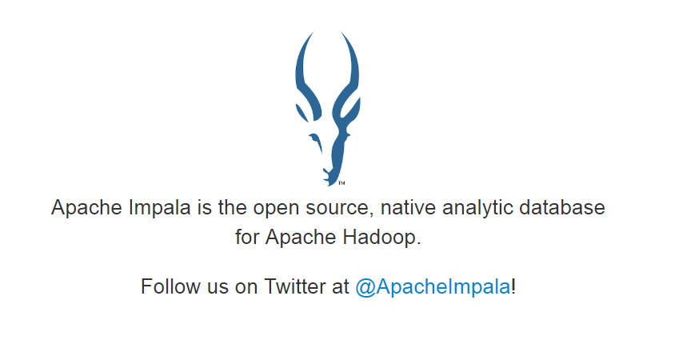

## 2． Impala 与 Hive 关系

impala是基于 hive 的大数据分析查询引擎，直接使用 hive 的元数据库metadata，意味着 impala 元数据都存储在 hive 的 metastore 当中，并且 impala 兼容 hive 的绝大多数 sql 语法。所以需要安装 impala 的话，必须先安装 hive，保证hive 安装成功，并且还需要启动 hive 的 metastore 服务。
Hive 元数据包含用 Hive 创建的 database、table 等元信息。元数据存储在关系型数据库中，如 Derby、MySQL 等。
客户端连接 metastore 服务，metastore 再去连接 MySQL 数据库来存取元数据。有了 metastore 服务，就可以有多个客户端同时连接，而且这些客户端不需要知道 MySQL 数据库的用户名和密码，只需要连接 metastore 服务即可。

```shell
nohup hive --service metastore >> ~/metastore.log 2>&1 &
```

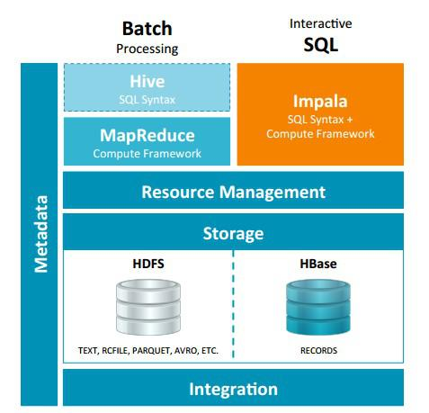

Hive适合于长时间的批处理查询分析，而Impala适合于实时交互式SQL查询。可以先使用hive进行数据转换处理，之后使用Impala在Hive处理后的结果数据集上进行快速的数据分析。

## Impala与Hive异同

Impala 与Hive都是构建在Hadoop之上的数据查询工具各有不同的侧重适应面，但从客户端使用来看Impala与Hive有很多的共同之处，如数据表元数据、ODBC/JDBC驱动、SQL语法、灵活的文件格式、存储资源池等。
但是Impala跟Hive最大的优化区别在于：没有使用 MapReduce进行并行计算，虽然MapReduce是非常好的并行计算框架，但它更多的面向批处理模式，而不是面向交互式的SQL执行。与 MapReduce相比，Impala把整个查询分成一执行计划树，而不是一连串的MapReduce任务，在分发执行计划后，Impala使用拉式获取数据的方式获取结果，把结果数据组成按执行树流式传递汇集，减少的了把中间结果写入磁盘的步骤，再从磁盘读取数据的开销。Impala使用服务的方式避免每次执行查询都需要启动的开销，即相比Hive没了MapReduce启动时间。
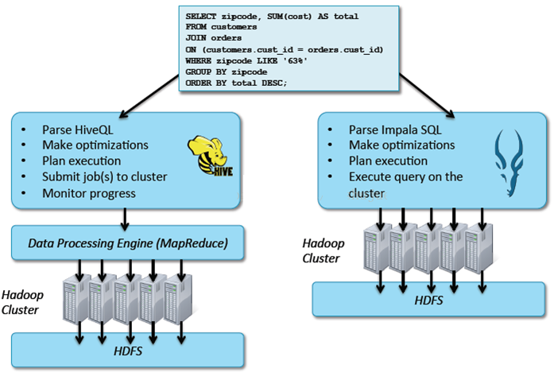

### Impala使用的优化技术

使用LLVM产生运行代码，针对特定查询生成特定代码，同时使用Inline的方式减少函数调用的开销，加快执行效率。(C++特性)
充分利用可用的硬件指令（SSE4.2）。
更好的IO调度，Impala知道数据块所在的磁盘位置能够更好的利用多磁盘的优势，同时Impala支持直接数据块读取和本地代码计算checksum。
通过选择合适数据存储格式可以得到最好性能（Impala支持多种存储格式）。
最大使用内存，中间结果不写磁盘，及时通过网络以stream的方式传递。

### 执行计划

Hive: 依赖于MapReduce执行框架，执行计划分成 map->shuffle->reduce->map->shuffle->reduce...的模型。如果一个Query会 被编译成多轮MapReduce，则会有更多的写中间结果。由于MapReduce执行框架本身的特点，过多的中间过程会增加整个Query的执行时间。
Impala: 把执行计划表现为一棵完整的执行计划树，可以更自然地分发执行计划到各个Impalad执行查询，而不用像Hive那样把它组合成管道型的 map->reduce模式，以此保证Impala有更好的并发性和避免不必要的中间sort与shuffle。

### 数据流

Hive: 采用推的方式，每一个计算节点计算完成后将数据主动推给后续节点。

Impala: 采用拉的方式，后续节点通过getNext主动向前面节点要数据，以此方式数据可以流式的返回给客户端，且只要有1条数据被处理完，就可以立即展现出来，而不用等到全部处理完成，更符合SQL交互式查询使用。

### 内存使用

Hive: 在执行过程中如果内存放不下所有数据，则会使用外存，以保证Query能顺序执行完。每一轮MapReduce结束，中间结果也会写入HDFS中，同样由于MapReduce执行架构的特性，shuffle过程也会有写本地磁盘的操作。

Impala: 在遇到内存放不下数据时，版本1.0.1是直接返回错误，而不会利用外存，以后版本应该会进行改进。这使用得Impala目前处理Query会受到一定的限制，最好还是与Hive配合使用。

### 调度

Hive: 任务调度依赖于Hadoop的调度策略。

Impala: 调度由自己完成，目前只有一种调度器simple-schedule，它会尽量满足数据的局部性，扫描数据的进程尽量靠近数据本身所在的物理机器。调度器 目前还比较简单，在SimpleScheduler::GetBackend中可以看到，现在还没有考虑负载，网络IO状况等因素进行调度。但目前 Impala已经有对执行过程的性能统计分析，应该以后版本会利用这些统计信息进行调度吧。

### 容错

Hive: 依赖于Hadoop的容错能力。
Impala: 在查询过程中，没有容错逻辑，如果在执行过程中发生故障，则直接返回错误（这与Impala的设计有关，因为Impala定位于实时查询，一次查询失败， 再查一次就好了，再查一次的成本很低）。

### 适用面

Hive: 复杂的批处理查询任务，数据转换任务。
Impala：实时数据分析，因为不支持UDF，能处理的问题域有一定的限制，与Hive配合使用,对Hive的结果数据集进行实时分析。

## Impala架构

Impala主要由Impalad、 State Store、Catalogd和CLI组成。


### Impalad

Impalad: 与DataNode运行在同一节点上，由Impalad进程表示，它接收客户端的查询请求（*接收查询请求的Impalad为Coordinator，Coordinator通过JNI调用java前端解释SQL查询语句，生成查询计划树，再通过调度器把执行计划分发给具有相应数据的其它Impalad进行执行*），读写数据，并行执行查询，并把结果通过网络流式的传送回给Coordinator，由Coordinator返回给客户端。同时Impalad也与State Store保持连接，用于确定哪个Impalad是健康和可以接受新的工作。
在Impalad中启动三个ThriftServer: beeswax_server（连接客户端），hs2_server（借用Hive元数据）， be_server（Impalad内部使用）和一个ImpalaServer服务。

### Impala State Store

Impala State Store: 跟踪集群中的Impalad的健康状态及位置信息，由statestored进程表示，它通过创建多个线程来处理Impalad的注册订阅和与各Impalad保持心跳连接，各Impalad都会缓存一份State Store中的信息，当State Store离线后（Impalad发现State Store处于离线时，会进入recovery模式，反复注册，当State Store重新加入集群后，自动恢复正常，更新缓存数据）因为Impalad有State Store的缓存仍然可以工作，但会因为有些Impalad失效了，而已缓存数据无法更新，导致把执行计划分配给了失效的Impalad，导致查询失败。

### CLI

CLI: 提供给用户查询使用的命令行工具（Impala Shell使用python实现），同时Impala还提供了Hue，JDBC， ODBC使用接口。

### Catalogd

Catalogd：作为metadata访问网关，从Hive Metastore等外部catalog中获取元数据信息，放到impala自己的catalog结构中。impalad执行ddl命令时通过catalogd由其代为执行，该更新则由statestored广播。

## Impala查询处理过程

　Impalad分为Java前端与C++处理后端，接受客户端连接的Impalad即作为这次查询的Coordinator，Coordinator通过JNI调用Java前端对用户的查询SQL进行分析生成执行计划树。

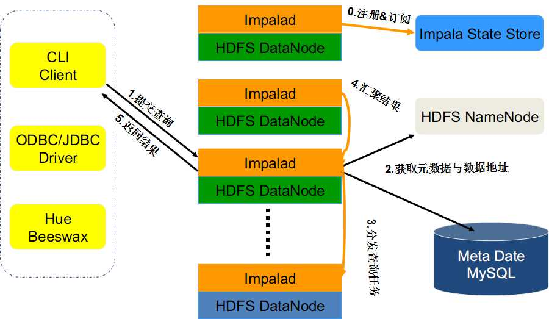
Java前端产生的执行计划树以Thrift数据格式返回给C++后端（Coordinator）（执行计划分为多个阶段，每一个阶段叫做一个PlanFragment，每一个PlanFragment在执行时可以由多个Impalad实例并行执行(有些PlanFragment只能由一个Impalad实例执行,如聚合操作)，整个执行计划为一执行计划树）。
Coordinator根据执行计划，数据存储信息（*Impala通过libhdfs与HDFS进行交互。通过hdfsGetHosts方法获得文件数据块所在节点的位置信息*），通过调度器（现在只有simple-scheduler, 使用round-robin算法）Coordinator::Exec对生成的执行计划树分配给相应的后端执行器Impalad执行（查询会使用LLVM进行代码生成，编译，执行），通过调用GetNext()方法获取计算结果。
如果是insert语句，则将计算结果通过libhdfs写回HDFS当所有输入数据被消耗光，执行结束，之后注销此次查询服务。

## Impala安装部署

## 安装前提

集群提前安装好hadoop，hive。
hive安装包scp在所有需要安装impala的节点上，因为impala需要引用hive的依赖包。
hadoop框架需要支持C程序访问接口，查看下图，如果有该路径下有这么文件，就证明支持C接口。

```shell

[root@node01 ~]# cd /export/servers/hadoop-2.7.5/lib/native/
## 有以下文件，证明支持C接口
[root@node01 native]# ll
total 4652
-rw-r--r-- 1 root root 1313098 May 19 23:33 libhadoop.a
-rw-r--r-- 1 root root 1487276 May 19 23:33 libhadooppipes.a
lrwxrwxrwx 1 root root      18 May 19 23:33 libhadoop.so -> libhadoop.so.1.0.0
-rwxr-xr-x 1 root root  771103 May 19 23:33 libhadoop.so.1.0.0
-rw-r--r-- 1 root root  582056 May 19 23:33 libhadooputils.a
-rw-r--r-- 1 root root  364924 May 19 23:33 libhdfs.a
lrwxrwxrwx 1 root root      16 May 19 23:33 libhdfs.so -> libhdfs.so.0.0.0
-rwxr-xr-x 1 root root  229217 May 19 23:33 libhdfs.so.0.0.0
```

## 下载安装包、依赖包

由于impala没有提供tar包进行安装，只提供了rpm包。因此在安装impala的时候，需要使用rpm包来进行安装。rpm包只有cloudera公司提供了，所以去cloudera公司网站进行下载rpm包即可。
但是另外一个问题，impala的rpm包依赖非常多的其他的rpm包，可以一个个的将依赖找出来，也可以将所有的rpm包下载下来，制作成我们本地yum源来进行安装。这里就选择制作本地的yum源来进行安装。
所以首先需要下载到所有的rpm包，下载地址如下

<http://archive.cloudera.com/cdh5/repo-as-tarball/5.14.0/cdh5.14.0-centos6.tar.gz>
<http://archive.cloudera.com/cdh5/repo-as-tarball/5.14.0/cdh5.14.0-centos7.tar.gz>

## 虚拟机新增磁盘（可选）

由于下载的cdh5.14.0-centos6.tar.gz包非常大，大概5个G，解压之后也最少需要5个G的空间。而我们的虚拟机磁盘有限，可能会不够用了，所以可以为虚拟机挂载一块新的磁盘，专门用于存储的cdh5.14.0-centos6.tar.gz包。
注意事项：新增挂载磁盘需要虚拟机保持在关机状态。
如果磁盘空间有余，那么本步骤可以省略不进行。
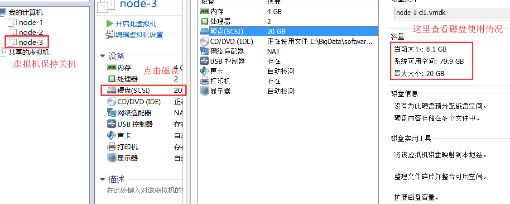

### 关机新增磁盘

虚拟机关机的状态下，在VMware当中新增一块磁盘。
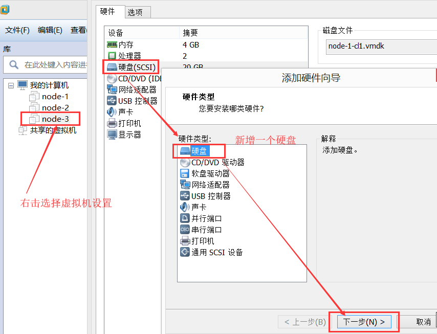
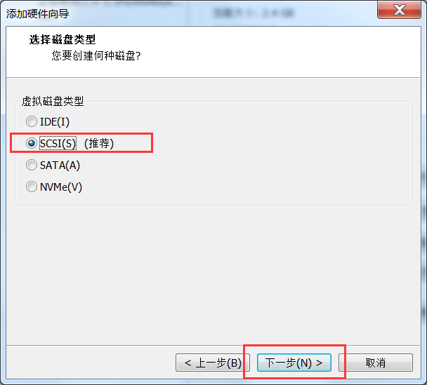
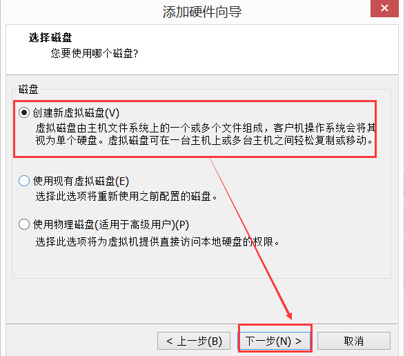
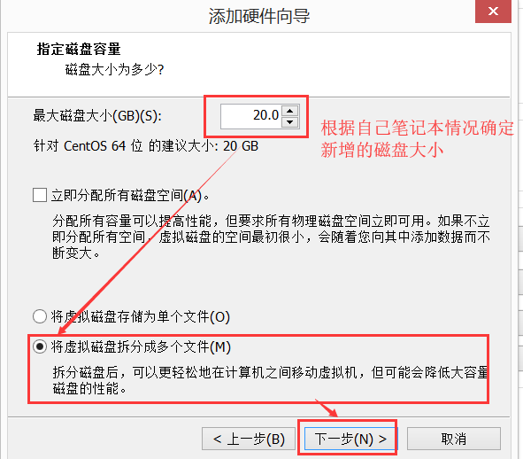
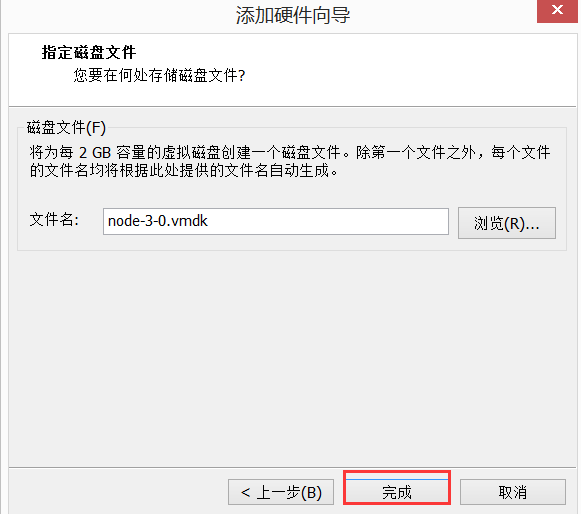

### 开机挂载磁盘

开启虚拟机，对新增的磁盘进行分区，格式化，并且挂载新磁盘到指定目录。
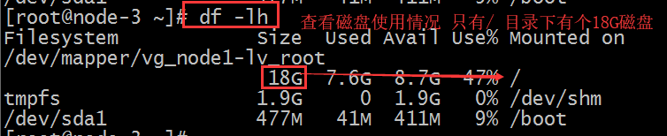
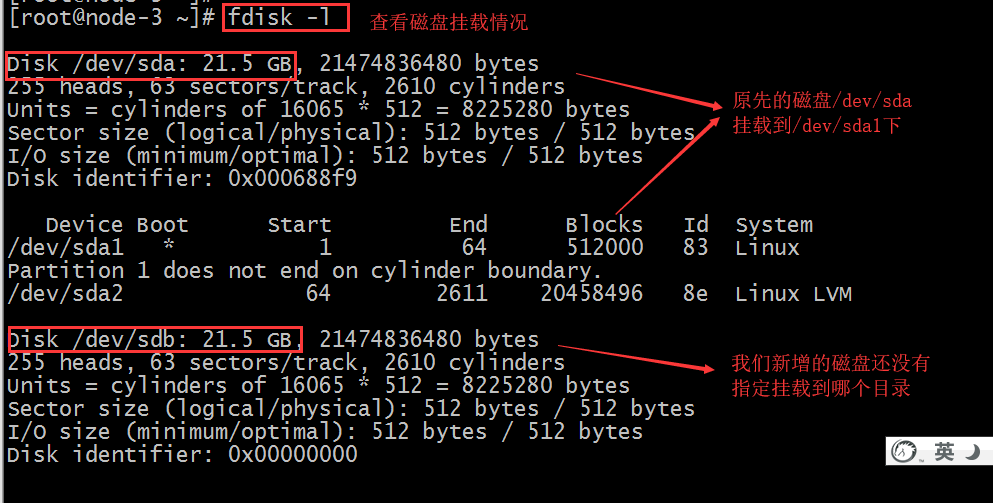
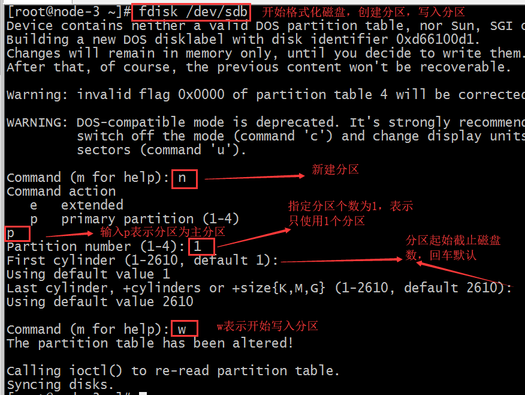
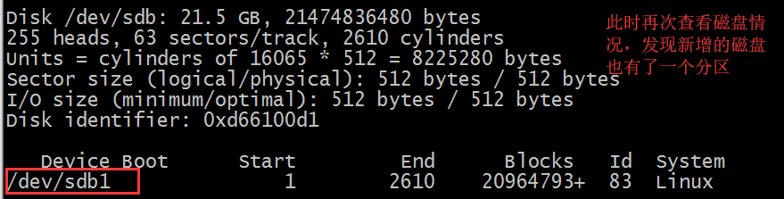

下面对分区进行格式化操作：

```shell
mkfs -t ext4 -c /dev/sdb1
```

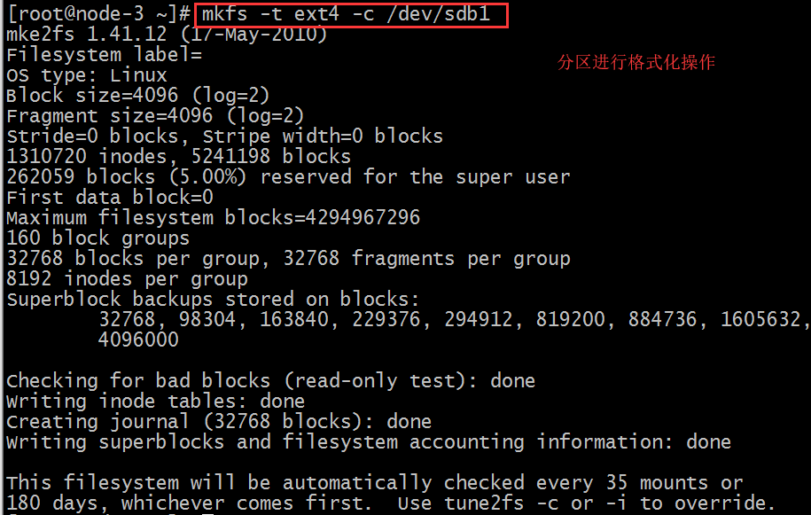

创建挂载目录：

```shell
mount -t ext4 /dev/sdb1 /cloudera_data/
```

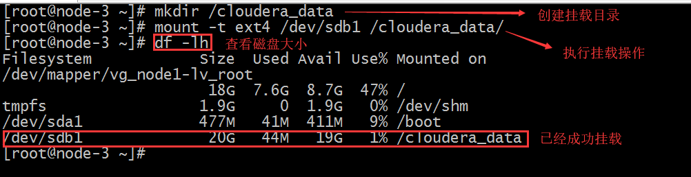
添加至开机自动挂载：

```shell
vim /etc/fstab
/dev/sdb1 /cloudera_data ext4 defaults 0 0
```

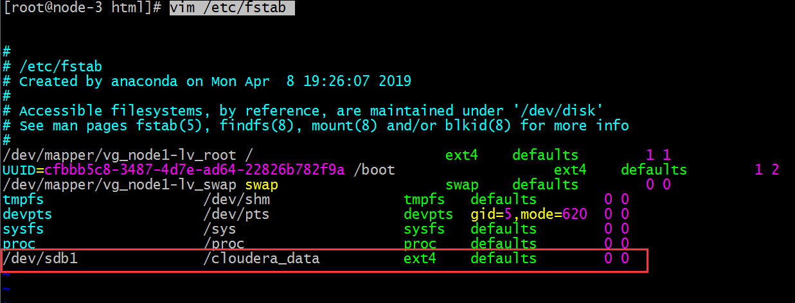

## 配置本地yum源

### 上传安装包解压

使用sftp的方式把安装包大文件上传到服务器/cloudera_data目录下。

```shell
# 新建一个目录用于存yum 源数据
[root@node03 bin]# cd /
[root@node03 /]# mkdir cloudera_data
[root@node03 /]# cd /cloudera_data
## 上传数据包
[root@node03 cloudera_data]# ll
total 5294888
-rw-r--r-- 1 root root 5421961451 Aug 18 21:07 cdh5.14.0-centos6.tar.gz
[root@node03 cloudera_data]# tar -zxvf cdh5.14.0-centos6.tar.gz
### 配置本地yum源信息
#安装Apache Server服务器
[root@node03 cdh]# yum -y install httpd
[root@node03 cdh]# service httpd start
Redirecting to /bin/systemctl start  httpd.service
[root@node03 cdh]# chkconfig httpd on
Note: Forwarding request to 'systemctl enable httpd.service'.
Created symlink from /etc/systemd/system/multi-user.target.wants/httpd.service to /usr/lib/systemd/system/httpd.service.

#配置本地yum源的文件
[root@node03 cdh]# cd /etc/yum.repos.d
[root@node03 yum.repos.d]# vim localimp.repo
[root@node03 yum.repos.d]# cat localimp.repo
[localimp]
name=localimp
baseurl=http://node03/cdh5.14.0/
gpgcheck=0
enabled=1
#创建apache httpd的读取链接
[root@node03 5.14.0]# ln -s /cloudera_data/cdh/5.14.0 /var/www/html/cdh5.14.0
#确保linux的Selinux关闭
#临时关闭：
[root@localhost ~]# getenforce
Enforcing
[root@localhost ~]# setenforce 0
[root@localhost ~]# getenforce
Permissive
#永久关闭：
[root@localhost ~]# vim /etc/sysconfig/selinux |
SELINUX=enforcing 改为 SELINUX=disabled
#重启服务reboot  
```

通过浏览器访问本地yum源，如果出现下述页面则成功。
<http://192.168.34.120/cdh5.14.0/>
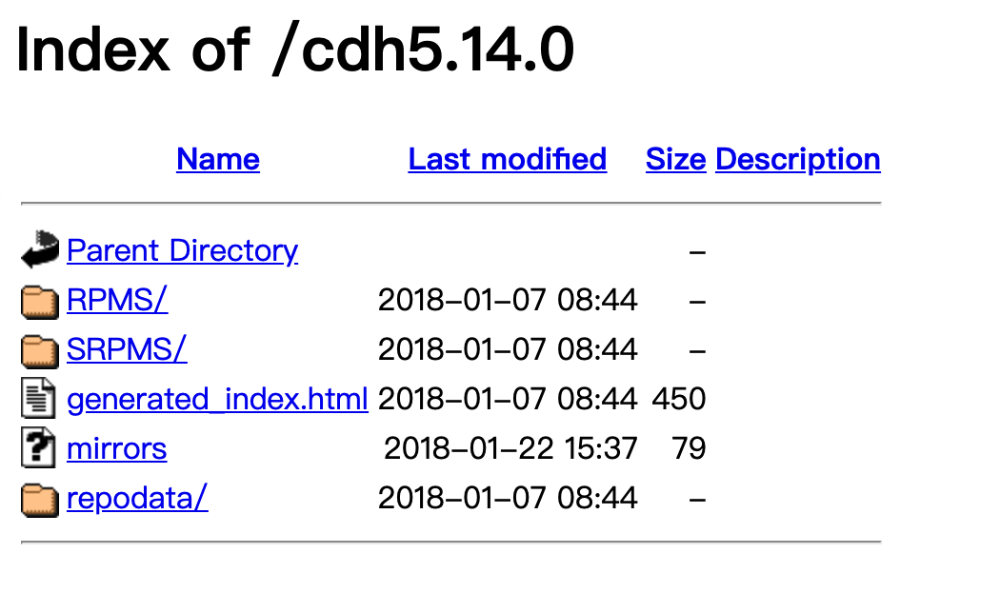

将本地yum源配置文件localimp.repo发放到所有需要安装impala的节点。

```shell
[root@node03 5.14.0]# cd /etc/yum.repos.d/
[root@node03 yum.repos.d]# scp localimp.repo node02:$PWD
localimp.repo                                                                                  100%   79     0.1KB/s   00:00
[root@node03 yum.repos.d]# scp localimp.repo node01:$PWD
localimp.repo
## 检查源是否启用
[root@node03 yum.repos.d]# yum repolist all
localimp                                           localimp                                                       enabled:    153
updates/7/x86_64                                   CentOS-7 - Updates - mirrors.aliyun.com                        enabled:  2,500
repolist: 13,107
```

## 安装Impala

### 集群规划

|  服务名称           |      从节点 |  从节点  | 主节点|
|------------------------ |--------| --------| --------|
|  impala-catalog          |        |         |  node03|
|  impala-state-store      |         |         | node03|
|  impala-server(impalad)  | node01 |  node02 |  Node-3|

### 主节点安装

在规划的主节点node03执行以下命令进行安装：

```shell
[root@node03 /]# yum install -y impala impala-server impala-state-store impala-catalog impala-shell
```

### 从节点安装

在规划的从节点node01、node02执行以下命令进行安装：

```shell
[root@node01 ~]# yum install -y impala-server
[root@node02 ~]# yum install -y impala-server
```

## 修改Hadoop、Hive配置

需要在3台机器整个集群上进行操作，都需要修改。hadoop、hive是否正常服务并且配置好，是决定impala是否启动成功并使用的前提。

### 修改hive配置

可在node01机器上进行配置，然后scp给其他2台机器。

```shell
[root@node03 cloudera_data]# cat /export/servers/apache-hive-2.1.1-bin/conf/hive-site.xml
[root@node03 cloudera_data]# vim /export/servers/apache-hive-2.1.1-bin/conf/hive-site.xml
```

```xml

<?xml version="1.0" encoding="UTF-8" standalone="no"?>
<?xml-stylesheet type="text/xsl" href="configuration.xsl"?>
<configuration>
<property>
      <name>javax.jdo.option.ConnectionUserName</name>
      <value>root</value>
  </property>
  <property>
      <name>javax.jdo.option.ConnectionPassword</name>
      <value>123456</value>
  </property>
  <property>
      <name>javax.jdo.option.ConnectionURL</name>
      <value>jdbc:mysql://node03:3306/hive?createDatabaseIfNotExist=true&amp;useSSL=false</value>
  </property>
  <property>
      <name>javax.jdo.option.ConnectionDriverName</name>
      <value>com.mysql.jdbc.Driver</value>
  </property>
  <property>
      <name>hive.metastore.schema.verification</name>
      <value>false</value>
  </property>
  <property>
    <name>datanucleus.schema.autoCreateAll</name>
    <value>true</value>
 </property>
   <!-- 绑定运行 hiveServer2的主机 host,默认 localhost -->
 <property>
    <name>hive.server2.thrift.bind.host</name>
    <value>node03</value>
   </property>

   <!-- 添加以下代码 -->
     <!-- 指定 hive metastore服务请求的 uri地址 -->
    <property>
       <name>hive.metastore.uris</name>
        <value>thrift://node03:9083</value>
    </property>
     <property>
        <name>hive.metastore.client.socket.timeout</name>
        <value>3600</value>
        </property>
</configuration>
```

 以下是PDF 文档中多出来的两个配置项未添加

```xml
<configuration>  
  <property>  
    <name>hive.cli.print.current.db</name>
    <value>true</value>
  </property>
  <property>  
    <name>hive.cli.print.header</name>
    <value>true</value>  
  </property>

</configuration>
```

将hive安装包cp给其他两个机器。

```shell
[root@node03 cloudera_data]# cd /export/servers/
[root@node03 servers]# scp -r apache-hive-2.1.1-bin/ node02:$PWD
[root@node03 servers]# scp -r apache-hive-2.1.1-bin/ node01:$PWD
```

### 修改hadoop配置

所有节点创建下述文件夹

```shell
# 1节点
[root@node01 native]# mkdir -p /var/run/hdfs-sockets
# 2节点
[root@node02 yum.repos.d]# mkdir -p /var/run/hdfs-sockets
# 3节点
[root@node03 servers]# mkdir -p /var/run/hdfs-sockets
```

修改所有节点的hdfs-site.xml添加以下配置，修改完之后重启hdfs集群生效

```shell
[root@node03 hadoop]# vim /export/servers/hadoop-2.7.5/etc/hadoop/hdfs-site.xml
[root@node03 hadoop]# cat /export/servers/hadoop-2.7.5/etc/hadoop/hdfs-site.xml
```

```xml

<?xml version="1.0" encoding="UTF-8"?>
<?xml-stylesheet type="text/xsl" href="configuration.xsl"?>
<!-- Put site-specific property overrides in this file. -->
<configuration>
     <property>
            <name>dfs.namenode.secondary.http-address</name>
            <value>node01:50090</value>
    </property>
    <property>
        <name>dfs.namenode.http-address</name>
        <value>node01:50070</value>
    </property>
    <property>
        <name>dfs.namenode.name.dir</name>
        <value>file:///export/servers/hadoop-2.7.5/hadoopDatas/namenodeDatas,file:///export/servers/hadoop-2.7.5/hadoopDatas/namenodeDatas2</value>
    </property>
    <!--  定义dataNode数据存储的节点位置，实际工作中，一般先确定磁盘的挂载目录，然后多个目录用，进行分割  -->
    <property>
        <name>dfs.datanode.data.dir</name>
        <value>file:///export/servers/hadoop-2.7.5/hadoopDatas/datanodeDatas,file:///export/servers/hadoop-2.7.5/hadoopDatas/datanodeDatas2</value>
    </property>
    <property>
        <name>dfs.namenode.edits.dir</name>
        <value>file:///export/servers/hadoop-2.7.5/hadoopDatas/nn/edits</value>
    </property>
    <property>
        <name>dfs.namenode.checkpoint.dir</name>
        <value>file:///export/servers/hadoop-2.7.5/hadoopDatas/snn/name</value>
    </property>
    <property>
        <name>dfs.namenode.checkpoint.edits.dir</name>
        <value>file:///export/servers/hadoop-2.7.5/hadoopDatas/dfs/snn/edits</value>
    </property>
    <property>
        <name>dfs.replication</name>
        <value>3</value>
    </property>
    <property>
        <name>dfs.permissions</name>
        <value>false</value>
    </property>
    <property>
        <name>dfs.blocksize</name>
        <value>134217728</value>
    </property>
    <property>
         <name>dfs.webhdfs.enabled</name>
         <value>true</value>
    </property>
</configuration>
```

添加以下内容

```xml
 <property>
  <name>dfs.client.read.shortcircuit</name>
  <value>true</value>
 </property>
 <property>
  <name>dfs.domain.socket.path</name>
  <value>/var/run/hdfs-sockets/dn</value>
 </property>
 <property>
  <name>dfs.client.file-block-storage-
locations.timeout.millis</name>
  <value>10000</value>
 </property>
 <property>
  <name>dfs.datanode.hdfs-blocks-
metadata.enabled</name>
  <value>true</value>
 </property>
```

dfs.client.read.shortcircuit 打开DFSClient本地读取数据的控制，
dfs.domain.socket.path是Datanode和DFSClient之间沟通的Socket的本地路径。

把更新hadoop的配置文件，scp给其他机器。

```shell
[root@node03 hadoop]# cd /export/servers/hadoop-2.7.5/etc/hadoop
[root@node03 hadoop]# scp -r hdfs-site.xml node02:$PWD
hdfs-site.xml                                                                                  100% 2907     2.8KB/s   00:00
[root@node03 hadoop]# scp -r hdfs-site.xml node03:$PWD
hdfs-site.xml
```

注意：root用户不需要下面操作，普通用户需要这一步操作。
给这个文件夹赋予权限，如果用的是普通用户hadoop，那就直接赋予普通用户的权限，例如：

```shell
chown -R hadoop:hadoop /var/run/hdfs-sockets/
```

因为这里直接用的root用户，所以不需要赋权限了。

### 重启hadoop、hive

重启hive
在node03上执行下述命令分别启动hive metastore服务

```shell
# 先结束掉所有的hive 进程
[root@node03 apache-hive-2.1.1-bin]# ps -ef |grep hive
[root@node03 hadoop]# cd /export/servers/apache-hive-2.1.1-bin/
[root@node03 apache-hive-2.1.1-bin]# nohup bin/hive --service metastore &
[root@node03 apache-hive-2.1.1-bin]# nohup bin/hive --service hiveserver2 &
cd /export/servers/hadoop-2.7.5/
sbin/stop-dfs.sh | sbin/start-dfs.sh
#注意：一定要保证mysql的服务正常启动，否则metastore的服务不能够启动
```

重启hdfs
重启hdfs文件系统
node01服务器上面执行以下命令

```shell
[root@node01 hadoop-2.7.5]# cd /export/servers/hadoop-2.7.5
[root@node01 hadoop-2.7.5]# sbin/stop-dfs.sh
Stopping namenodes on [node01]
node01: stopping namenode
node01: stopping datanode
node02: stopping datanode
node03: stopping datanode
Stopping secondary namenodes [node01]
node01: stopping secondarynamenode
[root@node01 hadoop-2.7.5]# sbin/start-dfs.sh
Starting namenodes on [node01]
node01: starting namenode, logging to /export/servers/hadoop-2.7.5/logs/hadoop-root-namenode-node01.out
node02: starting datanode, logging to /export/servers/hadoop-2.7.5/logs/hadoop-root-datanode-node02.out
node03: starting datanode, logging to /export/servers/hadoop-2.7.5/logs/hadoop-root-datanode-node03.out
node01: starting datanode, logging to /export/servers/hadoop-2.7.5/logs/hadoop-root-datanode-node01.out
Starting secondary namenodes [node01]
node01: starting secondarynamenode, logging to /export/servers/hadoop-2.7.5/logs/hadoop-root-secondarynamenode-node01.out
```

### 复制hadoop、hive配置文件

impala的配置目录为/etc/impala/conf，这个路径下面需要把core-site.xml，hdfs-site.xml以及hive-site.xml。

所有节点执行以下命令

```shell
# 1节点
[root@node01 conf]# cp -r /export/servers/hadoop-2.7.5/etc/hadoop/core-site.xml /etc/impala/conf/core-site.xml
[root@node01 conf]# cp -r /export/servers/hadoop-2.7.5/etc/hadoop/hdfs-site.xml /etc/impala/conf/hdfs-site.xml
[root@node01 servers]# cp -r /export/servers/apache-hive-2.1.1-bin/conf/hive-site.xml /etc/impala/conf/hive-site.xml
# 2节点
[root@node02 /]# cp -r /export/servers/hadoop-2.7.5/etc/hadoop/core-site.xml /etc/impala/conf/core-site.xml
[root@node02 /]# cp -r /export/servers/hadoop-2.7.5/etc/hadoop/hdfs-site.xml /etc/impala/conf/hdfs-site.xml
[root@node02 /]# cp -r /export/servers/apache-hive-2.1.1-bin/conf/hive-site.xml /etc/impala/conf/hive-site.xml
# 3节点
[root@node03 servers]# cp -r /export/servers/hadoop-2.7.5/etc/hadoop/core-site.xml /etc/impala/conf/core-site.xml
[root@node03 servers]# cp -r /export/servers/hadoop-2.7.5/etc/hadoop/hdfs-site.xml /etc/impala/conf/hdfs-site.xml
[root@node03 servers]# cp -r /export/servers/apache-hive-2.1.1-bin/conf/hive-site.xml /etc/impala/conf/hive-site.xml

```

## 修改impala配置

### 修改impala默认配置

所有节点更改impala默认配置文件

```shell
[root@node01 lib]# vim /etc/default/impala
[root@node02 /]# vim /etc/default/impala
[root@node03 default]# vim /etc/default/impala
IMPALA_CATALOG_SERVICE_HOST=node03
IMPALA_STATE_STORE_HOST=node03
```

### 添加mysql驱动

通过配置/etc/default/impala中可以发现已经指定了mysql驱动的位置名字。
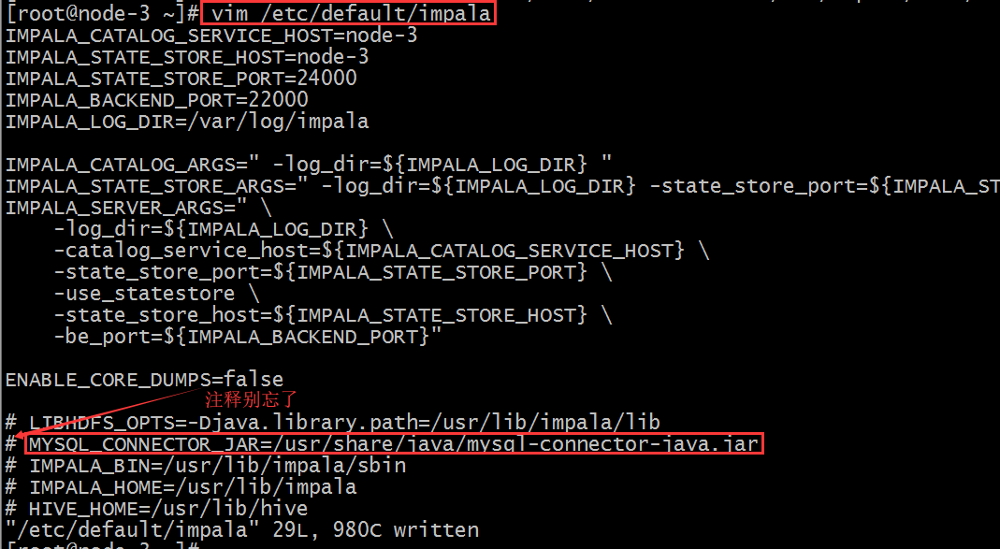
使用软链接指向该路径即可（3台机器都需要执行）

```shell
# 1节点
[root@node01 lib]# ln -s /export/servers/apache-hive-2.1.1-bin/lib/mysql-connector-java-5.1.38.jar /usr/share/java/mysql-connector-java.jar
# 2节点
[root@node02 /]# ln -s /export/servers/apache-hive-2.1.1-bin/lib/mysql-connector-java-5.1.38.jar /usr/share/java/mysql-connector-java.jar
# 3节点
[root@node03 default]# ln -s /export/servers/apache-hive-2.1.1-bin/lib/mysql-connector-java-5.1.38.jar /usr/share/java/mysql-connector-java.jar
```

### 修改bigtop配置

修改bigtop的java_home路径（3台机器）

```shell
[root@node03 java]# which java
/export/servers/jdk1.8.0_141/bin/java
#3台机器
[root@node01 lib]# vim /etc/default/bigtop-utils
[root@node02 /]# vim /etc/default/bigtop-utils
[root@node03 java]# vim /etc/default/bigtop-utils
export JAVA_HOME=/export/servers/jdk1.8.0_141

```

## 启动、关闭impala服务

主节点node03启动以下三个服务进程

```shell
[root@node03 java]# service impala-state-store start
Started Impala State Store Server (statestored):           [  OK  ]
[root@node03 java]# service impala-catalog start
Started Impala Catalog Server (catalogd) :                 [  OK  ]
[root@node03 java]# service impala-server start
Started Impala Server (impalad):                           [  OK  ]
[root@node03 java]# ps -ef |grep impal
impala   109099      1  0 19:48 ?        00:00:00 /usr/lib/impala/sbin/statestored -log_dir=/var/log/impala -state_store_port=24000
impala   109174      1  8 19:48 ?        00:00:03 /usr/lib/impala/sbin/catalogd -log_dir=/var/log/impala
impala   109279      1 11 19:48 ?        00:00:03 /usr/lib/impala/sbin/impalad -log_dir=/var/log/impala -catalog_service_host=node03 -state_store_port=24000 -use_statestore -state_store_host=node03 -be_port=22000
root     109445 104159  0 19:49 pts/2    00:00:00 grep --color=auto impal
```

从节点启动node01与node02启动impala-server

```shell
# 1节点
[root@node01 lib]# service impala-server start
Started Impala Server (impalad):                           [  OK  ]
#查看impala进程是否存在

[root@node01 lib]# ps -ef | grep impala
impala     3049      1  0 19:49 ?        00:00:05 /usr/lib/impala/sbin/impalad -log_dir=/var/log/impala -catalog_service_host=node03 -state_store_port=24000 -use_statestore -state_store_host=node03 -be_port=22000
root       3411 109819  0 19:58 pts/1    00:00:00 grep --color=auto impala
# 2节点
[root@node02 /]# service impala-server start
Started Impala Server (impalad):                           [  OK  ]
[root@node02 impala]# ps -ef | grep impala
impala    92274      1 27 19:56 ?        00:00:03 /usr/lib/impala/sbin/impalad -log_dir=/var/log/impala -catalog_service_host=node03 -state_store_port=24000 -use_statestore -state_store_host=node03 -be_port=22000
```

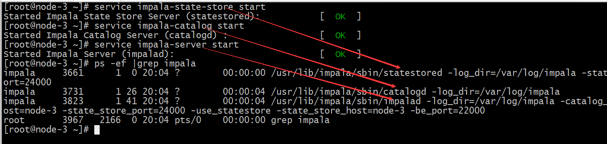

启动之后所有关于impala的日志默认都在/var/log/impala
如果需要关闭impala服务 把命令中的start该成stop即可。注意如果关闭之后进程依然驻留，可以采取下述方式删除。正常情况下是随着关闭消失的。
解决方式：

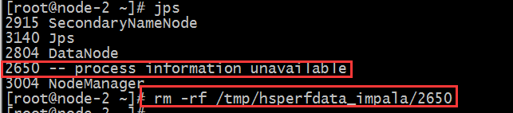

### impala web ui

访问impalad的管理界面<http://node03:25000/>
访问statestored的管理界面<http://node03:25010/>

## Impala-shell命令参数

## impala-shell外部命令

所谓的外部命令指的是不需要进入到impala-shell交互命令行当中即可执行的命令参数。impala-shell后面执行的时候可以带很多参数。你可以在启动 impala-shell 时设置，用于修改命令执行环境。
impala-shell --h可以帮助我们查看帮助手册。也可以参考课程附件资料。
比如几个常见的：
impala-shell --r刷新impala元数据，与建立连接后执行 REFRESH 语句效果相同
impala-shell --f 文件路径 执行指的的sql查询文件。
impala-shell --i指定连接运行 impalad 守护进程的主机。默认端口是 21000。你可以连接到集群中运行 impalad 的任意主机。
impala-shell --o保存执行结果到文件当中去。
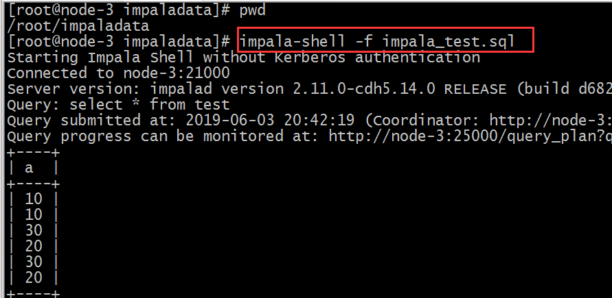

## impala-shell内部命令

所谓内部命令是指，进入impala-shell命令行之后可以执行的语法。

```shell
[node03.hadoop.com:21000] > help;

Documented commands (type help <topic>):
========================================
compute   exit     history  rerun   shell  unset   version
connect   explain  profile  select  show   use     with
describe  help     quit     set     tip    values

Undocumented commands:
======================
alter   delete  drop    load    src      update
create  desc    insert  source  summary  upsert
```

connect hostname 连接到指定的机器impalad上去执行。

```shell
[node03.hadoop.com:21000] > connect node02;
Connected to node02:21000
Server version: impalad version 2.11.0-cdh5.14.0 RELEASE (build d68206561bce6b26762d62c01a78e6cd27aa7690)
[node02:21000] > select * from test.emp_add_sp;
Query: select * from test.emp_add_sp
Query submitted at: 2019-08-21 20:13:06 (Coordinator: http://node02:25000)## 可以看出是在node02节点上
Query progress can be monitored at: http://node02:25000/query_plan?query_id=fc45fdd14c2e73df:f311d2bb00000000
+------+------+----------+---------+
| id   | hno  | street   | city    |
+------+------+----------+---------+
| 1201 | 288A | vgiri    | jublee  |
| 1202 | 108I | aoc      | sec-bad |
| 1203 | 144Z | pgutta   | hyd     |
| 1204 | 78B  | old city | sec-bad |
| 1205 | 720X | hitec    | sec-bad |
+------+------+----------+---------+
Fetched 5 row(s) in 0.39s
```

refresh dbname.tablename增量刷新，刷新某一张表的元数据，主要用于刷新hive当中数据表里面的数据改变的情况。

```shell
[node02:21000] > refresh test.emp_add_sp;
Query: refresh test.emp_add_sp
Query submitted at: 2019-08-21 20:18:23 (Coordinator: http://node02:25000)
Query progress can be monitored at: http://node02:25000/query_plan?query_id=5b47d8cbd8e5716d:5bc687fa00000000
Fetched 0 row(s) in 0.15s
```

invalidate metadata全量刷新，性能消耗较大，主要用于hive当中新建数据库或者数据库表的时候来进行刷新。
quit/exit命令 从Impala shell中弹出
explain 命令 用于查看sql语句的执行计划。

```shell

[node02:21000] > explain select * from test.emp_add_sp;
Query: explain select * from test.emp_add_sp
+------------------------------------------------------------------------------------+
| Explain String                                                                     |
+------------------------------------------------------------------------------------+
| Max Per-Host Resource Reservation: Memory=0B                                       |
| Per-Host Resource Estimates: Memory=16.00MB                                        |
| WARNING: The following tables have potentially corrupt table statistics.           |
| Drop and re-compute statistics to resolve this problem.                            |
| test.emp_add_sp                                                                    |
| WARNING: The following tables are missing relevant table and/or column statistics. |
| test.emp_add_sp                                                                    |
|                                                                                    |
| PLAN-ROOT SINK                                                                     |
| |                                                                                  |
| 01:EXCHANGE [UNPARTITIONED]                                                        |
| |                                                                                  |
| 00:SCAN HDFS [test.emp_add_sp]                                                     |
|    partitions=1/1 files=1 size=116B                                                |
+------------------------------------------------------------------------------------+
Fetched 14 row(s) in 0.04s
```

explain的值可以设置成0,1,2,3等几个值，其中3级别是最高的，可以打印出最全的信息
set explain_level=3;
profile命令执行sql语句之后执行，可以
打印出更加详细的执行步骤，主要用于查询结果的查看，集群的调优等。

```shell
[node02:21000] > profile;
Query Runtime Profile:
Query (id=794eb170cb8f13ce:527707a000000000):
  Summary:
    Session ID: fa4d4a55c8624ffb:b35ed45936ed7db4
    Session Type: BEESWAX
    Start Time: 2019-08-21 20:21:12.797952000
    End Time: 2019-08-21 20:21:12.834513000
    Query Type: EXPLAIN
    Query State: FINISHED
    Query Status: OK
    Impala Version: impalad version 2.11.0-cdh5.14.0 RELEASE (build d68206561bce6b26762d62c01a78e6cd27aa7690)
    User: root
    Connected User: root
    Delegated User:
    Network Address: ::ffff:192.168.34.120:57224
    Default Db: test
    Sql Statement: explain select * from test.emp_add_sp
    Coordinator: node02:22000
    Query Options (set by configuration):
    Query Options (set by configuration and planner): MT_DOP=0
    : 0.000ns
    Query Timeline: 36.868ms
       - Query submitted: 54.659us (54.659us)
       - Planning finished: 27.637ms (27.582ms)
       - Rows available: 28.852ms (1.214ms)
       - First row fetched: 32.206ms (3.354ms)
       - Unregister query: 36.578ms (4.372ms)
  ImpalaServer:
     - ClientFetchWaitTimer: 7.667ms
     - RowMaterializationTimer: 0.000ns
```

注意:如果在hive窗口中插入数据或者新建的数据库或者数据库表，那么在impala当中是不可直接查询，需要执行invalidate metadata以通知元数据的更新；
在impala-shell当中插入的数据，在impala当中是可以直接查询到的，不需要刷新数据库，其中使用的就是catalog这个服务的功能实现的，catalog是impala1.2版本之后增加的模块功能，主要作用就是同步impala之间的元数据。
更新操作通知Catalog，Catalog通过广播的方式通知其它的Impalad进程。默认情况下Catalog是异步加载元数据的，因此查询可能需要等待元数据加载完成之后才能进行（第一次加载）。

## Impala sql语法

## 数据库特定语句

### 创建数据库

CREATE DATABASE语句用于在Impala中创建新数据库。

```shell
CREATE DATABASE IF NOT EXISTS database_name;
```

这里，IF NOT EXISTS是一个可选的子句。如果我们使用此子句，则只有在没有具有相同名称的现有数据库时，才会创建具有给定名称的数据库。
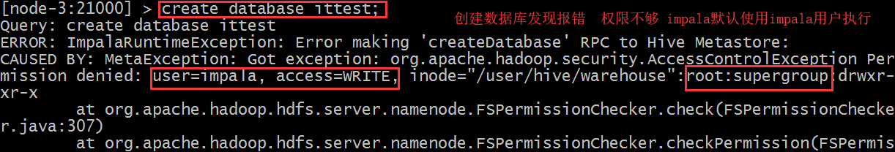
impala默认使用impala用户执行操作，会报权限不足问题，解决办法：
一：给HDFS指定文件夹授予权限

```shell
hadoop fs -chmod -R 777 hdfs://node01:9000/user/hive
```

二：haoop 配置文件中hdfs-site.xml 中设置权限为false

上述两种方式都可以。
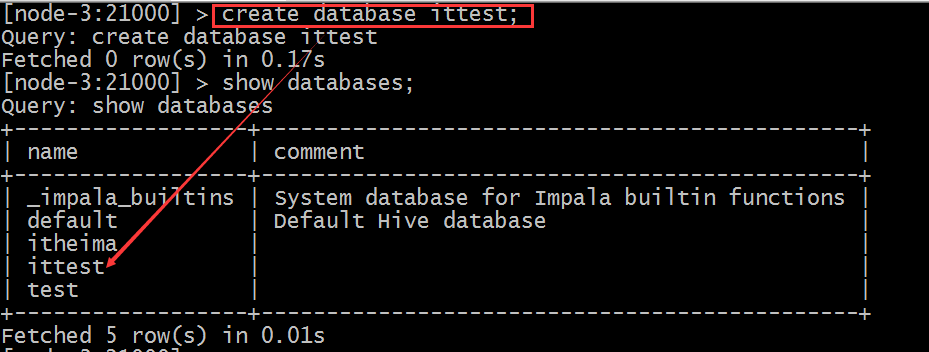
默认就会在hive的数仓路径下创建新的数据库名文件夹

```shell
/user/hive/warehouse/ittest.db
```

也可以在创建数据库的时候指定hdfs路径。需要注意该路径的权限。

```shell
hadoop fs -mkdir -p /input/impala
hadoop fs -chmod -R 777 /input/impala
  create external table t3(id int ,name string ,age int ) row format delimited fields terminated by 't' location '/input/impala/external';
```

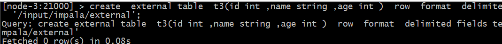

### 删除数据库

Impala的DROP DATABASE语句用于从Impala中删除数据库。 在删除数据库之前，建议从中删除所有表。
如果使用级联删除，Impala会在删除指定数据库中的表之前删除它。

```shell
DROP database sample cascade;
```

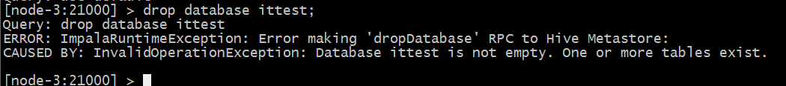


## 表特定语句

### create table语句

CREATE TABLE语句用于在Impala中的所需数据库中创建新表。 需要指定表名字并定义其列和每列的数据类型。

impala支持的数据类型和hive类似，除了sql类型外，还支持java类型。

```sql
create table IF NOT EXISTS database_name.table_name (
   column1 data_type,
   column2 data_type,
   column3 data_type,
   ………
   columnN data_type
);
CREATE TABLE IF NOT EXISTS my_db.student(name STRING, age INT, contact INT );
```

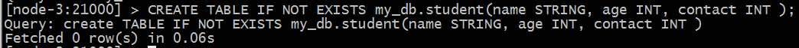
默认建表的数据存储路径跟hive一致。也可以在建表的时候通过location指定具体路径，需要注意hdfs权限问题。


### insert语句

Impala的INSERT语句有两个子句: into和overwrite。into用于插入新记录数据，overwrite用于覆盖已有的记录。

```sql
insert into table_name (column1, column2, column3,...columnN)
values (value1, value2, value3,...valueN);
Insert into table_name values (value1, value2, value2);
```

这里，column1，column2，... columnN是要插入数据的表中的列的名称。还可以添加值而不指定列名，但是，需要确保值的顺序与表中的列的顺序相同。
举个例子：

```sql
create table employee (Id INT, name STRING, age INT,address STRING, salary BIGINT);
insert into employee VALUES (1, 'Ramesh', 32, 'Ahmedabad', 20000 );
insert into employee values (2, 'Khilan', 25, 'Delhi', 15000 );
Insert into employee values (3, 'kaushik', 23, 'Kota', 30000 );
Insert into employee values (4, 'Chaitali', 25, 'Mumbai', 35000 );
Insert into employee values (5, 'Hardik', 27, 'Bhopal', 40000 );
Insert into employee values (6, 'Komal', 22, 'MP', 32000 );
```

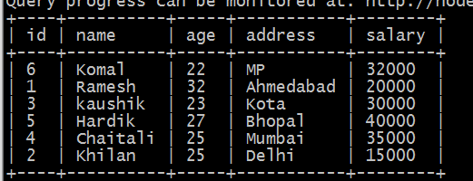
overwrite覆盖子句覆盖表当中全部记录。 覆盖的记录将从表中永久删除。

```shell
Insert overwrite employee values (1, 'Ram', 26, 'Vishakhapatnam', 37000 );
```

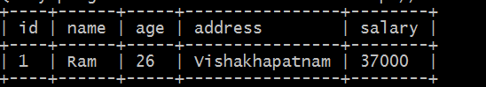

### select语句

Impala SELECT语句用于从数据库中的一个或多个表中提取数据。 此查询以表的形式返回数据。
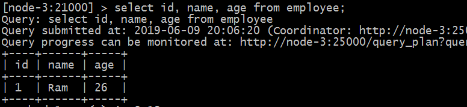

### describe语句

Impala中的describe语句用于提供表的描述。 此语句的结果包含有关表的信息，例如列名称及其数据类型。
Describe table_name;
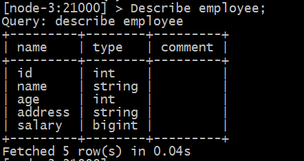
此外，还可以使用hive的查询表元数据信息语句。

```shell
desc formatted table_name;
```

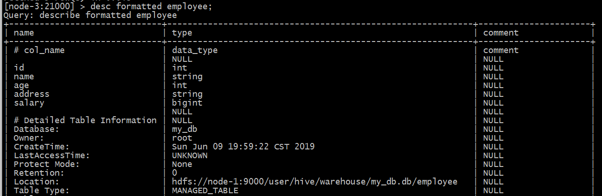

### alter table

Impala中的Alter table语句用于对给定表执行更改。使用此语句，我们可以添加，删除或修改现有表中的列，也可以重命名它们。
表重命名：

```shell
ALTER TABLE [old_db_name.]old_table_name RENAME TO
[new_db_name.]new_table_name
```

向表中添加列：

```shell
ALTER TABLE name ADD COLUMNS (col_spec[, col_spec ...])
```

从表中删除列：

```shell
ALTER TABLE name DROP [COLUMN] column_name
```

更改列的名称和类型：

```shell
ALTER TABLE name CHANGE column_name new_name new_type
```

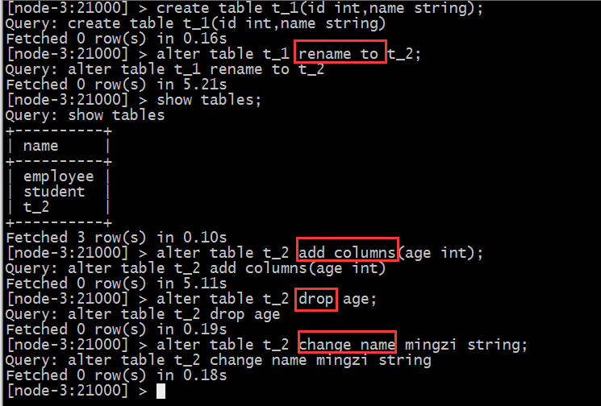

### delete、truncate table

Impala drop table语句用于删除Impala中的现有表。此语句还会删除内部表的底层HDFS文件。
注意：使用此命令时必须小心，因为删除表后，表中可用的所有信息也将永远丢失。

```shell
DROP table database_name.table_name;
```


Impala的Truncate Table语句用于从现有表中删除所有记录。保留表结构。
您也可以使用DROP TABLE命令删除一个完整的表，但它会从数据库中删除完整的表结构，如果您希望存储一些数据，您将需要重新创建此表。

```shell
truncate table_name;
```

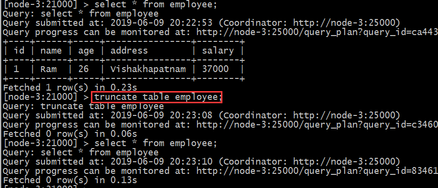

### view视图

视图仅仅是存储在数据库中具有关联名称的Impala查询语言的语句。 它是以预定义的SQL查询形式的表的组合。
视图可以包含表的所有行或选定的行。

```shell
Create View IF NOT EXISTS view_name as Select statement
```

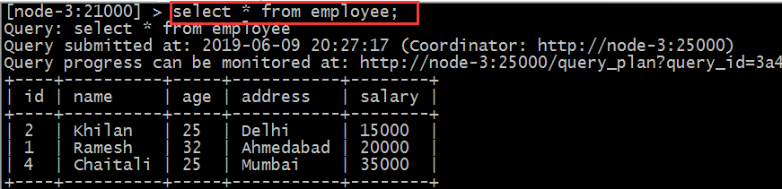

创建视图view、查询视图view

```shell
CREATE VIEW IF NOT EXISTS employee_view AS select name, age from employee;
```

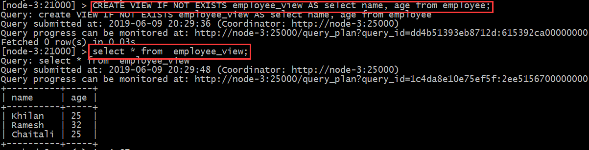
修改视图

```shell
ALTER VIEW database_name.view_name为Select语句
```

删除视图

```shell
DROP VIEW database_name.view_name;
```


### order by子句

Impala ORDER BY子句用于根据一个或多个列以升序或降序对数据进行排序。 默认情况下，一些数据库按升序对查询结果进行排序。

```shell
select * from table_name ORDER BY col_name
[ASC|DESC] [NULLS FIRST|NULLS LAST]
```

可以使用关键字ASC或DESC分别按升序或降序排列表中的数据。
如果我们使用NULLS FIRST，表中的所有空值都排列在顶行; 如果我们使用NULLS LAST，包含空值的行将最后排列。
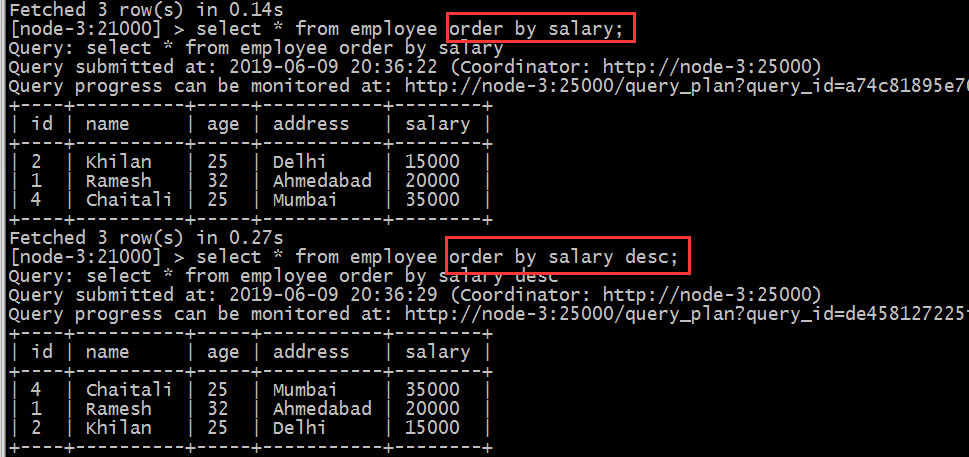

### group by子句

Impala GROUP BY子句与SELECT语句协作使用，以将相同的数据排列到组中。

```shell
select data from table_name Group BY col_name;
```

### having子句

Impala中的Having子句允许您指定过滤哪些组结果显示在最终结果中的条件。
一般来说，Having子句与group by子句一起使用; 它将条件放置在由GROUP BY子句创建的组上。

### limit、offset

Impala中的limit子句用于将结果集的行数限制为所需的数，即查询的结果集不包含超过指定限制的记录。
一般来说，select查询的resultset中的行从0开始。使用offset子句，我们可以决定从哪里考虑输出。
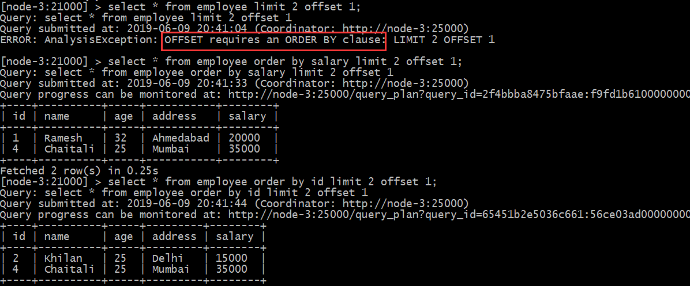

### with子句

如果查询太复杂，我们可以为复杂部分定义别名，并使用Impala的with子句将它们包含在查询中。

```shell
with x as (select 1), y as (select 2) (select * from x union y);
```

例如：使用with子句显示年龄大于25的员工和客户的记录。

```shell
with t1 as (select * from customers where age>25),
t2 as (select * from employee where age>25)
(select * from t1 union select * from t2);
```

### distinct

Impala中的distinct运算符用于通过删除重复值来获取唯一值。

```shell
select distinct columns... from table_name;
```

## Impala数据导入方式

## load data

首先创建一个表：

```shell
create table user(id int ,name string,age int ) row format delimited fields terminated by "t";
```

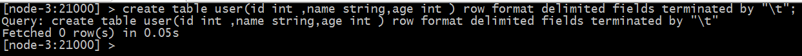
准备数据user.txt并上传到hdfs的 /user/impala路径下去
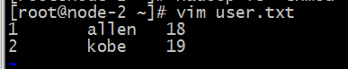

加载数据

```shell
load data inpath '/user/impala/' into table user;
```

查询加载的数据

```shell
select * from user;
```

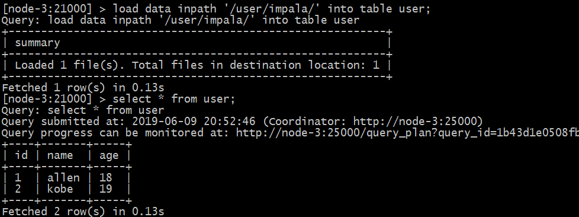

如果查询不不到数据，那么需要刷新一遍数据表。

```shell
refresh user;
```

## insert into values

这种方式非常类似于RDBMS的数据插入方式。

```shell
create table t_test2(id int,name string);
insert into table t_test2 values(1,"zhangsan");
```

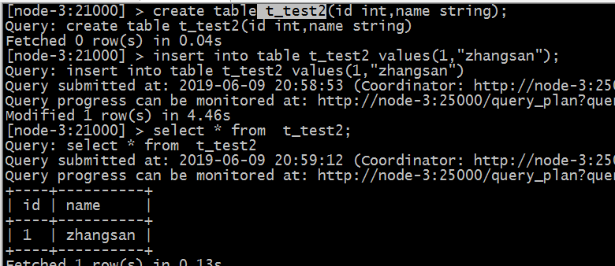

## insert into select

插入一张表的数据来自于后面的select查询语句返回的结果。
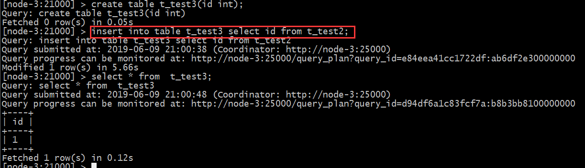

## create as select

建表的字段个数、类型、数据来自于后续的select查询语句。
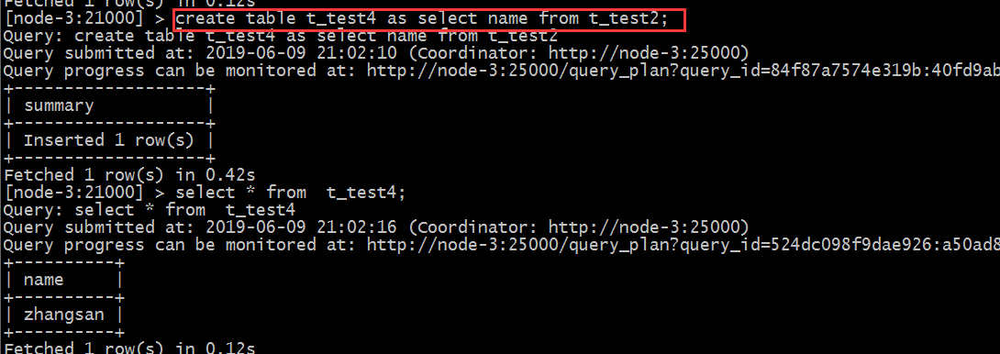

## Impala的java开发

在实际工作当中，因为impala的查询比较快，所以可能有会使用到impala来做数据库查询的情况，可以通过java代码来进行操作impala的查询。

## 下载impala jdbc依赖

下载路径：
<https://www.cloudera.com/downloads/connectors/impala/jdbc/2-5-28.html>
因为cloudera属于商业公司性质，其提供的jar并不会出现在开源的maven仓库中，如果在企业中需要使用，请添加到企业maven私服。

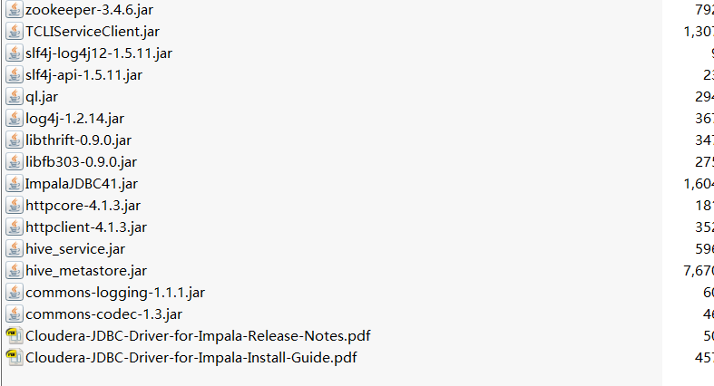

## 创建java工程

创建普通java工程，把依赖添加工程。
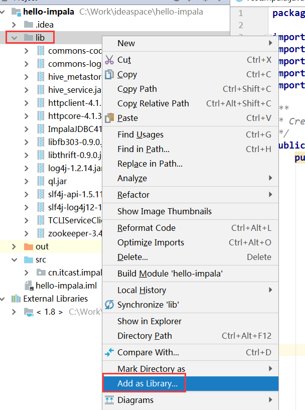

## java api

```java
public static void test(){
        Connection con = null;
        ResultSet rs = null;
        PreparedStatement ps = null;
        String JDBC_DRIVER = "com.cloudera.impala.jdbc41.Driver";
        String CONNECTION_URL = "jdbc:impala://node03:21050";
        try
        {
            Class.forName(JDBC_DRIVER);
            con = (Connection) DriverManager.getConnection(CONNECTION_URL);
            ps = con.prepareStatement("select * from my_db.employee;");
            rs = ps.executeQuery();
            while (rs.next())
            {
                System.out.println(rs.getString(1));
                System.out.println(rs.getString(2));
                System.out.println(rs.getString(3));
            }
        } catch (Exception e)
        {
           e.printStackTrace();
        } finally
        {
            try {
                rs.close();
                ps.close();
                con.close();
            } catch (SQLException e) {
                e.printStackTrace();
            }
        }
    }
    public static void main(String[] args) {
        test();
    }
```

## Apache Impala笔记

- impla是个实时的sql查询工具，类似于hive的操作方式，只不过执行的效率极高，号称当下大数据生态圈中执行效率最高的sql类软件
- impala来自于cloudera，后来贡献给了apache
- impala工作底层执行依赖于hive  与hive共用一套元数据存储。在使用impala的时候，必须保证hive服务是正常可靠的，至少metastore开启。
- impala最大的跟hive的不同在于 不在把sql编译成mr程序执行 编译成执行~~计划数~~（勘误：计划树）。
- impala的sql语法几乎兼容hive的sql语句。
impala是一个适用于实时交互查询的sql软件 hive适合于批处理查询的sql软件。通常是两个互相配合。

- impala  可以集群部署
- Impalad(impala server):可以部署多个不同机器上，通常与datanode部署在同一个节点 方便数据本地计算，负责具体执行本次查询sql的impalad称之为Coordinator。每个impala server都可以对外提供服务。
- impala state store:主要是保存impalad的状态信息 监视其健康状态
- impala catalogd :metastore维护的网关 负责跟hive 的metastore进行交互  同步hive的元数据到impala自己的元数据中。
- CLI:用户操作impala的方式（impala shell、jdbc、hue）
- impala 查询处理流程
- impalad分为java前端（接受解析sql编译成执行计划树），c++后端（负责具体的执行计划树操作）
- impala sql---->impalad（Coordinator）---->调用java前端编译sql成计划树------>以Thrift数据格式返回给C++后端------>根据执行计划树、数据位于路径（libhdfs和hdfs交互）、impalad状态分配执行计划 查询----->汇总查询结果----->返回给java前端---->用户cli
- 跟hive不同就在于整个执行中已经没有了mapreduce程序的存在

- impala集群安装规划

- node03 ：impalad 、impala state store、impala catalogd、impala-shell
- node02：impalad
- node01：impalad

- impala安装

- impala没有提供tar包 只有rpm包  这个rpm包只有cloudera公司
- 要么自己去官网下载impala rpm包和其相关的依赖  要么自己制作本地yum源
- 特别注意本地yum源的安装 需要Apache server对外提供web服务 使得各个机器都可以访问下载yum源
- 在指定的每个机器上根据规划 yum安装指定的服务
- 保证hadoop hive服务正常，开启相关的服务
  - hive   metastore  hiveserver2
  - hadoop hdfs-site.xml  开启本地读取数据的功能
  - 要把配置文件scp给其他机器 重启
- 修改impala配置文件
- 修改bigtop  指定java路径
- 根据规划分别启动对应的impala进程
- 如果出错  排查的依据就是去，日志默认都在/var/log/impala

- impala集群的启动关闭

- 主节点  按照顺序启动以下服务

```shell
    service impala-state-store start
    service impala-catalog start
    service impala-server start
```

- 从节点

```shell
    service impala-server start
```

- 如果需要关闭impala  把上述命令中start 改为stop

- 通过ps -ef|grep impala 判断启动的进程是否正常 如果出错 日志是你解决问题的唯一依据。

```shell
    /var/log/impala
```

## impala-shell外部命令参数

| 选项                                                   | 描述                                                     |
| ---------------------------------------------------------- | ------------------------------------------------------------ |
| -B   or --delimited                                        | 导致使用分隔符分割的普通文本格式打印查询结果。当为其他 Hadoop 组件生成数据时有用。对于避免整齐打印所有输出的性能开销有用，特别是使用查询返回大量的结果集进行基准测试的时候。使用 --output_delimiter 选项指定分隔符。使用 -B 选项常用于保存所有查询结果到文件里而不是打印到屏幕上。在 Impala   1.0.1 中添加 |
| --print_header                                             | 是否打印列名。整齐打印时是默认启用。同时使用 -B 选项时，在首行打印列名 |
| -o filename or   --output_file filename                    | 保存所有查询结果到指定的文件。通常用于保存在命令行使用 -q 选项执行单个查询时的查询结果。对交互式会话同样生效；此时你只会看到获取了多少行数据，但看不到实际的数据集。当结合使用   -q 和 -o 选项时，会自动将错误信息输出到 /dev/null(To suppress these incidental messages when   combining the -q and -o options,   redirect stderr to /dev/null)。在   Impala 1.0.1 中添加 |
| --output_delimiter=character                               | 当使用   -B 选项以普通文件格式打印查询结果时，用于指定字段之间的分隔符(Specifies   the character to use as a delimiter between fields when query results are   printed in plain format by the -B option)。默认是制表符 tab ('\t')。假如输出结果中包含了分隔符，该列会被引起且/或转义( If an output value contains the delimiter character,   that field is quoted and/or escaped)。在 Impala 1.0.1 中添加 |
| -p   or --show_profiles                                    | 对   shell 中执行的每一个查询，显示其查询执行计划 (与 EXPLAIN 语句输出相同) 和发生低级故障(low-level breakdown)的执行步骤的更详细的信息 |
| -h   or --help                                             | 显示帮助信息                                                 |
| -i hostname or   --impalad=hostname                        | 指定连接运行 impalad 守护进程的主机。默认端口是 21000。你可以连接到集群中运行 impalad 的任意主机。假如你连接到 impalad 实例通过 --fe_port 标志使用了其他端口，则应当同时提供端口号，格式为 hostname:port |
| -q query or   --query=query                                | 从命令行中传递一个查询或其他 shell 命令。执行完这一语句后 shell 会立即退出。限制为单条语句，可以是 SELECT, CREATE TABLE, SHOW TABLES, 或其他 impala-shell 认可的语句。因为无法传递 USE 语句再加上其他查询，对于 default 数据库之外的表，应在表名前加上数据库标识符(或者使用 -f 选项传递一个包含 USE 语句和其他查询的文件) |
| -f query_file or   --query_file=query_file                 | 传递一个文件中的 SQL 查询。文件内容必须以分号分隔            |
| -k   or --kerberos                                         | 当连接到   impalad 时使用 Kerberos 认证。如果要连接的 impalad 实例不支持 Kerberos，将显示一个错误 |
| -s kerberos_service_name or   --kerberos_service_name=name | Instructs impala-shell to   authenticate to a particular impalad service principal. 如何没有设置 kerberos_service_name ，默认使用   impala。如何启用了本选项，而试图建立不支持 Kerberos 的连接时，返回一个错误(If   this option is used in conjunction with a connection in which Kerberos is not   supported, errors are returned) |
| -V   or --verbose                                          | 启用详细输出                                                 |
| --quiet                                                    | 关闭详细输出                                                 |
| -v   or --version                                          | 显示版本信息                                                 |
| -c                                                         | 查询执行失败时继续执行                                       |
| -r   or --refresh_after_connect                            | 建立连接后刷新 Impala 元数据，与建立连接后执行 [REFRESH](http://www.cloudera.com/content/cloudera-content/cloudera-docs/Impala/latest/Installing-and-Using-Impala/ciiu_langref_sql.html#refresh_unique_1) 语句效果相同 |
| -d default_db or   --database=default_db                   | 指定启动后使用的数据库，与建立连接后使用 [USE](http://www.cloudera.com/content/cloudera-content/cloudera-docs/Impala/latest/Installing-and-Using-Impala/ciiu_langref_sql.html#use_unique_1) 语句选择数据库作用相同，如果没有指定，那么使用 default 数据库 |
| -l                                                         | 启用 LDAP 认证                                               |
| -u                                                         | 当使用 -l 选项启用 LDAP 认证时，提供用户名(使用短用户名，而不是完整的 LDAP 专有名称(distinguished name)) ，shell 会提示输入密码 |

## /配置/hive-site.xml

```xml
<configuration>
    <property>
      <name>javax.jdo.option.ConnectionURL</name>
      <value>jdbc:mysql://node01:3306/hive?createDatabaseIfNotExist=true</value>
    </property>

    <property>
      <name>javax.jdo.option.ConnectionDriverName</name>
      <value>com.mysql.jdbc.Driver</value>
    </property>

    <property>
      <name>javax.jdo.option.ConnectionUserName</name>
      <value>root</value>
    </property>
    <property>
      <name>javax.jdo.option.ConnectionPassword</name>
      <value>hadoop</value>
    </property>
    <property>
      <name>hive.cli.print.current.db</name>
            <value>true</value>
        </property>
        <property>
            <name>hive.cli.print.header</name>
            <value>true</value>
        </property>
    <!-- 绑定运行hiveServer2的主机host,默认localhost -->
        <property>
            <name>hive.server2.thrift.bind.host</name>
            <value>node01</value>
        </property>
    <!-- 指定hive metastore服务请求的uri地址 -->
        <property>
            <name>hive.metastore.uris</name>
            <value>thrift://node01:9083</value>
        </property>
      <property>
            <name>hive.metastore.client.socket.timeout</name>
            <value>3600</value>
        </property>
</configuration>

```

## 卸载 impala.txt

```text
卸载yum安装的impala全家桶：

yum remove -y impala hadoop bigtop avro hbase hive parquet sentry solr zookeeper

删除本地磁盘上跟impala相关的文件夹
rm -rf $(find / -name "*impala*")

查询未卸载完毕的rpm包
rpm -qa |grep impala
卸载
rpm -e impala-shell-2.11.0+cdh5.14.0+0-1.cdh5.14.0.p0.50.el6.x86_64 --nodeps

----------------------------
卸载完毕修补本地安装的yum源 否则后续再次安装就失败了
cd /cloudera_data/
rm -rf cdh/
tar zxvf cdh5.14.0-centos6.tar.gz

```

## 启动脚本

impala-stopAll.sh

```shell
#!/bin/bash
service impala-state-store stop
service impala-catalog stop
service impala-server stop
ssh root@node02 > /dev/null 2>&1 << remotessh
service  impala-server  stop
remotessh
ssh root@node01 > /dev/null 2>&1 << remotessh
service  impala-server  stop
remotessh
···
