## Kudu介绍

### 背景介绍

在KUDU之前，大数据主要以两种方式存储
（1）静态数据：
以 HDFS 引擎作为存储引擎，适用于高吞吐量的离线大数据分析场景。
这类存储的局限性是数据无法进行随机的读写。
（2）动态数据：
以 HBase、Cassandra 作为存储引擎，适用于大数据随机读写场景。
局限性是批量读取吞吐量远不如 HDFS，不适用于批量数据分析的场景。
从上面分析可知，这两种数据在存储方式上完全不同，进而导致使用场景完全不同，但在真实的场景中，边界可能没有那么清晰，面对既需要随机读写，又需要批量分析的大数据场景，该如何选择呢？
这个场景中，单种存储引擎无法满足业务需求，我们需要通过多种大数据工具组合来满足这一需求，如下图所示：


如上图所示，数据实时写入 HBase，实时的数据更新也在 HBase 完成，为了应对 OLAP 需求，我们定时将 HBase 数据写成静态的文件（如：Parquet）导入到 OLAP 引擎（如：Impala、hive）。这一架构能满足既需要随机读写，又可以支持 OLAP 分析的场景，但他有如下缺点：
(1)架构复杂。从架构上看，数据在HBase、消息队列、HDFS 间流转，涉及环节太多，运维成本很高。并且每个环节需要保证高可用，都需要维护多个副本，存储空间也有一定的浪费。最后数据在多个系统上，对数据安全策略、监控等都提出了挑战。
(2)时效性低。数据从HBase导出成静态文件是周期性的，一般这个周期是一天（或一小时），在时效性上不是很高。
(3)难以应对后续的更新。真实场景中，总会有数据是延迟到达的。如果这些数据之前已经从HBase导出到HDFS，新到的变更数据就难以处理了，一个方案是把原有数据应用上新的变更后重写一遍，但这代价又很高。
为了解决上述架构的这些问题，KUDU应运而生。KUDU的定位是Fast Analytics on Fast Data，是一个既支持随机读写、又支持 OLAP 分析的大数据存储引擎。
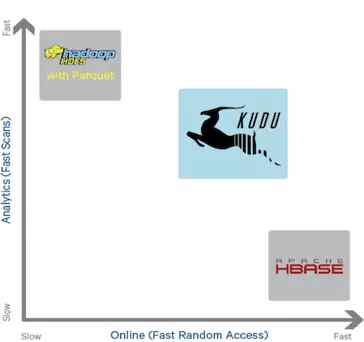
从上图可以看出，KUDU 是一个折中的产品，在 HDFS 和 HBase 这两个偏科生中平衡了随机读写和批量分析的性能。从 KUDU 的诞生可以说明一个观点：底层的技术发展很多时候都是上层的业务推动的，脱离业务的技术很可能是空中楼阁。

### kudu是什么

Apache Kudu是由Cloudera开源的存储引擎，可以同时提供低延迟的随机读写和高效的数据分析能力。它是一个融合HDFS和HBase的功能的新组件，具备介于两者之间的新存储组件。
Kudu支持水平扩展，并且与Cloudera Impala和Apache Spark等当前流行的大数据查询和分析工具结合紧密。

#### Kudu简介

官网: <https://kudu.apache.org/>
Logo: Kudu这个名字听起来可能有些奇怪，实际上，Kudu是一种非洲的大羚羊，中文名叫“捻角羚”
Impala: 同为Cloudera公司开源的另一款产品，是另一种非洲的羚羊，叫做“黑斑羚”，也叫“高角羚”。
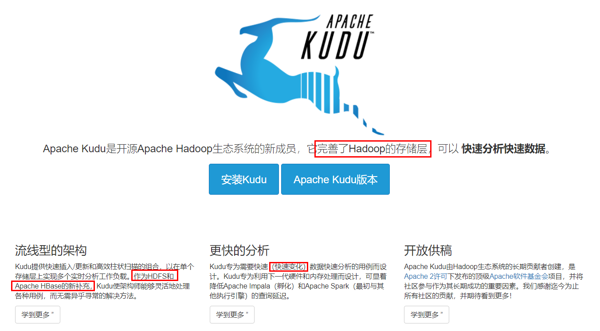
`Impala`是Cloudera公司主导开发的新型查询系统，基于`Hive`使用`内存`计算，兼顾数据仓库、具有实时、批处理、多并发等优点。它提供SQL语义，能查询存储在Hadoop的HDFS和HBase中的PB级大数据。已有的`Hive`系统虽然也提供了SQL语义，但由于Hive底层执行使用的是`MapReduce`引擎，仍然是一个批处理过程，难以满足查询的交互性。相比之下，Impala的最大特点也是最大卖点就是它的快速。

#

kudu应用场景

适用于那些既有随机访问，也有批量数据扫描的复合场景
高计算量的场景
使用了高性能的存储设备，包括使用更多的内存
支持数据更新，避免数据反复迁移
支持跨地域的实时数据备份和查询
国内使用的kudu一些案例可以查看《构建近实时分析系统.pdf》文档。

现代大数据的应用场景:
例如现在要做一个类似物联网的项目, 可能是对某个工厂的生产数据进行分析
项目特点：
. 数据量大
有一个非常重大的挑战, 就是这些设备可能很多, 其所产生的事件记录可能也很大, 所以需要对设备进行数据收集和分析的话, 需要使用一些大数据的组件和功能

. 流式处理
因为数据是事件, 事件是一个一个来的, 并且如果快速查看结果的话, 必须使用流计算来处理这些数据
. 数据需要存储
最终需要对数据进行统计和分析, 所以数据要先有一个地方存, 后再通过可视化平台去分析和处理


对存储层的要求:
这样的一个流计算系统, 需要对数据进行什么样的处理呢?
. 要能够及时的看到最近的数据, 判断系统是否有异常
. 要能够扫描历史数据, 从而改进设备和流程
所以对数据存储层就有可能进行如下的操作
. 逐行插入, 因为数据是一行一行来的, 要想及时看到, 就需要来一行插入一行
. 低延迟随机读取, 如果想分析某台设备的信息, 就需要在数据集中随机读取某一个设备的事件记录
. 快速分析和扫描, 数据分析师需要快速的得到结论, 执行一行 `SQL` 等上十天是不行的

### 方案一: 使用 `Spark Streaming` 配合 `HDFS` 存储

总结一下需求

* 实时处理, `Spark Streaming`
* 大数据存储, `HDFS`
* 使用 Kafka 过渡数据

但是这样的方案有一个非常重大的问题, 就是速度机器之慢, 因为 `HDFS` 不擅长存储小文件, 而通过流处理直接写入 `HDFS` 的话, 会产生非常大量的小文件, 扫描性能十分的差
方案二: `HDFS` + `compaction`:

上面方案的问题是大量小文件的查询是非常低效的, 所以可以将这些小文件压缩合并起来

但是这样的处理方案也有很多问题

* 一个文件只有不再活跃时才能合并
* 不能将覆盖的结果放回原来的位置
所以一般在流式系统中进行小文件合并的话, 需要将数据放在一个新的目录中, 让 `Hive/Impala` 指向新的位置, 再清理老的位置

方案三: `HBase` + `HDFS`:

前面的方案都不够舒服, 主要原因是因为一直在强迫 `HDFS` 做它并不擅长的事情, 对于实时的数据存储, 谁更适合呢? `HBase` 好像更合适一些, 虽然 `HBase` 适合实时的低延迟的数据村醋, 但是对于历史的大规模数据的分析和扫描性能是比较差的, 所以还要结合 `HDFS` 和 `Parquet` 来做这件事

因为 `HBase` 不擅长离线数据分析, 所以在一定的条件触发下, 需要将 `HBase` 中的数据写入 `HDFS` 中的 `Parquet` 文件中, 以便支持离线数据分析, 但是这种方案又会产生新的问题

* 维护特别复杂, 因为需要在不同的存储间复制数据
* 难以进行统一的查询, 因为实时数据和离线数据不在同一个地方

这种方案, 也称之为 `Lambda`, 分为实时层和批处理层, 通过这些这么复杂的方案, 其实想做的就是一件事, 流式数据的存储和快速查询

方案四: `Kudu`:

`Kudu` 声称在扫描性能上, 媲美 `HDFS` 上的 `Parquet`. 在随机读写性能上, 媲美 `HBase`. 所以将存储存替换为 `Kudu`, 理论上就能解决我们的问题了.


.总结

对于实时流式数据处理, `Spark`, `Flink`, `Storm` 等工具提供了计算上的支持, 但是它们都需要依赖外部的存储系统, 对存储系统的要求会比较高一些, 要满足如下的特点

* 支持逐行插入
* 支持更新
* 低延迟随机读取
* 快速分析和扫描

### Kudu 和其它存储工具的对比

.导读
. `OLAP` 和 `OLTP`
. 行式存储和列式存储
. `Kudu` 和 `MySQL` 的区别
. `Kudu` 和 `HBase` 的区别

#### `OLAP` 和 `OLTP`

广义来讲, 数据库分为 `OLTP` 和 `OLAP`


先举个栗子, 在电商网站中, 经常见到一个功能 - "我的订单", 这个功能再查询数据的时候, 是查询的某一个用户的数据, 并不是批量的数据
`OLTP` 需要做的事情是
. 快速插入和更新
. 精确查询
所以 `OLTP` 并不需要对数据进行大规模的扫描和分析, 所以它的扫描性能并不好, 它主要是用于对响应速度和数据完整性很高的在线服务应用中
`OLAP`
`OLAP` 和 `OLTP` 的场景不同, `OLAP` 主要服务于分析型应用, 其一般是批量加载数据, 如果出错了, 重新查询即可
总结

* `OLTP` 随机访问能力比较强, 批量扫描比较差
* `OLAP` 擅长大规模批量数据加载, 对于随机访问的能力则比较差
* 大数据系统中, 往往从 `OLTP` 数据库中 `ETL` 放入 `OLAP` 数据库中, 然后做分析和处理

### 行式存储和列式存储

行式和列式是不同的存储方式, 其大致如下

行式存储
行式一般用做于 `OLTP`, 例如我的订单, 那不仅要看到订单, 还要看到收货地址, 付款信息, 派送信息等, 所以 `OLTP` 一般是倾向于获取整行所有列的信息

* 列式存储
而分析平台就不太一样了, 例如分析销售额, 那可能只对销售额这一列感兴趣, 所以按照列存储, 只获取需要的列, 这样能减少数据的读取量
存储模型:
结构:

* `Kudu` 的存储模型是有结构的表
* `OLTP` 中代表性的 `MySQL`, `Oracle` 模型是有结构的表
* `HBase` 是看起来像是表一样的 `Key-Value` 型数据, `Key` 是 `RowKey` 和列簇的组合, `Value` 是具体的值

主键:

* `Kudu` 采用了 `Raft` 协议, 所以 `Kudu` 的表中有唯一主键
* 关系型数据库也有唯一主键
* `HBase` 的 `RowKey` 并不是唯一主键

事务支持:

. `Kudu` 缺少跨行的 `ACID` 事务
. 关系型数据库大多在单机上是可以支持 `ACID` 事务的

性能:

* `Kudu` 的随机读写速度目标是和 `HBase` 相似, 但是这个目标建立在使用 `SSD` 基础之上
* `Kudu` 的批量查询性能目标是比 `HDFS` 上的 `Parquet` 慢两倍以内

硬件需求:

* `Hadoop` 的设计理念是尽可能的减少硬件依赖, 使用更廉价的机器, 配置机械硬盘
* `Kudu` 的时代 `SSD` 已经比较常见了, 能够做更多的磁盘操作和内存操作
* `Hadoop` 不太能发挥比较好的硬件的能力, 而 `Kudu` 为了大内存和 `SSD` 而设计, 所以 `Kudu` 对硬件的需求会更大一些

### Kudu和HBase、HDFS对比

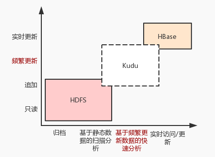

Kudu是cloudera开源的一款运行在hadoop 平台的列式存储系统
同时提供随机读写和数据分析能力
可与Impala、Spark集成
支持横向扩展
支持高可用

`HDFS` 上的数据分析

```text
HDFS是一种能够非常高效的进行数据分析的存储引擎

- HDFS有很多支持压缩的列式存储的文件格式, 性能很好, 例如 `Parquet` 和 `ORC`
- HDFS本身支持并行
- 适合批处理
- 一次写入，多次读取，不能修改，只能追加

- 不适合低延时数据访问
- 无法高效的对大量小文件进行存储
- 一个文件只能有一个写，不允许多个线程同时写
- 仅支持数据 append（追加），不支持文件的随机修改
```

`HBase` 可以进行高效的数据插入和读取

```text
HBase主要用于完成一些对实时性要求比较高的场景

- HBase 能够以极高的吞吐量来进行数据存储, 无论是批量加载, 还是大量 `put`
- HBase 能够对主键进行非常高效的扫描, 因为其根据主键进行排序和维护
- 但是对于主键以外的列进行扫描则性能会比较差

```

`Kudu` 的设计目标

```text
Kudu 最初的目标是成为一个新的存储引擎, 可以进行快速的数据分析, 又可以进行高效的数据随机插入, 这样就能简化数据从源端到 Hadoop 中可以用于被分析的过程, 所以有如下的一些设计目标

- 尽可能快速的扫描, 达到 HDFS 中 Parquet 的二分之一速度
- 尽可能的支持随机读写, 达到 1ms 的响应时间
- 列式存储
- 支持NoSQL样式的API, 例如 put, get, delete, scan
```

### 发展历史

2012年10月由Cloudera 公司发起
2014年9月小米加入开发
2015年10月对外公布
2015年12月进入Apache 孵化器，并迅速称为Apache 的顶级项目
Kudu最有名和最成功的应用案例—— 小米

### 小米的案例

未使用Kudu
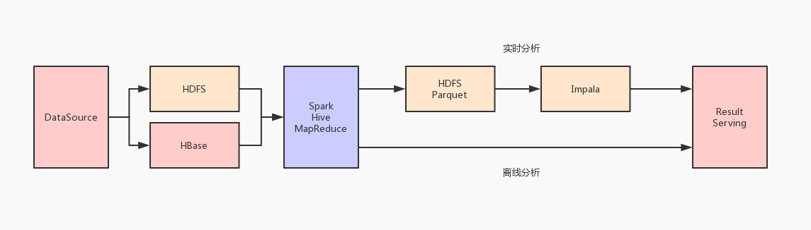
使用Kudu之后
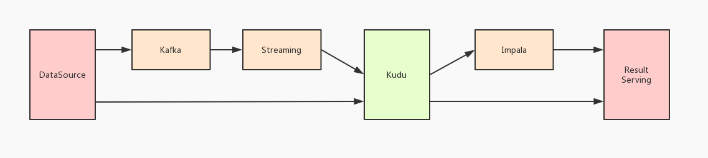

提高了数据时效性
简化了系统架构

### Kudu 的设计和结构

.导读
. `Kudu` 是什么
. `Kudu` 的整体设计
. `Kudu` 的角色
. `Kudu` 的概念

### `Kudu` 是什么:

`HDFS` 上的数据分析:
`HDFS` 是一种能够非常高效的进行数据分析的存储引擎

* `HDFS` 有很多支持压缩的列式存储的文件格式, 性能很好, 例如 `Parquet` 和 `ORC`
* `HDFS` 本身支持并行

`HBase` 可以进行高效的数据插入和读取:
`HBase` 主要用于完成一些对实时性要求比较高的场景

* `HBase` 能够以极高的吞吐量来进行数据存储, 无论是批量加载, 还是大量 `put`
* `HBase` 能够对主键进行非常高效的扫描, 因为其根据主键进行排序和维护
* 但是对于主键以外的列进行扫描则性能会比较差

`Kudu` 的设计目标:
`Kudu` 最初的目标是成为一个新的存储引擎, 可以进行快速的数据分析, 又可以进行高效的数据随机插入, 这样就能简化数据从源端到 `Hadoop` 中可以用于被分析的过程, 所以有如下的一些设计目标

* 尽可能快速的扫描, 达到 `HDFS` 中 `Parquet` 的二分之一速度
* 尽可能的支持随机读写, 达到 `1ms` 的响应时间
* 列式存储
* 支持 `NoSQL` 样式的 `API`, 例如 `put`, `get`, `delete`, `scan`

### 总体设计:

* `Kudu` 不支持 `SQL`
`Kudu` 和 `Impala` 都是 `Cloudera` 的项目, 所以 `Kudu` 不打算自己实现 `SQL` 的解析和执行计划, 而是选择放在 `Impala` 中实现, 这两个东西配合来完成任务

`Kudu` 的底层是一个基于表的引擎, 但是提供了 `NoSQL` 的 `API`

* `Kudu` 中存储两类的数据
* `Kudu` 存储自己的元信息, 例如表名, 列名, 列类型
* `Kudu` 当然也有存放表中的数据

这两种数据都存储在 `tablet` 中

* `Master server`
存储元数据的 `tablet` 由 `Master server` 管理
* `Tablet server`
存储表中数据的 `tablet` 由不同的 `Tablet server` 管理
* `tablet`
`Master server` 和 `Tablet server` 都是以 `tablet` 作为存储形式来存储数据的, 一个 `tablet` 通常由一个 `Leader` 和两个 `Follower` 组成, 这些角色分布的不同的服务器中


`Master server`:


* `Master server` 中存储的其实也就是一个 `tablet`, 这个 `tablet` 中存储系统的元数据, 所以 `Kudu` 无需依赖 `Hive`
* 客户端访问某一张表的某一部分数据时, 会先询问 `Master server`, 获取这个数据的位置, 去对应位置获取或者存储数据
* 虽然 `Master` 比较重要, 但是其承担的职责并不多, 数据量也不大, 所以为了增进效率, 这个 `tablet` 会存储在内存中
* 生产环境中通常会使用多个 `Master server` 来保证可用性

`Tablet server`:


* `Tablet server` 中也是 `tablet`, 但是其中存储的是表数据
* `Tablet server` 的任务非常繁重, 其负责和数据相关的所有操作, 包括存储, 访问, 压缩, 其还负责将数据复制到其它机器
* 因为 `Tablet server` 特殊的结构, 其任务过于繁重, 所以有如下的限制
** `Kudu` 最多支持 `300` 个服务器, 建议 `Tablet server` 最多不超过 `100` 个
** 建议每个 `Tablet server` 至多包含 `2000` 个 `tablet` (包含 `Follower`)
** 建议每个表在每个 `Tablet server` 中至多包含 `60` 个 `tablet` (包含 `Follower`)
** 每个 `Tablet server` 至多管理 `8TB` 数据
** 理想环境下, 一个 `tablet leader` 应该对应一个 `CPU` 核心, 以保证最优的扫描性能

`tablet` 的存储结构:


在 `Kudu` 中, 为了同时支持批量分析和随机访问, 在整体上的设计一边参考了 `Parquet` 这样的文件格式的设计, 一边参考了 `HBase` 的设计

* `MemRowSet`
这个组件就很像 `HBase` 中的 `MemoryStore`, 是一个缓冲区, 数据来了先放缓冲区, 保证响应速度
* `DiskRowSet`
列存储的好处不仅仅只是分析的时候只 `I/O` 对应的列, 还有一个好处, 就是同类型的数据放在一起, 更容易压缩和编码
`DiskRowSet` 中的数据以列式组织, 类似 `Parquet` 中的方式, 对其中的列进行编码, 通过布隆过滤器增进查询速度
`tablet` 的 `Insert` 流程:


* 使用 MemRowSet 作为缓冲, 特定条件下写为多个 DiskRowSet
* 在插入之前, 为了保证主键唯一性, 会已有的 DiskRowSet 和 MemRowSet 进行验证, 如果主键已经存在则报错
`tablet` 的 `Update` 流程:


. 查找要更新的数据在哪个 `DiskRowSet` 中
. 数据放入 `DiskRowSet` 所持有的 `DeltaMemStore` 中, 这一步也是暂存
. 特定时机下, `DeltaMemStore` 会将数据溢写到磁盘, 生成 `RedoDeltaFile`, 记录数据的变化
. 定时合并 `RedoDeltaFile`
** 合并策略有三种, 常见的有两种, 一种是 `major`, 会将数据合并到基线数据中, 一种是 `minor`, 只合并 `RedoDeltaFile`

### Apache Kudu架构

与HDFS和HBase相似，Kudu使用单个的Master节点，用来管理集群的元数据，并且使用任意数量的Tablet Server（类似HBase中的RegionServer角色）节点用来存储实际数据。可以部署多个Master节点来提高容错性。

### 总体设计

Kudu 不支持SQL
  Kudu和 Impala 都是Cloudera的项目, 所以 Kudu 不打算自己实现 SQL的解析和执行计划, 而是选择放在 Impala中实现, 这两个东西配合来完成任务
  Kudu的底层是一个基于表的引擎, 但是提供了 NoSQL 的API
Kudu中存储两类的数据
 Kudu 存储自己的元信息, 例如表名, 列名, 列类型
 Kudu当然也有存放表中的数据
  这两种数据都存储在 tablet中
Master server
  存储元数据的 tablet 由Master server 管理
Tablet server
  存储表中数据的 tablet 由不同的 Tablet server 管理
tablet
  `Master server` 和 `Tablet server` 都是以 `tablet` 作为存储形式来存储数据的, 一个 `tablet` 通常由一个 `Leader` 和两个 `Follower` 组成, 这些角色分布的不同的服务器中

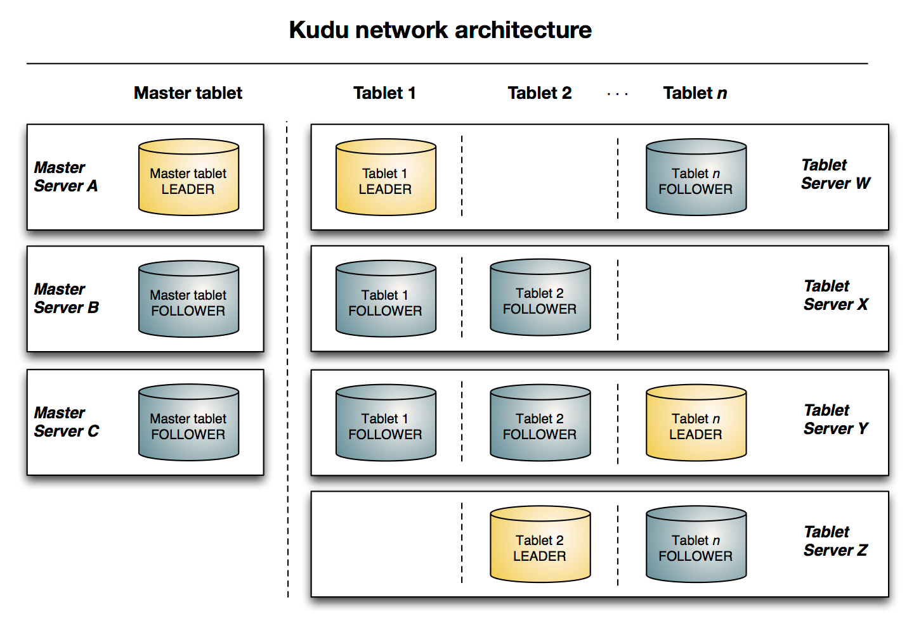

### Table

表（Table）是数据库中用来存储数据的对象，是有结构的数据集合。kudu中的表具有schema（纲要）和全局有序的primary key（主键）。kudu中一个table会被水平分成多个被称之为tablet的片段。

#### Tablet

一个 tablet 是一张 table连续的片段，tablet是kudu表的水平分区，类似于HBase的region。每个tablet存储着一定连续range的数据（key），且tablet两两间的range不会重叠。一张表的所有tablet包含了这张表的所有key空间。
tablet 会冗余存储。放置到多个 tablet server上，并且在任何给定的时间点，其中一个副本被认为是leader tablet,其余的被认之为follower tablet。每个tablet都可以进行数据的读请求，但只有Leader tablet负责写数据请求。

#### Tablet Server

tablet server集群中的小弟，负责数据存储，并提供数据读写服务
一个 tablet server 存储了table表的tablet，向kudu client 提供读取数据服务。对于给定的 tablet，一个tablet server 充当 leader，其他 tablet server 充当该 tablet 的 follower 副本。
只有 leader服务写请求，然而 leader 或 followers 为每个服务提供读请求 。一个 tablet server 可以服务多个 tablets ，并且一个 tablet 可以被多个 tablet servers 服务着。


`Tablet server` 中也是 `tablet`, 但是其中存储的是表数据
`Tablet server` 的任务非常繁重, 其负责和数据相关的所有操作, 包括存储, 访问, 压缩, 其还负责将数据复制到其它机器
因为 `Tablet server` 特殊的结构, 其任务过于繁重, 所以有如下的限制
  `Kudu` 最多支持 `300` 个服务器, 建议 `Tablet server` 最多不超过 `100` 个
  建议每个 `Tablet server` 至多包含 `2000` 个 `tablet` (包含 `Follower`)
  建议每个表在每个 `Tablet server` 中至多包含 `60` 个 `tablet` (包含 `Follower`)
  每个 `Tablet server` 至多管理 `8TB` 数据
  理想环境下, 一个 `tablet leader` 应该对应一个 `CPU` 核心, 以保证最优的扫描性能

### Master Server

集群中的老大，负责集群管理、元数据管理等功能。


`Master server` 中存储的其实也就是一个 `tablet`, 这个 `tablet` 中存储系统的元数据, 所以 `Kudu` 无需依赖 `Hive`
客户端访问某一张表的某一部分数据时, 会先询问 `Master server`, 获取这个数据的位置, 去对应位置获取或者存储数据
虽然 `Master` 比较重要, 但是其承担的职责并不多, 数据量也不大, 所以为了增进效率, 这个 `tablet` 会存储在内存中
生产环境中通常会使用多个 `Master server` 来保证可用性

### Apache Kudu安装

因为 `Kudu` 经常和 `Impala` 配合使用, 所以我们也要安装 `Impala`
但是又因为 `Impala` 强依赖于 `Hive` 的 `MetaStore`, 所以 `Hive` 也需要安装
又因为 `Hive` 依赖 `HDFS`, 所以 `Hadoop` 也需要安装
并且 `Impala` 是 `CDH` 的 产品, 所以强依赖 `CDH` 版本的 `Hive` 和 `HDFS`, 所以我们需要安装 CDH 版本的 Hadoop,Zookeeper, Hive

1. 创建虚拟机准备初始环境
2. 安装 `Zookeeper`
3. 安装 `Hadoop`
4. 安装 `MySQL`
5. 安装 `Hive`
6. 安装 `Kudu`
7. 安装 `Impala`

### 节点规划

|  节点 |  kudu-master  | kudu-tserver|
|---------- |----------------- |------------------|
|  node01    |  是             |   是|
|  node02    |  是              |  是|
|  node03    |  是              |  是|

注意一定要安装时间同步，只要时间不准集群就会失败
配置时间同步服务:
在几乎所有的分布式存储系统上, 都需要进行时钟同步, 避免出现旧的数据在同步过程中变为新的数据, 包括 `HBase`, `HDFS`, `Kudu` 都需要进行时钟同步, 所以在一切开始前, 先同步一下时钟, 保证没有问题
时钟同步比较简单, 只需要确定时钟没有太大差异, 然后开启 `ntp` 的自动同步服务即可

```text
yum install -y ntp
service ntpd start
```

同步大概需要 `5 - 10` 分钟, 然后查看是否已经是同步状态即可

```text
ntpstat
```

最后在其余两台节点也要如此配置一下

### 本地yum源配置

#### cdh包下载

[http://archive.cloudera.com/cdh5/repo-as-tarball/5.14.0/cdh5.14.0-centos6.tar.gz](http://archive.cloudera.com/cdh5/repo-as-tarball/5.14.0/cdh5.14.0-centos6.tar.gz)

下载cdh5.14.0-centos6.tar.gz文件，大小约5G左右。

#### 上传解压

把5个G的压缩文件上传其中某一台服务器，作为本地yum源服务器。（这里需要确保服务器的磁盘空间是充足的，如果磁盘容量不够，就需要扩容，增大磁盘的容量，具体操作可以参考附件）。

```shell
cd /cloudera_data
tar -zxvf cdh5.14.0-centos6.tar.gz
```

#### 制作本地yum源

使用Apache Server来充当web服务器，使得其他机器可以通过http方式读取本地制作的yum源软件。这里我们选用第三台机器（node03）作为yum源。执行以下命令安装apache Server：

```shell
yum -y install httpd
service httpd start
#然后创建新增一个解析本地yum源的配置文件
cd /etc/yum.repos.d
vim localimp.repo
[localimp]
name=localimp
baseurl=http://node03/cdh5.14.0
gpgcheck=0
enabled=1
```

#### 创建连接、启动httpd

```shell
ln -s /export/servers/cdh/5.14.0 /var/www/html/cdh5.14.0
```

访问<http://node03/cdh5.14.0>验证是否成功
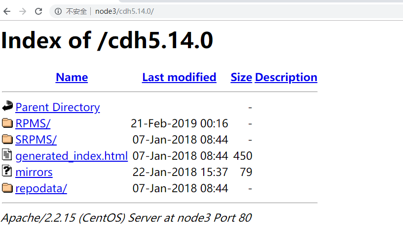

如果出现访问异常：You don't have permission to access /cdh5.14.0/ on this server，则需要关闭Selinux服务

```shell
  #（1）临时关闭
  执行命令：setenforce 0
  # (2) 永久关闭
  vim /etc/sysconfig/selinux
    SELINUX=enforcing 改为 SELINUX=disabled
   # 重启服务reboot
#将node03上制作好的localimp配置文件发放到所有需要kudu的节点上去
scp /etc/yum.repos.d/localimp.repo node01:/etc/yum.repos.d
scp /etc/yum.repos.d/localimp.repo node02:/etc/yum.repos.d
```

### 安装kudu

使用yum命令，在不同的服务器下载对应的服务。

|  服务器  | 安装命令|
|------------| -----------------------------------------------------------------------------|
|  node01      | yum install -y kudu kudu-master kudu-tserver kudu-client0 kudu-client-devel|
| node02      | yum install -y kudu kudu-master kudu-tserver kudu-client0 kudu-client-devel|
| node03      | yum install -y kudu kudu-master kudu-tserver kudu-client0 kudu-client-devel|

安装kudu

```shell
yum install kudu # Kudu的基本包
yum install kudu-master # KuduMaster
yum install kudu-tserver # KuduTserver
yum install kudu-client0 #Kudu C ++客户端共享库
yum install kudu-client-devel # Kudu C ++客户端共享库 SDK
```

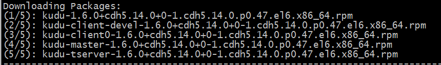

卸载命令

```shell
yum remove -y kudu kudu-master kudu-tserver kudu-client0 kudu-client-devel
```

### kudu节点配置

安装完成之后。 需要在所有节点的/etc/kudu/conf目录下有两个文件：`master.gflagfile`和`tserver.gflagfile`。

#### 修改master.gflagfile

vi /etc/kudu/conf/master.gflagfile

```shell
[root@node01 ~]# cd /etc/kudu/conf
[root@node01 conf]# vim /etc/kudu/conf/master.gflagfile
# cat /etc/kudu/conf/master.gflagfile
# Do not modify these two lines. If you wish to change these variables,
# modify them in /etc/default/kudu-master.
--fromenv=rpc_bind_addresses
--fromenv=log_dir
# 添加以下三行
--fs_wal_dir=/export/servers/kudu/master
--fs_data_dirs=/export/servers/kudu/master
--master_addresses=node01:7051,node02:7051,node03:7051
# 然后分发到其它两个节点
[root@node01 conf]# scp master.gflagfile root@node02:$PWD
master.gflagfile
[root@node01 conf]# scp master.gflagfile root@node03:$PWD
master.gflagfile
#检查是否分发成功
[root@node02 ~]# cat /etc/kudu/conf/master.gflagfile
[root@node03 cloudera_data]# cat /etc/kudu/conf/master.gflagfile
```

#### 修改tserver.gflagfile

vi /etc/kudu/conf/tserver.gflagfile

```shell
[root@node01 conf]# vim /etc/kudu/conf/tserver.gflagfile
# Do not modify these two lines. If you wish to change these variables,
# modify them in /etc/default/kudu-tserver.
--fromenv=rpc_bind_addresses
--fromenv=log_dir
# 添加以下三行
--fs_wal_dir=/export/servers/kudu/tserver
--fs_data_dirs=/export/servers/kudu/tserver
--tserver_master_addrs=node01:7051,node02:7051,node03:7051
# 分发到其它两个节点
[root@node01 conf]# scp tserver.gflagfile root@node02:$PWD
tserver.gflagfile
[root@node01 conf]# scp tserver.gflagfile root@node03:$PWD
tserver.gflagfile

```

#### 修改 /etc/default/kudu-master

每个节点上都需要配置

```shell
[root@node01 conf]# vim /etc/default/kudu-master
export FLAGS_log_dir=/var/log/kudu
#每台机器的master地址要与主机名一致,这里是在node01上
export FLAGS_rpc_bind_addresses=node01:7051
```

#### 修改 /etc/default/kudu-tserver

```shell
[root@node01 conf]# vim /etc/default/kudu-tserver
export FLAGS_log_dir=/var/log/kudu
#每台机器的tserver地址要与主机名一致，这里是在node01上
export FLAGS_rpc_bind_addresses=node01:7050
```

kudu默认用户就是KUDU，所以需要将/export/servers/kudu权限修改成kudu：

```shell
#1节点
[root@node01 conf]# mkdir /export/servers/kudu
[root@node01 conf]# chown -R kudu:kudu /export/servers/kudu
#2节点
[root@node02 ~]# mkdir /export/servers/kudu
[root@node02 ~]# chown -R kudu:kudu /export/servers/kudu
# 3节点
[root@node03 cloudera_data]# mkdir /export/servers/kudu
[root@node03 cloudera_data]# chown -R kudu:kudu /export/servers/kudu
```

(如果使用的是普通的用户，那么最好配置sudo权限)/etc/sudoers文件中添加：

```shell
[root@node03 cloudera_data]# vim /etc/sudoers
hue     ALL=(ALL)       ALL
kudu    ALL=(ALL)       ALL
```

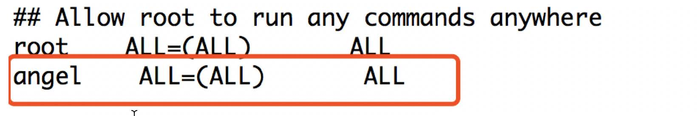

### kudu集群启动和关闭

#### 安装ntp

启动的时候要注意时间同步

```shell
#安装ntp服务
yum -y install ntp
#设置开机启动
service ntpd start
chkconfig ntpd on
#可以在每台服务器执行
/etc/init.d/ntpd restart
```

#### 启动kudu集群

在每台服务器上都执行下面脚本

```shell
#1节点
[root@node01 kudu]# service kudu-master start
[root@node01 kudu]# service kudu-tserver start
#2节点
[root@node02 kudu]# service kudu-master start
[root@node02 kudu]# service kudu-tserver start
#3节点
[root@node03 kudu]# service kudu-master start
[root@node03 kudu]# service kudu-tserver start

```

如果启动失败，请前往日志目录下查看输出日志信息进行排错。

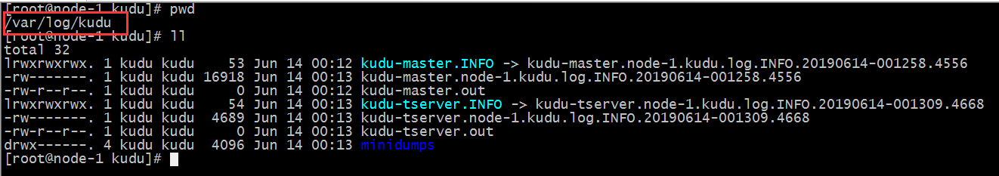

### 关闭kudu集群

在每台服务器上都执行下面脚本

```shell
service kudu-master stop
service kudu-tserver stop
```

### kudu web UI

kudu的web管理界面。[http://master主机名:8051](http://master主机名:8051)
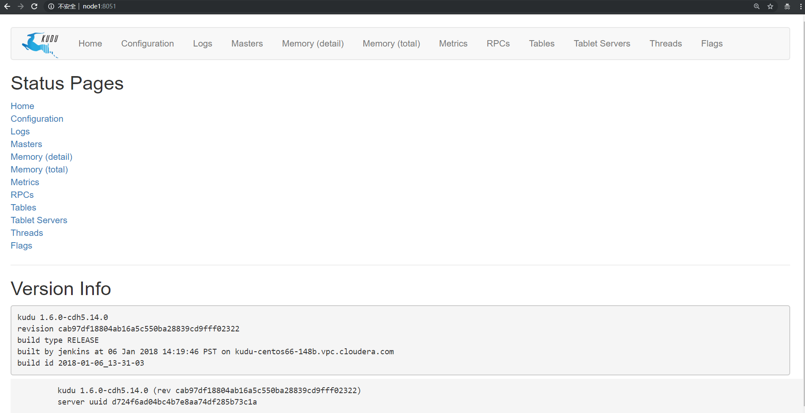

### Master的web地址

可以查看每个机器上master相关信息。[http://node01:8051/masters](http://node01:8051/masters)
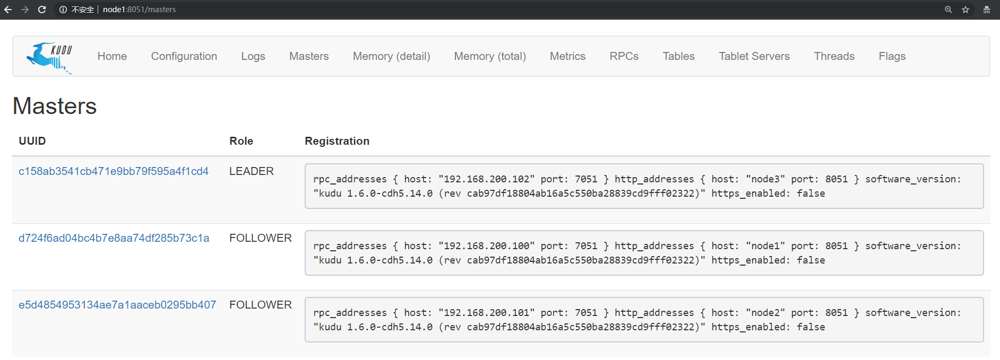

### TServer的web地址

[http://node01:8051/tablet-servers](http://node01:8051/tablet-servers)
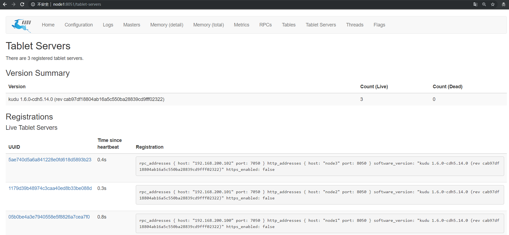

## 安装注意事项

### 给普通用户授予sudo出错

```shell
sudo: /etc/sudoers is world writable
#解决方式：pkexec chmod 555 /etc/sudoers
```

### 启动kudu的时候报错

Failed to start Kudu Master Server. Return value: 1 [FAILED]
去日志文件中查看：
Service unavailable: Cannot initialize clock: Error reading clock. Clock considered
unsynchronized
解决：

```shell
#第一步：首先检查是否有安装ntp：如果没有安装则使用以下命令安装：
yum -y install ntp
#第二步：设置随机启动：

service ntpd start
chkconfig ntpd on
```

### 启动过程中报错

Invalid argument: Unable to initialize catalog manager: Failed to initialize sys
tables
async: on-disk master list
解决：
（1）：停掉master和tserver
（2）：删除掉之前所有的/export/servers/kudu/master/*和/export/servers/kudu/tserver/*

### 启动过程中报错2

error: Could not create new FS layout: unable to create file system roots: unable to
write instance metadata: Call to mkstemp() failed on name template
/export/servers/kudu/master/instance.kudutmp.XXXXXX: Permission denied (error 13)
这是因为kudu默认使用kudu权限进行执行，可能遇到文件夹的权限不一致情况，更改文件夹权限即可

## java 操作kudu

 构建maven工程、导入依赖

```xml
    <dependencies>
        <dependency>
            <groupId>junit</groupId>
            <artifactId>junit</artifactId>
            <version>4.12</version>
            <scope>test</scope>
        </dependency>
        <dependency>
            <groupId>org.apache.kudu</groupId>
            <artifactId>kudu-client</artifactId>
            <version>1.6.0</version>
        </dependency>
    </dependencies>
```

 增，删，改，查操作

```java
package kudu;

import org.apache.kudu.ColumnSchema;
import org.apache.kudu.Schema;
import org.apache.kudu.Type;
import org.apache.kudu.client.*;
import org.junit.Before;
import org.junit.Test;

import java.util.ArrayList;

public class TestKudu {

    //声明全局变量 KuduClient后期通过它来操作kudu表
    private KuduClient kuduClient;
    //指定kuduMaster地址
    private String kuduMaster;
    //指定表名
    private String tableName;

    @Before
    public void init() {
        //初始化操作
        kuduMaster = "node01:7051,node02:7051,node03:7051";
        //指定表名
        tableName = "student20190924";
        KuduClient.KuduClientBuilder kuduClientBuilder = new KuduClient.KuduClientBuilder(kuduMaster);
        kuduClientBuilder.defaultSocketReadTimeoutMs(10000);
        kuduClient = kuduClientBuilder.build();
    }

    /**
     * 创建表
     */
    @Test
    public void createTable() throws KuduException {
        //判断表是否存在，不存在就构建
        if (!kuduClient.tableExists(tableName)) {
            //构建创建表的schema信息-----就是表的字段和类型
            ArrayList<ColumnSchema> columnSchemas = new ArrayList<ColumnSchema>();
            columnSchemas.add(new ColumnSchema.ColumnSchemaBuilder("id", Type.INT32).key(true).build());
            columnSchemas.add(new ColumnSchema.ColumnSchemaBuilder("name", Type.STRING).build());
            columnSchemas.add(new ColumnSchema.ColumnSchemaBuilder("age", Type.INT32).build());
            columnSchemas.add(new ColumnSchema.ColumnSchemaBuilder("sex", Type.INT32).build());
            Schema schema = new Schema(columnSchemas);

            //指定创建表的相关属性
            CreateTableOptions options = new CreateTableOptions();
            ArrayList<String> partitionList = new ArrayList<String>();
            //指定kudu表的分区字段是什么
            partitionList.add("id");    //  按照 id.hashcode % 分区数 = 分区号
            options.addHashPartitions(partitionList, 6);

            kuduClient.createTable(tableName, schema, options);
        }
    }
    //运行完成，打开浏览器 http://node01:8051/tables 可以看看到刚新建表的student20190924-->点击Table Id 可查当前表有那些字段

    /**
     * 插入数据
     * 向表加载数据
     */
    @Test
    public void insertTable() throws KuduException {
        //向表加载数据需要一个kuduSession对象
        KuduSession kuduSession = kuduClient.newSession();
        kuduSession.setFlushMode(SessionConfiguration.FlushMode.AUTO_FLUSH_SYNC);
        //需要使用kuduTable来构建Operation的子类实例对象
        KuduTable kuduTable = kuduClient.openTable(tableName);
        for (int i = 1; i <= 10; i++) {
            Insert insert = kuduTable.newInsert();
            PartialRow row = insert.getRow();
            row.addInt("id", i);
            row.addString("name", "zhangsan-" + i);
            row.addInt("age", 20 + i);
            row.addInt("sex", i % 2);
            kuduSession.apply(insert);//最后实现执行数据的加载操作
        }
    }
/*
 从impala 中查询数据
[node03.hadoop.com:21000] > select * from student20190924;
Query: select * from student20190924
Query submitted at: 2019-09-24 10:58:21 (Coordinator: http://node03:25000)
Query progress can be monitored at: http://node03:25000/query_plan?query_id=22430853d7519e1f:4fef513000000000
+----+-------------+-----+-----+
| id | name        | age | sex |
+----+-------------+-----+-----+
| 4  | zhangsan-4  | 24  | 0   |
| 1  | zhangsan-1  | 21  | 1   |
| 5  | zhangsan-5  | 25  | 1   |
| 6  | zhangsan-6  | 26  | 0   |
| 7  | zhangsan-7  | 27  | 1   |
| 2  | zhangsan-2  | 22  | 0   |
| 3  | zhangsan-3  | 23  | 1   |
| 10 | zhangsan-10 | 30  | 0   |
| 8  | zhangsan-8  | 28  | 0   |
| 9  | zhangsan-9  | 29  | 1   |
+----+-------------+-----+-----+
*/

    /**
     * 查询表的数据结果
     */
    @Test
    public void queryData() throws KuduException {

        //构建一个查询的扫描器
        KuduScanner.KuduScannerBuilder kuduScannerBuilder = kuduClient.newScannerBuilder(kuduClient.openTable(tableName));
        ArrayList<String> columnsList = new ArrayList<String>();
        columnsList.add("id");
        columnsList.add("name");
        columnsList.add("age");
        columnsList.add("sex");
        kuduScannerBuilder.setProjectedColumnNames(columnsList);
        //返回结果集
        KuduScanner kuduScanner = kuduScannerBuilder.build();
        //遍历
        while (kuduScanner.hasMoreRows()) {
            RowResultIterator rowResults = kuduScanner.nextRows();

            while (rowResults.hasNext()) {
                RowResult row = rowResults.next();
                int id = row.getInt("id");
                String name = row.getString("name");
                int age = row.getInt("age");
                int sex = row.getInt("sex");
                System.out.println("id=" + id + "  name=" + name + "  age=" + age + "  sex=" + sex);
            }
        }

    }
/*
运行结果如下
id=4  name=zhangsan-4  age=24  sex=0
id=5  name=zhangsan-5  age=25  sex=1
id=6  name=zhangsan-6  age=26  sex=0
id=7  name=zhangsan-7  age=27  sex=1
id=1  name=zhangsan-1  age=21  sex=1
id=3  name=zhangsan-3  age=23  sex=1
id=10  name=zhangsan-10  age=30  sex=0
id=2  name=zhangsan-2  age=22  sex=0
id=8  name=zhangsan-8  age=28  sex=0
id=9  name=zhangsan-9  age=29  sex=1
*/


    /**
     * 修改表的数据
     */
    @Test
    public void updateData() throws KuduException {
        //修改表的数据需要一个kuduSession对象
        KuduSession kuduSession = kuduClient.newSession();
        kuduSession.setFlushMode(SessionConfiguration.FlushMode.AUTO_FLUSH_SYNC);
        //需要使用kuduTable来构建Operation的子类实例对象
        KuduTable kuduTable = kuduClient.openTable(tableName);
        //Update update = kuduTable.newUpdate();
        Upsert upsert = kuduTable.newUpsert(); //如果id存在就表示修改，不存在就新增
        PartialRow row = upsert.getRow();
        row.addInt("id", 100);
        row.addString("name", "zhangsan-100");
        row.addInt("age", 100);
        row.addInt("sex", 0);
        kuduSession.apply(upsert);//最后实现执行数据的修改操作
    }
/*
运行结果：
[node03.hadoop.com:21000] > select * from student20190924;
Query: select * from student20190924
Query submitted at: 2019-09-24 11:00:44 (Coordinator: http://node03:25000)
Query progress can be monitored at: http://node03:25000/query_plan?query_id=1c42d4dd05a7ef52:b109c15d00000000
+-----+--------------+-----+-----+
| id  | name         | age | sex |
+-----+--------------+-----+-----+
| 4   | zhangsan-4   | 24  | 0   |
| 100 | zhangsan-100 | 100 | 0   |
| 1   | zhangsan-1   | 21  | 1   |
| 5   | zhangsan-5   | 25  | 1   |
| 6   | zhangsan-6   | 26  | 0   |
| 7   | zhangsan-7   | 27  | 1   |
| 2   | zhangsan-2   | 22  | 0   |
| 3   | zhangsan-3   | 23  | 1   |
| 10  | zhangsan-10  | 30  | 0   |
| 8   | zhangsan-8   | 28  | 0   |
| 9   | zhangsan-9   | 29  | 1   |
+-----+--------------+-----+-----+
Fetched 11 row(s) in 0.08s
 */

    /**
     * 删除数据
     */
    @Test
    public void deleteData() throws KuduException {
        //删除表的数据需要一个kuduSession对象
        KuduSession kuduSession = kuduClient.newSession();
        kuduSession.setFlushMode(SessionConfiguration.FlushMode.AUTO_FLUSH_SYNC);
        //需要使用kuduTable来构建Operation的子类实例对象
        KuduTable kuduTable = kuduClient.openTable(tableName);
        Delete delete = kuduTable.newDelete();
        PartialRow row = delete.getRow();
        row.addInt("id", 100);
        kuduSession.apply(delete);//最后实现执行数据的删除操作
    }
/*
[node03.hadoop.com:21000] > select * from student20190924;
Query: select * from student20190924
Query submitted at: 2019-09-24 11:01:28 (Coordinator: http://node03:25000)
Query progress can be monitored at: http://node03:25000/query_plan?query_id=4a7c6991e17125:681316000000000
+----+-------------+-----+-----+
| id | name        | age | sex |
+----+-------------+-----+-----+
| 1  | zhangsan-1  | 21  | 1   |
| 5  | zhangsan-5  | 25  | 1   |
| 6  | zhangsan-6  | 26  | 0   |
| 7  | zhangsan-7  | 27  | 1   |
| 4  | zhangsan-4  | 24  | 0   |
| 2  | zhangsan-2  | 22  | 0   |
| 3  | zhangsan-3  | 23  | 1   |
| 10 | zhangsan-10 | 30  | 0   |
| 8  | zhangsan-8  | 28  | 0   |
| 9  | zhangsan-9  | 29  | 1   |
+----+-------------+-----+-----+
Fetched 10 row(s) in 0.10s
 */

    /**
     * 删除表
     */
    @Test
    public void dropTable() throws KuduException {
        if (kuduClient.tableExists(tableName)) {
            kuduClient.deleteTable(tableName);
        }

    }
    //可以在http://node01:8051/tables 中查看是否还存在表
}

```

### Hash Partitioning ( 哈希分区 )

哈希分区通过哈希值将行分配到许多 buckets ( 存储桶 )之一； 哈希分区是一种有效的策略，当不需要对表进行有序访问时。哈希分区对于在 tablet 之间随机散布这些功能是有效的，这有助于减轻热点和 tablet 大小不均匀。

```java
  /**
     * 测试分区：
     * hash分区
     */
    @Test
    public void testHashPartition() throws KuduException {
        //设置表的schema
        LinkedList<ColumnSchema> columnSchemas = new LinkedList<ColumnSchema>();
        columnSchemas.add(newColumn("CompanyId", Type.INT32,true));
        columnSchemas.add(newColumn("WorkId", Type.INT32,false));
        columnSchemas.add(newColumn("Name", Type.STRING,false));
        columnSchemas.add(newColumn("Gender", Type.STRING,false));
        columnSchemas.add(newColumn("Photo", Type.STRING,false));

        //创建schema
        Schema schema = new Schema(columnSchemas);

        //创建表时提供的所有选项
        CreateTableOptions tableOptions = new CreateTableOptions();
        //设置副本数
        tableOptions.setNumReplicas(1);
        //设置范围分区的规则
        LinkedList<String> parcols = new LinkedList<String>();
        parcols.add("CompanyId");
        //设置按照那个字段进行range分区
        tableOptions.addHashPartitions(parcols,6);
        try {
            kuduClient.createTable("dog",schema,tableOptions);
        } catch (KuduException e) {
            e.printStackTrace();
        }

        kuduClient.close();
    }
```

### Multilevel Partitioning ( 多级分区 )

Kudu 允许一个表在单个表上组合多级分区。 当正确使用时，多级分区可以保留各个分区类型的优点，同时减少每个分区的缺点 需求.

```java

  /**
     * 测试分区：
     * 多级分区
     * Multilevel Partition
     * 混合使用hash分区和range分区
     *
     * 哈希分区有利于提高写入数据的吞吐量，而范围分区可以避免tablet无限增长问题，
     * hash分区和range分区结合，可以极大的提升kudu的性能
     */
    @Test
    public void testMultilevelPartition() throws KuduException {
        //设置表的schema
        LinkedList<ColumnSchema> columnSchemas = new LinkedList<ColumnSchema>();
        columnSchemas.add(newColumn("CompanyId", Type.INT32,true));
        columnSchemas.add(newColumn("WorkId", Type.INT32,false));
        columnSchemas.add(newColumn("Name", Type.STRING,false));
        columnSchemas.add(newColumn("Gender", Type.STRING,false));
        columnSchemas.add(newColumn("Photo", Type.STRING,false));

        //创建schema
        Schema schema = new Schema(columnSchemas);
        //创建表时提供的所有选项
        CreateTableOptions tableOptions = new CreateTableOptions();
        //设置副本数
        tableOptions.setNumReplicas(1);
        //设置范围分区的规则
        LinkedList<String> parcols = new LinkedList<String>();
        parcols.add("CompanyId");

        //hash分区
        tableOptions.addHashPartitions(parcols,5);

        //range分区
        int count=0;
        for(int i=0;i<10;i++){
            PartialRow lower = schema.newPartialRow();
            lower.addInt("CompanyId",count);
            count+=10;

            PartialRow upper = schema.newPartialRow();
            upper.addInt("CompanyId",count);
            tableOptions.addRangePartition(lower,upper);
        }

        try {
            kuduClient.createTable("cat",schema,tableOptions);
        } catch (KuduException e) {
            e.printStackTrace();
        }
        kuduClient.close();


    }

```

## spark操作kudu

到目前为止，我们已经听说过几个上下文，例如SparkContext，SQLContext，HiveContext， SparkSession，现在，我们将使用Kudu引入一个KuduContext。这是可在Spark应用程序中广播的主要可序列化对象。此类代表在Spark执行程序中与Kudu Java客户端进行交互。 KuduContext提供执行DDL操作所需的方法，与本机Kudu RDD的接口，对数据执行更新/插入/删除，将数据类型从Kudu转换为Spark等。

### 引入依赖

```xml
  <repositories>
    <repository>
        <id>cloudera</id>
        <url>https://repository.cloudera.com/artifactory/cloudera-repos/</url>
    </repository>
</repositories>

<dependencies>
  <dependency>
            <groupId>org.apache.kudu</groupId>
            <artifactId>kudu-client-tools</artifactId>
            <version>1.6.0-cdh5.14.0</version>
        </dependency>

        <dependency>
            <groupId>org.apache.kudu</groupId>
            <artifactId>kudu-client</artifactId>
            <version>1.6.0-cdh5.14.0</version>
        </dependency>

        <!-- https://mvnrepository.com/artifact/org.apache.kudu/kudu-spark2 -->
        <dependency>
            <groupId>org.apache.kudu</groupId>
            <artifactId>kudu-spark2_2.11</artifactId>
            <version>1.6.0-cdh5.14.0</version>
        </dependency>

        <!-- https://mvnrepository.com/artifact/org.apache.spark/spark-sql -->
        <dependency>
            <groupId>org.apache.spark</groupId>
            <artifactId>spark-sql_2.11</artifactId>
            <version>2.1.0</version>
        </dependency>
</dependencies>
```

创建表

创建表
定义kudu的表需要分成5个步骤：
1：提供表名
2：提供schema
3：提供主键
4：定义重要选项；例如：定义分区的schema
5：调用create Table api

```java
  object SparkKuduTest {
  def main(args: Array[String]): Unit = {
    //构建sparkConf对象
     val sparkConf: SparkConf = new SparkConf().setAppName("SparkKuduTest").setMaster("local[2]")

    //构建SparkSession对象
    val sparkSession: SparkSession = SparkSession.builder().config(sparkConf).getOrCreate()

    //获取sparkContext对象
      val sc: SparkContext = sparkSession.sparkContext
      sc.setLogLevel("warn")

    //构建KuduContext对象
      val kuduContext = new KuduContext("node01:7051,node02:7051,node03:7051",sc)

    //1.创建表操作
    createTable(kuduContext)
  }
    /**
    * 创建表
    * @param kuduContext
    * @return
    */
  private def createTable(kuduContext: KuduContext) = {

    //1.1定义表名
    val tableName = "spark_kudu"

    //1.2 定义表的schema
    val schema = StructType(
        StructField("userId", StringType, false) :
        StructField("name", StringType, false) :
        StructField("age", IntegerType, false) :
        StructField("sex", StringType, false) : Nil)

    //1.3 定义表的主键
    val primaryKey = Seq("userId")

    //1.4 定义分区的schema
    val options = new CreateTableOptions
    //设置分区
    options.setRangePartitionColumns(List("userId").asJava)
    //设置副本
    options.setNumReplicas(1)

    //1.5 创建表
    if(!kuduContext.tableExists(tableName)){
      kuduContext.createTable(tableName, schema, primaryKey, options)
    }

  }

}

```

定义表时要注意的是Kudu表选项值。你会注意到在指定组成范围分区列的列名列表时我们调用“asJava”方法。这是因为在这里，我们调用了Kudu Java客户端本身，它需要Java对象（即java.util.List）而不是Scala的List对象；（要使“asJava”方法可用，请记住导入JavaConverters库。）
创建表后，通过将浏览器指向http// master主机名:8051/tables来查看Kudu主UI可以找到创建的表，通过单击表ID，能够看到表模式和分区信息。

点击Table id 可以观察到表的schema等信息：
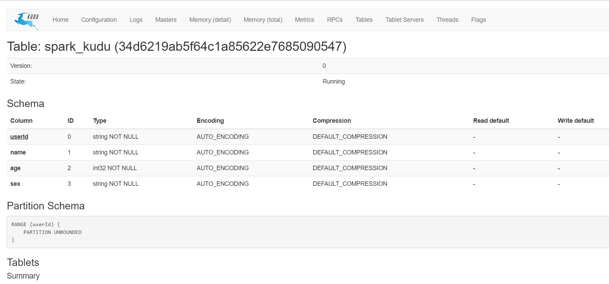

### dataFrame操作kudu

Kudu支持许多DML类型的操作，其中一些操作包含在Spark on Kudu集成.
包括：
INSERT - 将DataFrame的行插入Kudu表。请注意，虽然API完全支持INSERT，但不鼓励在Spark中使用它。使用INSERT是有风险的，因为Spark任务可能需要重新执行，这意味着可能要求再次插入已插入的行。这样做会导致失败，因为如果行已经存在，INSERT将不允许插入行（导致失败）。相反，我们鼓励使用下面描述的INSERT_IGNORE。
INSERT-IGNORE - 将DataFrame的行插入Kudu表。如果表存在，则忽略插入动作。
DELETE - 从Kudu表中删除DataFrame中的行
UPSERT - 如果存在，则在Kudu表中更新DataFrame中的行，否则执行插入操作。
UPDATE - 更新dataframe中的行

#### 插入数据insert操作

先创建一张表，然后把数据插入到表中。

```java
case class People(id:Int,name:String,age:Int)

object DataFrameKudu {
  def main(args: Array[String]): Unit = {
      //构建SparkConf对象
     val sparkConf: SparkConf = new SparkConf().setAppName("DataFrameKudu").setMaster("local[2]")
     //构建SparkSession对象
     val sparkSession: SparkSession = SparkSession.builder().config(sparkConf).getOrCreate()
     //获取SparkContext对象
     val sc: SparkContext = sparkSession.sparkContext
    sc.setLogLevel("warn")
      //指定kudu的master地址
     val kuduMaster="node01:7051,node02:7051,node03:7051"
      //构建KuduContext对象
     val kuduContext = new KuduContext(kuduMaster,sc)

       //定义表名
       val tableName="people"
       //1、创建表
      createTable(kuduContext, tableName)

      //2、插入数据到表中
    insertData2table(sparkSession,sc, kuduContext, tableName)

  }

 /**
    * 创建表
    * @param kuduContext
    * @param tableName
    */
  private def createTable(kuduContext: KuduContext, tableName: String): Unit = {
    //定义表的schema
    val schema = StructType(
        StructField("id", IntegerType, false) :
        StructField("name", StringType, false) :
        StructField("age", IntegerType, false) : Nil
    )

    //定义表的主键
    val tablePrimaryKey = List("id")

    //定义表的选项配置
    val options = new CreateTableOptions
    options.setRangePartitionColumns(List("id").asJava)
    options.setNumReplicas(1)

    //创建表
    if (!kuduContext.tableExists(tableName)) {
      kuduContext.createTable(tableName, schema, tablePrimaryKey, options)
    }
  }

      /**
    * 插入数据到表中
    * @param sparkSession
    * @param sc
    * @param kuduContext
    * @param tableName
    */
  private def insertData2table(sparkSession:SparkSession,sc: SparkContext, kuduContext: KuduContext, tableName: String): Unit = {
    //准备数据
    val data = List(People(1, "zhangsan", 20), People(2, "lisi", 30), People(3, "wangwu", 40))
    val peopleRDD: RDD[People] = sc.parallelize(data)
    import sparkSession.implicits._
    val peopleDF: DataFrame = peopleRDD.toDF
    kuduContext.insertRows(peopleDF, tableName)


  }

}
```

### 删除数据delete操作

```java

  /**
    * 删除表的数据
    * @param sparkSession
    * @param sc
    * @param kuduMaster
    * @param kuduContext
    * @param tableName
    */
  private def deleteData(sparkSession: SparkSession, sc: SparkContext, kuduMaster: String, kuduContext: KuduContext, tableName: String): Unit = {
    //定义一个map集合，封装kudu的相关信息
    val options = Map(
      "kudu.master" -> kuduMaster,
      "kudu.table" -> tableName
    )

    import sparkSession.implicits._
    val data = List(People(1, "zhangsan", 20), People(2, "lisi", 30), People(3, "wangwu", 40))
    val dataFrame: DataFrame = sc.parallelize(data).toDF
    dataFrame.createTempView("temp")
    //获取年龄大于30的所有用户id
    val result: DataFrame = sparkSession.sql("select id from temp where age >30")
    //删除对应的数据，这里必须要是主键字段
    kuduContext.deleteRows(result, tableName)
  }

```

### 更新数据upsert操作

```java
    /**
    * 更新数据--添加数据
    *
    * @param sc
    * @param kuduMaster
    * @param kuduContext
    * @param tableName
    */
  private def UpsertData(sparkSession: SparkSession,sc: SparkContext, kuduMaster: String, kuduContext: KuduContext, tableName: String): Unit = {
    //更新表中的数据
    //定义一个map集合，封装kudu的相关信息
    val options = Map(
      "kudu.master" -> kuduMaster,
      "kudu.table" -> tableName
    )

    import sparkSession.implicits._
    val data = List(People(1, "zhangsan", 50), People(5, "tom", 30))
    val dataFrame: DataFrame = sc.parallelize(data).toDF
    //如果存在就是更新，否则就是插入
    kuduContext.upsertRows(dataFrame, tableName)
  }
```

### 更新数据update操作

```java
      /**
    * 更新数据
    * @param sparkSession
    * @param sc
    * @param kuduMaster
    * @param kuduContext
    * @param tableName
    */
  private def updateData(sparkSession: SparkSession,sc: SparkContext, kuduMaster: String, kuduContext: KuduContext, tableName: String): Unit = {
    //定义一个map集合，封装kudu的相关信息
    val options = Map(
      "kudu.master" -> kuduMaster,
      "kudu.table" -> tableName
    )

    import sparkSession.implicits._
    val data = List(People(1, "zhangsan", 60), People(6, "tom", 30))
    val dataFrame: DataFrame = sc.parallelize(data).toDF
    //如果存在就是更新，否则就是报错
    kuduContext.updateRows(dataFrame, tableName)
  }
```

### DataFrame API读取kudu数据

虽然我们可以通过上面显示的KuduContext执行大量操作，但我们还可以直接从默认数据源本身调用读/写API。要设置读取，我们需要为Kudu表指定选项，命名我们要读取的表以及为表提供服务的Kudu集群的Kudu主服务器列表。

```java

  /**
    * 使用DataFrameApi读取kudu表中的数据
    * @param sparkSession
    * @param kuduMaster
    * @param tableName
    */
  private def getTableData(sparkSession: SparkSession, kuduMaster: String, tableName: String): Unit = {
     //定义map集合，封装kudu的master地址和要读取的表名
    val options = Map(
      "kudu.master" -> kuduMaster,
      "kudu.table" -> tableName
    )
    sparkSession.read.options(options).kudu.show()
  }
```

### DataFrameApi写数据到kudu表

在通过DataFrame API编写时，目前只支持一种模式"append"。尚未实现的"覆盖"模式。

```java
  /**
    * DataFrame api 写数据到kudu表
    * @param sparkSession
    * @param sc
    * @param kuduMaster
    * @param tableName
    */
  private def dataFrame2kudu(sparkSession: SparkSession, sc: SparkContext, kuduMaster: String, tableName: String): Unit = {
 //定义map集合，封装kudu的master地址和要读取的表名
    val options = Map(
      "kudu.master" -> kuduMaster,
      "kudu.table" -> tableName
    )
    val data = List(People(7, "jim", 30), People(8, "xiaoming", 40))
    import sparkSession.implicits._
    val dataFrame: DataFrame = sc.parallelize(data).toDF
    //把dataFrame结果写入到kudu表中  ,目前只支持append追加
    dataFrame.write.options(options).mode("append").kudu

    //查看结果
    //导包
    import org.apache.kudu.spark.kudu._
   //加载表的数据，导包调用kudu方法，转换为dataFrame，最后在使用show方法显示结果
   sparkSession.read.options(options).kudu.show()
  }
```

### 使用sparksql操作kudu

可以选择使用Spark SQL直接使用INSERT语句写入Kudu表；与'append'类似，INSERT语句实际上将默认使用 UPSERT语义处理.

```java
  /**
    * 使用sparksql操作kudu表
    * @param sparkSession
    * @param sc
    * @param kuduMaster
    * @param tableName
    */
  private def SparkSql2Kudu(sparkSession: SparkSession, sc: SparkContext, kuduMaster: String, tableName: String): Unit = {
   //定义map集合，封装kudu的master地址和表名
    val options = Map(
      "kudu.master" -> kuduMaster,
      "kudu.table" -> tableName
    )
    val data = List(People(10, "小张", 30), People(11, "小王", 40))
    import sparkSession.implicits._
    val dataFrame: DataFrame = sc.parallelize(data).toDF
      //把dataFrame注册成一张表
    dataFrame.createTempView("temp1")

    //获取kudu表中的数据，然后注册成一张表
    sparkSession.read.options(options).kudu.createTempView("temp2")
      //使用sparkSQL的insert操作插入数据
    sparkSession.sql("insert into table temp2 select * from temp1")
    sparkSession.sql("select * from temp2 where age >30").show()
  }
```

### kudu native RDD

Spark与Kudu的集成同时提供了kudu RDD.

```java
    //使用kuduContext对象调用kuduRDD方法，需要sparkContext对象，表名，想要的字段名称
   val kuduRDD: RDD[Row] = kuduContext.kuduRDD(sc,tableName,Seq("name","age"))
    //操作该rdd 打印输出
    val result: RDD[(String, Int)] = kuduRDD.map {
      case Row(name: String, age: Int) => (name, age)
    }
    result.foreach(println)
```

## kudu集成impala

### impala配置修改

在每一个服务器的impala的配置文件中添加如下配置。
vim /etc/default/impala
在IMPALA_SERVER_ARGS下添加：
-kudu_master_hosts=node01:7051,node02:7051,node03:7051

### 创建kudu表

需要先启动hdfs、hive、kudu、impala。使用impala的shell控制台。

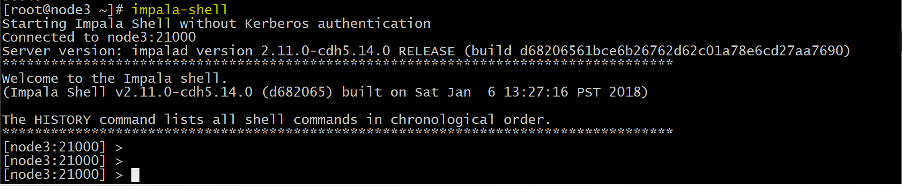

### 内部表

内部表由Impala管理，当您从Impala中删除时，数据和表确实被删除。当您使用Impala创建新表时，它通常是内部表。

```sql
  CREATE TABLE my_first_table
(
id BIGINT,
name STRING,
PRIMARY KEY(id)
)
PARTITION BY HASH PARTITIONS 16
STORED AS KUDU
TBLPROPERTIES (
'kudu.master_addresses' = 'node01:7051,node02:7051,node03:7051',
'kudu.table_name' = 'my_first_table'
);
--在 CREATE TABLE 语句中，必须首先列出构成主键的列。
```

### 外部表

外部表（创建者CREATE EXTERNAL TABLE）不受Impala管理，并且删除此表不会将表从其源位置（此处为Kudu）丢弃。相反，它只会去除Impala和Kudu之间的映射。这是Kudu提供的用于将现有表映射到Impala的语法。

首先使用java创建kudu表：

```java
public class CreateTable {
        private static ColumnSchema newColumn(String name, Type type, boolean iskey) {
                ColumnSchema.ColumnSchemaBuilder column = new
                    ColumnSchema.ColumnSchemaBuilder(name, type);
                column.key(iskey);
                return column.build();
        }
    public static void main(String[] args) throws KuduException {
        // master地址
        final String masteraddr = "node01,node02,node03";
        // 创建kudu的数据库链接
        KuduClient client = new
     KuduClient.KuduClientBuilder(masteraddr).defaultSocketReadTimeoutMs(6000).build();

        // 设置表的schema
        List<ColumnSchema> columns = new LinkedList<ColumnSchema>();
        columns.add(newColumn("CompanyId", Type.INT32, true));
        columns.add(newColumn("WorkId", Type.INT32, false));
        columns.add(newColumn("Name", Type.STRING, false));
        columns.add(newColumn("Gender", Type.STRING, false));
        columns.add(newColumn("Photo", Type.STRING, false));
        Schema schema = new Schema(columns);
    //创建表时提供的所有选项
    CreateTableOptions options = new CreateTableOptions();

    // 设置表的replica备份和分区规则
    List<String> parcols = new LinkedList<String>();

    parcols.add("CompanyId");
    //设置表的备份数
        options.setNumReplicas(1);
    //设置range分区
    options.setRangePartitionColumns(parcols);

    //设置hash分区和数量
    options.addHashPartitions(parcols, 3);
    try {
    client.createTable("person", schema, options);
    } catch (KuduException e) {
    e.printStackTrace();
    }
    client.close();
    }
}

```

使用impala创建外部表 ， 将kudu的表映射到impala上。

```sql
  CREATE EXTERNAL TABLE `person` STORED AS KUDU
TBLPROPERTIES(
    'kudu.table_name' = 'person',
    'kudu.master_addresses' = 'node01:7051,node02:7051,node03:7051')
```

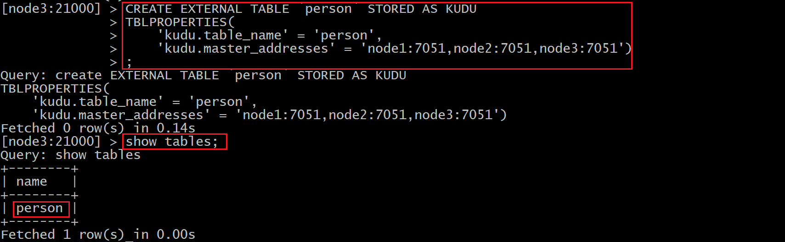

## 使用impala对kudu进行DML

### 插入数据2

impala 允许使用标准 SQL 语句将数据插入 Kudu 。

首先建表：

```sql

CREATE TABLE my_first_table1
(
id BIGINT,
name STRING,
PRIMARY KEY(id)
)
PARTITION BY HASH PARTITIONS 16
STORED AS KUDU
TBLPROPERTIES(
    'kudu.table_name' = 'person1',
    'kudu.master_addresses' = 'node01:7051,node02:7051,node03:7051');
```

此示例插入单个行：

```sql
INSERT INTO my_first_table VALUES (50, "zhangsan");
```

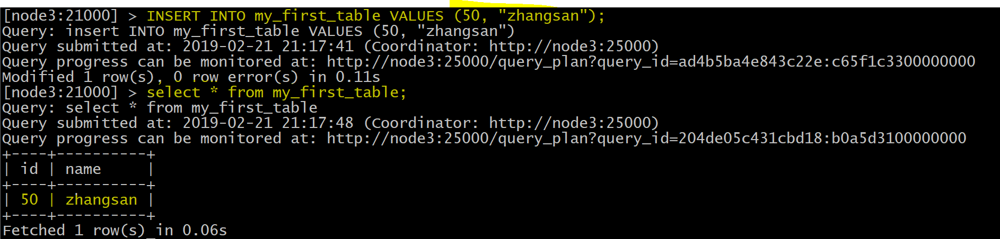

此示例插入3行：

```sql
INSERT INTO my_first_table VALUES (1, "john"), (2, "jane"), (3, "jim");
```

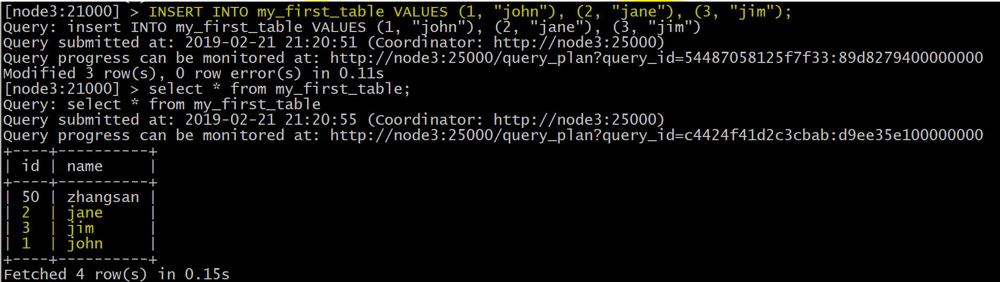

批量导入数据：

从 Impala 和 Kudu 的角度来看，通常表现最好的方法通常是使用 Impala 中的 SELECT FROM 语句导入数据。

```sql
INSERT INTO my_first_table SELECT * FROM temp1;
```

更新数据

```sql
UPDATE my_first_table SET name="xiaowang" where id =1 ;
```

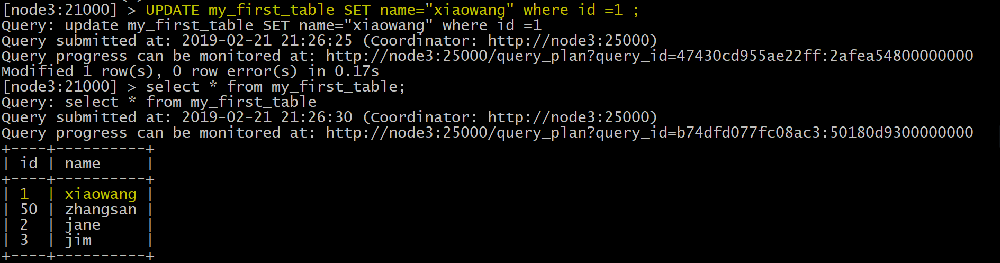

删除数据

```sql
delete from my_first_table where id =2;
```

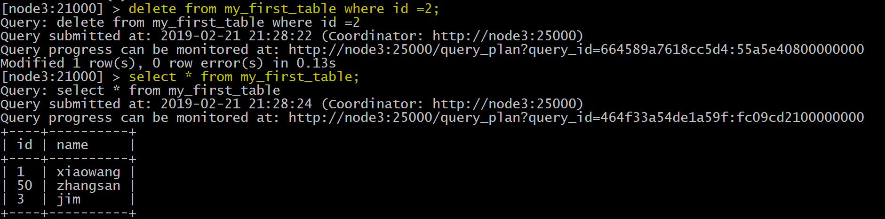

### 更改表属性

### 重命名impala表

```sql
ALTER TABLE PERSON RENAME TO person_temp;
```

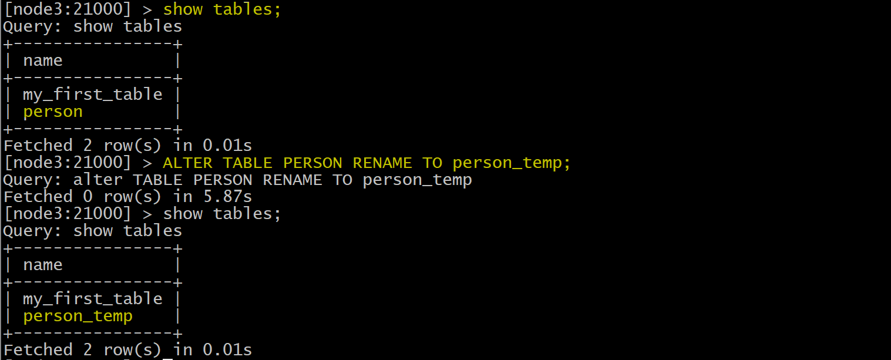

### 重新命名内部表的基础kudu表

创建内部表：

```sql
CREATE TABLE kudu_student
(
CompanyId INT,
WorkId INT,
Name STRING,
Gender STRING,
Photo STRING,
PRIMARY KEY(CompanyId)
)
PARTITION BY HASH PARTITIONS 16
STORED AS KUDU
TBLPROPERTIES (
'kudu.master_addresses' = 'node01:7051,node02:7051,node03:7051',
'kudu.table_name' = 'student'
);
```

如果表是内部表，则可以通过更改 kudu.table_name 属性重命名底层的 Kudu 表。

```sql
ALTER TABLE kudu_student SET TBLPROPERTIES('kudu.table_name' = 'new_student');
```

### 将外部表重新映射kudu表

如果用户在使用过程中发现其他应用程序重新命名了kudu表，那么此时的外部表需要重新映射到kudu上。
首先创建一个外部表：

```sql
CREATE EXTERNAL TABLE external_table
    STORED AS KUDU
    TBLPROPERTIES (
    'kudu.master_addresses' = 'node01:7051,node02:7051,node03:7051',
    'kudu.table_name' = 'person'
);
```

重新映射外部表，指向不同的kudu表：

```sql
ALTER TABLE external_table
SET TBLPROPERTIES('kudu.table_name' = 'hashTable')
```

上面的操作是：将external_table映射的PERSON表重新指向hashTable表。

### 更改kudu master地址

```sql
ALTER TABLE my_table
SET TBLPROPERTIES('kudu.master_addresses' = 'kudu-new-master.example.com:7051');
```

### 将内部表改为外部表

```sql
ALTER TABLE my_table SET TBLPROPERTIES('EXTERNAL' = 'TRUE');
```

## impala使用java操作kudu

对于impala而言，开发人员是可以通过JDBC连接impala的，有了JDBC，开发人员可以通过impala来间接操作 kudu。

 引入依赖

```xml
      <!--impala的jdbc操作-->
   <dependency>
            <groupId>com.cloudera</groupId>
            <artifactId>ImpalaJDBC41</artifactId>
            <version>2.5.42</version>
        </dependency>

        <!--Caused by : ClassNotFound : thrift.protocol.TPro-->
        <dependency>
            <groupId>org.apache.thrift</groupId>
            <artifactId>libfb303</artifactId>
            <version>0.9.3</version>
            <type>pom</type>
        </dependency>

        <!--Caused by : ClassNotFound : thrift.protocol.TPro-->
        <dependency>
            <groupId>org.apache.thrift</groupId>
            <artifactId>libthrift</artifactId>
            <version>0.9.3</version>
            <type>pom</type>
        </dependency>
        <dependency>
            <groupId>org.apache.hive</groupId>
            <artifactId>hive-jdbc</artifactId>
            <exclusions>
                <exclusion>
                    <groupId>org.apache.hive</groupId>
                    <artifactId>hive-service-rpc</artifactId>
                </exclusion>
                <exclusion>
                    <groupId>org.apache.hive</groupId>
                    <artifactId>hive-service</artifactId>
                </exclusion>
            </exclusions>
            <version>1.1.0</version>
        </dependency>

        <!--导入hive-->
        <dependency>
            <groupId>org.apache.hive</groupId>
            <artifactId>hive-service</artifactId>
            <version>1.1.0</version>
        </dependency>

```

### jdbc连接impala操作kudu

使用JDBC连接impala操作kudu，与JDBC连接mysql做更重增删改查基本一样。
 创建实体类

```java
package cn.xhchen.impala.impala;

public class Person {
    private int companyId;
    private int workId;
    private  String name;
    private  String gender;
    private  String photo;

    public Person(int companyId, int workId, String name, String gender, String photo) {
        this.companyId = companyId;
        this.workId = workId;
        this.name = name;
        this.gender = gender;
        this.photo = photo;
    }

    public int getCompanyId() {
        return companyId;
    }

    public void setCompanyId(int companyId) {
        this.companyId = companyId;
    }

    public int getWorkId() {
        return workId;
    }

    public void setWorkId(int workId) {
        this.workId = workId;
    }

    public String getName() {
        return name;
    }

    public void setName(String name) {
        this.name = name;
    }

    public String getGender() {
        return gender;
    }

    public void setGender(String gender) {
        this.gender = gender;
    }

    public String getPhoto() {
        return photo;
    }

    public void setPhoto(String photo) {
        this.photo = photo;
    }
}
```

 JDBC连接impala对kudu进行增删改查

```java
package cn.xhchen.impala.impala;

import java.sql.*;

public class Contants {
    private static String JDBC_DRIVER="com.cloudera.impala.jdbc41.Driver";
    private static  String CONNECTION_URL="jdbc:impala://node01:21050/default;auth=noSasl";
     //定义数据库连接
    static Connection conn=null;
    //定义PreparedStatement对象
    static PreparedStatement ps=null;
    //定义查询的结果集
    static ResultSet rs= null;


    //数据库连接
    public static Connection getConn(){
        try {
            Class.forName(JDBC_DRIVER);
            conn=DriverManager.getConnection(CONNECTION_URL);
        } catch (Exception e) {
            e.printStackTrace();
        }

        return  conn;

    }

    //创建一个表
    public static void createTable(){
        conn=getConn();
        String sql="CREATE TABLE impala_kudu_test" +
                "(" +
                "companyId BIGINT," +
                "workId BIGINT," +
                "name STRING," +
                "gender STRING," +
                "photo STRING," +
                "PRIMARY KEY(companyId)" +
                ")" +
                "PARTITION BY HASH PARTITIONS 16 " +
                "STORED AS KUDU " +
                "TBLPROPERTIES (" +
                "'kudu.master_addresses' = 'node01:7051,node02:7051,node03:7051'," +
                "'kudu.table_name' = 'impala_kudu_test'" +
                ");";

        try {
            ps = conn.prepareStatement(sql);
            ps.execute();
        } catch (SQLException e) {
            e.printStackTrace();
        }
    }


    //查询数据
    public static ResultSet queryRows(){
        try {
            //定义执行的sql语句
            String sql="select * from impala_kudu_test";
            ps = getConn().prepareStatement(sql);
            rs= ps.executeQuery();
        } catch (SQLException e) {
            e.printStackTrace();
        }

        return  rs;
    }

    //打印结果
    public  static void printRows(ResultSet rs){
        /**
         private int companyId;
         private int workId;
         private  String name;
         private  String gender;
         private  String photo;
         */

        try {
            while (rs.next()){
                //获取表的每一行字段信息
                int companyId = rs.getInt("companyId");
                int workId = rs.getInt("workId");
                String name = rs.getString("name");
                String gender = rs.getString("gender");
                String photo = rs.getString("photo");
                System.out.print("companyId:"+companyId+" ");
                System.out.print("workId:"+workId+" ");
                System.out.print("name:"+name+" ");
                System.out.print("gender:"+gender+" ");
                System.out.println("photo:"+photo);

            }
        } catch (SQLException e) {
            e.printStackTrace();
        }finally {
            if(ps!=null){
                try {
                    ps.close();
                } catch (SQLException e) {
                    e.printStackTrace();
                }
            }

            if(conn !=null){
                try {
                    conn.close();
                } catch (SQLException e) {
                    e.printStackTrace();
                }
            }
        }
    }


    //插入数据
    public static void insertRows(Person person){
        conn=getConn();
        String sql="insert into table impala_kudu_test(companyId,workId,name,gender,photo) values(?,?,?,?,?)";

        try {
            ps=conn.prepareStatement(sql);
            //给占位符？赋值
            ps.setInt(1,person.getCompanyId());
            ps.setInt(2,person.getWorkId());
            ps.setString(3,person.getName());
            ps.setString(4,person.getGender());
            ps.setString(5,person.getPhoto());
            ps.execute();

        } catch (SQLException e) {
            e.printStackTrace();
        }finally {
            if(ps !=null){
                try {
                    //关闭
                    ps.close();
                } catch (SQLException e) {
                    e.printStackTrace();
                }
            }

            if(conn !=null){
                try {
                      //关闭
                    conn.close();
                } catch (SQLException e) {
                    e.printStackTrace();
                }
            }
        }

    }

    //更新数据
    public static void updateRows(Person person){
       //定义执行的sql语句
        String sql="update impala_kudu_test set workId="+person.getWorkId()+
                ",name='"+person.getName()+"' ,"+"gender='"+person.getGender()+"' ,"+
                "photo='"+person.getPhoto()+"' where companyId="+person.getCompanyId();

        try {
            ps= getConn().prepareStatement(sql);
            ps.execute();
        } catch (SQLException e) {
            e.printStackTrace();
        }finally {
            if(ps !=null){
                try {
                      //关闭
                    ps.close();
                } catch (SQLException e) {
                    e.printStackTrace();
                }
            }

            if(conn !=null){
                try {
                      //关闭
                    conn.close();
                } catch (SQLException e) {
                    e.printStackTrace();
                }
            }
        }
    }

    //删除数据
    public   static void deleteRows(int companyId){
        //定义sql语句
        String sql="delete from impala_kudu_test where companyId="+companyId;
        try {
            ps =getConn().prepareStatement(sql);
            ps.execute();
        } catch (SQLException e) {
            e.printStackTrace();

        }
    }

   //删除表
    public static void dropTable() {
        String sql="drop table if exists impala_kudu_test";
        try {
            ps =getConn().prepareStatement(sql);
            ps.execute();
        } catch (SQLException e) {
            e.printStackTrace();
        }
    }
}
```

代码测试运行

```java

package cn.xhchen.impala.impala;

import java.sql.Connection;

public class ImpalaJdbcClient {
    public static void main(String[] args) {
        Connection conn = Contants.getConn();

        //创建一个表
       Contants.createTable();

        //插入数据
       Contants.insertRows(new Person(1,100,"lisi","male","lisi-photo"));

        //查询表的数据
        ResultSet rs = Contants.queryRows();
        Contants.printRows(rs);

        //更新数据
        Contants.updateRows(new Person(1,200,"zhangsan","male","zhangsan-photo"));

        //删除数据
        Contants.deleteRows(1);

        //删除表
        Contants.dropTable();

    }
}
```

## Apache Kudu原理

### table与schema

Kudu设计是面向结构化存储的，因此，Kudu的表需要用户在建表时定义它的Schema信息，这些Schema信息包含：列定义（含类型），Primary Key定义（用户指定的若干个列的有序组合）。数据的唯一性，依赖于用户所提供的Primary Key中的Column组合的值的唯一性。Kudu提供了Alter命令来增删列，但位于Primary Key中的列是不允许删除的。
从用户角度来看，Kudu是一种存储结构化数据表的存储系统。在一个Kudu集群中可以定义任意数量的table，每个table都需要预先定义好schema。每个table的列数是确定的，每一列都需要有名字和类型，每个表中可以把其中一列或多列定义为主键。这么看来，Kudu更像关系型数据库，而不是像HBase、Cassandra和MongoDB这些NoSQL数据库。不过Kudu目前还不能像关系型数据一样支持二级索引。
Kudu使用确定的列类型，而不是类似于NoSQL的“everything is byte”。带来好处：确定的列类型使Kudu可以进行类型特有的编码,可以提供元数据给其他上层查询工具。

### kudu底层数据模型

Kudu的底层数据文件的存储，未采用HDFS这样的较高抽象层次的分布式文件系统，而是自行开发了一套可基于Table/Tablet/Replica视图级别的底层存储系统。
这套实现基于如下的几个设计目标：
• 可提供快速的列式查询
• 可支持快速的随机更新
• 可提供更为稳定的查询性能保障

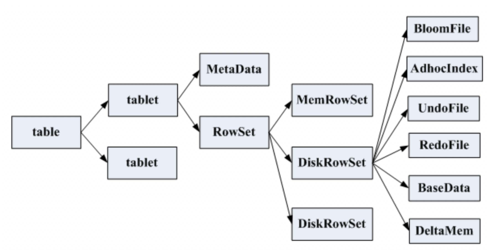

一张table会分成若干个tablet，每个tablet包括MetaData元信息及若干个RowSet。
RowSet包含一个MemRowSet及若干个DiskRowSet，DiskRowSet中包含一个BloomFile、Ad_hoc Index、BaseData、DeltaMem及若干个RedoFile和UndoFile。
MemRowSet：用于新数据insert及已在MemRowSet中的数据的更新，一个MemRowSet写满后会将数据刷到磁盘形成若干个DiskRowSet。默认是1G或者或者120S。
DiskRowSet：用于老数据的变更，后台定期对DiskRowSet做compaction，以删除没用的数据及合并历史数据，减少查询过程中的IO开销。
BloomFile：根据一个DiskRowSet中的key生成一个bloom filter，用于快速模糊定位某个key是否在DiskRowSet中。
Ad_hocIndex：是主键的索引，用于定位key在DiskRowSet中的具体哪个偏移位置。
BaseData是MemRowSet flush下来的数据，按列存储，按主键有序。
UndoFile是基于BaseData之前时间的历史数据，通过在BaseData上apply UndoFile中的记录，可以获得历史数据。
RedoFile是基于BaseData之后时间的变更记录，通过在BaseData上apply RedoFile中的记录，可获得较新的数据。
DeltaMem用于DiskRowSet中数据的变更，先写到内存中，写满后flush到磁盘形成RedoFile。
REDO与UNDO与关系型数据库中的REDO与UNDO日志类似（在关系型数据库中，REDO日志记录了更新后的数据，可以用来恢复尚未写入Data File的已成功事务更新的数据。而UNDO日志用来记录事务更新之前的数据，可以用来在事务失败时进行回滚）

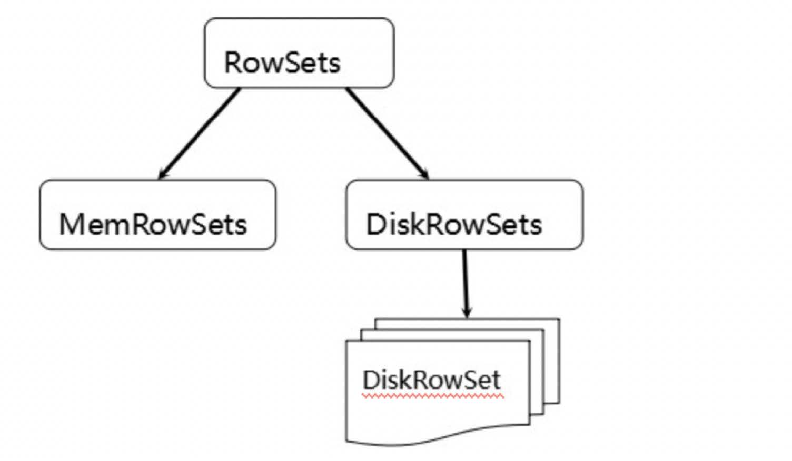

MemRowSets可以对比理解成HBase中的MemStore, 而DiskRowSets可理解成HBase中的HFile。
MemRowSets中的数据被Flush到磁盘之后，形成DiskRowSets。 DisRowSets中的数据，按照32MB大小为单位，按序划分为一个个的DiskRowSet。 DiskRowSet中的数据按照Column进行组织，与Parquet类似。
这是Kudu可支持一些分析性查询的基础。每一个Column的数据被存储在一个相邻的数据区域，而这个数据区域进一步被细分成一个个的小的Page单元，与HBase File中的Block类似，对每一个Column Page可采用一些Encoding算法，以及一些通用的Compression算法。 既然可对Column Page可采用Encoding以及Compression算法，那么，对单条记录的更改就会比较困难了。
前面提到了Kudu可支持单条记录级别的更新/删除，是如何做到的？
与HBase类似，也是通过增加一条新的记录来描述这次更新/删除操作的。DiskRowSet是不可修改了，那么 KUDU 要如何应对数据的更新呢？在KUDU中，把DiskRowSet分为了两部分：base data、delta stores。base data 负责存储基础数据，delta stores负责存储 base data 中的变更数据.

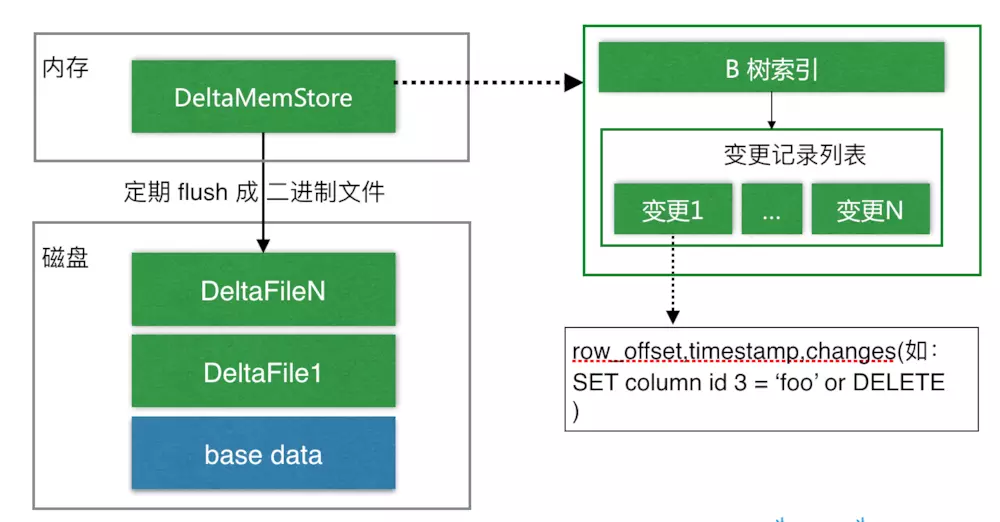

如上图所示，数据从 MemRowSet 刷到磁盘后就形成了一份 DiskRowSet（只包含 base data），每份 DiskRowSet 在内存中都会有一个对应的 DeltaMemStore，负责记录此 DiskRowSet 后续的数据变更（更新、删除）。DeltaMemStore 内部维护一个 B-树索引，映射到每个 row_offset 对应的数据变更。DeltaMemStore 数据增长到一定程度后转化成二进制文件存储到磁盘，形成一个 DeltaFile，随着 base data 对应数据的不断变更，DeltaFile 逐渐增长。

### tablet发现过程

当创建Kudu客户端时，其会从主服务器上获取tablet位置信息，然后直接与服务于该tablet的服务器进行交谈。
为了优化读取和写入路径，客户端将保留该信息的本地缓存，以防止他们在每个请求时需要查询主机的tablet位置信息。随着时间的推移，客户端的缓存可能会变得过时，并且当写入被发送到不再是tablet领导者的tablet服务器时，则将被拒绝。然后客户端将通过查询主服务器发现新领导者的位置来更新其缓存。

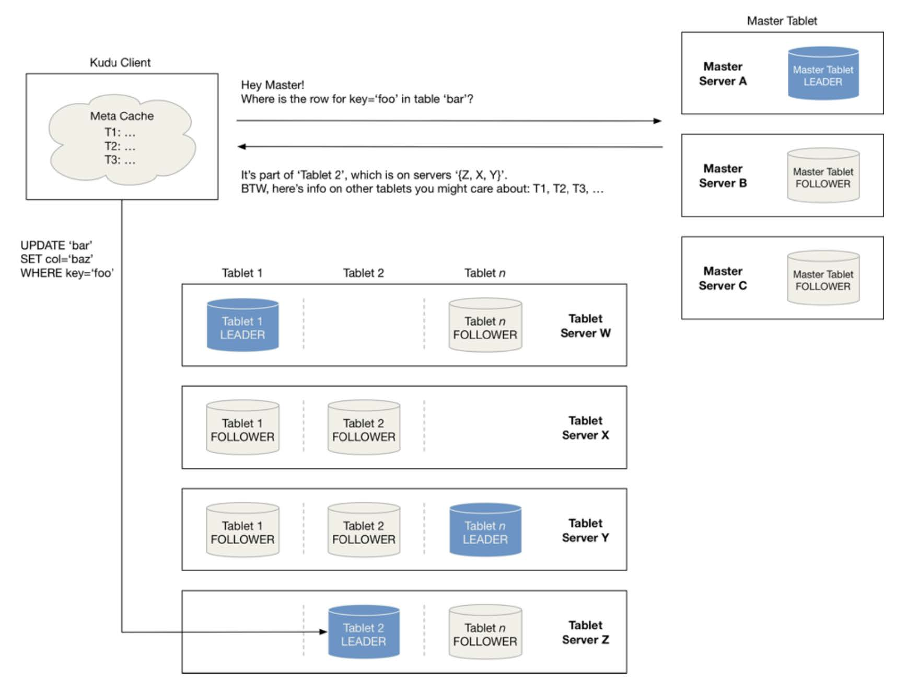

### kudu写流程

当 Client 请求写数据时，先根据主键从Master Server中获取要访问的目标 Tablets，然后到依次对应的Tablet获取数据。
因为KUDU表存在主键约束，所以需要进行主键是否已经存在的判断，这里就涉及到之前说的索引结构对读写的优化了。一个Tablet中存在很多个RowSets，为了提升性能，我们要尽可能地减少要扫描的RowSets数量。
首先，我们先通过每个 RowSet 中记录的主键的（最大最小）范围，过滤掉一批不存在目标主键的RowSets，然后在根据RowSet中的布隆过滤器，过滤掉确定不存在目标主键的 RowSets，最后再通过RowSets中的 B-树索引，精确定位目标主键是否存在。
如果主键已经存在，则报错（主键重复），否则就进行写数据（写 MemRowSet）。

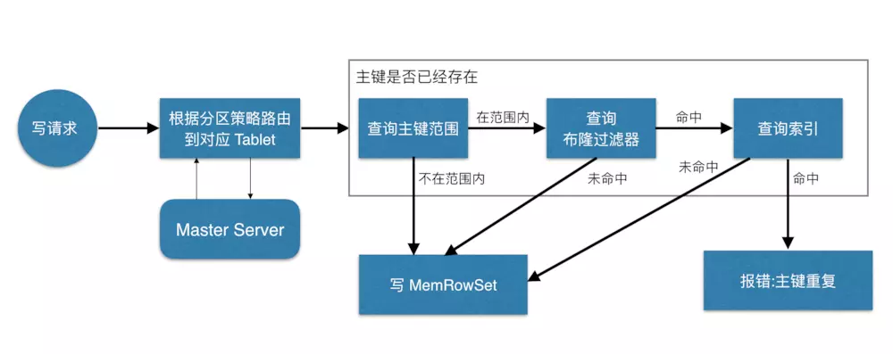

### kudu读流程

数据读取过程大致如下：先根据要扫描数据的主键范围，定位到目标的Tablets，然后读取Tablets 中的RowSets。
在读取每个RowSet时，先根据主键过滤要scan范围，然后加载范围内的base data，再找到对应的delta stores，应用所有变更，最后union上MemRowSet中的内容，返回数据给Client。
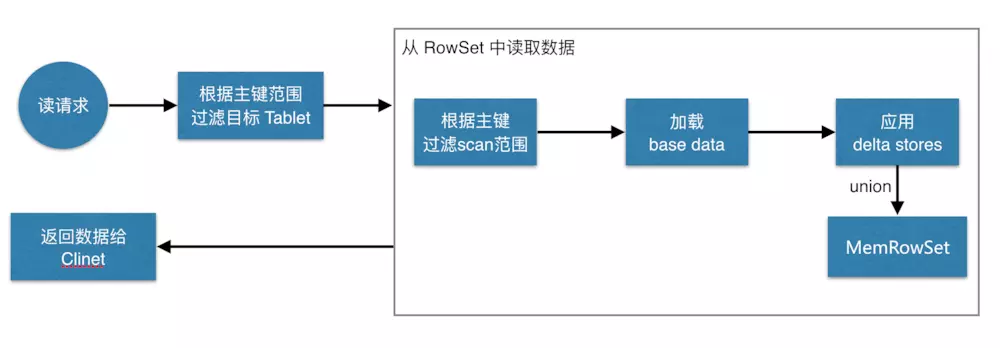

### kudu更新流程

数据更新的核心是定位到待更新数据的位置，这块与写入的时候类似，就不展开了，等定位到具体位置后，然后将变更写到对应的delta store 中。
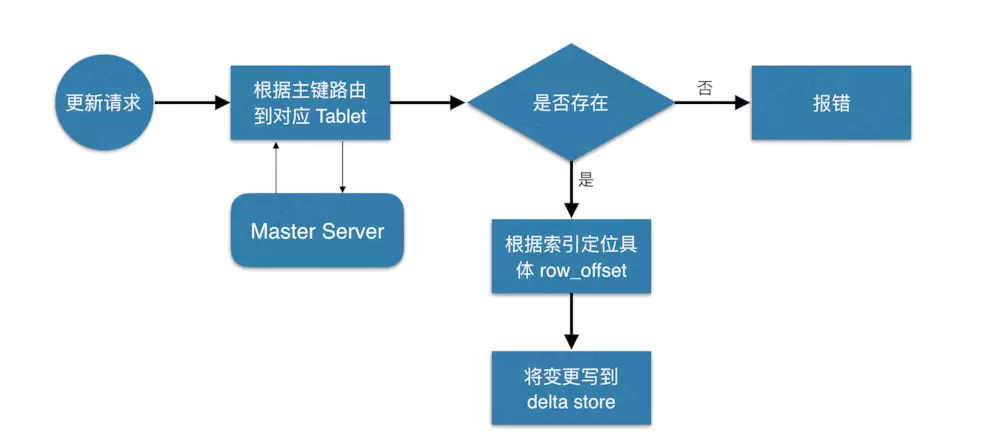

### 解决kudu环境问题

Extracted Content: kudu-master 无法启动, 有时候启动了,也马上就挂了,
有时候启动OK, 但是 ps -ef | grep kudu 查看进程, 发现没有进程
查看日志发现报错大概意思是ntp时钟同步的问题 ,虚拟机经常挂起很容易出现这个问题

 

```shell
 cd /var/log/kudu
```

 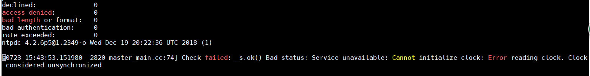

 解决办法:
1 手动同步下
命令行输入crontab -e,将里面的代码拷贝出来/usr/sbin/ntpdate ntp4.aliyun.com
命令行执行手动同步 /usr/sbin/ntpdate ntp4.aliyun.com

 

2 手动同步后, 删除kudu的mater和tserver目录 ,然后重启ntp, 再重启kudu, 发现还是不行, 还是一样的报错

```shell
· cd /export/servers/kudu
· rm -rf master/
· rm -rf tserver/
· service ntpd restart
· service kudu-master start
· service kudu-tserver start
```

3 打开ntp配置文件, 修改下同步配置

```shell
vi /etc/ntp.conf

```

 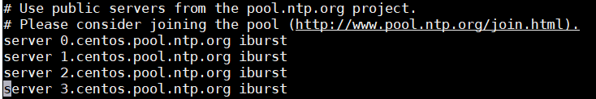
 将以上的内容,改成以下的内容
 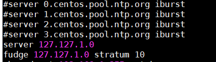
4 删除kudu的mater和tserver目录 ,然后重启ntp, 再重启kudu,问题得到解决

```shell
· cd /export/servers/kudu
· rm -rf master/
· rm -rf tserver/
· service ntpd restart
· service kudu-master start
· service kudu-tserver start
```

 5 检查进程, 发现master , tserver进程都正常

 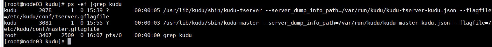

6 master访问 <http://node01:8051/>
tserver访问 <http://node01:8051/tablet-servers>

 4.1   集群时间戳不同步：
           systemctl restart ntpd    //设置时间戳
           systemctl enable ntpd   //设置开机自启动

## /卸载apache kudu.txt

```text
rpm -qa |grep kudu

kudu-tserver-1.6.0+cdh5.14.0+0-1.cdh5.14.0.p0.47.el6.x86_64
kudu-1.6.0+cdh5.14.0+0-1.cdh5.14.0.p0.47.el6.x86_64
kudu-client-devel-1.6.0+cdh5.14.0+0-1.cdh5.14.0.p0.47.el6.x86_64
kudu-master-1.6.0+cdh5.14.0+0-1.cdh5.14.0.p0.47.el6.x86_64
kudu-client0-1.6.0+cdh5.14.0+0-1.cdh5.14.0.p0.47.el6.x86_64

---------------------------------------------------------------
rpm -e kudu-tserver-1.6.0+cdh5.14.0+0-1.cdh5.14.0.p0.47.el6.x86_64 --nodeps
rpm -e kudu-1.6.0+cdh5.14.0+0-1.cdh5.14.0.p0.47.el6.x86_64 --nodeps
rpm -e kudu-client-devel-1.6.0+cdh5.14.0+0-1.cdh5.14.0.p0.47.el6.x86_64 --nodeps
rpm -e kudu-master-1.6.0+cdh5.14.0+0-1.cdh5.14.0.p0.47.el6.x86_64 --nodeps
rpm -e kudu-client0-1.6.0+cdh5.14.0+0-1.cdh5.14.0.p0.47.el6.x86_64 --nodeps

---------------------------------------------------------------
rm -rf $(find / -name "*kudu*")
该操作会导致本地yum源中kudu rpm包被删除  需要重新恢复

修补本地安装的yum源 否则后续再次安装就失败了
cd /cloudera_data/
rm -rf cdh/
tar zxvf cdh5.14.0-centos6.tar.gz
```

### 2.8. 使用 Scala 操作 Kudu

. `Kudu API` 结构
. 导入 `Kudu` 所需要的包
. 创建表
. 插入数据
. 查询数据

`Kudu API` 的结构设计:

| 对象 | 设计

### `Client` a|

创建: 使用 `Kudu master` 服务器地址列表来创建
作用: `Kudu` 的 `API` 主入口, 通过 `Client` 对象获取 `Table` 后才能操作数据
操作:

* 检查表是否存在
* 提交表的 `DDL` 操作, 如 `create`, `delete`, `alter`, 在对表进行 `DDL` 的时候, 需要如下两个对象
* 创建 `Table` 对象

### `Table`

创建: 通过 `Client` 对象开启
作用: 通过 `Table` 对象可以操作表中的数据
操作:

* `insert`, `delete`, `update`, `upsert` 行
* 扫描行

| `Scanner` a|

创建: 通过 `Table` 对象开启扫描

作用: 扫描表数据, 并获取结果

操作:

* `Kudu` 中可以通过读取模式空值该读到哪些数据, 有如下三种读取模式
** `READ_LATEST` 是 `Scanner` 的默认模式, 只会返回已经提交的数据, 类似 `ACID` 中的 `ReadCommitted`
** `READ_AT_SNAPSHOT` 读取某一个时间点的数据, 这个模式效率相对比较低, 因为会等待这个时间点之前的所有事务都提交后, 才会返回响应的数据, 类似 `ACID` 中的 `RepeatableRead`
** `READ_YOUR_WRITES` 这种模式会确保读取到自己已经写入的数据, 并且尽可能的忽略其他人的写入, 会导致读取期间有其它人写入但是没有等待, 所以产生的问题就是每次读取的数据可能是不同的, 当前还是实验性功能, 尽量不要使用

导入 `Kudu` 所需要的包:
`Kudu` 并没有提供 `Scala` 单独的客户端 `SDK`, 但是提供了 `Java` 的 `SDK`, 我们使用 `Scala` 访问 `Kudu` 的时候, 可以使用 `Java` 的 `API`, 可以创建一个新的工程开始 `Kudu Scala` 的学习, 创建工程的方式参照 `Spark` 部分第一天, 创建工程后, 需要先做如下两件事

需要导入如下三个 `Maven` 插件:

* `maven-compile-plugin`

`Maven` 的编译插件其实是自动导入的, 现在需要导入这个插件的目的主要是需要通过其指定 `JDK` 的版本

* `maven-shade-plugin`

一般工程打包的方式有两种

* `uber Jar`
直译过来就是胖 `Jar`, 其中包含了所有依赖的 `Jar` 包, 通常会重命名其中一些类以避免冲突,

* `non-uber Jar`

瘦 `Jar`, 没有包含依赖的 `Jar` 包, 在运行的时候使用环境中已有的库

* `scala-maven-plugin`

引入这个插件的主要作用是编译 `Scala` 代码

NOTE: 举个栗子, 比如说现在在本地引入了 `Spark` 的依赖, 要提交代码去集群运行, 但是集群中必然包含了 `Spark` 相关的所有依赖, 那么此时是否需要再生成 `Uber Jar` 了呢? 明显不需要, 因为 `Spark` 在安装部署集群的时候, `Spark` 的软件包内, 有一个 `lib` 目录, 其中所有的 `Jar` 包在运行的时候都会被加载, 完全不需要 `Uber Jar`

NOTE: 再举个栗子, 比如说现在依然是引入 `Spark` 的依赖, 但是同时引入了一个 `JSON` 解析的包, 但是这个 `JSON` 解析的包在集群中并没有, 那么此时如何解决? 有两种方式, 一种是 `Non-Uber Jar`, 但是将依赖的 `Jar` 包在使用 `spark-submit` 命令提交任务的时候通过 `-jar` 参数一并提交过去. 另外一种是直接生成 `Uber Jar` 包含这个 `JSON` 解析库

需要导入一个 `Kudu` 的依赖包:
根据使用 Hadoop 的版本不同, Kudu 的导入方式有两种, 一种是 CDH 版本的依赖, 一种是 Apache 版本的依赖, 我们当前使用 CDH 版本的依赖, 所以需要导入如下包

```xml
<dependency>
    <groupId>org.apache.kudu</groupId>
    <artifactId>kudu-client</artifactId>
    <version>1.7.0-cdh5.16.1</version>
    <scope>provided</scope>
</dependency>
```

整个 `Maven` 文件如下所示:

```xml
<repositories>
    <repository>
        <id>cdh.repo</id>
        <name>Cloudera Repositories</name>
        <url>https://repository.cloudera.com/artifactory/cloudera-repos</url>
        <snapshots>
            <enabled>false</enabled>
        </snapshots>
    </repository>
</repositories>

<properties>
    <junit.version>4.12</junit.version>
    <maven.version>3.5.1</maven.version>
</properties>

<dependencies>
    <!-- Kudu client -->
    <dependency>
        <groupId>org.apache.kudu</groupId>
        <artifactId>kudu-client</artifactId>
        <version>1.7.0-cdh5.16.1</version>
        <scope>provided</scope>
    </dependency>

    <!-- Logging -->
    <dependency>
        <groupId>org.slf4j</groupId>
        <artifactId>slf4j-simple</artifactId>
        <version>1.7.12</version>
    </dependency>

    <!-- Unit testing -->
    <dependency>
        <groupId>junit</groupId>
        <artifactId>junit</artifactId>
        <version>${junit.version}</version>
        <scope>provided</scope>
    </dependency>
</dependencies>

<build>
    <sourceDirectory>src/main/scala</sourceDirectory>
    <testSourceDirectory>src/test/scala</testSourceDirectory>

    <plugins>
        <plugin>
            <groupId>org.apache.maven.plugins</groupId>
            <artifactId>maven-compiler-plugin</artifactId>
            <version>${maven.version}</version>
            <configuration>
                <source>1.8</source>
                <target>1.8</target>
            </configuration>
        </plugin>

        <plugin>
            <groupId>net.alchim31.maven</groupId>
            <artifactId>scala-maven-plugin</artifactId>
            <version>3.2.0</version>
            <executions>
                <execution>
                    <goals>
                        <goal>compile</goal>
                        <goal>testCompile</goal>
                    </goals>
                    <configuration>
                        <args>
                            <arg>-dependencyfile</arg>
                            <arg>${project.build.directory}/.scala_dependencies</arg>
                        </args>
                    </configuration>
                </execution>
            </executions>
        </plugin>

        <plugin>
            <groupId>org.apache.maven.plugins</groupId>
            <artifactId>maven-shade-plugin</artifactId>
            <version>2.4</version>
            <executions>
                <execution>
                    <phase>package</phase>
                    <goals>
                        <goal>shade</goal>
                    </goals>
                </execution>
            </executions>
        </plugin>
    </plugins>
</build>
```

创建表:

在进行如下操作之前, 需要先创建 `Scala` 的类, 通过 `Junit` 的方式编写代码, 当然, 也可以创建 `Object`, 编写 `Main` 方法来运行

. 创建 `KuduClient` 实例
. 创建表的列模式 `Schema`
. 创建表

```scala
// Kudu 的 Master 地址
val KUDU_MASTER = "node01:7051"

// 创建 KuduClient 入口
val kuduClient = new KuduClientBuilder(KUDU_MASTER).build()

// 创建列定义的 List
val columns = List(
  new ColumnSchemaBuilder("key", Type.STRING).key(true).build(),
  new ColumnSchemaBuilder("value", Type.STRING).key(false).build()
)

// 因为是 Java 的 API, 所以在使用 List 的时候要转为 Java 中的 List
import scala.collection.JavaConverters._
val javaColumns = columns.asJava

// 创建 Schema
val schema = new Schema(javaColumns)

// 因为 Kudu 必须要指定分区, 所以先创建一个分区键设置
val keys = List("key").asJava
val options = new CreateTableOptions().setRangePartitionColumns(keys).setNumReplicas(1)

// 通过 Schema 创建表
kuduClient.createTable("simple", schema, options)
```

如果运行程序的时候发现报错 `Kudu master has no leader`, 说明 Kudu 的 Master server 拒绝了这次连接, 是因为 Kudu 自身的安全机制导致的, 需要修改配置文件 `/etc/Kudu/conf/master.gflagfile`, 增加如下内容

```text
--unlock_unsafe_flags=true
--allow_unsafe_replication_factor=true
--default_num_replicas=1
--rpc_negotiation_timeout_ms=9000
--rpc-encryption=disabled
--rpc_authentication=disabled
--trusted_subnets=0.0.0.0/0
```

插入数据:
+

. 创建 `KuduContext` 对象
. 创建 `Table` 对象来表示一个表
. 创建 `Parial Row` 对象来表示要插入的数据
. 开启会话, 使插入生效(传给 Kudu)

```scala
val KUDU_MASTER = "node01:7051,node02:7051,node03:7051"
val kuduClient = new KuduClientBuilder(KUDU_MASTER).build()

// 创建 Table 对象, 其含义是通过 Table 对象表示一个 Kudu 表
val table = kuduClient.openTable("simple")

// 创建一个 Partial Row 对象, 含义是一个 Row 的一部分
// 通过这个对象可以组织行的数据, 同时也代表一个插入行为
val insert = table.newInsert()
val row = insert.getRow
row.addString(0, "A")
row.addString(1, "1")

// 开启会话, 插入数据
val session = kuduClient.newSession()
session.apply(insert)
```

扫描查询数据:

. 投影会极大的增强查询性能, 所以一定要设置投影
. 开启扫描
. 通过扫描器获取每个 `Tablet` 的数据
. 再迭代 `Tablet` 中的数据, 获取每一行

```scala
val KUDU_MASTER = "node01:7051,node02:7051,node03:7051"
val kuduClient = new KuduClientBuilder(KUDU_MASTER).build()

// 要查询某个表, 当然要先开启
val table = kuduClient.openTable("simple")

// 投影信息(通俗的说, 就是要查询哪些列)
import scala.collection.JavaConverters._
val projects = List("key", "value").asJava

// 开启 Scanner 扫描器
val scanner = kuduClient.newScannerBuilder(table)
  .setProjectedColumnNames(projects)
  .build()

// 通过 Scanner 迭代, 但是 Scanner 每次迭代代表的是一个 Tablet 的数据
// 需要获取其中具体的每行数据时, 必须再迭代
while(scanner.hasMoreRows) {
  // 这个 Results 代表一个 Tablet 的数据
  val results = scanner.nextRows()

  // 迭代这个 Tablet 中的数据, 获取其中每行数据
  while (results.hasNext) {
    val resultRow = results.next()
    println(resultRow.getString(0), resultRow.getString(1))
  }
}
```

### 2.9. 使用 Spark 操作 Kudu

.导读
. 加入依赖
. 表的 `DDL`
. 数据的增删改
. 通过 `DataFrame` 读取表
. 通过 `DataFrame` 将数据落地到表

准备工作:

使用 `Spark` 操作 `Kudu` 需要至少以下几个 `Maven` 依赖

* `kudu-client`

无论使用什么操作 `Kudu`, 最终都需要 `Kudu` 的客户端 `SDK`

* `kudu-spark2_2.11`

`Kudu` 为和 `Spark` 整合提供的整合包

* `scala-library`

`Scala` 基础库

* `spark-core_2.11`

`Spark RDD` 的支持

* `spark-sql_2.11`

`Spark DataFrame` 的支持

* `spark-hive_2.11`

访问 `Hive` 的支持

所以需要在 `Maven` 的 `pom.xml` 中新增如下几个依赖

```scala
<!-- Spark -->
<dependency>
    <groupId>org.scala-lang</groupId>
    <artifactId>scala-library</artifactId>
    <version>2.11.8</version>
</dependency>
<dependency>
    <groupId>org.apache.spark</groupId>
    <artifactId>spark-core_2.11</artifactId>
    <version>2.2.0</version>
</dependency>
<dependency>
    <groupId>org.apache.spark</groupId>
    <artifactId>spark-sql_2.11</artifactId>
    <version>2.2.0</version>
</dependency>
<dependency>
    <groupId>org.apache.spark</groupId>
    <artifactId>spark-hive_2.11</artifactId>
    <version>2.2.0</version>
</dependency>
<dependency>
    <groupId>org.apache.hadoop</groupId>
    <artifactId>hadoop-client</artifactId>
    <version>2.6.0</version>
</dependency>

<!-- Kudu Spark -->
<dependency>
    <groupId>org.apache.kudu</groupId>
    <artifactId>kudu-spark2_2.11</artifactId>
    <version>1.7.0-cdh5.16.1</version>
</dependency>
```

`DDL`:

. 在进行 `DDL` 之前, 要至少创建两个对象
.. `SparkSession`

是 `Spark` 的入口, 这个大家已经很熟悉了
.. `KuduContext`

`Spark` 集成的关于 `Kudu` 的操作都在这个对象里面了, 代表对 `Kudu` 的操作
. 其次, 就可以开始进行 `DDL` 了
.. 通过 `tableExists` 传入表名即可判断表是否存在
.. 通过 `deleteTable` 传入标明即可删除某张表

做这件事的时候一定要慎重, 但是也因为大数据领域创建表一般都是可以通过前面的表或者操作重新创建的, 问题也不算太大, 但是依然要特别注意, 不要轻易执行
. 通过 `createTable` 创建表, 但是创建前, 需要以下四个内容
.. 表名称
.. `kuduTableSchema`

通过这个对象可以指定表的 `Schema` 信息, 所以这个对象是必须的, 但是要注意, 和 `Spark` 整合后的 `Kudu` 操作, `Schema` 是通过 `Spark` 的 `StructType` 来表示的, 而不是 `Kudu Client` 中的 `Schema` 对象
.. `kuduPrimaryKey`

因为 `KuduClient` 中的 `Schema` 可以设置某一列是主键, 但是 `Spark` 的 `StructType` 对象中没有主键的设置, 所以需要在建表的时候单独设置
.. `kuduTableOptions`

表的一些附加信息, 例如如何分区, 有多少个分片等

```scala
// 创建 SparkSession
val spark = SparkSession.builder()
  .master("local[6]")
  .appName("kudu")
  .enableHiveSupport()
  .getOrCreate()

// 在 Spark 中, 一贯的做法是通过某个 Context 来操作某个库
// Kudu 为 Spark 也提供了一个叫做 KuduContext 的东西, 用来操作 Kudu
val kuduMasters = Seq("node01:7051", "node02:7051", "node03:7051").mkString(",")
val kuduContext = new KuduContext(kuduMasters, spark.sparkContext)

// 判断一个表是否存在, 和删除表非常兼容, 只是一个 API 调用
if (kuduContext.tableExists("students")) {
  kuduContext.deleteTable("students")
}

// 为了创建一张表, 需要先指定表的 Schema
val schema = StructType(
  StructField("name", StringType, nullable = false) :
  StructField("age", IntegerType, nullable = false) :
  StructField("gpa", DoubleType, nullable = false) : Nil
)

// 通过 Options 对象能够携带一些参数
// 例如说按照某一个列如何分区, 副本多少
// 用于创建表
import scala.collection.JavaConverters._
val tableOptions = new CreateTableOptions()
    .setRangePartitionColumns(List("name").asJava)
    .setNumReplicas(1)

kuduContext.createTable("students", schema, Seq("name"), tableOptions)
```

增删改:

这个部分的增删改从一般的角度上来说意义不算太大, 因为一般情况下对于数据的操作, 我们更多还是直接使用 `DataFrame` 的 `DataFrameReader` 和 `DataFrameWriter` 了, 也就是 `df.read` 和 `df.write`, 但是也有一些特殊的情况, 例如要合并两张表, 如果数据相同则更新, 如果不相同则添加, 拿这个时候, 使用 `KuduContext` 的标准款增删改就更容易一些. 因为使用 df.write 来写入的话只能针对一个 `DataFrame` 所有的数据来写入, 不能部分追加部分更新

. `kuduContext.insertRows`
. `kuduContext.updateRows`
. `kuduContext.upsertRows`
. `kuduContext.deleteRows`

```scala
val spark = SparkSession.builder()
  .master("local[6]")
  .appName("kudu")
  .enableHiveSupport()
  .getOrCreate()

val kuduMasters = Seq("node01:7051", "node02:7051", "node03:7051").mkString(",")
val kuduContext = new KuduContext(kuduMasters, spark.sparkContext)

import spark.implicits._
val df = Seq(Student("张三", 10, 100), Student("李四", 15, 100)).toDF
kuduContext.insertRows(df, "students")

kuduContext.deleteRows(df, "students")

kuduContext.upsertRows(df, "students")

kuduContext.updateRows(df, "students")
```

`DataFrame` 写入表:

. 创建`SparkSession`

使用 `DataFrame` 来写入数据的时候, 用不着 `KuduContext`
. 读取数据, 生成 `DataFrame`
. 使用 `DataFrame` 的 `write` 进行写入

--
在写入的时候需要提供如下内容

* `SaveMode`, 写入模式, 必须是 `Append`, 暂时只支持 `Apend`
* 要写入的表
* `Master` 地址
--

```scala
val spark = SparkSession.builder()
  .master("local[6]")
  .appName("kudu")
  .enableHiveSupport()
  .getOrCreate()

val schema = StructType(
  StructField("name", StringType, nullable = false) :
    StructField("age", IntegerType, nullable = false) :
    StructField("gpa", DoubleType, nullable = false) : Nil
)

val df = spark.read
  .option("header", value = false)
  .option("delimiter", "\t")
  .schema(schema)
  .csv("dataset/studenttab10k")

// 使用 write.kudu 的时候, 需要先导入隐式转换
import org.apache.kudu.spark.kudu._

// 写入数据的时候要指定表和 Masters 地址
df.write
  .option("kudu.table", "students")
  .option("kudu.master", "node01:7051, node02:7051,node03:7051")
  .mode(SaveMode.Append)
  .kudu
```

`DataFrame` 读取表:

读取和写入其实就是遵循了 `DataFrame` 的读写方式, 最终调用调用 `kudu` 这个方法即可

. 创建 `SparkSession`
. 准备 `Schema`
. 读取打印

```scala
val spark = SparkSession.builder()
  .master("local[6]")
  .appName("kudu")
  .enableHiveSupport()
  .getOrCreate()

val kuduMasters = Seq("node01:7051", "node02:7051", "node03:7051").mkString(",")
val kuduContext = new KuduContext(kuduMasters, spark.sparkContext)

// 使用 read.kudu 的时候, 需要先导入隐式转换
import org.apache.kudu.spark.kudu._

val schema = StructType(
  StructField("name", StringType, nullable = false) :
    StructField("age", IntegerType, nullable = false) :
    StructField("gpa", DoubleType, nullable = false) : Nil
)

spark.read
  .option("kudu.table", "students")
  .option("kudu.master", "node01:7051, node02:7051,node03:7051")
  .kudu
  .show()
```

## SparkKudu.scala

```scala
package cn.xhchen.kudu

import java.util

import org.apache.kudu.client.CreateTableOptions
import org.apache.kudu.spark.kudu.KuduContext
import org.apache.spark.rdd.RDD
import org.apache.spark.{SparkConf, SparkContext}
import org.apache.spark.sql.{DataFrame, Row, SparkSession}
import org.apache.spark.sql.types.{IntegerType, StringType, StructField, StructType}
import org.apache.kudu.spark.kudu._


//todo:通过spark程序操作kudu

case class Itcast(id:Int,name:String,age:Int,sex:Int)
object SparkKudu {

  //定义kuduMaster地址
    val kuduMaster="node01:7051,node02:7051,node03:7051"

  //定义表名
    val  tableName="xhchen"

  //定义kuduOptions
  val kuduOptions=Map(
    "kudu.master" ->kuduMaster,
    "kudu.table" ->tableName
  )

  def main(args: Array[String]): Unit = {

      //1、创建SparkConf对象
      val sparkConf: SparkConf = new SparkConf().setAppName("SparkKudu").setMaster("local[2]")

     //2、创建SparkSession对象
         val sparkSession: SparkSession = SparkSession.builder().config(sparkConf).getOrCreate()

     //3、获取到SparkContext对象
       val sc: SparkContext = sparkSession.sparkContext
       sc.setLogLevel("warn")

    //4、构建KuduContext对象
        val kuduContext = new KuduContext(kuduMaster,sc)


    //5、操作kudu表
       //5.1 创建一张表
       //createTable(kuduContext)

       //5.2  加载数据
       //insertData(sparkSession,sc, kuduContext)

       //5.3  修改数据
      //updateData(sparkSession,kuduContext)

       //5.4 删除数据
      //deleteData(sparkSession,kuduContext)

    //6、通过dataFrame的api操作kudu表
          //6.1 通过dataFrame加载kudu表的数据
               val dataFrame: DataFrame = sparkSession.read.options(kuduOptions).kudu
               dataFrame.show()


          //6.2 把dataFrame结果数据保存到kudu表中
//          val data = List(Itcast(1, "xiaoming", 50, 0), Itcast(2, "xiaowang", 80, 1))
//         import sparkSession.implicits._
//         val dataFrame1: DataFrame = data.toDF()
//          // Currently, only Append is supported  目前 只支持append追加
//          dataFrame1.write.mode("append").options(kuduOptions).kudu

    //7、通过sparksql去执行sql语句来操作kudu表
        dataFrame.createTempView("xhchen")
       sparkSession.sql("select * from xhchen").show()
       sparkSession.sql("select count(*) from xhchen").show()
       sparkSession.sql("select * from xhchen where age >50").show()

       //查询数据
       val columnsList=List("id","name","age","sex")
       val rowRDD: RDD[Row] = kuduContext.kuduRDD(sc,tableName,columnsList)
       rowRDD.foreach(println)


    sc.stop()

  }

  private def deleteData(sparkSession: SparkSession,kuduContext: KuduContext): Unit = {
    val data = List(Itcast(1, "xiaoming", 50, 0), Itcast(2, "xiaowang", 80, 1))
    import sparkSession.implicits._
    val dataFrame: DataFrame = data.toDF.select("id")
    kuduContext.deleteRows(dataFrame, tableName)
  }

  private def updateData(sparkSession: SparkSession, kuduContext: KuduContext): Unit = {
    val data = List(Itcast(1, "xiaoming", 50, 0), Itcast(2, "xiaowang", 80, 1))
    import sparkSession.implicits._
    val dataFrame: DataFrame = data.toDF
    kuduContext.updateRows(dataFrame, tableName)
  }

  private def insertData(sparkSession: SparkSession, sc: SparkContext, kuduContext: KuduContext): Unit = {
    val data = List(Itcast(1, "xiaoming", 30, 1), Itcast(2, "xiaowang", 40, 0), Itcast(3, "xiaozhang", 50, 1))
    val xhchenRDD: RDD[Itcast] = sc.parallelize(data)
    import sparkSession.implicits._
    val dataFrame: DataFrame = xhchenRDD.toDF

    kuduContext.insertRows(dataFrame, tableName)
  }

  private def createTable(kuduContext: KuduContext): Any = {
    if (!kuduContext.tableExists(tableName)) {
      //指定表的schema信息
      val schema = StructType(
        StructField("id", IntegerType, false) :
          StructField("name", StringType, false) :
          StructField("age", IntegerType, false) :
          StructField("sex", IntegerType, false) : Nil
      )
      //指定表的主键字段
      val keys = List("id")

      //指定表的相关属性
      val options = new CreateTableOptions
      val partitionsList = new util.ArrayList[String]()
      partitionsList.add("id")
      options.addHashPartitions(partitionsList, 6)

      kuduContext.createTable(tableName, schema, keys, options)
    }
  }
}

```

## TestKudu.java

```java
package cn.xhchen.kudu;

import org.apache.kudu.ColumnSchema;
import org.apache.kudu.Schema;
import org.apache.kudu.Type;
import org.apache.kudu.client.*;
import org.junit.After;
import org.junit.Before;
import org.junit.Test;

import java.util.ArrayList;

//todo: 通过java代码来操作kudu集群，实现对kudu表的增删改查
public class TestKudu {

    //声明全局变量 KuduClient后期通过它来操作kudu表
    private KuduClient kuduClient;
    //指定kuduMaster地址
    private String kuduMaster;
    //指定表名
    private String tableName;

    @Before
    public void init(){
        //初始化操作
        kuduMaster="node01:7051,node02:7051,node03:7051";
        //指定表名
        tableName="student";
        KuduClient.KuduClientBuilder kuduClientBuilder = new KuduClient.KuduClientBuilder(kuduMaster);
        kuduClientBuilder.defaultSocketReadTimeoutMs(10000);
        kuduClient=kuduClientBuilder.build();
    }


    /**
     * 创建表
     */
    @Test
    public void createTable() throws KuduException {
        //判断表是否存在，不存在就构建
        if(!kuduClient.tableExists(tableName)){

            //构建创建表的schema信息-----就是表的字段和类型
            ArrayList<ColumnSchema> columnSchemas = new ArrayList<ColumnSchema>();
            columnSchemas.add(new ColumnSchema.ColumnSchemaBuilder("id", Type.INT32).key(true).build());
            columnSchemas.add(new ColumnSchema.ColumnSchemaBuilder("name", Type.STRING).build());
            columnSchemas.add(new ColumnSchema.ColumnSchemaBuilder("age", Type.INT32).build());
            columnSchemas.add(new ColumnSchema.ColumnSchemaBuilder("sex", Type.INT32).build());
            Schema schema = new Schema(columnSchemas);

            //指定创建表的相关属性
            CreateTableOptions options = new CreateTableOptions();
            ArrayList<String> partitionList = new ArrayList<String>();
            //指定kudu表的分区字段是什么
            partitionList.add("id");    //  按照 id.hashcode % 分区数 = 分区号
            options.addHashPartitions(partitionList,6);

            kuduClient.createTable(tableName,schema,options);
        }


    }

    /**
     * 向表加载数据
     */
    @Test
    public void insertTable() throws KuduException {
        //向表加载数据需要一个kuduSession对象
        KuduSession kuduSession = kuduClient.newSession();
        kuduSession.setFlushMode(SessionConfiguration.FlushMode.AUTO_FLUSH_SYNC);

        //需要使用kuduTable来构建Operation的子类实例对象
        KuduTable kuduTable = kuduClient.openTable(tableName);

        for(int i=1;i<=10;i++){
            Insert insert = kuduTable.newInsert();
            PartialRow row = insert.getRow();
            row.addInt("id",i);
            row.addString("name","zhangsan-"+i);
            row.addInt("age",20+i);
            row.addInt("sex",i%2);

            kuduSession.apply(insert);//最后实现执行数据的加载操作
        }
    }


    /**
     * 查询表的数据结果
     */
    @Test
    public void queryData() throws KuduException {

        //构建一个查询的扫描器
        KuduScanner.KuduScannerBuilder kuduScannerBuilder = kuduClient.newScannerBuilder(kuduClient.openTable(tableName));
        ArrayList<String> columnsList = new ArrayList<String>();
        columnsList.add("id");
        columnsList.add("name");
        columnsList.add("age");
        columnsList.add("sex");
        kuduScannerBuilder.setProjectedColumnNames(columnsList);
        //返回结果集
        KuduScanner kuduScanner = kuduScannerBuilder.build();
        //遍历
        while (kuduScanner.hasMoreRows()){
            RowResultIterator rowResults = kuduScanner.nextRows();

             while (rowResults.hasNext()){
                 RowResult row = rowResults.next();
                 int id = row.getInt("id");
                 String name = row.getString("name");
                 int age = row.getInt("age");
                 int sex = row.getInt("sex");

                 System.out.println("id="+id+"  name="+name+"  age="+age+"  sex="+sex);
             }
        }

    }

    /**
     * 修改表的数据
     */
    @Test
    public void updateData() throws KuduException {
        //修改表的数据需要一个kuduSession对象
        KuduSession kuduSession = kuduClient.newSession();
        kuduSession.setFlushMode(SessionConfiguration.FlushMode.AUTO_FLUSH_SYNC);

        //需要使用kuduTable来构建Operation的子类实例对象
        KuduTable kuduTable = kuduClient.openTable(tableName);

        //Update update = kuduTable.newUpdate();
        Upsert upsert = kuduTable.newUpsert(); //如果id存在就表示修改，不存在就新增
        PartialRow row = upsert.getRow();
        row.addInt("id",100);
        row.addString("name","zhangsan-100");
        row.addInt("age",100);
        row.addInt("sex",0);

        kuduSession.apply(upsert);//最后实现执行数据的修改操作
    }


    /**
     * 删除数据
     */
    @Test
    public void deleteData() throws KuduException {
        //删除表的数据需要一个kuduSession对象
        KuduSession kuduSession = kuduClient.newSession();
        kuduSession.setFlushMode(SessionConfiguration.FlushMode.AUTO_FLUSH_SYNC);

        //需要使用kuduTable来构建Operation的子类实例对象
        KuduTable kuduTable = kuduClient.openTable(tableName);

        Delete delete = kuduTable.newDelete();
        PartialRow row = delete.getRow();
        row.addInt("id",100);


        kuduSession.apply(delete);//最后实现执行数据的删除操作
    }


    @Test
    public void dropTable() throws KuduException {

        if(kuduClient.tableExists(tableName)){
            kuduClient.deleteTable(tableName);
        }

    }


    /**
     * 测试kudu的分区策略
     */
    @Test
    public void testPartition() throws KuduException {
        //判断表是否存在，不存在就构建
        if(!kuduClient.tableExists("t_hash_range_partition")){

            //构建创建表的schema信息-----就是表的字段和类型
            ArrayList<ColumnSchema> columnSchemas = new ArrayList<ColumnSchema>();
            columnSchemas.add(new ColumnSchema.ColumnSchemaBuilder("id", Type.INT32).key(true).build());
            columnSchemas.add(new ColumnSchema.ColumnSchemaBuilder("name", Type.STRING).build());
            columnSchemas.add(new ColumnSchema.ColumnSchemaBuilder("age", Type.INT32).build());
            columnSchemas.add(new ColumnSchema.ColumnSchemaBuilder("sex", Type.INT32).build());
            Schema schema = new Schema(columnSchemas);

            //指定创建表的相关属性
            CreateTableOptions options = new CreateTableOptions();
            ArrayList<String> partitionList = new ArrayList<String>();
            //指定kudu表的分区字段是什么
            partitionList.add("id");
            //hashpartition分区  //  按照 id.hashcode % 分区数 = 分区号
            options.addHashPartitions(partitionList,6);

            //rangePartition分区
            options.setRangePartitionColumns(partitionList);
            /**
              0 <=  id  <10
             10 <=  id  <20
             20 <=  id  <30
             30 <=  id  <40
             40 <=  id  <50
             50 <=  id  <60
             60 <=  id  <70
             70 <=  id  <80
             80 <=  id  <90
             90 <=  id  <100
             */
            int count=0;
            for(int i=1;i<=10;i++){
                //范围的开始
                PartialRow lower = schema.newPartialRow();
                lower.addInt("id",count);

                count +=10;

                //范围的结束
                PartialRow upper = schema.newPartialRow();
                upper.addInt("id",count);
                options.addRangePartition(lower,upper);
            }


            kuduClient.createTable("t_hash_range_partition",schema,options);
        }
    }


    @After
    public void close() throws KuduException {
        if(kuduClient!=null){
            kuduClient.close();
        }
    }
}

```

## 小结

### Apache Kudu

kudu是什么
 是一个大数据存储引擎  用于大数据的存储，结合其他软件开展数据分析。
  汲取了hdfs中高吞吐数据的能力和hbase中高随机读写数据的能力  
  既满足有传统OLAP分析 又满足于随机读写访问数据
  kudu来自于cloudera 后来贡献给了apache
kudu架构
  kudu集群是主从架构
    主角色 master ：管理集群  管理元数据
    从角色 tablet server：负责最终数据的存储 对外提供数据读写能力 里面存储的都是一个个tablet
  kudu tablet
    是kudu表中的数据水平分区  一个表可以划分成为多个tablet(类似于hbase  region)
    tablet中主键是不重复连续的  所有tablet加起来就是一个table的所有数据
    tablet在存储的时候 会进行冗余存放 设置多个副本
    在一个tablet所有冗余中 任意时刻 一个是leader 其他的冗余都是follower

## 示例-example-kudu

### example-kudu

#### pom.xml

example-kudu/pom.xml

```xml
<?xml version="1.0" encoding="UTF-8"?>
<project xmlns="http://maven.apache.org/POM/4.0.0"
         xmlns:xsi="http://www.w3.org/2001/XMLSchema-instance"
         xsi:schemaLocation="http://maven.apache.org/POM/4.0.0 http://maven.apache.org/xsd/maven-4.0.0.xsd">
    <modelVersion>4.0.0</modelVersion>

    <groupId>cn.xhchen.cloud</groupId>
    <artifactId>example-kudu</artifactId>
    <version>1.0-SNAPSHOT</version>

    <repositories>
        <repository>
            <id>cloudera</id>
            <url>https://repository.cloudera.com/artifactory/cloudera-repos/</url>
        </repository>
    </repositories>

    <dependencies>
        <!--<dependency>-->
            <!--<groupId>org.apache.kudu</groupId>-->
            <!--<artifactId>kudu-client</artifactId>-->
            <!--<version>1.6.0</version>-->
        <!--</dependency>-->

        <dependency>
            <groupId>junit</groupId>
            <artifactId>junit</artifactId>
            <version>4.12</version>
        </dependency>

        <dependency>
            <groupId>org.apache.kudu</groupId>
            <artifactId>kudu-client-tools</artifactId>
            <version>1.6.0-cdh5.14.0</version>
        </dependency>
        <dependency>
            <groupId>org.apache.kudu</groupId>
            <artifactId>kudu-client</artifactId>
            <version>1.6.0-cdh5.14.0</version>
        </dependency>
        <!-- https://mvnrepository.com/artifact/org.apache.kudu/kudu-spark2 -->
        <dependency>
        <groupId>org.apache.kudu</groupId>
        <artifactId>kudu-spark2_2.11</artifactId>
            <version>1.6.0-cdh5.14.0</version>
        </dependency>
        <!-- https://mvnrepository.com/artifact/org.apache.spark/spark-sql -->
        <dependency>
            <groupId>org.apache.spark</groupId>
            <artifactId>spark-sql_2.11</artifactId>
            <version>2.1.0</version>
        </dependency>
    </dependencies>

</project>
```

#### kudu

##### testKudu.java

example-kudu/src/main/java/cn/xhchen/kudu/testKudu.java

```java
package cn.xhchen.kudu;

import org.apache.kudu.ColumnSchema;
import org.apache.kudu.Schema;
import org.apache.kudu.Type;
import org.apache.kudu.client.*;
import org.junit.After;
import org.junit.Before;
import org.junit.Test;

import java.util.ArrayList;

/**
 * Created by Allen Woon
 */
public class testKudu {
    //声明全局变量 方便后续增删改查操作
    private KuduClient kuduClient;
    //kudu master地址
    private String kuduMaster;
    //kudu中的表名
    private String kuduTableName;

    //todo 初始化方法 用于和kudu集群建立连接
    @Before
    public void  init(){
        //指定kudu集群master地址
        kuduMaster = "node01:7051,node02:7051,node03:7051";
        //指定待操作的table名字
        kuduTableName = "Student";
        KuduClient.KuduClientBuilder kuduClientBuilder = new KuduClient.KuduClientBuilder(kuduMaster);
       //指定客户端和kudu集群socket 超时时间
        kuduClientBuilder.defaultSocketReadTimeoutMs(10000);

        //通过builder中build方法创建kuduclient
        kuduClient = kuduClientBuilder.build();
    }

    /**
     * todo 创建表
     */
    @Test
    public void createTable() throws KuduException {
        //判断table是否存在
        if(!kuduClient.tableExists(kuduTableName)){

            //指定表的schema信息
            ArrayList<ColumnSchema> columnSchemas = new ArrayList<ColumnSchema>();
            //添加字段的schema信息 其中指定id为表的主键
            columnSchemas.add(new ColumnSchema.ColumnSchemaBuilder("id", Type.INT32).key(true).build());
            columnSchemas.add(new ColumnSchema.ColumnSchemaBuilder("name", Type.STRING).build());
            columnSchemas.add(new ColumnSchema.ColumnSchemaBuilder("age", Type.INT32).build());
            columnSchemas.add(new ColumnSchema.ColumnSchemaBuilder("sex", Type.INT32).build());

            Schema schema = new Schema(columnSchemas);

            //指定表的option属性
            CreateTableOptions tableOptions = new CreateTableOptions();

            //指定表的分区规则 采用hash分区 根据id哈希到指定的6个部分中
            ArrayList<String> partitionList = new ArrayList<String>();
            partitionList.add("id");
            tableOptions.addHashPartitions(partitionList,6); //id.hashcode  %  6

            //如果表不存在 进行创建表的操作(需要指定表名  表schema信息  表属性信息)
            kuduClient.createTable(kuduTableName,schema,tableOptions);
        }
    }

    /**
     * 向表加载数据
     */
    @Test
    public void insertTable() throws KuduException {
        //向表加载数据需要一个 kuduSession 对象
        KuduSession kuduSession = kuduClient.newSession();
        //设置提交数据为自动flush
        kuduSession.setFlushMode(SessionConfiguration.FlushMode.AUTO_FLUSH_SYNC);

       //打开本次操作的表名
        KuduTable kuduTable = kuduClient.openTable(kuduTableName);
        for(int i=1;i<=10;i++){
            //需要使用 kuduTable 来构建 Operation 的子类实例对象 此处是insert操作
            Insert insert = kuduTable.newInsert();
            PartialRow row = insert.getRow();
            row.addInt("id",i);
            row.addString("name","zhangsan-"+i);
            row.addInt("age",20+i);
            row.addInt("sex",i%2);
            kuduSession.apply(insert);//最后实现执行数据的加载操作
        }
    }
    /**
     * 查询表的数据结果
     */
    @Test
    public void queryData() throws KuduException {

        //构建一个查询的扫描器（在扫描器中指的需要操作的表名）
        KuduScanner.KuduScannerBuilder kuduScannerBuilder = kuduClient.newScannerBuilder(kuduClient.openTable(kuduTableName));
        //创建集合 用于存储扫描字段的信息
        ArrayList<String> columnsList = new ArrayList<String>();
        columnsList.add("id");
        columnsList.add("name");
        columnsList.add("age");
        columnsList.add("sex");
        kuduScannerBuilder.setProjectedColumnNames(columnsList);
        //调用build方法执行数据的扫描，得到返回结果集
        KuduScanner kuduScanner = kuduScannerBuilder.build();
        //遍历
        while (kuduScanner.hasMoreRows()){
            RowResultIterator rowResults = kuduScanner.nextRows();

            while (rowResults.hasNext()){
                RowResult row = rowResults.next();
                int id = row.getInt("id");
                String name = row.getString("name");
                int age = row.getInt("age");
                int sex = row.getInt("sex");

                System.out.println("id="+id+"  name="+name+"  age="+age+"  sex="+sex);
            }
        }

    }

    /**
     * 修改表的数据
     */
    @Test
    public void updateData() throws KuduException {
//向表加载数据需要一个 kuduSession 对象
        KuduSession kuduSession = kuduClient.newSession();
        //设置提交数据为自动flush
        kuduSession.setFlushMode(SessionConfiguration.FlushMode.AUTO_FLUSH_SYNC);

        //打开本次操作的表名
        KuduTable kuduTable = kuduClient.openTable(kuduTableName);
        //构建了一个update对象 用于数据的修改
//        Update update = kuduTable.newUpdate();
        Upsert upsert = kuduTable.newUpsert();//如果指定的主键存在 更新数据操作；如果不存在，执行数据插入操作
        PartialRow row = upsert.getRow();
        row.addInt("id",100);
        row.addString("name","itheima");
        row.addInt("age",66);
        row.addInt("sex",1);

        kuduSession.apply(upsert);//最后实现执行数据的修改操作操作
    }

    /**
     * 删除表的数据
     */
    @Test
    public void deleteData() throws KuduException {
        KuduSession kuduSession = kuduClient.newSession();
        //设置提交数据为自动flush
        kuduSession.setFlushMode(SessionConfiguration.FlushMode.AUTO_FLUSH_SYNC);

        //打开本次操作的表名
        KuduTable kuduTable = kuduClient.openTable(kuduTableName);
        //构建了一个update对象 用于数据的删除
        Delete delete = kuduTable.newDelete();
        PartialRow row = delete.getRow();
        row.addInt("id",100);
        kuduSession.apply(delete);//最后实现执行数据的删除操作
    }

    /**
     * 删除表操作
     */
    @Test
    public void deleteTable () throws KuduException {
        if (kuduClient.tableExists("spark_kudu_student1")){
            kuduClient.deleteTable("spark_kudu_student1");
        }
    }

    @Test
    public void testPartitions() throws KuduException {
        //判断table是否存在
        if(!kuduClient.tableExists("t_multi_partition")){

            //指定表的schema信息
            ArrayList<ColumnSchema> columnSchemas = new ArrayList<ColumnSchema>();
            //添加字段的schema信息 其中指定id为表的主键
            columnSchemas.add(new ColumnSchema.ColumnSchemaBuilder("id", Type.INT32).key(true).build());
            columnSchemas.add(new ColumnSchema.ColumnSchemaBuilder("name", Type.STRING).build());
            columnSchemas.add(new ColumnSchema.ColumnSchemaBuilder("age", Type.INT32).build());
            columnSchemas.add(new ColumnSchema.ColumnSchemaBuilder("sex", Type.INT32).build());

            Schema schema = new Schema(columnSchemas);

            //指定表的option属性
            CreateTableOptions tableOptions = new CreateTableOptions();
            //指定用于分区的字段 id
            ArrayList<String> partitionList = new ArrayList<String>();
            partitionList.add("id");

            //指定表的分区规则 采用hash分区 根据id哈希到指定的6个部分中
            tableOptions.addHashPartitions(partitionList,3); //id.hashcode  %  6
            //指定range分区字段
            tableOptions.setRangePartitionColumns(partitionList);
            //指定分区的策略
            /**
             * 0 <= id <10
             * 10 <= id <20
             * 20 <= id <30
             * 30 <= id <40
             * 40 <= id <50
             */
            int count =0;
            for(int i= 0;i<5;i++){
                //指定range 的下界
                PartialRow lower = schema.newPartialRow();
                lower.addInt("id",count);
                count +=10;
                //指定range的上界
                PartialRow upper = schema.newPartialRow();
                upper.addInt("id",count);
                tableOptions.addRangePartition(lower,upper);
            }

            //如果表不存在 进行创建表的操作(需要指定表名  表schema信息  表属性信息)
            kuduClient.createTable("t_multi_partition",schema,tableOptions);
        }
    }

    @After
    public void close() throws KuduException {
        //如果客户端为关闭 执行close操作
        if(kuduClient !=null){
            kuduClient.close();
        }
    }

}
```

#### hello_impala

#### impala

##### Person.java

hello_impala/src/cn/xhchen/impala/Person.java

```java
package cn.xhchen.impala;

/**
 * Created by Allen Woon
 */
public class Person {
    private int companyId;
    private int workId;
    private  String name;
    private  String gender;
    private  String photo;

    public Person(int companyId, int workId, String name, String gender, String photo) {
        this.companyId = companyId;
        this.workId = workId;
        this.name = name;
        this.gender = gender;
        this.photo = photo;
    }

    public int getCompanyId() {
        return companyId;
    }

    public void setCompanyId(int companyId) {
        this.companyId = companyId;
    }

    public int getWorkId() {
        return workId;
    }

    public void setWorkId(int workId) {
        this.workId = workId;
    }

    public String getName() {
        return name;
    }

    public void setName(String name) {
        this.name = name;
    }

    public String getGender() {
        return gender;
    }

    public void setGender(String gender) {
        this.gender = gender;
    }

    public String getPhoto() {
        return photo;
    }

    public void setPhoto(String photo) {
        this.photo = photo;
    }
}
```

##### Contants.java

hello_impala/src/cn/xhchen/impala/Contants.java

```java
package cn.xhchen.impala;

/**
 * Created by Allen Woon
 */
import java.sql.*;

public class Contants {
    private static String JDBC_DRIVER="com.cloudera.impala.jdbc41.Driver";
    private static  String CONNECTION_URL="jdbc:impala://node01:21050/default;auth=noSasl";
    //定义数据库连接
    static Connection conn=null;
    //定义PreparedStatement对象
    static PreparedStatement ps=null;
    //定义查询的结果集
    static ResultSet rs= null;


    //数据库连接
    public static Connection getConn(){
        try {
            Class.forName(JDBC_DRIVER);
            conn=DriverManager.getConnection(CONNECTION_URL);
        } catch (Exception e) {
            e.printStackTrace();
        }

        return  conn;

    }

    //创建一个表
    public static void createTable(){
        conn=getConn();
        String sql="CREATE TABLE impala_kudu_test" +
                "(" +
                "companyId BIGINT," +
                "workId BIGINT," +
                "name STRING," +
                "gender STRING," +
                "photo STRING," +
                "PRIMARY KEY(companyId)" +
                ")" +
                "PARTITION BY HASH PARTITIONS 16 " +
                "STORED AS KUDU " +
                "TBLPROPERTIES (" +
                "'kudu.master_addresses' = 'node01:7051,node02:7051,node03:7051'," +
                "'kudu.table_name' = 'impala_kudu_test'" +
                ");";

        try {
            ps = conn.prepareStatement(sql);
            ps.execute();
        } catch (SQLException e) {
            e.printStackTrace();
        }
    }


    //查询数据
    public static ResultSet queryRows(){
        try {
            //定义执行的sql语句
            String sql="select * from impala_kudu_test";
            ps = getConn().prepareStatement(sql);
            rs= ps.executeQuery();
        } catch (SQLException e) {
            e.printStackTrace();
        }

        return  rs;
    }

    //打印结果
    public  static void printRows(ResultSet rs){
        /**
         private int companyId;
         private int workId;
         private  String name;
         private  String gender;
         private  String photo;
         */

        try {
            while (rs.next()){
                //获取表的每一行字段信息
                int companyId = rs.getInt("companyId");
                int workId = rs.getInt("workId");
                String name = rs.getString("name");
                String gender = rs.getString("gender");
                String photo = rs.getString("photo");
                System.out.print("companyId:"+companyId+" ");
                System.out.print("workId:"+workId+" ");
                System.out.print("name:"+name+" ");
                System.out.print("gender:"+gender+" ");
                System.out.println("photo:"+photo);

            }
        } catch (SQLException e) {
            e.printStackTrace();
        }finally {
            if(ps!=null){
                try {
                    ps.close();
                } catch (SQLException e) {
                    e.printStackTrace();
                }
            }

            if(conn !=null){
                try {
                    conn.close();
                } catch (SQLException e) {
                    e.printStackTrace();
                }
            }
        }
    }


    //插入数据
    public static void insertRows(Person person){
        conn=getConn();
        String sql="insert into table impala_kudu_test(companyId,workId,name,gender,photo) values(?,?,?,?,?)";

        try {
            ps=conn.prepareStatement(sql);
            //给占位符？赋值
            ps.setInt(1,person.getCompanyId());
            ps.setInt(2,person.getWorkId());
            ps.setString(3,person.getName());
            ps.setString(4,person.getGender());
            ps.setString(5,person.getPhoto());
            ps.execute();

        } catch (SQLException e) {
            e.printStackTrace();
        }finally {
            if(ps !=null){
                try {
                    //关闭
                    ps.close();
                } catch (SQLException e) {
                    e.printStackTrace();
                }
            }

            if(conn !=null){
                try {
                    //关闭
                    conn.close();
                } catch (SQLException e) {
                    e.printStackTrace();
                }
            }
        }

    }

    //更新数据
    public static void updateRows(Person person){
        //定义执行的sql语句
        String sql="update impala_kudu_test set workId="+person.getWorkId()+
                ",name='"+person.getName()+"' ,"+"gender='"+person.getGender()+"' ,"+
                "photo='"+person.getPhoto()+"' where companyId="+person.getCompanyId();

        try {
            ps= getConn().prepareStatement(sql);
            ps.execute();
        } catch (SQLException e) {
            e.printStackTrace();
        }finally {
            if(ps !=null){
                try {
                    //关闭
                    ps.close();
                } catch (SQLException e) {
                    e.printStackTrace();
                }
            }

            if(conn !=null){
                try {
                    //关闭
                    conn.close();
                } catch (SQLException e) {
                    e.printStackTrace();
                }
            }
        }
    }

    //删除数据
    public   static void deleteRows(int companyId){

        //定义sql语句
        String sql="delete from impala_kudu_test where companyId="+companyId;
        try {
            ps =getConn().prepareStatement(sql);
            ps.execute();
        } catch (SQLException e) {
            e.printStackTrace();

        }

    }

    //删除表
    public static void dropTable() {
        String sql="drop table if exists impala_kudu_test";
        try {
            ps =getConn().prepareStatement(sql);
            ps.execute();
        } catch (SQLException e) {
            e.printStackTrace();
        }
    }
}
```

##### ImpalaJdbcClient.java

hello_impala/src/cn/xhchen/impala/ImpalaJdbcClient.java

```java
package cn.xhchen.impala;

/**
 * Created by Allen Woon
 */

import java.sql.Connection;
import java.sql.ResultSet;

public class ImpalaJdbcClient {
    public static void main(String[] args) {
        Connection conn = Contants.getConn();

//        //创建一个表
//        Contants.createTable();

//        //插入数据
        Contants.insertRows(new Person(1,100,"lisi","male","lisi-photo"));

        //查询表的数据
        ResultSet rs = Contants.queryRows();
        Contants.printRows(rs);

        //更新数据
        Contants.updateRows(new Person(1,200,"zhangsan","male","zhangsan-photo"));

        //删除数据
        Contants.deleteRows(1);

        //删除表
        Contants.dropTable();

    }
}
```

##### TestImpala.java

hello_impala/src/cn/xhchen/impala/TestImpala.java

```java
package cn.xhchen.impala;

import java.sql.Connection;
import java.sql.DriverManager;
import java.sql.PreparedStatement;
import java.sql.ResultSet;
import java.sql.SQLException;

/**
 * Created by Allen Woon
 */
public class TestImpala {
    public static void test(){
        Connection con = null;
        ResultSet rs = null;
        PreparedStatement ps = null;
        String JDBC_DRIVER = "com.cloudera.impala.jdbc41.Driver";
        String CONNECTION_URL = "jdbc:impala://node03:21050";

        try
        {
            Class.forName(JDBC_DRIVER);
            con = (Connection) DriverManager.getConnection(CONNECTION_URL);
            ps = con.prepareStatement("select * from impala.employee");
            rs = ps.executeQuery();
            while (rs.next())
            {
                System.out.println(rs.getString(1));
                System.out.println(rs.getString(2));
                System.out.println(rs.getString(3));
            }
        } catch (Exception e)
        {
            e.printStackTrace();
        } finally
        {
            try {
                rs.close();
                ps.close();
                con.close();
            } catch (SQLException e) {
                e.printStackTrace();
            }
        }
    }
    public static void main(String[] args) {
        test();
    }
}
```

## 5. Scala操作kudu

## 5.1. 构建maven工程，导入依赖

```xml
<?xml version="1.0" encoding="UTF-8"?>
<project xmlns="http://maven.apache.org/POM/4.0.0"
         xmlns:xsi="http://www.w3.org/2001/XMLSchema-instance"
         xsi:schemaLocation="http://maven.apache.org/POM/4.0.0 http://maven.apache.org/xsd/maven-4.0.0.xsd">
    <modelVersion>4.0.0</modelVersion>

    <groupId>com.itheima</groupId>
    <artifactId>kudu02</artifactId>
    <version>1.0-SNAPSHOT</version>

    <repositories>
        <repository>
            <id>cdh.repo</id>
            <name>Cloudera Repositories</name>
            <url>https://repository.cloudera.com/artifactory/cloudera-repos</url>
            <snapshots>
                <enabled>false</enabled>
            </snapshots>
        </repository>
    </repositories>

    <properties>
        <junit.version>4.12</junit.version>
        <maven.version>3.5.1</maven.version>
    </properties>

    <dependencies>

        <dependency>
            <groupId>org.apache.kudu</groupId>
            <artifactId>kudu-client-tools</artifactId>
            <version>1.6.0-cdh5.14.0</version>
        </dependency>

        <!-- https://mvnrepository.com/artifact/org.apache.kudu/kudu-spark2 -->
        <dependency>
            <groupId>org.apache.kudu</groupId>
            <artifactId>kudu-spark2_2.11</artifactId>
            <version>1.6.0-cdh5.14.0</version>
        </dependency>

        <!-- https://mvnrepository.com/artifact/org.apache.spark/spark-sql -->
        <dependency>
            <groupId>org.apache.spark</groupId>
            <artifactId>spark-sql_2.11</artifactId>
            <version>2.1.0</version>
        </dependency>


        <!-- Kudu client -->
        <dependency>
            <groupId>org.apache.kudu</groupId>
            <artifactId>kudu-client</artifactId>
            <version>1.6.0-cdh5.14.0</version>
            <scope>provided</scope>
        </dependency>

        <!-- Logging -->
        <dependency>
            <groupId>org.slf4j</groupId>
            <artifactId>slf4j-simple</artifactId>
            <version>1.7.12</version>
        </dependency>

        <!-- Unit testing -->
        <dependency>
            <groupId>junit</groupId>
            <artifactId>junit</artifactId>
            <version>${junit.version}</version>
            <scope>provided</scope>
        </dependency>
    </dependencies>

    <build>
        <sourceDirectory>src/main/scala</sourceDirectory>
        <testSourceDirectory>src/test/scala</testSourceDirectory>

        <plugins>
            <plugin>
                <groupId>org.apache.maven.plugins</groupId>
                <artifactId>maven-compiler-plugin</artifactId>
                <version>${maven.version}</version>
                <configuration>
                    <source>1.8</source>
                    <target>1.8</target>
                </configuration>
            </plugin>

            <plugin>
                <groupId>net.alchim31.maven</groupId>
                <artifactId>scala-maven-plugin</artifactId>
                <version>3.2.0</version>
                <executions>
                    <execution>
                        <goals>
                            <goal>compile</goal>
                            <goal>testCompile</goal>
                        </goals>
                        <configuration>
                            <args>
                                <arg>-dependencyfile</arg>
                                <arg>${project.build.directory}/.scala_dependencies</arg>
                            </args>
                        </configuration>
                    </execution>
                </executions>
            </plugin>

            <plugin>
                <groupId>org.apache.maven.plugins</groupId>
                <artifactId>maven-shade-plugin</artifactId>
                <version>2.4</version>
                <executions>
                    <execution>
                        <phase>package</phase>
                        <goals>
                            <goal>shade</goal>
                        </goals>
                    </execution>
                </executions>
            </plugin>
        </plugins>
    </build>

</project>
```

## 5.2. 相关类

| 类名        | 解释             | 创建方式                                  |
| ----------- | ---------------- | ----------------------------------------- |
| KuduClient  | 操作Kudu的客户端 | new KuduClientBuilder(kuduMaster).build() |
| KuduTable   | Kudu的表对象     | kuduClient.openTable(tableName)           |
| Schema      | 表的shema信息    |                                           |
| KuduSession | 操作kudu的会话   |                                           |
| KuduScanner | 扫描Kudu数据     |                                           |

## 5.3. 创建表

开发步骤:

1. 创建 `KuduClient` 实例
2. 创建表的列模式 `Schema`
3. 指定分区方式和表的备份数
4. 创建表

代码:

```scala
@Test
def createTable(): Unit = {

    //    1. 创建 `KuduClient` 实例
    val master: String = "node01:7051,node02:7051,node03:7051"
    val kuduClient: KuduClient = new KuduClient.KuduClientBuilder(master).build()
    //    2. 创建表的列模式 `Schema`
    val columns: java.util.List[ColumnSchema] = new util.ArrayList[ColumnSchema]()

    columns.add(new ColumnSchema.ColumnSchemaBuilder("id", Type.INT32).key(true)build())
    columns.add(new ColumnSchema.ColumnSchemaBuilder("name", Type.STRING).build())
    columns.add(new ColumnSchema.ColumnSchemaBuilder("age", Type.INT64).build())

    val schema: Schema = new Schema(columns)
    //    3. 指定分区方式和表的备份数
    val options: CreateTableOptions = new CreateTableOptions()
    //    scala的List转java的List
    import scala.collection.JavaConverters._
    options.setRangePartitionColumns(List("id").asJava).setNumReplicas(1)
    //    4. 创建表
    kuduClient.createTable("tableName", schema, options)

}
```

重复运行会报错,可以先进行判断表是否存在


```scala
// 判断表是否存在
if(!kuduClient.tableExists(tableName)){
    // 创建表
    kuduClient.createTable(tableName, schema, options);
}
```

## 5.4. 插入数据

```shell
KuduTable
    Insert    newInsert
    Update    newUpdate
    Delete    newDelete
```

```scala
@Test
def insertData() {

    val tableName = "tableName"
    //    1. 创建 `KuduClient` 实例
    val master: String = "node01:7051,node02:7051,node03:7051"
    val kuduClient: KuduClient = new KuduClient.KuduClientBuilder(master).build()
    // 2. 获取KuduTable对象
    val kuduTable: KuduTable = kuduClient.openTable(tableName)

    // 3. 创建KuduSession对象 kudu必须通过KuduSession写入数据
    val kuduSession: KuduSession = kuduClient.newSession()

    // 4.准备数据,插入数据
    for (i <- 1 to 10) {
        val insert: Insert = kuduTable.newInsert()
        //设置字段的内容
        insert.getRow().addString("id", "" + i)
        insert.getRow().addString("name", "jack" + i)
        insert.getRow().addLong("age", 20 + i)

        kuduSession.apply(insert)
    }

}
```

## 5.5. 查询数据

开发步骤:

1. 获取kuduClient对象
2. 获取要查询的表
3. 投影信息(通俗的说, 就是要查询哪些列)
4. 获取KuduScanner扫描器开启
5. 通过 Scanner 迭代, 但是 Scanner 每次迭代代表的是一个 Tablet 的数据, 需要获取其中具体的每行数据时, 必须再迭代
6. 关闭scanner,kuduClient

KuduScanner.KuduScannerBuilder
    ↓
KuduScanner
    ↓
RowResultIterator
    ↓
RowResult

```scala
@Test
def queryData(): Unit ={
    // 1. 获取kuduClient对象
    val KUDU_MASTER = "node01:7051,node02:7051,node03:7051"
    val kuduClient = new KuduClientBuilder(KUDU_MASTER).build()

    // 2.获取要查询的表
    val table = kuduClient.openTable("tableName")

    // 3.投影信息(通俗的说, 就是要查询哪些列)
    import scala.collection.JavaConverters._
    val projects: util.List[String] = List("id", "name").asJava

    // 4. 获取KuduScanner扫描器开启
    val scanner: KuduScanner = kuduClient.newScannerBuilder(table)
    .setProjectedColumnNames(projects)
    .build()

    // 5.通过 Scanner 迭代, 但是 Scanner 每次迭代代表的是一个 Tablet 的数据
    // 需要获取其中具体的每行数据时, 必须再迭代
    while(scanner.hasMoreRows) {
        // 这个 Results 代表一个 Tablet 的数据
        val results: RowResultIterator = scanner.nextRows()

        // 迭代这个 Tablet 中的数据, 获取其中每行数据
        while (results.hasNext) {
            val resultRow: RowResult = results.next()
            println(resultRow.getString(0), resultRow.getString("name"))
        }
    }

    // 6.关闭scanner,kuduClient
    scanner.close()
    kuduClient.close()
}
```

## 5.6. 修改数据

```java
 /**
     * 修改数据
     * @throws KuduException
     */
@Test
public void updateData() throws KuduException {
    //打开表
    KuduTable kuduTable = kuduClient.openTable(tableName);

    //构建kuduSession对象
    KuduSession kuduSession = kuduClient.newSession();
    //设置刷新数据模式，自动提交
    kuduSession.setFlushMode(SessionConfiguration.FlushMode.AUTO_FLUSH_BACKGROUND);

    //更新数据需要获取Update对象
    Update update = kuduTable.newUpdate();
    //获取row对象
    PartialRow row = update.getRow();
    //设置要更新的数据信息
    row.addInt("CompanyId",1);
    row.addString("Name","kobe");
    //操作这个update对象
    kuduSession.apply(update);

    kuduSession.close();

}
```

## 5.7. 删除数据

开发步骤:

1. 获取kuduClient对象
2. 获取要查询的表
3. 创建KuduSession对象 kudu必须通过KuduSession写入数据
4. 获取Delete对象
5. 构建要删除的行对象
6. 设置删除数据的条件
7. 执行删除

```scala
/**
    * 删除表中的数据
    */
@Test
def deleteData() {
    // 1. 获取kuduClient对象
    val KUDU_MASTER = "node01:7051,node02:7051,node03:7051"
    val kuduClient = new KuduClientBuilder(KUDU_MASTER).build()
    // 2.获取要查询的表
    val kuduTable = kuduClient.openTable("tableName")
    // 3. 创建KuduSession对象 kudu必须通过KuduSession写入数据
    val kuduSession: KuduSession = kuduClient.newSession()
    // 4. 获取Delete对象
    val delete: Delete = kuduTable.newDelete()
    // 5. 构建要删除的行对象
    val row: PartialRow = delete.getRow()
    // 6. 设置删除数据的条件
    row.addString("id", "2")
    // 7. 执行删除
    kuduSession.apply(delete)
}
```

## 5.8. 删除表

开发步骤:

1. 获取kuduClient对象
2. 获取所有的表
3. 遍历集合,删除表
4. 关闭客户端连接

```scala
/**
    * 删除表
    */
@Test
def dropTable() {
    // 1. 获取kuduClient对象
    val KUDU_MASTER = "node01:7051,node02:7051,node03:7051"
    val kuduClient = new KuduClientBuilder(KUDU_MASTER).build()

    // 2. 获取所有的表
    val tablesList: util.List[String] = kuduClient.getTablesList().getTablesList
    // 3. 遍历集合,删除表
    import scala.collection.JavaConversions._
    for (tableName <- tablesList) {
        //删除表
        kuduClient.deleteTable(tableName)
    }

    //4. 关闭客户端连接
    kuduClient.close()
}
```

## 5.9. JavaConverters和JavaConversions的区别

我们可以使用`import scala.collection.JavaConverters._`转换集合,也可以使用`import scala.collection.JavaConversions._`来转换集合,两者有什么区别呢?

`JavaConversions`提供了一系列隐式方法，这些方法可以在Java集合和最接近的相应Scala集合之间进行转换，反之亦然。
这是通过创建包装器来完成转换的，包装器实现Scala接口并将调用转发到底层的Java集合，或者实现Java接口，将调用转发到底层的Scala集合。

`JavaConverters`使用pimp-my-library模式将asScala方法“添加”到Java集合中，并将asJava方法添加到Scala集合中，这些方法返回上面讨论的相应包装器。它比JavaConversions（自2.8版本）更新（自版本2.8.1起），并使Scala和Java集合之间的转换`显式化`。我建议你养成使用JavaConverters的习惯，因为你不太可能编写能够进行大量隐式转换的代码，但是你可以控制唯一会发生这种情况的地方：你在哪里写.asScala或.asJava。

Scala转Java

|Pimped Type                            | Conversion Method   | Returned Type|
|---------------------------------------|---------------------|----------------|
|scala.collection.Iterator              | asJava              | java.util.Iterator|
|scala.collection.Iterator              | asJavaEnumeration   | java.util.Enumeration|
|scala.collection.Iterable              | asJava              | java.lang.Iterable|
|scala.collection.Iterable              | asJavaCollection    | java.util.Collection|
|scala.collection.mutable.Buffer        | asJava              | java.util.List|
|scala.collection.mutable.Seq           | asJava              | java.util.List|
|scala.collection.Seq                   | asJava              | java.util.List|
|scala.collection.mutable.Set           | asJava              | java.util.Set|
|scala.collection.Set                   | asJava              | java.util.Set|
|scala.collection.mutable.Map           | asJava              | java.util.Map|
|scala.collection.Map                   | asJava              | java.util.Map|
|scala.collection.mutable.Map           | asJavaDictionary    | java.util.Dictionary|
|scala.collection.mutable.ConcurrentMap | asJavaConcurrentMap | java.util.concurrent.ConcurrentMap|

Java转Scala

|Pimped Type                            | Conversion Method   | Returned Type|
|---------------------------------------|---------------------|----------------|
|java.util.Iterator                     | asScala             | scala.collection.Iterator|
|java.util.Enumeration                  | asScala             | scala.collection.Iterator|
|java.lang.Iterable                     | asScala             | scala.collection.Iterable|
|java.util.Collection                   | asScala             | scala.collection.Iterable|
|java.util.List                         | asScala             | scala.collection.mutable.Buffer|
|java.util.Set                          | asScala             | scala.collection.mutable.Set|
|java.util.Map                          | asScala             | scala.collection.mutable.Map|
|java.util.concurrent.ConcurrentMap     | asScala             | scala.collection.mutable.ConcurrentMap|
|java.util.Dictionary                   | asScala             | scala.collection.mutable.Map|
|java.util.Properties                   | asScala             | scala.collection.mutable.Map[String, String]|

但是，要直接从Java使用转换，最好直接从JavaConversions调用方法; 例如：

```java
List<String> javaList = new ArrayList<String>(Arrays.asList("a", "b", "c"));
System.out.println(javaList); // [a, b, c]
Buffer<String> scalaBuffer = JavaConversions.asScalaBuffer(javaList);
System.out.println(scalaBuffer); // Buffer(a, b, c)
List<String> javaListAgain = JavaConversions.bufferAsJavaList(scalaBuffer);
System.out.println(javaList == javaListAgain); // true
```

## 5.10. kudu的分区方式

​    为了提供可扩展性，Kudu 表被划分为称为 tablets 的单元，并分布在许多 tablet servers 上。行总是属于单个tablet 。将行分配给 tablet 的方法由在表创建期间设置的表的分区决定。 kudu提供了3种分区方式。

### 5.10.1. Range Partitioning ( 范围分区 )

​    范围分区可以根据存入数据的数据量，均衡的存储到各个机器上，防止机器出现负载不均衡现象.

### 5.10.2. Hash Partitioning ( 哈希分区 )

​    哈希分区通过哈希值将行分配到许多 buckets ( 存储桶 )之一； 哈希分区是一种有效的策略，当不需要对表进行有序访问时。哈希分区对于在 tablet 之间随机散布这些功能是有效的，这有助于减轻热点和 tablet 大小不均匀。

### 5.10.3. Multilevel Partitioning ( 多级分区 )

​    Kudu 允许一个表在单个表上组合多级分区。 当正确使用时，多级分区可以保留各个分区类型的优点，同时减少每个分区类型的缺点

开发步骤:

1. 创建 `KuduClient` 实例
2. 创建表的列模式 `Schema`
3. 指定分区方式(Hash和Range共存)和表的备份数
4. 添加Range范围
5. 创建表,如果表已存在则先删除表

```scala
@Test
def testPatition(): Unit = {

    //    1. 创建 `KuduClient` 实例
    val master: String = "node01:7051,node02:7051,node03:7051"
    val kuduClient: KuduClient = new KuduClient.KuduClientBuilder(master).build()
    //    2. 创建表的列模式 `Schema`
    val columns: java.util.List[ColumnSchema] = new util.ArrayList[ColumnSchema]()

    columns.add(new ColumnSchema.ColumnSchemaBuilder("id", Type.INT32).key(true) build())
    columns.add(new ColumnSchema.ColumnSchemaBuilder("name", Type.STRING).build())
    columns.add(new ColumnSchema.ColumnSchemaBuilder("age", Type.INT64).build())

    val schema: Schema = new Schema(columns)
    //    3. 指定分区方式和表的备份数
    val options: CreateTableOptions = new CreateTableOptions()

    //设置范围分区的规则
    //    scala的List转java的List
    import scala.collection.JavaConverters._
    // Hash分区
    options.addHashPartitions(List("id").asJava, 6)
    // Range分区
    options.setRangePartitionColumns(List("id").asJava).setNumReplicas(1)

    // 4. 添加Range范围
    var count = 0
    for (i <- 0 until 10) {
        //范围开始
        val lower: PartialRow = schema.newPartialRow()
        lower.addInt("id", count)
        //范围结束
        val upper: PartialRow = schema.newPartialRow()
        count += 10
        upper.addInt("id", count)

        //设置每一个分区的范围
        options.addRangePartition(lower, upper)
    }

    //    5. 创建表
    // 判断表是否存在,存在则删除表
    val tableName: String = "tableName1"
    if (kuduClient.tableExists(tableName)) {
      kuduClient.deleteTable(tableName)
    }
    // 创建表
    kuduClient.createTable(tableName, schema, options)

}
```

## 6. kudu集成impala

## 6.1. impala基本介绍

​    `impala`是cloudera提供的一款高效率的sql查询工具，提供实时的查询效果，官方测试性能比hive快10到100倍，其sql查询比sparkSQL还要更加快速，号称是当前大数据领域最快的查询sql工具，
​    impala是参照谷歌的新三篇论文（Caffeine--网络搜索引擎、Pregel--分布式图计算、Dremel--交互式分析工具）当中的Dremel实现而来，其中旧三篇论文分别是（BigTable，GFS，MapReduce）分别对应我们学的HBase和HDFS以及MapReduce。

​    impala是`基于hive`并使用内存进行计算，兼顾数据仓库，具有实时，批处理，多并发等优点
​    Kudu与Apache Impala （孵化）紧密集成，impala天然就支持兼容kudu，允许开发人员使用Impala的SQL语法从Kudu的tablets 插入，查询，更新和删除数据；

impala主要作用不是编写代码来通过JDBC访问的
impala主要是提供给数据分析人员来进行数据分析和查询的

### 6.1.1. impala的架构以及查询计划


* Impalad
  基本是每个DataNode上都会启动一个Impalad进程，Impalad主要扮演两个角色：

  * Coordinator：

    * 负责接收客户端发来的查询，解析查询，构建查询计划
    * 把查询子任务分发给很多Executor，收集Executor返回的结果，组合后返回给客户端
    * 对于客户端发送来的DDL，提交给Catalogd处理
  * Executor：

    * 执行查询子任务，将子任务结果返回给Coordinator
* Catalogd

  * 整个集群`只有一个`Catalogd，负责所有元数据的更新和获取
* StateStored
  * 整个集群`只有一个`StateStored，作为集群的订阅中心，负责集群不同组件的信息同步
  * 跟踪集群中的Impalad的健康状态及位置信息，由statestored进程表示，它通过创建多个线程来处理Impalad的注册订阅和与各Impalad保持心跳连接，各Impalad都会缓存一份State Store中的信息，当State Store离线后（Impalad发现State Store处于离线时，会进入recovery模式，反复注册，当State Store重新加入集群后，自动恢复正常，更新缓存数据）因为Impalad有State Store的缓存仍然可以工作，但会因为有些Impalad失效了，而已缓存数据无法更新，导致把执行计划分配给了失效的Impalad，导致查询失败。

### 6.1.2. MPP概念

MPP即大规模并行处理（Massively Parallel Processor ）。 在数据库非共享集群中，每个节点都有独立的磁盘存储系统和内存系统，业务数据根据数据库模型和应用特点划分到各个节点上，每台数据节点通过专用网络或者商业通用网络互相连接，彼此协同计算，作为整体提供数据库服务。非共享数据库集群有完全的可伸缩性、高可用、高性能、优秀的性价比、资源共享等优势。

大规模并行处理(MPP)架构


### 6.1.3. impala与hive的关系

impala是基于hive的大数据分析查询引擎，直接使用hive的元数据库`metadata`，意味着impala元数据都存储在hive的metastore当中，并且impala兼容hive的绝大多数sql语法。所以需要安装impala的话，必须先安装hive，保证hive安装成功，并且还需要启动hive的metastore服务

impala的优点

1. impala比较快，非常快，特别快，因为所有的计算都可以放入内存当中进行完成，只要你内存足够大
2. 摈弃了MR的计算，改用C++来实现，有针对性的硬件优化
3. 具有数据仓库的特性，对hive的原有数据做数据分析
4. 支持ODBC，jdbc远程访问

impala的缺点：

1. 基于内存计算，对内存依赖性较大
2. 改用C++编写，意味着维护难度增大
3. 基于hive，与hive共存亡，紧耦合
4. 稳定性不如hive，存在数据丢失的情况

## 6.5. 将impala与kudu整合[选配]

* 在每一个服务器的impala的配置文件中添加如下配置：

  * vim /etc/default/impala

```text
  在IMPALA_SERVER_ARGS下添加：
  -kudu_master_hosts=node01:7051,node02:7051,node03:7051
```

  如下图：

  

# 7. 使用impala操作kudu[了解]

1、需要先启动hdfs、mysql 、hive、kudu、impala

2、使用impala的shell控制台

* 执行命令`impala-shell`

  > (1):使用该impala-shell命令启动Impala Shell 。默认情况下，impala-shell 尝试连接到localhost端口21000 上的Impala守护程序。要连接到其他主机，请使用该-i \<host:port>选项。要自动连接到特定的Impala数据库，请使用该-d <database>选项。例如，如果您的所有Kudu表都位于数据库中的Impala中impala_kudu，则-d impala_kudu可以使用此数据库。
  > (2)：要退出Impala Shell，请使用以下命令： quit;


## 7.1. 创建kudu表

使用Impala创建新的Kudu表时，可以将该表创建为内部表或外部表。

### 7.1.1. 内部表

内部表由Impala管理，当您从Impala中删除时，数据和表确实被删除。当您使用Impala创建新表时，它通常是内部表。

* 使用impala创建内部表：

```sql
CREATE TABLE my_first_table
(
    id BIGINT,
    name STRING,
    PRIMARY KEY(id)
)
PARTITION BY HASH PARTITIONS 16
STORED AS KUDU
TBLPROPERTIES (
    'kudu.master_addresses' = 'node01:7051,node02:7051,node03:7051',
    'kudu.table_name' = 'my_first_table'
);
```

在 CREATE TABLE 语句中，必须首先列出构成主键的列。

此时创建的表是内部表，从impala删除表的时候，在底层存储的kudu也会删除表。

 ```sql
drop table if exists my_first_table;
 ```

### 7.1.2. 外部表

* 外部表（创建者CREATE EXTERNAL TABLE）不受Impala管理，并且删除此表不会将表从其源位置（此处为Kudu）丢弃。相反，它只会去除Impala和Kudu之间的映射。这是Kudu提供的用于将现有表映射到Impala的语法。
* 使用java创建一个kudu表：
  * 代码

```java
public class CreateTable {
        private static ColumnSchema newColumn(String name, Type type, boolean iskey) {
                ColumnSchema.ColumnSchemaBuilder column = new
                    ColumnSchema.ColumnSchemaBuilder(name, type);
                column.key(iskey);
                return column.build();
        }
    public static void main(String[] args) throws KuduException {
        // master地址
        final String masteraddr = "node01,node02,node03";
        // 创建kudu的数据库链接
        KuduClient client = new
     KuduClient.KuduClientBuilder(masteraddr).defaultSocketReadTimeoutMs(6000).build();
        
        // 设置表的schema
        List<ColumnSchema> columns = new LinkedList<ColumnSchema>();
        columns.add(newColumn("CompanyId", Type.INT32, true));
        columns.add(newColumn("WorkId", Type.INT32, false));
        columns.add(newColumn("Name", Type.STRING, false));
        columns.add(newColumn("Gender", Type.STRING, false));
        columns.add(newColumn("Photo", Type.STRING, false));
        Schema schema = new Schema(columns);
    //创建表时提供的所有选项
    CreateTableOptions options = new CreateTableOptions();
        
    // 设置表的replica备份和分区规则
    List<String> parcols = new LinkedList<String>();
        
    parcols.add("CompanyId");
    //设置表的备份数
        options.setNumReplicas(1);
    //设置range分区
    options.setRangePartitionColumns(parcols);
        
    //设置hash分区和数量
    options.addHashPartitions(parcols, 3);
    try {
    client.createTable("person", schema, options);
    } catch (KuduException e) {
    e.printStackTrace();
    }
    client.close();
    }
}
```

* 在kudu的页面上可以观察到如下信息：


* 在impala的命令行查看表:

  

  * 当前在impala中并没有person这个表

* 使用impala创建外部表 ， 将kudu的表映射到impala上：

  * 在impala-shell执行

```sql
  CREATE EXTERNAL TABLE `person` STORED AS KUDU
  TBLPROPERTIES(
      'kudu.table_name' = 'person',
      'kudu.master_addresses' = 'node01:7051,node02:7051,node03:7051')
```

  

## 7.2. 使用impala对kudu进行DML操作

### 7.2.1. 插入单个值

* 创建表

```sql
  CREATE TABLE my_first_table1
  (
  id BIGINT,
  name STRING,
  PRIMARY KEY(id)
  )
  PARTITION BY HASH PARTITIONS 16
  STORED AS KUDU 
  TBLPROPERTIES(
      'kudu.table_name' = 'person1',
      'kudu.master_addresses' = 'node01:7051,node02:7051,node03:7051');
```

* 此示例插入单个行

```sql
  INSERT INTO my_first_table1 VALUES (50, "zhangsan");
```

* 查看数据

```sql
  select * from my_first_table1;
```

  

* 使用单个语句插入三行

```sql
  INSERT INTO my_first_table1 VALUES (1, "john"), (2, "jane"), (3, "jim");
```

  


### 7.2.2. 批量插入Batch Insert

* 从 Impala 和 Kudu 的角度来看，通常表现最好的方法通常是使用 Impala 中的 SELECT FROM 语句导入数据

  * 示例

```sql
  INSERT INTO my_first_table1
  SELECT * FROM temp1;
```

### 7.2.3. 更新数据

* 示例

```sql
  UPDATE my_first_table1 SET name="xiaowang" where id =1 ;
```

  


### 7.2.4. 删除数据

* 示例

```sql
  delete from my_first_table1 where id =2;
```

  

## 7.3. 更改表属性

开发人员可以通过更改表的属性来更改 Impala 与给定 Kudu 表相关的元数据。这些属性包括表名， Kudu 主地址列表，以及表是否由 Impala （内部）或外部管理。

### 7.3.1. Rename an Impala Mapping Table ( 重命名 Impala 映射表 )

```sql
ALTER TABLE person RENAME TO person_temp;
```


### 7.3.2. Rename the underlying Kudu table for an internal table ( 重新命名内部表的基础 Kudu 表 )
* 创建内部表：

```sql
  CREATE TABLE kudu_student
  (
  CompanyId INT,
  WorkId INT,
  Name STRING,
  Gender STRING,
  Photo STRING,
  PRIMARY KEY(CompanyId)
  )
  PARTITION BY HASH PARTITIONS 16
  STORED AS KUDU
  TBLPROPERTIES (
  'kudu.master_addresses' = 'node01:7051,node02:7051,node03:7051',
  'kudu.table_name' = 'student'
  );
```

* 如果表是内部表，则可以通过更改 kudu.table_name 属性重命名底层的 Kudu 表

```sql
  ALTER TABLE kudu_student SET TBLPROPERTIES('kudu.table_name' = 'new_student');
```

* 效果图

    

### 7.3.3. Remapping an external table to a different Kudu table ( 将外部表重新映射到不同的 Kudu 表 )

* 如果用户在使用过程中发现其他应用程序重新命名了kudu表，那么此时的外部表需要重新映射到kudu上

  * 创建一个外部表：

```sql
  CREATE EXTERNAL TABLE external_table
      STORED AS KUDU
      TBLPROPERTIES (
      'kudu.master_addresses' = 'node01:7051,node02:7051,node03:7051',
      'kudu.table_name' = 'person'
  );
```

* 重新映射外部表，指向不同的kudu表：

```sql
  ALTER TABLE external_table
  SET TBLPROPERTIES('kudu.table_name' = 'hashTable')
```

  上面的操作是：将external_table映射的PERSON表重新指向hashTable表

### 7.3.4. Change the Kudu Master Address ( 更改 Kudu Master 地址 )

```sql
ALTER TABLE my_table
SET TBLPROPERTIES('kudu.master_addresses' = 'kudu-new-master.example.com:7051');
```

### 7.3.5. Change an Internally-Managed Table to External ( 将内部管理的表更改为外部 )

```sql
ALTER TABLE my_table SET TBLPROPERTIES('EXTERNAL' = 'TRUE');
```

# 8. Kudu读写流程

## 8.1. tablet的存储结构


一张table 会分成若干个tablet ，每个tablet中会包含的是 MetaData（元信息）和 若干个RowSet，每个RowSet里面包含的是MemRowSet 和若干个DiskRowSet，其中MemRowSet负责的是存储插入和更新的数据，当MemRowSet 写满后（默认是1G或者两分钟），会刷写到DiskRowSet（磁盘中）。

DiskRowSet用于对老数据的mutation（变化）操作，例如对数据更新，合并，删除历史和无用数据，减少查询过程的IO开销。一个DiskRowSet中，包含一个BoomFile、一个Ad_hoc Index、若干个UndoFIle、RedoFile、BaseData和DeltaMem

- MemRowSet：用于新数据insert及已在MemRowSet中的数据的更新，一个MemRowSet写满后会将数据刷到磁盘形成若干个DiskRowSet。每次到达32M生成一个DiskRowSet。这个组件就很像 `HBase` 中的 `MemoryStore`, 是一个缓冲区, 数据来了先放缓冲区, 保证响应速度

- DiskRowSet：用于老数据的变更（mutation），后台定期对DiskRowSet做compaction，以删除没用的数据及合并历史数据，减少查询过程中的IO开销。`DiskRowSet` 中的数据以列式组织, 类似 `Parquet` 中的方式, 对其中的列进行编码, 通过布隆过滤器增进查询速度。列存储的好处不仅仅只是分析的时候只 `I/O` 对应的列, 还有一个好处, 就是同类型的数据放在一起, 更容易压缩和编码

- BloomFile：根据一个DiskRowSet中的key生成一个bloom filter，用于快速模糊定位某个key是否在DiskRowSet中存在。

- Ad_hocIndex：是主键的索引，用于定位key在DiskRowSet中的具体哪个偏移位置。

- BaseData是MemRowSet flush下来的数据，按列存储，按主键有序。

- UndoFile是基于BaseData之前时间的历史数据，通过在BaseData上apply UndoFile中的记录，可以获得历史数据。
- RedoFile是基于BaseData之后时间的变更（mutation）记录，通过在BaseData上apply RedoFile中的记录，可获得较新的数据。
- DeltaMem用于DiskRowSet中数据的变更mutation，先写到内存中，写满后flush到磁盘形成RedoFile。


> `布隆过滤器`有这么几个特点：
>
> 1. 只要返回数据不存在，则肯定不存在。
> 2. 返回数据存在，但只能是大概率存在。

## 8.2. kudu的存储方式

1. kudu是一个真正的面像列式存储的数据库，表中的每一个列都是单独存放的；
2. kudu在建表的时候要求指定每一列的类型，为了给每一列设置制定合适的编码格式，实现更高的数据压缩比，降低IO；
3. kudu在存储的时候也加入timestamp这个字段，只是并不是用来更新或插入数据使用，而是在scan 的时候可以设置timestamp，查看历史数据；
4. kudu为了提高批量读取的效率，要求设置主键并且唯一，这样的话，kudu在更新数据的时候就不能向HBASE那样，直接插入一条新的数据就可以了，kudu的选择是将插入和更新操作分开进行；

## 8.3. tablet的发现过程

当创建Kudu客户端时，其会从`master服务器`上获取tablet位置信息，然后直接与服务于该tablet的服务器进行交谈。
为了优化读取和写入路径，客户端将保留该信息的本地缓存，以防止他们在每个请求时需要查询主机的tablet位置信息。
随着时间的推移，客户端的缓存可能会变得过时，并且当写入被发送到不再是tablet领导者的tablet服务器时，则将被拒绝。然后客户端将通过查询主服务器发现新领导者的位置来更新其缓存。


## 8.4. tablet的Insert流程


1. 客户端连接到TMaster获取表的相关信息（分区和tablet信息）；
2. 找到负责写请求的tablet 所在的TServer，kudu接受客户端的请求，检查本次写操作是否符合要求；
3. kudu在 tablet 中所有RowSet 中，查找是否存在与待插入数据相同主键的记录，如果存在，返回错误？否则继续；
4. 写入操作先被提交到tablet 的预写日志（WAL）上，然后根据Raft 一致性算法取得追随节点的同意后，才会被添加到其中一个tablet 的内存中，插入到MenRowSet中。（因为在MemRowSet 中支持了多版本并发控制（mvcc） ，对最近插入的行（未刷新到磁盘上的新的行）的更新和删除操作将被追加到MemRowSet中的原始行之后以生成Redo 记录的列表）。
5. kudu在MemRowSet 中写入新数据，在MemRowSet 达到一定大小或者时间限制（1G 或者 120s），MemRowSet 会将数据落盘，生成一个DiskRowSet 用于持久化数据 和 一个 MemRowSet 继续接受新数据的请求。

## 8.5. tablet的Read流程


如上图，数据读取过程大致如下：先根据要扫描数据的主键范围，定位到目标的Tablets，然后读取Tablets 中的RowSets。
在读取每个RowSet时，先根据主键过滤要`scan`范围，然后加载范围内的base data，再找到对应的delta stores，应用所有变更，最后union上MemRowSet中的内容，返回数据给Client。

## 8.6. tablet的Update流程


1. 客户端连接到TMaster获取表的相关信息（分区和tablet信息）；

2. 找到负责写请求的tablet 所在的TServer，kudu接受客户端的请求，检查本次写操作是否符合要求；

3. 因为待更新的数据可能位于MemRowSet ，也可能位于DiskRowSet 中，所以根据待更新的数据所处的位置，kudu有不同的做法：

   a） 当待更新的数据位于MemRowSet时，找到它所在的行，然后将跟新操作记录在所在行中的一个mutation的链表中，在MemRowSet 数据落地的时候，kudu会将更新合并到base data，并生成undo records 用于查看历史版本的数据和MVCC， undo records 实际上也是以 DeltaFile 的形式存放；

   b）当待跟新的数据位于DiskRowSet时，找到待跟新数据所在的DiskRowSet ，每个DiskRowSet 都会在内存中设置一个DeltaMemStore，将更新操作记录在DeltaMemStore中，在DeltaMemStore达到一定大小时，flush 在磁盘，形成Delta并存放在DeltaFile中。

4. 定时合并 `RedoDeltaFile`

   - 合并策略有三种, 常见的有两种, 一种是 `major`, 会将数据合并到基线数据中, 一种是 `minor`, 只合并 `RedoDeltaFile`


# 9. Spark操作kudu

在进行 `DDL` 之前, 要至少创建两个对象
- `SparkSession`
  是 `Spark` 的入口, 这个大家已经很熟悉了
- `KuduContext`
  `Spark` 集成的关于 `Kudu` 的操作都在这个对象里面了, 代表对 `Kudu` 的操作
  KuduContext提供执行DDL操作所需的方法，与本机Kudu RDD的接口，对数据执行更新/插入/删除，将数据类型从Kudu转换为Spark等。

其次, 就可以开始进行 `DDL` 了

- 通过 `tableExists` 传入表名即可判断表是否存在
- 通过 `deleteTable` 传入表名即可删除某张表
  做这件事的时候一定要慎重, 但是也因为大数据领域创建表一般都是可以通过前面的表或者操作重新创建的, 问题也不算太大, 但是依然要特别注意, 不要轻易执行
通过 `createTable` 创建表, 但是创建前, 需要以下四个内容

- 表名称
- `kuduTableSchema`
  通过这个对象可以指定表的 `Schema` 信息, 所以这个对象是必须的, 但是要注意, 和 `Spark` 整合后的 `Kudu` 操作, `Schema`是通过 `Spark` 的 `StructType` 来表示的, 而不是 `Kudu Client` 中的 `Schema` 对象
- `kuduPrimaryKey`
  因为 `KuduClient` 中的 `Schema` 可以设置某一列是主键, 但是 `Spark` 的 `StructType` 对象中没有主键的设置, 所以需要在建表的时候单独设置
- `kuduTableOptions`
  表的一些附加信息, 例如如何分区, 有多少个分片等

Spark与KUDU集成支持：
- DDL操作（创建/删除）
- 本地Kudu RDD
- Native Kudu数据源，用于DataFrame集成
- 从kudu读取数据
- 从Kudu执行插入/更新/ upsert /删除
- 谓词下推
- Kudu和Spark SQL之间的模式映射
- 到目前为止，我们已经听说过几个上下文，例如`SparkContext`，`SQLContext`，`HiveContext`，`SparkSession`，现在，我们将使用Kudu引入一个`KuduContext`。

## 9.1. 引入依赖

```xml
<repositories>
    <repository>
        <id>cloudera</id>
        <url>https://repository.cloudera.com/artifactory/cloudera-repos/</url>
    </repository>
</repositories>

<dependencies>
        <dependency>
            <groupId>org.apache.kudu</groupId>
            <artifactId>kudu-client-tools</artifactId>
            <version>1.6.0-cdh5.14.0</version>
        </dependency>

        <dependency>
            <groupId>org.apache.kudu</groupId>
            <artifactId>kudu-client</artifactId>
            <version>1.6.0-cdh5.14.0</version>
        </dependency>

        <!-- Kudu 为和 Spark 整合提供的整合包 -->
        <dependency>
            <groupId>org.apache.kudu</groupId>
            <artifactId>kudu-spark2_2.11</artifactId>
            <version>1.6.0-cdh5.14.0</version>
        </dependency>

        <!-- Spark DataFrame 的支持 -->
        <dependency>
            <groupId>org.apache.spark</groupId>
            <artifactId>spark-sql_2.11</artifactId>
            <version>2.1.0</version>
        </dependency>
</dependencies>
```

## 9.2. 创建表

开发步骤:

1. 创建KuduConetxt,SparkSession
2. 判断表是否存在,如果存在则删除表
3. 创建Schema
4. 指定key
5. 设置CreateTableOptions,Hash分区,副本数
6. 创建表

代码:

```scala
@Test
def createTable(): Unit = {

    //1.创建KuduConetxt,SparkSession
    val sparkSession: SparkSession = SparkSession.builder()
    .master("local[6]")
    .appName("kudu")
    .getOrCreate()

    val kuduMaster = "node01:7051,node02:7051,node03:7051"
    val kuduContext: KuduContext = new KuduContext(kuduMaster, sparkSession.sparkContext)

    //2. 判断表是否存在,如果存在则删除表

    val tableName = "tableName"
    if (kuduContext.tableExists(tableName)) {
        kuduContext.deleteTable(tableName)
    }
    //3. 创建Schema
    val schema: StructType = StructType(
        List(
            StructField("id", IntegerType, false),
            StructField("name", StringType, false),
            StructField("age", IntegerType, true)
        )
    )

    // 4. 指定key
    val keys: Seq[String] = Seq("id")
    // 5.设置CreateTableOptions,Hash分区,副本数
    val options: CreateTableOptions = new CreateTableOptions()
    import scala.collection.JavaConverters._
    options.addHashPartitions(List("id").asJava, 6)
    options.setNumReplicas(1)

    // 6. 创建表
    kuduContext.createTable(tableName, schema, keys, options)

}
  
```

## 9.3. DataFrame操作Kudu

### 9.3.1. DataFrame操作Kudu的优势?

谓词下推

```tet
所谓谓词(predicate)，也就是返回值是true或者false的函数.
spark.sql("select name from kudu")
投影操作,就是将一个大数据集投影为小数据集

针对投影操作,投影操作发生在什么时候最合适呢?
1. 在kudu上进行投影,spark拿到的数据就只有一列
2. 在Spark上进行投影,spark拿到所有的列数据,然后再投影

这里我们肯定希望是方案1,可以降低spark操作数据的延迟.
谓词下推,就是spark把要过滤出的列下推给kudu,让kudu来完成该功能
```
增强并发性能

读写分离

```text
Kudu的表分布在tablet上,tablet分布在tablet server中
一个tablet可能分布在多个TabletServer中
一个tablet是有复制因子的,会复制多个数据备份
逻辑上的一个tablet可能存在多个物理的tablet上,这些tablet之间,存在主从关系

KuduClient在读取数据的时候,只能读Leader,只能写Leader
Spark不仅能读取Leader也能读取Follower,但是还是只能写Leader
```


Kudu支持许多DML类型的操作，其中一些操作包含在Spark on Kudu集成.
包括：

- INSERT - 将DataFrame的行插入Kudu表。请注意，虽然API完全支持INSERT，但不鼓励在Spark中使用它。
  使用INSERT是有风险的，因为Spark任务可能需要重新执行，这意味着可能要求再次插入已插入的行。这样
  做会导致失败，因为如果行已经存在，INSERT将不允许插入行（导致失败）。相反，我们鼓励使用下面描述
  的INSERT_IGNORE。
- INSERT-IGNORE - 将DataFrame的行插入Kudu表。如果表存在，则忽略插入动作。
- DELETE - 从Kudu表中删除DataFrame中的行
- UPSERT - 如果存在，则在Kudu表中更新DataFrame中的行，否则执行插入操作。
- UPDATE - 更新dataframe中的行


### 9.3.2. DML操作


```scala
@Test
def testCRUD(): Unit = {

    //1.创建KuduConetxt,SparkSession
    val sparkSession: SparkSession = SparkSession.builder()
    .master("local[6]")
    .appName("kudu")
    .getOrCreate()

    val kuduMaster = "node01:7051,node02:7051,node03:7051"
    val kuduContext: KuduContext = new KuduContext(kuduMaster, sparkSession.sparkContext)

    val tableName = "tableName"

    // 2. 增
    import sparkSession.implicits._
    val df:DataFrame = Seq(Student(1,"zhangsan",20)).toDF
    kuduContext.insertRows(df,tableName)
    // 删
    kuduContext.deleteRows(df.select("id"),tableName)
    // 增改
    kuduContext.upsertRows(df,tableName)
    // 改
    kuduContext.updateRows(df,tableName)
}

case class Student(id:Int,name:String,age:Long)
```

### 9.3.3. DataFrameApi写数据到kudu表中

​    在通过DataFrame API编写时，目前只支持一种模式“append”。尚未实现的“覆盖”模式。

需求:

读取下面csv文件内容,写入到kudu中

```text
1,张三,30
2,李四,33
3,王五,44
4,赵六,27
```

开发步骤:

1. 创建`SparkSession`

2. 准备表的Schema

3. 读取csv文件

4. 写入数据到kudu的时候要指定表和 Masters 地址,使用 write.kudu 的时候, 需要先导入隐式转换

   `import org.apache.kudu.spark.kudu._`

```scala
@Test
def testWrite(): Unit = {
    // 1. 创建`SparkSession`
    val sparkSession = SparkSession.builder()
    .master("local[6]")
    .appName("kudu")
    .getOrCreate()

    // 2. 准备表的Schema
    val schema = StructType(
        StructField("id", IntegerType, nullable = false) :
        StructField("name", StringType, nullable = false) :
        StructField("age", IntegerType, nullable = false) : Nil
    )

    // 3. 读取csv文件
    val df = sparkSession.read
    .schema(schema)
    .csv("dataset/student.csv")

    df.show()

    // 4. 写入数据到kudu的时候要指定表和 Masters 地址,使用 write.kudu 的时候, 需要先导入隐式转换
    import org.apache.kudu.spark.kudu._
    df.write
    .option("kudu.table", "tableName")
    .option("kudu.master", "node01:7051, node02:7051,node03:7051")
    .mode(SaveMode.Append)
    .kudu
}
```

### 9.3.4. DataFrameApi读取kudu表中的数据

读取和写入其实就是遵循了 `DataFrame` 的读写方式, 最终调用调用 `kudu` 这个方法即可

1. 创建 `SparkSession`
2. 构造options,包含kudu.table和kudu.master
3. 读取kudu中的数据,并打印


```scala
@Test
def testRead(): Unit = {

    // 1. 获取sparkSession
    val sparkSession = SparkSession.builder()
    .master("local[6]")
    .appName("kudu")
    .getOrCreate()

    // 2. 构造options,包含kudu.table和kudu.master
    val options: Map[String, String] = Map(
        "kudu.table" -> "tableName",
        "kudu.master" -> "node01:7051, node02:7051,node03:7051"
    )

    // 3. 读取kudu中的数据,并打印
    import org.apache.kudu.spark.kudu._
    val df = sparkSession.read.options(options).kudu
    df.show()
}
```

## 9.4. 使用sparksql操作kudu表

​    可以选择使用Spark SQL直接使用INSERT语句写入Kudu表；与`append`类似，INSERT语句实际上将默认使用
UPSERT语义处理；

需求:

把下面数据以sparksql的方式插入到kudu表中,并查询表中`age>30`的数据

```scala
List(
    Student(10, "小张", 30),
    Student(11, "小王", 40)
)
```

开发步骤:

1. 获取SparkSession
2. 读取kudu的表数据为DataFrame
3. 把dataFrame注册成一张临时表
4. 使用sparksql的select语句查询age>30的数据

```scala
@Test
def sparkSql2Kudu(): Unit = {

    // 1. 获取SparkSession
    val sparkSession: SparkSession = SparkSession.builder()
    .master("local[2]")
    .appName("sparksql")
    .getOrCreate()

    // 2. 读取kudu的表数据为DataFrame
    import org.apache.kudu.spark.kudu._
    val map = Map[String, String](
        "kudu.master" -> kuduMaster,
        "kudu.table" -> tableName
    )

    val kuduDF: DataFrame = sparkSession.read.options(map).kudu

    // 3. 把dataFrame注册成一张临时表
    kuduDF.createOrReplaceTempView("stu")

    // 4. 使用sql的select语句查询数据
    val dataFrame: DataFrame = sparkSession.sql("select * from stu where age>30")
    dataFrame.show()
}
```

## 9.5. Kudu Native RDD

Spark与Kudu的集成同时提供了kudu RDD.

代码示例

```scala
@Test
def kuduRdd(): Unit = {

    // 1. 获取SparkSession
    val sparkSession: SparkSession = SparkSession.builder()
    .master("local[2]")
    .appName("sparksql")
    .getOrCreate()

    // 2. 获取KuduContext
    val kuduContext: KuduContext = new KuduContext(kuduMaster, sparkSession.sparkContext)

    // 3. 使用kuduContext对象调用kuduRDD方法，需要sparkContext对象，表名，想要的字段名称
    val kuduRDD: RDD[Row] = kuduContext.kuduRDD(sparkSession.sparkContext, tableName, Seq("name", "age"))

    // 4. 操作该rdd 打印输出
    kuduRDD.foreach(println)
}
```


KuduTest.scala

```scala
package cn.itcast.kudu

import org.apache.kudu.ColumnSchema.ColumnSchemaBuilder
import org.apache.kudu.{Schema, Type}
import org.apache.kudu.client.{CreateTableOptions, KuduClient, PartialRow}
import org.apache.kudu.client.KuduClient.KuduClientBuilder
import org.junit.{Before, Test}

class KuduTest {
  private var client: KuduClient = null

  @Before
  def createKuduClient(): Unit = {
    val masters = List("cdh01:7051", "cdh02:7051", "cdh03:7051").mkString(",")
    client = new KuduClientBuilder(masters).build()
  }

  @Test
  def clientCreateTable(): Unit = {
    // 1. 创建 Schema
    val name = "simple3"

    // Schema 是表结构
    import scala.collection.JavaConverters._
    val schema: Schema = new Schema(
      List(
        new ColumnSchemaBuilder("name", Type.STRING).key(true).nullable(false).build(),
        new ColumnSchemaBuilder("age", Type.INT32).key(false).nullable(true).build(),
        new ColumnSchemaBuilder("gpa", Type.DOUBLE).key(false).nullable(true).build()
      ).asJava
    )

    // 表的属性
    val options: CreateTableOptions = new CreateTableOptions()
        .setNumReplicas(1)
        .addHashPartitions(List("name").asJava, 6)

    // 2. 创建表
    client.createTable(name, schema, options)
  }

  @Test
  def insertRow(): Unit = {
    // 1. 打开表
    val table = client.openTable("simple3")
    // 2. 创建插入对象
    val insert = table.newInsert()
    // 3. 通过插入对象插入行
    val row: PartialRow = insert.getRow
    row.addString("name", "zhangsan")
    row.addInt("age", 10)
    row.addDouble("gpa", 4.5)
    // 4. 让改变生效, 提交会话
    client.newSession().apply(insert)
  }

  @Test
  def scanRows(): Unit = {
    // 1. 获取表
    val table = client.openTable("simple3")

    // 2. 创建动作
    // * 一个非常重要的优化手段, 就是在查询的时候不要把所有的行都查询出来
    // * 投影操作就是 SQL 中的选择列 select name, age...
    import scala.collection.JavaConverters._

    val scanner = client.newScannerBuilder(table)
      .setProjectedColumnNames(List("name", "age", "gpa").asJava)
      .build()

    // 3. 获取结果
    while (scanner.hasMoreRows) {
      // 一次扫描可不是只获取一行数据, 而是一批数据
      val rows = scanner.nextRows()

      while (rows.hasNext) {
        val row = rows.next()

        println(row.getString("name"), row.getInt("age"), row.getDouble("gpa"))
      }
    }
  }
}

```


SparkKuduTest.scala

```scala
package cn.itcast.kudu


import org.apache.kudu.ColumnSchema.ColumnSchemaBuilder
import org.apache.kudu.client.CreateTableOptions
import org.apache.kudu.{Schema, Type, client}
import org.apache.kudu.spark.kudu.KuduContext
import org.apache.spark.rdd.RDD
import org.apache.spark.sql.catalyst.InternalRow
import org.apache.spark.sql.{DataFrame, Dataset, Row, SaveMode, SparkSession}
import org.apache.spark.sql.types.{DoubleType, IntegerType, StringType, StructField, StructType}
import org.junit.Test

class SparkKuduTest {
  //表名
  private val TABLE_NAME = "simple201909245"

  /**
   * 创建表
   */
  @Test
  def sparkReview(): Unit = {
    // 1. 创建 SparkSession
    val spark = SparkSession.builder()
      .appName("kudu")
      .master("local[6]")
      .getOrCreate()

    // 2. 创建 KuduContext
    val masters = List("node01:7051", "node02:7051", "node03:7051").mkString(",")
    val kuduContext = new KuduContext(masters, spark.sparkContext)

    // 3. 判断存在和删除表
    if (kuduContext.tableExists(TABLE_NAME)) {
      kuduContext.deleteTable(TABLE_NAME)
    }

    // 4. 创建表
    import scala.collection.JavaConverters._
    val schema = new Schema(
      List(
        new ColumnSchemaBuilder("name", Type.STRING).key(true).nullable(false).build(),
        new ColumnSchemaBuilder("age", Type.INT32).key(false).nullable(true).build(),
        new ColumnSchemaBuilder("gpa", Type.DOUBLE).key(false).nullable(true).build()
      ).asJava
    )

    val options = new CreateTableOptions()
      .addHashPartitions(List("name").asJava, 6)
      .setNumReplicas(3)

    kuduContext.createTable(TABLE_NAME, schema, options)
  }
//运行结果：打开浏览器：http://node01:8051/tables 查看是否创建了表
  /**
   * 增删改增改
   */
  @Test
  def dataProcess(): Unit = {
    // 1. 创建 SparkSession
    val spark = SparkSession.builder()
      .appName("kudu")
      .master("local[6]")
      .getOrCreate()

    import spark.implicits._

    // 2. 创建 KuduContext
    val masters = List("node01:7051", "node02:7051", "node03:7051").mkString(",")
    val kuduContext = new KuduContext(masters, spark.sparkContext)
    // 3. 用什么表示数据?
    val dataFrame = Seq(("zhangsan", 10, 4.5), ("lisi", 10, 4.5)).toDF("name", "age", "gpa")
    // 4. 增删改增改
    kuduContext.deleteRows(dataFrame.select("name"), TABLE_NAME)

    kuduContext.insertRows(dataFrame, TABLE_NAME)

    kuduContext.updateRows(dataFrame, TABLE_NAME)

    kuduContext.upsertRows(dataFrame, TABLE_NAME)
  }

  //Spark SQL 回顾
  @Test
  def dataFrameReview(): Unit = {
    // 1. SparkSession
    val spark = SparkSession.builder()
      .appName("review")
      .master("local[6]")
      .getOrCreate()
    import spark.implicits._
    // 2. 读取数据集, CSV
    val schema = StructType(
      List(
        StructField("name", StringType, nullable = false), //列名
        StructField("age", IntegerType, nullable = true),
        StructField("gpa", DoubleType, nullable = true)
      )
    )

    val source: Dataset[Row] = spark.read
      .option("delimiter", "\t") // 指定分割符
      .option("header", value = false) //设置是否有头行
      .schema(schema)
      .csv("dataset/studenttab10k")

    // Dataset 底层是 RDD, Dataset 底层是什么 RDD[_]?
    // ds.groupby(...).agg(fun...).select(c1, c2, c3) catalyst => ds.select(...).groupby(..).agg(fun...)
    // SQL -> AST 语法树 -> Optimizer -> Logic Plan -> 成本模型 -> 物理计划 -> 集群
    // 因为 SparkSQL 下有一个优化器在执行优化, 所以生成的物理计划就是 RDD, 所有的计划生成的 RDD 是一个统一的类型
    // RDD[InternalRow]
    // 这段代码性能不算差, 但是也有开销, val rdd: RDD[Student] = sourceDS.rdd
    val sourceDS: Dataset[Student] = source.as[Student]

    // 3. 简单处理

    // 4. 写入数据集
    sourceDS.write
      .mode(SaveMode.Overwrite)
      .partitionBy("age")
      .json("dataset/student_json")
  }

  /**
   *
   */
  @Test
  def write(): Unit = {
    // 1. 创建 SparkSession
    val spark = SparkSession.builder()
      .appName("kudu")
      .master("local[6]")
      .getOrCreate()

    import spark.implicits._

    // 2. 创建 KuduContext
    val masters = List("cdh01:7051", "cdh02:7051", "cdh03:7051").mkString(",")
    val kuduContext = new KuduContext(masters, spark.sparkContext)

    // 2. 读取数据
    val schema = StructType(
      List(
        StructField("name", StringType, nullable = false),
        StructField("age", IntegerType, nullable = true),
        StructField("gpa", DoubleType, nullable = true)
      )
    )

    val source = spark.read
      .option("delimiter", "\t")
      .option("header", value = false)
      .schema(schema)
      .csv("dataset/studenttab10k")

    // 创建表
    import scala.collection.JavaConverters._
    val options = new client.CreateTableOptions()
      .addHashPartitions(List("name").asJava, 6)
      .setNumReplicas(3)
    kuduContext.createTable("student10", schema, List("name"), options)

    // 3. 写入 Kudu
    import org.apache.kudu.spark.kudu._

    source.write
      .mode(SaveMode.Append)
      .option("kudu.table", "student10")
      .option("kudu.master", masters)
      .kudu
  }

  @Test
  def readKudu(): Unit = {
    // 1. 创建 SparkSession
    val spark = SparkSession.builder()
      .appName("kudu")
      .master("local[6]")
      .getOrCreate()

    import spark.implicits._

    // 2. 创建 KuduContext
    val masters = List("node01:7051", "node02:7051", "node03:7051").mkString(",")
    val kuduContext = new KuduContext(masters, spark.sparkContext)

    import org.apache.kudu.spark.kudu._

    val source = spark.read
      .option("kudu.master", masters)
      .option("kudu.table", "student10")
      .kudu

    // 假如在此处做一些操作
    // 因为 Spark SQL 中, 无论是写 SQL 还是写 Dataset 的操作, 其都经过优化器
    // 所以呢会经过一些分析, 得出最终执行计划
    // Kudu 和 Spark 整合的时候, 会参考这些执行计划, 下推到 Kudu 中直接执行
    //    spark.sql("select * from ....")
    //    source.select("")

    source.printSchema()
  }
}

case class Student(name: String, age: Int, gpa: Double)


```


kudu/pom.xml


```xml
<?xml version="1.0" encoding="UTF-8"?>
<project xmlns="http://maven.apache.org/POM/4.0.0"
         xmlns:xsi="http://www.w3.org/2001/XMLSchema-instance"
         xsi:schemaLocation="http://maven.apache.org/POM/4.0.0 http://maven.apache.org/xsd/maven-4.0.0.xsd">
    <modelVersion>4.0.0</modelVersion>

    <groupId>cn.itcast</groupId>
    <artifactId>kudu</artifactId>
    <version>0.0.1</version>

    <dependencies>
        <!-- Spark -->
        <dependency>
            <groupId>org.scala-lang</groupId>
            <artifactId>scala-library</artifactId>
            <version>2.11.8</version>
        </dependency>
        <dependency>
            <groupId>org.apache.spark</groupId>
            <artifactId>spark-core_2.11</artifactId>
            <version>2.2.0</version>
        </dependency>
        <dependency>
            <groupId>org.apache.spark</groupId>
            <artifactId>spark-sql_2.11</artifactId>
            <version>2.2.0</version>
        </dependency>
        <dependency>
            <groupId>org.apache.spark</groupId>
            <artifactId>spark-hive_2.11</artifactId>
            <version>2.2.0</version>
        </dependency>
        <dependency>
            <groupId>org.apache.hadoop</groupId>
            <artifactId>hadoop-client</artifactId>
            <version>2.6.0</version>
        </dependency>

        <!-- Kudu Spark -->
        <dependency>
            <groupId>org.apache.kudu</groupId>
            <artifactId>kudu-spark2_2.11</artifactId>
            <version>1.7.0</version>
        </dependency>

        <dependency>
            <groupId>org.apache.kudu</groupId>
            <artifactId>kudu-client</artifactId>
            <version>1.7.0</version>
        </dependency>

        <!-- Logging -->
        <dependency>
            <groupId>org.slf4j</groupId>
            <artifactId>slf4j-simple</artifactId>
            <version>1.7.12</version>
        </dependency>

        <!-- Unit testing -->
        <dependency>
            <groupId>junit</groupId>
            <artifactId>junit</artifactId>
            <version>4.12</version>
            <scope>provided</scope>
        </dependency>
    </dependencies>

    <build>
        <sourceDirectory>src/main/scala</sourceDirectory>
        <testSourceDirectory>src/test/scala</testSourceDirectory>

        <plugins>
            <plugin>
                <groupId>org.apache.maven.plugins</groupId>
                <artifactId>maven-compiler-plugin</artifactId>
                <configuration>
                    <source>1.8</source>
                    <target>1.8</target>
                </configuration>
            </plugin>

            <plugin>
                <groupId>net.alchim31.maven</groupId>
                <artifactId>scala-maven-plugin</artifactId>
                <version>3.2.0</version>
                <executions>
                    <execution>
                        <goals>
                            <goal>compile</goal>
                            <goal>testCompile</goal>
                        </goals>
                        <configuration>
                            <args>
                                <arg>-dependencyfile</arg>
                                <arg>${project.build.directory}/.scala_dependencies</arg>
                            </args>
                        </configuration>
                    </execution>
                </executions>
            </plugin>

            <plugin>
                <groupId>org.apache.maven.plugins</groupId>
                <artifactId>maven-shade-plugin</artifactId>
                <version>2.4</version>
                <executions>
                    <execution>
                        <phase>package</phase>
                        <goals>
                            <goal>shade</goal>
                        </goals>
                    </execution>
                </executions>
            </plugin>
        </plugins>
    </build>
</project>
```
