Apache Oozie

## Oozie概述

Oozie 是一个用来管理 Hadoop生态圈job的工作流调度系统。由Cloudera公司贡献给Apache。Oozie是运行于Java servlet容器上的一个java web应用。Oozie的目的是按照DAG（有向无环图）调度一系列的Map/Reduce或者Hive等任务。Oozie 工作流由hPDL（Hadoop Process Definition Language）定义（这是一种XML流程定义语言）。适用场景包括：
需要按顺序进行一系列任务；
需要并行处理的任务；
需要定时、周期触发的任务；
可视化作业流运行过程；
运行结果或异常的通报。


## Oozie的架构

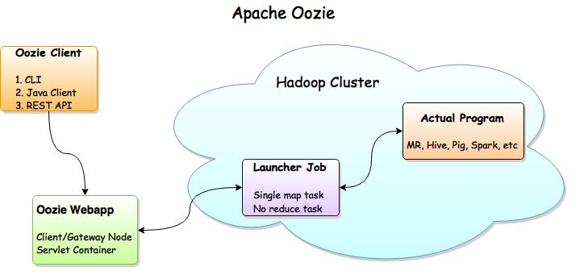
Oozie Client：提供命令行、java api、rest等方式，对Oozie的工作流流程的提交、启动、运行等操作；
Oozie WebApp：即 Oozie Server,本质是一个java应用。可以使用内置的web容器，也可以使用外置的web容器；
Hadoop Cluster：底层执行Oozie编排流程的各个hadoop生态圈组件；

## Oozie基本原理

Oozie对工作流的编排，是基于workflow.xml文件来完成的。用户预先将工作流执行规则定制于workflow.xml文件中，并在job.properties配置相关的参数，然后由Oozie Server向MR提交job来启动工作流。

### 流程节点

工作流由两种类型的节点组成，分别是：
Control Flow Nodes：控制工作流执行路径，包括start，end，kill，decision，fork,join。
Action Nodes：决定每个操作执行的任务类型，包括MapReduce、java、hive、shell等。
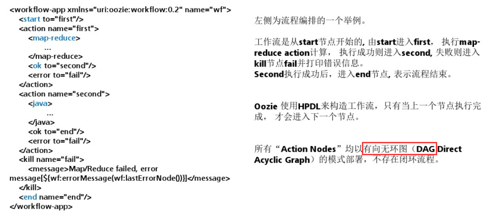

## Oozie工作流类型

### WorkFlow

规则相对简单，不涉及定时、批处理的工作流。顺序执行流程节点。
Workflow有个大缺点：没有定时和条件触发功能。

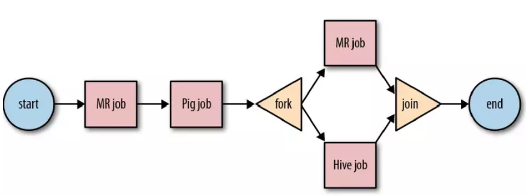

### Coordinator

Coordinator将多个工作流Job组织起来，称为Coordinator Job，并指定触发时间和频率，还可以配置数据集、并发数等，类似于在工作流外部增加了一个协调器来管理这些工作流的工作流Job的运行。

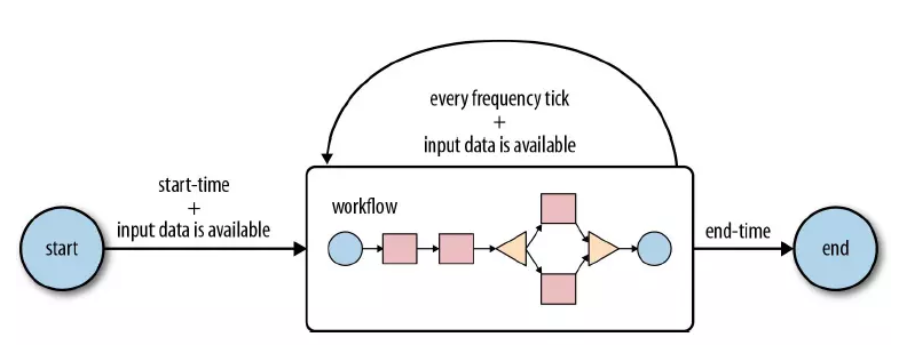

### Bundle

针对coordinator的批处理工作流。Bundle将多个Coordinator管理起来，这样我们只需要一个Bundle提交即可。

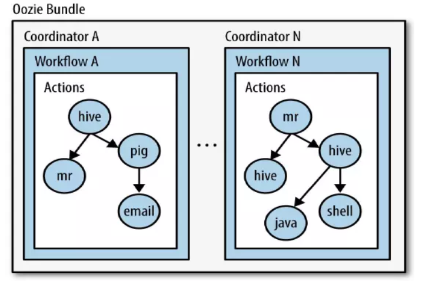

## Apache Oozie安装

### 修改hadoop相关配置

#### 配置httpfs服务

修改hadoop的配置文件 core-site.xml

```shell
[root@node03 hadoop]# cd  /export/servers/hadoop-2.7.5/etc/hadoop
[root@node03 hadoop]# vim core-site.xml
[root@node03 hadoop]# cat /export/servers/hadoop-2.7.5/etc/hadoop/core-site.xml
```

检查是否已添加

```xml
<!-- 允许通过httpfs方式访问hdfs的主机名、域名； -->
<property>
        <name>hadoop.proxyuser.root.hosts</name>
        <value>*</value>
</property>
<!-- 允许访问的客户端的用户组 -->
<property>
        <name>hadoop.proxyuser.root.groups</name>
        <value>*</value>
</property>
```

将修改后的core-site.xml分发给另外两台主机:

```shell
scp  core-site.xml node02:$PWD
scp  core-site.xml node01:$PWD
```

hadoop.proxyuser.root.hosts 允许通过httpfs方式访问hdfs的主机名、域名；
hadoop.proxyuser.root.groups允许访问的客户端的用户组

### 配置jobhistory服务

修改hadoop的配置文件mapred-site.xml

```shell
[root@node01 hadoop]# cd  /export/servers/hadoop-2.7.5/etc/hadoop
[root@node01 hadoop]# vim mapred-site.xml
```

```xml
<property>
  <name>mapreduce.jobhistory.address</name>
  <value>node01:10020</value>
  <description>MapReduce JobHistory Server IPC host:port</description>
</property>
<property>
  <name>mapreduce.jobhistory.webapp.address</name>
  <value>node01:19888</value>
  <description>MapReduce JobHistory Server Web UI host:port</description>
</property>
<!-- 添加以下配置 -->
<!-- 配置运行过的日志存放在 hdfs 上的存放路径 -->
<property>
    <name>mapreduce.jobhistory.done-dir</name>
    <value>/export/data/history/done</value>
</property>

<!-- 配置正在运行中的日志在 hdfs 上的存放路径 -->
<property>
    <name>mapreduce.jobhistory.interApacheOoziete-done-dir</name>
    <value>/export/data/history/done_interApacheOoziete</value>
</property>
```

```shell
#将修改后的mapred-site.xml 分发给另外两台主机:
[root@node03 libext]# cd  /export/servers/hadoop-2.7.5/etc/hadoop
[root@node03 hadoop]# scp  mapred-site.xml node02:$PWD
mapred-site.xml
[root@node03 hadoop]# scp  mapred-site.xml node01:$PWD
mapred-site.xml

# 建立日志存放目录
[root@node01 export]# mkdir -p /export/data/history/done
[root@node01 done]# mkdir -p /export/data/history/done_interApacheOoziete
[root@node01 export]# cd  /export/data/history/done
```

### 重启Hadoop集群相关服务

```shell
#重启hdfs与yarn集群
[root@node01 sbin]# cd /export/servers/hadoop-2.7.5/sbin
[root@node01 sbin]# start-dfs.sh
[root@node01 sbin]# stop-dfs.sh

[root@node01 sbin]# stop-yarn.sh
[root@node01 sbin]# start-yarn.sh
#启动 history-server
mr-jobhistory-daemon.sh start historyserver
#停止 history-server
mr-jobhistory-daemon.sh stop historyserver
#通过浏览器访问 Hadoop Jobhistory 的 WEBUI
http://node01:19888


#先暂停，再重启
[root@node01 sbin]# cd /export/servers/hadoop-2.7.5/sbin
[root@node01 sbin]# ./stop-all.sh
[root@node01 sbin]# ./start-all.sh
```

## 上传oozie的安装包并解压

oozie的安装包上传到/export/softwares

```shell
[root@node03 softwares]# cd /export/softwares
# 上传安装包 并解压

[root@node03 softwares]# tar -zxvf oozie-4.1.0-cdh5.14.0.tar.gz -C /export/servers/
```

解压hadooplibs到与oozie平行的目录

```shell
[root@node03 oozie-4.1.0-cdh5.14.0]# cd  /export/servers/oozie-4.1.0-cdh5.14.0
[root@node03 oozie-4.1.0-cdh5.14.0]# tar -zxvf oozie-hadooplibs-4.1.0-cdh5.14.0.tar.gz -C ../
# 在目录中多出一个
[root@node03 oozie-4.1.0-cdh5.14.0]# ll
drwxr-xr-x  4 1106 4001       120 Jan  7  2018 hadooplibs

```

## 添加相关依赖

```shell
#oozie的安装路径下创建libext目录
[root@node03 oozie-4.1.0-cdh5.14.0]# cd /export/servers/oozie-4.1.0-cdh5.14.0
[root@node03 oozie-4.1.0-cdh5.14.0]# mkdir -p libext
#拷贝hadoop依赖包到libext
[root@node03 oozie-4.1.0-cdh5.14.0]# cp -ra hadooplibs/hadooplib-2.6.0-cdh5.14.0.oozie-4.1.0-cdh5.14.0/* libext/
#上传mysql的驱动包到libext
[root@node03 libext]# cd  libext
[root@node03 libext]# rz
mysql-connector-java-5.1.32.jar
#添加ext-2.2.zip压缩包到libext
[root@node03 libext]# rz
ext-2.2.zip
## 修改oozie-site.xml
[root@node03 libext]# cd /export/servers/oozie-4.1.0-cdh5.14.0/conf
[root@node03 conf]# vim oozie-site.xml
```

oozie默认使用的是UTC的时区，需要在oozie-site.xml当中配置时区为GMT+0800时区

```xml
<property>
        <name>oozie.service.JPAService.jdbc.driver</name>
        <value>com.mysql.jdbc.Driver</value>
    </property>
 <property>
        <name>oozie.service.JPAService.jdbc.url</name>
        <value>jdbc:mysql://node03:3306/oozie</value>
    </property>
 <property>
  <name>oozie.service.JPAService.jdbc.username</name>
  <value>root</value>
 </property>
    <property>
        <name>oozie.service.JPAService.jdbc.password</name>
        <value>123456</value>
    </property>
 <property>
   <name>oozie.processing.timezone</name>
   <value>GMT+0800</value>
 </property>

 <property>
        <name>oozie.service.coord.check.maximum.frequency</name>
  <value>false</value>
    </property>
 <property>
  <name>oozie.service.HadoopAccessorService.hadoop.configurations</name>
        <value>*=/export/servers/hadoop-2.7.5/etc/hadoop</value>
    </property>
```

## 初始化mysql相关信息

上传oozie的解压后目录的下的yarn.tar.gz到hdfs目录

```shell
[root@node01 conf]# cd /export/servers/oozie-4.1.0-cdh5.14.0/
[root@node01 conf]# bin/oozie-setup.sh sharelib create -fs hdfs://node01:8020 -locallib oozie-sharelib-4.1.0-cdh5.14.0-yarn.tar.gz
SLF4J: See http://www.slf4j.org/codes.html#multiple_bindings for an explanation.
SLF4J: Actual binding is of type [org.slf4j.impl.SimpleLoggerFactory]
the destination path for sharelib is: /user/root/share/lib/lib_20190822154954
# 查询是否解压成功
[root@node03 oozie-4.1.0-cdh5.14.0]# hdfs dfs -ls -R /user/root/share/lib/lib_20190822154954
```

本质上就是将这些jar包解压到了hdfs上面的路径下面去
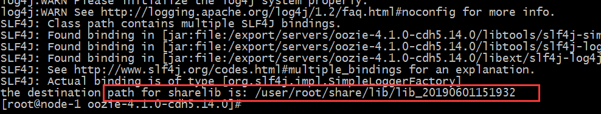
创建mysql数据库

```shell
[root@node03 ~]# mysql -uroot -p123456
mysql> create database oozie;
Query OK, 1 row affected (0.00 sec)

#初始化创建oozie的数据库表
[root@node03 oozie-4.1.0-cdh5.14.0]# cd /export/servers/oozie-4.1.0-cdh5.14.0
[root@node03 oozie-4.1.0-cdh5.14.0]# bin/oozie-setup.sh db create -run -sqlfile oozie.sql
[root@node03 ~]# mysql -uroot -p123456
mysql> use oozie;
Reading table information for completion of table and column names
You can turn off this feature to get a quicker startup with -A

Database changed
mysql> show tables;
+------------------------+
| Tables_in_oozie        |
+------------------------+
| BUNDLE_ACTIONS         |
| BUNDLE_JOBS            |
| COORD_ACTIONS          |
| COORD_JOBS             |
| OOZIE_SYS              |
| OPENJPA_SEQUENCE_TABLE |
| SLA_EVENTS             |
| SLA_REGISTRATION       |
| SLA_SUMMARY            |
| VALIDATE_CONN          |
| WF_ACTIONS             |
| WF_JOBS                |
+------------------------+
12 rows in set (0.00 sec)
```

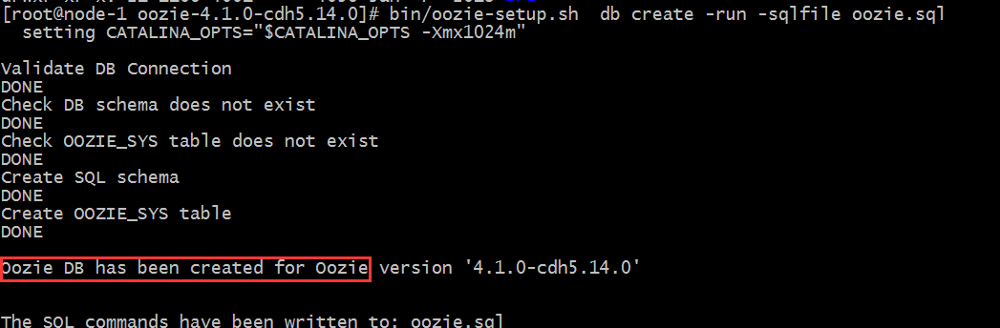
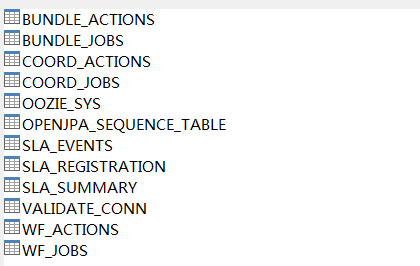

## 打包项目，生成war包

```shell
[root@node03 oozie-4.1.0-cdh5.14.0]# cd /export/servers/oozie-4.1.0-cdh5.14.0
[root@node03 oozie-4.1.0-cdh5.14.0]# bin/oozie-setup.sh prepare-war

New Oozie WAR file with added 'ExtJS library, JARs' at /export/servers/oozie-4.1.0-cdh5.14.0/oozie-server/webapps/oozie.war


INFO: Oozie is ready to be started

```

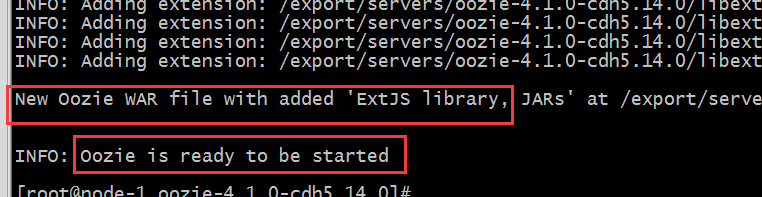

## 配置oozie环境变量

```shell
#第十二步：配置oozie的环境变量
[root@node03 oozie-4.1.0-cdh5.14.0]# vim /etc/profile
export OOZIE_HOME=/export/servers/oozie-4.1.0-cdh5.14.0
export OOZIE_URL=http://node03:11000/oozie
export PATH=:$OOZIE_HOME/bin:$PATH
[root@node03 oozie-4.1.0-cdh5.14.0]# source /etc/profile
```

## 启动关闭oozie服务

```shell
#启动命令
[root@node03 oozie-4.1.0-cdh5.14.0]# cd /export/servers/oozie-4.1.0-cdh5.14.0
[root@node03 oozie-4.1.0-cdh5.14.0]# bin/oozied.sh start
Using CATALINA_BASE:   /export/servers/oozie-4.1.0-cdh5.14.0/oozie-server
Using CATALINA_HOME:   /export/servers/oozie-4.1.0-cdh5.14.0/oozie-server
Using CATALINA_TMPDIR: /export/servers/oozie-4.1.0-cdh5.14.0/oozie-server/temp
Using JRE_HOME:        /export/servers/jdk1.8.0_141
Using CLASSPATH:       /export/servers/oozie-4.1.0-cdh5.14.0/oozie-server/bin/bootstrap.jar
Using CATALINA_PID:    /export/servers/oozie-4.1.0-cdh5.14.0/oozie-server/temp/oozie.pid

#关闭命令
bin/oozied.sh stop
```

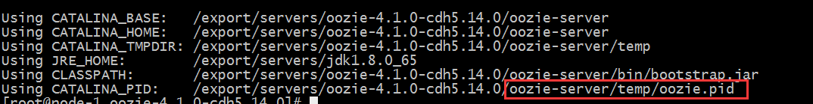
启动的时候产生的 pid文件，如果是kill方式关闭进程 则需要删除该文件重新启动，否则再次启动会报错。

## 浏览器web UI页面

<http://node03:11000/oozie/>
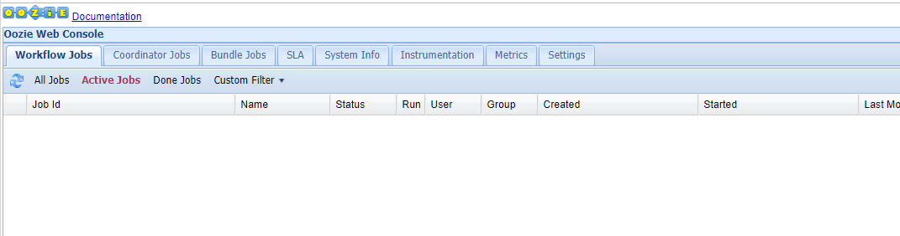

## 解决oozie页面时区显示异常

页面访问的时候，发现oozie使用的还是GMT的时区，与我们现在的时区相差一定的时间，所以需要调整一个js的获取时区的方法，将其改成我们现在的时区。
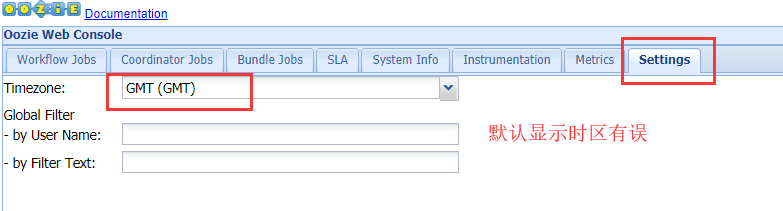
修改js当中的时区问题

```shell

 [root@node03 oozie]# cd /export/servers/oozie-4.1.0-cdh5.14.0/oozie-server/webapps/oozie
[root@node03 oozie]# vim oozie-console.js
function getTimeZone() {
    Ext.state.Manager.setProvider(new Ext.state.CookieProvider());
    return Ext.state.Manager.get("TimezoneId","GMT+0800");
}
```

重启oozie即可

```shell
[root@node03 oozie]# cd /export/servers/oozie-4.1.0-cdh5.14.0
[root@node03 oozie-4.1.0-cdh5.14.0]# bin/oozied.sh stop
[root@node03 oozie-4.1.0-cdh5.14.0]# bin/oozied.sh start
```

## Apache Oozie实战

oozie安装好了之后，需要测试oozie的功能是否完整好使，官方已经给自带带了各种测试案例，可以通过官方提供的各种案例来学习oozie的使用，后续也可以把这些案例作为模板在企业实际中使用。
先把官方提供的各种案例给解压出来

```shell
[root@node03 oozie-4.1.0-cdh5.14.0]# cd /export/servers/oozie-4.1.0-cdh5.14.0
[root@node03 oozie-4.1.0-cdh5.14.0]# tar -zxvf oozie-examples.tar.gz
```

创建统一的工作目录，便于集中管理oozie。企业中可任意指定路径。这里直接在oozie的安装目录下面创建工作目录

```shell
mkdir oozie_works
```

## 优化更新hadoop相关配置

### yarn容器资源分配属性

yarn-site.xml：

```xml
<!—--节点最大可用内存，结合实际物理内存调整 -->
<property>
        <name>yarn.nodemanager.resource.memory-mb</name>
        <value>3072</value>
</property>
<!—-每个容器可以申请内存资源的最小值，最大值 -->
<property>
        <name>yarn.scheduler.minimum-allocation-mb</name>
        <value>1024</value>
</property>
<property>
        <name>yarn.scheduler.maximum-allocation-mb</name>
        <value>3072</value>
</property>

<!—-修改为 Fair 公平调度，动态调整资源，避免 yarn 上任务等待（多线程执行） -->
<property>
 <name>yarn.resourcemanager.scheduler.class</name>
 <value>org.apache.hadoop.yarn.server.resourcemanager.scheduler.fair.FairScheduler</value>
</property>
<!—-Fair 调度时候是否开启抢占功能 -->
<property>
        <name>yarn.scheduler.fair.preemption</name>
        <value>true</value>
</property>
<!—-超过多少开始抢占，默认 0.8-->
    <property>
        <name>yarn.scheduler.fair.preemption.cluster-utilization-threshold</name>
        <value>1.0</value>
    </property>
```

### mapreduce资源申请配置

设置mapreduce.map.memory.mb和mapreduce.reduce.memory.mb配置

否则Oozie读取的默认配置 -1, 提交给yarn的时候会抛异常*Invalid resource request, requested memory < 0, or requested memory > max configured, requestedMemory=-1, maxMemory=8192*

mapred-site.xml

```xml
<!—-单个 maptask、reducetask 可申请内存大小 -->
<property>
        <name>mapreduce.map.memory.mb</name>
        <value>1024</value>
</property>
<property>
        <name>mapreduce.reduce.memory.mb</name>
        <value>1024</value>
</property>

```

### 更新hadoop配置重启集群

重启hadoop集群
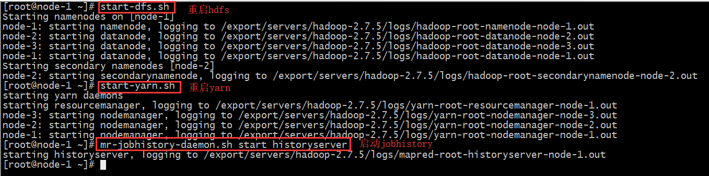
重启oozie服务

## Oozie调度shell脚本

### 准备配置模板

把shell的任务模板拷贝到oozie的工作目录当中去

```shell
[root@node03 oozie-4.1.0-cdh5.14.0]#cd /export/servers/oozie-4.1.0-cdh5.14.0
[root@node03 oozie-4.1.0-cdh5.14.0]# cp -r examples/apps/shell/ oozie_works/
#准备待调度的shell脚本文件
vim oozie_works/shell/hello.sh
```

注意：这个脚本一定要是在我们oozie工作路径下的shell路径下的位置

```shell
#!/bin/bash

echo "hello world" >> /export/servers/hello_oozie.txt
```

### 修改配置模板

修改job.properties

```shell
[root@node03 oozie-4.1.0-cdh5.14.0]# cd /export/servers/oozie-4.1.0-cdh5.14.0/oozie_works/shell
[root@node03 shell]# vim job.properties
##路径跟exec 需要更改
nameNode=hdfs://node01:8020
jobTracker=node01:8032
queueName=default
examplesRoot=oozie_works
oozie.wf.application.path=${nameNode}/user/${user.name}/${examplesRoot}/shell
EXEC=hello.sh

```

jobTracker：在hadoop2当中，jobTracker这种角色已经没有了，只有resourceManager，这里给定resourceManager的IP及端口即可。
queueName：提交mr任务的队列名；
examplesRoot：指定oozie的工作目录；
oozie.wf.application.path：指定oozie调度资源存储于hdfs的工作路径；
EXEC：指定执行任务的名称。
修改workflow.xml

```shell
[root@node03 shell]# vim workflow.xml
```

```xml
<workflow-app xmlns="uri:oozie:workflow:0.4" name="shell-wf">
<start to="shell-node"/>
<action name="shell-node">
    <shell xmlns="uri:oozie:shell-action:0.2">
        <job-tracker>${jobTracker}</job-tracker>
        <name-node>${nameNode}</name-node>
        <configuration>
            <property>
                <name>mapred.job.queue.name</name>
                <value>${queueName}</value>
            </property>
        </configuration>
        <!-- 修改这里 -->
        <exec>${EXEC}</exec>
        <file>/user/root/oozie_works/shell/${EXEC}#${EXEC}</file>
        <capture-output/>
    </shell>
    <ok to="end"/>
    <error to="fail"/>
</action>
<decision name="check-output">
    <switch>
        <case to="end">
            ${wf:actionData('shell-node')['my_output'] eq 'Hello Oozie'}
        </case>
        <default to="fail-output"/>
    </switch>
</decision>
<kill name="fail">
    <message>Shell action failed, error
message[${wf:errorMessage(wf:lastErrorNode())}]</message>
</kill>
<kill name="fail-output">
    <message>Incorrect output, expected [Hello Oozie] but was [${wf:actionData('shell-
node')['my_output']}]</message>
</kill>
<end name="end"/>
</workflow-app>

```

### 上传调度任务到hdfs

注意：上传的hdfs目录为/user/root，因为hadoop启动的时候使用的是root用户，如果hadoop启动的是其他用户，那么就上传到/user/其他用户

```shell
[root@node03 shell]# cd /export/servers/oozie-4.1.0-cdh5.14.0
[root@node03 oozie-4.1.0-cdh5.14.0]# hdfs dfs -put oozie_works/ /user/root
```

### 执行调度任务

通过oozie的命令来执行调度任务

```shell
#/user/root/oozie_works/shell
[root@node03 oozie-4.1.0-cdh5.14.0]# cd /export/servers/oozie-4.1.0-cdh5.14.0
[root@node03 oozie-4.1.0-cdh5.14.0]# bin/oozie job -oozie http://node03:11000/oozie -config oozie_works/shell/job.properties -run
## 有以下表示成功
job: 0000000-190822160029631-oozie-root-W
# http://node01:19888/ 中查看是那如机器执行的，再查看文件是否有生成
[root@node01 sbin]# cat /export/servers/hello_oozie.txt
hello world
```

从监控界面可以看到任务执行成功了。
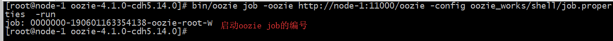
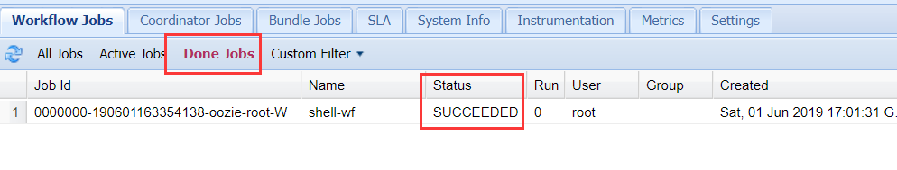
可以通过jobhistory来确定调度时候是由那台机器执行的。
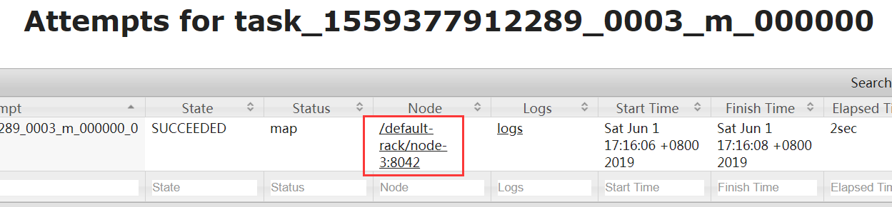


## Oozie调度Hive

准备配置模板

```shell
cd /export/servers/oozie-4.1.0-cdh5.14.0
cp -ra examples/apps/hive2/ oozie_works/
```

修改配置模板

修改job.properties

```shell
cd /export/servers/oozie-4.1.0-cdh5.14.0/oozie_works/hive2

vim job.properties

nameNode=hdfs://node01:8020
jobTracker=node01:8032
queueName=default
jdbcURL=jdbc:hive2://node01:10000/default
examplesRoot=oozie_works
oozie.use.system.libpath=true
# 配置我们文件上传到hdfs的保存路径 实际上就是在hdfs 的/user/root/oozie_works/hive2这个路径下
oozie.wf.application.path=${nameNode}/user/${user.name}/${examplesRoot}/hive2
```

修改workflow.xml（实际上无修改）

```xml

<?xml version="1.0" encoding="UTF-8"?>
<workflow-app xmlns="uri:oozie:workflow:0.5" name="hive2-wf">
    <start to="hive2-node"/>

    <action name="hive2-node">
        <hive2 xmlns="uri:oozie:hive2-action:0.1">
            <job-tracker>${jobTracker}</job-tracker>
            <name-node>${nameNode}</name-node>
            <prepare>
                <delete
path="${nameNode}/user/${wf:user()}/${examplesRoot}/output-data/hive2"/>
                <mkdir
path="${nameNode}/user/${wf:user()}/${examplesRoot}/output-data"/>


            </prepare>
            <configuration>
                <property>
                    <name>mapred.job.queue.name</name>
                    <value>${queueName}</value>
                </property>
            </configuration>
            <jdbc-url>${jdbcURL}</jdbc-url>
            <script>script.q</script>
            <param>INPUT=/user/${wf:user()}/${examplesRoot}/input-
data/table</param>
            <param>OUTPUT=/user/${wf:user()}/${examplesRoot}/output-
data/hive2</param>
        </hive2>
        <ok to="end"/>
        <error to="fail"/>
    </action>
    <kill name="fail">
        <message>Hive2 (Beeline) action failed, error
message[${wf:errorMessage(wf:lastErrorNode())}]</message>
    </kill>
    <end name="end"/>
</workflow-app>
```

编辑hivesql文件

vim script.q

```shell
DROP TABLE IF EXISTS test;
CREATE EXTERNAL TABLE test (a INT) STORED AS TEXTFILE LOCATION '${INPUT}';
insert into test values(10);
insert into test values(20);
insert into test values(30);
```

 上传调度任务到hdfs

```shell
cd /export/servers/oozie-4.1.0-cdh5.14.0/oozie_works

hdfs dfs -put hive2/ /user/root/oozie_works/
```

执行调度任务

首先确保已经启动hiveServer2服务。
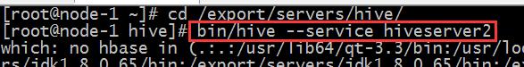

```shell
cd /export/servers/oozie-4.1.0-cdh5.14.0
bin/oozie job -oozie http://node01:11000/oozie -config oozie_works/hive2/job.properties -run
```

可以在yarn上看到调度执行的过程:
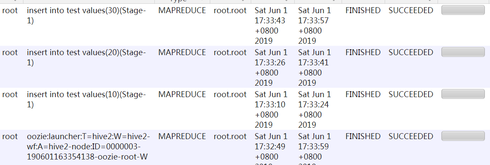
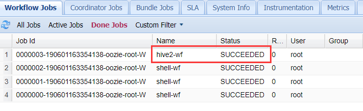
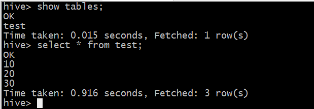

## Oozie调度MapReduce

 准备配置模板

准备mr程序的待处理数据。用hadoop自带的MR程序来运行wordcount。
准备数据上传到HDFS的/oozie/input路径下去

```shell
hdfs dfs -mkdir -p /oozie/input
hdfs dfs -put wordcount.txt /oozie/input
```

拷贝MR的任务模板

```shell
cd /export/servers/oozie-4.1.0-cdh5.14.0
cp -ra examples/apps/map-reduce/ oozie_works/
```

删掉MR任务模板lib目录下自带的jar包

```shell
cd /export/servers/oozie-4.1.0-cdh5.14.0/oozie_works/map-reduce/lib
rm -rf oozie-examples-4.1.0-cdh5.14.0.jar
```

拷贝官方自带mr程序jar包到对应目录

```sell
cp
/export/servers/hadoop-2.7.5/share/hadoop/mapreduce/hadoop-mapreduce-examples-2.7.5.jar

/export/servers/oozie-4.1.0-cdh5.14.0/oozie_works/map-reduce/lib/
```

 修改配置模板

修改job.properties

```shell
cd /export/servers/oozie-4.1.0-cdh5.14.0/oozie_works/map-reduce

vim job.properties
nameNode=hdfs://node01:8020
jobTracker=node01:8032
queueName=default
examplesRoot=oozie_works
oozie.wf.application.path=${nameNode}/user/${user.name}/${examplesRoot}/map-
reduce/workflow.xml
outputDir=/oozie/output
inputdir=/oozie/input
```

修改workflow.xml

```shell
cd /export/servers/oozie-4.1.0-cdh5.14.0/oozie_works/map-reduce
vim workflow.xml
```

```xml
<?xml version="1.0" encoding="UTF-8"?>
<workflow-app xmlns="uri:oozie:workflow:0.5" name="map-reduce-wf">
    <start to="mr-node"/>
    <action name="mr-node">
        <map-reduce>
            <job-tracker>${jobTracker}</job-tracker>
            <name-node>${nameNode}</name-node>
            <prepare>
                <delete path="${nameNode}/${outputDir}"/>
            </prepare>
            <configuration>
                <property>
                    <name>mapred.job.queue.name</name>
                    <value>${queueName}</value>
                </property>
    <!--   
                <property> 
                    <name>mapred.mapper.class</name> 
                    <value>org.apache.oozie.example.SampleMapper</value> 
                </property> 
                <property> 
                    <name>mapred.reducer.class</name> 
                    <value>org.apache.oozie.example.SampleReducer</value> 
                </property> 
                <property> 
                    <name>mapred.map.tasks</name> 
                    <value>1</value> 
                </property> 
                <property> 
                    <name>mapred.input.dir</name> 
                    <value>/user/${wf:user()}/${examplesRoot}/input-
data/text</value> 
                </property> 
                <property> 
                    <name>mapred.output.dir</name> 
                    <value>/user/${wf:user()}/${examplesRoot}/output-
data/${outputDir}</value> 
                </property> 
    -->

       <!-- 开启使用新的 API 来进行配置 -->
                <property>
                    <name>mapred.mapper.new-api</name>
                    <value>true</value>
                </property>

                <property>
                    <name>mapred.reducer.new-api</name>
                    <value>true</value>
                </property>
                <!-- 指定 MR 的输出 key 的类型 -->
                <property>
                    <name>mapreduce.job.output.key.class</name>
                    <value>org.apache.hadoop.io.Text</value>
                </property>
                <!-- 指定 MR 的输出的 value 的类型-->
                <property>
                    <name>mapreduce.job.output.value.class</name>
                    <value>org.apache.hadoop.io.IntWritable</value>
                </property>
                <!-- 指定输入路径 -->
                <property>
                    <name>mapred.input.dir</name>
                    <value>${nameNode}/${inputdir}</value>
                </property>
                <!-- 指定输出路径 -->
                <property>
                    <name>mapred.output.dir</name>
                    <value>${nameNode}/${outputDir}</value>
                </property>
                <!-- 指定执行的 map 类 -->
                <property>
                    <name>mapreduce.job.map.class</name>
<value>org.apache.hadoop.examples.WordCount$TokenizerMapper</value>
                </property>
                <!-- 指定执行的 reduce 类 -->
                <property>
                    <name>mapreduce.job.reduce.class</name>
<value>org.apache.hadoop.examples.WordCount$IntSumReducer</value>
                </property>
    <!--  配置 map task 的个数 -->
                <property>
                    <name>mapred.map.tasks</name>


                    <value>1</value>
                </property>

          </configuration>
        </map-reduce>
        <ok to="end"/>
        <error to="fail"/>
    </action>
    <kill name="fail">
        <message>Map/Reduce failed, error
message[${wf:errorMessage(wf:lastErrorNode())}]</message>
    </kill>
    <end name="end"/>
</workflow-app>
```

 上传调度任务到hdfs

```shell
cd /export/servers/oozie-4.1.0-cdh5.14.0/oozie_works
hdfs dfs -put map-reduce/ /user/root/oozie_works/
# 执行调度任务
cd /export/servers/oozie-4.1.0-cdh5.14.0
bin/oozie job -oozie http://node01:11000/oozie -config oozie_works/map-reduce/job.properties --run
```

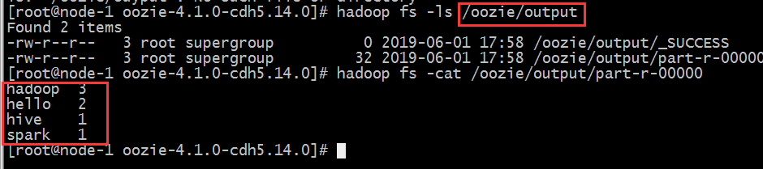

## Oozie任务串联

在实际工作当中，肯定会存在多个任务需要执行，并且存在上一个任务的输出结果作为下一个任务的输入数据这样的情况，所以我们需要在workflow.xml配置文件当中配置多个action，实现多个任务之间的相互依赖关系。
需求：首先执行一个shell脚本，执行完了之后再执行一个MR的程序，最后再执行一个hive的程序。

### 准备工作目录

```shell
cd /export/servers/oozie-4.1.0-cdh5.14.0/oozie_works

mkdir -p sereval-actions
```

### 准备调度文件

将之前的hive，shell， MR的执行，进行串联成到一个workflow当中。

```shell
cd /export/servers/oozie-4.1.0-cdh5.14.0/oozie_works
cp hive2/script.q sereval-actions/
cp shell/hello.sh sereval-actions/
cp -ra map-reduce/lib sereval-actions/
```

修改配置模板

```shell
cd /export/servers/oozie-4.1.0-cdh5.14.0/oozie_works/sereval-actions

vim workflow.xml
```

```xml
vim workflow.xml
<workflow-app xmlns="uri:oozie:workflow:0.4" name="shell-wf">
<start to="shell-node"/>
<action name="shell-node">
    <shell xmlns="uri:oozie:shell-action:0.2">
        <job-tracker>${jobTracker}</job-tracker>
        <name-node>${nameNode}</name-node>
        <configuration>
            <property>

                <name>mapred.job.queue.name</name>
                <value>${queueName}</value>
            </property>
        </configuration>
        <exec>${EXEC}</exec>
        <!-- <argument>my_output=Hello Oozie</argument> -->
        <file>/user/root/oozie_works/sereval-actions/${EXEC}#${EXEC}</file>
        <capture-output/>
    </shell>
    <ok to="mr-node"/>
    <error to="mr-node"/>
</action>

<action name="mr-node">
        <map-reduce>
            <job-tracker>${jobTracker}</job-tracker>
            <name-node>${nameNode}</name-node>
            <prepare>
                <delete path="${nameNode}/${outputDir}"/>
            </prepare>
            <configuration>
                <property>
                    <name>mapred.job.queue.name</name>
                    <value>${queueName}</value>
                </property>
    <!--   
                <property> 
                    <name>mapred.mapper.class</name> 
                    <value>org.apache.oozie.example.SampleMapper</value> 
                </property> 
                <property> 
                    <name>mapred.reducer.class</name> 
                    <value>org.apache.oozie.example.SampleReducer</value> 
                </property> 
                <property> 
                    <name>mapred.map.tasks</name> 
                    <value>1</value> 
 

                </property> 
                <property> 
                    <name>mapred.input.dir</name> 
                    <value>/user/${wf:user()}/${examplesRoot}/input-
data/text</value> 
                </property> 
                <property> 
                    <name>mapred.output.dir</name> 
                    <value>/user/${wf:user()}/${examplesRoot}/output-
data/${outputDir}</value> 
                </property> 
    -->

       <!-- 开启使用新的 API 来进行配置 -->
                <property>
                    <name>mapred.mapper.new-api</name>
                    <value>true</value>
                </property>
                <property>
                    <name>mapred.reducer.new-api</name>
                    <value>true</value>
                </property>
                <!-- 指定 MR 的输出 key 的类型 -->
                <property>
                    <name>mapreduce.job.output.key.class</name>
                    <value>org.apache.hadoop.io.Text</value>
                </property>
                <!-- 指定 MR 的输出的 value 的类型-->
                <property>
                    <name>mapreduce.job.output.value.class</name>
                    <value>org.apache.hadoop.io.IntWritable</value>
                </property>

                <!-- 指定输入路径 -->
                <property>

                    <name>mapred.input.dir</name>
                    <value>${nameNode}/${inputdir}</value>
                </property>

                <!-- 指定输出路径 -->
                <property>
                    <name>mapred.output.dir</name>
                    <value>${nameNode}/${outputDir}</value>
                </property>
                <!-- 指定执行的 map 类 -->
                <property>
                    <name>mapreduce.job.map.class</name>

<value>org.apache.hadoop.examples.WordCount$TokenizerMapper</value>
                </property>
                <!-- 指定执行的 reduce 类 -->
                <property>
                    <name>mapreduce.job.reduce.class</name>
<value>org.apache.hadoop.examples.WordCount$IntSumReducer</value>
                </property>
    <!--  配置 map task 的个数 -->
                <property>
                    <name>mapred.map.tasks</name>
                    <value>1</value>
                </property>

            </configuration>
        </map-reduce>
        <ok to="hive2-node"/>
        <error to="fail"/>
    </action>
     <action name="hive2-node">
        <hive2 xmlns="uri:oozie:hive2-action:0.1">
            <job-tracker>${jobTracker}</job-tracker>
            <name-node>${nameNode}</name-node>
            <prepare>
                <delete
path="${nameNode}/user/${wf:user()}/${examplesRoot}/output-data/hive2"/>
                <mkdir
path="${nameNode}/user/${wf:user()}/${examplesRoot}/output-data"/>
            </prepare>
            <configuration>
                <property>
                    <name>mapred.job.queue.name</name>
                    <value>${queueName}</value>
                </property>
            </configuration>
            <jdbc-url>${jdbcURL}</jdbc-url>
            <script>script.q</script>
            <param>INPUT=/user/${wf:user()}/${examplesRoot}/input-
data/table</param>
            <param>OUTPUT=/user/${wf:user()}/${examplesRoot}/output-
data/hive2</param>
        </hive2>
        <ok to="end"/>
        <error to="fail"/>
    </action>
<decision name="check-output">
    <switch>
        <case to="end">
            ${wf:actionData('shell-node')['my_output'] eq 'Hello Oozie'}
        </case>
        <default to="fail-output"/>
    </switch>
</decision>
<kill name="fail">
    <message>Shell action failed, error

message[${wf:errorMessage(wf:lastErrorNode())}]</message>
</kill>
<kill name="fail-output">
    <message>Incorrect output, expected [Hello Oozie] but was [${wf:actionData('shell-
node')['my_output']}]</message>
</kill>
<end name="end"/>
</workflow-app>
```

job.properties配置文件

```shell
nameNode=hdfs://node01:8020
jobTracker=node01:8032
queueName=default
examplesRoot=oozie_works
EXEC=hello.sh
outputDir=/oozie/output
inputdir=/oozie/input
jdbcURL=jdbc:hive2://node01:10000/default
oozie.use.system.libpath=true
# 配 置 我 们 文 件 上 传 到 hdfs 的 保 存 路 径  实 际 上 就 是 在 hdfs 的/user/root/oozie_works/sereval-actions 这个路径下
oozie.wf.application.path=${nameNode}/user/${user.name}/${examplesRoot}/sereval-actions/workflow.xml
```

 上传调度任务到hdfs

```shell
cd /export/servers/oozie-4.1.0-cdh5.14.0/oozie_works/

hdfs dfs -put sereval-actions/ /user/root/oozie_works/
```

执行调度任务

```shell
cd /export/servers/oozie-4.1.0-cdh5.14.0/
bin/oozie job -oozie http://node01:11000/oozie -config oozie_works/sereval-actions/job.properties -run
```

## Oozie定时调度

在oozie当中，主要是通过Coordinator 来实现任务的定时调度， Coordinator 模块主要通过xml来进行配置即可。
Coordinator 的调度主要可以有两种实现方式
第一种：基于时间的定时任务调度：
oozie基于时间的调度主要需要指定三个参数，第一个起始时间，第二个结束时间，第三个调度频率；
第二种：基于数据的任务调度， 这种是基于数据的调度，只要在有了数据才会触发调度任务。

准备配置模板
第一步：拷贝定时任务的调度模板

```shell
cd /export/servers/oozie-4.1.0-cdh5.14.0
cp -r examples/apps/cron oozie_works/cron-job
```

第二步：拷贝我们的hello.sh脚本

```shell
cd /export/servers/oozie-4.1.0-cdh5.14.0/oozie_works
cp shell/hello.sh cron-job/
```

 修改配置模板

修改job.properties

```shell
cd /export/servers/oozie-4.1.0-cdh5.14.0/oozie_works/cron-job
vim job.properties
nameNode=hdfs://node01:8020
jobTracker=node01:8032
queueName=default
examplesRoot=oozie_works

oozie.coord.application.path=${nameNode}/user/${user.name}/${examplesRoot}/cron-job/coordinator.xml
#start：必须设置为未来时间，否则任务失败
start=2019-05-22T19:20+0800
end=2019-08-22T19:20+0800
EXEC=hello.sh
workflowAppUri=${nameNode}/user/${user.name}/${examplesRoot}/cron-job/workflow.xml
```

修改coordinator.xml

```shell
vim coordinator.xml
```

```xml
<!-- 
 oozie 的 frequency 可以支持很多表达式，其中可以通过定时每分，或者每小时，
或者每天，或者每月进行执行，也支持可以通过与 linux 的 crontab 表达式类似的写
法来进行定时任务的执行 
 例如 frequency 也可以写成以下方式 
 frequency="10 9 * * *"  每天上午的 09:10:00 开始执行任务 
 frequency="0 1 * * *"  每天凌晨的 01:00 开始执行任务 
 -->
<coordinator-app name="cron-job" frequency="${coord:minutes(1)}" start="${start}"
end="${end}" timezone="GMT+0800"
                 xmlns="uri:oozie:coordinator:0.4">
        <action>
        <workflow>
            <app-path>${workflowAppUri}</app-path>
            <configuration>
                <property>
                    <name>jobTracker</name>
                    <value>${jobTracker}</value>
                </property>
                <property>
                    <name>nameNode</name>
                    <value>${nameNode}</value>
                </property>
                <property>
                    <name>queueName</name>
                    <value>${queueName}</value>
                </property>
            </configuration>
        </workflow>
    </action>
</coordinator-app>
```

修改workflow.xml

vim workflow.xml

```xml
<workflow-app xmlns="uri:oozie:workflow:0.5" name="one-op-wf">
    <start to="action1"/>
    <action name="action1">
    <shell xmlns="uri:oozie:shell-action:0.2">
        <job-tracker>${jobTracker}</job-tracker>
        <name-node>${nameNode}</name-node>
        <configuration>
            <property>
                <name>mapred.job.queue.name</name>
                <value>${queueName}</value>
            </property>
        </configuration>
        <exec>${EXEC}</exec>
        <!-- <argument>my_output=Hello Oozie</argument> -->
        <file>/user/root/oozie_works/cron-job/${EXEC}#${EXEC}</file>
        <capture-output/>
    </shell>
    <ok to="end"/>
    <error to="end"/>
</action>
    <end name="end"/>
</workflow-app>
```

上传调度任务到hdfs

```shell
cd /export/servers/oozie-4.1.0-cdh5.14.0/oozie_works

hdfs dfs -put cron-job/ /user/root/oozie_works/
```

执行调度

```shell
cd /export/servers/oozie-4.1.0-cdh5.14.0
bin/oozie job -oozie http://node01:11000/oozie -config oozie_works/cron-job/job.properties --run
```

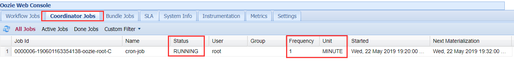

## Oozie和Hue整合

## 修改hue配置文件hue.ini

```ini

[liboozie]
  # The URL where the Oozie service runs on. This is required in order for
  # users to submit jobs. Empty value disables the config check.
  oozie_url=http://node01:11000/oozie

  # Requires FQDN in oozie_url if enabled
  ## security_enabled=false

  # Location on HDFS where the workflows/coordinator are deployed when submitted.
  remote_deployement_dir=/user/root/oozie_works
  
[oozie]
  # Location on local FS where the examples are stored.
  # local_data_dir=/export/servers/oozie-4.1.0-cdh5.14.0/examples/apps

  # Location on local FS where the data for the examples is stored.
  # sample_data_dir=/export/servers/oozie-4.1.0-cdh5.14.0/examples/input-data
  # Location on HDFS where the oozie examples and workflows are stored.
  # Parameters are $TIME and $USER, e.g. /user/$USER/hue/workspaces/workflow-$TIME
  # remote_data_dir=/user/root/oozie_works/examples/apps

  # Maximum of Oozie workflows or coodinators to retrieve in one API call.
  oozie_jobs_count=100

  # Use Cron format for defining the frequency of a Coordinator instead of the old frequency number/unit.
  enable_cron_scheduling=true

  # Flag to enable the saved Editor queries to be dragged and dropped into a workflow.
  enable_document_action=true


  # Flag to enable Oozie backend filtering instead of doing it at the page level in Javascript. Requires Oozie 4.3+.
  enable_oozie_backend_filtering=true

  # Flag to enable the Impala action.
  enable_impala_action=true
[filebrowser]
  # Location on local filesystem where the uploaded archives are temporary stored.
  archive_upload_tempdir=/tmp

  # Show Download Button for HDFS file browser.
  show_download_button=true

  # Show Upload Button for HDFS file browser.
  show_upload_button=true

  # Flag to enable the extraction of a uploaded archive in HDFS.
  enable_extract_uploaded_archive=true
```

## 启动hue、oozie

启动hue进程

```shell
cd /export/servers/hue-3.9.0-cdh5.14.0
build/env/bin/supervisor
#启动oozie进程
cd /export/servers/oozie-4.1.0-cdh5.14.0
bin/oozied.sh start
```

页面访问hue
[http://node01:8888/](http://node01:8888/)

## Hue集成Oozie

### 使用hue配置oozie调度

hue提供了页面鼠标拖拽的方式配置oozie调度
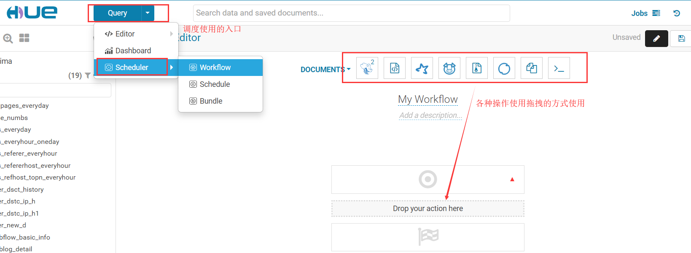

### 利用hue调度shell脚本

在HDFS上创建一个shell脚本程序文件。
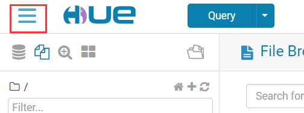
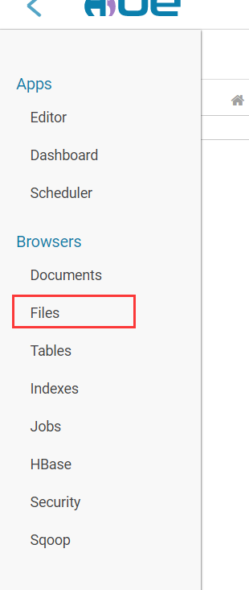
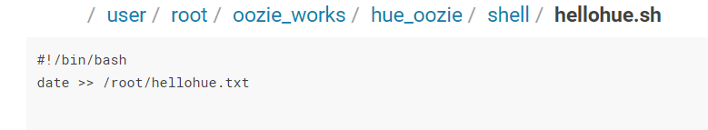
打开工作流调度页面。
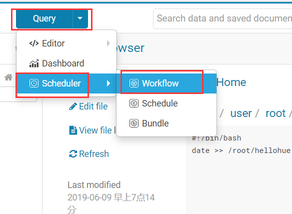
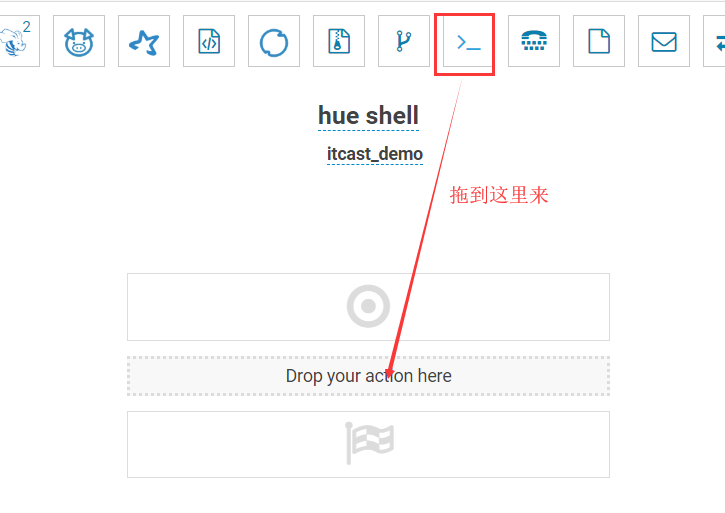
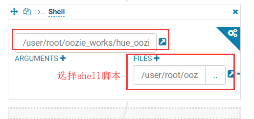
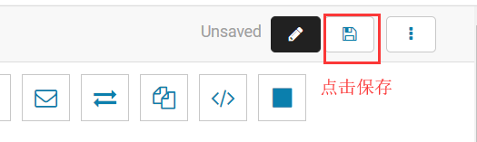
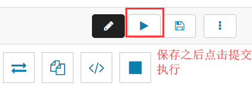
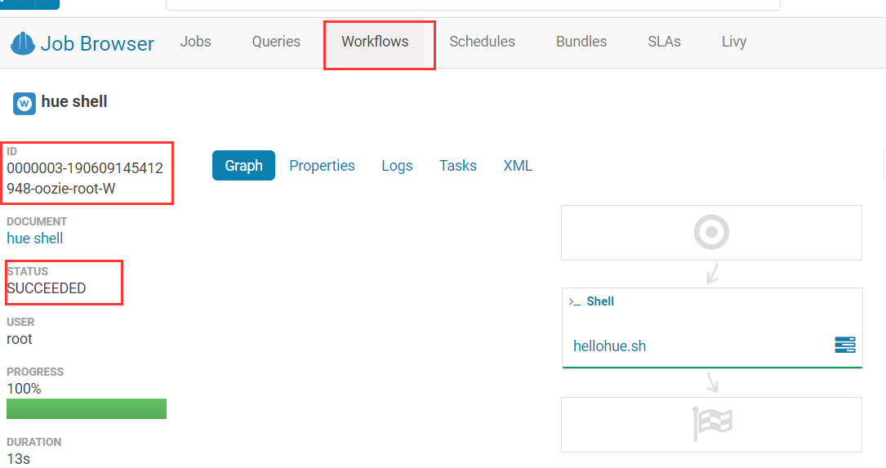

### 利用hue调度hive脚本

在HDFS上创建一个hive sql脚本程序文件。
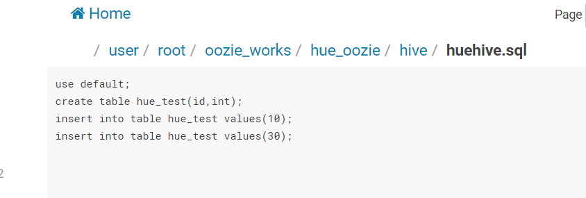
打开workflow页面，拖拽hive2图标到指定位置。
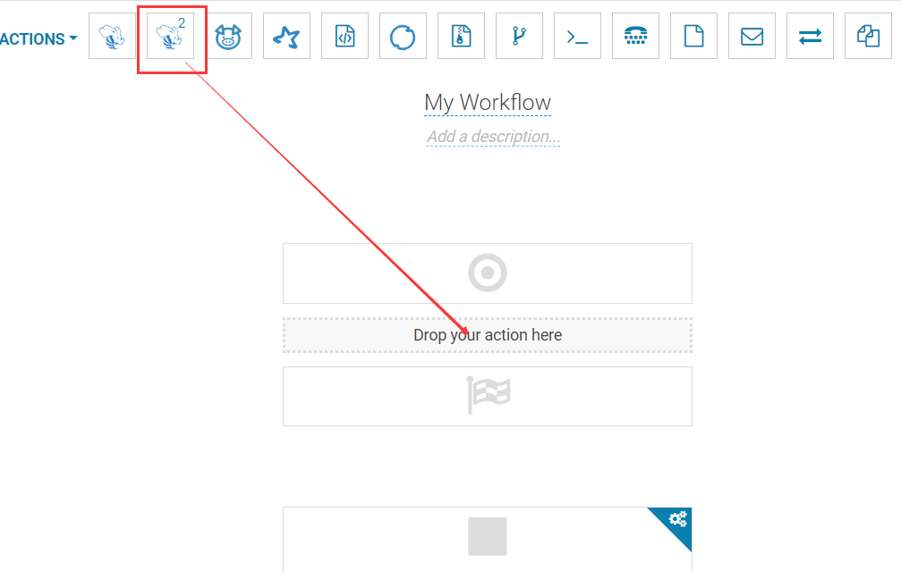
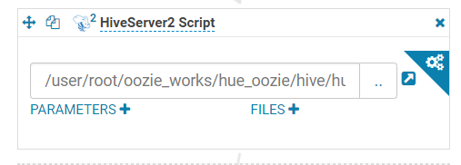
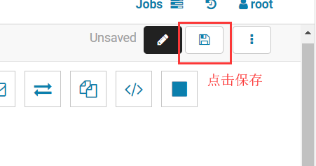
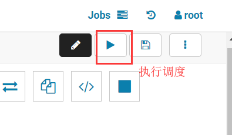
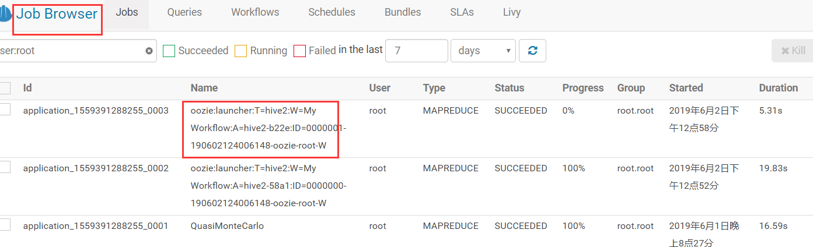

### 利用hue调度MapReduce程序

利用hue提交MapReduce程序
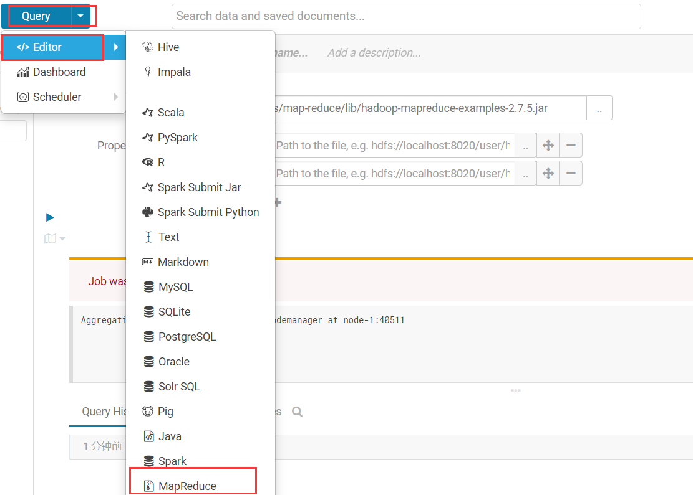
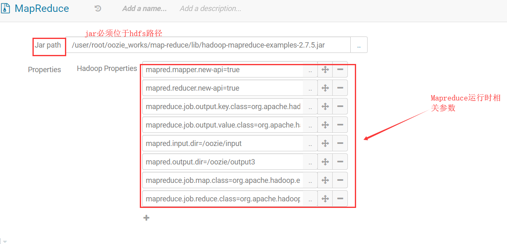
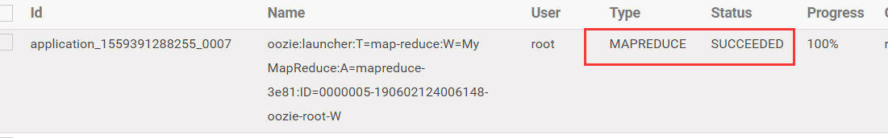
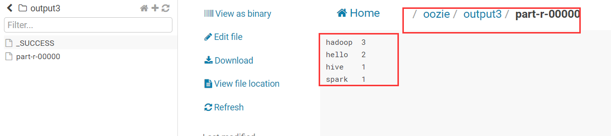

### 利用Hue配置定时调度任务

在hue中，也可以针对workflow配置定时调度任务，具体操作如下：
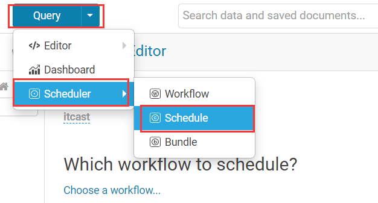
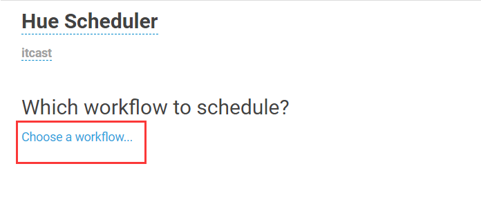
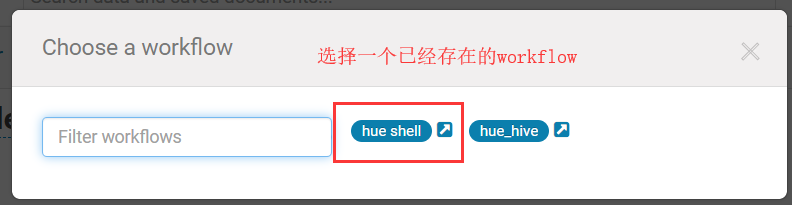
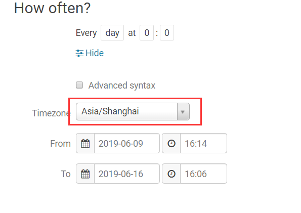
一定要注意时区的问题，否则调度就出错了。保存之后就可以提交定时任务。
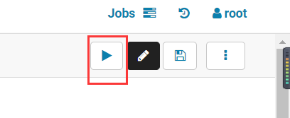
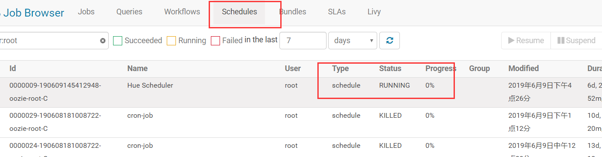
点击进去，可以看到定时任务的详细信息。
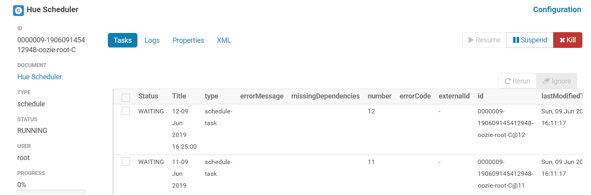
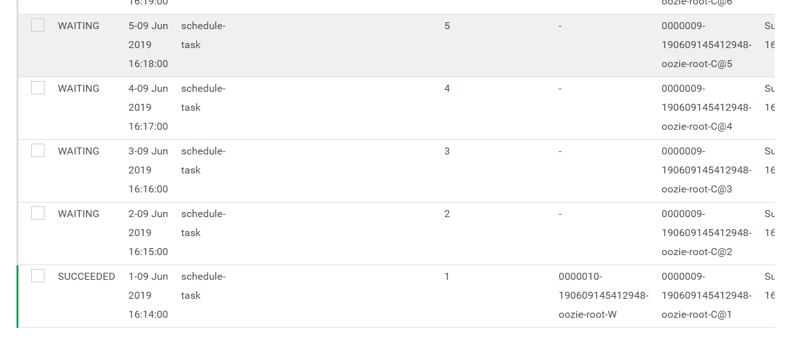

## Oozie任务查看、杀死

```shell
#查看所有普通任务
oozie jobs
#查看定时任务
oozie jobs -jobtype coordinator
#杀死某个任务oozie可以通过jobid来杀死某个定时任务
oozie job -kill [id]
oozie job -kill 0000085-180628150519513-oozie-root-C
```

## oozie-site.xml

软件/oozie-site.xml

```xml
<?xml version="1.0"?>
<!--
  Licensed to the Apache Software Foundation (ASF) under one
  or more contributor license agreements.  See the NOTICE file
  distributed with this work for additional information
  regarding copyright ownership.  The ASF licenses this file
  to you under the Apache License, Version 2.0 (the
  "License"); you may not use this file except in compliance
  with the License.  You may obtain a copy of the License at
  
       http://www.apache.org/licenses/LICENSE-2.0
  
  Unless required by applicable law or agreed to in writing, software
  distributed under the License is distributed on an "AS IS" BASIS,
  WITHOUT WARRANTIES OR CONDITIONS OF ANY KIND, either express or implied.
  See the License for the specific language governing permissions and
  limitations under the License.
-->
<configuration>

    <!--
        Refer to the oozie-default.xml file for the complete list of
        Oozie configuration properties and their default values.
    -->

    <!-- Proxyuser Configuration -->

    <!--

    <property>
        <name>oozie.service.ProxyUserService.proxyuser.#USER#.hosts</name>
        <value>*</value>
        <description>
            List of hosts the '#USER#' user is allowed to perform 'doAs'
            operations.

            The '#USER#' must be replaced with the username o the user who is
            allowed to perform 'doAs' operations.

            The value can be the '*' wildcard or a list of hostnames.

            For multiple users copy this property and replace the user name
            in the property name.
        </description>
    </property>

    <property>
        <name>oozie.service.ProxyUserService.proxyuser.#USER#.groups</name>
        <value>*</value>
        <description>
            List of groups the '#USER#' user is allowed to impersonate users
            from to perform 'doAs' operations.

            The '#USER#' must be replaced with the username o the user who is
            allowed to perform 'doAs' operations.

            The value can be the '*' wildcard or a list of groups.

            For multiple users copy this property and replace the user name
            in the property name.
        </description>
    </property>

    -->

    <!-- Default proxyuser configuration for Hue -->

    <property>
        <name>oozie.service.ProxyUserService.proxyuser.hue.hosts</name>
        <value>*</value>
    </property>

    <property>
        <name>oozie.service.ProxyUserService.proxyuser.hue.groups</name>
        <value>*</value>
    </property>

    <property>
        <name>oozie.service.JPAService.jdbc.driver</name>
        <value>com.mysql.jdbc.Driver</value>
    </property>

    <property>
        <name>oozie.service.JPAService.jdbc.url</name>
        <value>jdbc:mysql://node01:3306/oozie</value>
    </property>
    <property>
        <name>oozie.service.JPAService.jdbc.username</name>
    <value>root</value>
    </property>
    <property>
        <name>oozie.service.JPAService.jdbc.password</name>
        <value>hadoop</value>
    </property>
    <property>
    <name>oozie.processing.timezone</name>
    <value>GMT+0800</value>
    </property>

    <property>
        <name>oozie.service.coord.check.maximum.frequency</name>
        <value>false</value>
    </property>

    <property>
        <name>oozie.service.HadoopAccessorService.hadoop.configurations</name>
        <value>*=/export/servers/hadoop-2.7.5/etc/hadoop</value>
    </property>

</configuration>

```

## 笔记

- Apache oozie
  - 是一个工作流调度软件  本身属于cloudera  后来贡献给了apache
  - oozie目的根据一个定义DAG（有向无环图）执行工作流程
  - oozie本身的配置是一种xml格式的配置文件   oozie跟hue配合使用将会很方便
  - oozie特点：顺序执行 周期重复定时  可视化  追踪结果
- Apache  Oozie
  - Oozie  client：主要是提供一种方式给用户进行工作流的提交启动（cli  javaapi  rest）
  - Oozie server(本身是一个java web应用)
  - Hadoop生态圈
    - oozie各种类型任务提交底层依赖于mr程序 首先启动一个没有reducetak的mr  通过这个mr
      把各个不同类型的任务提交到具体的集群上执行
- oozie 流程节点
  - oozie 核心配置是在一个workflow.xml文件 文件中顶一个工作流的执行流程规则
  - 类型
    - control node  控制工作流的执行路径：start  end  fork  join  kill
    - action node 具体的任务类型：mr  spark  shell  java hive
    上述两种类型结合起来 就可以描绘出一个工作流的DAG图。
- oozie工作流类型
  - workflow  基本类型的工作流  只会按照定义顺序执行 无定时触发
  - coordinator 定时触发任务  当满足执行时间 或者输入数据可用 触发workflow执行
  - bundle  批处理任务 一次提交多个coordinator
- Apache oozie 安装
  - 版本问题：Apache官方提供的是源码包 需要自己结合hadoop生态圈软件环境进行编译  兼容性问题特别难以处理  因此可以使用第三方商业公司编译好  Cloudera（CDH）
  - 修改hadoop的相关配置 启动服务
    - httpfs
    - jobhistory
    配置修改之后需要重启hadoop集群
  - 解压oozie安装包 拷贝相关依赖的软件
  - 修改oozie-site.xml  主要是mysql相关信息 hadoop配置文件
  - 初始化mysql  创建库表
  - 生成执行需要的war包
- oozie 实战
  - 解压出官方自带的案例 里面封装了各种类型任务的配置模板
  - 优化更新hadoop环境资源配置
    - yarn资源相关的  申请资源的上下限   yarn调度策略（fair 多线程执行模式）
    - mapreduce申请资源相关的  maptask reducetask申请内存的大小
    - scp给其他机器  重启集群 （hadoop ）  oozie
- oozie 调度流程
  - 根据官方自带的示例编写配置文件
    job.properties  workflow.xml
  - 把任务配置信息连同依赖的资源一起上传到hdfs指定的路径 这个路径在配置中有
  - 利用oozie的命令进行提交
- oozie调度hive脚本
  - 首先必须保证hiveserve2服务是启动正常的，如果配置metastore服务，要首先启动metastore

```shell
    nohup /export/servers/hive/bin/hive --service metastore &
    nohup /export/servers/hive/bin/hive --service hiveserver2 &
```

- oozie调度mapreduce程序
  - 需要在workflow.xml中开启使用新版的 api  hadoop2.x
- oozie调度串联任务
  通过action节点 成功失败控制执行的流程
  如果上一个action成功  跳转到下一个action 这样就可以变成首尾相连的串联任务
- oozie基于时间的定时
  主要是需要coordinator来配合workflow进行周期性的触发执行
  需要注意时间的格式问题  时区的问题
