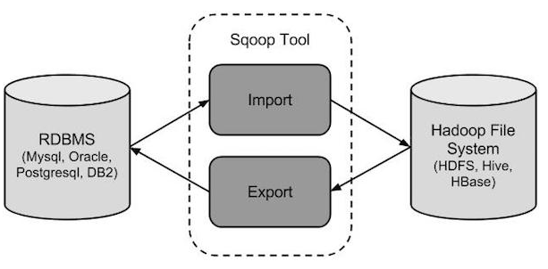

Apache Sqoop

## sqoop介绍

Apache Sqoop是在Hadoop生态体系和RDBMS体系之间传送数据的一种工具。来自于Apache软件基金会提供。
Sqoop工作机制是将导入或导出命令翻译成mapreduce程序来实现。在翻译出的mapreduce中主要是对inputformat和outputformat进行定制。
Hadoop生态系统包括：HDFS、Hive、Hbase等
RDBMS体系包括：Mysql、Oracle、DB2等
Sqoop可以理解为：“SQL 到 Hadoop 和 Hadoop 到SQL”。

站在Apache立场看待数据流转问题，可以分为数据的导入导出:
Import：数据导入。RDBMS----->Hadoop
Export：数据导出。Hadoop---->RDBMS

## sqoop安装

安装sqoop的前提是已经具备java和hadoop的环境。
最新稳定版： 1.4.6
配置文件修改：

```shell
[root@node03 softwares]# cd /export/softwares
# 上传安装包
[root@node03 softwares]# tar -zxvf sqoop-1.4.6.bin__hadoop-2.0.4-alpha.tar.gz -C /export/servers/
[root@node03 servers]# mv sqoop-1.4.6.bin__hadoop-2.0.4-alpha/ sqoop-1.4.6
[root@node03 conf]# cd /export/servers/sqoop-1.4.6/conf
[root@node03 conf]# which hadoop
/export/servers/hadoop-2.7.5/bin/hadoop
[root@node03 conf]# which hive
/export/servers/apache-hive-2.1.1-bin/bin/hive

[root@node03 conf]# mv sqoop-env-template.sh sqoop-env.sh
[root@node03 conf]# vim sqoop-env.sh
export HADOOP_COMMON_HOME= /export/servers/hadoop-2.7.5
export HADOOP_MAPRED_HOME= /export/servers/hadoop-2.7.5
export HIVE_HOME= /export/servers/apache-hive-2.1.1-bin
#加入mysql的jdbc驱动包
[root@node03 conf]# cp /export/servers/apache-hive-2.1.1-bin/lib/mysql-connector-java-5.1.38.jar /export/servers/sqoop-1.4.6/lib/
cp /hive/lib/mysql-connector-java-5.1.32.jar $SQOOP_HOME/lib/
#验证启动
[root@node03 sqoop-1.4.6]# bin/sqoop list-databases --connect jdbc:mysql://localhost:3306/ --username root --password 123456
ed. According to MySQL 5.5.45+, 5.6.26+ and 5.7.6+ requirements SSL connection must be established by default if explicit option isn't set'. For compliance with existing applications not using SSL the verifyServerCertificate property is set to 'false'. You need either to explicitly disable SSL by setting useSSL=false, or set useSSL=true and provide truststore for server certificate verification.
information_schema
azkaban_two_server
hive
metastore
mysql
performance_schema
sys
# 看到本地数据库说明验证成功
```

本命令会列出所有mysql的数据库。
到这里，整个Sqoop安装工作完成。

## Sqoop导入

“导入工具”导入单个表从RDBMS到HDFS。表中的每一行被视为HDFS的记录。所有记录都存储为文本文件的文本数据
下面的语法用于将数据导入HDFS。

```shell
sqoop import (generic-args) (import-args)
```

Sqoop测试表数据
在mysql中创建数据库userdb，然后执行参考资料中的sql脚本：
创建三张表: emp雇员表、 emp_add雇员地址表、emp_conn雇员联系表。
先手动创建数据库，再执行sql语句，/sqoop-test-data/userdb.sql

## 全量导入mysql表数据到HDFS

下面的命令用于从MySQL数据库服务器中的emp表导入HDFS。  
注意事项：命令携带参数必须出现在一行中，若换行就意味着自动提交执行，可通过\表示未结束。

```shell
bin/sqoop import \
--connect jdbc:mysql://node03:3306/userdb \
--username root \
--password 123456 \
--delete-target-dir \
--target-dir /sqoopresult \
--table emp --m 1
```

其中--target-dir可以用来指定导出数据存放至HDFS的目录；
mysql jdbc url 请使用 ip 地址。
为了验证在HDFS导入的数据，请使用以下命令查看导入的数据：

```shell
# 查询hdfs 中生成的路径
[root@node03 sqoop-1.4.6]# hdfs dfs -ls -R /sqoopresult
-rw-r--r--   3 root supergroup          0 2019-08-21 08:49 /sqoopresult/_SUCCESS
-rw-r--r--   3 root supergroup        151 2019-08-21 08:49 /sqoopresult/part-m-00000
[root@node03 sqoop-1.4.6]# hdfs dfs -cat /sqoopresult/part-m-00000
1201,gopal,manager,50000,TP
1202,manisha,Proof reader,50000,TP
1203,khalil,php dev,30000,AC
1204,prasanth,php dev,30000,AC
1205,kranthi,admin,20000,TP
```

可以看出它会在HDFS上默认用逗号,分隔emp表的数据和字段。可以通过
--fields-terminated-by '\t'来指定分隔符。

```shell
bin/sqoop import \
--connect jdbc:mysql://node03:3306/userdb \
--username root \
--password 123456 \
--delete-target-dir \
--target-dir /sqoopresult \
--table emp --m 1 \
--fields-terminated-by '\t'
```

```shell
[root@node03 sqoop-1.4.6]# hdfs dfs -ls -R /sqoopresult
-rw-r--r--   3 root supergroup          0 2019-08-21 08:56 /sqoopresult/_SUCCESS
-rw-r--r--   3 root supergroup        151 2019-08-21 08:56 /sqoopresult/part-m-00000
# 可以看出分割符是‘\t’
[root@node03 sqoop-1.4.6]# hdfs dfs -cat /sqoopresult/part-m-00000                                                    1201    gopal   manager 50000   TP
1202    manisha Proof reader    50000   TP
1203    khalil  php dev 30000   AC
1204    prasanth        php dev 30000   AC
1205    kranthi admin   20000   TP
```

 分区导入hdfs中

```shell
    bin/sqoop import \
    --connect jdbc:mysql://node03:3306/userdb \
    --username root \
    --password 123456 \
    --target-dir /sqoopresult214 \
    --fields-terminated-by '\t' \
    --split-by id \
    --table emp --m 2
## 可以看出分成两个文件了
[root@node03 sqoop-1.4.6]# hdfs dfs -ls -R /sqoopresult214
-rw-r--r--   3 root supergroup          0 2019-08-21 09:11 /sqoopresult214/_SUCCESS
-rw-r--r--   3 root supergroup         63 2019-08-21 09:11 /sqoopresult214/part-m-00000
-rw-r--r--   3 root supergroup         88 2019-08-21 09:11 /sqoopresult214/part-m-00001
[root@node03 sqoop-1.4.6]# hdfs dfs -cat /sqoopresult214/part-m-00000
1201    gopal   manager 50000   TP
1202    manisha Proof reader    50000   TP
[root@node03 sqoop-1.4.6]# hdfs dfs -cat /sqoopresult214/part-m-00001
1203    khalil  php dev 30000   AC
1204    prasanth        php dev 30000   AC
1205    kranthi admin   20000   TP
```

## 全量导入mysql表数据到HIVE

### 方式一：先复制表结构到hive中再导入数据

在hive 中查询是否有text这个数据库,若无就创建

```shell
0: jdbc:hive2://node03:10000> create database if not exists test;
No rows affected (0.074 seconds)
0: jdbc:hive2://node03:10000> show databases;
+----------------+--+
| database_name  |
+----------------+--+
| default        |
| myhive         |
| test           |
| text           |
+----------------+--+
```

将关系型数据的表结构复制到hive中

```shell
bin/sqoop create-hive-table \
--connect jdbc:mysql://node03:3306/userdb \
--table emp_add \
--username root \
--password 123456 \
--hive-table test.emp_add_sp
#其中：
 #--table emp_add为mysql中的数据库userdb中的表。
 #--hive-table emp_add_sp 为hive中新建的表名称。
```

结果：只复制了一个表结构

```shell
0: jdbc:hive2://node03:10000> use test;
No rows affected (0.039 seconds)
0: jdbc:hive2://node03:10000> show tables;
+-------------+--+
|  tab_name   |
+-------------+--+
| emp_add_sp  |
+-------------+--+
1 row selected (0.072 seconds)
0: jdbc:hive2://node03:10000> select * from emp_add_sp;
+----------------+-----------------+--------------------+------------------+--+
| emp_add_sp.id  | emp_add_sp.hno  | emp_add_sp.street  | emp_add_sp.city  |
+----------------+-----------------+--------------------+------------------+--+
+----------------+-----------------+--------------------+------------------+--+
No rows selected (0.165 seconds)
```

从关系数据库导入数据到hive中

```shell
bin/sqoop import \
--connect jdbc:mysql://node03:3306/userdb \
--username root \
--password 123456 \
--table emp_add \
--hive-table test.emp_add_sp \
--hive-import \
--m 1
```

查询hive数据库中是否有数据

```shell
0: jdbc:hive2://node03:10000> select * from emp_add_sp;
+----------------+-----------------+--------------------+------------------+--+
| emp_add_sp.id  | emp_add_sp.hno  | emp_add_sp.street  | emp_add_sp.city  |
+----------------+-----------------+--------------------+------------------+--+
| 1201           | 288A            | vgiri              | jublee           |
| 1202           | 108I            | aoc                | sec-bad          |
| 1203           | 144Z            | pgutta             | hyd              |
| 1204           | 78B             | old city           | sec-bad          |
| 1205           | 720X            | hitec              | sec-bad          |
+----------------+-----------------+--------------------+------------------+--+
5 rows selected (0.114 seconds)
```

### 方式二：直接复制表结构数据到hive中

```shell
bin/sqoop import \
--connect jdbc:mysql://node03:3306/userdb \
--username root \
--password 123456 \
--table emp_conn \
--hive-import \
--m 1 \
--hive-database test;
```

查询hive数据库中数据是否导入成功

```shell
0: jdbc:hive2://node03:10000> show tables;
+-------------+--+
|  tab_name   |
+-------------+--+
| emp_add_sp  |
| emp_conn    |
+-------------+--+
2 rows selected (0.039 seconds)
0: jdbc:hive2://node03:10000> select * from emp_conn;
+--------------+----------------+------------------+--+
| emp_conn.id  | emp_conn.phno  |  emp_conn.email  |
+--------------+----------------+------------------+--+
| 1201         | 2356742        | gopal@tp.com     |
| 1202         | 1661663        | manisha@tp.com   |
| 1203         | 8887776        | khalil@ac.com    |
| 1204         | 9988774        | prasanth@ac.com  |
| 1205         | 1231231        | kranthi@tp.com   |
+--------------+----------------+------------------+--+
5 rows selected (0.103 seconds)
```

## 导入表数据子集(where过滤)

--where可以指定从关系数据库导入数据时的查询条件。它执行在数据库服务器相应的SQL查询，并将结果存储在HDFS的目标目录。

```shell
bin/sqoop import \
--connect jdbc:mysql://node03:3306/userdb \
--username root \
--password 123456 \
--where "city ='sec-bad'" \
--target-dir /wherequery \
--table emp_add --m 1
```

```shell
[root@node03 sqoop-1.4.6]# hdfs dfs -ls -R /wherequery
-rw-r--r--   3 root supergroup          0 2019-08-21 09:22 /wherequery/_SUCCESS
-rw-r--r--   3 root supergroup         72 2019-08-21 09:22 /wherequery/part-m-00000
[root@node03 sqoop-1.4.6]# hdfs dfs -cat /wherequery/part-m-00000
1202,108I,aoc,sec-bad
1204,78B,old city,sec-bad
1205,720X,hitec,sec-bad
```

## 导入表数据子集(query查询)

注意事项：
使用query sql语句来进行查找不能加参数--table ;
并且必须要添加where条件;
并且where条件后面必须带一个`$CONDITIONS` 这个字符串;
并且这个sql语句必须用单引号，不能用双引号;

```shell
bin/sqoop import \
--connect jdbc:mysql://node03:3306/userdb \
--username root \
--password 123456 \
--target-dir /wherequery12 \
--query 'select id,name,deg from emp WHERE  id>1203 and $CONDITIONS' \
--split-by id \
--fields-terminated-by '\t' \
--m 2
```

```shell
[root@node03 sqoop-1.4.6]# hdfs dfs -ls -R /wherequery12
-rw-r--r--   3 root supergroup          0 2019-08-21 09:24 /wherequery12/_SUCCESS
-rw-r--r--   3 root supergroup         22 2019-08-21 09:24 /wherequery12/part-m-00000
-rw-r--r--   3 root supergroup         19 2019-08-21 09:24 /wherequery12/part-m-00001
[root@node03 sqoop-1.4.6]# hdfs dfs -cat /wherequery12/part-m-00000
1204    prasanth        php dev
[root@node03 sqoop-1.4.6]# hdfs dfs -cat /wherequery12/part-m-00001
1205    kranthi admin
```

sqoop命令中，--split-by id通常配合-m 10参数使用。用于指定根据哪个字段进行划分并启动多少个maptask。

## 增量导入

在实际工作当中，数据的导入，很多时候都是只需要导入增量数据即可，并不需要将表中的数据每次都全部导入到hive或者hdfs当中去，这样会造成数据重复的问题。因此一般都是选用一些字段进行增量的导入， sqoop支持增量的导入数据。
增量导入是仅导入新添加的表中的行的技术。

--check-column (col)
用来指定一些列，这些列在增量导入时用来检查这些数据是否作为增量数据进行导入，和关系型数据库中的自增字段及时间戳类似。
注意:这些被指定的列的类型不能使任意字符类型，如char、varchar等类型都是不可以的，同时-- check-column可以去指定多个列。
--incremental (mode)
append：追加，比如对大于last-value指定的值之后的记录进行追加导入。lastmodified：最后的修改时间，追加last-value指定的日期之后的记录
--last-value (value)
指定自从上次导入后列的最大值（大于该指定的值），也可以自己设定某一值

### Append模式增量导入

Append模式增量导入
执行以下指令先将我们之前的数据导入：

```shell
bin/sqoop import \
--connect jdbc:mysql://node03:3306/userdb \
--username root \
--password 123456 \
--target-dir /appendresult \
--table emp --m 1

```

使用hadoop fs -cat查看生成的数据文件，发现数据已经导入到hdfs中。

```shell
[root@node03 sqoop-1.4.6]# hdfs dfs -ls -R /appendresult
-rw-r--r--   3 root supergroup          0 2019-08-21 09:27 /appendresult/_SUCCESS
-rw-r--r--   3 root supergroup        151 2019-08-21 09:27 /appendresult/part-m-00000
[root@node03 sqoop-1.4.6]# hdfs dfs -cat /appendresult/part-m-00000
1201,gopal,manager,50000,TP
1202,manisha,Proof reader,50000,TP
1203,khalil,php dev,30000,AC
1204,prasanth,php dev,30000,AC
1205,kranthi,admin,20000,TP
```

然后在mysql的emp中插入2条增量数据:

```sql
[root@node03 sqoop-1.4.6]# mysql -u root -p123456
mysql> use userdb
mysql> show tables;
+------------------+
| Tables_in_userdb |
+------------------+
| emp              |
| emp_add          |
| emp_conn         |
+------------------+
3 rows in set (0.00 sec)
mysql> insert into `userdb`.`emp` (`id`, `name`, `deg`, `salary`, `dept`) values ('1206', 'allen', 'admin', '30000', 'tp');
Query OK, 1 row affected (0.01 sec)

mysql> insert into `userdb`.`emp` (`id`, `name`, `deg`, `salary`, `dept`) values ('1207', 'woon', 'admin', '40000', 'tp');
Query OK, 1 row affected (0.01 sec)
mysql> exit;
Bye
```

执行如下的指令，实现增量的导入:

```shell
bin/sqoop import \
--connect jdbc:mysql://node03:3306/userdb \
--username root  --password 123456 \
--table emp --m 1 \
--target-dir /appendresult \
--incremental append \
--check-column id \
--last-value  1205
```

```shell
19/08/21 09:35:32 INFO mapreduce.ImportJobBase: Retrieved 2 records.#检索到2条记录。
19/08/21 09:35:32 INFO util.AppendUtils: Appending to directory appendresult #附加到目录appendresult
19/08/21 09:35:32 INFO util.AppendUtils: Using found partition 1
19/08/21 09:35:32 INFO tool.ImportTool: Incremental import complete! To run another incremental import of all data following this import, supply the following arguments:
19/08/21 09:35:32 INFO tool.ImportTool:  --incremental append
19/08/21 09:35:32 INFO tool.ImportTool:   --check-column id
19/08/21 09:35:32 INFO tool.ImportTool:   --last-value 1207
19/08/21 09:35:32 INFO tool.ImportTool: (Consider saving this with 'sqoop job --create')
[root@node03 sqoop-1.4.6]# hdfs dfs -ls -R /appendresult
-rw-r--r--   3 root supergroup          0 2019-08-21 09:27 /appendresult/_SUCCESS
-rw-r--r--   3 root supergroup        151 2019-08-21 09:27 /appendresult/part-m-00000
-rw-r--r--   3 root supergroup         51 2019-08-21 09:35 /appendresult/part-m-00001
[root@node03 sqoop-1.4.6]# hdfs dfs -cat /appendresult/part-m-00001
1206,allen,admin,30000,tp
1207,woon,admin,40000,tp
```

最后验证导入数据目录 可以发现多了一个文件 里面就是增量数据

### Lastmodified模式增量导入

首先创建一个customer表，指定一个时间戳字段：

```shell
  create table customertest(id int,name varchar(20),last_mod timestamp default current_timestamp on update current_timestamp);
```

此处的时间戳设置为在数据的产生和更新时都会发生改变.
分别插入如下记录:

```sql
[root@node03 sqoop-1.4.6]# mysql -u root -p123456
mysql> use userdb
insert into customertest(id,name) values(1,'neil');
insert into customertest(id,name) values(2,'jack');
insert into customertest(id,name) values(3,'martin');
insert into customertest(id,name) values(4,'tony');
insert into customertest(id,name) values(5,'eric');
mysql> select * from customertest;
+------+--------+---------------------+
| id   | name   | last_mod            |
+------+--------+---------------------+
|    1 | neil   | 2019-08-21 09:48:36 |
|    2 | jack   | 2019-08-21 09:48:45 |
|    3 | martin | 2019-08-21 09:48:55 |
|    4 | tony   | 2019-08-21 09:49:02 |
|    5 | eric   | 2019-08-21 09:49:10 |
+------+--------+---------------------+
5 rows in set (0.00 sec)


```

执行sqoop指令将数据全部导入hdfs:

```shell
bin/sqoop import \
--connect jdbc:mysql://node03:3306/userdb \
--username root \
--password 123456 \
--target-dir /lastmodifiedresult \
--table customertest --m 1
```

```shell
[root@node03 sqoop-1.4.6]# hdfs dfs -ls -R /lastmodifiedresult
-rw-r--r--   3 root supergroup          0 2019-08-21 09:57 /lastmodifiedresult/_SUCCESS
-rw-r--r--   3 root supergroup        147 2019-08-21 09:57 /lastmodifiedresult/part-m-00000
# 查看此时导出的结果数据：
[root@node03 sqoop-1.4.6]# hdfs dfs -cat /lastmodifiedresult/part-m-00000
1,neil,2019-08-21 09:48:36.0
2,jack,2019-08-21 09:48:45.0
3,martin,2019-08-21 09:48:55.0
4,tony,2019-08-21 09:49:02.0
5,eric,2019-08-21 09:49:10.0
```

再次插入一条数据进入customertest表

```sql
  insert into customertest(id,name) values(6,'james');
```

使用incremental的方式进行增量的导入:

```shell
bin/sqoop import \
--connect jdbc:mysql://node03:3306/userdb \
--username root \
--password 123456 \
--table customertest \
--target-dir /lastmodifiedresult \
--check-column last_mod \
--incremental lastmodified \
--last-value "2019-08-21 09:49:10.0" \
--m 1 \
--append
```

```shell
[root@node03 sqoop-1.4.6]# hdfs dfs -cat /lastmodifiedresult/part-m-00000
1,neil,2019-08-21 09:48:36.0
2,jack,2019-08-21 09:48:45.0
3,martin,2019-08-21 09:48:55.0
4,tony,2019-08-21 09:49:02.0
5,eric,2019-08-21 09:49:10.0
[root@node03 sqoop-1.4.6]# hdfs dfs -cat /lastmodifiedresult/part-m-00001
5,eric,2019-08-21 09:49:10.0 ## 这条数据重复了
6,james,2019-08-21 10:03:00.0
```

此处已经会导入我们最后插入的一条记录,但是我们却发现此处插入了2条数据，这是为什么呢？
这是因为采用lastmodified模式去处理增量时，会将大于等于last-value值的数据当做增量插入。
解决问题只要将最后时间改大一秒即可

### Lastmodified模式:append、merge-key

使用lastmodified模式进行增量处理要指定增量数据是以append模式(附加)还是merge-key(合并)模式添加
下面演示使用merge-by的模式进行增量更新,我们去更新 id为1的name字段。

```sql
mysql> update customertest set name = 'Neil' where id = 1;
Query OK, 1 row affected (0.01 sec)
Rows matched: 1  Changed: 1  Warnings: 0
mysql> select * from customertest;
+------+--------+---------------------+
| id   | name   | last_mod            |
+------+--------+---------------------+
|    1 | Neil   | 2019-08-21 10:10:25 |
|    2 | jack   | 2019-08-21 09:48:45 |
|    3 | martin | 2019-08-21 09:48:55 |
|    4 | tony   | 2019-08-21 09:49:02 |
|    5 | eric   | 2019-08-21 09:49:10 |
|    6 | james  | 2019-08-21 10:03:00 |
+------+--------+---------------------+
6 rows in set (0.00 sec)

```

更新之后，这条数据的时间戳会更新为更新数据时的系统时间.
执行如下指令，把id字段作为merge-key:

```shell
bin/sqoop import \
--connect jdbc:mysql://node03:3306/userdb \
--username root \
--password 123456 \
--table customertest \
--target-dir /lastmodifiedresult \
--check-column last_mod \
--incremental lastmodified \
--last-value "2019-08-21 10:03:01" \
--m 1 \
--merge-key id
```

由于merge-key模式是进行了一次完整的mapreduce操作，
因此最终我们在lastmodifiedresult文件夹下可以看到生成的为part-r-00000这样的文件，会发现id=1的name已经得到修改，同时新增了id=6的数据。

```shell
[root@node03 sqoop-1.4.6]# hdfs dfs -cat /lastmodifiedresult/part-r-00000
1,Neil,2019-08-21 10:10:25.0 ##更新时间也更新了
2,jack,2019-08-21 09:48:45.0
3,martin,2019-08-21 09:48:55.0
4,tony,2019-08-21 09:49:02.0
5,eric,2019-08-21 09:49:10.0
6,james,2019-08-21 10:03:00.0 ## 合新了新增的数据
```

## Sqoop导出

将数据从Hadoop生态体系导出到RDBMS数据库导出前，目标表必须存在于目标数据库中。
export有三种模式：
默认操作是从将文件中的数据使用INSERT语句插入到表中。
更新模式：Sqoop将生成UPDATE替换数据库中现有记录的语句。
调用模式：Sqoop将为每条记录创建一个存储过程调用。

以下是export命令语法：

```shell
sqoop export (generic-args) (export-args)
```

## 默认模式导出HDFS数据到mysql

默认情况下，sqoop export将每行输入记录转换成一条INSERT语句，添加到目标数据库表中。如果数据库中的表具有约束条件（例如，其值必须唯一的主键列）并且已有数据存在，则必须注意避免插入违反这些约束条件的记录。如果INSERT语句失败，导出过程将失败。此模式主要用于将记录导出到可以接收这些结果的空表中。通常用于全表数据导出。
导出时可以是将Hive表中的全部记录或者HDFS数据（可以是全部字段也可以部分字段）导出到Mysql目标表。

### 准备HDFS数据

在HDFS文件系统中“/emp/”目录的下创建一个文件emp_data.txt：

```shell
[root@node03 sqoop-1.4.6]# hdfs dfs -mkdir /emp
[root@node03 sqoop-1.4.6]# vim emp_data.txt
1201,gopal,manager,50000,TP
1202,manisha,preader,50000,TP
1203,kalil,php dev,30000,AC
1204,prasanth,php dev,30000,AC
1205,kranthi,admin,20000,TP
1206,satishp,grpdes,20000,GR
[root@node03 sqoop-1.4.6]# hdfs dfs -put emp_data.txt /emp
[root@node03 sqoop-1.4.6]# hdfs dfs -cat /emp/emp_data.txt
1201,gopal,manager,50000,TP
1202,manisha,preader,50000,TP
1203,kalil,php dev,30000,AC
1204,prasanth,php dev,30000,AC
1205,kranthi,admin,20000,TP
1206,satishp,grpdes,20000,GR
```

### 手动创建mysql中的目标表

```sql
[root@node03 sqoop-1.4.6]# mysql -u root -p123456
mysql> use userdb
Reading table information for completion of table and column names
You can turn off this feature to get a quicker startup with -A

Database changed
mysql> show tables;
+------------------+
| Tables_in_userdb |
+------------------+
| customertest     |
| emp              |
| emp_add          |
| emp_conn         |
+------------------+
4 rows in set (0.00 sec)

mysql> CREATE TABLE employee (
    ->    id INT NOT NULL PRIMARY KEY,
    ->    name VARCHAR(20),
    ->    deg VARCHAR(20),
    ->    salary INT,
    ->    dept VARCHAR(10));
Query OK, 0 rows affected (0.02 sec)

```

### 执行导出命令

```shell
bin/sqoop export \
--connect jdbc:mysql://node03:3306/userdb \
--username root \
--password 123456 \
--table employee \
--export-dir /emp/
```

```shell
19/08/21 10:22:45 INFO mapreduce.ExportJobBase: Transferred 2.709 KB in 15.3618 seconds (180.5779 bytes/sec)
19/08/21 10:22:45 INFO mapreduce.ExportJobBase: Exported 6 records.# 导入成功6条
# 检查数据库中是否有数据
mysql> select * from employee;
+------+----------+---------+--------+------+
| id   | name     | deg     | salary | dept |
+------+----------+---------+--------+------+
| 1201 | gopal    | manager |  50000 | TP   |
| 1202 | manisha  | preader |  50000 | TP   |
| 1203 | kalil    | php dev |  30000 | AC   |
| 1204 | prasanth | php dev |  30000 | AC   |
| 1205 | kranthi  | admin   |  20000 | TP   |
| 1206 | satishp  | grpdes  |  20000 | GR   |
+------+----------+---------+--------+------+
6 rows in set (0.00 sec)

```

### 相关配置参数

```text
相关配置参数
--input-fields-terminated-by '\t'  
指定文件中的分隔符
--columns
选择列并控制它们的排序。当导出数据文件和目标表字段列顺序完全一致的时候可以不写。否则以逗号为间隔选择和排列各个列。没有被包含在–columns后面列名或字段要么具备默认值，要么就允许插入空值。否则数据库会拒绝接受sqoop导出的数据，导致Sqoop作业失败
--export-dir 导出目录，在执行导出的时候，必须指定这个参数，同时需要具备--table或--call参数两者之一，--table是指的导出数据库当中对应的表，
--call是指的某个存储过程。
--input-null-string --input-null-non-string
如果没有指定第一个参数，对于字符串类型的列来说，“NULL”这个字符串就回被翻译成空值，如果没有使用第二个参数，无论是“NULL”字符串还是说空字符串也好，对于非字符串类型的字段来说，这两个类型的空串都会被翻译成空值。比如：
--input-null-string "\\N" --input-null-non-string "\\N"
```

## 更新导出（updateonly模式）

### 参数说明

-- update-key，更新标识，即根据某个字段进行更新，例如id，可以指定多个更新标识的字段，多个字段之间用逗号分隔。
-- updatemod，指定updateonly（默认模式），仅仅更新已存在的数据记录，不会插入新纪录。

### 准备HDFS数据`

在HDFS "/updateonly_1/"目录的下创建一个文件updateonly_1.txt：

```shell
[root@node03 sqoop-1.4.6]# hdfs dfs -mkdir /updateonly_1/
[root@node03 sqoop-1.4.6]# vim updateonly_1.txt
1201,gopal,manager,50000
1202,manisha,preader,50000
1203,kalil,php dev,30000
[root@node03 sqoop-1.4.6]# hdfs dfs -put updateonly_1.txt /updateonly_1/
[root@node03 sqoop-1.4.6]# hdfs dfs -cat /updateonly_1/updateonly_1.txt
1201,gopal,manager,50000
1202,manisha,preader,50000
1203,kalil,php dev,30000
```

### 手动创建mysql中的目标表0

```sql
mysql> USE userdb;
mysql> CREATE TABLE updateonly (
   id INT NOT NULL PRIMARY KEY,
   name VARCHAR(20),
   deg VARCHAR(20),
   salary INT);
```

### 先执行全部导出操作

```shell
bin/sqoop export \
--connect jdbc:mysql://node03:3306/userdb \
--username root \
--password 123456 \
--table updateonly \
--export-dir /updateonly_1/

```

### 查看此时mysql中的数据

可以发现是全量导出，全部的数据

```shell
mysql> select * from updateonly;
+------+---------+---------+--------+
| id   | name    | deg     | salary |
+------+---------+---------+--------+
| 1201 | gopal   | manager |  50000 |
| 1202 | manisha | preader |  50000 |
| 1203 | kalil   | php dev |  30000 |
+------+---------+---------+--------+
3 rows in set (0.00 sec)

```

### 新增一个文件

updateonly_2.txt。修改了前三条数据并且新增了一条记录。上传至/updateonly_2/目录下：

```shell
[root@node03 sqoop-1.4.6]# vim updateonly_2.txt
1201,gopal,manager,1212
1202,manisha,preader,1313
1203,kalil,php dev,1414
1204,allen,java,1515
[root@node03 sqoop-1.4.6]# hdfs dfs -mkdir /updateonly_2
[root@node03 sqoop-1.4.6]# hdfs dfs -put updateonly_2.txt /updateonly_2
```

### 执行更新导出

```shell
bin/sqoop export \
--connect jdbc:mysql://node03:3306/userdb \
--username root --password 123456 \
--table updateonly \
--export-dir /updateonly_2/ \
--update-key id \
--update-mode updateonly
```

### 查看最终结果

虽然导出时候的日志显示导出4条记录：

```shell
19/08/21 10:48:50 INFO mapreduce.ExportJobBase: Transferred 2.3887 KB in 15.5928 seconds (156.867 bytes/sec)
19/08/21 10:48:50 INFO mapreduce.ExportJobBase: Exported 4 records.
```

但最终只进行了更新操作

```shell
mysql> select * from updateonly;
+------+---------+---------+--------+
| id   | name    | deg     | salary |
+------+---------+---------+--------+
| 1201 | gopal   | manager |   1212 |
| 1202 | manisha | preader |   1313 |
| 1203 | kalil   | php dev |   1414 |
+------+---------+---------+--------+
3 rows in set (0.00 sec)

```

## 更新导出（allowinsert模式）

参数说明
-- update-key，更新标识，即根据某个字段进行更新，例如id，可以指定多个更新标识的字段，多个字段之间用逗号分隔。
-- updatemod，指定allowinsert，更新已存在的数据记录，同时插入新纪录。实质上是一个insert & update的操作。
准备HDFS数据
在HDFS “/allowinsert_1/”目录的下创建一个文件allowinsert_1.txt：

```shell
[root@node03 sqoop-1.4.6]# hdfs dfs -mkdir /allowinsert_1
[root@node03 sqoop-1.4.6]# vim allowinsert_1.txt
1201,gopal,manager,50000
1202,manisha,preader,50000
1203,kalil,php dev,30000
[root@node03 sqoop-1.4.6]# hdfs dfs -put allowinsert_1.txt /allowinsert_1
[root@node03 sqoop-1.4.6]# hdfs dfs -cat /allowinsert_1/allowinsert_1.txt  
1201,gopal,manager,50000
1202,manisha,preader,50000
1203,kalil,php dev,30000
```

手动创建mysql中的目标表

```sql
mysql> USE userdb;
mysql> CREATE TABLE allowinsert (
   id INT NOT NULL PRIMARY KEY,
   name VARCHAR(20),
   deg VARCHAR(20),
   salary INT);

```

### 先执行全部导出操作`

```shell
#先执行全部导出操作
bin/sqoop export \
--connect jdbc:mysql://node03:3306/userdb \
--username root \
--password 123456 \
--table allowinsert \
--export-dir /allowinsert_1/
```

查看此时mysql中的数据
可以发现是全量导出，全部的数据

```shell
mysql> select * from allowinsert;
+------+---------+---------+--------+
| id   | name    | deg     | salary |
+------+---------+---------+--------+
| 1201 | gopal   | manager |  50000 |
| 1202 | manisha | preader |  50000 |
| 1203 | kalil   | php dev |  30000 |
+------+---------+---------+--------+
3 rows in set (0.00 sec)

```

新增一个文件

allowinsert_2.txt。修改了前三条数据并且新增了一条记录。上传至/allowinsert_2/目录下：

```shell
[root@node03 sqoop-1.4.6]# vim allowinsert_2.txt
1201,gopal,manager,1212
1202,manisha,preader,1313
1203,kalil,php dev,1414
1204,allen,java,1515
[root@node03 sqoop-1.4.6]# hdfs dfs -put allowinsert_2.txt /allowinsert_2
```

执行更新导出

```shell
bin/sqoop export \
--connect jdbc:mysql://node03:3306/userdb \
--username root --password 123456 \
--table allowinsert \
--export-dir /allowinsert_2/ \
--update-key id \
--update-mode allowinsert
```

查看最终结果

导出时候的日志显示导出4条记录：

```shell
19/08/21 10:59:52 INFO mapreduce.ExportJobBase: Transferred 2.1699 KB in 15.243 seconds (145.7717 bytes/sec)
19/08/21 10:59:52 INFO mapreduce.ExportJobBase: Exported 4 records.
```

数据进行更新操作的同时也进行了新增的操作

```shell
mysql> select * from allowinsert;
+------+---------+---------+--------+
| id   | name    | deg     | salary |
+------+---------+---------+--------+
| 1201 | gopal   | manager |   1212 |
| 1202 | manisha | preader |   1313 |
| 1203 | kalil   | php dev |   1414 |
| 1204 | allen   | java    |   1515 |
+------+---------+---------+--------+
4 rows in set (0.00 sec)
```

## Sqoop job作业

## job 语法

```shell
$ sqoop job (generic-args) (job-args)
[-- [subtool-name] (subtool-args)]
$ sqoop-job (generic-args) (job-args)
[-- [subtool-name] (subtool-args)]
```

## 创建job

在这里，我们创建一个名为xhchenjob，这可以从RDBMS表的数据导入到HDFS作业。
下面的命令用于创建一个从DB数据库的emp表导入到HDFS文件的作业。

```shell
bin/sqoop job --create xhchenjob -- import \
--connect jdbc:mysql://node03:3306/userdb \
--username root --password 123456 \
--target-dir /sqoopresult333 \
--table emp --m 1
#注意import前要有空格
```

## 验证job

'--list' 参数是用来验证保存的作业。下面的命令用来验证保存Sqoop作业的列表。

```shell
[root@node03 sqoop-1.4.6]# bin/sqoop job --list
  19/08/21 11:06:41 INFO sqoop.Sqoop: Running Sqoop version: 1.4.6
Available jobs:
  xhchenjob
```

## 检查job

'--show' 参数用于检查或验证特定的工作，及其详细信息。以下命令和样本输出用来验证一个名为xhchenjob的作业。

```shell
[root@node03 sqoop-1.4.6]# bin/sqoop job --show xhchenjob
Enter password: #密码为空
Job: xhchenjob
Tool: import
Options:
----------------------------
verbose = false
db.connect.string = jdbc:mysql://node03:3306/userdb
codegen.output.delimiters.escape = 0
codegen.output.delimiters.enclose.required = false
codegen.input.delimiters.field = 0
hbase.create.table = false
db.require.password = true
hdfs.append.dir = false
db.table = emp
codegen.input.delimiters.escape = 0
import.fetch.size = null
accumulo.create.table = false
codegen.input.delimiters.enclose.required = false
db.username = root
reset.onemapper = false
codegen.output.delimiters.record = 10
import.max.inline.lob.size = 16777216
hbase.bulk.load.enabled = false
hcatalog.create.table = false
db.clear.staging.table = false
codegen.input.delimiters.record = 0
enable.compression = false
hive.overwrite.table = false
hive.import = false
codegen.input.delimiters.enclose = 0
accumulo.batch.size = 10240000
hive.drop.delims = false
codegen.output.delimiters.enclose = 0
hdfs.delete-target.dir = false
codegen.output.dir = .
codegen.auto.compile.dir = true
relaxed.isolation = false
mapreduce.num.mappers = 1
accumulo.max.latency = 5000
import.direct.split.size = 0
codegen.output.delimiters.field = 44
export.new.update = UpdateOnly
incremental.mode = None
hdfs.file.format = TextFile
codegen.compile.dir = /tmp/sqoop-root/compile/cfc8c50a5c64e7bcf7c8dc4cf273d616
direct.import = false
hdfs.target.dir = /sqoopresult333
hive.fail.table.exists = false
db.batch = false
```

## 执行job

'--exec' 选项用于执行保存的作业。下面的命令用于执行保存的作业称为xhchenjob。

```shell
[root@node03 sqoop-1.4.6]# bin/sqoop job --exec xhchenjob
##提示输入密码，密码为123456
19/08/21 11:10:41 INFO mapreduce.ImportJobBase: Transferred 145.6826 KB in 15.2549 seconds (9.5499 KB/sec)
19/08/21 11:10:41 INFO mapreduce.ImportJobBase: Retrieved 7 records.
[root@node03 sqoop-1.4.6]# hdfs dfs -ls -R /sqoopresult333
-rw-r--r--   3 root supergroup          0 2019-08-21 11:10 /sqoopresult333/_SUCCESS
-rw-r--r--   3 root supergroup        202 2019-08-21 11:10 /sqoopresult333/part-m-00000
[root@node03 sqoop-1.4.6]# hdfs dfs -cat /sqoopresult333/part-m-00000
1201,gopal,manager,50000,TP
1202,manisha,Proof reader,50000,TP
1203,khalil,php dev,30000,AC
1204,prasanth,php dev,30000,AC
1205,kranthi,admin,20000,TP
1206,allen,admin,30000,tp
1207,woon,admin,40000,tp
```

## 免密执行job

sqoop在创建job时，使用--password-file参数，可以避免输入mysql密码，如果使用--password将出现警告，并且每次都要手动输入密码才能执行job，sqoop规定密码文件必须存放在HDFS上，并且权限必须是400。
并且检查sqoop的sqoop-site.xml是否存在如下配置：

```shell
[root@node03 sqoop-1.4.6]# vim conf/sqoop-site.xml
<property>
    <name>sqoop.metastore.client.record.password</name>
    <value>true</value>
    <description>If true, allow saved passwords in the metastore.
    </description>
</property>
```

```shell
[root@node03 sqoop-1.4.6]# vim xhchenmysql.pwd
123456
[root@node03 sqoop-1.4.6]# hdfs dfs -mkdir -p /input/sqoop/pwd/
[root@node03 sqoop-1.4.6]# hdfs dfs -put xhchenmysql.pwd /input/sqoop/pwd/

[root@node03 sqoop-1.4.6]# bin/sqoop job --create xhchenjob1 -- import --connect jdbc:mysql://node03:3306/userdb \
--username root \
--password-file /input/sqoop/pwd/xhchenmysql.pwd \
--target-dir /sqoopresult333 \
--table emp --m 1
# 查询是否成功导入
[root@node03 sqoop-1.4.6]# hdfs dfs -ls -R /sqoopresult333
-rw-r--r--   3 root supergroup          0 2019-08-21 11:10 /sqoopresult333/_SUCCESS
-rw-r--r--   3 root supergroup        202 2019-08-21 11:10 /sqoopresult333/part-m-00000
[root@node03 sqoop-1.4.6]# hdfs dfs -cat /sqoopresult333/part-m-00000
1201,gopal,manager,50000,TP
1202,manisha,Proof reader,50000,TP
1203,khalil,php dev,30000,AC
1204,prasanth,php dev,30000,AC
1205,kranthi,admin,20000,TP
1206,allen,admin,30000,tp
1207,woon,admin,40000,tp
```

## 笔记

### Apache Sqoop 笔记

- sqoop 安装验证

```shell
  bin/sqoop list-databases \
  --connect jdbc:mysql://localhost:3306/ \
  --username root --password 123456
```

- 全量导入数据到hdfs
  - mysql的地址尽量不要使用localhost  请使用ip或者host
  - 如果不指定  导入到hdfs默认分隔符是  ","
  - 可以通过-- fields-terminated-by '\ t‘ 指定具体的分隔符
  - 如果表的数据比较大 可以并行启动多个maptask执行导入操作，如果表没有主键，请指定根据哪个字段进行切分

- 导入表数据子集（query查询）

```shell
  使用 query sql 语句来进行查找不能加参数--table ;
  并且必须要添加 where 条件;
  并且 where 条件后面必须带一个$CONDITIONS 这个字符串;
  并且这个 sql 语句必须用单引号，不能用双引号;
```

- 增量数据的导入
  - 所谓的增量数据指的是上次至今中间新增加的数据
  - sqoop支持两种模式的增量导入
    - append追加 根据数值类型字段进行追加导入  大于指定的last-value
    - lastmodified 根据时间戳类型字段进行追加  **大于等于**指定的last-value
      - 注意在lastmodified 模式下 还分为两种情形：append  merge-key
- 关于lastmodified 中的两种模式：
  - append 只会追加增量数据到一个新的文件中  并且会产生数据的重复问题
    因为默认是从指定的last-value 大于等于其值的数据开始导入
- merge-key 把增量的数据合并到一个文件中  处理追加增量数据之外 如果之前的数据有变化修改
    也可以进行修改操作 底层相当于进行了一次完整的mr作业。数据不会重复。
- 数据导出操作
  - 注意：导出的目标表需要自己手动提前创建 也就是sqoop并不会帮我们创建复制表结构
  - 导出有三种模式：
    - 默认模式   目标表是空表  底层把数据一条条insert进去
    - 更新模式   底层是update语句
    - 调用模式   调用存储过程
  - 相关配置参数
    - 导出文件的分隔符  如果不指定 默认以“,”去切割读取数据文件   --input-fields-terminated-by
    - 如果文件的字段顺序和表中顺序不一致 需要--columns 指定 多个字段之间以","
    - 导出的时候需要指定导出数据的目的 export-dir 和导出到目标的表名或者存储过程名
    - 针对空字符串类型和非字符串类型的转换  “\n”
- 更新导出

  - updateonly  只更新已经存在的数据  不会执行insert增加新的数据
  - allowinsert  更新已有的数据  插入新的数据 底层相当于insert&update

#### sqoop-test-data

##### userdb.sql

/sqoop-test-data/userdb.sql

```sql
/*
Source Database       : userdb
*/

SET FOREIGN_KEY_CHECKS=0;

-- ----------------------------
-- Table structure for `emp`
-- ----------------------------
DROP TABLE IF EXISTS `emp`;
CREATE TABLE `emp` (
  `id` int(11) DEFAULT NULL,
  `name` varchar(100) DEFAULT NULL,
  `deg` varchar(100) DEFAULT NULL,
  `salary` int(11) DEFAULT NULL,
  `dept` varchar(10) DEFAULT NULL
) ENGINE=InnoDB DEFAULT CHARSET=latin1;

-- ----------------------------
-- Records of emp
-- ----------------------------
INSERT INTO `emp` VALUES ('1201', 'gopal', 'manager', '50000', 'TP');
INSERT INTO `emp` VALUES ('1202', 'manisha', 'Proof reader', '50000', 'TP');
INSERT INTO `emp` VALUES ('1203', 'khalil', 'php dev', '30000', 'AC');
INSERT INTO `emp` VALUES ('1204', 'prasanth', 'php dev', '30000', 'AC');
INSERT INTO `emp` VALUES ('1205', 'kranthi', 'admin', '20000', 'TP');

-- ----------------------------
-- Table structure for `emp_add`
-- ----------------------------
DROP TABLE IF EXISTS `emp_add`;
CREATE TABLE `emp_add` (
  `id` int(11) DEFAULT NULL,
  `hno` varchar(100) DEFAULT NULL,
  `street` varchar(100) DEFAULT NULL,
  `city` varchar(100) DEFAULT NULL
) ENGINE=InnoDB DEFAULT CHARSET=latin1;

-- ----------------------------
-- Records of emp_add
-- ----------------------------
INSERT INTO `emp_add` VALUES ('1201', '288A', 'vgiri', 'jublee');
INSERT INTO `emp_add` VALUES ('1202', '108I', 'aoc', 'sec-bad');
INSERT INTO `emp_add` VALUES ('1203', '144Z', 'pgutta', 'hyd');
INSERT INTO `emp_add` VALUES ('1204', '78B', 'old city', 'sec-bad');
INSERT INTO `emp_add` VALUES ('1205', '720X', 'hitec', 'sec-bad');

-- ----------------------------
-- Table structure for `emp_conn`
-- ----------------------------
DROP TABLE IF EXISTS `emp_conn`;
CREATE TABLE `emp_conn` (
  `id` int(100) DEFAULT NULL,
  `phno` varchar(100) DEFAULT NULL,
  `email` varchar(100) DEFAULT NULL
) ENGINE=InnoDB DEFAULT CHARSET=latin1;

-- ----------------------------
-- Records of emp_conn
-- ----------------------------
INSERT INTO `emp_conn` VALUES ('1201', '2356742', 'gopal@tp.com');
INSERT INTO `emp_conn` VALUES ('1202', '1661663', 'manisha@tp.com');
INSERT INTO `emp_conn` VALUES ('1203', '8887776', 'khalil@ac.com');
INSERT INTO `emp_conn` VALUES ('1204', '9988774', 'prasanth@ac.com');
INSERT INTO `emp_conn` VALUES ('1205', '1231231', 'kranthi@tp.com');
```
