Azkaban工作流调度

工作流

## 工作流产生背景

工作流（Workflow），指“业务过程的部分或整体在计算机应用环境下的自动化”。是对工作流程及其各操作步骤之间业务规则的抽象、概括描述。工作流解决的主要问题是：为了实现某个业务目标，利用计算机软件在多个参与者之间按某种预定规则自动传递文档、信息或者任务。
一个完整的数据分析系统通常都是由多个前后依赖的模块组合构成的：数据采集、数据预处理、数据分析、数据展示等。各个模块单元之间存在时间先后依赖关系，且存在着周期性重复。
为了很好地组织起这样的复杂执行计划，需要一个工作流调度系统来调度执行。

## 工作流调度实现方式

简单的任务调度：直接使用linux的crontab来定义,但是缺点也是比较明显，无法设置依赖。
复杂的任务调度：自主开发调度平台，使用开源调度系统，比如azkaban、Apache Oozie、Cascading、Hamake等。
其中知名度比较高的是Apache Oozie，但是其配置工作流的过程是编写大量的XML配置，而且代码复杂度比较高，不易于二次开发。

## 工作流调度工具之间对比

下面的表格对四种hadoop工作流调度器的关键特性进行了比较，尽管这些工作流调度器能够解决的需求场景基本一致，但在设计理念，目标用户，应用场景等方面还是存在显著的区别，在做技术选型的时候，可以提供参考。

  特性                 Hamake                 Oozie               Azkaban        Cascading
-------------------- ---------------------- ------------------- -------------------------------- -----------
  工作流描述语言       XML                    XML (xPDL based)    text file with key/value pairs   Java API
  依赖机制             data-driven            explicit            explicit                         explicit
  是否要web容器        No                     Yes                 Yes                              No
  进度跟踪             console/log messages   web page            web page                         Java API
  Hadoop job调度支持   no                     yes                 yes                              yes
  运行模式             command line utility   daemon              daemon                           API
  Pig支持              yes                    yes                 yes                              yes
  事件通知             no                     no                  no                               yes
  需要安装             no                     yes                 yes                              no
  支持的hadoop版本     0.18+                  0.20+               currently unknown                0.18+
  重试支持             no                     workflownode evel   yes                              yes
  运行任意命令         yes                    yes                 yes                              yes
  Amazon EMR支持       yes                    no                  currently unknown                yes

## Azkaban调度器

## Azkaban介绍

Azkaban是由linkedin（领英）公司推出的一个批量工作流任务调度器，用于在一个工作流内以一个特定的顺序运行一组工作和流程。Azkaban使用job配置文件建立任务之间的依赖关系，并提供一个易于使用的web用户界面维护和跟踪你的工作流。
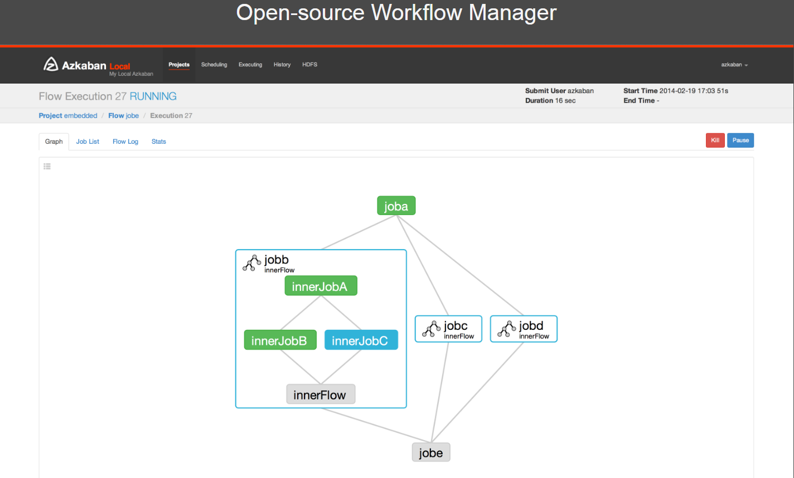
Azkaban功能特点：

- 提供功能清晰，简单易用的Web UI界面
- 提供job配置文件快速建立任务和任务之间的依赖关系
- 提供模块化和可插拔的插件机制，原生支持command、Java、Hive、Pig、Hadoop
- 基于Java开发，代码结构清晰，易于二次开发

## Azkaban原理架构

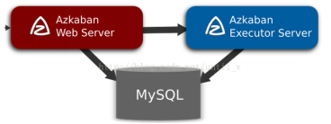
mysql服务器: 存储元数据，如项目名称、项目描述、项目权限、任务状态、SLA规则等
AzkabanWebServer:对外提供web服务，使用户可以通过web页面管理。职责包括项目管理、权限授权、任务调度、监控executor。
AzkabanExecutorServer:负责具体的工作流的提交、执行。

## Azkaban三种部署模式

### solo server mode

该模式中webServer和executorServer运行在同一个进程中，进程名是AzkabanSingleServer。使用自带的H2数据库。这种模式包含Azkaban的所有特性，但一般用来学习和测试。

### two-server mode

该模式使用MySQL数据库， Web Server和Executor Server运行在不同的进程中。

### multiple-executor mode

该模式使用MySQL数据库， Web Server和Executor Server运行在不同的机器中。且有多个Executor Server。该模式适用于大规模应用。

## Azkaban源码编译

Azkaban3.x在安装前需要自己编译成二进制包。
并且提前安装好Maven、Ant、Node等软件，具体请参考附件资料

### 编译环境

```shell
yum install -y git
yum install -y gcc-c++
### 下载源码解压
wget https://github.com/azkaban/azkaban/archive/3.51.0.tar.gz
tar -zxvf 3.51.0.tar.gz
cd ./azkaban-3.51.0/
### 编译源码
./gradlew build installDist -x test

```

## Gradle是一个基于Apache Ant和Apache Maven的项目自动化构建工具。-x test 跳过测试。（注意联网下载jar可能会失败、慢）

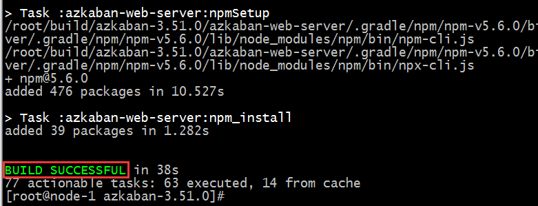

### 编译后安装包路径

编译成功之后就可以在指定的路径下取得对应的安装包了。

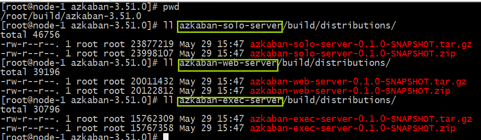

```shell
#solo-server模式安装包路径
azkaban-solo-server/build/distributions/
#two-server模式和multiple-executor模式web-server安装包路径
azkaban-web-server/build/distributions/
#two-server模式和multiple-executor模式exec-server安装包路径
azkaban-exec-server/build/distributions/
```


azkaban-db/build/distributions/
数据库相关安装包路径

## Azkaban安装部署

## solo-server模式部署

### 节点规划

 | HOST  | 角色|
|---------- |-------------------------------------|
| node01    | Web Server和Executor Server同一进程|

### 解压配置

```shell
mkdir /export/servers/azkaban
tar -zxvf azkaban-solo-server-0.1.0-SNAPSHOT.tar.gz --C /export/servers/azkaban/
vim conf/azkaban.properties
default.timezone.id=Asia/Shanghai #修改时区
vim plugins/jobtypes/commonprivate.properties
#添加：memCheck.enabled=false
azkaban默认需要3G的内存，剩余内存不足则会报异常
### 启动验证
cd azkaban-solo-server-0.1.0-SNAPSHOT/
bin/start-solo.sh
```

注:启动/关闭必须进到azkaban-solo-server-0.1.0-SNAPSHOT/目录下。
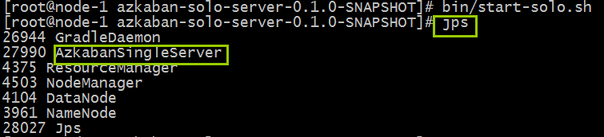
AzkabanSingleServer(对于Azkaban solo‐server模式，Exec Server和Web Server在同一个进程中)

### 登录web页面

访问Web Server=>[http://node01:8081/](http://node01:8081/) 默认用户名密码azkaban
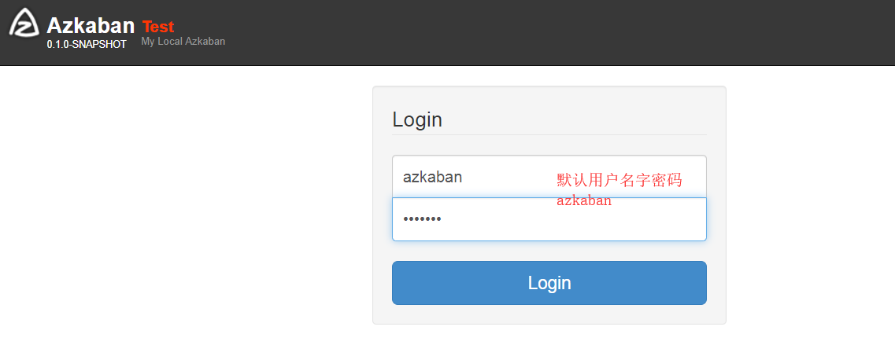
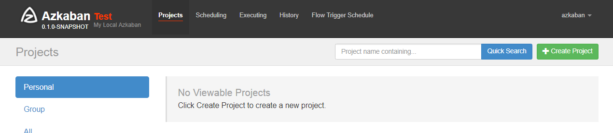

### 初体验测试

`http://node01:8081/index登录=>Create Project=>Upload zip包 =>execute flow`执行一步步操作即可。
创建两个文件one.job two.job,内容如下，打包成zip包。

```shell
cat one.job
type=command
command=echo "this is job one"
cat two.job
type=command
dependencies=one
command=echo "this is job two"
```

创建工程：
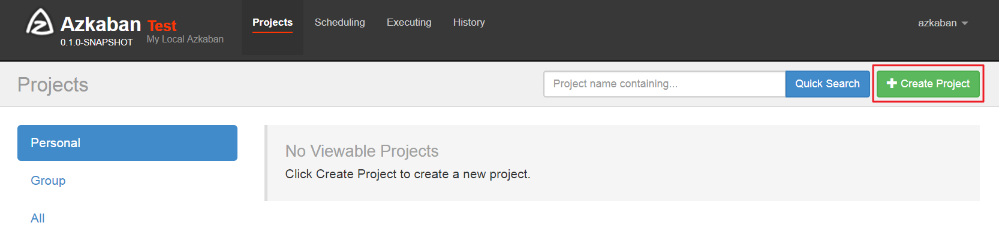
上传zip压缩包：
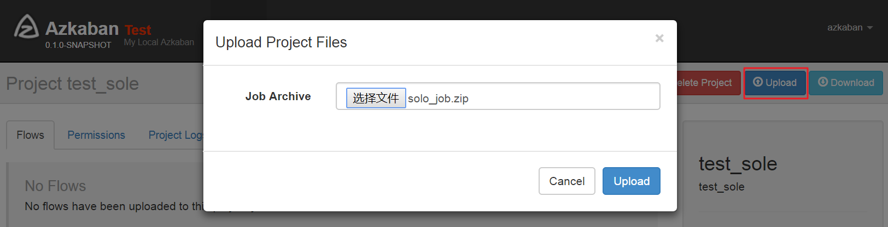
execute执行：
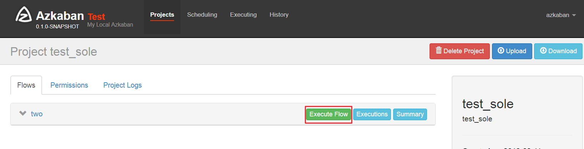
执行页面：
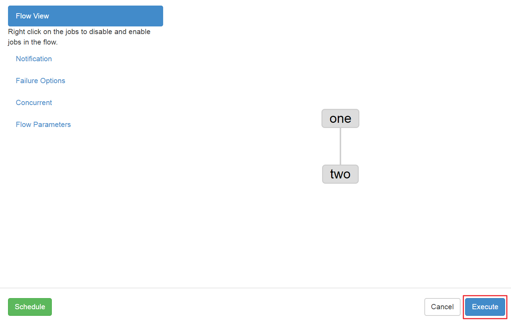
执行结果查看：

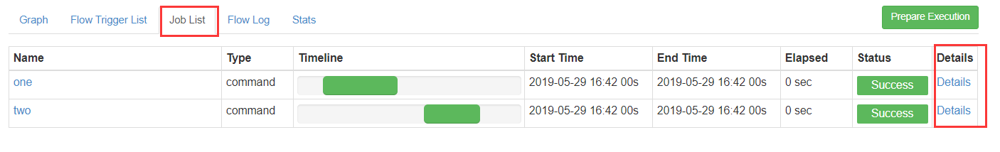

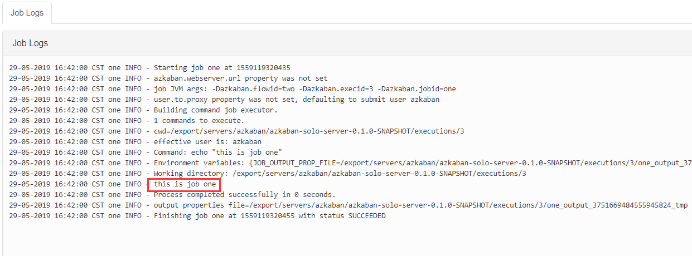

## two-server模式部署

 节点规划

|  HOST   |角色|
|----------| ---------------------------------|
|  node03  |   MySQL|
 | Node02    | web‐server和exec‐server不同进程|

### mysql配置初始化

```shell
#node03：
[root@node03 ~]# mkdir /export/servers/azkaban
[root@node03 ~]# mkdir /export/softwares/azkaban
[root@node03 ~]# cd /export/softwares/azkaban
# 上传编译好的包
[root@node03 azkaban]# ll
total 58264
-rw-r--r-- 1 root root     4069 Aug  6 20:38 azkaban-db-0.1.0-SNAPSHOT.tar.gz
-rw-r--r-- 1 root root 15762323 Aug  6 20:39 azkaban-exec-server-0.1.0-SNAPSHOT.tar.gz
-rw-r--r-- 1 root root 23877249 Aug  6 20:40 azkaban-solo-server-0.1.0-SNAPSHOT.tar.gz
-rw-r--r-- 1 root root 20011408 Aug  6 20:40 azkaban-web-server-0.1.0-SNAPSHOT.tar.gz
[root@node03 azkaban]# tar -zxvf azkaban-db-0.1.0-SNAPSHOT.tar.gz  -C /export/servers/azkaban/
[root@node03 azkaban]# mysql -u root -p123456
#Mysql上创建对应的库、增加权限、创建表
#创建数据库
mysql> create database azkaban_two_server;
Query OK, 1 row affected (0.01 sec)
# 进入azkaban_two_server 数据库
mysql> use azkaban_two_server;
Database changed
#加载初始化sql创建表
mysql> source /export/servers/azkaban/azkaban-db-0.1.0-SNAPSHOT/create-all-sql-0.1.0-SNAPSHOT.sql;
Query OK, 0 rows affected (0.06 sec)

Query OK, 0 rows affected (0.01 sec)
# 查询创建表是否成功
mysql> show tables;
+------------------------------+
| Tables_in_azkaban_two_server |
+------------------------------+
| QRTZ_BLOB_TRIGGERS           |
| QRTZ_CALENDARS               |
| QRTZ_CRON_TRIGGERS           |
| QRTZ_FIRED_TRIGGERS          |
| QRTZ_JOB_DETAILS             |
| QRTZ_LOCKS                   |
| QRTZ_PAUSED_TRIGGER_GRPS     |
| QRTZ_SCHEDULER_STATE         |
| QRTZ_SIMPLE_TRIGGERS         |
| QRTZ_SIMPROP_TRIGGERS        |
| QRTZ_TRIGGERS                |
| active_executing_flows       |
| active_sla                   |
| execution_dependencies       |
| execution_flows              |
| execution_jobs               |
| execution_logs               |
| executor_events              |
| executors                    |
| project_events               |
| project_files                |
| project_flow_files           |
| project_flows                |
| project_permissions          |
| project_properties           |
| project_versions             |
| projects                     |
| properties                   |
| triggers                     |
+------------------------------+
29 rows in set (0.00 sec)

```

### web-server服务器配置

```shell
#node02:
[root@node02 ~]# mkdir /export/softwares/azkaban
[root@node02 ~]# mkdir /export/servers/azkaban
[root@node02 ~]# cd /export/softwares/azkaban
[root@node02 azkaban]# tar -zxvf azkaban-web-server-0.1.0-SNAPSHOT.tar.gz -C /export/servers/azkaban/
[root@node02 azkaban]# tar -zxvf azkaban-exec-server-0.1.0-SNAPSHOT.tar.gz -C /export/servers/azkaban/
#生成ssl证书：
[root@node02 azkaban-web-server-0.1.0-SNAPSHOT]# keytool -keystore keystore -alias jetty -genkey -keyalg RSA
#输入123456
Enter keystore password:  
# 输入123456
Re-enter new password:
#回车
What is your first and last name?
  [Unknown]:  
# 回车
What is the name of your organizational unit?
  [Unknown]:  
#回车
What is the name of your organization?
  [Unknown]:  
#回车
What is the name of your City or Locality?
  [Unknown]:  
#回车
What is the name of your State or Province?
  [Unknown]:  
#回车
What is the two-letter country code for this unit?
  [Unknown]:  
#输入yes 回车
Is CN=Unknown, OU=Unknown, O=Unknown, L=Unknown, ST=Unknown, C=Unknown correct?
  [no]:  yes
# 输入密码123456
Enter key password for <jetty>
        (RETURN if same as keystore password):  
# 输入密码123456
Re-enter new password:
```

运行此命令后,会提示输入当前生成keystore的密码及相应信息,输入的密码请记住(所有密码统一以123456输入)。
完成上述工作后,将在当前目录生成keystore证书文件,将keystore拷贝到 azkaban web服务器根目录中。
如: cp keystore azkaban-web-server-0.1.0-SNAPSHOT/

配置conf/azkaban.properties：

```shell
[root@node02 conf]# cd /export/servers/azkaban/azkaban-web-server-0.1.0-SNAPSHOT/conf/
[root@node02 azkaban-web-server-0.1.0-SNAPSHOT]# vim azkaban.properties
# Azkaban Personalization Settings
azkaban.name=Test
azkaban.label=My Local Azkaban
azkaban.color=#FF3601
azkaban.default.servlet.path=/index
web.resource.dir=web/  
## 时区需要修改# 时区注意后面不要有空格
default.timezone.id=Asia/Shanghai
# Azkaban UserManager class
user.manager.class=azkaban.user.XmlUserManager
user.manager.xml.file=conf/azkaban-users.xml
# Azkaban Jetty server properties. 开启使用ssl 并且知道端口
jetty.use.ssl=true
jetty.ssl.port=8443  
jetty.maxThreads=25  
# Azkaban Executor settings 指定本机Executor的运行端口
executor.host=localhost
executor.port=12321  
# KeyStore for SSL ssl相关配置 注意密码和证书路径  
jetty.keystore=keystore
jetty.password=123456
jetty.keypassword=123456
jetty.truststore=keystore
jetty.trustpassword=123456  
# Azkaban mysql settings by default. Users should configure their own username and password. |
database.type=mysql  
mysql.port=3306  
mysql.host=node01
mysql.database=azkaban_two_server
mysql.user=root
mysql.password=123456
mysql.numconnections=100
#Multiple Executor 设置为false
azkaban.use.multiple.executors=true
#azkaban.executorselector.filters=StaticRemainingFlowSize,MinimumFreeMemory,CpuStatus |
azkaban.executorselector.comparator.NumberOfAssignedFlowComparator=1  
azkaban.executorselector.comparator.Memory=1  
azkaban.executorselector.comparator.LastDispatched=1
azkaban.executorselector.comparator.CpuUsage=1
```

添加azkaban.native.lib=false 和 execute.as.user=false属性：

```shell
[root@node02 azkaban-web-server-0.1.0-SNAPSHOT]# mkdir -p plugins/jobtypes
[root@node02 azkaban-web-server-0.1.0-SNAPSHOT]# cd plugins/jobtypes/
[root@node02 jobtypes]# ll
total 0
[root@node02 jobtypes]# vim commonprivate.properties
azkaban.native.lib=false
execute.as.user=false
memCheck.enabled=false
```

### exec-server服务器配置

配置conf/azkaban.properties：

```shell
[root@node02 azkaban-exec-server-0.1.0-SNAPSHOT]# cd /export/servers/azkaban/azkaban-exec-server-0.1.0-SNAPSHOT/conf
[root@node02 conf]# vim azkaban.properties
# Azkaban Personalization Settings
azkaban.name=Test
azkaban.label=My Local Azkaban  
azkaban.color=#FF3601
azkaban.default.servlet.path=/index
web.resource.dir=web/
default.timezone.id=Asia/Shanghai  
# Azkaban UserManager class
user.manager.class=azkaban.user.XmlUserManager
user.manager.xml.file=conf/azkaban-users.xml  
# Loader for projects
executor.global.properties=conf/global.properties
azkaban.project.dir=projects
# Where the Azkaban web server is located
azkaban.webserver.url=https://node02:8443
# Azkaban mysql settings by default. Users should configure their own username and password. |
database.type=mysql  
mysql.port=3306
mysql.host=node03
mysql.database=azkaban_two_server
mysql.user=root
mysql.password=123456
mysql.numconnections=100
# Azkaban Executor settings
executor.maxThreads=50  
executor.port=12321
executor.flow.threads=30
```

### 集群启动

先启动exec-server

```shell
[root@node02 azkaban-web-server-0.1.0-SNAPSHOT]# cd /export/servers/azkaban/azkaban-exec-server-0.1.0-SNAPSHOT/
[root@node02 azkaban-exec-server-0.1.0-SNAPSHOT]# ./bin/start-exec.sh
```

再启动web-server。

```shell
[root@node02 conf]# cd /export/servers/azkaban/azkaban-web-server-0.1.0-SNAPSHOT/
[root@node02 azkaban-web-server-0.1.0-SNAPSHOT]# ./bin/start-web.sh
```

启动webServer之后进程失败消失，可通过安装包根目录下对应启动日志进行排查。
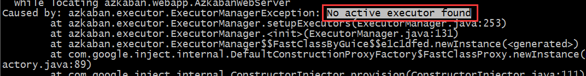
需要手动激活executor

```shell
cd /export/servers/azkaban/execserver
[root@node02 azkaban-web-server-0.1.0-SNAPSHOT]# cd /export/servers/azkaban/azkaban-exec-server-0.1.0-SNAPSHOT/
[root@node02 azkaban-exec-server-0.1.0-SNAPSHOT]# curl -G "node02:$(<./executor.port)/executor?action=activate" && echo
{"status":"success"}
```

然后重新启动webServer就可以了。
浏览器打开<https://node02:8443/> 用户名密码是：azkaban

## multiple-executor模式部署

multiple-executor模式是多个executor Server分布在不同服务器上，只需要将azkaban-exec-server安装包拷贝到不同机器上即可组成分布式。

节点规划

|  HOST |  角色|
|---------- |-------------------------|
|  Node03   |  mysql |
|  Node02| web-server、exec-server|
|  Node01    | exec-server|

### scp executor server安装包到node-3

启动之后，需要手动激活executor

```shell
cd /export/servers/azkaban/execserver
curl -G "node-3:$(<./executor.port)/executor?action=activate" && echo
```

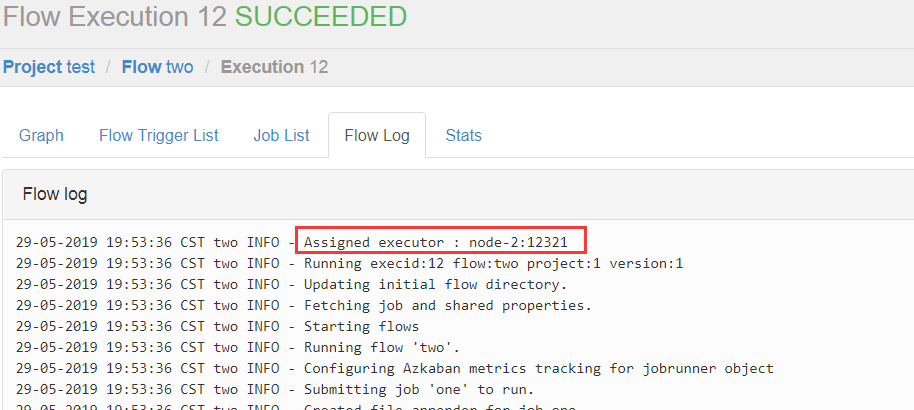

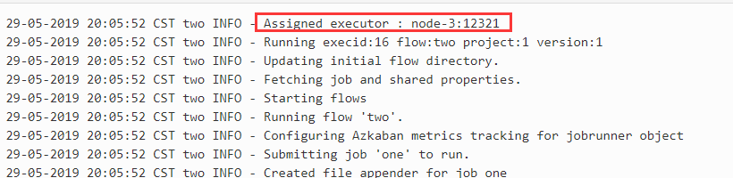

## Azkaban使用实战

## shell command调度

- 创建job描述文件

```shell
vi command.job
#command.job
type=command
command=echo 'hello'

```

- 将job资源文件打包成zip文件

zip command.job

- 通过azkaban的web管理平台创建project并上传job压缩包
首先创建Project
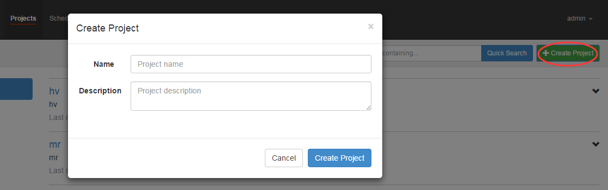
上传zip包
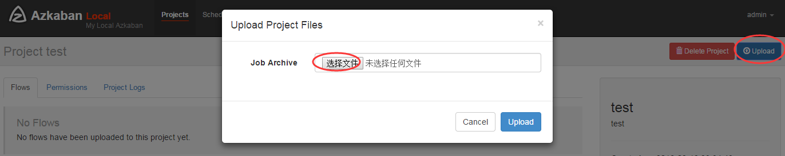
- 启动执行该job
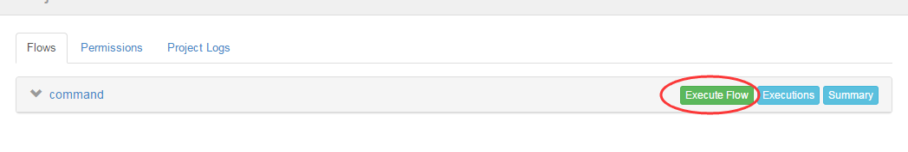

## job依赖调度

- 创建有依赖关系的多个job描述

第一个job：foo.job

```shell
# foo.job
type=command
command=echo foo
```

第二个job：bar.job依赖foo.job

```shell
# bar.job

type=command

dependencies=foo

command=echo bar
```

- 将所有job资源文件打到一个zip包中

- 在azkaban的web管理界面创建工程并上传zip包
- 启动工作流flow

## HDFS任务调度

- 创建job描述文件

```shell
 # fs.job
type=command
command=/home/hadoop/apps/hadoop-2.6.1/bin/hadoop fs -mkdir /azaz |
```

- 将job资源文件打包成zip文件

- 通过azkaban的web管理平台创建project并上传job压缩包
- 启动执行该job

## MAPREDUCE任务调度

mr任务依然可以使用command的job类型来执行

- 创建job描述文件，及mr程序jar包（示例中直接使用hadoop自带的example jar）

```shell
# mrwc.job
type=command
command=/home/hadoop/apps/hadoop-2.6.1/bin/hadoop jar hadoop-mapreduce-examples-2.6.1.jar wordcount /wordcount/input /wordcount/azout |

```

- 将所有job资源文件打到一个zip包中
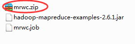
- 在azkaban的web管理界面创建工程并上传zip包
- 启动job

## HIVE脚本任务调度

- 创建job描述文件和hive脚本
Hive脚本： test.sql

```sql
use default;
drop table aztest;
create table aztest(id int,name string) row format delimited fields terminated by ','; |
load data inpath '/aztest/hiveinput' into table aztest;
create table azres as select * from aztest;  
insert overwrite directory '/aztest/hiveoutput' select count(1) from aztest;
```

Job描述文件：hivef.job

```shell
# hivef.job  
  
type=command  
  
command=/home/hadoop/apps/hive/bin/hive -f 'test.sql' |
```

- 将所有job资源文件打到一个zip包中创建工程并上传zip包,启动job

## 定时任务调度

除了手动立即执行工作流任务外，azkaban也支持配置定时任务调度。开启方式如下：
首页选择待处理的project
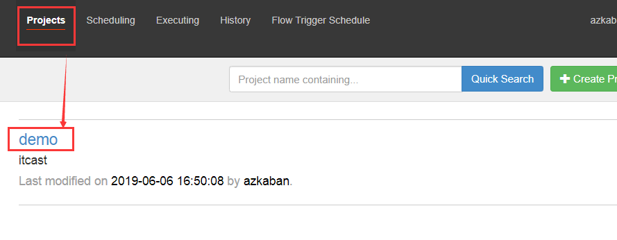
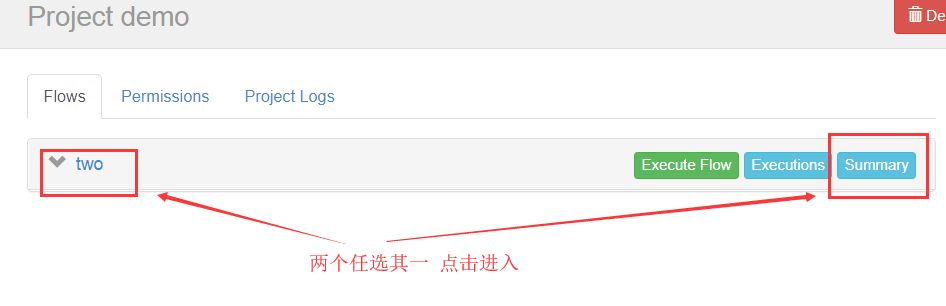
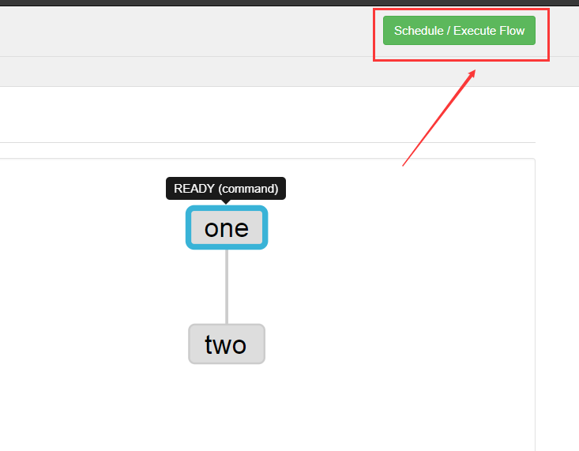
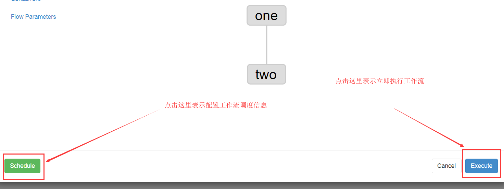
上述图片中，选择左边schedule表示配置定时调度信息，选择右边execute表示立即执行工作流任务。
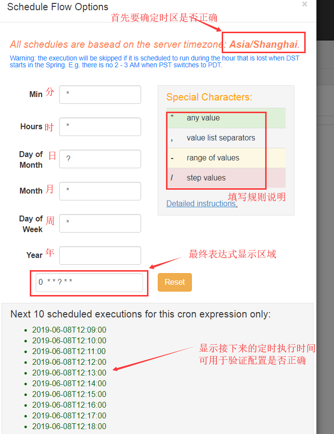

## word文本，若以上无问题，以下text 内容可删

## 安装部署配置

### solo

#### one.job

安装部署配置/solo/one.job

```job
# one.job
type=command
command=echo "this is job one"
```

#### two.job

安装部署配置/solo/two.job

```job
# two.job
type=command
dependencies=one
command=echo "this is job two"
```

#### two-server

#### web-server

##### commonprivate.properties

安装部署配置/two-server/web-server/commonprivate.properties

```properties
azkaban.native.lib=false
execute.as.user=false
memCheck.enabled=false
```

##### azkaban.properties

安装部署配置/two-server/web-server/azkaban.properties

```properties
# Azkaban Personalization Settings
azkaban.name=Test
azkaban.label=My Local Azkaban
azkaban.color=#FF3601
azkaban.default.servlet.path=/index
web.resource.dir=web/
default.timezone.id=Asia/Shanghai

# Azkaban UserManager class
user.manager.class=azkaban.user.XmlUserManager
user.manager.xml.file=conf/azkaban-users.xml

# Loader for projects
executor.global.properties=conf/global.properties
azkaban.project.dir=projects

# Velocity dev mode
velocity.dev.mode=false

# Azkaban Jetty server properties.
jetty.use.ssl=true
jetty.ssl.port=8443
jetty.maxThreads=25

# Azkaban Executor settings
executor.host=localhost
executor.port=12321

#  KeyStore for SSL ssl相关配置  注意密码和证书路径
jetty.keystore=keystore
jetty.password=123456
jetty.keypassword=123456
jetty.truststore=keystore
jetty.trustpassword=123456

# mail settings
mail.sender=
mail.host=
# User facing web server configurations used to construct the user facing server URLs. They are useful when there is a reverse proxy between Azkaban web servers and users.
# enduser -> myazkabanhost:443 -> proxy -> localhost:8081
# when this parameters set then these parameters are used to generate email links.
# if these parameters are not set then jetty.hostname, and jetty.port(if ssl configured jetty.ssl.port) are used.
# azkaban.webserver.external_hostname=myazkabanhost.com
# azkaban.webserver.external_ssl_port=443
# azkaban.webserver.external_port=8081
job.failure.email=
job.success.email=
lockdown.create.projects=false
cache.directory=cache
# JMX stats
jetty.connector.stats=true
executor.connector.stats=true

# Azkaban mysql settings by default. Users should configure their own username and password.
database.type=mysql
mysql.port=3306
mysql.host=node03
mysql.database=azkaban_two_server
mysql.user=root
mysql.password=123456
mysql.numconnections=100

#Multiple Executor
azkaban.use.multiple.executors=true
#azkaban.executorselector.filters=StaticRemainingFlowSize,MinimumFreeMemory,CpuStatus
azkaban.executorselector.comparator.NumberOfAssignedFlowComparator=1
azkaban.executorselector.comparator.Memory=1
azkaban.executorselector.comparator.LastDispatched=1
azkaban.executorselector.comparator.CpuUsage=1
```

#### exec-server

#### azkaban.properties

安装部署配置/two-server/exec-server/azkaban.properties

```properties
# Azkaban Personalization Settings
azkaban.name=Test
azkaban.label=My Local Azkaban
azkaban.color=#FF3601
azkaban.default.servlet.path=/index
web.resource.dir=web/
default.timezone.id=Asia/Shanghai

# Azkaban UserManager class
user.manager.class=azkaban.user.XmlUserManager
user.manager.xml.file=conf/azkaban-users.xml
# Loader for projects
executor.global.properties=conf/global.properties
azkaban.project.dir=projects
# Velocity dev mode
velocity.dev.mode=false
# Azkaban Jetty server properties.
jetty.use.ssl=false
jetty.maxThreads=25
jetty.port=8081

# Where the Azkaban web server is located
azkaban.webserver.url=https://node02:8443

# mail settings
mail.sender=
mail.host=
# User facing web server configurations used to construct the user facing server URLs. They are useful when there is a reverse proxy between Azkaban web servers and users.
# enduser -> myazkabanhost:443 -> proxy -> localhost:8081
# when this parameters set then these parameters are used to generate email links.
# if these parameters are not set then jetty.hostname, and jetty.port(if ssl configured jetty.ssl.port) are used.
# azkaban.webserver.external_hostname=myazkabanhost.com
# azkaban.webserver.external_ssl_port=443
# azkaban.webserver.external_port=8081
job.failure.email=
job.success.email=
lockdown.create.projects=false
cache.directory=cache
# JMX stats
jetty.connector.stats=true
executor.connector.stats=true
# Azkaban plugin settings
azkaban.jobtype.plugin.dir=plugins/jobtypes

# Azkaban mysql settings by default. Users should configure their own username and password.
database.type=mysql
mysql.port=3306
mysql.host=node03
mysql.database=azkaban_two_server
mysql.user=root
mysql.password=123456
mysql.numconnections=100
# Azkaban Executor settings
executor.maxThreads=50
executor.port=12321
executor.flow.threads=30
```

#### foobar

##### itcast.job

job配置模板/foobar/itcast.job

```job
type=command
dependencies=bar
command=echo itcast
```

##### foo.job

job配置模板/foobar/foo.job

```job
# foo.job
type=command
command=echo foo
```

##### bar.job

job配置模板/foobar/bar.job

```job
# bar.job
type=command
dependencies=foo
command=echo bar
```

#### hdfs

##### fs.job

job配置模板/hdfs/fs.job

```job
# fs.job
type=command
command=sh hdfs.sh
```

#### hive

#### 只执行一句sql的例子

##### hive(1).job

job配置模板/hive/只执行一句sql的例子/hive(1).job

```job
# hive.job
type=command
command=/root/apps/hive/bin/hive -e 'show tables'
```

#### 执行一个sql脚本文件的例子

##### test.sql

job配置模板/hive/执行一个sql脚本文件的例子/test.sql

```sql
use default;
drop table aztest;
create table aztest(id int,name string) row format delimited fields terminated by ',';
load data inpath '/aztest/hiveinput' into table aztest;
create table azres as select id from aztest;
insert overwrite directory '/aztest/hiveoutput' select count(1) from aztest;
```

##### hivef.job

job配置模板/hive/执行一个sql脚本文件的例子/hivef.job

```job
# hivef.job
type=command
command=/export/servers/hive/bin/hive -f 'test.sql'
```

#### command

##### command2.job

job配置模板/command/command2.job

```job
#command.job
type=command
command=sh hello.sh
```

##### command1.job

job配置模板/command/command1.job

```job
#command.job
type=command
command=echo hello
```

#### mapreduce

##### mapreduce_pi.job

job配置模板/mapreduce/mapreduce_pi.job

```job
# mapreduce_pi.job
type=command
command=/export/servers/hadoop-2.6.0-cdh5.14.0/bin/hadoop  jar hadoop-mapreduce-examples-2.6.0-cdh5.14.0.jar  pi 4 8
```

##### mapreduce_wordcount.job

job配置模板/mapreduce/mapreduce_wordcount.job

```job
# mapreduce_wordcount.job
type=command
command=/export/servers/hadoop-2.7.5/bin/hadoop  jar hadoop-mapreduce-examples-2.7.5.jar wordcount /wc/input /wc/output
```

#### 资料

##### web-server-azkaban.properties

资料/web-server-azkaban.properties

```properties
# Azkaban Personalization Settings
azkaban.name=Test
azkaban.label=My Local Azkaban
azkaban.color=#FF3601
azkaban.default.servlet.path=/index
web.resource.dir=web/
default.timezone.id=Asia/Shanghai
# Azkaban UserManager class
user.manager.class=azkaban.user.XmlUserManager
user.manager.xml.file=conf/azkaban-users.xml
# Loader for projects
executor.global.properties=conf/global.properties
azkaban.project.dir=projects
# Velocity dev mode
velocity.dev.mode=false
# Azkaban Jetty server properties.
jetty.use.ssl=true
jetty.maxThreads=25
jetty.port=8081
jetty.ssl.port=8443
# Azkaban Executor settings
executor.host=localhost
executor.port=12321
# mail settings
mail.sender=
mail.host=
# KeyStore for SSL ssl 相关配置 注意密码和证书路径
jetty.keystore=keystore
jetty.password=123456
jetty.keypassword=123456
jetty.truststore=keystore
jetty.trustpassword=123456
# User facing web server configurations used to construct the user facing server URLs. They are useful when there is a reverse proxy between Azkaban web servers and users.
# enduser -> myazkabanhost:443 -> proxy -> localhost:8081
# when this parameters set then these parameters are used to generate email links.
# if these parameters are not set then jetty.hostname, and jetty.port(if ssl configured jetty.ssl.port) are used.
# azkaban.webserver.external_hostname=myazkabanhost.com
# azkaban.webserver.external_ssl_port=443
# azkaban.webserver.external_port=8081
job.failure.email=
job.success.email=
lockdown.create.projects=false
cache.directory=cache
# JMX stats
jetty.keystore=keystore
jetty.connector.stats=true
executor.connector.stats=true
# Azkaban mysql settings by default. Users should configure their own username and password.
database.type=mysql
mysql.port=3306
mysql.host=node03
mysql.database=azkaban_two_server
mysql.user=root
mysql.password=123456
mysql.numconnections=100
#Multiple Executor
azkaban.use.multiple.executors=true
#azkaban.executorselector.filters=StaticRemainingFlowSize,MinimumFreeMemory,CpuStatus
azkaban.executorselector.comparator.NumberOfAssignedFlowComparator=1
azkaban.executorselector.comparator.Memory=1
azkaban.executorselector.comparator.LastDispatched=1
azkaban.executorselector.comparator.CpuUsage=1
```

##### exec-server-azkaban.properties

资料/exec-server-azkaban.properties

```properties
# Azkaban Personalization Settings
azkaban.name=Test
azkaban.label=My Local Azkaban
azkaban.color=#FF3601
azkaban.default.servlet.path=/index
web.resource.dir=web/
default.timezone.id=Asia/Shanghai
# Azkaban UserManager class
user.manager.class=azkaban.user.XmlUserManager
user.manager.xml.file=conf/azkaban-users.xml
# Loader for projects
executor.global.properties=conf/global.properties
azkaban.project.dir=projects
# Velocity dev mode
velocity.dev.mode=false
# Azkaban Jetty server properties.
jetty.use.ssl=false
jetty.maxThreads=25
jetty.port=8081
# Where the Azkaban web server is located
azkaban.webserver.url=https://node03:8443
# mail settings
mail.sender=
mail.host=
# User facing web server configurations used to construct the user facing server URLs. They are useful when there is a reverse proxy between Azkaban web servers and users.
# enduser -> myazkabanhost:443 -> proxy -> localhost:8081
# when this parameters set then these parameters are used to generate email links.
# if these parameters are not set then jetty.hostname, and jetty.port(if ssl configured jetty.ssl.port) are used.
# azkaban.webserver.external_hostname=myazkabanhost.com
# azkaban.webserver.external_ssl_port=443
# azkaban.webserver.external_port=8081
job.failure.email=
job.success.email=
lockdown.create.projects=false
cache.directory=cache
# JMX stats
jetty.connector.stats=true
executor.connector.stats=true
# Azkaban plugin settings
azkaban.jobtype.plugin.dir=plugins/jobtypes
# Azkaban mysql settings by default. Users should configure their own username and password.
database.type=mysql
mysql.port=3306
mysql.host=node03
mysql.database=azkaban_two_server
mysql.user=root
mysql.password=123456
mysql.numconnections=100
# Azkaban Executor settings
executor.maxThreads=50
executor.flow.threads=30
executor.port=12321

```

## 需求使用ssh 查询用户名

```job
# ssh.job
type=command
command=expect demossh.exp
```

/demossh.exp

```exp
#!/usr/bin/expect
spawn ssh root@node02
expect "*from node03"
expect "*node02*"
send "hostname\r"
expect "*"
send "exit\r"
interact
```
