Cloudera Manager

产品介绍

## 2016 年 3 月 3 日

### 1. 介绍 ······1

**2.** 基本功能 **······..1**
2.1. 管理功能······..2
2.1.1. 集群安装 ·········.2
2.1.2. 集群配置 ·········.4
2.1.3. 权限管理 ······..12
2.2. 监控功能······13
2.2.1. 集群及服务实时监控 ..14
2.2.2. 节点级别监控 .17
2.2.3. 自定义报警监控·········.17
2.2.4. 自定义图表···..18
2.2.5. 页面自定义···..18
2.2.6. 高可靠监视及报警······19
2.2.7. 日志自动清理 .20
2.3. 诊断功能······21
2.3.1. 周期性服务诊断·········.21
2.3.2. 主动集群诊断 .21
2.3.3. 操作提示 ······..22
2.3.4. 日志收集及检索·········.22
2.3.5. 系统性能使用报告······23
2.4. 集成功能······23
2.4.1. 安全配置 ······..23
2. Cloudera Manager API 24
3. SNMP 集成 27

### 3. 高级功能 ······27

3.1. 软件滚动升级·········..27
3.2. 参数版本控制·········..31
3.2.1. 配置历史查看 .31
3.2.2. 配置版本回滚 .32
3. 备份及容灾系统 BDR 32
    1. HDFS 备份 34
3.4. 数据审计······38
3.5. 安全集成向导·········..39
3.5.1.Kerberos 集成 39
3.5.2. 外部安全认证集成······41
4. 重要管理任务介绍···.42
4.1. 多租户资源管理能力42
4.1.1. 资源分配运维监控工具·········..42
4.1.2. 动态资源隔离能力（基于 YARN） 43
4.1.3. 静态资源隔离能力（基于 Linux 容器技术） 43
5. 监控指标 ······45
5.1. 部分样例状态指标 ···46

1. HDFS 指标 46
2. [MapReduce 指标 46](#mapreduce-指标)
3. HBase 指标 47
5.2. 部分样例报警指标 ···47
1. [Hive 47](#hive)
2. [HDFS 48](#hdfs)
3. [MapReduce 48](#mapreduce)
4. [HBase 49](#hbase)

**cloudera.com**

## 介绍

Cloudera Manager 是 CDH 市场领先的管理平台。作为业界第一的端到端 Apache Hadoop 的管理应用，Cloudera
Manager 对 CDH 的每个部件都提供了细粒度的可视化和控制，从而设立了企业部署的标准。通过 Cloudera Manger，运维人员得以提高集群的性能，提升服务质量，提高合规性并降低管理成本。
Cloudera Manager 设计的目的是为了使得对于企业数据中心的管理变得简单和直观。通过 Cloudera Manager，可以方便地部署， 并且集中式的操作完整的大数据软件栈。该应用软件会自动化安装过程，从而减少了部署集群的时间。通过 Cloudera Manager 可以提供一个集群范围内的节点实时运行状态视图。同时，还提供了一个中央控制台，可以用于配置集群。不仅如此，Cloudera
Manager 通过包含一系列的报道和诊断工具，可以帮助您优化集群性能，并且提高利用率。Cloudera Manager 能够为您提供以下的功能 ：

- 自动化 Hadoop 安装过程，大幅缩短部署时间；
- 提供实时的集群概况，例如节点、服务的运行状况；
- 提供了集中的中央控制台对集群的配置进行更改。
- 包含全面的报告和诊断工具，帮助优化性能和利用率。
Cloudera Manager 的架构如上图所示，主要由如下几部分组成：
- 服务端 /Server ：Cloudera Manager 的核心。主要用于管理 web server 和应用逻辑。它用于安装软件，配置，开始和停止服务，以及管理服务运行的集群。
- 代理 /agent ：安装在每台主机上。它负责启动和停止的进程，部署配置，触发安装和监控主机。
- 数据库 /Database ：存储配置和监控信息。通常可以在一个或多个数据库服务器上运行的多个逻辑数据库。例如，所述的 Cloudera 管理器服务和监视后台程序使用不同的逻辑数据库。
- Cloudera Repository ：用于软件分发由 Cloudera 软件仓库。
- 客户端 /Clients ：提供了一个与 Server 交互的接口 ：
  - 管理平台 /Admin Console ：提供一个管理员管理集群和 Cloudera Manage 的基于网页的交互界面。
  - API ：为开发者提供了创造自定义 Cloudera Manager 程序的 API。

## 基本功能

Cloudera Manager 作为 Hadoop 大数据平台的管理工具，旨在帮助用户更容易的使用 Hadoop。其基本功能主要可以分为四大模块：管理功能、监控功能、诊断功能和集成功能。
此部分内容在免费版本 Cloudera Express 产品以及商业版本中可用。

## 管理功能

由于 Hadoop 是一个分布式的系统，由多个服务器组成一个集群，相对于传统的单节点运行的应用系统，由于节点数的增多。
Hadoop 的管理更加复杂。CM 提供的管理功能如下：

### 集群安装

1. 自动化安装
Cloudera Manager（以下简称 CM）提供了强大的 Hadoop 集群部署能力，能够批量的自动化部署节点。安装一个
Hadoop 集群大体只需要 3 个步骤。
步骤一：添加需要安装的节点：
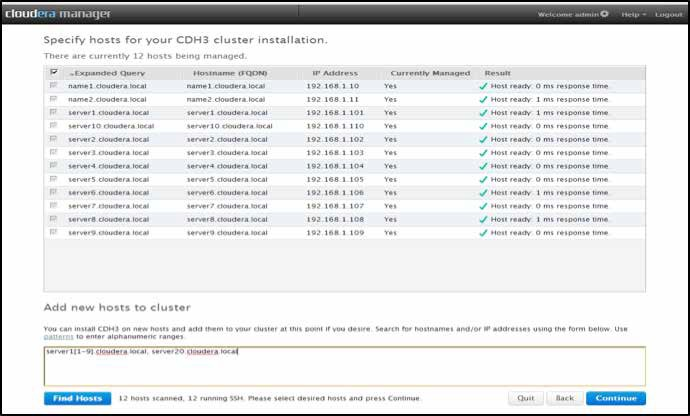
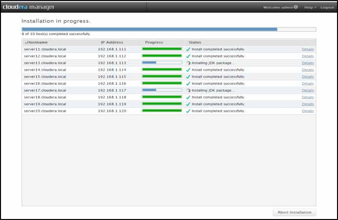步骤二：安装需要的组件
步骤三：分配角色
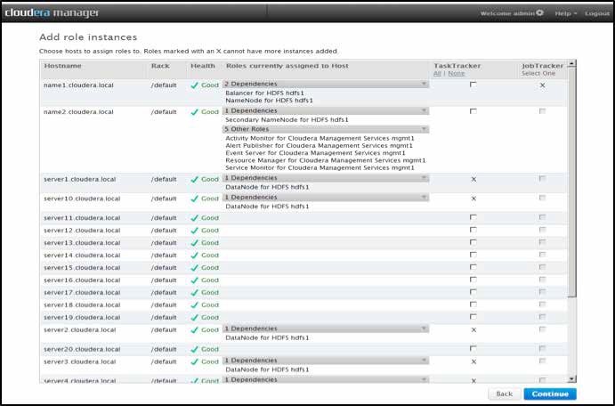
2. 批量部署

Hadoop 本身是一个分布式的系统，因此在安装时，需要对每一个节点进行组件的安装，并且由于是开软软件，其安装过程相对比较复杂，Hadoop 每个组件都需要做很多的配置工作，如果手动去完成这个工作，工作量将会非常可观。
针对这种情况，CDH 提供了 Cloudera Manager 来自动化安装部署 Hadoop。大大缩短了 Hadoop 的安装时间，同时也简化了安装 Hadoop 的过程。
CDH 的安装针对不同的客户环境，提供了多种不同的安装方式：

1. 如果用户的集群能够访问到 Cloudera 的网站，直接可以进行完全自动化的安装。
2. 如果用户的集群不能够访问公网，则只需要在集群内部建立一个软件仓库，然后再进行自动化的集群部署
其中上述提到的自动化安装的过 程如下 :

1. 安装环境准备，下载 Cloudera Manager 以及 CDH 的安装文件，安装 JDK，yum 等基本软件。
2. 挑选一台节点，安装 Cloudera Manager，用户只需要启动安装脚本即可，通常情况下 2 分钟就能够完成。
3. Cloudera Manger 是一个 Web 应用，提供了基于浏览器的界面，用户可以通过浏览器可视化的进行 CDH 的安装部署。
4. 通过 Cloudera Manager 界面，添加其他需要安装的节点，选择要安装的 Hadoop 组件，以及每个节点承担的角色， 选择安装，Cloudera Manager 会自动的将需要安装的软件分发到对应的节点，并完成安装。
5. 同时 Cloudera Manager 会提供一个默认的 CDH 配置，并且提供了配置的管理界面，供用户在后续进行定制化的配置。
6. 在安装过程中，如果任意一台机器安装出现问题，Cloudera Manager 都会进行汇报，并提供日志，供用户分析，解决问题。
7. 当所有节点的软件都安装完成之后，Cloudera Manager 会启动所有的服务。
从上述的安装过程可以看出，CDH 的安装主要体现两个特点，批量化以及自动化。只需要在其中一个节点完成，其他节点都可以进行批量化的自动安装。

#### 集群配置

    1. 可视化参数配置界面
Hadoop 包含许多的组件，不同的组件都包含各种各样的配置，并且分布于不同的主机之上。CM 针对这种情况提供了界面化的参数配置功能，并且能够自动的部署到每个节点。
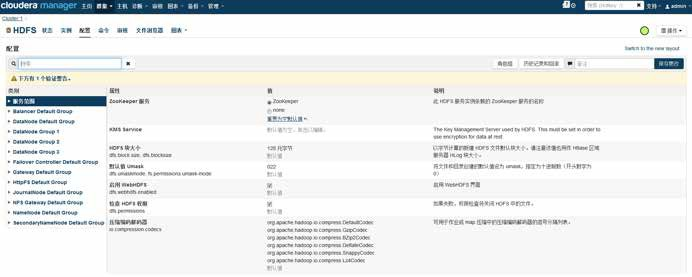
2. 模版化配置
Cloudera Manager 提供了参数配置组的概念，配置组主要是应对在实际情况中，可能存在同一个集群，节点之间存在不同的硬件配置，或者相同配置承担不同作用的情况，这种情况下不同的节点可能需要进行不同的参数配置。

例如下图所示，RegionServer Default Group 中的所有节点的配置都是相同的。

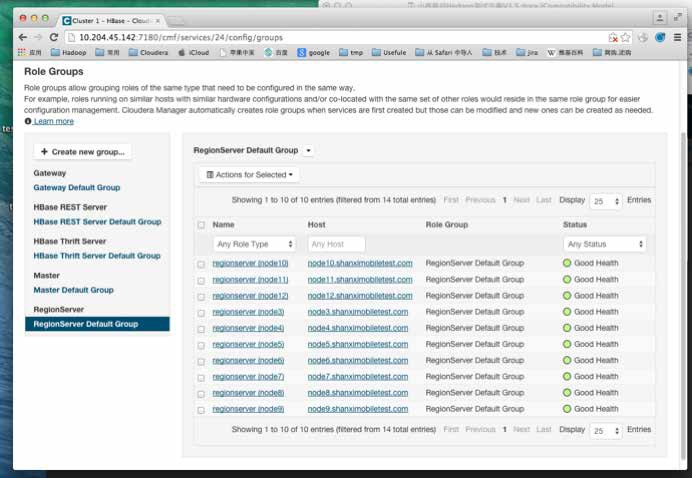

Cloudera Manager 可以自动监测硬件和角色的配置从而智能的创建不同的配置组。同时，用户也可以手工创建配置组，并选择配置继承至现有的配置组，具体步骤如下 ：

步骤一：新建配置组并命名，如下了一个 RegionServer 类型的配置组，叫做 RegionServer Test Group，其缺省配置继承至 RegionServer Default Group：

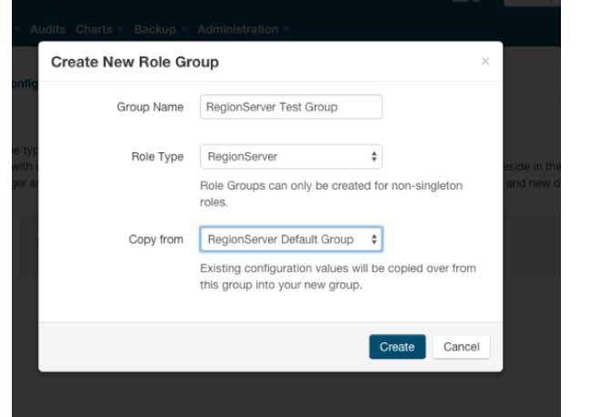

步骤二：为配置组选择服务器：

步骤三：将服务器移动至新建配置组：

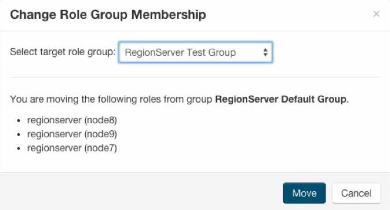

步骤四：确认配置页中新建的配置组生效，且包含新添加的服务器：

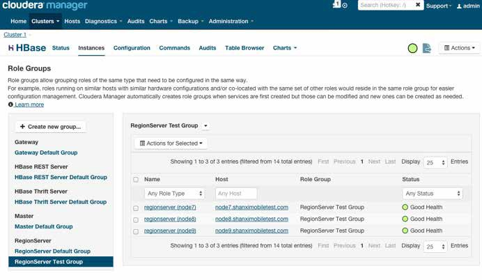

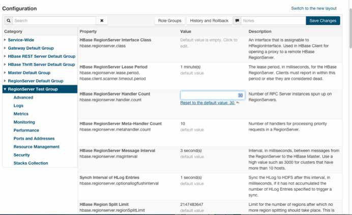步骤五：对配置组的配置进行修改。所有修改会在并且只在配置组内服务器生效：

3. 过期设置报警

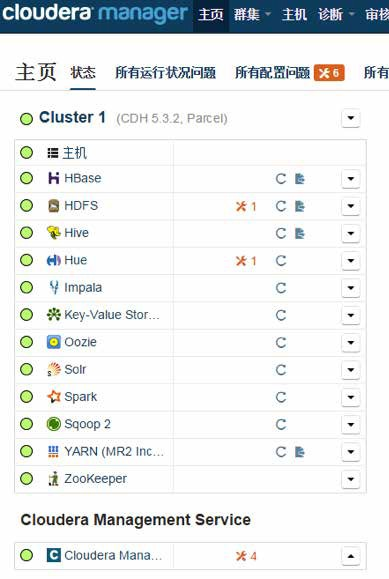

4. 智能参数验证及优化

当用户在配置过程中，部分参数配置值有问题时，Cloudera Manager 会产生错误提示，以帮助用户更合理的修改参数。

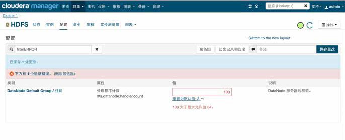

5. 高可靠配置

Cloudera Manager 对关键的组件使用 HA 部署方案，避免单点失效的发生，同时 CDH 对于组件的异常错误提供了自动恢复的处理，最大限度的保证服务的可靠性。

1. HDFS 高可靠

在标准配置中，NameNode 是 HDFS 群集中的单点故障 (SPOF)。每个群集都具有一个 NameNode，如果机器或进程变为不可用，群集整体将变为不可用，直到NameNode 在新主机上重新启动或上线。Secondary NameNode 不提供故障转移功能。Cloudera Manager 5 和 CDH 5 支持基于 Quorum 的存储作为唯一的 HA 实施。为了让"备用"NameNode 的状态与"活动"NameNode 在此实施中保持同步，两个节点均与一组名为 JournalNode 的独立后台程序进行通信。由"活动"NameNode 执行任何 Namespace 修改时，它会持续记录其中大部分 JournalNode 的修改记录。"备用"NameNode能够从 JournalNodes 读取编辑操作，并不断监视它们以了解编辑日志发生的更改。当备用节点发现编辑操作时，它会将这些编辑应用于自己的 Namespace。在发生故障转移时，备用节点将确保首先从 JournalNodes 读取所有编辑操作，然后才会将自己升级为 \" 活动 \" 状态。这确保了在发生故障转移之前完全同步 Namespace 状态。

为了提供快速故障转移，备用 NameNode 还需要拥有有关群集中的块位置的最新信息。为实现这一目的，DataNode 配置了这两个 NameNode 的位置，它们会将块位置信息和检测信号发送给这两个 NameNode。

一次只能有其中一个 NameNode 处于活动状态，这一点对于 HA 群集的正常运行来说至关重要。否则，Namespace 状态会在两者之间快速出现分歧，从而导致数据丢失风险或其他不正确的结果。为了确保此属性并防止所谓的"大脑分裂状况"，

JournalNode 一次只允许一个 NameNode 成为写入程序。在故障转移过程中，要进入"活动"状态的 NameNode 将接管

JournalNode 的写入角色，这会有效地阻止其他 NameNode 继续保持"活动"状态，使得新的"活动"NameNode 可以安全地继续执行故障转移。

NameNode 的高可靠可以通过 Cloudera Manager 的 Web 管理界面，根据向导提升启用 HA 配置，主要配置流程如下 ：

第 1 步:

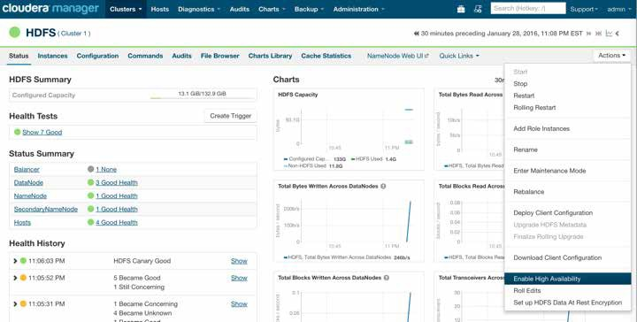

第 2 步，输入 nameservice 名字:

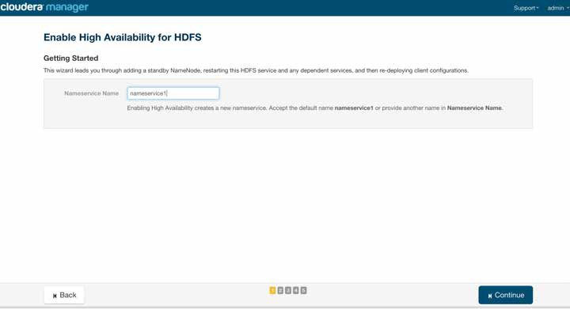

第 3 步，选择主备 NameNode, Journal Node:

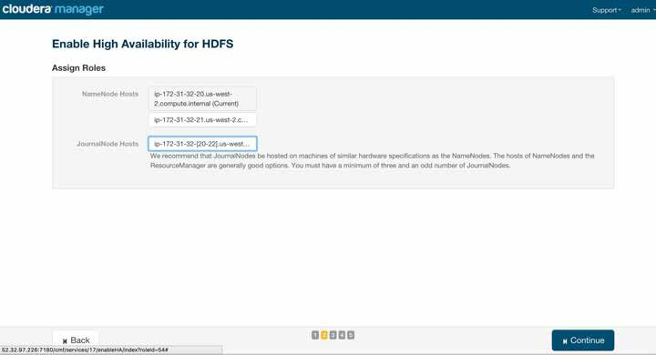

第 4 步，选择存放元数据的目录:

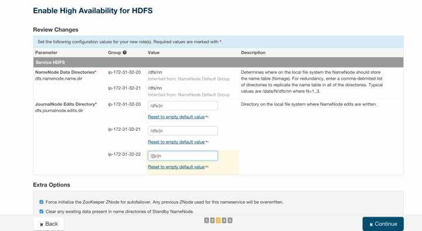

第 5 步, HA 配置启用过程中:

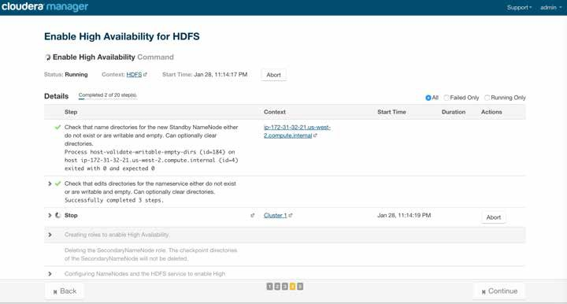

HDFS HA 配置成功 :

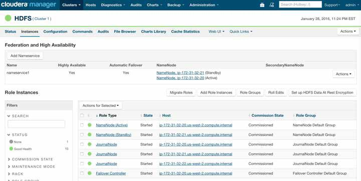

高可靠可以通过 Web 界面切换 ：

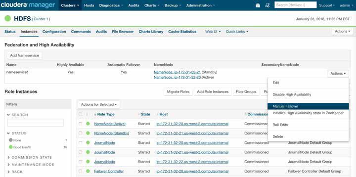

2. YARN 高可靠

YARN ResourceManager (RM) 负责跟踪群集中的资源并安排应用程序（例如，MapReduce 作业）。在 CDH 5 之前，RM 是 YARN 群集中的单点故障。RM 高可用性 (HA) 功能以活动 / 待机 RM 对形式添加冗余，以删除此单点故障。此外，在从待机 RM 到活动 RM 进行故障转移时，应用程序可以从其上次检查点状态恢复 ；例如，在 MapReduce 作业中完成的 map 任务不在后续的尝试中重新运行。这样可以在不对运行中的应用程序产生任何重要性能影响的情况下，处理以下事件 ：

计划外事件，如计算机崩溃。

计划内维护事件，如在运行 ResourceManager 的计算机上进行的软件或硬件升级。

RM HA 要求 Zookeeper 和 HDFS 服务处于运行状态。RM HA 通过活动 - 待机 RM 对的方式实施。启动时，每个 RM 处于待机状态 ：启动过程，但未加载状态。转换到活动状态时，RM 会从指定的状态存储加载内部状态，并启动所有内部服务。管理员（通过的 CLI）或通过集成的故障转移控制器（启用自动故障转移时）可促进转换为活动状态。

ResourceManager 的高可靠可以通过Cloudera Manager 的Web 管理界面，根据向导提升启用HA 配置，主要配置流程如下：

第 1 步, 启用 Resource Manager HA ：

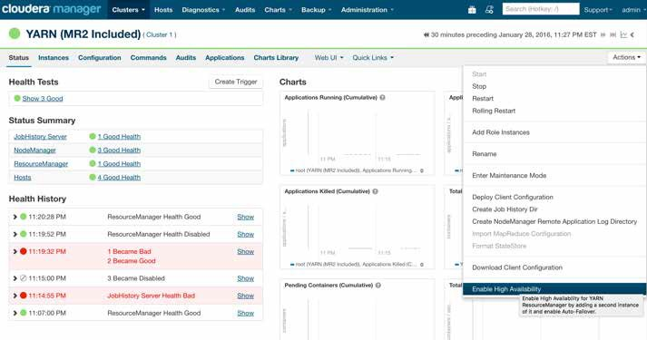

第 2 步，选择主备 Resource Manager 节点:

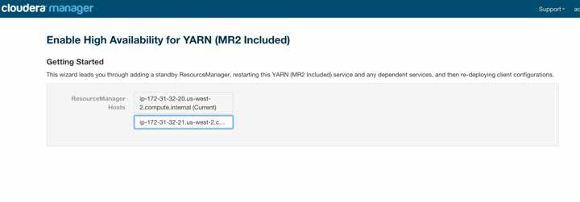

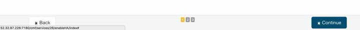

第 3 步，Resource Manager HA 启用过程中：

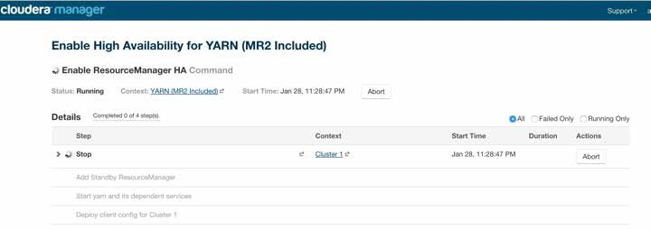

Resource Manager HA 配置成功 :

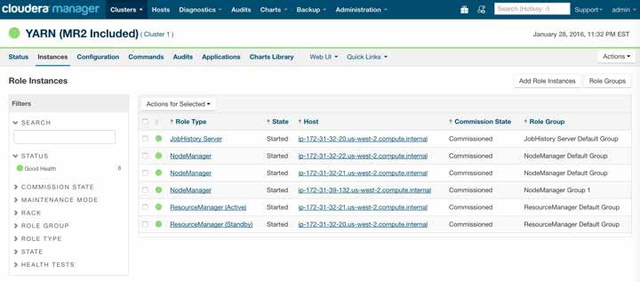

**2.1.3.** 权限管理

对系统管理员、数据库管理员及其他管理员必须授予不同级别的管理权限。下图为只读用户访问 Cloudera Manager 的界面， 所有服务对应的启停等操作选项都不可用。

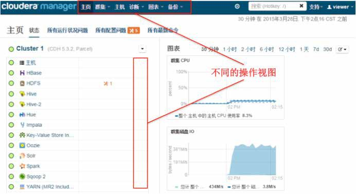

## 监控功能

Cloudera Manager 提供了许多监控功能，用于监测群集（主机，服务守护进程）健康、组件性能以及集群中运行的作业的性能和资源需求。具体包括以下监控功能 ：

- 服务监控

查看服务和角色实例级别健康检查的结果，并通过图表显示，有助于诊断问题。如果健康检查发现某个组件的状态需要特别关注甚至已经出现问题，系统会对管理员应该采取的行动提出建议。同时，系统管理员还可以查看上的服务或角色上操作的执行历史，也可以查看配置更改的审计日志。

- 主机监控

监控群集内所有主机的有关信息，包括：哪些主机上线或下线，主机上目前消耗的内存，主机上运行的角色实例分配， 不同的机架上的主机分配等等。汇总视图中显示了所有主机群集，并且可以进一步查看单个主机丰富的细节，包括显示主机关键指标的直观图表。

- 行为监控

Cloudera Manager 提供了列表以及图表的方式来查看集群上进行的活动，不仅显示当前正在执行的任务行为，还可以通过仪表盘查看历史活动。同时提供了各个作业所使用资源的许多统计，系统管理员可以通过比较相似任务的不同性能数据以及比较查看同一任务中不同执行的性能数据来诊断性能问题或行为问题。

- 事件活动

监控界面可以查看事件，并使它们用于报警和搜索，使得系统管理员可以深入了解发生集群范围内所有相关事件的历史记录。系统管理员可以通过时间范围、服务、主机、关键字等字段信息过滤事件。

- 报警

通过配置 Cloudera Manager 可以对指定的事件产生警报。系通过管理员可以针对关键事件配置其报警阈值、启用或禁用报警等，并通过电子邮件或者通过 SNMP 的事件得到制定的警报通知。系统也可以暂时抑制报警事件，此限制可以基于个人角色、服务、主机、甚至整个集群配置，使得进行系统维护 / 故障排除时不会产生过多的警报流量。

- 审计事件

Cloudera Manager 记录了有关服务、角色和主机的生命周期的事件，如创建角色或服务、修改角色或服务配置、退役主机和运行 Cloudera Manager 管理服务命令等等。系统管理员可以通过管理员终端查看，界面提供了按时间范围、服务、主机、关键字等字段信息来过滤审计事件条目。

- 可视化的时间序列数据图表

系统管理员可以通过搜索度量数据，系统将根据指定规则创建数据，组（方面）数据的图表，并把这些图表保存到用户自定义的仪表板。

- 日志

介绍如何访问日志中的各种考虑到你正在查看当前上下文的方式。例如，监控服务时，你可以轻松地点击一个链接， 查看相关的特定服务的日志条目，通过相同的用户界面。当查看关于用户的活动信息，您可以方便地查看了作业运行时所用的作业的主机上发生的相关日志条目。

- 报告

Cloudera Manager 可以将收集到的历史监控数据统计生成报表，比如按目录查看集群作业活动的用户、按组或作业

ID 查看有关用户的磁盘利用率，用户组的历史信息等。这些报告可以根据选定的时间段（每小时，每天，每周，等等） 汇总数据，并可以导出为 XLS 或 CSV 文件。同时系统管理员还可以管理包括搜索和配额等 HDFS 目录设置。

#### 集群及服务实时监控

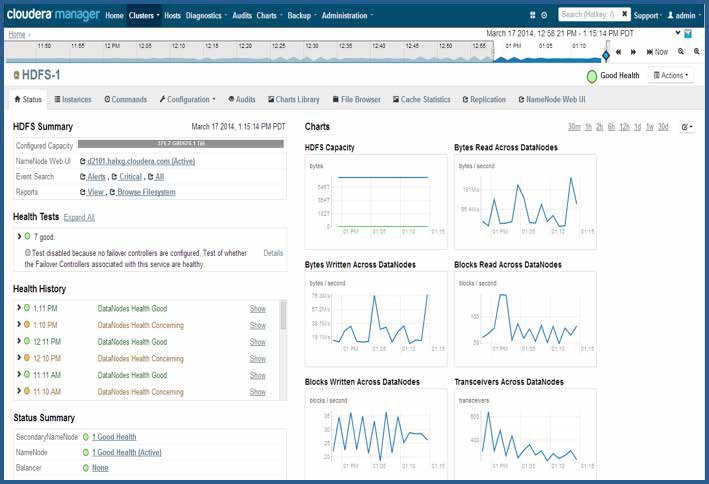

如上图所示，CM 会实时的对集群的各项服务进行监控，一旦服务出现了异常，将会产生告警。同时，对集群的各项性能数据进行监控，例如 CPU，网络等，一方面能够监控集群的性能状态，一方面能够帮助性能调优。

Cloudera Manager 能监控集群中部署的所有服务，以下仅以 HDFS 以及 Yarn 为例说明。

1. **HDFS** 服务监控

以 HDFS 服务为例，HDFS 服务页面的"状态"页面中显示了服务状态的汇总信息，包括 HDFS 综述，HDFS 文件系统块总数、总大小，文件总数、剩余量、损坏块，需复制快、JVM 线程状态等。页面中还包括了各种快捷链接。

服务页面中的"运行状况测试"面板限制了所有的服务进程状态，如下：

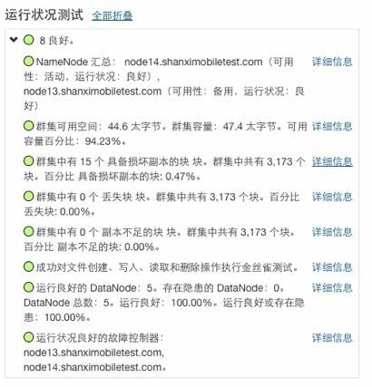

服务页面中还显示列损坏块、容量、正常服务节点数目等关键的信息，如下图。（由于目前 HDFS 中不存在损坏快，如果存在的话，会在下图中的页面显示。）

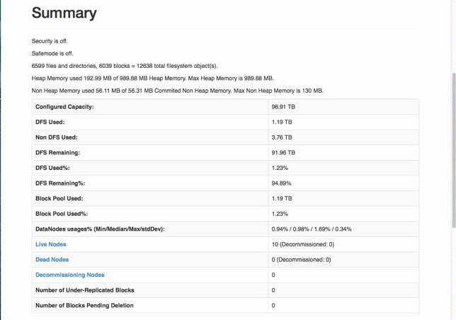

点击进入 DataNode 节点详细信息，可查看每个 DataNode 的关键信息，包括服务状态、容量、已使用空间、Block 数目、

HDFS 版本等。

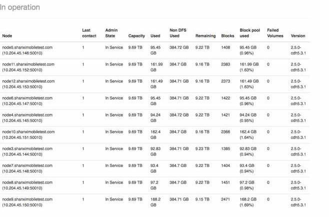

2. **YARN** 服务

在 YARN 服务页面也能查看所有 YARN 节点的状态，如下 ：

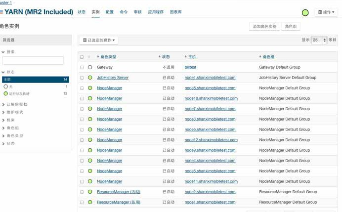

点击相应的 NodeManager 可以查看对应节点的详细状态和信息，如下 ：

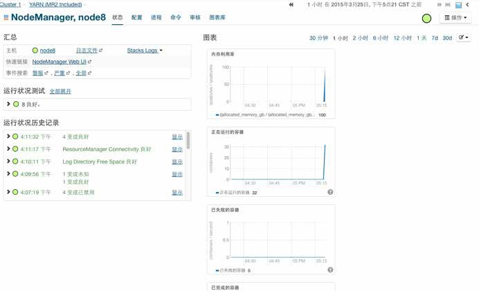

#### 节点级别监控

CM 能够支持节点级别的详细信息查看，包括该节点的硬件信息 ：网络，硬盘等。软件信息 ：运行的各项服务的状态，并对这些状态进行实时监控。

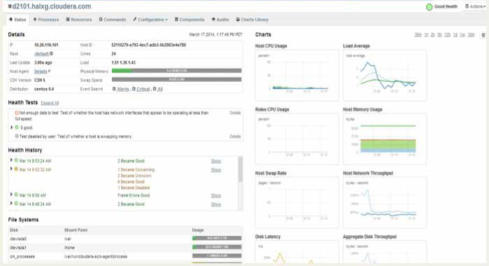

#### 自定义报警监控

Cloudera Manager 对于每个组件，都提供了监控的参数配置，例如可以设置达到多少阈值的时候，产生 warning 告警，达到多少阈值的时候产生 Critical 告警。

#### 自定义图表

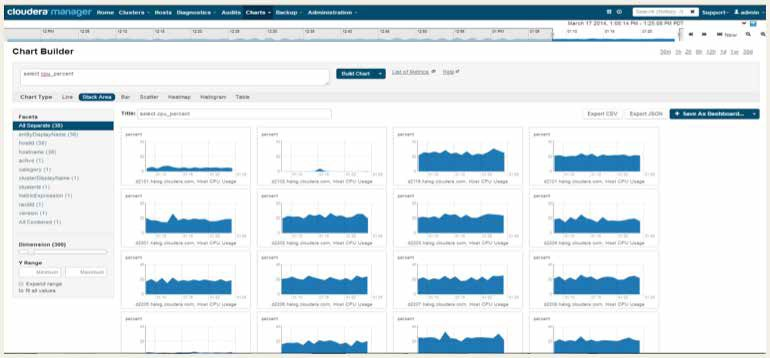除了 CM 默认提供的性能图表以外，还允许用户自定义图表，使得用户能够查看自己希望的性能图表。CM 提供了一套类似的 SQL 的语言，用户只需要使用这个语言，简单的编写类似 SQL 的语句，就能够生成自己想要的图表。

#### 页面自定义

CM 的主页能够允许用户自定义主界面的风格，可以通过简单的拖拽就能够调整主界面上组件的位置，也能够自定义添加需要的组件。

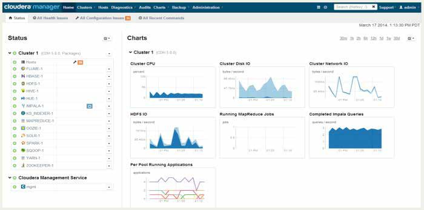

#### 高可靠监视及报警

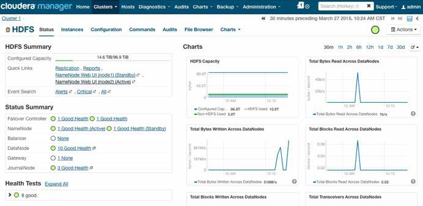Cloudera 支持主备部署，在主节点宕机时将从节点自动切换为主节点，并提供可视化界面监控及报警。如下部署为例，首先注意当前节点 node2 为活跃节点。

在 node2 断电后，自动发生 HA 切换，从界面可以看到 node1 变成活动节点。

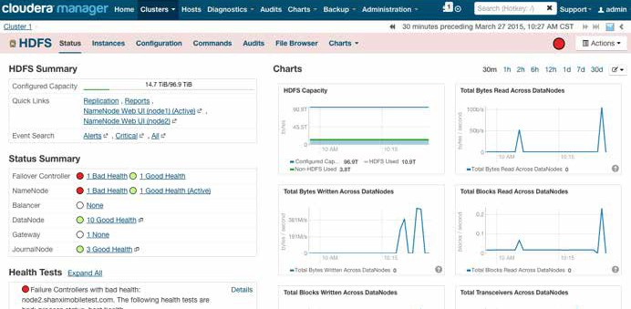

界面上显示 node2 的详细告警信息如下 ：

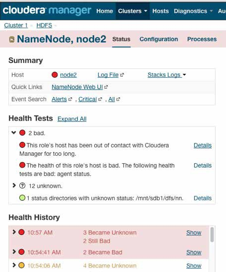

#### 日志自动清理

log4j 是 Apache 基金会的一个优秀的开源日志框架，被广泛地使用于 Hadoop 的各个组件。通过设置 log4j.properties 可以控制 log4j 日志行为，如 MaxFileSize 用于指定日志大小，MaxBackupIndex 用于指定保留日志文件个数。

通常会设置基于日期或者基于日志文件使用空间限额来设置自动日志清除。

1. 按日期自动清除日志

通常通过设置 DatePattern=\'.\'yyyy-MM-dd\'.txt\' 的 方 式 将 一 天 的 日 志 保 存 为 一 个 文 件。 可 以 通 过 设 置 的

MaxBackupIndex 可以控制保留的文件个数 N，从而让系统可以根据日期保留最近 N 天的数据。在 Cloudera Manager 中可以将相关 log4j 设置添加如服务的高级配置代码段，具体设置如下

2. 按空间限额自动清除日志

另外可以通过设置 Log4j 文件最大大小 MaxFileSize 并配合 MaxBackupIndex 来实现基于空间限额的日志自动清理。如

设置 MaxFileSize=500MB 和 MaxBackupIndex=10 可以保证日志使用空间小于 500MB\*10=5GB，并自动做日志清除。在 Cloudera Manager 中设置如下

## 诊断功能

诊断功能主要是指能够帮助用户根据收集的数据查看潜在的或者存在的风险与问题。

### 周期性服务诊断

CM 会对集群中运行的服务进行周期性的运行状况测试。以检测这些服务的状态是否正常。如果有异常情况会进行告警， 有利于更早的让客户感知集群服务存在的问题。

### 主动集群诊断

CM 在 Hadoop 集群运行期间，会记录集群中发生的事件，例如集群服务的启停，用户的操作，性能数据等等。CM 会将这些数据都记录到一个文件中。Cloudera 专门提供了一个集群，能够对这些数据进行分析，查找集群中的潜在风险，以及问题。用户可以选择定期的发送诊断数据给 Cloudera，Cloudera 会对这些数据进行分析并及时反馈集群中存在的问题。

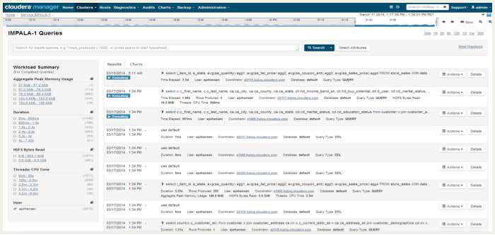

#### 操作提示

当集群中出现异常状态时，Cloudera Manager 会进行操作提示，例如下图中，hive server 异常退出，CM 提示"该角色的进程已退出，预期状态为已启动"。并且，CM 会进行操作提示，以及建议，包括针对这种情况，可以采取的操作，如何定位问题的原因等等。

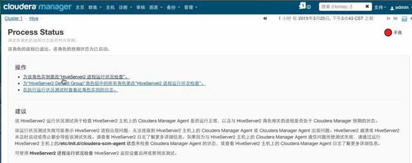

#### 日志收集及检索

Hadoop 集群的每个组件在运行过程中都会存储日志，并且散落在每个节点的不同目录，对于一个大规模的集群，日志的查看是非常麻烦的，需要一个个节点去进行查看。CM 针对这种情况，提供了日志的收集功能，能够通过统一的界面，查看集群中每台机器，各项服务的日志，并且能够根据日志级别等不同的条件进行检索。

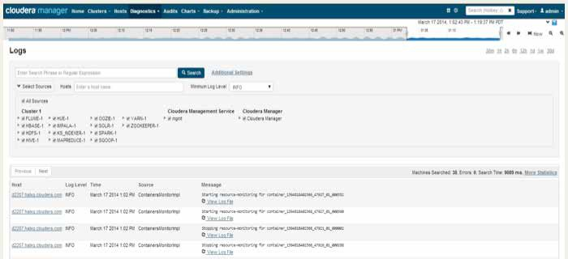

#### 系统性能使用报告

Hadoop 集群的性能调试尤为重要，因此能够方便精确的监控集群额性能尤为重要。CM 能够生产系统性能使用报告，包括集群的 CPU 使用率，单节点的 CPU 使用率，单个进程的 CPU 使用率等等各项性能数据。

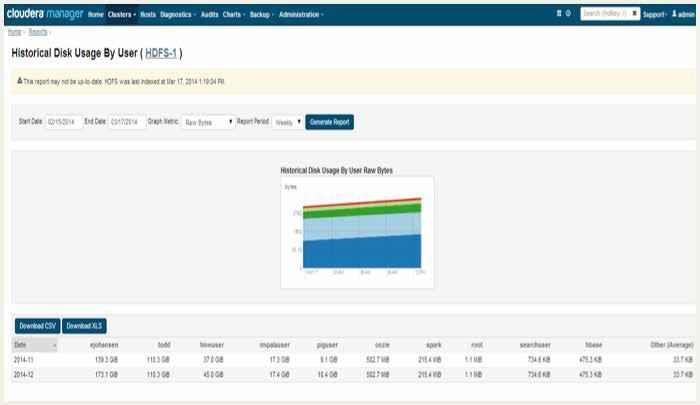

## 集成功能

### 安全配置

通常在一个企业内部，都会对验证系统作集中的部署，例如使用AD，LDAP 等验证服务作为集中式的验证服务器，提供对所有业务系统的验证工作。为了方便Hadoop 大数据平台与原有验证系统的集成，CM 提供了丰富的集成功能，只需要在界面，进行简单的配置，即可完成。

1. **Sentry** 配置

在 Cluster 的服务页面中通过添加服务可以安装部署 Sentry 组件，并在 HDFS 的配置页面中可以开启 Sentry

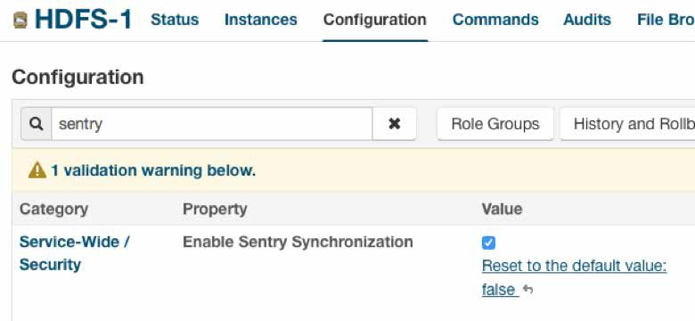

HUE 提供了基于 Sentry 角色的可视化授权界面，支持的功能包括 ：

- 批量修改角色和权限

- 可视化及修改基于数据库树的角色和权限

- 支持 WITH GRANT OPTION

- 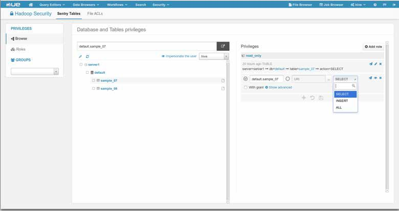模拟用户可以看到的数据库和表下面是操作截图示例 ：

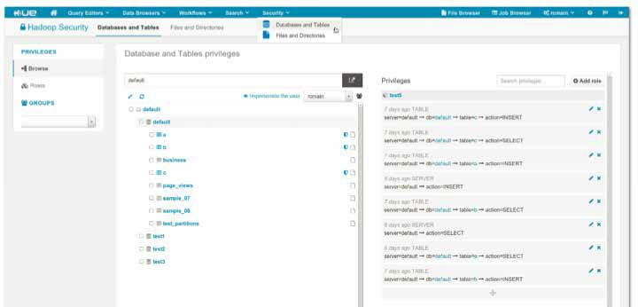

2. **Cloudera Manager API**

Cloudera 产品具有开放的特性，这种开放性的其中一个体现就是 CM 提供了丰富的 API，供客户调用，基本上所有在界面上提供的功能，通过 API 都可以完成同样的工作。Cloudera Manager API 支持的功能包括配置和服务生命周期管理、服务健康信息和指标，并允许配置 Cloudera Manager 本身。API 复用 Cloudera Manger 管理控制台（Cloudera Manager Admin Console）相同的主机和端口，无需额外的操作流程或参数配置。API 支持 HTTP 基本身份验证（HTTP Basic

Authentication），接受与 Cloudera Manger 管理控制台相同的用户和凭据。并且这些 API 都是标准的 REST API，使用

HTTP 标准的 CRUD 所有的请求和响应都可以用 JSON（JavaScript Object Notation）来表示，基本上所有的业务系统都应该支持，通过这些 API，能够方便的将 CM，集成到企业原有的集中管理系统。

下面是一些可以通过 Cloudera Manager API 做的操作 ：

- 通过编程部署整个 Hadoop 集群。 Cloudera Manger 支持 HDFS、MapReduce、Yarn、Zookeeper、HBase、Hive、

Oozie、Hue、Flume、Impala、Solr、Sqoop、Spark 和 Accumulo 等；

- 配置各种 Hadoop 服务并验证 ；

- 开展服务和角色的管理行为，如启动、停止、重新启动、故障转移等，同时提供了更先进的工作流程，如设立高可用性和退役 ；

- 通过具有智能化服务的健康检查和指标来监控服务和主机 ；

- 监控用户的工作和其他集群活动 ；

- 检索基于时间序列的度量数据 ；

- 搜索 Hadoop 系统内事件 ；

- 管理 Cloudera Manager 自身 ；

- 将 Hadoop 集群的整个部署描述下载为一个 JSON 文件 ；

- 等等

此外，基于企业版本产品，，该 API 还允许一些高级功能 ：

- 执行滚动重启和滚动升级 ；

- 审计用户在 Hadoop 上的活动和访问 ；

- 为 HDFS 和 Hive 执行备份和跨数据中心复制 ；

- 检索每个用户的 HDFS 使用情况报告和每个用户的 MapReduce 的资源使用情况报告。例如，下面的 HTTP 请求示例可以得到当前所有集群的基本信息 ：

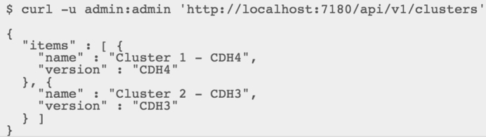

2. **Cloudera Manager** 客户端实现

用户可以通过 Java 或 Python 轻松地构建一个 Cloudera 的管理客户端应用，或者直接使用 HTTP 协议发送 Rest 风格请求。

Cloudera 在github 上开源了Cloudera Manger 的客户端Rest API 项目，包含所有源代码以及例子，并采用Apache 协议授权。

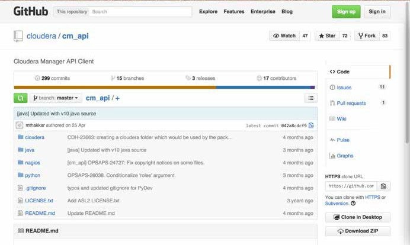

这些客户端的代码使用 Cloudera 的管理器进行各种交互式管理，比如 ：

- 管理多个集群

- 启动和停止全部或单个服务或角色

- 升级群集上运行的服务

- 查系统中的任何活动资源使用的时间序列数据对

- 读取系统中的所有进程日志以及输出和错误

- 编程配置各个部署的参数

- 收集诊断数据的调试问题，以帮助调试问题

- 运行分布式命令来管理自动故障转移（fail over）、主机退役等

- 查看所偶遇发生在系统中的事件和警报

- 从系统中添加和删除用户

比如，如下的示例演示了在系统显示终端打印出集群、服务以及角色资源 ：

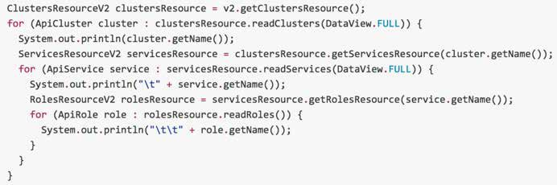

请参考 CM 客户端 API 开源项目（链接，链接）。

**2.4.3.SNMP** 集成

SNMP 是一个标准的消息转发协议。通常在大型的企业级系统中都会进行部署。CM 提供了方便的 SNMP 集成能力，只需要进行简单的部署，就能够将 SNMP 进行集成，并且将集群中的告警信息进行转发。

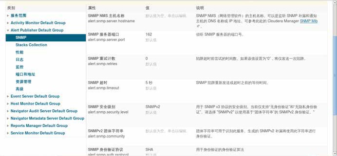

# 高级功能

以下功能只包含在商业版本中，在免费版本中不提供。有关商业版本许可证信息，请参见链接。

## 软件滚动升级

Hadoop 是一个正在快速发展的新技术，版本正在迅速的衍进，对于部署了 Hadoop 的系统，无论出于稳定性还是功能性的原因，版本升级是不可避免的。但是，通常业务系统都是在线的生产系统，需要 24 小时不间断的提供对外服务。

没有滚动升级之前，Hadoop 平台，要进行组件升级时，需要停止集群运行，然后进行升级，再启动集群，这样带来的问题是，在进行升级时，需要停集群，停服务，停应用。这样会严重影响持续的服务能力。整个过程如果由系统管理员手工操作，一个规模为 100 台服务器的集群通常需要 1 周左右，300 台服务器的集群通常需要 3 周时间。由于 Hadoop 产品开源，需要不断升级来保证新近发现重大 bug 及时修复，因此通常每 3 个月需要一次升级或打补丁。

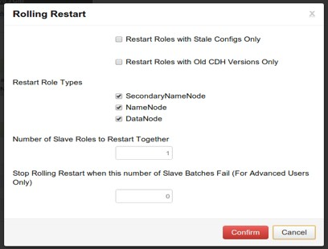因此，CM 提供了滚动升级的功能，支持在平台进行升级时，能够继续对外提供服务，以及应用。其原理是在升级时，首先停掉一个节点，然后进行升级，然后再启动，然后循环的进行下一个节点的升级。最后完成整个集群的升级。通过逐个节点升级的方式，保证集群的对外服务功能， 并且最终完成整个集群的升级。由于分布式系统的可扩展性，在升级过程中，集群依然能够持续运行，持续对外提供服务。

在 Cloudera 管理界面中提供了滚动升级的向导，方便管理员进行操作 ：

具体操作步骤如下 ：

步骤一 ：配置要升级软件的位置 ：

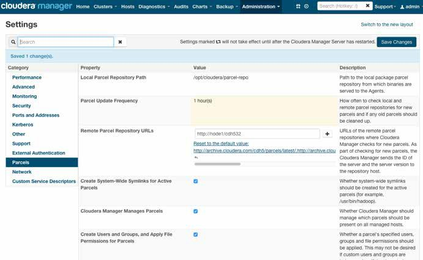

步骤二 ：开始升级，选择需要升级的版本，本例中为 5.3.2 ：

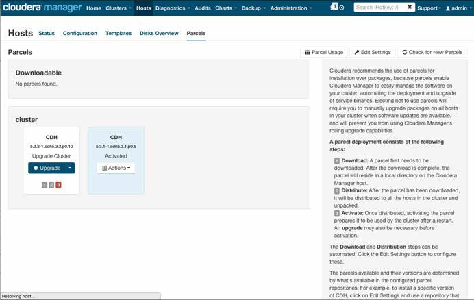

步骤三 ：确认升级前的准备工作，如关键数据备份等 ：

步骤四 ：硬件正确性检查 ：

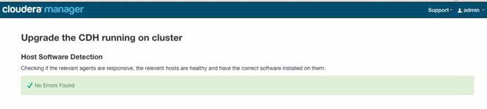

步骤五 ：准备开始版本升级 ：

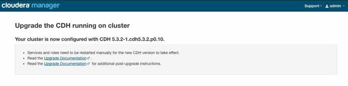

步骤六 ：升级时配置开启滚动重启功能，可以不影响正在运行服务和作业 ：

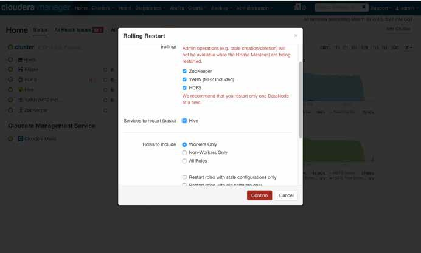

步骤七 ：滚动重启参数配置，可使用缺省参数 ：

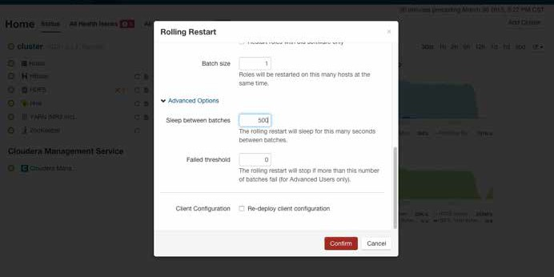

步骤八 ：开始执行滚动升级 ：

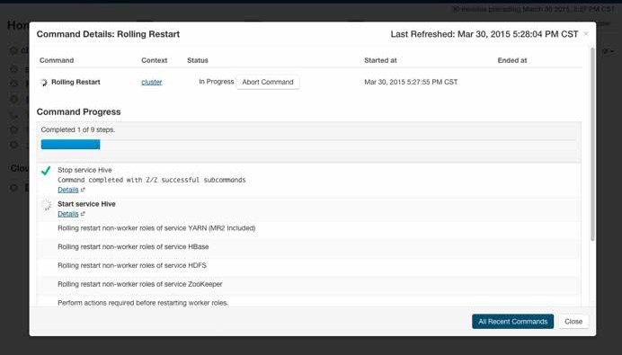

步骤九 ：无宕机服务升级成功

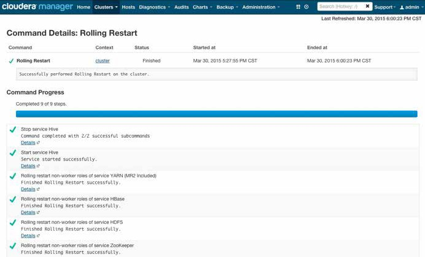

步骤十 ：升级客户端配置 ：

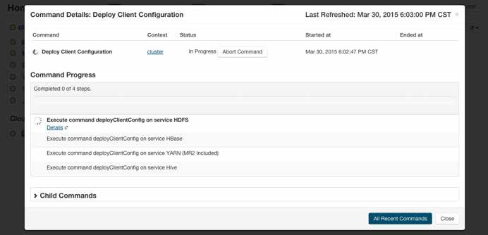

## 参数版本控制

任何时候进行配置修改并保存之后，Cloudera Manager 会对该配置生成一个版本。Cloudera Manager 支持查看历史配置把版本并回滚，从而为集群恢复、场景回放、问题诊断等提供了可靠的依据和方便的工具。

#### 配置历史查看

CM 提供了配置的历史记录与回滚，用户可以查看参数的修改历史。点击详细信息能查看到具体的每一个修改的配置更改前后的值。

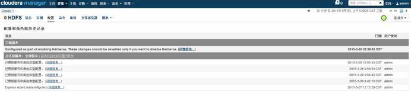

#### 配置版本回滚

进入服务配置界面，查看历史版本信息，能够查看所有的配置版本。Cloudera Manager 能够支持版本之间的回滚操作。在配置详细信息页面中选择"回滚"，将逐个回滚之前对所有组件的配置，并最终同步所有服务器和客户端配置。

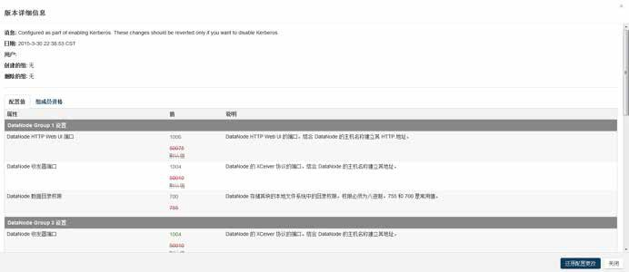

3. 备份及容灾系统 **BDR**

数据的备份与恢复是企业级系统非常关键的功能，能够保障异常故障情况下，数据的完整性。Hadoop 能够实现集群间的数据备份与灾难恢复工作，但是本身的配置以及实现非常的复杂与繁琐，不易于使用。

Cloudera 为 Hadoop 平台提供了一个集成的易用的灾备的解决方案（Cloudera BDR）。BDR 为灾备方案提供了丰富的功能。对于企业级数据中心来说，通常存储的是非常关键的企业数据，BDR 能够保证数据始终是可用的，哪怕面对整个数据中心断电的情况。

Cloudera Manager 为 BDR 提供了完整的用户界面，实现界面化的数据备份与灾难恢复。用户只需要在界面上进行简单的配置，就能够达到预期的效果。并且可以设置，数据备份的周期，带宽等参数，以保证在不影响业务的情况下，周期性的进行自动备份。具体包括如下的功能 ：

1. 用户可以自由选择与业务相关的关键数据进行灾备

2. 创建数据备份的调度策略。由于数据备份通常需要较大的网络带宽，如果没有良好的调度，将会影响业务系统的运行， 需要对于备份的时间，备份的带宽等加以限制。

3. 通过一个集中的控制台跟踪数据备份任务的进度，以及备份过程中出错的文件。

4. 针对出错的任务，或者异常中断的任务，提供告警机制，以及时让用户感知。

这些功能都能够无缝的和 HDFS，Hive 等存储的备份进行结合，并且在备份的过程中，并不需要对存储于 Hive 表中的数据进行人为的转换。数据的备份同时也包括元数据的备份，因此，备份出来的数据仍然能够体现表格的元数据信息。

开源的 Hadoop 默认提供了集群间的数据拷贝方案"distcp"，Disctp 是一个专门的 Mapreduce 任务，用于并行的进行文件复制。Cloudera 分数据备份方案建立在 Distcp 之上，进行了性能上的优化，提供更高效，更快速的文件复制。

在新版本中，BDR 还提供了一个新功能，能够在运行备份之前，估算整个过程需要的资源和开销，帮助用户评估灾备的风险。目前通常的灾备解决方案是，一方面利用数据快照，对存储于 Hadoop 的数据进行增量快照，同时利用 BDR 所提供的页面，

对数据备份进行定制化，通过将数据快照备份到另一个 Hadoop 集群。当目前运行的 Hadoop 集群出现了严重的问题，数据丢失或者无法恢复时，可以通过存储在备用集群的数据，进行灾难恢复。

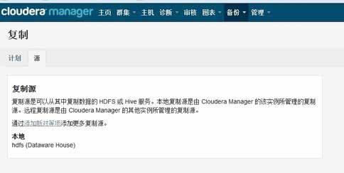

3. **HDFS** 备份

    1. 本地备份：快照模式

CM 支持对 HDFS 文件夹建立快照，并基于快照备份或恢复。如 ：

步骤一 ：查看集群，示例中 HDFS 只有一个文件formatdisk.sh ：

步骤二 ：建立快照。

步骤三 ：建立快照后，进行 HDFS 文件操作，比如新增文件 mountdisk.sh ：

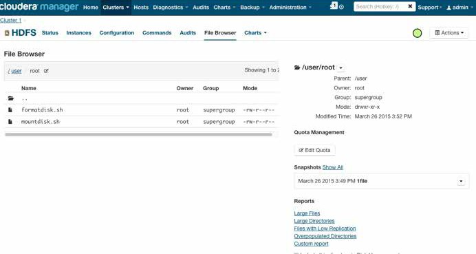

步骤四 ：进行文件恢复，将 HDFS 状态恢复到之前建立的快照：

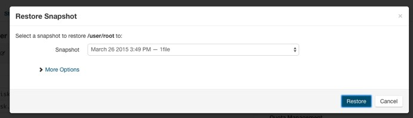

步骤五 ：操作成功后，目录将恢复到之前的状态，即只有一个文件，示例如下 ：

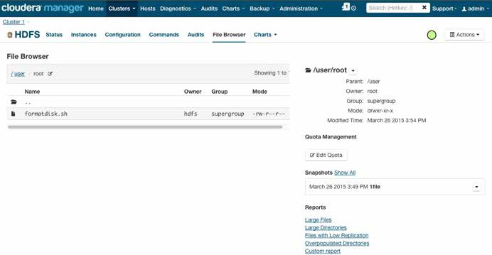

2. 异地备份：复制模式

HDFS 备份另外一种方案是将数据拷贝到另外一个集群，操作步骤如下 ：

步骤一 ：建立远端对等集群信息 ：

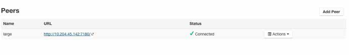

步骤二 ：选择数据备份策略。支持的备份策略包括 ：

1. 可以配置立即或延后定时进行备份 ：

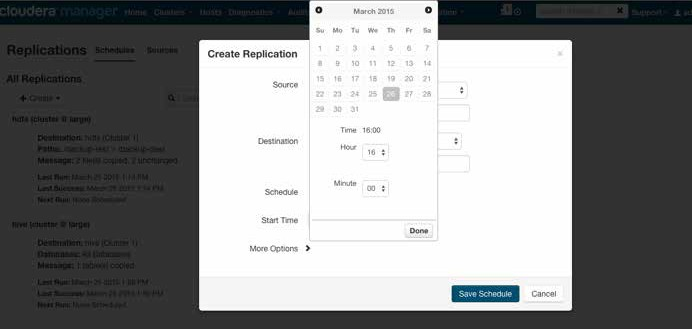

2. 可以进行周期性备份，间隔时间可以按分钟，小时，天，周，月，年等不同策略进行定期计划执行 ：

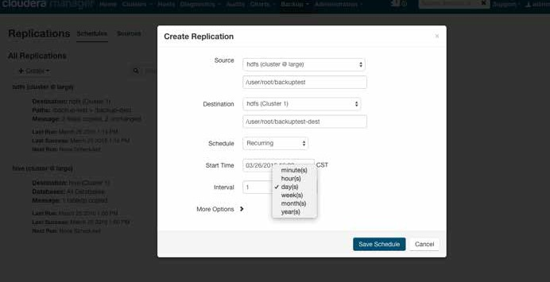

3. 可以配置数据备份时能使用的资源限制，以便降低因数据备份对线上业务的影响 ：

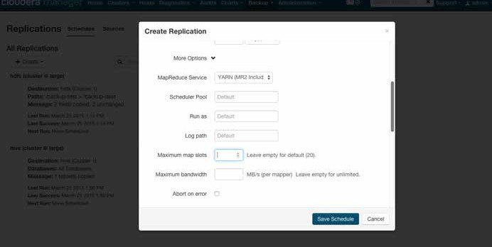

4. 其他更多数据备份的策略，比如删除文件如何处理，元数据如何处理等等 ：

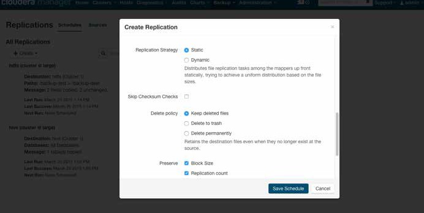

步骤三 ：选择数据备份的通知机制，如失败报警等 ：

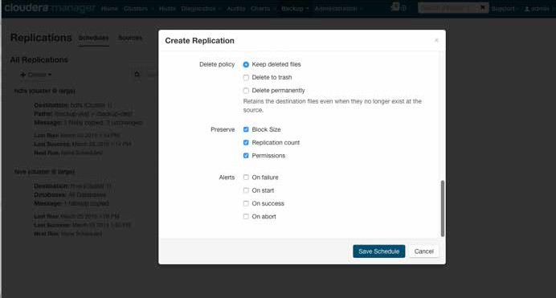

步骤四 ：数据备份策略配置完成后，可以管理备份策略 ：

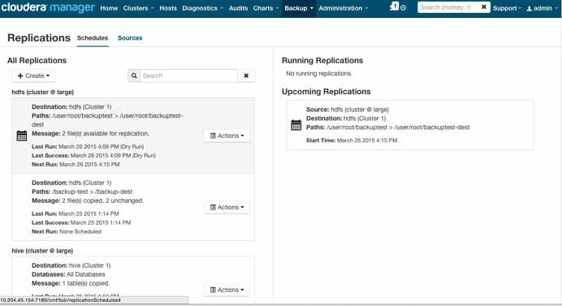

步骤五 ：数据恢复是备份的相反过程。使用相同步骤在备份集群执行，只是把 Source 集群和 Destination 集群的地址对调， 使用单次（Once）运行，将数据从备份集群拷贝到需要恢复数据的集群：

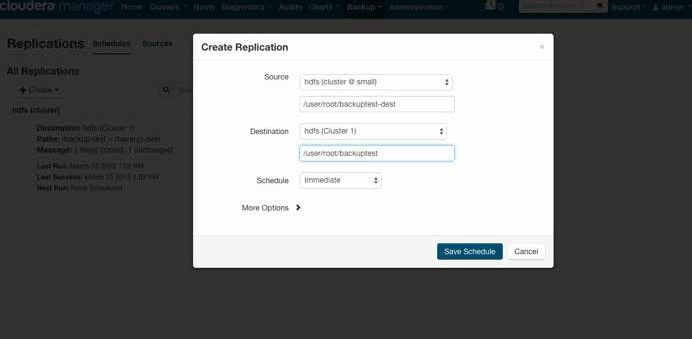

## 数据审计

Cloudera Navigator 的审计功能支持对于数据的审计和访问，其架构如下 ：

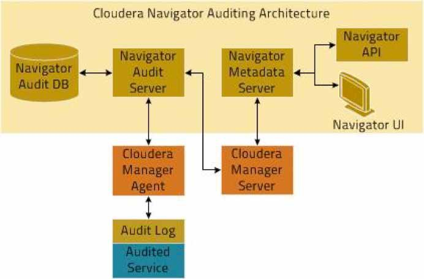

一旦配置了 Cloudera Navigator 审计功能，收集和过滤审核事件的插件将会被打开并插入到 HDFS，HBase 和 Hive（也就是 HiveServer2 和 Beeswax 服务器）服务。该插件负责将审计事件写入到本地文件系统的审计日志中。而 Cloudera

Impala 和 Sentry 则自己收集和过滤审核事件，并直接将其写入审计日志文件。支持的审计事件比如集群资源管理操作节点操作、用户操作、资源服务的启动和停止、应用程序操作等。

运行在每台服务器上的 CM 代理（Cloudera Manager Agent）会监视审计日志文件，并将这些事件发送到 Navigator 审计服务器（Navigator Audit Server）。如果任何消息在发送时失败，CM 代理将会自动重试。由于没有使用临时内存缓冲区，

一旦审计事件被写入审计日志文件，就可以保证被交付（只要文件系统可用）。 CM 代理记录并跟踪审计日志中当前成功发送的的审计事件，因此及时出现任何崩溃或重新启动，只需找到上次成功发送审计事件的位置，然后就可以重新开始发送。审核日志一旦被成功发送到 Navigator 审计服务器，CM 代理会负责清除。如果一个插件无法将审计事件写入审计日志文件，它可以丢弃事件或停止正在运行的进程（取决于配置的策略）。

Navigator 审计服务器执行以下功能 ：

- 跟踪和合并事件

- 存储事件给审计数据库

5. ## 安全集成向导

    1. **Kerberos** 集成

Hadoop 支持多种安全机制，例如 Kerberos。由于使用这些安全机制的配置工作以及管理工作都非常繁琐且复杂，CM 在界面上提供了启用 Kerberos、基于角色的访问控制等功能的途径，用户只需要通过简单的页面点击就能够完成复杂的配置工作。

可以在 Cloudera Manager 界面上方的管理菜单栏的"管理"中找到"Kerberos"，点击后进入集成向导。界面示例如下 ：

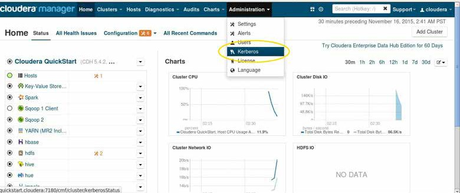

或者在 Cluster 的操作下拉菜单中找到"启用Kerberos"，如下 ：

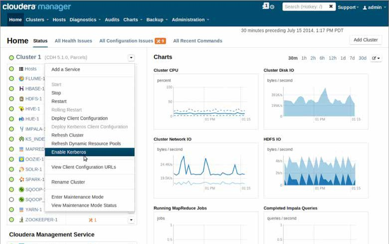

点击后进入 Kerberos 集成向导，具体操作步骤如下 ：

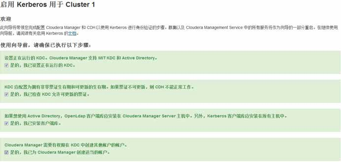步骤一：

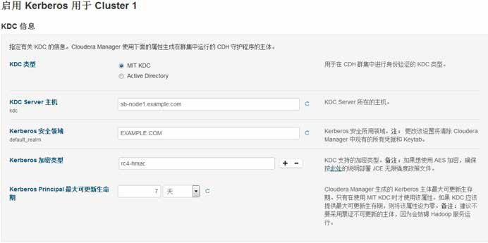步骤二：

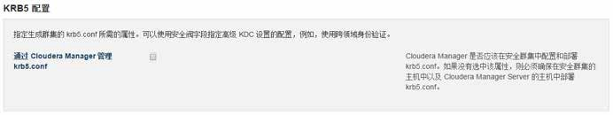步骤三：

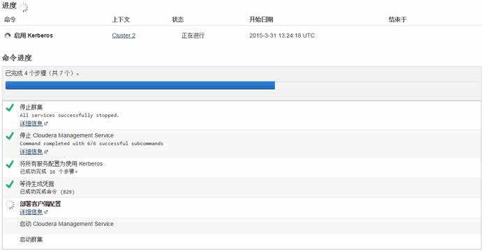步骤四 ：执行并完成

步骤五 ：服务监控及配置

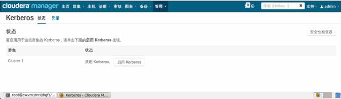

#### 外部安全认证集成

Cloudera Manager 支持通过内部数据库或这外部服务进行用户认证。具体支持的外部服务如下，详细信息参见官方文档

<http://www.cloudera.com/documentation/enterprise/latest/topics/cm_sg_external_auth.html>

1. **Active Directory**

2. **OpenLDAP** 兼容服务器

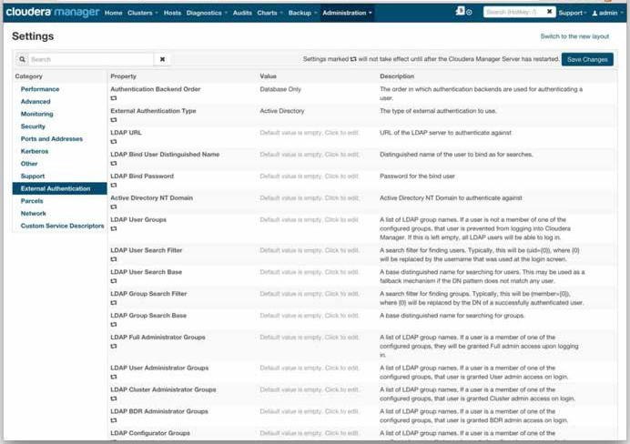
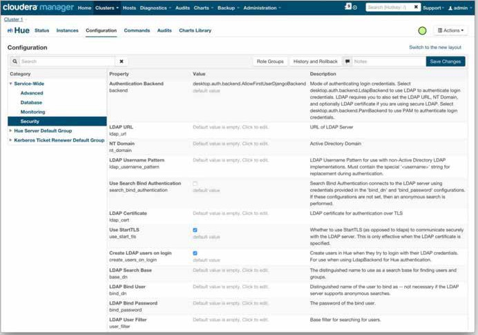
3. 外部程序

**3.5.2.4.SAML**

4. 重要管理任务介绍
    1. 多租户资源管理能力
CDH 提供了多租户的统一资源与权限管控，可以满足各个部门的不同应用需求。通过统一的集群管理和资源调度框架，平台可以动态创建和销毁集群，灵活部署业务。平台具备资源弹性共享能力以提高资源利用率，同时平台的资源隔离性可以保障服务质量和安全性。

#### 资源分配运维监控工具

CM 提供了众多的资源 KPI 指标，以及丰富的可视化的资源分配、运维和监控界面。运维人员能在单一管理界面配置、监控和导出实时的系统集群资源状态、管理规则以及分用户、任务的使用状况。如下图 ：
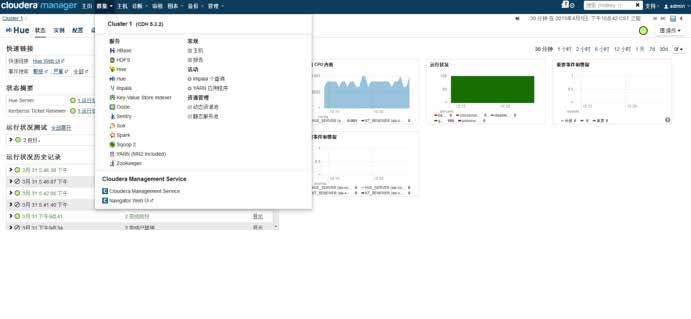
CDH 以及 CM 能同时满足动态以及静态的资源管理 ：通过"动态资源池"提供基于 YARN 的动态资源隔离能力，通过"静态资源池"提供基于 Linux 容器技术的静态资源隔离能力。其中，动态资源池状态监控界面如下图 ：
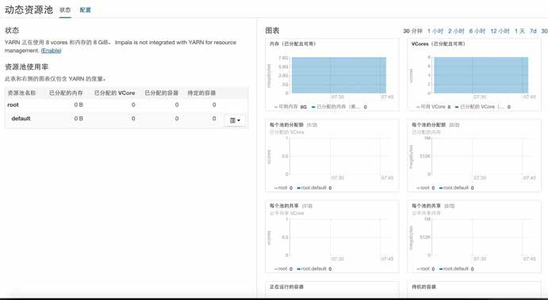
2. 动态资源隔离能力（基于 **YARN**）
CDH 集成了 YARN 组件，提供了动态资源隔离能力，并对内存资源和 CPU 资源采用了不同的资源隔离方案。CM 提供了方便的可视化界面来配置"动态资源池"，同时支持计划模式，对于指定类型的时间使用特定的资源管理策略，能有效的管理高峰在线业务期以及高峰离线计算期的不同资源负载管理矛盾。
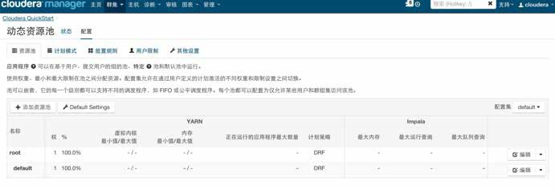
当前 YARN 支持内存和 CPU 两种资源类型的管理和分配。对于内存资源是限制性资源，应用程序到达内存限制，会发生 OOM，就会被杀死，因此内存直接决定应用程序的运行。CPU 资源一般用 Cgroups 进行资源控制，内存资源隔离除
Cgroups 之外提供了另外一个更灵活的方案，就是线程监控方案，以获取更加灵活的资源控制效果。默认情况下 YARN 采用线程监控的方案控制内存使用，每个 NodeManager 会启动一个额外监控线程监控每个 container 内存资源使用量，一旦发现它超过约定的资源量，则会将其杀死。
在 YARN 中，用户以队列的形式组织，每个用户可属于一个或多个队列，且只能向这些队列中提交 application。每个队列被划分了一定比例的资源。用户提交应用程序时，可以指定每个任务需要的虚拟 CPU 个数以及内存要求。在
MRAppMaster 中，每个 Map Task 和 Reduce Task 默认情况下需要的虚拟 CPU 个数为 1，对于内存资源，Map Task 和
Reduce Task 默认情况下需要 1024MB。相应配置皆可通过参数修改。
CM 提供了可视化的动态资源池管理界面，如下 ：

3. 静态资源隔离能力（基于 **Linux** 容器技术）
Linux 容器工具，即 LXC，可以提供轻量级的虚拟化，以便隔离进程和资源。使用 LXC 的优点就是不需要安装太多的软件包，使用过程也不会占用太多的资源，LXC 是在 Linux 平台上基于容器的虚拟化技术的未来标准，最初的 LXC 技术是由
IBM 研发的，目前已经进入 Linux 内核主线，这意味着 LXC 技术将是目前最有竞争力的轻量级虚拟容器技术。LXC 项目
由一个 Linux 内核补丁和一些用户空间（userspace）工具组成。这些工具使用由补丁增加的内核新特性，提供一套简化的工具来维护容器。2.6.29 版本后的 Linux 内核版本已经包含该补丁提供的大部分功能。所以强烈建议使用最新的内核源代码。
LXC 在资源管理方面依赖 Linux 内核的 CGroups (Control Groups) 系统，CGroups 系统是 Linux 内核提供的一个基于进程组的资源管理的框架，可以为特定的进程组限定可以使用的资源。它最初由 Google 的工程师提出，后来被整合进 Linux 内核。CGroups 也是 LXC 为实现虚拟化所使用的资源管理手段，可以说没有 CGroups 就没有 LXC。
CDH 也支持基于 CGroups 或者 Linux 容器进行静态资源隔离，保证不同应用、不同任务之间的资源使用独立性。在 CM 中的"静态服务池"集成了可视化的界面，可以对 CPU、IO、内存等资源进行静态的隔离。为方便配置管理，CM 还提供了配置向导工具，方便运维管理员以所见即所得的方式轻松的配置集群。
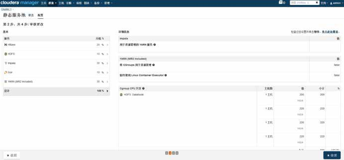
CM 还提供了静态服务的监控和运维界面，能方便的查看和管理静态服务池。界面截图如下 ：
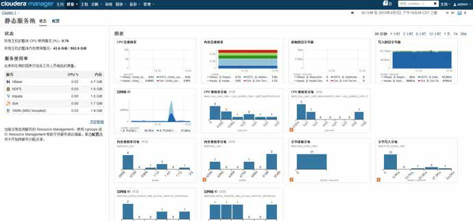

## 监控指标

Cloudera Manager 提供多达 102 类监控指标（见下表），覆盖所有的服务及功能，包括集群硬件使用情况（网络、CPU、内存以及硬盘等）、服务状态等，同时指标按集群级别、主机级别、用户级别以及表 / 目录级别等等分级统计，总指标项上万， 比如 ：集群指标超过 3000 个、HBase 系统级指标就超过 1000 个、HDFS 系统级指标超过 300 个等等。具体指标列表可查阅如下在线网页资料 ：<http://www.cloudera.com/content/cloudera/en/documentation/core/latest/topics/cm_metrics.html>

**Cloudera Manager** 监控指标分类索引表

+-------------------------------+----------------------------------+-----------------------------+
| Accumulo                    | History Server                 | Navigator Metadata Server |
+===============================+==================================+=============================+
| Accumulo 1.6                | Hive                           | Network Interface         |
+-------------------------------+----------------------------------+-----------------------------+
| Activity                    | Hive Metastore Server          | NodeManager               |
+-------------------------------+----------------------------------+-----------------------------+
| Activity Monitor            | HiveServer2                    | Oozie                     |
+-------------------------------+----------------------------------+-----------------------------+
| Agent                       | Host                           | Oozie Server              |
+-------------------------------+----------------------------------+-----------------------------+
| Alert Publisher             | Host Monitor                   | Rack                      |
+-------------------------------+----------------------------------+-----------------------------+
| Attempt                     | HttpFS                         | RegionServer              |
+-------------------------------+----------------------------------+-----------------------------+
| Beeswax Server              | Hue                            | Reports Manager           |
+-------------------------------+----------------------------------+-----------------------------+
| Cloudera Management Service | Hue Server                     | ResourceManager           |
+-------------------------------+----------------------------------+-----------------------------+
| Cloudera Manager Server     | Impala                         | SecondaryNameNode         |
+-------------------------------+----------------------------------+-----------------------------+
| Cluster                     | Impala Catalog Server          | Sentry                    |
+-------------------------------+----------------------------------+-----------------------------+
| DataNode                    | Impala Daemon                  | Sentry Server             |
+-------------------------------+----------------------------------+-----------------------------+
| Directory                   | Impala Daemon Pool             | Server                    |
+-------------------------------+----------------------------------+-----------------------------+
| Disk                        | Impala Llama ApplicationMaster | Service Monitor           |
+-------------------------------+----------------------------------+-----------------------------+
| Event Server                | Impala Pool                    | Solr                      |
+-------------------------------+----------------------------------+-----------------------------+
| Failover Controller         | Impala Query                   | Solr Collection           |
+-------------------------------+----------------------------------+-----------------------------+
| Filesystem                  | Impala StateStore              | Solr Replica              |
+-------------------------------+----------------------------------+-----------------------------+
| Flume                       | Isilon                         | Solr Server               |
+-------------------------------+----------------------------------+-----------------------------+
| Flume Channel               | JobHistory Server              | Solr Shard                |
+-------------------------------+----------------------------------+-----------------------------+
| Flume Channel Tier          | JobTracker                     | Spark                     |
+-------------------------------+----------------------------------+-----------------------------+
| Flume Sink                  | JournalNode                    | Spark (Standalone)        |
+-------------------------------+----------------------------------+-----------------------------+
| Flume Sink Tier             | Kerberos Ticket Renewer        | Sqoop 1 Client            |
+-------------------------------+----------------------------------+-----------------------------+
| Flume Source                | Key Management Server          | Sqoop 2                   |
+-------------------------------+----------------------------------+-----------------------------+
| Flume Source Tier           | Key Management Server Proxy    | Sqoop 2 Server            |
+-------------------------------+----------------------------------+-----------------------------+
| Garbage Collector           | Key Trustee                    | Tablet Server             |
+-------------------------------+----------------------------------+-----------------------------+
| HBase                       | Key-Value Store Indexer        | TaskTracker               |
+-------------------------------+----------------------------------+-----------------------------+
| HBase Namespace             | Lily HBase Indexer             | Time Series Table         |
+-------------------------------+----------------------------------+-----------------------------+
| HBase REST Server           | Logger                         | Tracer                    |
+-------------------------------+----------------------------------+-----------------------------+
| HBase Region                | MapReduce                      | User                      |
+-------------------------------+----------------------------------+-----------------------------+
| HBase Table                 | Master                         | WebHCat Server            |
+-------------------------------+----------------------------------+-----------------------------+
| HBase Thrift Server         | Monitor                        | Worker                    |
+-------------------------------+----------------------------------+-----------------------------+
| HDFS                        | NFS Gateway                    | YARN (MR2 Included)       |
+-------------------------------+----------------------------------+-----------------------------+
| HDFS Cache Directive        | NameNode                       | YARN Pool                 |
+-------------------------------+----------------------------------+-----------------------------+
| HDFS Cache Pool             | Navigator Audit Server         | ZooKeeper                 |
+-------------------------------+----------------------------------+-----------------------------+

2. ## 部分样例状态指标

    4. **HDFS** 指标

+----------------+-------------------------------+---------+-------------------+
| **KPI** 名称 | **KPI** 描述                | 单位  | 级别            |
+================+===============================+=========+===================+
| CPU 占用率   | CPU 平均占用率              | \%    | 系统级 / 节点级 |
+----------------+-------------------------------+---------+-------------------+
| 内存占用率   | 内存平均占用率              | \%    | 系统级 / 节点级 |
+----------------+-------------------------------+---------+-------------------+
| 系统空间     | 总空间                      | MB    | 系统级 / 节点级 |
+----------------+-------------------------------+---------+-------------------+
| 已用空间     | 已用空间                    | MB    | 系统级 / 节点级 |
+----------------+-------------------------------+---------+-------------------+
| 可用空间     | 剩余空间                    | MB    | 系统级 / 节点级 |
+----------------+-------------------------------+---------+-------------------+
| 空间使用率   | 已用空间与系统空间的比值    | \%    | 系统级 / 节点级 |
+----------------+-------------------------------+---------+-------------------+
| 读流量       | 统计周期内读流量统计        | MB    | 系统级 / 节点级 |
+----------------+-------------------------------+---------+-------------------+
| 写流量       | 统计周期内写流量统计        | MB    | 系统级 / 节点级 |
+----------------+-------------------------------+---------+-------------------+
| 读 IOPS      | 每秒进行读（I/O）操作的次数 | 个 /s | 系统级 / 节点级 |
+----------------+-------------------------------+---------+-------------------+
| 写 IOPS      | 每秒进行写（I/O）操作的次数 | 个 /s | 系统级 / 节点级 |
+----------------+-------------------------------+---------+-------------------+

### MapReduce 指标

+--------------------------+--------------------------+--------+----------+
| **KPI** 名称           | **KPI** 描述           | 单位 | 级别   |
+==========================+==========================+========+==========+
| 提交作业数               | 提交作业数               | 个   | 系统级 |
+--------------------------+--------------------------+--------+----------+
| 完成作业数               | 完成作业数               | 个   | 系统级 |
+--------------------------+--------------------------+--------+----------+
| 失败作业数               | 失败作业数               | 个   | 系统级 |
+--------------------------+--------------------------+--------+----------+
| 正在运行的作业数         | 正在运行的作业数         | 个   | 系统级 |
+--------------------------+--------------------------+--------+----------+
| Map 总任务数             | Map 总任务数             | 个   | 系统级 |
+--------------------------+--------------------------+--------+----------+
| Reduce 总任务数          | Reduce 总任务数          | 个   | 系统级 |
+--------------------------+--------------------------+--------+----------+
| Map 任务完成数           | Map 任务完成数           | 个   | 系统级 |
+--------------------------+--------------------------+--------+----------+
| Reduce 任务完成数        | Reduce 任务完成数        | 个   | 系统级 |
+--------------------------+--------------------------+--------+----------+
| 正在执行的 Map 任务数    | 正在执行的 Map 任务数    | 个   | 系统级 |
+--------------------------+--------------------------+--------+----------+
| 正在执行的 Reduce 任务数 | 正在执行的 Reduce 任务数 | 个   | 系统级 |
+--------------------------+--------------------------+--------+----------+
| 平均 Map 任务执行时间    | 平均 Map 任务执行时间    | 秒   | 系统级 |
+--------------------------+--------------------------+--------+----------+
| 平均 Reduce 任务执行时间 | 平均 Reduce 任务执行时间 | 秒   | 系统级 |
+--------------------------+--------------------------+--------+----------+
| 最小 Map 任务执行时间    | 最小 Map 任务执行时间    | 秒   | 系统级 |
+--------------------------+--------------------------+--------+----------+
| 最小 Reduce 任务执行时间 | 最小 Reduce 任务执行时间 | 秒   | 系统级 |
+--------------------------+--------------------------+--------+----------+
| 最大 Map 任务执行时间    | 最大 Map 任务执行时间    | 秒   | 系统级 |
+--------------------------+--------------------------+--------+----------+
| 最大 Reduce 任务执行时间 | 最大 Reduce 任务执行时间 | 秒   | 系统级 |
+--------------------------+--------------------------+--------+----------+
| Map 任务执行失败数       | Map 任务执行失败数       | 个   | 系统级 |
+--------------------------+--------------------------+--------+----------+
| Reduce 任务执行失败数    | Reduce 任务执行失败数    | 个   | 系统级 |
+--------------------------+--------------------------+--------+----------+
| Map 任务执行成功数       | Map 任务执行成功数       | 个   | 系统级 |
+--------------------------+--------------------------+--------+----------+
| Reduce 任务执行成功数    | Reduce 任务执行成功数    | 个   | 系统级 |
+--------------------------+--------------------------+--------+----------+

6. **HBase** 指标

+------------------------------+-----------------------------------------------------------------------------------------------+--------+------------------+
| **KPI** 名称               | **KPI** 描述                                                                                | 单位 | 级别           |
+==============================+===============================================================================================+========+==================+
| 系统空间                   | 系统总空间                                                                                    | MB   | 系统级 /       |
+------------------------------+-----------------------------------------------------------------------------------------------+--------+------------------+
| 已用空间                   | NoSQL 系统已用数据量 （系统级）；RegionServer 的                                              | MB   | 系统级/ 节点级 |
|                              |                                                                                               |        |                  |
|                              | Region 个数（节点级）                                                                         |        |                  |
+------------------------------+-----------------------------------------------------------------------------------------------+--------+------------------+
| 可用空间                   | NoSQL 系统可用数据量                                                                          | MB   | 系统级 /       |
+------------------------------+-----------------------------------------------------------------------------------------------+--------+------------------+
| 空间使用比率               | 已使用的空间与总空间的比值                                                                    | \%   | 系统级 /       |
+------------------------------+-----------------------------------------------------------------------------------------------+--------+------------------+
| CPU 平均使用率             | NoSQL 系统平均 CPU 使用率                                                                     | \%   | 系统级/ 节点级 |
+------------------------------+-----------------------------------------------------------------------------------------------+--------+------------------+
| CPU IOwait 使用率          | NoSQL 系统平均 CPU IOwait 使用率                                                              | \%   | 系统级/ 节点级 |
+------------------------------+-----------------------------------------------------------------------------------------------+--------+------------------+
| 压缩合并队列长度           | 数据分区服务器中的压缩合并（Compaction）队列大小， 当存储文件数量达到该数值时将启动压缩合并。 | 个   | 系统级         |
+------------------------------+-----------------------------------------------------------------------------------------------+--------+------------------+
| 请求时延 10 毫秒次数       | 请求响应时间小于或等于 10 毫秒的请求次数                                                    | 次   | 系统级 /       |
+------------------------------+-----------------------------------------------------------------------------------------------+--------+------------------+
| 请求时延 2000 毫秒次数     | 请求响应时间小于或等于 2000 毫秒的请求次数                                                  | 次   | 系统级 /       |
+------------------------------+-----------------------------------------------------------------------------------------------+--------+------------------+
| 请求时延 2000 毫秒以上次数 | 请求响应时间大于 2000 毫秒的请求次数                                                        | 次   | 系统级 /       |
+------------------------------+-----------------------------------------------------------------------------------------------+--------+------------------+
| 读 IO 次数                 | 读 IO 次数                                                                                  | 次   | 节点级         |
+------------------------------+-----------------------------------------------------------------------------------------------+--------+------------------+
| 写 IO 次数                 | 写 IO 次数                                                                                  | 次   | 节点级         |
+------------------------------+-----------------------------------------------------------------------------------------------+--------+------------------+
| IO 次数                    | 节点 IO 次数（读写 IO 次数总和）                                                            | 次   | 节点级         |
+------------------------------+-----------------------------------------------------------------------------------------------+--------+------------------+

## 部分样例报警指标

### 5.2.1.Hive

1. 系统级

+--------------------------+-----------------------------------------+------------+
| 告警名称               | 告警描述                              | 定位信息 |
+==========================+=========================================+============+
| 空间使用比率超阈值告警 | 存储资源空间占用比超过门限              | 系统标识 |
+--------------------------+-----------------------------------------+------------+
|                          | 存储系统全部节点 CPU 平均使用率超过门限 | 系统标识 |
+--------------------------+-----------------------------------------+------------+
|                          | 存储系统全部节点内存平均使用率超过门限  | 系统标识 |
+--------------------------+-----------------------------------------+------------+
| 系统状态异常           | 存储系统不可用、只读告警                | 系统标识 |
+--------------------------+-----------------------------------------+------------+

2. 节点级

+------------------------+---------------------------------------+----------------------------------------------+
| 告警名称             | 告警描述                            | 定位信息                                   |
+========================+=======================================+==============================================+
| 节点状态异常           | 节点故障                              | 节点 IP/ 主机名                              |
+------------------------+---------------------------------------+----------------------------------------------+
| 空间使用比率超阈值告警 | 存储资源空间占用比超过门限            | 节点 IP/ 主机名                              |
+------------------------+---------------------------------------+----------------------------------------------+
| CPU 使用率超阈值告警   | 存储系统单节点 CPU 平均使用率超过门限 | 节点 IP/ 主机名                              |
+------------------------+---------------------------------------+----------------------------------------------+
| 内存使用率超阈值告警   | 存储系统单节点内存平均使用率超过门限  | 节点 IP/ 主机名                              |
+------------------------+---------------------------------------+----------------------------------------------+
| 进程异常               | 系统重要进程异常                      | 节点 IP/ 主机名、进程标识                    |
+------------------------+---------------------------------------+----------------------------------------------+
| 元数据故障             | 元数据写入异常或丢失                  | 节点IP/ 主机名、表标识、索引标识、元数据条目 |
+------------------------+---------------------------------------+----------------------------------------------+

### 5.2.2.HDFS

1. 系统级

+------------------------+-----------------------------------------+------------+
| 告警名称             | 告警描述                              | 定位信息 |
+========================+=========================================+============+
| 空间使用比率超阈值告警 | 存储资源空间占用比超过门限              | 系统标识 |
+------------------------+-----------------------------------------+------------+
| CPU 使用率超阈值告警   | 存储系统全部节点 CPU 平均使用率超过门限 | 系统标识 |
+------------------------+-----------------------------------------+------------+
| 内存使用率超阈值告警   | 存储系统全部节点内存平均使用率超过门限  | 系统标识 |
+------------------------+-----------------------------------------+------------+
| 系统状态异常           | 存储系统不可用、只读告警                | 系统标识 |
+------------------------+-----------------------------------------+------------+

2. 节点级

+------------------------+---------------------------------------+-------------------+
| 告警名称             | 告警描述                            | 定位信息        |
+========================+=======================================+===================+
| 节点状态异常           | 节点故障                              | 节点 IP/ 主机名 |
+------------------------+---------------------------------------+-------------------+
| 空间使用比率超阈值告警 | 存储资源空间占用比超过门限            | 节点 IP/ 主机名 |
+------------------------+---------------------------------------+-------------------+
| CPU 使用率超阈值告警   | 存储系统单节点 CPU 平均使用率超过门限 | 节点 IP/ 主机名 |
+------------------------+---------------------------------------+-------------------+
| 内存使用率超阈值告警   | 存储系统单节点内存平均使用率超过门限  | 节点 IP/ 主机名 |
+------------------------+---------------------------------------+-------------------+

### 5.2.3.MapReduce

1. 系统级

+----------------------+-----------------------------------------+------------+
| 告警名称           | 告警描述                              | 定位信息 |
+======================+=========================================+============+
| CPU 使用率超阈值告警 | 存储系统全部节点 CPU 平均使用率超过门限 | 系统标识 |
+----------------------+-----------------------------------------+------------+
| 内存使用率超阈值告警 | 存储系统全部节点内存平均使用率超过门限  | 系统标识 |
+----------------------+-----------------------------------------+------------+
| 系统状态异常         | 系统不可用                              | 系统标识 |
+----------------------+-----------------------------------------+------------+

2. 节点级

+------------------------+---------------------------------------+-------------------------------------------------+
| 告警名称             | 告警描述                            | 定位信息                                      |
+========================+=======================================+=================================================+
| 节点状态异常           | 节点故障                              | 节点 IP/ 主机名                               |
+------------------------+---------------------------------------+-------------------------------------------------+
| 空间使用比率超阈值告警 | 存储资源空间占用比超过门限            | 节点 IP/ 主机名                               |
+------------------------+---------------------------------------+-------------------------------------------------+
| CPU 使用率超阈值告警   | 存储系统单节点 CPU 平均使用率超过门限 | 节点 IP/ 主机名                               |
+------------------------+---------------------------------------+-------------------------------------------------+
| 内存使用率超阈值告警   | 存储系统单节点内存平均使用率超过门限  | 节点 IP/ 主机名                               |
+------------------------+---------------------------------------+-------------------------------------------------+
| 任务失败               | Task 执行失败                         | 节点 IP/ 主机名、用户标识、作业标识、任务标识 |
+------------------------+---------------------------------------+-------------------------------------------------+

### 5.2.4.HBase

1. 系统级

+------------------------+-----------------------------------------+------------+
| 告警名称             | 告警描述                              | 定位信息 |
+========================+=========================================+============+
| 空间使用比率超阈值告警 | 存储资源空间占用比超过门限              | 系统标识 |
+------------------------+-----------------------------------------+------------+
| CPU 使用率超阈值告警   | 存储系统全部节点 CPU 平均使用率超过门限 | 系统标识 |
+------------------------+-----------------------------------------+------------+
| 内存使用率超阈值告警   | 存储系统全部节点内存平均使用率超过门限  | 系统标识 |
+------------------------+-----------------------------------------+------------+
| 系统状态异常           | 存储系统不可用、只读告警                | 系统标识 |
+------------------------+-----------------------------------------+------------+

2. 节点级

+----------------------+---------------------------------------+-------------------+
| 告警名称           | 告警描述                            | 定位信息        |
+======================+=======================================+===================+
| 节点状态异常         | 节点故障                              | 节点 IP/ 主机名 |
+----------------------+---------------------------------------+-------------------+
|                      | 存储资源空间占用比超过门限            | 节点 IP/ 主机名 |
+----------------------+---------------------------------------+-------------------+
| CPU 使用率超阈值告警 | 存储系统单节点 CPU 平均使用率超过门限 | 节点 IP/ 主机名 |
+----------------------+---------------------------------------+-------------------+
| 内存使用率超阈值告警 | 存储系统单节点内存平均使用率超过门限  | 节点 IP/ 主机名 |
+----------------------+---------------------------------------+-------------------+
