## 一、首页

URL:<http://192.168.34.223:7180>
使用admin/admin登陆后，便可看到此页面：
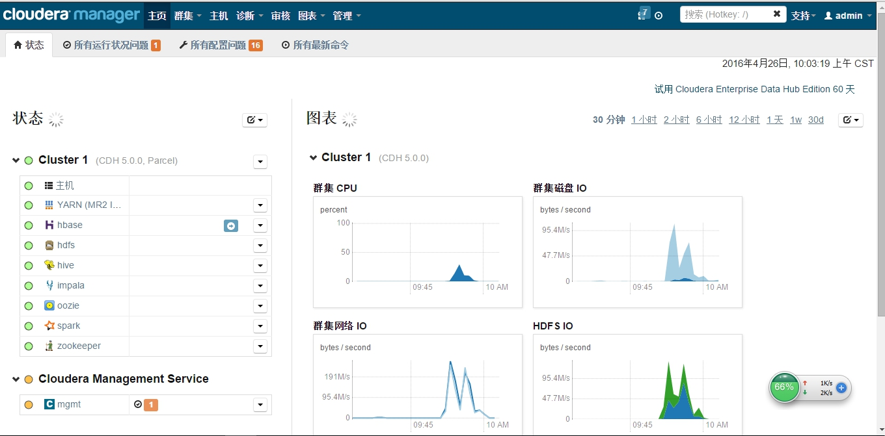
此页面展示了所有已启动的服务以及集群的性能监控信息。我们这个集群环境的版本是CDH5.0.0的，我们也可以使用cm进行在线升级。

## 二、主机

点击状态下的主机，可以看到：
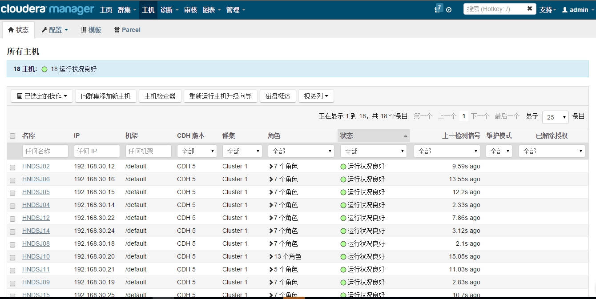
这里，我们可以看到所有的节点信息以及它上面所拥有的角色和它的状态等信息。
然后，我们点击“Parcel”可以看到：
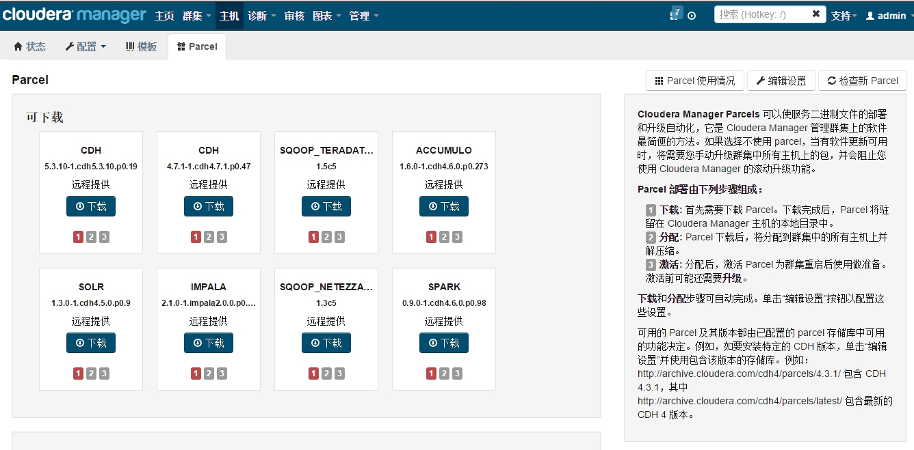
这里我们可以下载某些包，对我们的环境或某个服务进行升级。

## 三、YARN

点击状态下的YARN可以看到：
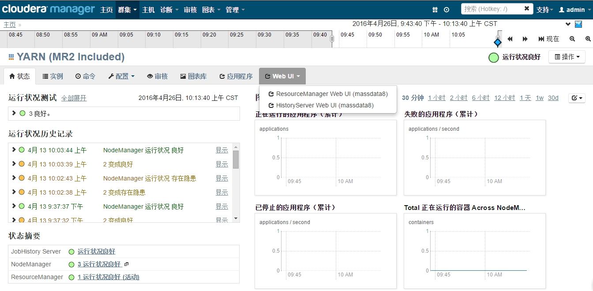
yarn是hadoop2.x中引入的，在上面可以运行MR以及其他的服务。
web ui提供了两个图形界面，首先，我们看下jobHistoryUI，如下：
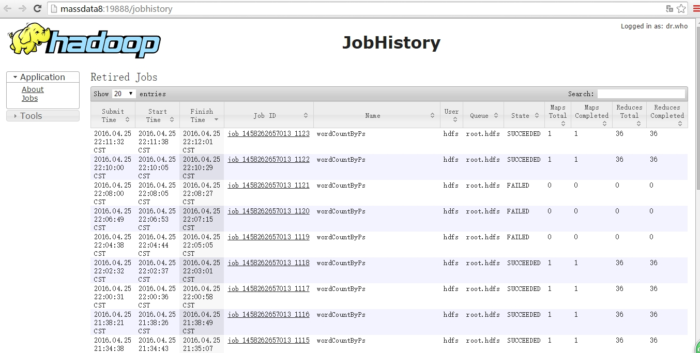
这个就是MR默认的job运行记录。再来看看resourceManagerUI，如下：
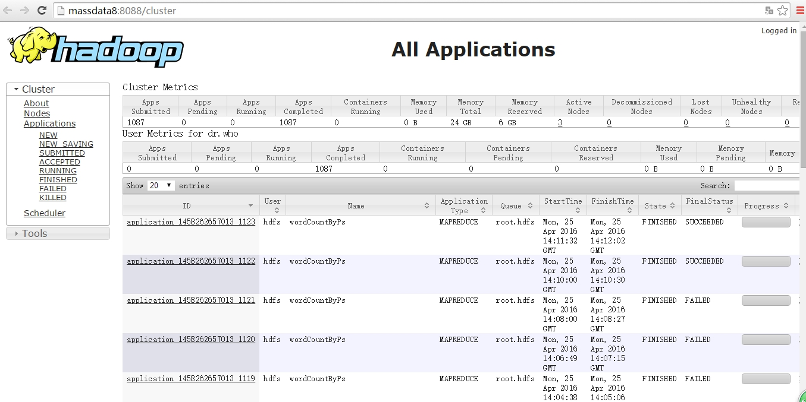
这个是YARN提供的application运行记录。

## 四、hbase

hbase是一种提供列式存储结构的服务。我们点击hbase，可以看到：
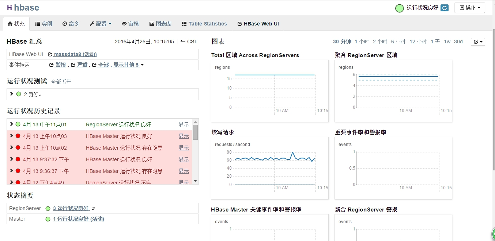
我们可以在状态摘要看到，hbase安装后拥有的服务。同时，也可以通过此图形化界面进行一些相关的配置。
接下来我们看看table statistic，如下：
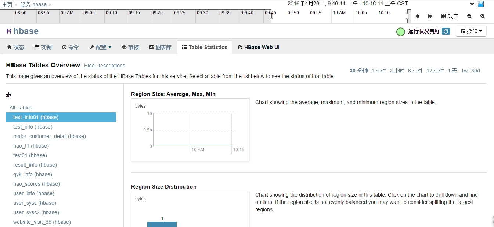
这里展示了hbase中表的统计信息。
然后，我们看看hbase web ui，可以看到：
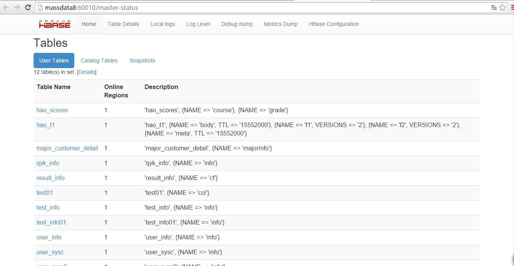
我们可以看到表的列族等信息。

## 五、hdfs

hdfs，大数据分布式文件系统，进入后，可看到：
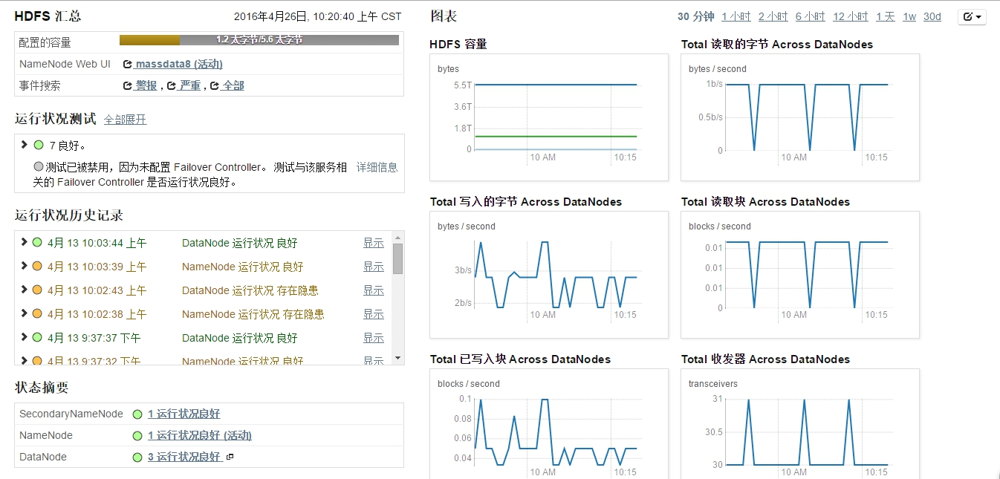
我们可以看到hdfs的容量状况，读写的情况。另外，我们进入主节点NameNode,可以浏览hdfs中的文件信息，可看到：
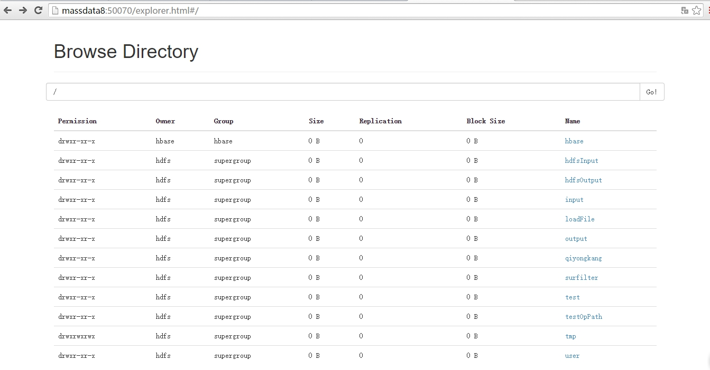

## 六、 hive

hive是大数据仓库，点击进入，便可看到：

目前，hive好像还没提供一些对表数据的图形化界面，这里就简单看一下。

## 七、impala

记得之前讲过impala与hive的区别，一个是在内存中运算，用于实时查询，另一个是启动MR运算，用于离线查询。进入impala，可以看到：
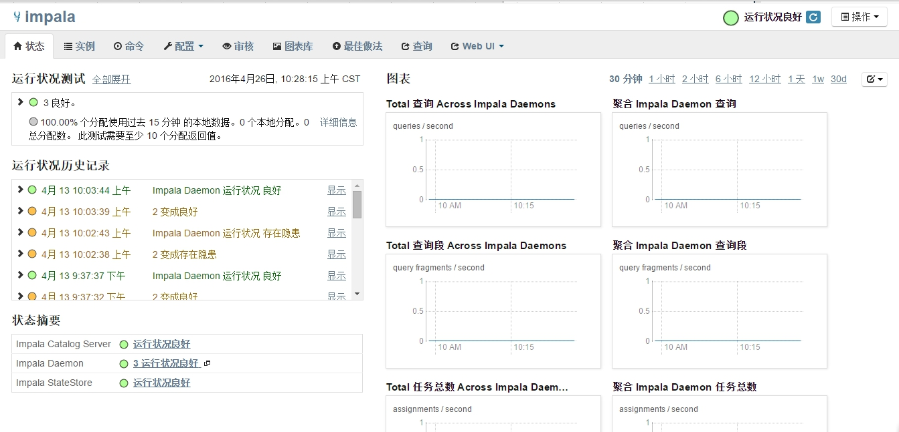
另外，我们可以点击查询，可以看到我们在impala-shell执行过的所有命令，如下：
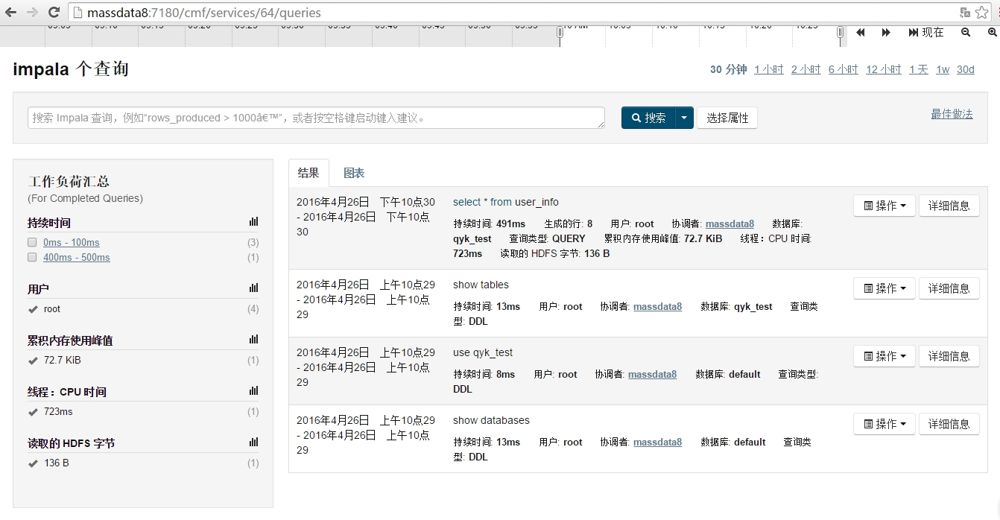

## 八、zookeeper

zookeeper，动物管理，起到协调作用。进入后，便可看到：
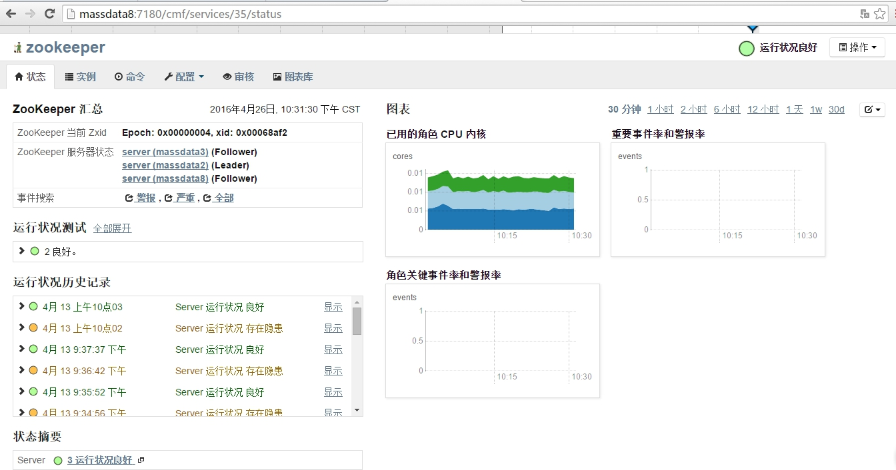
这里可以看到的服务器状态等信息。

## 九、mgmt

这个mgmt是cm自身的服务，点击进去可以看到：
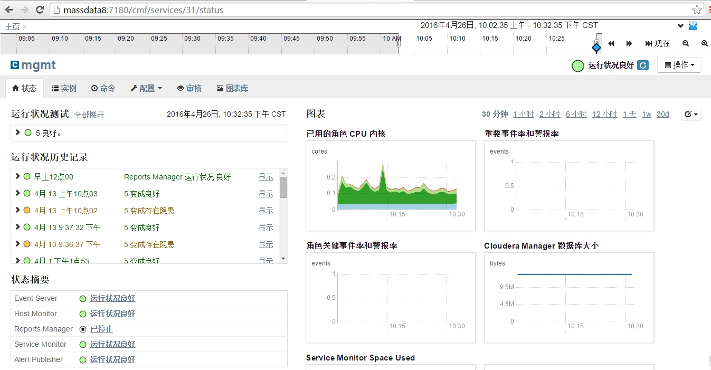
这里可以看到一些事件、主机、报告、提醒等监控服务
