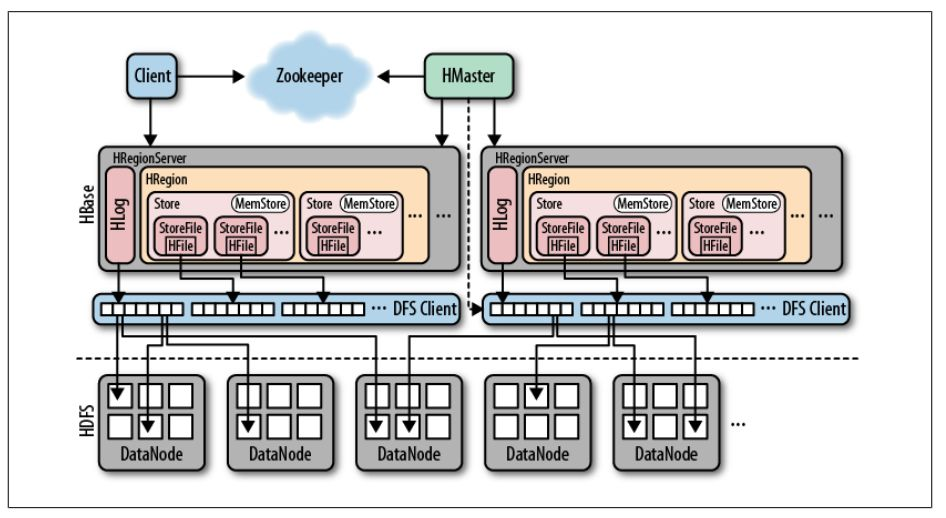
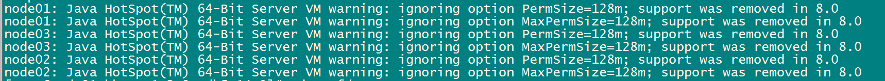
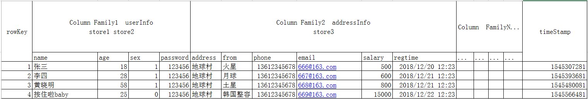
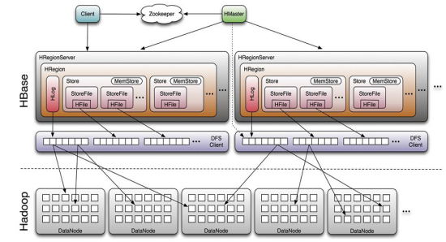
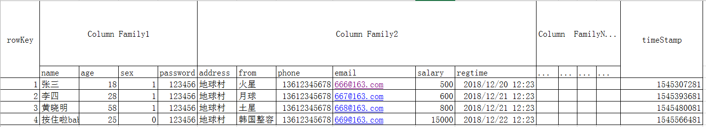
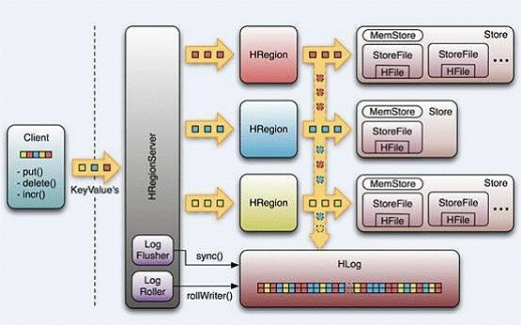
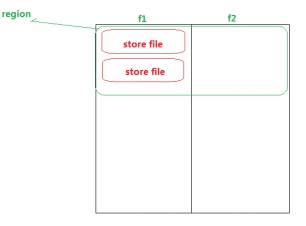
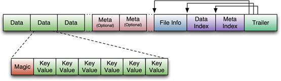
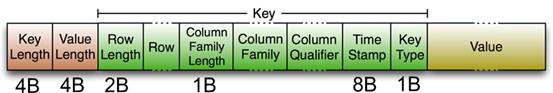

HBase

## HBase基本介绍

简介
hbase是bigtable(GFS, MapReduce,Bigtable)的开源java版本。是建立在hdfs之上，提供高可靠性、高性能、列存储、可伸缩、实时读写nosql的数据库系统。
它介于nosql和RDBMS之间，仅能通过主键(row key)和主键的range来检索数据，仅支持单行事务(可通过hive支持来实现多表join等复杂操作)。
主要用来存储结构化和半结构化的松散数据。
Hbase查询数据功能很简单，不支持join等复杂操作，不支持复杂的事务（行级的事务）
update  -100
update  +100

Hbase中支持的数据类型：byte[]
与hadoop一样，Hbase目标主要依靠横向扩展，通过不断增加廉价的商用服务器，来增加计算和存储能力。
HBase中的表一般有这样的特点：
· 大：一个表可以有上十亿行，上百万列
· 面向列:面向列(族)的存储和权限控制，列(族)独立检索。
· 稀疏:对于为空(null)的列，并不占用存储空间，因此，表可以设计的非常稀疏。

HBase的发展历程
HBase的原型是Google的BigTable论文，受到了该论文思想的启发，目前作为Hadoop的子项目来开发维护，用于支持结构化的数据存储。
官方网站：<http://hbase.apache.org>

* 2006年Google发表BigTable白皮书
* 2006年开始开发HBase
* 2008  HBase成为了 Hadoop的子项目
* 2010年HBase成为Apache顶级项目

## 2、HBase与Hadoop的关系

### 1、HDFS

* 为分布式存储提供文件系统
* 针对存储大尺寸的文件进行优化，不需要对HDFS上的文件进行随机读写
* 直接使用文件
* 数据模型不灵活
* 使用文件系统和处理框架
* 优化一次写入，多次读取的方式

### 2、HBase

* 提供表状的面向列的数据存储
* 针对表状数据的随机读写进行优化
* 使用key-value操作数据
* 提供灵活的数据模型
* 使用表状存储，支持MapReduce，依赖HDFS
* 优化了多次读，以及多次写

## 3、RDBMS与HBase的对比

### 1、关系型数据库

结构：

* 数据库以表的形式存在
* 支持FAT、NTFS、EXT、文件系统
* 使用Commit log存储日志
* 参考系统是坐标系统
* 使用主键（PK）
* 支持分区
* 使用行、列、单元格
功能：
* 支持向上扩展
* 使用SQL查询
* 面向行，即每一行都是一个连续单元
* 数据总量依赖于服务器配置
* 具有ACID支持
* 适合结构化数据
* 传统关系型数据库一般都是中心化的
* 支持事务
* 支持Join

### 2、HBase1

结构：

* 数据库以region的形式存在
* 支持HDFS文件系统
* 使用WAL（Write-Ahead Logs）存储日志
* 参考系统是Zookeeper
* 使用行键（row key）
* 支持分片
* 使用行、列、列族和单元格
功能：
* 支持向外扩展
* 使用API和MapReduce来访问HBase表数据
* 面向列，即每一列都是一个连续的单元
* 数据总量不依赖具体某台机器，而取决于机器数量
* HBase不支持ACID（Atomicity、Consistency、Isolation、Durability）
* 适合结构化数据和非结构化数据
* 一般都是分布式的
* HBase不支持复杂事务，支持的是单行数据的事务操作
* 不支持Join

## 4、HBase特征简要

1）海量存储
Hbase适合存储PB级别的海量数据，在PB级别的数据以及采用廉价PC存储的情况下，能在几十到百毫秒内返回数据。这与Hbase的极易扩展性息息相关。正式因为Hbase良好的扩展性，才为海量数据的存储提供了便利。
2）列式存储
这里的列式存储其实说的是列族存储，Hbase是根据列族来存储数据的。列族下面可以有非常多的列，列族在创建表的时候就必须指定。
3）极易扩展
Hbase的扩展性主要体现在两个方面，一个是基于上层处理能力（RegionServer）的扩展，一个是基于存储的扩展（HDFS）。
通过横向添加RegionSever的机器，进行水平扩展，提升Hbase上层的处理能力，提升Hbsae服务更多Region的能力。
备注：RegionServer的作用是管理region、承接业务的访问，这个后面会详细的介绍通过横向添加Datanode的机器，进行存储层扩容，提升Hbase的数据存储能力和提升后端存储的读写能力。
4）高并发
由于目前大部分使用Hbase的架构，都是采用的廉价PC，因此单个IO的延迟其实并不小，一般在几十到上百ms之间。这里说的高并发，主要是在并发的情况下，Hbase的单个IO延迟下降并不多。能获得高并发、低延迟的服务。
5）稀疏
稀疏主要是针对Hbase列的灵活性，在列族中，你可以指定任意多的列，在列数据为空的情况下，是不会占用存储空间的。

## 5、HBase的基础架构



### 1、HMaster

功能：

1) 监控RegionServer
2) 处理RegionServer故障转移
3) 处理元数据的变更
4) 处理region的分配或移除
5) 在空闲时间进行数据的负载均衡
6) 通过Zookeeper发布自己的位置给客户端

### 2、RegionServer

功能：

1) 负责存储HBase的实际数据
2) 处理分配给它的Region
3) 刷新缓存到HDFS
4) 维护HLog
5) 执行压缩
6) 负责处理Region分片

组件：

1) Write-Ahead logs
HBase的修改记录，当对HBase读写数据的时候，数据不是直接写进磁盘，它会在内存中保留一段时间（时间以及数据量阈值可以设定）。但把数据保存在内存中可能有更高的概率引起数据丢失，为了解决这个问题，数据会先写在一个叫做Write-Ahead logfile的文件中，然后再写入内存中。所以在系统出现故障的时候，数据可以通过这个日志文件重建。
2) HFile
这是在磁盘上保存原始数据的实际的物理文件，是实际的存储文件。
3) Store
HFile存储在Store中，一个Store对应HBase表中的一个列族。
4) MemStore
顾名思义，就是内存存储，位于内存中，用来保存当前的数据操作，所以当数据保存在WAL中之后，RegsionServer会在内存中存储键值对。
5) Region
Hbase表的分片，HBase表会根据RowKey值被切分成不同的region存储在RegionServer中，在一个RegionServer中可以有多个不同的region。

## 6、HBase的集群环境搭建

注意事项：Hbase强依赖于HDFS以及zookeeper，所以安装Hbase之前一定要保证Hadoop和zookeeper正常启动
第一步：下载对应的HBase的安装包
下载Hbase的安装包，下载地址如下：
[http://archive.apache.org/dist/hbase/2.0.0/hbase-2.0.0-bin.tar.gz](http://archive.apache.org/dist/hbase/2.0.0/hbase-2.0.0-bin.tar.gz)

```shell
#第二步：压缩包上传并解压
#将我们的压缩包上传到node01服务器的/export/softwares路径下并解压
[root@node01 ~]# cd /export/softwares/
[root@node01 ~]# tar -zxf hbase-2.0.0-bin.tar.gz -C /export/servers/
#第三步：修改配置文件
#node01机器进行修改配置文件
### 修改第一个配置文件hbase-env.sh
#注释掉HBase使用内部zk
[root@node01 softwares]# cd /export/servers/hbase-2.0.0/conf/
[root@node01 conf]# vim hbase-env.sh
# 修改以下两项
export JAVA_HOME=/export/servers/jdk1.8.0_141
export HBASE_MANAGES_ZK=false
#修改第二个配置文件hbase-site.xml
#node01机器进行修改配置文件
[root@node01 conf]# cd /export/servers/hbase-2.0.0/conf
# 注意检查以下配置信息是否与自己集群信息一样，
[root@node01 conf]# vim hbase-site.xml
```

```xml
<configuration>
        <property>
                <name>hbase.rootdir</name>
                <value>hdfs://node01:8020/hbase</value>  
        </property>

        <property>
                <name>hbase.cluster.distributed</name>
                <value>true</value>
        </property>

   <!-- 0.98后的新变动，之前版本没有.port,默认端口为60000 -->
        <property>
                <name>hbase.master.port</name>
                <value>16000</value>
        </property>

        <property>
                <name>hbase.zookeeper.quorum</name>
                <value>node01:2181,node02:2181,node03:2181</value>
        </property>

        <property>
                <name>hbase.zookeeper.property.dataDir</name>
         <value>/export/servers/zookeeper-3.4.9/zkdatas</value>
        </property>
</configuration>
```

```shell
### 修改第三个配置文件regionservers
#node01机器进行修改配置文件
[root@node01 conf]# cd /export/servers/hbase-2.0.0/conf
[root@node01 conf]# vim regionservers
node01
node02
node03
#创建back-masters配置文件，实现HMaster的高可用
#node01机器进行修改配置文件
[root@node01 conf]# cd /export/servers/hbase-2.0.0/conf
[root@node01 conf]# vim backup-masters
node02
#第四步：安装包分发到其他机器
#将我们node01服务器的hbase的安装包拷贝到其他机器上面去
[root@node01 conf]# cd /export/servers/
[root@node01 servers]# scp -r hbase-2.0.0/ node02:$PWD
[root@node01 servers]# scp -r hbase-2.0.0/ node03:$PWD
#第五步：三台机器创建软连接
#因为hbase需要读取hadoop的core-site.xml以及hdfs-site.xml当中的配置文件信息，所以我们三台机器都要执行以下命令创建软连接
# 先确定路径是正确的
# node01 节点
[root@node01 servers]# ln -s /export/servers/hadoop-2.7.5/etc/hadoop/core-site.xml /export/servers/hbase-2.0.0/conf/core-site.xml
[root@node01 servers]# ln -s /export/servers/hadoop-2.7.5/etc/hadoop/hdfs-site.xml /export/servers/hbase-2.0.0/conf/hdfs-site.xml
# node02 节点
[root@node02 servers]# ln -s /export/servers/hadoop-2.7.5/etc/hadoop/core-site.xml /export/servers/hbase-2.0.0/conf/core-site.xml
[root@node02 servers]# ln -s /export/servers/hadoop-2.7.5/etc/hadoop/hdfs-site.xml /export/servers/hbase-2.0.0/conf/hdfs-site.xml
# node03 节点
[root@node03 servers]# ln -s /export/servers/hadoop-2.7.5/etc/hadoop/core-site.xml /export/servers/hbase-2.0.0/conf/core-site.xml
[root@node03 servers]# ln -s /export/servers/hadoop-2.7.5/etc/hadoop/hdfs-site.xml /export/servers/hbase-2.0.0/conf/hdfs-site.xml
# 第六步：三台机器添加HBASE_HOME的环境变量
#三台机器执行以下命令，添加HBASE_HOME环境变量
[root@node01 servers]# vim /etc/profile
vim /etc/profile
export HBASE_HOME=/export/servers/hbase-2.0.0
export PATH=:$HBASE_HOME/bin:$PATH
# node02 节点
[root@node02 servers]# vim /etc/profile
# node03 节点
[root@node03 servers]# vim /etc/profile
#第七步：HBase集群启动
#第一台机器执行以下命令进行启动
[root@node01 servers]# cd /export/servers/hbase-2.0.0
[root@node01 hbase-2.0.0]# bin/start-hbase.sh
SLF4J: See http://www.slf4j.org/codes.html#multiple_bindings for an explanation.
SLF4J: Actual binding is of type [org.slf4j.impl.Log4jLoggerFactory]
node03: running regionserver, logging to /export/servers/hbase-2.0.0/bin/../logs/hbase-root-regionserver-node03.out
node01: running regionserver, logging to /export/servers/hbase-2.0.0/bin/../logs/hbase-root-regionserver-node01.out
node02: running regionserver, logging to /export/servers/hbase-2.0.0/bin/../logs/hbase-root-regionserver-node02.out
node02: master running as process 38061. Stop it first.
```

警告提示：HBase启动的时候会产生一个警告，这是因为jdk7与jdk8的问题导致的，如果linux服务器安装jdk8就会产生这样的一个警告

我们可以只是掉所有机器的hbase-env.sh当中的
"HBASE_MASTER_OPTS"和"HBASE_REGIONSERVER_OPTS"配置 来解决这个问题。不过警告不影响我们正常运行，可以不用解决
另外一种启动方式：
我们也可以执行以下命令单节点进行启动

```shell
#启动HMaster命令
bin/hbase-daemon.sh start master
#启动HRegionServer命令
bin/hbase-daemon.sh start regionserver
```

 第八步：页面访问

浏览器页面访问
[http://node01:16010/master-status](http://node01:16010/master-status)

 HBASE的表模型基本介绍



## 7、HBase常用shell操作

1、进入HBase客户端命令操作界面
node01服务器执行以下命令进入hbase的shell客户端

```shell
[root@node01 hbase-2.0.0]# cd /export/servers/hbase-2.0.0/
[root@node01 hbase-2.0.0]# bin/hbase shell
#2、查看帮助命令
hbase(main):001:0> help
## 3、查看当前数据库中有哪些表
hbase(main):002:0> list
TABLE
0 row(s)
Took 1.1099 seconds
=> []
## 4、创建一张表
#创建user表，包含info、data两个列族
hbase(main):010:0> create 'user', 'info', 'data'
Created table user
Took 0.8660 seconds
=> Hbase::Table - user
#或者
hbase(main):003:0> create 'user3',{NAME=>'info',VERSIONS=>'3'},{NAME=>'data'}
Created table user3
Took 1.2849 seconds
=> Hbase::Table - user3
# 查询所有的表
hbase(main):004:0> list
TABLE
user
user2
user3
3 row(s)
Took 0.0427 seconds
=> ["user", "user2", "user3"]
```

### 添加数据操作

```shell
#向user表中插入信息，row key为rk0001，列族info中添加name列标示符，值为zhangsan
hbase(main):005:0> put 'user','rk0001','info:name','zhangsan'
Took 0.4458 seconds  
#向user表中插入信息，row key为rk0001，列族info中添加gender列标示符，值为female
hbase(main):006:0> put 'user','rk0001','info:gender','female'
Took 0.0554 seconds
#向user表中插入信息，row key为rk0001，列族info中添加age列标示符，值为20
hbase(main):008:0> put 'user','rk0001','info:age',20
Took 0.0259 seconds
#向user表中插入信息，row key为rk0001，列族data中添加pic列标示符，值为picture
hbase(main):009:0> put 'user','rk0001','data:pic','picture'
Took 0.0254 seconds
```

### 查询数据操作

```sql
--6、查询数据操作
--1、通过rowkey进行查询
--获取user表中row key为rk0001的所有信息
hbase(main):010:0> get 'user','rk0001'
COLUMN                            CELL
 data:pic                         timestamp=1566887431434, value=picture
 info:age                         timestamp=1566887353937, value=20
 info:gender                      timestamp=1566887288067, value=female
 info:name                        timestamp=1566887145499, value=zhangsan
1 row(s)
Took 0.1571 seconds
--2、查看rowkey下面的某个列族的信息
--获取user表中row key为rk0001，info列族的所有信息
hbase(main):011:0> get 'user','rk0001','info'
COLUMN                            CELL
 info:age                         timestamp=1566887353937, value=20
 info:gender                      timestamp=1566887288067, value=female
 info:name                        timestamp=1566887145499, value=zhangsan
1 row(s)
Took 0.0818 seconds
--3、查看rowkey指定列族指定字段的值
--获取user表中row key为rk0001，info列族的name、age列标示符的信息
hbase(main):013:0> get 'user','rk0001','info:name','info:age'
COLUMN                            CELL
 info:age                         timestamp=1566887353937, value=20
 info:name                        timestamp=1566887145499, value=zhangsan
1 row(s)
Took 0.0474 seconds
--4、查看rowkey指定多个列族的信息
--获取user表中row key为rk0001，info、data列族的信息
hbase(main):018:0> get 'user', 'rk0001', 'info', 'data'
hbase(main):012:0> get 'user','rk0001','info','data'
COLUMN                            CELL
 data:pic                         timestamp=1566887431434, value=picture
 info:age                         timestamp=1566887353937, value=20
 info:gender                      timestamp=1566887288067, value=female
 info:name                        timestamp=1566887145499, value=zhangsan
1 row(s)
Took 0.0379 seconds  
--或者你也可以这样写
hbase(main):015:0> get 'user','rk0001',{COLUMN=>['info','data']}
COLUMN                            CELL
 data:pic                         timestamp=1566887431434, value=picture
 info:age                         timestamp=1566887353937, value=20
 info:gender                      timestamp=1566887288067, value=female
 info:name                        timestamp=1566887145499, value=zhangsan
1 row(s)
Took 0.0267 seconds
--或者你也可以这样写，也行
hbase(main):016:0> get 'user','rk0001',{COLUMN=>['info:name','data:pic']}
COLUMN                            CELL
 data:pic                         timestamp=1566887431434, value=picture
 info:name                        timestamp=1566887145499, value=zhangsan
1 row(s)
Took 0.0356 seconds  
--4、指定rowkey与列值查询
--获取user表中row key为rk0001，cell的值为zhangsan的信息
hbase(main):017:0> get  'user','rk0001',{FILTER=>"ValueFilter(=,'binary:zhangsan')"}
COLUMN                            CELL
 info:name                        timestamp=1566887145499, value=zhangsan
1 row(s)
Took 0.1793 seconds  
--5、指定rowkey与列值模糊查询
--获取user表中row key为rk0001，列标示符中含有a的信息
hbase(main):019:0> get 'user', 'rk0001', {FILTER => "(QualifierFilter(=,'substring:a'))"}
COLUMN                            CELL
 info:age                         timestamp=1566887353937, value=20
 info:name                        timestamp=1566887145499, value=zhangsan
1 row(s)
Took 0.0374 seconds  
--继续插入一批数据
hbase(main):020:0> put 'user', 'rk0002', 'info:name', 'fanbingbing'
Took 0.0178 seconds
hbase(main):021:0> put 'user', 'rk0002', 'info:gender', 'female'
Took 0.0284 seconds
hbase(main):022:0> put 'user', 'rk0002', 'info:nationality', '中国'
Took 0.0293 seconds
hbase(main):023:0> get 'user', 'rk0002', {FILTER => "ValueFilter(=, 'binary:中国')"}
COLUMN                            CELL
 info:nationality                 timestamp=1566888416807, value=\xE4\xB8\xAD\xE5\x9B\xBD
1 row(s)
Took 0.0236 seconds
--6、查询所有数据
--查询user表中的所有信息
--scan 'user'
hbase(main):024:0> scan 'user'
ROW                               COLUMN+CELL
 rk0001                           column=data:pic, timestamp=1566887431434, value=picture
 rk0001                           column=info:age, timestamp=1566887353937, value=20
 rk0001                           column=info:gender, timestamp=1566887288067, value=female
 rk0001                           column=info:name, timestamp=1566887145499, value=zhangsan
 rk0002                           column=info:gender, timestamp=1566888412578, value=female
 rk0002                           column=info:name, timestamp=1566888407185, value=fanbingbing
 rk0002                           column=info:nationality, timestamp=1566888416807, value=\xE4\xB8\xAD\xE5\x9B\xBD
2 row(s)
Took 0.0517 seconds
--7、列族查询
--查询user表中列族为info的信息
--scan 'user', {COLUMNS => 'info'}
hbase(main):025:0> scan 'user',{COLUMNS=>'info'}
ROW                               COLUMN+CELL
 rk0001                           column=info:age, timestamp=1566887353937, value=20
 rk0001                           column=info:gender, timestamp=1566887288067, value=female
 rk0001                           column=info:name, timestamp=1566887145499, value=zhangsan
 rk0002                           column=info:gender, timestamp=1566888412578, value=female
 rk0002                           column=info:name, timestamp=1566888407185, value=fanbingbing
 rk0002                           column=info:nationality, timestamp=1566888416807, value=\xE4\xB8\xAD\xE5\x9B\xBD
2 row(s)
Took 0.0636 seconds
hbase(main):026:0> scan 'user',{COLUMNS=>'info',RAW=>true,VERSIONS=>5}
ROW                               COLUMN+CELL
 rk0001                           column=info:age, timestamp=1566887353937, value=20
 rk0001                           column=info:gender, timestamp=1566887288067, value=female
 rk0001                           column=info:name, timestamp=1566887145499, value=zhangsan
 rk0002                           column=info:gender, timestamp=1566888412578, value=female
 rk0002                           column=info:name, timestamp=1566888407185, value=fanbingbing
 rk0002                           column=info:nationality, timestamp=1566888416807, value=\xE4\xB8\xAD\xE5\x9B\xBD
2 row(s)
Took 0.0217 seconds  
hbase(main):029:0> scan 'user',{COLUMNS=>'info',RAW=>true,VERSIONS=>3}
ROW                               COLUMN+CELL
 rk0001                           column=info:age, timestamp=1566887353937, value=20
 rk0001                           column=info:gender, timestamp=1566887288067, value=female
 rk0001                           column=info:name, timestamp=1566887145499, value=zhangsan
 rk0002                           column=info:gender, timestamp=1566888412578, value=female
 rk0002                           column=info:name, timestamp=1566888407185, value=fanbingbing
 rk0002                           column=info:nationality, timestamp=1566888416807, value=\xE4\xB8\xAD\xE5\x9B\xBD
2 row(s)
Took 0.0797 seconds  
--8、多列族查询
--查询user表中列族为info和data的信息
hbase(main):028:0> scan 'user',{COLUMNS=>['info','data']}
ROW                               COLUMN+CELL
 rk0001                           column=data:pic, timestamp=1566887431434, value=picture
 rk0001                           column=info:age, timestamp=1566887353937, value=20
 rk0001                           column=info:gender, timestamp=1566887288067, value=female
 rk0001                           column=info:name, timestamp=1566887145499, value=zhangsan
 rk0002                           column=info:gender, timestamp=1566888412578, value=female
 rk0002                           column=info:name, timestamp=1566888407185, value=fanbingbing
 rk0002                           column=info:nationality, timestamp=1566888416807, value=\xE4\xB8\xAD\xE5\x9B\xBD
2 row(s)
Took 0.0301 seconds  
hbase(main):030:0> scan 'user',{COLUMNS=>['info:name','data:pic']}
ROW                               COLUMN+CELL
 rk0001                           column=data:pic, timestamp=1566887431434, value=picture
 rk0001                           column=info:name, timestamp=1566887145499, value=zhangsan
 rk0002                           column=info:name, timestamp=1566888407185, value=fanbingbing
2 row(s)
Took 0.0690 seconds
--9、指定列族与某个列名查询
--查询user表中列族为info、列标示符为name的信息
hbase(main):031:0> scan 'user',{COLUMNS=>'info:name'}
ROW                               COLUMN+CELL
 rk0001                           column=info:name, timestamp=1566887145499, value=zhangsan
 rk0002                           column=info:name, timestamp=1566888407185, value=fanbingbing
2 row(s)
Took 0.0257 seconds
--10、指定列族与列名以及限定版本查询
--查询user表中列族为info、列标示符为name的信息,并且版本最新的5个
hbase(main):032:0> scan 'user',{COLUMNS=>'info:name',VERSIONS=>5}
ROW                               COLUMN+CELL
 rk0001                           column=info:name, timestamp=1566887145499, value=zhangsan
 rk0002                           column=info:name, timestamp=1566888407185, value=fanbingbing
2 row(s)
Took 0.0162 seconds
--11、指定多个列族与按照数据值模糊查询
--查询user表中列族为info和data且列标示符中含有a字符的信息
hbase(main):033:0> scan 'user', {COLUMNS => ['info', 'data'], FILTER => "(QualifierFilter(=,'substring:a'))"}
ROW                               COLUMN+CELL
 rk0001                           column=info:age, timestamp=1566887353937, value=20
 rk0001                           column=info:name, timestamp=1566887145499, value=zhangsan
 rk0002                           column=info:name, timestamp=1566888407185, value=fanbingbing
 rk0002                           column=info:nationality, timestamp=1566888416807, value=\xE4\xB8\xAD\xE5\x9B\xBD
2 row(s)
Took 0.0465 seconds  
--12、rowkey的范围值查询
--查询user表中列族为info，rk范围是[rk0001, rk0003)的数据
hbase(main):034:0> scan 'user', {COLUMNS => 'info', STARTROW => 'rk0001', ENDROW => 'rk0003'}
ROW                               COLUMN+CELL
 rk0001                           column=info:age, timestamp=1566887353937, value=20
 rk0001                           column=info:gender, timestamp=1566887288067, value=female
 rk0001                           column=info:name, timestamp=1566887145499, value=zhangsan
 rk0002                           column=info:gender, timestamp=1566888412578, value=female
 rk0002                           column=info:name, timestamp=1566888407185, value=fanbingbing
 rk0002                           column=info:nationality, timestamp=1566888416807, value=\xE4\xB8\xAD\xE5\x9B\xBD
2 row(s)
Took 0.0129 seconds
--13、指定rowkey模糊查询
--查询user表中row key以rk字符开头的
hbase(main):035:0> scan 'user',{FILTER=>"PrefixFilter('rk')"}
ROW                               COLUMN+CELL
 rk0001                           column=data:pic, timestamp=1566887431434, value=picture
 rk0001                           column=info:age, timestamp=1566887353937, value=20
 rk0001                           column=info:gender, timestamp=1566887288067, value=female
 rk0001                           column=info:name, timestamp=1566887145499, value=zhangsan
 rk0002                           column=info:gender, timestamp=1566888412578, value=female
 rk0002                           column=info:name, timestamp=1566888407185, value=fanbingbing
 rk0002                           column=info:nationality, timestamp=1566888416807, value=\xE4\xB8\xAD\xE5\x9B\xBD
2 row(s)
Took 0.0392 seconds  
--14、指定数据范围值查询
--查询user表中指定范围的数据,条件是时间
hbase(main):037:0> scan 'user', {TIMERANGE => [1566887431434, 1566888416807]}
ROW                               COLUMN+CELL
 rk0001                           column=data:pic, timestamp=1566887431434, value=picture
 rk0002                           column=info:gender, timestamp=1566888412578, value=female
 rk0002                           column=info:name, timestamp=1566888407185, value=fanbingbing
2 row(s)
Took 0.0252 seconds
```

### 更新数据操作

```sql
--1、更新数据值
--更新操作同插入操作一模一样，只不过有数据就更新，没数据就添加
--2、更新版本号
--将user表的f1列族版本号改为5
hbase(main):040:0> alter 'user',NAME=>'info',VERSIONS=>5
Updating all regions with the new schema...
1/1 regions updated.
Done.
Took 2.7114 seconds
```

### 删除数据以及删除表操作

```sql
--1、指定rowkey以及列名进行删除
--删除user表row key为rk0001，列标示符为info:name的数据
hbase(main):041:0> delete 'user', 'rk0001', 'info:name'
Took 0.0910 seconds
--2、指定rowkey，列名以及字段值进行删除
--删除user表row key为rk0001，列标示符为info:name，timestamp为1566887431434的数据
hbase(main):042:0> delete 'user', 'rk0001', 'info:name', 1566887431434
Took 0.0255 seconds
--3、删除一个列族
--删除一个列族：
alter 'user', NAME => 'info', METHOD => 'delete'
或 alter 'user', 'delete' => 'info'
--4、清空表数据
hbase(main):017:0> truncate 'user'
--5、删除表
--首先需要先让该表为disable状态，使用命令：
hbase(main):049:0> disable 'user'
--然后才能drop这个表，使用命令：
 hbase(main):050:0> drop 'user'
-- (注意：如果直接drop表，会报错：Drop the named table. Table must first be disabled)
--9、统计一张表有多少行数据
hbase(main):043:0> count 'user'
2 row(s)
Took 0.0727 seconds
=> 2
```

## 8、HBase的高级shell管理命令

```sql
--1、status
--例如：显示服务器状态
hbase(main):044:0> status 'node01'
1 active master, 1 backup masters, 3 servers, 0 dead, 1.6667 average load
Took 0.1548 seconds
--2、whoami
--显示HBase当前用户，例如：
hbase(main):045:0> whoami
root (auth:SIMPLE)
    groups: root
Took 0.0182 seconds
--3、list
hbase(main):046:0> list
TABLE
user
user2
user3
3 row(s)
Took 0.0323 seconds
=> ["user", "user2", "user3"]
--显示当前所有的表
--4、count
--统计指定表的记录数，例如：
hbase(main):048:0> count 'user'
2 row(s)
Took 0.0234 seconds
=> 2
--5、describe
--展示表结构信息
hbase(main):049:0> describe 'user'
Table user is ENABLED
user
COLUMN FAMILIES DESCRIPTION
{NAME => 'data', VERSIONS => '1', EVICT_BLOCKS_ON_CLOSE => 'false', NEW_VERSION_BEHAVIOR => 'false', KEEP_DELETED_CELLS => 'FALSE
', CACHE_DATA_ON_WRITE => 'false', DATA_BLOCK_ENCODING => 'NONE', TTL => 'FOREVER', MIN_VERSIONS => '0', REPLICATION_SCOPE => '0'
, BLOOMFILTER => 'ROW', CACHE_INDEX_ON_WRITE => 'false', IN_MEMORY => 'false', CACHE_BLOOMS_ON_WRITE => 'false', PREFETCH_BLOCKS_
ON_OPEN => 'false', COMPRESSION => 'NONE', BLOCKCACHE => 'true', BLOCKSIZE => '65536'}
{NAME => 'info', VERSIONS => '5', EVICT_BLOCKS_ON_CLOSE => 'false', NEW_VERSION_BEHAVIOR => 'false', KEEP_DELETED_CELLS => 'FALSE
', CACHE_DATA_ON_WRITE => 'false', DATA_BLOCK_ENCODING => 'NONE', TTL => 'FOREVER', MIN_VERSIONS => '0', REPLICATION_SCOPE => '0'
, BLOOMFILTER => 'ROW', CACHE_INDEX_ON_WRITE => 'false', IN_MEMORY => 'false', CACHE_BLOOMS_ON_WRITE => 'false', PREFETCH_BLOCKS_
ON_OPEN => 'false', COMPRESSION => 'NONE', BLOCKCACHE => 'true', BLOCKSIZE => '65536'}
2 row(s)
Took 0.0691 seconds  

6、exists
--检查表是否存在，适用于表量特别多的情况
hbase(main):050:0> exists 'user'
Table user does exist
Took 0.0199 seconds
=> true
--7、is_enabled、is_disabled
--检查表是否启用或禁用
hbase(main):051:0> is_enabled 'user'
true
Took 0.0513 seconds
=> true
hbase(main):053:0> is_disabled 'user'
false
Took 0.0255 seconds
=> 1
--8、alter
--该命令可以改变表和列族的模式，例如：
--为当前表增加列族：
hbase(main):054:0> alter 'user',NAME=>'CF2',VERSIONS=>2
Updating all regions with the new schema...
1/1 regions updated.
Done.
Took 2.1566 seconds
--为当前表删除列族：
hbase(main):055:0> alter 'user','delete'=>'CF2'
Updating all regions with the new schema...
1/1 regions updated.
Done.
Took 1.9778 seconds
--9、disable/enable
--禁用一张表/启用一张表
hbase(main):056:0> disable 'user2'
Took 0.5492 seconds
hbase(main):057:0> enable 'user2'
Took 0.8069 seconds
--10、drop
--删除一张表，记得在删除表之前必须先禁用
hbase(main):058:0> drop 'user2'
ERROR: Table user2 is enabled. Disable it first.
Drop the named table. Table must first be disabled:
  hbase> drop 't1'
  hbase> drop 'ns1:t1'
Took 0.0321 seconds
hbase(main):059:0> disable 'user2'
Took 0.4617 seconds
hbase(main):060:0> drop 'user2'
Took 0.5268 seconds
--11、truncate
--禁用表-删除表-创建表
hbase(main):061:0> truncate 'user3'
Truncating 'user3' table (it may take a while):
Disabling table...
Truncating table...
Took 1.2856 seconds
```

## 9、HBase的java代码开发

熟练掌握通过使用java代码实现HBase数据库当中的数据增删改查的操作，特别是各种查询，熟练运用

### 第一步：创建maven工程，导入jar包

```xml
    <dependencies>
       <!-- https://mvnrepository.com/artifact/org.apache.hbase/hbase-client -->
<dependency>
    <groupId>org.apache.hbase</groupId>
    <artifactId>hbase-client</artifactId>
    <version>2.0.0</version>
</dependency>
<!-- https://mvnrepository.com/artifact/org.apache.hbase/hbase-server -->
<dependency>
                <groupId>org.apache.hbase</groupId>
                <artifactId>hbase-server</artifactId>
                <version>2.0.0</version>
</dependency>

        <dependency>
            <groupId>junit</groupId>
            <artifactId>junit</artifactId>
            <version>4.12</version>
            <scope>test</scope>
        </dependency>
        <dependency>
            <groupId>org.testng</groupId>
            <artifactId>testng</artifactId>
            <version>6.14.3</version>
            <scope>test</scope>
        </dependency>
    </dependencies>

    <build>
        <plugins>
            <plugin>
                <groupId>org.apache.maven.plugins</groupId>
                <artifactId>maven-compiler-plugin</artifactId>
                <version>3.0</version>
                <configuration>
                    <source>1.8</source>
                    <target>1.8</target>
                    <encoding>UTF-8</encoding>
                    <!--  <verbal>true</verbal>-->
                </configuration>
            </plugin>
        </plugins>
    </build>
```

### 第二步：开发javaAPI操作HBase表数据

### 1、创建表myuser，并且带有两个列族f1,f2

```java
@Test
    public void createTable() throws IOException {
        //创建配置文件对象，并指定zookeeper的连接地址
        Configuration configuration = HBaseConfiguration.create();
        configuration.set("hbase.zookeeper.property.clientPort", "2181");
        configuration.set("hbase.zookeeper.quorum", "node01,node02,node03");
        //集群配置↓
        //configuration.set("hbase.zookeeper.quorum", "101.236.39.141,101.236.46.114,101.236.46.113");
        configuration.set("hbase.master", "node01:60000");

        Connection connection = ConnectionFactory.createConnection(configuration);
        Admin admin = connection.getAdmin();
        //通过HTableDescriptor来实现我们表的参数设置，包括表名，列族等等
        HTableDescriptor hTableDescriptor = new HTableDescriptor(TableName.valueOf("myuser"));
        //添加列族
        hTableDescriptor.addFamily(new HColumnDescriptor("f1"));
        //添加列族
        hTableDescriptor.addFamily(new HColumnDescriptor("f2"));
        //创建表
        boolean myuser = admin.tableExists(TableName.valueOf("myuser"));
        if(!myuser){
            admin.createTable(hTableDescriptor);
        }
        //关闭客户端连接
        admin.close();
    }
```

### 2、向表中添加数据

```java
/**
     * 插入数据
     */
    @Test
    public  void  addDatas() throws IOException {
        //获取连接
        Configuration configuration = HBaseConfiguration.create();
        configuration.set("hbase.zookeeper.quorum", "node01:2181,node02:2181");
        Connection connection = ConnectionFactory.createConnection(configuration);
        //获取表
        Table myuser = connection.getTable(TableName.valueOf("myuser"));
        //创建put对象，并指定rowkey
        Put put = new Put("0001".getBytes());
        put.addColumn("f1".getBytes(),"id".getBytes(), Bytes.toBytes(1));
        put.addColumn("f1".getBytes(),"name".getBytes(), Bytes.toBytes("张三"));
        put.addColumn("f1".getBytes(),"age".getBytes(), Bytes.toBytes(18));
        put.addColumn("f2".getBytes(),"address".getBytes(), Bytes.toBytes("地球人"));
        put.addColumn("f2".getBytes(),"phone".getBytes(), Bytes.toBytes("15874102589"));
        //插入数据
        myuser.put(put);
        //关闭表
        myuser.close();
    }
```

### 3、查询数据

#### 初始化一批数据到HBase当中用于查询

```java
@Test
    public void insertBatchData() throws IOException {

        //获取连接
        Configuration configuration = HBaseConfiguration.create();
        configuration.set("hbase.zookeeper.quorum", "node01:2181,node02:2181");
        Connection connection = ConnectionFactory.createConnection(configuration);
        //获取表
        Table myuser = connection.getTable(TableName.valueOf("myuser"));
        //创建put对象，并指定rowkey
        Put put = new Put("0002".getBytes());
        put.addColumn("f1".getBytes(),"id".getBytes(),Bytes.toBytes(1));
        put.addColumn("f1".getBytes(),"name".getBytes(),Bytes.toBytes("曹操"));
        put.addColumn("f1".getBytes(),"age".getBytes(),Bytes.toBytes(30));
        put.addColumn("f2".getBytes(),"sex".getBytes(),Bytes.toBytes("1"));
        put.addColumn("f2".getBytes(),"address".getBytes(),Bytes.toBytes("沛国谯县"));
        put.addColumn("f2".getBytes(),"phone".getBytes(),Bytes.toBytes("16888888888"));
        put.addColumn("f2".getBytes(),"say".getBytes(),Bytes.toBytes("helloworld"));

        Put put2 = new Put("0003".getBytes());
        put2.addColumn("f1".getBytes(),"id".getBytes(),Bytes.toBytes(2));
        put2.addColumn("f1".getBytes(),"name".getBytes(),Bytes.toBytes("刘备"));
        put2.addColumn("f1".getBytes(),"age".getBytes(),Bytes.toBytes(32));
        put2.addColumn("f2".getBytes(),"sex".getBytes(),Bytes.toBytes("1"));
        put2.addColumn("f2".getBytes(),"address".getBytes(),Bytes.toBytes("幽州涿郡涿县"));
        put2.addColumn("f2".getBytes(),"phone".getBytes(),Bytes.toBytes("17888888888"));
        put2.addColumn("f2".getBytes(),"say".getBytes(),Bytes.toBytes("talk is cheap , show me the code"));


        Put put3 = new Put("0004".getBytes());
        put3.addColumn("f1".getBytes(),"id".getBytes(),Bytes.toBytes(3));
        put3.addColumn("f1".getBytes(),"name".getBytes(),Bytes.toBytes("孙权"));
        put3.addColumn("f1".getBytes(),"age".getBytes(),Bytes.toBytes(35));
        put3.addColumn("f2".getBytes(),"sex".getBytes(),Bytes.toBytes("1"));
        put3.addColumn("f2".getBytes(),"address".getBytes(),Bytes.toBytes("下邳"));
        put3.addColumn("f2".getBytes(),"phone".getBytes(),Bytes.toBytes("12888888888"));
        put3.addColumn("f2".getBytes(),"say".getBytes(),Bytes.toBytes("what are you 弄啥嘞！"));

        Put put4 = new Put("0005".getBytes());
        put4.addColumn("f1".getBytes(),"id".getBytes(),Bytes.toBytes(4));
        put4.addColumn("f1".getBytes(),"name".getBytes(),Bytes.toBytes("诸葛亮"));
        put4.addColumn("f1".getBytes(),"age".getBytes(),Bytes.toBytes(28));
        put4.addColumn("f2".getBytes(),"sex".getBytes(),Bytes.toBytes("1"));
        put4.addColumn("f2".getBytes(),"address".getBytes(),Bytes.toBytes("四川隆中"));
        put4.addColumn("f2".getBytes(),"phone".getBytes(),Bytes.toBytes("14888888888"));
        put4.addColumn("f2".getBytes(),"say".getBytes(),Bytes.toBytes("出师表你背了嘛"));

        Put put5 = new Put("0005".getBytes());
        put5.addColumn("f1".getBytes(),"id".getBytes(),Bytes.toBytes(5));
        put5.addColumn("f1".getBytes(),"name".getBytes(),Bytes.toBytes("司马懿"));
        put5.addColumn("f1".getBytes(),"age".getBytes(),Bytes.toBytes(27));
        put5.addColumn("f2".getBytes(),"sex".getBytes(),Bytes.toBytes("1"));
        put5.addColumn("f2".getBytes(),"address".getBytes(),Bytes.toBytes("哪里人有待考究"));
        put5.addColumn("f2".getBytes(),"phone".getBytes(),Bytes.toBytes("15888888888"));
        put5.addColumn("f2".getBytes(),"say".getBytes(),Bytes.toBytes("跟诸葛亮死掐"));


        Put put6 = new Put("0006".getBytes());
        put6.addColumn("f1".getBytes(),"id".getBytes(),Bytes.toBytes(5));
        put6.addColumn("f1".getBytes(),"name".getBytes(),Bytes.toBytes("xiaobubu—吕布"));
        put6.addColumn("f1".getBytes(),"age".getBytes(),Bytes.toBytes(28));
        put6.addColumn("f2".getBytes(),"sex".getBytes(),Bytes.toBytes("1"));
        put6.addColumn("f2".getBytes(),"address".getBytes(),Bytes.toBytes("内蒙人"));
        put6.addColumn("f2".getBytes(),"phone".getBytes(),Bytes.toBytes("15788888888"));
        put6.addColumn("f2".getBytes(),"say".getBytes(),Bytes.toBytes("貂蝉去哪了"));

        List<Put> listPut = new ArrayList<Put>();
        listPut.add(put);
        listPut.add(put2);
        listPut.add(put3);
        listPut.add(put4);
        listPut.add(put5);
        listPut.add(put6);

        myuser.put(listPut);
        myuser.close();
    }

```

#### 按照rowkey进行查询获取所有列的所有值

```java
按照rowkey进行查询获取所有列的所有值
查询主键rowkey为0003的人
/
     * 查询数据，按照主键id进行查询
     */
    @Test
    public  void searchData() throws IOException {
        Configuration configuration = HBaseConfiguration.create();
        configuration.set("hbase.zookeeper.quorum","node01:2181,node02:2181,node03:2181");
        Connection connection = ConnectionFactory.createConnection(configuration);
        Table myuser = connection.getTable(TableName.valueOf("myuser"));

        Get get = new Get(Bytes.toBytes("0003"));
        Result result = myuser.get(get);
        Cell[] cells = result.rawCells();
        //获取所有的列名称以及列的值
        for (Cell cell : cells) {
            //注意，如果列属性是int类型，那么这里就不会显示
            System.out.println(Bytes.toString(cell.getQualifierArray(),cell.getQualifierOffset(),cell.getQualifierLength()));
            System.out.println(Bytes.toString(cell.getValueArray(),cell.getValueOffset(),cell.getValueLength()));
        }

        myuser.close();
}
```

#### 按照rowkey查询指定列族下面的值，或者指定列的值

需求一：查询f1列族下面所有列的值
需求二：查询f1列族下面id列的值
//通过rowKey进行查询
Get get = new Get("0003".getBytes());
//get.addFamily("f1".getBytes());
get.addColumn("f1".getBytes(),"id".getBytes());

#### 通过startRowKey和endRowKey进行扫描

```java

    /**
     * 通过startRowKey和endRowKey进行扫描查询
     */
    @Test
    public  void scanRowKey() throws IOException {
        //获取连接
        Configuration configuration = HBaseConfiguration.create();
        configuration.set("hbase.zookeeper.quorum","node01:2181,node02:2181,node03:2181");
        Connection connection = ConnectionFactory.createConnection(configuration);
        Table myuser = connection.getTable(TableName.valueOf("myuser"));
        Scan scan = new Scan();
        scan.setStartRow("0004".getBytes());
        scan.setStopRow("0006".getBytes());
        ResultScanner resultScanner = myuser.getScanner(scan);
        for (Result result : resultScanner) {
            //获取rowkey
            System.out.println(Bytes.toString(result.getRow()));
            //遍历获取得到所有的列族以及所有的列的名称
            KeyValue[] raw = result.raw();
            for (KeyValue keyValue : raw) {
                //获取所属列族
                System.out.println(Bytes.toString(keyValue.getFamilyArray(),keyValue.getFamilyOffset(),keyValue.getFamilyLength()));
                System.out.println(Bytes.toString(keyValue.getQualifierArray(),keyValue.getQualifierOffset(),keyValue.getQualifierLength()));
            }
            //指定列族以及列打印列当中的数据出来
            System.out.println(Bytes.toInt(result.getValue("f1".getBytes(), "id".getBytes())));
            System.out.println(Bytes.toInt(result.getValue("f1".getBytes(), "age".getBytes())));
            System.out.println(Bytes.toString(result.getValue("f1".getBytes(), "name".getBytes())));
        }
        myuser.close();
    }
```

#### 通过scan进行全表扫描

```java
通过scan进行全表扫描

/
     * 全表扫描
     */
    @Test
    public void scanAllData() throws IOException {
        //获取连接
        Configuration configuration = HBaseConfiguration.create();
        configuration.set("hbase.zookeeper.quorum","node01:2181,node02:2181,node03:2181");
        Connection connection = ConnectionFactory.createConnection(configuration);
        Table myuser = connection.getTable(TableName.valueOf("myuser"));

        Scan scan = new Scan();
        ResultScanner resultScanner = myuser.getScanner(scan);
        for (Result result : resultScanner) {
            //获取rowkey
            System.out.println(Bytes.toString(result.getRow()));

            //指定列族以及列打印列当中的数据出来
            System.out.println(Bytes.toInt(result.getValue("f1".getBytes(), "id".getBytes())));
            System.out.println(Bytes.toInt(result.getValue("f1".getBytes(), "age".getBytes())));
            System.out.println(Bytes.toString(result.getValue("f1".getBytes(), "name".getBytes())));
        }
        myuser.close();
    }
```

### 4、过滤器查询

过滤器的类型很多，但是可以分为两大类——比较过滤器，专用过滤器
过滤器的作用是在服务端判断数据是否满足条件，然后只将满足条件的数据返回给客户端；

hbase过滤器的比较运算符：
LESS  <
LESS_OR_EQUAL <=
EQUAL =
NOT_EQUAL <>
GREATER_OR_EQUAL >=
GREATER >
NO_OP 排除所有

Hbase过滤器的比较器（指定比较机制）：

```text
BinaryComparator  按字节索引顺序比较指定字节数组，采用Bytes.compareTo(byte[])
BinaryPrefixComparator 跟前面相同，只是比较左端的数据是否相同
NullComparator 判断给定的是否为空
BitComparator 按位比较
RegexStringComparator 提供一个正则的比较器，仅支持 EQUAL 和非EQUAL
SubstringComparator 判断提供的子串是否出现在value中。
```

#### 1、比较过滤器

##### 1、rowKey过滤器RowFilter

通过RowFilter过滤比rowKey  0003小的所有值出来

```java
/**
     * hbase行键过滤器RowFilter
     */
    @Test
    public  void rowKeyFilter() throws IOException {
        //获取连接
        Configuration configuration = HBaseConfiguration.create();
        configuration.set("hbase.zookeeper.quorum","node01:2181,node02:2181,node03:2181");
        Connection connection = ConnectionFactory.createConnection(configuration);
        Table myuser = connection.getTable(TableName.valueOf("myuser"));

        Scan scan = new Scan();
        RowFilter rowFilter = new RowFilter(CompareFilter.CompareOp.LESS_OR_EQUAL, new BinaryComparator(Bytes.toBytes("0003")));

        scan.setFilter(rowFilter);
        ResultScanner resultScanner = myuser.getScanner(scan);
        for (Result result : resultScanner) {
            //获取rowkey
            System.out.println(Bytes.toString(result.getRow()));

            //指定列族以及列打印列当中的数据出来
            System.out.println(Bytes.toInt(result.getValue("f1".getBytes(), "id".getBytes())));
            System.out.println(Bytes.toInt(result.getValue("f1".getBytes(), "age".getBytes())));
            System.out.println(Bytes.toString(result.getValue("f1".getBytes(), "name".getBytes())));
        }
        myuser.close();
    }
```

##### 2、列族过滤器FamilyFilter

查询比f2列族小的所有的列族内的数据
FamilyFilter familyFilter = new FamilyFilter(CompareFilter.CompareOp.LESS, new SubstringComparator("f2"));
scan.setFilter(familyFilter);

##### 3、列过滤器QualifierFilter

只查询name列的值
QualifierFilter qualifierFilter = new QualifierFilter(CompareFilter.CompareOp.EQUAL, new SubstringComparator("name"));
scan.setFilter(qualifierFilter);

##### 4、列值过滤器ValueFilter

查询所有列当中包含8的数据
ValueFilter valueFilter = new ValueFilter(CompareFilter.CompareOp.EQUAL, new SubstringComparator("8"));
scan.setFilter(valueFilter);

#### 2、专用过滤器

##### 1、单列值过滤器 SingleColumnValueFilter

SingleColumnValueFilter会返回满足条件数据的所有字段
需求：查询name值为 刘备 的数据
SingleColumnValueFilter singleColumnValueFilter = new SingleColumnValueFilter("f1".getBytes(), "name".getBytes(), CompareOperator.*EQUAL*, "刘备".getBytes());
scan.setFilter(singleColumnValueFilter);

##### 2、列值排除过滤器SingleColumnValueExcludeFilter

与SingleColumnValueFilter相反，会排除掉指定的列，其他的列全部返回

##### 3、rowkey前缀过滤器PrefixFilter

需求：查询以00开头的所有前缀的rowkey
PrefixFilter prefixFilter = new PrefixFilter("00".getBytes());
scan.setFilter(prefixFilter);

##### 4、分页过滤器PageFilter

```java
4、分页过滤器PageFilter
通过pageFilter实现分页过滤器
@Test
    public void pageFilter2() throws IOException {
        //获取连接
        Configuration configuration = HBaseConfiguration.create();
        configuration.set("hbase.zookeeper.quorum", "node01:2181,node02:2181,node03:2181");
        Connection connection = ConnectionFactory.createConnection(configuration);
        Table myuser = connection.getTable(TableName.valueOf("myuser"));
        int pageNum = 3;
        int pageSize = 2;
        Scan scan = new Scan();
        if (pageNum == 1) {
            PageFilter filter = new PageFilter(pageSize);
            scan.setStartRow(Bytes.toBytes(""));
            scan.setFilter(filter);
            scan.setMaxResultSize(pageSize);
            ResultScanner scanner = myuser.getScanner(scan);
            for (Result result : scanner) {
                //获取rowkey
                System.out.println(Bytes.toString(result.getRow()));
                //指定列族以及列打印列当中的数据出来
//            System.out.println(Bytes.toInt(result.getValue("f1".getBytes(), "id".getBytes())));
                System.out.println(Bytes.toString(result.getValue("f1".getBytes(), "name".getBytes())));
                //System.out.println(Bytes.toString(result.getValue("f2".getBytes(), "phone".getBytes())));
            }

        }else{
            String startRowKey ="";
            PageFilter filter = new PageFilter((pageNum - 1) * pageSize + 1  );
            scan.setStartRow(startRowKey.getBytes());
            scan.setMaxResultSize((pageNum - 1) * pageSize + 1);
            scan.setFilter(filter);
            ResultScanner scanner = myuser.getScanner(scan);
            for (Result result : scanner) {
                byte[] row = result.getRow();
                startRowKey =  new String(row);
            }
            Scan scan2 = new Scan();
            scan2.setStartRow(startRowKey.getBytes());
            scan2.setMaxResultSize(Long.valueOf(pageSize));
            PageFilter filter2 = new PageFilter(pageSize);
            scan2.setFilter(filter2);

            ResultScanner scanner1 = myuser.getScanner(scan2);
            for (Result result : scanner1) {
                byte[] row = result.getRow();
                System.out.println(new String(row));
            }
        }
        myuser.close();
    }


```

#### 3、多过滤器综合查询FilterList

需求：使用SingleColumnValueFilter查询f1列族，name为刘备的数据，并且同时满足rowkey的前缀以00开头的数据（PrefixFilter）

```java
        FilterList filterList = new FilterList();

        SingleColumnValueFilter singleColumnValueFilter = new SingleColumnValueFilter("f1".getBytes(), "name".getBytes(), CompareFilter.CompareOp.EQUAL, "刘备".getBytes());
        PrefixFilter prefixFilter = new PrefixFilter("00".getBytes());
        filterList.addFilter(singleColumnValueFilter);
        filterList.addFilter(prefixFilter);
        scan.setFilter(filterList);
```

### 5、根据rowkey删除数据

```java

/**
     * 删除数据
     */
    @Test
    public  void  deleteByRowKey() throws IOException {
        //获取连接
        Configuration configuration = HBaseConfiguration.create();
        configuration.set("hbase.zookeeper.quorum","node01:2181,node02:2181,node03:2181");
        Connection connection = ConnectionFactory.createConnection(configuration);
        Table myuser = connection.getTable(TableName.valueOf("myuser"));
        Delete delete = new Delete("0001".getBytes());
        myuser.delete(delete);
        myuser.close();
    }

```

### 6、删除表操作

```java
@Test
    public void  deleteTable() throws IOException {
        //获取连接
        Configuration configuration = HBaseConfiguration.create();
        configuration.set("hbase.zookeeper.quorum","node01:2181,node02:2181,node03:2181");
        Connection connection = ConnectionFactory.createConnection(configuration);
        Admin admin = connection.getAdmin();
        admin.disableTable(TableName.valueOf("myuser"));
        admin.deleteTable(TableName.valueOf("myuser"));
        admin.close();
    }
```

## 10、HBase底层原理

### 系统架构



Client
1 包含访问hbase的接口，client维护着一些cache来加快对hbase的访问，比如regione的位置信息。
Zookeeper
1 保证任何时候，集群中只有一个master
2 存贮所有Region的寻址入口
3 实时监控Region Server的状态，将Region server的上线和下线信息实时通知给Master
4 存储Hbase的schema,包括有哪些table，每个table有哪些column family
Master职责
1 为Region server分配region
2 负责region server的负载均衡
3 发现失效的region server并重新分配其上的region
4 HDFS上的垃圾文件回收
5 处理schema更新请求
Region Server职责
1 Region server维护Master分配给它的region，处理对这些region的IO请求
2 Region server负责切分在运行过程中变得过大的region
可以看到，client访问hbase上数据的过程并不需要master参与（寻址访问zookeeper和region server，数据读写访问regione server），master仅仅维护者table和region的元数据信息，负载很低。

### HBase的表数据模型



### Row Key

与nosql数据库们一样,row key是用来检索记录的主键。访问hbase table中的行，只有三种方式：
1 通过单个row key访问
2 通过row key的range
3 全表扫描
Row key行键 (Row key)可以是任意字符串(最大长度是 64KB，实际应用中长度一般为 10-100bytes)，在hbase内部，row key保存为字节数组。
Hbase会对表中的数据按照rowkey排序(字典顺序)
存储时，数据按照Row key的字典序(byte order)排序存储。设计key时，要充分排序存储这个特性，将经常一起读取的行存储放到一起。(位置相关性)
注意：
字典序对int排序的结果是
1,10,100,11,12,13,14,15,16,17,18,19,2,20,21,...,9,91,92,93,94,95,96,97,98,99。要保持整形的自然序，行键必须用0作左填充。
行的一次读写是原子操作 (不论一次读写多少列)。这个设计决策能够使用户很容易的理解程序在对同一个行进行并发更新操作时的行为。

### 列族Column Family

hbase表中的每个列，都归属与某个列族。列族是表的schema的一部分(而列不是)，必须在使用表之前定义。
列名都以列族作为前缀。例如courses:history ， courses:math 都属于 courses 这个列族。
访问控制、磁盘和内存的使用统计都是在列族层面进行的。
列族越多，在取一行数据时所要参与IO、搜寻的文件就越多，所以，如果没有必要，不要设置太多的列族

### 列 Column

列族下面的具体列，属于某一个ColumnFamily,类似于我们mysql当中创建的具体的列
列是插入数据的时候动态指定的

### 时间戳

HBase中通过row和columns确定的为一个存贮单元称为cell。每个 cell都保存着同一份数据的多个版本。版本通过时间戳来索引。时间戳的类型是 64位整型。时间戳可以由hbase(在数据写入时自动 )赋值，此时时间戳是精确到毫秒的当前系统时间。时间戳也可以由客户显式赋值。如果应用程序要避免数据版本冲突，就必须自己生成具有唯一性的时间戳。每个 cell中，不同版本的数据按照时间倒序排序，即最新的数据排在最前面。
为了避免数据存在过多版本造成的的管理 (包括存贮和索引)负担，hbase提供了两种数据版本回收方式：
保存数据的最后n个版本
保存最近一段时间内的版本（设置数据的生命周期TTL）。
用户可以针对每个列族进行设置。

### Cell

由`{row key, column( =<family> + <label>), version}` 唯一确定的单元。
cell中的数据是没有类型的，全部是字节码形式存贮。

### VersionNum

数据的版本号，每条数据可以有多个版本号，默认值为系统时间戳，类型为Long

### 物理存储

#### 1、整体结构


1 Table中的所有行都按照row key的字典序排列。
2 Table 在行的方向上分割为多个Hregion。
3 region按大小分割的(默认10G)，每个表一开始只有一个region，随着数据不断插入表，region不断增大，当增大到一个阀值的时候，Hregion就会等分会两个新的Hregion。当table中的行不断增多，就会有越来越多的Hregion。
4 Hregion是Hbase中分布式存储和负载均衡的最小单元。最小单元就表示不同的Hregion可以分布在不同的HRegion server上。但一个Hregion是不会拆分到多个server上的。
5 HRegion虽然是负载均衡的最小单元，但并不是物理存储的最小单元。
事实上，HRegion由一个或者多个Store组成，每个store保存一个column family。
每个Strore又由一个memStore和0至多个StoreFile组成。如上图


#### 2、STORE FILE & HFILE结构

StoreFile以HFile格式保存在HDFS上。
附：HFile的格式为：

首先HFile文件是不定长的，长度固定的只有其中的两块：Trailer和FileInfo。正如图中所示的，Trailer中有指针指向其他数 据块的起始点。
File Info中记录了文件的一些Meta信息，例如：AVG_KEY_LEN, AVG_VALUE_LEN, LAST_KEY, COMPARATOR, MAX_SEQ_ID_KEY等。
Data Index和Meta Index块记录了每个Data块和Meta块的起始点。
Data Block是HBase I/O的基本单元，为了提高效率，HRegionServer中有基于LRU的Block Cache机制。每个Data块的大小可以在创建一个Table的时候通过参数指定，大号的Block有利于顺序Scan，小号Block利于随机查询。 每个Data块除了开头的Magic以外就是一个个KeyValue对拼接而成, Magic内容就是一些随机数字，目的是防止数据损坏。
HFile里面的每个KeyValue对就是一个简单的byte数组。但是这个byte数组里面包含了很多项，并且有固定的结构。我们来看看里面的具体结构：

开始是两个固定长度的数值，分别表示Key的长度和Value的长度。紧接着是Key，开始是固定长度的数值，表示RowKey的长度，紧接着是 RowKey，然后是固定长度的数值，表示Family的长度，然后是Family，接着是Qualifier，然后是两个固定长度的数值，表示Time Stamp和Key Type（Put/Delete）。Value部分没有这么复杂的结构，就是纯粹的二进制数据了。
HFile分为六个部分：
Data Block 段--保存表中的数据，这部分可以被压缩
Meta Block 段 (可选的)--保存用户自定义的kv对，可以被压缩。
File Info 段--Hfile的元信息，不被压缩，用户也可以在这一部分添加自己的元信息。
Data Block Index 段--Data Block的索引。每条索引的key是被索引的block的第一条记录的key。
Meta Block Index段 (可选的)--Meta Block的索引。
Trailer--这一段是定长的。保存了每一段的偏移量，读取一个HFile时，会首先 读取Trailer，Trailer保存了每个段的起始位置(段的Magic Number用来做安全check)，然后，DataBlock Index会被读取到内存中，这样，当检索某个key时，不需要扫描整个HFile，而只需从内存中找到key所在的block，通过一次磁盘io将整个 block读取到内存中，再找到需要的key。DataBlock Index采用LRU机制淘汰。
HFile的Data Block，Meta Block通常采用压缩方式存储，压缩之后可以大大减少网络IO和磁盘IO，随之而来的开销当然是需要花费cpu进行压缩和解压缩。
目标Hfile的压缩支持两种方式：Gzip，Lzo。

#### 3、Memstore与storefile

一个region由多个store组成，每个store包含一个列族的所有数据
Store包括位于内存的memstore和位于硬盘的storefile
写操作先写入memstore,当memstore中的数据量达到某个阈值，Hregionserver启动flashcache进程写入storefile,每次写入形成单独一个storefile
当storefile大小超过一定阈值后，会把当前的region分割成两个，并由Hmaster分配给相应的region服务器，实现负载均衡
客户端检索数据时，先在memstore找，找不到再找storefile

#### 4、HLog(WAL log)

WAL 意为Write ahead log(<http://en.wikipedia.org/wiki/Write-ahead_logging>)，类似mysql中的binlog,用来 做灾难恢复时用，Hlog记录数据的所有变更,一旦数据修改，就可以从log中进行恢复。
每个Region Server维护一个Hlog,而不是每个Region一个。这样不同region(来自不同table)的日志会混在一起，这样做的目的是不断追加单个文件相对于同时写多个文件而言，可以减少磁盘寻址次数，因此可以提高对table的写性能。带来的麻烦是，如果一台region server下线，为了恢复其上的region，需要将region server上的log进行拆分，然后分发到其它region server上进行恢复。
HLog文件就是一个普通的Hadoop Sequence File：

HLog Sequence File 的Key是HLogKey对象，HLogKey中记录了写入数据的归属信息，除了table和region名字外，同时还包括 sequence number和timestamp，timestamp是"写入时间"，sequence number的起始值为0，或者是最近一次存入文件系统中sequence number。
HLog Sequece File的Value是HBase的KeyValue对象，即对应HFile中的KeyValue，可参见上文描述。

### 读写过程

#### 1、读请求过程

HRegionServer保存着meta表以及表数据，要访问表数据，首先Client先去访问zookeeper，从zookeeper里面获取meta表所在的位置信息，即找到这个meta表在哪个HRegionServer上保存着。
接着Client通过刚才获取到的HRegionServer的IP来访问Meta表所在的HRegionServer，从而读取到Meta，进而获取到Meta表中存放的元数据。
Client通过元数据中存储的信息，访问对应的HRegionServer，然后扫描所在HRegionServer的Memstore和Storefile来查询数据。
最后HRegionServer把查询到的数据响应给Client。
查看meta表信息

hbase(main):011:0> scan 'hbase:meta'

#### 2、写请求过程

Client也是先访问zookeeper，找到Meta表，并获取Meta表元数据。
确定当前将要写入的数据所对应的HRegion和HRegionServer服务器。
Client向该HRegionServer服务器发起写入数据请求，然后HRegionServer收到请求并响应。
Client先把数据写入到HLog，以防止数据丢失。
然后将数据写入到Memstore。
如果HLog和Memstore均写入成功，则这条数据写入成功
如果Memstore达到阈值，会把Memstore中的数据flush到Storefile中。
当Storefile越来越多，会触发Compact合并操作，把过多的Storefile合并成一个大的HFile。
当HFile越来越大，Region也会越来越大，达到阈值后，会触发Split操作，将Region一分为二。
细节描述：
hbase使用MemStore和StoreFile存储对表的更新。
数据在更新时首先写入Log(WAL log)和内存(MemStore)中，MemStore中的数据是排序的，当MemStore累计到一定阈值时，就会创建一个新的MemStore，并 且将老的MemStore添加到flush队列，由单独的线程flush到磁盘上，成为一个StoreFile。于此同时，系统会在zookeeper中记录一个redo point，表示这个时刻之前的变更已经持久化了。
当系统出现意外时，可能导致内存(MemStore)中的数据丢失，此时使用Log(WAL log)来恢复checkpoint之后的数据。
StoreFile是只读的，一旦创建后就不可以再修改。因此Hbase的更新其实是不断追加的操作。当一个Store中的StoreFile达到一定的阈值后，就会进行一次合并(minor_compact, major_compact),将对同一个key的修改合并到一起，形成一个大的StoreFile，当StoreFile的大小达到一定阈值后，又会对 StoreFile进行split，等分为两个StoreFile。
由于对表的更新是不断追加的，compact时，需要访问Store中全部的 StoreFile和MemStore，将他们按row key进行合并，由于StoreFile和MemStore都是经过排序的，并且StoreFile带有内存中索引，合并的过程还是比较快。

### Region管理

(1) region分配
任何时刻，一个region只能分配给一个region server。master记录了当前有哪些可用的region server。以及当前哪些region分配给了哪些region server，哪些region还没有分配。当需要分配的新的region，并且有一个region server上有可用空间时，master就给这个region server发送一个装载请求，把region分配给这个region server。region server得到请求后，就开始对此region提供服务。
(2) region server上线
master使用zookeeper来跟踪region server状态。当某个region server启动时，会首先在zookeeper上的server目录下建立代表自己的znode。由于master订阅了server目录上的变更消息，当server目录下的文件出现新增或删除操作时，master可以得到来自zookeeper的实时通知。因此一旦region server上线，master能马上得到消息。
(3) region server下线
当region server下线时，它和zookeeper的会话断开，zookeeper而自动释放代表这台server的文件上的独占锁。master就可以确定：
1 region server和zookeeper之间的网络断开了。
2 region server挂了。
无论哪种情况，region server都无法继续为它的region提供服务了，此时master会删除server目录下代表这台region server的znode数据，并将这台region server的region分配给其它还活着的同志。

### Master工作机制

master上线
master启动进行以下步骤:
1 从zookeeper上获取唯一一个代表active master的锁，用来阻止其它master成为master。
2 扫描zookeeper上的server父节点，获得当前可用的region server列表。
3 和每个region server通信，获得当前已分配的region和region server的对应关系。
4 扫描.META.region的集合，计算得到当前还未分配的region，将他们放入待分配region列表。

master下线
由于master只维护表和region的元数据，而不参与表数据IO的过程，master下线仅导致所有元数据的修改被冻结(无法创建删除表，无法修改表的schema，无法进行region的负载均衡，无法处理region 上下线，无法进行region的合并，唯一例外的是region的split可以正常进行，因为只有region server参与)，表的数据读写还可以正常进行。因此master下线短时间内对整个hbase集群没有影响。
从上线过程可以看到，master保存的信息全是可以冗余信息（都可以从系统其它地方收集到或者计算出来）
因此，一般hbase集群中总是有一个master在提供服务，还有一个以上的'master'在等待时机抢占它的位置。

## 11、HBase三个重要机制

### flush机制

1.（hbase.regionserver.global.memstore.size）默认;堆大小的40%
regionServer的全局memstore的大小，超过该大小会触发flush到磁盘的操作,默认是堆大小的40%,而且regionserver级别的flush会阻塞客户端读写
2.（hbase.hregion.memstore.flush.size）默认：128M
单个region里memstore的缓存大小，超过那么整个HRegion就会flush,
3.（hbase.regionserver.optionalcacheflushinterval）默认：1h
内存中的文件在自动刷新之前能够存活的最长时间
4.（hbase.regionserver.global.memstore.size.lower.limit）默认：堆大小 `* 0.4 * 0.95`
有时候集群的"写负载"非常高，写入量一直超过flush的量，这时，我们就希望memstore不要超过一定的安全设置。在这种情况下，写操作就要被阻塞一直到memstore恢复到一个"可管理"的大小, 这个大小就是默认值是堆大小 `* 0.4 * 0.95`，也就是当regionserver级别的flush操作发送后,会阻塞客户端写,一直阻塞到整个regionserver级别的memstore的大小为 堆大小 `* 0.4 *0.95`为止
5.（hbase.hregion.preclose.flush.size）默认为：5M
当一个 region 中的 memstore 的大小大于这个值的时候，我们又触发 了 close.会先运行"pre-flush"操作，清理这个需要关闭的memstore，然后 将这个 region 下线。当一个 region 下线了，我们无法再进行任何写操作。 如果一个 memstore 很大的时候，flush 操作会消耗很多时间。"pre-flush" 操作意味着在 region 下线之前，会先把 memstore 清空。这样在最终执行 close 操作的时候，flush 操作会很快。
6.（hbase.hstore.compactionThreshold）默认：超过3个
一个store里面允许存的hfile的个数，超过这个个数会被写到新的一个hfile里面 也即是每个region的每个列族对应的memstore在fulsh为hfile的时候，默认情况下当超过3个hfile的时候就会 对这些文件进行合并重写为一个新文件，设置个数越大可以减少触发合并的时间，但是每次合并的时间就会越长

### compact机制

把小的storeFile文件合并成大的Storefile文件。
清理过期的数据，包括删除的数据
将数据的版本号保存为3个

### split机制

当Region达到阈值，会把过大的Region一分为二。
默认一个HFile达到10Gb的时候就会进行切分

## 示例-hbase

### pom.xml

hbase/pom.xml

```xml
<?xml version="1.0" encoding="UTF-8"?>
<project xmlns="http://maven.apache.org/POM/4.0.0"
         xmlns:xsi="http://www.w3.org/2001/XMLSchema-instance"
         xsi:schemaLocation="http://maven.apache.org/POM/4.0.0 http://maven.apache.org/xsd/maven-4.0.0.xsd">
    <modelVersion>4.0.0</modelVersion>

    <groupId>cn.xhchen.hbase</groupId>
    <artifactId>hbase</artifactId>
    <version>1.0-SNAPSHOT</version>

    <dependencies>
        <!-- https://mvnrepository.com/artifact/org.apache.hbase/hbase-client -->
        <dependency>
            <groupId>org.apache.hbase</groupId>
            <artifactId>hbase-client</artifactId>
            <version>2.0.0</version>
        </dependency>
        <!-- https://mvnrepository.com/artifact/org.apache.hbase/hbase-server -->
        <dependency>
            <groupId>org.apache.hbase</groupId>
            <artifactId>hbase-server</artifactId>
            <version>2.0.0</version>
        </dependency>

        <dependency>
            <groupId>junit</groupId>
            <artifactId>junit</artifactId>
            <version>4.12</version>
            <scope>test</scope>
        </dependency>
        <dependency>
            <groupId>org.testng</groupId>
            <artifactId>testng</artifactId>
            <version>6.14.3</version>
            <scope>test</scope>
        </dependency>

        <!-- https://mvnrepository.com/artifact/org.apache.hbase/hbase-mapreduce -->
        <dependency>
            <groupId>org.apache.hbase</groupId>
            <artifactId>hbase-mapreduce</artifactId>
            <version>2.0.0</version>
        </dependency>

        <dependency>
            <groupId>org.apache.hadoop</groupId>
            <artifactId>hadoop-client</artifactId>
            <version>2.7.5</version>
        </dependency>
        <dependency>
            <groupId>org.apache.hadoop</groupId>
            <artifactId>hadoop-hdfs</artifactId>
            <version> 2.7.5</version>
        </dependency>

        <dependency>
            <groupId>org.apache.hadoop</groupId>
            <artifactId>hadoop-common</artifactId>
            <version>2.7.5</version>
        </dependency>


    </dependencies>

    <build>
        <plugins>
            <plugin>
                <groupId>org.apache.maven.plugins</groupId>
                <artifactId>maven-compiler-plugin</artifactId>
                <version>3.0</version>
                <configuration>
                    <source>1.8</source>
                    <target>1.8</target>
                    <encoding>UTF-8</encoding>
                    <!--    <verbal>true</verbal>-->
                </configuration>
            </plugin>

        <!--将我们其他用到的一些jar包全部都打包进来  -->
            <plugin>
                <groupId>org.apache.maven.plugins</groupId>
                <artifactId>maven-shade-plugin</artifactId>
                <version>2.4.3</version>
                <executions>
                    <execution>
                        <phase>package</phase>
                        <goals>
                            <goal>shade</goal>
                        </goals>
                        <configuration>
                            <minimizeJar>false</minimizeJar>
                        </configuration>
                    </execution>
                </executions>
            </plugin>


        </plugins>
    </build>


</project>
```

#### dependency-reduced-pom.xml

hbase/dependency-reduced-pom.xml

```xml
<?xml version="1.0" encoding="UTF-8"?>
<project xmlns="http://maven.apache.org/POM/4.0.0" xmlns:xsi="http://www.w3.org/2001/XMLSchema-instance" xsi:schemaLocation="http://maven.apache.org/POM/4.0.0 http://maven.apache.org/maven-v4_0_0.xsd">
  <modelVersion>4.0.0</modelVersion>
  <groupId>cn.xhchen.hbase</groupId>
  <artifactId>hbase</artifactId>
  <version>1.0-SNAPSHOT</version>
  <build>
    <plugins>
      <plugin>
        <artifactId>maven-compiler-plugin</artifactId>
        <version>3.0</version>
        <configuration>
          <source>1.8</source>
          <target>1.8</target>
          <encoding>UTF-8</encoding>
        </configuration>
      </plugin>
      <plugin>
        <artifactId>maven-shade-plugin</artifactId>
        <version>2.4.3</version>
        <executions>
          <execution>
            <phase>package</phase>
            <goals>
              <goal>shade</goal>
            </goals>
            <configuration>
              <minimizeJar>false</minimizeJar>
            </configuration>
          </execution>
        </executions>
      </plugin>
    </plugins>
  </build>
  <dependencies>
    <dependency>
      <groupId>junit</groupId>
      <artifactId>junit</artifactId>
      <version>4.12</version>
      <scope>test</scope>
      <exclusions>
        <exclusion>
          <artifactId>hamcrest-core</artifactId>
          <groupId>org.hamcrest</groupId>
        </exclusion>
      </exclusions>
    </dependency>
    <dependency>
      <groupId>org.testng</groupId>
      <artifactId>testng</artifactId>
      <version>6.14.3</version>
      <scope>test</scope>
      <exclusions>
        <exclusion>
          <artifactId>jcommander</artifactId>
          <groupId>com.beust</groupId>
        </exclusion>
        <exclusion>
          <artifactId>bsh</artifactId>
          <groupId>org.apache-extras.beanshell</groupId>
        </exclusion>
      </exclusions>
    </dependency>
  </dependencies>
</project>

```

#### demo1

##### HBaseOperate.java

hbase/src/test/java/cn/xhchen/hbase/demo1/HBaseOperate.java

```java
package cn.xhchen.hbase.demo1;

import com.sun.org.apache.bcel.internal.generic.NEW;
import org.apache.hadoop.conf.Configuration;
import org.apache.hadoop.hbase.*;
import org.apache.hadoop.hbase.client.*;
import org.apache.hadoop.hbase.filter.*;
import org.apache.hadoop.hbase.util.Bytes;
import org.testng.annotations.AfterTest;
import org.testng.annotations.BeforeTest;
import org.testng.annotations.Test;

import java.io.IOException;
import java.util.ArrayList;
import java.util.Iterator;
import java.util.List;

public class HBaseOperate {

    /**
     * 创建hbase表 myuser，带有两个列族 f1  f2
     */
    @Test
    public void createTable() throws IOException {
        //连接hbase集群
        Configuration configuration = HBaseConfiguration.create();
        //指定hbase的zk连接地址
        configuration.set("hbase.zookeeper.quorum","node01:2181,node02:2181,node03:2181");
        Connection connection = ConnectionFactory.createConnection(configuration);
        //获取管理员对象
        Admin admin = connection.getAdmin();
        //通过管理员对象创建表
        HTableDescriptor hTableDescriptor = new HTableDescriptor(TableName.valueOf("myuser"));
        //给我们的表添加列族，指定两个列族  f1   f2
        HColumnDescriptor f1 = new HColumnDescriptor("f1");
        HColumnDescriptor f2 = new HColumnDescriptor("f2");
        //将两个列族设置到  hTableDescriptor里面去
        hTableDescriptor.addFamily(f1);
        hTableDescriptor.addFamily(f2);
        //创建表
        admin.createTable(hTableDescriptor);
        admin.close();
        connection.close();

    }

    /***
     * 向表当中添加数据
     */
    @Test
    public  void  addData() throws IOException {
        //获取连接
        Configuration configuration = HBaseConfiguration.create();
        configuration.set("hbase.zookeeper.quorum","node01:2181,node02:2181,node03:2181");
        Connection connection = ConnectionFactory.createConnection(configuration);
        //获取表对象
        Table myuser = connection.getTable(TableName.valueOf("myuser"));
        Put put = new Put("0001".getBytes());
        put.addColumn("f1".getBytes(),"id".getBytes(), Bytes.toBytes(1));
        put.addColumn("f1".getBytes(),"name".getBytes(),Bytes.toBytes("张三"));
        put.addColumn("f1".getBytes(),"age".getBytes(),Bytes.toBytes(18));
        put.addColumn("f2".getBytes(),"address".getBytes(),Bytes.toBytes("地球人"));
        put.addColumn("f2".getBytes(),"phone".getBytes(),Bytes.toBytes("15845678952"));
        myuser.put(put);
        //关闭表
        myuser.close();

    }


    @Test
    public void insertBatchData() throws IOException {

        //获取连接
        Configuration configuration = HBaseConfiguration.create();
        configuration.set("hbase.zookeeper.quorum", "node01:2181,node02:2181");
        Connection connection = ConnectionFactory.createConnection(configuration);
        //获取表
        Table myuser = connection.getTable(TableName.valueOf("myuser"));
        //创建put对象，并指定rowkey
        Put put = new Put("0002".getBytes());
        put.addColumn("f1".getBytes(),"id".getBytes(),Bytes.toBytes(1));
        put.addColumn("f1".getBytes(),"name".getBytes(),Bytes.toBytes("曹操"));
        put.addColumn("f1".getBytes(),"age".getBytes(),Bytes.toBytes(30));
        put.addColumn("f2".getBytes(),"sex".getBytes(),Bytes.toBytes("1"));
        put.addColumn("f2".getBytes(),"address".getBytes(),Bytes.toBytes("沛国谯县"));
        put.addColumn("f2".getBytes(),"phone".getBytes(),Bytes.toBytes("16888888888"));
        put.addColumn("f2".getBytes(),"say".getBytes(),Bytes.toBytes("helloworld"));

        Put put2 = new Put("0003".getBytes());
        put2.addColumn("f1".getBytes(),"id".getBytes(),Bytes.toBytes(2));
        put2.addColumn("f1".getBytes(),"name".getBytes(),Bytes.toBytes("刘备"));
        put2.addColumn("f1".getBytes(),"age".getBytes(),Bytes.toBytes(32));
        put2.addColumn("f2".getBytes(),"sex".getBytes(),Bytes.toBytes("1"));
        put2.addColumn("f2".getBytes(),"address".getBytes(),Bytes.toBytes("幽州涿郡涿县"));
        put2.addColumn("f2".getBytes(),"phone".getBytes(),Bytes.toBytes("17888888888"));
        put2.addColumn("f2".getBytes(),"say".getBytes(),Bytes.toBytes("talk is cheap , show me the code"));


        Put put3 = new Put("0004".getBytes());
        put3.addColumn("f1".getBytes(),"id".getBytes(),Bytes.toBytes(3));
        put3.addColumn("f1".getBytes(),"name".getBytes(),Bytes.toBytes("孙权"));
        put3.addColumn("f1".getBytes(),"age".getBytes(),Bytes.toBytes(35));
        put3.addColumn("f2".getBytes(),"sex".getBytes(),Bytes.toBytes("1"));
        put3.addColumn("f2".getBytes(),"address".getBytes(),Bytes.toBytes("下邳"));
        put3.addColumn("f2".getBytes(),"phone".getBytes(),Bytes.toBytes("12888888888"));
        put3.addColumn("f2".getBytes(),"say".getBytes(),Bytes.toBytes("what are you 弄啥嘞！"));

        Put put4 = new Put("0005".getBytes());
        put4.addColumn("f1".getBytes(),"id".getBytes(),Bytes.toBytes(4));
        put4.addColumn("f1".getBytes(),"name".getBytes(),Bytes.toBytes("诸葛亮"));
        put4.addColumn("f1".getBytes(),"age".getBytes(),Bytes.toBytes(28));
        put4.addColumn("f2".getBytes(),"sex".getBytes(),Bytes.toBytes("1"));
        put4.addColumn("f2".getBytes(),"address".getBytes(),Bytes.toBytes("四川隆中"));
        put4.addColumn("f2".getBytes(),"phone".getBytes(),Bytes.toBytes("14888888888"));
        put4.addColumn("f2".getBytes(),"say".getBytes(),Bytes.toBytes("出师表你背了嘛"));

        Put put5 = new Put("0006".getBytes());
        put5.addColumn("f1".getBytes(),"id".getBytes(),Bytes.toBytes(5));
        put5.addColumn("f1".getBytes(),"name".getBytes(),Bytes.toBytes("司马懿"));
        put5.addColumn("f1".getBytes(),"age".getBytes(),Bytes.toBytes(27));
        put5.addColumn("f2".getBytes(),"sex".getBytes(),Bytes.toBytes("1"));
        put5.addColumn("f2".getBytes(),"address".getBytes(),Bytes.toBytes("哪里人有待考究"));
        put5.addColumn("f2".getBytes(),"phone".getBytes(),Bytes.toBytes("15888888888"));
        put5.addColumn("f2".getBytes(),"say".getBytes(),Bytes.toBytes("跟诸葛亮死掐"));


        Put put6 = new Put("0007".getBytes());
        put6.addColumn("f1".getBytes(),"id".getBytes(),Bytes.toBytes(5));
        put6.addColumn("f1".getBytes(),"name".getBytes(),Bytes.toBytes("xiaobubu—吕布"));
        put6.addColumn("f1".getBytes(),"age".getBytes(),Bytes.toBytes(28));
        put6.addColumn("f2".getBytes(),"sex".getBytes(),Bytes.toBytes("1"));
        put6.addColumn("f2".getBytes(),"address".getBytes(),Bytes.toBytes("内蒙人"));
        put6.addColumn("f2".getBytes(),"phone".getBytes(),Bytes.toBytes("15788888888"));
        put6.addColumn("f2".getBytes(),"say".getBytes(),Bytes.toBytes("貂蝉去哪了"));

        List<Put> listPut = new ArrayList<Put>();
        listPut.add(put);
        listPut.add(put2);
        listPut.add(put3);
        listPut.add(put4);
        listPut.add(put5);
        listPut.add(put6);

        myuser.put(listPut);
        myuser.close();
    }


    private  Connection connection;
    private Configuration configuration;

    private Table table;

    /**
     * 初始化的操作
     */
    @BeforeTest
    public void initTable() throws IOException {
        //获取连接
        configuration = HBaseConfiguration.create();
        configuration.set("hbase.zookeeper.quorum","node01:2181,node02:2181,node03:2181");

        connection = ConnectionFactory.createConnection(configuration);
        table= connection.getTable(TableName.valueOf("myuser"));
    }


    /**
     * 查询rowkey为0003的人，所有的列
     */
    @Test
    public  void  getData() throws IOException {
        Get get = new Get("0003".getBytes());
       // get.addFamily("f1".getBytes());
        get.addColumn("f1".getBytes(),"id".getBytes());
        //Result是一个对象，封装了我们所有的结果数据
        Result result = table.get(get);
        //获取0003这条数据所有的cell值
        List<Cell> cells = result.listCells();
        for (Cell cell : cells) {
            //获取列族的名称
            String familyName = Bytes.toString(cell.getFamilyArray(), cell.getFamilyOffset(), cell.getFamilyLength());
            //获取列的名称
            String columnName = Bytes.toString(cell.getQualifierArray(),cell.getQualifierOffset(),cell.getQualifierLength());
            if(familyName.equals("f1") && columnName.equals("id") || columnName.equals("age")){
                int value = Bytes.toInt(cell.getValueArray(),cell.getValueOffset(),cell.getValueLength());
                System.out.println("列族名为"+familyName+"列名为" +  columnName + "列的值为" +  value);
            }else{
                String value = Bytes.toString(cell.getValueArray(),cell.getValueOffset(),cell.getValueLength());
                System.out.println("列族名为"+familyName+"列名为" +  columnName + "列的值为" +  value);
            }
        }
    }


    /**
     * 按照rowkey进行范围值的扫描
     * 扫描rowkey范围是0004到0006的所有的值
     */
    @Test
    public void scanRange() throws IOException {
        Scan scan = new Scan();
        //设置我们起始和结束rowkey,范围值扫描是包括前面的，不包括后面的
       // scan.setStartRow("0004".getBytes());
        //scan.setStopRow("0006".getBytes());
        //返回多条数据结果值都封装在resultScanner里面了
        ResultScanner scanner = table.getScanner(scan);
        for (Result result : scanner) {
            List<Cell> cells = result.listCells();
            for (Cell cell : cells) {
                String rowkey = Bytes.toString(cell.getRowArray(), cell.getRowOffset(), cell.getRowLength());
                //获取列族名
                String familyName  = Bytes.toString(cell.getFamilyArray(), cell.getFamilyOffset(), cell.getFamilyLength());
                String columnName = Bytes.toString(cell.getQualifierArray(), cell.getQualifierOffset(), cell.getQualifierLength());
                if(familyName.equals("f1") && columnName.equals("id") || columnName.equals("age")){
                    int value = Bytes.toInt(cell.getValueArray(), cell.getValueOffset(), cell.getValueLength());
                    System.out.println("数据的rowkey为" +  rowkey + "    数据的列族名为" +  familyName + "    列名为" + columnName + "   列值为" +  value);
                }else{
                    String value = Bytes.toString(cell.getValueArray(), cell.getValueOffset(), cell.getValueLength());
                    System.out.println("数据的rowkey为" +  rowkey + "    数据的列族名为" +  familyName + "    列名为" + columnName + "   列值为" +  value);
                }
            }
        }
    }


    /**
     * 使用rowFilter查询比0003小的所有的数据
     */
    @Test
    public void filterStudy() throws IOException {

        Scan scan = new Scan();

        //查询rowkey比0003小的所有的数据
      //  RowFilter rowFilter = new RowFilter(CompareOperator.LESS, new BinaryComparator(Bytes.toBytes("0003")));
      //  scan.setFilter(rowFilter);

        //查询比f2列族小的所有的列族里面的数据

       // FamilyFilter f2 = new FamilyFilter(CompareOperator.LESS, new SubstringComparator("f2"));
       // scan.setFilter(f2);

        //只查询name列的值
      //  QualifierFilter name = new QualifierFilter(CompareOperator.EQUAL, new SubstringComparator("name"));
      //  scan.setFilter(name);

        //查询value值当中包含8的所有的数据
        // ValueFilter valueFilter = new ValueFilter(CompareOperator.EQUAL, new SubstringComparator("8"));
      //  scan.setFilter(valueFilter);

        //查询name值为刘备的数据
        //SingleColumnValueFilter singleColumnValueFilter = new SingleColumnValueFilter("f1".getBytes(), "name".getBytes(), CompareOperator.EQUAL, "刘备".getBytes());
        //scan.setFilter(singleColumnValueFilter);

        //查询rowkey以00开头所有的数据
        PrefixFilter prefixFilter = new PrefixFilter("00".getBytes());
        scan.setFilter(prefixFilter);


        //返回多条数据结果值都封装在resultScanner里面了
        ResultScanner scanner = table.getScanner(scan);
        for (Result result : scanner) {
            List<Cell> cells = result.listCells();
            for (Cell cell : cells) {
                String rowkey = Bytes.toString(cell.getRowArray(), cell.getRowOffset(), cell.getRowLength());
                //获取列族名
                String familyName  = Bytes.toString(cell.getFamilyArray(), cell.getFamilyOffset(), cell.getFamilyLength());
                String columnName = Bytes.toString(cell.getQualifierArray(), cell.getQualifierOffset(), cell.getQualifierLength());
                if(familyName.equals("f1") && columnName.equals("id") || columnName.equals("age")){
                    int value = Bytes.toInt(cell.getValueArray(), cell.getValueOffset(), cell.getValueLength());
                    System.out.println("数据的rowkey为" +  rowkey + "    数据的列族名为" +  familyName + "    列名为" + columnName + "   列值为" +  value);
                }else{
                    String value = Bytes.toString(cell.getValueArray(), cell.getValueOffset(), cell.getValueLength());
                    System.out.println("数据的rowkey为" +  rowkey + "    数据的列族名为" +  familyName + "    列名为" + columnName + "   列值为" +  value);
                }
            }
        }

    }


    /**
     * 实现hbase的分页的功能
     */
    @Test
    public void hbasePage() throws IOException {

        int pageNum= 3;
        int pageSize = 2 ;
        if(pageNum == 1){
            Scan scan = new Scan();
            //如果是查询第一页数据，就按照空来进行扫描
            scan.withStartRow("".getBytes());
            PageFilter pageFilter = new PageFilter(pageSize);
            scan.setFilter(pageFilter);

            ResultScanner scanner = table.getScanner(scan);
            for (Result result : scanner) {
                byte[] row = result.getRow();
                System.out.println(Bytes.toString(row));
            }

        }else{

            String  startRow = "";
            //计算我们前两页的数据的最后一条，再加上一条，就是第三页的起始rowkey
            Scan scan = new Scan();
            scan.withStartRow("".getBytes());
            PageFilter pageFilter = new PageFilter((pageNum - 1) * pageSize + 1);
            scan.setFilter(pageFilter);
            ResultScanner scanner = table.getScanner(scan);
            for (Result result : scanner) {
                byte[] row = result.getRow();
                startRow = Bytes.toString(row);
            }


            //获取第三页的数据
            scan.withStartRow(startRow.getBytes());
            PageFilter pageFilter1 = new PageFilter(pageSize);
            scan.setFilter(pageFilter1);
            ResultScanner scanner1 = table.getScanner(scan);
            for (Result result : scanner1) {
                byte[] row = result.getRow();
                System.out.println(Bytes.toString(row));
            }


        }


    }


    /**
     * 多过滤器综合查询
     * 需求：使用SingleColumnValueFilter查询f1列族，name为刘备的数据，并且同时满足rowkey的前缀以00开头的数据（PrefixFilter）
     */
    @Test
    public void filterList() throws IOException {

        SingleColumnValueFilter singleColumnValueFilter = new SingleColumnValueFilter("f1".getBytes(), "name".getBytes(), CompareOperator.EQUAL, "刘备".getBytes());

        PrefixFilter prefixFilter = new PrefixFilter("00".getBytes());
        //使用filterList来实现多过滤器综合查询
        FilterList filterList = new FilterList(singleColumnValueFilter, prefixFilter);

        Scan scan = new Scan();
        scan.setFilter(filterList);
        ResultScanner scanner = table.getScanner(scan);
        for (Result result : scanner) {
            List<Cell> cells = result.listCells();
            for (Cell cell : cells) {
                String rowkey = Bytes.toString(cell.getRowArray(), cell.getRowOffset(), cell.getRowLength());
                //获取列族名
                String familyName  = Bytes.toString(cell.getFamilyArray(), cell.getFamilyOffset(), cell.getFamilyLength());
                String columnName = Bytes.toString(cell.getQualifierArray(), cell.getQualifierOffset(), cell.getQualifierLength());
                if(familyName.equals("f1") && columnName.equals("id") || columnName.equals("age")){
                    int value = Bytes.toInt(cell.getValueArray(), cell.getValueOffset(), cell.getValueLength());
                    System.out.println("数据的rowkey为" +  rowkey + "    数据的列族名为" +  familyName + "    列名为" + columnName + "   列值为" +  value);
                }else{
                    String value = Bytes.toString(cell.getValueArray(), cell.getValueOffset(), cell.getValueLength());
                    System.out.println("数据的rowkey为" +  rowkey + "    数据的列族名为" +  familyName + "    列名为" + columnName + "   列值为" +  value);
                }
            }
        }
    }

    /**
     * 根据rowkey删除某一条数据
     */
    @Test
    public   void deleteData() throws IOException {
        Delete delete = new Delete("0007".getBytes());
        table.delete(delete);

    }


    /**
     * 删除表操作
     */
    @Test
    public void deleteTable() throws IOException {
        //获取管理员对象
        Admin admin = connection.getAdmin();
        //禁用表
        admin.disableTable(TableName.valueOf("myuser"));
        //删除表
        admin.deleteTable(TableName.valueOf("myuser"));
    }


    /**
     * 更新操作与插入操作是一模一样的，如果rowkey已经存在那么就更新
     * 如果rowkey不存在，那么就添加
     */
    @Test
    public void updateOperate(){}


    @AfterTest
    public void closeTable() throws IOException {
        table.close();
    }


    /**
     * 通过javaAPI进行HBase的表的创建以及预分区操作
     */
    @Test
    public void hbaseSplit() throws IOException {
        //获取连接
        Configuration configuration = HBaseConfiguration.create();
        configuration.set("hbase.zookeeper.quorum", "node01:2181,node02:2181,node03:2181");
        Connection connection = ConnectionFactory.createConnection(configuration);
        Admin admin = connection.getAdmin();
        //自定义算法，产生一系列Hash散列值存储在二维数组中
        byte[][] splitKeys = {{1,2,3,4,5},{'a','b','c','d','e'}};


        //通过HTableDescriptor来实现我们表的参数设置，包括表名，列族等等
        HTableDescriptor hTableDescriptor = new HTableDescriptor(TableName.valueOf("staff3"));
        //添加列族
        hTableDescriptor.addFamily(new HColumnDescriptor("f1"));
        //添加列族
        hTableDescriptor.addFamily(new HColumnDescriptor("f2"));
        admin.createTable(hTableDescriptor,splitKeys);
        admin.close();

    }

}

## hbase总结.txt

```text
1、Hbase介绍
    Hbase与HDFS区别:
        1、HDFS：
            随机读写读写能力差,适合一次写入多次读取[存储静态数据]
            吞吐量高
        2、Hbase
            吞吐量低
            随机读写能力强，适合多次写入多次读取[存储动态数据]
    Hbase与关系型数据库的区别:
        1、关系型数据
            数据没有备份
            当数据量比较大的时候，整体查询效率比较慢
        2、Hbase
            数据最终存放在HDFS，数据是有备份
            Hbase的随机读写能力强，查询效率比较快
2、Hbase架构
    1、HMaster
        1、监控HRegionserver的状态
        2、空闲时间，进行负载均衡
        3、负责表的创建、删除
        4、负责故障转移
    2、HRegionServer
        1、管理分配的region
        2、负责region切分
        3、负责内存flush
        4、负责客户端的读写请求
    3、HRegionServer上有一个HLOG+多个Region
       Region中存在多个store
       store中存在一个内存区域memStore+多个StoreFile
       StoreFile最终以HFile文件格式存储
    4、Region划分
        Region的大小达到10G的时候会进行划分，一分为二
3、集群搭建
4、shell 命令
    1、创建表
        create '表名','列簇名'
    2、数据查询
        get '表名','rowkey','列簇:列名'
    3、数据插入
        put '表名','rowkey'，'列簇:列名','值'
    4、范围查询
        scan '表名',{COLUMNS=>[列簇名],StARTROW=>,STOPROW=>}
    5、全部扫描
        scan '表名'
    6、数据删除
        delete
    7、清空表
        truncate '表名'
    8、删除表
        disable '表名'
        drop '表名'
    9、统计表数据条数
        count '表名'
5、API
    1、ConnectionFactory.create(Config)
    2、connection.getAdmin.createTable
    3、connection.getTable.get(GET)
    4、connection.getTable.put(PUT)
    5、connection.getTable.getScanner(Scan)
    6、过滤器:
        1、比较过滤器
            1、RowFilter =>针对rowkey
            2、FamilyFilter =>针对列簇
            3、QualifierFilter => 针对列
            4、ValueFilter =>针对值
        2、特殊过滤器
            1、SingleColumnValueFilter => 针对的是某一个列簇某一个列的值
            2、PrefixFilter => 针对rowkey的前缀
            3、PageFilter =>分页过滤器
6、读流程
    1、client向zookeeper查找meta表所处位置信息
    2、client根据查找的位置信息找到meta表所处的HRegionServer，从meta表中查找数据所处的HregionServer
    3、向HResionServer发起数据读取请求
    4、首先会从memstore中查找数据
    5、如果memstore中没有找到数据，那么首先根据布隆过滤器找到那些StoreFile中可能存在数据，在根据HFile的索引信息找到数据所处的位置
    6、将数据返回
7、写流程
    1、client向zookeeper查找meta表所处位置信息
    2、client根据查找的位置信息找到meta表所处的HRegionServer，从meta表中查找数据所处的HregionServer
    3、首先数据会写入WAL预写日志
    4、然后将数据写入memstore中
    5、返回client。
```


```text
HBase基础
目录
HBase笔记    1
1 、HBase集群环境安装    2
2 、HBase Java API类介绍    4
3 、通过Java Api与HBase交互    8
4 、HBase shell的基本用法    15
5 、Thrift接口表、数据维护    24
6 、Thrift接口查询、Scan过滤器    35
6.1、依据行键和列族过滤    35
6.2、据行键开始、行键结束和列族过滤    37
6.3、通过行键前缀进行查询    39
6.4、查找在当前指定时间之前且大于等于startRowKey行键记录；    40
6.5、查找在当前指定时间之前，在startRowKey~endRowKey间行键记录；    42
6.6、使用TScan过滤器进行过滤，20种过滤器进行介绍    44
6.6.1、英文介绍    44
6.6.2、行健过滤器(RowFilter)    46
6.6.3、字段值过滤器(ValueFilter)    46
6.6.4、字段过滤(QualifierFilter)    47
6.6.5、单列值过滤器（SingleColumnValueFilter）    47
6.6.6、单列排除过滤器（SingleColumnValueExcludeFilter）    47
6.6.7、行键前缀过滤器(PrefixFilter)    47
6.6.8、分页过滤器（PageFilter）    47
6.6.9、行键过滤器（KeyOnlyFilter）    48
6.6.10、首次行键过滤器（FirstKeyOnlyFilter）    48
6.6.11、包含结束的过滤器（InclusiveStopFilter）    48
6.6.12、时间戳过滤器（TimestampsFilter）    48
6.6.13、列计数过滤器（ColumnCountGetFilter）    48
6.6.14、列分页过滤器（ColumnPaginationFilter）    48
6.6.15、列前缀过滤器（ColumnPrefixFilter）    49
6.6.16、行键值过滤器(ColumnRangeFilter)    49
6.6.17、单独查询某个字段值(DependentColumnFilter)    49
6.6.18、列族过滤器(FamilyFilter)    49
6.6.19、多个列前缀过滤器(MultipleColumnPrefixFilter)    49
6.6.20、列式忽略过滤器(SkipFilter)    49
6.6.21、随机行过滤器（RandomRowFilter）    50
6.6.22、具体实现    50
6.6.23、testScan方法调用    52
7 、客户端phoenix安装、运行、创建与HBase表同名视图、聚合查询    52
8 、使用客户端squirrel client连接phoenix查询HBase数据[PLSQL]    59

2 、HBase Java API类介绍

　几个相关类与HBase数据模型之间的对应关系
    java类
    HBase数据模型

    HBaseAdmin
    数据库（DataBase)

    HBaseConfiguration


    HTable
    表（Table)

    HTableDescriptor
    列族（Column Family)

    Put
    列修饰符（Column Qualifier）

    Get

    Scanner


一、HBaseConfiguration
关系：org.apache.hadoop.hbase.HBaseConfiguration
作用：对HBase进行配置
     返回值
     函数
     描述

     void
     addResource(Path file)
     通过给定的路径所指的文件来添加资源

     void
     clear()
     清空所有已设置的属性

     string
     get(String name)
     获取属性名对应的值

     String
     getBoolean(String name, boolean defaultValue)
     获取为boolean类型的属性值，如果其属性值类型部位boolean,则返回默认属性值

     void
     set(String name, String value)
     通过属性名来设置值

     void
     setBoolean(String name, boolean value)
     设置boolean类型的属性值


 用法示例：
HBaseConfiguration hconfig = new HBaseConfiguration();
hconfig.set("hbase.zookeeper.property.clientPort","2181");
　　该方法设置了"hbase.zookeeper.property.clientPort"的端口号为2181。一般情况下，HBaseConfiguration会使用构造函数进行初始化，然后在使用其他方法。
二、HBaseAdmin
关系：org.apache.hadoop.hbase.client.HBaseAdmin
作用：提供了一个接口来管理HBase数据库的表信息。它提供的方法包括：创建表，删除表，列出表项，使表有效或无效，以及添加或删除表列族成员等。
     返回值
     函数
     描述

          void
     addColumn(String tableName, HColumnDescriptor column)
     向一个已经存在的表添加咧


     checkHBaseAvailable(HBaseConfiguration conf)
     静态函数，查看HBase是否处于运行状态

     createTable(HTableDescriptor desc)
     创建一个表，同步操作
     deleteTable(byte[] tableName)
     删除一个已经存在的表
     enableTable(byte[] tableName)
     使表处于有效状态

     disableTable(byte[] tableName)
     使表处于无效状态

     HTableDescriptor[]
     listTables()
     列出所有用户控件表项

     void
     modifyTable(byte[] tableName, HTableDescriptor htd)
     修改表的模式，是异步的操作，可能需要花费一定的时间

     boolean
     tableExists(String tableName)
     检查表是否存在


用法示例：
HBaseAdmin admin = new HBaseAdmin(config);
admin.disableTable("tablename")
三、HTableDescriptor
关系：org.apache.hadoop.hbase.HTableDescriptor
作用：包含了表的名字极其对应表的列族
    返回值
    函数
    描述

    void
    addFamily(HColumnDescriptor)
    添加一个列族

    HColumnDescriptor
    removeFamily(byte[] column)
    移除一个列族

    byte[]
    getName()
    获取表的名字

    byte[]
    getValue(byte[] key)
    获取属性的值

    void
    setValue(String key, String value)
    设置属性的值


用法示例：
HTableDescriptor htd = new HTableDescriptor(table);
htd.addFamily(new HcolumnDescriptor("family"));
在上述例子中，通过一个HColumnDescriptor实例，为HTableDescriptor添加了一个列族：family

四、HColumnDescriptor
关系：org.apache.hadoop.hbase.HColumnDescriptor
作用：维护着关于列族的信息，例如版本号，压缩设置等。它通常在创建表或者为表添加列族的时候使用。列族被创建后不能直接修改，只能通过删除然后重新创建的方式。列族被删除的时候，列族里面的数据也会同时被删除。
    返回值
    函数
    描述

    byte[]
    getName()
    获取列族的名字

    byte[]
    getValue(byte[] key)
    获取对应的属性的值

    void
    setValue(String key, String value)
    设置对应属性的值


用法示例：
HTableDescriptor htd = new HTableDescriptor(tablename);
HColumnDescriptor col = new HColumnDescriptor("content:");
htd.addFamily(col);
此例添加了一个content的列族
五、HTable
关系：org.apache.hadoop.hbase.client.HTable
作用：可以用来和HBase表直接通信。此方法对于更新操作来说是非线程安全的。
    返回值
    函数
    描述

    void
    checkAdnPut(byte[] row, byte[] family, byte[] qualifier, byte[] value, Put put
    自动的检查row/family/qualifier是否与给定的值匹配

    void
    close()
    释放所有的资源或挂起内部缓冲区中的更新

    Boolean
    exists(Get get)
    检查Get实例所指定的值是否存在于HTable的列中

    Result
    get(Get get)
    获取指定行的某些单元格所对应的值

    byte[][]
    getEndKeys()
    获取当前一打开的表每个区域的结束键值

    ResultScanner
    getScanner(byte[] family)
    获取当前给定列族的scanner实例

    HTableDescriptor
    getTableDescriptor()
    获取当前表的HTableDescriptor实例

    byte[]
    getTableName()
    获取表名

    static boolean
    isTableEnabled(HBaseConfiguration conf, String tableName)
    检查表是否有效

    void
    put(Put put)
    向表中添加值


用法示例：
HTable table = new HTable(conf, Bytes.toBytes(tablename));
ResultScanner scanner =  table.getScanner(family);
六、Put
关系：org.apache.hadoop.hbase.client.Put
作用：用来对单个行执行添加操作
    返回值
    函数
    描述

    Put
    add(byte[] family, byte[] qualifier, byte[] value)
    将指定的列和对应的值添加到Put实例中

    Put
    add(byte[] family, byte[] qualifier, long ts, byte[] value)
    将指定的列和对应的值及时间戳添加到Put实例中

    byte[]
    getRow()
    获取Put实例的行

    RowLock
    getRowLock()
    获取Put实例的行锁

    long
    getTimeStamp()
    获取Put实例的时间戳

    boolean
    isEmpty()
    检查familyMap是否为空

    Put
    setTimeStamp(long timeStamp)
    设置Put实例的时间戳


用法示例：
HTable table = new HTable(conf,Bytes.toBytes(tablename));
Put p = new Put(brow);//为指定行创建一个Put操作
p.add(family,qualifier,value);
table.put(p);
七、Get
关系：org.apache.hadoop.hbase.client.Get
作用：用来获取单个行的相关信息
    返回值
    函数
    描述

    Get
    addColumn(byte[] family, byte[] qualifier)
    获取指定列族和列修饰符对应的列

    Get
    addFamily(byte[] family)
    通过指定的列族获取其对应列的所有列

    Get
    setTimeRange(long minStamp,long maxStamp)
    获取指定取件的列的版本号

    Get
    setFilter(Filter filter)
    当执行Get操作时设置服务器端的过滤器


用法示例：
HTable table = new HTable(conf, Bytes.toBytes(tablename));
Get g = new Get(Bytes.toBytes(row));
八、Result
关系：org.apache.hadoop.hbase.client.Result
作用：存储Get或者Scan操作后获取表的单行值。使用此类提供的方法可以直接获取值或者各种Map结构（key-value对）
    返回值
    函数
    描述

    boolean
    containsColumn(byte[] family, byte[] qualifier)
    检查指定的列是否存在

    NavigableMap<byte[],byte[]>
    getFamilyMap(byte[] family)
    获取对应列族所包含的修饰符与值的键值对

    byte[]
    getValue(byte[] family, byte[] qualifier)
    获取对应列的最新值


九、ResultScanner
关系：Interface
作用：客户端获取值的接口
    返回值
    函数
    描述

    void
    close()
    关闭scanner并释放分配给它的资源

    Result
    next()
    获取下一行的值


3 、通过Java Api与HBase交互

HBase提供了Java Api的访问接口，掌握这个就跟Java应用使用RDBMS时需要JDBC一样重要，本文将继续前两篇文章中blog表的示例，介绍常用的Api。
import java.io.IOException;

import org.apache.hadoop.conf.Configuration;
import org.apache.hadoop.hbase.HBaseConfiguration;
import org.apache.hadoop.hbase.HColumnDescriptor;
import org.apache.hadoop.hbase.HTableDescriptor;
import org.apache.hadoop.hbase.KeyValue;
import org.apache.hadoop.hbase.client.Delete;
import org.apache.hadoop.hbase.client.Get;
import org.apache.hadoop.hbase.client.HBaseAdmin;
import org.apache.hadoop.hbase.client.HTable;
import org.apache.hadoop.hbase.client.HTablePool;
import org.apache.hadoop.hbase.client.Put;
import org.apache.hadoop.hbase.client.Result;
import org.apache.hadoop.hbase.client.ResultScanner;
import org.apache.hadoop.hbase.client.Scan;
import org.apache.hadoop.hbase.util.Bytes;

public class Hbase {
    // 声明静态配置
    static Configuration conf = null;
    static {
        conf = HBaseConfiguration.create();
        conf.set("hbase.zookeeper.quorum", "localhost");
    }

    /*
     * 创建表
     * @tableName 表名
     * @family 列族列表
     */
    public static void creatTable(String tableName, String[] family)
            throws Exception {
        HBaseAdmin admin = new HBaseAdmin(conf);
        HTableDescriptor desc = new HTableDescriptor(tableName);
        for (int i = 0; i < family.length; i++) {
            desc.addFamily(new HColumnDescriptor(family[i]));
        }
        if (admin.tableExists(tableName)) {
            System.out.println("table Exists!");
            System.exit(0);
        } else {
            admin.createTable(desc);
            System.out.println("create table Success!");
        }
    }

    /*
     * 为表添加数据（适合知道有多少列族的固定表）
     * @rowKey rowKey
     * @tableName 表名
     * @column1 第一个列族列表
     * @value1 第一个列的值的列表
     * @column2 第二个列族列表
     * @value2 第二个列的值的列表
     */
    public static void addData(String rowKey, String tableName,
            String[] column1, String[] value1, String[] column2, String[] value2)
            throws IOException {
        Put put = new Put(Bytes.toBytes(rowKey));// 设置rowkey
        HTable table = new HTable(conf, Bytes.toBytes(tableName));// HTabel负责跟记录相关的操作如增删改查等//
                                                                    // 获取表
        HColumnDescriptor[] columnFamilies = table.getTableDescriptor() // 获取所有的列族
                .getColumnFamilies();

        for (int i = 0; i < columnFamilies.length; i++) {
            String familyName = columnFamilies[i].getNameAsString(); // 获取列族名
            if (familyName.equals("article")) { // article列族put数据
                for (int j = 0; j < column1.length; j++) {
                    put.add(Bytes.toBytes(familyName),
                            Bytes.toBytes(column1[j]), Bytes.toBytes(value1[j]));
                }
            }
            if (familyName.equals("author")) { // author列族put数据
                for (int j = 0; j < column2.length; j++) {
                    put.add(Bytes.toBytes(familyName),
                            Bytes.toBytes(column2[j]), Bytes.toBytes(value2[j]));
                }
            }
        }
        table.put(put);
        System.out.println("add data Success!");
    }

    /*
     * 根据rwokey查询
     * @rowKey rowKey
     * @tableName 表名
     */
    public static Result getResult(String tableName, String rowKey)
            throws IOException {
        Get get = new Get(Bytes.toBytes(rowKey));
        HTable table = new HTable(conf, Bytes.toBytes(tableName));// 获取表
        Result result = table.get(get);
        for (KeyValue kv : result.list()) {
            System.out.println("family:" + Bytes.toString(kv.getFamily()));
            System.out
                    .println("qualifier:" + Bytes.toString(kv.getQualifier()));
            System.out.println("value:" + Bytes.toString(kv.getValue()));
            System.out.println("Timestamp:" + kv.getTimestamp());
            System.out.println("-------------------------------------------");
        }
        return result;
    }

    /*
     * 遍历查询hbase表
     * @tableName 表名
     */
    public static void getResultScann(String tableName) throws IOException {
        Scan scan = new Scan();
        ResultScanner rs = null;
        HTable table = new HTable(conf, Bytes.toBytes(tableName));
        try {
            rs = table.getScanner(scan);
            for (Result r : rs) {
                for (KeyValue kv : r.list()) {
                    System.out.println("row:" + Bytes.toString(kv.getRow()));
                    System.out.println("family:" + Bytes.toString(kv.getFamily()));
                    System.out.println("qualifier:" + Bytes.toString(kv.getQualifier()));
                    System.out.println("value:" + Bytes.toString(kv.getValue()));
                    System.out.println("timestamp:" + kv.getTimestamp());
                    System.out.println("-------------------------------------------");
                }
            }
        } finally {
            rs.close();
        }
    }

    /*
     * 遍历查询hbase表
     * @tableName 表名
     */
    public static void getResultScann(String tableName, String start_rowkey,
            String stop_rowkey) throws IOException {
        Scan scan = new Scan();
        scan.setStartRow(Bytes.toBytes(start_rowkey));
        scan.setStopRow(Bytes.toBytes(stop_rowkey));
        ResultScanner rs = null;
        HTable table = new HTable(conf, Bytes.toBytes(tableName));
        try {
            rs = table.getScanner(scan);
            for (Result r : rs) {
                for (KeyValue kv : r.list()) {
                    System.out.println("row:" + Bytes.toString(kv.getRow()));
                    System.out.println("family:" + Bytes.toString(kv.getFamily()));
                    System.out.println("qualifier:" + Bytes.toString(kv.getQualifier()));
                    System.out.println("value:" + Bytes.toString(kv.getValue()));
                    System.out.println("timestamp:" + kv.getTimestamp());
                    System.out.println("-------------------------------------------");
                }
            }
        } finally {
            rs.close();
        }
    }

    /*
     * 查询表中的某一列
     * @tableName 表名
     * @rowKey rowKey
     */
    public static void getResultByColumn(String tableName, String rowKey,
            String familyName, String columnName) throws IOException {
        HTable table = new HTable(conf, Bytes.toBytes(tableName));
        Get get = new Get(Bytes.toBytes(rowKey));
        get.addColumn(Bytes.toBytes(familyName), Bytes.toBytes(columnName)); // 获取指定列族和列修饰符对应的列
        Result result = table.get(get);
        for (KeyValue kv : result.list()) {
            System.out.println("family:" + Bytes.toString(kv.getFamily()));
            System.out.println("qualifier:" + Bytes.toString(kv.getQualifier()));
            System.out.println("value:" + Bytes.toString(kv.getValue()));
            System.out.println("Timestamp:" + kv.getTimestamp());
            System.out.println("-------------------------------------------");
        }
    }

    /*
     * 更新表中的某一列
     * @tableName 表名
     * @rowKey rowKey
     * @familyName 列族名
     * @columnName 列名
     * @value 更新后的值
     */
    public static void updateTable(String tableName, String rowKey,
            String familyName, String columnName, String value)
            throws IOException {
       HTable table = new HTable(conf, Bytes.toBytes(tableName));
       Put put = new Put(Bytes.toBytes(rowKey));
       put.add(Bytes.toBytes(familyName),Bytes.toBytes(columnName), Bytes.toBytes(value));
       table.put(put);
       System.out.println("update table Success!");
    }

    /*
     * 查询某列数据的多个版本
     * @tableName 表名
     * @rowKey rowKey
     * @familyName 列族名
     * @columnName 列名
     */
    public static void getResultByVersion(String tableName, String rowKey,
            String familyName, String columnName) throws IOException {
        HTable table = new HTable(conf, Bytes.toBytes(tableName));
        Get get = new Get(Bytes.toBytes(rowKey));
        get.addColumn(Bytes.toBytes(familyName), Bytes.toBytes(columnName));
        get.setMaxVersions(5);
        Result result = table.get(get);
        for (KeyValue kv : result.list()) {
            System.out.println("family:" + Bytes.toString(kv.getFamily()));
            System.out.println("qualifier:" + Bytes.toString(kv.getQualifier()));
            System.out.println("value:" + Bytes.toString(kv.getValue()));
            System.out.println("Timestamp:" + kv.getTimestamp());
            System.out.println("-------------------------------------------");
        }
    }

    /*
     * 删除指定的列
     * @tableName 表名
     * @rowKey rowKey
     * @familyName 列族名
     * @columnName 列名
     */
    public static void deleteColumn(String tableName, String rowKey,
            String falilyName, String columnName) throws IOException {
        HTable table = new HTable(conf, Bytes.toBytes(tableName));
        Delete deleteColumn = new Delete(Bytes.toBytes(rowKey));
        deleteColumn.deleteColumns(Bytes.toBytes(falilyName), Bytes.toBytes(columnName));
        table.delete(deleteColumn);
        System.out.println(falilyName + ":" + columnName + "is deleted!");
    }

    /*
     * 删除指定的列
     *
     * @tableName 表名
     *
     * @rowKey rowKey
     */
    public static void deleteAllColumn(String tableName, String rowKey)
            throws IOException {
        HTable table = new HTable(conf, Bytes.toBytes(tableName));
        Delete deleteAll = new Delete(Bytes.toBytes(rowKey));
        table.delete(deleteAll);
        System.out.println("all columns are deleted!");
    }

    /*
     * 删除表
     * @tableName 表名
     */
    public static void deleteTable(String tableName) throws IOException {
        HBaseAdmin admin = new HBaseAdmin(conf);
        admin.disableTable(tableName);
        admin.deleteTable(tableName);
        System.out.println(tableName + "is deleted!");
    }

    public static void main(String[] args) throws Exception {
        // 创建表
        String tableName = "blog2";
        String[] family = { "article", "author" };
        // creatTable(tableName, family);
        // 为表添加数据
        String[] column1 = { "title", "content", "tag" };
        String[] value1 = {
                "Head First HBase",
                "HBase is the Hadoop database. Use it when you need random, realtime read/write access to your Big Data.",
                "Hadoop,HBase,NoSQL" };
        String[] column2 = { "name", "nickname" };
        String[] value2 = { "nicholas", "lee" };
        addData("rowkey1", "blog2", column1, value1, column2, value2);
        addData("rowkey2", "blog2", column1, value1, column2, value2);
        addData("rowkey3", "blog2", column1, value1, column2, value2);
        // 遍历查询
        getResultScann("blog2", "rowkey4", "rowkey5");
        // 根据row key范围遍历查询
        getResultScann("blog2", "rowkey4", "rowkey5");
        // 查询
        getResult("blog2", "rowkey1");
        // 查询某一列的值
        getResultByColumn("blog2", "rowkey1", "author", "name");
        // 更新列
        updateTable("blog2", "rowkey1", "author", "name", "bin");
        // 查询某一列的值
        getResultByColumn("blog2", "rowkey1", "author", "name");
        // 查询某列的多版本
        getResultByVersion("blog2", "rowkey1", "author", "name");
        // 删除一列
        deleteColumn("blog2", "rowkey1", "author", "nickname");
        // 删除所有列
        deleteAllColumn("blog2", "rowkey1");
        // 删除表
        deleteTable("blog2");
    }
}


4 、HBase shell的基本用法
HBase shell的基本用法
hbase提供了一个shell的终端给用户交互。使用命令hbase shell进入命令界面。通过执行 help可以看到命令的帮助信息。
以网上的一个学生成绩表的例子来演示hbase的用法。
    name
    grad
    course
    math
    art

    Tom
    5
    97
    87

    Jim
    4
    89
    80


这里grad对于表来说是一个只有它自己的列族,course对于表来说是一个有两个列的列族,这个列族由两个列组成math和art,当然我们可以根据我们的需要在course中建立更多的列族,如computer,physics等相应的列添加入course列族。
(1)建立一个表scores，有两个列族grad和courese
代码如下:

hbase(main):001:0> create ‘scores','grade', ‘course'

可以使用list命令来查看当前HBase里有哪些表。使用describe命令来查看表结构。（记得所有的表明、列名都需要加上引号）

(2)按设计的表结构插入值：
代码如下:
put ‘scores','Tom','grade:','5′
put ‘scores','Tom','course:math','97′
put ‘scores','Tom','course:art','87′
put ‘scores','Jim','grade','4′
put ‘scores','Jim','course:','89′
put ‘scores','Jim','course:','80′
这样表结构就起来了，其实比较自由，列族里边可以自由添加子列很方便。如果列族下没有子列，加不加冒号都是可以的。

put命令比较简单，只有这一种用法：
hbase> put ‘t1′, ‘r1′, ‘c1′, ‘value', ts1

t1指表名，r1指行键名，c1指列名，value指单元格值。ts1指时间戳，一般都省略掉了。

(3)根据键值查询数据
get ‘scores','Jim'
get ‘scores','Jim','grade'
可能你就发现规律了，HBase的shell操作，一个大概顺序就是操作关键词后跟表名，行名，列名这样的一个顺序，如果有其他条件再用花括号加上。 
get有用法如下：

hbase> get ‘t1′, ‘r1′
hbase> get ‘t1′, ‘r1′, {TIMERANGE => [ts1, ts2]}
hbase> get ‘t1′, ‘r1′, {COLUMN => ‘c1′} 
hbase> get ‘t1′, ‘r1′, {COLUMN => ['c1', 'c2', 'c3']} 
hbase> get ‘t1′, ‘r1′, {COLUMN => ‘c1′, TIMESTAMP => ts1} 
hbase> get ‘t1′, ‘r1′, {COLUMN => ‘c1′, TIMERANGE => [ts1, ts2], VERSIONS => 4} 
hbase> get ‘t1′, ‘r1′, {COLUMN => ‘c1′, TIMESTAMP => ts1, VERSIONS => 4} 
hbase> get ‘t1′, ‘r1′, ‘c1′ 
hbase> get ‘t1′, ‘r1′, ‘c1′, ‘c2′ 
hbase> get ‘t1′, ‘r1′, ['c1', 'c2'] 

(4)扫描所有数据 
scan ‘scores' 
也可以指定一些修饰词：TIMERANGE, FILTER, LIMIT, STARTROW, STOPROW, TIMESTAMP, MAXLENGTH,or COLUMNS。没任何修饰词，就是上边例句，就会显示所有数据行。 

例句如下： 
代码如下:

hbase> scan ‘.META.' 
hbase> scan ‘.META.', {COLUMNS => ‘info:regioninfo'} 
hbase> scan ‘t1′, {COLUMNS => ['c1', 'c2'], LIMIT => 10, STARTROW => ‘xyz'} 
hbase> scan ‘t1′, {COLUMNS => ‘c1′, TIMERANGE => [1303668804, 1303668904]} 
hbase> scan ‘t1′, {FILTER => “(PrefixFilter (‘row2′) AND (QualifierFilter (>=, ‘binary:xyz'))) AND (TimestampsFilter ( 123, 456))”} 
hbase> scan ‘t1′, {FILTER => org.apache.hadoop.hbase.filter.ColumnPaginationFilter.new(1, 0)} 

过滤器filter有两种方法指出： 

a. Using a filterString – more information on this is available in the 
Filter Language document attached to the HBASE-4176 JIRA 
b. Using the entire package name of the filter. 

还有一个CACHE_BLOCKS修饰词，开关scan的缓存的，默认是开启的（CACHE_BLOCKS=>true），可以选择关闭（CACHE_BLOCKS=>false）。 

(5)删除指定数据 
代码如下:
delete ‘scores','Jim','grade' 
delete ‘scores','Jim' 
删除数据命令也没太多变化，只有一个： 
hbase> delete ‘t1′, ‘r1′, ‘c1′, ts1 
另外有一个deleteall命令，可以进行整行的范围的删除操作，慎用！ 
如果需要进行全表删除操作，就使用truncate命令，其实没有直接的全表删除命令，这个命令也是disable，drop，create三个命令组合出来的。 

(6)修改表结构 
代码如下:
disable ‘scores' 
alter ‘scores',NAME=>'info' 
enable ‘scores' 
alter命令使用如下（如果无法成功的版本，需要先通用表disable）： 
a、改变或添加一个列族： 
hbase> alter ‘t1′, NAME => ‘f1′, VERSIONS => 5 
b、删除一个列族： 
代码如下:
hbase> alter ‘t1′, NAME => ‘f1′, METHOD => ‘delete' 
hbase> alter ‘t1′, ‘delete' => ‘f1′ 
c、也可以修改表属性如MAX_FILESIZE 
MEMSTORE_FLUSHSIZE, READONLY,和 DEFERRED_LOG_FLUSH： 
hbase> alter ‘t1′, METHOD => ‘table_att', MAX_FILESIZE => '134217728′ 
d、可以添加一个表协同处理器 
hbase> alter ‘t1′, METHOD => ‘table_att', ‘coprocessor'=> ‘hdfs:///foo.jar|com.foo.FooRegionObserver|1001|arg1=1,arg2=2′ 
一个表上可以配置多个协同处理器，一个序列会自动增长进行标识。加载协同处理器（可以说是过滤程序）需要符合以下规则： 
[coprocessor jar file location] | class name | [priority] | [arguments] 
e、移除coprocessor如下： 
hbase> alter ‘t1′, METHOD => ‘table_att_unset', NAME => ‘MAX_FILESIZE' 
hbase> alter ‘t1′, METHOD => ‘table_att_unset', NAME => ‘coprocessor$1′ 
f、可以一次执行多个alter命令： 
hbase> alter ‘t1′, {NAME => ‘f1′}, {NAME => ‘f2′, METHOD => ‘delete'} 
(7)统计行数： 
代码如下:
hbase> count ‘t1′ 
hbase> count ‘t1′, INTERVAL => 100000 
hbase> count ‘t1′, CACHE => 1000 
hbase> count ‘t1′, INTERVAL => 10, CACHE => 1000 
count一般会比较耗时，使用mapreduce进行统计，统计结果会缓存，默认是10行。统计间隔默认的是1000行（INTERVAL）。 

(8)disable 和 enable 操作 
很多操作需要先暂停表的可用性，比如上边说的alter操作，删除表也需要这个操作。disable_all和enable_all能够操作更多的表。 

(9)表的删除 
先停止表的可使用性，然后执行删除命令。 
drop ‘t1′ 
以上是一些常用命令详解，具体的所有hbase的shell命令如下，分了几个命令群，看英文是可以看出大概用处的，详细的用法使用help “cmd” 进行了解。 
代码如下:
COMMAND GROUPS: 
Group name: general 
Commands: status, version 

Group name: ddl 
Commands: alter, alter_async, alter_status, create, describe, disable, disable_all, drop, drop_all, 
enable, enable_all, exists, is_disabled, is_enabled, list, show_filters 

Group name: dml 
Commands: count, delete, deleteall, get, get_counter, incr, put, scan, truncate 

Group name: tools 
Commands: assign, balance_switch, balancer, close_region, compact, flush, hlog_roll, major_compact, 
move, split, unassign, zk_dump 

Group name: replication 
Commands: add_peer, disable_peer, enable_peer, list_peers, remove_peer, start_replication, 
stop_replication 

Group name: security 
Commands: grant, revoke, user_permission 

hbase shell脚本
既然是shell命令，当然也可以把所有的hbase shell命令写入到一个文件内，想linux shell脚本程序那样去顺序的执行所有命令。如同写linux shell，把所有hbase shell命令书写在一个文件内，然后执行如下命令即可：
代码如下:

$ hbase shell test.hbaseshell
方便好用。
来源：http://www.cnblogs.com/ggjucheng/p/3379607.html

----------------------------------------华丽分隔线----------------------------------------
进入hbase命令行
./hbase shell

显示hbase中的表
list

第一个表名，多个列族
create 'user_info',{NAME=>'base_info',VERSION=>3 },{NAME=>'extra_info',VERSION=>1 } 
put 'user_info', 'user0000', 'base_info:name', 'luoyufeng'
put 'user_info', 'user0000', 'base_info:age', '18'
put 'user_info', 'user0000', 'base_info:gender', 'female'
put 'user_info', 'user0000', 'extra_info:size', '34'

get  'user_info', 'user0000'

create 'user_info',{NAME=>'base_info' },{NAME=>'extra_info'} 

put 'user_info', 'user0001', 'base_info:name', 'zhangsan1'

put 'user_info', 'zhangsan_20150701_0001', 'base_info:name', 'zhangsan1'
put 'user_info', 'zhangsan_20150701_0002', 'base_info:name', 'zhangsan2'
put 'user_info', 'zhangsan_20150701_0003', 'base_info:name', 'zhangsan3'
put 'user_info', 'zhangsan_20150701_0004', 'base_info:name', 'zhangsan4'
put 'user_info', 'zhangsan_20150701_0005', 'base_info:name', 'zhangsan5'
put 'user_info', 'zhangsan_20150701_0006', 'base_info:name', 'zhangsan6'
put 'user_info', 'zhangsan_20150701_0007', 'base_info:name', 'zhangsan7'
put 'user_info', 'zhangsan_20150701_0008', 'base_info:name', 'zhangsan8'

put 'user_info', 'zhangsan_20150701_0001', 'base_info:age', '21'
put 'user_info', 'zhangsan_20150701_0002', 'base_info:age', '22'
put 'user_info', 'zhangsan_20150701_0003', 'base_info:age', '23'
put 'user_info', 'zhangsan_20150701_0004', 'base_info:age', '24'
put 'user_info', 'zhangsan_20150701_0005', 'base_info:age', '25'
put 'user_info', 'zhangsan_20150701_0006', 'base_info:age', '26'
put 'user_info', 'zhangsan_20150701_0007', 'base_info:age', '27'
put 'user_info', 'zhangsan_20150701_0008', 'base_info:age', '28'

put 'user_info', 'zhangsan_20150701_0001', 'extra_info:Hobbies', 'music'
put 'user_info', 'zhangsan_20150701_0002', 'extra_info:Hobbies', 'sport'
put 'user_info', 'zhangsan_20150701_0003', 'extra_info:Hobbies', 'music'
put 'user_info', 'zhangsan_20150701_0004', 'extra_info:Hobbies', 'sport'
put 'user_info', 'zhangsan_20150701_0005', 'extra_info:Hobbies', 'music'
put 'user_info', 'zhangsan_20150701_0006', 'extra_info:Hobbies', 'sport'
put 'user_info', 'zhangsan_20150701_0007', 'extra_info:Hobbies', 'music'

put 'user_info', 'baiyc_20150716_0001', 'base_info:name', 'baiyc1'
put 'user_info', 'baiyc_20150716_0002', 'base_info:name', 'baiyc2'
put 'user_info', 'baiyc_20150716_0003', 'base_info:name', 'baiyc3'
put 'user_info', 'baiyc_20150716_0004', 'base_info:name', 'baiyc4'
put 'user_info', 'baiyc_20150716_0005', 'base_info:name', 'baiyc5'
put 'user_info', 'baiyc_20150716_0006', 'base_info:name', 'baiyc6'
put 'user_info', 'baiyc_20150716_0007', 'base_info:name', 'baiyc7'
put 'user_info', 'baiyc_20150716_0008', 'base_info:name', 'baiyc8'

put 'user_info', 'baiyc_20150716_0001', 'base_info:age', '21'
put 'user_info', 'baiyc_20150716_0002', 'base_info:age', '22'
put 'user_info', 'baiyc_20150716_0003', 'base_info:age', '23'
put 'user_info', 'baiyc_20150716_0004', 'base_info:age', '24'
put 'user_info', 'baiyc_20150716_0005', 'base_info:age', '25'
put 'user_info', 'baiyc_20150716_0006', 'base_info:age', '26'
put 'user_info', 'baiyc_20150716_0007', 'base_info:age', '27'
put 'user_info', 'baiyc_20150716_0008', 'base_info:age', '28'

put 'user_info', 'baiyc_20150716_0001', 'extra_info:Hobbies', 'music'
put 'user_info', 'baiyc_20150716_0002', 'extra_info:Hobbies', 'sport'
put 'user_info', 'baiyc_20150716_0003', 'extra_info:Hobbies', 'music'
put 'user_info', 'baiyc_20150716_0004', 'extra_info:Hobbies', 'sport'
put 'user_info', 'baiyc_20150716_0005', 'extra_info:Hobbies', 'music'
put 'user_info', 'baiyc_20150716_0006', 'extra_info:Hobbies', 'sport'
put 'user_info', 'baiyc_20150716_0007', 'extra_info:Hobbies', 'music'
put 'user_info', 'baiyc_20150716_0008', 'extra_info:Hobbies', 'sport'

put 'user_info', 'rk0001', 'base_info:name', 'luoyufeng'
put 'user_info', 'rk0001', 'base_info:name', 'zhangsan'
get 'user_info', 'rk0001'
scan 'user_info', {COLUMNS => 'base_info'}
scan 'user_info', {COLUMNS => 'base_info'}

创建user表，包含info、data两个列族
create 'user', 'info1', 'data1'
create 'user', {NAME => 'info', VERSIONS => '3'}

向user表中插入信息，row key为rk0001，列族info中添加name列标示符，值为zhangsan
put 'user', 'rk0001', 'info:name', 'zhangsan'

向user表中插入信息，row key为rk0001，列族info中添加gender列标示符，值为female
put 'user', 'rk0001', 'info:gender', 'female'

向user表中插入信息，row key为rk0001，列族info中添加age列标示符，值为20
put 'user', 'rk0001', 'info:age', 20

向user表中插入信息，row key为rk0001，列族data中添加pic列标示符，值为picture
put 'user', 'rk0001', 'data:pic', 'picture'

获取user表中row key为rk0001的所有信息
get 'user', 'rk0001'

获取user表中row key为rk0001，info列族的所有信息
get 'user', 'rk0001', 'info'

获取user表中row key为rk0001，info列族的name、age列标示符的信息
get 'user', 'rk0001', 'info:name', 'info:age'

获取user表中row key为rk0001，info、data列族的信息
get 'user', 'rk0001', 'info', 'data'
get 'user', 'rk0001', {COLUMN => ['info', 'data']}

get 'user', 'rk0001', {COLUMN => ['info:name', 'data:pic']}

获取user表中row key为rk0001，列族为info，版本号最新5个的信息
get 'user', 'rk0001', {COLUMN => 'info', VERSIONS => 2}
get 'user', 'rk0001', {COLUMN => 'info:name', VERSIONS => 5}
get 'user', 'rk0001', {COLUMN => 'info:name', VERSIONS => 5, TIMERANGE => [1392368783980, 1392380169184]}

获取user表中row key为rk0001，cell的值为zhangsan的信息
get 'people', 'rk0001', {FILTER => "ValueFilter(=, 'binary:图片')"}

获取user表中row key为rk0001，列标示符中含有a的信息
get 'people', 'rk0001', {FILTER => "(QualifierFilter(=,'substring:a'))"}

put 'user', 'rk0002', 'info:name', 'fanbingbing'
put 'user', 'rk0002', 'info:gender', 'female'
put 'user', 'rk0002', 'info:nationality', '中国'
get 'user', 'rk0002', {FILTER => "ValueFilter(=, 'binary:中国')"}

查询user表中的所有信息
scan 'user'

查询user表中列族为info的信息
scan 'user', {COLUMNS => 'info'}
scan 'user', {COLUMNS => 'info', RAW => true, VERSIONS => 5}
scan 'persion', {COLUMNS => 'info', RAW => true, VERSIONS => 3}
查询user表中列族为info和data的信息
scan 'user', {COLUMNS => ['info', 'data']}
scan 'user', {COLUMNS => ['info:name', 'data:pic']}

查询user表中列族为info、列标示符为name的信息
scan 'user', {COLUMNS => 'info:name'}

查询user表中列族为info、列标示符为name的信息,并且版本最新的5个
scan 'user', {COLUMNS => 'info:name', VERSIONS => 5}

查询user表中列族为info和data且列标示符中含有a字符的信息
scan 'user', {COLUMNS => ['info', 'data'], FILTER => "(QualifierFilter(=,'substring:a'))"}

查询user表中列族为info，rk范围是[rk0001, rk0003)的数据
scan 'people', {COLUMNS => 'info', STARTROW => 'rk0001', ENDROW => 'rk0003'}

查询user表中row key以rk字符开头的
scan 'user',{FILTER=>"PrefixFilter('rk')"}

查询user表中指定范围的数据
scan 'user', {TIMERANGE => [1392368783980, 1392380169184]}

删除数据
删除user表row key为rk0001，列标示符为info:name的数据
delete 'people', 'rk0001', 'info:name'
删除user表row key为rk0001，列标示符为info:name，timestamp为1392383705316的数据
delete 'user', 'rk0001', 'info:name', 1392383705316

清空user表中的数据
truncate 'people'

修改表结构
首先停用user表（新版本不用）
disable 'user'

添加两个列族f1和f2
alter 'people', NAME => 'f1'
alter 'user', NAME => 'f2'
启用表
enable 'user'

###disable 'user'(新版本不用)
删除一个列族：
alter 'user', NAME => 'f1', METHOD => 'delete' 或 alter 'user', 'delete' => 'f1'
添加列族f1同时删除列族f2
alter 'user', {NAME => 'f1'}, {NAME => 'f2', METHOD => 'delete'}

将user表的f1列族版本号改为5
alter 'people', NAME => 'info', VERSIONS => 5
启用表
enable 'user'

删除记录
delete 'person', 'rk0001', 'info:name'

删除字段
delete 'person', 'rk0001', 'info:name'

删除表
disable 'user'
drop 'user'

过滤器
get 'person', 'rk0001', {FILTER => "ValueFilter(=, 'binary:中国')"}
get 'person', 'rk0001', {FILTER => "(QualifierFilter(=,'substring:a'))"}
scan 'person', {COLUMNS => 'info:name'}
scan 'person', {COLUMNS => ['info', 'data'], FILTER => "(QualifierFilter(=,'substring:a'))"}
scan 'person', {COLUMNS => 'info', STARTROW => 'rk0001', ENDROW => 'rk0003'}

scan 'person', {COLUMNS => 'info', STARTROW => '20140201', ENDROW => '20140301'}
scan 'person', {COLUMNS => 'info:name', TIMERANGE => [1395978233636, 1395987769587]}

alter 'person', NAME => 'ffff'
alter 'person', NAME => 'info', VERSIONS => 10
get 'user', 'rk0002', {COLUMN => ['info:name', 'data:pic']}

5 、Thrift接口表、数据维护
官网地址:  http://hbase.apache.org/book.html#thrift

    Thrift1的文件有24K左右，而Thrift2只有12K左右，看来新版做了大量的简化。
命名空间上，新版都将thrift改为thrift2，以示区别。下表是thrift和thrift2的区别，可以看出，二者真的差别挺大，特别是服务中的方法，thrift2做了简化与合成，并把DDL有关的内容去掉了，关于这些结构、服务的具体意义。
本文以Thrift1进行介绍使用。

启动 thrift 服务且端口大于10000 比如 10001或19090都可以，程序可以访问到
 [hadoop@hadoop5 bin]$ ./hbase-daemon.sh start thrift -p 19090

Thrift2启动方式，但本文不使用Thrift2服务
[hadoop@hadoop5 bin]$ ./hbase-daemon.sh start thrift2 -p 19090

1、查询行键区域信息
    @Override
    @Transactional(readOnly = false, propagation = Propagation.REQUIRED)
    public HBaseRegion getRegionInfo(String row)  throws DataBaseException{
        HBaseRegion hbaseRegion = null;
        TTransport transport = null;
        try {
            transport = new TSocket(host, port);
            TProtocol protocol = new TBinaryProtocol(transport, true, true);
            Hbase.Client client = new Hbase.Client(protocol); 
            transport.open();
            logger.debug("getTableRegions open...");
            TRegionInfo regionInfo = client.getRegionInfo(getByteBuffer(row));
            if(regionInfo!=null ){
                hbaseRegion = new HBaseRegion();
                hbaseRegion.setId(regionInfo.getId());
                hbaseRegion.setName(this.utf8(regionInfo.getName()));
                hbaseRegion.setServerName(this.utf8(regionInfo.getServerName()));
                hbaseRegion.setPort(regionInfo.getPort());
                hbaseRegion.setStartKey(this.utf8(regionInfo.getStartKey()));
                hbaseRegion.setEndKey(this.utf8(regionInfo.getEndKey()));
                hbaseRegion.setVersion(regionInfo.getVersion());
            }
        } catch (TTransportException e) {
            throw new DataBaseException(e.getMessage(),e);
        } catch (IOError e) {
            throw new DataBaseException(e.getMessage(),e);
        } catch (TException e) {
            throw new DataBaseException(e.getMessage(),e);
        } finally{
            if(transport!=null){
                transport.close();
                logger.debug("getTableRegions HBase连接关闭. ");
            }
        }
        return hbaseRegion;
}
    
    public static void main(String[] args) {
        HbaseService hbaseService = new HbaseService("172.21.3.170", 19090);
        try {
        //16、查询行键区域信息
        row = "user_info,,1435732081023.296265f91e77e157898efb8101583df0.";
        hbaseService.getRegionInfo(row);
        } catch (Exception e) {
            e.printStackTrace();
        }
        
    }

以上的方法体中的完整写法，后续就不重复，只显示调用点。

2、查询表区域信息
List<TRegionInfo> regionList = client.getTableRegions(getByteBuffer(tableName));

3、查询HBase数据库下的所有表
List<String> tableList = null;
List<ByteBuffer> tableNames = client.getTableNames();
if(tableNames!=null && tableNames.size()>0){
    tableList = new ArrayList<String>();
    for (ByteBuffer name : tableNames) { 
        tableList.add( byteBufferToString(name)); //添加表名称
    }
}
4、创建表
ArrayList<ColumnDescriptor> descList = new ArrayList<ColumnDescriptor>();
for(int i=0;i<columnNames.length;i++){
    descList.add(new ColumnDescriptor(getByteBuffer(columnNames[i]),maxVersions[i],"NONE",false,"NONE",0,0,false,-1));
}
client.createTable(getByteBuffer(tableName), descList);    

5、获取表列族信息
for (ColumnDescriptor col : client.getColumnDescriptors(getByteBuffer(table)).values())
{
    logger.debug("table with name: " + table);
    logger.debug("column with name: " + new String(col.name.array()));
    logger.debug(col.toString());
    columnList.add(col);
}
输出样例：
able with name: BILL_001
column with name: c1:
ColumnDescriptor(name:java.nio.HeapByteBuffer[pos=0 lim=11 cap=11],
maxVersions:3, compression:NONE, inMemory:false, bloomFilterType:NONE, bloomFilterVectorSize:0, bloomFilterNbHashes:0, blockCacheEnabled:false, timeToLive:-1)
6、删除表名信息
if(client.isTableEnabled(getByteBuffer(tableName))){
    client.disableTable(getByteBuffer(tableName));
}
client.deleteTable(getByteBuffer(tableName));    

7、往表中插入多行数据

    /**
     * @desc 往表中插入多行数据
            //descList.add(new ColumnDescriptor(getByteBuffer(columnNames[i]),maxVersions[i],"NONE",false,"NONE",0,0,false,-1));
            //参数含义: tableName-表名、 row-行键值、mutations-列族:属性名，值、attributes是否是副本数和压缩算法等属性
            //public void mutateRow(ByteBuffer tableName, ByteBuffer row, List<Mutation> mutations, Map<ByteBuffer,ByteBuffer> attributes)            
            List<Mutation> mutations = new ArrayList<Mutation>();
            Mutation mutation = new Mutation(false,getByteBuffer("byHour:asaa"),getByteBuffer("asaa"),true);
            mutations.add(mutation);
            Map<ByteBuffer,ByteBuffer> attributes = null;
            client.mutateRow(getByteBuffer(table), getByteBuffer("XXXX"), mutations, attributes);
     */
    public  boolean insertDatas(List<TableRowData> tableRowDatas) throws DataBaseException {   
            //开始循环插入数据了
            for(TableRowData tableRowData : tableRowDatas){
                client.mutateRow(getByteBuffer(tableRowData.getTableName()), getByteBuffer(tableRowData.getRow()), tableRowData.getMutations(), tableRowData.getAttributes());
            }
    }
    
    /**
     * @desc 往表中插入单行数据
     *  public void mutateRow(ByteBuffer tableName, ByteBuffer row, List<Mutation> mutations, Map<ByteBuffer,ByteBuffer> attributes) 
     */
    public  boolean insertData(ByteBuffer tableName, ByteBuffer row, List<Mutation> mutations, Map<ByteBuffer,ByteBuffer> attributes)  throws DataBaseException{        
            client.mutateRow(tableName, row, mutations, attributes);
    }

Main方法插入数据调用：

List<TableRowData> tableRowDatas = new ArrayList<TableRowData>();        
List<Mutation> mutations1 = new ArrayList<Mutation>();
Mutation mutation11 = new Mutation(false,getByteBuffer("base_info:name"),getByteBuffer("baiyc"),true);
mutations1.add(mutation11);
Mutation mutation12 = new Mutation(false,getByteBuffer("base_info:phone"),getByteBuffer("13810204502"),true);
mutations1.add(mutation12);
Mutation mutation13 = new Mutation(false,getByteBuffer("extra_info:desc"),getByteBuffer("XXXXXXAASDAS"),true);
mutations1.add(mutation13);
Map<ByteBuffer,ByteBuffer> attributes1 = new HashMap<ByteBuffer,ByteBuffer>();
TableRowData tableRowData1 = new TableRowData(tableName,"baiyc_13810204502_20150619",mutations1,attributes1);
tableRowDatas.add(tableRowData1);

List<Mutation> mutations2 = new ArrayList<Mutation>();
Mutation mutations21 = new Mutation(false,getByteBuffer("base_info:name"),getByteBuffer("zhangsan"),true);
mutations2.add(mutations21);
Mutation mutation22 = new Mutation(false,getByteBuffer("base_info:phone"),getByteBuffer("13810204503"),true);
mutations2.add(mutation22);
Mutation mutation23 = new Mutation(false,getByteBuffer("extra_info:desc"),getByteBuffer("XDASDQEADAS"),true);
mutations2.add(mutation23);
Map<ByteBuffer,ByteBuffer> attributes2 = new HashMap<ByteBuffer,ByteBuffer>();
TableRowData tableRowData2 = new TableRowData(tableName,"zhangsan_13810204503_20150619",mutations2,attributes2);
tableRowDatas.add(tableRowData2);

hbaseService.insertDatas(tableRowDatas);

8、更新数据
    @Override
    @Transactional(readOnly = false, propagation = Propagation.REQUIRED)
    public void update(String table, String rowKey, boolean writeToWal, Map<String, String> fieldNameValues, Map<String, String> attributes) throws DataBaseException {
        List<Mutation> mutations = new ArrayList<Mutation>();
        for (Map.Entry<String, String> entry : fieldNameValues.entrySet()) {
            mutations.add(new Mutation(false, wrap(entry.getKey()), wrap(entry.getValue()), writeToWal));
        }
        Map<ByteBuffer, ByteBuffer> wrappedAttributes = encodeAttributes(attributes);
        ByteBuffer tableName = wrap(table);
        ByteBuffer row = wrap(rowKey); 
        client.mutateRow(tableName, row, mutations, wrappedAttributes);

    }

    @Override
    @Transactional(readOnly = false, propagation = Propagation.REQUIRED)
    public void update(String table, String rowKey, boolean writeToWal, String fieldName, String fieldValue, Map<String, String> attributes) throws DataBaseException {
        Map<String, String> fieldNameValues = new HashMap<String, String>();
        fieldNameValues.put(fieldName, fieldValue);
        update(table, rowKey, writeToWal, fieldNameValues, attributes);
    }

9、删除数据

    @Override
    @Transactional(readOnly = false, propagation = Propagation.REQUIRED)
    public void deleteCells(String table, String rowKey, boolean writeToWal, List<String> columns, Map<String, String> attributes) throws DataBaseException {
        List<Mutation> mutations = new ArrayList<Mutation>();
        for (String column : columns) {
        mutations.add(new Mutation(false, wrap(column), null, writeToWal)); //将字段值设置为空
        }

        Map<ByteBuffer, ByteBuffer> wrappedAttributes = encodeAttributes(attributes);
        ByteBuffer tableName = wrap(table);
        ByteBuffer row = wrap(rowKey); 
        client.mutateRow(tableName, row, mutations, wrappedAttributes);

    }
    @Override
    @Transactional(readOnly = false, propagation = Propagation.REQUIRED)
    public void deleteCell(String table, String rowKey, boolean writeToWal, String column, Map<String, String> attributes) throws DataBaseException {
        List<String> columns = new ArrayList<String>(1);
        columns.add(column);
        deleteCells(table, rowKey, writeToWal, columns, attributes);
    }
    @Override
    @Transactional(readOnly = false, propagation = Propagation.REQUIRED)
    public void deleteRow(String table, String rowKey, Map<String, String> attributes) throws DataBaseException {
        ByteBuffer tableName = wrap(table);
        ByteBuffer row = wrap(rowKey);
        Map<ByteBuffer, ByteBuffer> wrappedAttributes = encodeAttributes(attributes);
            client.deleteAllRow(tableName, row, wrappedAttributes);
    }
Main方法调用删除数据
Map<String, String> fieldValueMap = new HashMap<String, String>();
Map<String,String> attributes = new HashMap<String,String>();
List<String> columns = new ArrayList<String>();
columns.add("base_info:name");
hbaseService.deleteCell(tableName, startRowKey, true, "base_info:name", attributes);
10、依据行键得到指定记录
    @Override
    @Transactional(readOnly = false, propagation = Propagation.REQUIRED)
    public List<TRowResult> getRow(String table, String row, Map<String, String> attributes) throws DataBaseException {

        List<TRowResult> rowList = null;        
        ByteBuffer tableName = wrap(table);
        Map<ByteBuffer, ByteBuffer> wrappedAttributes = encodeAttributes(attributes);
        rowList = client.getRow(tableName, wrap(row), wrappedAttributes);
        return rowList;
    }

    @Override
    @Transactional(readOnly = false, propagation = Propagation.REQUIRED)
    public List<TRowResult> getRows(String table, List<String> rows, Map<String, String> attributes) throws DataBaseException {
        List<TRowResult> rowList = null;        
        ByteBuffer tableName = wrap(table);
        Map<ByteBuffer, ByteBuffer> wrappedAttributes = encodeAttributes(attributes);
        List<ByteBuffer> wrappedRows = encodeRows(rows);        
        rowList = client.getRows(tableName, wrappedRows, wrappedAttributes);
        return rowList;
    }

    @Override
    @Transactional(readOnly = false, propagation = Propagation.REQUIRED)
    public List<TRowResult> getRowsWithColumns(String table, List<String> rows, List<String> columns, Map<String, String> attributes) throws DataBaseException {
        List<TRowResult> rowList = null;        
        ByteBuffer tableName = wrap(table);
        List<ByteBuffer> wrappedRows = encodeRows(rows);
        List<ByteBuffer> wrappedColumns = encodeColumns(columns);
        Map<ByteBuffer, ByteBuffer> wrappedAttributes = encodeAttributes(attributes);        
        rowList = client.getRowsWithColumns(tableName, wrappedRows, wrappedColumns, wrappedAttributes);
        return rowList;
}

11、公共方法：
    /**将运行结果打印出来
     *例如： RowKey=baiyc_13810204502_20150619
                Col=base_info:phone, Value=13810204502
                Col=extra_info:desc, Value=XXXXXXAASDAS
                Col=base_info:name, Value=baiyc
     * @param result
     */
    public void iterateResults(ByteBuffer tableName,TRowResult result,List<HBaseRow> rowList) {
        Iterator<Entry<ByteBuffer, TCell>> iter = result.columns.entrySet().iterator();
        String rowKery = new String(result.getRow());
        logger.info("RowKey=" + rowKery);
        HBaseRow hbaseRow = new HBaseRow(byteBufferToString(tableName),rowKery);
        List<HBaseField> fieldList = new ArrayList<HBaseField>();
        while (iter.hasNext()) {
            Entry<ByteBuffer, TCell> entry = iter.next();
            HBaseField hbaseField = new HBaseField(byteBufferToString(tableName),rowKery,new String(decode(entry.getKey())),new String(entry.getValue().getValue())) ;
            logger.info("hbaseField:" + hbaseField);
            fieldList.add(hbaseField);
        }
        hbaseRow.setFieldList(fieldList);
        rowList.add(hbaseRow);
    }

    public void iterateResults(ByteBuffer tableName,TRowResult result,Map<String, HBaseField> fieldMap) {
        Iterator<Entry<ByteBuffer, TCell>> iter = result.columns.entrySet().iterator();
        String rowKery = new String(result.getRow());
        String key = "";
        String value = "";
        while (iter.hasNext()) {
            Entry<ByteBuffer, TCell> entry = iter.next();
            key = new String(decode(entry.getKey()));
            value = new String(entry.getValue().getValue());
            //过滤Value值为空的数据，不在前台进行展现；
            if(value!=null && !"".equals(value) && !"NULL".equalsIgnoreCase(value)){
                HBaseField hbaseField = new HBaseField(byteBufferToString(tableName),rowKery,key,value);
                fieldMap.put(hbaseField.getField(), hbaseField);
                logger.debug("hbaseField:" + hbaseField);
            }
        }
    }

    /**
     * 获取当前记录的所有字段，值不获取
     * @param tableName
     * @param result
     * @return
     */
    public void iterateResultsFieldMap(ByteBuffer tableName,TRowResult result,List<String> fieldList) {
        Iterator<Entry<ByteBuffer, TCell>> iter = result.columns.entrySet().iterator();
        String key = "";
        while (iter.hasNext()) {
            Entry<ByteBuffer, TCell> entry = iter.next();
            key = new String(decode(entry.getKey()));
            //logger.info("key:" + key); 
            fieldList.add(key);
        }
    }
    
    
    /**将运行结果打印出来
     *例如： RowKey=baiyc_13810204502_20150619
                Col=base_info:phone, Value=13810204502
                Col=extra_info:desc, Value=XXXXXXAASDAS
                Col=base_info:name, Value=baiyc
     * @param result
     */

    public void iterateResults(TRowResult result) {
        Iterator<Entry<ByteBuffer, TCell>> iter = result.columns.entrySet().iterator();
        logger.debug("RowKey=" + new String(result.getRow()));
        while (iter.hasNext()) {
            Entry<ByteBuffer, TCell> entry = iter.next();
            logger.debug("\tCol=" + new String(decode(entry.getKey())) + ", Value=" + new String(entry.getValue().getValue()));
        }
    }

    protected byte[] decode(ByteBuffer buffer) {
        if(buffer==null){
            return null;
        }
        byte[] bytes = new byte[buffer.limit()];
        for (int i = 0; i < buffer.limit(); i++) {
            bytes[i] = buffer.get();
        }
        return bytes;
    }
    public static String byteBufferToString(ByteBuffer buffer) {  
        CharBuffer charBuffer = null;  
        try {  
            Charset charset = Charset.forName("UTF-8");  
            CharsetDecoder decoder = charset.newDecoder();  
            charBuffer = decoder.decode(buffer);  
            buffer.flip();  
            return charBuffer.toString();  
        } catch (Exception ex) {  
            ex.printStackTrace();  
            return null;  
        }  
    }  
  
    public static ByteBuffer getByteBuffer(String str) {  
        return ByteBuffer.wrap(str.getBytes());  
    }  


    static ByteBuffer wrap(String value) {
        ByteBuffer bb = null;
        try {
            bb = ByteBuffer.wrap(value.getBytes(CHARSET));
        } catch (UnsupportedEncodingException e) {
            e.printStackTrace();
        }
        return bb;
    }

    private Map<ByteBuffer, ByteBuffer> encodeAttributes( Map<String, String> attributes) {
        Map<ByteBuffer, ByteBuffer> wrappedAttributes = null;
        if (attributes != null && !attributes.isEmpty()) {
            wrappedAttributes = new HashMap<ByteBuffer, ByteBuffer>(1);
            for (Map.Entry<String, String> entry : attributes.entrySet()) {
                wrappedAttributes.put(wrap(entry.getKey()), wrap(entry.getValue()));
            }
        }
        return wrappedAttributes;
    }

    private List<ByteBuffer> encodeRows(List<String> rows) {
        List<ByteBuffer> list = new ArrayList<ByteBuffer>(0);
        for (String row : rows) {
            list.add(wrap(row));
        }
        return list;
    }

    private List<ByteBuffer> encodeColumns(List<String> columns) {
        List<ByteBuffer> fl = new ArrayList<ByteBuffer>(0);
        for (String column : columns) {
            fl.add(wrap(column));
        }
        return fl;
    }

6 、Thrift接口查询、Scan过滤器
官网地址:  http://hbase.apache.org/book.html#thrift

6.1、依据行键和列族过滤
    @Override
    @Transactional(readOnly = false, propagation = Propagation.REQUIRED)
    public List<HBaseRow> scannerOpen(String table, String startRow, List<String> columns, Map<String, String> attributes) throws DataBaseException {
        List<HBaseRow> rowList = new ArrayList<HBaseRow>();
        ByteBuffer tableName = wrap(table);
        List<ByteBuffer> fl = encodeColumns(columns);
        Map<ByteBuffer, ByteBuffer> wrappedAttributes = encodeAttributes(attributes);
        TTransport transport = null;
        int scanId = -1;        
        try {
            //获取连接
            transport = new TSocket(host, port);
            TProtocol protocol = new TBinaryProtocol(transport, true, true);
            Hbase.Client client = new Hbase.Client(protocol); 
            transport.open();
            logger.debug("open...");
            scanId = client.scannerOpen(tableName, wrap(startRow), fl, wrappedAttributes);
            logger.debug("scanId:" + scanId);
            List<TRowResult> results =  client.scannerGetList(scanId, Const.HBASE_NUMBER_ROW);
            
            logger.debug("results:" + results.size());
            int row = 0;
            while (results != null && !results.isEmpty()) {
                for (TRowResult result : results) {
                    if(row >=Const.HBASE_DISPLAY_ROW){
                        break;
                    }
                    this.iterateResults(tableName,result,rowList);
                    row++;
                }
                if(row >=Const.HBASE_DISPLAY_ROW){
                    break;
                }
                results = client.scannerGetList(scanId, Const.HBASE_NUMBER_ROW);
            }
            logger.debug("rowList:" + rowList.size());
            client.scannerClose(scanId);
        } catch (TTransportException e) {
            throw new DataBaseException(e.getMessage(),e);
        } catch (IOError e) {
            throw new DataBaseException(e.getMessage(),e);
        } catch (TException e) {
            throw new DataBaseException(e.getMessage(),e);
        } finally{
            if(transport!=null){
                transport.close();
                logger.debug("HBase连接关闭. ");
            }
        }        
        return rowList;
    }

Main方法调用：
String tableName = "user_info";
String startRowKey = "baiyc_20150701_0000";
List<String> columnStrList = new ArrayList<String>();
columnStrList.add("base_info");
columnStrList.add("extra_info"); 
Map<String,String> attributesStr = new HashMap<String,String>();

this.scannerOpen(tableName,startRowKey,columnStrList,attributesStr);

6.2、据行键开始、行键结束和列族过滤

    @Override
    @Transactional(readOnly = false, propagation = Propagation.REQUIRED)
    public List<HBaseRow> scannerOpen(String table, String startRow, String stopRow, List<String> columns, Map<String, String> attributes) throws DataBaseException {

        List<HBaseRow> rowList = new ArrayList<HBaseRow>();
        ByteBuffer tableName = wrap(table);
        List<ByteBuffer> fl = encodeColumns(columns);
        Map<ByteBuffer, ByteBuffer> wrappedAttributes = encodeAttributes(attributes);

        TTransport transport = null;
        int scanId = -1;
        
        try {
            //获取连接
            transport = new TSocket(host, port);
            TProtocol protocol = new TBinaryProtocol(transport, true, true);
            Hbase.Client client = new Hbase.Client(protocol); 
            transport.open();
            logger.debug("open...");
            scanId = client.scannerOpenWithStop(tableName, wrap(startRow), wrap(stopRow), fl, wrappedAttributes);
            logger.debug("scanId:" + scanId);
            List<TRowResult> results =  client.scannerGetList(scanId, Const.HBASE_NUMBER_ROW);
            
            logger.debug("results:" + results.size());
            int row = 0;
            while (results != null && !results.isEmpty()) {
                for (TRowResult result : results) {
                    if(row >=Const.HBASE_DISPLAY_ROW){
                        break;
                    }
                    this.iterateResults(tableName,result,rowList);
                    row++;
                }
                if(row >=Const.HBASE_DISPLAY_ROW){
                    break;
                }
                results = client.scannerGetList(scanId, Const.HBASE_NUMBER_ROW);
            }
            logger.debug("rowList:" + rowList.size());
            client.scannerClose(scanId);
        } catch (TTransportException e) {
            throw new DataBaseException(e.getMessage(),e);
        } catch (IOError e) {
            throw new DataBaseException(e.getMessage(),e);
        } catch (TException e) {
            throw new DataBaseException(e.getMessage(),e);
        } finally{
            if(transport!=null){
                transport.close();
                logger.debug("HBase连接关闭. ");
            }
        }
        return rowList;

    }
Main方法调用：
String tableName = "user_info";
String startRowKey = "baiyc_20150701_0000"; 
String endRowKey = "baiyc_20150701_0016"; //不包含baiyc_20150701_0016键
List<String> columnStrList = new ArrayList<String>();
columnStrList.add("base_info");
columnStrList.add("extra_info"); 
Map<String,String> attributesStr = new HashMap<String,String>(); 
this.scannerOpen(tableName,startRowKey,endRowKey,columnStrList,attributesStr);

6.3、通过行键前缀进行查询
    @Override
    @Transactional(readOnly = false, propagation = Propagation.REQUIRED)
    public List<String> scannerOpenWithPrefixRowKeys(String table, String startAndPrefix, List<String> columns, Map<String, String> attributes) throws DataBaseException {

        List<String> rowList = new ArrayList<String>();
        ByteBuffer tableName = wrap(table);
        List<ByteBuffer> fl = encodeColumns(columns);
        Map<ByteBuffer, ByteBuffer> wrappedAttributes = encodeAttributes(attributes);

        TTransport transport = null;
        int scanId = -1;
        try {
            //获取连接
            transport = new TSocket(host, port);
            TProtocol protocol = new TBinaryProtocol(transport, true, true);
            Hbase.Client client = new Hbase.Client(protocol); 
            transport.open();
            logger.debug("open...");
            
            scanId =  client.scannerOpenWithPrefix(tableName, wrap(startAndPrefix), fl, wrappedAttributes);
            logger.debug("scanId:" + scanId);
            List<TRowResult> results =  client.scannerGetList(scanId, Const.HBASE_NUMBER_ROW);
            logger.debug("results:" + results.size());
            int row = 0;
            while (results != null && !results.isEmpty()) {
                for (TRowResult result : results) {
                    if(row >=Const.HBASE_DISPLAY_ROW){
                        break;
                    }
                    String rowKery = new String(result.getRow());
                    logger.info("RowKey=" + rowKery);
                    rowList.add(rowKery);
                    row++;
                }
                if(row >=Const.HBASE_DISPLAY_ROW){
                    break;
                }
                results = client.scannerGetList(scanId, Const.HBASE_NUMBER_ROW);
            }
            logger.debug("rowList:" + rowList.size());
            client.scannerClose(scanId);
            
        } catch (TTransportException e) {
            throw new DataBaseException(e.getMessage(),e);
        } catch (IOError e) {
            throw new DataBaseException(e.getMessage(),e);
        } catch (TException e) {
            throw new DataBaseException(e.getMessage(),e);
        } finally{
            if(transport!=null){
                transport.close();
                logger.debug("HBase连接关闭. ");
            }
        }
        return rowList;

    }
Main方法调用：
String tableName = "user_info";
String startRowKey = "baiyc_20150701"; 
List<String> columnStrList = new ArrayList<String>();
columnStrList.add("base_info");
columnStrList.add("extra_info"); 
Map<String,String> attributesStr = new HashMap<String,String>(); 
this.scannerOpenWithPrefixRowKeys(tableName,priRowKey,columnStrList,attributesStr);

6.4、查找在当前指定时间之前且大于等于startRowKey行键记录；

    @Override
    @Transactional(readOnly = false, propagation = Propagation.REQUIRED)
    public List<HBaseRow> scannerOpenTs(String table, String startRow, List<String> columns, long timestamp, Map<String, String> attributes) throws DataBaseException {

        List<HBaseRow> rowList = new ArrayList<HBaseRow>();
        ByteBuffer tableName = wrap(table);
        List<ByteBuffer> fl = encodeColumns(columns);
        Map<ByteBuffer, ByteBuffer> wrappedAttributes = encodeAttributes(attributes);

        TTransport transport = null;
        int scanId = -1;
        
        try {
            //获取连接
            transport = new TSocket(host, port);
            TProtocol protocol = new TBinaryProtocol(transport, true, true);
            Hbase.Client client = new Hbase.Client(protocol); 
            transport.open();
            logger.debug("open...");
            scanId = client.scannerOpenTs(tableName, wrap(startRow), fl, timestamp, wrappedAttributes);
            logger.debug("scanId:" + scanId);
            List<TRowResult> results =  client.scannerGetList(scanId, Const.HBASE_NUMBER_ROW);
            
            logger.debug("results:" + results.size());
            int row = 0;
            while (results != null && !results.isEmpty()) {
                for (TRowResult result : results) {
                    if(row >=Const.HBASE_DISPLAY_ROW){
                        break;
                    }
                    this.iterateResults(tableName,result,rowList);
                    row++;
                }
                if(row >=Const.HBASE_DISPLAY_ROW){
                    break;
                }
                results = client.scannerGetList(scanId, Const.HBASE_NUMBER_ROW);
            }
            logger.debug("rowList:" + rowList.size());
            client.scannerClose(scanId);
        } catch (TTransportException e) {
            throw new DataBaseException(e.getMessage(),e);
        } catch (IOError e) {
            throw new DataBaseException(e.getMessage(),e);
        } catch (TException e) {
            throw new DataBaseException(e.getMessage(),e);
        } finally{
            if(transport!=null){
                transport.close();
                logger.debug("HBase连接关闭. ");
            }
        }

        return rowList;

    }
Main方法调用：
String tableName = "user_info";
String startRowKey = "baiyc_20150701_0000";
List<String> columnStrList = new ArrayList<String>();
columnStrList.add("base_info");
columnStrList.add("extra_info"); 
Map<String,String> attributesStr = new HashMap<String,String>();

this.scannerOpenTs(tableName, startRowKey,columnStrList, timestamp, attributesStr); 

6.5、查找在当前指定时间之前，在startRowKey~endRowKey间行键记录；
    @Override
    @Transactional(readOnly = false, propagation = Propagation.REQUIRED)
    public List<HBaseRow> scannerOpenWithStopTs(String table, String startRow, String stopRow, List<String> columns, long timestamp, Map<String, String> attributes) throws DataBaseException {

        List<HBaseRow> rowList = new ArrayList<HBaseRow>();
        ByteBuffer tableName = wrap(table);
        List<ByteBuffer> fl = encodeColumns(columns);
        Map<ByteBuffer, ByteBuffer> wrappedAttributes = encodeAttributes(attributes);

        TTransport transport = null;
        int scanId = -1;
        
        try {
            //获取连接
            transport = new TSocket(host, port);
            TProtocol protocol = new TBinaryProtocol(transport, true, true);
            Hbase.Client client = new Hbase.Client(protocol); 
            transport.open();
            logger.debug("open...");
            scanId = client.scannerOpenWithStopTs(tableName, wrap(startRow), wrap(stopRow), fl, timestamp, wrappedAttributes);
            logger.debug("scanId:" + scanId);
            List<TRowResult> results =  client.scannerGetList(scanId, Const.HBASE_NUMBER_ROW);
            
            logger.debug("results:" + results.size());
            int row = 0;
            while (results != null && !results.isEmpty()) {
                for (TRowResult result : results) {
                    if(row >=Const.HBASE_DISPLAY_ROW){
                        break;
                    }
                    this.iterateResults(tableName,result,rowList);
                    row++;
                }
                if(row >=Const.HBASE_DISPLAY_ROW){
                    break;
                }
                results = client.scannerGetList(scanId, Const.HBASE_NUMBER_ROW);
            }
            logger.debug("rowList:" + rowList.size());
            client.scannerClose(scanId);
        } catch (TTransportException e) {
            throw new DataBaseException(e.getMessage(),e);
        } catch (IOError e) {
            throw new DataBaseException(e.getMessage(),e);
        } catch (TException e) {
            throw new DataBaseException(e.getMessage(),e);
        } finally{
            if(transport!=null){
                transport.close();
                logger.debug("HBase连接关闭. ");
            }
        }
        return rowList;
    }

Main方法调用：
String tableName = "user_info";
String startRowKey = "baiyc_20150701_0000";
String endRowKey = "baiyc_20150701_0016"; //不包含baiyc_20150701_0009键的返回记录
List<String> columnStrList = new ArrayList<String>();
columnStrList.add("base_info");
columnStrList.add("extra_info");
long timestamp = Calendar.getInstance().getTimeInMillis(); 
Map<String,String> attributesStr = new HashMap<String,String>();
this.scannerOpenWithStopTs(tableName, startRowKey,endRowKey, columnStrList, timestamp, attributesStr);    

6.6、使用TScan过滤器进行过滤，20种过滤器进行介绍
6.6.1、英文介绍
     TScan 使用filter的用法
    1、操作符合： The client should use the symbols (<, ⇐, =, !=, >, >=) to express compare operators
    2、修饰值符号：BinaryComparator - binary;BinaryPrefixComparator - binaryprefix;RegexStringComparator - regexstring;SubStringComparator - substring
        Example ComparatorValues
        1.binary:abc will match everything that is lexicographically greater than "abc"
        2.binaryprefix:abc will match everything whose first 3 characters are lexicographically equal to "abc"
        3.regexstring:ab*yz will match everything that doesn’t begin with "ab" and ends with "yz"
        4.substring:abc123 will match everything that begins with the substring "abc123"
        75.8. Individual Filter Syntax
    3、过滤类型：
        KeyOnlyFilter
            This filter doesn’t take any arguments. It returns only the key component of each key-value.
        FirstKeyOnlyFilter
            This filter doesn’t take any arguments. It returns only the first key-value from each row.
        PrefixFilter
            This filter takes one argument – a prefix of a row key. It returns only those key-values present in a row that starts with the specified row prefix
        ColumnPrefixFilter
            This filter takes one argument – a column prefix. It returns only those key-values present in a column that starts with the specified column prefix. 
            The column prefix must be of the form: “qualifier”.
        MultipleColumnPrefixFilter
            This filter takes a list of column prefixes. It returns key-values that are present in a column that starts with any of the specified column prefixes.
             Each of the column prefixes must be of the form: “qualifier”.
        ColumnCountGetFilter
            This filter takes one argument – a limit. It returns the first limit number of columns in the table.
        PageFilter
            This filter takes one argument – a page size. It returns page size number of rows from the table.
        ColumnPaginationFilter
            This filter takes two arguments – a limit and offset. It returns limit number of columns after offset number of columns. It does this for all the rows.
        InclusiveStopFilter
            This filter takes one argument – a row key on which to stop scanning. It returns all key-values present in rows up to and including the specified row.
        TimeStampsFilter
            This filter takes a list of timestamps. It returns those key-values whose timestamps matches any of the specified timestamps.
        RowFilter
            This filter takes a compare operator and a comparator. It compares each row key with the comparator using the compare operator and if the comparison returns true, 
            it returns all the key-values in that row.
        Family Filter
            This filter takes a compare operator and a comparator. It compares each qualifier name with the comparator using the compare operator and if the comparison returns true, 
            it returns all the key-values in that column.
        QualifierFilter
            This filter takes a compare operator and a comparator. It compares each qualifier name with the comparator using the compare operator and if the comparison returns true, 
            it returns all the key-values in that column.
        ValueFilter
            This filter takes a compare operator and a comparator. It compares each value with the comparator using the compare operator and if the comparison returns true, 
            it returns that key-value.
        DependentColumnFilter
            This filter takes two arguments – a family and a qualifier. It tries to locate this column in each row and returns all key-values in that row that have the same timestamp. 
            If the row doesn’t contain the specified column – none of the key-values in that row will be returned.
        SingleColumnValueFilter
            This filter takes a column family, a qualifier, a compare operator and a comparator. If the specified column is not found – all the columns of that row will be emitted. 
            If the column is found and the comparison with the comparator returns true, all the columns of the row will be emitted. If the condition fails, the row will not be emitted.
        SingleColumnValueExcludeFilter
            This filter takes the same arguments and behaves same as SingleColumnValueFilter – however, if the column is found and the condition passes, 
            all the columns of the row will be emitted except for the tested column value.
        ColumnRangeFilter
            This filter is used for selecting only those keys with columns that are between minColumn and maxColumn. 
            It also takes two boolean variables to indicate whether to include the minColumn and maxColumn or not.
6.6、个人中文测试：
6.6.2、行健过滤器(RowFilter)
行健过滤器(RowFilter)
scan.setStartRow(hbaseService.wrap(startRowKey));
scan.setStopRow(hbaseService.wrap(endRowKey));
scan.setColumns(columnList);
filter  = "RowFilter (=, 'binary:baiyc_20150701_0002') ";

6.6.3、字段值过滤器(ValueFilter)
字段值过滤器(ValueFilter)
filter  = "ValueFilter (=, 'binary:33')";  等号
filter  = "ValueFilter (=, 'binaryprefix:baiyc')"; 前缀
filter  = "ValueFilter (=, 'regexstring:baiyc*2')";匹配符
filter  = "ValueFilter (=, 'substring:aiyc')"; 包含子串
filter  = "(ValueFilter (=, 'substring:aiyc') OR ValueFilter (=, 'binaryprefix:baiyc'))"; 包含子串

6.6.4、字段过滤(QualifierFilter)
字段过滤(QualifierFilter)
filter  = "QualifierFilter(=,'substring:name')";
filter  = "QualifierFilter(=,'binary:name')";
filter  = "(QualifierFilter(=,'binary:name') OR QualifierFilter(=,'binary:age'))";

6.6.5、单列值过滤器（SingleColumnValueFilter）
单列值过滤器（SingleColumnValueFilter）用一列值决定是否一行数据被过滤
//选定列簇和某一列，然后与列的value相比，正确的返回全部的row，注意如果某一行不含有该列，同样返回，除非通过filterIfColumnMissing 设置成真。
//如果 filterIfColumnMissing 标志设为真，如果该行没有指定的列，那么该行的所有列将不发出。缺省值为假。
//如果setLatestVersionOnly 标志设为假，将检查此前的版本。缺省值为真。
filter  = "SingleColumnValueFilter('base_info','name',>=,'binary:zhangsan_20150701_0000')"; 有数据
6.6.6、单列排除过滤器（SingleColumnValueExcludeFilter） 
该过滤器继承SingleColumnValueFilter，参考列不会包含在结果中 
该过滤器同上面的过滤器正好相反，如果条件相符，将不会返回该列的内容。
filter= "SingleColumnValueExcludeFilter('base_info','name',>=,'binary:baiyc_20150701_0002')";  
6.6.7、行键前缀过滤器(PrefixFilter)
行键前缀过滤器(PrefixFilter)
filter  = "PrefixFilter ('regexstring:baiyc_20150701*') "; 
6.6.8、分页过滤器（PageFilter）
分页过滤器（PageFilter） 作用：对结果按行分页。 客户端需要记住上一次访问的row的key值。
filter  = "PageFilter(12)"; 有数据
6.6.9、行键过滤器（KeyOnlyFilter）
行键过滤器（KeyOnlyFilter）只需要将结果中KeyValue实例的键返回，不需要返回实际的数据。
filter  = "KeyOnlyFilter()"; 有数据
6.6.10、首次行键过滤器（FirstKeyOnlyFilter）
首次行键过滤器（FirstKeyOnlyFilter） 只需要访问一行中的第一列。该过滤器常用在行数统计。
filter  = "FirstKeyOnlyFilter()"; 有数据
6.6.11、包含结束的过滤器（InclusiveStopFilter）
包含结束的过滤器（InclusiveStopFilter）开始行被包含在结果中，但终止行被排斥在外，使用这个过滤器，也可以将结束行包含在结果中。
filter  = "InclusiveStopFilter('binary:baiyc_20150701_0016')";
6.6.12、时间戳过滤器（TimestampsFilter）
时间戳过滤器（TimestampsFilter）  需要在扫描结果中对版本进行细粒度控制。一个版本是指一个列在一个特定时间的值。
filter  = "TimestampsFilter (1435747469212, 1435738500459) ";
6.6.13、列计数过滤器（ColumnCountGetFilter）
列计数过滤器（ColumnCountGetFilter）限制每行最多取回多少列。设置ColumnCountGetFilter(int n),它不适合扫描操作，更适合get（）。
filter  = "ColumnCountGetFilter(3)";

6.6.14、列分页过滤器（ColumnPaginationFilter）
列分页过滤器（ColumnPaginationFilter） 可以对一行中所有列进行分页。
ColumnPaginationFilter（int limit,int offset）,跳过所有偏移量小于offset的列，并包含之前所有偏移量在limit之前的列。
filter  = "ColumnPaginationFilter(1,2)";
6.6.15、列前缀过滤器（ColumnPrefixFilter）
列前缀过滤器（ColumnPrefixFilter） 对列名称前缀进行匹配。
filter  = "ColumnPrefixFilter ('name')";有数据
filter  = "ColumnPrefixFilter ('age')";有数据
6.6.16、行键值过滤器(ColumnRangeFilter)
行键值过滤器  测试通过,有数据，过滤意义待核对
filter  = "ColumnRangeFilter ('baiyc_20150701_0000', true, 'zhangsan_20150701_0015', false)";  有全部的数据
6.6.17、单独查询某个字段值(DependentColumnFilter)
单独查询某个字段的值
//该过滤器有两个参数 —— 列族和列修饰。 尝试找到该列所在的每一行，并返回该行具有相同时间戳的全部键值对。如果某一行不包含指定的列，则该行的任何键值对都不返回。
//该过滤器还可以有一个可选布尔参数 —— dropDependentColumn. 如果为true, 从属的列不返回。
//该过滤器还可以有两个可选参数 —— 一个比较操作符和一个值比较器，用于列族和修饰的进一步检查。如果从属的列找到，其值还必须通过值检查，然后就是时间戳必须考虑。
filter  = "DependentColumnFilter('base_info','name')"; 有数据
filter  = "DependentColumnFilter('base_info','age')"; 有数据
filter  = "DependentColumnFilter('base_info','name') AND DependentColumnFilter('base_info','age')"; 有数据
6.6.18、列族过滤器(FamilyFilter)
列族过滤器(FamilyFilter)
filter  = "FamilyFilter(=, 'binary:base_info')"; 有数据
filter  = "FamilyFilter(=, 'binary:extra_info')"; 有数据
6.6.19、多个列前缀过滤器(MultipleColumnPrefixFilter)
多个列前缀过滤器(MultipleColumnPrefixFilter)
filter  = "MultipleColumnPrefixFilter('name','age')";有数据
6.6.20、列式忽略过滤器(SkipFilter)
SkipFilter  这个过滤器只作用到keyValueFilter上。KeyValueFilter会返回所有满足条件的row及对应的列。
//而加上SkipFilter以后。会发现如果某一行的某一列不符合条件，则这一行全部不返回了，具体用法如下：
Filter filter1 = new ValueFilter(CompareFilter.CompareOp.NOT_EQUAL, new BinaryComparator(Bytes.toBytes("val-0")));  
Filter filter2 = new SkipFilter(filter1);  
6.6.21、随机行过滤器（RandomRowFilter）
随机行过滤器（RandomRowFilter） 可以让结果中包含随机行。RandomRowFilter（float chance） Chance在0~1之间。
//filter  = "RandomRowFilter(0.8)"; 

6.6.22、具体实现

    @Override
    @Transactional(readOnly = false, propagation = Propagation.REQUIRED)
    public List<HBaseRow> scannerOpenWithScan(String table, TScan scan, Map<String, String> attributes) throws DataBaseException {

        List<HBaseRow> rowList = new ArrayList<HBaseRow>();
        ByteBuffer tableName = wrap(table);
        Map<ByteBuffer, ByteBuffer> wrappedAttributes = encodeAttributes(attributes);

        logger.info("scannerOpenWithScan start...");
        TTransport transport = null;
        int scanId = -1;
        try {
            //获取连接
            transport = new TSocket(host, port);
            TProtocol protocol = new TBinaryProtocol(transport, true, true);
            Hbase.Client client = new Hbase.Client(protocol); 
            transport.open();
            logger.info("HBase连接开启...");
            
            scanId =  client.scannerOpenWithScan(tableName, scan, wrappedAttributes);
            logger.info("scanId:" + scanId);
            List<TRowResult> results =  client.scannerGetList(scanId, Const.HBASE_NUMBER_ROW);
            logger.info("results:" + results.size());
            int row = 0;
            while (results != null && !results.isEmpty()) {
                for (TRowResult result : results) {
                    if(row >=Const.HBASE_DISPLAY_ROW){
                        break;
                    }
                    this.iterateResults(tableName,result,rowList);
                    row++;
                }
                if(row >=Const.HBASE_DISPLAY_ROW){
                    break;
                }
                results = client.scannerGetList(scanId, Const.HBASE_NUMBER_ROW);
            }
            logger.info("rowList:" + rowList.size());
            client.scannerClose(scanId);
            
        } catch (TTransportException e) {
            throw new DataBaseException(e.getMessage(),e);
        } catch (IOError e) {
            throw new DataBaseException(e.getMessage(),e);
        } catch (TException e) {
            if (e instanceof TApplicationException && ((TApplicationException) e).getType() == TApplicationException.MISSING_RESULT) {   
                logger.info("The result of helloNull function is NULL");   
            }
            throw new DataBaseException(e.getMessage(),e);
        }
        /**
        catch (IOException e) {
            throw new DataBaseException(e.getMessage(),e);
        } 
        */
        finally{
            if(transport!=null){
                transport.close();
                logger.info("HBase连接关闭. ");
            }
        }
        logger.info("scannerOpenWithScan end...");
        return rowList;
    }
6.6.23、testScan方法调用
    public void testScan(){
        String tableName = "user_info";
        try {
            //12、查询数据信息
            //12.1全表查询
            TScan scan = new TScan();
            String filter  = "";
            tableName = "user_info"; 
            Map<String,String> attributesStr = new HashMap<String,String>();
            //可以相互组合进行查询
            filter  = "RowFilter (=, 'binary:baiyc_20150701_0002') AND ValueFilter (=, 'binaryprefix:baiyc')"; //前缀
            scan.setFilterString(getByteBuffer(filter));
            scan.setCaching(10);
            this.scannerOpenWithScan(tableName,scan,attributesStr);
        } catch (Exception e) {
            e.printStackTrace();
        }
    }


Process finished with exit code 0
```
