Java常用排序算法

## 1常用排序算法介绍

排序,就是使一串记录,按照其中的某个或某些关键字的大小,递增或递减的排列起来的操作。排序算法,就是将记录按照要求进行排列的方法。Java中常用的排序算法分类如下:
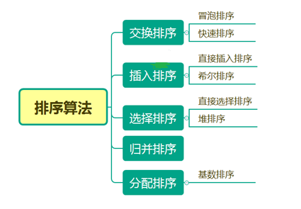

## 2交换排序

### 2.1概述

所谓交换,就是根据序列中两个记录键值的比较结果来对换这两个记录在序列中的位置,交换排序的特点是：将键值较大的记录向序列的尾部移动,键值较小的记录向序列的前部移动。

### 2.2冒泡排序

#### 2.2.1 排序的基本思想

冒泡排序(Bubble Sort)是一种非常经典的排序算法。名字的来由是因为它的算法思想类似于鱼儿在河里吐泡泡的场景,例如升序排列一列数,它会两两相邻的数据进行比较,如果前者大于后者就交换,重复此番工作直到交换到最后两个数据,第一趟冒泡排序已经完成,最大的数据被冒到数组的最后一个位置,继而缩小冒泡的区间,又从头开始第二趟冒泡,直到次大数被放在倒数第二个位置,以此类推,直到所有数据被冒到合适位置,冒泡排序就算完成。

#### 2.2.2 排序过程

1)比较相邻的元素。如果第一个比第二个大(小),就交换他们两个;
2)对每一对相邻元素作同样的工作,从开始第一对到结尾的最后一对。这步做完后,最后的元素会是最大(小)的数；
3)针对所有的元素重复以上的步骤,除了最后已经选出的元素(有序)；
4)持续每次对越来越少的元素(无序元素)重复上面的步骤,直到没有任何一对数字需要比较,则序列最终有序；

#### 2.2.3 图解

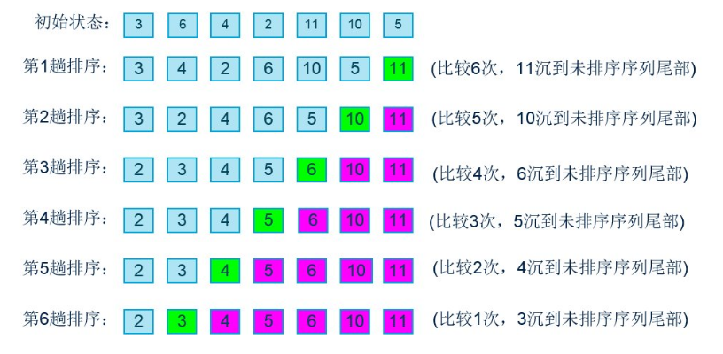

通过图解我们可以得出结论：如果有N个数,需要进行N-1趟排序。

#### 2.2.4 代码实现

```java
public static void main(String[] args) {
      int [] array={3,6,4,2,11,10,5};
      bubbleSort(array);
        System.out.println("经过冒泡排序后的结果是：");
        for (int i : array) {
            System.out.print(i+" ");
        }

 }
public static void bubbleSort(int[] array){
        //进行N-1趟的比较
        for(int i=0; i<array.length-1; i++){
            //每趟比较的内循环
            for(int j=0; j<array.length -1-i; j++){
                //判断相邻元素是否满足条件(递增)
                if(array[j] > array[j+1]){
                    //交换相邻元素
                    int temp = array[j];
                    array[j] = array[j+1];
                    array[j+1] = temp;
                }
            }
        }
}
```

运行结果：

```java
经过冒泡排序后的结果是：
2 3 4 5 6 10 11
```

#### 2.2.5 代码优化

如果数组本身已经有序,或者接近有序,以上的排序算法会做大量的无用的循环判断操作,所以我们需要对算法进行优化。
优化的方式是：设置一个标志flag为true,如果某一趟排序发生了变换,那么flag为false。如果某一趟排序没有发生交换,则说明序列已经有序了,不必再进行继续的比较操作,此时flag为true,代码如下：

```java
public static void bubbleSort(int[] array){
        //进行N-1趟的比较
        for(int i=0; i<array.length - 1;i++){
            //每次进入内循环都将flag设置为true
            boolean flag = true;
            //每趟比较的内循环
            for(int j=0; j<array.length - 1 - i;j++){
                //判断相邻元素是否满足条件(递增)
                if(array[j] > array[j+1]){
                    //交换相邻元素
                    int temp = array[j];
                    array[j] = array[j+1];
                    array[j+1] = temp;
                    //如果相邻元素有交换,则flag设置为false
                    flag = false;
                }
            }
            //内循环结束之后,如果flag为true,说明相邻元素没有一次交换
            //这时数组已经有序,则直接跳出外层循环,结束排序。
            if(flag){
                break;
            }
        }
}
```

### 2.3 快速排序

#### 2.3.1 排序的基本思想

快速排序就是冒泡排序的一种改进,冒泡排序是通过每一趟冒泡将最大值(最小值)放到恰当位置,而快速排序則是每趟排序从待排序区间选一个基准值(也称作枢纽值),将比它小的数据全放在其左边,将比它大的值放在其右边,然后递归其左右子区间对其排序,一层层递归下去,某子区间只剩一个数据时,停止递归,此子区间已经算是有序,继而向其上层区间返回,一层层向上返回,当首次基准值的左右区间均已有序时,整个排序就算完成。

#### 2.3.2 排序过程

1:用两个指针left和right用来标识区间范围,由于我将key值定义为区间最右边的值,所以要左指针开始走。
2:左指针向右找比key值大的数据,找到后停下来,现在右指针向左开始找比key小的数据,找到后将左右指针的值交换。
3:左指针继续找比key大的值,右指针继续找比key小的值,找到后交换,直到左右指针相遇,然后将左指针所在位置的值赋值为key。
4:此时比key值小的数据全部在key的左边,比key大的值全在key的右边。
5:按照上述同样的方法递归以上key值的左右区间,使之有序后排序完成。

#### 2.3.3 图解


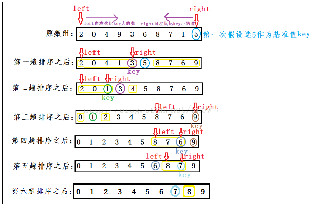

#### 2.3.4 代码实现(递归)

```java
public static int partSort(int[] array,int left,int right)  
{  
    int key = right;//利用key作为基准值的下标  
  
    while (left < right)  
    {  
        //左指针向右找第一个比key大的数  
        while (left < right && array[left] <=  array[key])  
        {  
            ++left;  
        }  
        //右指针向左扎找第一个比key的数  
        while (left < right &&  array[right] >= array[key])  
        {  
            --right;  
        }  
        //交换左右指针所指的值  
        if (array[left] !=  array[right])  
        {  
            int temp1 = array[left];
            array[left] = array[right];
            array[right] = temp1;
        }  
    }  
    //将key值放到正确位置上  
    int temp2 = array[left];
    array[left] = array[key];
    array[key] = temp2;
  
    return left;  
}
public static void quickSort(int[] array,int left,int right)  
{
    if (left < right)  
    {  
        int kiv = partSort(array,left,right);  
        quickSort(array,left,kiv-1);  
        quickSort(array,kiv+1,right);  
    }  
}
测试代码:
public static void main(String[] args) {
    int[] array = {5,3,2,1,4};
    QuickSort(array, 0, array.length - 1);

    for (int i = 0; i < array.length; i++) {
        System.out.println(array[i]);
    }
}
```

2.3.4 代码实现(非递归)

```java
//定义栈中存放的类
class Node {
    int low;  //保存下界
    int high; //保存上界

    public Node() {
    }

    public Node(int low, int high) {
        this.low = low;
        this.high = high;
    }

}

class Sort {
    public static int partSort(int[] array, int left, int right) {
        int key = right;// 利用key作为基准值的下标

        while (left < right) {
            // 左指针向右找第一个比key大的数
            while (left < right && array[left] <= array[key]) {
                ++left;
            }
            // 右指针向左扎找第一个比key的数
            while (left < right && array[right] >= array[key]) {
                --right;
            }
            // 交换左右指针所指的值
            if (array[left] != array[right]) {
                int temp1 = array[left];
                array[left] = array[right];
                array[right] = temp1;
            }
        }
        // 将key值放到正确位置上
        int temp2 = array[left];
        array[left] = array[key];
        array[key] = temp2;

        return left;
    }

    // 非递归实现
    static void quickSort(int array[], int length) {
        int pos;
        LinkedList<Node> list = new LinkedList<>();

        //第一次将整个数组的区间入栈
        list.push(new Node(0, length - 1));

        while (!list.isEmpty()) {
            //出栈
            Node node = list.pop();
            if (node.low < node.high) {
                //通过一趟排序,将出栈的区间分成左右两部分
                pos = partSort(array, node.low, node.high); // 下届 上届

                //将左半部分入栈
                list.push(new Node(pos + 1, node.high));
                //将右半部分入栈
                list.push(new Node(node.low, pos - 1));

            }
        }
    }

}
```

测试代码：

```java
public class TestDemo{

    public static void main(String[] args) {
        int[] array = { 5, 3, 2, 1, 4 };
        Sort.quickSort(array, array.length);
        for (int i = 0; i < array.length; i++) {
            System.out.println(array[i]);
        }
    }

}
```

## 3插入排序

### 3.1 概述

插入排序(Insertion Sort)是一种简单直观的排序算法。它的工作原理是通过构建有序序列,对于未排序数据,在已排序序列中从后向前扫描,找到相应位置并插入。

### 3.2 直接插入排序

#### 3.2.1 排序的思想

直接插入排序(Insertion Sort)的基本思想是：每次将一个待排序的记录,按其关键字大小插入到前面已经排好序的子序列中的适当位置,直到全部记录插入完成为止。

#### 3.2.2 排序过程

1)把第一个元素看做已经被排序
2)从第二个元素开始,依次取出,在已经排序的元素序列中从后向前扫描
3)如果该元素(已排序)大于新元素,将该元素移到下一位置
4)重复步骤3),直到找到已排序的元素小于或者等于新元素的位置
5)将新元素插入到该位置中
6)重复步骤2

#### 3.2.3 图解

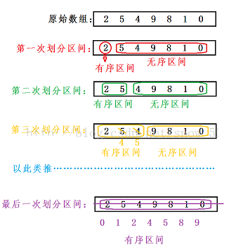

#### 3.2.4 代码实现

```java
public static void insertionSort(int[] array) {
    //从第二个元素开始,依次的取数组的值
    for (int i = 1; i < array.length; i++) {
        //将取的值先存起来
        int temp = array[i];
        int j;
        //找到该元素要插入的位置
        for (j = i - 1; j >= 0; j--) {
            if (array[j] > temp) {
                array[j + 1] = array[j];
            } else {
                break;
            }
        }
        //将元素插入
        array[j + 1] = temp;
    }
}
```

### 3.3 希尔排序

#### 3.3.1 排序的思想

  从本质上来讲,希尔排序实际上是对直接插入排序的一种优化,为了防止以上直接插入排序出现最坏情况影响算法效率,希尔排序对其进行了改进,在对数据进行直接排序之前,先对数据进行预排序,使之接近有序,然后再利用直接插入排序对数据进行快速排序。

#### 3.3.2 排序过程

1：先将整个待排元素序列分割成若干个子序列(由相隔某个"增量"的元素组成的)分别进行直接插入排序:
2：然后依次缩减增量再进行排序,待整个序列中的元素基本有序(增量足够小)时,
3：再对全体元素进行一次直接插入排序。

#### 3.3.3 图解

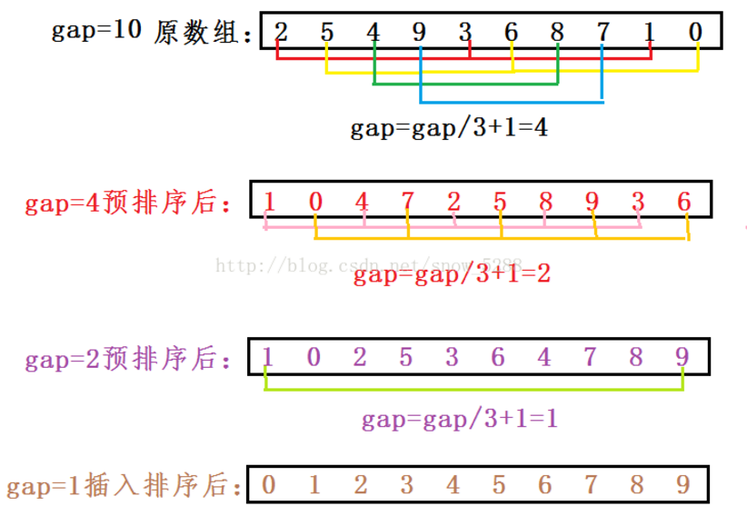

#### 3.3.4 代码实现

```java
public static void shellSort(int[] data) {
        int j = 0;
        int max = 0;
        for (int step = data.length / 2; step > 0; step /= 2) {
            for (int i = step; i < data.length; i++) {
                max = data[i];
                for (j = i; j >= step; j -= step) {
                    if (max < data[j - step]) {
                        data[j] = data[j - step];
                    } else {
                        break;
                    }
                }
                data[j] = max;
            }
        }
}
```

## 4选择排序

### 4.1 概述

选择排序就是每次选一个数据放到其应该出现的位置,以升序(降序)为例,首先选最小(最大)的数据放到正确位置,接着再选次小(次大)的数据放到合适的位置,以此类推,直到最大(最小)的数据被放入最后一个位置,排序就算完成。

### 4.2 直接选择排序

#### 4.2.1 排序的过程

1:选数据
2:将所选数据放入合适位置
3:缩小需要排序的范围

#### 4.2.2 图解

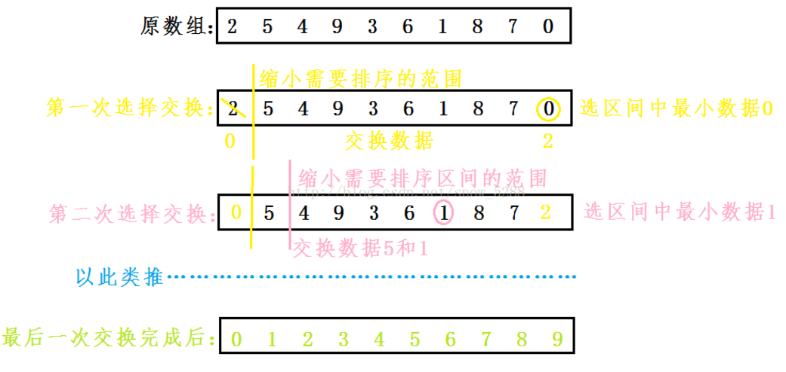

#### 4.2.3 代码实现

```java
public static void selectSort(int[] array,int length)  
{  
    int minIndex = 0;  
    for (int i = 0; i < length-1;  ++i)  
    {  
        minIndex = i;      //未排序区间最小数据的位置下标  
        for(int pos = i+1; pos<length; pos++){
            if(array[pos] < array[minIndex]){
                minIndex  = pos;
            }
        }

        int temp = array[i];
        array[i] = array[minIndex];
        array[minIndex] = temp;
    }  
}
```

### 4.3 堆排序

#### 4.3.1 堆介绍

堆数据结构是一种数组对象,它可以被视为一棵完全二叉树结构。

堆结构的二叉树存储是：
(最)大堆：每个父节点的都大于孩子节点。
(最)小堆：每个父节点的都小于孩子节点

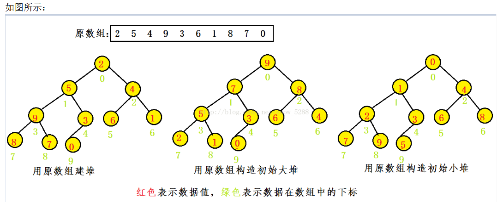

#### 4.3.2 堆排序思想

堆积排序(Heapsort)是指利用堆这种数据结构所设计的一种排序算法。堆是一个近似完全二叉树的结构,并同时满足堆性质：即子结点的键值或索引总是小于(或者大于)它的父节点。

#### 4.3.3 排序过程

1)将初始待排序关键字序列(R1,R2....Rn)构建成大顶堆,此堆为初始的无序区；
2)将堆顶元素`R[1]`与最后一个元素`R[n]`交换,此时得到新的无序区`(R1,R2,......Rn-1)`和新的有序区(Rn),且满足`R[1,2...n-1]<=R[n]`;
3)由于交换后新的堆顶`R[1]`可能违反堆的性质,因此需要对当前无序区`(R1,R2,......Rn-1)`调整为新堆,然后再次将R[1]与无序区最后一个元素交换,得到新的无序区`(R1,R2....Rn-2)`和新的有序区`(Rn-1,Rn)`。不断重复此过程直到有序区的元素个数为n-1,则整个排序过程完成。

#### 4.3.4 图解

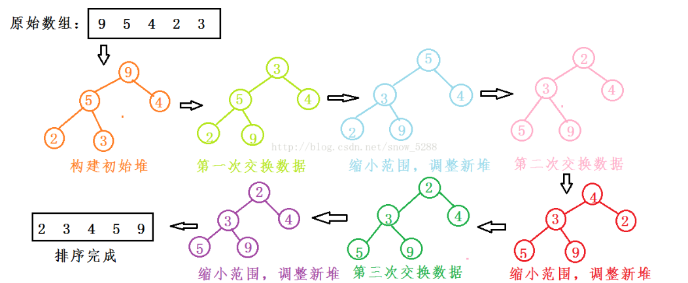

#### 4.3.5 代码实现

```java
public class HeapSortTest {  
  
    public static void main(String[] args) {  
        int[] data5 = new int[] { 5, 3, 6, 2, 1, 9, 4, 8, 7 };  
        print(data5);  
        heapSort(data5);  
        System.out.println("排序后的数组：");  
        print(data5);  
    }  
  
    public static void swap(int[] data, int i, int j) {  
        if (i == j) {  
            return;  
        }  
        data[i] = data[i] + data[j];  
        data[j] = data[i] - data[j];  
        data[i] = data[i] - data[j];  
    }  
  
    public static void heapSort(int[] data) {  
        for (int i = 0; i < data.length; i++) {  
            createMaxdHeap(data, data.length - 1 - i);  
            swap(data, 0, data.length - 1 - i);  
            print(data);  
        }  
    }  
  
    public static void createMaxdHeap(int[] data, int lastIndex) {  
        for (int i = (lastIndex - 1) / 2; i >= 0; i--) {  
            // 保存当前正在判断的节点  
            int k = i;  
            // 若当前节点的子节点存在  
            while (2 * k + 1 <= lastIndex) {  
                // biggerIndex总是记录较大节点的值,先赋值为当前判断节点的左子节点  
                int biggerIndex = 2 * k + 1;  
                if (biggerIndex < lastIndex) {  
                    // 若右子节点存在,否则此时biggerIndex应该等于 lastIndex  
                    if (data[biggerIndex] < data[biggerIndex + 1]) {  
                        // 若右子节点值比左子节点值大,则biggerIndex记录的是右子节点的值  
                        biggerIndex++;  
                    }  
                }  
                if (data[k] < data[biggerIndex]) {  
                    // 若当前节点值比子节点最大值小,则交换2者得值,交换后将biggerIndex值赋值给k  
                    swap(data, k, biggerIndex);  
                    k = biggerIndex;  
                } else {  
                    break;  
                }  
            }  
        }  
    }  
  
    public static void print(int[] data) {  
        for (int i = 0; i < data.length; i++) {  
            System.out.print(data[i] + "\t");  
        }  
        System.out.println();  
    }  
  
}
```

## 5归并排序

### 5.1 基本思想

 归并排序是建立在归并操作上的一种有效的排序算法。该算法是采用分治法的一个非常典型的应用。

### 5.2 排序过程

1)按照类似快速排序的方法递归地将待排序序列依次划分为两个区间,区间只剩一个数停止划分；
2)如果一个区间只剩一个数,我们可将其看做有序区间,然后对左右两个小区间进行归并,归并后仍要保持区间的有序性；
3)同2)提到的方法我们每次将两个有序的子区间归并为一个大的有序区间,并返回给上一层递归
4)直到所有划分的区间归并为一个有序序列,归并排序就算完成。

5.3 图解

### 5.3 图解

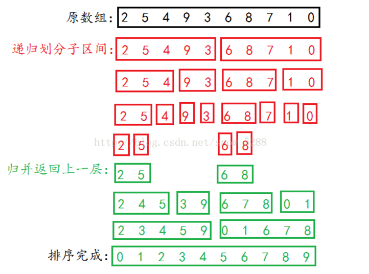

### 5.4 代码实现

```java
public class MergeSort {
    public static int[] sort(int[] nums, int low, int high) {  
        int mid = (low + high) / 2;  
        if (low < high) {  
            // 左边  
            sort(nums, low, mid);  
            // 右边  
            sort(nums, mid + 1, high);  
            // 左右归并  
            merge(nums, low, mid, high);  
        }  
        return nums;  
    }  
  
    public static void merge(int[] nums, int low, int mid, int high) {  
        int[] temp = new int[high - low + 1];  
        int i = low;// 左指针  
        int j = mid + 1;// 右指针  
        int k = 0;  
  
        // 把较小的数先移到新数组中  
        while (i <= mid && j <= high) {  
            if (nums[i] < nums[j]) {  
                temp[k++] = nums[i++];  
            } else {  
                temp[k++] = nums[j++];  
            }  
        }  
  
        // 把左边剩余的数移入数组  
        while (i <= mid) {  
            temp[k++] = nums[i++];  
        }  
  
        // 把右边边剩余的数移入数组  
        while (j <= high) {  
            temp[k++] = nums[j++];  
        }  
  
        // 把新数组中的数覆盖nums数组  
        for (int k2 = 0; k2 < temp.length; k2++) {  
            nums[k2 + low] = temp[k2];  
        }  
    }  
  
    // 归并排序的实现  
    public static void main(String[] args) {  
  
        int[] nums = { 2, 7, 8, 3, 1, 6, 9, 0, 5, 4 };  
  
        MergeSort.sort(nums, 0, nums.length-1);  
        System.out.println(Arrays.toString(nums));  
    }  
}
```

## 6基数排序

### 6.1基本思想

基数排序已经不再是一种常规的排序方式,它更多地像一种排序方法的应用,基数排序必须依赖于另外的排序方法。基数排序的总体思路就是将待排序数据拆分成多个关键字进行排序,也就是说,基数排序的实质是多关键字排序。
多关键字排序的思路是将待排数据里德排序关键字拆分成多个排序关键字；第1个排序关键字,第2个排序关键字,第3个排序关键字\...\...然后,根据子关键字对待排序数据进行排序。
多关键字排序时有两种解决方案：
最高位优先法(MSD)(Most Significant Digit first)
最低位优先法(LSD)(Least Significant Digit first)

### 6.2 排序过程

例如,对如下数据序列进行排序。
192,221,12,23
可以观察到它的每个数据至多只有3位,因此可以将每个数据拆分成3个关键字：百位(高位)、十位、个位(低位)。
如果按照习惯思维,会先比较百位,百位大的数据大,百位相同的再比较十位,十位大的数据大；最后再比较个位。人得习惯思维是最高位优先方式。
如果按照人得思维方式,计算机实现起来有一定的困难,当开始比较十位时,程序还需要判断它们的百位是否相同\--这就认为地增加了难度,计算机通常会选择最低位优先法。
基数排序方法对任一子关键字排序时必须借助于另一种排序方法,而且这种排序方法必须是稳定的。
对于多关键字拆分出来的子关键字,它们一定位于0-9这个可枚举的范围内,这个范围不大,因此用桶式排序效率非常好。
对于多关键字排序来说,程序将待排数据拆分成多个子关键字后,对子关键字排序既可以使用桶式排序,也可以使用任何一种稳定的排序方法

### 6.3 图解

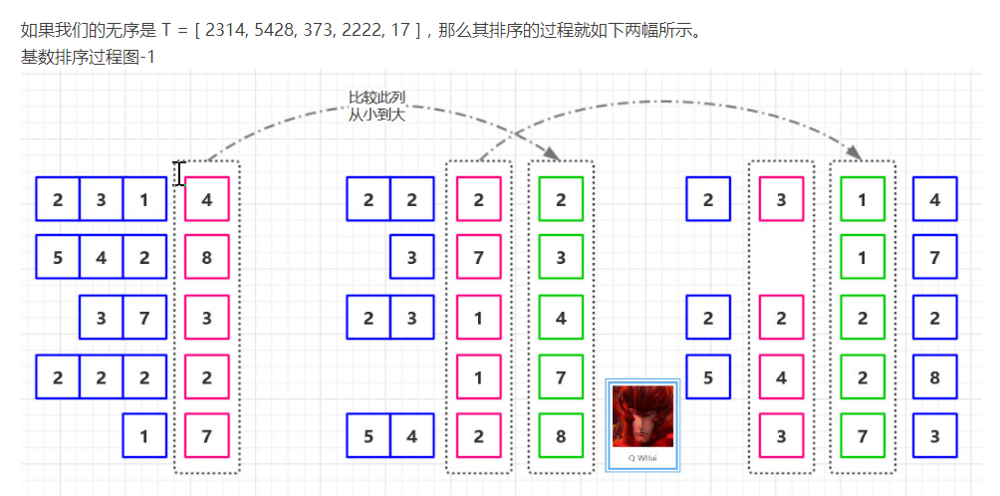
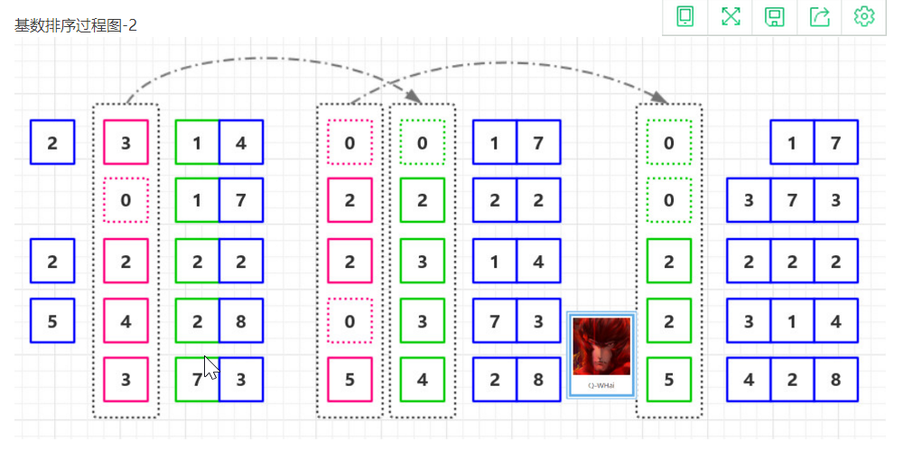{width="5.768055555555556in" height="2.85246062992126in"}

6.4 代码实现

```java
6.4 代码实现
public class MultiKeyRadixSortTest {  
  
    public static void main(String[] args) {  
        int[] data = new int[] { 1100, 192, 221, 12, 23 };  
        print(data);  
        radixSort(data, 10, 4);  
        System.out.println("排序后的数组：");  
        print(data);  
    }  
  
    public static void radixSort(int[] data, int radix, int d) {  
        // 缓存数组  
        int[] tmp = new int[data.length];  
        // buckets用于记录待排序元素的信息  
        // buckets数组定义了max-min个桶  
        int[] buckets = new int[radix];  
  
        for (int i = 0, rate = 1; i < d; i++) {  
  
            // 重置count数组,开始统计下一个关键字  
            Arrays.fill(buckets, 0);  
            // 将data中的元素完全复制到tmp数组中  
            System.arraycopy(data, 0, tmp, 0, data.length);  
  
            // 计算每个待排序数据的子关键字  
            for (int j = 0; j < data.length; j++) {  
                int subKey = (tmp[j] / rate) % radix;  
                buckets[subKey]++;  
            }  
  
            for (int j = 1; j < radix; j++) {  
                buckets[j] = buckets[j] + buckets[j - 1];  
            }  
  
            // 按子关键字对指定的数据进行排序  
            for (int m = data.length - 1; m >= 0; m--) {  
                int subKey = (tmp[m] / rate) % radix;  
                data[--buckets[subKey]] = tmp[m];  
            }  
            rate *= radix;  
        }  
  
    }  
  
    public static void print(int[] data) {  
        for (int i = 0; i < data.length; i++) {  
            System.out.print(data[i] + "\t");  
        }  
        System.out.println();  
    }  
  
}
```
