## 1、kudu介绍

### 1.1 背景介绍

在KUDU之前，大数据主要以两种方式存储；
    以 HDFS 引擎作为存储引擎，适用于高吞吐量的离线大数据分析场景。
这类存储的局限性是数据无法进行随机的读写。

（2）动态数据：
    以 HBase、Cassandra 作为存储引擎，适用于大数据随机读写场景。
这类存储的局限性是批量读取吞吐量远不如 HDFS，不适用于批量数据分析的场景。
    从上面分析可知，这两种数据在存储方式上完全不同，进而导致使用场景完全不同，但在真实的场景中，边界可能没有那么清晰，面对既需要随机读写，又需要批量分析的大数据场景，该如何选择呢？这个场景中，单种存储引擎无法满足业务需求，我们需要通过多种大数据工具组合来满足这一需求。
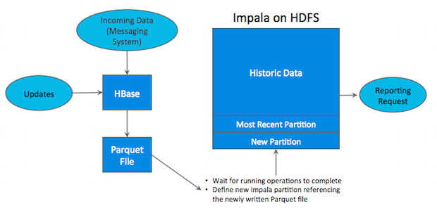
如上图所示，数据实时写入 HBase，实时的数据更新也在 HBase 完成，为了应对 OLAP 需求，我们定时（通常是 T+1 或者 T+H）将 HBase 数据写成静态的文件（如：Parquet）导入到 OLAP 引擎（如：HDFS）。这一架构能满足既需要随机读写，又可以支持 OLAP 分析的场景，但他有如下缺点：
(1)架构复杂。从架构上看，数据在HBase、消息队列、HDFS 间流转，涉及环节太多，运维成本很高。并且每个环节需要保证高可用，都需要维护多个副本，存储空间也有一定的浪费。最后数据在多个系统上，对数据安全策略、监控等都提出了挑战。
(2)时效性低。数据从HBase导出成静态文件是周期性的，一般这个周期是一天（或一小时），在时效性上不是很高。
(3)难以应对后续的更新。真实场景中，总会有数据是延迟到达的。如果这些数据之前已经从HBase导出到HDFS，新到的变更数据就难以处理了，一个方案是把原有数据应用上新的变更后重写一遍，但这代价又很高。
    为了解决上述架构的这些问题，KUDU应运而生。KUDU的定位是Fast Analytics on Fast Data，是一个既支持随机读写、又支持 OLAP 分析的大数据存储引擎。
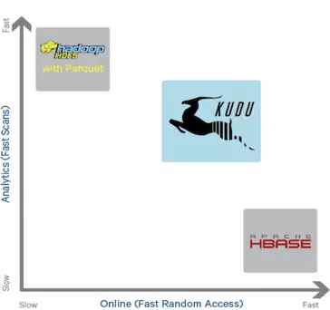

从上图可以看出，KUDU 是一个折中的产品，在 HDFS 和 HBase 这两个偏科生中平衡了随机读写和批量分析的性能。从 KUDU 的诞生可以说明一个观点：底层的技术发展很多时候都是上层的业务推动的，脱离业务的技术很可能是空中楼阁。

### 1.2 kudu是什么

   Apache Kudu是由Cloudera开源的存储引擎，可以同时提供低延迟的随机读写和高效的数据分析能力。它是一个融合HDFS和HBase的功能的新组件，具备介于两者之间的新存储组件。
   Kudu支持水平扩展，并且与Cloudera Impala和Apache Spark等当前流行的大数据查询和分析工具结合紧密。

### 1.3 kudu的应用场景

```text
    Strong performance for both scan and random access to help customers simplify complex hybrid architectures（适用于那些既有随机访问，也有批量数据扫描的复合场景）
    High CPU efficiency in order to maximize the return on investment that our customers are making in modern processors（高计算量的场景）
    High IO efficiency in order to leverage modern persistent storage（使用了高性能的存储设备，包括使用更多的内存）
    The ability to update data in place, to avoid extraneous processing and data movement（支持数据更新，避免数据反复迁移）
    The ability to support active-active replicated clusters that span multiple data centers in geographically distant locations（支持跨地域的实时数据备份和查询）

国内使用的kudu一些案例可以查看《构建近实时分析系统.pdf》文档。
```

## 2、Kudu的架构

与HDFS和HBase相似，Kudu使用单个的Master节点，用来管理集群的元数据，并且使用任意数量的Tablet Server（可对比理解HBase中的RegionServer角色）节点用来存储实际数据。可以部署多个Master节点来提高容错性。一个table表的数据，被分割成1个或多个Tablet，Tablet被部署在Tablet Server来提供数据读写服务。


下面是一些基本概念：

Master：
 集群中的老大，负责集群管理、元数据管理等功能
Tablet Server
集群中的小弟，负责数据存储，并提供数据读写服务
一个 tablet server 存储了table表的tablet 和为 tablet 向 client 提供服务。对于给定的 tablet，一个tablet server 充当 leader，其他 tablet server 充当该 tablet 的 follower 副本。
只有 leader服务写请求，然而 leader 或 followers 为每个服务提供读请求 。一个 tablet server 可以服务多个 tablets ，并且一个 tablet 可以被多个 tablet servers 服务着。

Table（表）
一张talbe是数据存储在Kudu的tablet server中。表具有 schema 和全局有序的primary key（主键）。table 被分成称为 tablets 的 segments。

Tablet
一个 tablet 是一张 table连续的segment，tablet是kudu表的水平分区，类似于google Bigtable的tablet，或者HBase的region。每个tablet存储着一定连续range的数据（key），且tablet两两间的range不会重叠。一张表的所有tablet包含了这张表的所有key空间。与其它数据存储引擎或关系型数据库中的 partition（分
区）相似。给定的tablet 冗余到多个 tablet 服务器上，并且在任何给定的时间点，其中一个副本被认为是
leader tablet。任何副本都可以对读取进行服务，并且写入时需要在为 tablet 服务的一组 tablet server之
间达成一致性。

## 3、kudu安装

### 3.1 节点规划

|  节点   | kudu-master | kudu-tserver |
| :---: | :---------: | :----------: |
| node1 |      是      |      是       |
| node2 |      是      |      是       |
| node3 |      是      |      是       |

### 3.2 配置本地的CDH-yum源

#### 3.2.1 配置本地Yum的Repository

```text
所有cloudera软件下载地址:
http://archive.cloudera.com/cdh5/

访问：http://archive.cloudera.com/cdh5/repo-as-tarball/5.14.0/cdh5.14.0-centos6.tar.gz
下载cdh5.14.0-centos6.tar.gz文件，大小约5G左右。
```

##### 3.2.1.1 上传压缩包并解压

```text
把5个G的压缩文件上传其中某一台服务器，这里我们上传到node3上
（这里需要确保服务器的磁盘空间是充足的，如果磁盘容量不够，就需要扩容，增大磁盘的容量，具体操作可以参考：https://www.cnblogs.com/bitter-first-sweet-last/p/6638634.html）。
并进行解压。
tar -zxvf cdh5.14.0-centos6.tar.gz -C /export/servers
```


##### 3.2.1.2 制作本地yum源

镜像源是centos当中下载相关软件的地址，我们可以通过制作我们自己的镜像源指定我们去哪里下载kudu的rpm
包，这里我们使用httpd这个软件来作为服务端，启动httpd的服务来作为我们镜像源的下载地址 这里我们选用第
三台机器作为镜像源的服务端node3机器上执行以下命令：

```text
yum -y install httpd
service httpd start
cd /etc/yum.repos.d

然后创建文件 vim localimp.repo
[localimp]
name=localimp
baseurl=http://node3/cdh5.14.0
gpgcheck=0
enabled=1
```

##### 3.2.1.3 创建apache httpd的读取连接

```text
ln -s /export/server/cdh/5.14.0 /var/www/html/cdh5.14.0
```

一定要关防火墙[root@node-1 ~]# service iptables stop,
还要设置[root@node-1 yum.repos.d]# setenforce 0
页面访问本地yum源，出现这个界面表示本地yum源制作成功 访问<http://node3/cdh5.14.0>

```text
访问异常：You don't have permission to access /cdh5.14.0/ on this server
需要关闭Selinux服务
    （1）临时关闭
            执行命令：setenforce 0
     (2) 永久关闭
             vim /etc/sysconfig/selinux
            SELINUX=enforcing 改为 SELINUX=disabled
            重启服务reboot
```


将node3上制作好的localimp配置文件发放到所有需要kudu的节点上去

```text
scp /etc/yum.repos.d/localimp.repo node1:/etc/yum.repos.d
scp /etc/yum.repos.d/localimp.repo node2:/etc/yum.repos.d
```

### 3.3 安装kudu

使用yum命令，在不同的服务器下载对应的服务

|  服务器  |                   安装命令                   |
| :---: | :--------------------------------------: |
| node1 | yum install -y kudu kudu-master kudu-tserver kudu-client0 kudu-client-devel |
| node2 | yum install -y kudu kudu-master kudu-tserver kudu-client0 kudu-client-devel |
| node3 | yum install -y kudu kudu-master kudu-tserver kudu-client0 kudu-client-devel |

命令说明：

```shell
yum install kudu # Kudu的基本包
yum install kudu-master # KuduMaster
yum install kudu-tserver # KuduTserver
yum install kudu-client0 #Kudu C ++客户端共享库
yum install kudu-client-devel # Kudu C ++客户端共享库 SDK
```

### 3.4 配置master和tserver节点

安装完成之后。 需要在所有节点的/etc/kudu/conf目录下有两个文件：master.gflagfile和tserver.gflagfile 。

* 修改master.gflagfile

```shell
  # cat /etc/kudu/conf/master.gflagfile
  # Do not modify these two lines. If you wish to change these variables,
  # modify them in /etc/default/kudu-master.
  --fromenv=rpc_bind_addresses
  --fromenv=log_dir
  --fs_wal_dir=/export/server/kudu/master
  --fs_data_dirs=/export/servers/kudu/master
  --master_addresses=node1:7051,node2:7051,node3:7051
```

* 修改tserver.gflagfile

```shell
  # Do not modify these two lines. If you wish to change these variables,
  # modify them in /etc/default/kudu-tserver.
  --fromenv=rpc_bind_addresses
  --fromenv=log_dir
  --fs_wal_dir=/export/servers/kudu/tserver
  --fs_data_dirs=/export/servers/kudu/tserver
  --tserver_master_addrs=node1:7051,node2:7051,node3:7051
```

* 修改 /etc/default/kudu-master

```shell
  export FLAGS_log_dir=/var/log/kudu
  #每台机器的master地址要与主机名一致,这里是在node1上
  export FLAGS_rpc_bind_addresses=node1:7051

```

* 修改 /etc/default/kudu-tserver

```shell
  export FLAGS_log_dir=/var/log/kudu
  #每台机器的tserver地址要与主机名一致，这里是在node1上
  export FLAGS_rpc_bind_addresses=node1:7050
```

  【注意】

```shell
  kudu默认用户就是KUDU，所以需要将/export/servers/kudu权限修改成kudu
  mkdir /export/servers/kudu
  chown -R kudu:kudu /export/servers/kudu
```

  (如果使用的是普通的用户，那么最好配置sudo权限)/etc/sudoers文件中添加：


### 3.5 启动和关闭kudu集群

#### 3.5.1 启动kudu

* 1、启动的时候要注意时间同步,时间一定要同步

  * 安装ntp服务
    * yum -y install ntp
  * 设置开机启动
    * service ntpd start
    * chkconfig ntpd on
  * 可以在每台服务器执行
    * /etc/init.d/ntpd restart

* 2、启动命令

  * 在每台服务器上都执行下面脚本

```shell
  service kudu-master start
  service kudu-tserver start

  或者
  sudo service kudu-master start
  sudo service kudu-tserver start
```

#### 3.5.2 关闭kudu

* 1、关闭命令

  * 在每台服务器上都执行下面脚本

```shell
  service kudu-master stop
  service kudu-tserver stop

  或者

  sudo service kudu-master stop
  sudo service kudu-tserver stop
```

### 3.6 安装过成中可能出现的问题

* 1、给用户添加sudo权限的时候报错

```shell
  sudo: /etc/sudoers is world writable
  解决方式：pkexec chmod 555 /etc/sudoers
```

* 2、启动kudu的时候报错

```shell
  Failed to start Kudu Master Server. Return value: 1 [FAILED]
  去日志文件中查看：
  错误：F0810 09:04:08.354552 4866 master_main.cc:68] Check failed: _s.ok() Bad status:
  Service unavailable: Cannot initialize clock: Error reading clock. Clock considered
  unsynchronized
  解决：
  第一步：首先检查是否有安装ntp：如果没有安装则使用以下命令安装：
  yum -y install ntp
  第二步：设置随机启动：
  service ntpd start
  chkconfig ntpd on
```

* 3、启动过程中报错

```shell
  F0810 21:31:12.620932 20143 master_main.cc:71] Check failed: _s.ok() Bad status:
  Invalid argument: Unable to initialize catalog manager: Failed to initialize sys tables
  async: on-disk master list
  解决：
  （1）：停掉master和tserver
  （2）：删除掉之前所有的/export/servers/kudu/master/*和/export/servers/kudu/tserver/*
```

* 4、启动过程中报错

```shell
  F0913 15:12:00.628237 20859 master_main.cc:74] Check failed: _s.ok() Bad status: IO
  error: Could not create new FS layout: unable to create file system roots: unable to
  write instance metadata: Call to mkstemp() failed on name template
  /export/servers/kudu/master/instance.kudutmp.XXXXXX: Permission denied (error 13)
  这是因为kudu默认使用kudu权限进行执行，可能遇到文件夹的权限不一致情况，更改文件夹权限即可
```

### 3.7 kudu的图形界面

* 启动好kudu之后可以访问kudu的web管理界面
  * 访问地址：<http://master主机名:8051>
  
* Master的web地址
  * <http://node1:8051/masters>
    
* TServer的web地址
  * <http://node1:8051/tablet-servers>

    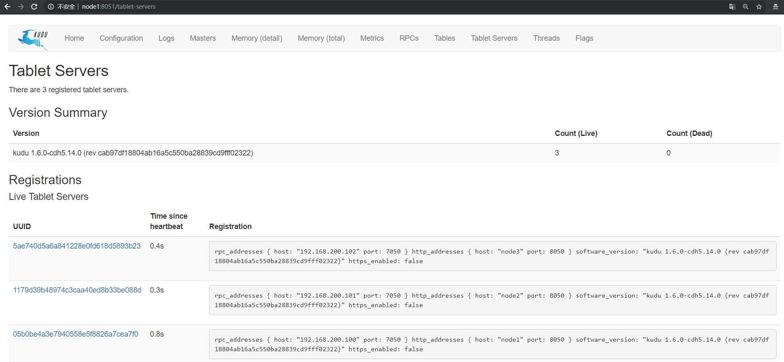

## 4、java代码操作kudu

### 4.1 构建maven工程，导入依赖

```xml
 <dependencies>
       <dependency>
            <groupId>org.apache.kudu</groupId>
            <artifactId>kudu-client</artifactId>
            <version>1.6.0</version>
        </dependency>

        <dependency>
            <groupId>junit</groupId>
            <artifactId>junit</artifactId>
            <version>4.12</version>
        </dependency>
</dependencies>
```

### 4.2 初始化方法

```java
public class TestKudu {
    //定义KuduClient客户端对象
     private static KuduClient kuduClient;
    //定义表名
     private static   String tableName="person";

    /**
     * 初始化方法
     */
    @Before
    public void init(){
        //指定master地址
        String masterAddress="node1,node2,node3";
        //创建kudu的数据库连接
       kuduClient = new KuduClient.KuduClientBuilder(masterAddress).defaultSocketReadTimeoutMs(6000).build();

    }

    //构建表schema的字段信息
                                    //字段名称   数据类型     是否为主键
    public ColumnSchema newColumn(String name, Type type, boolean isKey){
        ColumnSchema.ColumnSchemaBuilder column = new ColumnSchema.ColumnSchemaBuilder(name, type);
        column.key(isKey);
        return column.build();
    }
  }  
```

### 4.3 创建表

```java
/**  使用junit进行测试
     *
     * 创建表
     * @throws KuduException
     */
    @Test
    public void createTable() throws KuduException {
        //设置表的schema
        List<ColumnSchema> columns = new LinkedList<ColumnSchema>();
        columns.add(newColumn("CompanyId", Type.INT32, true));
        columns.add(newColumn("WorkId", Type.INT32, false));
        columns.add(newColumn("Name", Type.STRING, false));
        columns.add(newColumn("Gender", Type.STRING, false));
        columns.add(newColumn("Photo", Type.STRING, false));

        Schema schema = new Schema(columns);

        //创建表时提供的所有选项
        CreateTableOptions tableOptions = new CreateTableOptions();
        //设置表的副本和分区规则
        LinkedList<String> list = new LinkedList<String>();
        list.add("CompanyId");
        //设置表副本数
        tableOptions.setNumReplicas(1);
        //设置range分区
        //tableOptions.setRangePartitionColumns(list);
        //设置hash分区和分区的数量
        tableOptions.addHashPartitions(list,3);

        try {
            kuduClient.createTable("person",schema,tableOptions);
        } catch (Exception e) {
            e.printStackTrace();
        }

        kuduClient.close();

    }
```

### 4.4 插入数据

```java
/**
     * 向表中加载数据
     * @throws KuduException
     */
    @Test
    public void loadData() throws KuduException {
        //打开表
        KuduTable kuduTable = kuduClient.openTable(tableName);

        //创建KuduSession对象 kudu必须通过KuduSession写入数据
        KuduSession kuduSession = kuduClient.newSession();

        //采用flush方式 手动刷新
        kuduSession.setFlushMode(SessionConfiguration.FlushMode.MANUAL_FLUSH);
        kuduSession.setMutationBufferSpace(3000);

        //准备数据
        for(int i=1; i<=10; i++){
            Insert insert = kuduTable.newInsert();
            //设置字段的内容
            insert.getRow().addInt("CompanyId",i);
            insert.getRow().addInt("WorkId",i);
            insert.getRow().addString("Name","lisi"+i);
            insert.getRow().addString("Gender","male");
            insert.getRow().addString("Photo","person"+i);

            kuduSession.flush();
            kuduSession.apply(insert);
        }

        kuduSession.close();
        kuduClient.close();


    }
```

### 4.5 查询数据

```java
 /**
     * 查询表数据
     * @throws KuduException
     */
    @Test
    public void queryData() throws KuduException {
        //打开表
        KuduTable kuduTable = kuduClient.openTable(tableName);
        //获取scanner扫描器
        KuduScanner.KuduScannerBuilder scannerBuilder = kuduClient.newScannerBuilder(kuduTable);
        KuduScanner scanner = scannerBuilder.build();

        //遍历
        while(scanner.hasMoreRows()){
            RowResultIterator rowResults = scanner.nextRows();
            while (rowResults.hasNext()){
                RowResult result = rowResults.next();
                int companyId = result.getInt("CompanyId");
                int workId = result.getInt("WorkId");
                String name = result.getString("Name");
                String gender = result.getString("Gender");
                String photo = result.getString("Photo");
                System.out.print("companyId:"+companyId+" ");
                System.out.print("workId:"+workId+" ");
                System.out.print("name:"+name+" ");
                System.out.print("gender:"+gender+" ");
                System.out.println("photo:"+photo);
            }
        }

        //关闭
        scanner.close();
        kuduClient.close();

    }
```

### 4.6 修改数据

```java
 /**
     * 修改数据
     * @throws KuduException
     */
    @Test
    public void updateData() throws KuduException {
        //打开表
        KuduTable kuduTable = kuduClient.openTable(tableName);

        //构建kuduSession对象
        KuduSession kuduSession = kuduClient.newSession();
        //设置刷新数据模式，自动提交
        kuduSession.setFlushMode(SessionConfiguration.FlushMode.AUTO_FLUSH_BACKGROUND);

        //更新数据需要获取Update对象
        Update update = kuduTable.newUpdate();
        //获取row对象
        PartialRow row = update.getRow();
        //设置要更新的数据信息
        row.addInt("CompanyId",1);
        row.addString("Name","kobe");
        //操作这个update对象
        kuduSession.apply(update);

        kuduSession.close();

    }

```

### 4.7 删除数据

```java
/**
     * 删除表中的数据
     */
    @Test
    public void deleteData() throws KuduException {
        //打开表
        KuduTable kuduTable = kuduClient.openTable(tableName);
        KuduSession kuduSession = kuduClient.newSession();
        //获取Delete对象
        Delete delete = kuduTable.newDelete();
        //构建要删除的行对象
        PartialRow row = delete.getRow();
        //设置删除数据的条件
        row.addInt("CompanyId",2);
        kuduSession.flush();
        kuduSession.apply(delete);
        kuduSession.close();
        kuduClient.close();
    }
```

### 4.8 删除表

```java
    /**
     * 删除表
     */
    @Test
    public void dropTable() throws KuduException {
        //删除表
        DeleteTableResponse response = kuduClient.deleteTable(tableName);
        //关闭客户端连接
        kuduClient.close();
    }
```

### 4.9 kudu的分区方式

​    为了提供可扩展性，Kudu 表被划分为称为 tablets 的单元，并分布在许多 tablet servers 上。行总是属于单个tablet 。将行分配给 tablet 的方法由在表创建期间设置的表的分区决定。 kudu提供了3种分区方式。

#### 4.9.1 Range Partitioning ( 范围分区 )

* 范围分区可以根据存入数据的数据量，均衡的存储到各个机器上，防止机器出现负载不均衡现象.

```java
   /**
     * 测试分区：
     * RangePartition
     */
    @Test
    public void testRangePartition() throws KuduException {
        //设置表的schema
        LinkedList<ColumnSchema> columnSchemas = new LinkedList<ColumnSchema>();
        columnSchemas.add(newColumn("CompanyId", Type.INT32,true));
        columnSchemas.add(newColumn("WorkId", Type.INT32,false));
        columnSchemas.add(newColumn("Name", Type.STRING,false));
        columnSchemas.add(newColumn("Gender", Type.STRING,false));
        columnSchemas.add(newColumn("Photo", Type.STRING,false));

        //创建schema
        Schema schema = new Schema(columnSchemas);

        //创建表时提供的所有选项
        CreateTableOptions tableOptions = new CreateTableOptions();
        //设置副本数
        tableOptions.setNumReplicas(1);
        //设置范围分区的规则
        LinkedList<String> parcols = new LinkedList<String>();
        parcols.add("CompanyId");
        //设置按照那个字段进行range分区
        tableOptions.setRangePartitionColumns(parcols);

        /**
         * range
         *  0 < value < 10
         * 10 <= value < 20
         * 20 <= value < 30
         * ........
         * 80 <= value < 90
         * */
        int count=0;
        for(int i =0;i<10;i++){
            //范围开始
            PartialRow lower = schema.newPartialRow();
            lower.addInt("CompanyId",count);

            //范围结束
            PartialRow upper = schema.newPartialRow();
            count +=10;
            upper.addInt("CompanyId",count);

            //设置每一个分区的范围
            tableOptions.addRangePartition(lower,upper);
        }

        try {
            kuduClient.createTable("student",schema,tableOptions);
        } catch (KuduException e) {
            e.printStackTrace();
        }
         kuduClient.close();

    }
```

#### 4.9.2 Hash Partitioning ( 哈希分区 )

​    哈希分区通过哈希值将行分配到许多 buckets ( 存储桶 )之一； 哈希分区是一种有效的策略，当不需要对表进行有序访问时。哈希分区对于在 tablet 之间随机散布这些功能是有效的，这有助于减轻热点和 tablet 大小不均匀。

```java
 /**
     * 测试分区：
     * hash分区
     */
    @Test
    public void testHashPartition() throws KuduException {
        //设置表的schema
        LinkedList<ColumnSchema> columnSchemas = new LinkedList<ColumnSchema>();
        columnSchemas.add(newColumn("CompanyId", Type.INT32,true));
        columnSchemas.add(newColumn("WorkId", Type.INT32,false));
        columnSchemas.add(newColumn("Name", Type.STRING,false));
        columnSchemas.add(newColumn("Gender", Type.STRING,false));
        columnSchemas.add(newColumn("Photo", Type.STRING,false));

        //创建schema
        Schema schema = new Schema(columnSchemas);

        //创建表时提供的所有选项
        CreateTableOptions tableOptions = new CreateTableOptions();
        //设置副本数
        tableOptions.setNumReplicas(1);
        //设置范围分区的规则
        LinkedList<String> parcols = new LinkedList<String>();
        parcols.add("CompanyId");
        //设置按照那个字段进行range分区
        tableOptions.addHashPartitions(parcols,6);
        try {
            kuduClient.createTable("dog",schema,tableOptions);
        } catch (KuduException e) {
            e.printStackTrace();
        }

        kuduClient.close();
    }
```

#### 4.9.3 Multilevel Partitioning ( 多级分区 )

​    Kudu 允许一个表在单个表上组合多级分区。 当正确使用时，多级分区可以保留各个分区类型的优点，同时减少每个分区的缺点 需求.

```java
 /**
     * 测试分区：
     * 多级分区
     * Multilevel Partition
     * 混合使用hash分区和range分区
     *
     * 哈希分区有利于提高写入数据的吞吐量，而范围分区可以避免tablet无限增长问题，
     * hash分区和range分区结合，可以极大的提升kudu的性能
     */
    @Test
    public void testMultilevelPartition() throws KuduException {
        //设置表的schema
        LinkedList<ColumnSchema> columnSchemas = new LinkedList<ColumnSchema>();
        columnSchemas.add(newColumn("CompanyId", Type.INT32,true));
        columnSchemas.add(newColumn("WorkId", Type.INT32,false));
        columnSchemas.add(newColumn("Name", Type.STRING,false));
        columnSchemas.add(newColumn("Gender", Type.STRING,false));
        columnSchemas.add(newColumn("Photo", Type.STRING,false));

        //创建schema
        Schema schema = new Schema(columnSchemas);
        //创建表时提供的所有选项
        CreateTableOptions tableOptions = new CreateTableOptions();
        //设置副本数
        tableOptions.setNumReplicas(1);
        //设置范围分区的规则
        LinkedList<String> parcols = new LinkedList<String>();
        parcols.add("CompanyId");

        //hash分区
        tableOptions.addHashPartitions(parcols,5);

        //range分区
        int count=0;
        for(int i=0;i<10;i++){
            PartialRow lower = schema.newPartialRow();
            lower.addInt("CompanyId",count);
            count+=10;

            PartialRow upper = schema.newPartialRow();
            upper.addInt("CompanyId",count);
            tableOptions.addRangePartition(lower,upper);
        }

        try {
            kuduClient.createTable("cat",schema,tableOptions);
        } catch (KuduException e) {
            e.printStackTrace();
        }
        kuduClient.close();


    }
```

## 5、spark操作kudu

* Spark与KUDU集成支持：
  * DDL操作（创建/删除）
  * 本地Kudu RDD
  * Native Kudu数据源，用于DataFrame集成
  * 从kudu读取数据
  * 从Kudu执行插入/更新/ upsert /删除
  * 谓词下推
  * Kudu和Spark SQL之间的模式映射
  * 到目前为止，我们已经听说过几个上下文，例如SparkContext，SQLContext，HiveContext，
    SparkSession，现在，我们将使用Kudu引入一个KuduContext。这是可在Spark应用程序中广播的主要可序列化对象。此类代表在Spark执行程序中与Kudu Java客户端进行交互。
    KuduContext提供执行DDL操作所需的方法，与本机Kudu RDD的接口，对数据执行更新/插入/删除，将数据类型从Kudu转换为Spark等。

### 5.1 引入依赖

```xml
<repositories>
    <repository>
        <id>cloudera</id>
        <url>https://repository.cloudera.com/artifactory/cloudera-repos/</url>
    </repository>
</repositories>

<dependencies>
        <dependency>
            <groupId>org.apache.kudu</groupId>
            <artifactId>kudu-client-tools</artifactId>
            <version>1.6.0-cdh5.14.0</version>
        </dependency>

        <dependency>
            <groupId>org.apache.kudu</groupId>
            <artifactId>kudu-client</artifactId>
            <version>1.6.0-cdh5.14.0</version>
        </dependency>

        <!-- https://mvnrepository.com/artifact/org.apache.kudu/kudu-spark2 -->
        <dependency>
            <groupId>org.apache.kudu</groupId>
            <artifactId>kudu-spark2_2.11</artifactId>
            <version>1.6.0-cdh5.14.0</version>
        </dependency>

        <!-- https://mvnrepository.com/artifact/org.apache.spark/spark-sql -->
        <dependency>
            <groupId>org.apache.spark</groupId>
            <artifactId>spark-sql_2.11</artifactId>
            <version>2.1.0</version>
        </dependency>
</dependencies>
```

### 5.2 创建表

* 定义kudu的表需要分成5个步骤：

```text
1：提供表名
2：提供schema
3：提供主键
4：定义重要选项；例如：定义分区的schema
5：调用create Table api
```

* 代码开发

```scala
object SparkKuduTest {
  def main(args: Array[String]): Unit = {
    //构建sparkConf对象
     val sparkConf: SparkConf = new SparkConf().setAppName("SparkKuduTest").setMaster("local[2]")

    //构建SparkSession对象
    val sparkSession: SparkSession = SparkSession.builder().config(sparkConf).getOrCreate()

    //获取sparkContext对象
      val sc: SparkContext = sparkSession.sparkContext
      sc.setLogLevel("warn")
    //构建KuduContext对象
      val kuduContext = new KuduContext("node1:7051,node2:7051,node3:7051",sc)

    //1.创建表操作
    createTable(kuduContext)
    /**
    * 创建表
    * @param kuduContext
    * @return
    */
  private def createTable(kuduContext: KuduContext) = {

    //1.1定义表名
    val tableName = "spark_kudu"

    //1.2 定义表的schema
    val schema = StructType(
        StructField("userId", StringType, false) ::
        StructField("name", StringType, false) ::
        StructField("age", IntegerType, false) ::
        StructField("sex", StringType, false) :: Nil)

    //1.3 定义表的主键
    val primaryKey = Seq("userId")

    //1.4 定义分区的schema
    val options = new CreateTableOptions
    //设置分区
    options.setRangePartitionColumns(List("userId").asJava)
    //设置副本
    options.setNumReplicas(1)

    //1.5 创建表
    if(!kuduContext.tableExists(tableName)){
      kuduContext.createTable(tableName, schema, primaryKey, options)
    }

  }

}
  
```

定义表时要注意的是Kudu表选项值。你会注意到在指定组成范围分区列的列名列表时我们调用“asJava”方
法。这是因为在这里，我们调用了Kudu Java客户端本身，它需要Java对象（即java.util.List）而不是Scala的List对
象；（要使“asJava”方法可用，请记住导入JavaConverters库。）
创建表后，通过将浏览器指向http// master主机名:8051/tables

来查看Kudu主UI可以找到创建的表，通过单击表ID，能够看到表模式和分区信息。

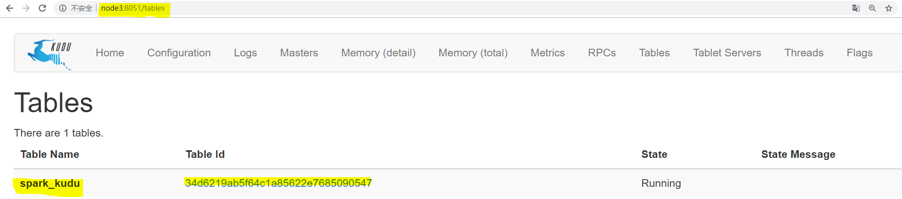

点击Table id 可以观察到表的schema等信息：

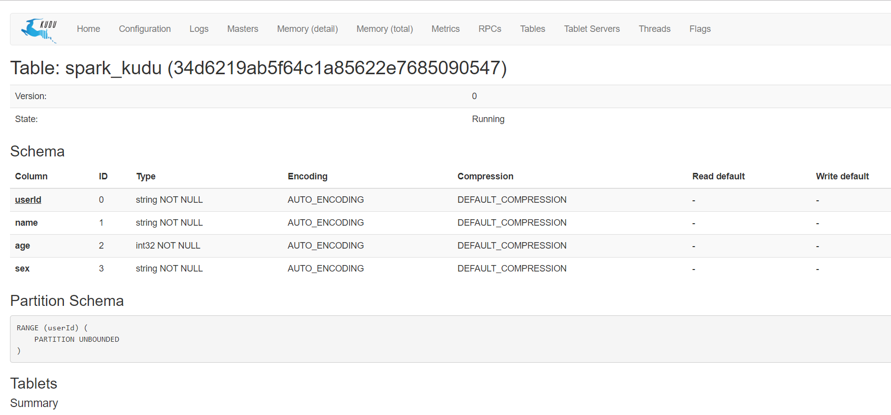

### 5.3 dataFrame操作kudu

#### 5.3.1 DML操作

Kudu支持许多DML类型的操作，其中一些操作包含在Spark on Kudu集成.
包括：

* INSERT - 将DataFrame的行插入Kudu表。请注意，虽然API完全支持INSERT，但不鼓励在Spark中使用它。
  使用INSERT是有风险的，因为Spark任务可能需要重新执行，这意味着可能要求再次插入已插入的行。这样
  做会导致失败，因为如果行已经存在，INSERT将不允许插入行（导致失败）。相反，我们鼓励使用下面描述
  的INSERT_IGNORE。
* INSERT-IGNORE - 将DataFrame的行插入Kudu表。如果表存在，则忽略插入动作。
* DELETE - 从Kudu表中删除DataFrame中的行
* UPSERT - 如果存在，则在Kudu表中更新DataFrame中的行，否则执行插入操作。
* UPDATE - 更新dataframe中的行

##### 5.3.1.1 插入数据insert操作

* 1、先创建一张表，然后把数据插入到表中

```scala
     case class People(id:Int,name:String,age:Int)
     object DataFrameKudu {
       def main(args: Array[String]): Unit = {
           //构建SparkConf对象
          val sparkConf: SparkConf = new SparkConf().setAppName("DataFrameKudu").setMaster("local[2]")
          //构建SparkSession对象
          val sparkSession: SparkSession = SparkSession.builder().config(sparkConf).getOrCreate()
          //获取SparkContext对象
          val sc: SparkContext = sparkSession.sparkContext
         sc.setLogLevel("warn")
           //指定kudu的master地址
          val kuduMaster="node1:7051,node2:7051,node3:7051"
           //构建KuduContext对象
          val kuduContext = new KuduContext(kuduMaster,sc)
            //定义表名
            val tableName="people"
            //1、创建表
           createTable(kuduContext, tableName)
           //2、插入数据到表中
         insertData2table(sparkSession,sc, kuduContext, tableName)
       }
      /**
     * 创建表
     * @param kuduContext
     * @param tableName
     */
    private def createTable(kuduContext: KuduContext, tableName: String): Unit = {
      //定义表的schema
      val schema = StructType(
          StructField("id", IntegerType, false) ::
          StructField("name", StringType, false) ::
          StructField("age", IntegerType, false) :: Nil
      )

      //定义表的主键
      val tablePrimaryKey = List("id")

      //定义表的选项配置
      val options = new CreateTableOptions
      options.setRangePartitionColumns(List("id").asJava)
      options.setNumReplicas(1)

      //创建表
      if (!kuduContext.tableExists(tableName)) {
        kuduContext.createTable(tableName, schema, tablePrimaryKey, options)
      }
    }

        /**
      * 插入数据到表中
      * @param sparkSession
      * @param sc
      * @param kuduContext
      * @param tableName
      */
    private def insertData2table(sparkSession:SparkSession,sc: SparkContext, kuduContext: KuduContext, tableName: String): Unit = {
      //准备数据
      val data = List(People(1, "zhangsan", 20), People(2, "lisi", 30), People(3, "wangwu", 40))
      val peopleRDD: RDD[People] = sc.parallelize(data)
      import sparkSession.implicits._
      val peopleDF: DataFrame = peopleRDD.toDF
      kuduContext.insertRows(peopleDF, tableName)
    }

  }
```

##### 5.3.1.2 删除数据delete操作

```java

  /**
    * 删除表的数据
    * @param sparkSession
    * @param sc
    * @param kuduMaster
    * @param kuduContext
    * @param tableName
    */
  private def deleteData(sparkSession: SparkSession, sc: SparkContext, kuduMaster: String, kuduContext: KuduContext, tableName: String): Unit = {
    //定义一个map集合，封装kudu的相关信息
    val options = Map(
      "kudu.master" -> kuduMaster,
      "kudu.table" -> tableName
    )
    import sparkSession.implicits._
    val data = List(People(1, "zhangsan", 20), People(2, "lisi", 30), People(3, "wangwu", 40))
    val dataFrame: DataFrame = sc.parallelize(data).toDF
    dataFrame.createTempView("temp")
    //获取年龄大于30的所有用户id
    val result: DataFrame = sparkSession.sql("select id from temp where age >30")
    //删除对应的数据，这里必须要是主键字段
    kuduContext.deleteRows(result, tableName)
  }
```

##### 5.3.1.3 更新数据upsert操作

```scala
 /**
    * 更新数据--添加数据
    *
    * @param sc
    * @param kuduMaster
    * @param kuduContext
    * @param tableName
    */
  private def UpsertData(sparkSession: SparkSession,sc: SparkContext, kuduMaster: String, kuduContext: KuduContext, tableName: String): Unit = {
    //更新表中的数据
    //定义一个map集合，封装kudu的相关信息
    val options = Map(
      "kudu.master" -> kuduMaster,
      "kudu.table" -> tableName
    )

    import sparkSession.implicits._
    val data = List(People(1, "zhangsan", 50), People(5, "tom", 30))
    val dataFrame: DataFrame = sc.parallelize(data).toDF
    //如果存在就是更新，否则就是插入
    kuduContext.upsertRows(dataFrame, tableName)
  }
```

##### 5.3.1.4 更新数据update操作

```scala
  /**
    * 更新数据
    * @param sparkSession
    * @param sc
    * @param kuduMaster
    * @param kuduContext
    * @param tableName
    */
  private def updateData(sparkSession: SparkSession,sc: SparkContext, kuduMaster: String, kuduContext: KuduContext, tableName: String): Unit = {
    //定义一个map集合，封装kudu的相关信息
    val options = Map(
      "kudu.master" -> kuduMaster,
      "kudu.table" -> tableName
    )

    import sparkSession.implicits._
    val data = List(People(1, "zhangsan", 60), People(6, "tom", 30))
    val dataFrame: DataFrame = sc.parallelize(data).toDF
    //如果存在就是更新，否则就是报错
    kuduContext.updateRows(dataFrame, tableName)
  }
```

#### 5.3.2 DataFrameApi读取kudu表中的数据

​          虽然我们可以通过上面显示的KuduContext执行大量操作，但我们还可以直接从默认数据源本身调用读/写API。要设置读取，我们需要为Kudu表指定选项，命名我们要读取的表以及为表提供服务的Kudu集群的Kudu主服务器列表。

* 代码示例

```scala
  /**
    * 使用DataFrameApi读取kudu表中的数据
    * @param sparkSession
    * @param kuduMaster
    * @param tableName
    */
  private def getTableData(sparkSession: SparkSession, kuduMaster: String, tableName: String): Unit = {
     //定义map集合，封装kudu的master地址和要读取的表名
    val options = Map(
      "kudu.master" -> kuduMaster,
      "kudu.table" -> tableName
    )
    sparkSession.read.options(options).kudu.show()
  }
```

#### 5.3.3 DataFrameApi写数据到kudu表中

​    在通过DataFrame API编写时，目前只支持一种模式“append”。尚未实现的“覆盖”模式。

* 代码示例

```scala
  /**
    * DataFrame api 写数据到kudu表
    * @param sparkSession
    * @param sc
    * @param kuduMaster
    * @param tableName
    */
  private def dataFrame2kudu(sparkSession: SparkSession, sc: SparkContext, kuduMaster: String, tableName: String): Unit = {
 //定义map集合，封装kudu的master地址和要读取的表名
    val options = Map(
      "kudu.master" -> kuduMaster,
      "kudu.table" -> tableName
    )
    val data = List(People(7, "jim", 30), People(8, "xiaoming", 40))
    import sparkSession.implicits._
    val dataFrame: DataFrame = sc.parallelize(data).toDF
    //把dataFrame结果写入到kudu表中  ,目前只支持append追加
    dataFrame.write.options(options).mode("append").kudu

    //查看结果
    //导包
    import org.apache.kudu.spark.kudu._
   //加载表的数据，导包调用kudu方法，转换为dataFrame，最后在使用show方法显示结果
   sparkSession.read.options(options).kudu.show()
  }


```

#### 5.3.4 使用sparksql操作kudu表

​    可以选择使用Spark SQL直接使用INSERT语句写入Kudu表；与'append'类似，INSERT语句实际上将默认使用
UPSERT语义处理；

* 代码示例

```scala
/**
    * 使用sparksql操作kudu表
    * @param sparkSession
    * @param sc
    * @param kuduMaster
    * @param tableName
    */
  private def SparkSql2Kudu(sparkSession: SparkSession, sc: SparkContext, kuduMaster: String, tableName: String): Unit = {
   //定义map集合，封装kudu的master地址和表名
    val options = Map(
      "kudu.master" -> kuduMaster,
      "kudu.table" -> tableName
    )
    val data = List(People(10, "小张", 30), People(11, "小王", 40))
    import sparkSession.implicits._
    val dataFrame: DataFrame = sc.parallelize(data).toDF
      //把dataFrame注册成一张表
    dataFrame.createTempView("temp1")

    //获取kudu表中的数据，然后注册成一张表
    sparkSession.read.options(options).kudu.createTempView("temp2")
      //使用sparkSQL的insert操作插入数据
    sparkSession.sql("insert into table temp2 select * from temp1")
    sparkSession.sql("select * from temp2 where age >30").show()
  }
```

### 5.4 Kudu Native RDD

Spark与Kudu的集成同时提供了kudu RDD.

* 代码示例

```scala
    //使用kuduContext对象调用kuduRDD方法，需要sparkContext对象，表名，想要的字段名称
   val kuduRDD: RDD[Row] = kuduContext.kuduRDD(sc,tableName,Seq("name","age"))
    //操作该rdd 打印输出
    val result: RDD[(String, Int)] = kuduRDD.map {
      case Row(name: String, age: Int) => (name, age)
    }
    result.foreach(println)
```

## 6、kudu集成impala

### 6.1 impala基本介绍

impala是cloudera提供的一款高效率的sql查询工具，提供实时的查询效果，官方测试性能比hive快10到100倍，其sql查询比sparkSQL还要更加快速，号称是当前大数据领域最快的查询sql工具，
impala是参照谷歌的新三篇论文（Caffeine--网络搜索引擎、Pregel--分布式图计算、Dremel--交互式分析工具）当中的Dremel实现而来，其中旧三篇论文分别是（BigTable，GFS，MapReduce）分别对应我们即将学的HBase和已经学过的HDFS以及MapReduce。
impala是基于hive并使用内存进行计算，兼顾数据仓库，具有实时，批处理，多并发等优点
Kudu与Apache Impala （孵化）紧密集成，impala天然就支持兼容kudu，允许开发人员使用Impala的SQL语法从Kudu的tablets 插入，查询，更新和删除数据；

### 6.2 **impala的架构**以及查询计划


* Impalad
  * 基本是每个DataNode上都会启动一个Impalad进程，Impalad主要扮演两个角色：
    * Coordinator：
      * 负责接收客户端发来的查询，解析查询，构建查询计划
      * 把查询子任务分发给很多Executor，收集Executor返回的结果，组合后返回给客户端
      * 对于客户端发送来的DDL，提交给Catalogd处理
    * Executor：
      * 执行查询子任务，将子任务结果返回给Coordinator
* Catalogd
  * 整个集群只有一个Catalogd，负责所有元数据的更新和获取
* StateStored
  * 整个集群只有一个Statestored，作为集群的订阅中心，负责集群不同组件的信息同步
  * 跟踪集群中的Impalad的健康状态及位置信息，由statestored进程表示，它通过创建多个线程来处理Impalad的注册订阅和与各Impalad保持心跳连接，各Impalad都会缓存一份State Store中的信息，当State Store离线后（Impalad发现State Store处于离线时，会进入recovery模式，反复注册，当State Store重新加入集群后，自动恢复正常，更新缓存数据）因为Impalad有State Store的缓存仍然可以工作，但会因为有些Impalad失效了，而已缓存数据无法更新，导致把执行计划分配给了失效的Impalad，导致查询失败。

### 6.3 安装impala

* 按照规划

|        服务名称        | node1 | node2 | node3 |
| :----------------: | :---: | :---: | :---: |
|   impala-catalog   |  不安装  |  不安装  |  安装   |
| impala-state-store |  不安装  |  不安装  |  安装   |
|   impala-server    |  安装   |  安装   |  安装   |
|       impala       |  安装   |  安装   |  安装   |

* 主节点node3执行以下命令进行安装

```shell
yum install impala -y
yum install impala-server -y
yum install impala-state-store -y
yum install impala-catalog -y
yum install bigtop-utils -y
yum install impala-shell -y

```

* 从节点node1和node2上安装以下服务

```shell
yum install impala-server -y
yum install bigtop-utils -y

```

### 6.4 所有节点配置impala

#### 6.4.1 修改hive-site.xml文件

* impala依赖于hive，所以首先需要进行hive的配置修改；
  * node1机器修改hive-site.xml内容如下:
  * vim /export/servers/hive-1.1.0-cdh5.14.0/conf/hive-site.xml

```xml
<configuration>
    <property>
        <name>javax.jdo.option.ConnectionURL</name>
        <value>jdbc:mysql://node1:3306/hive?
        createDatabaseIfNotExist=true</value>
    </property>
    <property>
        <name>javax.jdo.option.ConnectionDriverName</name>
        <value>com.mysql.jdbc.Driver</value>
    </property>
    <property>
        <name>javax.jdo.option.ConnectionUserName</name>
        <value>root</value>
    </property>
    <property>
        <name>javax.jdo.option.ConnectionPassword</name>
        <value>123456</value>
    </property>
    <property>
        <name>hive.cli.print.current.db</name>
        <value>true</value>
    </property>
    <property>
        <name>hive.cli.print.header</name>
        <value>true</value>
    </property>
    <property>
        <name>hive.server2.thrift.bind.host</name>
        <value>node1</value>
    </property>
    <property>
        <name>hive.metastore.uris</name>
        <value>thrift://node1:9083</value>
    </property>
    <property>
        <name>hive.metastore.client.socket.timeout</name>
        <value>3600</value>
    </property>
</configuration>
```

#### 6.4.2 添加mysql的jar包放入hive的lib目录下

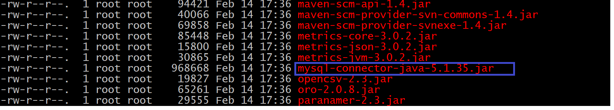

#### 6.4.3 将hive的安装包发送到node2与node3上

* 在node1上执行命令

```shell
cd /export/servers/
scp -r hive-1.1.0-cdh5.14.0/ node2:$PWD
scp -r hive-1.1.0-cdh5.14.0/ node3:$PWD
```

#### 6.4.4 启动hive的metastore服务

* 在node1上启动hive的metastore服务

```shell
  cd /export/servers/hive-1.1.0-cdh5.14.0
  nohup bin/hive --service metastore &
```

* 注意：一定要保证mysql的服务正常启动，否则metastore的服务不能够启动

#### 6.4.5 所有hadoop节点修改hdfs-site.xml添加以下内容

* 所有节点创建文件夹
  * mkdir -p /var/run/hdfs-sockets
* 修改所有节点的hdfs-site.xml添加以下配置，修改完之后重启hdfs集群生效
  vim /export/servers/hadoop-2.6.0-cdh5.14.0/etc/hadoop/hdfs-site.xml

```xml
<configuration>
        <property>
                <name>dfs.replication</name>
                <value>2</value>
        </property>
        <property>
                <name>dfs.permissions</name>
                <value>false</value>
        </property>
        <property>
                <name>dfs.blocksize</name>
                <value>134217728</value>
        </property>
           <!--短路读取-就是允许impala把一些信息存储在本地磁盘上，可以加快计算的速度-->
        <property>
                <name>dfs.client.read.shortcircuit</name>
                <value>true</value>
        </property>
          <!--打开块位置的存储的元数据信息-->
         <property>
                <name>dfs.datanode.hdfs-blocks-metadata.enabled</name>
                <value>true</value>
        </property>
         <!--Datanode和DFSClient之间沟通的Socket的本地文件路径-->
        <property>
                <name>dfs.domain.socket.path</name>
                <value>/var/run/hdfs-sockets/dn</value>
        </property>
        <!--分布式文件系统中并行RPC的超时-->
        <property>
                <name>dfs.client.file-block-storage-locations.timeout.millis</name>
                <value>10000</value>
        </property>

</configuration>
```

#### 6.4.6 重启hdfs

* 在hadoop集群的主节点node1上执行
  * stop-dfs.sh
  * start-dfs.sh

#### 6.5.7 创建hadoop与hive的配置文件的连接

* impala的配置目录为 /etc/impala/conf
  * 这个路径下面需要把core-site.xml，hdfs-site.xml以及hive-site.xml拷贝到这里来，但是我们这里使用软连接的方式会更好。
  * 所有节点执行以下命令创建链接到impala配置目录下来

```shell
ln -s /export/servers/hadoop-2.6.0-cdh5.14.0/etc/hadoop/core-site.xml /etc/impala/conf/core-site.xml
ln -s /export/servers/hadoop-2.6.0-cdh5.14.0/etc/hadoop/hdfs-site.xml  /etc/impala/conf/hdfs-site.xml
ln -s /export/servers/hive-1.1.0-cdh5.14.0/conf/hive-site.xml /etc/impala/conf/hive-site.xml
```

#### 6.4.8 所有节点修改impala默认配置

* 所有节点更改impala默认配置文件以及添加mysql的连接驱动包

* vim /etc/default/impala

```shell
  #指定集群的CATALOG_SERVICE和STATE_STORE服务地址
  IMPALA_CATALOG_SERVICE_HOST=node3
  IMPALA_STATE_STORE_HOST=node3
```

#### 6.4.9 所有节点创建mysql的驱动包的软连接

```shell
ln -s /export/servers/hive-1.1.0-cdh5.14.0/lib/mysql-connector-java-5.1.35.jar /usr/share/java/mysql-connector-java.jar
```

#### 6.4.10 所有节点修改bigtop的java路径

* 修改bigtop的java_home路径
  * vim /etc/default/bigtop-utils

```shell
    export JAVA_HOME=/export/servers/jdk
```

#### 6.4.11 启动impala服务

* 在主节点node3启动以下三个服务进程

```shell
  service impala-state-store start
  service impala-catalog start
  service impala-server start
```

* 在从节点node1和node2上启动impala-server

```shell
  service impala-server start
```

* 查看impala进程是否存在

```shell
  ps -ef | grep impala
```


注意：启动之后所有关于impala的日志默认都在/var/log/impala 这个路径下，node3机器上面应该有三个进
程，node1与node2机器上面只有一个进程，如果进程个数不对，去对应目录下查看报错日志

#### 6.4.12 浏览器页面访问

* 访问impalad的管理界面<http://node3:25000/>
  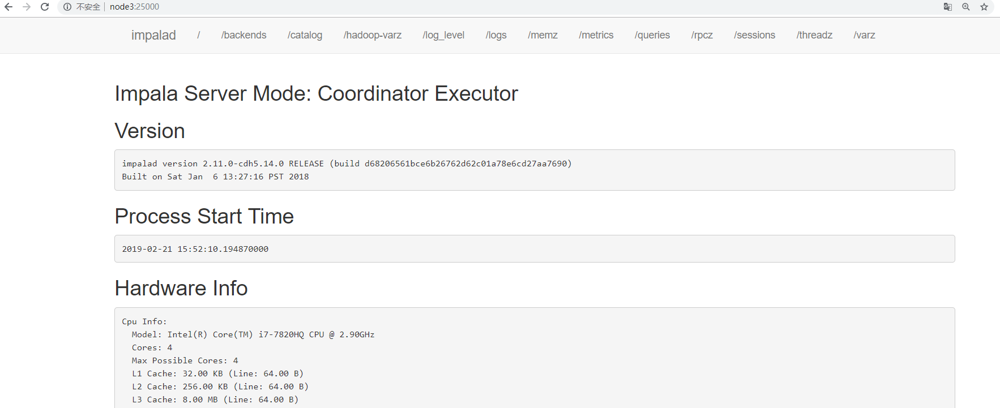
* 访问statestored的管理界面<http://node3:25010/>
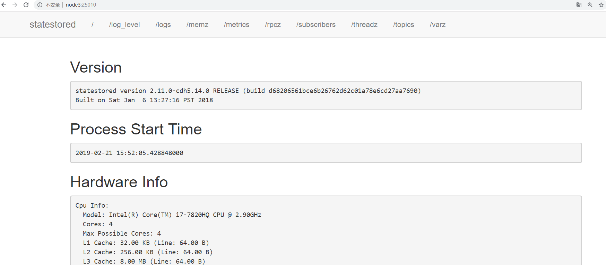
* 访问catalogd 的管理界面<http://node3:25020/>
  

### 6.5 将impala与kudu整合

* 在每一个服务器的impala的配置文件中添加如下配置：

  * vim /etc/default/impala

```shell
  在IMPALA_SERVER_ARGS下添加：
  -kudu_master_hosts=node1:7051,node2:7051,node3:7051
```

如下图：
  

## 7、使用impala操作kudu整合

* 1、需要先启动hdfs、hive、kudu、impala
* 2、使用impala的shell控制台
  * 执行命令impala-shell

```shell
  (1):使用该impala-shell命令启动Impala Shell 。默认情况下，impala-shell 尝试连接到localhost端口21000 上的Impala守护程序。要连接到其他主机，请使用该-i <host:port>选项。要自动连接到特定的Impala数据库，请使用该-d <database>选项。例如，如果您的所有Kudu表都位于数据库中的Impala中impala_kudu，则-d impala_kudu可以使用此数据库。
  (2)：要退出Impala Shell，请使用以下命令： quit;
```

  

### 7.1 创建kudu表

* 使用Impala创建新的Kudu表时，可以将该表创建为内部表或外部表。

#### 7.1.1 内部表

* 内部表由Impala管理，当您从Impala中删除时，数据和表确实被删除。当您使用Impala创建新表时，它通常是内部表。
  * 使用impala创建内部表：

```sql
  CREATE TABLE my_first_table
  (
  id BIGINT,
  name STRING,
  PRIMARY KEY(id)
  )
  PARTITION BY HASH PARTITIONS 16
  STORED AS KUDU
  TBLPROPERTIES (
  'kudu.master_addresses' = 'node1:7051,node2:7051,node3:7051',
  'kudu.table_name' = 'my_first_table'
  );
  在 CREATE TABLE 语句中，必须首先列出构成主键的列。
```

* 此时创建的表是内部表，从impala删除表的时候，在底层存储的kudu也会删除表。

```sql
drop table if exists my_first_table;
```

#### 7.1.2 外部表

* 外部表（创建者CREATE EXTERNAL TABLE）不受Impala管理，并且删除此表不会将表从其源位置（此处为Kudu）丢弃。相反，它只会去除Impala和Kudu之间的映射。这是Kudu提供的用于将现有表映射到Impala的语法。
* 使用java创建一个kudu表：
  * 代码

```java
public class CreateTable {
        private static ColumnSchema newColumn(String name, Type type, boolean iskey) {
                ColumnSchema.ColumnSchemaBuilder column = new
                    ColumnSchema.ColumnSchemaBuilder(name, type);
                column.key(iskey);
                return column.build();
        }
    public static void main(String[] args) throws KuduException {
        // master地址
        final String masteraddr = "node1,node2,node3";
        // 创建kudu的数据库链接
        KuduClient client = new
     KuduClient.KuduClientBuilder(masteraddr).defaultSocketReadTimeoutMs(6000).build();
        // 设置表的schema
        List<ColumnSchema> columns = new LinkedList<ColumnSchema>();
        columns.add(newColumn("CompanyId", Type.INT32, true));
        columns.add(newColumn("WorkId", Type.INT32, false));
        columns.add(newColumn("Name", Type.STRING, false));
        columns.add(newColumn("Gender", Type.STRING, false));
        columns.add(newColumn("Photo", Type.STRING, false));
        Schema schema = new Schema(columns);
    //创建表时提供的所有选项
    CreateTableOptions options = new CreateTableOptions();
    // 设置表的replica备份和分区规则
    List<String> parcols = new LinkedList<String>();
    parcols.add("CompanyId");
    //设置表的备份数
        options.setNumReplicas(1);
    //设置range分区
    options.setRangePartitionColumns(parcols);
    //设置hash分区和数量
    options.addHashPartitions(parcols, 3);
    try {
    client.createTable("person", schema, options);
    } catch (KuduException e) {
    e.printStackTrace();
    }
    client.close();
    }
}
```

* 在kudu的页面上可以观察到如下信息：
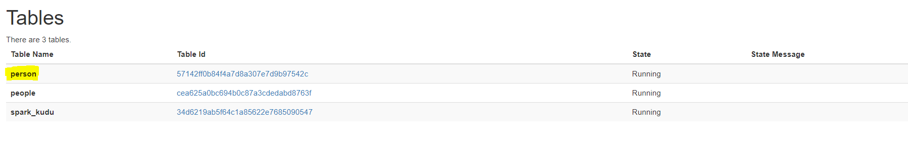
* 在impala的命令行查看表:
  
  * 当前在impala中并没有person这个表
* 使用impala创建外部表 ， 将kudu的表映射到impala上：
  * 在impala-shell执行

```sql
  CREATE EXTERNAL TABLE `person` STORED AS KUDU
  TBLPROPERTIES(
      'kudu.table_name' = 'person',
      'kudu.master_addresses' = 'node1:7051,node2:7051,node3:7051')
```

  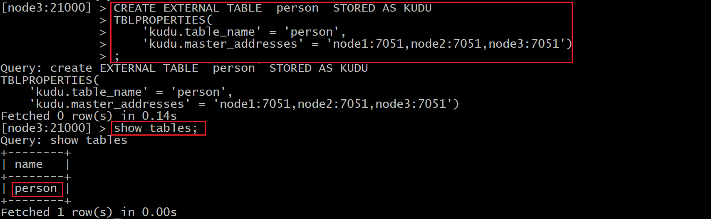

### 7.2 使用impala对kudu进行DML操作

#### 7.2.1 将数据插入 Kudu 表

* impala 允许使用标准 SQL 语句将数据插入 Kudu 。

##### 7.2.1.1 插入单个值

* 创建表

```sql
  CREATE TABLE my_first_table1
  (
  id BIGINT,
  name STRING,
  PRIMARY KEY(id)
  )
  PARTITION BY HASH PARTITIONS 16
  STORED AS KUDU
  TBLPROPERTIES(
      'kudu.table_name' = 'person1',
      'kudu.master_addresses' = 'node1:7051,node2:7051,node3:7051');
```

* 此示例插入单个行

```sql
  INSERT INTO my_first_table VALUES (50, "zhangsan");
```

* 查看数据

```sql
  select * from my_first_table
```

  

* 使用单个语句插入三行

```sql
  INSERT INTO my_first_table VALUES (1, "john"), (2, "jane"), (3, "jim");
```

  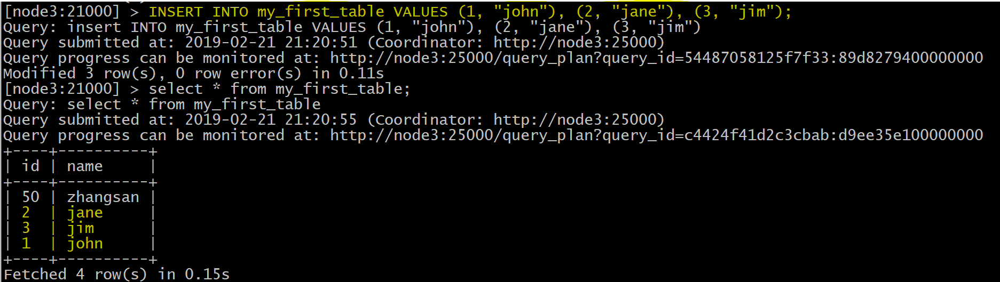

##### 7.2.1.2 批量插入Batch Insert

* 从 Impala 和 Kudu 的角度来看，通常表现最好的方法通常是使用 Impala 中的 SELECT FROM 语句导入数据

  * 示例

```sql
  INSERT INTO my_first_table
  SELECT * FROM temp1;
```

#### 7.2.2 更新数据

* 示例

```sql
  UPDATE my_first_table SET name="xiaowang" where id =1 ;
```

  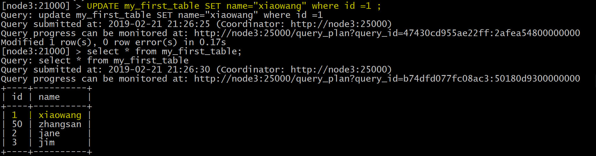

#### 7.2.3 删除数据

* 示例

```sql
  delete from my_first_table where id =2;
```

  

### 7.3 更改表属性

* 开发人员可以通过更改表的属性来更改 Impala 与给定 Kudu 表相关的元数据。这些属性包括表名， Kudu 主地址列表，以及表是否由 Impala （内部）或外部管理。

#### 7.3.1 Rename an Impala Mapping Table ( 重命名 Impala 映射表 )

```sql
ALTER TABLE PERSON RENAME TO person_temp;
```

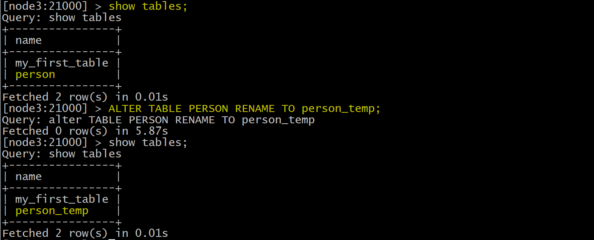

#### 7.3.2 Rename the underlying Kudu table for an internal table ( 重新命名内部表的基础 Kudu 表 )

* 创建内部表：

```sql
  CREATE TABLE kudu_student
  (
  CompanyId INT,
  WorkId INT,
  Name STRING,
  Gender STRING,
  Photo STRING,
  PRIMARY KEY(CompanyId)
  )
  PARTITION BY HASH PARTITIONS 16
  STORED AS KUDU
  TBLPROPERTIES (
  'kudu.master_addresses' = 'node1:7051,node2:7051,node3:7051',
  'kudu.table_name' = 'student'
  );
```

* 如果表是内部表，则可以通过更改 kudu.table_name 属性重命名底层的 Kudu 表

```sql
  ALTER TABLE kudu_student SET TBLPROPERTIES('kudu.table_name' = 'new_student');
```

* 效果图
    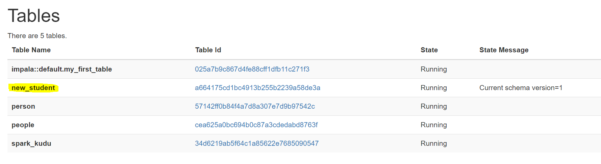

#### 7.3.3 Remapping an external table to a different Kudu table ( 将外部表重新映射到不同的 Kudu 表 )

* 如果用户在使用过程中发现其他应用程序重新命名了kudu表，那么此时的外部表需要重新映射到kudu上

  * 创建一个外部表：

```sql
  CREATE EXTERNAL TABLE external_table
      STORED AS KUDU
      TBLPROPERTIES (
      'kudu.master_addresses' = 'node1:7051,node2:7051,node3:7051',
      'kudu.table_name' = 'person'
  );
```

* 重新映射外部表，指向不同的kudu表：

```sql
  ALTER TABLE external_table
  SET TBLPROPERTIES('kudu.table_name' = 'hashTable')
```

  上面的操作是：将external_table映射的PERSON表重新指向hashTable表

#### 7.3.4 Change the Kudu Master Address ( 更改 Kudu Master 地址 )

```sql
ALTER TABLE my_table
SET TBLPROPERTIES('kudu.master_addresses' = 'kudu-new-master.example.com:7051');
```

#### 7.3.5 Change an Internally-Managed Table to External ( 将内部管理的表更改为外部 )

```sql
ALTER TABLE my_table SET TBLPROPERTIES('EXTERNAL' = 'TRUE');
```

### 7.4 impala使用java语言操作kudu

* 对于impala而言，开发人员是可以通过JDBC连接impala的，有了JDBC，开发人员可以通过impala来间接操作
  kudu；

#### 7.4.1 引入依赖

```xml
       <!--impala的jdbc操作-->
       <dependency>
            <groupId>com.cloudera</groupId>
            <artifactId>ImpalaJDBC41</artifactId>
            <version>2.5.42</version>
        </dependency>

        <!--Caused by : ClassNotFound : thrift.protocol.TPro-->
        <dependency>
            <groupId>org.apache.thrift</groupId>
            <artifactId>libfb303</artifactId>
            <version>0.9.3</version>
            <type>pom</type>
        </dependency>

        <!--Caused by : ClassNotFound : thrift.protocol.TPro-->
        <dependency>
            <groupId>org.apache.thrift</groupId>
            <artifactId>libthrift</artifactId>
            <version>0.9.3</version>
            <type>pom</type>
        </dependency>
        <dependency>
            <groupId>org.apache.hive</groupId>
            <artifactId>hive-jdbc</artifactId>
            <exclusions>
                <exclusion>
                    <groupId>org.apache.hive</groupId>
                    <artifactId>hive-service-rpc</artifactId>
                </exclusion>
                <exclusion>
                    <groupId>org.apache.hive</groupId>
                    <artifactId>hive-service</artifactId>
                </exclusion>
            </exclusions>
            <version>1.1.0</version>
        </dependency>

        <!--导入hive-->
        <dependency>
            <groupId>org.apache.hive</groupId>
            <artifactId>hive-service</artifactId>
            <version>1.1.0</version>
        </dependency>
```

#### 7.4.2 通过JDBC连接impala操作kudu

* 使用JDBC连接impala操作kudu，与JDBC连接mysql做更重增删改查基本一样

##### 7.4.2.1 创建实体类

```java
package cn.xhchen.impala.impala;

public class Person {
    private int companyId;
    private int workId;
    private  String name;
    private  String gender;
    private  String photo;

    public Person(int companyId, int workId, String name, String gender, String photo) {
        this.companyId = companyId;
        this.workId = workId;
        this.name = name;
        this.gender = gender;
        this.photo = photo;
    }

    public int getCompanyId() {
        return companyId;
    }

    public void setCompanyId(int companyId) {
        this.companyId = companyId;
    }

    public int getWorkId() {
        return workId;
    }

    public void setWorkId(int workId) {
        this.workId = workId;
    }

    public String getName() {
        return name;
    }

    public void setName(String name) {
        this.name = name;
    }

    public String getGender() {
        return gender;
    }

    public void setGender(String gender) {
        this.gender = gender;
    }

    public String getPhoto() {
        return photo;
    }

    public void setPhoto(String photo) {
        this.photo = photo;
    }
}

```

##### 7.4.2.2 JDBC连接impala对kudu进行增删改查

```java
package cn.xhchen.impala.impala;

import java.sql.*;

public class Contants {
    private static String JDBC_DRIVER="com.cloudera.impala.jdbc41.Driver";
    private static  String CONNECTION_URL="jdbc:impala://node1:21050/default;auth=noSasl";
     //定义数据库连接
    static Connection conn=null;
    //定义PreparedStatement对象
    static PreparedStatement ps=null;
    //定义查询的结果集
    static ResultSet rs= null;


    //数据库连接
    public static Connection getConn(){
        try {
            Class.forName(JDBC_DRIVER);
            conn=DriverManager.getConnection(CONNECTION_URL);
        } catch (Exception e) {
            e.printStackTrace();
        }

        return  conn;
    }

    //创建一个表
    public static void createTable(){
        conn=getConn();
        String sql="CREATE TABLE impala_kudu_test" +
                "(" +
                "companyId BIGINT," +
                "workId BIGINT," +
                "name STRING," +
                "gender STRING," +
                "photo STRING," +
                "PRIMARY KEY(companyId)" +
                ")" +
                "PARTITION BY HASH PARTITIONS 16 " +
                "STORED AS KUDU " +
                "TBLPROPERTIES (" +
                "'kudu.master_addresses' = 'node1:7051,node2:7051,node3:7051'," +
                "'kudu.table_name' = 'impala_kudu_test'" +
                ");";

        try {
            ps = conn.prepareStatement(sql);
            ps.execute();
        } catch (SQLException e) {
            e.printStackTrace();
        }
    }


    //查询数据
    public static ResultSet queryRows(){
        try {
            //定义执行的sql语句
            String sql="select * from impala_kudu_test";
            ps = getConn().prepareStatement(sql);
            rs= ps.executeQuery();
        } catch (SQLException e) {
            e.printStackTrace();
        }

        return  rs;
    }

    //打印结果
    public  static void printRows(ResultSet rs){
        /**
         private int companyId;
         private int workId;
         private  String name;
         private  String gender;
         private  String photo;
         */

        try {
            while (rs.next()){
                //获取表的每一行字段信息
                int companyId = rs.getInt("companyId");
                int workId = rs.getInt("workId");
                String name = rs.getString("name");
                String gender = rs.getString("gender");
                String photo = rs.getString("photo");
                System.out.print("companyId:"+companyId+" ");
                System.out.print("workId:"+workId+" ");
                System.out.print("name:"+name+" ");
                System.out.print("gender:"+gender+" ");
                System.out.println("photo:"+photo);

            }
        } catch (SQLException e) {
            e.printStackTrace();
        }finally {
            if(ps!=null){
                try {
                    ps.close();
                } catch (SQLException e) {
                    e.printStackTrace();
                }
            }

            if(conn !=null){
                try {
                    conn.close();
                } catch (SQLException e) {
                    e.printStackTrace();
                }
            }
        }
    }


    //插入数据
    public static void insertRows(Person person){
        conn=getConn();
        String sql="insert into table impala_kudu_test(companyId,workId,name,gender,photo) values(?,?,?,?,?)";

        try {
            ps=conn.prepareStatement(sql);
            //给占位符？赋值
            ps.setInt(1,person.getCompanyId());
            ps.setInt(2,person.getWorkId());
            ps.setString(3,person.getName());
            ps.setString(4,person.getGender());
            ps.setString(5,person.getPhoto());
            ps.execute();

        } catch (SQLException e) {
            e.printStackTrace();
        }finally {
            if(ps !=null){
                try {
                    //关闭
                    ps.close();
                } catch (SQLException e) {
                    e.printStackTrace();
                }
            }

            if(conn !=null){
                try {
                      //关闭
                    conn.close();
                } catch (SQLException e) {
                    e.printStackTrace();
                }
            }
        }

    }

    //更新数据
    public static void updateRows(Person person){
       //定义执行的sql语句
        String sql="update impala_kudu_test set workId="+person.getWorkId()+
                ",name='"+person.getName()+"' ,"+"gender='"+person.getGender()+"' ,"+
                "photo='"+person.getPhoto()+"' where companyId="+person.getCompanyId();

        try {
            ps= getConn().prepareStatement(sql);
            ps.execute();
        } catch (SQLException e) {
            e.printStackTrace();
        }finally {
            if(ps !=null){
                try {
                      //关闭
                    ps.close();
                } catch (SQLException e) {
                    e.printStackTrace();
                }
            }

            if(conn !=null){
                try {
                      //关闭
                    conn.close();
                } catch (SQLException e) {
                    e.printStackTrace();
                }
            }
        }
    }

    //删除数据
    public   static void deleteRows(int companyId){
        //定义sql语句
        String sql="delete from impala_kudu_test where companyId="+companyId;
        try {
            ps =getConn().prepareStatement(sql);
            ps.execute();
        } catch (SQLException e) {
            e.printStackTrace();

        }

    }
   //删除表
    public static void dropTable() {
        String sql="drop table if exists impala_kudu_test";
        try {
            ps =getConn().prepareStatement(sql);
            ps.execute();
        } catch (SQLException e) {
            e.printStackTrace();
        }
    }
}

```

##### 7.4.2.3 代码测试运行

```~java
package cn.xhchen.impala.impala;

import java.sql.Connection;

public class ImpalaJdbcClient {
    public static void main(String[] args) {
        Connection conn = Contants.getConn();

        //创建一个表
       Contants.createTable();

        //插入数据
       Contants.insertRows(new Person(1,100,"lisi","male","lisi-photo"));

        //查询表的数据
        ResultSet rs = Contants.queryRows();
        Contants.printRows(rs);

        //更新数据
        Contants.updateRows(new Person(1,200,"zhangsan","male","zhangsan-photo"));

        //删除数据
        Contants.deleteRows(1);

        //删除表
        Contants.dropTable();

    }
}

```~


## 8、kudu原理

### 8.1 表与schema


    Kudu设计是面向结构化存储的，因此，Kudu的表需要用户在建表时定义它的Schema信息，这些Schema信息
包含：列定义（含类型），Primary Key定义（用户指定的若干个列的有序组合）。数据的唯一性，依赖于用户所
提供的Primary Key中的Column组合的值的唯一性。 Kudu提供了Alter命令来增删列，但位于Primary Key中的列是不允许删除的。 Kudu当前并不支持二级索引。 从用户角度来看，Kudu是一种存储结构化数据表的存储系统。
在一个Kudu集群中可以定义任意数量的table，每个table都需要预先定义好schema。每个table的列数是确定的，
每一列都需要有名字和类型，每个表中可以把其中一列或多列定义为主键。这么看来，Kudu更像关系型数据库，
而不是像HBase、Cassandra和MongoDB这些NoSQL数据库。不过Kudu目前还不能像关系型数据一样支持二级索
引。
    Kudu使用确定的列类型，而不是类似于NoSQL的“everything is byte”。这可以带来两点好处： 确定的列类型使Kudu可以进行类型特有的编码。 可以提供 SQL-like 元数据给其他上层查询工具，比如BI工具。


### 8.2 kudu的底层数据模型


Kudu的底层数据文件的存储，未采用HDFS这样的较高抽象层次的分布式文件系统，而是自行开发了一套可基于
Table/Tablet/Replica视图级别的底层存储系统。
这套实现基于如下的几个设计目标：
• 可提供快速的列式查询
• 可支持快速的随机更新
• 可提供更为稳定的查询性能保障
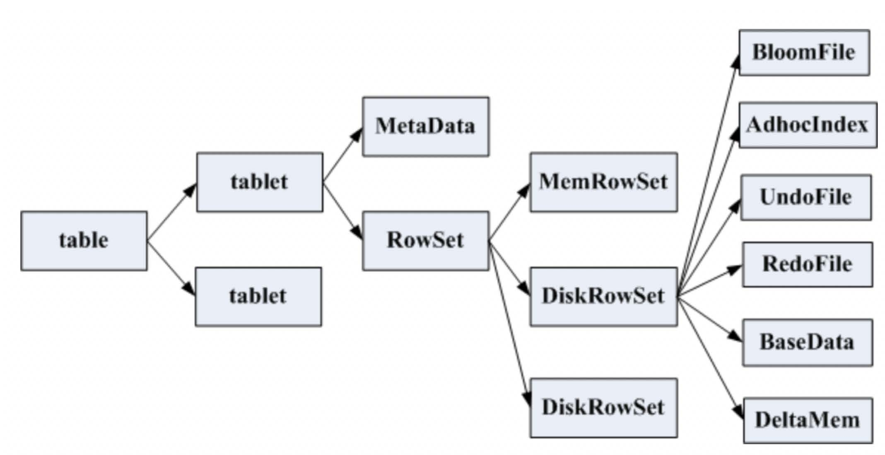
一张表会分成若干个tablet，每个tablet包括MetaData元信息及若干个RowSet，RowSet包含一个MemRowSet及
若干个DiskRowSet，DiskRowSet中包含一个BloomFile、Ad_hoc Index、BaseData、DeltaMem及若干个
RedoFile和UndoFile（UndoFile一般情况下只有一个）。
MemRowSet：用于新数据insert及已在MemRowSet中的数据的更新，一个MemRowSet写满后会将数据刷到磁盘形成若干个DiskRowSet。每次到达32M生成一个DiskRowSet。
DiskRowSet：用于老数据的变更（mutation），后台定期对DiskRowSet做compaction，以删除没用的数据及合并历史数据，减少查询过程中的IO开销。
BloomFile：根据一个DiskRowSet中的key生成一个bloom filter，用于快速模糊定位某个key是否在DiskRowSet中存在。
Ad_hocIndex：是主键的索引，用于定位key在DiskRowSet中的具体哪个偏移位置。
BaseData是MemRowSet flush下来的数据，按列存储，按主键有序。
UndoFile是基于BaseData之前时间的历史数据，通过在BaseData上apply UndoFile中的记录，可以获得历史数
据。
RedoFile是基于BaseData之后时间的变更（mutation）记录，通过在BaseData上apply RedoFile中的记录，可获得较新的数据。
DeltaMem用于DiskRowSet中数据的变更mutation，先写到内存中，写满后flush到磁盘形成RedoFile。
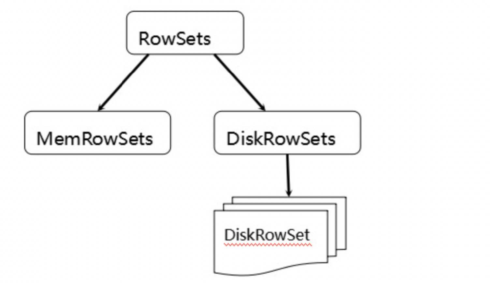
MemRowSets可以对比理解成HBase中的MemStore, 而DiskRowSets可理解成HBase中的HFile。MemRowSets中
的数据按照行试图进行存储，数据结构为B-Tree。
MemRowSets中的数据被Flush到磁盘之后，形成DiskRowSets。
DisRowSets中的数据，按照32MB大小为单位，按序划分为一个个的DiskRowSet。 DiskRowSet中的数据按照Column进行组织，与Parquet类似。
这是Kudu可支持一些分析性查询的基础。每一个Column的数据被存储在一个相邻的数据区域，而这个数据区域进
一步被细分成一个个的小的Page单元，与HBase File中的Block类似，对每一个Column Page可采用一些Encoding算法，以及一些通用的Compression算法。 既然可对Column Page可采用Encoding以及Compression算法，那么，对单条记录的更改就会比较困难了。
前面提到了Kudu可支持单条记录级别的更新/删除，是如何做到的？
与HBase类似，也是通过增加一条新的记录来描述这次更新/删除操作的。DiskRowSet是不可修改了，那么 KUDU 要如何应对数据的更新呢？在KUDU中，把DiskRowSet分为了两部分：base data、delta stores。base data 负责存储基础数据，delta stores负责存储 base data 中的变更数据.
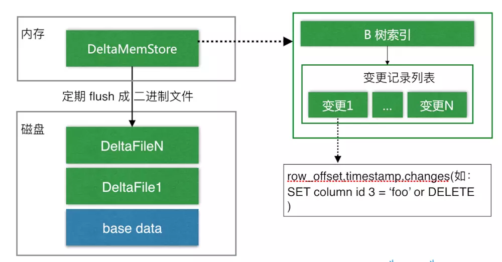
如上图所示，数据从 MemRowSet 刷到磁盘后就形成了一份 DiskRowSet（只包含 base data），每份 DiskRowSet 在内存中都会有一个对应的 DeltaMemStore，负责记录此 DiskRowSet 后续的数据变更（更新、删除）。DeltaMemStore 内部维护一个 B-树索引，映射到每个 row_offset 对应的数据变更。DeltaMemStore 数据增长到一定程度后转化成二进制文件存储到磁盘，形成一个 DeltaFile，随着 base data 对应数据的不断变更，DeltaFile 逐渐增长。

### 8.3 Tablet的发现过程

    当创建Kudu客户端时，其会从主服务器上获取tablet位置信息，然后直接与服务于该tablet的服务器进行交谈。
    为了优化读取和写入路径，客户端将保留该信息的本地缓存，以防止他们在每个请求时需要查询主机的tablet位置信息。
    随着时间的推移，客户端的缓存可能会变得过时，并且当写入被发送到不再是tablet领导者的tablet服务器
时，则将被拒绝。然后客户端将通过查询主服务器发现新领导者的位置来更新其缓存。


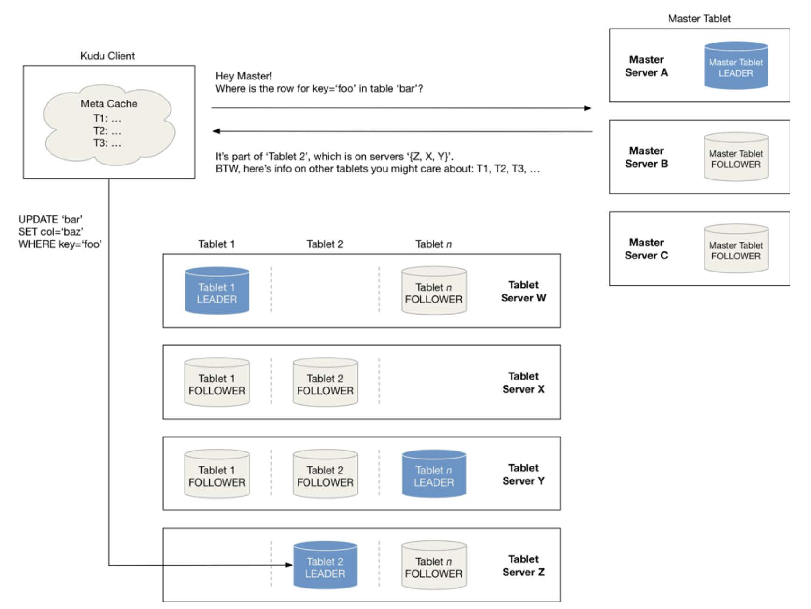

### 8.4 kudu的写流程

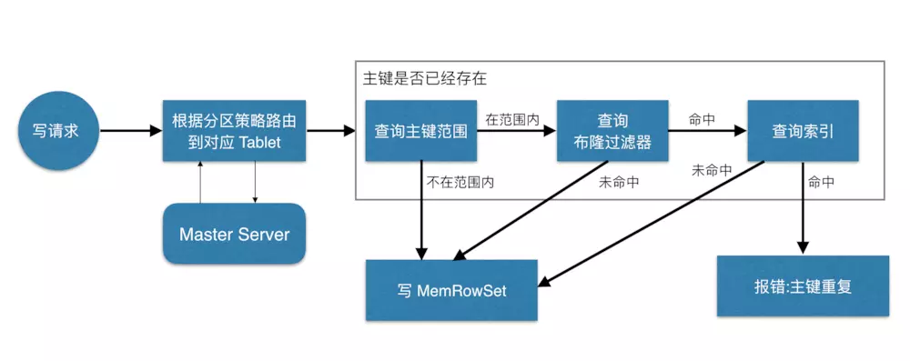
 如上图，当 Client 请求写数据时，先根据主键从Master Server中获取要访问的目标 Tablets，然后到依次对应的Tablet获取数据。
 因为KUDU表存在主键约束，所以需要进行主键是否已经存在的判断，这里就涉及到之前说的索引结构对读写的优化了。一个Tablet中存在很多个RowSets，为了提升性能，我们要尽可能地减少要扫描的RowSets数量。
首先，我们先通过每个 RowSet 中记录的主键的（最大最小）范围，过滤掉一批不存在目标主键的RowSets，然后在根据RowSet中的布隆过滤器，过滤掉确定不存在目标主键的 RowSets，最后再通过RowSets中的 B-树索引，精确定位目标主键是否存在。
 如果主键已经存在，则报错（主键重复），否则就进行写数据（写 MemRowSet）。

### 8.5 kudu的读流程

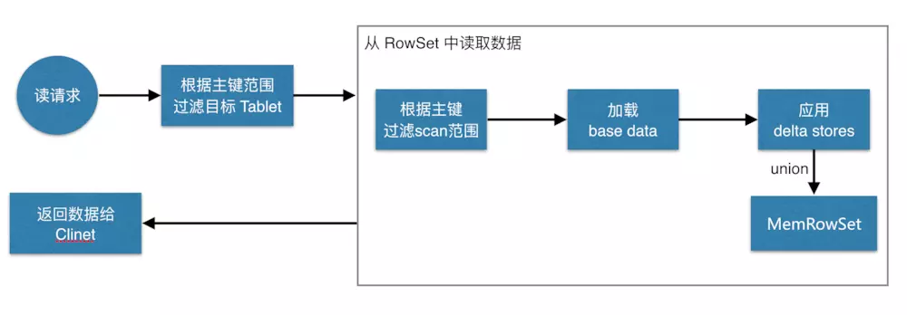
    如上图，数据读取过程大致如下：先根据要扫描数据的主键范围，定位到目标的Tablets，然后读取Tablets 中的RowSets。
    在读取每个RowSet时，先根据主键过滤要scan范围，然后加载范围内的base data，再找到对应的delta stores，应用所有变更，最后union上MemRowSet中的内容，返回数据给Client。

### 8.6 kudu的更新流程

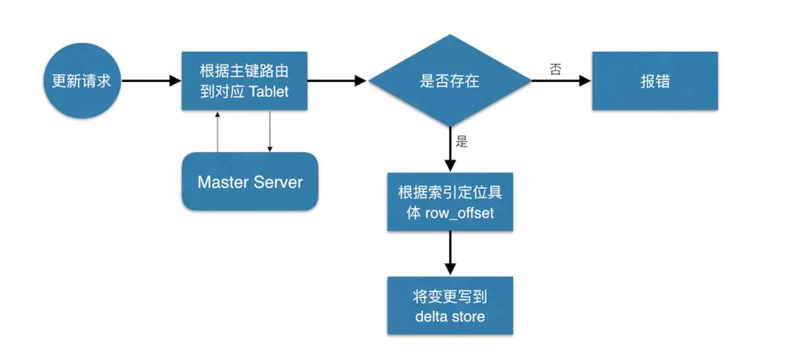

 数据更新的核心是定位到待更新数据的位置，这块与写入的时候类似，就不展开了，等定位到具体位置后，然后将变更写到对应的delta store 中。


### 示例

#### spark-warehouse

##### SparkKudu.scala

kudu_class06/src/main/java/cn/xhchen/kudu/SparkKudu.scala

```scala
package cn.xhchen.kudu

import java.util

import org.apache.kudu.client.CreateTableOptions
import org.apache.kudu.spark.kudu.KuduContext
import org.apache.spark.rdd.RDD
import org.apache.spark.{SparkConf, SparkContext}
import org.apache.spark.sql.{DataFrame, Row, SparkSession}
import org.apache.spark.sql.types.{IntegerType, StringType, StructField, StructType}
import org.apache.kudu.spark.kudu._

//todo:通过scala语言编写spark程序来操作kudu集群

case class Itcast(id:Int,name:String,age:Int,sex:Int)

object SparkKudu {
  //定义kudu集群的地址
   val kuduMaster="node1:7051,node2:7051,node3:7051"
  //定义表名
   val tableName="xhchen"
  //定义要操作的kudu集群表的配置map集合
  val kuduOptions=Map(
       "kudu.master" -> kuduMaster,
       "kudu.table"  -> tableName
  )

  def main(args: Array[String]): Unit = {
        //1、创建SparkConf对象
         val sparkConf: SparkConf = new SparkConf().setAppName("SparkKudu").setMaster("local[2]")
        //2、创建SparkSession对象
         val sparkSession: SparkSession = SparkSession.builder().config(sparkConf).getOrCreate()
       //3、获取SparkContext对象
          val sc: SparkContext = sparkSession.sparkContext
          sc.setLogLevel("warn")
       //4、构建KuduContext对象
           val kuduContext = new KuduContext(kuduMaster,sc)
      //5、spark程序操作kudu表，实现增删改查
         //todo:5.1 创建一张表
          //createTable(kuduContext)
         //todo: 5.2 加载数据
          //insertTable(sparkSession,sc, kuduContext)
         //todo: 5.3 更新数据
           //updateData(sparkSession,kuduContext)
         //todo: 5.4 删除数据
          //deleteData(sparkSession,kuduContext)
    //6、使用dataFrame api来操作kudu表
        //todo：6.1 读取kudu表中的数据
         val kuduDF: DataFrame = sparkSession.read.options(kuduOptions).kudu
          kuduDF.show()

       //todo：6.2 把结果数据写入到kudu表中
       val data = List(Itcast(1, "zhangsan", 30, 1), Itcast(2, "lisi", 40, 0))
       import sparkSession.implicits._
       val dataFrame: DataFrame = data.toDF
         //  目前 kudu集成spark，数据保存到kudu表中 目前只支持append追加
       dataFrame.write.mode("append").option("kudu.master",kuduMaster).option("kudu.table",tableName).kudu
    //7 使用sparksql 写sql语句的方式操作kudu表
        kuduDF.createTempView("xhchen")
        sparkSession.sql("select * from xhchen").show()
        sparkSession.sql("select count(*) from xhchen ").show()
        sparkSession.sql("select * from xhchen where age >40").show()
        sparkSession.sql("select * from xhchen order by age desc").show()
       //查询
       val rowRDD: RDD[Row] = kuduContext.kuduRDD(sc,tableName,List("id","name","age","sex"))
       rowRDD.foreach(x=>println(x))

    sc.stop()

  }


  private def deleteData(sparkSession: SparkSession,kuduContext: KuduContext): Unit = {
    val data = List(Itcast(1, "zhangsan", 30, 1), Itcast(2, "lisi", 40, 0))
    import sparkSession.implicits._
    val dataFrame: DataFrame = data.toDF.select("id")
    kuduContext.deleteRows(dataFrame, tableName)
  }

  private def updateData(sparkSession: SparkSession, kuduContext: KuduContext): Unit = {
    val data = List(Itcast(1, "zhangsan100", 50, 0))
    import sparkSession.implicits._
    val dataFrame: DataFrame = data.toDF
    kuduContext.updateRows(dataFrame, tableName)
  }

  private def insertTable(sparkSession: SparkSession, sc: SparkContext, kuduContext: KuduContext): Unit = {
    val data = List(Itcast(1, "zhangsan", 30, 1), Itcast(2, "lisi", 40, 0), Itcast(3, "laowang", 50, 1))
    val xhchenRDD: RDD[Itcast] = sc.parallelize(data)
    import sparkSession.implicits._
    val dataFrame: DataFrame = xhchenRDD.toDF
    kuduContext.insertRows(dataFrame, tableName)
  }

  private def createTable(kuduContext: KuduContext): Any = {
    if (!kuduContext.tableExists(tableName)) {

      //指定表的schema信息
      val schema = StructType(
          StructField("id", IntegerType) ::
          StructField("name", StringType) ::
          StructField("age", IntegerType) ::
          StructField("sex", IntegerType) :: Nil
      )

      //指定表的主键字段
      val keys = List("id")

      //创建表的相关属性
      val options = new CreateTableOptions
      val paritionList = new util.ArrayList[String]()
      paritionList.add("id")
      options.addHashPartitions(paritionList, 6)

      kuduContext.createTable(tableName, schema, keys, options)
    }
  }
}
```

##### TestImpala.java

kudu_class06/src/main/java/cn/xhchen/kudu/TestImpala.java

```java
package cn.xhchen.kudu;


import org.junit.After;
import org.junit.Before;
import org.junit.Test;

import java.sql.Connection;
import java.sql.DriverManager;
import java.sql.PreparedStatement;
import java.sql.SQLException;

//todo:使用java语言来操作impala表，由于impala可以和kudu集成，操作impala表就相当于间接去操作了kudu表
public class TestImpala {

     //定义impala的连接地址
      private String url;

     //定义impala连接
      private Connection conn;


      @Before
      public void init() throws SQLException {
          url="jdbc:impala://node1:21050/default";
          conn= DriverManager.getConnection(url);
      }


    /**
     * 创建表
     * @throws SQLException
     */
      @Test
      public void createTable() throws SQLException {
          String sql="CREATE TABLE impala_student\n" +
                  "(\n" +
                  "CompanyId INT,\n" +
                  "WorkId INT,\n" +
                  "Name STRING,\n" +
                  "Gender STRING,\n" +
                  "Photo STRING,\n" +
                  "PRIMARY KEY(CompanyId)\n" +
                  ")\n" +
                  "PARTITION BY HASH PARTITIONS 16\n" +
                  "STORED AS KUDU\n" +
                  "TBLPROPERTIES (\n" +
                  "'kudu.master_addresses' = 'node1:7051,node2:7051,node3:7051',\n" +
                  "'kudu.table_name' = 'kudu_student'\n" +
                  ")";

          PreparedStatement ps = conn.prepareStatement(sql);
          ps.execute();

      }

    /**
     * 加载数据到表中
     * @throws SQLException
     */
      @Test
      public void insertTable() throws SQLException {
          String sql="insert into impala_student(CompanyId,WorkId,Name,Gender,Photo) values(?,?,?,?,?)";
          PreparedStatement ps = conn.prepareStatement(sql);

          for(int i=1;i<=10;i++){
              ps.setInt(1,i);
              ps.setInt(2,10+i);
              ps.setString(3,"lisi-"+i);
              ps.setString(4,i%2+"");
              ps.setString(5,"Photo-"+i);
              ps.execute();
          }
      }


    /**
     * 修改数据
     * @throws SQLException
     */
      @Test
      public void updateData() throws SQLException {
          String sql="update impala_student set WorkId=?,Name=?,Gender=?,Photo=? where CompanyId=?";
          PreparedStatement ps = conn.prepareStatement(sql);
              ps.setInt(1,110);
              ps.setString(2,"lisi-"+110);
              ps.setString(3,"1");
              ps.setString(4,"Photo-"+110);
              ps.setInt(5,1);
              ps.execute();
      }


    /**
     * 删除数据
     * @throws SQLException
     */
    @Test
    public void deleteData() throws SQLException {
        String sql="delete from  impala_student where Gender=?";
        PreparedStatement ps = conn.prepareStatement(sql);

        ps.setString(1,"1");
        ps.execute();


    }


    @After
    public void close() throws SQLException {
          if(conn !=null ){
              conn.close();
          }
      }

}
```

##### TestKudu.java

kudu_class06/src/main/java/cn/xhchen/kudu/TestKudu.java

```java
package cn.xhchen.kudu;


import org.apache.kudu.ColumnSchema;
import org.apache.kudu.Schema;
import org.apache.kudu.Type;
import org.apache.kudu.client.*;
import org.junit.After;
import org.junit.Before;
import org.junit.Test;

import java.util.ArrayList;

//todo:使用java代码对kudu集群进行大量的操作， 后期就是对kudu表进行大量的增删改查
public class TestKudu {
        //后期主要是通过KuduClient对象去操作kudu集群
    private KuduClient kuduClient;

    //指定kudumaster地址
    private String kuduMaster;

    //指定要操作kudu表名
    private  String tableName;


       @Before
       public void init(){
           //初始化操作
           tableName="student";
           kuduMaster="node1:7051,node2:7051,node3:7051";

           KuduClient.KuduClientBuilder kuduClientBuilder = new KuduClient.KuduClientBuilder(kuduMaster);
           kuduClientBuilder.defaultSocketReadTimeoutMs(10000);
            //构建KuduClient对象
           kuduClient=kuduClientBuilder.build();

       }

        /**
         * 创建一张表
         */
        @Test
        public void createTable() throws KuduException {
            //不存在
            if(!kuduClient.tableExists("t_hash_range_partition")){

                  //创建表的schema对象，就是指定表有哪些字段和字段类型
                ArrayList<ColumnSchema> columnSchemas = new ArrayList<ColumnSchema>();
                columnSchemas.add(new ColumnSchema.ColumnSchemaBuilder("id", Type.INT32).key(true).build());
                columnSchemas.add(new ColumnSchema.ColumnSchemaBuilder("name", Type.STRING).build());
                columnSchemas.add(new ColumnSchema.ColumnSchemaBuilder("age", Type.INT32).build());
                columnSchemas.add(new ColumnSchema.ColumnSchemaBuilder("sex", Type.INT32).build());
                Schema schema = new Schema(columnSchemas);


                 //指定创建表的相关属性
                CreateTableOptions options = new CreateTableOptions();
                 //使用hash分区      id.hashcode %分区数(6)=分区号(012345)
                  //指定按照哪个字段进行hash分区
                ArrayList<String> partitionList = new ArrayList<String>();
                partitionList.add("id");
                options.addHashPartitions(partitionList,6);

                //范围分区
                options.setRangePartitionColumns(partitionList);//后期按照id进行范围分区
                /**
                 0 <= id <10
                 10 <= id <20
                 20 <= id <30
                 30 <= id <40
                 40 <= id <50
                 50 <= id <60
                 60 <= id <70
                 70 <= id <80
                 80 <= id <90
                 90 <= id <100
                 */
                int count=0;
                for(int i=1;i<=10;i++){
                    //每一个范围的起始id设置
                    PartialRow start = schema.newPartialRow();
                    start.addInt("id",count);

                    count +=10;

                    //每一个范围的结束id设置
                    PartialRow end = schema.newPartialRow();
                    end.addInt("id",count);

                    options.addRangePartition(start,end);
                }


                kuduClient.createTable("t_hash_range_partition",schema,options);

            }

           }


    /**
     * 加载数据
     */
    @Test
    public void insertTable() throws KuduException {
        //构建kuduSession对象
        KuduSession kuduSession = kuduClient.newSession();
        kuduSession.setFlushMode(SessionConfiguration.FlushMode.AUTO_FLUSH_BACKGROUND);

        KuduTable kuduTable = kuduClient.openTable(tableName);

        for(int i=1;i<=10;i++){
            Insert insert = kuduTable.newInsert();
            PartialRow row = insert.getRow();
            row.addInt("id",i);
            row.addString("name","zhangsan-"+i);
            row.addInt("age",20+i);
            row.addInt("sex",i%2);

            //执行数据插入的操作
           kuduSession.apply(insert);
        }

    }

    /**
     * 查询表数据方法
     */
    @Test
    public void queryTable() throws KuduException {
        KuduTable kuduTable = kuduClient.openTable(tableName);
        KuduScanner.KuduScannerBuilder kuduScannerBuilder = kuduClient.newScannerBuilder(kuduTable);

         //指定后期要查询的字段名称
        ArrayList<String> columnsList= new ArrayList<String>();
        columnsList.add("id");
        columnsList.add("name");
        columnsList.add("age");
        columnsList.add("sex");
        kuduScannerBuilder.setProjectedColumnNames(columnsList);

        KuduScanner kuduScanner = kuduScannerBuilder.build();

        //遍历
        while (kuduScanner.hasMoreRows()){
              //获取每一行数据，把每一行数据的内容又封装成了一个迭代器
            RowResultIterator rowResults = kuduScanner.nextRows();

            while(rowResults.hasNext()){
                RowResult row = rowResults.next();
                int id = row.getInt("id");
                String name = row.getString("name");
                int age = row.getInt("age");
                int sex = row.getInt("sex");

                System.out.println("id="+id+"\tname="+name+"\tage="+age+"\tsex="+sex);
            }
        }

    }

    /**
     * 更新数据操作
     */
    @Test
    public void updateData() throws KuduException {
        //构建kuduSession对象
        KuduSession kuduSession = kuduClient.newSession();
        kuduSession.setFlushMode(SessionConfiguration.FlushMode.AUTO_FLUSH_BACKGROUND);

        KuduTable kuduTable = kuduClient.openTable(tableName);

            //Update update = kuduTable.newUpdate(); //存在就表示修改
        Upsert upsert = kuduTable.newUpsert();  //如果主键不存在，表示添加，存在就表示修改
        PartialRow row = upsert.getRow();
            row.addInt("id",1);
            row.addString("name","lisi");
            row.addInt("age",50);
            row.addInt("sex",1);

            //执行数据插入的操作
            kuduSession.apply(upsert);


    }

    /**
     * 删除数据
     */
    @Test
    public void deleteData() throws KuduException {
        //构建kuduSession对象
        KuduSession kuduSession = kuduClient.newSession();
        kuduSession.setFlushMode(SessionConfiguration.FlushMode.AUTO_FLUSH_BACKGROUND);

        KuduTable kuduTable = kuduClient.openTable(tableName);

        Delete delete = kuduTable.newDelete();
        PartialRow row = delete.getRow();
        row.addInt("id",1);

        //执行数据插入的操作
        kuduSession.apply(delete);
    }


    /**
     * 删除表的操作
     */
    @Test
    public  void dropTable() throws KuduException {
        if(kuduClient.tableExists(tableName)) {
            kuduClient.deleteTable(tableName);

        }
    }


     @After
     public void close() throws KuduException {
           if(kuduClient !=null){
               kuduClient.close();

           }
       }

}
```

#### resources

#### test

#### java

##### pom.xml

kudu_class06/pom.xml

```xml
<?xml version="1.0" encoding="UTF-8"?>
<project xmlns="http://maven.apache.org/POM/4.0.0"
         xmlns:xsi="http://www.w3.org/2001/XMLSchema-instance"
         xsi:schemaLocation="http://maven.apache.org/POM/4.0.0 http://maven.apache.org/xsd/maven-4.0.0.xsd">
    <modelVersion>4.0.0</modelVersion>

    <groupId>cn.xhchen</groupId>
    <artifactId>kudu_class06</artifactId>
    <version>1.0-SNAPSHOT</version>

    <repositories>
        <repository>
            <id>cloudera</id>
            <url>https://repository.cloudera.com/artifactory/cloudera-repos/</url>
        </repository>
    </repositories>


    <dependencies>
        <!--<dependency>-->
            <!--<groupId>org.apache.kudu</groupId>-->
            <!--<artifactId>kudu-client</artifactId>-->
            <!--<version>1.6.0</version>-->
        <!--</dependency>-->

        <dependency>
            <groupId>junit</groupId>
            <artifactId>junit</artifactId>
            <version>4.12</version>
        </dependency>

        <dependency>
            <groupId>org.apache.kudu</groupId>
            <artifactId>kudu-client-tools</artifactId>
            <version>1.6.0-cdh5.14.0</version>
        </dependency>

        <dependency>
            <groupId>org.apache.kudu</groupId>
            <artifactId>kudu-client</artifactId>
            <version>1.6.0-cdh5.14.0</version>
        </dependency>

        <!-- https://mvnrepository.com/artifact/org.apache.kudu/kudu-spark2 -->
        <dependency>
            <groupId>org.apache.kudu</groupId>
            <artifactId>kudu-spark2_2.11</artifactId>
            <version>1.6.0-cdh5.14.0</version>
        </dependency>

        <!-- https://mvnrepository.com/artifact/org.apache.spark/spark-sql -->
        <dependency>
            <groupId>org.apache.spark</groupId>
            <artifactId>spark-sql_2.11</artifactId>
            <version>2.1.0</version>
        </dependency>

        <!--impala的jdbc操作-->
        <dependency>
            <groupId>com.cloudera</groupId>
            <artifactId>ImpalaJDBC41</artifactId>
            <version>2.5.42</version>
        </dependency>

        <!--Caused by : ClassNotFound : thrift.protocol.TPro-->
        <dependency>
            <groupId>org.apache.thrift</groupId>
            <artifactId>libfb303</artifactId>
            <version>0.9.3</version>
            <type>pom</type>
        </dependency>

        <!--Caused by : ClassNotFound : thrift.protocol.TPro-->
        <dependency>
            <groupId>org.apache.thrift</groupId>
            <artifactId>libthrift</artifactId>
            <version>0.9.3</version>
            <type>pom</type>
        </dependency>

        <dependency>
            <groupId>org.apache.hive</groupId>
            <artifactId>hive-jdbc</artifactId>
            <exclusions>
                <exclusion>
                    <groupId>org.apache.hive</groupId>
                    <artifactId>hive-service-rpc</artifactId>
                </exclusion>
                <exclusion>
                    <groupId>org.apache.hive</groupId>
                    <artifactId>hive-service</artifactId>
                </exclusion>
            </exclusions>
            <version>1.1.0</version>
        </dependency>

        <!--导入hive-->
        <dependency>
            <groupId>org.apache.hive</groupId>
            <artifactId>hive-service</artifactId>
            <version>1.1.0</version>
        </dependency>


    </dependencies>
</project>
```
