01：广告的介绍以及项目的引入初衷.md
广告系统dmp项目

# 第一章：广告平台介绍

## 1.1：传统广告的弊端

所谓传统广告 ， 向公众介绍商品、服务内容或文娱体育节目的一种宣传方式，一般通过报刊、电视、广播、招贴等形式进行；
比如经常在路边遇到的电线杆子：
比如：墙体广告
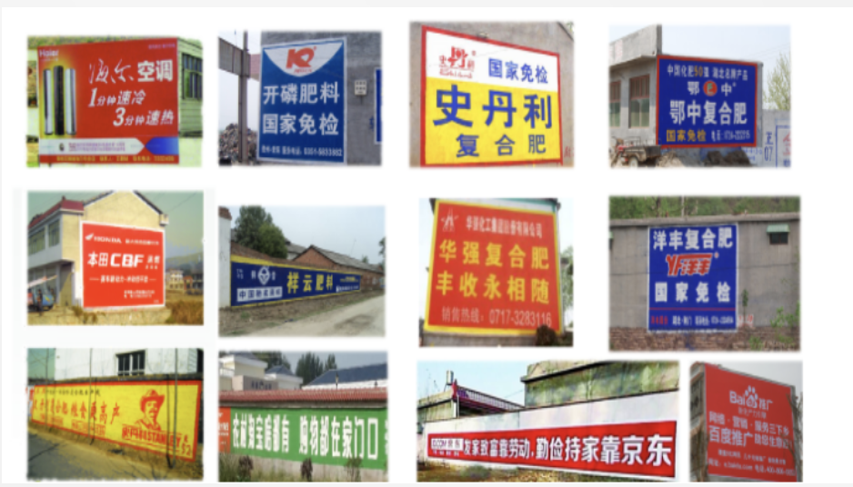
比如：报纸上的广告

比如电视上的广告：

传统广告：曝光度越来越差，价格却居高不下；而且，传统的广告播放的周期过长，会让消费者感到枯燥甚至反感
其中传统广告最大的弊端就是：**广告的受众目标不集中，并没有将广告播放给有需求的受众**。这就导致投放后的广告效果非常的差，并且价格是非常的高的；
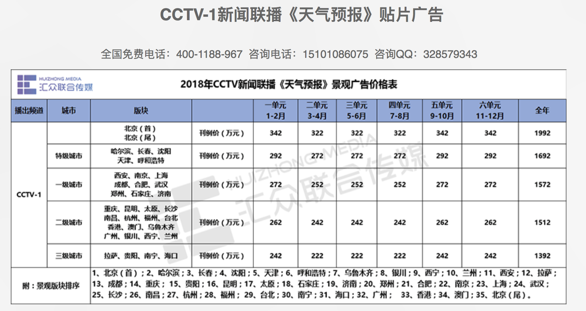
这种电视广告价格非常的昂贵，最贵可以达到一年将近2000万的广告费，并且这种广告并没有将广告播放给有需求的受众，曝光度非常的差，而且这种广告费用对企业来说也是一种非常大的负担
类似这种广告还有非常多：
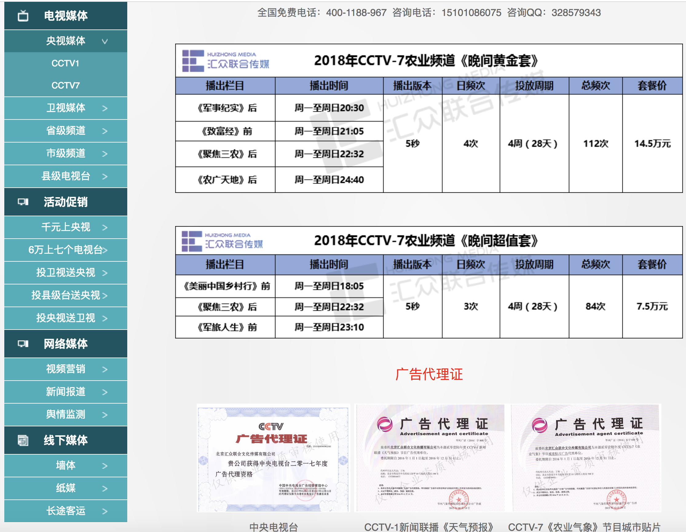
简而言之：传统广告可能会让广告主的钱花的不明不白

## 1.2：互联网时代下的广告


有人会问，互联网广告和平常广告有什么区别呢。
那我们来解答下， 最大的区别就是：**在互联网上做的广告，效果可衡量，广告主再也不用担心钱花的不明不白啦！**自从广告上了互联网，广告的面貌就焕然一新。造成行业巨变的原因，是因为互联网广告的效果可以被衡量。
举个栗子，“撑了么”传单。广告主只知道一共印了多少张传单，都交给谁去发，在哪个地方发，但是不可能知道是谁接到了这张传单，接到的人有没有看，看的人有没有买。这对广告主来说，我把钱花了，却不知道谁买了，有点不明不白，广告主心理阴影面积瞬间增大。但是这钱不花还不行，这是传统广告面临的最大问题，即广告效果无法衡量。
那互联网广告的好处远不止于此，我们再来说说它的历史和展望。
**流量的神坛**
前面提到，广告主想按人群进行投放广告。表述的意思是该网站当月访问用户的性别，男女各一半，这就是简单的人群不同，人群划分。


**在传统广告的场景下，广告主做广告的方式是比较粗犷的：**

- 杂志广告，我买几期的封面，越大越好；
- 报纸广告，我买几期的版面，最好是彩色的；
- 电视广告，我买几次的播放时长，就要黄金时间段，最好是春晚前读秒的那种；
- 展示牌广告，我买一个月的展示位，盘古大观上的LED就行。
到了互联网广告的场景下，也这么买啊。网站上的广告位，不也类似于展示牌吗，我按月或者按季度包下来买不就完了吗？没错，在用户人群划分出现之前，的确是这么做的。现在，也有很多广告和媒体是这么做的。但讲真，有了用户人群划分之后，广告这个传统行业在互联网上即将开出绚丽的花。
免费的都是最贵的，用户在免费使用互联网服务的同时，留下的行为记录便是数据，各方利用这些数据，就可以刻画出你的性格、你的偏好、你的收入乃至你的一切。
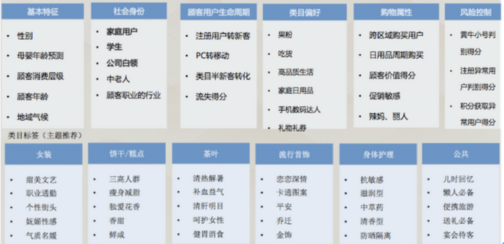

数据变现

## 1.3：广告平台

### 1.3.1：DSP业务流程


上图是一个极其简化的流程，主要的流程会涉及三方：媒体方（SSP）、ADX（广告交易平台）、DSP（需求方平台）
媒体方有一些**变现**的需求，所以会在自身页面或者APP中放置一些广告位，广告请求会经由广告交易平台，再广播给各个DSP（需求方平台）。
DSP根据接口请求，经过内部一系列处理，进而返回广告内容进行竞价。如果最终获得展现、点击机会；
在DSP平台，DSP会对接广告主，由广告主来选定受众人群，然后返回广告内容；
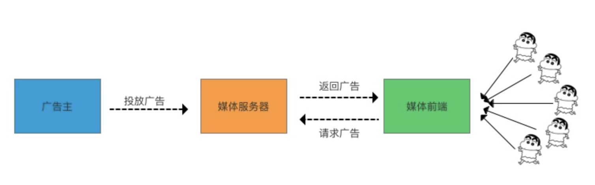
对于广告主，Ad exchange 提供一个名叫DSP（Demand-Side Platform）的平台，就是需求方平台，用于广告主对广告进行投放，对流量进行采买，对广告数据进行跟进，对广告的出价和策略进行调整。对于媒体或者publisher（开发者）Ad exchange则提供SSP（Supply-Side Platform，供应方平台），用于媒体或者publisher 对接广告主，管理媒体的广告位，查看广告收益等。对于广告的交易，Ad Exchange则提供RTB（Real Time Bidding，实时竞价）的交易方式，对于每一次的广告展示请求都通过实时竞价的方式进行匹配，从而使得媒体的收益最大化。对于平台的数据处理，Ad Exchange 则使用一个叫DMP（Data-Management Platform）数据管理平台，用于对广告主的需求、媒体所对应的用户的行为数据和标签进行分析，并最终返回匹配的广告受众。简单总结就是，Ad Exchange 是一个更高级的广告中介，整合了不同的广告主、广告网络和媒体，提供DSP、SSP、RTB、DMP等功能以实现广告投放的精准和媒体收益的最大化
这个时候的广告参与者以及广告的业务流程如下：

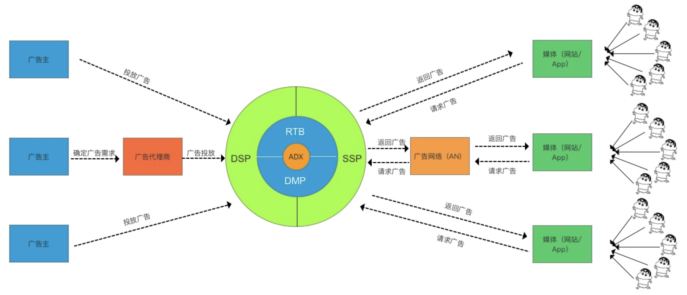

### 1.3.2：DMP业务流程

DMP（Data Management Platform）即：大数据管理平台。
需要一个大数据平台将线下、线上、内部、外部的海量数据管理起来，并分析处理，为实际业务运用做储备。
DMP的价值意义：
几年前，大数据的概念就炒的很火，但当时在广告主实际业务中，并没有能够实现落地。因为当时基础设施还不完善、行业上下游的认知还不一致、大家还没有能力打通数据资产。现在有很多广告主开始做大数据，是因为基础设施已经基本成熟了，接下来就是如何在各个行业中开花结果啦。大数据在营销领域主要可以从这么几个方向上创造巨大价值（但不局限于这些方向）。

- 消费者洞察、产品建议；
- 媒介渠道效率分析；
- DMP对程序化广告的指导；
- 对管理、战略等业务决策的数据支持。

DMP可以帮助我们做什么：
1：消费者洞察
对这些典型用户进行调研问卷、线上行为数据采集、线下行为数据采集。然后得出这些典型用户的人口属性、兴趣特征的洞察，对调整产品的定位，以及功能特性，意义巨大；
2：定向人群
3：筛选特征人群
4：对个人进行画像

## 1.4：课程介绍

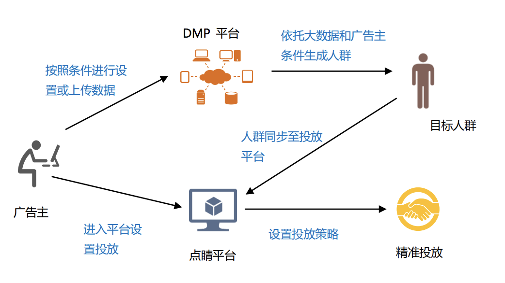
本课程主要实现DMP大数据管理平台，包括：
1、对数据做ETL处理，并统计各类指标
2、生成自己的商圈库
3、对数据标签化
4、合并标签数据
5、使用Graphx统一用户识别
6、实现标签衰减
7、将处理后的数据落地到elasticsearch
8、开发WEB页面，对数据进行报表展示
9、广告风控

## 1.5：课程目标

1、了解广告业务
2、能够自主开发DMP数据处理平台
3、能够自主开发DMP的web平台
4、能够开发广告风控平台

02：项目整体架构和数据字段介绍.md

# 第二章：开发DMP数据管理平台

## 2.1：项目架构介绍

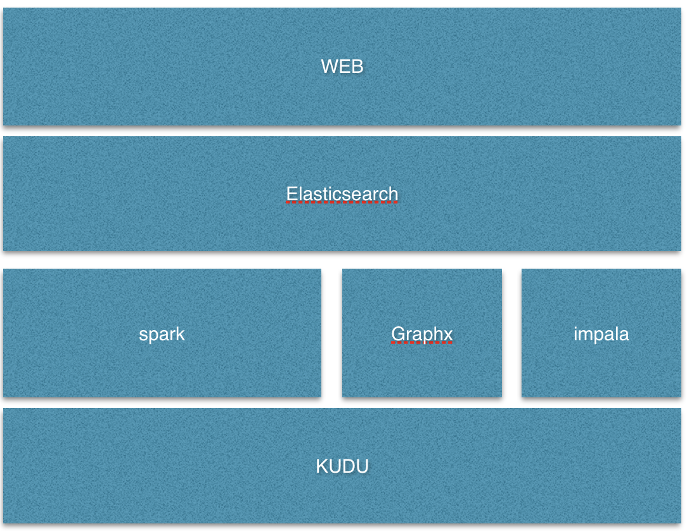
存储层：KUDU
计算层：spark、Graphx
快速查询层：impala
对外提供查询层：Elasticsearch
展示层：WEB

## 2.2：业务流程

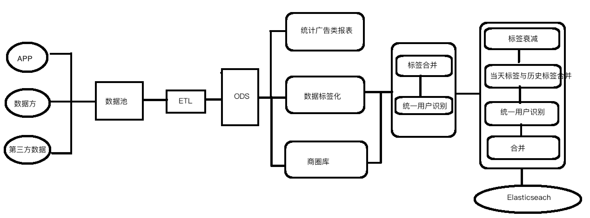

## 2.3：数据字段介绍

| 字段                 | 解释                                                         |
| -------------------- | ------------------------------------------------------------ |
| IP                   | 设备的真实IP                                                 |
| sessionid            | 会话标识                                                     |
| advertisersid        | 广告主ID                                                     |
| adorderid            | 广告ID                                                       |
| adcreativeid         | 广告创意ID( >= 200000 : dsp ,  < 200000 oss)                 |
| adplatformproviderid | 广告平台商ID(>= 100000: rtb  , < 100000 : api )              |
| sdkversionnumber     | SDK版本号                                                    |
| adplatformkey        | 平台商key                                                    |
| putinmodeltype       | 针对广告主的投放模式,1：展示量投放 2：点击量投放             |
| requestmode          | 数据请求方式（1:请求、2:展示、3:点击）                       |
| adprice              | 广告价格                                                     |
| adppprice            | 平台商价格                                                   |
| requestdate          | 请求时间,格式为：yyyy-m-dd hh:mm:ss                          |
| appid                | 应用id                                                       |
| appname              | 应用名称                                                     |
| uuid                 | 设备唯一标识，比如imei或者androidid等                        |
| device               | 设备型号，如htc、iphone                                      |
| client               | 设备类型 （1：android 2：ios 3：wp）windowphone              |
| osversion            | 设备操作系统版本，如4.0                                      |
| density              | 设备屏幕的密度 android的取值为0.75、1、1.5,ios的取值为：1、2 |
| pw                   | 设备屏幕宽度                                                 |
| ph                   | 设备屏幕高度                                                 |
| longitude            | 设备所在经度                                                 |
| lat                  | 设备所在纬度                                                 |
| provincename         | 设备所在省份名称                                             |
| cityname             | 设备所在城市名称                                             |
| ispid                | 运营商id                                                     |
| ispname              | 运营商名称                                                   |
| networkmannerid      | 联网方式id                                                   |
| networkmannername    | 联网方式名称                                                 |
| iseffective          | 有效标识（有效指可以正常计费的）(0：无效 1：有效)            |
| isbilling            | 是否收费（0：未收费 1：已收费）                              |
| adspacetype          | 广告位类型（1：banner 2：插屏 3：全屏）                      |
| adspacetypename      | 广告位类型名称（banner、插屏、全屏）                         |
| devicetype           | 设备类型（1：手机 2：平板）                                  |
| processnode          | 流程节点（1：请求量kpi 2：有效请求 3：广告请求）             |
| apptype              | 应用类型id                                                   |
| district             | 设备所在县名称                                               |
| paymode              | 针对平台商的支付模式，1：展示量投放(CPM) 2：点击量投放(CPC)  |
| isbid                | 是否rtb                                                      |
| bidprice             | rtb竞价价格                                                  |
| winprice             | rtb竞价成功价格                                              |
| iswin                | 是否竞价成功                                                 |
| cur                  | values:usd\|rmb等                                            |
| rate                 | 汇率                                                         |
| cnywinprice          | rtb竞价成功转换成人民币的价格                                |
| imei                 | 手机串码                                                     |
| mac                  | 手机MAC码                                                    |
| idfa                 | 手机APP的广告码                                              |
| openudid             | 苹果设备的识别码                                             |
| androidid            | 安卓设备的识别码                                             |
| rtbprovince          | rtb 省                                                       |
| rtbcity              | rtb 市                                                       |
| rtbdistrict          | rtb 区                                                       |
| rtbstreet            | rtb 街道                                                     |
| storeurl             | app的市场下载地址                                            |
| realip               | 真实ip                                                       |
| isqualityapp         | 优选标识                                                     |
| bidfloor             | 底价                                                         |
| aw                   | 广告位的宽                                                   |
| ah                   | 广告位的高                                                   |
| imeimd5              | imei_md5                                                     |
| macmd5               | mac_md5                                                      |
| idfamd5              | idfa_md5                                                     |
| openudidmd5          | openudid_md5                                                 |
| androididmd5         | androidid_md5                                                |
| imeisha1             | imei_sha1                                                    |
| macsha1              | mac_sha1                                                     |
| idfasha1             | idfa_sha1                                                    |
| openudidsha1         | openudid_sha1                                                |
| androididsha1        | androidid_sha1                                               |
| uuidunknow           | uuid_unknow  UUID密文                                        |
| userid               | 平台用户id                                                   |
| iptype               | 表示ip库类型，1为点媒ip库，2为广告协会的ip地理信息标准库，默认为1 |
| initbidprice         | 初始出价                                                     |
| adpayment            | 转换后的广告消费（保留小数点后6位）                          |
| agentrate            | 代理商利润率                                                 |
| lomarkrate           | 代理利润率                                                   |
| adxrate              | 媒介利润率                                                   |
| title                | 标题                                                         |
| keywords             | 关键字                                                       |
| tagid                | 广告位标识(当视频流量时值为视频ID号)                         |
| callbackdate         | 回调时间 格式为:YYYY/mm/dd hh:mm:ss                          |
| channelid            | 频道ID                                                       |
| mediatype            | 媒体类型                                                     |
| email                | 用户email                                                    |
| tel                  | 用户电话号码                                                 |
| sex                  | 用户性别                                                     |
| age                  | 用户年龄                                                     |

03：项目前期工程准备.md

## 2.4：创建工程

### 2.4.1：创建一个maven项目

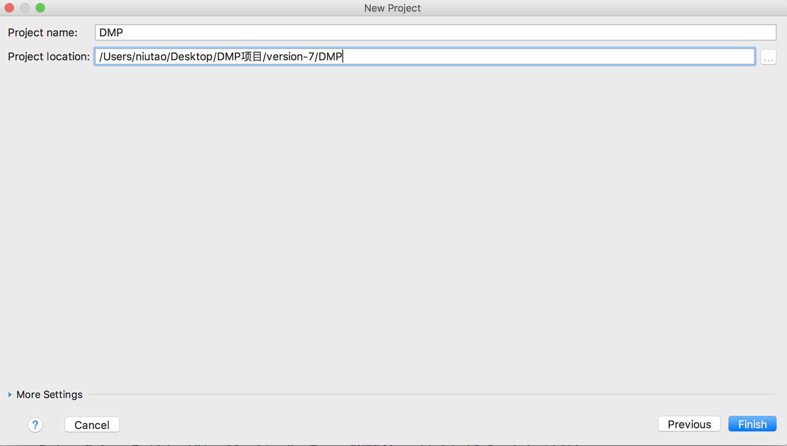

### 2.4.2：创建数据处理模块的工程(ProcessDMP)

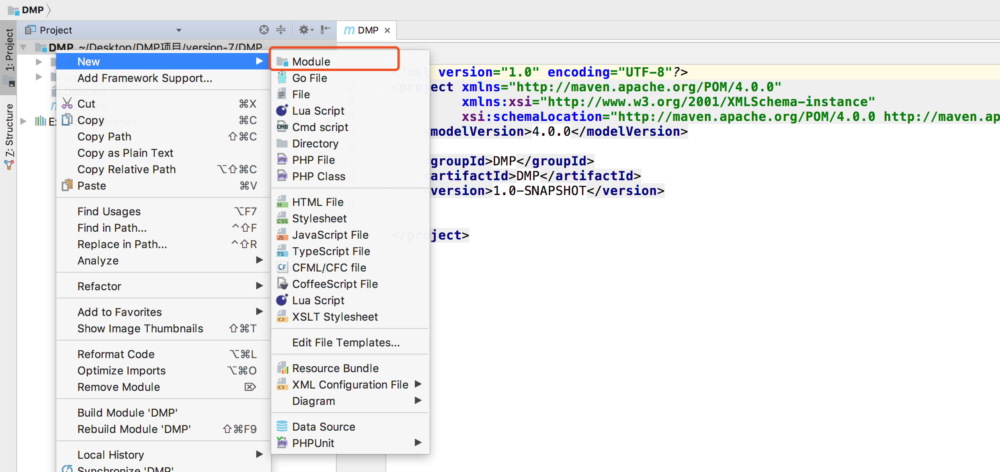
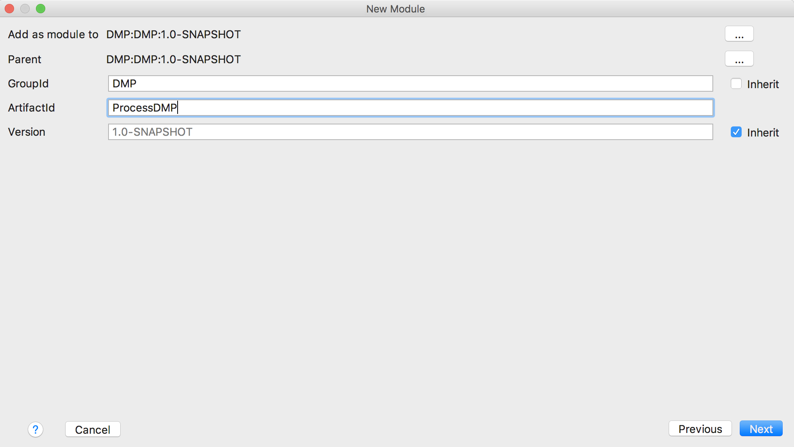
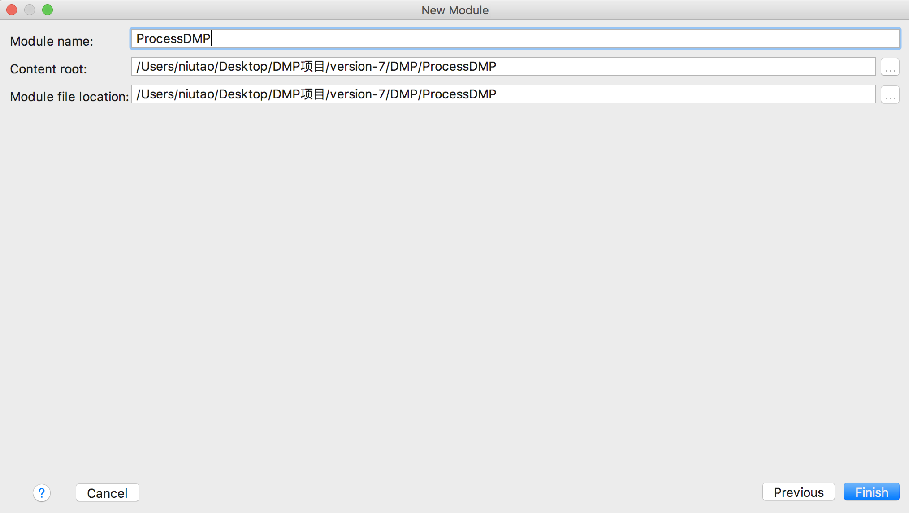

### 2.4.3：创建WEB模块的工程(RevealDMP)

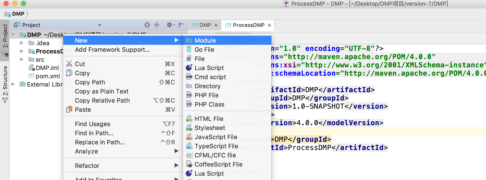
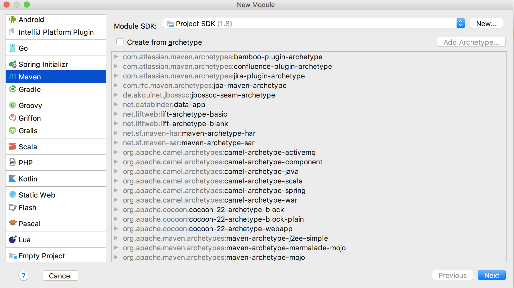

### 2.4.4：将RevealDMP转成web项目

由于之前创建的RevealDMP项目是一个普通的Maven工程，但是RevealDMP要求是web项目，所以需要对RevealDMP由普通的Maven工程转成web的maven工程
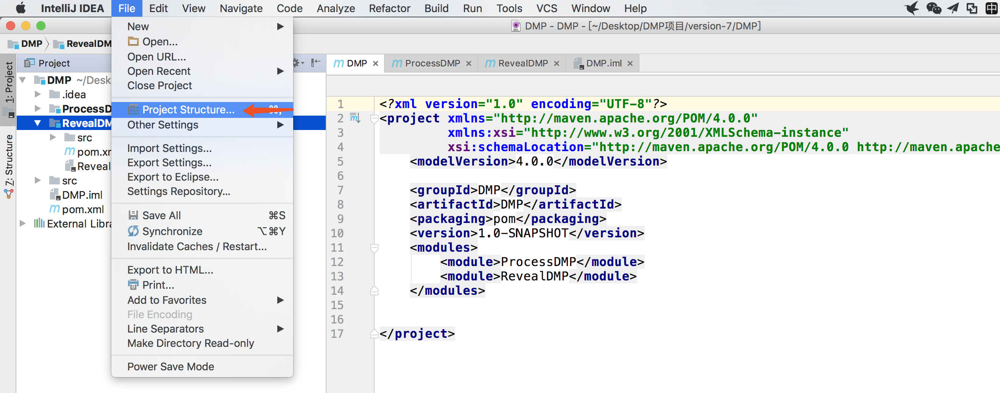
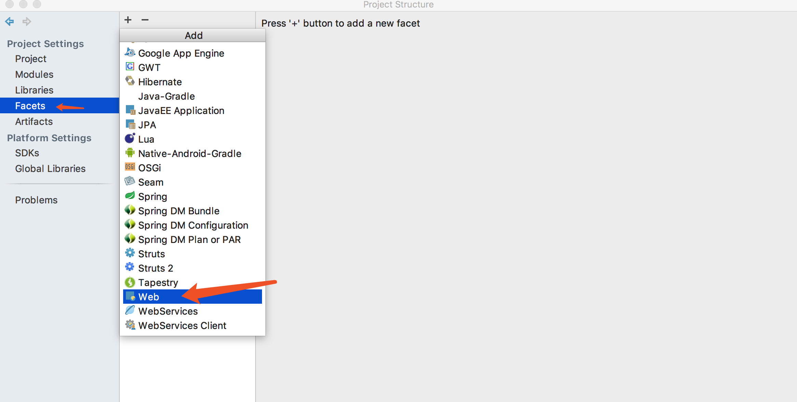
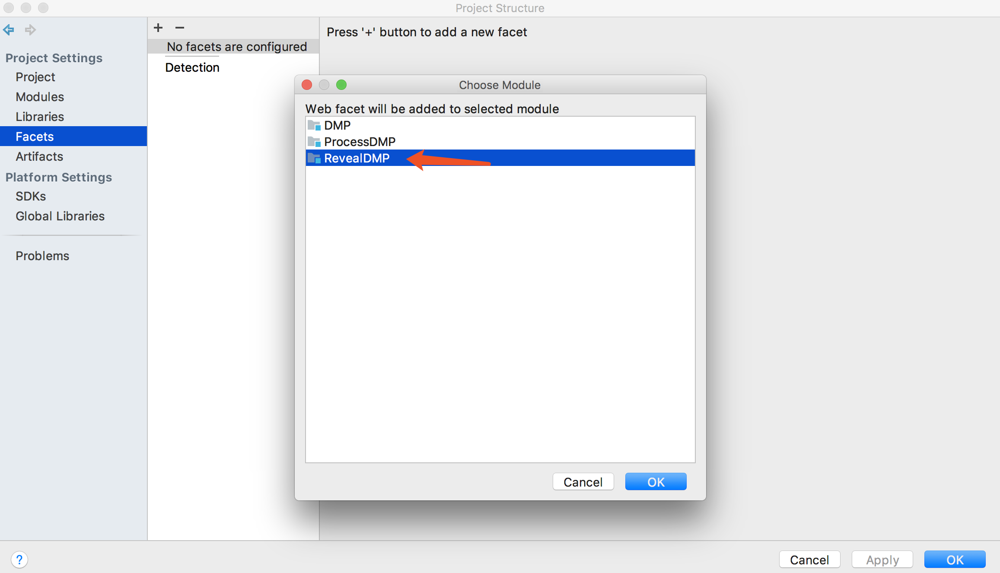
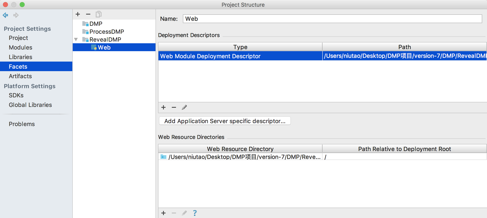
会新生成一个web包：
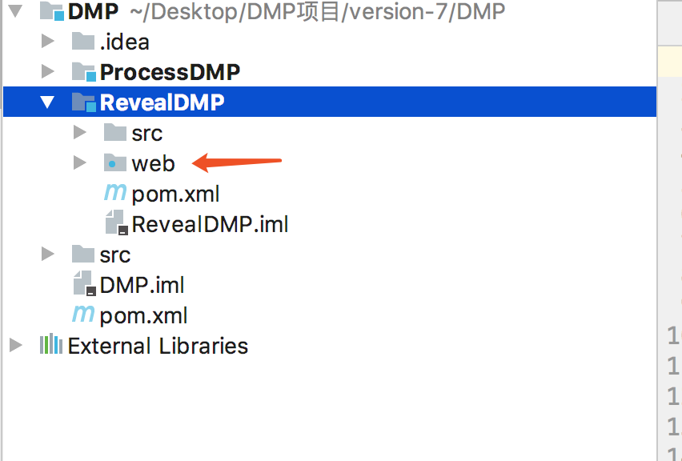

## 2.5：使用maven导包

### 2.5.1：指定Cloudera的maven库

由于部分依赖是需要CDH的包，所以提前指定好Cloudera的maven库

```xml
<repositories>
    <repository>
        <id>cloudera</id>
        <url>https://repository.cloudera.com/artifactory/cloudera-repos/</url>
    </repository>
</repositories>
```

### 2.5.2：提前指定好依赖版本

```xml
<properties>
    <project.build.sourceEncoding>UTF-8</project.build.sourceEncoding>
    <scala.version>2.11.5</scala.version>
    <scala.v>2.11</scala.v>
    <hadoop.version>2.6.1</hadoop.version>
    <spark.version>2.1.0</spark.version>
    <kudu.version>1.6.0-cdh5.14.0</kudu.version>
    <elasticsearch.verion>6.0.0</elasticsearch.verion>
</properties>
```

### 2.5.3：导入相关依赖

```xml
<dependencies>
 <!-- 导入scala依赖-->
    <dependency>
        <groupId>org.scala-lang</groupId>
        <artifactId>scala-library</artifactId>
        <version>${scala.version}</version>
    </dependency>
 <!-- 导入hadoop依赖-->
    <dependency>
        <groupId>org.apache.hadoop</groupId>
        <artifactId>hadoop-client</artifactId>
        <version>${hadoop.version}</version>
    </dependency>
  <!--导入kudu客户端依赖-->
    <!-- https://mvnrepository.com/artifact/org.apache.kudu/kudu-client -->
    <dependency>
        <groupId>org.apache.kudu</groupId>
        <artifactId>kudu-client</artifactId>
        <version>${kudu.version}</version>
        <scope>test</scope>
    </dependency>

  <!--导入kudu客户端工具类依赖-->
    <!-- https://mvnrepository.com/artifact/org.apache.kudu/kudu-client-tools -->
    <dependency>
        <groupId>org.apache.kudu</groupId>
        <artifactId>kudu-client-tools</artifactId>
        <version>${kudu.version}</version>
    </dependency>

<!--导入kudu整合spark的依赖-->
    <!-- https://mvnrepository.com/artifact/org.apache.kudu/kudu-spark2 -->
    <dependency>
        <groupId>org.apache.kudu</groupId>
        <artifactId>kudu-spark2_${scala.v}</artifactId>
        <version>${kudu.version}</version>
    </dependency>
    <!--导入sparkcore依赖-->
    <dependency>
        <groupId>org.apache.spark</groupId>
        <artifactId>spark-core_${scala.v}</artifactId>
        <version>${spark.version}</version>
    </dependency>
    <!--导入sparksql依赖-->
    <!-- https://mvnrepository.com/artifact/org.apache.spark/spark-sql -->
    <dependency>
        <groupId>org.apache.spark</groupId>
        <artifactId>spark-sql_${scala.v}</artifactId>
        <version>${spark.version}</version>
    </dependency>
    <!--导入spark Mlib依赖-->
    <!-- https://mvnrepository.com/artifact/org.apache.spark/spark-mllib -->
    <dependency>
        <groupId>org.apache.spark</groupId>
        <artifactId>spark-mllib_${scala.v}</artifactId>
        <version>${spark.version}</version>
    </dependency>

      <!--导入elasticsearch-spark依赖-->  
<!-- https://mvnrepository.com/artifact/org.elasticsearch/elasticsearch-spark-20 -->
    <dependency>
        <groupId>org.elasticsearch</groupId>
        <artifactId>elasticsearch-spark-20_${scala.v}</artifactId>
        <version>${elasticsearch.verion}</version>
    </dependency>

     <!--导入spark Graphx依赖-->
    <dependency>
        <groupId>org.apache.spark</groupId>
        <artifactId>spark-graphx_${scala.v}</artifactId>
        <version>${spark.version}</version>
    </dependency>

    <!--导入fastjson操作json的依赖-->
    <!-- https://mvnrepository.com/artifact/com.alibaba/fastjson -->
    <dependency>
        <groupId>com.alibaba</groupId>
        <artifactId>fastjson</artifactId>
        <version>1.2.44</version>
    </dependency>
   <dependency>
        <groupId>net.sf.json-lib</groupId>
        <artifactId>json-lib</artifactId>
        <version>2.4</version>
        <classifier>jdk15</classifier>
    </dependency>
    <!-- 根据ip解析经纬度 -->
    <dependency>
        <groupId>com.maxmind.geoip</groupId>
        <artifactId>geoip-api</artifactId>
        <version>1.3.0</version>
    </dependency>
    <dependency>
        <groupId>com.maxmind.geoip2</groupId>
        <artifactId>geoip2</artifactId>
        <version>2.12.0</version>
    </dependency>
    <!--对经纬度进行geohash编码的依赖-->
    <dependency>
        <groupId>ch.hsr</groupId>
        <artifactId>geohash</artifactId>
        <version>1.3.0</version>
    </dependency>

    <!-- 导入impala的依赖 -->
    <dependency>
        <groupId>com.cloudera</groupId>
        <artifactId>ImpalaJDBC41</artifactId>
        <version>2.5.42</version>
    </dependency>
    <!-- https://mvnrepository.com/artifact/org.apache.thrift/libfb303 -->
    <!--解决：Caused by: java.lang.ClassNotFoundException: org.apache.thrift.protocol.TPro-->
    <dependency>
        <groupId>org.apache.thrift</groupId>
        <artifactId>libfb303</artifactId>
        <version>0.9.3</version>
        <type>pom</type>
    </dependency>
    <!-- https://mvnrepository.com/artifact/org.apache.thrift/libthrift -->
    <!--解决：Caused by: java.lang.ClassNotFoundException: org.apache.thrift.protocol.TPro-->
    <dependency>
        <groupId>org.apache.thrift</groupId>
        <artifactId>libthrift</artifactId>
        <version>0.9.3</version>
        <type>pom</type>
    </dependency>
    <!--Caused by: java.lang.ClassNotFoundException: org.apache.hive.service.cli.thrift.TCLIService$Iface-->
    <dependency>
        <groupId>org.apache.hive</groupId>
        <artifactId>hive-jdbc</artifactId>
        <exclusions>
            <exclusion>
                <groupId>org.apache.hive</groupId>
                <artifactId>hive-service-rpc</artifactId>
            </exclusion>
            <exclusion>
                <groupId>org.apache.hive</groupId>
                <artifactId>hive-service</artifactId>
            </exclusion>
        </exclusions>
        <version>1.1.0</version>
    </dependency>
    <!--导入hive的依赖-->
    <dependency>
        <groupId>org.apache.hive</groupId>
        <artifactId>hive-service</artifactId>
        <version>1.1.0</version>
    </dependency>
  <!-- 导入加载配置文件的依赖-->
     <dependency>
         <groupId>com.typesafe</groupId>
         <artifactId>config</artifactId>
         <version>1.2.1</version>
     </dependency>
</dependencies>
```

### 2.5.4：将配置文件区分成：开发、生产、测试环境

```XML
<profiles>
    <profile>
        <id>dev</id>
        <activation>
            <!--默认生效的配置组-->
            <activeByDefault>true</activeByDefault>
            <property>
                <name>env</name>
                <value>Dev</value>
            </property>
        </activation>
        <build>
             <!--配置文件路径-->
            <resources>
                <resource>
                    <directory>src/main/resources/dev</directory>
                </resource>
            </resources>
        </build>
    </profile>
    <profile>
        <id>test</id>
        <activation>
            <property>
                <name>env</name>
                <value>Test</value>
            </property>
        </activation>
        <build>
             <!--配置文件路径-->
            <resources>
                <resource>
                    <directory>src/main/resources/test</directory>
                </resource>
            </resources>
        </build>
    </profile>
    <profile>
        <id>prod</id>
        <activation>
            <property>
                <name>env</name>
                <value>Prod</value>
            </property>
        </activation>
        <build>
             <!--配置文件路径-->
            <resources>
                <resource>
                    <directory>src/main/resources/prod</directory>
                </resource>
            </resources>
        </build>
    </profile>
</profiles>
```

然后在工程的resource目录下分别创建：Dev（生产环境）、Prod（开发环境）、Test（测试环境）包
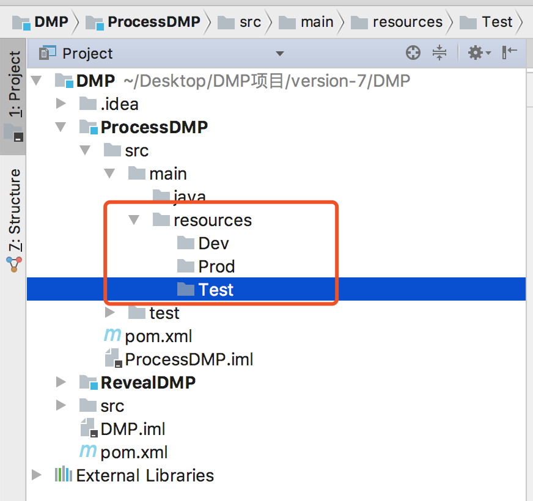

### 2.5.5：创建一个scala的代码包

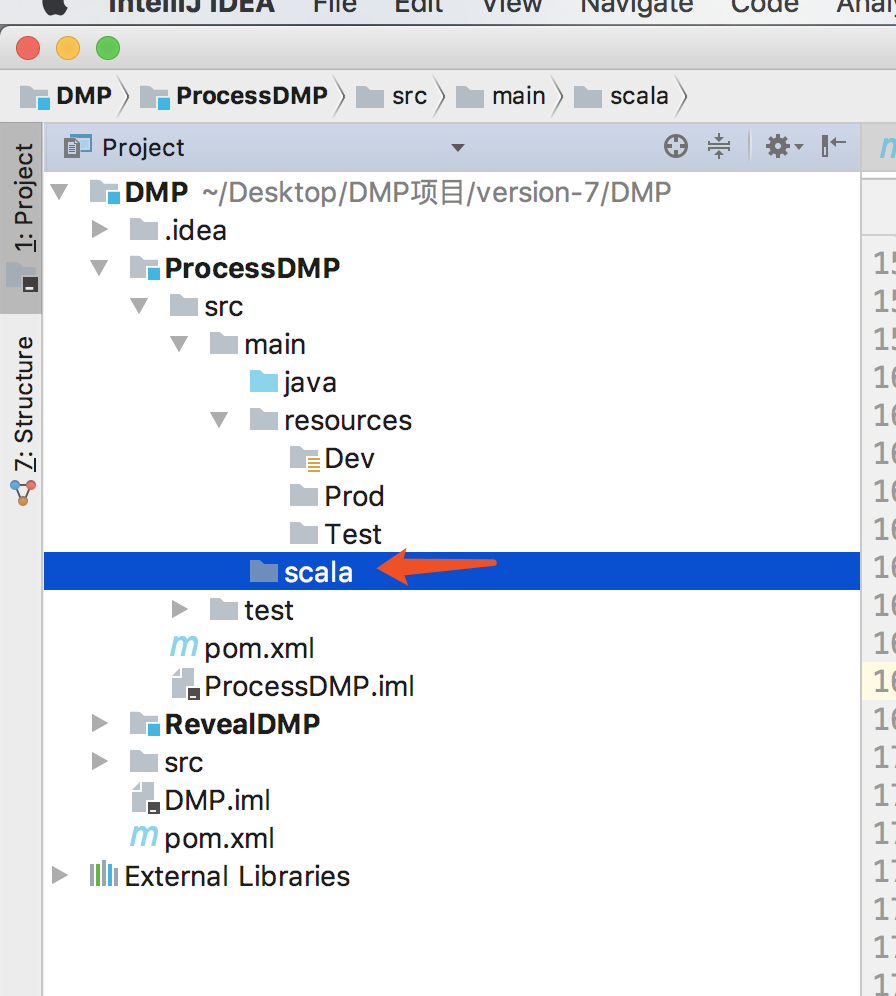
将scala的代码包修改成源码包：
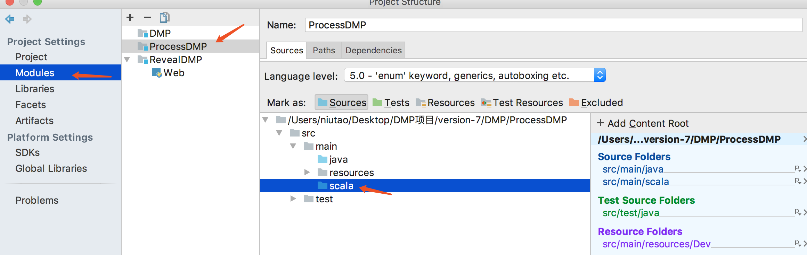

### 2.5.6：开发一个获取配置文件的工具类

对于一个完整的工程来说，如果所有的配置都指定到代码里，就会造成：
1、代码非常的混乱
2、修改配置的时候，需要修改很多的地方
3、数据库相关信息直接暴露在代码里，不安全
综上所述：需要一个配置文件工具类，来专门获取配置文件的内容弄

```scala
package com.dmp.tools
import com.typesafe.config.ConfigFactory
/**
  * Created by angel；
  */
class GlobalConfUtils {
  def conf = ConfigFactory.load()
  def keys = conf.getString("SOUGOU.KEY")
  def KUDU_MASTER = conf.getString("kudu.master")
  def TradingArea = conf.getString("TradingArea")
  def AppStuation = conf.getString("AppStuation")
  def ChannelStuation = conf.getString("ChannelStuation")
  def ISPStuation = conf.getString("ISPStuation")
  def ProcessProvince_city = conf.getString("ProcessProvince_city")
  def RegionalAnalysis = conf.getString("RegionalAnalysis")
  def DW = conf.getString("KUDU.DW")
  def dataPath = conf.getString("data.path")
  def app_id_name = conf.getString("APPID.APPNAME")
  def STOPDIC = conf.getString("STOPDIC")
  def sensitiveDic = conf.getString("sensitiveDic")
  def devicedic = conf.getString("devicedic")
  def GeoLiteCity = conf.getString("GeoLiteCity")
  def coefficient = conf.getString("coefficient")
  def JDBC_DRIVER = conf.getString("JDBC.DRIVER")
  def CONNECTION_URL = conf.getString("CONNECTION.URL")
  def DOP = conf.getString("DB.ODS.PREFIX")
  def DTP = conf.getString("DB.TAG.PREFIX")
  def dataFormat = conf.getString("data.format")
  def INSTALL_DIR = conf.getString("INSTALL_DIR")
  def IP_FILE = conf.getString("IP_FILE")
  //spark相关配置参数
  def sparkWorkerTimeout = conf.getString("spark.worker.timeout")
  def sparkRpcTimeout = conf.getString("spark.rpc.askTimeout")
  def sparkNetworkTimeout = conf.getString("spark.network.timeout")
  def sparkCoresMax = conf.getString("spark.cores.max")
  def sparkTaskMaxFailures = conf.getString("spark.task.maxFailures")
  def sparkSpeculationfalse = conf.getString("spark.speculationfalse")
  def sparkDriverAllowMultipleContexts = conf.getString("spark.driver.allowMultipleContexts")
  def sparkSerializer = conf.getString("spark.serializer")
  def sparkBufferPageSize = conf.getString("spark.buffer.pageSize")
  //es相关配置参数
  def esClusterName = conf.getString("cluster.name")
  def esIndexAutoCreate = conf.getString("es.index.auto.create")
  def esNoddes = conf.getString("esNodes")
  def esPort = conf.getString("es.port")
  def esIndexReadMissingAsEmpty = conf.getString("es.index.read.missing.as.empty")
  def esNodesWanOnly = conf.getString("es.nodes.wan.only")
  def esNodesDiscovery = conf.getString("es.nodes.discovery")
  def esHttpTimeout = conf.getString("es.http.timeout")

}
object GlobalConfUtils extends GlobalConfUtils
```

### 2.5.7：将相关配置文件放到resource/dev , proc , test中

```json
#搜狗地址查询的key
SOUGOU.KEY="6df5ca38579910c25a1816effec13e5f"

#KUDU的地址
kudu.master="hadoop01:7051,hadoop02:7051,hadoop03:7051"

#商圈表
TradingArea="TradingArea"
#ETL的app报表
AppStuation="AppStuation"
#广告投放的手机设备类型
DeviceStuation="DeviceStuation"
#广告投放的网络类型
NetworkStuation="NetworkStuation"
#广告投放的运营商报表
ISPStuation="ISPStuation"
#渠道报表
ChannelStuation="channel_stuation"
#地域分布表
ProcessProvince_city="PRO_CITY"
#地域报表
RegionalAnalysis="RegionalAnalysis"
#ODS表前缀
DB.ODS.PREFIX="ODS"
#合并表前缀
DB.TAG.PREFIX="TAG"

#统一库
KUDU.DW="DW"

#数据读取路径
data.path="/Users/niutao/Desktop/pmt.json"
#读取的数据格式
data.format="json"


#设备APPID和APP名称的字典库
APPID.APPNAME="/Users/niutao/Desktop/DMP/src/main/resources/appID_name"
#停顿词的字典库
STOPDIC="/Users/niutao/Desktop/DMP/src/main/resources/stopdic"
#敏感词的字典库
sensitiveDic="/Users/niutao/Desktop/DMP/src/main/resources/sensitiveDic"
#设备联网信息字典库
devicedic="/Users/niutao/Desktop/DMP/src/main/resources/devicedic"
#IP地址库
GeoLiteCity="/Users/niutao/Desktop/DMP/src/main/resources/GeoLiteCity.dat"
#纯真IP数据库保存的文件夹
INSTALL_DIR="/Users/niutao/Desktop/DMP/src/main/resources/"
#纯真IP数据库名
IP_FILE="qqwry.dat"

#衰减系数
coefficient=0.92
#impala连接细致
JDBC.DRIVER="com.cloudera.impala.jdbc41.Driver"
CONNECTION.URL="jdbc:impala://hadoop01:21050/default;auth=noSasl"

#spark相关配置参数
spark.worker.timeout="500"
spark.cores.max="10"
spark.rpc.askTimeout="600s"
spark.network.timeout="600s"
spark.task.maxFailures="1"
spark.speculationfalse="false"
spark.driver.allowMultipleContexts="true"
spark.serializer="org.apache.spark.serializer.KryoSerializer"
spark.buffer.pageSize="8m"

#es相关配置参数
cluster.name="myes"
es.index.auto.create="true"
esNodes="192.168.77.11"
es.port="9200"
es.index.read.missing.as.empty="true"
es.nodes.wan.only="true"
es.nodes.discovery="false"
es.http.timeout="200000"
```

### 2.5.8：创建公特质以及公共工具包

#### 2.5.8.1：创建公共特质

我们需要创建一个公共的特质，定义的ETL操作，只需要实现特质给定的方法即可，主要目的是代码统一化管理

```scala
package com.dmp.ETL

import org.apache.kudu.spark.kudu.KuduContext
import org.apache.spark.SparkContext
import org.apache.spark.sql.SQLContext

/**
  * Created by angel；
  */
trait ProcessReport {
  def process(sqlContext:SQLContext , sparkContext:SparkContext , kuduContext:KuduContext):Unit
}
```

2.5.8.2：创建公共工具包：

创建一个kudu数据落地的公共工具包，简化每一个业务类的代码量，可读性会更强

```scala
package com.dmp.tools

import java.util

import org.apache.kudu.Schema
import org.apache.kudu.client.CreateTableOptions
import org.apache.kudu.client.KuduClient.KuduClientBuilder
import org.apache.kudu.spark.kudu.{KuduContext, _}
import org.apache.spark.{sql}
import org.apache.spark.sql.SaveMode

/**
  * Created by angel；
  */
object DBUtils{
  def process(kuduContext: KuduContext,
              data:sql.DataFrame,
              TO_TABLENAME:String,
              KUDU_MASTER:String,
              schema:Schema ,
              partitionID:String
             ): Unit = {
    //创建数据库
    if(!kuduContext.tableExists(TO_TABLENAME)){
      val kuduClient = new KuduClientBuilder(KUDU_MASTER).build()
      val tableOptions: CreateTableOptions = {
        val  parcols = new util.LinkedList[String]();
        //定义表的分区方式
        parcols.add(partitionID);
        new CreateTableOptions()
          .addHashPartitions(parcols , 6)
          .setNumReplicas(3)
      }
      //调用create Table api
      kuduClient.createTable(TO_TABLENAME, schema, tableOptions)
    }
    //将数据写入kudu
    data.write
      .mode(SaveMode.Append)
      .option("kudu.table", TO_TABLENAME)
      .option("kudu.master", KUDU_MASTER)
      .kudu
  }
}
```

## 2.6：根据传递的IP解析出经纬度、地址

在数据传递过程中并没有携带当前IP的经纬度，所以需要根据传递来的IP解析出经纬度IP所在的经纬度以及所在的省份-城市

### 2.6.1：代码调用逻辑

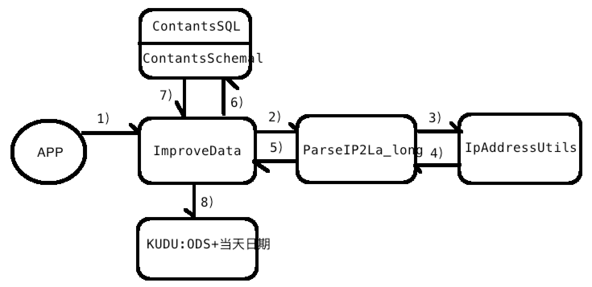

### 2.6.2：开发App驱动

```scala
package com.dmp
import com.dmp.ETL.ImproveData
import com.dmp.tools.GlobalConfUtils
import org.apache.kudu.spark.kudu.KuduContext
import org.apache.spark.sql.SparkSession
import org.apache.spark.{SparkConf, SparkContext}

/**
  * Created by angel；
  */
object App {
  def main(args: Array[String]): Unit = {
    @transient
    val sparkConf = new SparkConf().setAppName("App")
      //设置Master_IP并设置spark参数
      .setMaster("local[6]")
      .set("spark.worker.timeout", GlobalConfUtils.sparkWorkerTimeout)
      .set("spark.cores.max", GlobalConfUtils.sparkCoresMax)
      .set("spark.rpc.askTimeout", GlobalConfUtils.sparkRpcTimeout)
      .set("spark.network.timeout", GlobalConfUtils.sparkNetworkTimeout)
      .set("spark.task.maxFailures",GlobalConfUtils.sparkTaskMaxFailures)
      .set("spark.speculationfalse", GlobalConfUtils.sparkSpeculationfalse)
      .set("spark.driver.allowMultipleContexts", GlobalConfUtils.sparkDriverAllowMultipleContexts)
      .set("spark.serializer", GlobalConfUtils.sparkSerializer)
      .set("spark.buffer.pageSize", GlobalConfUtils.sparkBufferPageSize)
      .set("cluster.name", GlobalConfUtils.esClusterName)
      .set("es.index.auto.create", GlobalConfUtils.esIndexAutoCreate)
      .set("es.nodes", GlobalConfUtils.esNoddes)
      .set("es.port", GlobalConfUtils.esPort)
      .set("es.index.read.missing.as.empty",GlobalConfUtils.esIndexReadMissingAsEmpty)
      .set("es.nodes.wan.only",GlobalConfUtils.esNodesWanOnly)
      .set("es.nodes.discovery", GlobalConfUtils.esNodesDiscovery)
      .set("es.http.timeout" , GlobalConfUtils.esHttpTimeout)

    val sparkContext = SparkContext.getOrCreate(sparkConf)
    val sqlContext = SparkSession.builder().config(sparkConf).getOrCreate().sqlContext
    val KUDU_MASTER = GlobalConfUtils.KUDU_MASTER
    val kuduContext = new KuduContext(KUDU_MASTER, sqlContext.sparkContext)
    //TODO 1):根据IP解析出经纬度-省-市，然后落地到kudu
    ImproveData.process(sqlContext,sparkContext,kuduContext)
    sparkContext.stop()
  }

}
```

### 2.6.3：开发ImproverData工具类

```scala
package com.dmp.ETL


import com.dmp.tools.ips.{La_lo, ParseIP2La_long}
import com.dmp.tools._
import org.apache.kudu.spark.kudu.{KuduContext, _}
import org.apache.spark.SparkContext
import org.apache.spark.rdd.RDD
import org.apache.spark.sql.{Row, SQLContext, SaveMode}

/**
  * Created by angel；
  */
object ImproveData extends ProcessReport{
  //KUDU地址
  val KUDU_MASTER = GlobalConfUtils.KUDU_MASTER
  //KUDU落地的表名称
  val TABLE_NAME = GlobalConfUtils.DOP + DataUtils.NowDate()
  //获取数据路径
  val dataPath = GlobalConfUtils.dataPath

  /**
    * @param sqlContext
    * @param sparkContext
    * @param kuduContext
    * 处理原始数据（解析IP的经纬度和省-市），并将数据落地到kudu
    * */
  override def process(sqlContext: SQLContext, sparkContext: SparkContext, kuduContext: KuduContext): Unit = {
    val jsondata = sqlContext.read.format("json").load(dataPath)
    jsondata.registerTempTable("ods")
    /**
      * TODO 1:根据传递的IP解析出经纬度
      * */
    val ip = jsondata.select("ip")
    val rdd: RDD[Row] = ip.rdd
    val ipstr:RDD[String] = rdd.map{
      line => line.getAs[String]("ip")
    }
    val ipList = ipstr.collect().toBuffer.toList
    //返回 ip , latitude , longitude ,region , city//TODO 此处做了修改
    val ip_latitude_longitude: Seq[La_lo] = ParseIP2La_long.get_latitude_longitude(ipList)
    //    val ip_latitude_longitude: Seq[La_lo] = ParseIP2lat_long.getObj(ipList)
    //将util.ArrayList[La_lo] 转成RDD[La_lo]
    val rdd_ip_latitude_longitude: RDD[La_lo] = sparkContext.parallelize(ip_latitude_longitude)
    import sqlContext.implicits._
    val df = rdd_ip_latitude_longitude.toDF
    //|222.76.240.142|24.479797| 118.08191|   福建省| 厦门市|
    df.registerTempTable("rdd_ip_latitude_longitude")
    val sql = ContantsSQL.odssql
    val result = sqlContext.sql(sql)

    //TODO 2定义schema 在kudu上构建ODS表
    val schema = ContantsSchemal.odsSchema
    val partitionID = "ip"
    //TODO 3数据落地
    DBUtils.process(kuduContext , result , TABLE_NAME , KUDU_MASTER , schema , partitionID)
  }
}


```

### 2.6.4：开发ParseIP2La_long工具类

```scala
package com.dmp.tools.ips

import java.util

import com.dmp.tools.GlobalConfUtils
import com.dmp.tools.iplocation.IPAddressUtils
import com.maxmind.geoip.LookupService

import scala.collection.JavaConverters

/**
  * Created by angel；
  */
object ParseIP2La_long {
  //根据GeoLiteCity解析出经度和纬度
  val GeoLiteCity = GlobalConfUtils.GeoLiteCity
  def get_latitude_longitude(ipList:List[String]): Seq[La_lo] = {
    val cl = new LookupService(GeoLiteCity, LookupService.GEOIP_MEMORY_CACHE)
    val array = new util.ArrayList[La_lo]()
    for(ip <- ipList){
      val l2 = cl.getLocation(ip)
      val latitude = l2.latitude
      val longitude = l2.longitude
      //根据纯真ip数据库解析出省-市
      val iPAddressUtils = new IPAddressUtils()
      val region = iPAddressUtils.getregion(ip)
      val region1 = region.getRegion//省
      val city = region.getCity//市
      array.add(La_lo(ip , latitude+"" , longitude+"" , region1 , city))
    }
    val toSeq: Seq[La_lo] = JavaConverters.asScalaIteratorConverter(array.iterator()).asScala.toSeq
    toSeq
  }

}

case class La_lo(ip:String , latitude:String , longitude:String ,region:String , city:String)
```

### 2.6.5：开发IPAddressUtils工具类

（可复制）

```java
package com.dmp.tools.iplocation;

/**
 * Created by angel；
 */
import com.dmp.tools.GlobalConfUtils;
import org.slf4j.Logger;
import org.slf4j.LoggerFactory;
import java.io.File;
import java.io.FileNotFoundException;
import java.io.IOException;
import java.io.RandomAccessFile;
import java.nio.MappedByteBuffer;
import java.util.Map;
import java.util.concurrent.ConcurrentHashMap;

/**
 * IP地址服务
 */
public class IPAddressUtils {
    private static Logger log = LoggerFactory.getLogger(IPAddressUtils.class);
    /**
     * 纯真IP数据库名
     */
    private String IP_FILE= new GlobalConfUtils().IP_FILE();
    /**
     * 纯真IP数据库保存的文件夹
     */
    private String INSTALL_DIR=new GlobalConfUtils().INSTALL_DIR();

    /**
     * 常量，比如记录长度等等
     */
    private static final int IP_RECORD_LENGTH = 7;
    /**
     * 常量，读取模式1
     */
    private static final byte REDIRECT_MODE_1 = 0x01;
    /**
     * 常量，读取模式2
     */
    private static final byte REDIRECT_MODE_2 = 0x02;

    /**
     * 缓存，查询IP时首先查询缓存，以减少不必要的重复查找
     */
    private Map<String, IPLocation> ipCache;
    /**
     * 随机文件访问类
     */
    private RandomAccessFile ipFile;
    /**
     * 内存映射文件
     */
    private MappedByteBuffer mbb;
    /**
     * 起始地区的开始和结束的绝对偏移
     */
    private long ipBegin, ipEnd;

    /**
     * 为提高效率而采用的临时变量
     */
    private IPLocation loc;
    /**
     * 为提高效率而采用的临时变量
     */
    private byte[] buf;
    /**
     * 为提高效率而采用的临时变量
     */
    private byte[] b4;
    /**
     * 为提高效率而采用的临时变量
     */
    private byte[] b3;
    /**
     * IP地址库文件错误
     */
    private static final String BAD_IP_FILE     =   "IP地址库文件错误";
    /**
     * 未知国家
     */
    private static final String UNKNOWN_COUNTRY   =   "未知国家";
    /**
     * 未知地区
     */
    private static final String UNKNOWN_AREA    =   "未知地区";


    public void init() {
        try {
            // 缓存一定要用ConcurrentHashMap， 避免多线程下获取为空
            ipCache = new ConcurrentHashMap();
            loc = new IPLocation();
            buf = new byte[100];
            b4 = new byte[4];
            b3 = new byte[3];
            try {
                ipFile = new RandomAccessFile(IP_FILE, "r");
            } catch (FileNotFoundException e) {
                // 如果找不到这个文件，再尝试再当前目录下搜索，这次全部改用小写文件名
                //     因为有些系统可能区分大小写导致找不到ip地址信息文件
                String filename = new File(IP_FILE).getName().toLowerCase();
                File[] files = new File(INSTALL_DIR).listFiles();
                for(int i = 0; i < files.length; i++) {
                    if(files[i].isFile()) {
                        if(files[i].getName().toLowerCase().equals(filename)) {
                            try {
                                ipFile = new RandomAccessFile(files[i], "r");
                            } catch (FileNotFoundException e1) {
                                log.error("IP地址信息文件没有找到，IP显示功能将无法使用:{}" + e1.getMessage(), e1);
                                ipFile = null;
                            }
                            break;
                        }
                    }
                }
            }
            // 如果打开文件成功，读取文件头信息
            if(ipFile != null) {
                try {
                    ipBegin = readLong4(0);
                    ipEnd = readLong4(4);
                    if(ipBegin == -1 || ipEnd == -1) {
                        ipFile.close();
                        ipFile = null;
                    }
                } catch (IOException e) {
                    log.error("IP地址信息文件格式有错误，IP显示功能将无法使用"+ e.getMessage(), e);
                    ipFile = null;
                }
            }

        } catch (Exception e) {
            log.error("IP地址服务初始化异常:" + e.getMessage(), e);
        }
    }

    /**
     * 查询IP地址位置 - synchronized的作用是避免多线程时获取区域信息为空
     * @param ip
     * @return
     */
    public synchronized IPLocation getIPLocation(final String ip) {
        IPLocation location = new IPLocation();
        location.setArea(this.getArea(ip));
        location.setCountry(this.getCountry(ip));

        return location;
    }

    /**
     * 从内存映射文件的offset位置开始的3个字节读取一个int
     * @param offset
     * @return
     */
    private int readInt3(int offset) {
        mbb.position(offset);
        return mbb.getInt() & 0x00FFFFFF;
    }

    /**
     * 从内存映射文件的当前位置开始的3个字节读取一个int
     * @return
     */
    private int readInt3() {
        return mbb.getInt() & 0x00FFFFFF;
    }

    /**
     * 根据IP得到国家名
     * @param ip ip的字节数组形式
     * @return 国家名字符串
     */
    public String getCountry(byte[] ip) {
        // 检查ip地址文件是否正常
        if(ipFile == null)
            return BAD_IP_FILE;
        // 保存ip，转换ip字节数组为字符串形式
        String ipStr = Util.getIpStringFromBytes(ip);
        // 先检查cache中是否已经包含有这个ip的结果，没有再搜索文件
        if(ipCache.containsKey(ipStr)) {
            IPLocation ipLoc = ipCache.get(ipStr);
            return ipLoc.getCountry();
        } else {
            IPLocation ipLoc = getIPLocation(ip);
            ipCache.put(ipStr, ipLoc.getCopy());
            return ipLoc.getCountry();
        }
    }

    /**
     * 根据IP得到国家名
     * @param ip IP的字符串形式
     * @return 国家名字符串
     */
    public String getCountry(String ip) {
        return getCountry(Util.getIpByteArrayFromString(ip));
    }

    /**
     * 根据IP得到地区名
     * @param ip ip的字节数组形式
     * @return 地区名字符串
     */
    public String getArea(final byte[] ip) {
        // 检查ip地址文件是否正常
        if(ipFile == null)
            return BAD_IP_FILE;
        // 保存ip，转换ip字节数组为字符串形式
        String ipStr = Util.getIpStringFromBytes(ip);
        // 先检查cache中是否已经包含有这个ip的结果，没有再搜索文件
        if(ipCache.containsKey(ipStr)) {
            IPLocation ipLoc = ipCache.get(ipStr);
            return ipLoc.getArea();
        } else {
            IPLocation ipLoc = getIPLocation(ip);
            ipCache.put(ipStr, ipLoc.getCopy());
            return ipLoc.getArea();
        }
    }

    /**
     * 根据IP得到地区名
     * @param ip IP的字符串形式
     * @return 地区名字符串
     */
    public String getArea(final String ip) {
        return getArea(Util.getIpByteArrayFromString(ip));
    }

    /**
     * 根据ip搜索ip信息文件，得到IPLocation结构，所搜索的ip参数从类成员ip中得到
     * @param ip 要查询的IP
     * @return IPLocation结构
     */
    private IPLocation getIPLocation(final byte[] ip) {
        IPLocation info = null;
        long offset = locateIP(ip);
        if(offset != -1)
            info = getIPLocation(offset);
        if(info == null) {
            info = new IPLocation();
            info.setCountry (  UNKNOWN_COUNTRY);
            info.setArea(UNKNOWN_AREA);
        }
        return info;
    }

    /**
     * 从offset位置读取4个字节为一个long，因为java为big-endian格式，所以没办法
     * 用了这么一个函数来做转换
     * @param offset
     * @return 读取的long值，返回-1表示读取文件失败
     */
    private long readLong4(long offset) {
        long ret = 0;
        try {
            ipFile.seek(offset);
            ret |= (ipFile.readByte() & 0xFF);
            ret |= ((ipFile.readByte() << 8) & 0xFF00);
            ret |= ((ipFile.readByte() << 16) & 0xFF0000);
            ret |= ((ipFile.readByte() << 24) & 0xFF000000);
            return ret;
        } catch (IOException e) {
            return -1;
        }
    }

    /**
     * 从offset位置读取3个字节为一个long，因为java为big-endian格式，所以没办法
     * 用了这么一个函数来做转换
     * @param offset 整数的起始偏移
     * @return 读取的long值，返回-1表示读取文件失败
     */
    private long readLong3(long offset) {
        long ret = 0;
        try {
            ipFile.seek(offset);
            ipFile.readFully(b3);
            ret |= (b3[0] & 0xFF);
            ret |= ((b3[1] << 8) & 0xFF00);
            ret |= ((b3[2] << 16) & 0xFF0000);
            return ret;
        } catch (IOException e) {
            return -1;
        }
    }

    /**
     * 从当前位置读取3个字节转换成long
     * @return 读取的long值，返回-1表示读取文件失败
     */
    private long readLong3() {
        long ret = 0;
        try {
            ipFile.readFully(b3);
            ret |= (b3[0] & 0xFF);
            ret |= ((b3[1] << 8) & 0xFF00);
            ret |= ((b3[2] << 16) & 0xFF0000);
            return ret;
        } catch (IOException e) {
            return -1;
        }
    }

    /**
     * 从offset位置读取四个字节的ip地址放入ip数组中，读取后的ip为big-endian格式，但是
     * 文件中是little-endian形式，将会进行转换
     * @param offset
     * @param ip
     */
    private void readIP(long offset, byte[] ip) {
        try {
            ipFile.seek(offset);
            ipFile.readFully(ip);
            byte temp = ip[0];
            ip[0] = ip[3];
            ip[3] = temp;
            temp = ip[1];
            ip[1] = ip[2];
            ip[2] = temp;
        } catch (IOException e) {
            log.error(e.getMessage(), e);
        }
    }

    /**
     * 从offset位置读取四个字节的ip地址放入ip数组中，读取后的ip为big-endian格式，但是
     * 文件中是little-endian形式，将会进行转换
     * @param offset
     * @param ip
     */
    private void readIP(int offset, byte[] ip) {
        mbb.position(offset);
        mbb.get(ip);
        byte temp = ip[0];
        ip[0] = ip[3];
        ip[3] = temp;
        temp = ip[1];
        ip[1] = ip[2];
        ip[2] = temp;
    }

    /**
     * 把类成员ip和beginIp比较，注意这个beginIp是big-endian的
     * @param ip 要查询的IP
     * @param beginIp 和被查询IP相比较的IP
     * @return 相等返回0，ip大于beginIp则返回1，小于返回-1。
     */
    private int compareIP(byte[] ip, byte[] beginIp) {
        for(int i = 0; i < 4; i++) {
            int r = compareByte(ip[i], beginIp[i]);
            if(r != 0)
                return r;
        }
        return 0;
    }

    /**
     * 把两个byte当作无符号数进行比较
     * @param b1
     * @param b2
     * @return 若b1大于b2则返回1，相等返回0，小于返回-1
     */
    private int compareByte(byte b1, byte b2) {
        if((b1 & 0xFF) > (b2 & 0xFF)) // 比较是否大于
            return 1;
        else if((b1 ^ b2) == 0)// 判断是否相等
            return 0;
        else
            return -1;
    }

    /**
     * 这个方法将根据ip的内容，定位到包含这个ip国家地区的记录处，返回一个绝对偏移
     * 方法使用二分法查找。
     * @param ip 要查询的IP
     * @return 如果找到了，返回结束IP的偏移，如果没有找到，返回-1
     */
    private long locateIP(byte[] ip) {
        long m = 0;
        int r;
        // 比较第一个ip项
        readIP(ipBegin, b4);
        r = compareIP(ip, b4);
        if(r == 0) return ipBegin;
        else if(r < 0) return -1;
        // 开始二分搜索
        for(long i = ipBegin, j = ipEnd; i < j; ) {
            m = getMiddleOffset(i, j);
            readIP(m, b4);
            r = compareIP(ip, b4);
            // log.debug(Utils.getIpStringFromBytes(b));
            if(r > 0)
                i = m;
            else if(r < 0) {
                if(m == j) {
                    j -= IP_RECORD_LENGTH;
                    m = j;
                } else
                    j = m;
            } else
                return readLong3(m + 4);
        }
        // 如果循环结束了，那么i和j必定是相等的，这个记录为最可能的记录，但是并非
        //     肯定就是，还要检查一下，如果是，就返回结束地址区的绝对偏移
        m = readLong3(m + 4);
        readIP(m, b4);
        r = compareIP(ip, b4);
        if(r <= 0) return m;
        else return -1;
    }

    /**
     * 得到begin偏移和end偏移中间位置记录的偏移
     * @param begin
     * @param end
     * @return
     */
    private long getMiddleOffset(long begin, long end) {
        long records = (end - begin) / IP_RECORD_LENGTH;
        records >>= 1;
        if(records == 0) records = 1;
        return begin + records * IP_RECORD_LENGTH;
    }

    /**
     * 给定一个ip国家地区记录的偏移，返回一个IPLocation结构
     * @param offset 国家记录的起始偏移
     * @return IPLocation对象
     */
    private IPLocation getIPLocation(long offset) {
        try {
            // 跳过4字节ip
            ipFile.seek(offset + 4);
            // 读取第一个字节判断是否标志字节
            byte b = ipFile.readByte();
            if(b == REDIRECT_MODE_1) {
                // 读取国家偏移
                long countryOffset = readLong3();
                // 跳转至偏移处
                ipFile.seek(countryOffset);
                // 再检查一次标志字节，因为这个时候这个地方仍然可能是个重定向
                b = ipFile.readByte();
                if(b == REDIRECT_MODE_2) {
                    loc.setCountry (  readString(readLong3()));
                    ipFile.seek(countryOffset + 4);
                } else
                    loc.setCountry ( readString(countryOffset));
                // 读取地区标志
                loc.setArea( readArea(ipFile.getFilePointer()));
            } else if(b == REDIRECT_MODE_2) {
                loc.setCountry ( readString(readLong3()));
                loc.setArea( readArea(offset + 8));
            } else {
                loc.setCountry (  readString(ipFile.getFilePointer() - 1));
                loc.setArea( readArea(ipFile.getFilePointer()));
            }
            return loc;
        } catch (IOException e) {
            return null;
        }
    }

    /**
     * 给定一个ip国家地区记录的偏移，返回一个IPLocation结构，此方法应用与内存映射文件方式
     * @param offset 国家记录的起始偏移
     * @return IPLocation对象
     */
    private IPLocation getIPLocation(int offset) {
        // 跳过4字节ip
        mbb.position(offset + 4);
        // 读取第一个字节判断是否标志字节
        byte b = mbb.get();
        if(b == REDIRECT_MODE_1) {
            // 读取国家偏移
            int countryOffset = readInt3();
            // 跳转至偏移处
            mbb.position(countryOffset);
            // 再检查一次标志字节，因为这个时候这个地方仍然可能是个重定向
            b = mbb.get();
            if(b == REDIRECT_MODE_2) {
                loc.setCountry (  readString(readInt3()));
                mbb.position(countryOffset + 4);
            } else
                loc.setCountry (  readString(countryOffset));
            // 读取地区标志
            loc.setArea(readArea(mbb.position()));
        } else if(b == REDIRECT_MODE_2) {
            loc.setCountry ( readString(readInt3()));
            loc.setArea(readArea(offset + 8));
        } else {
            loc.setCountry (  readString(mbb.position() - 1));
            loc.setArea(readArea(mbb.position()));
        }
        return loc;
    }

    /**
     * 从offset偏移开始解析后面的字节，读出一个地区名
     * @param offset 地区记录的起始偏移
     * @return 地区名字符串
     * @throws IOException
     */
    private String readArea(long offset) throws IOException {
        ipFile.seek(offset);
        byte b = ipFile.readByte();
        if(b == REDIRECT_MODE_1 || b == REDIRECT_MODE_2) {
            long areaOffset = readLong3(offset + 1);
            if(areaOffset == 0)
                return UNKNOWN_AREA;
            else
                return readString(areaOffset);
        } else
            return readString(offset);
    }

    /**
     * @param offset 地区记录的起始偏移
     * @return 地区名字符串
     */
    private String readArea(int offset) {
        mbb.position(offset);
        byte b = mbb.get();
        if(b == REDIRECT_MODE_1 || b == REDIRECT_MODE_2) {
            int areaOffset = readInt3();
            if(areaOffset == 0)
                return UNKNOWN_AREA;
            else
                return readString(areaOffset);
        } else
            return readString(offset);
    }

    /**
     * 从offset偏移处读取一个以0结束的字符串
     * @param offset 字符串起始偏移
     * @return 读取的字符串，出错返回空字符串
     */
    private String readString(long offset) {
        try {
            ipFile.seek(offset);
            int i;
            for(i = 0, buf[i] = ipFile.readByte(); buf[i] != 0; buf[++i] = ipFile.readByte());
            if(i != 0)
                return Util.getString(buf, 0, i, "GBK");
        } catch (IOException e) {
            log.error(e.getMessage(), e);
        }
        return "";
    }

    /**
     * 从内存映射文件的offset位置得到一个0结尾字符串
     * @param offset 字符串起始偏移
     * @return 读取的字符串，出错返回空字符串
     */
    private String readString(int offset) {
        try {
            mbb.position(offset);
            int i;
            for(i = 0, buf[i] = mbb.get(); buf[i] != 0; buf[++i] = mbb.get());
            if(i != 0)
                return Util.getString(buf, 0, i, "GBK");
        } catch (IllegalArgumentException e) {
            log.error(e.getMessage(), e);
        }
        return "";
    }

    public String getCity(final String ipAddress){
        try {
            if(ipAddress.startsWith("192.168.")){
                log.error("此IP[{}]段不进行处理！", ipAddress);
                return null;
            }
            return getIPLocation(ipAddress).getCity();
        }catch (Exception e){
            log.error("根据IP[{}]获取省份失败:{}", ipAddress, e.getMessage());
            return null;
        }
    }

    public IPLocation getregion(String ip){
        IPAddressUtils ipAddressUtils = new IPAddressUtils();
        ipAddressUtils.init();
        return ipAddressUtils.getIPLocation(ip);

    }

    public static void main(String[] args){
        IPAddressUtils ip = new IPAddressUtils();
        ip.init();
        String address = "61.237.126.185";
        System.out.println("IP地址["+address + "]获取到的区域信息:" + ip.getIPLocation(address).getCountry() + ", 获取到的城市:" + ip.getIPLocation(address).getCity() + ", 运营商:"+ip.getIPLocation(address).getArea());
        System.out.println(ip.getIPLocation(address).getRegion());
    }

}
```

### 2.6.6：开发ContantsSQL

```scala
package com.dmp.tools

/**
  * Created by angel；
  */
object ContantsSQL {
  lazy val odssql = "select " +
    "ods.ip" +
    ",ods.sessionid," +
    "ods.advertisersid," +
    "ods.adorderid," +
    "ods.adcreativeid," +
    "ods.adplatformproviderid" +
    ",ods.sdkversion" +
    ",ods.adplatformkey" +
    ",ods.putinmodeltype" +
    ",ods.requestmode" +
    ",ods.adprice" +
    ",ods.adppprice" +
    ",ods.requestdate" +
    ",ods.appid" +
    ",ods.appname" +
    ",ods.uuid,ods.device,ods.client,ods.osversion,ods.density,ods.pw,ods.ph" +
    ",rdd_ip_latitude_longitude.longitude as long" +
    ",rdd_ip_latitude_longitude.latitude as lat" +
    ",rdd_ip_latitude_longitude.region as provincename" +
    ",rdd_ip_latitude_longitude.city as cityname" +
    ",ods.ispid,ods.ispname" +
    ",ods.networkmannerid,ods.networkmannername,ods.iseffective,ods.isbilling" +
    ",ods.adspacetype,ods.adspacetypename,ods.devicetype,ods.processnode,ods.apptype" +
    ",ods.district,ods.paymode,ods.isbid,ods.bidprice,ods.winprice,ods.iswin,ods.cur" +
    ",ods.rate,ods.cnywinprice,ods.imei,ods.mac,ods.idfa,ods.openudid,ods.androidid" +
    ",ods.rtbprovince,ods.rtbcity,ods.rtbdistrict,ods.rtbstreet,ods.storeurl,ods.realip" +
    ",ods.isqualityapp,ods.bidfloor,ods.aw,ods.ah,ods.imeimd5,ods.macmd5,ods.idfamd5" +
    ",ods.openudidmd5,ods.androididmd5,ods.imeisha1,ods.macsha1,ods.idfasha1,ods.openudidsha1" +
    ",ods.androididsha1,ods.uuidunknow,ods.userid,ods.iptype,ods.initbidprice,ods.adpayment" +
    ",ods.agentrate,ods.lomarkrate,ods.adxrate,ods.title,ods.keywords,ods.tagid,ods.callbackdate" +
    ",ods.channelid,ods.mediatype,ods.email,ods.tel,ods.sex,ods.age from ods left join rdd_ip_latitude_longitude on ods.ip=rdd_ip_latitude_longitude.ip where ods.ip is not null"


}

```

### 2.6.7：开发ContantsSchemal

```scala
package com.dmp.tools

import org.apache.kudu.ColumnSchema.ColumnSchemaBuilder
import org.apache.kudu.{Schema, Type}

import scala.collection.JavaConverters._

/**
  * Created by angel；
  */
object ContantsSchemal {


  lazy val odsSchema: Schema = {
    val columns = List(
      new ColumnSchemaBuilder("ip", Type.STRING).nullable(false).key(true).build(),
      new ColumnSchemaBuilder("sessionid", Type.STRING).nullable(false).build(),
      new ColumnSchemaBuilder("advertisersid",Type.INT64).nullable(false).build(),
      new ColumnSchemaBuilder("adorderid", Type.INT64).nullable(false).build(),
      new ColumnSchemaBuilder("adcreativeid", Type.INT64).nullable(false).build(),
      new ColumnSchemaBuilder("adplatformproviderid", Type.INT64).nullable(false).build(),
      new ColumnSchemaBuilder("sdkversion", Type.STRING).nullable(false).build(),
      new ColumnSchemaBuilder("adplatformkey", Type.STRING).nullable(false).build(),
      new ColumnSchemaBuilder("putinmodeltype", Type.INT64).nullable(false).build(),
      new ColumnSchemaBuilder("requestmode", Type.INT64).nullable(false).build(),
      new ColumnSchemaBuilder("adprice", Type.DOUBLE).nullable(false).build(),
      new ColumnSchemaBuilder("adppprice", Type.DOUBLE).nullable(false).build(),
      new ColumnSchemaBuilder("requestdate", Type.STRING).nullable(true).build(),
      new ColumnSchemaBuilder("appid", Type.STRING).nullable(false).build(),
      new ColumnSchemaBuilder("appname", Type.STRING).nullable(false).build(),
      new ColumnSchemaBuilder("uuid", Type.STRING).nullable(false).build(),
      new ColumnSchemaBuilder("device", Type.STRING).nullable(false).build(),
      new ColumnSchemaBuilder("client", Type.INT64).nullable(false).build(),
      new ColumnSchemaBuilder("osversion", Type.STRING).nullable(false).build(),
      new ColumnSchemaBuilder("density", Type.STRING).nullable(false).build(),
      new ColumnSchemaBuilder("pw", Type.INT64).nullable(false).build(),
      new ColumnSchemaBuilder("ph", Type.INT64).nullable(false).build(),
      new ColumnSchemaBuilder("long", Type.STRING).nullable(false).build(),//TODO
      new ColumnSchemaBuilder("lat", Type.STRING).nullable(false).build(),
      new ColumnSchemaBuilder("provincename", Type.STRING).nullable(false).build(),
      new ColumnSchemaBuilder("cityname", Type.STRING).nullable(false).build(),
      new ColumnSchemaBuilder("ispid", Type.INT64).nullable(false).build(),
      new ColumnSchemaBuilder("ispname", Type.STRING).nullable(false).build(),
      new ColumnSchemaBuilder("networkmannerid", Type.INT64).nullable(false).build(),
      new ColumnSchemaBuilder("networkmannername", Type.STRING).nullable(false).build(),
      new ColumnSchemaBuilder("iseffective", Type.INT64).nullable(false).build(),
      new ColumnSchemaBuilder("isbilling", Type.INT64).nullable(false).build(),
      new ColumnSchemaBuilder("adspacetype", Type.INT64).nullable(false).build(),
      new ColumnSchemaBuilder("adspacetypename", Type.STRING).nullable(false).build(),
      new ColumnSchemaBuilder("devicetype", Type.INT64).nullable(false).build(),
      new ColumnSchemaBuilder("processnode", Type.INT64).nullable(false).build(),
      new ColumnSchemaBuilder("apptype", Type.INT64).nullable(false).build(),
      new ColumnSchemaBuilder("district", Type.STRING).nullable(false).build(),
      new ColumnSchemaBuilder("paymode", Type.INT64).nullable(false).build(),
      new ColumnSchemaBuilder("isbid", Type.INT64).nullable(false).build(),
      new ColumnSchemaBuilder("bidprice", Type.DOUBLE).nullable(false).build(),
      new ColumnSchemaBuilder("winprice", Type.DOUBLE).nullable(false).build(),
      new ColumnSchemaBuilder("iswin", Type.INT64).nullable(false).build(),
      new ColumnSchemaBuilder("cur", Type.STRING).nullable(false).build(),
      new ColumnSchemaBuilder("rate", Type.DOUBLE).nullable(false).build(),
      new ColumnSchemaBuilder("cnywinprice", Type.DOUBLE).nullable(false).build(),
      new ColumnSchemaBuilder("imei", Type.STRING).nullable(false).build(),
      new ColumnSchemaBuilder("mac", Type.STRING).nullable(false).build(),
      new ColumnSchemaBuilder("idfa", Type.STRING).nullable(false).build(),
      new ColumnSchemaBuilder("openudid", Type.STRING).nullable(false).build(),
      new ColumnSchemaBuilder("androidid", Type.STRING).nullable(false).build(),
      new ColumnSchemaBuilder("rtbprovince", Type.STRING).nullable(false).build(),
      new ColumnSchemaBuilder("rtbcity", Type.STRING).nullable(false).build(),
      new ColumnSchemaBuilder("rtbdistrict", Type.STRING).nullable(false).build(),
      new ColumnSchemaBuilder("rtbstreet", Type.STRING).nullable(false).build(),
      new ColumnSchemaBuilder("storeurl", Type.STRING).nullable(false).build(),
      new ColumnSchemaBuilder("realip", Type.STRING).nullable(false).build(),
      new ColumnSchemaBuilder("isqualityapp", Type.INT64).nullable(false).build(),
      new ColumnSchemaBuilder("bidfloor", Type.DOUBLE).nullable(false).build(),
      new ColumnSchemaBuilder("aw", Type.INT64).nullable(false).build(),
      new ColumnSchemaBuilder("ah", Type.INT64).nullable(false).build(),
      new ColumnSchemaBuilder("imeimd5", Type.STRING).nullable(false).build(),
      new ColumnSchemaBuilder("macmd5", Type.STRING).nullable(false).build(),
      new ColumnSchemaBuilder("idfamd5", Type.STRING).nullable(false).build(),
      new ColumnSchemaBuilder("openudidmd5", Type.STRING).nullable(false).build(),
      new ColumnSchemaBuilder("androididmd5", Type.STRING).nullable(false).build(),
      new ColumnSchemaBuilder("imeisha1", Type.STRING).nullable(false).build(),
      new ColumnSchemaBuilder("macsha1", Type.STRING).nullable(false).build(),
      new ColumnSchemaBuilder("idfasha1", Type.STRING).nullable(false).build(),
      new ColumnSchemaBuilder("openudidsha1", Type.STRING).nullable(false).build(),
      new ColumnSchemaBuilder("androididsha1", Type.STRING).nullable(false).build(),
      new ColumnSchemaBuilder("uuidunknow", Type.STRING).nullable(false).build(),
      new ColumnSchemaBuilder("userid", Type.STRING).nullable(false).build(),
      new ColumnSchemaBuilder("iptype", Type.INT64).nullable(false).build(),
      new ColumnSchemaBuilder("initbidprice", Type.DOUBLE).nullable(false).build(),
      new ColumnSchemaBuilder("adpayment", Type.DOUBLE).nullable(false).build(),
      new ColumnSchemaBuilder("agentrate", Type.DOUBLE).nullable(false).build(),
      new ColumnSchemaBuilder("lomarkrate", Type.DOUBLE).nullable(false).build(),
      new ColumnSchemaBuilder("adxrate", Type.DOUBLE).nullable(false).build(),
      new ColumnSchemaBuilder("title", Type.STRING).nullable(false).build(),
      new ColumnSchemaBuilder("keywords", Type.STRING).nullable(false).build(),
      new ColumnSchemaBuilder("tagid", Type.STRING).nullable(false).build(),
      new ColumnSchemaBuilder("callbackdate", Type.STRING).nullable(true).build(),
      new ColumnSchemaBuilder("channelid", Type.STRING).nullable(false).build(),
      new ColumnSchemaBuilder("mediatype", Type.INT64).nullable(false).build(),
      new ColumnSchemaBuilder("email", Type.STRING).nullable(false).build(),
      new ColumnSchemaBuilder("tel", Type.STRING).nullable(false).build(),
      new ColumnSchemaBuilder("sex", Type.STRING).nullable(false).build(),
      new ColumnSchemaBuilder("age", Type.STRING).nullable(false).build()
    ).asJava
    new Schema(columns)
  }
}

```

### 2.6.8：执行查看结果

#### 2.6.8.1：启动kudu

注意：需要在每一台机器操作

同步时间：

```shell
/etc/init.d/ntpd restart
```

启动：

```shell
sudo service kudu-master start
sudo service kudu-tserver start
```

#### 2.6.8.2：启动impala

启动mysql：

```shell
service mysqld start
```

启动HDFS：

```shell
start-dfs.sh
```

启动hive的元数据服务：

```shell
cd  /export/servers/hive-1.1.0-cdh5.14.0
nohup bin/hive --service metastore &
```

启动impala：

hadoop01执行：

```shell
service impala-state-store start
service impala-catalog start
service impala-server start
```

hadoop02和hadoop03执行：

```shell
service impala-server start
```

#### 2.6.8.3：查看hadoop01:8051中的kudu，是否生成新表

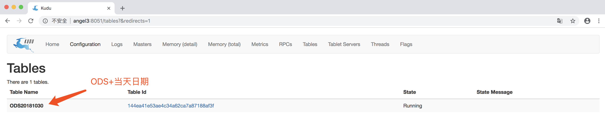

#### 2.6.8.4：将kudu中的数据作为impala的外部表，查看数据写入kudu

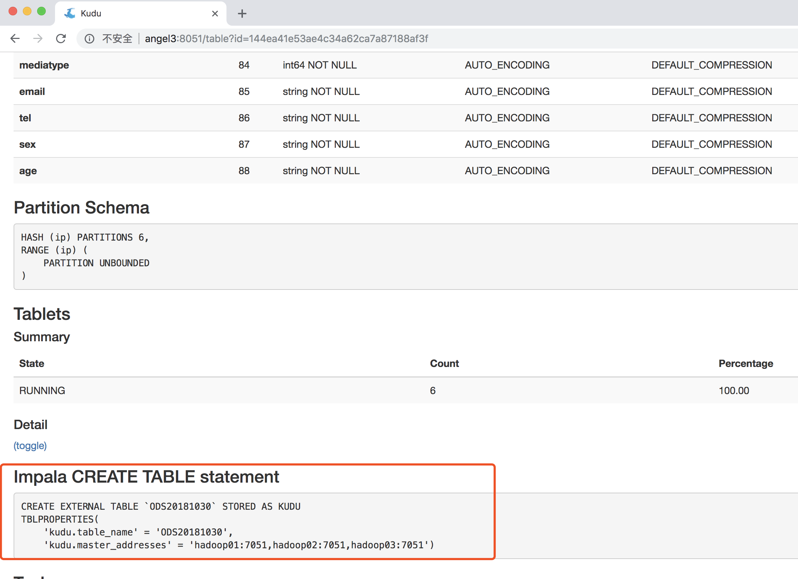

（1）：将kudu表作为impala外部表，通过查询条数验证数据是否成功写入

```sql
[angel1:21000] > CREATE EXTERNAL TABLE `ODS20181030` STORED AS KUDU
               > TBLPROPERTIES(
               >     'kudu.table_name' = 'ODS20181030',
               >     'kudu.master_addresses' = 'hadoop01:7051,hadoop02:7051,hadoop03:7051');
Query: create EXTERNAL TABLE `ODS20181030` STORED AS KUDU
TBLPROPERTIES(
    'kudu.table_name' = 'ODS20181030',
    'kudu.master_addresses' = 'hadoop01:7051,hadoop02:7051,hadoop03:7051')
Fetched 0 row(s) in 0.91s
```

(2)：查看数据条数，验证数据是否进入kudu

```sql
[angel1:21000] > select count(1) from ods20181030;
Query: select count(1) from ods20181030
Query submitted at: 2018-10-30 10:49:13 (Coordinator: http://angel1:25000)
Query progress can be monitored at: http://angel1:25000/query_plan?query_id=ec4d0b8fdb7bb7e1:32e5670200000000
+----------+
| count(1) |
+----------+
| 1000     |
+----------+
Fetched 1 row(s) in 5.20s
```

## 2.7：统计各省市的地域分布情况

### 2.7.1：代码逻辑

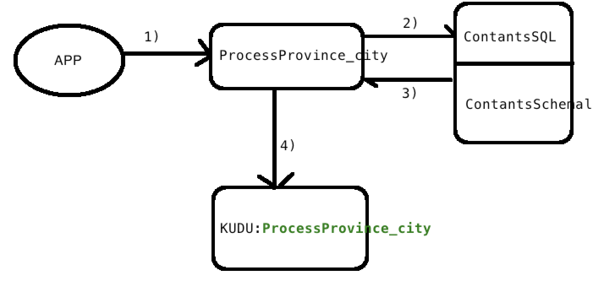

### 2.7.2：APP类添加逻辑：

```scala
//TODO 2):统计各省市的地域分布情况
ProcessProvince_city.process(sqlContext,sparkContext,kuduContext)
```

### 2.7.3：开发ProcessProvince_city

```scala
package com.dmp.ETL

import com.dmp.tools._
import org.apache.kudu.spark.kudu.KuduContext
import org.apache.spark.SparkContext
import org.apache.spark.sql.{SQLContext, SaveMode}
import org.apache.kudu.spark.kudu._
/**
  * Created by angel；
  */
object ProcessProvince_city extends ProcessReport{
  val KUDU_MASTER = GlobalConfUtils.KUDU_MASTER
  val TABLE_NAME = GlobalConfUtils.DOP + DataUtils.NowDate()
  val TO_TABLENAME = GlobalConfUtils.ProcessProvince_city
  val kuduOptions: Map[String, String] = Map(
    "kudu.table"  -> TABLE_NAME,
    "kudu.master" -> KUDU_MASTER)

  override def process(sqlContext:SQLContext , sparkContext:SparkContext , kuduContext:KuduContext): Unit = {
    //TODO 1：查询ODS+当天日期表
    val ods = sqlContext.read.options(kuduOptions).kudu
    ods.registerTempTable("ods")
    //TODO 2: 执行报表
    val result = sqlContext.sql(ContantsSQL.pro_citysql)
    val schema = ContantsSchemal.Province_citySchema
    val partitionID = "provincename"
    //TODO 3将数据插入kudu
    DBUtils.process(kuduContext , result , TO_TABLENAME , KUDU_MASTER , schema , partitionID)
  }
}
```

### 2.7.4：ContantsSQL添加pro_citysql

```scala
lazy val pro_citysql = "select provincename, cityname, count(*) as NUM from ods group by provincename, cityname"
```

### 2.7.5：ContantsSchemal添加Province_citySchema

```scala
lazy val Province_citySchema: Schema = {
    val columns = List(
      new ColumnSchemaBuilder("provincename", Type.STRING).nullable(false).key(true).build(),
      new ColumnSchemaBuilder("cityname", Type.STRING).nullable(false).key(true).build(),
      new ColumnSchemaBuilder("NUM", Type.INT64).nullable(false).key(true).build()
    ).asJava
    new Schema(columns)
}
```

### 2.7.6：执行APP并查看结果

#### 2.7.6.1：查看kudu页面，是否生成kudu表

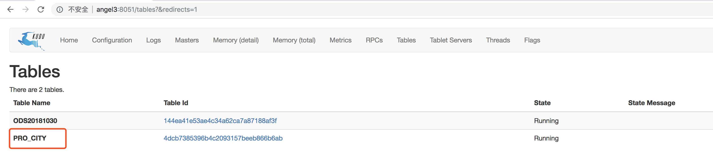

#### 2.7.6.2：将kudu数据作为impala外部表，并查看数据是否写入kudu

```SQL
[angel1:21000] > CREATE EXTERNAL TABLE `PRO_CITY` STORED AS KUDU
               > TBLPROPERTIES(
               >     'kudu.table_name' = 'PRO_CITY',
               >     'kudu.master_addresses' = 'hadoop01:7051,hadoop02:7051,hadoop03:7051');
Query: create EXTERNAL TABLE `PRO_CITY` STORED AS KUDU
TBLPROPERTIES(
    'kudu.table_name' = 'PRO_CITY',
    'kudu.master_addresses' = 'hadoop01:7051,hadoop02:7051,hadoop03:7051')
Fetched 0 row(s) in 0.25s
```

```SQL
[angel1:21000] > select * from pro_city limit 3;
Query: select * from pro_city limit 3
Query submitted at: 2018-10-30 11:32:09 (Coordinator: http://angel1:25000)
Query progress can be monitored at: http://angel1:25000/query_plan?query_id=2a471363368f246d:ffc4a46700000000
+--------------+--------------+-----+
| provincename | cityname     | num |
+--------------+--------------+-----+
| 上海市南汇区 | 上海市南汇区 | 2   |
| 上海市黄浦区 | 上海市黄浦区 | 2   |
| 中国         | 中国         | 29  |
+--------------+--------------+-----+
Fetched 3 row(s) in 0.17s
```

## 2.8：广告投放的地域分布情况统计

### 2.8.1：查询地域分布情况表格

按照产品需求，我们需要完成如下模式的报表

| 省/市    | 原始请求数 | 有效请求数 | 广告请求数 | 参与竞价数 | 竞价成功数 | 竞价成功率 | 展示量 | 点击量 | 点击率 | 广告成本 | 广告消费 |
| -------- | ---------- | ---------- | ---------- | ---------- | ---------- | ---------- | ------ | ------ | ------ | -------- | -------- |
| 河北省   |            |            |            | 1000       | 10         |            |        |        |        |          |          |
| 唐山市   |            |            |            |            |            |            |        |        |        |          |          |
| 石家庄市 |            |            |            |            |            |            |        |        |        |          |          |
|          |            |            |            |            |            |            |        |        |        |          |          |
|          |            |            |            |            |            |            |        |        |        |          |          |

### 2.8.2：查询地域分布情况的指标逻辑

完成【2.8.1】中的报表，需要如下的指标逻辑

| 指标                    | 说明                                           | adplatformproviderid | requestmode | processnode | iseffective | isbilling | isbid | iswin | adorderid | adcreativeid |
| ----------------------- | ---------------------------------------------- | -------------------- | ----------- | ----------- | ----------- | --------- | ----- | ----- | --------- | ------------ |
| 原始请求                | 发来的所有原始请求数                           |                      | 1           | >=1         |             |           |       |       |           |              |
| 有效请求                | 满足有效体检的数量                             |                      | 1           | >=2         |             |           |       |       |           |              |
| 广告请求                | 满足广告请求的请求数量                         |                      | 1           | 3           |             |           |       |       |           |              |
| 参与竞价数              | 参与竞价的次数                                 | >=100000             |             |             | 1           | 1         | 1     |       | !=0       |              |
| 竞价成功数              | 成功竞价的次数                                 | >=100000             |             |             | 1           | 1         |       | 1     |           |              |
| （广告主）展示数        | 针对广告主统计：广告最终在终端被展示的数量     |                      | 2           |             | 1           |           |       |       |           |              |
| （广告主）点击数        | 针对广告主统计：广告被展示后，实际被点击的数量 |                      | 3           |             | 1           |           |       |       |           |              |
| （媒介）展示数          | 针对媒介统计：广告在终端被展示的数量           |                      | 2           |             | 1           | 1         |       |       |           |              |
| （媒介）点击数          | 针对媒介统计：展示的广告实际被点击的数量       |                      | 3           |             | 1           | 1         |       |       |           |              |
| DSP广告消费             | winprice/1000                                  | >=100000             |             |             | 1           | 1         |       | 1     | >200000   | >200000      |
| DSP广告成本(每千人成本) | adpayment/1000                                 | >=100000             |             |             | 1           | 1         |       | 1     | >200000   | >200000      |

**DSP广告消费 是广告主的消费**

**DSP广告成本 是DSP平台的消费**

**赚钱 = DSP广告成本 - DSP广告消费**

### 2.8.3：代码逻辑

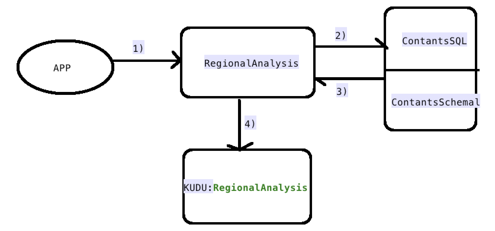

### 2.8.4：APP类添加逻辑

```scala
//TODO 3):广告投放的地域分布情况统计
RegionalAnalysis.process(sqlContext,sparkContext,kuduContext)
```

### 2.8.5：开发：RegionalAnalysis

```scala
package com.dmp.ETL

import java.util

import com.dmp.tools._
import org.apache.kudu.client.CreateTableOptions
import org.apache.kudu.client.KuduClient.KuduClientBuilder
import org.apache.kudu.spark.kudu.KuduContext
import org.apache.spark.SparkContext
import org.apache.spark.sql.{SQLContext, SaveMode}
import org.apache.kudu.spark.kudu._
/**
  * Created by angel；
  */
object RegionalAnalysis extends ProcessReport{
  val KUDU_MASTER = GlobalConfUtils.KUDU_MASTER
  val TABLE_NAME = GlobalConfUtils.DOP + DataUtils.NowDate()
  val TO_TABLENAME = GlobalConfUtils.RegionalAnalysis
  val kuduOptions: Map[String, String] = Map(
    "kudu.table"  -> TABLE_NAME,
    "kudu.master" -> KUDU_MASTER)


  override def process(sqlContext: SQLContext, sparkContext: SparkContext, kuduContext: KuduContext): Unit = {
    //TODO 1：广告投放的地域分布情况
    val ods = sqlContext.read.options(kuduOptions).kudu
    ods.registerTempTable("ods")
    val regionAnalysis = sqlContext.sql(ContantsSQL.regionAnalysis)
    regionAnalysis.registerTempTable("tmp_regionAnalysis")
    val result = sqlContext.sql(ContantsSQL.region)
    //TODO 2：创建表
    val schema = ContantsSchemal.Regional_Analysis
    val partitionID = "provincename"
    //TODO 3将数据插入kudu
    DBUtils.process(kuduContext , result , TO_TABLENAME , KUDU_MASTER , schema , partitionID)
  }
}

```

### 2.8.6：ContantsSQL添加regionAnalysis和region

```
  lazy val regionAnalysis = "select " +
    "provincename ," +
    "cityname, " +
    "sum(case when requestmode=1 and processnode >=1 then 1 else 0 end) OriginalRequest, " +
    "sum(case when requestmode=1 and processnode >=2 then 1 else 0 end) ValidRequest, " +
    "sum(case when requestmode=1 and processnode =3 then 1 else 0 end) adRequest, " +
    "sum(case when iseffective=1 and isbilling=1 and isbid=1 and adorderid !=0 and adplatformproviderid >=100000 then 1 else 0 end) bidsNum, " +
    "sum(case when iseffective=1 and isbilling=1 and iswin=1 and adplatformproviderid >=100000 then 1 else 0 end) bidsSus, " +
    "sum(case when requestmode=2 and iseffective=1 then 1 else 0 end) adImpressions, " +
    "sum(case when requestmode=3 and iseffective=1 then 1 else 0 end) adClicks, " +
    "sum(case when requestmode=2 and iseffective=1 and isbilling=1 then 1 else 0 end) MediumDisplayNum, " +
    "sum(case when requestmode=3 and iseffective=1 and isbilling=1 then 1 else 0 end) MediumClickNum, " +
    "sum(case when iseffective=1 and isbilling=1 and iswin=1 and adplatformproviderid >= 100000 and adorderid > 200000 and adcreativeid > 200000 then 1*adpayment/1000 else 0 end) adCost, " +
    "sum(case when iseffective=1 and isbilling=1 and iswin=1 and adplatformproviderid >= 100000 and adorderid > 200000 and adcreativeid > 200000 then 1*winprice/1000 else 0 end) adConsumption " +
    "from ods group by provincename, cityname"
```

```
lazy val region = "select " +
    "provincename," +
    "cityname," +
    "OriginalRequest," +
    "ValidRequest," +
    "adRequest," +
    "bidsNum," +
    "bidsSus," +
    "bidsSus/bidsNum bidsSusRat , " +
    "adImpressions , " +
    "adClicks , " +
    "adClicks/adImpressions adClickRat , "+
    "adCost , " +
    "adConsumption "+
    "from tmp_regionAnalysis " +
    "where where adClicks != 0 AND adImpressions != 0 AND bidsSus != 0 AND bidsNum != 0"
```


### 2.8.7：ContantsSchemal添加Regional_Analysis

```scala
  lazy val Regional_Analysis: Schema = {
    val columns = List(
      new ColumnSchemaBuilder("provincename", Type.STRING).nullable(false).key(true).build(),
      new ColumnSchemaBuilder("cityname", Type.STRING).nullable(false).key(true).build(),
      new ColumnSchemaBuilder("OriginalRequest", Type.INT64).nullable(false).key(true).build(),//原始请求
      new ColumnSchemaBuilder("ValidRequest", Type.INT64).nullable(false).key(true).build(),//有效请求
      new ColumnSchemaBuilder("adRequest", Type.INT64).nullable(false).key(true).build(),//广告请求数
      new ColumnSchemaBuilder("bidsNum", Type.INT64).nullable(false).key(true).build(),//参与竞价数
      new ColumnSchemaBuilder("bidsSus", Type.INT64).nullable(false).key(true).build(),//竞价成功数
      new ColumnSchemaBuilder("bidsSusRat", Type.DOUBLE).nullable(true).build(),//竞价成功率//
      new ColumnSchemaBuilder("adImpressions", Type.INT64).nullable(false).build(),//广告主-展示数
      new ColumnSchemaBuilder("adClicks", Type.INT64).nullable(false).build(),//广告主-点击数
      new ColumnSchemaBuilder("adClickRat", Type.DOUBLE).nullable(true).build(),//广告主-点击率
      new ColumnSchemaBuilder("adCost", Type.DOUBLE).nullable(false).build(),//广告成本
      new ColumnSchemaBuilder("adConsumption", Type.DOUBLE).nullable(false).build()//广告消费
    ).asJava
    new Schema(columns)
  }
```

### 2.8.8：执行APP并查询结果

#### 2.8.8.1：查看kudu页面，是否生成kudu表

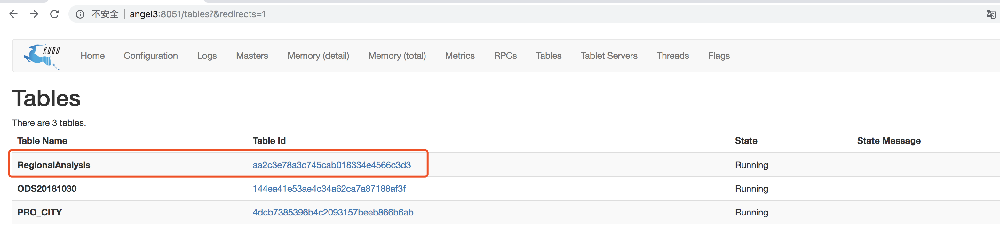

#### 2.8.8.2：将kudu数据作为impala外部表，并查看数据是否写入kudu

```sql
CREATE EXTERNAL TABLE `RegionalAnalysis` STORED AS KUDU
TBLPROPERTIES(
    'kudu.table_name' = 'RegionalAnalysis',
    'kudu.master_addresses' = 'hadoop01:7051,hadoop02:7051,hadoop03:7051')
```

```sql
[angel1:21000] > select * from RegionalAnalysis limit 4;
Query: select * from RegionalAnalysis limit 4
Query submitted at: 2018-10-30 16:43:50 (Coordinator: http://angel1:25000)
Query progress can be monitored at: http://angel1:25000/query_plan?query_id=848fc430aae1528:af00b1ef00000000
+--------------+--------------+-----------------+--------------+-----------+---------+---------+------------+---------------+----------+------------+--------+---------------+
| provincename | cityname     | originalrequest | validrequest | adrequest | bidsnum | bidssus | bidssusrat | adimpressions | adclicks | adclickrat | adcost | adconsumption |
+--------------+--------------+-----------------+--------------+-----------+---------+---------+------------+---------------+----------+------------+--------+---------------+
| 新疆塔城地区 | 新疆塔城地区 | 0               | 0            | 0         | 0       | 0       | NULL       | 1             | 0        | 0          | 0      | 0             |
| 新疆昌吉州   | 新疆昌吉州   | 0               | 0            | 0         | 1       | 0       | 0          | 1             | 0        | 0          | 0      | 0             |
| 湖北省       | 武汉市青山区 | 0               | 0            | 0         | 0       | 0       | NULL       | 1             | 0        | 0          | 0      | 0             |
| 甘肃省       | 甘肃省       | 0               | 0            | 0         | 0       | 0       | NULL       | 1             | 0        | 0          | 0      | 0             |
+--------------+--------------+-----------------+--------------+-----------+---------+---------+------------+---------------+----------+------------+--------+---------------+
Fetched 4 row(s) in 4.68s
```

## 2.9：广告投放的APP分布情况统计

### 2.9.1：广告投放的APP分布情况表格

按照产品需求，我们需要完成如下模式的报表

| APP_ID     | APP_NAME | 原始请求 | 有效请求 | 广告请求 | 参与竞价数 | 竞价成功数 | 竞价成功率 | 展示量 | 点击量 | 点击率 | 广告消费 | 广告成本 |
| ---------- | -------- | -------- | -------- | -------- | ---------- | ---------- | ---------- | ------ | ------ | ------ | -------- | -------- |
| XRX1000073 | YY直播   |          |          |          | 1000       | 10         |            |        |        |        |          |          |
| XRX1000071 | 今日头条 |          |          |          |            |            |            |        |        |        |          |          |
| XRX1000023 | 抖音     |          |          |          |            |            |            |        |        |        |          |          |
|            |          |          |          |          |            |            |            |        |        |        |          |          |
|            |          |          |          |          |            |            |            |        |        |        |          |          |

### 2.9.2：查询APP投放情况的指标逻辑

| 指标             | 说明                                           | adplatformproviderid | requestmode | processnode | iseffective | isbilling | isbid | iswin | adorderid | adcreativeid |
| ---------------- | ---------------------------------------------- | -------------------- | ----------- | ----------- | ----------- | --------- | ----- | ----- | --------- | ------------ |
| 原始请求         | 发来的所有原始请求数                           |                      | <=2         | 1           |             |           |       |       |           |              |
| 有效请求         | 有效请求的次数                                 |                      | >=1         | >=2         |             |           |       |       |           |              |
| 广告请求         | 广告请求的数量                                 |                      | 1           | 3           |             |           |       |       |           |              |
| 参与竞价数       | 参与竞价的次数                                 | >= 100000            |             |             | 1           | 1         | 1     |       | !=0       |              |
| 竞价成功数       | 成功竞价的次数                                 | >=100000             |             |             | 1           | 1         |       | 1     | !=0       |              |
| （广告主）展示数 | 针对广告主统计：广告最终在终端被展示的数量     |                      | 2           |             | 1           |           |       |       |           |              |
| （广告主）点击数 | 针对广告主统计：广告被展示后，实际被点击的数量 |                      | 3           |             | 1           |           |       |       | !=0       |              |
| （媒介）展示数   | 针对媒介统计：广告在终端被展示的数量           |                      | 2           |             | 1           | 1         | 1     | 1     |           |              |
| （媒介）点击数   | 针对媒介统计：展示的广告实际被点击的数量       |                      | 3           |             | 1           | 1         | 1     | 1     |           |              |
| DSP广告消费      | winprice/1000                                  | >=100000             |             |             | 1           | 1         |       | 1     | >200000   | >200000      |
| DSP广告成本      | adpayment/1000                                 | >=100000             |             |             | 1           | 1         | 1     | 1     | >200000   | >200000      |

### 2.9.3：代码逻辑

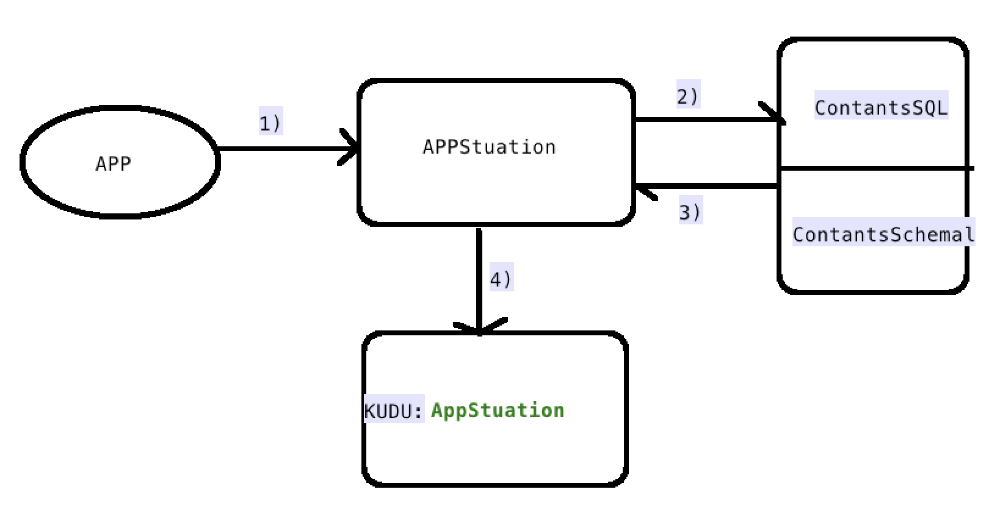

### 2.9.4：APP类添加逻辑

```scala
    //TODO 4):广告投放的APP分布情况统计
    APPStuation.process(sqlContext,sparkContext,kuduContext)
```

### 2.9.5：开发APPStuation

```scala
package com.dmp.ETL

import java.util

import com.dmp.tools._
import org.apache.kudu.client.CreateTableOptions
import org.apache.kudu.client.KuduClient.KuduClientBuilder
import org.apache.kudu.spark.kudu.KuduContext
import org.apache.spark.SparkContext
import org.apache.spark.sql.{SQLContext, SaveMode}
import org.apache.kudu.spark.kudu._;
/**
  * Created by angel；
  */
object APPStuation extends ProcessReport{
  val KUDU_MASTER = GlobalConfUtils.KUDU_MASTER
  val TABLE_NAME = GlobalConfUtils.DOP + DataUtils.NowDate()
  val TO_TABLENAME = GlobalConfUtils.AppStuation
  val kuduOptions: Map[String, String] = Map(
    "kudu.table"  -> TABLE_NAME,
    "kudu.master" -> KUDU_MASTER)


  override def process(sqlContext: SQLContext, sparkContext: SparkContext, kuduContext: KuduContext): Unit = {
    //TODO 1：广告投放的APP分布情况统计
    val ods = sqlContext.read.options(kuduOptions).kudu
    ods.registerTempTable("ods")
    val result = sqlContext.sql(ContantsSQL.tertminal_app_stuation)
    result.registerTempTable("temp_AppStuation")
    val terminal = sqlContext.sql(ContantsSQL.app_stuation)
    //TODO 2:创建kudu表
    val schema = ContantsSchemal.APP_situation
    val partitionID = "appid"
    //TODO 3将数据插入kudu
    DBUtils.process(kuduContext , terminal , TO_TABLENAME , KUDU_MASTER , schema , partitionID)
  }
}

```

### 2.9.6：ContantsSQL添加tertminal_app_stuation和app_stuation

```
 lazy val tertminal_app_stuation =  "select " +
    "appid , " +
    "appname," +
    "sum(case when requestmode=1 and processnode >=1 then 1 else 0 end) OriginalRequest, " +
    "sum(case when requestmode=1 and processnode >=2 then 1 else 0 end) ValidRequest,  " +
    "sum(case when requestmode=1 and processnode =3 then 1 else 0 end) adRequest,  " +
    "sum(case when iseffective=1 and isbilling=1 and isbid=1 and adorderid !=0 and adplatformproviderid >=100000 then 1 else 0 end) bidsNum," +
    "sum(case when iseffective=1 and isbilling=1 and iswin=1 and adplatformproviderid >=100000 then 1 else 0 end) bidsSus," +
    "sum(case when requestmode=2 and iseffective=1 and isbilling=1 then 1 else 0 end) MediumDisplayNum, " +
    "sum(case when requestmode=3 and iseffective=1 and isbilling=1 then 1 else 0 end) MediumClickNum " +
    "from ods group by appid, appname"
```

```
lazy val app_stuation = "select " +
    "appid," +
    "appname," +
    "OriginalRequest," +
    "ValidRequest," +
    "adRequest," +
    "bidsNum," +
    "bidsSus," +
    "bidsSus/bidsNum bidsSusRat , " +
    "MediumDisplayNum," +
    "MediumClickNum," +
    "MediumClickNum/MediumDisplayNum clickRat " +
    "from temp_AppStuation where MediumDisplayNum != 0 AND MediumClickNum != 0 AND bidsSus != 0 AND bidsNum != 0"
```

### 2.9.7：ContantsSchemal添加APP_situation

```scala
  lazy val APP_situation: Schema = {
    val columns = List(
      new ColumnSchemaBuilder("appid", Type.STRING).nullable(false).key(true).build(),
      new ColumnSchemaBuilder("appname", Type.STRING).nullable(false).key(true).build(),
      new ColumnSchemaBuilder("OriginalRequest", Type.INT64).nullable(false).key(true).build(),//原始请求
      new ColumnSchemaBuilder("ValidRequest", Type.INT64).nullable(false).key(true).build(),//有效请求
      new ColumnSchemaBuilder("adRequest", Type.INT64).nullable(false).key(true).build(),//广告请求数
      new ColumnSchemaBuilder("bidsNum", Type.INT64).nullable(false).key(true).build(),//参与竞价数
      new ColumnSchemaBuilder("bidsSus", Type.INT64).nullable(false).key(true).build(),//竞价成功数
      new ColumnSchemaBuilder("bidsSusRat", Type.DOUBLE).nullable(true).build(),//竞价成功率
      new ColumnSchemaBuilder("MediumDisplayNum", Type.INT64).nullable(false).build(),//展示量
      new ColumnSchemaBuilder("MediumClickNum", Type.INT64).nullable(false).build(),//点击量
      new ColumnSchemaBuilder("clickRat", Type.DOUBLE).nullable(false).build()//点击率
    ).asJava
    new Schema(columns)
  }
```

### 2.9.8：执行APP并查询结果

#### 2.9.8.1：查看kudu页面，是否生成kudu表

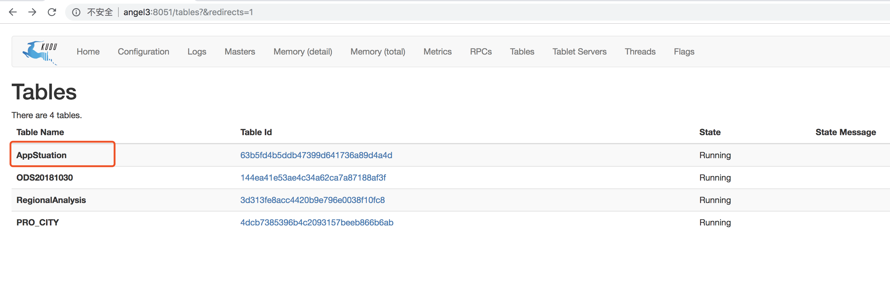

#### 2.9.8.2：将kudu数据作为impala外部表，并查看数据是否写入kudu

```sql
CREATE EXTERNAL TABLE `AppStuation` STORED AS KUDU
TBLPROPERTIES(
    'kudu.table_name' = 'AppStuation',
    'kudu.master_addresses' = 'hadoop01:7051,hadoop02:7051,hadoop03:7051')
```

```shell
[angel1:21000] > select * from appstuation limit 4;
Query: select * from appstuation limit 4
Query submitted at: 2018-10-30 16:48:33 (Coordinator: http://angel1:25000)
Query progress can be monitored at: http://angel1:25000/query_plan?query_id=904aadef65862244:937308bf00000000
+------------+---------+-----------------+--------------+-----------+---------+---------+--------------------+------------------+----------------+----------+
| appid      | appname | originalrequest | validrequest | adrequest | bidsnum | bidssus | bidssusrat         | mediumdisplaynum | mediumclicknum | clickrat |
+------------+---------+-----------------+--------------+-----------+---------+---------+--------------------+------------------+----------------+----------+
| XRX1000073 | 滴滴    | 1               | 1            | 1         | 2       | 2       | 1                  | 5                | 5              | 1        |
| XRX1000051 | 斗鱼    | 2               | 0            | 0         | 2       | 1       | 0.5                | 5                | 2              | 0.4      |
| XRX1000055 | NICE    | 4               | 3            | 2         | 3       | 1       | 0.3333333333333333 | 3                | 3              | 1        |
| XRX1000067 | 58同城  | 3               | 2            | 1         | 3       | 3       | 1                  | 5                | 5              | 1        |
+------------+---------+-----------------+--------------+-----------+---------+---------+--------------------+------------------+----------------+----------+
Fetched 4 row(s) in 0.23s
```

## 2.10：广告投放的手机设备类型分布情况统计

### 2.10.1：广告投放的手机设备分布情况表格

1 IOS
2 android
3 wp
4 other

| 手机设备类型 | 手机设备型号 | 有效请求 | 广告请求 | 参与竞价数 | 竞价成功数 | 竞价成功率 | 展示量 | 点击量 | 点击率 | 广告成本 | 广告消费 |
| ------------ | ------------ | -------- | -------- | ---------- | ---------- | ---------- | ------ | ------ | ------ | -------- | -------- |
| ios          | iphone6s     |          |          |            |            |            |        |        |        |          |          |
|              |              |          |          |            |            |            |        |        |        |          |          |
|              |              |          |          |            |            |            |        |        |        |          |          |

### 2.10.2：查询手机分布情况的指标逻辑

| 指标             | 说明                                           | adplatformproviderid | requestmode | processnode | iseffective | isbilling | isbid | iswin | adorderid | adcreativeid |
| ---------------- | ---------------------------------------------- | -------------------- | ----------- | ----------- | ----------- | --------- | ----- | ----- | --------- | ------------ |
| 原始请求         | 发来的所有原始请求数                           |                      | <=2         | 1           |             |           |       |       |           |              |
| 有效请求         | 有效请求的次数                                 |                      | >=1         | >=2         |             |           |       |       |           |              |
| 广告请求         | 广告请求的数量                                 |                      | 1           | 3           |             |           |       |       |           |              |
| 参数竞价数       | 参与竞价的次数                                 | >= 100000            |             |             | 1           | 1         | 1     |       | !=0       |              |
| 竞价成功数       | 成功竞价的次数                                 | >=100000             |             |             | 1           | 1         |       | 1     | !=0       |              |
| （广告主）展示数 | 针对广告主统计：广告最终在终端被展示的数量     |                      | 2           |             | 1           |           |       |       |           |              |
| （广告主）点击数 | 针对广告主统计：广告被展示后，实际被点击的数量 |                      | 3           |             | 1           |           |       |       | !=0       |              |
| （媒介）展示数   | 针对媒介统计：广告在终端被展示的数量           |                      | 2           |             | 1           | 1         | 1     | 1     |           |              |
| （媒介）点击数   | 针对媒介统计：展示的广告实际被点击的数量       |                      | 3           |             | 1           | 1         | 1     | 1     |           |              |
| DSP广告消费      | winprice/1000                                  | >=100000             |             |             | 1           | 1         |       | 1     | >200000   | >200000      |
| DSP广告成本      | adpayment/1000                                 | >=100000             |             |             | 1           | 1         | 1     | 1     | >200000   | >200000      |

### 2.10.3：代码逻辑

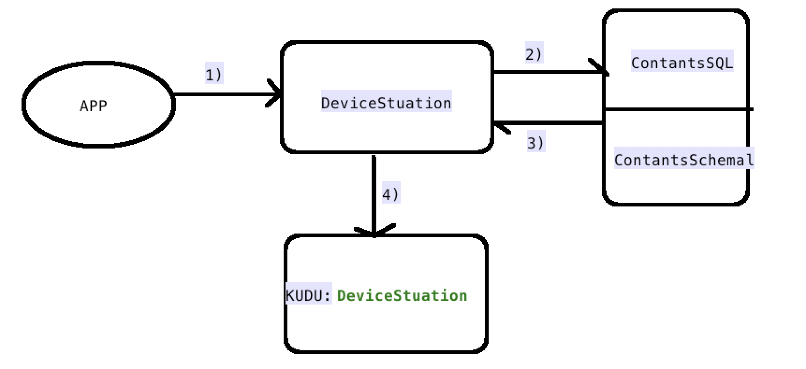

### 2.10.4：APP类添加逻辑

```scala
//TODO 5):广告投放的手机设备类型分布情况统计
DeviceStuation.process(sqlContext,sparkContext,kuduContext)
```

### 2.10.5：开发DeviceStuation

```scala
package com.dmp.ETL
import java.util

import com.dmp.tools._
import org.apache.kudu.spark.kudu.KuduContext
import org.apache.spark.SparkContext
import org.apache.spark.sql.{SQLContext, SaveMode}
import org.apache.kudu.spark.kudu._
/**
  * Created by angel；
  */
object DeviceStuation extends ProcessReport{
  val KUDU_MASTER = GlobalConfUtils.KUDU_MASTER
  val TABLE_NAME = GlobalConfUtils.DOP + DataUtils.NowDate()
  val TO_TABLENAME = GlobalConfUtils.DeviceStuation
  val kuduOptions: Map[String, String] = Map(
    "kudu.table"  -> TABLE_NAME,
    "kudu.master" -> KUDU_MASTER)


  override def process(sqlContext: SQLContext, sparkContext: SparkContext, kuduContext: KuduContext): Unit = {
    //TODO 1：广告投放的APP分布情况统计
    val ods = sqlContext.read.options(kuduOptions).kudu
    ods.registerTempTable("ods")
    val result = sqlContext.sql(ContantsSQL.tertminal_device_stuation)
    result.registerTempTable("temp_DeviceStuation")
    val terminal = sqlContext.sql(ContantsSQL.device_stuation)
    //TODO 2:创建kudu表
    val schema = ContantsSchemal.DEVICE_situation
    val partitionID = "client"
    //TODO 3将数据插入kudu
    DBUtils.process(kuduContext , terminal , TO_TABLENAME , KUDU_MASTER , schema , partitionID)
  }
}
```

### 2.10.6：ContantsSQL添加tertminal_device_stuation和device_stuation

```
 //TODO 手机设备
 lazy val tertminal_device_stuation =  "select " +
    "case client " +
    "when 1 then 'ios' "+
    "when 2 then 'android' "+
    "when 3 then 'wp' " +
    "ELSE 'OTHERS' END AS client , " +
    "device," +
    "sum(case when requestmode=1 and processnode >=1 then 1 else 0 end) OriginalRequest, " +
    "sum(case when requestmode=1 and processnode >=2 then 1 else 0 end) ValidRequest,  " +
    "sum(case when requestmode=1 and processnode =3 then 1 else 0 end) adRequest,  " +
    "sum(case when iseffective=1 and isbilling=1 and isbid=1 and adorderid !=0 and adplatformproviderid >=100000 then 1 else 0 end) bidsNum," +
    "sum(case when iseffective=1 and isbilling=1 and iswin=1 and adplatformproviderid >=100000 then 1 else 0 end) bidsSus," +
    "sum(case when requestmode=2 and iseffective=1 and isbilling=1 then 1 else 0 end) MediumDisplayNum, " +
    "sum(case when requestmode=3 and iseffective=1 and isbilling=1 then 1 else 0 end) MediumClickNum " +
    "from ods group by client, device"
```

```
lazy val device_stuation = "select " +
    "client," +
    "device," +
    "OriginalRequest," +
    "ValidRequest," +
    "adRequest," +
    "bidsNum," +
    "bidsSus," +
    "bidsSus/bidsNum bidsSusRat , " +
    "MediumDisplayNum," +
    "MediumClickNum," +
    "MediumClickNum/MediumDisplayNum clickRat " +
    "from temp_DeviceStuation where where MediumDisplayNum != 0 AND MediumClickNum != 0 AND bidsSus != 0 AND bidsNum != 0"
```

### 2.10.7：ContantsSchemal添加DEVICE_situation

```scala
lazy val DEVICE_situation: Schema = {
    val columns = List(
      new ColumnSchemaBuilder("client", Type.STRING).nullable(false).key(true).build(),
      new ColumnSchemaBuilder("device", Type.STRING).nullable(false).key(true).build(),
      new ColumnSchemaBuilder("OriginalRequest", Type.INT64).nullable(false).key(true).build(),//原始请求
      new ColumnSchemaBuilder("ValidRequest", Type.INT64).nullable(false).key(true).build(),//有效请求
      new ColumnSchemaBuilder("adRequest", Type.INT64).nullable(false).key(true).build(),//广告请求数
      new ColumnSchemaBuilder("bidsNum", Type.INT64).nullable(false).key(true).build(),//参与竞价数
      new ColumnSchemaBuilder("bidsSus", Type.INT64).nullable(false).key(true).build(),//竞价成功数
      new ColumnSchemaBuilder("bidsSusRat", Type.DOUBLE).nullable(true).build(),//竞价成功率
      new ColumnSchemaBuilder("MediumDisplayNum", Type.INT64).nullable(false).build(),//展示量
      new ColumnSchemaBuilder("MediumClickNum", Type.INT64).nullable(false).build(),//点击量
      new ColumnSchemaBuilder("clickRat", Type.DOUBLE).nullable(false).build()//点击率
    ).asJava
    new Schema(columns)
  }
```

### 2.10.8：执行APP并查询结果

#### 2.10.8.1：查看kudu页面，是否生成kudu表

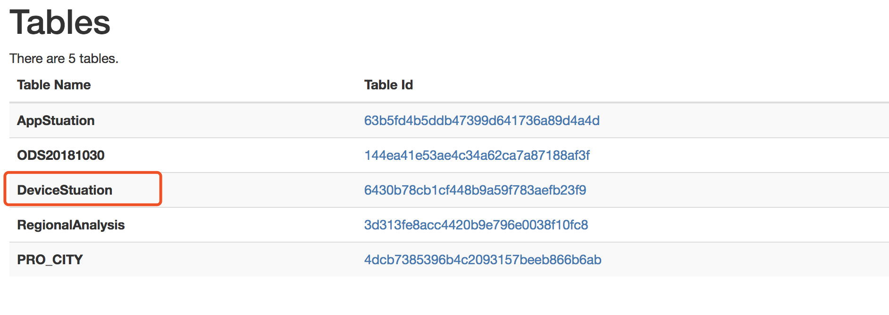

#### 2.10.8.2：将kudu数据作为impala外部表，并查询数据是否进入kudu

```sql
CREATE EXTERNAL TABLE `DeviceStuation` STORED AS KUDU
TBLPROPERTIES(
    'kudu.table_name' = 'DeviceStuation',
    'kudu.master_addresses' = 'hadoop01:7051,hadoop02:7051,hadoop03:7051')
```

```
[angel1:21000] > select * from devicestuation limit 20;
Query: select * from devicestuation limit 20
Query submitted at: 2018-10-30 18:07:14 (Coordinator: http://angel1:25000)
Query progress can be monitored at: http://angel1:25000/query_plan?query_id=1e423211893ab9a8:96b2c8f100000000
+---------+----------------+-----------------+--------------+-----------+---------+---------+------------+------------------+----------------+--------------------+
| client  | device         | originalrequest | validrequest | adrequest | bidsnum | bidssus | bidssusrat | mediumdisplaynum | mediumclicknum | clickrat           |
+---------+----------------+-----------------+--------------+-----------+---------+---------+------------+------------------+----------------+--------------------+
| ios     | HUAWEI GX1手机 | 9               | 7            | 3         | 4       | 1       | 0.25       | 6                | 6              | 1                  |
| ios     | NOTE8          | 9               | 8            | 5         | 5       | 4       | 0.8        | 7                | 5              | 0.7142857142857143 |
| android | IPHONE6S       | 9               | 6            | 4         | 5       | 3       | 0.6        | 9                | 8              | 0.8888888888888888 |
| android | IPHONE7_PLUS   | 19              | 9            | 4         | 8       | 5       | 0.625      | 10               | 6              | 0.6                |
| wp      | Nova2          | 17              | 14           | 5         | 10      | 5       | 0.5        | 6                | 6              | 1                  |
+---------+----------------+-----------------+--------------+-----------+---------+---------+------------+------------------+----------------+--------------------+
Fetched 5 row(s) in 0.33s
```


## 2.11：广告投放的网络类型分布情况统计

### 2.11.1：广告投放的网络类型分布情表格

| 联网方式id | 联网方式名称 | 有效请求 | 广告请求 | 参与竞价数 | 竞价成功数 | 竞价成功率 | 展示量 | 点击量 | 点击率 | 广告成本 | 广告消费 |
| ---------- | ------------ | -------- | -------- | ---------- | ---------- | ---------- | ------ | ------ | ------ | -------- | -------- |
| 0          | WIFI         |          |          |            |            |            |        |        |        |          |          |
| 1          | 4G           |          |          |            |            |            |        |        |        |          |          |
|            |              |          |          |            |            |            |        |        |        |          |          |


### 2.11.2：查询网络类型情况的指标逻辑

### 

| 指标             | 说明                                           | adplatformproviderid | requestmode | processnode | iseffective | isbilling | isbid | iswin | adorderid | adcreativeid |
| ---------------- | ---------------------------------------------- | -------------------- | ----------- | ----------- | ----------- | --------- | ----- | ----- | --------- | ------------ |
| 原始请求         | 发来的所有原始请求数                           |                      | <=2         | 1           |             |           |       |       |           |              |
| 有效请求         | 有效请求的次数                                 |                      | >=1         | >=2         |             |           |       |       |           |              |
| 广告请求         | 广告请求的数量                                 |                      | 1           | 3           |             |           |       |       |           |              |
| 参数竞价数       | 参与竞价的次数                                 | >= 100000            |             |             | 1           | 1         | 1     |       | !=0       |              |
| 竞价成功数       | 成功竞价的次数                                 | >=100000             |             |             | 1           | 1         |       | 1     | !=0       |              |
| （广告主）展示数 | 针对广告主统计：广告最终在终端被展示的数量     |                      | 2           |             | 1           |           |       |       |           |              |
| （广告主）点击数 | 针对广告主统计：广告被展示后，实际被点击的数量 |                      | 3           |             | 1           |           |       |       | !=0       |              |
| （媒介）展示数   | 针对媒介统计：广告在终端被展示的数量           |                      | 2           |             | 1           | 1         | 1     | 1     |           |              |
| （媒介）点击数   | 针对媒介统计：展示的广告实际被点击的数量       |                      | 3           |             | 1           | 1         | 1     | 1     |           |              |
| DSP广告消费      | winprice/1000                                  | >=100000             |             |             | 1           | 1         |       | 1     | >200000   | >200000      |
| DSP广告成本      | adpayment/1000                                 | >=100000             |             |             | 1           | 1         | 1     | 1     | >200000   | >200000      |

### 2.11.3：代码逻辑

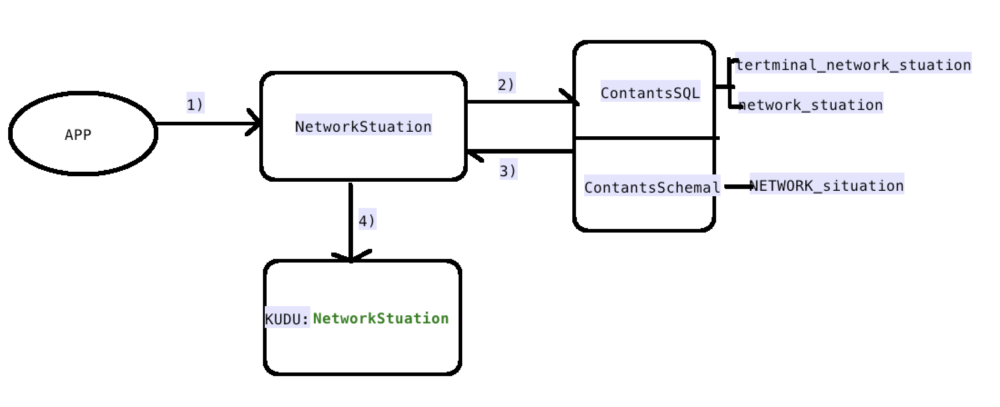


### 2.11.4：APP类添加逻辑

```scala
//TODO 6)：广告投放的网络类型分布情况统计
NetworkStuation.process(sqlContext,sparkContext,kuduContext)
```

### 2.11.5：开发NetworkStuation

### 

```scala
package com.dmp.ETL
import java.util

import com.dmp.tools._
import org.apache.kudu.client.CreateTableOptions
import org.apache.kudu.client.KuduClient.KuduClientBuilder
import org.apache.kudu.spark.kudu.KuduContext
import org.apache.spark.SparkContext
import org.apache.spark.sql.{SQLContext, SaveMode}
import org.apache.kudu.spark.kudu._;
/**
  * Created by angel；
  */
object NetworkStuation extends ProcessReport{
  val KUDU_MASTER = GlobalConfUtils.KUDU_MASTER
  val TABLE_NAME = GlobalConfUtils.DOP + DataUtils.NowDate()
  val TO_TABLENAME = GlobalConfUtils.NetworkStuation
  val kuduOptions: Map[String, String] = Map(
    "kudu.table"  -> TABLE_NAME,
    "kudu.master" -> KUDU_MASTER)


  override def process(sqlContext: SQLContext, sparkContext: SparkContext, kuduContext: KuduContext): Unit = {
    //TODO 1：广告投放的网络类型分布情况统计
    val ods = sqlContext.read.options(kuduOptions).kudu
    ods.registerTempTable("ods")
    val result = sqlContext.sql(ContantsSQL.tertminal_network_stuation)
    result.registerTempTable("temp_NetworkStuation")
    val terminal = sqlContext.sql(ContantsSQL.network_stuation)
    //TODO 2:创建kudu表
    val schema = ContantsSchemal.NETWORK_situation
    val partitionID = "networkmannerid"
    //TODO 3：将数据存入KUDU
    DBUtils.process(kuduContext , terminal , TO_TABLENAME , KUDU_MASTER , schema , partitionID)
  }
}

```


### 2.11.6：ContantsSQL添加tertminal_network_stuation和network_stuation

tertminal_network_stuation:

```reStructuredText
  //TODO 网络类型（WIFI 4G....）
  lazy val tertminal_network_stuation =  "select " +
    "networkmannerid ," +
    "networkmannername," +
    "sum(case when requestmode=1 and processnode >=1 then 1 else 0 end) OriginalRequest, " +
    "sum(case when requestmode=1 and processnode >=2 then 1 else 0 end) ValidRequest,  " +
    "sum(case when requestmode=1 and processnode =3 then 1 else 0 end) adRequest,  " +
    "sum(case when iseffective=1 and isbilling=1 and isbid=1 and adorderid !=0 and adplatformproviderid >=100000 then 1 else 0 end) bidsNum," +
    "sum(case when iseffective=1 and isbilling=1 and iswin=1 and adplatformproviderid >=100000 then 1 else 0 end) bidsSus," +
    "sum(case when requestmode=2 and iseffective=1 and isbilling=1 then 1 else 0 end) MediumDisplayNum, " +
    "sum(case when requestmode=3 and iseffective=1 and isbilling=1 then 1 else 0 end) MediumClickNum " +
    "from ods group by networkmannerid, networkmannername"
```

network_stuation:

```tex
lazy val network_stuation = "select " +
    "networkmannerid," +
    "networkmannername," +
    "OriginalRequest," +
    "ValidRequest," +
    "adRequest," +
    "bidsNum," +
    "bidsSus," +
    "bidsSus/bidsNum bidsSusRat , " +
    "MediumDisplayNum," +
    "MediumClickNum," +
    "MediumClickNum/MediumDisplayNum clickRat " +
    "from temp_NetworkStuation where MediumDisplayNum != 0 AND MediumClickNum != 0 AND bidsSus != 0 AND bidsNum != 0"
```


### 2.11.7：ContantsSchemal添加NETWORK_situation

```scala
lazy val NETWORK_situation: Schema = {
    val columns = List(
      new ColumnSchemaBuilder("networkmannerid", Type.INT64).nullable(false).key(true).build(),
      new ColumnSchemaBuilder("networkmannername", Type.STRING).nullable(false).key(true).build(),
      new ColumnSchemaBuilder("OriginalRequest", Type.INT64).nullable(false).build(),//原始请求
      new ColumnSchemaBuilder("ValidRequest", Type.INT64).nullable(false).build(),//有效请求
      new ColumnSchemaBuilder("adRequest", Type.INT64).nullable(false).build(),//广告请求数
      new ColumnSchemaBuilder("bidsNum", Type.INT64).nullable(false).build(),//参与竞价数
      new ColumnSchemaBuilder("bidsSus", Type.INT64).nullable(false).build(),//竞价成功数
      new ColumnSchemaBuilder("bidsSusRat", Type.DOUBLE).nullable(false).build(),//竞价成功率
      new ColumnSchemaBuilder("MediumDisplayNum", Type.INT64).nullable(false).build(),//展示量
      new ColumnSchemaBuilder("MediumClickNum", Type.INT64).nullable(false).build(),//点击量
      new ColumnSchemaBuilder("clickRat", Type.DOUBLE).nullable(false).build()//点击率
    ).asJava
    new Schema(columns)
  }
```

### 2.11.8：执行APP并查询结果

#### 2.11.8.1：查看kudu页面，是否生成kudu表

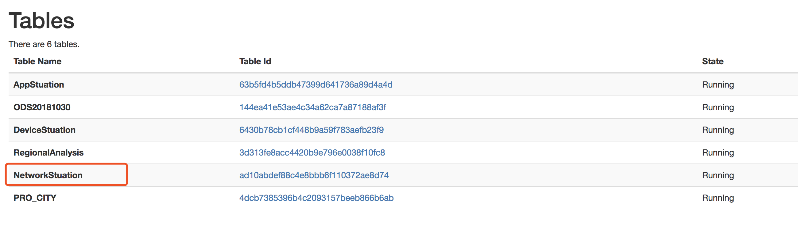

#### 2.11.8.2：将kudu数据作为impala外部表，并查询数据是否进入kudu

```sql
CREATE EXTERNAL TABLE `NetworkStuation` STORED AS KUDU
TBLPROPERTIES(
    'kudu.table_name' = 'NetworkStuation',
    'kudu.master_addresses' = 'hadoop01:7051,hadoop02:7051,hadoop03:7051')
```


```sql
[angel1:21000] > select * from NetworkStuation;
Query: select * from NetworkStuation
Query submitted at: 2018-10-30 20:54:33 (Coordinator: http://angel1:25000)
Query progress can be monitored at: http://angel1:25000/query_plan?query_id=e6437740a864face:37f58c0700000000
+-----------------+-------------------+-----------------+--------------+-----------+---------+---------+--------------------+------------------+----------------+--------------------+
| networkmannerid | networkmannername | originalrequest | validrequest | adrequest | bidsnum | bidssus | bidssusrat         | mediumdisplaynum | mediumclicknum | clickrat           |
+-----------------+-------------------+-----------------+--------------+-----------+---------+---------+--------------------+------------------+----------------+--------------------+
| 0               | WIFI              | 60              | 39           | 20        | 36      | 31      | 0.8611111111111112 | 35               | 29             | 0.8285714285714286 |
+-----------------+-------------------+-----------------+--------------+-----------+---------+---------+--------------------+------------------+----------------+--------------------+
Fetched 1 row(s) in 1.52s
```

## 2.12：广告投放的网络运营商分布情况统计

### 2.12.1：广告投放的网络运营商分布情况表格

| 运营商名称 | 有效请求 | 广告请求 | 参与竞价数 | 竞价成功数 | 竞价成功率 | 展示量 | 点击量 | 点击率 | 广告成本 | 广告消费 |
| ---------- | -------- | -------- | ---------- | ---------- | ---------- | ------ | ------ | ------ | -------- | -------- |
| 移动       |          |          |            |            |            |        |        |        |          |          |
| 电信       |          |          |            |            |            |        |        |        |          |          |
| 联通       |          |          |            |            |            |        |        |        |          |          |

### 2.12.2：查询网络运营商分布情况指标逻辑

### 

| 指标             | 说明                                           | adplatformproviderid | requestmode | processnode | iseffective | isbilling | isbid | iswin | adorderid | adcreativeid |
| ---------------- | ---------------------------------------------- | -------------------- | ----------- | ----------- | ----------- | --------- | ----- | ----- | --------- | ------------ |
| 原始请求         | 发来的所有原始请求数                           |                      | <=2         | 1           |             |           |       |       |           |              |
| 有效请求         | 有效请求的次数                                 |                      | >=1         | >=2         |             |           |       |       |           |              |
| 广告请求         | 广告请求的数量                                 |                      | 1           | 3           |             |           |       |       |           |              |
| 参数竞价数       | 参与竞价的次数                                 | >= 100000            |             |             | 1           | 1         | 1     |       | !=0       |              |
| 竞价成功数       | 成功竞价的次数                                 | >=100000             |             |             | 1           | 1         |       | 1     | !=0       |              |
| （广告主）展示数 | 针对广告主统计：广告最终在终端被展示的数量     |                      | 2           |             | 1           |           |       |       |           |              |
| （广告主）点击数 | 针对广告主统计：广告被展示后，实际被点击的数量 |                      | 3           |             | 1           |           |       |       | !=0       |              |
| （媒介）展示数   | 针对媒介统计：广告在终端被展示的数量           |                      | 2           |             | 1           | 1         | 1     | 1     |           |              |
| （媒介）点击数   | 针对媒介统计：展示的广告实际被点击的数量       |                      | 3           |             | 1           | 1         | 1     | 1     |           |              |
| DSP广告消费      | winprice/1000                                  | >=100000             |             |             | 1           | 1         |       | 1     | >200000   | >200000      |
| DSP广告成本      | adpayment/1000                                 | >=100000             |             |             | 1           | 1         | 1     | 1     | >200000   | >200000      |

### 2.12.3：代码逻辑

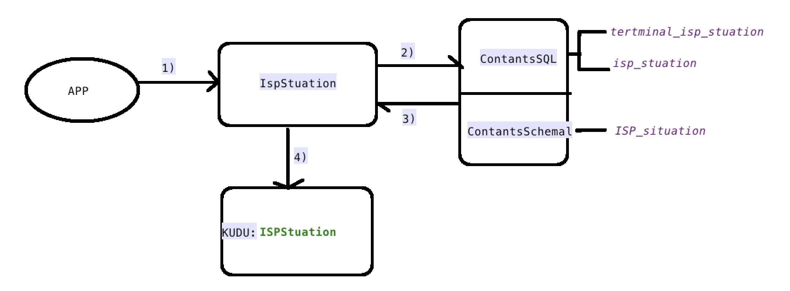

### 2.12.4：APP类添加逻辑

### 

```scala
//TODO 7):广告投放的网络运营商分布情况统计
IspStuation.process(sqlContext,sparkContext,kuduContext)
```

### 2.12.5：开发IspStuation

```scala
package com.dmp.ETL
import java.util

import com.dmp.tools._
import org.apache.kudu.client.CreateTableOptions
import org.apache.kudu.client.KuduClient.KuduClientBuilder
import org.apache.kudu.spark.kudu.KuduContext
import org.apache.spark.SparkContext
import org.apache.spark.sql.{SQLContext, SaveMode}
import org.apache.kudu.spark.kudu._;

/**
  * Created by angel；
  */
object IspStuation extends ProcessReport{
  val KUDU_MASTER = GlobalConfUtils.KUDU_MASTER
  val TABLE_NAME = GlobalConfUtils.DOP + DataUtils.NowDate()
  val TO_TABLENAME = GlobalConfUtils.ISPStuation
  val kuduOptions: Map[String, String] = Map(
    "kudu.table"  -> TABLE_NAME,
    "kudu.master" -> KUDU_MASTER)


  override def process(sqlContext: SQLContext, sparkContext: SparkContext, kuduContext: KuduContext): Unit = {
    //TODO 1：广告投放的网络运营商分布情况统计
    val ods = sqlContext.read.options(kuduOptions).kudu
    ods.registerTempTable("ods")
    val result = sqlContext.sql(ContantsSQL.tertminal_isp_stuation)
    result.registerTempTable("temp_ISPStuation")
    val terminal = sqlContext.sql(ContantsSQL.isp_stuation)
    //TODO 2:创建kudu表
    val schema = ContantsSchemal.ISP_situation
    val partitionID = "ispname"
    //TODO 3):将数据写入kudu
    DBUtils.process(kuduContext , terminal , TO_TABLENAME , KUDU_MASTER , schema , partitionID)
  }
}

```

### 2.12.6：ContantsSQL添加tertminal_isp_stuation和isp_stuation

添加tertminal_isp_stuation：

```
  //TODO 运营商
  lazy val tertminal_isp_stuation =  "select " +
    "ispname ," +
    "sum(case when requestmode=1 and processnode >=1 then 1 else 0 end) OriginalRequest, " +
    "sum(case when requestmode=1 and processnode >=2 then 1 else 0 end) ValidRequest,  " +
    "sum(case when requestmode=1 and processnode =3 then 1 else 0 end) adRequest,  " +
    "sum(case when iseffective=1 and isbilling=1 and isbid=1 and adorderid !=0 and adplatformproviderid >=100000 then 1 else 0 end) bidsNum," +
    "sum(case when iseffective=1 and isbilling=1 and iswin=1 and adplatformproviderid >=100000 then 1 else 0 end) bidsSus," +
    "sum(case when requestmode=2 and iseffective=1 and isbilling=1 then 1 else 0 end) MediumDisplayNum, " +
    "sum(case when requestmode=3 and iseffective=1 and isbilling=1 then 1 else 0 end) MediumClickNum " +
    "from ods group by ispname"
```

添加：isp_stuation

```
lazy val isp_stuation = "select " +
  "ispname," +
  "OriginalRequest," +
  "ValidRequest," +
  "adRequest," +
  "bidsNum," +
  "bidsSus," +
  "bidsSus/bidsNum bidsSusRat," +
  "MediumDisplayNum," +
  "MediumClickNum," +
  "MediumClickNum/MediumDisplayNum clickRat " +
  "from temp_ISPStuation where MediumDisplayNum != 0 AND MediumClickNum != 0 AND bidsSus != 0 AND bidsNum != 0"
```

### 2.12.7：ContantsSchemal添加ISP_situation

```scala
lazy val ISP_situation: Schema = {
    val columns = List(
      new ColumnSchemaBuilder("ispname", Type.STRING).nullable(false).key(true).build(),
      new ColumnSchemaBuilder("OriginalRequest", Type.INT64).nullable(false).build(),//原始请求
      new ColumnSchemaBuilder("ValidRequest", Type.INT64).nullable(false).build(),//有效请求
      new ColumnSchemaBuilder("adRequest", Type.INT64).nullable(false).build(),//广告请求数
      new ColumnSchemaBuilder("bidsNum", Type.INT64).nullable(false).build(),//参与竞价数
      new ColumnSchemaBuilder("bidsSus", Type.INT64).nullable(false).build(),//竞价成功数
      new ColumnSchemaBuilder("bidsSusRat", Type.DOUBLE).nullable(true).build(),//竞价成功率
      new ColumnSchemaBuilder("MediumDisplayNum", Type.INT64).nullable(false).build(),//展示量
      new ColumnSchemaBuilder("MediumClickNum", Type.INT64).nullable(false).build(),//点击量
      new ColumnSchemaBuilder("clickRat", Type.DOUBLE).nullable(false).build()//点击率
    ).asJava
    new Schema(columns)
  }
```

### 2.12.8：执行APP并查询结果

#### 2.12.8.1：查看kudu页面，是否生成kudu表

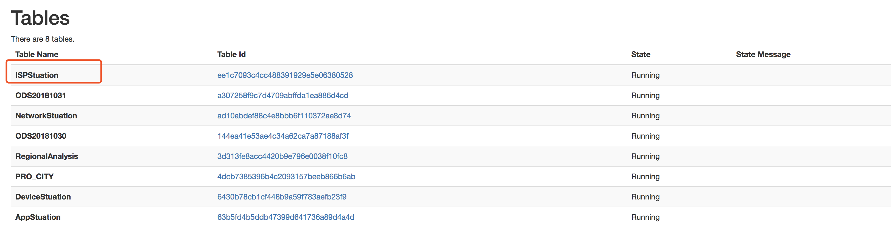

#### 2.12.8.2：将kudu数据作为impala外部表，并查询数据是否进入kudu

Impala CREATE TABLE statement

```
CREATE EXTERNAL TABLE `ISPStuation` STORED AS KUDU
TBLPROPERTIES(
    'kudu.table_name' = 'ISPStuation',
    'kudu.master_addresses' = 'hadoop01:7051,hadoop02:7051,hadoop03:7051')
```

```sql
[angel1:21000] > select * from ISPStuation limit 10;
Query: select * from ISPStuation limit 10
Query submitted at: 2018-10-31 10:30:05 (Coordinator: http://angel1:25000)
Query progress can be monitored at: http://angel1:25000/query_plan?query_id=4b442eba88d38445:e1f3800d00000000
+---------+-----------------+--------------+-----------+---------+---------+--------------------+------------------+----------------+--------------------+
| ispname | originalrequest | validrequest | adrequest | bidsnum | bidssus | bidssusrat         | mediumdisplaynum | mediumclicknum | clickrat           |
+---------+-----------------+--------------+-----------+---------+---------+--------------------+------------------+----------------+--------------------+
| 移动    | 191             | 135          | 58        | 79      | 78      | 0.9873417721518988 | 105              | 74             | 0.7047619047619048 |
| 电信    | 148             | 95           | 43        | 67      | 52      | 0.7761194029850746 | 74               | 73             | 0.9864864864864865 |
+---------+-----------------+--------------+-----------+---------+---------+--------------------+------------------+----------------+--------------------+
Fetched 2 row(s) in 5.79s
```

## 2.13：广告投放的渠道分布情况统计

### 2.13.1:广告投放的渠道分布情况表格

| 渠道ID | 有效请求 | 广告请求 | 参与竞价数 | 竞价成功数 | 竞价成功率 | 展示量 | 点击量 | 点击率 | 广告成本 | 广告消费 |
| ------ | -------- | -------- | ---------- | ---------- | ---------- | ------ | ------ | ------ | -------- | -------- |
| 23112  |          |          |            |            |            |        |        |        |          |          |
|        |          |          |            |            |            |        |        |        |          |          |
|        |          |          |            |            |            |        |        |        |          |          |

### 2.13.2：查询渠道分布情况指标逻辑

### 

| 指标             | 说明                                           | adplatformproviderid | requestmode | processnode | iseffective | isbilling | isbid | iswin | adorderid | adcreativeid |
| ---------------- | ---------------------------------------------- | -------------------- | ----------- | ----------- | ----------- | --------- | ----- | ----- | --------- | ------------ |
| 原始请求         | 发来的所有原始请求数                           |                      | <=2         | 1           |             |           |       |       |           |              |
| 有效请求         | 有效请求的次数                                 |                      | >=1         | >=2         |             |           |       |       |           |              |
| 广告请求         | 广告请求的数量                                 |                      | 1           | 3           |             |           |       |       |           |              |
| 参数竞价数       | 参与竞价的次数                                 | >= 100000            |             |             | 1           | 1         | 1     |       | !=0       |              |
| 竞价成功数       | 成功竞价的次数                                 | >=100000             |             |             | 1           | 1         |       | 1     | !=0       |              |
| （广告主）展示数 | 针对广告主统计：广告最终在终端被展示的数量     |                      | 2           |             | 1           |           |       |       |           |              |
| （广告主）点击数 | 针对广告主统计：广告被展示后，实际被点击的数量 |                      | 3           |             | 1           |           |       |       | !=0       |              |
| （媒介）展示数   | 针对媒介统计：广告在终端被展示的数量           |                      | 2           |             | 1           | 1         | 1     | 1     |           |              |
| （媒介）点击数   | 针对媒介统计：展示的广告实际被点击的数量       |                      | 3           |             | 1           | 1         | 1     | 1     |           |              |
| DSP广告消费      | winprice/1000                                  | >=100000             |             |             | 1           | 1         |       | 1     | >200000   | >200000      |
| DSP广告成本      | adpayment/1000                                 | >=100000             |             |             | 1           | 1         | 1     | 1     | >200000   | >200000      |

### 2.13.3：代码逻辑

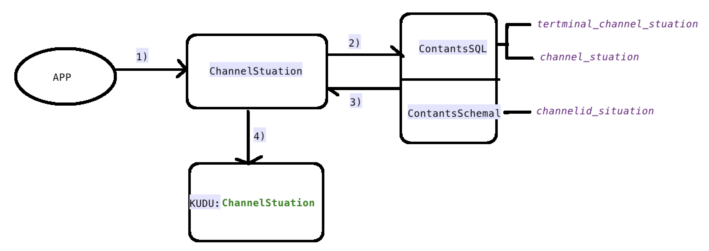

### 2.13.4：APP类添加代码逻辑

```scala
//TODO 8):广告投放的渠道分布情况统计
ChannelStuation.process(sqlContext,sparkContext,kuduContext)
```

### 2.13.5：开发ChannelStuation

```scala
package com.dmp.ETL

import java.util

import com.dmp.tools._
import org.apache.kudu.client.CreateTableOptions
import org.apache.kudu.client.KuduClient.KuduClientBuilder
import org.apache.kudu.spark.kudu.KuduContext
import org.apache.spark.SparkContext
import org.apache.spark.sql.{SQLContext, SaveMode}
import org.apache.kudu.spark.kudu._;
/**
  * Created by angel；
  */
object ChannelStuation extends ProcessReport{
  val KUDU_MASTER = GlobalConfUtils.KUDU_MASTER
  val TABLE_NAME = GlobalConfUtils.DOP + DataUtils.NowDate()
  val TO_TABLENAME = GlobalConfUtils.ChannelStuation
  val kuduOptions: Map[String, String] = Map(
    "kudu.table"  -> TABLE_NAME,
    "kudu.master" -> KUDU_MASTER)


  override def process(sqlContext: SQLContext, sparkContext: SparkContext, kuduContext: KuduContext): Unit = {
    //TODO 1：广告投放的渠道分布情况统计
    val ods = sqlContext.read.options(kuduOptions).kudu
    ods.registerTempTable("ods")
    val result = sqlContext.sql(ContantsSQL.tertminal_channel_stuation)
    result.registerTempTable("temp_ChannelStuation")
    val terminal = sqlContext.sql(ContantsSQL.channel_stuation)
    //TODO 2:创建kudu表
    val schema = ContantsSchemal.channelid_situation
    val partitionID = "channelid"
    //TODO 3):将数据写入kudu
    DBUtils.process(kuduContext , terminal , TO_TABLENAME , KUDU_MASTER , schema , partitionID)
  }
}

```

### 2.13.6：ContantsSQL添加tertminal_channel_stuation和channel_stuation

```
  //渠道，用户从哪些渠道过来的，比如：YY平台  CSDN平台等
  lazy val tertminal_channel_stuation =  "select " +
    "channelid , " +
    "sum(case when requestmode=1 and processnode >=1 then 1 else 0 end) OriginalRequest, " +
    "sum(case when requestmode=1 and processnode >=2 then 1 else 0 end) ValidRequest,  " +
    "sum(case when requestmode=1 and processnode =3 then 1 else 0 end) adRequest,  " +
    "sum(case when iseffective=1 and isbilling=1 and isbid=1 and adorderid !=0 and adplatformproviderid >=100000 then 1 else 0 end) bidsNum," +
    "sum(case when iseffective=1 and isbilling=1 and iswin=1 and adplatformproviderid >=100000 then 1 else 0 end) bidsSus," +
    "sum(case when requestmode=2 and iseffective=1 and isbilling=1 then 1 else 0 end) MediumDisplayNum, " +
    "sum(case when requestmode=3 and iseffective=1 and isbilling=1 then 1 else 0 end) MediumClickNum " +
    "from ods group by channelid"
```

```
lazy val channel_stuation = "select " +
    "channelid," +
    "OriginalRequest," +
    "ValidRequest," +
    "adRequest," +
    "bidsNum," +
    "bidsSus," +
    "bidsSus/bidsNum bidsSusRat , " +
    "MediumDisplayNum," +
    "MediumClickNum," +
    "MediumClickNum/MediumDisplayNum clickRat " +
    "from temp_ChannelStuation where MediumDisplayNum != 0 AND MediumClickNum != 0 AND bidsSus != 0 AND bidsNum != 0"
```

### 2.13.7：ContantsSchemal添加channelid_situation

```scala
lazy val channelid_situation: Schema = {
    val columns = List(
      new ColumnSchemaBuilder("channelid", Type.STRING).nullable(false).key(true).build(),
      new ColumnSchemaBuilder("OriginalRequest", Type.INT64).nullable(false).build(),//原始请求
      new ColumnSchemaBuilder("ValidRequest", Type.INT64).nullable(false).build(),//有效请求
      new ColumnSchemaBuilder("adRequest", Type.INT64).nullable(false).build(),//广告请求数
      new ColumnSchemaBuilder("bidsNum", Type.INT64).nullable(false).build(),//参与竞价数
      new ColumnSchemaBuilder("bidsSus", Type.INT64).nullable(false).build(),//竞价成功数
      new ColumnSchemaBuilder("bidsSusRat", Type.DOUBLE).nullable(true).build(),//竞价成功率
      new ColumnSchemaBuilder("MediumDisplayNum", Type.INT64).nullable(false).build(),//展示量
      new ColumnSchemaBuilder("MediumClickNum", Type.INT64).nullable(false).build(),//点击量
      new ColumnSchemaBuilder("clickRat", Type.DOUBLE).nullable(false).build()//点击率
    ).asJava
    new Schema(columns)
  }
```

### 2.13.8：执行APP，并查询结果

#### 2.13.8.1：查看kudu页面，是否生成kudu表

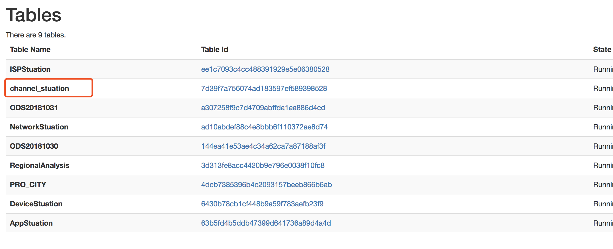

#### 2.13.8.2：将kudu数据作为impala外部表，并查询数据是否进入kudu

Impala CREATE TABLE statement

```
CREATE EXTERNAL TABLE `channel_stuation` STORED AS KUDU
TBLPROPERTIES(
    'kudu.table_name' = 'channel_stuation',
    'kudu.master_addresses' = 'hadoop01:7051,hadoop02:7051,hadoop03:7051')
```

```
[angel1:21000] > select * from channel_stuation limit 10;
Query: select * from channel_stuation limit 10
Query submitted at: 2018-10-31 11:25:16 (Coordinator: http://angel1:25000)
Query progress can be monitored at: http://angel1:25000/query_plan?query_id=6841cc21054aeb52:49af989600000000
+-----------+-----------------+--------------+-----------+---------+---------+--------------------+------------------+----------------+--------------------+
| channelid | originalrequest | validrequest | adrequest | bidsnum | bidssus | bidssusrat         | mediumdisplaynum | mediumclicknum | clickrat           |
+-----------+-----------------+--------------+-----------+---------+---------+--------------------+------------------+----------------+--------------------+
| 123495    | 5               | 3            | 1         | 1       | 1       | 1                  | 4                | 1              | 0.25               |
| 123519    | 1               | 1            | 0         | 3       | 1       | 0.3333333333333333 | 3                | 2              | 0.6666666666666666 |
| 123456    | 9               | 7            | 3         | 5       | 4       | 0.8                | 6                | 2              | 0.3333333333333333 |
| 123460    | 2               | 2            | 1         | 1       | 1       | 1                  | 2                | 2              | 1                  |
| 123517    | 8               | 5            | 3         | 3       | 2       | 0.6666666666666666 | 2                | 2              | 1                  |
| 123542    | 5               | 5            | 2         | 4       | 2       | 0.5                | 5                | 1              | 0.2                |
| 123482    | 0               | 0            | 0         | 2       | 1       | 0.5                | 2                | 1              | 0.5                |
| 123491    | 4               | 2            | 2         | 2       | 2       | 1                  | 5                | 1              | 0.2                |
| 123493    | 2               | 1            | 1         | 2       | 2       | 1                  | 2                | 0              | 0                  |
| 123511    | 7               | 6            | 3         | 2       | 1       | 0.5                | 2                | 2              | 1                  |
+-----------+-----------------+--------------+-----------+---------+---------+--------------------+------------------+----------------+--------------------+
Fetched 10 row(s) in 5.30s
```

## 2.14：生成商圈库

### 2.14.1：什么是商圈

商圈，是指商店以其所在地点为中心，沿着一定的方向和距离扩展，吸引顾客的辐射范围，简单地说，也就是来店顾客所居住的区域范围。无论大商场还是小商店，它们的销售总是有一定的地理范围。这个地理范围就是以商场为中心，向四周辐射至可能来店购买的消费者所居住的地点。 

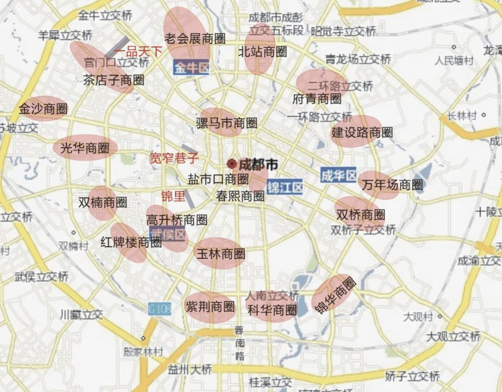

因此，对于一个用户来说，我们会基于这个用户的IP，生成自己的商圈库；生成商圈库之后，我们会给每一个用户在建立标签阶段打上商圈标；

有了商圈标签，那么广告主在选择受众用户的时候，除了可以选择其他元素（性别，年龄，APP等），还可以选择所在的商圈范围，然后进行广告推广，进一步对的推动用户的消费意向 

### 2.14.2：代码逻辑

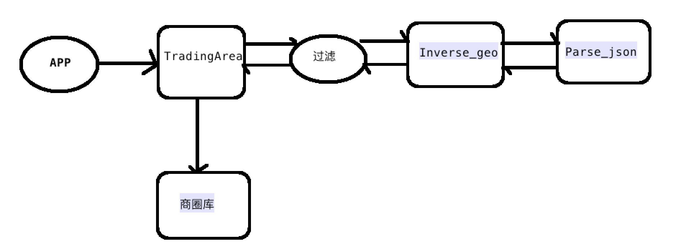

### 2.14.3：APP类添加代码逻辑

```scala
//TODO 9):生成商圈
TradingArea.process(sqlContext,sparkContext,kuduContext)
```

### 2.14.4：开发TradingArea

注意:商圈库在kudu中存储，按照如下结构存储:

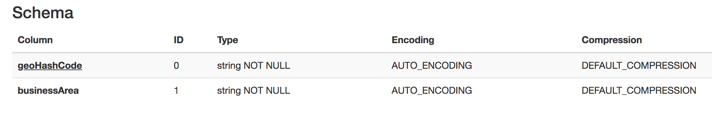

其中的geoHashCode作为主键，为了防止商圈库被覆盖的可能性，所以geoHashCode需要GeoHash对经纬度进行编码处理，保证值唯一


```scala
package com.dmp.ETL
import java.util

import ch.hsr.geohash.GeoHash
import com.dmp.tools.businessDB.Inverse_geo
import com.dmp.tools._
import org.apache.kudu.spark.kudu.KuduContext
import org.apache.spark.SparkContext
import org.apache.spark.rdd.RDD
import org.apache.spark.sql.{SQLContext, SaveMode}
import org.apache.kudu.spark.kudu._
/**
  * Created by angel；
  */
object TradingArea extends ProcessReport{
  //KUDU地址
  val KUDU_MASTER = GlobalConfUtils.KUDU_MASTER
  //当天的ODS数据
  val TABLE_NAME = GlobalConfUtils.DOP+DataUtils.NowDate()
  //目标表
  val TO_TABLENAME = GlobalConfUtils.TradingArea
  //kudu的配置
  val kuduOptions: Map[String, String] = Map(
    "kudu.table"  -> TABLE_NAME,
    "kudu.master" -> KUDU_MASTER)

  override def process(sqlContext: SQLContext, sparkContext: SparkContext, kuduContext: KuduContext): Unit = {
    val ods = sqlContext.read.options(kuduOptions).kudu
    //TODO 1:过滤掉非中国IP
    ods.registerTempTable("ods")
    val long_lat = sqlContext.sql(ContantsSQL.non_chinaIP)

    //TODO 2:基于经纬度去高德地图获取商圈相关信息
    val rdd = long_lat.rdd
    val trade:RDD[BusinessArea] = rdd.map{
      line =>
        val long = line.getAs[String]("long")//纬度
        val lat = line.getAs[String]("lat")
        //此处需要导入geohash编码
        //获取基于经纬度的geo编码
        val geoHashCode = GeoHash.withCharacterPrecision(lat.toDouble , long.toDouble , 8).toBase32
        //获取商圈信息
        val str = long+","+lat
        val business = Inverse_geo.la_lo2json(str).replaceAll("," , ":")
        BusinessArea(geoHashCode , business)
    }.filter(line => !line.business.equals("blank"))
    import sqlContext.implicits._
    val tradeDF = trade.toDF("geoHashCode" , "businessArea")
    val schema = ContantsSchemal.tradingArea
    val partitionID = "geoHashCode"
    //TODO 3:将商圈信息入库到kudu
    DBUtils.process(kuduContext , tradeDF , TO_TABLENAME , KUDU_MASTER , schema , partitionID)
  }
}

case class BusinessArea(geoHashCode:String ,business:String)
```

### 2.14.5：开发Inverse_geo

#### 2.14.5.1：基于经纬度进行商圈定位

1）：申请网址:

https://lbs.amap.com/

2）：登录或注册

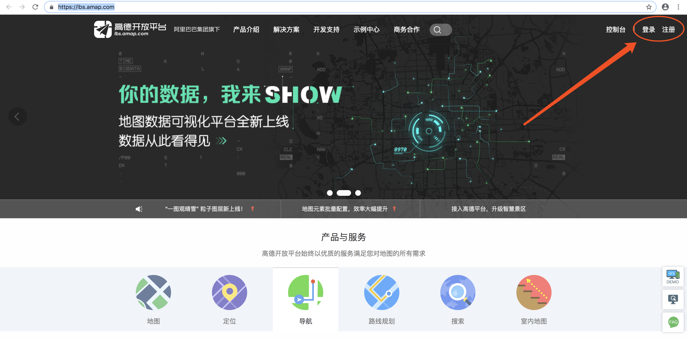

3）：选择：开发支持---Web服务 API

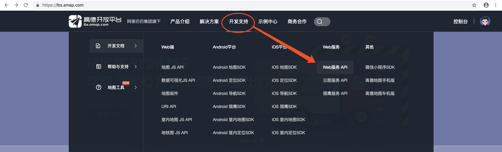


4）：获取高德地图key---进入控制台—我的应用

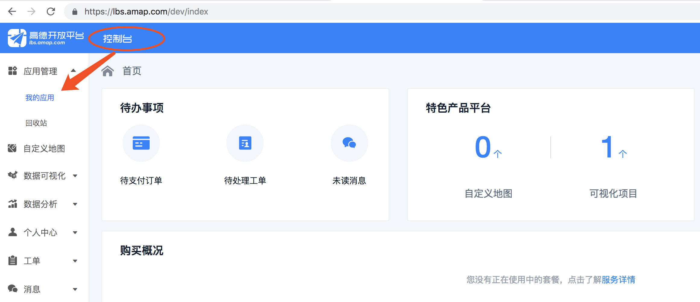

5）：创建应用

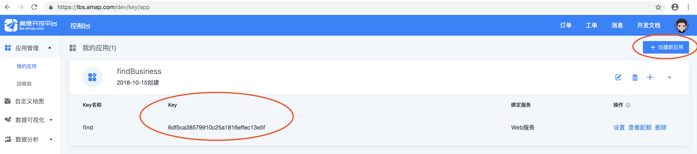

6）：根据key进行逆地理编码

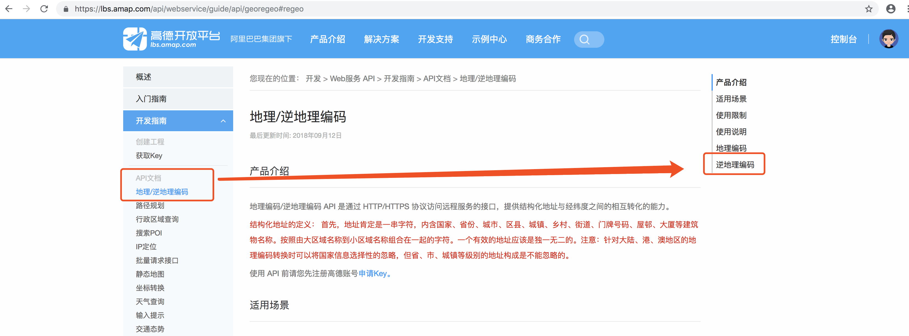

7）：服务示例：

https://restapi.amap.com/v3/geocode/regeo?output=xml&location=116.310003,39.991957&key=<用户的key>&radius=1000&extensions=all

（其中的location是由【经度,纬度】组成）

例如：

我的key是:6df5ca38579910c25a1816effec13e5f ， 那么我需要我需要拼接的https连接是：

https://restapi.amap.com/v3/geocode/regeo?output=xml&location=116.310003,39.991957&key=6df5ca38579910c25a1816effec13e5f&radius=1000&extensions=all

输入到浏览器中，可以返回如下XML信息：

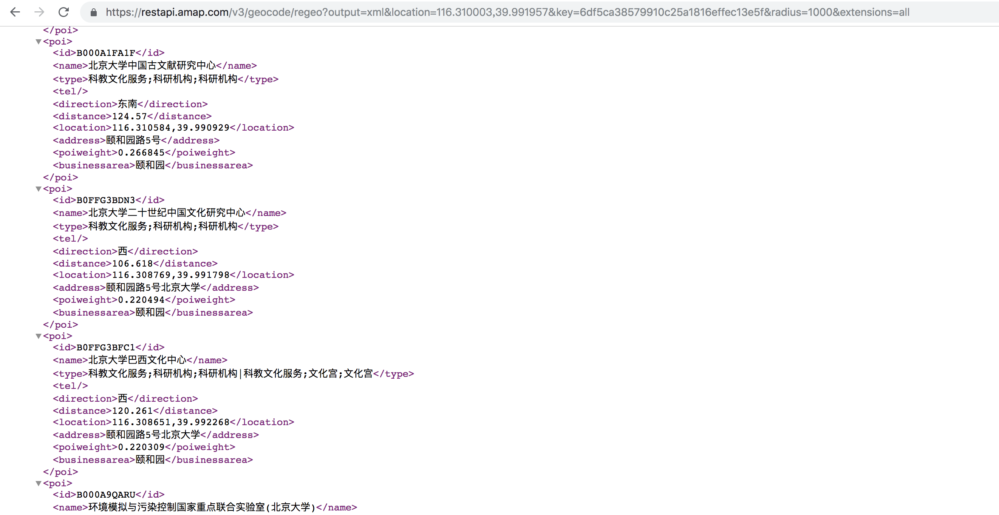

8)：基于代码，进行http请求，获取返回的报文

```scala
package com.dmp.tools.businessDB

import java.util

import com.dmp.tools.GlobalConfUtils
import org.apache.commons.httpclient.HttpClient
import org.apache.commons.httpclient.methods.GetMethod
import org.apache.commons.lang.StringUtils

/**
  * Created by angel；
  * 基于经纬度去高德地图获取商圈相关的json串信息，并调用Parse_json进行json解析
  */
object Inverse_geo {
  def la_lo2json(longitude_lat:String): String ={
    var temp:String = ""
    val client = new HttpClient
    val map = new util.HashMap[String , String]()
    map.put("key" , GlobalConfUtils.keys)
    map.put("location" , longitude_lat)//经纬度不要超过6位
    //https://restapi.amap.com/v3/geocode/regeo?output=xml&location=<经度,纬度>&key=<用户的key>&radius=1000&extensions=all
    val method = new GetMethod("https://restapi.amap.com/v3/geocode/regeo?key="+map.get("key")+"&location="+map.get("location"))
    val code = client.executeMethod(method)
    if(code == 200){
      val requestBody = method.getResponseBodyAsString
      val json = Parse_json.parseJson(requestBody)
      if(StringUtils.isNotBlank(json)){
        temp = json
      }
    }
    //释放连接
    method.releaseConnection()
    temp
  }
}
```

#### 2.14.5.2：解析json，返回商圈信息

```java
package com.dmp.tools.businessDB;

import com.alibaba.fastjson.JSON;
import com.alibaba.fastjson.JSONArray;
import com.alibaba.fastjson.JSONObject;
import com.dmp.bean.BusinessAreas;
import org.apache.commons.lang.StringUtils;

import java.util.List;

/**
 * Created by angel；
 */
public class Parse_json {
    public static String parseJson(String json){
        JSONObject jsonObject = JSON.parseObject(json);
        JSONObject regeocode = (JSONObject)jsonObject.get("regeocode");
        JSONObject addressComponent = (JSONObject)regeocode.get("addressComponent");
        JSONArray businessAreas = addressComponent.getJSONArray("businessAreas");
        final List<BusinessAreas> list = JSON.parseArray(businessAreas.toJSONString(), BusinessAreas.class);
        StringBuffer sb = new StringBuffer();
        for(int i=0;i<list.size()-1;i++){
            if(list.get(i).getName() != null || StringUtils.isNotBlank(list.get(i).getName())){
                sb.append(list.get(i).getName()).append(",");
            }
        }
        if(StringUtils.isNotBlank(sb.toString())){
            String data = sb.toString();
            return data.substring(0,data.length()-1);
        }else {
            return "blank";
        }
    }
}
```

### 2.14.6：执行APP，并查询结果

#### 2.14.6.1：查看kudu页面，是否生成kudu表

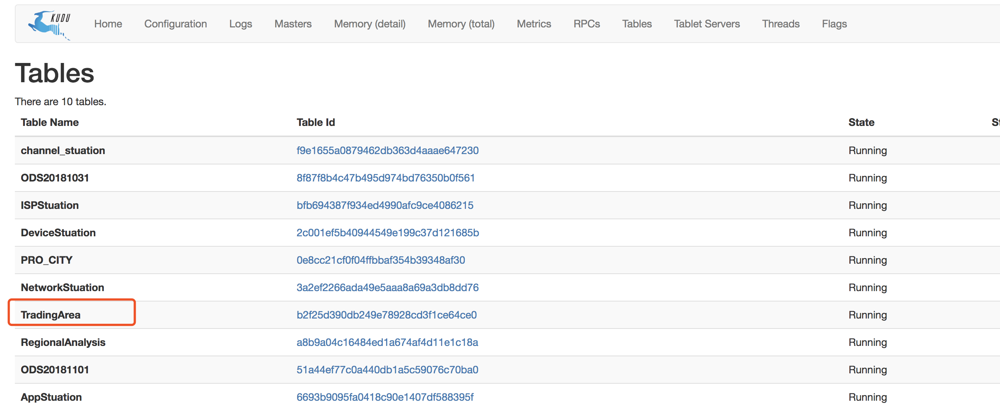

#### 2.14.6.2：将kudu数据作为impala外部表，并查询数据是否进入kudu

```sql
CREATE EXTERNAL TABLE `TradingArea` STORED AS KUDU
TBLPROPERTIES(
    'kudu.table_name' = 'TradingArea',
    'kudu.master_addresses' = 'hadoop01:7051,hadoop02:7051,hadoop03:7051')
```

```sql
[angel1:21000] > select * from tradingarea limit 10;
Query: select * from tradingarea limit 10
Query submitted at: 2018-11-01 11:36:28 (Coordinator: http://angel1:25000)
Query progress can be monitored at: http://angel1:25000/query_plan?query_id=d4ae4f22d6d104e:2dd68d1700000000
+-------------+-------------------+
| geohashcode | businessarea      |
+-------------+-------------------+
| wkezhrkd    | 中华中路:文昌北路 |
| w7w6nchr    | 海甸:博爱         |
| wtemkb9k    | 安庆路:淮河路     |
| wwgqdmt7    | 鼓楼:大胡同       |
| wk3n3qjn    | 新村:北京路       |
| wm7b0ttr    | 大溪沟:上清寺     |
| wq3v1gg5    | 西园:兰工坪       |
| ws7gr02t    | 湖滨北路          |
| wwe0w76b    | 东门:长途汽车站   |
| wwymr5sp    | 中山路:东北路     |
+-------------+-------------------+
Fetched 10 row(s) in 0.43s
```

## 2.15：数据标签化

前面的操作都算是对数据得到一种ETL操作，转化各种纬度指标，生成商圈库等；
那么，作为广告推荐，广告主在页面上筛选受众目标人群的时候，这些筛选元素其实就是数据标签化的另一种显示；


因此，我们需要将每一个人重要指标进行标签化，然后存储到kudu

### 2.15.1：业务流程

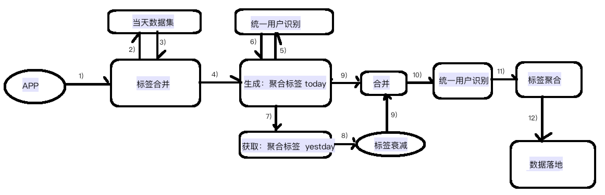

### 2.15.2：代码逻辑

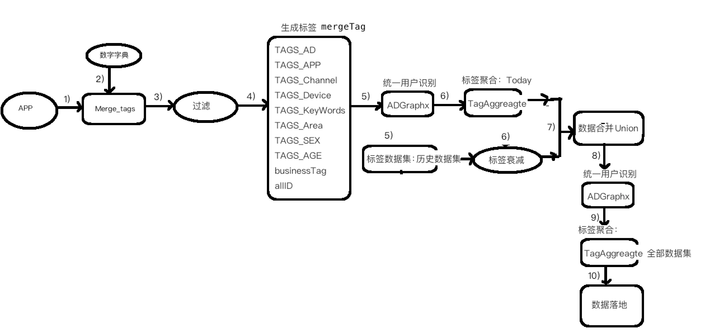


### 2.15.3：编写抽取标签的公共逻辑

实际生产中，标签数量是非常庞大的，为了让代码在阅读的时候非常的简化明了，应该一个object中抽取一个标签

因此，我们需要提前指定好一个标签特质，专门抽取标签

```scala
package com.dmp.tags

/**
  * Created by angel；
  */
trait Tags {
  /**
    * 打标签的方法
    */
  def makeTags(args: Any*): Map[String, Int]
}
```

### 2.15.4：APP类添加代码逻辑

```scala
//TODO 10):数据标签化-衰减化-merge
Merge_tags.MergeTags(sqlContext,sparkContext,kuduContext)
```

### 2.15.5：开发Merge_tags

Merge_tags主要提供如下功能：

1：提前过滤掉不符合规则的数据集

2：生成当天标签数据集

3：统一用户识别

4：标签聚合

5：获取历史标签数据集，调用TAGS_Attenuation.Merge

#### 2.15.5.1：提前过滤掉不符合规则的数据集

```scala
val odsTables = sqlContext.read.options(kuduOptions).kudu
//提前过滤掉不符合规则的数据，防止处理过多数据导致程序缓慢
val ods = odsTables.where(ContantsSQL.non_emptyUID)
```

其中的ContantsSQL.non_emptyUID的SQL片段：

```sql
lazy val non_emptyUID = """
                          |imei != "" or imeimd5 != "" or imeisha1 != "" or
                          |androidid != "" or androididmd5 != "" or androididsha1 != "" or
                          |mac != "" or macmd5 != "" or macsha1 != "" or
                          |idfa != "" or idfamd5 != "" or idfasha1 != "" or
                          |openudid != "" or openudidmd5 != "" or openudidsha1 != ""
                        """.stripMargin
```

#### 2.15.5.2：生成当天标签数据集

需要抽取的标签：

| 标签名称       |
| -------------- |
| 广告位类型     |
| APP名称        |
| 渠道           |
| 设备           |
| 关键词         |
| 地域标签       |
| 性别标签       |
| 年龄标签       |
| 用户所有识别码 |
| 商圈标签       |


##### 2.15.5.2.1：加载需要的字典brodcast，作为小表处理

| 字典名称               | 内容示例                                                     |
| ---------------------- | ------------------------------------------------------------ |
| APPID-APPNAME字典      | XRX100003##YY直播                                            |
| sensitiveDic敏感词词典 | 出售雷管 炸药                                                |
| devicedic设备相关字典  | 1##D00010001 2##D00010002 3##D00010003 4##D00010004 WIFI##D00020001 4G##D00020002 3G##D00020003 2G##D00020004 NETWORKOTHER##D00020005 移动##D00030001 联通##D00030002 电信##D00030003 OPERATOROTHER##D00030004 |

```scala
//加载：APPID-APPNAME字典app_id_name
val appID_name = sparkContext.textFile(app_id_name)
//加载：敏感词词典
val sensitDic = sparkContext.textFile(sensitiveDic)
//加载：设备相关字典
val deviceDic = sparkContext.textFile(devicedic)
//处理APPID-APPNAME字典
val id_names = appID_name.map{
  var map = Map[String, String]()
  line =>
    val id_name = line.split("##")
    map += (id_name(0) -> id_name(1))
    map
}.collect.flatten.toMap
//处理设备相关词典
val p_deviceDic = deviceDic.map{
  var map = Map[String, String]()
  line =>
    val device = line.split("##")
    map += (device(0) -> device(1))
    map
}.collect.flatten.toMap
//将字典广播
val appID_nameBroadcast: Broadcast[Map[String, String]] = sparkContext.broadcast(id_names)
val sensitiveBroadcast: Broadcast[Array[String]] = sparkContext.broadcast(sensitDic.collect())
val deviceBroadcast: Broadcast[Map[String, String]] = sparkContext.broadcast(p_deviceDic)
```

##### 2.15.5.2.2：抽取标签

###### 2.15.5.2.2.1：抽取标总代吗

```scala
val odsRDD:RDD[Row] = ods.rdd
val mergeTag: RDD[(String, (List[(String, Int)], List[(String, Double)]))] = odsRDD.map(

  line => {
    //1）广告位类型 打标签返回Map类型
    val adTag = TAGS_AD.makeTags(line)
    //2）APP名称 打标签返回Map类型
    val appTag = TAGS_APP.makeTags(line, appID_nameBroadcast.value)
    //3）渠道 打标签返回Map类型
    val channelTag = TAGS_Channel.makeTags(line)
    //4）设备：操作系统|联网方式|运营商 打标签返回Map类型
    val deviceTag = TAGS_Device.makeTags(line, deviceBroadcast.value)
    //5）关键词 打标签返回Map类型 TODO 没加敏感词
    val keyWordsTag = TAGS_KeyWords.makeTags(line)
    //6）地域标签 打标签返回Map类型
    val areaTag = TAGS_Area.makeTags(line)
    //7）获取性别标签
    val sexTag = TAGS_SEX.makeTags(line)
    //8）获取年龄标签
    val ageTag = TAGS_AGE.makeTags(line)
    //9)用户所有识别码
    val userList: util.LinkedList[String] = DataUtils.getTupleID(line)
    val userid = userList.getFirst.toString
    var allID = Map[String, Int]()
    for (index <- 0 until userList.size()) {
      allID += (userList.get(index) -> 0)
    }
    //10) 加入商圈标签
    val businessTag = Tags_Buissnes.makeTags(line)
    val tags = adTag ++ appTag ++ channelTag ++ deviceTag ++ keyWordsTag ++ areaTag ++ businessTag ++ sexTag ++ ageTag
    (userid, (allID.toList, tags.toList))
  }
)
```

###### 2.15.5.2.2.2：标签抽取实现

###### 1）：广告位类型 打标签返回Map类型

```scala
package com.dmp.tags.operator

import com.dmp.tags.Tags
import org.apache.spark.sql.Row

/**
  * Created by angel；
  */
object TAGS_AD extends Tags{
  /**
    * 打标签的方法
    */
  override def makeTags(args: Any*): Map[String, Double] = {
    var map = Map[String, Double]()
    if (args.length > 0) {
      //在scala中强制转换类型使用asInstanceOf
      val row = args(0).asInstanceOf[Row]
      val adspacetype = row.getAs[Long]("adspacetype").toInt
      if (adspacetype != null || adspacetype != "") {
        ////广告位类型（1：banner 2：插屏 3：全屏）
        adspacetype match {
          case x if x == 1 => map += ("LC" + x -> 1)//1
          case x if x == 2 => map += ("LC" + x -> 1)
          case x if x == 3 => map += ("LC" + x -> 1)
        }
      }
    }
    map
  }
}
```

###### 2）： APP名称 打标签返回Map类型

```scala
package com.dmp.tags.operator

import com.dmp.tags.Tags
import org.apache.commons.lang3.StringUtils
import org.apache.spark.sql.Row

/**
  * Created by angel；
  */
object TAGS_APP extends Tags{
  /**
    * 打标签的方法
    */
  override def makeTags(args: Any*): Map[String, Double] = {
    var map=Map[String,Double]()
    if(args.length > 1){
      //获取row
      val row = args(0).asInstanceOf[Row]
      //获取app映射字典的广播变量
      val appDict: Map[String, String] = args(1).asInstanceOf[Map[String,String]]
      val appid = row.getAs[String]("appid")
      val appname = row.getAs[String]("appname")

      val readAppname:Option[String] => String = {
        case Some(x) => x
        case None => appDict.getOrElse(appid , appname)
      }
      val appName = readAppname(Some(appname))
      if(StringUtils.isNotEmpty(appName) && !"".equals(appName))
        map += ("APP"+appName -> 1)//1
      }
    map
  }
}
```

###### 3）：渠道 打标签返回Map类型

```scala
package com.dmp.tags.operator

import com.dmp.tags.Tags
import org.apache.commons.lang3.StringUtils
import org.apache.spark.sql.Row

/**
  * Created by angel；
  */
object TAGS_Channel extends Tags{
  /**
    * 打标签的方法
    */
  override def makeTags(args: Any*): Map[String, Double] = {
    var map=Map[String,Double]()
    if(args.length > 0){
      val row = args(0).asInstanceOf[Row]
      val channelid: String = row.getAs[String]("channelid")
      if(StringUtils.isNotEmpty(channelid)){
        map += ("CN".concat(channelid) -> 1)//原来是1
      }
    }
    map
  }
}
```

###### 4）：设备：操作系统|联网方式|运营商 打标签返回Map类型

```scala
package com.dmp.tags.operator

import com.dmp.tags.Tags
import org.apache.spark.sql.Row

/**
  * Created by angel；
  */
object TAGS_Device extends Tags{
  /**
    * 打标签的方法
    */
  override def makeTags(args: Any*): Map[String, Double] = {
    var map=Map[String,Double]()
    if(args.length > 1){
      val row = args(0).asInstanceOf[Row]
      val deviceDict = args(1).asInstanceOf[Map[String,String]]
      val client = row.getAs[Long]("client").toInt
      val networkmannername = row.getAs[String]("networkmannername")
      val ispname = row.getAs[String]("ispname")

      /**
        * 操作系统标签
        * 1##D00010001
        * 2##D00010002
        * 3##D00010003
        * 4##D00010004
        *
        * （1：android 2：ios 3：wp 4：未知）
        * */
      val os = deviceDict.getOrElse(client.toString.toUpperCase , deviceDict.get("4").get)
      /**
        * 联网方式标签
        * WIFI##D00020001
        * 4G##D00020002
        * 3G##D00020003
        * 2G##D00020004
        * NETWORKOTHER##D00020005
        * */
      val network = deviceDict.getOrElse(networkmannername.toUpperCase , deviceDict.get("NETWORKOTHER").get)
      /**
        * 运营商的标签
        * 移动##D00030001
        * 联通##D00030002
        * 电信##D00030003
        * OPERATOROTHER##D00030004
        * */
      val isp = deviceDict.getOrElse(ispname.toUpperCase , deviceDict.get("OPERATOROTHER").get)
      map += (os -> 1)
      map += (network -> 1)
      map += (isp -> 1)
    }
    map
  }
}
```

###### 5）：关键词 打标签返回Map类型

```scala
package com.dmp.tags.operator

import com.dmp.tags.Tags
import org.apache.commons.lang.StringUtils
import org.apache.spark.sql.Row

/**
  * Created by angel；
  */
object TAGS_KeyWords extends Tags{
  /**
    * 打标签的方法
    */
  override def makeTags(args: Any*): Map[String, Double] = {
    var map=Map[String,Double]()
    if(args.length > 0){
      val row = args(0).asInstanceOf[Row]
      val keywords = row.getAs[String]("keywords")
      if(StringUtils.isNotEmpty(keywords)){
        val fields = keywords.split(",")
        fields.map( str =>{
          map += ("K".concat(str.replace(":",""))  -> 1)//1
        })
      }
    }
    map
  }
}
```

###### 6）：地域标签 打标签返回Map类型

```scala
package com.dmp.tags.operator

import com.dmp.tags.Tags
import org.apache.commons.lang.StringUtils
import org.apache.spark.sql.Row

/**
  * Created by angel；
  */
object TAGS_Area extends Tags{
  /**
    * 打标签的方法
    */
  override def makeTags(args: Any*): Map[String, Double] = {
    var map=Map[String,Double]()
    if(args.length > 0){
      val row = args(0).asInstanceOf[Row]
      val provincename = row.getAs[String]("provincename")
      val cityname = row.getAs[String]("cityname")
      //设备所在省份名称
      if(StringUtils.isNotEmpty(provincename)){
        map += ("PZ"+provincename -> 1)
      }
      //设备所在城市名称
      if(StringUtils.isNotEmpty(cityname)){
        map += ("CZ"+cityname -> 1)
      }
    }
    map

  }
}
```

###### 7）：获取性别标签

```scala
package com.dmp.tags.operator

import com.dmp.tags.Tags
import org.apache.spark.sql.Row

/**
  * Created by angel；
  */
object TAGS_SEX extends Tags{
  /**
    * 打标签的方法
    */
  override def makeTags(args: Any*): Map[String, Double] = {
    var map=Map[String,Double]()
    if(args.length > 0){
      //获取row
      val row = args(0).asInstanceOf[Row]
      val sex = row.getAs[String]("sex")
      val field = sex match {
        case "0" => "男"
        case _ => "女"
      }
      map += ("SEX"+field -> 0)
    }
    map
  }
}
```

###### 8）：获取年龄标签

```scala
package com.dmp.tags.operator

import com.dmp.tags.Tags
import org.apache.spark.sql.Row

/**
  * Created by angel；
  */
object TAGS_AGE extends Tags{
  /**
    * 打标签的方法
    */
  override def makeTags(args: Any*): Map[String, Double] = {
    var map=Map[String,Double]()
    if(args.length > 0){
      //获取row
      val row = args(0).asInstanceOf[Row]

      map += ("AGE"+row.getAs[String]("age") -> 0)
    }
    map
  }
}
```

###### 9）：用户所有识别码

```scala
val userList: util.LinkedList[String] = DataUtils.getTupleID(line)
val userid = userList.getFirst.toString
var allID = Map[String, Int]()
for (index <- 0 until userList.size()) {
  allID += (userList.get(index) -> 0)
}
```

```scala
  // 获取不为空的用户标识
  def getTupleID(row: Row):util.LinkedList[String] = {

    var list= new util.LinkedList[String]()
    //手机串号

    if (row.getAs[String]("imei").nonEmpty){
      list.add("IMEI:" + DataUtils.formatIMEID(row.getAs[String]("imei")))
    }

    if (row.getAs[String]("imeimd5").nonEmpty){
      list.add("IMEIMD5:" + row.getAs[String]("imeimd5").toUpperCase)
    }

    if (row.getAs[String]("imeisha1").nonEmpty){
      list.add("IMEISHA1:" + row.getAs[String]("imeisha1").toUpperCase)
    }

    //安卓手机设备唯一id

    if (row.getAs[String]("androidid").nonEmpty){
      list.add("ANDROIDID:" + row.getAs[String]("androidid").toUpperCase)
    }

    if (row.getAs[String]("androididmd5").nonEmpty){
      list.add("ANDROIDIDMD5:" + row.getAs[String]("androididmd5").toUpperCase)
    }

    if (row.getAs[String]("androididsha1").nonEmpty){
      list.add("ANDROIDIDSHA1:" + row.getAs[String]("androididsha1").toUpperCase)
    }

    //手机mac地址（通用）

    if (row.getAs[String]("mac").nonEmpty){
      list.add("MAC:" + row.getAs[String]("mac").toUpperCase)
    }
    if (row.getAs[String]("macmd5").nonEmpty){
      list.add("MACMD5:" + row.getAs[String]("macmd5").toUpperCase)
    }

    if (row.getAs[String]("macsha1").nonEmpty){
      list.add("MACSHA1:" + row.getAs[String]("macsha1").toUpperCase)
    }
    //广告标识符 --- IDFA存储在用户IOS系统上，同一设备上的应用获取到的IDFA是相同的

    if (row.getAs[String]("idfa").nonEmpty){
      list.add("IDFA:" + row.getAs[String]("idfa").toUpperCase)
    }

    if (row.getAs[String]("idfamd5").nonEmpty){
      list.add("IDFAMD5:" + row.getAs[String]("idfamd5").toUpperCase)
    }

    if (row.getAs[String]("idfasha1").nonEmpty){
      list.add("IDFASHA1:" + row.getAs[String]("idfasha1").toUpperCase)
    }
    //手机设备的唯一识别码（通用）

    if (row.getAs[String]("openudid").nonEmpty){
      list.add("OPENUDID:" + row.getAs[String]("openudid").toUpperCase)
    }

    if (row.getAs[String]("openudidmd5").nonEmpty){
      list.add("OPENDUIDMD5:" + row.getAs[String]("openudidmd5").toUpperCase)
    }

    if (row.getAs[String]("openudidsha1").nonEmpty){
      list.add("OPENUDIDSHA1:" + row.getAs[String]("openudidsha1").toUpperCase)
    }
    list

  }
```

###### 10）：加入商圈标签

```scala
package com.dmp.tags.operator

import java.sql.{Connection, DriverManager, PreparedStatement, ResultSet}

import ch.hsr.geohash.GeoHash
import com.dmp.tags.Tags
import com.dmp.tools.GlobalConfUtils
import org.apache.commons.lang.StringUtils
import org.apache.spark.sql.Row

/**
  * Created by angel；
  */
object Tags_Buissnes extends Tags{
  /**
    * 打标签的方法
    */
  val KUDU_MASTER = GlobalConfUtils.KUDU_MASTER
  val TABLE_NAME = GlobalConfUtils.TradingArea
  val JDBC_DRIVER = GlobalConfUtils.JDBC_DRIVER
  val CONNECTION_URL = GlobalConfUtils.CONNECTION_URL
  var con:Connection  = null;
  var rs:ResultSet = null;
  var ps:PreparedStatement = null;

  //连接
  def getConn():Connection= {
    try {
      Class.forName(JDBC_DRIVER);
      con = DriverManager.getConnection(CONNECTION_URL);
    }catch{
      case e => e.printStackTrace
    }
    return con;
  }
  //查询
  def QueryRows(sql:String):ResultSet = {
    val conn = getConn
    val psa = conn.prepareStatement(sql);
    rs = psa.executeQuery();
    return rs;
  }

  override def makeTags(args: Any*): Map[String, Double] = {
    var map = Map[String, Double]()
    if (args.length > 0) {
      val row = args(0).asInstanceOf[Row]
      val long = row.getAs[String]("long").toDouble
      val lat = row.getAs[String]("lat").toDouble
      //select distinct long , lat from ods where long > 73 AND long < 136 AND lat > 3 AND lat < 54
      if (long > 73 && long < 136 && lat > 3 && lat < 54) {
        //根据经纬度合成geoHash，然后取kudu中查询商圈
        val geoHashCode: String = GeoHash.withCharacterPrecision(lat, long, 8).toBase32
        /*
        * 此处不建议使用sparkSQL对接kudu去查询，因为要返回Map结构，所以查询出来的数据需要提前出发action，比较耗费时间
        * 所以这里我们使用java-impala-kudu连接操作
        * */
        if(StringUtils.isNotBlank(geoHashCode)){

          val sql = "select * from TradingArea where geoHashCode='" + geoHashCode +"'"
          Class.forName(JDBC_DRIVER);
          val conn = DriverManager.getConnection(CONNECTION_URL)

          try {
            // Configure to be Read Only
            val statement = conn.createStatement(ResultSet.TYPE_FORWARD_ONLY, ResultSet.CONCUR_READ_ONLY)
            // Execute Query
            val rs = statement.executeQuery(sql)
            // Iterate Over ResultSet
            while (rs.next) {
              val businessArea = rs.getString("businessArea")
              map += ("BA" + businessArea -> 1)//0
            }
          } catch{
            case e:Exception =>e.printStackTrace
          }
          finally {
            conn.close
          }
        }
      }
    }
    map
  }
}

```

#### 2.15.5.3：为什么要进行：spark Graphx统一用户识别

到目前为止已经生成当天用户的标签数据集，如果此时直接进行标签聚合；

那么可能会导致：

对同一受众目标，在标签库中可能会存在多条标签记录！这样会导致后续推荐受众目标出现不准确现象；

举例说明：不进行统一用户识别可能造成的问题：

| 设备型号 | 用户邮箱   | 登录时间 |
| -------- | ---------- | -------- |
| iphone6S | zs@163.com | 上午8点  |
| 华为     | 123@qq.com | 下午3点  |
| iphoneX  | zs@163.com | 晚上10点 |

这样一个用户在一天内产生了3条日志，但是这3条日志的设备型号不一致，所以会被认为这是3个不同用户；

这就导致最后的标签结果有偏差，那么广告主在筛选受众目标的时候会漏掉该用户（比如：广告主要推广广告，但是要求设备型号必须是安卓手机，那么用户在使用苹果手机的时候就接收不到广告，显然是不正确的，并没有达到精准投放）

因此，为了解决上述的问题，我们引入图计算，进行统一用户识别

#### 2.15.5.4：spark Graphx学习

##### 2.15.5.4.1：**图计算的概念简介**

图是用于表示对象之间模型关系的数学结构。图由顶点和连接顶点的边构成。顶点是对象，而边是对象之间的关系。


有向图是顶点之间的边是有方向的。有向图的例子如 Twitter 上的关注者。用户 Bob 关注了用户 Carol ，而 Carol 并没有关注 Bob。

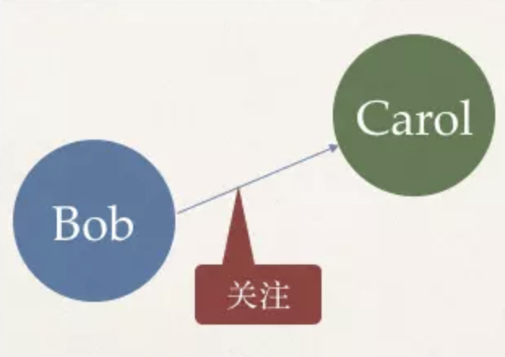


以上的简单介绍，就是图，通过点(对象)和边(路径)，构成了不同对象之间的关系

##### 2.15.5.4.2：图计算应用场景

1）：最短路径：

最短路径在社交网络里面，有一个六度空间的理论，表示你和任何一个陌生人之间所间隔的人不会超过五个,也就是说,最多通过五个中间人你就能够认识任何一个陌生人。这也是图算法的一种，也就是说，任何两个人之间的最短路径都是小于等于6。

2）：社群发现：

社群发现用来发现社交网络中三角形的个数（圈子），可以分析出哪些圈子更稳固，关系更紧密，用来衡量社群耦合关系的紧密程度。一个人的社交圈子里面，三角形个数越多，说明他的社交关系越稳固、紧密。像Facebook、Twitter等社交网站，常用到的的社交分析算法就是社群发现。

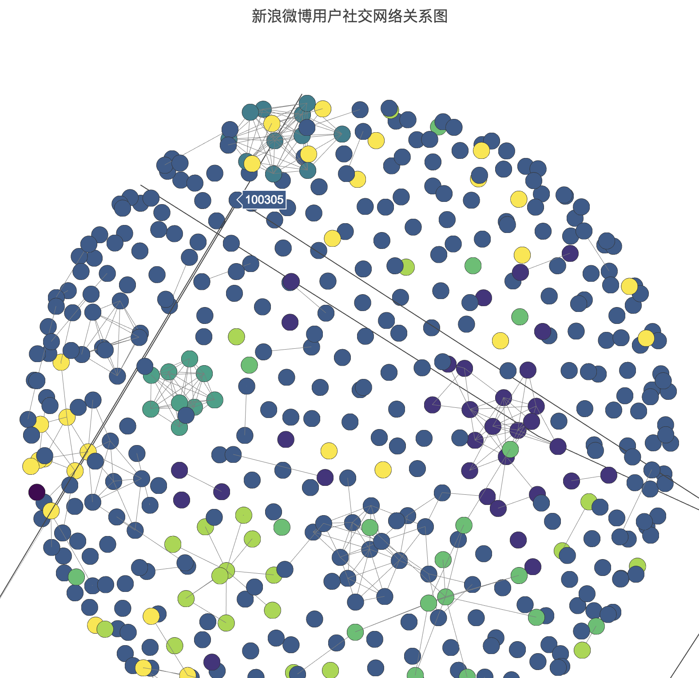


参考连接：https://plot.ly/~NaomiZhou/3.embed

3）：推荐算法（ALS）

推荐算法（ALS）ALS是一个矩阵分解算法，比如购物网站要给用户进行商品推荐，就需要知道哪些用户对哪些商品感兴趣，这时，可以通过ALS构建一个矩阵图，在这个矩阵图里，假如被用户购买过的商品是1，没有被用户购买过的是0，这时我们需要计算的就是有哪些0有可能会变成1 

##### 2.15.5.4.3：spark Graphx例子

GraphX 通过弹性分布式属性图扩展了 Sprak RDD。

这种属性图是一种有向多重图，它有多条平行的边。每个边和顶点都有用户定义的属性。平行的边允许相同顶点有多种关系。

通常，在图计算中，基本的数据结构表达就是：G = （V，E，D） V = vertex （顶点或者节点） E = edge （边） D = data （权重）。 

场景：

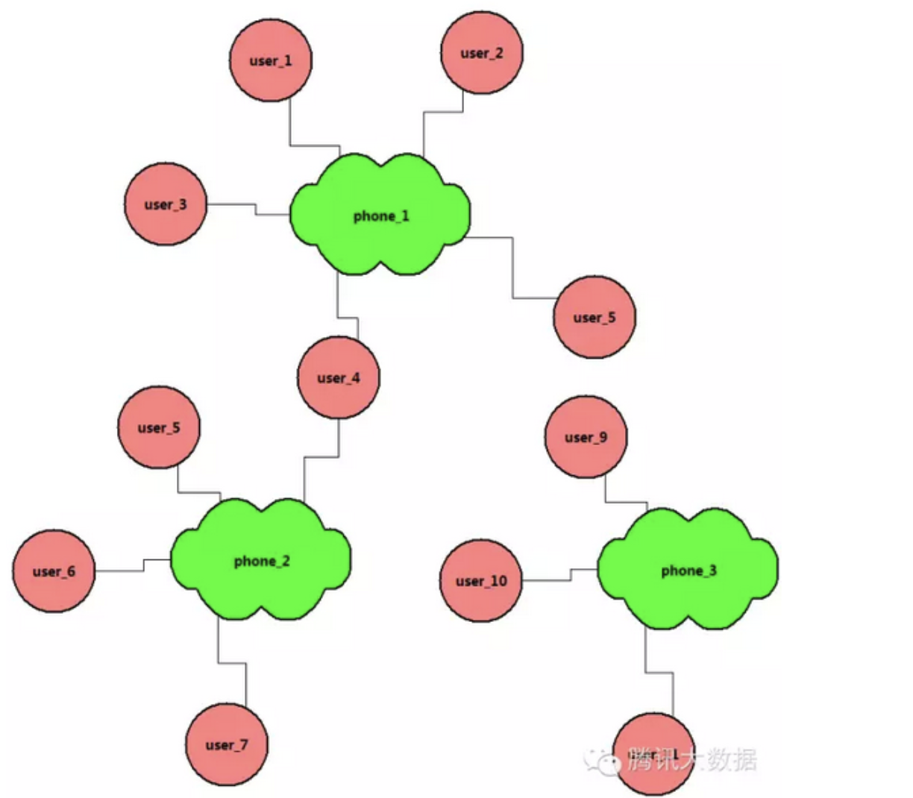


| ID   | 姓名   | 年龄 |
| ---- | ------ | ---- |
| 1    | 张三   | 18   |
| 2    | 李四   | 19   |
| 3    | 王五   | 20   |
| 4    | 赵六   | 21   |
| 5    | 韩梅梅 | 22   |
| 6    | 李雷   | 23   |
| 7    | 小明   | 24   |
| 9    | tom    | 25   |
| 10   | jerry  | 26   |
| 11   | ession | 27   |

| UserID | 手机 |
| ------ | ---- |
| 1      | 136  |
| 2      | 136  |
| 3      | 136  |
| 4      | 136  |
| 5      | 136  |
| 4      | 158  |
| 5      | 158  |
| 6      | 158  |
| 7      | 158  |
| 9      | 177  |
| 10     | 177  |
| 11     | 177  |


```scala
object findFriend {
  def main(args: Array[String]): Unit = {
    @transient
    val sparkConf = new SparkConf().setAppName("APP")
      .setMaster("local[6]")
      .set("spark.worker.timeout" , GlobalConfigUtils.sparkWorkTimeout)
      .set("spark.cores.max" , GlobalConfigUtils.sparkMaxCores)
      .set("spark.rpc.askTimeout" , GlobalConfigUtils.sparkRpcTimeout)
      .set("spark.task.macFailures" , GlobalConfigUtils.sparkTaskMaxFailures)
      .set("spark.speculation" , GlobalConfigUtils.sparkSpeculation)
      .set("spark.driver.allowMutilpleContext" , GlobalConfigUtils.sparkAllowMutilpleContext)
      .set("spark.serializer" , GlobalConfigUtils.sparkSerializer)
      .set("spark.buffer.pageSize" , GlobalConfigUtils.sparkBuuferSize)
    val sparkContext = SparkContext.getOrCreate(sparkConf)
    // 图计算 --Graphx(v , e)
    //1:构建点集合
    //(userid , (name , age))
    val vertexRDD: RDD[(VertexId, (String, Int))] = sparkContext.parallelize(Seq(
      (1, ("张三", 18)),
      (2, ("李四", 19)),
      (3, ("王五", 20)),
      (4, ("赵六", 21)),
      (5, ("韩梅梅", 22)),
      (6, ("李雷", 23)),
      (7, ("小明", 24)),
      (9, ("tom", 25)),
      (10, ("jerry", 26)),
      (11, ("ession", 27))
    ))
    //2:构建边
    val edge: RDD[Edge[Int]] = sparkContext.parallelize(Seq(
      Edge(1, 136, 0), Edge(2, 136, 0), Edge(3, 136, 0), Edge(4, 136, 0), Edge(5, 136, 0),
      Edge(4, 158, 0), Edge(5, 158, 0), Edge(6, 158, 0), Edge(7, 158, 0),
      Edge(9, 177, 0), Edge(10, 177, 0), Edge(11, 177, 0)
    ))
    val graph: Graph[(String, Int), Int] = Graph(vertexRDD , edge)
    //点的关系
    graph.vertices.foreach(println)
    //边的关系
    graph.edges.foreach(println)
    //点和边的数量
    graph.numEdges
    graph.numVertices
    //TODO 构建连通图
    //(userid , aggid)
    val vertices: VertexRDD[VertexId] = graph.connectedComponents().vertices
//    vertices.foreach(println)
        //1:[2：李四、王五、赵六...] 9：[tom\jerry\\\]
//    val mapdata: RDD[(VertexId, List[VertexId])] = vertices.map(line => (line._2 , List(line._1)))
//    val result: RDD[(VertexId, List[VertexId])] = mapdata.reduceByKey(_ ++ _)
//    result.foreach(println)

    //显示用户的信息
    //(userid , aggid) join (userid , (name , age)) =====> (userid , (aggid , (name , age)))
    val join: RDD[(VertexId, (VertexId, (String, Int)))] = vertices.join(vertexRDD)
    val result = join.map{
      case (userid , (aggid , (name , age))) =>
        (aggid , List((name , age)))
    }
    result.reduceByKey(_ ++ _).foreach(println)
  }
}

```


#### 2.15.5.5：编写：对当天生成的标签进行统一用户识别

##### 2.15.5.5.1：在Merge_tags中添加图计算调用代码

```scala
 //TODO 统一用户识别
val graph: RDD[(VertexId, (List[(String, Int)], List[(String, Double)]))] = ADGraphx.graph(mergeTag, odsRDD)
```

##### 2.15.5.5.2：编写ADGraphx代码

```scala
package com.dmp.Graphx

import java.util

import com.dmp.tools.DataUtils
import org.apache.spark.graphx.{Edge, Graph, VertexId, VertexRDD}
import org.apache.spark.rdd.RDD
import org.apache.spark.sql.Row

import scala.collection.mutable.ListBuffer

/**
  * Created by angel；
  */
object ADGraphx {

  def graph(rdd : RDD[(String, (List[(String, Int)], List[(String, Double)]))] , odsRDD:RDD[Row]):RDD[(VertexId, (List[(String, Int)], List[(String, Double)]))] = {
    //构建点集合
    val vertices: RDD[(VertexId, (List[(String, Int)], List[(String, Double)]))] = rdd.mapPartitions {
      var listBuffer = new ListBuffer[(Long, (List[(String, Int)], List[(String, Double)]))]()
      line =>
        line.foreach {
          x =>
            //userID和tags
            listBuffer.append((x._1.hashCode.toLong, x._2))
        }
        listBuffer.iterator
    }
    //构建边集合
    val edges: RDD[Edge[Int]] = odsRDD.map {
      line =>
        val userList: util.LinkedList[String] = DataUtils.getTupleID(line)
        val userid = userList.getFirst.toString.hashCode.toLong
        var otherID = new ListBuffer[String]()
        for (index <- 0 until userList.size()) {
          otherID.append(userList.get(index))
        }
        Edge(userid, otherID.toString().hashCode.toLong, 0)
    }
    //    println(vertices.count())

    //构建图
    val graph: Graph[(List[(String, Int)], List[(String, Double)]), Int] = Graph(vertices , edges)
    //让图中的分支连接起来
    val connectVertices: VertexRDD[VertexId] = graph.connectedComponents().vertices
    //将连起来的分支与与点集合做关于userid的join
    val join: RDD[(VertexId, (VertexId, (List[(String, Int)], List[(String, Double)])))] = connectVertices.join(vertices)
    //整理出需要的数据集(最小点ID ， (otherID , tags))
    val data: RDD[(VertexId, (List[(String, Int)], List[(String, Double)]))] = join.map {
      case (userID, (minID, (otherID, tags))) =>
        (minID, (otherID, tags))
    }
    data
  }
}
```

09：标签聚合.md

```md
#### 2.15.5.6：标签聚合

虽然目前为止，标签抽取出来了，也进行了统一用户识别，但是还可能出现另一种问题，例如：

一个用户产生了两条日志：(简写版本)

| 用户识别码                     | 标签                           |
| ------------------------------ | ------------------------------ |
| (MAC:52:54:00:37:94:2D,0)      | (K大众汽车,1.92)(K二手车,1.92) |
| (ANDROIDID:APZWRJWTAHUTJTXD,0) | (K德国汽车,1.92)(K二手车,1.92) |

经过图计算进行统一用户识别之后:

| 用户识别码                                              | 标签                                                         |
| ------------------------------------------------------- | ------------------------------------------------------------ |
| (MAC:52:54:00:37:94:2D,0)(ANDROIDID:APZWRJWTAHUTJTXD,0) | (K大众汽车,1.92)**<u>(K二手车,1.92)(K二手车,1.92)</u>**(K德国汽车,1.92) |

从上面表格中，我们可以看出，(K二手车,1.92)这个标签重复了，但是权重值还是1.92，这样后续广告主根据标签选择受众目的时候，不一定是权重值最高的，会导致广告的推荐并不是精准的

因此，需要对统一用户识别出来的标签进一步聚合----标签聚合

##### 2.15.5.6.1：在Merge_tags中添加聚合的调用代码

```scala
//TODO 将同一个顶点的iD的 用户id和标签的聚合操作
val merge_group: RDD[(VertexId, (List[(String, Int)], List[(String, Double)]))] = TagAggreagte.aggregate(graph)
```

##### 2.15.5.6.2：编写聚合代码TagAggreagte

##### 

```scala
package com.dmp.aggregateTag

import org.apache.spark.graphx.VertexId
import org.apache.spark.rdd.RDD

/**
  * Created by angel；
  */
object TagAggreagte {
  def aggregate(rdd : RDD[(VertexId, (List[(String, Int)], List[(String, Double)]))]): RDD[(VertexId, (List[(String, Int)], List[(String, Double)]))] ={
    //TODO 将同一个顶点的iD的 用户id和标签的聚合操作
    val merge_group: RDD[(VertexId, (List[(String, Int)], List[(String, Double)]))] = rdd.reduceByKey {
      case (before, after) => {
        val uid: List[(String, Int)] = before._1 ++ after._1
        val tagList: List[(String, Double)] = before._2 ++ after._2
        //将同一个用户下的各种标签做加法计算
        val groupTag: Map[String, List[(String, Double)]] = tagList.groupBy(line => line._1)
        val tags: List[(String, Double)] = groupTag.mapValues {
          line =>
            line.foldLeft(0.0)((k, v) => (k + v._2))
        }.toList
        //对uid重复的进行去重
        val distinctUID: List[(String, Int)] = uid.distinct
        (distinctUID, tags)
      }
    }
    merge_group
  }
}
```

10：标签衰减.md

```md
#### 2.15.5.7：标签衰减

目前为止，标签的聚合操作已完毕，数据按照流程来说，可以直接落到地了；但是如果这样做，可能会造成另外一个问题的发生：

```
十年前你在上网搜索高考内容的书籍，那么2018年的今天，你还会对这些感兴趣么？

90年代，你上网搜索BB机 ， 如今你还会对这些感兴趣么？
```

因此，我们需要对历史标签数据的权重做衰减工作，如果标签长时间不再出现，那么按照衰减系数的作用，应该会变的很小，从而不会影响其他的正常标签;

##### 2.15.5.7.1：标签衰减公式

```
衰减因子计算：牛顿冷却定律数学模型：F(t)=初始温度×exp(-冷却系数×间隔的时间)
```

因此，在本项目中，标签的的的最终权重为:

```
标签最终权重=衰减因子×行为权重 + 当天权重
```

##### 2.15.5.7.2：编写标签衰减代码

##### 

```scala
//TODO 昨日数据集，并按照衰减规则进行衰减（id ， （全部id ， 标签））
val last: RDD[(String, (List[(String, Int)], List[(String, Double)]))] = Attenu.attenution(lastTableRdd , coefficient)
```

```scala
package com.dmp.attenu

import org.apache.spark.rdd.RDD
import org.apache.spark.sql.Row

/**
  * Created by angel；
  */
object Attenu {

  def attenution(lastTableRdd:RDD[Row] , coefficient:Double): RDD[(String, (List[(String,Int)], List[(String, Double)]))] ={
    //TODO 昨日数据集，并按照衰减规则进行衰减
    val last:  RDD[(String, (List[(String,Int)], List[(String, Double)]))] =  lastTableRdd.map {
      row =>
        //"userids" , "tags"
        //(ANDROIDID:DXZDSFURDRRILTPO,0)(MAC:52:54:00:FB:E1:65,0)
        val last_userids = row.getAs[String]("userids")
        // (D00010002,1)(K华为手机,1)(KiPhone,1)(D00020002,1)(APPKK唱响,1)(BA什刹海,景山,1)(D00030003,1)(K华为Mate,1)(K三星,1)(PZ广西百色市,1)(CN123567,1)(LC2,1)(K智能手机,1)(CZ广西百色市,1)
        val last_tags = row.getAs[String]("tags")

        //标签最终权重=衰减因子×行为权重 + 当天权重
        //衰减因子计算：牛顿冷却定律数学模型：F(t)=初始温度×exp(-冷却系数×间隔的时间)
        val substring2 = last_tags.substring(1, last_tags.length - 1)
        val arr_tags: Array[String] = substring2.split("\\)\\(")
        //暂定冷却系数为0.92 ， 并且拿到同一条数据下的标签
        var map = Map[String, Double]()
        for (arr <- arr_tags) {
          val weight = arr.split(",")(1).toDouble * coefficient
          val tagName = arr.split(",")(0)
          map += (tagName -> weight)
        }
        //解析出uid---(MAC:52:54:00:AD:24:F7,0)(OPENUDID:MSSVRNMMZIZKECGBZBCAIWDOCUYNYTOXHSNBSUUN,0)
        val userids = last_userids.substring(1, last_userids.length - 1)//MAC:52:54:00:AD:24:F7,0)(OPENUDID:MSSVRNMMZIZKECGBZBCAIWDOCUYNYTOXHSNBSUUN,0
      val useridarray = userids.split("\\)\\(")
        val id = useridarray(0).split(",")(0)
        var uidMap = Map[String, Int]()
        for(arr <- useridarray){
          val id_num = arr.split(",")
          val aid = id_num(0).toString
          val num = id_num(1).toInt
          uidMap += (aid -> num)
        }
        (id, (uidMap.toList, map.toList))
    }
    last
  }


}
```

11：标签回溯.md

```md
#### 2.15.5.8：标签回溯

所谓的标签回溯就是：拿到衰减后的历史标签数据与当天生成的标签数据合并，然后进行统一用户识别以及标签聚合（之所以要在进行一遍同一用户识别和标签聚合，是因为很有可能当天标签数据与历史标签数据存在多行，并且标签重合的问题），最终数据落地

代码:

```scala
//TODO 昨日数据集，并按照衰减规则进行衰减（id ， （全部id ， 标签））
val last: RDD[(String, (List[(String, Int)], List[(String, Double)]))] = Attenu.attenution(lastTableRdd , coefficient)
//今天的数据集，做成与历史数据集格式一致（id ， （全部id ， 标签））
val today: RDD[(String, (List[(String, Int)], List[(String, Double)]))] = operatorTags(todayTableRdd)
//TODO 合并数据
val data: RDD[(String, (List[(String,Int)], List[(String, Double)]))] = today.union(last)
//TODO 统一用户识别
val graph: RDD[(VertexId, (List[(String,Int)], List[(String, Double)]))] = ADGraphx.graph(data , ods)
//TODO 将同一个顶点的iD的 用户id和标签的聚合操作
val merge_group: RDD[(VertexId, (List[(String , Int)], List[(String, Double)]))] = TagAggreagte.aggregate(graph)

val result = merge_group.map {
  line =>
    val userids = line._2._1.mkString
    val tags = line._2._2.mkString
    (userids , tags)
}

//数据落地
import sqlContext.implicits._
val sinkdata:DataFrame = result.toDF("userids" , "tags")
val schema = ContantsSchemal.userTag
val partitionID = "userids"
DBUtils.process(kuduContext , sinkdata , TO_TABLENAME , KUDU_MASTER , schema , partitionID)
```

#### 2.15.5.9：打标签、统一用户识别、标签聚合、标签衰减、标签回溯：全部代码

##### 2.15.5.9.1：APP添加代码

```scala
//TODO 10):数据标签化-衰减化-标签回溯
Merge_tags.process(sqlContext,sparkContext,kuduContext)
```

##### 2.15.5.9.2：Merge_tags代码

```scala
package com.dmp.tags

import java.util
import java.util.Map.Entry

import com.dmp.Graphx.ADGraphx
import com.dmp.`trait`.ProcessReport
import com.dmp.aggregateTag.TagAggreagte
import com.dmp.tags.operator._
import com.dmp.tools._
import org.apache.kudu.spark.kudu.KuduContext
import org.apache.spark.SparkContext
import org.apache.spark.broadcast.Broadcast
import org.apache.spark.sql.{DataFrame, Row, SQLContext, SaveMode}
import org.apache.kudu.spark.kudu._
import org.apache.spark.graphx.{Edge, Graph, VertexId, VertexRDD}
import org.apache.spark.rdd.RDD

/**
  * 处理今天数据，进行标签合并，并使用图计算进行统一用户合并
  * 然后读取历史数据进行标签衰减操作，然后与当天数据进行合并操作
  */
object Merge_tags extends ProcessReport{
  val KUDU_MASTER = GlobalConfUtils.KUDU_MASTER
  val TABLE_NAME = GlobalConfUtils.DOP + DataUtils.NowDate()
  //【醒目】用来做测试
//  val TABLE_NAME = GlobalConfUtils.DOP + DataUtils.getYesterday()

  val coefficient = GlobalConfUtils.coefficient.toDouble
  val YE_TABLENAME = GlobalConfUtils.DTP + DataUtils.getYesterday()

  //获取数据
  val kuduOptions: Map[String, String] = Map(
    "kudu.table"  -> TABLE_NAME,
    "kudu.master" -> KUDU_MASTER
  )
  val ye_kuduOptions: Map[String, String] = Map(
    "kudu.table"  -> YE_TABLENAME,
    "kudu.master" -> KUDU_MASTER
  )
  val app_id_name = GlobalConfUtils.app_id_name
  val sensitiveDic = GlobalConfUtils.sensitiveDic
  val devicedic = GlobalConfUtils.devicedic


  override def process(sqlContext: SQLContext, sparkContext: SparkContext, kuduContext: KuduContext): Unit = {
    //加载：APPID-APPNAME字典app_id_name
    val appID_name = sparkContext.textFile(app_id_name)
    //加载：敏感词词典
    val sensitDic = sparkContext.textFile(sensitiveDic)
    //加载：设备相关字典
    val deviceDic = sparkContext.textFile(devicedic)
    //处理APPID-APPNAME字典
    val id_names = appID_name.map{
      var map = Map[String, String]()
      line =>
        val id_name = line.split("##")
        map += (id_name(0) -> id_name(1))
        map
    }.collect.flatten.toMap
    //处理设备相关词典
    val p_deviceDic = deviceDic.map{
      var map = Map[String, String]()
      line =>
        val device = line.split("##")
        map += (device(0) -> device(1))
        map
    }.collect.flatten.toMap
    //将字典广播
    val appID_nameBroadcast: Broadcast[Map[String, String]] = sparkContext.broadcast(id_names)
    val sensitiveBroadcast: Broadcast[Array[String]] = sparkContext.broadcast(sensitDic.collect())
    val deviceBroadcast: Broadcast[Map[String, String]] = sparkContext.broadcast(p_deviceDic)

    val odsTables = sqlContext.read.options(kuduOptions).kudu
    //提前过滤掉不符合规则的数据，防止处理过多数据导致程序缓慢
    val ods = odsTables.where(ContantsSQL.non_emptyUID)
    val odsRDD:RDD[Row] = ods.rdd
    val mergeTag: RDD[(String, (List[(String, Int)], List[(String, Double)]))] = odsRDD.map(

      line => {
        //1）广告位类型 打标签返回Map类型
        val adTag = TAGS_AD.makeTags(line)
        //2）APP名称 打标签返回Map类型
        val appTag = TAGS_APP.makeTags(line, appID_nameBroadcast.value)
        //3）渠道 打标签返回Map类型
        val channelTag = TAGS_Channel.makeTags(line)
        //4）设备：操作系统|联网方式|运营商 打标签返回Map类型
        val deviceTag = TAGS_Device.makeTags(line, deviceBroadcast.value)
        //5）关键词 打标签返回Map类型 TODO 没加敏感词
        val keyWordsTag = TAGS_KeyWords.makeTags(line)
        //6）地域标签 打标签返回Map类型
        val areaTag = TAGS_Area.makeTags(line)
        //7）获取性别标签
        val sexTag = TAGS_SEX.makeTags(line)
        //8）获取年龄标签
        val ageTag = TAGS_AGE.makeTags(line)
        //9)用户所有识别码
        val userList: util.LinkedList[String] = DataUtils.getTupleID(line)
        val userid = userList.getFirst.toString
        var allID = Map[String, Int]()
        for (index <- 0 until userList.size()) {
          allID += (userList.get(index) -> 0)
        }
        //10) 加入商圈标签
        val businessTag = Tags_Buissnes.makeTags(line)
        val tags = adTag ++ appTag ++ channelTag ++ deviceTag ++ keyWordsTag ++ areaTag ++ businessTag ++ sexTag ++ ageTag
        (userid, (allID.toList, tags.toList))
      }
    )

    //TODO 统一用户识别
    val graph: RDD[(VertexId, (List[(String, Int)], List[(String, Double)]))] = ADGraphx.graph(mergeTag, odsRDD)

    //TODO 将同一个顶点的iD的 用户id和标签的聚合操作
    val merge_group: RDD[(VertexId, (List[(String, Int)], List[(String, Double)]))] = TagAggreagte.aggregate(graph)


    val result: RDD[(String, String)] = merge_group.map {
      line =>
        (line._2._1.mkString, line._2._2.mkString)
    }
    //TODO 获取历史生成的标签数据集
    val ye = sqlContext.read.options(ye_kuduOptions).kudu
    val lastTableRdd:RDD[Row] = ye.rdd
    import sqlContext.implicits._
    val todayTable = result.toDF("userids" , "tags")
    val todayTableRDD:RDD[Row] = todayTable.rdd
    //TODO 历史数据集（进行衰减） ， 今天数据集 进行数据合并
    TAGS_Attenuation.Merge(lastTableRdd , todayTableRDD , odsRDD , sqlContext , kuduContext)


    //    //先将生成一份昨日的数据集，方便下面的不同天的标签合并
    //    import sqlContext.implicits._
    //    val sinkdata = result.toDF("userids" , "tags")
    //    val schema = ContantsSchemal.userTag
    //    val partitionID = "userids"
    //    DBUtils.process(kuduContext , sinkdata , GlobalConfUtils.DTP + DataUtils.getYesterday() , KUDU_MASTER , schema , partitionID)
  }
}
```

##### 2.15.5.9.3：ADGraphx代码

```scala
package com.dmp.Graphx

import java.util

import com.dmp.tools.DataUtils
import org.apache.spark.graphx.{Edge, Graph, VertexId, VertexRDD}
import org.apache.spark.rdd.RDD
import org.apache.spark.sql.Row

import scala.collection.mutable.ListBuffer

/**
  * Created by angel；
  */
object ADGraphx {

  def graph(rdd : RDD[(String, (List[(String, Int)], List[(String, Double)]))] , odsRDD:RDD[Row]):RDD[(VertexId, (List[(String, Int)], List[(String, Double)]))] = {
    //构建点集合
    val vertices: RDD[(VertexId, (List[(String, Int)], List[(String, Double)]))] = rdd.mapPartitions {
      var listBuffer = new ListBuffer[(Long, (List[(String, Int)], List[(String, Double)]))]()
      line =>
        line.foreach {
          x =>
            //userID和tags
            listBuffer.append((x._1.hashCode.toLong, x._2))
        }
        listBuffer.iterator
    }
    //构建边集合
    val edges: RDD[Edge[Int]] = odsRDD.map {
      line =>
        val userList: util.LinkedList[String] = DataUtils.getTupleID(line)
        val userid = userList.getFirst.toString.hashCode.toLong
        var otherID = new ListBuffer[String]()
        for (index <- 0 until userList.size()) {
          otherID.append(userList.get(index))
        }
        Edge(userid, otherID.toString().hashCode.toLong, 0)
    }
    //    println(vertices.count())

    //构建图
    val graph: Graph[(List[(String, Int)], List[(String, Double)]), Int] = Graph(vertices , edges)
    //让图中的分支连接起来
    val connectVertices: VertexRDD[VertexId] = graph.connectedComponents().vertices
    //将连起来的分支与与点集合做关于userid的join
    val join: RDD[(VertexId, (VertexId, (List[(String, Int)], List[(String, Double)])))] = connectVertices.join(vertices)
    //整理出需要的数据集(最小点ID ， (otherID , tags))
    val data: RDD[(VertexId, (List[(String, Int)], List[(String, Double)]))] = join.map {
      case (userID, (minID, (otherID, tags))) =>
        (minID, (otherID, tags))
    }
    data
  }
}
```

##### 2.15.5.9.4：TagAggreagte代码

```scala
package com.dmp.aggregateTag

import org.apache.spark.graphx.VertexId
import org.apache.spark.rdd.RDD

/**
  * Created by angel；
  */
object TagAggreagte {
  def aggregate(rdd : RDD[(VertexId, (List[(String, Int)], List[(String, Double)]))]): RDD[(VertexId, (List[(String, Int)], List[(String, Double)]))] ={
    //TODO 将同一个顶点的iD的 用户id和标签的聚合操作
    val merge_group: RDD[(VertexId, (List[(String, Int)], List[(String, Double)]))] = rdd.reduceByKey {
      case (before, after) => {
        val uid: List[(String, Int)] = before._1 ++ after._1
        val tagList: List[(String, Double)] = before._2 ++ after._2
        //将同一个用户下的各种标签做加法计算
        val groupTag: Map[String, List[(String, Double)]] = tagList.groupBy(line => line._1)
        val tags: List[(String, Double)] = groupTag.mapValues {
          line =>
            line.foldLeft(0.0)((k, v) => (k + v._2))
        }.toList
        //对uid重复的进行去重
        val distinctUID: List[(String, Int)] = uid.distinct
        (distinctUID, tags)
      }
    }
    merge_group
  }
}
```

##### 2.15.5.9.5：TAGS_Attenuation代码

```scala
package com.dmp.tags


import com.dmp.Graphx.ADGraphx
import com.dmp.aggregateTag.TagAggreagte
import com.dmp.attenu.Attenu
import com.dmp.tools.{DBUtils, DataUtils}
import com.dmp.tools.{ContantsSchemal, GlobalConfUtils}
import org.apache.kudu.spark.kudu._
import org.apache.spark.graphx.{Edge, Graph, VertexId, VertexRDD}
import org.apache.spark.rdd.RDD
import org.apache.spark.sql.{DataFrame, Row, SQLContext, SaveMode}
/**
  * Created by angel；
  */

object TAGS_Attenuation {
  val coefficient = GlobalConfUtils.coefficient.toDouble
  val KUDU_MASTER = GlobalConfUtils.KUDU_MASTER
  val TO_TABLENAME = GlobalConfUtils.DTP+DataUtils.NowDate()//每天一张表//Kudu使用确定的列类型，而不是类似于NoSQL的“everything is byte”
  /*
  * 读取上一天的数据集，并按照标签衰减计划进行衰减
  * @param row
  * */
  def Merge(lastTableRdd:RDD[Row],todayTableRdd:RDD[Row], ods:RDD[Row] , sqlContext:SQLContext , kuduContext: KuduContext) ={
    //TODO 昨日数据集，并按照衰减规则进行衰减（id ， （全部id ， 标签））
    val last: RDD[(String, (List[(String, Int)], List[(String, Double)]))] = Attenu.attenution(lastTableRdd , coefficient)
    //今天的数据集，做成与历史数据集格式一致（id ， （全部id ， 标签））
    val today: RDD[(String, (List[(String, Int)], List[(String, Double)]))] = operatorTags(todayTableRdd)
    //TODO 合并数据
    val data: RDD[(String, (List[(String,Int)], List[(String, Double)]))] = today.union(last)
    //TODO 统一用户识别
    val graph: RDD[(VertexId, (List[(String,Int)], List[(String, Double)]))] = ADGraphx.graph(data , ods)
    //TODO 将同一个顶点的iD的 用户id和标签的聚合操作
    val merge_group: RDD[(VertexId, (List[(String , Int)], List[(String, Double)]))] = TagAggreagte.aggregate(graph)

    val result = merge_group.map {
      line =>
        val userids = line._2._1.mkString
        val tags = line._2._2.mkString
        (userids , tags)
    }

    //数据落地
    import sqlContext.implicits._
    val sinkdata:DataFrame = result.toDF("userids" , "tags")
    val schema = ContantsSchemal.userTag
    val partitionID = "userids"
    DBUtils.process(kuduContext , sinkdata , TO_TABLENAME , KUDU_MASTER , schema , partitionID)
  }

    //处理今天数据集与历史标签格式一致（id ， （全部id ， 标签））
    def operatorTags(todayTableRdd:RDD[Row]):RDD[(String, (List[(String,Int)], List[(String, Double)]))] = {
      val today_tags : RDD[(String, (List[(String,Int)], List[(String, Double)]))] = todayTableRdd.map {
        row =>
          //"userids" , "tags"
          //(ANDROIDID:DXZDSFURDRRILTPO,0)(MAC:52:54:00:FB:E1:65,0)
          val today_userids = row.getAs[String]("userids")
          // (D00010002,1)(K华为手机,1)(KiPhone,1)(D00020002,1)(APPKK唱响,1)(BA什刹海,景山,1)(D00030003,1)(K华为Mate,1)(K三星,1)(PZ广西百色市,1)(CN123567,1)(LC2,1)(K智能手机,1)(CZ广西百色市,1)
          val today_tags = row.getAs[String]("tags")
          val substring2 = today_tags.substring(1, today_tags.length - 1)
          val arr_tags: Array[String] = substring2.split("\\)\\(")
          var map = Map[String, Double]()
          for (arr <- arr_tags) {
            val weight = arr.split(",")(1).toDouble
            val tagName = arr.split(",")(0)
            map += (tagName -> weight)
          }
          val userids = today_userids.substring(1, today_userids.length - 1)
          val useridarray = userids.split("\\)\\(")//IMEI:21312312312,0)(mac:52525255252,0
        val id = useridarray(0).split(",")(0)
          var uidMap = Map[String, Int]()
          for(arr <- useridarray){
            val id_num = arr.split(",")
            val aid = id_num(0).toString
            val num = id_num(1).toInt
            uidMap += (aid -> num)
          }
          (id, (uidMap.toList, map.toList))

      }
      today_tags
    }
}
```

##### 2.15.5.9.6：数据最终生成效果

```
[angel1:21000] > select * from tag20181102 limit 1;
Query: select * from tag20181102 limit 1
Query submitted at: 2018-11-02 14:42:27 (Coordinator: http://angel1:25000)
Query progress can be monitored at: http://angel1:25000/query_plan?query_id=4344c2c013b45f47:c69c764900000000
+--------------------------------------------------------------------------------------------------------------+---------------------------------------------------------------------------------------------------------------------------------------------------------------------------------------------------------------------------------------------------------+
| userids                                                                                                      | tags                                                                                                                                                                                                                                                    |
+--------------------------------------------------------------------------------------------------------------+---------------------------------------------------------------------------------------------------------------------------------------------------------------------------------------------------------------------------------------------------------+
| (ANDROIDID:APZWRJWTAHUTJTXD,0)(MAC:52:54:00:37:94:2D,0)(OPENUDID:BLIFGSBGEZFGSMFARIHYDMMSFRCHHZBSTFHYQLDB,0) | (D00020003,2.7664)(D00010002,2.7664)(K汽车用品,2.7664)(APP面包旅行,2.7664)(AGE55,0.0)(K大众汽车,2.7664)(K二手车,2.7664)(CN123522,2.7664)(CZ河南省,2.7664)(D00030001,2.7664)(K大众朗逸,2.7664)(SEX男,0.0)(K德国汽车,2.7664)(PZ河南省,2.7664)(LC2,2.7664) |
+--------------------------------------------------------------------------------------------------------------+---------------------------------------------------------------------------------------------------------------------------------------------------------------------------------------------------------------------------------------------------------+
Fetched 1 row(s) in 0.04s
```

12：处理生成的标签落地到ES.md

## 2.16：处理生成的标签落地到ES

接下来，我们需要将最终的数据标签写入ES中，写入ES之后，后续广告主可以通过es中的标签进行受众目标选择：
类似下图:
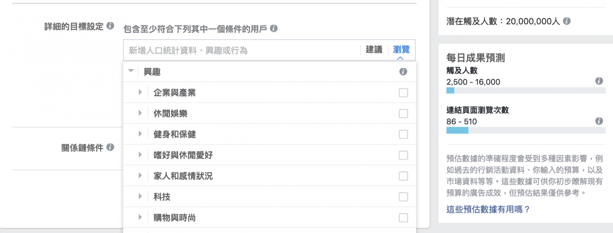

### 2.16.1：APP类添加调用逻辑

```scala
//TODO 11):将标签数据写入es
ToES.process(sqlContext,sparkContext,kuduContext)
```

### 2.16.2：添加Portrait实体类

```scala
package com.dmp.bean

import scala.collection.mutable.ListBuffer

/**
  * Created by angel；
  */
class Portrait{
  private var os:ListBuffer[(String , String)] = new ListBuffer[(String, String)]()
  private var network:ListBuffer[(String , String)] = new ListBuffer[(String, String)]()
  private var isp:ListBuffer[(String , String)] = new ListBuffer[(String, String)]()
  private var app:ListBuffer[(String , String)] = new ListBuffer[(String, String)]()
  private var pz:ListBuffer[(String , String)] = new ListBuffer[(String, String)]()
  private var cz:ListBuffer[(String , String)] = new ListBuffer[(String, String)]()
  private var lc:ListBuffer[(String , String)] = new ListBuffer[(String, String)]()
  private var cn:ListBuffer[(String , String)] = new ListBuffer[(String, String)]()
  private var ba:ListBuffer[(String , String)] = new ListBuffer[(String, String)]()
  private var keywords:ListBuffer[(String , String)] = new ListBuffer[(String, String)]()
  private var sex:ListBuffer[(String , String)] = new ListBuffer[(String, String)]()
  private var age:ListBuffer[(String , String)]= new ListBuffer[(String, String)]()

  //处理set方法
  def setOs(os:(String , String)) = {this.os.append(os)}
  def setNetwork(network:(String , String)) = {this.network.append(network)}
  def setIsp(isp:(String , String)) = {this.isp.append(isp)}
  def setApp(app:(String , String)) = {this.app.append(app)}
  def setPz(pz:(String , String)) = {this.pz.append(pz)}
  def setCz(cz:(String , String)) = {this.cz.append(cz)}
  def setLc(lc:(String , String)) = {this.lc.append(lc)}
  def setCn(cn:(String , String)) = {this.cn.append(cn)}
  def setBa(ba:(String , String)) = {this.ba.append(ba)}
  def setKeywords(keywords:(String , String)) = {this.keywords.append(keywords)}
  def setSex(sex:(String , String)) = {this.sex.append(sex)}
  def setAge(age:(String , String)) = {this.age.append(age)}

  def toData = Map("os" -> os.mkString ,
    "network" -> network.mkString ,
    "isp" -> isp.mkString ,
    "app" -> app.mkString ,
    "pz" -> pz.mkString ,
    "cz" -> cz.mkString ,
    "lc" -> lc.mkString ,
    "cn" -> cn.mkString ,
    "ba" -> ba.mkString ,
    "keywords" -> keywords.mkString ,
    "sex" -> sex.mkString ,
    "age" -> age.mkString
  )
}
```


### 2.16.3：编写ToEs代码

```scala
package com.dmp.tags

import com.dmp.`trait`.ProcessReport
import com.dmp.bean.Portrait
import com.dmp.tools.{DataUtils, GlobalConfUtils}
import org.apache.kudu.spark.kudu.KuduContext
import org.apache.kudu.spark.kudu._
import org.apache.spark.SparkContext
import org.apache.spark.sql.SQLContext

/**
  * Created by angel；
  */
object ToES extends ProcessReport{
  val KUDU_MASTER = GlobalConfUtils.KUDU_MASTER
  //获取今天的标签数据
  val SOURCE = GlobalConfUtils.DTP + DataUtils.NowDate()
  //获取数据
  val kuduOptions: Map[String, String] = Map(
    "kudu.table" -> SOURCE,
    "kudu.master" -> KUDU_MASTER
  )

  override def process(sqlContext: SQLContext, sparkContext: SparkContext, kuduContext: KuduContext): Unit = {
    val sourceTables = sqlContext.read.options(kuduOptions).kudu
    //将标签查询出来，解析标签的各个类别字段，然后将数据集写入es
    //写入es主要是在查询关键词方面比impala方便
    val rdd = sourceTables.rdd
    val result = rdd.map {
      line =>
        val userids: String = line.getAs[String]("userids")
        val tags: String = line.getAs[String]("tags")
        val tagArr = tags.substring(1, tags.length - 1).split("\\)\\(")
        var obj = new Portrait
        for (arr <- tagArr) {
          val arrSplit = arr.split(",")
          //K房产,0.65
          val k = arrSplit(0)
          val v = arrSplit(1)

          k match {
            //os
            case k if (k.startsWith("D00010001")) => obj.setOs(("android", v))
            case k if (k.startsWith("D00010002")) => obj.setOs(("ios", v))
            case k if (k.startsWith("D00010003")) => obj.setOs(("wp", v))
            case k if (k.startsWith("D00010004")) => obj.setOs(("其他", v))
            //network
            case k if (k.startsWith("D00020001")) => obj.setNetwork(("WIFI", v))
            case k if (k.startsWith("D00020002")) => obj.setNetwork(("4G", v))
            case k if (k.startsWith("D00020003")) => obj.setNetwork(("3G", v))
            case k if (k.startsWith("D00020004")) => obj.setNetwork(("2G", v))
            case k if (k.startsWith("D00020005")) => obj.setNetwork(("其他", v))
            //Isp
            case k if (k.startsWith("D00030001")) => obj.setIsp(("移动", v))
            case k if (k.startsWith("D00030002")) => obj.setIsp(("联通", v))
            case k if (k.startsWith("D00030003")) => obj.setIsp(("电信", v))
            case k if (k.startsWith("D00030004")) => obj.setIsp(("其他", v))
            //APP
            case k if (k.startsWith("APP")) => obj.setApp((k.substring(3, k.length), v))
            //PZ
            case k if (k.startsWith("PZ")) => obj.setPz((k.substring(2, k.length), v))
            //CZ
            case k if (k.startsWith("CZ")) => obj.setCz((k.substring(2, k.length), v))
            //LC
            case k if (k.startsWith("LC")) => obj.setLc((k.substring(2, k.length), v))
            //CN
            case k if (k.startsWith("CN")) => obj.setCn((k.substring(2, k.length), v))
            //BA
            case k if (k.startsWith("BA")) => obj.setBa((k.substring(2, k.length), v))
            //Keywords
            case k if (k.startsWith("K")) => obj.setKeywords((k.substring(1, k.length), v))
            //sex
            case k if (k.startsWith("SEX")) => obj.setSex((k.substring(3, k.length), v))
            //age
            case k if (k.startsWith("AGE")) => obj.setAge((k.substring(3, k.length), v))

          }
        }
        val id = userids.substring(1, userids.length - 1).split("\\)\\(")(0).split(",")(0)
        (id , obj.toData)
    }
    import org.elasticsearch.spark._
    result.saveToEsWithMeta("tags/doc")
  }
}
```

### 2.16.4：执行，查看最终结果


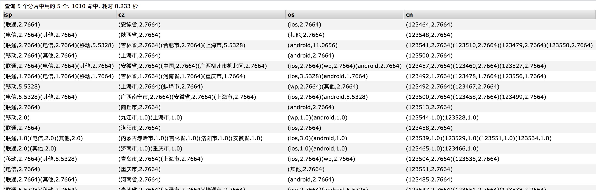
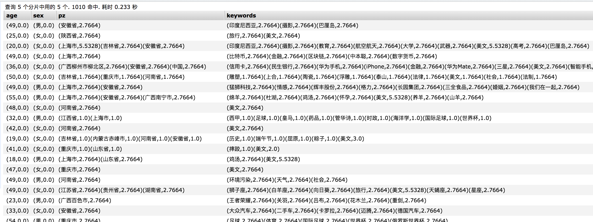
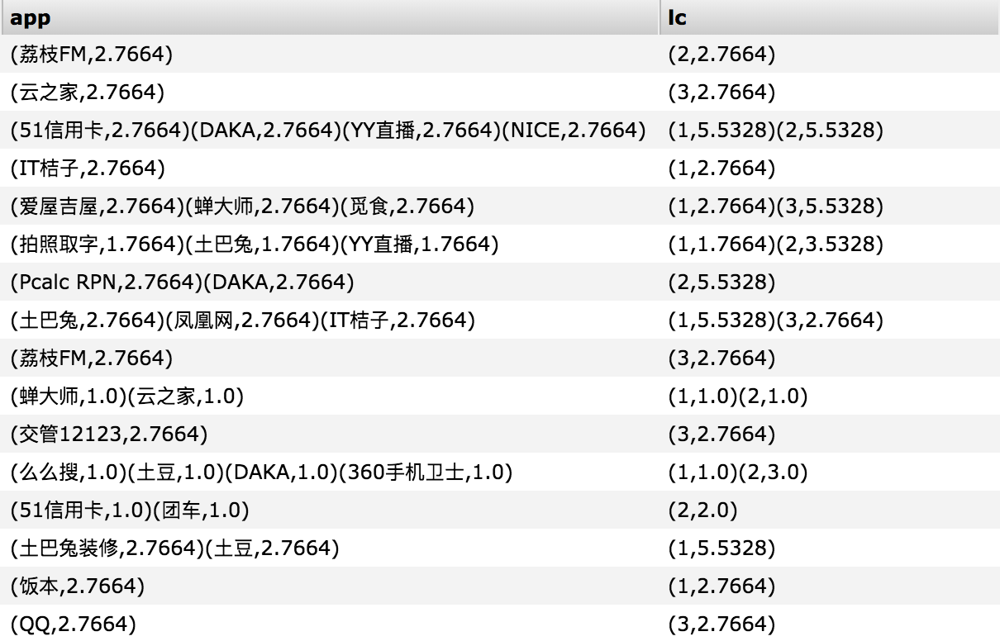
