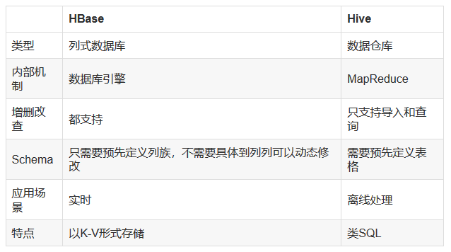
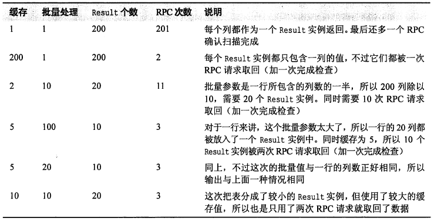
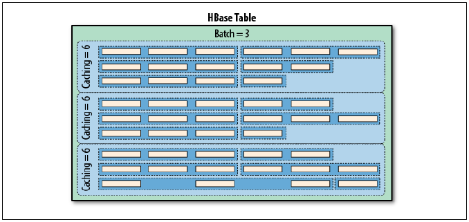
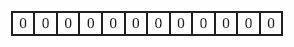
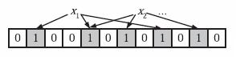
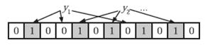

# 四 HBase（☆☆☆☆☆）

## 4.1 HBase的特点是什么?-

1）大:一个表可以有数十亿行,上百万列；
2）无模式:每行都有一个可排序的主键和任意多的列,列可以根据需要动态的增加,同一张表中不同的行可以有截然不同的列；
3）面向列:面向列（族）的存储和权限控制,列（族）独立检索；
4）稀疏:空（null）列并不占用存储空间,表可以设计的非常稀疏；
5）数据多版本:每个单元中的数据可以有多个版本,默认情况下版本号自动分配,是单元格插入时的时间戳；
6）数据类型单一:Hbase中的数据都是字符串,没有类型。

## 4.2 HBase和Hive的区别?-


① 两者是什么?-
Apache Hive是一个构建在Hadoop基础设施之上的数据仓库。通过Hive可以使用HQL语言查询存放在HDFS上的数据。HQL是一种类SQL语言,这种语言最终被转化为Map/Reduce. 虽然Hive提供了SQL查询功能,但是Hive不能够进行交互查询--因为它只能够在Haoop上批量的执行Hadoop。
Apache HBase是一种Key/Value系统,它运行在HDFS之上。和Hive不一样,Hbase的能够在它的数据库上实时运行,而不是运行MapReduce任务。Hbase被分区为表格,表格又被进一步分割为列簇。列簇必须使用schema定义,列簇将某一类型列集合起来（列不要求schema定义）。例如,“message”列簇可能包含:“to”, ”from” “date”, “subject”, 和”body”. 每一个 key/value对在Hbase中被定义为一个cell,每一个key由row-key,列簇、列和时间戳。在Hbase中,行是key/value映射的集合,这个映射通过row-key来唯一标识。Hbase利用Hadoop的基础设施,可以利用通用的设备进行水平的扩展。
② 两者的特点
Hive帮助熟悉SQL的人运行MapReduce任务。因为它是JDBC兼容的,同时,它也能够和现存的SQL工具整合在一起。运行Hive查询会花费很长时间,因为它会默认遍历表中所有的数据。虽然有这样的缺点,一次遍历的数据量可以通过Hive的分区机制来控制。分区允许在数据集上运行过滤查询,这些数据集存储在不同的文件夹内,查询的时候只遍历指定文件夹（分区）中的数据。这种机制可以用来,例如,只处理在某一个时间范围内的文件,只要这些文件名中包括了时间格式。
HBase通过存储key/value来工作。它支持四种主要的操作:增加或者更新行,查看一个范围内的cell,获取指定的行,删除指定的行、列或者是列的版本。版本信息用来获取历史数据（每一行的历史数据可以被删除,然后通过Hbase compactions就可以释放出空间）。虽然HBase包括表格,但是schema仅仅被表格和列簇所要求,列不需要schema。Hbase的表格包括增加/计数功能。
③ 限制
Hive目前不支持更新操作。另外,由于hive在hadoop上运行批量操作,它需要花费很长的时间,通常是几分钟到几个小时才可以获取到查询的结果。Hive必须提供预先定义好的schema将文件和目录映射到列,并且Hive与ACID不兼容。
HBase查询是通过特定的语言来编写的,这种语言需要重新学习。类SQL的功能可以通过Apache Phonenix实现,但这是以必须提供schema为代价的。另外,Hbase也并不是兼容所有的ACID特性,虽然它支持某些特性。最后但不是最重要的--为了运行Hbase,Zookeeper是必须的,zookeeper是一个用来进行分布式协调的服务,这些服务包括配置服务,维护元信息和命名空间服务。
④ 应用场景
Hive适合用来对一段时间内的数据进行分析查询,例如,用来计算趋势或者网站的日志。Hive不应该用来进行实时的查询。因为它需要很长时间才可以返回结果。
Hbase非常适合用来进行大数据的实时查询。Facebook用Hbase进行消息和实时的分析。它也可以用来统计Facebook的连接数。
⑤ 总结
Hive和Hbase是两种基于Hadoop的不同技术--Hive是一种类SQL的引擎,并且运行MapReduce任务,Hbase是一种在Hadoop之上的NoSQL 的Key/vale数据库。当然,这两种工具是可以同时使用的。就像用Google来搜索,用FaceBook进行社交一样,Hive可以用来进行统计查询,HBase可以用来进行实时查询,数据也可以从Hive写到Hbase,设置再从Hbase写回Hive。

## 4.3 HBase适用于怎样的情景?-

① 半结构化或非结构化数据
对于数据结构字段不够确定或杂乱无章很难按一个概念去进行抽取的数据适合用HBase。以上面的例子为例,当业务发展需要存储author的email,phone,address信息时RDBMS需要停机维护,而HBase支持动态增加。
② 记录非常稀疏
RDBMS的行有多少列是固定的,为null的列浪费了存储空间。而如上文提到的,HBase为null的Column不会被存储,这样既节省了空间又提高了读性能。
③ 多版本数据
如上文提到的根据Row key和Column key定位到的Value可以有任意数量的版本值,因此对于需要存储变动历史记录的数据,用HBase就非常方便了。比如上例中的author的Address是会变动的,业务上一般只需要最新的值,但有时可能需要查询到历史值。
④ 超大数据量
当数据量越来越大,RDBMS数据库撑不住了,就出现了读写分离策略,通过一个Master专门负责写操作,多个Slave负责读操作,服务器成本倍增。随着压力增加,Master撑不住了,这时就要分库了,把关联不大的数据分开部署,一些join查询不能用了,需要借助中间层。随着数据量的进一步增加,一个表的记录越来越大,查询就变得很慢,于是又得搞分表,比如按ID取模分成多个表以减少单个表的记录数。经历过这些事的人都知道过程是多么的折腾。采用HBase就简单了,只需要加机器即可,HBase会自动水平切分扩展,跟Hadoop的无缝集成保障了其数据可靠性（HDFS）和海量数据分析的高性能（MapReduce）。

## 4.4 描述HBase的rowKey的设计原则?-（☆☆☆☆☆）

① Rowkey长度原则
Rowkey 是一个二进制码流,Rowkey 的长度被很多开发者建议说设计在10~100 个字节,不过建议是越短越好,不要超过16 个字节。
原因如下:
（1）数据的持久化文件HFile 中是按照KeyValue 存储的,如果Rowkey 过长比如100 个字节,1000 万列数据光Rowkey 就要占用100*1000 万=10 亿个字节,将近1G 数据,这会极大影响HFile 的存储效率；
（2）MemStore 将缓存部分数据到内存,如果Rowkey 字段过长内存的有效利用率会降低,系统将无法缓存更多的数据,这会降低检索效率。因此Rowkey 的字节长度越短越好。
（3）目前操作系统是都是64 位系统,内存8 字节对齐。控制在16 个字节,8 字节的整数倍利用操作系统的最佳特性。
② Rowkey散列原则
如果Rowkey 是按时间戳的方式递增,不要将时间放在二进制码的前面,建议将Rowkey的高位作为散列字段,由程序循环生成,低位放时间字段,这样将提高数据均衡分布在每个Regionserver 实现负载均衡的几率。如果没有散列字段,首字段直接是时间信息将产生所有新数据都在一个 RegionServer 上堆积的热点现象,这样在做数据检索的时候负载将会集中在个别RegionServer,降低查询效率。
③ Rowkey唯一原则
必须在设计上保证其唯一性。

## 4.5 描述HBase中scan和get的功能以及实现的异同?-（☆☆☆☆☆）

HBase的查询实现只提供两种方式:
1）按指定RowKey 获取唯一一条记录,get方法（org.apache.hadoop.hbase.client.Get）
Get 的方法处理分两种 : 设置了ClosestRowBefore 和没有设置ClosestRowBefore的rowlock。主要是用来保证行的事务性,即每个get 是以一个row 来标记的。一个row中可以有很多family 和column。
2）按指定的条件获取一批记录,scan方法(org.apache.Hadoop.hbase.client.Scan）实现条件查询功能使用的就是scan 方式。
（1）scan 可以通过setCaching 与setBatch 方法提高速度(以空间换时间)；
（2）scan 可以通过setStartRow 与setEndRow 来限定范围([start,end)start 是闭区间,end 是开区间)。范围越小,性能越高。
（3）scan 可以通过setFilter 方法添加过滤器,这也是分页、多条件查询的基础。

## 4.6 请描述HBase中scan对象的setCache和setBatch方法的使用?-（☆☆☆☆☆）

setCache用于设置缓存,即设置一次RPC请求可以获取多行数据。对于缓存操作,如果行的数据量非常大,多行数据有可能超过客户端进程的内存容量,由此引入批量处理这一解决方案。
setBatch 用于设置批量处理,批量可以让用户选择每一次ResultScanner实例的next操作要取回多少列,例如,在扫描中设置setBatch(5),则一次next()返回的Result实例会包括5列。如果一行包括的列数超过了批量中设置的值,则可以将这一行分片,每次next操作返回一片,当一行的列数不能被批量中设置的值整除时,最后一次返回的Result实例会包含比较少的列,如,一行17列,batch设置为5,则一共返回4个Result实例,这4个实例中包括的列数分别为5、5、5、2。
组合使用扫描器缓存和批量大小,可以让用户方便地控制扫描一个范围内的行键所需要的RPC调用次数。Cache设置了服务器一次返回的行数,而Batch设置了服务器一次返回的列数。
假如我们建立了一张有两个列族的表,添加了10行数据,每个行的每个列族下有10列,这意味着整个表一共有200列（或单元格,因为每个列只有一个版本）,其中每行有20列。

① Batch参数决定了一行数据分为几个Result,它只针对一行数据,Batch再大,也只能将一行的数据放入一个Result中。所以当一行数据有10列,而Batch为100时,也只能将一行的所有列都放入一个Result,不会混合其他行；
② 缓存值决定一次RPC返回几个Result,根据Batch划分的Result个数除以缓存个数可以得到RPC消息个数（之前定义缓存值决定一次返回的行数,这是不准确的,准确来说是决定一次RPC返回的Result个数,由于在引入Batch之前,一行封装为一个Result,因此定义缓存值决定一次返回的行数,但引入Batch后,更准确的说法是缓存值决定了一次RPC返回的Result个数）；
RPC请求次数 = （行数 * 每行列数） / Min（每行的列数,批量大小） / 扫描器缓存
下图展示了缓存和批量两个参数如何联动,下图中有一个包含9行数据的表,每行都包含一些列。使用了一个缓存为6、批量大小为3的扫描器,需要三次RPC请求来传送数据:


## 4.7 请详细描述HBase中一个cell的结构?-

HBase中通过row和columns确定的为一个存贮单元称为cell。
Cell:由`{row key, column(=<family> + <label>), version}`唯一确定的单元。cell 中的数据是没有类型的,全部是字节码形式存贮。

## 4.8 以start-hbase.sh为起点,HBase启动的流程是什么?-

start-hbase.sh 的流程如下:
1.运行 hbase-config.sh
hbase-config.sh的作用:
① 装载相关配置,如HBASE_HOME目录,conf目录,regionserver机器列表,JAVA_HOME 目录等,它会调用$HBASE_HOME/conf/hbase-env.sh ；
② 解析参数（0.96 版本及以后才可以带唯一参数 autorestart,作用就是重启）；
③ 调用 hbase-daemon.sh 来启动 master；
④ 调用 hbase-daemons.sh 来启动 regionserver zookeeper master-backup。
2.hbase-env.sh 的作用:
主要是配置 JVM 及其 GC 参数,还可以配置 log 目录及参数,配置是否需要 hbase 管理 ZK,配置进程 id 目录等。
3.hbase-daemons.sh 的作用:
根据需要启动的进程,如 zookeeper,则调用 zookeepers.sh如 regionserver,则调用 regionservers.sh,如 master-backup,则调用 master-backup.sh。
4.zookeepers.sh 的作用:
如果 hbase-env.sh 中的 HBASE_MANAGES_ZK"="true",那么通过ZKServerTool这个类解析xml配置文件,获取 ZK 节点列表,然后通过 SSH 向这些节点发送远程命令执行。
5.regionservers.sh 的作用:
与 zookeepers.sh 类似,通过配置文件,获取 regionserver 机器列表,然后 SSH 向这些机器发送远程命令。
6.master-backup.sh 的作用:
通过 backup-masters 这个配置文件,获取 backup-masters 机器列表,然后 SSH 向这些机器发送远程命令。

## 4.9 简述HBase中compact用途是什么,什么时候触发,分为哪两种,有什么区别,有哪些相关配置参数?-（☆☆☆☆☆）

在hbase中每当有memstore数据flush到磁盘之后,就形成一个storefile,当storeFile的数量达到一定程度后,就需要将 storefile 文件来进行 compaction 操作。
Compact 的作用:
① 合并文件
② 清除过期,多余版本的数据
③ 提高读写数据的效率
HBase 中实现了两种 compaction 的方式:minor and major. 这两种 compaction 方式的区别是:
1、Minor 操作只用来做部分文件的合并操作以及包括 minVersion=0 并且设置 ttl 的过期版本清理,不做任何删除数据、多版本数据的清理工作。
2、Major 操作是对 Region 下的HStore下的所有StoreFile执行合并操作,最终的结果是整理合并出一个文件。

## 4.10 每天百亿数据存入HBase,如何保证数据的存储正确和在规定的时间里全部录入完毕,不残留数据?-（☆☆☆☆☆）

需求分析:
1）百亿数据:证明数据量非常大；
2）存入HBase:证明是跟HBase的写入数据有关；
3）保证数据的正确:要设计正确的数据结构保证正确性；
4）在规定时间内完成:对存入速度是有要求的。
解决思路:
1）数据量百亿条,什么概念呢?-假设一整天60x60x24 = 86400秒都在写入数据,那么每秒的写入条数高达100万条,HBase当然是支持不了每秒百万条数据的,所以这百亿条数据可能不是通过实时地写入,而是批量地导入。批量导入推荐使用BulkLoad方式（推荐阅读:Spark之读写HBase）,性能是普通写入方式几倍以上；
2）存入HBase:普通写入是用JavaAPI put来实现,批量导入推荐使用BulkLoad；
3）保证数据的正确:这里需要考虑RowKey的设计、预建分区和列族设计等问题；
4）在规定时间内完成也就是存入速度不能过慢,并且当然是越快越好,使用BulkLoad。

## 4.11 HBase如何给web前端提供接口来访问?-

使用JavaAPI来编写WEB应用,使用HBase提供的RESTFul接口。

## 4.12 请列举几个HBase优化方法?-（☆☆☆☆☆）

1）减少调整
减少调整这个如何理解呢?-HBase中有几个内容会动态调整,如region（分区）、HFile,所以通过一些方法来减少这些会带来I/O开销的调整。
· Region
如果没有预建分区的话,那么随着region中条数的增加,region会进行分裂,这将增加I/O开销,所以解决方法就是根据你的RowKey设计来进行预建分区,减少region的动态分裂。
· HFile
​HFile是数据底层存储文件,在每个memstore进行刷新时会生成一个HFile,当HFile增加到一定程度时,会将属于一个region的HFile进行合并,这个步骤会带来开销但不可避免,但是合并后HFile大小如果大于设定的值,那么HFile会重新分裂。为了减少这样的无谓的I/O开销,建议估计项目数据量大小,给HFile设定一个合适的值。
2）减少启停
数据库事务机制就是为了更好地实现批量写入,较少数据库的开启关闭带来的开销,那么HBase中也存在频繁开启关闭带来的问题。
​· 关闭Compaction,在闲时进行手动Compaction。
因为HBase中存在Minor Compaction和Major Compaction,也就是对HFile进行合并,所谓合并就是I/O读写,大量的HFile进行肯定会带来I/O开销,甚至是I/O风暴,所以为了避免这种不受控制的意外发生,建议关闭自动Compaction,在闲时进行compaction。
·批量数据写入时采用BulkLoad。
​ 如果通过HBase-Shell或者JavaAPI的put来实现大量数据的写入,那么性能差是肯定并且还可能带来一些意想不到的问题,所以当需要写入大量离线数据时建议使用BulkLoad
3）减少数据量
虽然我们是在进行大数据开发,但是如果可以通过某些方式在保证数据准确性同时减少数据量,何乐而不为呢?-
· 开启过滤,提高查询速度
 开启BloomFilter,BloomFilter是列族级别的过滤,在生成一个StoreFile同时会生成一个MetaBlock,用于查询时过滤数据
· 使用压缩:一般推荐使用Snappy和LZO压缩
4）合理设计
在一张HBase表格中RowKey和ColumnFamily的设计是非常重要,好的设计能够提高性能和保证数据的准确性
· RowKey设计:应该具备以下几个属性
散列性:散列性能够保证相同相似的rowkey聚合,相异的rowkey分散,有利于查询。
​简短性:rowkey作为key的一部分存储在HFile中,如果为了可读性将rowKey设计得过长,那么将会增加存储压力。
唯一性:rowKey必须具备明显的区别性。
业务性:举例来说:
假如我的查询条件比较多,而且不是针对列的条件,那么rowKey的设计就应该支持多条件查询。
如果我的查询要求是最近插入的数据优先,那么rowKey则可以采用叫上Long.Max-时间戳的方式,这样rowKey就是递减排列。
· 列族的设计
列族的设计需要看应用场景
多列族设计的优劣:
优势:HBase中数据时按列进行存储的,那么查询某一列族的某一列时就不需要全盘扫描,只需要扫描某一列族,减少了读I/O；其实多列族设计对减少的作用不是很明显,适用于读多写少的场景
劣势:降低了写的I/O性能。原因如下:数据写到store以后是先缓存在memstore中,同一个region中存在多个列族则存在多个store,每个store都一个memstore,当其实memstore进行flush时,属于同一个region的store中的memstore都会进行flush,增加I/O开销。

## 4.13 HBase中RowFilter和BloomFilter原理?-

1）RowFilter原理简析
RowFilter顾名思义就是对rowkey进行过滤,那么rowkey的过滤无非就是相等（EQUAL）、大于(GREATER)、小于(LESS),大于等于(GREATER_OR_EQUAL),小于等于(LESS_OR_EQUAL)和不等于(NOT_EQUAL)几种过滤方式。Hbase中的RowFilter采用比较符结合比较器的方式来进行过滤。
比较器的类型如下:
​ BinaryComparator
​ BinaryPrefixComparator
​ NullComparator
​ BitComparator
​ RegexStringComparator
​ SubStringComparator
例子:
Filter rowFilter = new RowFilter(CompareFilter.CompareOp.EQUAL,
new BinaryComparator(Bytes.toBytes(rowKeyValue)));
Scan scan = new Scan();
scan.setFilter(rowFilter)
...
在上面例子中,比较符为EQUAL,比较器为BinaryComparator
2）BloomFilter原理简析
· 主要功能:提供随机读的性能
· 存储开销:BloomFilter是列族级别的配置,一旦表格中开启BloomFilter,那么在生成StoreFile时同时会生成一份包含BloomFilter结构的文件MetaBlock,所以会增加一定的存储开销和内存开销
· 粒度控制:ROW和ROWCOL
· BloomFilter的原理
​ 简单说一下BloomFilter原理:
​ ① 内部是一个bit数组,初始值均为0
② 插入元素时对元素进行hash并且映射到数组中的某一个index,将其置为1,再进行多次不同的hash算法,将映射到的index置为1,同一个index只需要置1次。
③ 查询时使用跟插入时相同的hash算法,如果在对应的index的值都为1,那么就可以认为该元素可能存在,注意,只是可能存在
④ 所以BlomFilter只能保证过滤掉不包含的元素,而不能保证误判包含
·  设置:在建表时对某一列设置BloomFilter即可

## 4.14 HBase的导入导出方式?-

1）导入:bin/hbase org.apache.hadoop.hbase.mapreduce.Driver import 表名 路径
路径:来源
本地路径 file:///path
HDFS hdfs://cluster1/path
2）导出:bin/hbase org.apache.hadoop.hbase.mapreduce.Driver export 表名 路径
路径:目的地
 本地路径 file:///path
 HDFS hdfs://cluster1/path

## 4.15 Region如何预建分区?-

预分区的目的主要是在创建表的时候指定分区数,提前规划表有多个分区,以及每个分区的区间范围,这样在存储的时候rowkey按照分区的区间存储,可以避免region热点问题。
通常有两种方案**:**
方案1:shell 方法
create 'tb_splits', {NAME => 'cf',VERSIONS=> 3},{SPLITS => ['10','20','30']}
方案2: JAVA程序控制
· 取样,先随机生成一定数量的rowkey,将取样数据按升序排序放到一个集合里；
· 根据预分区的region个数,对整个集合平均分割,即是相关的splitKeys；
· HBaseAdmin.createTable(HTableDescriptor tableDescriptor,byte[][]splitkeys)可以指定预分区的splitKey,即是指定region间的rowkey临界值。

## 4.16 HRegionServer宕机如何处理?-（☆☆☆☆☆）

1）ZooKeeper会监控HRegionServer的上下线情况,当ZK发现某个HRegionServer宕机之后会通知HMaster进行失效备援；
2）该HRegionServer会停止对外提供服务,就是它所负责的region暂时停止对外提供服务；
3）HMaster会将该HRegionServer所负责的region转移到其他HRegionServer上,并且会对HRegionServer上存在memstore中还未持久化到磁盘中的数据进行恢复；
4）这个恢复的工作是由WAL重播来完成,这个过程如下:
· wal实际上就是一个文件,存在/hbase/WAL/对应RegionServer路径下。
· 宕机发生时,读取该RegionServer所对应的路径下的wal文件,然后根据不同的region切分成不同的临时文件recover.edits。
· 当region被分配到新的RegionServer中,RegionServer读取region时会进行是否存在recover.edits,如果有则进行恢复。

## 4.17 HBase读写流程?-（☆☆☆☆☆）

读:
① HRegionServer保存着meta表以及表数据,要访问表数据,首先Client先去访问zookeeper,从zookeeper里面获取meta表所在的位置信息,即找到这个meta表在哪个HRegionServer上保存着。
② 接着Client通过刚才获取到的HRegionServer的IP来访问Meta表所在的HRegionServer,从而读取到Meta,进而获取到Meta表中存放的元数据。
③ Client通过元数据中存储的信息,访问对应的HRegionServer,然后扫描所在HRegionServer的Memstore和Storefile来查询数据。
④ 最后HRegionServer把查询到的数据响应给Client。
写:
① Client先访问zookeeper,找到Meta表,并获取Meta表元数据。
② 确定当前将要写入的数据所对应的HRegion和HRegionServer服务器。
③ Client向该HRegionServer服务器发起写入数据请求,然后HRegionServer收到请求并响应。
④ Client先把数据写入到HLog,以防止数据丢失。
⑤ 然后将数据写入到Memstore。
⑥ 如果HLog和Memstore均写入成功,则这条数据写入成功
⑦ 如果Memstore达到阈值,会把Memstore中的数据flush到Storefile中。
⑧ 当Storefile越来越多,会触发Compact合并操作,把过多的Storefile合并成一个大的Storefile。
⑨ 当Storefile越来越大,Region也会越来越大,达到阈值后,会触发Split操作,将Region一分为二。

## 4.18 HBase过滤器实现原则?-（☆☆☆☆☆）

## 4.19 HBase内部机制是什么?-

Hbase是一个能适应联机业务的数据库系统
物理存储:hbase的持久化数据是将数据存储在HDFS上。
存储管理:一个表是划分为很多region的,这些region分布式地存放在很多regionserver上Region内部还可以划分为store,store内部有memstore和storefile。
版本管理:hbase中的数据更新本质上是不断追加新的版本,通过compact操作来做版本间的文件合并Region的split。
集群管理:ZooKeeper + HMaster + HRegionServer。

## 4.20 HTable API有没有线程安全问题,在程序中是单例还是多例?-（☆☆☆☆☆）

在单线程环境下使用hbase的htable是没有问题,但是突然高并发多线程情况下就可能出现问题。
以下为Htable的API说明:
This class is not thread safe for updates; the underlying write buffer can be corrupted  if multiple threads contend over a single HTable instance.  
当有多个线程竞争时可能把当前正在写的线程corrupted,那么原因是什么呢?-
根据Htable的源码:

```java
public HTable(final byte [] tableName)  
 throws IOException {  
 this(HBaseConfiguration.create(), tableName);  
 }
public static Configuration create() {  
​ Configuration conf = new Configuration();  
​ return addHbaseResources(conf);  
}  
```

从上面我们可以看到每一个HTable的实例化过程都要创建一个新的conf,我们甚至可以认为一个conf对应的是一个HTable的connection,因此如果客户端对于同一个表,每次新new 一个configuration对象的话,那么意味着这两个HTable虽然操作的是同一个table,但是建立的是两条链接connection,它们的socket不是共用的,在多线程的情况下,经常会有new Htable的情况发生,而每一次的new都可能是一个新的connection,而我们知道zk上的链接是有限制的如果链接达到一定阈值的话,那么新建立的链接很有可能挤掉原先的connection,而导致线程不安全。
因此hbase官方文档建议我们:HTable不是线程安全的。建议使用同一个HBaseConfiguration实例来创建HTable实例,这样可以共享ZooKeeper和socket实例。例如,最好这样做:
HBaseConfiguration conf = HBaseConfiguration.create();
HTable table1 = new HTable(conf, "myTable");
HTable table2 = new HTable(conf, "myTable");
而不是这样:
HBaseConfiguration conf1 = HBaseConfiguration.create();
HTable table1 = new HTable(conf1, "myTable");
HBaseConfiguration conf2 = HBaseConfiguration.create();
HTable table2 = new HTable(conf2, "myTable");
当然最方便的方法就是使用HTablepool了,维持一个线程安全的map里面存放的是tablename和其引用的映射,可以认为是一个简单的计数器,当需要new 一个HTable实例时直接从该pool中取,用完放回。

## 4.21 HBase有没有并发问题?-（企业）（☆☆☆☆☆）

针对HBase在高并发情况下的性能,我们进行如下测试:
测试版本:hbase 0.94.1、 hadoop 1.0.2、 jdk-6u32-linux-x64.bin、snappy-1.0.5.tar.gz
测试hbase搭建:14台存储机器+2台master、DataNode和regionserver放在一起。
测试一:高并发读(4w+/s) + 少量写(允许分拆、负载均衡)
症状:1-2天后,hbase挂掉(系统性能极差,不到正常的10%)。其实并非全部挂掉,而是某些regionserver挂了,并在几个小时内引发其他regionserver挂掉。系统无法恢复:单独启regionserver无法恢复正常。重启后正常。
测试二:高并发读(4w+/s)
症状:1-2天后,hbase挂掉(系统性能极差,不到正常的10%)。后发现是由于zookeeper.session.timeout设置不正确导致(参见regionserver部分:<http://hbase.apache.org/book.html#trouble)>。重启后正常。
测试三:高并发读(4w+/s)
症状:1-2天后,hbase挂掉(系统性能极差,不到正常的10%)。从log未看出问题,但regionserver宕机,且datanode也宕机。重启后正常。
测试四:高并发读(4w+/s)+禁止分拆、禁止majorcompaction、禁止负载均衡(balance_switch命令)
症状:1-2天后,hbase挂掉(系统性能极差,不到正常的10%)。从log未看出问题,但regionserver宕机,且datanode也宕机。重启后正常。
测试期间,还发现过:无法获取".MATE."表的内容(想知道regionserver的分布情况)、hbase无法正确停止、hbase无法正确启动(日志恢复失败,文件错误,最终手动删除日志重启)。

## 4.22 你们的HBase大概在公司业务中（主要是网上商城）大概都几个表?-几个表簇?-都存什么样的数据?-（☆☆☆☆☆）

## 4.23 Hbase中的memstore是用来做什么的?-

hbase为了保证随机读取的性能,所以hfile里面的rowkey是有序的。当客户端的请求在到达regionserver之后,为了保证写入rowkey的有序性,所以不能将数据立刻写入到hfile中,而是将每个变更操作保存在内存中,也就是memstore中。memstore能够很方便的支持操作的随机插入,并保证所有的操作在内存中是有序的。当memstore达到一定的量之后,会将memstore里面的数据flush到hfile中,这样能充分利用hadoop写入大文件的性能优势,提高写入性能。
由于memstore是存放在内存中,如果regionserver因为某种原因死了,会导致内存中数据丢失。所有为了保证数据不丢失,hbase将更新操作在写入memstore之前会写入到一个write ahead log(WAL)中。WAL文件是追加、顺序写入的,WAL每个regionserver只有一个,同一个regionserver上所有region写入同一个的WAL文件。这样当某个regionserver失败时,可以通过WAL文件,将所有的操作顺序重新加载到memstore中。

## 4.24 HBase在进行模型设计时重点在什么地方?-一张表中定义多少个Column Family最合适?-为什么?-（☆☆☆☆☆）

Column Family的个数具体看表的数据,一般来说划分标准是根据数据访问频度,如一张表里有些列访问相对频繁,而另一些列访问很少,这时可以把这张表划分成两个列族,分开存储,提高访问效率。

## 4.25 如何提高HBase客户端的读写性能?-请举例说明（☆☆☆☆☆）

① 开启bloomfilter过滤器,开启bloomfilter比没开启要快3、4倍
② Hbase对于内存有特别的需求,在硬件允许的情况下配足够多的内存给它
③ 通过修改hbase-env.sh中的
export HBASE_HEAPSIZE=3000 #这里默认为1000m
④ 增大RPC数量
通过修改hbase-site.xml中的hbase.regionserver.handler.count属性,可以适当的放大RPC数量,默认值为10有点小。

## 4.26 HBase集群安装注意事项?-

① HBase需要HDFS的支持,因此安装HBase前确保Hadoop集群安装完成；
② HBase需要ZooKeeper集群的支持,因此安装HBase前确保ZooKeeper集群安装完成；
③ 注意HBase与Hadoop的版本兼容性；
④ 注意hbase-env.sh配置文件和hbase-site.xml配置文件的正确配置；
⑤ 注意regionservers配置文件的修改；
⑤ 注意集群中的各个节点的时间必须同步,否则启动HBase集群将会报错；

## 4.27 直接将时间戳作为行健,在写入单个region 时候会发生热点问题,为什么呢?-（☆☆☆☆☆）

region中的rowkey是有序存储,若时间比较集中。就会存储到一个region中,这样一个region的数据变多,其它的region数据很少,加载数据就会很慢,直到region分裂,此问题才会得到缓解。

## 4.28 请描述如何解决HBase中region太小和region太大带来的冲突?-（☆☆☆☆☆）

 Region过大会发生多次compaction,将数据读一遍并重写一遍到hdfs 上,占用io,region过小会造成多次split,region 会下线,影响访问服务,最佳的解决方法是调整hbase.hregion. max.filesize 为256m。

## 4.29 解释一下布隆过滤器原理（☆☆☆☆☆）

在日常生活中,包括在设计计算机软件时,我们经常要判断一个元素是否在一个集合中。比如在字处理软件中,需要检查一个英语单词是否拼写正确（也就是要判断它是否在已知的字典中）；在 FBI,一个嫌疑人的名字是否已经在嫌疑名单上；在网络爬虫里,一个网址是否被访问过等等。最直接的方法就是将集合中全部的元素存在计算机中,遇到一个新元素时,将它和集合中的元素直接比较即可。一般来讲,计算机中的集合是用哈希表（hash table）来存储的。它的好处是快速准确,缺点是费存储空间。当集合比较小时,这个问题不显著,但是当集合巨大时,哈希表存储效率低的问题就显现出来了。比如说,一个象 Yahoo,Hotmail 和 Gmai 那样的公众电子邮件（email）提供商,总是需要过滤来自发送垃圾邮件的人（spamer）的垃圾邮件。一个办法就是记录下那些发垃圾邮件的 email 地址。由于那些发送者不停地在注册新的地址,全世界少说也有几十亿个发垃圾邮件的地址,将他们都存起来则需要大量的网络服务器。如果用哈希表,每存储一亿个 email 地址, 就需要 1.6GB 的内存（用哈希表实现的具体办法是将每一个 email 地址对应成一个八字节的信息指纹googlechinablog.com/2006/08/blog-post.html,然后将这些信息指纹存入哈希表,由于哈希表的存储效率一般只有 50%,因此一个 email 地址需要占用十六个字节。一亿个地址大约要 1.6GB, 即十六亿字节的内存）。因此存贮几十亿个邮件地址可能需要上百 GB 的内存。除非是超级计算机,一般服务器是无法存储的。
​ 布隆过滤器只需要哈希表 1/8 到 1/4 的大小就能解决同样的问题。
Bloom Filter是一种空间效率很高的随机数据结构,它利用位数组很简洁地表示一个集合,并能判断一个元素是否属于这个集合。Bloom Filter的这种高效是有一定代价的:在判断一个元素是否属于某个集合时,有可能会把不属于这个集合的元素误认为属于这个集合（false positive）。因此,Bloom Filter不适合那些“零错误”的应用场合。而在能容忍低错误率的应用场合下,Bloom Filter通过极少的错误换取了存储空间的极大节省。
下面我们具体来看Bloom Filter是如何用位数组表示集合的。初始状态时,Bloom Filter是一个包含m位的位数组,每一位都置为0。

为了表达S={x1, x2,…,xn}这样一个n个元素的集合,Bloom Filter使用k个相互独立的哈希函数（Hash Function）,它们分别将集合中的每个元素映射到{1,…,m}的范围中。对任意一个元素x,第i个哈希函数映射的位置hi(x)就会被置为1（1≤i≤k）。注意,如果一个位置多次被置为1,那么只有第一次会起作用,后面几次将没有任何效果。在下图中,k=3,且有两个哈希函数选中同一个位置（从左边数第五位）。

在判断y是否属于这个集合时,我们对y应用k次哈希函数,如果所有hi(y)的位置都是1（1≤i≤k）,那么我们就认为y是集合中的元素,否则就认为y不是集合中的元素。下图中y1就不是集合中的元素。y2或者属于这个集合,或者刚好是一个false positive。

· 为了add一个元素,用k个hash function将它hash得到bloom filter中k个bit位,将这k个bit位置1。
· 为了query一个元素,即判断它是否在集合中,用k个hash function将它hash得到k个bit位。若这k bits全为1,则此元素在集合中；若其中任一位不为1,则此元素比不在集合中（因为如果在,则在add时已经把对应的k个bits位置为1）。
· 不允许remove元素,因为那样的话会把相应的k个bits位置为0,而其中很有可能有其他元素对应的位。因此remove会引入false negative,这是绝对不被允许的。
布隆过滤器决不会漏掉任何一个在黑名单中的可疑地址。但是,它有一条不足之处,也就是它有极小的可能将一个不在黑名单中的电子邮件地址判定为在黑名单中,因为有可能某个好的邮件地址正巧对应个八个都被设置成一的二进制位。好在这种可能性很小,我们把它称为误识概率。
布隆过滤器的好处在于快速,省空间,但是有一定的误识别率,常见的补救办法是在建立一个小的白名单,存储那些可能别误判的邮件地址。
布隆过滤器具体算法高级内容,如错误率估计,最优哈希函数个数计算,位数组大小计算,请参见<http://blog.csdn.net/jiaomeng/article/details/1495500>
