# 一 Hadoop面试题

## 1.1 Hadoop基础(☆☆)

### 1.1.1 下列哪项通常是集群的最主要瓶颈(C)

A.CPU
B.网络
C.磁盘 IO
D.内存

### 1.1.2 下列哪项可以作为集群的管理​?-(C)

C.ClouderaManager
D.Zookeeper

### 1.1.3 下列哪个是Hadoop运行的模式​?-(ABC)

A.单机版
B.伪分布式
C.完全分布式

### 1.1.4 列举几个hadoop生态圈的组件并做简要描述

1)Zookeeper:是一个开源的分布式应用程序协调服务,基于zookeeper可以实现同步服务，配置维护，命名服务.
2)Flume:一个高可用的，高可靠的，分布式的海量日志采集、聚合和传输的系统.
3)Hbase:是一个分布式的、面向列的开源数据库, 利用Hadoop HDFS作为其存储系统.
4)Hive:基于Hadoop的一个数据仓库工具，可以将结构化的数据档映射为一张数据库表，并提供简单的sql 查询功能，可以将sql语句转换为MapReduce任务进行运行.
5)Sqoop:将一个关系型数据库中的数据导进到Hadoop的 HDFS中，也可以将HDFS的数据导进到关系型数据库中.

### 1.1.5 解释“hadoop”和“hadoop 生态系统”两个概念

Hadoop是指Hadoop框架本身;hadoop生态系统，不仅包含hadoop，还包括保证hadoop框架正常高效运行其他框架，比如zookeeper、Flume、Hbase、Hive、Sqoop等辅助框架.

### 1.1.6 简要描述如何安装配置apache的一个开源[Hadoop](http://lib.csdn.net/base/hadoop)，只描述即可，无需列出具体步骤，列出具体步骤更好

1)使用root账户登录
2)修改IP
3)修改host主机名
4)配置SSH免密码登录
5)关闭防火墙
6)安装JDK
7)解压hadoop安装包
8)配置hadoop的核心文件 hadoop-env.sh，core-site.xml , mapred-site.xml ， hdfs-site.xml
9)配置hadoop环境变量
10)格式化 hadoop namenode-format
11)启动节点start-all.sh

### 1.1.7 Hadoop中需要哪些配置文件，其作用是什么​?-

1)core-site.xml:
(1)fs.defaultFS:hdfs://cluster1(域名)，这里的值指的是默认的HDFS路径 .
(2)hadoop.tmp.dir:/export/data/hadoop_tmp,这里的路径默认是NameNode、DataNode、secondaryNamenode等存放数据的公共目录.用户也可以自己单独指定这三类节点的目录.
(3)ha.zookeeper.quorum:hadoop101:2181,hadoop102:2181,hadoop103:2181,这里是ZooKeeper集群的地址和端口.注意，数量一定是奇数，且不少于三个节点 .
2)hadoop-env.sh: 只需设置jdk的安装路径，如:export JAVA_HOME=/usr/local/jdk.
3)hdfs-site.xml:
(1) dfs.replication:他决定着系统里面的文件块的数据备份个数，默认为3个.
(2) dfs.data.dir:datanode节点存储在文件系统的目录 .
(3) dfs.name.dir:是namenode节点存储hadoop文件系统信息的本地系统路径 .
4)mapred-site.xml:
mapreduce.framework.name: yarn指定mr运行在yarn上.

### 1.1.8 请列出正常工作的Hadoop集群中Hadoop都分别需要启动哪些进程，它们的作用分别是什么?-

1)NameNode它是hadoop中的主服务器，管理文件系统名称空间和对集群中存储的文件的访问，保存有metadate.
2)SecondaryNameNode它不是namenode的冗余守护进程，而是提供周期检查点和清理任务.帮助NN合并editslog，减少NN启动时间.
3)DataNode它负责管理连接到节点的存储(一个集群中可以有多个节点).每个存储数据的节点运行一个datanode守护进程.
4)ResourceManager(JobTracker)JobTracker负责调度DataNode上的工作.每个DataNode有一个TaskTracker，它们执行实际工作.
5)NodeManager(TaskTracker)执行任务
6)DFSZKFailoverController高可用时它负责监控NN的状态，并及时的把状态信息写入ZK.它通过一个独立线程周期性的调用NN上的一个特定接口来获取NN的健康状态.FC也有选择谁作为Active NN的权利，因为最多只有两个节点，目前选择策略还比较简单(先到先得，轮换).
7)JournalNode 高可用情况下存放namenode的editlog文件.

### 1.1.9 简述Hadoop的几个默认端口及其含义

1)dfs.namenode.http-address:50070
2)SecondaryNameNode辅助名称节点端口号:50090
3)dfs.datanode.address:50010
4)fs.defaultFS:8020 或者9000
5)yarn.resourcemanager.webapp.address:8088

## 1.2 HDFS(☆☆☆)

### 1.2.1 HDFS 中的 block 默认保存几份​?-(A)

A.3 份
B.2 份
C.1 份
D.不确定

### 1.2.2 HDFS 默认 BlockSize 是(C)

A.32MB
B.64MB(2.7.2版本，本地模式)
C.128MB(2.7.2版本，分布式模式)

### 1.2.3 Client 端上传文件的时候下列哪项正确​?-(BC)

A.数据经过NameNode传递DataNode
B.Client端将文件切分为Block，依次上传
C.Client只上传数据到一台DataNode，然后由NameNode负责Block复制工作

### 1.2.4 下面哪个程序负责 HDFS 数据存储​?-(C)

A.NameNode
B.JobTracker
C.DataNode
D.SecondaryNameNode
E.tasktracker

### 1.2.5 关于 SecondaryNameNode 哪项是正确的​?-(C)

A.它是NameNode的热备
B.它对内存没有要求
C.他的目的使帮助NameNode合并编辑日志，减少NameNode 启动时间
D. SecondaryNameNode应与NameNode 部署到一个节点

### 1.2.6 下列哪个程序通常与 NameNode 在一个节点启动​?-(D)

A.SecondaryNameNode
B.DataNode
C.TaskTracker
D.JobTracker

### 1.2.7 文件大小默认为 64M，改为 128M 有啥影响​?-

增加文件块大小，需要增加磁盘的传输速率.
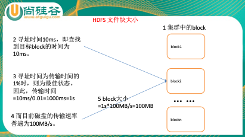

### 1.2.8 HDFS的存储机制(☆☆☆☆☆)

HDFS存储机制，包括HDFS的写入过程和读取过程两个部分
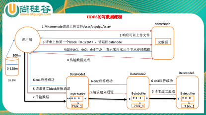
1)客户端向namenode请求上传文件，namenode检查目标文件是否已存在，父目录是否存在.
2)namenode返回是否可以上传.
3)客户端请求第一个 block上传到哪几个datanode服务器上.
4)namenode返回3个datanode节点，分别为dn1、dn2、dn3.
5)客户端请求dn1上传数据，dn1收到请求会继续调用dn2，然后dn2调用dn3，将这个通信管道建立完成
6)dn1、dn2、dn3逐级应答客户端
7)客户端开始往dn1上传第一个block(先从磁盘读取数据放到一个本地内存缓存)，以packet为单位，dn1收到一个packet就会传给dn2，dn2传给dn3;dn1每传一个packet会放入一个应答队列等待应答
8)当一个block传输完成之后，客户端再次请求namenode上传第二个block的服务器.(重复执行3-7步)
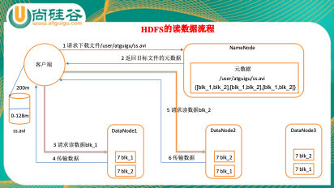
1)客户端向namenode请求下载文件，namenode通过查询元数据，找到文件块所在的datanode地址.
2)挑选一台datanode(就近原则，然后随机)服务器，请求读取数据.
3)datanode开始传输数据给客户端(从磁盘里面读取数据放入流，以packet为单位来做校验).
4)客户端以packet为单位接收，先在本地缓存，然后写入目标文件.

### 1.2.9 secondary namenode工作机制(☆☆☆☆☆)

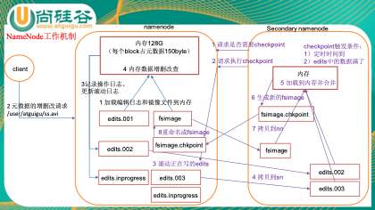1)第一阶段:namenode启动
(1)第一次启动namenode格式化后，创建fsimage和edits文件.如果不是第一次启动，直接加载编辑日志和镜像文件到内存.
(2)客户端对元数据进行增删改的请求
(3)namenode记录操作日志，更新滚动日志.
(4)namenode在内存中对数据进行增删改查
2)第二阶段:Secondary NameNode工作
(1)Secondary NameNode询问namenode是否需要checkpoint.直接带回namenode是否检查结果.
(2)Secondary NameNode请求执行checkpoint.
(3)namenode滚动正在写的edits日志
(4)将滚动前的编辑日志和镜像文件拷贝到Secondary NameNode
(5)Secondary NameNode加载编辑日志和镜像文件到内存，并合并.
(6)生成新的镜像文件fsimage.chkpoint
(7)拷贝fsimage.chkpoint到namenode
(8)namenode将fsimage.chkpoint重新命名成fsimage

### 1.2.10 NameNode与SecondaryNameNode 的区别与联系​?-(☆☆☆☆☆)

1)机制流程同上;
2)区别
(1)NameNode负责管理整个文件系统的元数据，以及每一个路径(文件)所对应的数据块信息.
(2)SecondaryNameNode主要用于定期合并命名空间镜像和命名空间镜像的编辑日志.
3)联系:
(1)SecondaryNameNode中保存了一份和namenode一致的镜像文件(fsimage)和编辑日志(edits).
(2)在主namenode发生故障时(假设没有及时备份数据)，可以从SecondaryNameNode恢复数据.

### 1.2.11 hadoop节点动态上线下线怎么操作?-

1)节点上线操作:
当要新上线数据节点的时候，需要把数据节点的名字追加在 dfs.hosts 文件中
(1)关闭新增节点的防火墙
(2)在 NameNode 节点的 hosts 文件中加入新增数据节点的 hostname
(3)在每个新增数据节点的 hosts 文件中加入 NameNode 的 hostname
(4)在 NameNode 节点上增加新增节点的 SSH 免密码登录的操作
(5)在 NameNode 节点上的 dfs.hosts 中追加上新增节点的 hostname,
(6)在其他节点上执行刷新操作:hdfs dfsadmin -refreshNodes
(7)在 NameNode 节点上，更改 slaves 文件，将要上线的数据节点 hostname 追加
到 slaves 文件中
(8)启动 DataNode 节点
(9)查看 NameNode 的监控页面看是否有新增加的节点
2)节点下线操作:
(1)修改/conf/hdfs-site.xml 文件
(2)确定需要下线的机器，dfs.osts.exclude 文件中配置好需要下架的机器，这个是阻
止下架的机器去连接 NameNode.
(3)配置完成之后进行配置的刷新操作./bin/hadoop dfsadmin -refreshNodes,这个操作的作用是在后台进行 block 块的移动.
(4)当执行三的命令完成之后，需要下架的机器就可以关闭了，可以查看现在集群上连接的节点，正在执行 Decommission，会显示:Decommission Status : Decommission in progress 执行完毕后，会显示:Decommission Status : Decommissioned
(5)机器下线完毕，将他们从excludes 文件中移除.

### 1.2.12 hdfs整体架构介绍

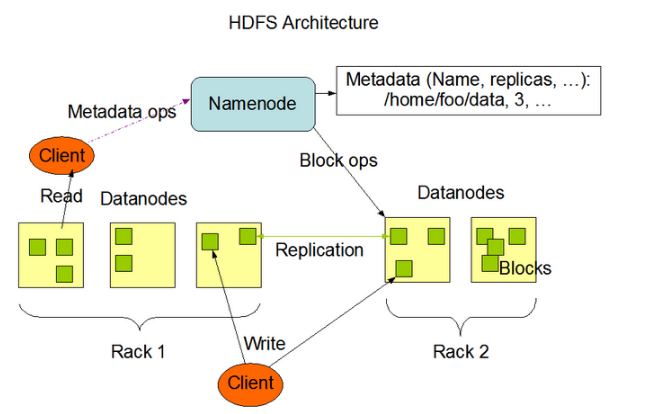

### 1.2.13 namenode内存包含哪些，具体如何分配

NameNode整个内存结构大致可以分成四大部分:Namespace、BlocksMap、NetworkTopology及其它，图2为各数据结构内存逻辑分布图示.
图2 NameNode内存全景图
1)Namespace:维护整个文件系统的目录树结构及目录树上的状态变化;
2)BlockManager:维护整个文件系统中与数据块相关的信息及数据块的状态变化;
3)NetworkTopology:维护机架拓扑及DataNode信息，机架感知的基础;
4)其它:
LeaseManager:读写的互斥同步就是靠Lease实现，支持HDFS的Write-Once-Read-Many的核心数据结构;
CacheManager:Hadoop 2.3.0引入的集中式缓存新特性，支持集中式缓存的管理，实现memory-locality提升读性能;
SnapshotManager:Hadoop 2.1.0引入的Snapshot新特性，用于数据备份、回滚，以防止因用户误操作导致集群出现数据问题;
DelegationTokenSecretManager:管理HDFS的安全访问;
另外还有临时数据信息、统计信息metrics等等.
NameNode常驻内存主要被Namespace和BlockManager使用，二者使用占比分别接近50%.其它部分内存开销较小且相对固定，与Namespace和BlockManager相比基本可以忽略.
详见:<http://blog.csdn.net/guohecang/article/details/52356748>

### 1.2.14 HAnamenode 是如何工作的?- (☆☆☆☆☆)

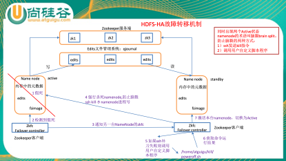
ZKFailoverController主要职责
1)健康监测:周期性的向它监控的NN发送健康探测命令，从而来确定某个NameNode是否处于健康状态，如果机器宕机，心跳失败，那么zkfc就会标记它处于一个不健康的状态.
2)会话管理:如果NN是健康的，zkfc就会在zookeeper中保持一个打开的会话，如果NameNode同时还是Active状态的，那么zkfc还会在Zookeeper中占有一个类型为短暂类型的znode，当这个NN挂掉时，这个znode将会被删除，然后备用的NN，将会得到这把锁，升级为主NN，同时标记状态为Active.
3)当宕机的NN新启动时，它会再次注册zookeper，发现已经有znode锁了，便会自动变为Standby状态，如此往复循环，保证高可靠，需要注意，目前仅仅支持最多配置2个NN.
4)master选举:如上所述，通过在zookeeper中维持一个短暂类型的znode，来实现抢占式的锁机制，从而判断那个NameNode为Active状态

### 1.2.15 namenode ha高可用源码实现方式

  1)HealthMonitor初始化完成后通过内部线程调用NameNode的RPC接口对其进行健康检查
  2)如果检查到NameNode状态异常,会回调ZKFailoverContorller注册的回调函数进行相应的处理
  3)如果ZKFailoverController发现集群需要进行主备选举，会使用ActiveStanbyElector和zookeeper集群通信完成主备切换
  4)ActiveStanbyElector在完成主备切换后，回调ZKFailoverController注册的方法使NameNode变成active或者stanby状态

### 1.2.16 hadoop2.x Federation

单Active NN的架构使得HDFS在集群扩展性和性能上都有潜在的问题，当集群大到一定程度后，NN进程使用的内存可能会达到上百G，NN成为了性能的瓶颈
常用的估算公式为1G对应1百万个块，按缺省块大小计算的话，大概是64T (这个估算比例是有比较大的富裕的，其实，即使是每个文件只有一个块，所有元数据信息也不会有1KB/block)为了解决这个问题,Hadoop 2.x提供了HDFS Federation, 示意图如下:
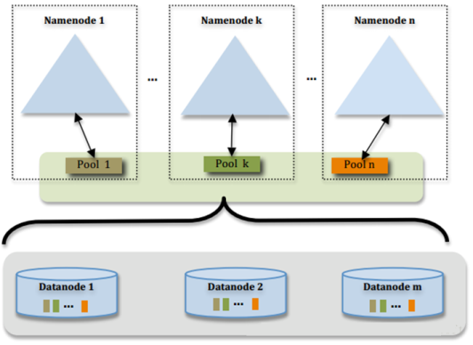
多个NN共用一个集群里的存储资源，每个NN都可以单独对外提供服务每个NN都会定义一个存储池，有单独的id，每个DN都为所有存储池提供存储.
DN会按照存储池id向其对应的NN汇报块信息，同时，DN会向所有NN汇报本地存储可用资源情况.
如果需要在客户端方便的访问若干个NN上的资源，可以使用客户端挂载表，把不同的目录映射到不同的NN，但NN上必须存在相应的目录.

### 1.2.17 HDFS Federation的原理结构

HDFS Federation意味着在集群中将会有多个namenode/namespace,这样的方式有什么好处呢?-
多namespace的方式可以直接减轻单一NameNode的压力.
一个典型的例子就是上面提到的NameNode内存过高问题,我们完全可以将上面部分大的文件目录移到另外一个NameNode上做管理.更重要的一点在于，这些NameNode是共享集群中所有的DataNode的，它们还是在同一个集群内的.HDFS Federation原理结构图如下:

我们可以拿这种图与上一小节的图做对比，我们可以得出这样一个结论:
HDFS Federation是解决NameNode单点问题的水平横向扩展方案.
这时候在DataNode上就不仅仅存储一个Block Pool下的数据了，而是多个(大家可以在DataNode的datadir所在目录里面查看BP-xx.xx.xx.xx打头的目录).
在HDFS Federation的情况下，只有元数据的管理与存放被分隔开了，但真实数据的存储还是共用的，这与viewFs还是不一样的.之前看别的文章在讲述HDFS Federation的时候直接拿viewFs来讲，个人觉得二者还是有些许的不同的，用一句话概况应该这么说.
HDFS的viewFs是namespace完全独立(私人化)的Federation方案，可以这么说，viewFs是Federation的一个简单实现方案.
因为它们不仅仅是namespace独立，而且真实数据的存放也是独立的,也就是多个完全独立的集群.在这点上我们还是有必要做一下区分，否则让人以为HDFS Federation就是viewFs.

### 1.2.18 HDFS Federation方案的优势

第一点,命名空间的扩展.因为随着集群使用时间的加长，HDFS上存放的数据也将会越来越多.这个时候如果还是将所有的数据都往一个NameNode上存放,这个文件系统会显得非常的庞大.这时候我们可以进行横向扩展，把一些大的目录分离出去.使得每个NameNode下的数据看起来更加的精简.
第二点,性能的提升.这个也很好理解.当NameNode所持有的数据量达到了一个非常大规模的量级的时候(比如超过1亿个文件)，这个时候NameNode的处理效率可能就会有影响，它可能比较容易的会陷入一个繁忙的状态.而整个集群将会受限于一个单点NameNode的处理效率,从而影响集群整体的吞吐量.这个时候多NameNode机制显然可以减轻很多这部分的压力.
第三点,资源的隔离.这一点考虑的就比较深了.通过多个命名空间，我们可以将关键数据文件目录移到不同的NameNode上，以此不让这些关键数据的读写操作受到其他普通文件读写操作的影响.也就是说这些NameNode将会只处理特定的关键的任务所发来的请求，而屏蔽了其他普通任务的文件读写请求，以此做到了资源的隔离.千万不要小看这一点，当你发现NameNode正在处理某个不良任务的大规模的请求操作导致响应速度极慢时，你一定会非常的懊恼.

### 1.2.19 hadoop的块大小，从哪个版本开始是128M

Hadoop1.x都是64M，hadoop2.x开始都是128M.

## 1.3 MapReduce(☆☆☆☆☆)

### 1.3.1 谈谈Hadoop序列化和反序列化及自定义bean对象实现序列化?-

1)序列化和反序列化
序列化就是把内存中的对象，转换成字节序列(或其他数据传输协议)以便于存储(持久化)和网络传输.
反序列化就是将收到字节序列(或其他数据传输协议)或者是硬盘的持久化数据，转换成内存中的对象.
Java的序列化是一个重量级序列化框架(Serializable)，一个对象被序列化后，会附带很多额外的信息(各种校验信息，header，继承体系等)，不便于在网络中高效传输.所以，hadoop自己开发了一套序列化机制(Writable)，精简、高效.
2)自定义bean对象要想序列化传输步骤及注意事项:.
(1)必须实现Writable接口
(2)反序列化时，需要反射调用空参构造函数，所以必须有空参构造
(3)重写序列化方法
(4)重写反序列化方法
(5)注意反序列化的顺序和序列化的顺序完全一致
(6)要想把结果显示在文件中，需要重写toString()，且用”\t”分开，方便后续用
(7)如果需要将自定义的bean放在key中传输，则还需要实现comparable接口，因为mapreduce框中的shuffle过程一定会对key进行排序

### 1.3.2 在Hadoop中定义的InputFormat中，默认是哪一个​?- A

A.TextInputFormat        B.KeyValueInputFormat        C.SequenceFileInputFormat

### 1.3.3 两个类TextInputFormat和KeyValueInputFormat的区别是什么​?-

1)相同点:
TextInputformat和KeyValueTextInputFormat都继承了FileInputFormat类，都是每一行作为一个记录;
2)区别:
TextInputformat将每一行在文件中的起始偏移量作为 key，每一行的内容作为value.默认以\n或回车键作为一行记录.
KeyValueTextInputFormat 适合处理输入数据的每一行是两列，并用 tab 分离的形式.

### 1.3.4 FileInputFormat切片机制(☆☆☆☆☆)

1)job提交流程源码详解
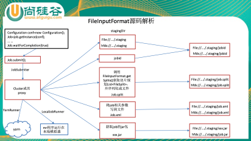

### 1.3.5 在一个运行的Hadoop 任务中，什么是InputSplit​?-(☆☆☆☆☆)

FileInputFormat源码解析(input.getSplits(job))
(1)找到你数据存储的目录.
(2)开始遍历处理(规划切片)目录下的每一个文件
(3)遍历第一个文件ss.txt
a)获取文件大小fs.sizeOf(ss.txt);
b)计算切片大小computeSliteSize(Math.max(minSize,Math.min(maxSize,blocksize)))=blocksize=128M
c)默认情况下，切片大小=blocksize
d)开始切，形成第1个切片:ss.txt—0:128M 第2个切片ss.txt—128:256M 第3个切片ss.txt—256M:300M(每次切片时，都要判断切完剩下的部分是否大于块的1.1倍，不大于1.1倍就划分一块切片)
e)将切片信息写到一个切片规划文件中
f)整个切片的核心过程在getSplit()方法中完成.
g)数据切片只是在逻辑上对输入数据进行分片，并不会再磁盘上将其切分成分片进行存储.InputSplit只记录了分片的元数据信息，比如起始位置、长度以及所在的节点列表等.
h)注意:block是HDFS上物理上存储的存储的数据，切片是对数据逻辑上的划分.
(4)提交切片规划文件到yarn上，yarn上的MrAppMaster就可以根据切片规划文件计算开启maptask个数.

### 1.3.6 自定义InputFormat流程

(1)自定义一个类继承FileInputFormat
(2)改写RecordReader，实现一次读取一个完整文件封装为KV

### 1.3.7 如何决定一个job的map和reduce的数量?-

1)map数量
splitSize=max{minSize,min{maxSize,blockSize}}
map数量由处理的数据分成的block数量决定default_num = total_size / split_size;
2)reduce数量
reduce的数量job.setNumReduceTasks(x);x 为reduce的数量.不设置的话默认为 1.

### 1.3.8 Maptask的个数由什么决定​?-

一个job的map阶段MapTask并行度(个数)，由客户端提交job时的切片个数决定.

### 1.3.9 MapTask工作机制(☆☆☆☆☆)

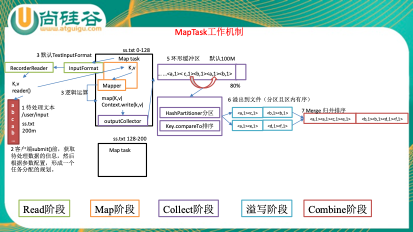
(1)Read阶段:Map Task通过用户编写的RecordReader，从输入InputSplit中解析出一个个key/value.
(2)Map阶段:该节点主要是将解析出的key/value交给用户编写map()函数处理，并产生一系列新的key/value.
(3)Collect收集阶段:在用户编写map()函数中，当数据处理完成后，一般会调用OutputCollector.collect()输出结果.在该函数内部，它会将生成的key/value分区(调用Partitioner)，并写入一个环形内存缓冲区中.
(4)Spill阶段:即“溢写”，当环形缓冲区满后，MapReduce会将数据写到本地磁盘上，生成一个临时文件.需要注意的是，将数据写入本地磁盘之前，先要对数据进行一次本地排序，并在必要时对数据进行合并、压缩等操作.
 溢写阶段详情:
 步骤1:利用快速排序算法对缓存区内的数据进行排序，排序方式是，先按照分区编号partition进行排序，然后按照key进行排序.这样，经过排序后，数据以分区为单位聚集在一起，且同一分区内所有数据按照key有序.
 步骤2:按照分区编号由小到大依次将每个分区中的数据写入任务工作目录下的临时文件output/spillN.out(N表示当前溢写次数)中.如果用户设置了Combiner，则写入文件之前，对每个分区中的数据进行一次聚集操作.
 步骤3:将分区数据的元信息写到内存索引数据结构SpillRecord中，其中每个分区的元信息包括在临时文件中的偏移量、压缩前数据大小和压缩后数据大小.如果当前内存索引大小超过1MB，则将内存索引写到文件output/spillN.out.index中.
(5)Combine阶段:当所有数据处理完成后，MapTask对所有临时文件进行一次合并，以确保最终只会生成一个数据文件.
 当所有数据处理完后，MapTask会将所有临时文件合并成一个大文件，并保存到文件output/file.out中，同时生成相应的索引文件output/file.out.index.
 在进行文件合并过程中，MapTask以分区为单位进行合并.对于某个分区，它将采用多轮递归合并的方式.每轮合并io.sort.factor(默认100)个文件，并将产生的文件重新加入待合并列表中，对文件排序后，重复以上过程，直到最终得到一个大文件.
 让每个MapTask最终只生成一个数据文件，可避免同时打开大量文件和同时读取大量小文件产生的随机读取带来的开销.

### 1.3.10 ReduceTask工作机制(☆☆☆☆☆)

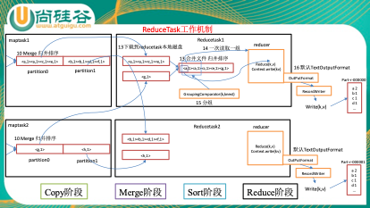
(1)Copy阶段:ReduceTask从各个MapTask上远程拷贝一片数据，并针对某一片数据，如果其大小超过一定阈值，则写到磁盘上，否则直接放到内存中.
(2)Merge阶段:在远程拷贝数据的同时，ReduceTask启动了两个后台线程对内存和磁盘上的文件进行合并，以防止内存使用过多或磁盘上文件过多.
(3)Sort阶段:按照MapReduce语义，用户编写reduce()函数输入数据是按key进行聚集的一组数据.为了将key相同的数据聚在一起，Hadoop采用了基于排序的策略.由于各个MapTask已经实现对自己的处理结果进行了局部排序，因此，ReduceTask只需对所有数据进行一次归并排序即可.
(4)Reduce阶段:reduce()函数将计算结果写到HDFS上.

### 1.3.11 请描述mapReduce有几种排序及排序发生的阶段(☆☆☆☆☆)

1)排序的分类:
(1)部分排序:
MapReduce根据输入记录的键对数据集排序.保证输出的每个文件内部排序.
(2)全排序:
如何用Hadoop产生一个全局排序的文件​?-最简单的方法是使用一个分区.但该方法在处理大型文件时效率极低，因为一台机器必须处理所有输出文件，从而完全丧失了MapReduce所提供的并行架构.
 替代方案:首先创建一系列排好序的文件;其次，串联这些文件;最后，生成一个全局排序的文件.主要思路是使用一个分区来描述输出的全局排序.例如:可以为待分析文件创建3个分区，在第一分区中，记录的单词首字母a-g，第二分区记录单词首字母h-n, 第三分区记录单词首字母o-z.
(3)辅助排序:(GroupingComparator分组)
 Mapreduce框架在记录到达reducer之前按键对记录排序，但键所对应的值并没有被排序.甚至在不同的执行轮次中，这些值的排序也不固定，因为它们来自不同的map任务且这些map任务在不同轮次中完成时间各不相同.一般来说，大多数MapReduce程序会避免让reduce函数依赖于值的排序.但是，有时也需要通过特定的方法对键进行排序和分组等以实现对值的排序.
(4)二次排序:
 在自定义排序过程中，如果compareTo中的判断条件为两个即为二次排序.
2)自定义排序WritableComparable
bean对象实现WritableComparable接口重写compareTo方法，就可以实现排序
3)排序发生的阶段:
(1)一个是在map side发生在spill后partition前.
(2)一个是在reduce side发生在copy后 reduce前.

### 1.3.12 请描述mapReduce中shuffle阶段的工作流程，如何优化shuffle阶段(☆☆☆☆☆)

分区，排序，溢写，拷贝到对应reduce机器上，增加combiner，压缩溢写的文件.

### 1.3.13 请描述mapReduce中combiner的作用是什么，一般使用情景，哪些情况不需要，及和reduce的区别​?-

1)Combiner的意义就是对每一个maptask的输出进行局部汇总，以减小网络传输量.
2)Combiner能够应用的前提是不能影响最终的业务逻辑，而且，Combiner的输出kv应该跟reducer的输入kv类型要对应起来.
3)Combiner和reducer的区别在于运行的位置.
Combiner是在每一个maptask所在的节点运行;
Reducer是接收全局所有Mapper的输出结果.

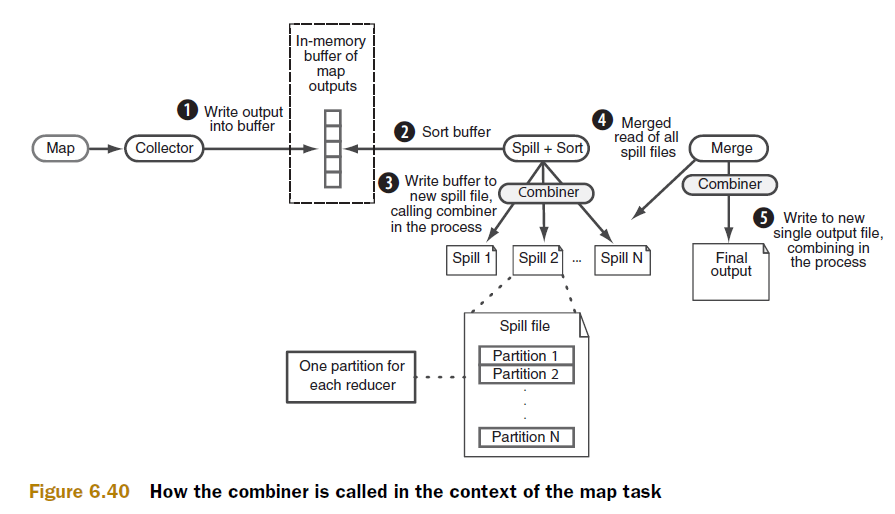

### 1.3.14 Mapreduce的工作原理，请举例子说明mapreduce是怎么运行的​?-(☆☆☆☆☆)

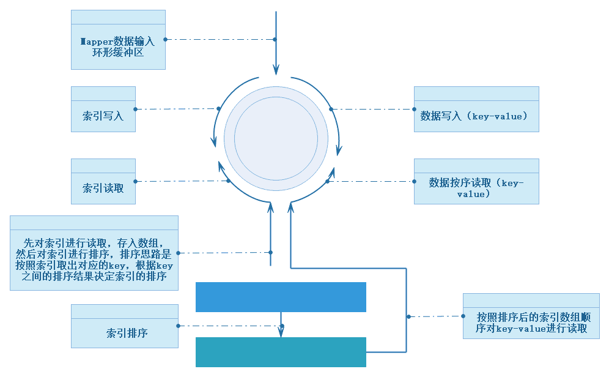
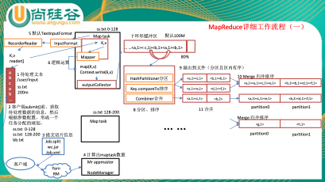
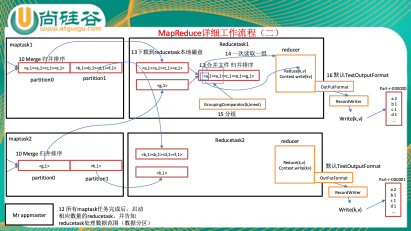

### 1.3.15 如果没有定义partitioner，那数据在被送达reducer前是如何被分区的​?-

如果没有自定义的 partitioning，则默认的 partition 算法，即根据每一条数据的 key
的 hashcode 值摸运算(%)reduce 的数量，得到的数字就是“分区号“.

### 1.3.16 MapReduce 出现单点负载多大，怎么负载平衡​?- (☆☆☆☆☆)

可以用 Partitioner

### 1.3.17 MapReduce 怎么实现 TopN​?- (☆☆☆☆☆)

可以自定义groupingcomparator，对结果进行最大值排序，然后再reduce输出时，控制只输出前n个数.就达到了topn输出的目的.

### 1.3.18 Hadoop的缓存机制(Distributedcache)(☆☆☆☆☆)

分布式缓存一个最重要的应用就是在进行join操作的时候，如果一个表很大，另一个表很小，我们就可以将这个小表进行广播处理，即每个计算节点上都存一份，然后进行map端的连接操作，经过我的实验验证，这种情况下处理效率大大高于一般的reduce端join，广播处理就运用到了分布式缓存的技术.
DistributedCache将拷贝缓存的文件到Slave节点在任何Job在节点上执行之前，文件在每个Job中只会被拷贝一次，缓存的归档文件会被在Slave节点中解压缩.将本地文件复制到HDFS中去，接着Client会通过addCacheFile() 和addCacheArchive()方法告诉DistributedCache在HDFS中的位置.当文件存放到文地时，JobClient同样获得DistributedCache来创建符号链接，其形式为文件的URI加fragment标识.当用户需要获得缓存中所有有效文件的列表时，JobConf 的方法 getLocalCacheFiles() 和getLocalArchives()都返回一个指向本地文件路径对象数组.

### 1.3.19 如何使用mapReduce实现两个表的join?-(☆☆☆☆☆)

1)reduce side join : 在map阶段，map函数同时读取两个文件File1和File2，为了区分两种来源的key/value数据对，对每条数据打一个标签(tag),比如:tag=0 表示来自文件File1，tag=2 表示来自文件File2.
2)map side join : Map side join 是针对以下场景进行的优化:两个待连接表中，有一个表非常大，而另一个表非常小，以至于小表可以直接存放到内存中.这样，我们可以将小表复制多份，让每个map task 内存中存在一份(比如存放到hash table 中)，然后只扫描大表:对于大表中的每一条记录key/value，在hash table 中查找是否有相同的key 的记录，如果有，则连接后输出即可.

### 1.3.20 有可能使 Hadoop 任务输出到多个目录中么​?-如果可以，怎么做​?-

1)可以输出到多个目录中，采用自定义OutputFormat.
2)实现步骤:
(1)自定义outputformat，
(2)改写recordwriter，具体改写输出数据的方法write()

### 1.3.21 什么样的计算不能用mr来提速，举5个例子

1)数据量很小.
2)繁杂的小文件.
3)索引是更好的存取机制的时候.
4)事务处理.
5)只有一台机器的时候.

### 1.3.22 ETL是哪三个单词的缩写

Extraction-Transformation-Loading的缩写，中文名称为数据提取、转换和加载.

### 1.3.23 MapReduce实操

给你一个1G的数据文件.     分别有id,name,mark,source四个字段，按照mark分组，id排序，手写一个MapReduce?-其中有几个Mapper?-
1)MapReduce实现
(1)在map端对id进行排序
(2)在reduce端对mark进行分组
2)几个mapper
(1)1024m/128m=8块

## 1.4 yarn及源码框架(☆☆☆☆)

### 1.4.1 简述hadoop1与hadoop2 的架构异同

加入了yarn解决了资源调度的问题.
加入了对zookeeper的支持实现比较可靠的高可用.

### 1.4.2 为什么会产生 yarn,它解决了什么问题，有什么优势​?-

Yarn最主要的功能就是解决运行的用户程序与yarn框架完全解耦.
Yarn上可以运行各种类型的分布式运算程序(mapreduce只是其中的一种)，比如mapreduce、storm程序，spark程序……

### 1.4.3 MR作用提交全过程(☆☆☆☆☆)

1)作业提交过程之YARN
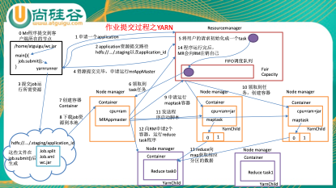
2)作业提交过程之MapReduce
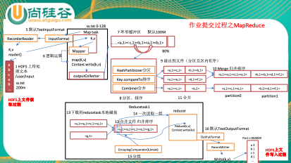
3)作业提交过程之读数据
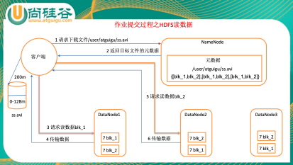
4)作业提交过程之写数据
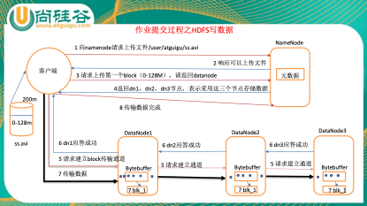

### 1.4.4 HDFS的数据压缩算法?- (☆☆☆☆☆)

Hadoop中常用的压缩算法有bzip2、gzip、lzo、snappy，其中lzo、snappy需要操作系统安装native库才可以支持.
数据可以压缩的位置如下所示.
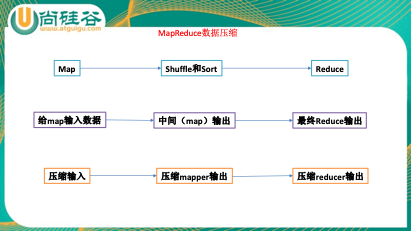
企业开发用的比较多的是snappy.

### 1.4.5 Hadoop的调度器总结(☆☆☆☆☆)

(1)默认的调度器FIFO
Hadoop中默认的调度器，它先按照作业的优先级高低，再按照到达时间的先后选择被执行的作业.
(2)计算能力调度器Capacity Scheduler
支持多个队列，每个队列可配置一定的资源量，每个队列采用FIFO调度策略，为了防止同一个用户的作业独占队列中的资源，该调度器会对同一用户提交的作业所占资源量进行限定.调度时，首先按以下策略选择一个合适队列:计算每个队列中正在运行的任务数与其应该分得的计算资源之间的比值，选择一个该比值最小的队列;然后按以下策略选择该队列中一个作业:按照作业优先级和提交时间顺序选择，同时考虑用户资源量限制和内存限制.
(3)公平调度器Fair Scheduler
同计算能力调度器类似，支持多队列多用户，每个队列中的资源量可以配置，同一队列中的作业公平共享队列中所有资源，具体算法参见我的博文《[Hadoop公平调度器算法解析](http://dongxicheng.org/mapreduce/hadoop-fair-scheduler/)》
实际上，Hadoop的调度器远不止以上三种，最近，出现了很多针对新型应用的Hadoop调度器.
(4)适用于异构集群的调度器LATE
现有的Hadoop调度器都是建立在同构集群的假设前提下，具体假设如下:
1)集群中各个节点的性能完全一样
2)对于reduce task，它的三个阶段:copy、sort和reduce，用时各占1/3
3)同一job的同类型的task是一批一批完成的，他们用时基本一样.
现有的Hadoop调度器存在较大缺陷，主要体现在探测落后任务的算法上:如果一个task的进度落后于同类型task进度的20%，则把该task当做落后任务(这种任务决定了job的完成时间，需尽量缩短它的执行时间)，从而为它启动一个备份任务(speculative task).如果集群异构的，对于同一个task，即使是在相同节点上的执行时间也会有较大差别，因而在异构集群中很容易产生大量的备份任务.
LATE(Longest Approximate Time to End，参考资料[4])调度器从某种程度上解决了现有调度器的问题，它定义三个阈值:SpeculativeCap，系统中最大同时执行的speculative task数目(作者推荐值为总slot数的10%); SlowNodeThreshold(作者推荐值为25%):得分(分数计算方法见论文)低于该阈值的node(快节点)上不会启动speculative task;SlowTaskThreshold(作者推荐值为25%):当task进度低于同批同类task的平均进度的SlowTaskThreshold时，会为该task启动speculative task.它的调度策略是:当一个节点出现空闲资源且系统中总的备份任务数小于SpeculativeCap时，
(1)如果该节点是慢节点(节点得分高于SlowNodeThreshold)，则忽略这个请求.
(2)对当前正在运行的task按估算的剩余完成时间排序
(3)选择剩余完成时间最大且进度低于SlowTaskThreshold的task，为该task启动备份任务.
(5)适用于实时作业的调度器Deadline Scheduler和Constraint-based Scheduler
这种调度器主要用于有时间限制的作业(Deadline Job)，即给作业一个deadline时间，让它在该时间内完成.实际上，这类调度器分为两种，软实时(允许作业有一定的超时)作业调度器和硬实时(作业必须严格按时完成)作业调度器.
Deadline Scheduler(参考资料[5])主要针对的是软实时作业，该调度器根据作业的运行进度和剩余时间动态调整作业获得的资源量，以便作业尽可能的在deadline时间内完成.
Constraint-based Scheduler(参考资料[6])主要针对的是硬实时作业，该调度器根据作业的deadline和当前系统中的实时作业运行情况，预测新提交的实时作业能不能在deadline时间内完成，如果不能，则将作业反馈给用户，让他重调整作业的deadline.

### 1.4.6 MapReduce 2.0 容错性(☆☆☆☆☆)

1)MRAppMaster容错性
一旦运行失败，由YARN的ResourceManager负责重新启动，最多重启次数可由用户设置，默认是2次.一旦超过最高重启次数，则作业运行失败.
2)Map Task/Reduce Task
Task周期性向MRAppMaster汇报心跳;一旦Task 挂掉，则MRAppMaster将为之重新申请资源，并运行之.最多重新运行次数可由用户设置，默认4 次.

### 1.4.7 mapreduce推测执行算法及原理(☆☆☆☆☆)

1)作业完成时间取决于最慢的任务完成时间
一个作业由若干个Map 任务和Reduce 任务构成.因硬件老化、软件Bug 等，某些任务可能运行非常慢.
典型案例:系统中有99%的Map任务都完成了，只有少数几个Map老是进度很慢，完不成，怎么办​?-
2)推测执行机制:
发现拖后腿的任务，比如某个任务运行速度远慢于任务平均速度.为拖后腿任务启动一个备份任务，同时运行.谁先运行完，则采用谁的结果
3)不能启用推测执行机制情况
   (1)任务间存在严重的负载倾斜;
   (2)特殊任务，比如任务向数据库中写数据.
4)算法原理:
 假设某一时刻，任务T的执行进度为progress，则可通过一定的算法推测出该任务的最终完成时刻estimateEndTime.另一方面，如果此刻为该任务启动一个备份任务，则可推断出它可能的完成时刻estimateEndTime`,于是可得出以下几个公式:
 estimateEndTime=estimatedRunTime+taskStartTime
 estimatedRunTime=(currentTimestamp-taskStartTime)/progress
 estimateEndTime`= currentTimestamp+averageRunTime
 其中，currentTimestamp为当前时刻;taskStartTime为该任务的启动时刻;averageRunTime为已经成功运行完成的任务的平均运行时间.这样，MRv2总是选择(estimateEndTime- estimateEndTime·)差值最大的任务，并为之启动备份任务.为了防止大量任务同时启动备份任务造成的资源浪费，MRv2为每个作业设置了同时启动的备份任务数目上限.
 推测执行机制实际上采用了经典的算法优化方法:以空间换时间，它同时启动多个相同任务处理相同的数据，并让这些任务竞争以缩短数据处理时间.显然，这种方法需要占用更多的计算资源.在集群资源紧缺的情况下，应合理使用该机制，争取在多用少量资源的情况下，减少作业的计算时间.

### 1.4.8 Hadoop升级 Hadoop 源代码 mapreduce的map output的实现(☆☆☆☆☆)

<http://blog.csdn.net/lw305080/article/details/56479170>

### 1.4.9 hadoop相关源码，遇到的问题描述(☆☆☆☆☆)

### 1.4.10 hadoop安全，及资源管理方案介绍(☆☆☆☆☆)

### 1.4.11 介绍yarn调度器如何分配作业，源代码层面分析(☆☆☆☆☆)

### 1.4.12 mesos和yarn资源管理器对比，及使用场景(☆☆☆☆☆)

## 1.5 优化(☆☆☆☆☆)

### 1.5.1 mapreduce 跑的慢的原因(☆☆☆☆☆)

Mapreduce 程序效率的瓶颈在于两点:
1)计算机性能
 CPU、内存、磁盘健康、网络
2)I/O 操作优化
(1)数据倾斜
(2)map和reduce数设置不合理
(3)reduce等待过久
(4)小文件过多
(5)大量的不可分块的超大文件
(6)spill次数过多
(7)merge次数过多等.

### 1.5.2 mapreduce 优化方法(☆☆☆☆☆)

1)数据输入:
(1)合并小文件:在执行mr任务前将小文件进行合并，大量的小文件会产生大量的map任务，增大map任务装载次数，而任务的装载比较耗时，从而导致 mr 运行较慢.
(2)采用ConbinFileInputFormat来作为输入，解决输入端大量小文件场景.
2)map阶段
(1)减少spill次数:通过调整io.sort.mb及sort.spill.percent参数值，增大触发spill的内存上限，减少spill次数，从而减少磁盘 IO.
(2)减少merge次数:通过调整io.sort.factor参数，增大merge的文件数目，减少merge的次数，从而缩短mr处理时间.
(3)在 map 之后先进行combine处理，减少 I/O.
3)reduce阶段
(1)合理设置map和reduce数:两个都不能设置太少，也不能设置太多.太少，会导致task等待，延长处理时间;太多，会导致 map、reduce任务间竞争资源，造成处理超时等错误.
(2)设置map、reduce共存:调整slowstart.completedmaps参数，使map运行到一定程度后，reduce也开始运行，减少reduce的等待时间.
(3)规避使用reduce，因为Reduce在用于连接数据集的时候将会产生大量的网络消耗.
(4)合理设置reduc端的buffer，默认情况下，数据达到一个阈值的时候，buffer中的数据就会写入磁盘，然后reduce会从磁盘中获得所有的数据.也就是说，buffer和reduce是没有直接关联的，中间多个一个写磁盘->读磁盘的过程，既然有这个弊端，那么就可以通过参数来配置，使得buffer中的一部分数据可以直接输送到reduce，从而减少IO开销:mapred.job.reduce.input.buffer.percent，默认为0.0.当值大于0的时候，会保留指定比例的内存读buffer中的数据直接拿给reduce使用.这样一来，设置buffer需要内存，读取数据需要内存，reduce计算也要内存，所以要根据作业的运行情况进行调整.
4)IO传输
(1)采用数据压缩的方式，减少网络IO的的时间.安装Snappy和LZOP压缩编码器.
(2)使用SequenceFile二进制文件
5)数据倾斜问题
(1)数据倾斜现象
数据频率倾斜——某一个区域的数据量要远远大于其他区域.
数据大小倾斜——部分记录的大小远远大于平均值.
(2)如何收集倾斜数据
在reduce方法中加入记录map输出键的详细情况的功能.
(3)减少数据倾斜的方法
方法1:抽样和范围分区
可以通过对原始数据进行抽样得到的结果集来预设分区边界值.
方法2:自定义分区
另一个抽样和范围分区的替代方案是基于输出键的背景知识进行自定义分区.例如，如果map输出键的单词来源于一本书.其中大部分必然是省略词(stopword).那么就可以将自定义分区将这部分省略词发送给固定的一部分reduce实例.而将其他的都发送给剩余的reduce实例.
方法3:Combine
使用Combine可以大量地减小数据频率倾斜和数据大小倾斜.在可能的情况下，combine的目的就是聚合并精简数据.
6)常用的调优参数
(1)资源相关参数
(a)以下参数是在用户自己的mr应用程序中配置就可以生效(mapred-default.xml)

| 配置参数                                      | 参数说明                                                     |
| ----------------------- | ------------------------------ |
| mapreduce.map.memory.mb                       | 一个Map Task可使用的资源上限(单位:MB)，默认为1024.如果Map Task实际使用的资源量超过该值，则会被强制杀死. |
| mapreduce.reduce.memory.mb                    | 一个Reduce   Task可使用的资源上限(单位:MB)，默认为1024.如果Reduce Task实际使用的资源量超过该值，则会被强制杀死. |
| mapreduce.map.cpu.vcores                      | 每个Map task可使用的最多cpu core数目，默认值: 1              |
| mapreduce.reduce.cpu.vcores                   | 每个Reduce task可使用的最多cpu core数目，默认值: 1           |
| mapreduce.reduce.shuffle.parallelcopies       | 每个reduce去map中拿数据的并行数.默认值是5                   |
| mapreduce.reduce.shuffle.merge.percent        | buffer中的数据达到多少比例开始写入磁盘.默认值0.66           |
| mapreduce.reduce.shuffle.input.buffer.percent | buffer大小占reduce可用内存的比例.默认值0.7                  |
| mapreduce.reduce.input.buffer.percent         | 指定多少比例的内存用来存放buffer中的数据，默认值是0.0        |

(b)应该在yarn启动之前就配置在服务器的配置文件中才能生效(yarn-default.xml)

| 配置参数                                     | 参数说明                          |
| ---------------------- | ----------------- |
| yarn.scheduler.minimum-allocation-mb   1024  | 给应用程序container分配的最小内存 |
| yarn.scheduler.maximum-allocation-mb   8192  | 给应用程序container分配的最大内存 |
| yarn.scheduler.minimum-allocation-vcores   1 | 每个container申请的最小CPU核数    |
| yarn.scheduler.maximum-allocation-vcores  32 | 每个container申请的最大CPU核数    |
| yarn.nodemanager.resource.memory-mb   8192   | 给containers分配的最大物理内存    |

(c)shuffle性能优化的关键参数，应在yarn启动之前就配置好(mapred-default.xml)

| 配置参数                               | 参数说明                          |
| ------------------- | ----------------- |
| mapreduce.task.io.sort.mb   100        | shuffle的环形缓冲区大小，默认100m |
| mapreduce.map.sort.spill.percent   0.8 | 环形缓冲区溢出的阈值，默认80%     |

(2)容错相关参数(mapreduce性能优化)

| 配置参数                     | 参数说明                                                     |
| -------------- | ------------------------------ |
| mapreduce.map.maxattempts    | 每个Map Task最大重试次数，一旦重试参数超过该值，则认为Map Task运行失败，默认值:4. |
| mapreduce.reduce.maxattempts | 每个Reduce   Task最大重试次数，一旦重试参数超过该值，则认为Map Task运行失败，默认值:4. |
| mapreduce.task.timeout       | Task超时时间，经常需要设置的一个参数，该参数表达的意思为:如果一个task在一定时间内没有任何进入，即不会读取新的数据，也没有输出数据，则认为该task处于block状态，可能是卡住了，也许永远会卡主，为了防止因为用户程序永远block住不退出，则强制设置了一个该超时时间(单位毫秒)，默认是600000.如果你的程序对每条输入数据的处理时间过长(比如会访问数据库，通过网络拉取数据等)，建议将该参数调大，该参数过小常出现的错误提示是“AttemptID:attempt_14267829456721_123456_m_000224_0 Timed out after   300 secsContainer killed by the ApplicationMaster.”. |

### 1.5.3 HDFS小文件优化方法(☆☆☆☆☆)

1)HDFS小文件弊端:
HDFS上每个文件都要在namenode上建立一个索引，这个索引的大小约为150byte，这样当小文件比较多的时候，就会产生很多的索引文件，一方面会大量占用namenode的内存空间，另一方面就是索引文件过大是的索引速度变慢.
2)解决的方式:
(1)Hadoop本身提供了一些文件压缩的方案.
(2)从系统层面改变现有HDFS存在的问题，其实主要还是小文件的合并，然后建立比较快速的索引.
3)Hadoop自带小文件解决方案
(1)Hadoop Archive:
​     是一个高效地将小文件放入HDFS块中的文件存档工具，它能够将多个小文件打包成一个HAR文件，这样在减少namenode内存使用的同时.
(2)Sequence file:
​     sequence file由一系列的二进制key/value组成，如果为key小文件名，value为文件内容，则可以将大批小文件合并成一个大文件.
(3)CombineFileInputFormat:
​     CombineFileInputFormat是一种新的inputformat，用于将多个文件合并成一个单独的split，另外，它会考虑数据的存储位置.
4)小文件优化(实战经验)
对于大量小文件Job，可以开启JVM重用会减少45%运行时间.
JVM重用理解:一个map运行一个jvm，重用的话，在一个map在jvm上运行完毕后，jvm继续运行其他jvm
具体设置:mapreduce.job.jvm.numtasks值在10-20之间.

## 1.6 企业运维相关(☆☆☆☆)

### 1.6.1 Hadoop会有哪些重大故障，如何应对​?-至少给出 5个

1)namenode单点故障:通过zookeeper搭建HA高可用，可自动切换namenode.
2)ResourceManager单点故障:可通过配置YARN的HA，并在配置的namenode上手动启动ResourceManager作为Slave，在Master 故障后，Slave 会自动切换为Master.
3)reduce阶段内存溢出:是由于单个reduce任务处理的数据量过多，通过增大reducetasks数目、优化partition 规则使数据分布均匀进行解决.
4)datanode内存溢出:是由于创建的线程过多，通过调整linux的maxuserprocesses参数，增大可用线程数进行解决.
5)集群间时间不同步导致运行异常:通过配置内网时间同步服务器进行解决.

### 1.6.2 什么情况下会触发recovery过程，recover是怎么做的

当 jobtracker.restart.recover 参数值设置为 true， jobtracker 重启之时会触发recovery.
在JobTracker重启前，会在history log中记录各个作业的运行状态，这样在JobTracker关闭后，系统中所有数据目录、临时目录均会被保留，待 JobTracker 重启之后，JobTracker 自动重新提交这些作业，并只对未运行完成的 task 进行重新调度，这样可避免已经计算完的 task 重新计算.

### 1.6.3 从2.7.0升级为2.7.2，升级步骤如下

1)下载安装包后，下载native的64位包，替换新版本中的native.
2)修改2.7.2中的配置文件，保持与当前集群配置一致，修改配置文件后，分发到各台hadoop集群机器的一个临时目录中.我的配置文件列表有:core-site.xml、excludes、hadoop-env.sh、hdfs-site.xml、mapred-env.sh、mapred-site.xml、master、slaves、yarn-env.sh、yarn-site.xml
3)停掉hadoop集群.
4)登录每台hadoop节点的服务器，先备份hadoop的安装文件目录.然后进入hadoop安装目录，执行rm -rf bin etc include lib libexec LICENSE.txt NOTICE.txt README.txt sbin share
5)将临时目录中的2.7.2的hadoop文件拷贝至安装目录.
6)执行start-all.sh，启动hadoop集群，访问<http://localhost:50070/dfshealth.html#tab-overview> ，查看hadoop版本是否已更新，查看各节点状态是否正常.

### 1.6.4 如何测压hadoop集群(☆☆☆☆☆)

### 1.6.5 你认为 hadoop 有哪些设计不合理的地方

1)不支持文件的并发写入和对文件内容的随机修改.
2)不支持低延迟、高吞吐的数据访问.
3)存取大量小文件，会占用namenode大量内存，小文件的寻道时间超过读取时间.
4)hadoop环境搭建比较复杂.
5)数据无法实时处理.
6)mapreduce的shuffle 阶段IO太多.
7)编写mapreduce难度较高，实现复杂逻辑时，代码量太大.

### 1.6.6 你们公司业务数据量多大​?-有多少行数据​?-

开发时使用的是部分数据，不是全量数据，有将近一亿行(8、9 千万，具体不详，一般开发中也没人会特别关心这个问题)

### 1.6.7 一个网络商城1天大概产生多少 G 的日志​?-

4tb

### 1.6.8 大概有多少条日志记录(在不清洗的情况下)​?-

7-8 百万条

### 1.6.9 日访问量大概有多少个​?-

百万

### 1.6.10 注册数大概多少​?-

不清楚  几十万吧

### 1.6.11 假设我们有其他的日志是不是可以对这个日志有其他的业务分析​?-这些业务分析都有什么​?-

### 1.6.12 你们的集群规模(服务器多少台、CPU几个、内存多大)​?-

开发集群:10 台(8 台可用)8 核 cpu ，内存128G

### 1.6.13 问:你们的服务器怎么分布的​?-(这里说地理位置分布，最好也从机架方面也谈谈)

### 1.6.14 你们的数据是用什么导入到数据库的​?-导入到什么数据库​?-

处理之前的导入:通过 hadoop 命令导入到 hdfs 文件系统
处理完成之后的导出:利用 hive 处理完成之后的数据，通过 sqoop 导出到 mysql 数据库中，以供报表层使用.

### 1.6.15 你们处理数据是直接读数据库的数据还是读文本数据​?-

将日志数据导入到hdfs之后进行处理

### 1.6.16 你们提交的job任务大概有多少个​?-这些 job 执行完大概用多少时间​?-

500多个

### 1.6.17 问:你平常在公司都干些什么(一些建议)

### 1.6.18 你在项目中遇到了哪些难题，是怎么解决的​?-

某些任务执行时间过长，且失败率过高，检查日志后发现没有执行完就失败，原因出在hadoop 的 job 的 timeout 过短(相对于集群的能力来说)，设置长一点即可

### 1.6.19 列举你了解的海量数据的处理方法及适用范围，如果有相关使用经验，可简要说明

1)mapreduce 分布式计算 mapreduce 的思想就是分而治之;
2)倒排索引:一种索引方法，用来存储在全文搜索下某个单词在一个文档或者一组文档中的存储位置的映射，在倒排索引中单词指向了包含单词的文档.
3)消息队列:大量的数据写入首先存入消息队列进行缓冲，再把消息队列作为数据来源进行数据读取.
4)数据库读写分离:向一台数据库写入数据，另外的多台数据库从这台数据库中进行读取.

## 1.7 企业案例分析(☆☆☆☆)

### 1.7.1 海量日志数据，提取出某日访问百度次数最多的那个IP

首先是这一天，并且是访问百度的日志中的 IP 取出来，逐个写入到一个大文件中.注意到IP 是 32 位的，最多有个 2^32 个 IP.同样可以采用映射的方法， 比如模 1000，把整个大文件映射为 1000 个小文件，再找出每个小文中出现频率最大的 IP(可以采用 hash_map进行频率统计，然后再找出频率最大 的几个)及相应的频率.然后再在这 1000 个最大的IP 中，找出那个频率最大的 IP，即为所求.
或者如下阐述(雪域之鹰):
算法思想:分而治之+Hash
(1)IP 地址最多有2^32=4G种取值情况，所以不能完全加载到内存中处理;
(2)可以考虑采用“分而治之”的思想，按照IP地址的Hash(IP)%1024值，把海量IP日志分别存储到1024个小文件中.这样，每个小文件最多包含4MB个IP地址;
(3)对于每一个小文件，可以构建一个IP为 key，出现次数为value的Hash map，同时记录当前出现次数最多的那个IP地址;
(4)可以得到1024个小文件中的出现次数最多的IP，再依据常规的排序算法得到总体上出现次数最多的IP;

### 1.7.2 搜索引擎会通过日志文件把用户每次检索使用的所有检索串都记录下来，每个查询串的长度为1-255字节

​    假设目前有一千万个记录(这些查询串的重复度比较高，虽然总数是1千万，但如果除去重复后，不超过3百万个.一个查询串的重复度越高，说明查询它的用户越多，也就是越热门.)，请你统计最热门的10个查询串，要求使用的内存不能超过1G.
典型的 Top K 算法，还是在这篇文章里头有所阐述，详情请参见:十一、从头到尾彻底解析 Hash 表算法. 文中，给出的最终算法是:
第一步、先对这批海量数据预处理，在O(N)的时间内用Hash表完成统计(之前写成了排序，特此订正.July、2011.04.27);
第二步、借助堆这个数据结构，找出 Top K，时间复杂度为 N‘logK. 即，借助堆结构，我们可以在log量级的时间内查找和调整/移动.因此，维护一个K(该题目中是 10)大小的小根堆，然后遍历300万的Query，分别和根元素进行对比所以，我们最终的时间复杂度是:O(N) + N’*O(logK)，(N 为 1000 万，N’为 300 万).ok，更多，详情，请参考原文.
或者:采用 trie 树，关键字域存该查询串出现的次数，没有出现为 0.最后用 10 个元素的最小推来对出现频率进行排序.

### 1.7.3 有一个1G大小的一个文件，里面每一行是一个词，词的大小不超过16字节，内存限制大小是1M.返回频数最高的100 个词

方案:顺序读文件中，对于每个词 x，取 hash(x)%5000，然后按照该值存到 5000 个小文件(记为 x0,x1,…x4999)中.这样每个文件大概是 200k 左右.
如果其中的有的文件超过了1M 大小，还可以按照类似的方法继续往下分，直到分解得到的小文件的大小都不超过 1M.
对每个小文件，统计每个文件中出现的词以及相应的频率(可以采用 trie 树/hash_map 等)，并取出出现频率最大的100个词(可以用含100个结点的最小堆)，并把100个词及相应的频率存入文件，这样又得到了5000个文件.下一步就是把这5000个文件进行归并(类似与归并排序)的过程了.

### 1.7.4 有 10 个文件，每个文件1G，每个文件的每一行存放的都是用户的query，每个文件的query都可能重复.要求你按照query的频度排序

还是典型的 TOP K 算法，解决方案如下:
方案 1:
顺序读取10个文件，按照hash(query)%10 的结果将query写入到另外10个文件(记为)中.这样新生成的文件每个的大小大约也1G(假设hash函数是随机的).找一台内存在2G左右的机器，依次对用 hash_map(query, query_count)来统计每个query出现的次数.利用快速/堆/归并排序按照出现次数进行排序.将排序好的query和对应的query_cout输出到文件中.这样得到了10个排好序的文件(记为).对这10个文件进行归并排序(内排序与外排序相结合).
方案 2:
一般query的总量是有限的，只是重复的次数比较多而已，可能对于所有的query，一次性就可以加入到内存了.这样，我们就可以采用trie树/hash_map等直接来统计每个query出现的次数，然后按出现次数做快速/堆/归并排序就可以了
方案 3:
与方案 1 类似，但在做完 hash，分成多个文件后，可以交给多个文件来处理，采用分布式的架构来处理(比如 MapReduce)，最后再进行合并.

### 1.7.5 给定 a、b 两个文件，各存放 50 亿个 url，每个 url 各占 64 字节，内存限制是 4G，让你找出 a、b 文件共同的 url​?-

方案 1:可以估计每个文件安的大小为 5G×64=320G，远远大于内存限制的 4G.所以不可能将其完全加载到内存中处理.考虑采取分而治之的方法.
遍历文件a，对每个url求取 hash(url)%1000，然后根据所取得的值将url分别存储到 1000个小文件(记为 a0,a1,…,a999)中.这样每个小文件的大约为300M.遍历文件b，采取和a相同的方式将url分别存储到1000小文件(记为b0,b1,…,b999).
这样处理后，所有可能相同的url都在对应的小文件(a0vsb0,a1vsb1,…,a999vsb999)中，不对应的小文件不可能有相同的url.然后我们只要求出 1000 对小文件中相同的 url即可.
求每对小文件中相同的url时，可以把其中一个小文件的url存储到hash_set中.然后遍历另一个小文件的每个url，看其是否在刚才构建的hash_set中，如果是，那么就是共同的url，存到文件里面就可以了.
方案2:如果允许有一定的错误率，可以使用Bloom filter，4G内存大概可以表示340亿bit.将其中一个文件中的url使用Bloom filter映射为这340亿 bit，然后挨个读取另外一个文件的url，检查是否与 Bloom filter，如果是，那么该 url 应该是共同的 url(注意会有一定的错误率).
Bloom filter 日后会在本 BLOG 内详细阐述.

### 1.7.6 在 2.5 亿个整数中找出不重复的整数，注，内存不足以容纳这 2.5 亿个整数

方案 1:采用2-Bitmap(每个数分配 2bit，00 表示不存在，01 表示出现一次，10 表示多次，11 无意义)进行，共需内存 2^32 * 2 bit=1 GB 内存，还可以接受.然后扫描这2.5亿个整数，查看Bitmap中相对应位，如果是00变01，01变10，10保持不变.所描完事后，查看bitmap，把对应位是01的整数输出即可.
方案 2:也可采用与第 1 题类似的方法，进行划分小文件的方法.然后在小文件中找出不重复的整数，并排序.然后再进行归并，注意去除重复的元素.

### 1.7.7 腾讯面试题:给40亿个不重复的 unsigned int 的整数，没排过序的，然后再给一个数，如何快速判断这个数是否在那40亿个数当中​?-

与上第 6 题类似，我的第一反应时快速排序+二分查找.以下是其它更好的方法:
方案 1:oo，申请 512M 的内存，一个 bit 位代表一个 unsigned int 值.读入 40 亿个数，设置相应的 bit 位，读入要查询的数，查看相应 bit 位是否为 1，为 1 表示存在，为 0 表示不存在.
dizengrong:
方案 2:这个问题在《编程珠玑》里有很好的描述，大家可以参考下面的思路，探讨一下:
又因为 2^32 为 40 亿多，所以给定一个数可能在，也可能不在其中;
这里我们把 40 亿个数中的每一个用 32 位的二进制来表示，假设这 40 亿个数开始放在一个文件中.
然后将这 40 亿个数分成两类: 1.最高位为0;2.最高位为1.
并将这两类分别写入到两个文件中，其中一个文件中数的个数<=20 亿，而另一个>=20 亿(这相当于折半了);
与要查找的数的最高位比较并接着进入相应的文件再查找，再然后把这个文件为又分成两类:
1.次最高位为 0
2.次最高位为 1
并将这两类分别写入到两个文件中，其中一个文件中数的个数<=10 亿，而另一个>=10 亿
(这相当于折半了);
与要查找的数的次最高位比较并接着进入相应的文件再查找.
……
以此类推，就可以找到了,而且时间复杂度为 O(logn)，方案 2 完.
附:这里，再简单介绍下，位图方法:
使用位图法判断整形数组是否存在重复判断集合中存在重复是常见编程任务之一，当集合中数据量比较大时我们通常希望少进行几次扫描，这时双重循环法就不可取了.
位图法比较适合于这种情况，它的做法是按照集合中最大元素 max 创建一个长度为 max+1的新数组，然后再次扫描原数组，遇到几就给新数组的第几位置上 1，如遇到 5 就给新数组的第六个元素置 1，这样下次再遇到 5 想置位时发现新数组的第六个元素已经是 1 了，这说明这次的数据肯定和以前的数据存在着重复.这种给新数组初始化时置零其后置一的做法类似于位图的处理方法故称位图法.它的运算次数最坏的情况为 2N.如果已知数组的最大值即能事先给新数组定长的话效 率还能提高一倍.

### 1.7.8 怎么在海量数据中找出重复次数最多的一个​?-

方案 1:先做hash，然后求模映射为小文件，求出每个小文件中重复次数最多的一个，并记录重复次数.然后找出上一步求出的数据中重复次数最多的一个就是所求(具体参考前面的题).

### 1.7.9 上千万或上亿数据(有重复)，统计其中出现次数最多的钱 N 个数据

方案 1:上千万或上亿的数据，现在的机器的内存应该能存下.所以考虑采用hash_map/搜索二叉树/红黑树等来进行统计次数.然后就是取出前N个出现次数最多的数据了，可以用第 2 题提到的堆机制完成.

### 1.7.10 一个文本文件，大约有一万行，每行一个词，要求统计出其中最频繁出现的前10个词，请给出思想，给出时间复杂度分析

方案 1:这题是考虑时间效率.用trie树统计每个词出现的次数，时间复杂度是 O(n*le)(le表示单词的平准长度).然后是找出出现最频繁的前10个词，可以用堆来实现，前面的题中已经讲到了，时间复杂度是 O(n*lg10).所以总的时间复杂度，是O(n*le)与 O(n*lg10)中较大的哪一个.
附、100w个数中找出最大的100个数.
方案1:在前面的题中，我们已经提到了，用一个含100个元素的最小堆完成.复杂度为O(100w*lg100).
方案 2:采用快速排序的思想，每次分割之后只考虑比轴大的一部分，知道比轴大的一部分在比100多的时候，采用传统排序算法排序，取前100个.复杂度为 O(100w*100).
方案3:采用局部淘汰法.选取前100个元素，并排序，记为序列L.然后一次扫描剩余的元素x，与排好序的100个元素中最小的元素比，如果比这个最小的要大，那么把这个最小的元素删除，并把x利用插入排序的思想，插入到序列L中.依次循环，知道扫描了所有的元素.复杂度为 O(100w*100)
