# 三 Hive(☆☆☆☆☆)

## 3.1 Hive表关联查询,如何解决数据倾斜的问题?(☆☆☆☆☆)

1)倾斜原因：
map输出数据按key Hash的分配到reduce中,由于key分布不均匀、业务数据本身的特、建表时考虑不周、等原因造成的reduce 上的数据量差异过大.
(1)key分布不均匀;
(2)业务数据本身的特性;
(3)建表时考虑不周;
(4)某些SQL语句本身就有数据倾斜;
如何避免：对于key为空产生的数据倾斜,可以对其赋予一个随机值.
2)解决方案
(1)参数调节：
hive.map.aggr = true
hive.groupby.skewindata=true
有数据倾斜的时候进行负载均衡,当选项设定位true,生成的查询计划会有两个MR Job.第一个MR Job中,Map的输出结果集合会随机分布到Reduce中,每个Reduce做部分聚合操作,并输出结果,这样处理的结果是相同的Group By Key有可能被分发到不同的Reduce中,从而达到负载均衡的目的；第二个MR Job再根据预处理的数据结果按照Group By Key 分布到 Reduce 中(这个过程可以保证相同的 Group By Key 被分布到同一个Reduce中),最后完成最终的聚合操作.
(2)SQL 语句调节：
① 选用join key分布最均匀的表作为驱动表.做好列裁剪和filter操作,以达到两表做join 的时候,数据量相对变小的效果.
② 大小表Join：
使用map join让小的维度表(1000 条以下的记录条数)先进内存.在map端完成reduce.
③ 大表Join大表：
把空值的key变成一个字符串加上随机数,把倾斜的数据分到不同的reduce上,由于null 值关联不上,处理后并不影响最终结果.
④ count distinct大量相同特殊值:
count distinct 时,将值为空的情况单独处理,如果是计算count distinct,可以不用处理,直接过滤,在最后结果中加1.如果还有其他计算,需要进行group by,可以先将值为空的记录单独处理,再和其他计算结果进行union.

## 3.2 请谈一下Hive的特点,Hive和RDBMS有什么异同?-

hive是基于Hadoop的一个数据仓库工具,可以将结构化的数据文件映射为一张数据库表,并提供完整的sql查询功能,可以将sql语句转换为MapReduce任务进行运行.其优点是学习成本低,可以通过类SQL语句快速实现简单的MapReduce统计,不必开发专门的MapReduce应用,十分适合数据仓库的统计分析,但是Hive不支持实时查询.
Hive与关系型数据库的区别：


## 3.3 请说明hive中 Sort By,Order By,Cluster By,Distrbute By各代表什么意思?-

order by：会对输入做全局排序,因此只有一个reducer(多个reducer无法保证全局有序).只有一个reducer,会导致当输入规模较大时,需要较长的计算时间.
sort by：不是全局排序,其在数据进入reducer前完成排序.
distribute by：按照指定的字段对数据进行划分输出到不同的reduce中.
cluster by：除了具有 distribute by 的功能外还兼具 sort by 的功能.

## 3.4 简要描述数据库中的 null,说出null在hive底层如何存储,并解释select a.* from t1 a left outer join t2 b on a.id=b.id where b.id is null; 语句的含义?-

null与任何值运算的结果都是null, 可以使用is null、is not null函数指定在其值为null情况下的取值.
null在hive底层默认是用'\N'来存储的,可以通过alter table test SET SERDEPROPERTIES('serialization.null.format' = 'a');来修改.
查询出t1表中与t2表中id相等的所有信息.

## 3.5 写出hive中split、coalesce及collect_list函数的用法(可举例)?-

split将字符串转化为数组,即：split('a,b,c,d' , ',') ==> ["a","b","c","d"].
coalesce(T v1, T v2, …) 返回参数中的第一个非空值；如果所有值都为 NULL,那么返回NULL.
collect_list列出该字段所有的值,不去重  select collect_list(id) from table.

## 3.6 Hive有哪些方式保存元数据,各有哪些特点?-

Hive支持三种不同的元存储服务器,分别为：内嵌式元存储服务器、本地元存储服务器、远程元存储服务器,每种存储方式使用不同的配置参数.
 内嵌式元存储主要用于单元测试,在该模式下每次只有一个进程可以连接到元存储,Derby是内嵌式元存储的默认数据库.
在本地模式下,每个Hive客户端都会打开到数据存储的连接并在该连接上请求SQL查询.
 在远程模式下,所有的Hive客户端都将打开一个到元数据服务器的连接,该服务器依次查询元数据,元数据服务器和客户端之间使用Thrift协议通信.

## 3.7 Hive内部表和外部表的区别?-

创建表时：创建内部表时,会将数据移动到数据仓库指向的路径；若创建外部表,仅记录数据所在的路径, 不对数据的位置做任何改变.
删除表时：在删除表的时候,内部表的元数据和数据会被一起删除, 而外部表只删除元数据,不删除数据.这样外部表相对来说更加安全些,数据组织也更加灵活,方便共享源数据.

## 3.8 Hive的HSQL转换为MapReduce的过程?(☆☆☆☆☆)

HiveSQL ->AST(抽象语法树) -> QB(查询块) ->OperatorTree(操作树)->优化后的操作树->mapreduce任务树->优化后的mapreduce任务树
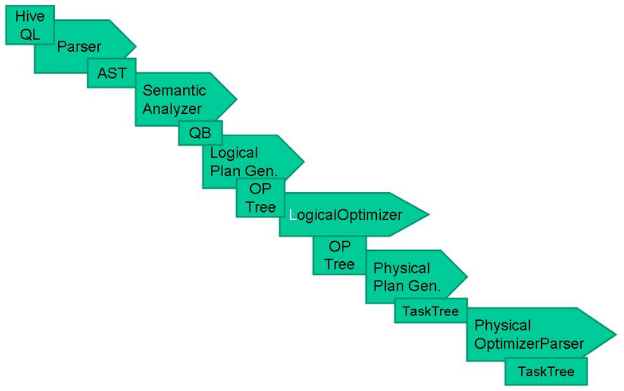
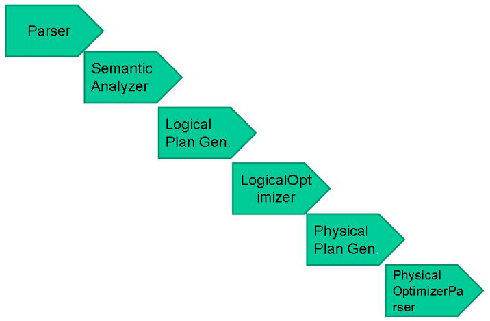
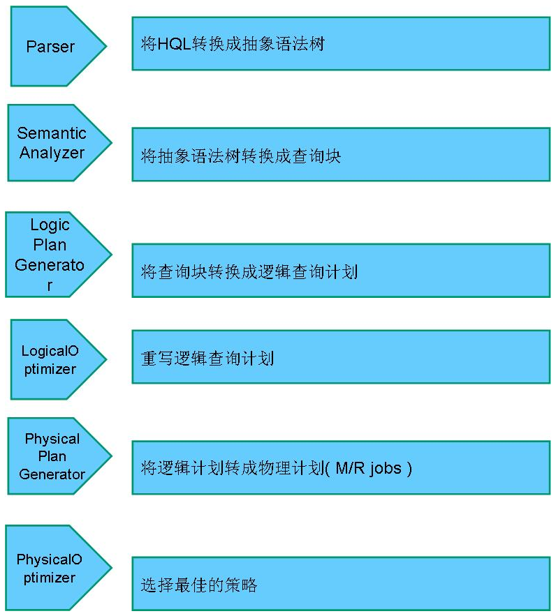

过程描述如下：
SQL Parser：Antlr定义SQL的语法规则,完成SQL词法,语法解析,将SQL转化为抽象 语法树AST Tree；
Semantic Analyzer：遍历AST Tree,抽象出查询的基本组成单元QueryBlock；
Logical plan：遍历QueryBlock,翻译为执行操作树OperatorTree；
Logical plan optimizer: 逻辑层优化器进行OperatorTree变换,合并不必要的ReduceSinkOperator,减少shuffle数据量；
Physical plan：遍历OperatorTree,翻译为MapReduce任务；
Logical plan optimizer：物理层优化器进行MapReduce任务的变换,生成最终的执行计划；

## 3.9 Hive底层与数据库交互原理?(☆☆☆☆☆)

由于Hive的元数据可能要面临不断地更新、修改和读取操作,所以它显然不适合使用Hadoop文件系统进行存储.目前Hive将元数据存储在RDBMS中,比如存储在MySQL、Derby中.元数据信息包括：存在的表、表的列、权限和更多的其他信息.
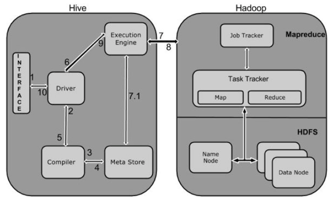
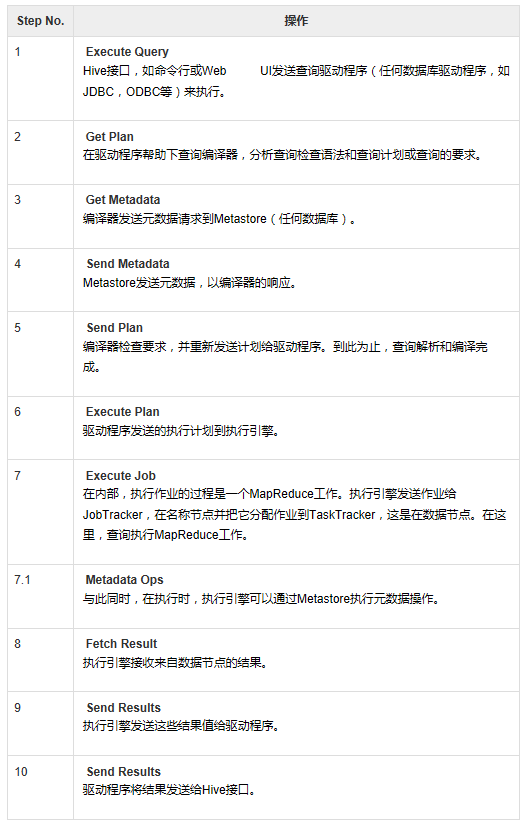

## 3.10 请把下面语句用Hive实现

select a.key,a.value from a where a.key not exists (select b.key from b)

## 3.11 写出将 text.txt 文件放入 hive 中 test 表‘2016-10-10’ 分区的语句,test 的分区字段是 l_date

LOAD DATA LOCAL INPATH '/your/path/test.txt' OVERWRITE INTO TABLE test PARTITION (l_date='2016-10-10')

## 3.12 Hive如何进行权限控制?(☆☆☆☆☆)

目前hive支持简单的权限管理,默认情况下是不开启,这样所有的用户都具有相同的权限,同时也是超级管理员,也就对hive中的所有表都有查看和改动的权利,这样是不符合一般数据仓库的安全原则的.Hive可以是基于元数据的权限管理,也可以基于文件存储级别的权限管理.
为了使用Hive的授权机制,有两个参数必须在hive-site.xml中设置：

```xml
<property>
<name>hive.security.authorization.enabled</name>
<value>true</value>
 <description>enable or disable the hive client authorization</description>
</property>
<property>
 <name>hive.security.authorization.createtable.owner.grants</name>
 <value>ALL</value>
 <description>the privileges automatically granted to the owner whenever a table gets created. An example like "select,drop" will grant select and drop privilege to the owner of the table</description>
</property>
```

​       Hive支持以下权限：
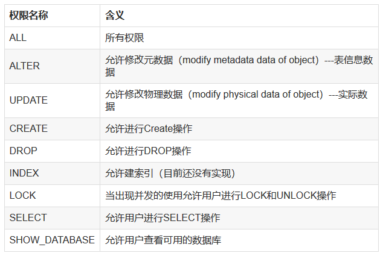
Hive授权的核心就是用户(user)、组(group)、角色(role).
Hive中的角色和平常我们认知的角色是有区别的,Hive中的角色可以理解为一部分有一些相同“属性”的用户或组或角色的集合.这里有个递归的概念,就是一个角色可以是一些角色的集合.
下面举例进行说明：
用户      组
张三      G_db1
李四      G_db2
王五      G_bothdb
如上有三个用户分别属于G_db1、G_db2、G_alldb.G_db1、G_db2、G_ bothdb分别表示该组用户可以访问数据库1、数据库2和可以访问1、2两个数据库.现在可以创建role_db1和role_db2,分别并授予访问数据库1和数据库2的权限.这样只要将role_eb1赋给G_db1(或者该组的所有用户),将role_eb2赋给G_db2,就可以是实现指定用户访问指定数据库.最后创建role_bothdb指向role_db1、role_db2(role_bothdb不需要指定访问那个数据库),然后role_bothdb授予G_bothdb,则G_bothdb中的用户可以访问两个数据库.
Hive的用户和组使用的是Linux机器上的用户和组,而角色必须自己创建.
角色管理：
--创建和删除角色  
create role role_name;  
drop role role_name;  
--展示所有roles  
show roles  
--赋予角色权限  
grant select on database db_name to role role_name;
grant select on [table] t_name to role role_name;
--查看角色权限  
show grant role role_name on database db_name;
show grant role role_name on [table] t_name;
--角色赋予用户  
grant role role_name to user user_name  
--回收角色权限  
revoke select on database db_name from role role_name;  
revoke select on [table] t_name from role role_name;  
--查看某个用户所有角色  
show role grant user user_name;

## 3.13 对于hive,你写过哪些udf函数,作用是什么?

项目中的日期处理UDF函数.

## 3.14 Hive 中的压缩格式TextFile、SequenceFile、RCfile 、ORCfile各有什么区别?-

1. TextFile
默认格式,**存储方式为行存储**,数据不做压缩,磁盘开销大,数据解析开销大.可结合Gzip、Bzip2使用(系统自动检查,执行查询时自动解压),但使用这种方式,压缩后的文件不支持split,Hive不会对数据进行切分,从而无法对数据进行并行操作.并且在反序列化过程中,必须逐个字符判断是不是分隔符和行结束符,因此反序列化开销会比SequenceFile高几十倍.
1. SequenceFile
SequenceFile是Hadoop API提供的一种二进制文件支持,,**存储方式为行存储**,其具有使用方便、可分割、可压缩的特点.
SequenceFile支持三种压缩选择：NONE,RECORD,BLOCK.Record压缩率低,一般建议使用BLOCK压缩.
优势是文件和hadoop api中的MapFile是相互兼容的
1. RCFile
存储方式：数据按行分块,每块按列存储.结合了行存储和列存储的优点：
​    首先,RCFile 保证同一行的数据位于同一节点,因此元组重构的开销很低；
​    其次,像列存储一样,RCFile 能够利用列维度的数据压缩,并且能跳过不必要的列读取；
RCFile的一个行组包括三个部分：
​    第一部分是行组头部的【同步标识】,主要用于分隔 hdfs 块中的两个连续行组
​    第二部分是行组的【元数据头部】,用于存储行组单元的信息,包括行组中的记录数、每个列的字节数、列中每个域的字节数
​    第三部分是【表格数据段】,即实际的列存储数据.在该部分中,同一列的所有域顺序存储.
从图可以看出,首先存储了列 A 的所有域,然后存储列 B 的所有域等.
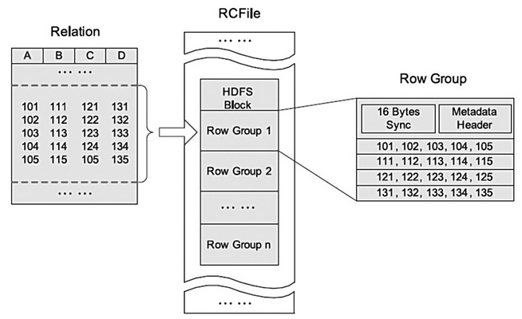
数据追加：RCFile 不支持任意方式的数据写操作,仅提供一种追加接口,这是因为底层的 HDFS当前仅仅支持数据追加写文件尾部.
行组大小：行组变大有助于提高数据压缩的效率,但是可能会损害数据的读取性能,因为这样增加了 Lazy 解压性能的消耗.而且行组变大会占用更多的内存,这会影响并发执行的其他MR作业.考虑到存储空间和查询效率两个方面,Facebook 选择 4MB 作为默认的行组大小,当然也允许用户自行选择参数进行配置.
1. ORCFile
存储方式：数据按行分块 每块按照列存储.
压缩快 快速列存取.
效率比rcfile高,是rcfile的改良版本.
以下为RCFile、TextFile、SequenceFile三种文件的存储情况：

```shell
[hadoop@master ~]$ hadoop dfs -dus /user/Hive/warehouse/*
 hdfs://master :9000/user/Hive/warehouse/hbase_table_1 0
 hdfs://master :9000/user/Hive/warehouse/hbase_table_2 0
 hdfs://master :9000/user/Hive/warehouse/orcfile_table 0
 hdfs://master :9000/user/Hive/warehouse/rcfile_table 102638073
 hdfs://master :9000/user/Hive/warehouse/seqfile_table 112497695
 hdfs://master :9000/user/Hive/warehouse/testfile_table 536799616
 hdfs://master :9000/user/Hive/warehouse/textfile_table 107308067
 [hadoop@singlehadoop ~]$ hadoop dfs -ls /user/Hive/warehouse/*/
 -rw-r--r-- 2 hadoop supergroup 51328177 2014-03-20 00:42 /user/Hive/warehouse/rcfile_table/000000_0
 -rw-r--r-- 2 hadoop supergroup 51309896 2014-03-20 00:43 /user/Hive/warehouse/rcfile_table/000001_0
 -rw-r--r-- 2 hadoop supergroup 56263711 2014-03-20 01:20 /user/Hive/warehouse/seqfile_table/000000_0
 -rw-r--r-- 2 hadoop supergroup 56233984 2014-03-20 01:21 /user/Hive/warehouse/seqfile_table/000001_0
 -rw-r--r-- 2 hadoop supergroup 536799616 2014-03-19 23:15 /user/Hive/warehouse/testfile_table/weibo.txt
 -rw-r--r-- 2 hadoop supergroup 53659758 2014-03-19 23:24 /user/Hive/warehouse/textfile_table/000000_0.gz
 -rw-r--r-- 2 hadoop supergroup 53648309 2014-03-19 23:26 /user/Hive/warehouse/textfile_table/000001_1.gz
```

总结：相比TEXTFILE和SEQUENCEFILE,RCFILE由于列式存储方式,数据加载时性能消耗较大,但是具有较好的压缩比和查询响应.
数据仓库的特点是一次写入、多次读取,因此,整体来看,RCFILE相比其余两种格式具有较明显的优势.

## 3.15 Hive join过程中大表小表的放置顺序?-

将最大的表放置在JOIN语句的最右边,或者直接使用`/*+ streamtable(table_name) */`指出.
在编写带有 join 操作的代码语句时,应该将条目少的表/子查询放在 Join 操作符的左边.因为在 Reduce 阶段,位于 Join 操作符左边的表的内容会被加载进内存,载入条目较少的表可以有效减少 OOM(out of memory)即内存溢出.所以对于同一个 key 来说,对应的 value 值小的放前,大的放后,这便是“小表放前”原则.若一条语句中有多个 Join,依据 Join 的条件相同与否,有不同的处理方法.

## 3.16 Hive的两张表关联,使用MapReduce怎么实现?(☆☆☆☆☆)

如果其中有一张表为小表,直接使用map端join的方式(map端加载小表)进行聚合.
如果两张都是大表,那么采用联合key,联合key的第一个组成部分是join on中的公共字段,第二部分是一个flag,0代表表A,1代表表B,由此让Reduce区分客户信息和订单信息；在Mapper中同时处理两张表的信息,将join on公共字段相同的数据划分到同一个分区中,进而传递到一个Reduce中,然后在Reduce中实现聚合.

## 3.17 Hive中使用什么代替in查询?-

在Hive 0.13版本之前,通过left outer join实现SQL中的in查询,0.13版本之后,Hive已经支持in查询.

## 3.18 所有的Hive任务都会有MapReduce的执行吗?-

不是,从Hive0.10.0版本开始,对于简单的不需要聚合的类似SELECT `<col> from <table> LIMIT n`语句,不需要起MapReduce job,直接通过Fetch task获取数据.

## 3.19 Hive的函数：UDF、UDAF、UDTF的区别?-

UDF:   单行进入,单行输出
UDAF:  多行进入,单行输出
UDTF:  单行输入,多行输出

## 3.20 在使用Hive的过程中,解决过什么问题?(☆☆☆☆☆)

## 3.21 说说对Hive桶表的理解?-

桶表是对数据进行哈希取值,然后放到不同文件中存储.
数据加载到桶表时,会对字段取hash值,然后与桶的数量取模.把数据放到对应的文件中.物理上,每个桶就是表(或分区)目录里的一个文件,一个作业产生的桶(输出文件)和reduce任务个数相同.
桶表专门用于抽样查询,是很专业性的,不是日常用来存储数据的表,需要抽样查询时,才创建和使用桶表.

## 3.22 Hive自定义UDF函数的流程?-

1)写一个类继承(org.apache.hadoop.hive.ql.)UDF类；
2)覆盖方法evaluate()；
3)打JAR包；
4)通过hive命令将JAR添加到Hive的类路径：
 hive> add  jar  /home/ubuntu/ToDate.jar;
5)注册函数：
​       hive> create  temporary  function  xxx  as  'XXX';
6)使用函数；
7)[可选] drop临时函数；

## 3.23 Hive可以像关系型数据库那样建立多个库吗?-

 可以建立多个库.

## 3.24 Hive实现统计的查询语句是什么?-

count等语句.

## 3.27 Hive优化措施(☆☆☆☆☆)

### 3.27.1 Fetch抓取

Fetch抓取是指,Hive中对某些情况的查询可以不必使用MapReduce计算.例如：SELECT * FROM employees;在这种情况下,Hive可以简单地读取employee对应的存储目录下的文件,然后输出查询结果到控制台.
在hive-default.xml.template文件中hive.fetch.task.conversion默认是more,老版本hive默认是minimal,该属性修改为more以后,在全局查找、字段查找、limit查找等都不走mapreduce.
案例实操：

```shell
1)把hive.fetch.task.conversion设置成none,然后执行查询语句,都会执行mapreduce程序.
hive (default)> set hive.fetch.task.conversion=none;
hive (default)> select * from emp;
hive (default)> select ename from emp;
hive (default)> select ename from emp limit 3;
2)把hive.fetch.task.conversion设置成more,然后执行查询语句,如下查询方式都不会执行mapreduce程序.
hive (default)> set hive.fetch.task.conversion=more;
hive (default)> select * from emp;
hive (default)> select ename from emp;
hive (default)> select ename from emp limit 3;
```

### 3.27.2 本地模式

大多数的Hadoop Job是需要Hadoop提供的完整的可扩展性来处理大数据集的.不过,有时Hive的输入数据量是非常小的.在这种情况下,为查询触发执行任务时消耗可能会比实际job的执行时间要多的多.对于大多数这种情况,Hive可以通过本地模式在单台机器上处理所有的任务.对于小数据集,执行时间可以明显被缩短.
用户可以通过设置hive.exec.mode.local.auto的值为true,来让Hive在适当的时候自动启动这个优化.
案例实操：

```shell
1)开启本地模式,并执行查询语句
hive (default)> set hive.exec.mode.local.auto=true;
hive (default)> select * from emp cluster by deptno;
Time taken: 1.328 seconds, Fetched: 14 row(s)
2)关闭本地模式,并执行查询语句
hive (default)> set hive.exec.mode.local.auto=false;
hive (default)> select * from emp cluster by deptno;
Time taken: 20.09 seconds, Fetched: 14 row(s)
```

### 3.27.3 表的优化

### 3.27.3.1 小表、大表Join

将key相对分散,并且数据量小的表放在join的左边,这样可以有效减少内存溢出错误发生的几率；再进一步,可以使用Group让小的维度表(1000条以下的记录条数)先进内存.在map端完成reduce.
实际测试发现：新版的hive已经对小表JOIN大表和大表JOIN小表进行了优化.小表放在左边和右边已经没有明显区别.

案例实操

(0)需求：测试大表JOIN小表和小表JOIN大表的效率
(1)建大表、小表和JOIN后表的语句
(2)分别向大表和小表中导入数据
hive (default)> load data local inpath '/opt/module/datas/bigtable' into table bigtable;
hive (default)>load data local inpath '/opt/module/datas/smalltable' into table smalltable;
(3)关闭mapjoin功能(默认是打开的)
set hive.auto.convert.join = false;
(4)执行小表JOIN大表语句
Time taken: 35.921 seconds
(5)执行大表JOIN小表语句
Time taken: 34.196 seconds

### 3.27.3.2 大表Join大表

1)空KEY过滤
有时join超时是因为某些key对应的数据太多,而相同key对应的数据都会发送到相同的reducer上,从而导致内存不够.此时我们应该仔细分析这些异常的key,很多情况下,这些key对应的数据是异常数据,我们需要在SQL语句中进行过滤.例如key对应的字段为空,操作如下：
案例实操

```shell
(1)配置历史服务器
​配置mapred-site.xml
​启动历史服务器
sbin/mr-jobhistory-daemon.sh start historyserver
查看jobhistory
<http://192.168.1.102:19888/jobhistory>
(2)创建原始数据表、空id表、合并后数据表
(3)分别加载原始数据和空id数据到对应表中
hive (default)> load data local inpath '/opt/module/datas/ori' into table ori;
hive (default)> load data local inpath '/opt/module/datas/nullid' into table nullidtable;
(4)测试不过滤空id
hive (default)> insert overwrite table jointable
select n.* from nullidtable n left join ori o on n.id = o.id;
Time taken: 42.038 seconds
(5)测试过滤空id
hive (default)> insert overwrite table jointable
select n.* from (select * from nullidtable where id is not null ) n  left join ori o on n.id = o.id;
Time taken: 31.725 seconds
```

2)空key转换
有时虽然某个key为空对应的数据很多,但是相应的数据不是异常数据,必须要包含在join的结果中,此时我们可以表a中key为空的字段赋一个随机的值,使得数据随机均匀地分不到不同的reducer上.例如：
案例实操：
不随机分布空null值：
(1)设置5个reduce个数
set mapreduce.job.reduces = 5;
(2)JOIN两张表
结果：可以看出来,出现了数据倾斜,某些reducer的资源消耗远大于其他reducer.

随机分布空null值
(1)设置5个reduce个数
set mapreduce.job.reduces = 5;
(2)JOIN两张表
结果：可以看出来,消除了数据倾斜,负载均衡reducer的资源消耗
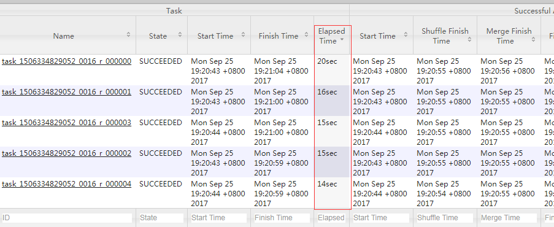

### 3.27.3.3 MapJoin

如果不指定MapJoin或者不符合MapJoin的条件,那么Hive解析器会将Join操作转换成Common Join,即：在Reduce阶段完成join.容易发生数据倾斜.可以用MapJoin把小表全部加载到内存在map端进行join,避免reducer处理.
1)开启MapJoin参数设置：
(1)设置自动选择Mapjoin
set hive.auto.convert.join = true; 默认为true
(2)大表小表的阀值设置(默认25M一下认为是小表)：
set hive.mapjoin.smalltable.filesize=25000000;
2)MapJoin工作机制
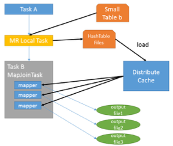
首先是Task A,它是一个Local Task(在客户端本地执行的Task),负责扫描小表b的数据,将其转换成一个HashTable的数据结构,并写入本地的文件中,之后将该文件加载到DistributeCache中.
接下来是Task B,该任务是一个没有Reduce的MR,启动MapTasks扫描大表a,在Map阶段,根据a的每一条记录去和DistributeCache中b表对应的HashTable关联,并直接输出结果.
由于MapJoin没有Reduce,所以由Map直接输出结果文件,有多少个Map Task,就有多少个结果文件.
案例实操：
(1)开启Mapjoin功能
set hive.auto.convert.join = true; 默认为true
(2)执行小表JOIN大表语句
Time taken: 24.594 seconds
(3)执行大表JOIN小表语句
Time taken: 24.315 seconds

### 3.27.3.4 Group By

默认情况下,Map阶段同一Key数据分发给一个reduce,当一个key数据过大时就倾斜了.
​并不是所有的聚合操作都需要在Reduce端完成,很多聚合操作都可以先在Map端进行部分聚合,最后在Reduce端得出最终结果.
1)开启Map端聚合参数设置
(1)是否在Map端进行聚合,默认为True
hive.map.aggr = true
(2)在Map端进行聚合操作的条目数目
​    hive.groupby.mapaggr.checkinterval = 100000
(3)有数据倾斜的时候进行负载均衡(默认是false)
​    hive.groupby.skewindata = true
​    当选项设定为 true,生成的查询计划会有两个MR Job.第一个MR Job中,Map的输出结果会随机分布到Reduce中,每个Reduce做部分聚合操作,并输出结果,这样处理的结果是相同的Group By Key有可能被分发到不同的Reduce中,从而达到负载均衡的目的；第二个MR Job再根据预处理的数据结果按照Group By Key分布到Reduce中(这个过程可以保证相同的Group By Key被分布到同一个Reduce中),最后完成最终的聚合操作.

### 3.27.3.5 Count(Distinct) 去重统计

数据量小的时候无所谓,数据量大的情况下,由于COUNT DISTINCT操作需要用一个Reduce Task来完成,这一个Reduce需要处理的数据量太大,就会导致整个Job很难完成,一般COUNT DISTINCT使用**先GROUP BY再COUNT的方式替换**：
案例实操
​(1)创建一张大表
(2)加载数据
hive (default)> load data local inpath '/opt/module/datas/bigtable' into table bigtable;
(3)设置5个reduce个数
set mapreduce.job.reduces = 5;
(4)执行去重id查询
hive (default)> select count(distinct id) from bigtable;
Stage-Stage-1: Map: 1  Reduce: 1   Cumulative CPU: 7.12 sec   HDFS Read: 120741990 HDFS Write: 7 SUCCESS
Total MapReduce CPU Time Spent: 7 seconds 120 msec
OK
c0
100001
Time taken: 23.607 seconds, Fetched: 1 row(s)
Time taken: 34.941 seconds, Fetched: 1 row(s)
(5)采用GROUP by去重id
hive (default)> select count(id) from (select id from bigtable group by id) a;
Stage-Stage-1: Map: 1  Reduce: 5   Cumulative CPU: 17.53 sec   HDFS Read: 120752703 HDFS Write: 580 SUCCESS
Stage-Stage-2: Map: 3  Reduce: 1   Cumulative CPU: 4.29 sec   HDFS Read: 9409 HDFS Write: 7 SUCCESS
Total MapReduce CPU Time Spent: 21 seconds 820 msec
OK
_c0
100001
Time taken: 50.795 seconds, Fetched: 1 row(s)
虽然会多用一个Job来完成,但在数据量大的情况下,这个绝对是值得的.

### 3.27.3.6 笛卡尔积

尽量避免笛卡尔积,join的时候不加on条件,或者无效的on条件,Hive只能使用1个reducer来完成笛卡尔积

### 3.27.3.7 行列过滤

列处理：在SELECT中,只拿需要的列,如果有,尽量使用分区过滤,少用SELECT *.
行处理：在分区剪裁中,当使用外关联时,如果将副表的过滤条件写在Where后面,那么就会先全表关联,之后再过滤,比如：
案例实操：
​(1)测试先关联两张表,再用where条件过滤
hive (default)> select o.id from bigtable b
join ori o on o.id = b.id
where o.id <= 10;
Time taken: 34.406 seconds, Fetched: 100 row(s)
Time taken: 26.043 seconds, Fetched: 100 row(s)
(2)通过子查询后,再关联表
hive (default)> select b.id from bigtable b
join (select id from ori where id <= 10 ) o on b.id = o.id;
Time taken: 30.058 seconds, Fetched: 100 row(s)
Time taken: 29.106 seconds, Fetched: 100 row(s)

### 3.27.3.8 动态分区调整

关系型数据库中,对分区表Insert数据时候,数据库自动会根据分区字段的值,将数据插入到相应的分区中,Hive中也提供了类似的机制,即动态分区(Dynamic Partition),只不过,使用Hive的动态分区,需要进行相应的配置.
1)开启动态分区参数设置
(1)开启动态分区功能(默认true,开启)
hive.exec.dynamic.partition=true
(2)设置为非严格模式(动态分区的模式,默认strict,表示必须指定至少一个分区为静态分区,nonstrict模式表示允许所有的分区字段都可以使用动态分区.)
hive.exec.dynamic.partition.mode=nonstrict
(3)在所有执行MR的节点上,最大一共可以创建多少个动态分区.
hive.exec.max.dynamic.partitions=1000
(4)在每个执行MR的节点上,最大可以创建多少个动态分区.该参数需要根据实际的数据来设定.比如：源数据中包含了一年的数据,即day字段有365个值,那么该参数就需要设置成大于365,如果使用默认值100,则会报错.
hive.exec.max.dynamic.partitions.pernode=100
(5)整个MR Job中,最大可以创建多少个HDFS文件.
hive.exec.max.created.files=100000
(6)当有空分区生成时,是否抛出异常.一般不需要设置.
hive.error.on.empty.partition=false
2)案例实操
需求：将ori中的数据按照时间(如：20111230000008),插入到目标表ori_partitioned_target的相应分区中.
(1)创建分区表
(2)加载数据到分区表中
(3)创建目标分区表
(4)设置动态分区
(5)查看目标分区表的分区情况
hive (default)> show partitions ori_partitioned_target;

### 3.27.4 数据倾斜

### 3.27.4.1 Map数

1)通常情况下,作业会通过input的目录产生一个或者多个map任务.
主要的决定因素有：input的文件总个数,input的文件大小,集群设置的文件块大小.
2)是不是map数越多越好?
答案是否定的.如果一个任务有很多小文件(远远小于块大小128m),则每个小文件也会被当做一个块,用一个map任务来完成,而一个map任务启动和初始化的时间远远大于逻辑处理的时间,就会造成很大的资源浪费.而且,同时可执行的map数是受限的.
3)是不是保证每个map处理接近128m的文件块,就高枕无忧了?
答案也是不一定.比如有一个127m的文件,正常会用一个map去完成,但这个文件只有一个或者两个小字段,却有几千万的记录,如果map处理的逻辑比较复杂,用一个map任务去做,肯定也比较耗时.
针对上面的问题2和3,我们需要采取两种方式来解决：即减少map数和增加map数；

### 3.27.4.2 小文件进行合并

在map执行前合并小文件,减少map数：CombineHiveInputFormat具有对小文件进行合并的功能(系统默认的格式).HiveInputFormat没有对小文件合并功能.
set hive.input.format= org.apache.hadoop.hive.ql.io.CombineHiveInputFormat;

### 3.27.4.3 复杂文件增加Map数

当input的文件都很大,任务逻辑复杂,map执行非常慢的时候,可以考虑增加Map数,来使得每个map处理的数据量减少,从而提高任务的执行效率.
增加map的方法为：根据computeSliteSize(Math.max(minSize,Math.min(maxSize,blocksize)))=blocksize=128M公式,调整maxSize最大值.让maxSize最大值低于blocksize就可以增加map的个数.
案例实操：
(1)执行查询
hive (default)> select count(*) from emp;
Hadoop job information for Stage-1: number of mappers: 1; number of reducers: 1
(2)设置最大切片值为100个字节
hive (default)> set mapreduce.input.fileinputformat.split.maxsize=100;
hive (default)> select count(*) from emp;
Hadoop job information for Stage-1: number of mappers: 6; number of reducers: 1

### 3.27.4.4 Reduce数

1)调整reduce个数方法一
(1)每个Reduce处理的数据量默认是256MB
hive.exec.reducers.bytes.per.reducer=256000000
(2)每个任务最大的reduce数,默认为1009
hive.exec.reducers.max=1009
(3)计算reducer数的公式
N=min(参数2,总输入数据量/参数1)
2)调整reduce个数方法二
在hadoop的mapred-default.xml文件中修改
设置每个job的Reduce个数
set mapreduce.job.reduces = 15;
3)reduce个数并不是越多越好
1)过多的启动和初始化reduce也会消耗时间和资源；
2)另外,有多少个reduce,就会有多少个输出文件,如果生成了很多个小文件,那么如果这些小文件作为下一个任务的输入,则也会出现小文件过多的问题；
在设置reduce个数的时候也需要考虑这两个原则：处理大数据量利用合适的reduce数；使单个reduce任务处理数据量大小要合适；

### 3.27.5 并行执行

Hive会将一个查询转化成一个或者多个阶段.这样的阶段可以是MapReduce阶段、抽样阶段、合并阶段、limit阶段.或者Hive执行过程中可能需要的其他阶段.默认情况下,Hive一次只会执行一个阶段.不过,某个特定的job可能包含众多的阶段,而这些阶段可能并非完全互相依赖的,也就是说有些阶段是可以并行执行的,这样可能使得整个job的执行时间缩短.不过,如果有更多的阶段可以并行执行,那么job可能就越快完成.
通过设置参数hive.exec.parallel值为true,就可以开启并发执行.不过,在共享集群中,需要注意下,如果job中并行阶段增多,那么集群利用率就会增加.
当然,得是在系统资源比较空闲的时候才有优势,否则,没资源,并行也起不来.

### 3.27.6 严格模式

Hive提供了一个严格模式,可以防止用户执行那些可能意向不到的不好的影响的查询.
通过设置属性hive.mapred.mode值为默认是非严格模式nonstrict .开启严格模式需要修改hive.mapred.mode值为strict,开启严格模式可以禁止3种类型的查询.
1)对于分区表,除非where语句中含有分区字段过滤条件来限制范围,否则不允许执行.换句话说,就是用户不允许扫描所有分区.进行这个限制的原因是,通常分区表都拥有非常大的数据集,而且数据增加迅速.没有进行分区限制的查询可能会消耗令人不可接受的巨大资源来处理这个表.
2)对于使用了order by语句的查询,要求必须使用limit语句.因为order by为了执行排序过程会将所有的结果数据分发到同一个Reducer中进行处理,强制要求用户增加这个LIMIT语句可以防止Reducer额外执行很长一段时间.
3)限制笛卡尔积的查询.对关系型数据库非常了解的用户可能期望在执行JOIN查询的时候不使用ON语句而是使用where语句,这样关系数据库的执行优化器就可以高效地将WHERE语句转化成那个ON语句.不幸的是,Hive并不会执行这种优化,因此,如果表足够大,那么这个查询就会出现不可控的情况.

### 3.27.7 JVM重用

JVM重用是Hadoop调优参数的内容,其对Hive的性能具有非常大的影响,特别是对于很难避免小文件的场景或task特别多的场景,这类场景大多数执行时间都很短.
Hadoop的默认配置通常是使用派生JVM来执行map和Reduce任务的.这时JVM的启动过程可能会造成相当大的开销,尤其是执行的job包含有成百上千task任务的情况.JVM重用可以使得JVM实例在同一个job中重新使用N次.N的值可以在Hadoop的mapred-site.xml文件中进行配置.通常在10-20之间,具体多少需要根据具体业务场景测试得出.
这个功能的缺点是,开启JVM重用将一直占用使用到的task插槽,以便进行重用,直到任务完成后才能释放.如果某个“不平衡的”job中有某几个reduce task执行的时间要比其他Reduce task消耗的时间多的多的话,那么保留的插槽就会一直空闲着却无法被其他的job使用,直到所有的task都结束了才会释放.

### 3.27.8 推测执行

在分布式集群环境下,因为程序Bug(包括Hadoop本身的bug),负载不均衡或者资源分布不均等原因,会造成同一个作业的多个任务之间运行速度不一致,有些任务的运行速度可能明显慢于其他任务(比如一个作业的某个任务进度只有50%,而其他所有任务已经运行完毕),则这些任务会拖慢作业的整体执行进度.为了避免这种情况发生,Hadoop采用了推测执行(Speculative Execution)机制,它根据一定的法则推测出“拖后腿”的任务,并为这样的任务启动一个备份任务,让该任务与原始任务同时处理同一份数据,并最终选用最先成功运行完成任务的计算结果作为最终结果.
设置开启推测执行参数：Hadoop的mapred-site.xml文件中进行配置
不过hive本身也提供了配置项来控制reduce-side的推测执行：
关于调优这些推测执行变量,还很难给一个具体的建议.如果用户对于运行时的偏差非常敏感的话,那么可以将这些功能关闭掉.如果用户因为输入数据量很大而需要执行长时间的map或者Reduce task的话,那么启动推测执行造成的浪费是非常巨大大.

### 3.27.9 压缩

详见第8章.

### 3.27.10 EXPLAIN(执行计划)

1)基本语法
EXPLAIN [EXTENDED | DEPENDENCY | AUTHORIZATION] query
2)案例实操
(1)查看下面这条语句的执行计划
hive (default)> explain select * from emp;
hive (default)> explain select deptno, avg(sal) avg_sal from emp group by deptno;
(2)查看详细执行计划
hive (default)> explain extended select * from emp;
hive (default)> explain extended select deptno, avg(sal) avg_sal from emp group by deptno;

## 3.28 Hive数据分析面试题

场景举例.北京市学生成绩分析.
成绩的数据格式:时间,学校,年纪,姓名,科目,成绩
样例数据如下:
2013,北大,1,裘容絮,语文,97
2013,北大,1,庆眠拔,语文,52
2013,北大,1,乌洒筹,语文,85
2012,清华,0,钦尧,英语,61
2015,北理工,3,冼殿,物理,81
2016,北科,4,况飘索,化学,92
2014,北航,2,孔须,数学,70
2012,清华,0,王脊,英语,59
2014,北航,2,方部盾,数学,49
2014,北航,2,东门雹,数学,77

问题:

### 3.28.1 情景题：分组TOPN

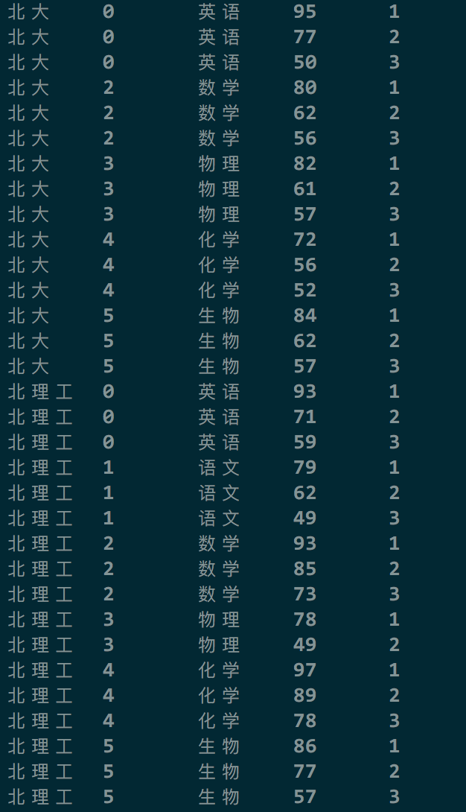
1)row_number函数: row_number() 按指定的列进行分组生成行序列, 从 1 开始, 如果两行记录的分组列相同, 则行序列+1.
2)over 函数:是一个窗口函数.
over(order by score) 按照score排序进行累计,order by是个默认的开窗函数.
over(partition by class)按照班级分区
over(partition by class order by score)按照班级分区,并按着分数排序.
over(order by score range between 2 preceding and 2 following)：窗口范围为当前行的数据幅度减2加2后的范围内的数据求和.
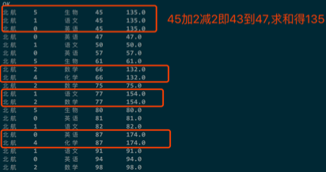
over(order by score rows between 2 preceding and 2 following)：窗口范围为当前行前后各移动2行.
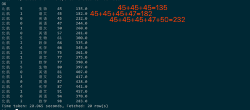
提问,上述sql有没有可优化的点.
-- row_number() over (distribute by school,class,subjects sort by score desc) rank_code

### 3.28.2 情景题：where与having

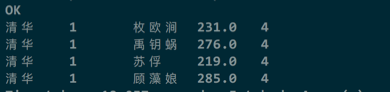
having是分组(group by)后的筛选条件,分组后的数据组内再筛选,也就是说HAVING子句可以让我们筛选成组后的各组数据.
where则是在分组,聚合前先筛选记录.也就是说作用在GROUP BY子句和HAVING子句前.

### 3.28.3 情景题：数据倾斜

今年加入进来了10个学校,学校数据差异很大计算每个学校的平均分.
该题主要是考察数据倾斜的处理方式.
Group by 方式很容易产生数据倾斜.需要注意一下几点
1)Map端部分聚合
hive.map.aggr=true(用于设定是否在 map 端进行聚合,默认值为真,相当于combine)
hive.groupby.mapaggr.checkinterval=100000(用于设定 map 端进行聚合操作的条数)
2)有数据倾斜时进行负载均衡
设定hive.groupby.skewindata,当选项设定为true是,生成的查询计划有两个MapReduce任务.
在第一个MapReduce中,map的输出结果集合会随机分布到reduce中, 每个reduce做部分聚合操作,并输出结果.这样处理的结果是,相同的Group By Key有可能分发到不同的reduce中,从而达到负载均衡的目的；
第二个MapReduce任务再根据预处理的数据结果按照Group By Key分布到reduce 中(这个过程可以保证相同的Group By Key分布到同一个reduce 中),最后完成最终的聚合操作.

### 3.28.4 情景题：分区表

假设我创建了一张表,其中包含了2016年客户完成的所有交易的详细信息：CREATE TABLE transaction_details (cust_id INT, amount FLOAT, month STRING, country STRING) ROW FORMAT DELIMITED FIELDS TERMINATED BY ‘,’ ;
现在我插入了100万条数据,我想知道每个月的总收入.
问：如何高效的统计出结果.写出步骤即可.
1)首先分析这个需求,其实并不难,但是由于题目说了,要高效.而且数据量也不小,直接写sql查询估计肯定会挂.
2)分析：
(1)我们可以通过根据每个月对表进行分区来解决查询慢的问题.因此,对于每个月我们将只扫描分区的数据,而不是整个数据集.
(2)但是我们不能直接对现有的非分区表进行分区.所以我们会采取以下步骤来解决这个问题：
(3)创建一个分区表,partitioned_transaction：
create table partitioned_transaction (cust_id int, amount float, country string) partitioned by (month string) row format delimited fields terminated by ‘,’ ;
(4)在Hive中启用动态分区：
SET hive.exec.dynamic.partition = true;
SET hive.exec.dynamic.partition.mode = nonstrict;
(5)将数据从非分区表导入到新创建的分区表中：
insert overwrite table partitioned_transaction partition (month) select cust_id, amount, country, month from transaction_details;
(6)使用新建的分区表实现需求.
