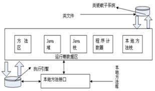
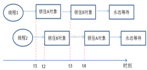
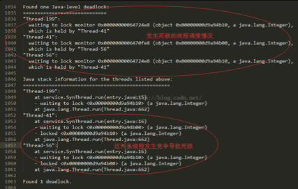
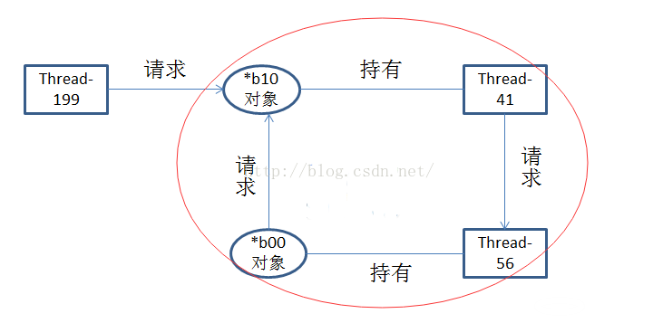

# 十 JVM

## 10.1 垃圾回收算法分类

### 10.1.1 算法一：引用计数法

这个方法是最经典点的一种方法.具体是对于对象设置一个引用计数器，每增加一个变量对它的引用，引用计数器就会加1，没减少一个变量的引用，引用计数器就会减1，只有当对象的引用计数器变成0时，该对象才会被回收.可见这个算法很简单，但是简单往往会存在很多问题，这里我列举最明显的两个问题.
一是采用这种方法后，每次在增加变量引用和减少引用时都要进行加法或减法操作，如果频繁操作对象的话，在一定程度上增加的系统的消耗.
二是这种方法无法处理循环引用的情况.再解释下什么是循环引用，假设有两个对象 A和B，A中引用了B对象，并且B中也引用了A对象，
那么这时两个对象的引用计数器都不为0，但是由于存在相互引用导致无法垃圾回收A和 B，导致内存泄漏.

### 10.1.2 算法二：标记清除法

这个方法是将垃圾回收分成了两个阶段：标记阶段和清除阶段.
在标记阶段，通过跟对象，标记所有从跟节点开始的可达的对象，那么未标记的对象就是未被引用的垃圾对象.
在清除阶段，清除掉所以的未被标记的对象.
这个方法的缺点是，垃圾回收后可能存在大量的磁盘碎片，准确的说是内存碎片.因为对象所占用的地址空间是固定的.对于这个算法还有改进的算法，就是我后面要说的算法三.

### 10.1.3 算法三：标记压缩清除法（Java中老年代采用)

在算法二的基础上做了一个改进，可以说这个算法分为三个阶段：标记阶段，压缩阶段，清除阶段.标记阶段和清除阶段不变，只不过增加了一个压缩阶段，就是在做完标记阶段后，将这些标记过的对象集中放到一起，确定开始和结束地址，比如全部放到开始处，这样再去清除，将不会产生磁盘碎片.但是我们也要注意到几个问题，压缩阶段占用了系统的消耗，并且如果标记对象过多的话，损耗可能会很大，在标记对象相对较少的时候，效率较高.

### 10.1.4 算法四：复制算法（Java中新生代采用)

核心思想是将内存空间分成两块，同一时刻只使用其中的一块，在垃圾回收时将正在使用的内存中的存活的对象复制到未使用的内存中，然后清除正在使用的内存块中所有的对象，然后把未使用的内存块变成正在使用的内存块，把原来使用的内存块变成未使用的内存块.很明显如果存活对象较多的话，算法效率会比较差，并且这样会使内存的空间折半，但是这种方法也不会产生内存碎片.

### 10.1.5 算法五：分代法（Java堆采用)

主要思想是根据对象的生命周期长短特点将其进行分块，根据每块内存区间的特点，使用不同的回收算法，从而提高垃圾回收的效率.
比如Java虚拟机中的堆就采用了这种方法分成了新生代和老年代.然后对于不同的代采用不同的垃圾回收算法.
新生代使用了复制算法，老年代使用了标记压缩清除算法.

### 10.1.6 算法六：分区算法

这种方法将整个空间划分成连续的不同的小区间，每个区间都独立使用，独立回收，好处是可以控制一次回收多少个小区间.

## 10.2 JAVA内存区域划分方法

我们现在来逐个的看下每个到底是做什么的！

### 10.2.1 程序计数器

程序计数器（Program Counter Register）是一块较小的内存空间，它的作用可以看做是当前线程所执行的字节码的行号指示器.在虚拟机的概念模型里（仅是概念模型，各种虚拟机可能会通过一些更高效的方式去实现），字节码解释器工作时就是通过改变这个计数器的值来选取下一条需要执行的字节码指令，分支、循环、跳转、异常处理、线程恢复等基础功能都需要依赖这个计数器来完成.
由于Java 虚拟机的多线程是通过线程轮流切换并分配处理器执行时间的方式来实现的，在任何一个确定的时刻，一个处理器（对于多核处理器来说是一个内核）只会执行一条线程中的指令.因此，为了线程切换后能恢复到正确的执行位置，每条线程都需要有一个独立的程序计数器，各条线程之间的计数器互不影响，独立存储，我们称这类内存区域为“线程私有”的内存.
如果线程正在执行的是一个Java 方法，这个计数器记录的是正在执行的虚拟机字节码指令的地址；如果正在执行的是Natvie 方法，这个计数器值则为空（Undefined)此内存区域是唯一一个在Java 虚拟机规范中没有规定任何OutOfMemoryError 情况的区域.

### 10.2.2 Java 虚拟机栈

与程序计数器一样，Java 虚拟机栈（Java Virtual Machine Stacks）也是线程私有的，它的生命周期与线程相同.虚拟机栈描述的是Java 方法执行的内存模型：每个方法被执行的时候都会同时创建一个栈帧（Stack Frame ①）用于存储局部变量表、操作栈、动态链接、方法出口等信息.每一个方法被调用直至执行完成的过程，就对应着一个栈帧在虚拟机栈中从入栈到出栈的过程.
经常有人把Java 内存区分为堆内存（Heap）和栈内存（Stack），这种分法比较粗糙，Java 内存区域的划分实际上远比这复杂.这种划分方式的流行只能说明大多数程序员最关注的、与对象内存分配关系最密切的内存区域是这两块.其中所指的“堆”在后面会专门讲述，而所指的“栈”就是现在讲的虚拟机栈，或者说是虚拟机栈中的局部变量表部分.
局部变量表存放了编译期可知的各种基本数据类型（boolean、byte、char、short、int、float、long、double）、对象引用（reference 类型，它不等同于对象本身，根据不同的虚拟机实现，它可能是一个指向对象起始地址的引用指针，也可能指向一个代表对象的句柄或者其他与此对象相关的位置）和returnAddress 类型（指向了一条字节码指令的地址)其中64 位长度的long 和double 类型的数据会占用2 个局部变量空间（Slot），其余的数据类型只占用1 个.局部变量表所需的内存空间在编译期间完成分配，当进入一个方法时，这个方法需要在帧中分配多大的局部变量空间是完全确定的，在方法运行期间不会改变局部变量表的大小.
在Java 虚拟机规范中，对这个区域规定了两种异常状况：如果线程请求的栈深度大于虚拟机所允许的深度，将抛出StackOverflowError 异常；如果虚拟机栈可以动态扩展（当前大部分的Java 虚拟机都可动态扩展，只不过Java 虚拟机规范中也允许固定长度的虚拟机栈），当扩展时无法申请到足够的内存时会抛出OutOfMemoryError 异常.

### 10.2.3 本地方法栈

本地方法栈（Native Method Stacks）与虚拟机栈所发挥的作用是非常相似的，其区别不过是虚拟机栈为虚拟机执行Java 方法（也就是字节码）服务，而本地方法栈则是为虚拟机使用到的Native 方法服务.虚拟机规范中对本地方法栈中的方法使用的语言、使用方式与数据结构并没有强制规定，因此具体的虚拟机可以自由实现它.甚至有的虚拟机（譬如Sun HotSpot 虚拟机）直接就把本地方法栈和虚拟机栈合二为一.与虚拟机栈一样，本地方法栈区域也会抛出StackOverflowError 和OutOfMemoryError异常.

### 10.2.4 Java 堆

对于大多数应用来说，Java 堆（Java Heap）是Java 虚拟机所管理的内存中最大的一块.Java 堆是被所有线程共享的一块内存区域，在虚拟机启动时创建.此内存区域的唯一目的就是存放对象实例，几乎所有的对象实例都在这里分配内存.这一点在Java 虚拟机规范中的描述是：所有的对象实例以及数组都要在堆上分配①，但是随着JIT 编译器的发展与逃逸分析技术的逐渐成熟，栈上分配、标量替换②优化技术将会导致一些微妙的变化发生，所有的对象都分配在堆上也渐渐变得不是那么“绝对”了.
Java 堆是垃圾收集器管理的主要区域，因此很多时候也被称做“GC 堆”（Garbage Collected Heap，幸好国内没翻译成“垃圾堆”)如果从内存回收的角度看，由于现在收集器基本都是采用的分代收集算法，所以Java 堆中还可以细分为：新生代和老年代；
再细致一点的有Eden 空间、From Survivor 空间、To Survivor 空间等.如果从内存分配的角度看，线程共享的Java 堆中可能划分出多个线程私有的分配缓冲区（Thread Local Allocation Buffer，TLAB)不过，无论如何划分，都与存放内容无关，无论哪个区域，存储的都仍然是对象实例，进一步划分的目的是为了更好地回收内存，或者更快地分配内存.在本章中，我们仅仅针对内存区域的作用进行讨论，Java 堆中的上述各个区域的分配和回收等细节将会是下一章的主题.
根据Java 虚拟机规范的规定，Java 堆可以处于物理上不连续的内存空间中，只要逻辑上是连续的即可，就像我们的磁盘空间一样.在实现时，既可以实现成固定大小的，也可以是可扩展的，不过当前主流的虚拟机都是按照可扩展来实现的（通过-Xmx和-Xms 控制)如果在堆中没有内存完成实例分配，并且堆也无法再扩展时，将会抛出OutOfMemoryError 异常.

### 10.2.5 方法区

方法区（Method Area）与Java 堆一样，是各个线程共享的内存区域，它用于存储已被虚拟机加载的类信息、常量、静态变量、即时编译器编译后的代码等数据.虽然Java 虚拟机规范把方法区描述为堆的一个逻辑部分，但是它却有一个别名叫做Non-Heap（非堆），目的应该是与Java 堆区分开来.
对于习惯在HotSpot 虚拟机上开发和部署程序的开发者来说，很多人愿意把方法区称为“永久代”（Permanent Generation），本质上两者并不等价，仅仅是因为HotSpot 虚拟机的设计团队选择把GC 分代收集扩展至方法区，或者说使用永久代来实现方法区而已.对于其他虚拟机（如BEA JRockit、IBM J9 等）来说是不存在永久代的概念的.即使是HotSpot 虚拟机本身，根据官方发布的路线图信息，现在也有放弃永久代并“搬家”至Native Memory 来实现方法区的规划了.
Java 虚拟机规范对这个区域的限制非常宽松，除了和Java 堆一样不需要连续的内存和可以选择固定大小或者可扩展外，还可以选择不实现垃圾收集.相对而言，垃圾收集行为在这个区域是比较少出现的，但并非数据进入了方法区就如永久代的名字一样“永久”存在了.这个区域的内存回收目标主要是针对常量池的回收和对类型的卸载，一般来说这个区域的回收“成绩”比较难以令人满意，尤其是类型的卸载，条件相当苛刻，但是这部分区域的回收确实是有必要的.在Sun 公司的BUG 列表中，曾出现过的若干个严重的BUG 就是由于低版本的HotSpot 虚拟机对此区域未完全回收而导致内存泄漏.根据Java 虚拟机规范的规定，当方法区无法满足内存分配需求时，将抛出OutOfMemoryError 异常.

### 10.2.6 运行时常量池

运行时常量池（Runtime Constant Pool）是方法区的一部分.Class 文件中除了有类的版本、字段、方法、接口等描述等信息外，还有一项信息是常量池（Constant Pool Table），用于存放编译期生成的各种字面量和符号引用，这部分内容将在类加载后存放到方法区的运行时常量池中.
Java 虚拟机对Class 文件的每一部分（自然也包括常量池）的格式都有严格的规定，每一个字节用于存储哪种数据都必须符合规范上的要求，这样才会被虚拟机认可、装载和执行.但对于运行时常量池，Java 虚拟机规范没有做任何细节的要求，不同的提供商实现的虚拟机可以按照自己的需要来实现这个内存区域.不过，一般来说，除了保存Class 文件中描述的符号引用外，还会把翻译出来的直接引用也存储在运行时常量池中①.
运行时常量池相对于Class 文件常量池的另外一个重要特征是具备动态性，Java 语言并不要求常量一定只能在编译期产生，也就是并非预置入Class 文件中常量池的内容才能进入方法区运行时常量池，运行期间也可能将新的常量放入池中，这种特性被开发人员利用得比较多的便是String 类的intern() 方法.既然运行时常量池是方法区的一部分，自然会受到方法区内存的限制，当常量池无法再申请到内存时会抛出OutOfMemoryError 异常

### 10.2.7 直接内存

直接内存（Direct Memory）并不是虚拟机运行时数据区的一部分，也不是Java虚拟机规范中定义的内存区域，但是这部分内存也被频繁地使用，而且也可能导致OutOfMemoryError 异常出现，所以我们放到这里一起讲解.
在JDK 1.4 中新加入了NIO（New Input/Output）类，引入了一种基于通道（Channel）与缓冲区（Buffer）的I/O 方式，它可以使用Native 函数库直接分配堆外内存，然后通过一个存储在Java 堆里面的DirectByteBuffer 对象作为这块内存的引用进行操作.这样能在一些场景中显著提高性能，因为避免了在Java 堆和Native 堆中来回复制数据.
显然，本机直接内存的分配不会受到Java 堆大小的限制，但是，既然是内存，则肯定还是会受到本机总内存（包括RAM 及SWAP 区或者分页文件）的大小及处理器寻址空间的限制.服务器管理员配置虚拟机参数时，一般会根据实际内存设置-Xmx等参数信息，但经常会忽略掉直接内存，使得各个内存区域的总和大于物理内存限制（包括物理上的和操作系统级的限制），从而导致动态扩展时出现OutOfMemoryError异常.
逻辑内存模型我们已经看到了，那当我们建立一个对象的时候是怎么进行访问的呢？在Java 语言中，对象访问是如何进行的？对象访问在Java 语言中无处不在，是最普通的程序行为，但即使是最简单的访问，也会却涉及Java 栈、Java 堆、方法区这三个最重要内存区域之间的关联关系，如下面的这句代码：
Object obj = new Object();
假设这句代码出现在方法体中，那“Object obj”这部分的语义将会反映到Java 栈的本地变量表中，作为一个reference 类型数据出现.而“new Object()”这部分的语义将会反映到Java 堆中，形成一块存储了Object 类型所有实例数据值（Instance Data，对象中各个实例字段的数据）的结构化内存，根据具体类型以及虚拟机实现的对象内存布局（Object Memory Layout）的不同，这块内存的长度是不固定的.另外，在Java 堆中还必须包含能查找到此对象类型数据（如对象类型、父类、实现的接口、方法等）的地址信息，这些类型数据则存储在方法区中.

由于reference 类型在Java 虚拟机规范里面只规定了一个指向对象的引用，并没有定义这个引用应该通过哪种方式去定位，以及访问到Java 堆中的对象的具体位置，因此不同虚拟机实现的对象访问方式会有所不同，主流的访问方式有两种：使用句柄和直接指针.

## 10.3 内存大小的分配方法

•Young generation –>新生代
•Tenured/Old Generation –>老年代
•Perm Area –>永久代
年轻代:
所有新生成的对象首先都是放在年轻代的.年轻代的目标就是尽可能快速的收集掉那些生命周期短的对象.年轻代分三个区.一个Eden区，两个 Survivor区(一般而言).大部分对象在Eden区中生成.当Eden区满时，还存活的对象将被复制到Survivor区（两个中的一个），当这个 Survivor区满时，此区的存活对象将被复制到另外一个Survivor区，当这个Survivor去也满了的时候，从第一个Survivor区复制过来的并且此时还存活的对象，将被复制“年老区(Tenured)”.需要注意，Survivor的两个区是对称的，没先后关系，所以同一个区中可能同时存在从Eden复制过来对象，和从前一个Survivor复制过来的对象，而复制到年老区的只有从第一个Survivor去过来的对象.而且，Survivor区总有一个是空的.同时，根据程序需要，Survivor区是可以配置为多个的（多于两个），这样可以增加对象在年轻代中的存在时间，减少被放到年老代的可能.
年老代:
在年轻代中经历了N次垃圾回收后仍然存活的对象，就会被放到年老代中.因此，可以认为年老代中存放的都是一些生命周期较长的对象.
持久代：
用于存放静态文件，如今Java类、方法等.持久代对垃圾回收没有显著影响，但是有些应用可能动态生成或者调用一些class，例如Hibernate 等，在这种时候需要设置一个比较大的持久代空间来存放这些运行过程中新增的类.持久代大小通过`-XX:MaxPermSize=<N>`进行设置.
Java中对象都在堆上创建.为了GC，堆内存分为三个部分，也可以说三代，分别称为新生代，老年代和永久代.其中新生代又进一步分为Eden区，Survivor 1区和Survivor 2区(如下图).新创建的对象会分配在Eden区,在经历一次Minor GC后会被移到Survivor 1区，再经历一次Minor GC后会被移到Survivor 2区，直到升至老年代,需要注意的是，一些大对象(长字符串或数组)可能会直接存放到老年代.

## 10.4 JVM GC介绍

在Java中，对象实例都是在堆上创建.一些类信息，常量，静态变量等存储在方法区.堆和方法区都是线程共享的.
GC机制是由JVM提供，用来清理需要清除的对象，回收堆内存.
GC机制将Java程序员从内存管理中解放了出来，可以更关注于业务逻辑.
在Java中，GC是由一个被称为垃圾回收器的守护线程执行的.
在从内存回收一个对象之前会调用对象的finalize()方法.
作为一个Java开发者不能强制JVM执行GC；GC的触发由JVM依据堆内存的大小来决定.
System.gc()和Runtime.gc()会向JVM发送执行GC的请求，但是JVM不保证一定会执行GC.
如果堆没有内存创建新的对象了，会抛出OutOfMemoryError.

## 10.5 GC针对什么对象

了解GC机制的第一步就是理解什么样的对象会被回收.当一个对象通过一系列根对象(比如：静态属性引用的常量)都不可达时就会被回收.简而言之，当一个对象的所有引用都为null.循环依赖不算做引用，如果对象A有一个指向对象B的引用，对象B也有一个指向对象A的引用，除此之外，它们没有其他引用，那么对象A和对象B都、需要被回收(如下图,ObjA和ObjB需要被回收).

## 10.6 Java常用的垃圾回收器配置

Java提供多种类型的垃圾回收器.JVM中的垃圾收集一般都采用“分代收集”，不同的堆内存区域采用不同的收集算法，主要目的就是为了增加吞吐量或降低停顿时间.
Serial收集器：新生代收集器，使用复制算法，使用一个线程进行GC，串行，其它工作线程暂停.
ParNew收集器：新生代收集器，使用复制算法，Serial收集器的多线程版，用多个线程进行GC，并行，其它工作线程暂停.使用-XX:+UseParNewGC开关来控制使用ParNew+Serial Old收集器组合收集内存；使用-XX:ParallelGCThreads来设置执行内存回收的线程数.
Parallel Scavenge 收集器：吞吐量优先的垃圾回收器，作用在新生代，使用复制算法，关注CPU吞吐量，即运行用户代码的时间/总时间.使用-XX:+UseParallelGC开关控制使用Parallel Scavenge+Serial Old收集器组合回收垃圾.
Serial Old收集器：老年代收集器，单线程收集器，串行，使用标记整理算法，使用单线程进行GC，其它工作线程暂停.
Parallel Old收集器：吞吐量优先的垃圾回收器，作用在老年代，多线程，并行，多线程机制与Parallel Scavenge差不错，使用标记整理算法，在Parallel Old执行时，仍然需要暂停其它线程.
CMS（Concurrent Mark Sweep）收集器：老年代收集器，致力于获取最短回收停顿时间（即缩短垃圾回收的时间），使用标记清除算法，多线程，优点是并发收集（用户线程可以和GC线程同时工作），停顿小.使用-XX:+UseConcMarkSweepGC进行ParNew+CMS+Serial Old进行内存回收，优先使用ParNew+CMS（原因见Full GC和并发垃圾回收一节），当用户线程内存不足时，采用备用方案Serial Old收集.

## 10.7 Java 服务死锁问题排查

当多条线程以不同的顺序抢占同步资源的时候，就有可能发生死锁.
如下图所示，线程1持有锁对象A而希望获得锁对象B；另一方面，线程2持有锁对象B而希望获得锁对象A.并且这两个线程的操作是交错执行的，因此它们会发生死锁.

当发生的死锁后，JDK自带了两个工具(jstack和JConsole)，可以用来监测分析死锁的发生原因.
jstack工具用于生于生成虚拟机当前时刻的线程快照.线程快照就是当前虚拟机每一条线程正在执行的方法堆栈的集合，生成快照可以用于定位诸如线程死锁、死循环等问题.
Java 应用程序性能和跟踪 Java 中的代码.
下面以一个死锁例子来说明如何使用这两个工具来分析线程死锁.死锁示例代码如下：
**说明：**以上代码有可能发生死锁，原因是Integer.valueOf()方法作了缓存优化，对[-128,127]之间的数字会被缓存.也就是说，循环代码中一共只创建了两个不同的对象.假设在两个synchronized块之间发生了线程切换，那就有可能造成，线程A等待被线程B持有Integer.valueOf(1)对象，线程B等待被线程A持有Integer.valueOf(2)对象，结果出现了死锁.（可能需要多次执行直到程序出现阻塞现象）

直接从堆栈信息不能直观得到结论，没关系，我们可以画图理清线程间的调度情况（出现闭合环路，发生死锁）

## 10.8 JVM 之排查进程cpu使用异常

可使用如下命令查看程序中各个线程CPU占用情况
top -H -p pid
另一种方法通过pstree pid查到pid下所有的thread 然后top查看，按下H找到对应的线程即可.

## 10.9 JVM之查看java内存情况命令

jinfo:可以输出并修改运行时的java 进程的opts.
jps:与unix上的ps类似，用来显示本地的java进程，可以查看本地运行着几个java程序，并显示他们的进程号.
jstat:一个极强的监视VM内存工具.可以用来监视VM内存内的各种堆和非堆的大小及其内存使用量.
jmap:打印出某个java进程（使用pid）内存内的所有'对象'的情况（如：产生那些对象，及其数量)
jconsole:一个java GUI监视工具，可以以图表化的形式显示各种数据.并可通过远程连接监视远程的服务器VM.
详细：在使用这些工具前，先用JPS命令获取当前的每个JVM进程号，然后选择要查看的JVM.
jstat工具特别强大，有众多的可选项，详细查看堆内各个部分的使用量，以及加载类的数量.使用时，需加上查看进程的进程id，和所选参数.以下详细介绍各个参数的意义.
jstat -class pid:显示加载class的数量，及所占空间等信息.
jstat -compiler pid:显示VM实时编译的数量等信息.
jstat -gc pid:可以显示gc的信息，查看gc的次数，及时间.其中最后五项，分别是young gc的次数，young gc的时间，full gc的次数，full gc的时间，gc的总时间.
jstat -gccapacity:可以显示，VM内存中三代（young,old,perm）对象的使用和占用大小，如：PGCMN显示的是最小perm的内存使用量，PGCMX显示的是perm的内存最大使用量，PGC是当前新生成的perm内存占用量，PC是但前perm内存占用量.其他的可以根据这个类推， OC是old内纯的占用量.
jstat -gcnew pid:new对象的信息.
jstat -gcnewcapacity pid:new对象的信息及其占用量.
jstat -gcold pid:old对象的信息.
jstat -gcoldcapacity pid:old对象的信息及其占用量.
jstat -gcpermcapacity pid: perm对象的信息及其占用量.
jstat -util pid:统计gc信息统计.
jstat -printcompilation pid:当前VM执行的信息.
除了以上一个参数外，还可以同时加上 两个数字，如：jstat -printcompilation 3024 250 6是每250毫秒打印一次，一共打印6次，还可以加上-h3每三行显示一下标题.
jmap是一个可以输出所有内存中对象的工具，甚至可以将VM 中的heap，以二进制输出成文本.
命令：`jmap -dump:format=b,file=heap.bin <pid>`
file：保存路径及文件名
pid：进程编号
•jmap -histo:live  pid| less :堆中活动的对象以及大小
•jmap -heap pid : 查看堆的使用状况信息
jinfo:的用处比较简单，就是能输出并修改运行时的java进程的运行参数.用法是jinfo -opt pid 如：查看2788的MaxPerm大小可以用 jinfo -flag MaxPermSize 2788.
jconsole是一个用java写的GUI程序，用来监控VM，并可监控远程的VM，非常易用，而且功能非常强.使用方法：命令行里打 jconsole，选则进程就可以了.
JConsole中关于内存分区的说明.
Eden Space (heap)： 内存最初从这个线程池分配给大部分对象.
Survivor Space (heap)：用于保存在eden space内存池中经过垃圾回收后没有被回收的对象.
Tenured Generation (heap)：用于保持已经在 survivor space内存池中存在了一段时间的对象.
Permanent Generation (non-heap): 保存虚拟机自己的静态(refective)数据，例如类（class）和方法（method）对象.Java虚拟机共享这些类数据.这个区域被分割为只读的和只写的，
Code Cache (non-heap):HotSpot Java虚拟机包括一个用于编译和保存本地代码（native code）的内存，叫做“代码缓存区”（code cache）
•jstack ( 查看jvm线程运行状态，是否有死锁现象等等信息) : jstack pid : thread dump
•jstat -gcutil  pid  1000 100  : 1000ms统计一次gc情况统计100次；
