# 什么是Docker

Docker是一个开源的应用容器引擎（基于Go语言实现），让开发者可以打包他们的应用以及依赖包到一个可移植的容器中，然后发布到任何流行的Linux机器上；也可以实现虚拟化，容器是完全使用沙箱机制，相互之间不会有任何接口。
Docker使用客户端-服务器（CS架构），使用远程API来管理和创建Docker容器。Docker容器（Container）通过Docker镜像来创建。
 Docker  的镜像、仓库、容器的概念
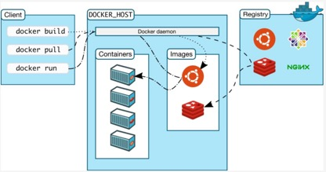
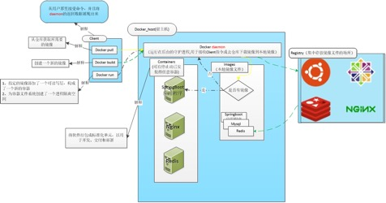
 Docker daemon  （守护进程） 是一个运行在宿主机（DOCKER-HOST）的后台进程，作为Server受来自客户的请求，并处理这些请求（创建、运行、分发容器）。 Client和Server可以运行在同一台物理主机上，也可以通过跨主机实现远程通信（通过socket或者RESTful API来进行通信）。
Docker daemon一般在宿主主机后台运行，等待接收来自客户端的消息。Docker客户端则为用户提供一系列可执行命令，用户使用这些命令与Docker daemon进行交互。
 Client  是Docker  的用户界面 ，它可以接受用户命令和配置标识，并与Docker daemon通信。
 Images  ：Docker  镜像
Docker镜像是一个只读模板，它包含创建 Docker容器的说明（类似安装包的概念）。镜像可以用来创建 Docker 容器（使用安装包安装具体应用），一个镜像可以创建很多容器，可以让多个容器运行。它和系统安装光盘有点像，使用系统安装光盘可以安装系统，同理，使用Docker镜像可以运行 Docker镜像中的程序。
 Container  ：容器
容器是镜像的可运行实例。可通过 Docker API或者CLI命令来启停、移动、删除容器。
容器与镜像的关系类似于面向对象编程中的对象与类，也类似于App Store或者软件管家中的实际应用与安装包的关系。
容器是从镜像创建的运行实例。它可以被启动、开始、停止、删除。每个容器都是相互隔离的、保证安全的平台。可以把容器看做是一个简易版的Linux 环境（包括root用户权限、进程空间、用户空间和网络空间等）和运行在其中的应用程序，或者是一台物理主机中的多台虚拟机。
 Repository  ：仓库
仓库是集中存放镜像文件的场所。Docker仓库的概念与Git类似，注册服务器可以理解为GitHub这样的托管服务。请注意：仓库（Repository）和仓库注册服务器（Registry）两者并不是同一个概念，仓库注册服务器上往往存放着多个仓库，每个仓库中又包含了多个镜像，每个镜像有不同的标签（tag）。
也就是说：一个Docker Registry可包含多个Docker仓库，每个仓库可包含多个镜像标签，每个标签对应一个Docker镜像。这跟Maven的仓库有点类似，如果把 Docker Registry比作Maven仓库的话，那么Docker仓库就可理解为某jar包的路径，而镜像标签则可理解为jar包的版本号。
 仓库分为公开仓库（Public  ）和私有仓库（Private  ）两种形式：
最大的公开仓库是Docker Hub，存放了数量庞大的镜像供用户下载。国内的公开仓库包括时速云、网易云等，可以提供大陆用户更稳定快速的访问。
当然，用户也可以在本地网络内创建一个私有仓库（私服），或者使用阿里云镜像加速方式提升效率（下文再深入探究）。
 作为一种轻量级的虚拟化方式，Docker  在运行应用上跟传统的虚拟机方式相比具有显著优势：
 Docker容器很快，启动和停止可以在秒级实现，这比传统的虚拟机方式要快得多（分级）；
 Docker容器对磁盘需求很少（MB级），一台主机上可以同时运行数千个Docker容器，而传统虚拟机对磁盘的需求一般都是GB级；
 Docker通过类似git的操作来方便用户获取、分发和更新应用镜像，指令简明，学习成本较低。
 Docker通过Dockerfile配置文件来支持灵活的自动化创建和部署机制，大大提高了工作效率。
 Docker  的安装
Docker 是一个开源的商业产品，有两个版本：社区版（Community Edition，缩写为 CE）和企业版（Enterprise Edition，缩写为 EE）。企业版包含了一些收费服务，个人开发者一般用不到，所以之后的文章以及项目部署中使用的都是CE版本。
Docker 要求 CentOS 系统的内核版本在 3.10以上，查看本页面的前提条件来验证你的CentOS 版本是否支持 Docker。

注意为了能进行SSH，请把相关支持服务如DHCP、NAT服务打开。
其余虚拟机相关问题，请参考《VM使用相关问题汇总》
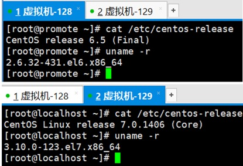
如上图这里有两台虚拟机，128是CentOS6.5（内核2.6），129是CentOS7.0（内核3.10）。Docker只能在这台129上部署安装，且安装时必须要是root权限。
1.首先要确保yum包更新到最新：
`yum -y update`
2.安装需要的软件包，yum-util 提供yum-config-manager功能，另外两个是devicemapper驱动依赖的
`yum install -y yum-utils device-mapper-persistent-data lvm2`
3.设置yum源
`yum-config-manager --add-repo https://download.docker.com/linux/centos/docker-ce.repo`
4.查看所有仓库中所有docker版本，并选择特定版本安装
`yum list docker-ce --showduplicates | sort -r`
5.安装docker，由于repo中默认只开启stable仓库，故这里安装的是最新稳定版18.03.1
`yum install -y docker-ce`
6.启动doceker并加入开机自启
`systemctl start docker`
`systemctl enable docker`
7.验证安装是否成功，如果有client和service两部分就表示docker安装启动都成功了
`docker version`
PS：如果之前已经安装了某个版本的docker，需要在进行步骤2之前先卸载原有docker
yum remove docker docker-common docker-selinux docker-engine
注意：因为上面配置的远程仓库都不是国内的网址，所以会因为网络的原因出现失败的情况，只需过时重试即可（重启解千愁）。
成功后输入docker version展示下图说明启动成功
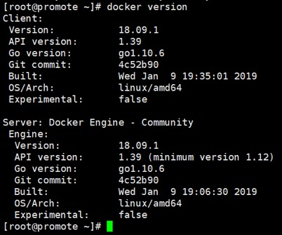
经历了上面曲折的安装过程，也就更加证明了使用阿里镜像加速的必要性：
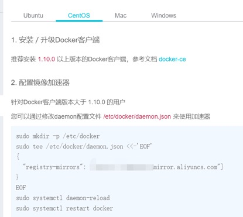
配置阿里镜像加速器也很简单，官方提供了说明文档。
 容器相关命令：
1.下载镜像文件：docker pull java:8 (下载java8)
2.安装启动容器（以nginx为例）：docker run -d -p 81:80 nginx
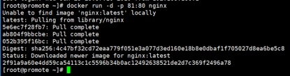
-d 后台运行
-p 宿主机端口:容器端口     #开放容器端口到宿主机端口
一般宿主机端口与容器端口相同，这里为了区分所以两个不同。
访问`http://Docker宿主机IP:81/`，将会看到nginx的主界面如下，而如果访问80端口则访问不到
注意：如果安装启动时没有在本地镜像中没有找到相关镜像文件，则直接会从远程仓库拉取，所以可以直接使用run而无需先下载pull。
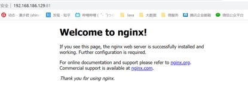
3.操作容器：docker start|stop|restart XXXX（容器ID）
4.查看本地仓库：docker images
5.查找关键字：docker search XXXX
6.查询当前所有容器：docker ps -a
7.查询当前运行容器：docker ps
8.查看容器的信息：docker inspect XXXX（容器ID）
9.卸载容器：docker rm XXXX（容器ID）
10.卸载镜像：docker rmi XXXX（镜像ID）
11.创建容器：docker create XXXX
12.杀死容器：docker kill XXXX
 然后我们以部署一个springboot  项目演示如何构建自己的docker  镜像
1.将maven打包的jar文件上传到指定目录
2.在jar包所在目录创建名为Dockerfile的文件
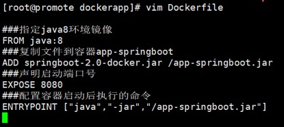
3.使用docker build命令构建镜像
docker build -t docker-springboot .
格式：docker build -t 镜像名称:标签 Dockerfile的相对位置（例子中使用“.”表示当前目录）
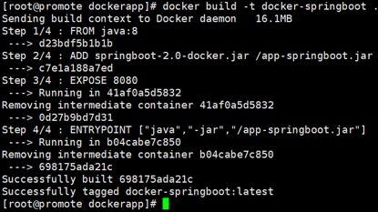
此时我们就可以使用docker images能查看到我们的镜像文件
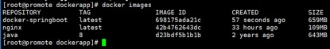
4.然后启动docker run -p 8080:8080 docker-springboot（也可以加上-d参数后台运行）
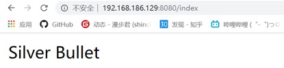
在进行容器管理时，我们可以通过一个命令来进入容器内部：
docker container exec -it 2f91a9a60e4d /bin/bash
默认情况下软件安装的目录的/etc目录下
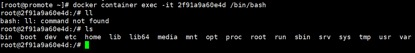
每个容器就是一个轻量化的Linux系统，并且很多Linux命令都没有集成，如vi。
退出容器时使用命令：exit。
我们都知道，对于nginx我们通常都要修改它的nginx.conf文件。因为docker安装的nginx是在容器中的，而vi命令又没有集成。虽然我们可以在容器中安装vi后并修改文件，以达到目的，但不建议这样使用。
 通过Docker  安装的软件通常我们都会使用容器挂载外部配置文件（-v  ）的方式进行，即使用挂载方式，外部的配置文件覆盖内部容器的配置文件。 
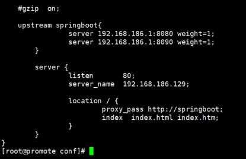
 然后通过挂载的方式启动nginx
docker run --name mynginx -d -p 80:80  -v /data/nginx/conf/nginx.conf:/etc/nginx/nginx.conf  -v /data/nginx/logs:/var/log/nginx -d docker.io/nginx
然后就可以直接访问了（注意：使用Chrome浏览器可能会出现无法轮询的问题）
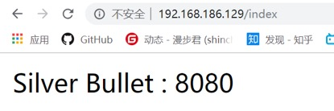
此时再进入容器中，发现容器内的nginx.conf文件与挂载的文件完全相同。
 最后是安装MySQL
1.首先下载镜像文件
docker pull mysql:5.7
docker run -d -p 81:80 nginx
2.然后创建MySQL容器
docker create --name mysql -e MYSQL_ROOT_PASSWORD=arcobaleno -p 3306:3306 mysql:5.7
3.再启动容器
docker start mysql3308
这里步骤2和步骤3也可以直接简化为docker run XXXX
然后就安装成功了
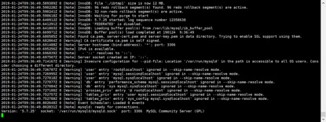
使用navicat工具测试成功。
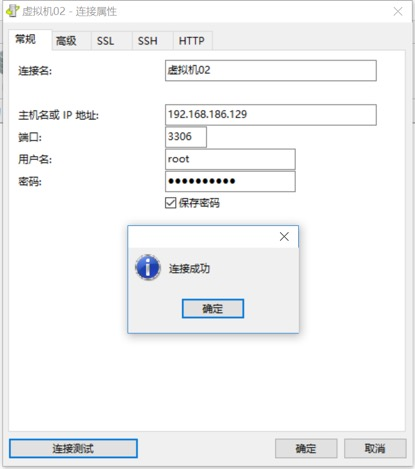
当我们需要修改MySQL的配置文件时（如主从同步、读写分离等），方法与上文修改nginx.conf文件的方法一致，即通过文件挂载的方式，这里就不再演示了。
