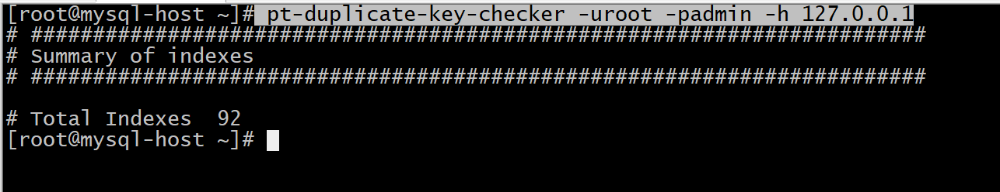
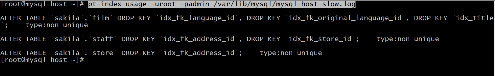
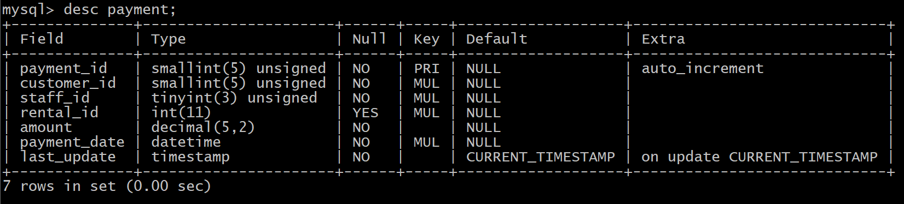
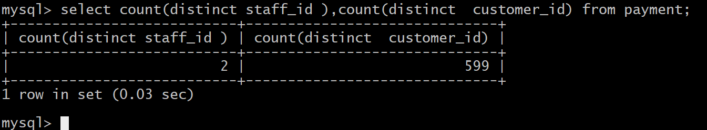

# mysql索引问题整理.md

## 索引相关问题整理

### 什么是索引?

索引的作用相当于图书的目录，可以根据目录中的页码快速找到所需的内容。
数据库使用索引以找到特定值，然后顺指针找到包含该值的行。在表中建立索引，然后在索引中找到符合查询条件的索引值，最后通过保存在索引中的ROWID（相当于页码）快速找到表中对应的记录。
索引的建立是表中比较有指向性的字段，相当于目录，
比如说行政区域代码，同一个地域的行政区域代码都是相同的，那么给这一列加上索引，避免让它重复扫描，从而达到优化的目的！

### 索引的命名规则是怎样的？

表名_字段名

### 如何创建索引？

在执行CREATE TABLE语句时可以创建索引，也可以单独用CREATE INDEX或ALTER TABLE来为表增加索引。
1、ALTER TABLE
ALTER TABLE用来创建普通索引、UNIQUE索引或PRIMARY KEY索引。
ALTER TABLE table_name ADD INDEX index_name (column_list)
ALTER TABLE table_name ADD UNIQUE (column_list)
ALTER TABLE table_name ADD PRIMARY KEY (column_list)
说明：其中table_name是要增加索引的表名，column_list指出对哪些列进行索引，多列时各列之间用逗号分隔。索引名index_name可选，缺省时，MySQL将根据第一个索引列赋一个名称。另外，ALTER TABLE允许在单个语句中更改多个表，因此可以在同时创建多个索引。

2、CREATE INDEX
CREATE INDEX可对表增加普通索引或UNIQUE索引。
CREATE INDEX index_name ON table_name (column_list)
CREATE UNIQUE INDEX index_name ON table_name (column_list)
说明：table_name、index_name和column_list具有与ALTER TABLE语句中相同的含义，索引名不可选。另外，不能用CREATE INDEX语句创建PRIMARY KEY索引。
在创建索引时，可以规定索引能否包含重复值。如果不包含，则索引应该创建为PRIMARY KEY或UNIQUE索引。
对于单列惟一性索引，这保证单列不包含重复的值。对于多列惟一性索引，保证多个值的组合不重复。
PRIMARY KEY索引和UNIQUE索引非常类似。
事实上，PRIMARY KEY索引仅是一个具有名称PRIMARY的UNIQUE索引。这表示一个表只能包含一个PRIMARY KEY，因为一个表中不可能具有两个同名的索引。
下面的SQL语句对students表在sid上添加PRIMARY KEY索引。
ALTER TABLE students ADD PRIMARY KEY (sid)

### 如何删除索引？

可利用ALTER TABLE或DROP INDEX语句来删除索引。类似于CREATE INDEX语句，DROP INDEX可以在ALTER TABLE内部作为一条语句处理，语法如下。
DROP INDEX index_name ON talbe_name
ALTER TABLE table_name DROP INDEX index_name
ALTER TABLE table_name DROP PRIMARY KEY
其中，前两条语句是等价的，删除掉table_name中的索引index_name。
第3条语句只在删除PRIMARY KEY索引时使用，因为一个表只可能有一个PRIMARY KEY索引，因此不需要指定索引名。如果没有创建PRIMARY KEY索引，但表具有一个或多个UNIQUE索引，则MySQL将删除第一个UNIQUE索引。
如果从表中删除了某列，则索引会受到影响。对于多列组合的索引，如果删除其中的某列，则该列也会从索引中删除。如果删除组成索引的所有列，则整个索引将被删除。

### 如何查看索引？

### 适合索引的情况有哪些？

1、表的主关键字
2、自动建立唯一索引
3、表的字段唯一约束
4、在where从句，group by从句，order by从句，on从句中的列添加索引

### 不适合索引的情况有哪些

1、表记录太少（如果一个表只有5条记录，采用索引去访问记录的话，那首先需访问索引表，再通过索引表访问数据表，一般索引表与数据表不在同一个数据块）
2、经常插入、删除、修改的表（对一些经常处理的业务表应在查询允许的情况下尽量减少索引）-索引主要针对查询
3、数据重复且分布平均的表字段（假如一个表有10万行记录，有一个字段A只有T和F两种值，且每个值的分布概率大约为50%，那么对这种表A字段建索引一般不会提高数据库的查询速度。）

### 什么是联合索引？

1、 两个或更多个列上的索引被称作联合索引，又被称为是复合索引。
2、 利用索引中的附加列，您可以缩小搜索的范围，但使用一个具有两列的索引 不同于使用两个单独的索引。
3、 复合索引的结构与电话簿类似，人名由姓和名构成，电话簿首先按姓氏对进行排序，然后按名字对有相同姓氏的人进行排序。如果您知 道姓，电话簿将非常有用；如果您知道姓和名，电话簿则更为有用，但如果您只知道名不姓，电话簿将没有用处。

所以说创建复合索引时，应该仔细考虑列的顺序。对索引中的所有列执行搜索或仅对前几列执行搜索时，复合索引非常有用；仅对后面的任意列执行搜索时，复合索引则没有用处。

### 索引优化方式有哪些？索引使用注意事项有哪些？

#### 1. 避免过度索引

索引不是越多越好，避免过度索引
增加索引会有利于查询效率，但会降低insert，update，delete的效率，但实际上往往不是这样的，过多的索引会不但会影响使用效率，同时会影响查询效率，这是由于数据库进行查询分析时，首先要选择使用哪一个索引进行查询，如果索引过多，分析过程就会越慢，这样同样的减少查询的效率，因此我们要知道如何增加，有时候要知道维护和删除不需要的索引
对于查询占主要的应用来说，索引显得尤为重要。很多时候性能问题很简单的就是因为我们忘了添加索引而造成的，或者说没有添加更为有效的索引导致。
如果不加索引的话，那么查找任何哪怕只是一条特定的数据都会进行一次全表扫描，如果一张表的数据量很大而符合条件的结果又很少，那么不加索引会引起致命的性能下降。
但是也不是什么情况都非得建索引不可，比如性别可能就只有两个值，建索引不仅没什么优势，还会影响到更新速度，这被称为过度索引。

#### 2. 避免重复和冗余索引

重复索引：
重复索引是指相同的列以相同的顺序建立的同类型的索引，如下表中的 primary key和ID列上的索引就是重复索引
冗余索引：
冗余索引是指多个索引的前缀列相同，或是在联合索引中包含了主键的索引，下面这个例子中key（name，id）就是一个冗余索引。
说明：对于innodb来说，每一个索引后面，实际上都会包含主键，这时候我们建立的联合索引，又人为的把主键包含进去，那么这个时候就是一个冗余索引。
掌握如何检查重复及冗余索引
工具：使用pt-duplicate-key-checker工具检查重复及冗余索引

#### 3.删除不需要使用的索引

由于业务变更，某些索引是后续不需要使用的，就要进行删除。
在mysql中，目前只能通过慢查询日志配合pt-index-usage工具来进行索引使用情况的分析；

附：<https://www.percona.com/downloads/>

#### 4.复合索需要引遵循最左原则

离散度大的列放到联合索引的前面，或者说最常用作限制条件的列放在最左边，这个也叫联合索引的最左原则
参考[深入浅析Mysql联合索引最左匹配原则](https://www.jb51.net/article/142840.htm)
比如有一条语句是这样的：select * from users where area=’beijing’ and age=22;
如果我们是在area和age上分别创建单个索引的话，由于mysql查询每次只能使用一个索引，所以虽然这样已经相对不做索引时全表扫描提高了很多效率，但是如果在area、age两列上创建复合索引的话将带来更高的效率。
如果我们创建了(area, age,salary)的复合索引，那么其实相当于创建了(area,age,salary)、(area,age)、(area)三个索引，这被称为最佳左前缀特性。
因此我们在创建复合索引时应该将最常用作限制条件的列放在最左边，依次递减。
再来个例子：
注意:
是index（staff_id，customer_id）好，还是index（customer_id，staff_id）好
那我们怎么进行验证离散度好了？
A、我们先查看一下表结构

B、分别查看这两个字段中不同的id的数量，数量越多，则表明离散程度越大：因此可以通过下图看出：customer_id 离散程度大。

结论：由于customer_id 离散程度大，使用index（customer_id，staff_id）好

#### 5. 合理使用短索引

如果一个索引中包含了数据类型为字符串的，那么可以为这一列指定长度。因为，对于很多的字符串来说，前几个就可以确定该字符是唯一的了。
例如，如果有一个CHAR(255)的 列，如果在前10 个或20 个字符内，多数值是惟一的，那么就不要对整个列进行索引。短索引不仅可以提高查询速度而且可以节省磁盘空间和I/O操作。

#### 6. 索引字段越小越好

（因为数据库数据存储单位是以“页”为单位的，数据存储的越多，IO也会越大）

#### 7. 避免索引失效

索引失效了。索引就没有意义了

### 哪些情况会导致索引失效

#### 1. 索引列为NULL，索引失效

只要列中包含有NULL值都将不会被包含在索引中，复合索引中只要有一列含有NULL值，那么这一列对于此复合索引就是无效的。所以我们在数据库设计时不要让字段的默认值为NULL。

#### 2. 同一查询，多个索引，后面索引失效

mysql查询只使用一个索引，因此如果where子句中已经使用了索引的话，那么order by中的列是不会使用索引的。因此数据库默认排序可以符合要求的情况下不要使用排序操作；尽量不要包含多个列的排序，如果需要最好给这些列创建复合索引。

#### 3. like语句，可能引起索引失效

一般情况下不鼓励使用like操作，如果非使用不可，如何使用也是一个问题。like “%aaa%” 不会使用索引而like “aaa%”可以使用索引。

#### 4. NOT IN语句，索引失效

NOT IN操作都不会使用索引将进行全表扫描。NOT IN可以NOT EXISTS代替

#### 5. where条件中是OR关系，索引失效

#### 6. 索引列进行运算，索引失效

select * from users where YEAR(adddate)
