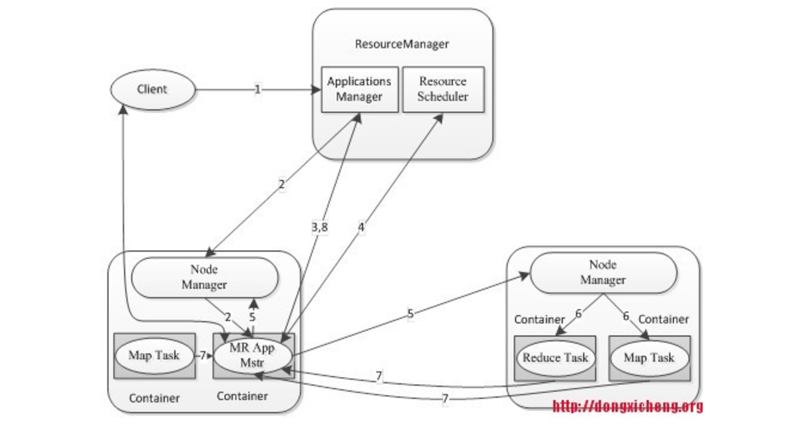
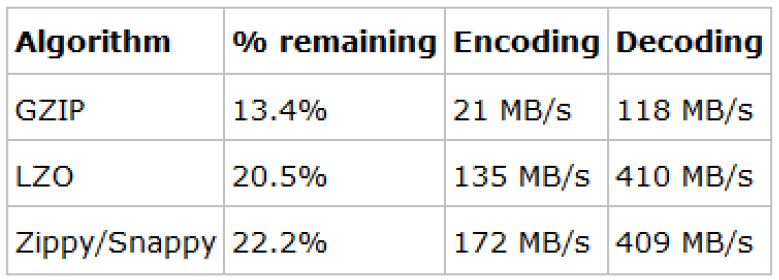
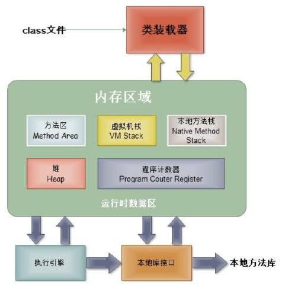
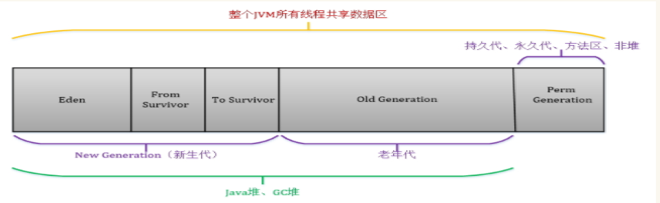

# 七 Spark（☆☆☆☆☆）

## 7.1 Spark master使用zookeeper进行HA的，有哪些元数据保存在Zookeeper?-

答：spark通过这个参数spark.deploy.zookeeper.dir指定master元数据在zookeeper中保存的位置，包括Worker，Driver和Application以及Executors。standby节点要从zk中，获得元数据信息，恢复集群运行状态，才能对外继续提供服务，作业提交资源申请等，在恢复前是不能接受请求的。另外，Master切换需要注意2点
1）在Master切换的过程中，所有的已经在运行的程序皆正常运行！因为Spark Application在运行前就已经通过Cluster Manager获得了计算资源，所以在运行时Job本身的调度和处理和Master是没有任何关系的！
2） 在Master的切换过程中唯一的影响是不能提交新的Job：一方面不能够提交新的应用程序给集群，因为只有Active Master才能接受新的程序的提交请求；另外一方面，已经运行的程序中也不能够因为Action操作触发新的Job的提交请求；

## 7.2 Spark master HA 主从切换过程不会影响集群已有的作业运行，为什么?-

答：因为程序在运行之前，已经申请过资源了，driver和Executors通讯，不需要和master进行通讯的。

## 7.3 Spark on Mesos中，什么是的粗粒度分配，什么是细粒度分配，各自的优点和缺点是什么?-

1）粗粒度：启动时就分配好资源， 程序启动，后续具体使用就使用分配好的资源，不需要再分配资源；好处：作业特别多时，资源复用率高，适合粗粒度；不好：容易资源浪费，假如一个job有1000个task，完成了999个，还有一个没完成，那么使用粗粒度，999个资源就会闲置在那里，资源浪费。
2）细粒度分配：用资源的时候分配，用完了就立即回收资源，启动会麻烦一点，启动一次分配一次，会比较麻烦。

## 7.4 如何配置spark master的HA?-

1）配置zookeeper
 2）修改spark_env.sh文件,spark的master参数不在指定，添加如下代码到各个master节点
 export SPARK_DAEMON_JAVA_OPTS="-Dspark.deploy.recoveryMode=ZOOKEEPER -Dspark.deploy.zookeeper.url=zk01:2181,zk02:2181,zk03:2181 -Dspark.deploy.zookeeper.dir=/spark"
 3）将spark_env.sh分发到各个节点
 4）找到一个master节点，执行./start-all.sh，会在这里启动主master,其他的master备节点，启动master命令: ./sbin/start-master.sh
 5）提交程序的时候指定master的时候要指定三台master，例如
./spark-shell --master spark://master01:7077,master02:7077,master03:7077

## 7.5 Apache Spark有哪些常见的稳定版本，Spark1.6.0的数字分别代表什么意思?-

答：常见的大的稳定版本有Spark 1.3,Spark1.6, Spark 2.0 ，Spark1.6.0的数字含义
1）第一个数字：1
major version : 代表大版本更新，一般都会有一些 api 的变化，以及大的优化或是一些结构的改变；
2）第二个数字：6
minor version : 代表小版本更新，一般会新加 api，或者是对当前的 api 就行优化，或者是其他内容的更新，比如说 WEB UI 的更新等等；
3）第三个数字：0
patch version ， 代表修复当前小版本存在的一些 bug，基本不会有任何 api 的改变和功能更新；记得有一个大神曾经说过，如果要切换 spark 版本的话，最好选 patch version 非 0 的版本，因为一般类似于 1.2.0, … 1.6.0 这样的版本是属于大更新的，有可能会有一些隐藏的 bug 或是不稳定性存在，所以最好选择 1.2.1, … 1.6.1 这样的版本。
通过版本号的解释说明，可以很容易了解到，spark2.1.1的发布时是针对大版本2.1做的一些bug修改，不会新增功能，也不会新增API，会比2.1.0版本更加稳定。

## 7.6 driver的功能是什么?-

1）一个Spark作业运行时包括一个Driver进程，也是作业的主进程，具有main函数，并且有SparkContext的实例，是程序的入口点；
2）功能：负责向集群申请资源，向master注册信息，负责了作业的调度，负责作业的解析、生成Stage并调度Task到Executor上。包括DAGScheduler，TaskScheduler。

## 7.7 spark的有几种部署模式，每种模式特点?-（☆☆☆☆☆）

1）本地模式
Spark不一定非要跑在hadoop集群，可以在本地，起多个线程的方式来指定。将Spark应用以多线程的方式直接运行在本地，一般都是为了方便调试，本地模式分三类
·local：只启动一个executor
·local[k]:启动k个executor
·local[*]：启动跟cpu数目相同的 executor
2）standalone模式
分布式部署集群，自带完整的服务，资源管理和任务监控是Spark自己监控，这个模式也是其他模式的基础。
3）Spark on yarn模式
分布式部署集群，资源和任务监控交给yarn管理，但是目前仅支持粗粒度资源分配方式，包含cluster和client运行模式，cluster适合生产，driver运行在集群子节点，具有容错功能，client适合调试，dirver运行在客户端
4）Spark On Mesos模式。
官方推荐这种模式（当然，原因之一是血缘关系）。正是由于Spark开发之初就考虑到支持Mesos，因此，目前而言，Spark运行在Mesos上会比运行在YARN上更加灵活，更加自然。用户可选择两种调度模式之一运行自己的应用程序：
（1）粗粒度模式（Coarse-grained Mode）：每个应用程序的运行环境由一个Dirver和若干个Executor组成，其中，每个Executor占用若干资源，内部可运行多个Task（对应多少个“slot”）。应用程序的各个任务正式运行之前，需要将运行环境中的资源全部申请好，且运行过程中要一直占用这些资源，即使不用，最后程序运行结束后，回收这些资源。
（2）细粒度模式（Fine-grained Mode）：鉴于粗粒度模式会造成大量资源浪费，Spark On Mesos还提供了另外一种调度模式：细粒度模式，这种模式类似于现在的云计算，思想是按需分配。

## 7.8 Spark技术栈有哪些组件，每个组件都有什么功能，适合什么应用场景?-

答：可以画一个这样的技术栈图先，然后分别解释下每个组件的功能和场景
1）Spark core：是其它组件的基础，spark的内核，主要包含：有向循环图、RDD、Lingage、Cache、broadcast等，并封装了底层通讯框架，是Spark的基础。
2）SparkStreaming是一个对实时数据流进行高通量、容错处理的流式处理系统，可以对多种数据源（如Kdfka、Flume、Twitter、Zero和TCP 套接字）进行类似Map、Reduce和Join等复杂操作，将流式计算分解成一系列短小的批处理作业。
3）Spark sql：Shark是SparkSQL的前身，Spark SQL的一个重要特点是其能够统一处理关系表和RDD，使得开发人员可以轻松地使用SQL命令进行外部查询，同时进行更复杂的数据分析
4）BlinkDB ：是一个用于在海量数据上运行交互式 SQL 查询的大规模并行查询引擎，它允许用户通过权衡数据精度来提升查询响应时间，其数据的精度被控制在允许的误差范围内。
5）MLBase是Spark生态圈的一部分专注于机器学习，让机器学习的门槛更低，让一些可能并不了解机器学习的用户也能方便地使用MLbase。MLBase分为四部分：MLlib、MLI、ML Optimizer和MLRuntime。
6）GraphX是Spark中用于图和图并行计算

## 7.9 Spark中Worker的主要工作是什么?-

主要功能：管理当前节点内存，CPU的使用状况，接收master分配过来的资源指令，通过ExecutorRunner启动程序分配任务，worker就类似于包工头，管理分配新进程，做计算的服务，相当于process服务。
需要注意的是：
1）worker会不会汇报当前信息给master，worker心跳给master主要只有workid，它不会发送资源信息以心跳的方式给mater，master分配的时候就知道work，只有出现故障的时候才会发送资源。
2）worker不会运行代码，具体运行的是Executor是可以运行具体appliaction写的业务逻辑代码，操作代码的节点，它不会运行程序的代码的。

## 7.10 Spark为什么比mapreduce快?-（☆☆☆☆☆）

1）基于内存计算，减少低效的磁盘交互；
2）高效的调度算法，基于DAG；
3）容错机制Linage，精华部分就是DAG和Lingae

## 7.11 简单说一下hadoop和spark的shuffle相同和差异?-（☆☆☆☆☆）

1）从 high-level 的角度来看，两者并没有大的差别。 都是将 mapper（Spark 里是 ShuffleMapTask）的输出进行 partition，不同的 partition 送到不同的 reducer（Spark 里 reducer 可能是下一个 stage 里的 ShuffleMapTask，也可能是 ResultTask）。Reducer 以内存作缓冲区，边 shuffle 边 aggregate 数据，等到数据 aggregate 好以后进行 reduce() （Spark 里可能是后续的一系列操作）。
2）从 low-level 的角度来看，两者差别不小。 Hadoop MapReduce 是 sort-based，进入 combine() 和 reduce() 的 records 必须先 sort。这样的好处在于 combine/reduce() 可以处理大规模的数据，因为其输入数据可以通过外排得到（mapper 对每段数据先做排序，reducer 的 shuffle 对排好序的每段数据做归并）。目前的 Spark 默认选择的是 hash-based，通常使用 HashMap 来对 shuffle 来的数据进行 aggregate，不会对数据进行提前排序。如果用户需要经过排序的数据，那么需要自己调用类似 sortByKey() 的操作；如果你是Spark 1.1的用户，可以将spark.shuffle.manager设置为sort，则会对数据进行排序。在Spark 1.2中，sort将作为默认的Shuffle实现。
3）从实现角度来看，两者也有不少差别。 Hadoop MapReduce 将处理流程划分出明显的几个阶段：map(), spill, merge, shuffle, sort, reduce() 等。每个阶段各司其职，可以按照过程式的编程思想来逐一实现每个阶段的功能。在 Spark 中，没有这样功能明确的阶段，只有不同的 stage 和一系列的 transformation()，所以 spill, merge, aggregate 等操作需要蕴含在 transformation() 中。
如果我们将 map 端划分数据、持久化数据的过程称为 shuffle write，而将 reducer 读入数据、aggregate 数据的过程称为 shuffle read。那么在 Spark 中，问题就变为怎么在 job 的逻辑或者物理执行图中加入 shuffle write 和 shuffle read 的处理逻辑?-以及两个处理逻辑应该怎么高效实现?-
Shuffle write由于不要求数据有序，shuffle write 的任务很简单：将数据 partition 好，并持久化。之所以要持久化，一方面是要减少内存存储空间压力，另一方面也是为了 fault-tolerance。

## 7.12 Mapreduce和Spark的都是并行计算，那么他们有什么相同和区别

答：两者都是用mr模型来进行并行计算:
1）hadoop的一个作业称为job，job里面分为map task和reduce task，每个task都是在自己的进程中运行的，当task结束时，进程也会结束。
2）spark用户提交的任务成为application，一个application对应一个sparkcontext，app中存在多个job，每触发一次action操作就会产生一个job。这些job可以并行或串行执行，每个job中有多个stage，stage是shuffle过程中DAGSchaduler通过RDD之间的依赖关系划分job而来的，每个stage里面有多个task，组成taskset有TaskSchaduler分发到各个executor中执行，executor的生命周期是和app一样的，即使没有job运行也是存在的，所以task可以快速启动读取内存进行计算。
3）hadoop的job只有map和reduce操作，表达能力比较欠缺而且在mr过程中会重复的读写hdfs，造成大量的io操作，多个job需要自己管理关系。
spark的迭代计算都是在内存中进行的，API中提供了大量的RDD操作如join，groupby等，而且通过DAG图可以实现良好的容错。

## 7.13 RDD机制?-

rdd分布式弹性数据集，简单的理解成一种数据结构，是spark框架上的通用货币。
所有算子都是基于rdd来执行的，不同的场景会有不同的rdd实现类，但是都可以进行互相转换。
rdd执行过程中会形成dag图，然后形成lineage保证容错性等。 从物理的角度来看rdd存储的是block和node之间的映射。

## 7.14 spark有哪些组件?-

1）master：管理集群和节点，不参与计算。
2）worker：计算节点，进程本身不参与计算，和master汇报。
3）Driver：运行程序的main方法，创建spark context对象。
4）spark context：控制整个application的生命周期，包括dagsheduler和task scheduler等组件。
5）client：用户提交程序的入口。

## 7.15 spark工作机制?- （☆☆☆☆☆）

答：用户在client端提交作业后，会由Driver运行main方法并创建spark context上下文。
执行add算子，形成dag图输入dagscheduler，按照rdd之间的依赖关系划分stage输入task scheduler。 task scheduler会将stage划分为task 9set分发到各个节点的executor中执行。

## 7.16 spark的优化怎么做?- （☆☆☆☆☆）

答： spark调优比较复杂，但是大体可以分为三个方面来进行，1）平台层面的调优：防止不必要的jar包分发，提高数据的本地性，选择高效的存储格式如parquet，2）应用程序层面的调优：过滤操作符的优化降低过多小任务，降低单条记录的资源开销，处理数据倾斜，复用RDD进行缓存，作业并行化执行等等，3）JVM层面的调优：设置合适的资源量，设置合理的JVM，启用高效的序列化方法如kyro，增大off head内存等等

## 7.17 简要描述Spark分布式集群搭建的步骤

1）准备linux环境，设置集群搭建账号和用户组，设置ssh，关闭防火墙，关闭seLinux，配置host，hostname
2）配置jdk到环境变量
3）搭建hadoop集群，如果要做master ha，需要搭建zookeeper集群
   修改hdfs-site.xml,hadoop_env.sh,yarn-site.xml,slaves等配置文件
4）启动hadoop集群，启动前要格式化namenode
5）配置spark集群，修改spark-env.xml，slaves等配置文件，拷贝hadoop相关配置到spark conf目录下
6）启动spark集群。

## 7.18 什么是RDD宽依赖和窄依赖?-

RDD和它依赖的parent RDD(s)的关系有两种不同的类型，即窄依赖（narrow dependency）和宽依赖（wide dependency）。
1）窄依赖指的是每一个parent RDD的Partition最多被子RDD的一个Partition使用
2）宽依赖指的是多个子RDD的Partition会依赖同一个parent RDD的Partition

## 7.19 spark-submit的时候如何引入外部jar包

方法一：spark-submit –jars
根据spark官网，在提交任务的时候指定–jars，用逗号分开。这样做的缺点是每次都要指定jar包，如果jar包少的话可以这么做，但是如果多的话会很麻烦。
命令：spark-submit --master yarn-client --jars ***.jar,***.jar
方法二：extraClassPath
提交时在spark-default中设定参数，将所有需要的jar包考到一个文件里，然后在参数中指定该目录就可以了，较上一个方便很多：
spark.executor.extraClassPath=/home/hadoop/wzq_workspace/lib/* spark.driver.extraClassPath=/home/hadoop/wzq_workspace/lib/*
需要注意的是，你要在所有可能运行spark任务的机器上保证该目录存在，并且将jar包考到所有机器上。这样做的好处是提交代码的时候不用再写一长串jar了，缺点是要把所有的jar包都拷一遍。

## 7.20 cache和pesist的区别

1）cache和persist都是用于将一个RDD进行缓存的，这样在之后使用的过程中就不需要重新计算了，可以大大节省程序运行时间；
2） cache只有一个默认的缓存级别MEMORY_ONLY ，cache调用了persist，而persist可以根据情况设置其它的缓存级别；
3）executor执行的时候，默认60%做cache，40%做task操作，persist最根本的函数，最底层的函数

## 7.21 cache后面能不能接其他算子,它是不是action操作?-

答：cache可以接其他算子，但是接了算子之后，起不到缓存应有的效果，因为会重新触发cache。
cache不是action操作

## 7.22 reduceByKey是不是action?-

答：不是，很多人都会以为是action，reduce rdd是action

## 7.23数据本地性是在哪个环节确定的?-（☆☆☆☆☆）

具体的task运行在那他机器上，dag划分stage的时候确定的

## 7.24 RDD的弹性表现在哪几点?-（☆☆☆☆☆）

1）自动的进行内存和磁盘的存储切换；
2）基于Lineage的高效容错；
3）task如果失败会自动进行特定次数的重试；
4）stage如果失败会自动进行特定次数的重试，而且只会计算失败的分片；
5）checkpoint和persist，数据计算之后持久化缓存
6）数据调度弹性，DAG TASK调度和资源无关
7）数据分片的高度弹性，a.分片很多碎片可以合并成大的，b.par

## 7.25 常规的容错方式有哪几种类型?-

1）数据检查点,会发生拷贝，浪费资源
2）记录数据的更新，每次更新都会记录下来，比较复杂且比较消耗性能。

## 7.26 RDD通过Linage（记录数据更新）的方式为何很高效?-

1）lazy记录了数据的来源，RDD是不可变的，且是lazy级别的，且RDD之间构成了链条，lazy是弹性的基石。由于RDD不可变，所以每次操作就产生新的rdd，不存在全局修改的问题，控制难度下降，所有有计算链条将复杂计算链条存储下来，计算的时候从后往前回溯
900步是上一个stage的结束，要么就checkpoint
2）记录原数据，是每次修改都记录，代价很大如果修改一个集合，代价就很小，官方说rdd是粗粒度的操作，是为了效率，为了简化，每次都是操作数据集合，写或者修改操作，都是基于集合的rdd的写操作是粗粒度的，rdd的读操作既可以是粗粒度的也可以是细粒度，读可以读其中的一条条的记录。
3）简化复杂度，是高效率的一方面，写的粗粒度限制了使用场景如网络爬虫，现实世界中，大多数写是粗粒度的场景。

## 7.27 RDD有哪些缺陷?-（☆☆☆☆☆）

1）不支持细粒度的写和更新操作（如网络爬虫），spark写数据是粗粒度的。所谓粗粒度，就是批量写入数据，为了提高效率。但是读数据是细粒度的也就是说可以一条条的读。
2）不支持增量迭代计算，Flink支持

## 7.28 说一说Spark程序编写的一般步骤?-

答：初始化，资源，数据源，并行化，rdd转化，action算子打印输出结果或者也可以存至相应的数据存储介质，具体的可看下图：

## 7.29 Spark有哪两种算子?-

答：Transformation（转化）算子和Action（执行）算子。

## 7.30 Spark提交你的jar包时所用的命令是什么?-

答：spark-submit。

## 7.31 Spark有哪些聚合类的算子,我们应该尽量避免什么类型的算子?-

答：在我们的开发过程中，能避免则尽可能避免使用reduceByKey、join、distinct、repartition等会进行shuffle的算子，尽量使用map类的非shuffle算子。这样的话，没有shuffle操作或者仅有较少shuffle操作的Spark作业，可以大大减少性能开销。

## 7.32 你所理解的Spark的shuffle过程?-（☆☆☆☆☆）

答：从下面三点去展开
1）shuffle过程的划分
2）shuffle的中间结果如何存储
3）shuffle的数据如何拉取过来
可以参考这篇博文：<http://www.cnblogs.com/jxhd1/p/6528540.html>

## 7.33 你如何从Kafka中获取数据?-

1）基于Receiver的方式
这种方式使用Receiver来获取数据。Receiver是使用Kafka的高层次Consumer API来实现的。receiver从Kafka中获取的数据都是存储在Spark Executor的内存中的，然后Spark Streaming启动的job会去处理那些数据。
2）基于Direct的方式
这种新的不基于Receiver的直接方式，是在Spark 1.3中引入的，从而能够确保更加健壮的机制。替代掉使用Receiver来接收数据后，这种方式会周期性地查询Kafka，来获得每个topic+partition的最新的offset，从而定义每个batch的offset的范围。当处理数据的job启动时，就会使用Kafka的简单consumer api来获取Kafka指定offset范围的数据

## 7.34 对于Spark中的数据倾斜问题你有什么好的方案?-（☆☆☆☆☆）

1）前提是定位数据倾斜，是OOM了，还是任务执行缓慢，看日志，看WebUI
2）解决方法，有多个方面
（1）避免不必要的shuffle，如使用广播小表的方式，将reduce-side-join提升为map-side-join
（2）分拆发生数据倾斜的记录，分成几个部分进行，然后合并join后的结果
（3）改变并行度，可能并行度太少了，导致个别task数据压力大
（4）两阶段聚合，先局部聚合，再全局聚合
（5）自定义paritioner，分散key的分布，使其更加均匀
详细解决方案参考我们的教案或者博文[《Spark数据倾斜优化方法》](http://mp.weixin.qq.com/s?__biz=MzIzNzI1NzY3Nw==&mid=2247484221&idx=1&sn=7e20f08bfb490b91f0920aefb29ca271&chksm=e8ca159fdfbd9c89f610dd230e07f414521b4dd13018994ee9b873421d1e8efcdc535c810225&scene=21#wechat_redirect)

## 7.35 RDD创建有哪几种方式?-

1）使用程序中的集合创建rdd
2）使用本地文件系统创建rdd
3）使用hdfs创建rdd，
4）基于数据库db创建rdd
5）基于Nosql创建rdd，如hbase
6）基于s3创建rdd，
7）基于数据流，如socket创建rdd
如果只回答了前面三种，是不够的，只能说明你的水平还是入门级的，实践过程中有很多种创建方式。

## 7.36 Spark并行度怎么设置比较合适

spark并行度，每个core承载2~4个partition,如，32个core，那么64~128之间的并行度，也就是设置64~128个partion，并行读和数据规模无关，只和内存使用量和cpu使用时间有关。

## 7.37 Spark中数据的位置是被谁管理的?-

每个数据分片都对应具体物理位置，数据的位置是被blockManager，无论
数据是在磁盘，内存还是tacyan，都是由blockManager管理。

## 7.38 Spark的数据本地性有哪几种?-（☆☆☆☆☆）

答：Spark中的数据本地性有三种：
1）PROCESS_LOCAL是指读取缓存在本地节点的数据
2）NODE_LOCAL是指读取本地节点硬盘数据
3）ANY是指读取非本地节点数据
通常读取数据PROCESS_LOCAL>NODE_LOCAL>ANY，尽量使数据以PROCESS_LOCAL或NODE_LOCAL方式读取。其中PROCESS_LOCAL还和cache有关，如果RDD经常用的话将该RDD cache到内存中，注意，由于cache是lazy的，所以必须通过一个action的触发，才能真正的将该RDD cache到内存中。

## 7.39 rdd有几种操作类型?-

1）transformation，rdd由一种转为另一种rdd
2）action
3）cronroller，crontroller是控制算子,cache,persist，对性能和效率的有很好的支持
三种类型，不要回答只有2中操作

## 7.40 Spark如何处理不能被序列化的对象?-

将不能序列化的内容封装成object

## 7.41 collect功能是什么，其底层是怎么实现的?-

答：driver通过collect把集群中各个节点的内容收集过来汇总成结果，collect返回结果是Array类型的，collect把各个节点上的数据抓过来，抓过来数据是Array型，collect对Array抓过来的结果进行合并，合并后Array中只有一个元素，是tuple类型（KV类型的）的。

## 7.42 Spark程序执行，有时候默认为什么会产生很多task，怎么修改默认task执行个数?-

1）因为输入数据有很多task，尤其是有很多小文件的时候，有多少个输入
block就会有多少个task启动；
2）spark中有partition的概念，每个partition都会对应一个task，task越多，在处理大规模数据的时候，就会越有效率。不过task并不是越多越好，如果平时测试，或者数据量没有那么大，则没有必要task数量太多。
3）参数可以通过spark_home/conf/spark-default.conf配置文件设置:
spark.sql.shuffle.partitions 50
spark.default.parallelism 10
第一个是针对spark sql的task数量
第二个是非spark sql程序设置生效

## 7.43 为什么Spark Application在没有获得足够的资源，job就开始执行了，可能会导致什么什么问题发生?-

答：会导致执行该job时候集群资源不足，导致执行job结束也没有分配足够的资源，分配了部分Executor，该job就开始执行task，应该是task的调度线程和Executor资源申请是异步的；如果想等待申请完所有的资源再执行job的：需要将spark.scheduler.maxRegisteredResourcesWaitingTime设置的很大；spark.scheduler.minRegisteredResourcesRatio 设置为1，但是应该结合实际考虑
否则很容易出现长时间分配不到资源，job一直不能运行的情况。

## 7.44 map与flatMap的区别

map：对RDD每个元素转换，文件中的每一行数据返回一个数组对象。
flatMap：对RDD每个元素转换，然后再扁平化。
将所有的对象合并为一个对象，文件中的所有行数据仅返回一个数组对象，会抛弃值为null的值。

## 7.45 列举你常用的action?-

collect，reduce,take,count,saveAsTextFile等

## 7.46 Spark为什么要持久化，一般什么场景下要进行persist操作?-

为什么要进行持久化?-
spark所有复杂一点的算法都会有persist身影，spark默认数据放在内存，spark很多内容都是放在内存的，非常适合高速迭代，1000个步骤
只有第一个输入数据，中间不产生临时数据，但分布式系统风险很高，所以容易出错，就要容错，rdd出错或者分片可以根据血统算出来，如果没有对父rdd进行persist 或者cache的化，就需要重头做。
以下场景会使用persist
1）某个步骤计算非常耗时，需要进行persist持久化
2）计算链条非常长，重新恢复要算很多步骤，很好使，persist
3）checkpoint所在的rdd要持久化persist。
lazy级别，框架发现有checnkpoint，checkpoint时单独触发一个job，需要重算一遍，checkpoint前，要持久化，写个rdd.cache或者rdd.persist，将结果保存起来，再写checkpoint操作，这样执行起来会非常快，不需要重新计算rdd链条了。checkpoint之前一定会进行persist。
4）shuffle之后为什么要persist，shuffle要进性网络传输，风险很大，数据丢失重来，恢复代价很大
5）shuffle之前进行persist，框架默认将数据持久化到磁盘，这个是框架自动做的。

## 7.47 为什么要进行序列化

序列化可以减少数据的体积，减少存储空间，高效存储和传输数据，不好的是使用的时候要反序列化，非常消耗CPU。

## 7.48 介绍一下join操作优化经验?-（☆☆☆☆☆）

join其实常见的就分为两类： map-side join 和  reduce-side join。当大表和小表join时，用map-side join能显著提高效率。将多份数据进行关联是数据处理过程中非常普遍的用法，不过在分布式计算系统中，这个问题往往会变的非常麻烦，因为框架提供的 join 操作一般会将所有数据根据 key 发送到所有的 reduce 分区中去，也就是 shuffle 的过程。造成大量的网络以及磁盘IO消耗，运行效率极其低下，这个过程一般被称为 reduce-side-join。如果其中有张表较小的话，我们则可以自己实现在 map 端实现数据关联，跳过大量数据进行 shuffle 的过程，运行时间得到大量缩短，根据不同数据可能会有几倍到数十倍的性能提升。
备注：这个题目面试中非常非常大概率见到，务必搜索相关资料掌握，这里抛砖引玉。

## 7.49 介绍一下cogroup rdd实现原理，你在什么场景下用过这个rdd?-

cogroup的函数实现:这个实现根据两个要进行合并的两个RDD操作,生成一个CoGroupedRDD的实例,这个RDD的返回结果是把相同的key中两个RDD分别进行合并操作，最后返回的RDD的value是一个Pair的实例,这个实例包含两个Iterable的值，第一个值表示的是RDD1中相同KEY的值，第二个值表示的是RDD2中相同key的值.由于做cogroup的操作，需要通过partitioner进行重新分区的操作，因此，执行这个流程时，需要执行一次shuffle的操作(如果要进行合并的两个RDD的都已经是shuffle后的rdd，同时他们对应的partitioner相同时，就不需要执行shuffle,)，场景：表关联查询。

## 7.50 下面这段代码输出结果是什么?-

```java
def joinRdd(sc:SparkContext) {
val name= Array(
Tuple2(1,"spark"),
Tuple2(2,"tachyon"),
Tuple2(3,"hadoop")
)
val score= Array(
Tuple2(1,100),
Tuple2(2,90),
Tuple2(3,80)
)
val namerdd=sc.parallelize(name);
val scorerdd=sc.parallelize(score);
val result = namerdd.join(scorerdd);
result .collect.foreach(println);
}

```

答案:
(1,(Spark,100))
(2,(tachyon,90))
(3,(hadoop,80))

## 7.52 描述Yarn执行一个任务的过程?-（☆☆☆☆☆）


1）客户端client向ResouceManager提交Application，ResouceManager接受Application
并根据集群资源状况选取一个node来启动Application的任务调度器driver（ApplicationMaster）
2）ResouceManager找到那个node，命令其该node上的nodeManager来启动一个新的
JVM进程运行程序的driver（ApplicationMaster）部分，driver（ApplicationMaster）启动时会首先向ResourceManager注册，说明由自己来负责当前程序的运行。
3）driver（ApplicationMaster）开始下载相关jar包等各种资源，基于下载的jar等信息决定向ResourceManager申请具体的资源内容。
4）ResouceManager接受到driver（ApplicationMaster）提出的申请后，会最大化的满足
资源分配请求，并发送资源的元数据信息给driver（ApplicationMaster）；
5）driver（ApplicationMaster）收到发过来的资源元数据信息后会根据元数据信息发指令给具体机器上的NodeManager，让其启动具体的container。
6）NodeManager收到driver发来的指令，启动container，container启动后必须向driver（ApplicationMaster）注册。
7）driver（ApplicationMaster）收到container的注册，开始进行任务的调度和计算，直到
任务完成。
补充：如果ResourceManager第一次没有能够满足driver（ApplicationMaster）的资源请求
，后续发现有空闲的资源，会主动向driver（ApplicationMaster）发送可用资源的元数据信息以提供更多的资源用于当前程序的运行。

## 7.53 Yarn中的container是由谁负责销毁的，在Hadoop Mapreduce中container可以复用么?-

答：ApplicationMaster负责销毁，在Hadoop Mapreduce不可以复用，在spark on yarn程序container可以复用

## 7.54 提交任务时，如何指定Spark Application的运行模式?-

1）cluster模式：./spark-submit --class xx.xx.xx --master yarn --deploy-mode cluster xx.jar
2）client模式：./spark-submit --class xx.xx.xx --master yarn --deploy-mode client xx.jar

## 7.55 不启动Spark集群Master和work服务，可不可以运行Spark程序?-

可以，只要资源管理器第三方管理就可以，如由yarn管理，spark集群不启动也可以使用spark；spark集群启动的是work和master，这个其实就是资源管理框架，yarn中的resourceManager相当于master，NodeManager相当于worker，做计算是Executor，和spark集群的work和manager可以没关系，归根接底还是JVM的运行，只要所在的JVM上安装了spark就可以。

## 7.56 Spark中的4040端口由什么功能?-

收集Spark作业运行的信息

## 7.57 spark on yarn Cluster 模式下，ApplicationMaster和driver是在同一个进程么?-

是,driver 位于ApplicationMaster进程中。该进程负责申请资源，还负责监控程序、资源的动态情况。

## 7.58 如何使用命令查看application运行的日志信息

`yarn logs -applicationId <app ID>`

## 7.59 Spark on Yarn 模式有哪些优点?-（☆☆☆☆☆）

1）与其他计算框架共享集群资源（eg.Spark框架与MapReduce框架同时运行，如果不用Yarn进行资源分配，MapReduce分到的内存资源会很少，效率低下）；资源按需分配，进而提高集群资源利用等。
2）相较于Spark自带的Standalone模式，Yarn的资源分配更加细致
3）Application部署简化，例如Spark，Storm等多种框架的应用由客户端提交后，由Yarn负责资源的管理和调度，利用Container作为资源隔离的单位，以它为单位去使用内存,cpu等。
4）Yarn通过队列的方式，管理同时运行在Yarn集群中的多个服务，可根据不同类型的应用程序负载情况，调整对应的资源使用量，实现资源弹性管理。

## 7.60 谈谈你对container的理解?-（☆☆☆☆☆）

1）Container作为资源分配和调度的基本单位，其中封装了的资源如内存，CPU，磁盘，网络带宽等。 目前yarn仅仅封装内存和CPU
2）Container由ApplicationMaster向ResourceManager申请的，由ResouceManager中的资源调度器异步分配给ApplicationMaster
3）Container的运行是由ApplicationMaster向资源所在的NodeManager发起的，Container运行时需提供内部执行的任务命令.

## 7.61 运行在yarn中Application有几种类型的container?-

1）运行ApplicationMaster的Container：这是由ResourceManager（向内部的资源调度器）申请和启动的，用户提交应用程序时，可指定唯一的ApplicationMaster所需的资源；
2）运行各类任务的Container：这是由ApplicationMaster向ResourceManager申请的，并由ApplicationMaster与NodeManager通信以启动之。

## 7.62 Spark on Yarn架构是怎么样的?-（要会画哦，这个图）

Yarn提到的App Master可以理解为Spark中Standalone模式中的driver。Container中运行着Executor,在Executor中以多线程并行的方式运行Task。运行过程和第二题相似。

## 7.63 Executor启动时，资源通过哪几个参数指定?-

1）num-executors是executor的数量
2）executor-memory 是每个executor使用的内存
3）executor-cores 是每个executor分配的CPU

## 7.64 为什么会产生yarn，解决了什么问题，有什么优势?-

1）为什么产生yarn，针对MRV1的各种缺陷提出来的资源管理框架
2）解决了什么问题，有什么优势，参考这篇博文：<http://www.aboutyun.com/forum.php?mod=viewthread&tid=6785>

## 7.65 Mapreduce的执行过程?-

阶段1：input/map/partition/sort/spill
阶段2：mapper端merge
阶段3：reducer端merge/reduce/output
详细过程参考这个<http://www.cnblogs.com/hipercomer/p/4516581.html>

## 7.66 一个task的map数量由谁来决定?-

一般情况下，在输入源是文件的时候，一个task的map数量由splitSize来决定的，那么splitSize是由以下几个来决定的
goalSize = totalSize / mapred.map.tasks
inSize = max {mapred.min.split.size, minSplitSize}
splitSize = max (minSize, min(goalSize, dfs.block.size))
一个task的reduce数量，由partition决定。

## 7.69 你们提交的job任务大概有多少个?-这些job执行完大概用多少时间?-

500个
还是考察你开发完程序有没有认真观察过程序的运行，有没有评估程序运行的效率

## 7.70 你们业务数据量多大?-有多少行数据?-

这个也是看你们有没有实际的经验,对于没有实战的同学，请把回答的侧重点放在MR的运行机制上面，MR运行效率方面，以及如何优化MR程序（看别人的优化demo，然后在虚拟机上拿demo做一下测试）。

## 7.72 列出你所知道的调度器，说明其工作原理

1）Fifo schedular 默认的调度器  先进先出
2）Capacity schedular  计算能力调度器  选择占用内存小  优先级高的
3）Fair schedular 调度器  公平调度器  所有job 占用相同资源

## 7.73 YarnClient模式下，执行Spark SQL报这个错，Exception in thread "Thread-2" java.lang.OutOfMemoryError: PermGen space，但是在Yarn Cluster模式下正常运行，可能是什么原因?-

1）原因查询过程中调用的是Hive的获取元数据信息、SQL解析，并且使用Cglib等进行序列化反序列化，中间可能产生较多的class文件，导致JVM中的持久代使用较多Cluster模式的持久代默认大小是64M，Client模式的持久代默认大小是32M，而Driver端进行SQL处理时，其持久代的使用可能会达到90M，导致OOM溢出，任务失败。
yarn-cluster模式下出现，yarn-client模式运行时倒是正常的，原来在$SPARK_HOME/bin/spark-class文件中已经设置了持久代大小：
JAVA_OPTS="-XX:MaxPermSize=256m $OUR_JAVA_OPTS"
2）解决方法:在Spark的conf目录中的spark-defaults.conf里，增加对Driver的JVM配置，因为Driver才负责SQL的解析和元数据获取。配置如下：
spark.driver.extraJavaOptions -XX:PermSize=128M -XX:MaxPermSize=256M

## 7.74 spark.driver.extraJavaOptions这个参数是什么意思，你们生产环境配了多少?-

传递给executors的JVM选项字符串。例如GC设置或者其它日志设置。注意，在这个选项中设置Spark属性或者堆大小是不合法的。Spark属性需要用SparkConf对象或者spark-submit脚本用到的spark-defaults.conf文件设置。堆内存可以通过spark.executor.memory设置。

## 7.75 导致Executor产生FULL gc 的原因，可能导致什么问题?-

答：可能导致Executor僵死问题，海量数据的shuffle和数据倾斜等都可能导致full gc。以shuffle为例，伴随着大量的Shuffle写操作，JVM的新生代不断GC，Eden Space写满了就往Survivor Space写，同时超过一定大小的数据会直接写到老生代，当新生代写满了之后，也会把老的数据搞到老生代，如果老生代空间不足了，就触发FULL GC，还是空间不够，那就OOM错误了，此时线程被Blocked，导致整个Executor处理数据的进程被卡住。

## 7.77 Spark执行任务时出现java.lang.OutOfMemoryError: GC overhead limit exceeded和java.lang.OutOfMemoryError: java heap space原因和解决方法?-（☆☆☆☆☆）

答：原因：加载了太多资源到内存，本地的性能也不好，gc时间消耗的较多
解决方法：
1）增加参数，-XX:-UseGCOverheadLimit，关闭这个特性，同时增加heap大小，-Xmx1024m
2）下面这个两个参数调大点
export SPARK_EXECUTOR_MEMORY=6000M
export SPARK_DRIVER_MEMORY=7000M
可以参考这个：<http://www.cnblogs.com/hucn/p/3572384.html>

## 7.78 请列出在你以前工作中所使用过的开发map /reduce的语言

答：java，Scala，Python，shell

## 7.79 你认为/etc/hosts配置错误，会对集群有什么影响?-

1）直接导致域名没法解析，主节点与子节点，子节点与子节点没法正常通讯。
2）间接导致配置错误的相关节点删的服务不正常，甚至没法启动，job执行失败等等。

## 7.80 Spark使用parquet文件存储格式能带来哪些好处?-（☆☆☆☆☆）

1）如果说HDFS 是大数据时代分布式文件系统首选标准，那么parquet则是整个大数据时代文件存储格式实时首选标准。
2）速度更快：从使用spark sql操作普通文件CSV和parquet文件速度对比上看，绝大多数情况会比使用csv等普通文件速度提升10倍左右，在一些普通文件系统无法在spark上成功运行的情况下，使用parquet很多时候可以成功运行。
3）parquet的压缩技术非常稳定出色，在spark sql中对压缩技术的处理可能无法正常的完成工作（例如会导致lost task，lost executor）但是此时如果使用parquet就可以正常的完成。
4）极大的减少磁盘I/o,通常情况下能够减少75%的存储空间，由此可以极大的减少spark sql处理数据的时候的数据输入内容，尤其是在spark1.6x中有个下推过滤器在一些情况下可以极大的减少磁盘的IO和内存的占用，（下推过滤器）。
5）spark 1.6x parquet方式极大的提升了扫描的吞吐量，极大提高了数据的查找速度spark1.6和spark1.5x相比而言，提升了大约1倍的速度，在spark1.6X中，操作parquet时候cpu也进行了极大的优化，有效的降低了cpu消耗。
6）采用parquet可以极大的优化spark的调度和执行。我们测试spark如果用parquet可以有效的减少stage的执行消耗，同时可以优化执行路径。

## 7.81 Executor之间如何共享数据?-

基于hdfs或者基于tachyon。

## 7.82 Spark累加器有哪些特点?-

1）累加器在全局唯一的，只增不减，记录全局集群的唯一状态；
2）在exe中修改它，在driver读取；
3）executor级别共享的，广播变量是task级别的共享两个application不可以共享累加器，但是同一个app不同的job可以共享。

## 7.84 spark hashParitioner的弊端是什么?-

HashPartitioner分区的原理很简单，对于给定的key，计算其hashCode，并除于分区的个数取余，如果余数小于0，则用余数+分区的个数，最后返回的值就是这个key所属的分区ID；弊端是数据不均匀，容易导致数据倾斜，极端情况下某几个分区会拥有rdd的所有数据。

## 7.85 RangePartitioner分区的原理?-

RangePartitioner分区则尽量保证每个分区中数据量的均匀，而且分区与分区之间是有序的，也就是说一个分区中的元素肯定都是比另一个分区内的元素小或者大；但是分区内的元素是不能保证顺序的。简单的说就是将一定范围内的数映射到某一个分区内。其原理是水塘抽样。

## 7.86 介绍parition和block有什么关联关系?-（☆☆☆☆☆）

1）hdfs中的block是分布式存储的最小单元，等分，可设置冗余，这样设计有一部分磁盘空间的浪费，但是整齐的block大小，便于快速找到、读取对应的内容；
2）Spark中的partion是弹性分布式数据集RDD的最小单元，RDD是由分布在各个节点上的partion组成的。partion是指的spark在计算过程中，生成的数据在计算空间内最小单元，同一份数据（RDD）的partion大小不一，数量不定，是根据application里的算子和最初读入的数据分块数量决定；
3）block位于存储空间、partion位于计算空间，block的大小是固定的、partion大小是不固定的，是从2个不同的角度去看数据。

## 7.87 Spark应用程序的执行过程是什么?-（☆☆☆☆☆）

1）构建Spark Application的运行环境（启动SparkContext），SparkContext向资源管理器（可以是Standalone、Mesos或YARN）注册并申请运行Executor资源；
2）资源管理器分配Executor资源并启动StandaloneExecutorBackend，Executor运行情况将随着心跳发送到资源管理器上；
3）SparkContext构建成DAG图，将DAG图分解成Stage，并把Taskset发送给Task Scheduler。Executor向SparkContext申请Task，Task Scheduler将Task发放给Executor运行同时SparkContext将应用程序代码发放给Executor；
4）Task在Executor上运行，运行完毕释放所有资源。

## 7.88 hbase预分区个数和spark过程中的reduce个数相同么

预分区数和spark的map个数相同，reduce个数如果没有设置和reduce前的map数相同。

## 7.89 如何理解Standalone模式下，Spark资源分配是粗粒度的?-

spark默认情况下资源分配是粗粒度的，也就是说程序在提交时就分配好资源，后面执行的时候使用分配好的资源，除非资源出现了故障才会重新分配。比如Spark shell启动，已提交，一注册，哪怕没有任务，worker都会分配资源给executor。

## 7.90 Spark如何自定义partitioner分区器?-

1）spark默认实现了HashPartitioner和RangePartitioner两种分区策略，我们也可以自己扩展分区策略，自定义分区器的时候继承org.apache.spark.Partitioner类，实现类中的三个方法：
def numPartitions: Int：这个方法需要返回你想要创建分区的个数；
def getPartition(key: Any): Int：这个函数需要对输入的key做计算，然后返回该key的分区ID，范围一定是0到numPartitions-1；
equals()：这个是Java标准的判断相等的函数，之所以要求用户实现这个函数是因为Spark内部会比较两个RDD的分区是否一样。
2）使用，调用parttionBy方法中传入自定义分区对象。

## 7.91 spark中task有几种类型?-

Spark中的Task有2种类型：
1）result task类型，最后一个task；
2）shuffleMapTask类型，除了最后一个task都是此类型；

## 7.92 union操作是产生宽依赖还是窄依赖?-

产生窄依赖。

## 7.93 rangePartioner分区器特点?-

rangePartioner尽量保证每个分区中数据量的均匀，而且分区与分区之间是有序的，一个分区中的元素肯定都是比另一个分区内的元素小或者大；但是分区内的元素是不能保证顺序的。简单的说就是将一定范围内的数映射到某一个分区内。RangePartitioner作用：将一定范围内的数映射到某一个分区内，在实现中，分界的算法尤为重要。算法对应的函数是rangeBounds。

## 7.94 什么是二次排序，你是如何用spark实现二次排序的?-（☆☆☆☆☆）

## 7.95 如何使用Spark解决TopN问题?-

## 7.96 如何使用Spark解决分组排序问题?-

数据组织形式：
aa 11
bb 11
cc 34
aa 22
bb 67
cc 29
aa 36
bb 33
cc 30
aa 42
bb 44
cc 49
需求：
1）对上述数据按key值进行分组
2）对分组后的值进行排序
3）截取分组后值得top 3位以key-value形式返回结果
答案
val groupTopNRdd = sc.textFile("hdfs://db02:8020/user/hadoop/groupsorttop/groupsorttop.data")
groupTopNRdd.map(_.split(" ")).map(x => (x(0),x(1))).groupByKey().map(
x => {
val xx = x._1
val yy = x._2
(xx,yy.toList.sorted.reverse.take(3))
}).collect

## 7.97 窄依赖父RDD的partition和子RDD的parition是不是都是一对一的关系?-

不一定，除了一对一的窄依赖，还包含一对固定个数的窄依赖（就是对父RDD的依赖的Partition的数量不会随着RDD数量规模的改变而改变），比如join操作的每个partiion仅仅和已知的partition进行join，这个join操作是窄依赖，依赖固定数量的父rdd，因为是确定的partition关系。

## 7.98 Hadoop中，Mapreduce操作的mapper和reducer阶段相当于spark中的哪几个算子?-

相当于spark中的map算子和reduceByKey算子，当然还是有点区别的,MR会自动进行排序的，spark要看你用的是什么partitioner

## 7.99 什么是shuffle，以及为什么需要shuffle?-

shuffle中文翻译为洗牌，需要shuffle的原因是：某种具有共同特征的数据汇聚到一个计算节点上进行计算

## 7.100 不需要排序的hash shuffle是否一定比需要排序的sort shuffle速度快?-（☆☆☆☆☆）

不一定，当数据规模小，Hash shuffle快于Sorted Shuffle数据规模大的时候；当数据量大，sorted Shuffle会比Hash shuffle快很多，因为数量大的有很多小文件，不均匀，甚至出现数据倾斜，消耗内存大，1.x之前spark使用hash，适合处理中小规模，1.x之后，增加了Sorted shuffle，Spark更能胜任大规模处理了。

## 7.101 Spark中的HashShufle的有哪些不足?-

1）shuffle产生海量的小文件在磁盘上，此时会产生大量耗时的、低效的IO操作；
2）容易导致内存不够用，由于内存需要保存海量的文件操作句柄和临时缓存信息，如果数据处理规模比较大的化，容易出现OOM；
3）容易出现数据倾斜，导致OOM。

## 7.102 conslidate是如何优化Hash shuffle时在map端产生的小文件?-

1）conslidate为了解决Hash Shuffle同时打开过多文件导致Writer handler内存使用过大以及产生过多文件导致大量的随机读写带来的低效磁盘IO；
2）conslidate根据CPU的个数来决定每个task shuffle map端产生多少个文件，假设原来有10个task，100个reduce，每个CPU有10个CPU，那么使用hash shuffle会产生10*100=1000个文件，conslidate产生10*10=100个文件
备注：conslidate部分减少了文件和文件句柄，并行读很高的情况下（task很多时）还是会很多文件。

## 7.103 Sort-basesd shuffle产生多少个临时文件

2*Map阶段所有的task数量，Mapper阶段中并行的Partition的总数量，其实就是Mapper端task。

## 7.104 Sort-based shuffle的缺陷? （☆☆☆☆☆）

1）如果mapper中task的数量过大，依旧会产生很多小文件，此时在shuffle传递数据的过程中reducer段，reduce会需要同时大量的记录进行反序列化，导致大量的内存消耗和GC的巨大负担，造成系统缓慢甚至崩溃
2）如果需要在分片内也进行排序，此时需要进行mapper段和reducer段的两次排序

## 7.105 Spark shell启动时会启动derby?-

spark shell启动会启动spark sql，spark sql默认使用derby保存元数据，但是尽量不要用derby，它是单实例，不利于开发。会在本地生成一个文件metastore_db,如果启动报错，就把那个文件给删了 ，derby数据库是单实例，不能支持多个用户同时操作，尽量避免使用

## 7.106 spark.default.parallelism这个参数有什么意义，实际生产中如何设置?-

1）参数用于设置每个stage的默认task数量。这个参数极为重要，如果不设置可能会直接影响你的Spark作业性能；
2）很多人都不会设置这个参数，会使得集群非常低效，你的cpu，内存再多，如果task始终为1，那也是浪费，spark官网建议task个数为CPU的核数*executor的个数的2~3倍。

## 7.107 spark.storage.memoryFraction参数的含义,实际生产中如何调优?-（☆☆☆☆☆）

1）用于设置RDD持久化数据在Executor内存中能占的比例，默认是0.6,，默认Executor 60%的内存，可以用来保存持久化的RDD数据。根据你选择的不同的持久化策略，如果内存不够时，可能数据就不会持久化，或者数据会写入磁盘；
2）如果持久化操作比较多，可以提高spark.storage.memoryFraction参数，使得更多的持久化数据保存在内存中，提高数据的读取性能，如果shuffle的操作比较多，有很多的数据读写操作到JVM中，那么应该调小一点，节约出更多的内存给JVM，避免过多的JVM gc发生。在web ui中观察如果发现gc时间很长，可以设置spark.storage.memoryFraction更小一点。

## 7.108 spark.shuffle.memoryFraction参数的含义，以及优化经验?-

1）spark.shuffle.memoryFraction是shuffle调优中 重要参数，shuffle从上一个task拉去数据过来，要在Executor进行聚合操作，聚合操作时使用Executor内存的比例由该参数决定，默认是20%如果聚合时数据超过了该大小，那么就会spill到磁盘，极大降低性能；
2）如果Spark作业中的RDD持久化操作较少，shuffle操作较多时，建议降低持久化操作的内存占比，提高shuffle操作的内存占比比例，避免shuffle过程中数据过多时内存不够用，必须溢写到磁盘上，降低了性能。此外，如果发现作业由于频繁的gc导致运行缓慢，意味着task执行用户代码的内存不够用，那么同样建议调低这个参数的值。

## 7.109 介绍一下你对Unified Memory Management内存管理模型的理解?-（☆☆☆☆☆）

Spark中的内存使用分为两部分：执行（execution）与存储（storage）。执行内存主要用于shuffles、joins、sorts和aggregations，存储内存则用于缓存或者跨节点的内部数据传输。1.6之前，对于一个Executor，内存都由以下部分构成：
1）ExecutionMemory。这片内存区域是为了解决 shuffles,joins, sorts and aggregations 过程中为了避免频繁IO需要的buffer。 通过spark.shuffle.memoryFraction(默认 0.2) 配置。
2）StorageMemory。这片内存区域是为了解决 block cache(就是你显示调用rdd.cache, rdd.persist等方法), 还有就是broadcasts,以及task results的存储。可以通过参数 spark.storage.memoryFraction(默认0.6)设置。
3）OtherMemory。给系统预留的，因为程序本身运行也是需要内存的(默认为0.2)。
传统内存管理的不足：
1）Shuffle占用内存0.2*0.8，内存分配这么少，可能会将数据spill到磁盘，频繁的磁盘IO是很大的负担，Storage内存占用0.6，主要是为了迭代处理。传统的Spark内存分配对操作人的要求非常高。（Shuffle分配内存：ShuffleMemoryManager, TaskMemoryManager,ExecutorMemoryManager）一个Task获得全部的Execution的Memory，其他Task过来就没有内存了，只能等待；
2）默认情况下，Task在线程中可能会占满整个内存，分片数据特别大的情况下就会出现这种情况，其他Task没有内存了，剩下的cores就空闲了，这是巨大的浪费。这也是人为操作的不当造成的；
3）MEMORY_AND_DISK_SER的storage方式，获得RDD的数据是一条条获取，iterator的方式。如果内存不够（spark.storage.unrollFraction），unroll的读取数据过程，就是看内存是否足够，如果足够，就下一条。unroll的space是从Storage的内存空间中获得的。unroll的方式失败，就会直接放磁盘；
4）默认情况下，Task在spill到磁盘之前，会将部分数据存放到内存上，如果获取不到内存，就不会执行。永无止境的等待，消耗CPU和内存；
在此基础上，Spark提出了UnifiedMemoryManager，不再分ExecutionMemory和Storage Memory，实际上还是分的，只不过是Execution Memory访问Storage Memory，Storage Memory也可以访问Execution Memory，如果内存不够，就会去借。

## 7.110 scala中private 与 private[this] 修饰符的区别?-

1）private ，类私有的字段，Scala会自动生成私有的getter/setter方法，通过对象实例可以调用如下面的other.job；
2）private[this]，对象私有的字段，Scala不生成getter/setter方法，所以只能在对象内部访问被修饰的字段，如下代码是不能编译通过的，因为没有生成getter/setter方法，所以不能通过这个方法调用。private[this]比private要更加严格，他将声明的变量只能在自己的同一个实例中可以被访问。

## 7.111 scala中内部类和java中的内部类区别

1）scala内部类：同样的类的内部类的不同实例，属于不同的类型
内部类纯属于对象的(属于外部类的实例本身)，比如构造内部类对象方法
scala:val test=new 外部类名.内部类构造方法
2）java内部类：java内部类是一个编译时的概念，一旦编译成功，就会成为完全不同的两类。对于一个名为outer的外部类和其内部定义的名为inner的内部类。编译完成后出现outer.class和outer$inner.class两类。所以内部类的成员变量/方法名可以和外部类的相同。

## 7.112 Spark中standalone模式特点，有哪些优点和缺点?-

1）特点：
（1）standalone是master/slave架构，集群由Master与Worker节点组成，程序通过与Master节点交互申请资源，Worker节点启动Executor运行；
（2）standalone调度模式使用FIFO调度方式；
（3）无依赖任何其他资源管理系统，Master负责管理集群资源
2）优点：
（1）部署简单；
（2）不依赖其他资源管理系统。
3）缺点：
（1）默认每个应用程序会独占所有可用节点的资源，当然可以通过spark.cores.max来决定一个应用可以申请的CPU cores个数；
（2）可能有单点故障，需要自己配置master HA

## 7.113 FIFO调度模式的基本原理、优点和缺点?-

基本原理：按照先后顺序决定资源的使用，资源优先满足最先来的job。第一个job优先获取所有可用的资源，接下来第二个job再获取剩余资源。以此类推，如果第一个job没有占用所有的资源，那么第二个job还可以继续获取剩余资源，这样多个job可以并行运行，如果第一个job很大，占用所有资源，则第二job就需要等待，等到第一个job释放所有资源。
优点和缺点：
1）适合长作业，不适合短作业；
2）适合CPU繁忙型作业（计算时间长，相当于长作业），不利于IO繁忙型作业（计算时间短，相当于短作业）。

## 7.114 FAIR调度模式的优点和缺点?-

所有的任务拥有大致相当的优先级来共享集群资源，spark多以轮训的方式为任务分配资源，不管长任务还是端任务都可以获得资源，并且获得不错的响应时间，对于短任务，不会像FIFO那样等待较长时间了，通过参数spark.scheduler.mode 为FAIR指定。

## 7.115 CAPCACITY调度模式的优点和缺点?-

1）原理：
计算能力调度器支持多个队列，每个队列可配置一定的资源量，每个队列采用 FIFO 调度策略，为了防止同一个用户的作业独占队列中的资源，该调度器会对同一用户提交的作业所占资源量进行限定。调度时，首先按以下策略选择一个合适队列：计算每个队列中正在运行的任务数与其应该分得的计算资源之间的比值(即比较空闲的队列)，选择一个该比值最小的队列；然后按以下策略选择该队列中一个作业：按照作业优先级和提交时间顺序选择，同 时考虑用户资源量限制和内存限制
2）优点：
（1）计算能力保证。支持多个队列，某个作业可被提交到某一个队列中。每个队列会配置一定比例的计算资源，且所有提交到队列中的作业共享该队列中的资源；
（2）灵活性。空闲资源会被分配给那些未达到资源使用上限的队列，当某个未达到资源的队列需要资源时，一旦出现空闲资源资源，便会分配给他们；
（3）支持优先级。队列支持作业优先级调度（默认是FIFO）；
（4）多重租赁。综合考虑多种约束防止单个作业、用户或者队列独占队列或者集群中的资源；
（5）基于资源的调度。 支持资源密集型作业，允许作业使用的资源量高于默认值，进而可容纳不同资源需求的作业。不过，当前仅支持内存资源的调度。

## 7.116 列举你了解的序列化方法，并谈谈序列化有什么好处?-

1）序列化：将对象转换为字节流，本质也可以理解为将链表的非连续空间转为连续空间存储的数组，可以将数据进行流式传输或者块存储，反序列化就是将字节流转为对象。kyro,Java的serialize等
2）spark中的序列化常见于
· 进程间通讯：不同节点的数据传输
· 数据持久化到磁盘
在spark中扮演非常重要的角色，序列化和反序列化的程度会影响到数据传输速度，甚至影响集群的传输效率，因此，高效的序列化方法有2点好处：a.提升数据传输速度，b.提升数据读写IO效率。

## 7.117 常见的数压缩方式，你们生产集群采用了什么压缩方式，提升了多少效率?-

1）数据压缩，大片连续区域进行数据存储并且存储区域中数据重复性高的状况下，可以使用适当的压缩算法。数组，对象序列化后都可以使用压缩，数更紧凑，减少空间开销。常见的压缩方式有snappy，LZO，gz等
2）Hadoop生产环境常用的是snappy压缩方式（使用压缩，实际上是CPU换IO吞吐量和磁盘空间，所以如果CPU利用率不高，不忙的情况下，可以大大提升集群处理效率）。snappy压缩比一般20%~30%之间，并且压缩和解压缩效率也非常高（参考数据如下）：
（1）GZIP的压缩率最高，但是其实CPU密集型的，对CPU的消耗比其他算法要多，压缩和解压速度也慢；
（2）LZO的压缩率居中，比GZIP要低一些，但是压缩和解压速度明显要比GZIP快很多，其中解压速度快的更多；
（3）Zippy/Snappy的压缩率最低，而压缩和解压速度要稍微比LZO要快一些。

提升了多少效率可以从2方面回答，1）数据存储节约多少存储，2）任务执行消耗时间节约了多少，可以举个实际例子展开描述。

## 7.118 简要描述Spark写数据的流程?-（☆☆☆☆☆）

1）RDD调用compute方法，进行指定分区的写入
2）CacheManager中调用BlockManager判断数据是否已经写入，如果未写，则写入
3）BlockManager中数据与其他节点同步
4）BlockManager根据存储级别写入指定的存储层
5）BlockManager向主节点汇报存储状态中

## 7.119 Spark中Lineage的基本原理

这里应该是问你Spark的容错机制的原理：
1）Lineage（又称为RDD运算图或RDD依赖关系图）是RDD所有父RDD的graph（图）。它是在RDD上执行transformations函数并创建logical execution plan（逻辑执行计划）的结果，是RDD的逻辑执行计划，记录了RDD之间的依赖关系。
2）使用Lineage实现spark的容错，本质上类似于数据库中重做日志，是容错机制的一种方式，不过这个重做日志粒度非常大，是对全局数据做同样的重做进行数据恢复。

## 7.120  使用shell和scala代码实现WordCount?-

这个题目即考察了你对shell的掌握，又考察了你对scala的了解，还考察了你动手写代码的能力，是比较好的一道题（实际开发中，有些代码是必须要背下来的，烂熟于心，劣等的程序员就是百度+copy，是不可取的）
val conf = new SparkConf()
val sc = new SparkContext(conf)
val line = sc.textFile("xxxx.txt") line.flatMap(_.split(" ")).map((_,1)).reduceByKey(_+_). collect().foreach(println) sc.stop()

## 7.121 请列举你碰到的CPU密集型的应用场景，你有做哪些优化?-

1）CPU 密集型指的是系统的 硬盘/内存 效能 相对 CPU 的效能 要好很多，此时，系统运作，大部分的状况是 CPU Loading 100%，CPU 要读/写 I/O (硬盘/内存)，I/O在很短的时间就可以完成，而 CPU 还有许多运算要处理，CPU Loading 很高。->cpu是瓶颈。
I/O 密集型指的是系统的CPU效能相对硬盘/内存的效能要好很多，此时，系统运作，大部分的状况是 CPU 在等 I/O (硬盘/内存) 的读/写，此时 CPU Loading 不高。->IO是瓶颈。
2）CPU密集型主要特点是要进行大量的计算，常见应用场景有：图计算、大量的逻辑判断程序，机器学习等，Mahout其实就是针对CPU密集的一个apache项目。
优化的点主要有，1）降低任务的并行执行，务越多，花在任务切换的时间就越多，CPU执行任务的效率就越低，2）优化计算逻辑，减少计算逻辑的复杂度，3）尽量减少使用高强度压缩方式，对原始数据的压缩和解压缩会增加CPU的负担

## 7.122 Spark RDD 和 MapReduce2的区别

1）mr2只有2个阶段，数据需要大量访问磁盘，数据来源相对单一 ,spark RDD ,可以无数个阶段进行迭代计算，数据来源非常丰富，数据落地介质也非常丰富spark计算基于内存；
2）MapReduce2需要频繁操作磁盘IO需要 大家明确的是如果是SparkRDD的话，你要知道每一种数据来源对应的是什么，RDD从数据源加载数据,将数据放到不同的partition针对这些partition中的数据进行迭代式计算计算完成之后，落地到不同的介质当中。

## 7.123 Spark读取hdfs上的文件，然后count有多少行的操作，你可以说说过程吗。那这个count是在内存中，还是磁盘中计算的呢?-

1）从任务执行的角度分析执行过程
driver生成逻辑执行计划->driver生成物理执行计划->driver任务调度->executor任务执行 。
·四个阶段
逻辑执行计划-》成物理执行计划-》任务调度-》任务执行
·四个对象
driver-》DAGScheduler-》TaskScheduler-》Executor
·两种模式
任务解析、优化和提交单机模式-》任务执行分布式模式
2）计算过程发生在内存

## 7.124 spark和Mapreduce快?- 为什么快呢?- 快在哪里呢?-

Spark更加快的主要原因有几点：
1）基于内存计算，减少低效的磁盘交互；
2）高效的调度算法，基于DAG；
3）容错机制Lingage，主要是DAG和Lianage，及时spark不使用内存技术，也大大快于mapreduce。

## 7.125 Spark sql又为什么比hive快呢?-

计算引擎不一样，一个是spark计算模型，一个是mapreudce计算模型。

## 7.126 RDD的数据结构是怎么样的?-

个RDD对象，包含如下5个核心属性。
1）一个分区列表，每个分区里是RDD的部分数据（或称数据块）。
2）一个依赖列表，存储依赖的其他RDD。
3）一个名为compute的计算函数，用于计算RDD各分区的值。
4）分区器（可选），用于键/值类型的RDD，比如某个RDD是按散列来分区。
5）计算各分区时优先的位置列表（可选），比如从HDFS上的文件生成RDD时，RDD分区的位置优先选择数据所在的节点，这样可以避免数据移动带来的开销。

## 7.127 RDD算子里操作一个外部map比如往里面put数据，然后算子外再遍历map，会有什么问题吗?-

 频繁创建额外对象，容易oom。

## 7.128 说说你对Hadoop生态的认识

 hadoop生态主要分为三大类型，1）分布式文件系统，2）分布式计算引擎，3）周边工具
1）分布式系统：HDFS，hbase
2）分布式计算引擎：Spark，MapReduce
3）周边工具：如zookeeper，pig，hive，oozie，sqoop，ranger，kafka等

## 7.129 jvm怎么调优的，介绍你的Spark JVM调优经验?-

## 7.130 jvm结构?-堆里面几个区?-

1）JVM内存区域分为方法去、虚拟机栈、本地方法栈、堆、程序计数器
方法区：也称"永久代” 、“非堆”， 它用于存储虚拟机加载的类信息、常量、静态变量、是各个线程共享的内存区域
虚拟机栈：描述的是Java 方法执行的内存模型：每个方法被执行的时候 都会创建一个“栈帧”用于存储局部变量表(包括参数)、操作栈、方法出口等信息
本地方法栈：与虚拟机栈基本类似，区别在于虚拟机栈为虚拟机执行的java方法服务，而本地方法栈则是为Native方法服务
堆：也叫做java 堆、GC堆是java虚拟机所管理的内存中最大的一块内存区域，也是被各个线程共享的内存区域，在JVM启动时创建。
程序计数器：是最小的一块内存区域，它的作用是当前线程所执行的字节码的行号指示器。

2）堆：
① JVM中共享数据空间可以分成三个大区，新生代（Young Generation）、老年代（Old Generation）、永久代（Permanent Generation），其中JVM堆分为新生代和老年代；
② 新生代可以划分为三个区，Eden区（存放新生对象），两个幸存区（From Survivor和To Survivor）（存放每次垃圾回收后存活的对象）；
③ 永久代管理class文件、静态对象、属性等（JVM uses a separate region of memory, called the Permanent Generation (orPermGen for short), to hold internal representations of java classes. PermGen is also used to store more information ）；d.JVM垃圾回收机制采用“分代收集”：新生代采用复制算法，老年代采用标记清理算法。


## 7.131 怎么用spark做数据清洗

通过spark的RDD的转化。

## 7.132 spark怎么整合hive?-

1）将hive的配置文件hive-site.xml复制到Spark conf目录下
2）根据hive的配置参数hive.metastore.uris的情况，采用不同的集成方式
a. jdbc方式：hive.metastore.uris没有给定配置值，为空(默认情况),SparkSQL通过hive配置的javax.jdo.option.XXX相关配置值直接连接metastore数据库直接获取hive表元数据, 需要将连接数据库的驱动添加到Spark应用的classpath中
b.metastore服务方式：hive.metastore.uris给定了具体的参数值,SparkSQL通过连接hive提供的metastore服务来获取hive表的元数据, 直接启动hive的metastore服务即可完成SparkSQL和Hive的集成:

3）使用metastore服务方式，对hive-site.xml进行配置

```xml
<property>
<name>hive.metastore.uris</name>
<value> trhift://mfg-hadoop:9083</value>
</property>
```

4）启动hive service metastore服务
bin/hive --service metastore &
5）启动spark-sql测试，执行 show databases命令，检查是不是和hive的数据库一样的。

## 7.133 spark读取数据，是几个Partition呢?-

从2方面介绍和回答，一是说下partition是什么，二是说下partition如何建的。
1）spark中的partion是弹性分布式数据集RDD的最小单元，RDD是由分布在各个节点上的partion组成的。partion是指的spark在计算过程中，生成的数据在计算空间内最小单元，同一份数据（RDD）的partion大小不一，数量不定，是根据application里的算子和最初读入的数据分块数量决定的，这也是为什么叫“弹性分布式”数据集的原因之一。Partition不会根据文件的偏移量来截取的（比如有3个Partition，1个是头多少M的数据，1个是中间多少M的数据，1个是尾部多少M的数据），而是从一个原文件这个大的集合里根据某种计算规则抽取符合的数据来形成一个Partition的；
2）如何创建分区，有两种情况，创建 RDD 时和通过转换操作得到新 RDD 时。对于前者，在调用 textFile 和 parallelize 方法时候手动指定分区个数即可。例如 sc.parallelize(Array(1, 2, 3, 5, 6), 2) 指定创建得到的 RDD 分区个数为 2。如果没有指定，partition数等于block数；对于后者，直接调用 repartition 方法即可。实际上分区的个数是根据转换操作对应多个 RDD 之间的依赖关系来确定，窄依赖子 RDD 由父 RDD 分区个数决定，例如 map 操作，父 RDD 和子 RDD 分区个数一致；Shuffle 依赖则由分区器（Partitioner）决定，例如 groupByKey(new HashPartitioner(2)) 或者直接 groupByKey(2) 得到的新 RDD 分区个数等于 2。

## 7.134 hbase region多大会分区，spark读取hbase数据是如何划分partition的?-

region超过了hbase.hregion.max.filesize这个参数配置的大小就会自动裂分，默认值是1G。
默认情况下，hbase有多少个region，Spark读取时就会有多少个partition

## 7.135 画Spark的工作模式，部署分布架构图（☆☆☆☆☆）

## 7.136 画图讲解spark工作流程，以及在集群上和各个角色的对应关系。（☆☆☆☆☆）

## 7.137 java自带有哪几种线程池

1）newCachedThreadPool
创建一个可缓存线程池，如果线程池长度超过处理需要，可灵活回收空闲线程，若无可回收，则新建线程。这种类型的线程池特点是：
 工作线程的创建数量几乎没有限制(其实也有限制的,数目为Interger. MAX_VALUE), 这样可灵活的往线程池中添加线程。
 如果长时间没有往线程池中提交任务，即如果工作线程空闲了指定的时间(默认为1分钟)，则该工作线程将自动终止。终止后，如果你又提交了新的任务，则线程池重新创建一个工作线程。
 在使用CachedThreadPool时，一定要注意控制任务的数量，否则，由于大量线程同时运行，很有会造成系统瘫痪。
2）newFixedThreadPool
创建一个指定工作线程数量的线程池。每当提交一个任务就创建一个工作线程，如果工作线程数量达到线程池初始的最大数，则将提交的任务存入到池队列中。FixedThreadPool是一个典型且优秀的线程池，它具有线程池提高程序效率和节省创建线程时所耗的开销的优点。但是，在线程池空闲时，即线程池中没有可运行任务时，它不会释放工作线程，还会占用一定的系统资源。
3）newSingleThreadExecutor
创建一个单线程化的Executor，即只创建唯一的工作者线程来执行任务，它只会用唯一的工作线程来执行任务，保证所有任务按照指定顺序(FIFO, LIFO, 优先级)执行。如果这个线程异常结束，会有另一个取代它，保证顺序执行。单工作线程最大的特点是可保证顺序地执行各个任务，并且在任意给定的时间不会有多个线程是活动的。
4）newScheduleThreadPool
创建一个定长的线程池，而且支持定时的以及周期性的任务执行，支持定时及周期性任务执行。延迟3秒执行。

## 7.138 画图，讲讲shuffle的过程。（☆☆☆☆☆）

## 7.139 BlockManager怎么管理硬盘和内存的?-（☆☆☆☆☆）

## 7.140 选择题

1. Spark 的四大组件下面哪个不是 (D )
A.Spark Streaming    B. Mlib
C Graphx    D.Spark R

2.下面哪个端口不是 spark 自带服务的端口 (C )
A.8080 B.4040 C.8090 D.18080
备注：8080：spark集群web ui端口，4040：sparkjob监控端口，18080：jobhistory端口

3.spark 1.4 版本的最大变化 (B )
A spark sql Release 版本  B .引入 Spark R
C DataFrame D.支持动态资源分配

4.Spark Job 默认的调度模式 (A )
A FIFO   B FAIR
C 无   D 运行时指定

5.哪个不是本地模式运行的个条件 ( D)

A spark.localExecution.enabled=true  
B 显式指定本地运行
C finalStage 无父 Stage
D partition默认值

6.下面哪个不是 RDD 的特点 (C )
A. 可分区   B 可序列化   C 可修改   D 可持久化

7.关于广播变量，下面哪个是错误的 (D )
A 任何函数调用    B 是只读的  
C 存储在各个节点    D 存储在磁盘或 HDFS

8.关于累加器，下面哪个是错误的 (D )
A 支持加法 B 支持数值类型
C 可并行 D 不支持自定义类型

9.Spark 支持的分布式部署方式中哪个是错误的 (D )
A standalone B spark on mesos  
C spark on YARN D Spark on local

10.Stage 的 Task 的数量由什么决定 (A )
A Partition B Job C Stage D TaskScheduler

11.下面哪个操作是窄依赖 (B )
A join B filter
C group D sort

12.下面哪个操作肯定是宽依赖 (C )
A map
B flatMap
C reduceByKey
D sample

13.spark 的 master 和 worker 通过什么方式进行通信的?- (D )

A http B nio C netty D Akka

14 默认的存储级别 (A )

A MEMORY_ONLY B MEMORY_ONLY_SER
C MEMORY_AND_DISK D MEMORY_AND_DISK_SER

15 spark.deploy.recoveryMode 不支持那种 (D )

A.ZooKeeper B. FileSystem
D NONE D Hadoop

16.下列哪个不是 RDD 的缓存方法 (C )

A persist() B Cache()
C Memory()

17.Task 运行在下来哪里个选项中 Executor 上的工作单元 (C )

A Driver program B. spark master
C.worker node D Cluster manager

18.hive 的元数据存储在 derby 和 MySQL 中有什么区别 (B )

A.没区别 B.多会话
C.支持网络环境 D数据库的区别

19.DataFrame 和 RDD 最大的区别 (B )

A.科学统计支持 B.多了 schema
C.存储方式不一样 D.外部数据源支持

20.Master 的 ElectedLeader 事件后做了哪些操作 (D )

A. 通知 driver B.通知 worker
C.注册 application D.直接 ALIVE
