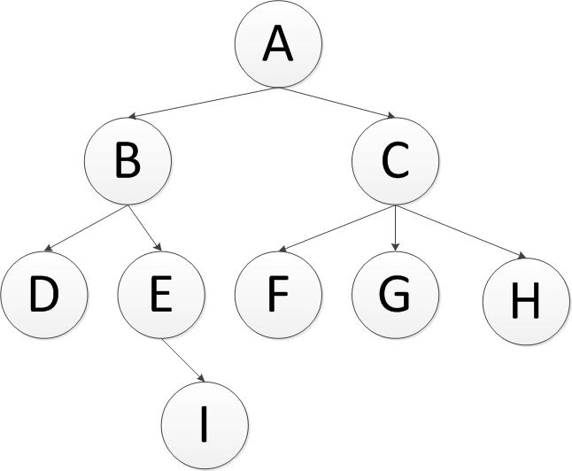
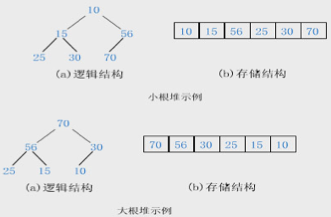

# 十一 基础算法

## 11.1 快速排序算法Java实现

### 11.1.1 算法概念

快速排序（Quicksort）是对冒泡排序的一种改进由C. A. R. Hoare在1962年提出

### 11.1.2 算法思想

通过一趟排序将要排序的数据分割成独立的两部分，其中一部分的所有数据都比另外一部分的所有数据都要小，然后再按此方法对这两部分数据分别进行快速排序，整个排序过程可以递归进行，以此达到整个数据变成有序序列

### 11.1.3 实现思路

①以第一个关键字 K 1 为控制字，将 [K 1 ,K 2 ,…,K n ] 分成两个子区，使左区所有关键字小于等于 K 1 ，右区所有关键字大于等于 K 1 ，最后控制字居两个子区中间的适当位置在子区内数据尚处于无序状态
②把左区作为一个整体，用①的步骤进行处理，右区进行相同的处理（即递归）
③重复第①、②步，直到左区处理完毕

### 11.1.4 代码实现（递归方式）

### 11.1.5 代码实现（非递归方式）

## 11.2 二分查找算法之JAVA实现

### 11.2.1 算法概念

二分查找算法也称为折半搜索、二分搜索，是一种在有序数组中查找某一特定元素的搜索算法请注意这种算法是建立在有序数组基础上的

### 11.2.2 算法思想

①搜素过程从数组的中间元素开始，如果中间元素正好是要查找的元素，则搜素过程结束；
②如果某一特定元素大于或者小于中间元素，则在数组大于或小于中间元素的那一半中查找，而且跟开始一样从中间元素开始比较
③如果在某一步骤数组为空，则代表找不到
这种搜索算法每一次比较都使搜索范围缩小一半

### 11.2.3 实现思路

①找出位于数组中间的值，并存放在一个变量中（为了下面的说明，变量暂时命名为temp）；
②需要找到的key和temp进行比较；
③如果key值大于temp，则把数组中间位置作为下一次计算的起点；重复① ②
④如果key值小于temp，则把数组中间位置作为下一次计算的终点；重复① ② ③
⑤如果key值等于temp，则返回数组下标，完成查找

### 11.2.4 实现代码

## 11.3 二叉树之Java实现

### 11.3.1 二叉树概念

二叉树是一种非常重要的数据结构，它同时具有数组和链表各自的特点：它可以像数组一样快速查找，也可以像链表一样快速添加但是他也有自己的缺点：删除操作复杂
二叉树：是每个结点最多有两个子树的有序树，在使用二叉树的时候，数据并不是随便插入到节点中的，一个节点的左子节点的关键值必须小于此节点，右子节点的关键值必须大于或者是等于此节点，所以又称二叉查找树、二叉排序树、二叉搜索树
完全二叉树：若设二叉树的高度为h，除第 h 层外，其它各层 (1～h-1) 的结点数都达到最大个数，第h层有叶子结点，并且叶子结点都是从左到右依次排布，这就是完全二叉树
满二叉树——除了叶结点外每一个结点都有左右子叶且叶子结点都处在最底层的二叉树
深度——二叉树的层数，就是深度

### 11.3.2 二叉树的特点

1）树执行查找、删除、插入的时间复杂度都是O(logN)
2）遍历二叉树的方法包括前序、中序、后序
3）非平衡树指的是根的左右两边的子节点的数量不一致
4）在非空二叉树中，第i层的结点总数不超过 , i>=1；
5）深度为h的二叉树最多有个结点(h>=1)，最少有h个结点；
6）对于任意一棵二叉树，如果其叶结点数为N0，而度数为2的结点总数为N2，则N0=N2+1；

### 11.3.3 二叉树的Java代码实现

首先是树的节点的定义，下面的代码中使用的是最简单的int基本数据类型作为节点的数据，如果要使用节点带有更加复杂的数据类型，换成对应的对象即可
下面给出二叉树的代码实现由于在二叉树中进行节点的删除非常繁琐，因此，下面的代码使用的是利用节点的isDelete字段对节点的状态进行标识
在上面对二叉树的遍历操作中，使用的是中序遍历，这样遍历出来的数据是增序的
下面是测试代码:

## 11.4 遍历树形结构之java实现（深度优先+广度优先）

在编程生活中，我们总会遇见树性结构，这几天刚好需要对树形结构操作，就记录下自己的操作方式以及过程现在假设有一颗这样树，（是不是二叉树都没关系，原理都是一样的）


### 11.4.1 深度优先

英文缩写为DFS即Depth First Search.其过程简要来说是对每一个可能的分支路径深入到不能再深入为止，而且每个节点只能访问一次对于上面的例子来说深度优先遍历的结果就是：A,B,D,E,I,C,F,G,H.(假设先走子节点的的左侧)
深度优先遍历各个节点，需要使用到堆（Stack）这种数据结构stack的特点是是先进后出整个遍历过程如下：
首先将A节点压入堆中，stack（A）;
将A节点弹出，同时将A的子节点C，B压入堆中，此时B在堆的顶部，stack(B,C)；
将B节点弹出，同时将B的子节点E，D压入堆中，此时D在堆的顶部，stack（D,E,C）；
将D节点弹出，没有子节点压入,此时E在堆的顶部，stack（E，C）；
将E节点弹出，同时将E的子节点I压入，stack（I,C）；
...依次往下，最终遍历完成，Java代码大概如下：

### 11.4.2 广度优先

英文缩写为BFS即Breadth FirstSearch其过程检验来说是对每一层节点依次访问，访问完一层进入下一层，而且每个节点只能访问一次对于上面的例子来说，广度优先遍历的 结果是：A,B,C,D,E,F,G,H,I(假设每层节点从左到右访问)
广度优先遍历各个节点，需要使用到队列（Queue）这种数据结构，queue的特点是先进先出，其实也可以使用双端队列，区别就是双端队列首位都可以插入和弹出节点整个遍历过程如下：
首先将A节点插入队列中，queue（A）;
将A节点弹出，同时将A的子节点B，C插入队列中，此时B在队列首，C在队列尾部，queue（B，C）；
将B节点弹出，同时将B的子节点D，E插入队列中，此时C在队列首，E在队列尾部，queue（C，D，E）;
将C节点弹出，同时将C的子节点F，G，H插入队列中，此时D在队列首，H在队列尾部，queue（D，E，F，G，H）；
将D节点弹出，D没有子节点，此时E在队列首，H在队列尾部，queue（E，F，G，H）；
...依次往下，最终遍历完成，Java代码大概如下：

## 11.5 归并排序之java实现

归并排序（Merge）是将两个（或两个以上）有序表合并成一个新的有序表，即把待排序序列分为若干个子序列，每个子序列是有序的然后再把有序子序列合并为整体有序序列
归并排序是建立在归并操作上的一种有效的排序算法该算法是采用分治法（Divide and Conquer）的一个非常典型的应用 将已有序的子序列合并，得到完全有序的序列；即先使每个子序列有序，再使子序列段间有序若将两个有序表合并成一个有序表，称为2-路归并
归并排序算法稳定，数组需要O(n)的额外空间，链表需要O(log(n))的额外空间，时间复杂度为O(nlog(n))，算法不是自适应的，不需要对数据的随机读取
工作原理：
1）申请空间，使其大小为两个已经排序序列之和，该空间用来存放合并后的序列
2）设定两个指针，最初位置分别为两个已经排序序列的起始位置
3）比较两个指针所指向的元素，选择相对小的元素放入到合并空间，并移动指针到下一位置
4）重复步骤3直到某一指针达到序列尾
5）将另一序列剩下的所有元素直接复制到合并序列尾
运行结果：
[java] view plain copy
5   3   6   2   1   9   4   8   7
3   5   6   2   1   9   4   8   7
3   5   6   2   1   9   4   8   7
3   5   6   1   2   9   4   8   7
1   2   3   5   6   9   4   8   7
1   2   3   5   6   4   9   8   7
1   2   3   5   6   4   9   7   8
1   2   3   5   6   4   7   8   9
1   2   3   4   5   6   7   8   9
排序后的数组：  
1   2   3   4   5   6   7   8   9  

## 11.6 堆排序之java实现

堆积排序(Heapsort)是指利用堆积树（堆）这种资料结构所设计的一种排序算法，可以利用数组的特点快速定位指定索引的元素堆排序是不稳定的排序方法，辅助空间为O(1)， 最坏时间复杂度为O(nlog2n) ，堆排序的堆序的平均性能较接近于最坏性能
堆排序利用了大根堆(或小根堆)堆顶记录的关键字最大(或最小)这一特征，使得在当前无序区中选取最大(或最小)关键字的记录变得简单

1）用大根堆排序的基本思想
① 先将初始文件R[1..n]建成一个大根堆,此堆为初始的无序区
② 再将关键字最大的记录R[1](即堆顶)和无序区的最后一个记录R[n]交换，由此得到新的无序区R[1..n-1]和有序区R[n]，且满足R[1..n-1].keys≤R[n].key
③由于交换后新的根R[1]可能违反堆性质，故应将当前无序区R[1..n-1]调整为堆然后再次将R[1..n-1]中关键字最大的记录R[1]和该区间的最后一个记录R[n-1]交换，由此得到新的无序区R[1..n-2]和有序区R[n-1..n]，且仍满足关系R[1..n-2].keys≤R[n-1..n].keys，同样要将R[1..n-2]调整为堆
……
直到无序区只有一个元素为止
2）大根堆排序算法的基本操作：
① 初始化操作：将R[1..n]构造为初始堆；
② 每一趟排序的基本操作：将当前无序区的堆顶记录R[1]和该区间的最后一个记录交换，然后将新的无序区调整为堆(亦称重建堆)
注意：
①只需做n-1趟排序，选出较大的n-1个关键字即可以使得文件递增有序
②用小根堆排序与利用大根堆类似，只不过其排序结果是递减有序的堆排序和直接选择排序相反：在任何时刻堆排序中无序区总是在有序区之前，且有序区是在原向量的尾部由后往前逐步扩大至整个向量为止
代码实现：
运行结果：
[java] view plain copy
5   3   6   2   1   9   4   8   7
3   8   6   7   1   5   4   2   9
2   7   6   3   1   5   4   8   9
4   3   6   2   1   5   7   8   9
4   3   5   2   1   6   7   8   9
1   3   4   2   5   6   7   8   9
2   3   1   4   5   6   7   8   9
1   2   3   4   5   6   7   8   9
1   2   3   4   5   6   7   8   9
1   2   3   4   5   6   7   8   9
排序后的数组：  
1   2   3   4   5   6   7   8   9

## 11.7 冒泡排序之java实现

原理：比较两个相邻的元素，将值大的元素交换至右端
思路：依次比较相邻的两个数，将小数放在前面，大数放在后面即在第一趟：首先比较第1个和第2个数，将小数放前，大数放后然后比较第2个数和第3个数，将小数放前，大数放后，如此继续，直至比较最后两个数，将小数放前，大数放后重复第一趟步骤，直至全部排序完成
举例说明：要排序数组：int[] arr={6,3,8,2,9,1};
第一趟排序：
　　第一次排序：6和3比较，6大于3，交换位置：  3  6  8  2  9  1
　　第二次排序：6和8比较，6小于8，不交换位置：3  6  8  2  9  1
　　第三次排序：8和2比较，8大于2，交换位置：  3  6  2  8  9  1
　　第四次排序：8和9比较，8小于9，不交换位置：3  6  2  8  9  1
　　第五次排序：9和1比较：9大于1，交换位置：  3  6  2  8  1  9
　　第一趟总共进行了5次比较， 排序结果：      3  6  2  8  1  9
第二趟排序：
　　第一次排序：3和6比较，3小于6，不交换位置：3  6  2  8  1  9
　　第二次排序：6和2比较，6大于2，交换位置：  3  2  6  8  1  9
　　第三次排序：6和8比较，6大于8，不交换位置：3  2  6  8  1  9
　　第四次排序：8和1比较，8大于1，交换位置：  3  2  6  1  8  9
　　第二趟总共进行了4次比较， 排序结果：      3  2  6  1  8  9
第三趟排序：
　　第一次排序：3和2比较，3大于2，交换位置：  2  3  6  1  8  9
　　第二次排序：3和6比较，3小于6，不交换位置：2  3  6  1  8  9
　　第三次排序：6和1比较，6大于1，交换位置：  2  3  1  6  8  9
　　第二趟总共进行了3次比较， 排序结果：         2  3  1  6  8  9
第四趟排序：
　　第一次排序：2和3比较，2小于3，不交换位置：2  3  1  6  8  9
　　第二次排序：3和1比较，3大于1，交换位置：  2  1  3  6  8  9
　　第二趟总共进行了2次比较， 排序结果：        2  1  3  6  8  9
第五趟排序：
　　第一次排序：2和1比较，2大于1，交换位置：  1  2  3  6  8  9
　　第二趟总共进行了1次比较， 排序结果：  1  2  3  6  8  9
最终结果：1  2  3  6  8  9
由此可见：N个数字要排序完成，总共进行N-1趟排序，每i趟的排序次数为(N-i)次，所以可以用双重循环语句，外层控制循环多少趟，内层控制每一趟的循环次数，即
冒泡排序的优点：每进行一趟排序，就会少比较一次，因为每进行一趟排序都会找出一个较大值如上例：第一趟比较之后，排在最后的一个数一定是最大的一个数，第二趟排序的时候，只需要比较除了最后一个数以外的其他的数，同样也能找出一个最大的数排在参与第二趟比较的数后面，第三趟比较的时候，只需要比较除了最后两个数以外的其他的数，以此类推……也就是说，没进行一趟比较，每一趟少比较一次，一定程度上减少了算法的量
用时间复杂度来说：
1）如果我们的数据正序，只需要走一趟即可完成排序所需的比较次数和记录移动次数均达到最小值，即：Cmin=n-1;Mmin=0;所以，冒泡排序最好的时间复杂度为O(n)
2）如果很不幸我们的数据是反序的，则需要进行n-1趟排序每趟排序要进行n-i次比较(1≤i≤n-1)，且每次比较都必须移动记录三次来达到交换记录位置在这种情况下，比较和移动次数均达到最大值：冒泡排序的最坏时间复杂度为：O(n2)
综上所述：冒泡排序总的平均时间复杂度为：O(n2)
代码实现：

## 11.8 生产者消费者模式之java实现

重点使用BlockingQueue，它也是java.util.concurrent下的主要用来控制线程同步的工具
BlockingQueue有四个具体的实现类,根据不同需求,选择不同的实现类
1）ArrayBlockingQueue：一个由数组支持的有界阻塞队列，规定大小的BlockingQueue,其构造函数必须带一个int参数来指明其大小.其所含的对象是以FIFO(先入先出)顺序排序的
2）LinkedBlockingQueue：大小不定的BlockingQueue,若其构造函数带一个规定大小的参数,生成的BlockingQueue有大小限制,若不带大小参数,所生成的BlockingQueue的大小由Integer.MAX_VALUE来决定.其所含的对象是以FIFO(先入先出)顺序排序的
3）PriorityBlockingQueue：类似于LinkedBlockQueue,但其所含对象的排序不是FIFO,而是依据对象的自然排序顺序或者是构造函数的Comparator决定的顺序
4）SynchronousQueue：特殊的BlockingQueue,对其的操作必须是放和取交替完成的
LinkedBlockingQueue 可以指定容量，也可以不指定，不指定的话，默认最大是Integer.MAX_VALUE,其中主要用到put和take方法，put方法在队列满的时候会阻塞直到有队列成员被消费，take方法在队列空的时候会阻塞，直到有队列成员被放进来
生产者消费者的示例代码：

```java
生产者：
import java.util.concurrent.BlockingQueue;  
public class Producer implements Runnable {  
    BlockingQueue<String> queue;  
    public Producer(BlockingQueue<String> queue) {  
        this.queue = queue;  
    }  
    @Override  
    public void run() {  
        try {  
            String temp = "A Product, 生产线程："  
                    + Thread.currentThread().getName();  
            System.out.println("I have made a product:"  
                    + Thread.currentThread().getName());  
            queue.put(temp);//如果队列是满的话，会阻塞当前线程  
        } catch (InterruptedException e) {  
            e.printStackTrace();  
        }  
    }  
}  

消费者：
import java.util.concurrent.BlockingQueue;  
public class Consumer implements Runnable{  
    BlockingQueue<String> queue;  
    public Consumer(BlockingQueue<String> queue){  
        this.queue = queue;  
    }  
    @Override  
    public void run() {  
        try {  
            String temp = queue.take();//如果队列为空，会阻塞当前线程  
            System.out.println(temp);  
        } catch (InterruptedException e) {  
            e.printStackTrace();  
        }  
    }  
   }

测试类：
import java.util.concurrent.ArrayBlockingQueue;  
import java.util.concurrent.BlockingQueue;  
import java.util.concurrent.LinkedBlockingQueue;  
  
public class Test3 {  
  
    public static void main(String[] args) {  
        BlockingQueue<String> queue = new LinkedBlockingQueue<String>(2);  
        // BlockingQueue<String> queue = new LinkedBlockingQueue<String>();  
        //不设置的话，LinkedBlockingQueue默认大小为Integer.MAX_VALUE  
        // BlockingQueue<String> queue = new ArrayBlockingQueue<String>(2);  
  
        Consumer consumer = new Consumer(queue);  
        Producer producer = new Producer(queue);  
        for (int i = 0; i < 5; i++) {  
            new Thread(producer, "Producer" + (i + 1)).start();  
  
            new Thread(consumer, "Consumer" + (i + 1)).start();  
        }  
    }  
}  

```

由于队列的大小限定成了2，所以最多只有两个产品被加入到队列当中，而且消费者取到产品的顺序也是按照生产的先后顺序，原因就是LinkedBlockingQueue和ArrayBlockingQueue都是按照FIFO的顺序存取元素的
