大数据技术之面试题

## 一 Hadoop面试题

### Hadoop部分

1) 如何将用户hadoop目录下的test.log上传到HDFS的/IMPUT目录下,请写出命令:

```
hdfs dfs -put /home/hadoop/test.log /IMPUT
```

2)HIVE的本质是什么,请简述:

```
hive本质：将HQL转化成MapReduce程序
```

3)与MapReduce相比较的优势在哪?(开发者角度),请简述

```
hive优点:
1) 操作接口采用类SQL语法，提供快速开发的能力（简单、容易上手）。
2) 避免了去写MapReduce，减少开发人员的学习成本。
3) Hive的执行延迟比较高，因此Hive常用于数据分析，对实时性要求不高的场合。
4) Hive优势在于处理大数据，对于处理小数据没有优势，因为Hive的执行延迟比较高。
Hive支持用户自定义函数，用户可以根据自己的需求来实现自己的函数
```

4.如何用Mapreduce实现两张表的关联?

```
两张表  小表关联大表   map端join  反之(大表关联大表)  reduce端join
```

5.简述Hive内部表和外部表的区别?

```
外部表删除表不会删除数据，内部表删除表会删除数据
```

6.Hive加载数据的方式有哪些?

```
四种：
（1）从本地文件系统中导入数据到Hive表；
load data local inpath '/export/servers/apache-hive-2.1.1-bin/emp.txt' into table emp ;
（2）从HDFS上导入数据到Hive表；
load data inpath '/export/servers/apache-hive-2.1.1-bin/emp.txt' into table emp ;
（3）从别的表中查询出相应的数据并导入到Hive表中；
（4）在创建表的时候通过从别的表中查询出相应的记录并插入到所创建的表中
```

7.如何解决Kafka的数据丢失?

```
kafka数据丢失从各个方面来说，生产者使用ack机制，消费者手动提交offset，broker设置数据副本多一些
```

8.简述Spark和Hive的数据倾斜产生的原因以及常用的优化思路?

```
spark与hive的数据倾斜基本上都是因为有些数据的key大量重复，大部分数据跑到同一个节点，造成一个节点的数据量比较大，其他节点数据量比较少。优化思路很多，打散key，调整reducetask的个数
```

### 1.1 Hadoop基础（☆☆）

#### 1.1.1 下列哪项通常是集群的最主要瓶颈（C） --了解

一 Hadoop面试题
1.1 Hadoop基础（☆☆）
1.1.1 下列哪项通常是集群的最主要瓶颈（C） --了解
C.磁盘 IO

##### 1.1.11 列出几个配置文件优化hadoop(hadoop调优参数问题)

随便说几个就行:
dfs.block.size
mapred.min.split.size

##### 1.1.11 怎么做数据平衡？列出步骤（☆☆☆）

答: 通过运行Hadoop中的一个balancer(['bælənsə]平衡)程序(bin/start-balancer.sh -t 5%),可以使得hdfs集群达到一个平衡状态, -t 参数值表示节点之间磁盘使用率的偏差,如果小于该值就表示hdfs集群是平衡的
大致过程为：
1.数据均衡服务要求namenode根据集群中datanode的数据分布做汇总。
2.根据该汇总情况形成数据块迁移路线图。
3.开始数据块迁移任务
4.迁移完成，通知namenode删除原有数据块。
实际应用中可能需要每天定时做一次数据均衡，在crontab中定时执行start-balancer.sh命令，当然还可以随时终止stop-balancer.sh.

### 1.1.12 手绘Hadoop架构

先画个hdfs和yarn的单点架构图,
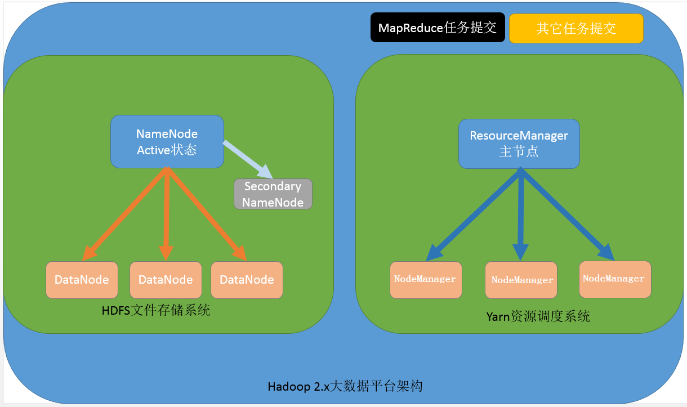
然后再说一下还有zk高可用的架构, 就不画了

### 1.1.15 Hadoop中job和Tasks之间的区别是什么？（☆☆☆）

job是工作的入口，负责控制、追踪、管理任务，也是一个进程 包含map task和reduce task
Tasks是map和reduce里面的步骤，主要用于完成任务，也是线程.

## 1.2 HDFS（☆☆☆）

### 知识点

1， hdfs是什么----- 分布式文件存储系统
2， hdfs优缺点
优点： 副本高容错性、适合存储大量数据、扩展性好
缺点：不适合存储大量小文件
3， hdfs架构以及角色
client： 将文件切block块、 与namenode和datanode交互
namenode： 读写请求的调度者、管理命名空间、配置副本
datanode： 存储实际数据、执行读写操作
secondnamenode： 辅助namenode处理元数据fsimage和edits合并、 当namenode挂掉可以从secondnamenode恢复数据
4， hdfs文件块的大小 --- 在hadoop2.x版本默认是128M；在老版本1.x默认64M
注意： 由于block块设置多大主要取决于磁盘传输速度，块设置太小那么磁盘寻址时间会增加；块设置太大那么块的磁盘传输时间会变大
5， hdfs的shell操作和api操作（读写操作：以文件下载和文件上传为例）
问：hdfs文件上传下载有几种方式----shell命令方式、hadoop的api方式、io流的方式

## 6， hdfs数据读写流程：  （重点）

写（文件上传）：
1，客户端请求namenode上传文件
2，namenode响应是否可以上传
3，客户端再次请求namenode上传第一个block要上传到哪些datanode
4，namenode返回datanode列表dn1，dn2，dn3
5，客户端请求dn1上传数据，dn1收到请求后会一次调用dn2、dn3，建立通信管道
6，dn3，dn2，dn1逐级应答客户端
7，客户端开始往dn1上传第一个block块，以packet为单位，dn1收到一个packet就会传给dn2，dn2传给dn3。每传完一个packet就会放入一个应答队列等待应答。
8，第一个block上传完毕后再次请求上传第二个block。

写数据的时候副本写到哪些节点上呢？（机架感知原则，重点）
答： 第一个副本在client客户端所处的节点上
 第二个副本在client相同机架随机节点上
 第三个副本在与client不同机架随机节点上

读（文件下载）：
1，客户端请求namenode下载文件，namenode查找元数据找到block块所在的datanode
2， 先就近后随机的原则找到datanode，请求下载
3， datanode开始传输数据给客户端，从磁盘读取输入流，以packet作校验
4， 客户端以packet为单位接收数据，先在本地缓存，然后写入文件

## 7， namenode和secondnamenode的相关问题

（1）fsimage和edits合并机制：
1， secondnamenode询问namenode是否需要checkpoint
2， secondnamenode请求执行checkpoint
3， 将滚动前的edits和fsimage拷贝到secondnamenode
4， secondnamenode将二者加载到内存进行合形成fsimage.checkpoint
5， 将fsimage.checkpoint拷贝回namenode重命名为fsimage替换掉原来的
（2） namenode故障处理：
先删除namenode存储的数据，然后从secondnamenode中拷贝数据到namenode，然后重启namenode
（3）集群安全模式  ---了解
（4）namenode多目录配置，增加可靠性  --了解

## 8.  datanode的相关问题

block块损坏怎么办 ---读取其他节点的副本
datanode掉线问题 ---namenode判断datanode死亡有个默认的超时时间为10分钟+30秒，有个计算公式，参数可以设置

## 9， hdfs2.x新特性  --了解

(1) 通过distcp命令进行集群间数据拷贝
(2) 小文件存档 --- 可以解决小文件问题，将小文件并到一个存档文件当成一个整体，但是并没有改变一个个独立文件的属性

## 10， hdfs-HA

分为HDFS的HA和YARN的HA。
工作机制：通过双NameNode消除单点故障
加入zk相关组件实现namenode故障自动转移

## 11，hdfs federation（HDFS联邦） --了解

1.2.8 HDFS的存储机制(读写流程)， 以及读写过程中如何保证数据完整性，也就是说你怎么确定你读取的数据是完整的
HDFS存储机制，包括HDFS的写入过程和读取过程两个部分
写入过程:
1）客户端向namenode请求上传文件，namenode检查目标文件是否已存在，父目录是否存在。
2）namenode返回是否可以上传。
3）客户端请求第一个 block上传到哪几个datanode服务器上。
4）namenode返回3个datanode节点，分别为dn1、dn2、dn3。
5）客户端请求dn1上传数据，dn1收到请求会继续调用dn2，然后dn2调用dn3，将这个通信管道建立完成
6）dn1、dn2、dn3逐级应答客户端  （有的说法是每写完一个块就会返回确认信息？？？）
7）客户端开始往dn1上传第一个block（传输的数据先放到一个本地内存缓存,其实就是放到一个队列中, 同时也会将内存缓存中的数据序列化到磁盘），以packet为单位（默认64K），dn1收到一个packet就会传给dn2(也是从dn1的内存中传输到dn2的内存, 为什么不从dn1的磁盘传输到dn2呢?---这就是磁盘IO的效率低的问题了)，dn2传给dn3；dn1每传一个packet会放入一个应答队列等待应答
8）当一个block传输完成之后，客户端再次请求namenode上传第二个block的服务器。（重复执行3-7步）

读取过程:
1）客户端向namenode请求下载文件，namenode通过查询元数据，找到文件块所在的datanode地址。
2）挑选一台datanode（就近原则，然后随机）服务器，请求建立输入流读取数据。
3）datanode开始传输数据给客户端（从磁盘里面读取数据放入流，以packet为单位来做校验）。
4）客户端以packet为单位接收，先在本地缓存，然后写入目标文件。
5）最后关闭流
读写过程数据完整性如何保持： ----校验和机制
文件分块后会计算出每个块的校验和保存在隐藏文件里，当客户端读取文件块时会检查校验和是否和正在读取的文件块的校验和一致，如果不一致客户端可以从其他datanode读取文件块的副本

### 1.2.8 客户端请求上传文件到hdfs集群时,namenode是依据什么返回datanode给客户端的?（☆☆☆）

主要是两个:
1, 离客户端距离近的datanode
2, 根据负载均衡看哪些datanode负载小的

### 1.2.8 副本存储在哪些节点上是怎么选择的(机架感知问题)（☆☆☆）

### 1.2.9 namenode和secondary namenode工作机制（☆☆☆☆☆）

1）第一阶段：namenode启动
（1）第一次启动namenode格式化后，创建fsimage和edits文件。如果不是第一次启动，直接加载编辑日志和镜像文件到内存。
（2）客户端对元数据进行增删改的请求
（3）namenode记录操作日志，更新滚动日志。
（4）namenode在内存中对数据进行增删改查
2）第二阶段：Secondary NameNode工作
（1）Secondary NameNode询问namenode是否需要checkpoint。直接带回namenode是否检查结果。
（2）Secondary NameNode请求执行checkpoint。
（3）namenode滚动正在写的edits日志, 比如将edits_inprogress_001滚动成为edits_001,然后再创建一个空的edits_inprogress_002
（4）将滚动前的编辑日志和镜像文件拷贝到Secondary NameNode
（5）Secondary NameNode加载编辑日志和镜像文件到内存，并合并。
（6）生成新的镜像文件fsimage.chkpoint
（7）再将fsimage.chkpoint拷贝回namenode
（8）namenode将fsimage.chkpoint重新命名成fsimage

### 1.2.9 checkpoint是什么意思? checkpoint的触发条件是什么（☆☆☆）

答: checkpoint检查点, 就是进行fsimage和edits合并.
checkpoint的触发条件有两个:
1, 定时时间到了, 默认是1小时
2, edits中的数据满了,默认是100万条

### 1.2.9 datanode工作机制（☆）

简单讲一下: datanode向namenode注册-周期性上报块信息(一小时)-3秒心跳一次-超过一段时间没有心跳信息认为节点挂掉(默认10分+30秒)

### 1.2.11 hadoop节点动态上线下线怎么操作? (主要是运维干的)

解释: 在运行中的hadoop集群中动态的新增(节点上线)或删除(节点下线)节点
1）节点上线操作：
当要新上线数据节点的时候，需要把数据节点的名字追加在 dfs.hosts 文件中
（1）关闭新增节点的防火墙
（2）在 NameNode 节点的 hosts 文件中加入新增数据节点的 hostname
（3）在每个新增数据节点的 hosts 文件中加入 NameNode 的 hostname
（4）在 NameNode 节点上增加新增节点的 SSH 免密码登录的操作
（5）在 NameNode 节点上的 dfs.hosts 中追加上新增节点的 hostname,
（6）在其他节点上执行刷新操作：hdfs dfsadmin -refreshNodes
（7）在 NameNode 节点上，更改 slaves 文件，将要上线的数据节点 hostname 追加
到 slaves 文件中
（8）启动 DataNode 节点
（9）查看 NameNode 的监控页面看是否有新增加的节点
2）节点下线操作：
（1）修改/conf/hdfs-site.xml 文件
（2）确定需要下线的机器，dfs.osts.exclude 文件中配置好需要下架的机器，这个是阻止下架的机器去连接 NameNode。
（3）配置完成之后进行配置的刷新操作./bin/hadoop dfsadmin -refreshNodes,这个操作的作用是在后台进行 block 块的移动。
（4）当执行三的命令完成之后，需要下架的机器就可以关闭了，可以查看现在集群上连接的节点，正在执行 Decommission，会显示：Decommission Status : Decommission in progress 执行完毕后，会显示：Decommission Status : Decommissioned
（5）机器下线完毕，将他们从excludes 文件中移除。

### 1.2.12 hdfs整体架构介绍

### NameNode故障处理（☆☆☆☆☆）

NameNode故障后，可以采用如下两种方法恢复数据。
方法一：将SecondaryNameNode中数据拷贝到NameNode存储数据的目录；

1. kill -9 NameNode进程
2. 删除NameNode存储的数据（/opt/module/hadoop-2.7.2/data/tmp/dfs/name）

```shell
[xh@hadoop102 hadoop-2.7.2]$ rm -rf /opt/module/hadoop-2.7.2/data/tmp/dfs/name/*
```

3. 拷贝SecondaryNameNode中数据到原NameNode存储数据目录

```shell
[xh@hadoop102 dfs]$ scp -r xh@hadoop104:/opt/module/hadoop-2.7.2/data/tmp/dfs/namesecondary/* ./name/
```

4. 重新启动NameNode
[xh@hadoop102 hadoop-2.7.2]$ sbin/hadoop-daemon.sh start namenode

方法二：使用-importCheckpoint选项启动NameNode守护进程，从而将SecondaryNameNode中数据拷贝到NameNode目录中。

1. 修改hdfs-site.xml中的

```xml
1. 修改hdfs-site.xml中的
<property>
  <name>dfs.namenode.checkpoint.period</name>
  <value>120</value>
</property>
<property>
  <name>dfs.namenode.name.dir</name>
  <value>/opt/module/hadoop-2.7.2/data/tmp/dfs/name</value>
</property>
```

2. kill -9 NameNode进程
3. 删除NameNode存储的数据（/opt/module/hadoop-2.7.2/data/tmp/dfs/name）

```shell
 [xh@hadoop102 hadoop-2.7.2]$ rm -rf /opt/module/hadoop-2.7.2/data/tmp/dfs/name/*
```

4. 如果SecondaryNameNode不和NameNode在一个主机节点上，需要将SecondaryNameNode存储数据的目录拷贝到NameNode存储数据的平级目录，并删除in_use.lock文件

```shell
 [xh@hadoop102 dfs]$ scp -r xh@hadoop104:/opt/module/hadoop-2.7.2/data/tmp/dfs/namesecondary ./
 [xh@hadoop102 namesecondary]$ rm -rf in_use.lock
 [xh@hadoop102 dfs]$ pwd
 /opt/module/hadoop-2.7.2/data/tmp/dfs
 [xh@hadoop102 dfs]$ ls
 data name namesecondary
```

5. 导入检查点数据（等待一会ctrl+c结束掉）
 [xh@hadoop102 hadoop-2.7.2]$ bin/hdfs namenode -importCheckpoint
6. 启动NameNode
 [xh@hadoop102 hadoop-2.7.2]$ sbin/hadoop-daemon.sh start namenode

### 1.2.13 namenode内存包含哪些，具体如何分配 --不懂

NameNode整个内存结构大致可以分成四大部分：Namespace、BlocksMap、NetworkTopology及其它，图2为各数据结构内存逻辑分布图示。
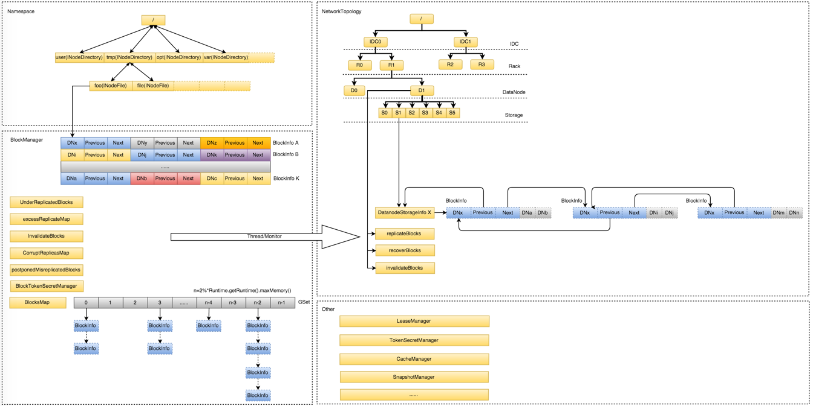图2 NameNode内存全景图
1）Namespace：维护整个文件系统的目录树结构及目录树上的状态变化；
2）BlockManager：维护整个文件系统中与数据块相关的信息及数据块的状态变化；
3）NetworkTopology：维护机架拓扑及DataNode信息，机架感知的基础；
4）其它：
LeaseManager：读写的互斥同步就是靠Lease实现，支持HDFS的Write-Once-Read-Many的核心数据结构；
CacheManager：Hadoop 2.3.0引入的集中式缓存新特性，支持集中式缓存的管理，实现memory-locality提升读性能；
SnapshotManager：Hadoop 2.1.0引入的Snapshot新特性，用于数据备份、回滚，以防止因用户误操作导致集群出现数据问题；
DelegationTokenSecretManager：管理HDFS的安全访问；
另外还有临时数据信息、统计信息metrics等等。

NameNode常驻内存主要被Namespace和BlockManager使用，二者使用占比分别接近50%。其它部分内存开销较小且相对固定，与Namespace和BlockManager相比基本可以忽略。

详见：[http://blog.csdn.net/guohecang/article/details/52356748](http://blog.csdn.net/guohecang/article/details/52356748)

### 1.2.14 HAnamenode 是如何工作的（hdfs HA自动故障转移机制）? （☆☆☆☆☆）--不懂先不看

ZKFailoverController主要职责
1）健康监测：周期性的向它监控的NN发送健康探测命令，从而来确定某个NameNode是否处于健康状态，如果机器宕机，心跳失败，那么zkfc就会标记它处于一个不健康的状态。
2）会话管理：如果NN是健康的，zkfc就会在zookeeper中保持一个打开的会话，如果NameNode同时还是Active状态的，那么zkfc还会在Zookeeper中占有一个类型为短暂类型的znode，当这个NN挂掉时，这个znode将会被删除，然后备用的NN，将会得到这把锁，升级为主NN，同时标记状态为Active。
3）当宕机的NN新启动时，它会再次注册zookeper，发现已经有znode锁了，便会自动变为Standby状态，如此往复循环，保证高可靠，需要注意，目前仅仅支持最多配置2个NN。
4）master选举：如上所述，通过在zookeeper中维持一个短暂类型的znode，来实现抢占式的锁机制，从而判断那个NameNode为Active状态

### 1.2.16 hadoop2.x Federation (hdfs联邦, 就是有多个namenode的集群,将原本单个namenode管理的namespace分成多个交给多个namenode来各自管理,但是所有的真实数据的保存还是共享的,即共享datanode) (在实际开发中一般不用, 可以通过HA代替)

单Active NN的架构使得HDFS在集群扩展性和性能上都有潜在的问题，当集群大到一定程度后，NN进程使用的内存可能会达到上百G，NN成为了性能的瓶颈
常用的估算公式为1G对应1百万个块，按缺省块大小计算的话，大概是64T (这个估算比例是有比较大的富裕的，其实，即使是每个文件只有一个块，所有元数据信息也不会有1KB/block)为了解决这个问题,Hadoop 2.x提供了HDFS Federation, 示意图如下：

多个NN共用一个集群里的存储资源，每个NN都可以单独对外提供服务每个NN都会定义一个存储池，有单独的 id，每个DN都为所有存储池提供存储。
DN会按照存储池id向其对应的NN汇报块信息，同时，DN会向所有NN汇报本地存储可用资源情况。
如果需要在客户端方便的访问若干个NN上的资源，可以使用客户端挂载表，把不同的目录映射到不同的NN，但NN上必须存在相应的目录。

### 1.2.17 HDFS Federation的原理结构 --记住高亮语句

HDFS Federation意味着在集群中将会有多个namenode/namespace,这样的方式有什么好处呢?
多namespace的方式可以直接减轻单一NameNode的压力。
一个典型的例子就是上面提到的NameNode内存过高问题,我们完全可以将上面部分大的文件目录移到另外一个NameNode上做管理.更重要的一点在于，这些NameNode是共享集群中所有的DataNode的，它们还是在同一个集群内的。HDFS Federation原理结构图如下:
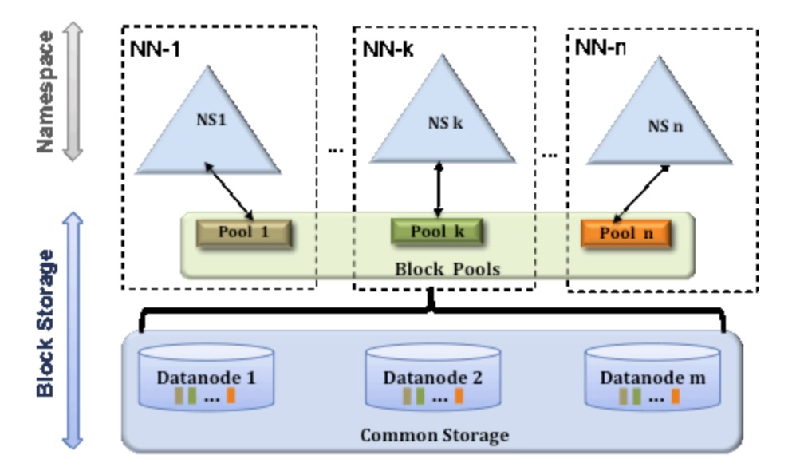
我们可以拿这种图与上一小节的图做对比，我们可以得出这样一个结论:
HDFS Federation是解决NameNode单点问题的水平横向扩展方案。
这时候在DataNode上就不仅仅存储一个Block Pool下的数据了，而是多个(大家可以在DataNode的datadir所在目录里面查看BP-xx.xx.xx.xx打头的目录)。
在HDFS Federation的情况下，只有元数据的管理与存放被分隔开了，但真实数据的存储还是共用的，这与viewFs还是不一样的。之前看别的文章在讲述HDFS Federation的时候直接拿viewFs来讲，个人觉得二者还是有些许的不同的，用一句话概况应该这么说。
HDFS的viewFs是namespace完全独立(私人化)的Federation方案，可以这么说，viewFs是Federation的一个简单实现方案。
因为它们不仅仅是namespace独立，而且真实数据的存放也是独立的,也就是多个完全独立的集群。在这点上我们还是有必要做一下区分，否则让人以为HDFS Federation就是viewFs。

### 1.2.18 HDFS Federation方案的优势

第一点,命名空间的扩展。因为随着集群使用时间的加长，HDFS上存放的数据也将会越来越多。这个时候如果还是将所有的数据都往一个NameNode上存放,这个文件系统会显得非常的庞大。这时候我们可以进行横向扩展，把一些大的目录分离出去.使得每个NameNode下的数据看起来更加的精简。(解释为什么不纵向扩展比如机器加内存: 会使得集群启动时间变长)
第二点,性能的提升.这个也很好理解。当NameNode所持有的数据量达到了一个非常大规模的量级的时候(比如超过1亿个文件)，这个时候NameNode的处理效率可能就会有影响，它可能比较容易的会陷入一个繁忙的状态。而整个集群将会受限于一个单点NameNode的处理效率,从而影响集群整体的吞吐量。这个时候多NameNode机制显然可以减轻很多这部分的压力。
第三点,资源的隔离。这一点考虑的就比较深了。通过多个命名空间，我们可以将关键数据文件目录移到不同的NameNode上，以此不让这些关键数据的读写操作受到其他普通文件读写操作的影响。也就是说这些NameNode将会只处理特定的关键的任务所发来的请求，而屏蔽了其他普通任务的文件读写请求，以此做到了资源的隔离。千万不要小看这一点，当你发现NameNode正在处理某个不良任务的大规模的请求操作导致响应速度极慢时，你一定会非常的懊恼。
hdfs federation的缺点:
HDFS Federation并没有完全解决单点故障问题。虽然namenode/namespace存在多个，但对于单个namenode来说，仍然存在单点故障。
如果某个namenode挂掉了，其管理的相应文件便不可以访问。
Federation中每个namenode仍然像之前一样，配有一个secondary namenode，以便主namenode挂掉后，用于还原元数据信息

### 1.2.19 hadoop的块大小，从哪个版本开始是128M

Hadoop1.x都是64M，hadoop2.x开始都是128M。

### 1.2.22 哪个程序通常与namenode在一个节点启动？哪个程序和DN在一个节点？如果一个节点脱离了集群应该怎么处理？

SecondaryNameNode内存需求和NameNode在一个数量级上，所以通常secondary NameNode（运行在单独的物理机器上）和NameNode运行在不同的机器上。
JobTracker和TaskTracker
JobTracker  对应于 NameNode
TaskTracker 对应于 DataNode
DataNode 和NameNode 是针对数据存放来而言的
JobTracker和TaskTracker是对于MapReduce执行而言的

### 1.2.22 HDFS 2.X新特性

1 集群间可以进行数据拷贝
hadoop distcp /集群1源文件路径 /集群2目标路径
2 小文件存档
hdfs小文件的弊端: 大量小文件消耗内存
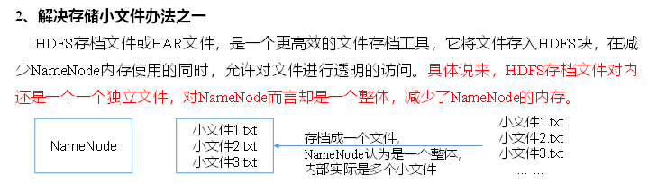
hadoop archive -archiveName input.har --p /user/xh/input /user/xh/output
3 回收站
开启回收站功能，可以将删除的文件在不超时的情况下，恢复原数据，起到防止误删除、 备份等作用。
4 快照管理

## 1.3 MapReduce（☆☆☆☆☆）

### 1.3.1 谈谈Hadoop序列化和反序列化及自定义bean对象实现序列化?

1）序列化和反序列化
序列化就是把内存中的对象，转换成字节序列（或其他数据传输协议）以便于存储（持久化）和网络传输。 
反序列化就是将收到字节序列（或其他数据传输协议）或者是硬盘的持久化数据，转换成内存中的对象。
Java的序列化是一个重量级序列化框架（Serializable），一个对象被序列化后，会附带很多额外的信息（各种校验信息，header，继承体系等），不便于在网络中高效传输。所以，hadoop自己开发了一套序列化机制（Writable），精简、高效。
2）自定义bean对象要想序列化传输步骤及注意事项：。
（1）必须实现Writable接口
（2）反序列化时，需要反射调用空参构造函数，所以必须有空参构造
（3）重写序列化方法
（4）重写反序列化方法
（5）注意反序列化的顺序和序列化的顺序完全一致
（6）要想把结果显示在文件中，需要重写toString()，且用"t"分开，方便后续用
（7）如果需要将自定义的bean放在key中传输，则还需要实现comparable接口，因为mapreduce框中的shuffle过程一定会对key进行排序

### 1.3.5 FileInputFormat源码解析（☆☆☆☆☆）

FileInputFormat源码解析(input.getSplits(job))
（1）找到你数据存储的目录。
（2）开始遍历处理（规划切片）目录下的每一个文件
（3）遍历第一个文件ss.txt
a）获取文件大小fs.sizeOf(ss.txt);
b）计算切片大小computeSliteSize(Math.max(minSize,Math.min(maxSize,blocksize)))
 注意: minSize=1, maxSize=Long.maxValue(), 如果是运行在本地那么blocksize就是32M, 如果是运行在hadoop集群中并且版本是2.x,那么blocksize就是128M
 c）默认情况下，切片大小=blocksize
d）开始切，形成第1个切片：ss.txt---0:128M 第2个切片ss.txt---128:256M 第3个切片ss.txt---256M:300M（每次切片时，都要判断切完剩下的部分是否大于块的1.1倍，不大于1.1倍就划分一块切片, 所以block和split并不是严格意义上的一一对应）
e）将切片信息写到一个切片规划文件中
f）整个切片的核心过程在getSplit()方法中完成。
 g）数据切片只是在逻辑上对输入数据进行分片，并不会再磁盘上将其切分成分片进行存储。InputSplit只记录了分片的元数据信息，比如起始位置、长度以及所在的节点列表等。
 h）注意：block是HDFS上物理上存储的存储的数据，切片是对数据逻辑上的划分。
 什么意思呢----block是真实地存在机器上,而split切片只是虚拟的切为一片片.

4.  提交切片规划文件到yarn上，yarn上的MrAppMaster就可以根据切片规划文件计算开启maptask个数。

### 1.3.5 CombineTextInputFormat切片机制

框架默认的TextInputFormat切片机制是对任务按文件规划切片，不管文件多小，都会是一个单独的切片，都会交给一个MapTask，这样如果有大量小文件，就会产生大量的MapTask，处理效率极其低下。
1、应用场景：
CombineTextInputFormat用于小文件过多的场景，它可以将多个小文件从逻辑上规划到一个切片中，这样，多个小文件就可以交给一个MapTask处理。

### 1.3.5 小文件合并有哪些方式？ （☆☆☆）

分析： 首先要知道为什么要合并小文件， 合并是针对于上传来说。合并小文件就不会有大量的内存空间被元数据占用
1, 通过io流的方式 ---inputstream读取所有小文件，然后outputstream输出到一个文件中
2.  Sequencefile ---自定义inputformat
3.  HAR归档文件 ---HDFS2.x新特性之一
4.  使用CombineTextInputFormat

### 1.3.5 KeyValueTextInputFormat

### 1.3.5 NLineInputFormat

### 1.3.6 自定义InputFormat流程

（1）自定义一个类继承FileInputFormat
（2）改写RecordReader，实现一次读取一个完整文件封装为KV

### 1.3.7 如何决定一个job的map和reduce的数量?

1）map数量
 splitSize=max{minSize,min{maxSize,blockSize}}
 map数量由处理的数据分成的block数量决定default_num = total_size / split_size;
2）reduce数量
reduce的数量job.setNumReduceTasks(x);x 为reduce的数量。不设置的话默认为 1。

### 1.3.8 Maptask的个数由什么决定(map阶段的并行度由什么决定)（☆☆☆）

一个job的map阶段MapTask并行度（个数），由客户端提交job时的切片个数决定。
下面几句话帮助理解:


### 1.3.9 MapReduce工作流程（☆☆☆☆☆）

#### MapTask工作机制(工作流程)

（1）Read阶段：Map Task通过用户编写的RecordReader，从输入InputSplit中解析出一个个key/value。
（2）Map阶段：该节点主要是将解析出的key/value交给用户编写map()函数处理，并产生一系列新的key/value。
（3）Collect收集阶段：在用户编写map()函数中，当数据处理完成后，一般会调用OutputCollector.collect()输出结果。在该函数内部，它会将生成的key/value分区（调用Partitioner），并写入一个环形内存缓冲区中。
（4）Spill阶段：即"溢写"，当环形缓冲区满后，MapReduce会将数据写到本地磁盘上，生成一个临时文件。需要注意的是，将数据写入本地磁盘之前，先要对数据进行一次本地排序，并在必要时对数据进行合并、压缩等操作。
溢写阶段详情：
步骤1：利用快速排序算法对缓存区内的数据进行排序，排序方式是，先按照分区编号partition进行排序，然后按照key进行排序。这样，经过排序后，数据以分区为单位聚集在一起，且同一分区内所有数据按照key有序。
步骤2：按照分区编号由小到大依次将每个分区中的数据写入任务工作目录下的临时文件output/spillN.out（N表示当前溢写次数）中。如果用户设置了Combiner，则写入文件之前，对每个分区中的数据进行一次聚集操作。
步骤3：将分区数据的元信息写到内存索引数据结构SpillRecord中，其中每个分区的元信息包括在临时文件中的偏移量、压缩前数据大小和压缩后数据大小。如果当前内存索引大小超过1MB，则将内存索引写到文件output/spillN.out.index中。
（5）Combine阶段：当所有数据处理完成后，MapTask对所有临时文件进行一次合并，以确保最终只会生成一个数据文件。
当所有数据处理完后，MapTask会将所有临时文件合并成一个大文件，并保存到文件output/file.out中，同时生成相应的索引文件output/file.out.index。
在进行文件合并过程中，MapTask以分区为单位进行合并。对于某个分区，它将采用多轮递归合并的方式。每轮合并io.sort.factor（默认100）个文件，并将产生的文件重新加入待合并列表中，对文件排序后，重复以上过程，直到最终得到一个大文件。
让每个MapTask最终只生成一个数据文件，可避免同时打开大量文件和同时读取大量小文件产生的随机读取带来的开销。

#### ReduceTask工作机制

（1）Copy阶段：ReduceTask从各个MapTask上远程拷贝一片数据，并针对某一片数据，如果其大小超过一定阈值，则写到磁盘上，否则直接放到内存中。
（2）Merge阶段：在远程拷贝数据的同时，ReduceTask启动了两个后台线程对内存和磁盘上的文件进行合并，以防止内存使用过多或磁盘上文件过多。
（3）Sort阶段：按照MapReduce语义，用户编写reduce()函数输入数据是按key进行聚集的一组数据。为了将key相同的数据聚在一起，Hadoop采用了基于排序的策略。由于各个MapTask已经实现对自己的处理结果进行了局部排序，因此，ReduceTask只需对所有数据进行一次归并排序即可。
（4）Reduce阶段：reduce()函数将计算结果写到HDFS上。

### 1.3.11 请描述mapReduce有几种排序及排序发生的阶段（☆☆☆☆☆）

1）排序的分类：
（1）部分排序：
MapReduce根据输入记录的键对数据集排序。保证输出的每个文件内部排序。
（2）全排序：
如何用Hadoop产生一个全局排序的文件？最简单的方法是使用一个分区。但该方法在处理大型文件时效率极低，因为一台机器必须处理所有输出文件，从而完全丧失了MapReduce所提供的并行架构。
替代方案：首先创建一系列排好序的文件；其次，串联这些文件；最后，生成一个全局排序的文件。主要思路是使用一个分区来描述输出的全局排序。例如：可以为待分析文件创建3个分区，在第一分区中，记录的单词首字母a-g，第二分区记录单词首字母h-n, 第三分区记录单词首字母o-z。
（3）辅助排序：（GroupingComparator分组）
Mapreduce框架在记录到达reducer之前按键对记录排序，但键所对应的值并没有被排序。甚至在不同的执行轮次中，这些值的排序也不固定，因为它们来自不同的map任务且这些map任务在不同轮次中完成时间各不相同。一般来说，大多数MapReduce程序会避免让reduce函数依赖于值的排序。但是，有时也需要通过特定的方法对键进行排序和分组等以实现对值的排序。
（4）二次排序： (引申出来可能有多次排序)
在自定义排序过程中，如果compareTo中的判断条件为两个即为二次排序。
2）自定义排序WritableComparable
bean对象实现WritableComparable接口重写compareTo方法，就可以实现排序

```java
   @Override
public int compareTo(FlowBean o) {
   // 倒序排列，从大到小
   return this.sumFlow > o.getSumFlow() ? -1 : 1;
}
```

3）排序发生的阶段：
（1）一个是在map side发生在spill后partition前。
（2）一个是在reduce side发生在copy后 reduce前。

### 1.3.12 请描述mapReduce中shuffle阶段的工作流程，如何优化shuffle阶段（☆☆☆☆☆）

分区，排序，溢写，拷贝到对应reduce机器上
优化shuffle: 增加combiner，压缩溢写的文件。


### 1.3.13 请描述mapReduce中combiner的作用是什么，一般使用情景，哪些情况不需要，及和reduce的区别？

1）Combiner的意义就是对每一个maptask的输出进行局部汇总，以减小网络传输量。
2）Combiner能够应用的前提是不能影响最终的业务逻辑，而且，Combiner的输出kv应该跟reducer的输入kv类型要对应起来。
3）Combiner和reducer的区别在于运行的位置。
Combiner是在每一个maptask所在的节点运行；
Reducer是接收全局所有Mapper的输出结果。
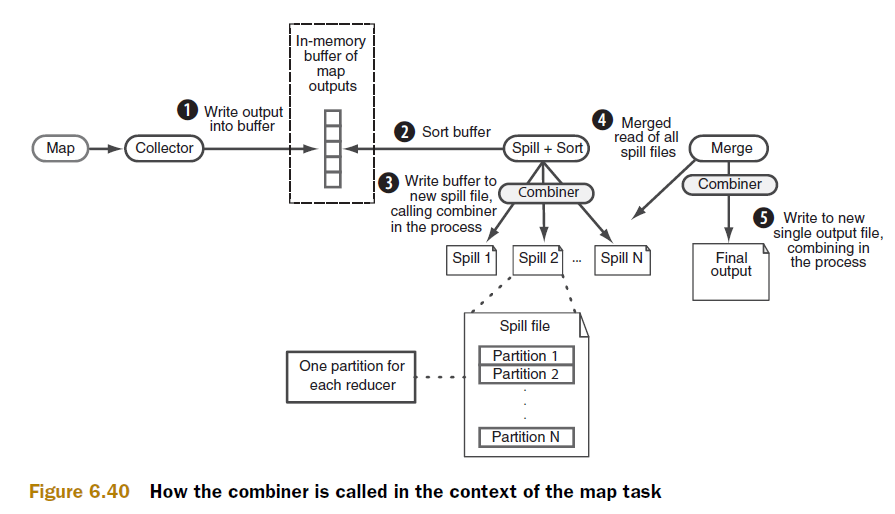

### 1.3.14 Mapreduce的工作原理，请举例子说明mapreduce是怎么运行的？（☆☆☆☆☆）

![8BW`$ZQ8)

### 1.3.15 如果没有定义partitioner，那数据在被送达reducer前是如何被分区的？

如果没有自定义的 partitioning，则默认的 partition 算法，即根据每一条数据的 key的 hashcode 值摸运算（%）reduce 的数量，得到的数字就是"分区号"。

### 1.3.16 MapReduce 出现单点负载多大，怎么负载平衡？ （☆☆☆☆☆） ----不懂

可以用 Partitioner

### 1.3.17 MapReduce 怎么实现 TopN？ （☆☆☆☆☆）

可以自定义groupingcomparator，对结果进行最大值排序，然后再reduce输出时，控制只输出前n个数。就达到了topn输出的目的。

### 1.3.18 Hadoop的缓存机制（Distributedcache）----应用: map端join（☆☆☆☆☆）

分布式缓存一个最重要的应用就是在进行join操作的时候，如果一个表很大，另一个表很小，我们就可以将这个小表进行广播处理，即每个计算节点上都存一份，然后进行map端的连接操作，经过我的实验验证，这种情况下处理效率大大高于一般的reduce端join，广播处理就运用到了分布式缓存的技术。
DistributedCache将拷贝缓存的文件到Slave节点在任何Job在节点上执行之前，文件在每个Job中只会被拷贝一次，缓存的归档文件会被在Slave节点中解压缩。将本地文件复制到HDFS中去，接着Client会通过addCacheFile() 和addCacheArchive()方法告诉DistributedCache在HDFS中的位置。当文件存放到文地时，JobClient同样获得DistributedCache来创建符号链接，其形式为文件的URI加fragment标识。当用户需要获得缓存中所有有效文件的列表时，JobConf 的方法 getLocalCacheFiles() 和getLocalArchives()都返回一个指向本地文件路径对象数组。

### 1.3.19 如何使用mapReduce实现两个表的join?（☆☆☆☆☆）

1）reduce side join : 在map阶段，map函数同时读取两个文件File1和File2，为了区分两种来源的key/value数据对，对每条数据打一个标签（tag）,比如：tag=0 表示来自文件File1，tag=2 表示来自文件File2。
2）map side join : Map side join 是针对以下场景进行的优化：两个待连接表中，有一个表非常大，而另一个表非常小，以至于小表可以直接存放到内存中。这样，我们可以将小表复制多份，让每个map task 内存中存在一份（比如存放到hash table 中），然后只扫描大表：对于大表中的每一条记录key/value，在hash table 中查找是否有相同的key 的记录，如果有，则连接后输出即可。

### 1.3.20 有可能使 Hadoop 任务输出到多个目录中么？如果可以，怎么做？

1）可以输出到多个目录中，采用自定义OutputFormat。
2）实现步骤：
（1）自定义outputformat，
（2）改写recordwriter，具体改写输出数据的方法write()

### 1.3.21 什么样的计算不能用mr来提速，举5个例子。

1）数据量很小。
2）繁杂的小文件。
3）索引是更好的存取机制的时候。
4）事务处理。
5）只有一台机器的时候。

### 1.3.22 ETL是哪三个单词的缩写, 你知道ETL吗?

Extraction-Transformation-Loading的缩写，中文名称为数据提取、转换和加载。
回答没做过etl但是了解过----大概就是利用一些工具+hive对数据进行清洗后再保存起来

### 1.3.36 Hadoop中通过拆分任务到多个节点运行来实现并行计算，但某些节点运行较慢会拖慢整个任务的运行，hadoop采用何种机制应对这个情况？

答: 推测机制, 比如某个job下有多个task任务在执行,有的task执行完了,有的卡住了, hadoop就会为该卡住的task启动一个备份task来执行同样的任务, 处理同样的数据, 哪个先执行完就将谁的结果当做最终结果,并且kill掉另一个任务(以资源换时间)

### 1.3.37 如何为一个hadoop任务设置mapper的数量？

答: mapper的数量是根据文件的大小划分block块和切片来决定的, 所以我们可以通过设置dfs.blocksiz、mapreduce.input.fileinputformat.split.minsize、mapreduce.input.fileinputformat.split.maxsize參数的值设置InputSplit的大小来影响InputSplit的数量。进而决定mapper的数量。

### 1.3.38 如何为一个hadoop任务设置要创建reducer的数量？

答: reducer的数量可以根据集群的规模, 集群配置来计算大概需要多少reducer, 通过job.setNumReducerTasks()设置

### 1.3.25 环形缓冲区为什么是环形的

面试室简单回答一下: 是因为环形缓冲区有一个起始的指针,每次写入一条数据指针就会往后移动一位,当写到缓冲区的80%时候就会溢写到磁盘, 最后起始位置和结束位置重叠就会开启新一轮溢写

### 1.3.29 MapReduce怎么解决数据倾斜问题?

1, 自定义分区Partitioner, 将key打散, 比如加一些随机数字或字符串后缀,这样就可以把key分到不同的reduce中, 这里分多少箱需要根据key对应的数据量来估算
2, combiner规约

### 1.3.33 MapReduce内存溢出怎么办？

1, 调大jvm内存参数: odps.stage.mapper.jvm.mem 和odps.stage.reducer.jvm.mem
2, 调大 mapper和reducer阶段的堆内存大小

### 以下是实际面试时问的问题:----------------------------------------

### 1.3.23 给你一个1G的数据文件。分别有id,name,mark,source四个字段，按照mark分组，id排序，手写一个MapReduce?其中有几个Mapper?

1）MapReduce实现

方案一：在map端对mark和id进行排序

```java
      @Override
   public int compareTo(SortBean o) {
      int result;

      if (this.mark > o.getMark()) {
         result = 1;
      }else if(this.mark <o.getMark()){
         result = -1;
      }else {
         result = this.id > o.getId()? -1:1;
      }
      return result;
   }
```

方案二：在map端对mark排序，在reduce端对id分组。

```java
      @Override
   public int compareTo(GroupBean o) {
      int result;

      result = this.mark > o.mark ? -1 : 1;

      return result;
   }
```

```java

   @Override
   public int compare(WritableComparable a, WritableComparable b) {

      GroupBean aBean = (GroupBean) a;
      GroupBean bBean = (GroupBean) b;

      int result;
      if (aBean.getId() > bBean.getId()) {
         result = 1;
      } else if (aBean.getId() < bBean.getId()) {
         result = -1;
      } else {
         result = 0;
      }

      return result;
   }
```

2）几个mapper
（1）1024m/128m=8块

### 1.3.30 mr环形数组怎么设置最大能设置多大？--不知道

### 1.3.31 你可以得到网站访问记录，没条记录有user IP，设计一个程序，要随时能计算出过去5分钟内访问次数最多的1000个IP。

### 1.3.32 MapReduce的shuffle过程（手画，边画边介绍），reduce是怎么到map端获取数据的（RPC通信是否了解）--不知道

## 1.4 Yarn及源码框架（☆☆☆☆）

### 1.4.1 简述Hadoop1与Hadoop2 的架构异同（☆☆☆）

加入了yarn解决了资源调度的问题。
加入了对zookeeper的支持实现比较可靠的高可用。

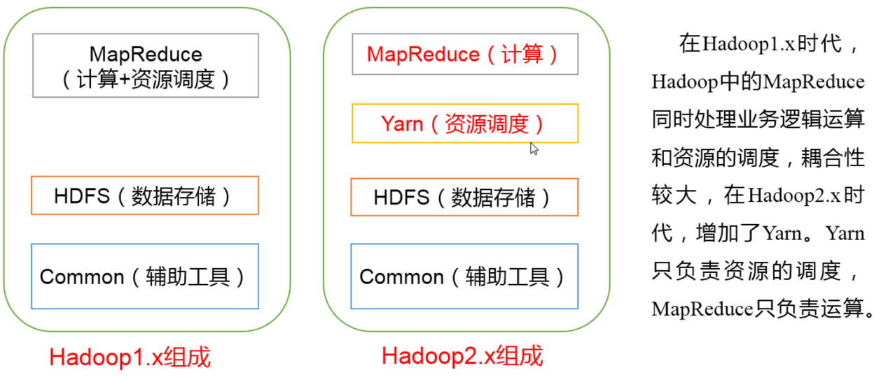

### 1.4.2 为什么会产生 yarn,它解决了什么问题，有什么优势？

Yarn最主要的功能就是解决运行的用户程序与yarn框架完全解耦。
Yarn上可以运行各种类型的分布式运算程序（mapreduce只是其中的一种），比如mapreduce、storm程序，spark程序......

### 1.4.3 MR作业提交全过程（☆☆☆☆☆）

1）作业提交过程之YARN
2）作业提交过程之MapReduce
3）作业提交过程之读数据
4）作业提交过程之写数据

### 1.4.4 HDFS的数据压缩算法? （☆☆☆☆☆）

Hadoop中常用的压缩算法有bzip2、gzip、lzo、snappy，其中lzo、snappy需要操作系统安装native库才可以支持。
企业开发用的比较多的是snappy。

### 1.4.5 Hadoop的调度器总结（☆☆☆☆☆）

目前，Hadoop作业调度器主要有三种：FIFO、Capacity Scheduler和Fair Scheduler。Hadoop2.7.2默认的资源调度器是Capacity Scheduler。
具体设置详见：yarn-default.xml文件

```xml
   <property>
    <description>The class to use as the resource scheduler.</description>
    <name>yarn.resourcemanager.scheduler.class</name>
<value>org.apache.hadoop.yarn.server.resourcemanager.scheduler.capacity.CapacityScheduler</value>
</property>

```

1. 队列调度器（FIFO）
 把提交的任务放到一个先进先出的队列里,先进队列的任务先获得资源. 有一个缺点就是如果先进队列的是大任务可能或占用所有资源导致后面的任务没有资源从而阻塞
2. 容量调度器（Capacity Scheduler）
 apache版本默认使用的调度器, 多个队列共享集群资源. 但是在每个队列内部又是采用的fifo,所以每个队列内部的任务获得的资源占比各不相同
3. 公平调度器（Fair Scheduler）
 cdh版本默认使用的调度器, 为每个任务公平分配资源. 但是要注意的是公平是对于每个用户或队列来说的,比如有两个队列A,B, A中只有一个任务a, B中有两个任务b1和b2,那么任务a占集群1/2资源, 任务b1和b2各占1/4的资源

### 1.4.6 MapReduce 2.0 容错性（☆☆☆☆☆）

1）MRAppMaster容错性
一旦运行失败，由YARN的ResourceManager负责重新启动，最多重启次数可由用户设置，默认是2次。一旦超过最高重启次数，则作业运行失败。
2）Map Task/Reduce Task
Task周期性向MRAppMaster汇报心跳；一旦Task 挂掉，则MRAppMaster将为之重新申请资源，并运行之。最多重新运行次数可由用户设置，默认4 次。

### 1.4.7 mapreduce推测执行算法及原理（☆☆☆☆☆）

1）作业完成时间取决于最慢的任务完成时间
一个作业由若干个Map任务和Reduce任务构成。因硬件老化、软件Bug等，某些任务可能运行非常慢。
典型案例：系统中有99%的Map任务都完成了，只有少数几个Map老是进度很慢，完不成，怎么办？
2）推测执行机制：
发现拖后腿的任务，比如某个任务运行速度远慢于任务平均速度。为拖后腿任务启动一个备份任务，同时运行。谁先运行完，则采用谁的结果。
3）执行推测任务的前提条件
（1）每个task只能有一个备份任务；
（2）当前job已完成的task必须不小于0.05（5%）
（3）开启推测执行参数设置。Hadoop2.7.2 mapred-site.xml文件中默认是打开的。

+----------------------------------------------------------------------+
| <property>                                                         |
|                                                                      |
| <name>mapreduce.map.speculative</name>                           |
|                                                                      |
| <value>true</value>                                              |
|                                                                      |
| <description>If true, then multiple instances of some map tasks    |
|                                                                      |
| may be executed in parallel.</description>                         |
|                                                                      |
| </property>                                                        |
|                                                                      |
| <property>                                                         |
|                                                                      |
| <name>mapreduce.reduce.speculative</name>                        |
|                                                                      |
| <value>true</value>                                              |
|                                                                      |
| <description>If true, then multiple instances of some reduce tasks |
|                                                                      |
| may be executed in parallel.</description>                         |
|                                                                      |
| </property>                                                        |
+----------------------------------------------------------------------+

4）不能启用推测执行机制情况--- 不懂为什么

（1）任务间存在严重的负载倾斜；

（2）特殊任务，比如任务向数据库中写数据。

5）算法原理： 回答没了解过

### 1.4.8 Hadoop升级 Hadoop 源代码 mapreduce的map output的实现（☆☆☆☆☆） ---不懂

[http://blog.csdn.net/lw305080/article/details/56479170](http://blog.csdn.net/lw305080/article/details/56479170)

### 1.4.9 Hadoop相关源码，遇到的问题描述（☆☆☆☆☆）

### 1.4.10 Hadoop安全，及资源管理方案介绍（☆☆☆☆☆）

### 1.4.11 介绍Yarn调度器如何分配作业，源代码层面分析（☆☆☆☆☆）

### 1.4.12 mesos和yarn资源管理器对比，及使用场景（☆☆☆☆☆）

## 1.5 优化（☆☆☆☆☆）

### 1.5.1 mapreduce 跑的慢的原因（☆☆☆☆☆）

硬件倾斜小文件，

map数reduce数spill数merge数

Mapreduce 程序效率的瓶颈在于两点：

1）计算机性能

CPU、内存、磁盘健康、网络

2）I/O 操作优化

（1）数据倾斜

（2）map和reduce数设置不合理

（3）reduce等待过久

（4）小文件过多

（5）大量的不可分块的超大文件

（6）spill次数过多

（7）merge次数过多等。

### 1.5.2 mapreduce 优化方法（☆☆☆☆☆）

1）数据输入：

（1）合并小文件：在执行mr任务前将小文件进行合并，大量的小文件会产生大量的map任务，增大map任务装载次数，而任务的装载比较耗时，从而导致 mr 运行较慢。

 怎么合并小文件----

 方式1: 自定义inputformat, 读取小文件合并成为sequencefile

 方式2: 采用ConbineFileInputFormat从逻辑上将小文件切成一片

2）map阶段

（1）减少spill次数：通过调整io.sort.mb及sort.spill.percent参数值，增大触发spill的内存上限，减少spill次数，从而减少磁盘 IO。

（2）减少merge次数：通过调整io.sort.factor参数，增大merge的文件数目，减少merge的次数，从而缩短mr处理时间。

（3）在 map 之后先进行combine处理，减少 I/O。

3）reduce阶段

（1）合理设置map和reduce数：两个都不能设置太少，也不能设置太多。太少，会导致task等待，延长处理时间；太多，会导致 map、reduce任务间竞争资源，造成处理超时等错误。

（2）设置map、reduce共存：调整slowstart.completedmaps参数，使map运行到一定程度后，reduce也开始运行，减少reduce的等待时间。

（3）规避使用reduce，因为Reduce在用于连接数据集的时候将会产生大量的网络消耗。

（4）合理设置reduc端的buffer，默认情况下，数据达到一个阈值的时候，buffer中的数据就会写入磁盘，然后reduce会从磁盘中获得所有的数据。也就是说，buffer和reduce是没有直接关联的，中间多个一个写磁盘->读磁盘的过程，既然有这个弊端，那么就可以通过参数来配置，使得buffer中的一部分数据可以直接输送到reduce，从而减少IO开销：mapred.job.reduce.input.buffer.percent，默认为0.0。当值大于0的时候，会保留指定比例的内存读buffer中的数据直接拿给reduce使用。这样一来，设置buffer需要内存，读取数据需要内存，reduce计算也要内存，所以要根据作业的运行情况进行调整。

4）IO传输

（1）采用数据压缩的方式，减少网络IO的的时间。安装Snappy和LZOP压缩编码器。

（2）使用SequenceFile二进制文件

5）数据倾斜问题

（1）数据倾斜现象

 数据频率倾斜------某一个区域的数据量要远远大于其他区域。

 数据大小倾斜------部分记录的大小远远大于平均值。

（2）如何收集倾斜数据

在reduce方法中统计计数map输出的key

+--------------------------------------------------------------------+
| public static final String MAX_VALUES = "skew.maxvalues";       |
|                                                                    |
| private int maxValueThreshold;                                     |
|                                                                    |
|                                                                    |
|                                                                    |
| @Override                                                         |
|                                                                    |
| public void configure(JobConf job) {                               |
|                                                                    |
|      maxValueThreshold = job.getInt(MAX_VALUES, 100);             |
|                                                                    |
| }                                                                  |
|                                                                    |
| @Override                                                         |
|                                                                    |
| public void reduce(Text key, Iterator<Text> values,              |
|                                                                    |
|                      OutputCollector<Text, Text> output,         |
|                                                                    |
|                      Reporter reporter) throws IOException {       |
|                                                                    |
|      int i = 0;                                                    |
|                                                                    |
|      while (values.hasNext()) {                                    |
|                                                                    |
|          values.next();                                            |
|                                                                    |
|          i++;                                                      |
|                                                                    |
|      }                                                             |
|                                                                    |
|      if (++i > maxValueThreshold) {                               |
|                                                                    |
|          log.info("Received " + i + " values for key " + key); |
|                                                                    |
|      }                                                             |
|                                                                    |
| }                                                                  |
+--------------------------------------------------------------------+

（3）减少数据倾斜的方法

方法1：

将数据量大的key分成多个组， 后面随机加上字符，比如数字1到10， 先进行一次运算，之后恢复key进行最终运算

方法2：Combine

使用Combine可以大量地减小数据频率倾斜和数据大小倾斜。在可能的情况下，combine的目的就是聚合并精简数据。

6）常用的参数调优

（1）资源相关参数

（a）以下参数是在用户自己的mr应用程序中配置就可以生效（mapred-default.xml）

----------------------------------------------- -------------------------------------------------------------------------------------------------------------------
  配置参数                                        参数说明
  mapreduce.map.memory.mb                         一个Map Task可使用的资源上限（单位:MB），默认为1024。如果Map Task实际使用的资源量超过该值，则会被强制杀死。
  mapreduce.reduce.memory.mb                      一个Reduce Task可使用的资源上限（单位:MB），默认为1024。如果Reduce Task实际使用的资源量超过该值，则会被强制杀死。
  mapreduce.map.cpu.vcores                        每个Map task可使用的最多cpu core数目，默认值: 1
  mapreduce.reduce.cpu.vcores                     每个Reduce task可使用的最多cpu core数目，默认值: 1
  mapreduce.reduce.shuffle.parallelcopies         每个reduce去map中拿数据的并行数。默认值是5
  mapreduce.reduce.shuffle.merge.percent          buffer中的数据达到多少比例开始写入磁盘。默认值0.66
  mapreduce.reduce.shuffle.input.buffer.percent   buffer大小占reduce可用内存的比例。默认值0.7
  mapreduce.reduce.input.buffer.percent           指定多少比例的内存用来存放buffer中的数据，默认值是0.0
----------------------------------------------- -------------------------------------------------------------------------------------------------------------------

（b）应该在yarn启动之前就配置在服务器的配置文件中才能生效（yarn-default.xml）

--------------------------------------------- -----------------------------------
  配置参数                                      参数说明
  yarn.scheduler.minimum-allocation-mb 1024     给应用程序container分配的最小内存
  yarn.scheduler.maximum-allocation-mb 8192     给应用程序container分配的最大内存
  yarn.scheduler.minimum-allocation-vcores 1    每个container申请的最小CPU核数
  yarn.scheduler.maximum-allocation-vcores 32   每个container申请的最大CPU核数
  yarn.nodemanager.resource.memory-mb 8192      给containers分配的最大物理内存
--------------------------------------------- -----------------------------------

（c）shuffle性能优化的关键参数，应在yarn启动之前就配置好（mapred-default.xml）

-------------------------------------- -----------------------------------
  配置参数                               参数说明
  mapreduce.task.io.sort.mb 100          shuffle的环形缓冲区大小，默认100m
  mapreduce.map.sort.spill.percent 0.8   环形缓冲区溢出的阈值，默认80%
-------------------------------------- -----------------------------------

（2）容错相关参数(mapreduce性能优化)

------------------------------ ----------------------------------------------------------------------------------------------------------------------------------------------------------------------------------------------------------------------------------------------------------------------------------------------------------------------------------------------------------------------------------------------------------------------------------------------------------------------------------------------------------------------------------------------------------
  配置参数                       参数说明
  mapreduce.map.maxattempts      每个Map Task最大重试次数，一旦重试参数超过该值，则认为Map Task运行失败，默认值：4。
  mapreduce.reduce.maxattempts   每个Reduce Task最大重试次数，一旦重试参数超过该值，则认为Map Task运行失败，默认值：4。
  mapreduce.task.timeout         Task超时时间，经常需要设置的一个参数，该参数表达的意思为：如果一个task在一定时间内没有任何进入，即不会读取新的数据，也没有输出数据，则认为该task处于block状态，可能是卡住了，也许永远会卡主，为了防止因为用户程序永远block住不退出，则强制设置了一个该超时时间（单位毫秒），默认是600000。如果你的程序对每条输入数据的处理时间过长（比如会访问数据库，通过网络拉取数据等），建议将该参数调大，该参数过小常出现的错误提示是"AttemptID:attempt_14267829456721_123456_m_000224_0 Timed out after 300 secsContainer killed by the ApplicationMaster."。
------------------------------ ----------------------------------------------------------------------------------------------------------------------------------------------------------------------------------------------------------------------------------------------------------------------------------------------------------------------------------------------------------------------------------------------------------------------------------------------------------------------------------------------------------------------------------------------------------

### 1.5.3 HDFS小文件优化方法（☆☆☆☆☆）

1）HDFS小文件弊端

HDFS上每个文件都要在namenode上建立一个索引，这个索引的大小约为150byte，这样当小文件比较多的时候，就会产生很多的索引文件，一方面会大量占用namenode的内存空间，另一方面就是索引文件过大是的索引速度变慢。

2）解决方案

1）Hadoop Archive:

 是一个高效地将小文件放入HDFS块中的文件存档工具，它能够将多个小文件打包成一个HAR文件，这样在减少namenode内存使用的同时。

2）Sequence file：

 sequence file由一系列的二进制key/value组成，如果key为文件名，value为文件内容，则可以将大批小文件合并成一个大文件。

3）CombineFileInputFormat：

  CombineFileInputFormat是一种新的inputformat，用于将多个文件合并成一个单独的split，另外，它会考虑数据的存储位置。

4）开启JVM重用

对于大量小文件Job，可以开启JVM重用会减少45%运行时间。

JVM重用理解：一个map运行一个jvm，重用的话，在一个map在jvm上运行完毕后，jvm继续运行其他jvm

具体设置：mapreduce.job.jvm.numtasks值在10-20之间。

## 1.6 企业运维相关（☆☆☆☆）

### 1.6.1 Hadoop会有哪些重大故障，如何应对？至少给出 5个。

1）namenode单点故障：通过zookeeper搭建HA高可用，可自动切换namenode。

2）ResourceManager单点故障：可通过配置YARN的HA，并在配置的namenode上手动启动ResourceManager作为Slave，在Master 故障后，Slave 会自动切换为Master。

3）reduce阶段内存溢出：是由于单个reduce任务处理的数据量过多，通过增大reducetasks数目、优化partition 规则使数据分布均匀进行解决。

4）datanode内存溢出：是由于创建的线程过多，通过调整linux的maxuserprocesses参数，增大可用线程数进行解决。

5）集群间时间不同步导致运行异常：通过配置内网时间同步服务器进行解决。

### 1.6.2 什么情况下会触发recovery过程，recover是怎么做的。--不懂

当 jobtracker.restart.recover 参数值设置为 true， jobtracker 重启之时会触发recovery。

在JobTracker重启前，会在history log中记录各个作业的运行状态，这样在JobTracker关闭后，系统中所有数据目录、临时目录均会被保留，待 JobTracker 重启之后，JobTracker 自动重新提交这些作业，并只对未运行完成的 task 进行重新调度，这样可避免已经计算完的 task 重新计算。

### 1.6.3 从2.7.0升级为2.7.2，升级步骤如下：--不用看

1）下载安装包后，下载native的64位包，替换新版本中的native。

2）修改2.7.2中的配置文件，保持与当前集群配置一致，修改配置文件后，分发到各台hadoop集群机器的一个临时目录中。我的配置文件列表有：core-site.xml、excludes、hadoop-env.sh、hdfs-site.xml、mapred-env.sh、mapred-site.xml、master、slaves、yarn-env.sh、yarn-site.xml

3）停掉hadoop集群。

4）登录每台hadoop节点的服务器，先备份hadoop的安装文件目录。然后进入hadoop安装目录，执行rm -rf bin etc include lib libexec LICENSE.txt NOTICE.txt README.txt sbin share

5）将临时目录中的2.7.2的hadoop文件拷贝至安装目录。

6）执行start-all.sh，启动hadoop集群，访问<http://localhost:50070/dfshealth.html#tab-overview> ，查看hadoop版本是否已更新，查看各节点状态是否正常。

### 1.6.4 如何测压hadoop集群（☆☆☆☆☆）

答: 一般在hadoop集群搭建完毕后第一件事就是要做集群的压力测试, 测试分为写入速度和读取速度测试

### 1.6.5 你认为 hadoop 有哪些设计不合理的地方。

1）不支持文件的并发写入和对文件内容的随机修改。

2）不支持低延迟、高吞吐的数据访问。

3）存取大量小文件，会占用namenode大量内存，小文件的查找时间超过读取时间。

4）hadoop环境搭建比较复杂。

5）数据无法实时处理。

6）mapreduce的shuffle 阶段IO太多。

7）编写mapreduce难度较高，实现复杂逻辑时，代码量太大。

### 1.6.6 你们公司业务数据量多大？有多少行数据？ 

开发时使用的是部分数据，不是全量数据，有将近一亿行（8、9 千万，具体不详，一般开发中也没人会特别关心这个问题）

### 1.6.7 一个网络商城1天大概产生多少 G 的日志？ 

回答大概5、60G

### 1.6.8 大概有多少条日志记录（在不清洗的情况下）？ 

3000万条, 每条大概2kb, 所以日增数据量是57G(回答大概5、60G)

### 1.6.9 日访问量大概有多少个？ 

几十万到百万

### 1.6.10 注册数大概多少？ 

不清楚 几十万或者几百万吧

### 1.6.11 假设我们有其他的日志是不是可以对这个日志有其他的业务分析？这些业务分析都有什么？ 

除了apache的访问日志, 还有log4j的日志

### 1.6.12 你们的集群规模（服务器多少台、CPU几个、内存多大）？ 

开发集群：15台(10台可用), 24核 cpu ，内存128G, 硬盘24T

### 1.6.13 问：你们的服务器怎么分布的？（这里说地理位置分布，最好也从机架方面也谈谈） ----回答不清楚

### 1.6.14 你们的数据是用什么导入到数据库的？导入到什么数据库？ 

数据处理之前的导入：通过 hadoop 命令导入到 hdfs 文件系统

数据处理完成之后的导出：利用 hive 处理完成之后的数据，通过 sqoop 导出到 mysql 数据库中，以供报表层使用。

### 1.6.15 你们处理数据是直接读数据库的数据还是读文本数据？ 

将日志数据导入到hdfs之后进行处理

### 1.6.16 你们提交的job任务大概有多少个？这些 job 执行完大概用多少时间？ 

500多个，每天凌晨开始跑，大概跑到上午9点左右。白天一般跑一些临时数据或者测试数据。小时任务不多。

### 1.6.17 问：你平常在公司都干些什么（一些建议）

### 1.6.18 你在项目中遇到了哪些难题，是怎么解决的？ 

某些任务执行时间过长，且失败率过高，检查日志后发现没有执行完就失败，原因出在hadoop 的 job 的 timeout 过短（相对于集群的能力来说），设置长一点即可

### 1.6.19 列举你了解的海量数据的处理方法及适用范围，如果有相关使用经验，可简要说明。

1）mapreduce 分布式计算 mapreduce 的思想就是分而治之；

2）倒排索引：一种索引方法，用来存储在全文搜索下某个单词在一个文档或者一组文档中的存储位置的映射，在倒排索引中单词指向了包含单词的文档。

3）消息队列：大量的数据写入首先存入消息队列进行缓冲，再把消息队列作为数据来源进行数据读取。

4）数据库读写分离：向一台数据库写入数据，另外的多台数据库从这台数据库中进行读取。

## 1.7 企业案例分析（☆☆☆☆）

### 1.7.1 海量日志数据，提取出某日访问百度次数最多的那个IP。

首先是这一天，并且是访问百度的日志中的 IP 取出来，逐个写入到一个大文件中。注意到IP 是 32 位的，最多有个 2^32 个 IP。同样可以采用映射的方法， 比如模 1000，把整个大文件映射为 1000 个小文件，再找出每个小文中出现频率最大的 IP（可以采用 hash_map进行频率统计，然后再找出频率最大 的几个）及相应的频率。然后再在这 1000 个最大的IP 中，找出那个频率最大的 IP，即为所求。

或者如下阐述（雪域之鹰）：

算法思想：分而治之+Hash

（1）IP 地址最多有2^32=4G种取值情况，所以不能完全加载到内存中处理；

（2）可以考虑采用"分而治之"的思想，按照IP地址的Hash(IP)%1024值，把海量IP日志分别存储到1024个小文件中。这样，每个小文件最多包含4MB个IP地址；

（3）对于每一个小文件，可以构建一个IP为 key，出现次数为value的Hash map，同时记录当前出现次数最多的那个IP地址；

（4）可以得到1024个小文件中的出现次数最多的IP，再依据常规的排序算法得到总体上出现次数最多的IP；

### 1.7.2 搜索引擎会通过日志文件把用户每次检索使用的所有检索串都记录下来，每个查询串的长度为1-255字节。 

假设目前有一千万个记录（这些查询串的重复度比较高，虽然总数是1千万，但如果除去重复后，不超过3百万个。一个查询串的重复度越高，说明查询它的用户越多，也就是越热门。），请你统计最热门的10个查询串，要求使用的内存不能超过1G。

典型的 Top K 算法，还是在这篇文章里头有所阐述，详情请参见：十一、从头到尾彻底解析 Hash 表算法。 文中，给出的最终算法是：

第一步、先对这批海量数据预处理，在O（N）的时间内用Hash表完成统计（之前写成了排序，特此订正。July、2011.04.27）；

第二步、借助堆这个数据结构，找出 Top K，时间复杂度为 N'logK。 即，借助堆结构，我们可以在log量级的时间内查找和调整/移动。因此，维护一个K(该题目中是 10)大小的小根堆，然后遍历300万的Query，分别和根元素进行对比所以，我们最终的时间复杂度是：O（N） + N'*O（logK），（N 为 1000 万，N'为 300 万）。ok，更多，详情，请参考原文。

或者：采用 trie 树，关键字域存该查询串出现的次数，没有出现为 0。最后用 10 个元素的最小推来对出现频率进行排序。

### 1.7.3 有一个1G大小的一个文件，里面每一行是一个词，词的大小不超过16字节，内存限制大小是1M。返回频数最高的100 个词。 

方案：顺序读文件中，对于每个词 x，取 hash(x)%5000，然后按照该值存到 5000 个小文件（记为 x0,x1,...x4999）中。这样每个文件大概是 200k 左右。

如果其中的有的文件超过了1M 大小，还可以按照类似的方法继续往下分，直到分解得到的小文件的大小都不超过 1M。

对每个小文件，统计每个文件中出现的词以及相应的频率（可以采用 trie 树/hash_map 等），并取出出现频率最大的100个词（可以用含100个结点的最小堆），并把100个词及相应的频率存入文件，这样又得到了5000个文件。下一步就是把这5000个文件进行归并（类似与归并排序）的过程了。

### 1.7.4 有 10 个文件，每个文件1G，每个文件的每一行存放的都是用户的query，每个文件的query都可能重复。要求你按照query的频度排序。 

还是典型的 TOP K 算法，解决方案如下：

方案 1：

顺序读取10个文件，按照hash(query)%10 的结果将query写入到另外10个文件（记为）中。这样新生成的文件每个的大小大约也1G（假设hash函数是随机的）。找一台内存在2G左右的机器，依次对用 hash_map(query, query_count)来统计每个query出现的次数。利用快速/堆/归并排序按照出现次数进行排序。将排序好的query和对应的query_cout输出到文件中。这样得到了10个排好序的文件（记为）。对这10个文件进行归并排序（内排序与外排序相结合）。

方案 2：

一般query的总量是有限的，只是重复的次数比较多而已，可能对于所有的query，一次性就可以加入到内存了。这样，我们就可以采用trie树/hash_map等直接来统计每个query出现的次数，然后按出现次数做快速/堆/归并排序就可以了。

方案 3：

与方案 1 类似，但在做完 hash，分成多个文件后，可以交给多个文件来处理，采用分布式的架构来处理（比如 MapReduce），最后再进行合并。

### 1.7.5 给定 a、b 两个文件，各存放 50 亿个 url，每个 url 各占 64 字节，内存限制是 4G，让你找出 a、b 文件共同的 url？ 

方案 1：可以估计每个文件安的大小为 5G×64=320G，远远大于内存限制的 4G。所以不可能将其完全加载到内存中处理。考虑采取分而治之的方法。

遍历文件a，对每个url求取 hash(url)%1000，然后根据所取得的值将url分别存储到 1000个小文件（记为 a0,a1,...,a999）中。这样每个小文件的大约为300M。遍历文件b，采取和a相同的方式将url分别存储到1000小文件（记为b0,b1,...,b999）。

这样处理后，所有可能相同的url都在对应的小文件（a0vsb0,a1vsb1,...,a999vsb999）中，不对应的小文件不可能有相同的url。然后我们只要求出 1000 对小文件中相同的 url即可。

求每对小文件中相同的url时，可以把其中一个小文件的url存储到hash_set中。然后遍历另一个小文件的每个url，看其是否在刚才构建的hash_set中，如果是，那么就是共同的url，存到文件里面就可以了。

方案2：如果允许有一定的错误率，可以使用Bloom filter，4G内存大概可以表示340亿bit。将其中一个文件中的url使用Bloom filter映射为这340亿 bit，然后挨个读取另外一个文件的url，检查是否与 Bloom filter，如果是，那么该 url 应该是共同的 url（注意会有一定的错误率）。

Bloom filter 日后会在本 BLOG 内详细阐述。

### 1.7.6 在 2.5 亿个整数中找出不重复的整数，注，内存不足以容纳这 2.5 亿个整数。 

方案 1：采用2-Bitmap（每个数分配 2bit，00 表示不存在，01 表示出现一次，10 表示多次，11 无意义）进行，共需内存 2^32 * 2 bit=1 GB 内存，还可以接受。然后扫描这2.5亿个整数，查看Bitmap中相对应位，如果是00变01，01变10，10保持不变。所描完事后，查看bitmap，把对应位是01的整数输出即可。

方案 2：也可采用与第 1 题类似的方法，进行划分小文件的方法。然后在小文件中找出不重复的整数，并排序。然后再进行归并，注意去除重复的元素。

### 1.7.7 腾讯面试题：给40亿个不重复的 unsigned int 的整数，没排过序的，然后再给一个数，如何快速判断这个数是否在那40亿个数当中？ 

与上第 6 题类似，我的第一反应时快速排序+二分查找。以下是其它更好的方法：

方案 1：oo，申请 512M 的内存，一个 bit 位代表一个 unsigned int 值。读入 40 亿个数，设置相应的 bit 位，读入要查询的数，查看相应 bit 位是否为 1，为 1 表示存在，为 0 表示不存在。

dizengrong：

方案 2：这个问题在《编程珠玑》里有很好的描述，大家可以参考下面的思路，探讨一下：

又因为 2^32 为 40 亿多，所以给定一个数可能在，也可能不在其中；

这里我们把 40 亿个数中的每一个用 32 位的二进制来表示，假设这 40 亿个数开始放在一个文件中。

然后将这 40 亿个数分成两类: 1.最高位为0；2.最高位为1。

并将这两类分别写入到两个文件中，其中一个文件中数的个数<=20 亿，而另一个>=20 亿（这相当于折半了）；

与要查找的数的最高位比较并接着进入相应的文件再查找，再然后把这个文件为又分成两类:

1.次最高位为 0

2.次最高位为 1

并将这两类分别写入到两个文件中，其中一个文件中数的个数<=10 亿，而另一个>=10 亿

（这相当于折半了）；

与要查找的数的次最高位比较并接着进入相应的文件再查找。

.......

以此类推，就可以找到了,而且时间复杂度为 O(logn)，方案 2 完。

附：这里，再简单介绍下，位图方法：

使用位图法判断整形数组是否存在重复判断集合中存在重复是常见编程任务之一，当集合中数据量比较大时我们通常希望少进行几次扫描，这时双重循环法就不可取了。

位图法比较适合于这种情况，它的做法是按照集合中最大元素 max 创建一个长度为 max+1的新数组，然后再次扫描原数组，遇到几就给新数组的第几位置上 1，如遇到 5 就给新数组的第六个元素置 1，这样下次再遇到 5 想置位时发现新数组的第六个元素已经是 1 了，这说明这次的数据肯定和以前的数据存在着重复。这种给新数组初始化时置零其后置一的做法类似于位图的处理方法故称位图法。它的运算次数最坏的情况为 2N。如果已知数组的最大值即能事先给新数组定长的话效 率还能提高一倍。

### 1.7.8 怎么在海量数据中找出重复次数最多的一个？ 

方案 1：先做hash，然后求模映射为小文件，求出每个小文件中重复次数最多的一个，并记录重复次数。然后找出上一步求出的数据中重复次数最多的一个就是所求（具体参考前面的题）。

### 1.7.9 上千万或上亿数据（有重复），统计其中出现次数最多的前 N 个数据。 

方案 1：上千万或上亿的数据，现在的机器的内存应该能存下。所以考虑采用hash_map/搜索二叉树/红黑树等来进行统计次数。然后就是取出前N个出现次数最多的数据了，可以用第 2 题提到的堆机制完成。

### 1.7.10 一个文本文件，大约有一万行，每行一个词，要求统计出其中最频繁出现的前10个词，请给出思想，给出时间复杂度分析。 

方案 1：这题是考虑时间效率。用trie树统计每个词出现的次数，时间复杂度是 O(n*le)（le表示单词的平准长度）。然后是找出出现最频繁的前10个词，可以用堆来实现，前面的题中已经讲到了，时间复杂度是 O(n*lg10)。所以总的时间复杂度，是O(n*le)与 O(n*lg10)中较大的哪一个。

附、100w个数中找出最大的100个数。

方案1：在前面的题中，我们已经提到了，用一个含100个元素的最小堆完成。复杂度为O(100w*lg100)。

方案 2：采用快速排序的思想，每次分割之后只考虑比轴大的一部分，知道比轴大的一部分在比100多的时候，采用传统排序算法排序，取前100个。复杂度为 O(100w*100)。

方案3：采用局部淘汰法。选取前100个元素，并排序，记为序列L。然后一次扫描剩余的元素x，与排好序的100个元素中最小的元素比，如果比这个最小的要大，那么把这个最小的元素删除，并把x利用插入排序的思想，插入到序列L中。依次循环，知道扫描了所有的元素。复杂度为 O(100w*100)。

# 二 ZooKeeper（☆☆☆）

## 知识点：

1.  zk定义、本质 ---分布式协调服务，本质是分布式小文件存储系统

2.  zk特性：server节点数据一致性

3.  zk角色：

    1.  leader：事务操作（增删改）的调度者

    2.  follower：非事务操作（读）的处理、转发事务操作、选举

    3.  observer：观察并同步集群状态、非事务操作（读）的处理、转发事务操作、没有选举功能

4.  zk的数据模型： 树状结构，每个节点成为znode。 节点分为临时节点和永久节点，他们的主要区别是声明周期是否依赖会话，会话结束节点就消失的是临时节点。 并且临时节点没有子节点

5.  zk的Watch机制 ---了解

6.  zk的选举机制 ---重点

7.  zk的典型应用 ---重点

作为配置中心

## 2.1 请简述ZooKeeper的选举机制 --要知道

假设有五台服务器组成的zookeeper集群，它们的id从1-5，同时它们都是最新启动的，也就是没有历史数据，在存放数据量这一点上，都是一样的。假设这些服务器依序启动，来看看会发生什么。

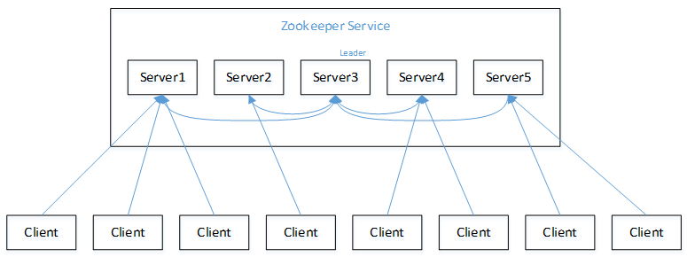

（1）服务器1启动，此时只有它一台服务器启动了，它发出去的报没有任何响应，所以它的选举状态一直是LOOKING状态。

（2）服务器2启动，它与最开始启动的服务器1进行通信，互相交换自己的选举结果，由于两者都没有历史数据，所以id值较大的服务器2胜出，但是由于没有达到超过半数以上的服务器都同意选举它(这个例子中的半数以上是3)，所以服务器1、2还是继续保持LOOKING状态。

（3）服务器3启动，根据前面的理论分析，服务器3成为服务器1、2、3中的Leader，而与上面不同的是，此时有三台服务器选举了它，所以它成为了这次选举的Leader。

（4）服务器4启动，根据前面的分析，理论上服务器4应该是服务器1、2、3、4中最大的，但是由于前面已经有半数以上的服务器选举了服务器3，所以它成为Follower。

（5）服务器5启动，同4一样成为Follower。

注意，如果按照5,4,3,2,1的顺序启动，那么5将成为Leader，因为在满足半数条件后，ZooKeeper集群启动，5的Id最大，被选举为Leader。

## 2.2 客户端对ZooKeeper的ServerList的轮询机制 -- 了解

随机，客户端在初始化( new ZooKeeper(String connectString, int sessionTimeout, Watcher watcher) )的过程中，将所有Server保存在一个List中，然后随机打散，形成一个环。之后从0号位开始一个一个使用。

两个注意点：

Server地址能够重复配置，这样能够弥补客户端无法设置Server权重的缺陷，但是也会加大风险。（比如: 192.168.1.1:2181,192.168.1.1:2181,192.168.1.2:2181).

如果客户端在进行Server切换过程中耗时过长，那么将会收到SESSION_EXPIRED. 这也是上面第1点中的加大风险之处。

## 2.3 客户端如何正确处理CONNECTIONLOSS(连接断开) 和 SESSIONEXPIRED(Session 过期)两类连接异常？

在ZooKeeper中，服务器和客户端之间维持的是一个长连接，在 SESSION_TIMEOUT 时间内，服务器会确定客户端是否正常连接(客户端会定时向服务器发送heart_beat),服务器重置下次SESSION_TIMEOUT时间。因此，在正常情况下，Session一直有效，并且zk集群所有机器上都保存这个Session信息。在出现问题的情况下，客户端与服务器之间连接断了（客户端所连接的那台zk机器挂了，或是其它原因的网络闪断），这个时候客户端会主动在地址列表（初始化的时候传入构造方法的那个参数connectString）中选择新的地址进行连接。

以上即为服务器与客户端之间维持长连接的过程，在这个过程中，用户可能会看到两类异常CONNECTIONLOSS(连接断开) 和SESSIONEXPIRED(Session 过期)。

发生CONNECTIONLOSS后，此时用户不需要关心我的会话是否可用，应用所要做的就是等待客户端帮我们自动连接上新的zk机器，一旦成功连接上新的zk机器后，确认之前的操作是否执行成功了。

## 2.4 一个客户端修改了某个节点的数据，其他客户端能够马上获取到这个最新数据吗？-----答: 一般不会, 需要先同步一下再获取数据

ZooKeeper不能确保任何客户端能够获取（即Read Request）到一样的数据，除非客户端自己要求，方法是客户端在获取数据之前调用org.apache.zookeeper.AsyncCallbac k.VoidCallback, java.lang.Object) sync。

通常情况下（这里所说的通常情况满足：1. 对获取的数据是否是最新版本不敏感，2. 一个客户端修改了数据，其它客户端是否需要立即能够获取最新数据），可以不关心这点。

在其它情况下，最清晰的场景是这样：ZK客户端A对 /my_test 的内容从 v1->v2, 但是ZK客户端B对 /my_test 的内容获取，依然得到的是 v1. 请注意，这个是实际存在的现象，当然延时很短。解决的方法是客户端B先调用 sync(), 再调用 getData()。

## 2.5 ZooKeeper对节点的watch监听是永久的吗？为什么？

不是。

官方声明：一个Watch事件是一个一次性的触发器，当被设置了Watch的数据发生了改变的时候，则服务器将这个改变发送给设置了Watch的客户端，以便通知它们。

为什么不是永久的，举个例子，如果服务端变动频繁，而监听的客户端很多情况下，每次变动都要通知到所有的客户端，这太消耗性能了。

一般是客户端执行getData("/节点A",true)，如果节点A发生了变更或删除，客户端会得到它的watch事件，但是在之后节点A又发生了变更，而客户端又没有设置watch事件，就不再给客户端发送。

在实际应用中，很多情况下，我们的客户端不需要知道服务端的每一次变动，我只要最新的数据即可。

## 2.6 ZooKeeper中使用watch的注意事项有哪些？

使用watch需要注意的几点：

① Watches通知是一次性的，必须重复注册.

② 发生CONNECTIONLOSS之后，只要在session_timeout之内再次连接上（即不发生SESSIONEXPIRED），那么这个连接注册的watches依然在。

③ 节点数据的版本变化会触发NodeDataChanged，注意，这里特意说明了是版本变化。存在这样的情况，只要成功执行了setData()方法，无论内容是否和之前一致，都会触发NodeDataChanged。

④ 对某个节点注册了watch，但是节点被删除了，那么注册在这个节点上的watches都会被移除。

⑤ 同一个zk客户端对某一个节点注册相同的watch，只会收到一次通知。

⑥ Watcher对象只会保存在客户端，不会传递到服务端。

## 2.7 能否收到每次节点变化的通知？

如果节点数据的更新频率很高的话，不能。

原因在于：当一次数据修改，通知客户端，客户端再次注册watch，在这个过程中，可能数据已经发生了许多次数据修改，因此，千万不要做这样的测试："数据被修改了n次，一定会收到n次通知"来测试server是否正常工作。

## 2.8 能否为临时节点创建子节点？

ZooKeeper中不能为临时节点创建子节点，如果需要创建子节点，应该将要创建子节点的节点创建为永久性节点。

## 2.9 是否可以拒绝单个IP对ZooKeeper的访问？如何实现？

ZK本身不提供这样的功能，它仅仅提供了对单个IP的连接数的限制。你可以通过修改iptables来实现对单个ip的限制。

## 2.10 在getChildren(String path, boolean watch)是注册了对节点子节点的变化，那么子节点的子节点变化能通知吗？

> 不能通知。

## 2.11 创建的临时节点什么时候会被删除，是连接一断就删除吗？延时是多少？

连接断了之后，ZK不会马上移除临时数据，只有当SESSIONEXPIRED之后，才会把这个会话建立的临时数据移除。因此，用户需要谨慎设置Session_TimeOut。

## 2.12 ZooKeeper是否支持动态进行机器扩容？如果目前不支持，那么要如何扩容呢？

ZooKeeper中的动态扩容其实就是水平扩容，Zookeeper对这方面的支持不太好，目前有两种方式：

全部重启：关闭所有Zookeeper服务，修改配置之后启动，不影响之前客户端的会话。

> 逐个重启：这是比较常用的方式。

## 2.13 ZooKeeper集群中服务器之间是怎样通信的？

Leader服务器会和每一个Follower/Observer服务器都建立TCP连接，同时为每个F/O都创建一个叫做LearnerHandler的实体。LearnerHandler主要负责Leader和F/O之间的网络通讯，包括数据同步，请求转发和Proposal提议的投票等。Leader服务器保存了所有F/O的LearnerHandler。

## 2.14 ZooKeeper是否会自动进行日志清理？如何进行日志清理？

> zk自己不会进行日志清理，需要运维人员进行日志清理。

## 2.15 谈谈你对ZooKeeper的理解？

Zookeeper 作为一个分布式的服务框架，主要用来解决分布式集群中应用系统的一致性问题。ZooKeeper提供的服务包括：分布式消息同步和协调机制、服务器节点动态上下线、统一配置管理、负载均衡、集群管理等。

ZooKeeper提供基于类似于Linux文件系统的目录节点树方式的数据存储，即分层命名空间。Zookeeper 并不是用来专门存储数据的，它的作用主要是用来维护和监控你存储的数据的状态变化，通过监控这些数据状态的变化，从而可以达到基于数据的集群管理，ZooKeeper节点的数据上限是1MB。

我们可以认为Zookeeper=文件系统+通知机制，

对于ZooKeeper的数据结构，每个子目录项如 NameService 都被称作为 znode，这个 znode 是被它所在的路径唯一标识，如 Server1 这个 znode 的标识为 /NameService/Server1；

znode 可以有子节点目录，并且每个 znode 可以存储数据，注意 EPHEMERAL 类型的目录节点不能有子节点目录(因为它是临时节点)；

znode 是有版本的，每个 znode 中存储的数据可以有多个版本，也就是一个访问路径中可以存储多份数据；

znode 可以是临时节点，一旦创建这个 znode 的客户端与服务器失去联系，这个 znode 也将自动删除，Zookeeper 的客户端和服务器通信采用长连接方式，每个客户端和服务器通过心跳来保持连接，这个连接状态称为 session，如果 znode 是临时节点，这个 session 失效，znode 也就删除了；

znode 的目录名可以自动编号，如 App1 已经存在，再创建的话，将会自动命名为 App2；

znode 可以被监控，包括这个目录节点中存储的数据的修改，子节点目录的变化等，一旦变化可以通知设置监控的客户端，这个是 Zookeeper 的核心特性，Zookeeper 的很多功能都是基于这个特性实现的，后面在典型的应用场景中会有实例介绍。

## 2.16 ZooKeeper节点类型？

1）Znode有两种类型：

短暂（ephemeral）：客户端和服务器端断开连接后，创建的节点自己删除 。

持久（persistent）：客户端和服务器端断开连接后，创建的节点不删除 。

2）Znode有四种形式的目录节点（默认是persistent ）

（1）持久化目录节点（PERSISTENT）

客户端与zookeeper断开连接后，该节点依旧存在 。

（2）持久化顺序编号目录节点（PERSISTENT_SEQUENTIAL）

客户端与zookeeper断开连接后，该节点依旧存在，只是Zookeeper给该节点名称进行顺序编号 。

（3）临时目录节点（EPHEMERAL）

客户端与zookeeper断开连接后，该节点被删除 。

（4）临时顺序编号目录节点（EPHEMERAL_SEQUENTIAL）

客户端与zookeeper断开连接后，该节点被删除，只是Zookeeper给该节点名称进行顺序编号。

## 2.17 请说明ZooKeeper的通知机制？

ZooKeeper选择了基于通知（notification）的机制，即：客户端向ZooKeeper注册需要接受通知的znode，通过znode设置监控点（watch）来接受通知。监视点是一个单次触发的操作，意即监视点会触发一个通知。为了接收多个通知，客户端必须在每次通知后设置一个新的监视点。在下图阐述的情况下，当节点/task发生变化时，客户端会受到一个通知，并从ZooKeeper读取一个新值。

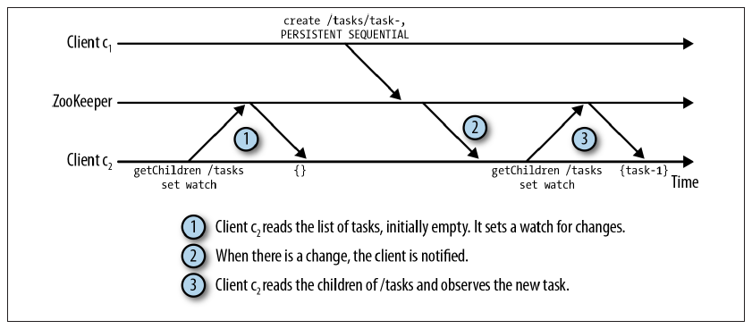

## 2.18 ZooKeeper的监听原理是什么？

在应用程序中，mian()方法首先会创建zkClient，创建zkClient的同时就会产生两个进程，即Listener进程（监听进程）和connect进程（网络连接/传输进程），当zkClient调用getChildren()等方法注册监视器时，connect进程向ZooKeeper注册监听器，注册后的监听器位于ZooKeeper的监听器列表中，监听器列表中记录了zkClient的IP，端口号以及要监控的路径，一旦目标文件发生变化，ZooKeeper就会把这条消息发送给对应的zkClient的Listener()进程，Listener进程接收到后，就会执行process()方法，在process()方法中针对发生的事件进行处理。

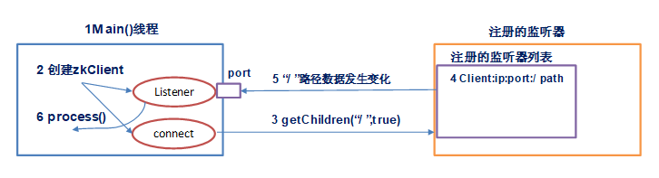

## 2.19 请说明ZooKeeper使用到的各个端口的作用？

2888：Follower与Leader交换信息的端口。

3888：万一集群中的Leader服务器挂了，需要一个端口来重新进行选举，选出一个新的Leader，而这个端口就是用来执行选举时服务器相互通信的端口。

## 2.20 ZooKeeper的部署方式有哪几种？集群中的角色有哪些？集群最少需要几台机器？

ZooKeeper的部署方式有单机模式和集群模式，集群中的角色有Leader和Follower，集群最少3（2N+1）台，根据选举算法，应保证奇数。

## 2.21 ZooKeeper集群如果有3台机器，挂掉一台是否还能工作？挂掉两台呢？

> 对于ZooKeeper集群，过半存活即可使用。

## 2.22 ZooKeeper使用的ZAB协议与Paxo算法的异同？

Paxos算法是分布式选举算法，Zookeeper使用的 ZAB协议（Zookeeper原子广播），两者的异同如下：

① 相同之处：

比如都有一个Leader，用来协调N个Follower的运行；Leader要等待超半数的Follower做出正确反馈之后才进行提案；二者都有一个值来代表Leader的周期。

② 不同之处：

ZAB用来构建高可用的分布式数据主备系统（Zookeeper），Paxos是用来构建分布式一致性状态机系统。

## 2.23 请谈谈对ZooKeeper对事务性的支持？

ZooKeeper对于事务性的支持主要依赖于四个函数，zoo_create_op_init， zoo_delete_op_init， zoo_set_op_init以及zoo_check_op_init。每一个函数都会在客户端初始化一个operation，客户端程序有义务保留这些operations。当准备好一个事务中的所有操作后，可以使用zoo_multi来提交所有的操作，由zookeeper服务来保证这一系列操作的原子性。也就是说只要其中有一个操作失败了，相当于此次提交的任何一个操作都没有对服务端的数据造成影响。Zoo_multi的返回值是第一个失败操作的状态信号。

## 2.24 zk的watch观察机制、选举机制

# 三 Hive（☆☆☆☆☆）

## 知识点： 

1.  hive是什么，本质？

2.  hive的优缺点：

    1.  优点：不用写复杂的MapReduce程序，但是底层基于mr，所以执行延迟高，适合处理实时性要求不高的数据分析

    2.  缺点： 效率低

3.  hive的架构（面试真题）

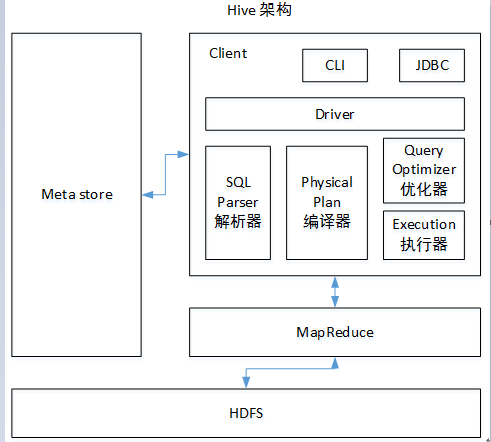

hive的架构主要分为4部分：客户端接口，元数据，Driver，MR，HDFS，

其中Driver的作用是负责hql语句的解析和优化并转换成一个hvie job（比如mr），最后交给hadoop集群。

底层原理核心部分就是Driver里的解析器，编译器，优化器和执行器所做的事。

## 3.3 hive中 Sort By，Order By，Cluster By，Distrbute By各代表什么意思？--面试常问

order by：会对输入做全局排序，因此只有一个reducer（多个reducer无法保证全局有序）。只有一个reducer，会导致当输入规模较大时，需要较长的计算时间。

sort by：不是全局排序，是每个reducer内部的排序

distribute by：分区，类似MR的partition，结合sort by使用才有了分区排序的功能

cluster by：除了具有 distribute by 的功能外还兼具 sort by 的功能。

## 3.7 Hive内部表和外部表的区别？以及相互转化的方式（☆☆☆☆）--面试常问

创建表时：创建内部表时，会将数据移动到数据仓库指向的路径；若创建外部表，仅记录数据所在的路径， 不对数据的位置做任何改变。

删除表时：在删除表的时候，内部表的元数据和数据会被一起删除， 而外部表只删除元数据，不删除数据。这样外部表相对来说更加安全些，数据组织也更加灵活，方便共享源数据。

内部表和外部表怎么相互转化:

> 内部表--->外部表: alter table student2 set tblproperties('EXTERNAL'='TRUE');
>
> 外部表--->内部表: alter table student2 set tblproperties('EXTERNAL'=FALSE);

## 3.8 Hive的HQL转换为MapReduce的过程？（☆☆☆☆☆）

HiveSQL ->AST(抽象语法树) -> QB(查询块) ->OperatorTree（操作树）->优化后的操作树->mapreduce任务树->优化后的mapreduce任务树

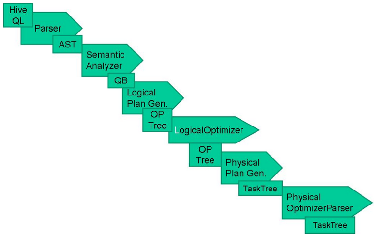

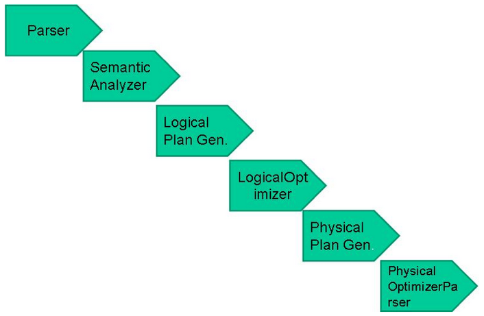

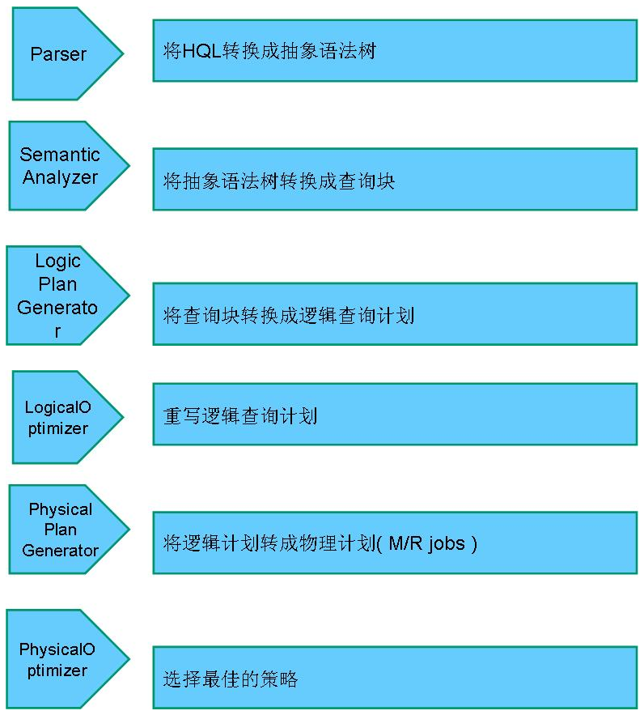

过程描述如下：

SQL Parser：Antlr定义SQL的语法规则，完成SQL词法，语法解析，将SQL转化为抽象 语法树AST Tree；

Semantic Analyzer：遍历AST Tree，抽象出查询的基本组成单元QueryBlock；

Logical plan：遍历QueryBlock，翻译为执行操作树OperatorTree；

Logical plan optimizer: 逻辑层优化器进行OperatorTree变换，合并不必要的ReduceSinkOperator，减少shuffle数据量；

Physical plan：遍历OperatorTree，翻译为MapReduce任务；

Logical plan optimizer：物理层优化器进行MapReduce任务的变换，生成最终的执行计划；

## 3.9 Hive底层与数据库交互原理？ ---了解

由于Hive的元数据可能要面临不断地更新、修改和读取操作，所以它显然不适合使用Hadoop文件系统进行存储。目前Hive将元数据存储在RDBMS中，比如存储在MySQL、Derby中。元数据信息包括：存在的表、表的列、权限和更多的其他信息。

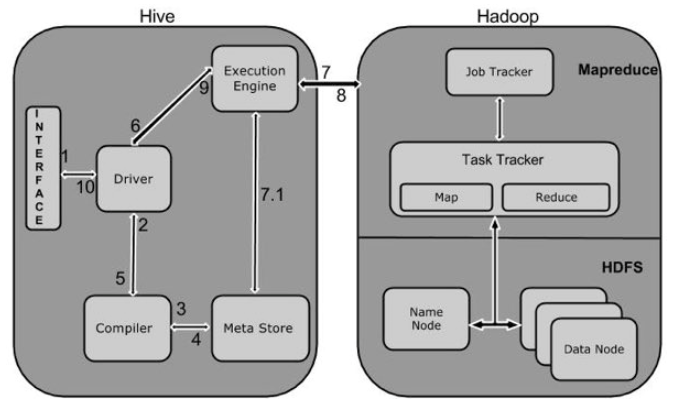

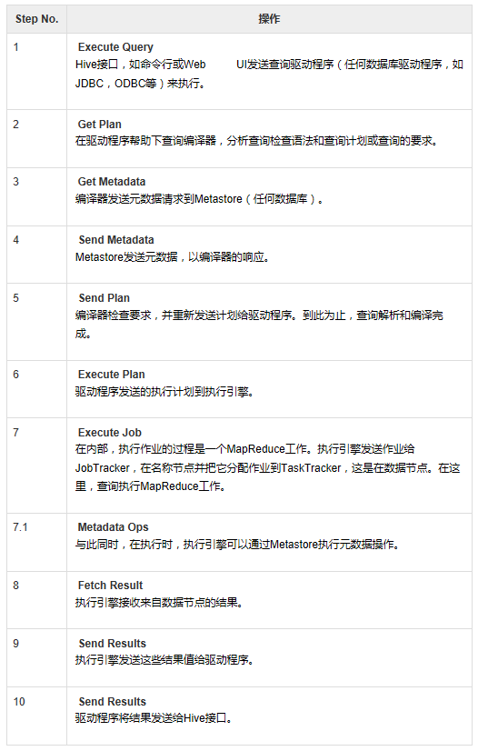

## 3.12 Hive如何进行权限控制？ --- 不懂

目前hive支持简单的权限管理，默认情况下是不开启，这样所有的用户都具有相同的权限，同时也是超级管理员，也就对hive中的所有表都有查看和改动的权利，这样是不符合一般数据仓库的安全原则的。Hive可以是基于元数据的权限管理，也可以基于文件存储级别的权限管理。

为了使用Hive的授权机制，有两个参数必须在hive-site.xml中设置：

<property>

<name>hive.security.authorization.enabled</name>

<value>true</value>

<description>enable or disable the hive client authorization</description>

</property>

<property>

<name>hive.security.authorization.createtable.owner.grants</name>

<value>ALL</value>

<description>the privileges automatically granted to the owner whenever a table gets created. An example like "select,drop" will grant select and drop privilege to the owner of the table</description>

</property>

Hive支持以下权限：

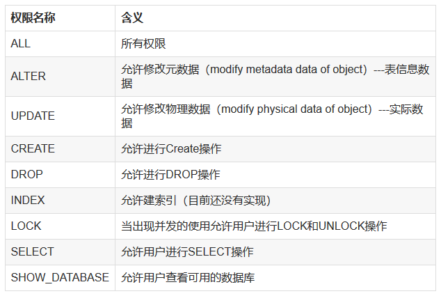

Hive授权的核心就是用户（user）、组（group）、角色（role）。

Hive中的角色和平常我们认知的角色是有区别的，Hive中的角色可以理解为一部分有一些相同"属性"的用户或组或角色的集合。这里有个递归的概念，就是一个角色可以是一些角色的集合。

下面举例进行说明：

用户 组

张三 G_db1

李四 G_db2

王五 G_bothdb

如上有三个用户分别属于G_db1、G_db2、G_alldb。G_db1、G_db2、G_ bothdb分别表示该组用户可以访问数据库1、数据库2和可以访问1、2两个数据库。现在可以创建role_db1和role_db2，分别并授予访问数据库1和数据库2的权限。这样只要将role_eb1赋给G_db1（或者该组的所有用户），将role_eb2赋给G_db2，就可以是实现指定用户访问指定数据库。最后创建role_bothdb指向role_db1、role_db2（role_bothdb不需要指定访问那个数据库），然后role_bothdb授予G_bothdb，则G_bothdb中的用户可以访问两个数据库。

Hive的用户和组使用的是Linux机器上的用户和组，而角色必须自己创建。

角色管理：

--创建和删除角色

create role role_name;

drop role role_name;

--展示所有roles

show roles

--赋予角色权限

grant select on database db_name to role role_name;

grant select on [table] t_name to role role_name;

--查看角色权限

show grant role role_name on database db_name;

show grant role role_name on [table] t_name;

--角色赋予用户

grant role role_name to user user_name

--回收角色权限

revoke select on database db_name from role role_name;

revoke select on [table] t_name from role role_name;

--查看某个用户所有角色

show role grant user user_name;

## 3.13 对于hive，你写过哪些udf函数，作用是什么？--面试真题

回答没写过, 但是知道udf函数, 然后讲怎么自定义udf函数： 继承UDF类，重写evaluate方法

## 3.13 hive的存储引擎和执行引擎有哪些（☆☆☆☆☆）--面试真题

存储方面：textfile、sequencefile 、rcfile、orcfile、parquet
执行引擎：mr、tez、spark 

## 3.14 Hive 中的存储格式TextFile、SequenceFile、RCfile 、ORCfile各有什么区别？ --面试真题

从存储类型来说分为行式存储和列式存储, TextFile和SequenceFile是行式存储, ORC和Paquet是列式存储. 行式存储适合读取一整行数据, 列式存储适合读取某几个列的数据

从存储文件的压缩比来看, ORC > Paquet > TextFile

从存储文件的查询速度来看, ORC > TextFile > Paquet

在实际的项目开发当中，hive表的数据存储格式一般选择：orc或parquet。压缩方式一般选择snappy。

TextFile不做压缩，所以磁盘开销大， 一般要结合压缩一起使用，一般流程如下：

创建表存储格式为textfiel：

> create table xxx(...) stored as textfile;

设置压缩方式后插入数据：

> set hive.exec.compress.output=true;
>
> set mapred.output.compress=true;
>
> set mapred.output.compresstion.codec=xxx.GzipCodec;
>
> insert overwrite table xxx select * from xxx;

SequenceFile是一种二进制文件，以key-value形式序列化到文件中，支持block级压缩

创建表存储格式为textfiel：

> create table xxx(...) stored as sequencefile;

设置压缩方式后插入数据：

> set hive.exec.compress.output=true;
>
> set mapred.output.compress=true;
>
> set mapred.output.compresstion.codec=xxx.GzipCodec;
>
> set mapred.outpuot.compresstion.type=BLOCK;
>
> insert overwrite table xxx select * from xxx;

RCFile是一种行列存储相结合的存储方式。 首先数据按行分块，然后块数据按列存储。

相比于TextFile和SequenceFile行式存储，RCFile是列式存储，数据加载时性能消耗大， 但是具有良好的压缩比和查询速度。

ORCFile指优化的RCFile。数据按行分块，然后块数据按列存储。每个块都存储一个索引。 特点是数据压缩非常高。

## 3.16 Hive的两张表关联，使用MapReduce怎么实现？（☆☆☆☆☆） ---能说出来map端jion的方式就行，两张大表的情况不知

如果其中有一张表为小表，直接使用map端join的方式（map端加载小表）进行聚合。

如果两张都是大表，那么采用联合key，联合key的第一个组成部分是join on中的公共字段，第二部分是一个flag，0代表表A，1代表表B，由此让Reduce区分客户信息和订单信息；在Mapper中同时处理两张表的信息，将join on公共字段相同的数据划分到同一个分区中，进而传递到一个Reduce中，然后在Reduce中实现聚合。

## 3.19 Hive的函数：UDF、UDAF、UDTF的区别？ (☆☆☆☆☆面试真题)

UDF: 单行进入，单行输出

UDAF: 多行进入，单行输出

UDTF: 单行输入，多行输出

面试一般会问，你知道UDAF和UDTF吗？ 其实就是问你有没有自定义过UDAF和UDTF函数？

自定义UDTF函数流程： 继承GenericUDTF类，实现initialize，process，close方法

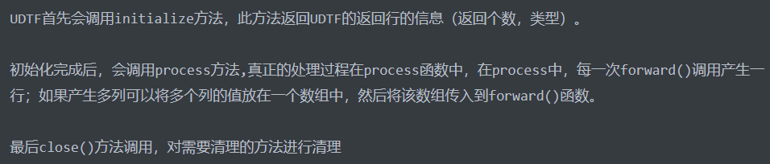

UATF函数的使用方式：

1.  直接跟在select 关键字后面

> select explode_map(properties) as (col1,col2) from user;

2.  跟在lateral view后面一起使用

> select user.id, mytable.col1, mytable.col2 from src lateral view explode_map(properties) mytable as col1, col2;

自定义UDAF函数流程：

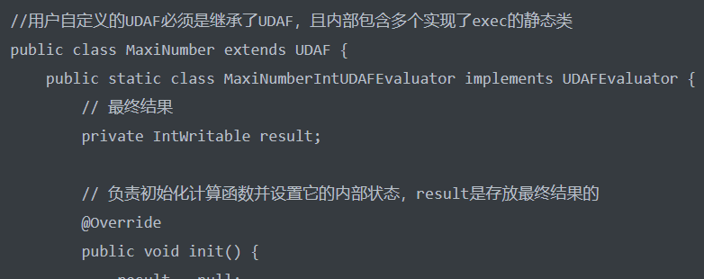

## 3.19 hive中的lateral view，explode，json_tuple函数的使用（☆☆☆☆☆）

explode函数可以将array或map展开---- explode（array）将array里的每一个元素作为一行； explode（map）将map中的每一对元素作为一行，key为一列，value为一列

lateral view为侧视图，用来配合UDTF函数使用。 不加lateral view的UDTF只能提取单个字段拆分,并不能塞回原来数据表中.加上lateral view就可以将拆分的单个字段数据与原始表数据关联上。 写法格式：

表名 lateral view UDTF(xxx) 视图别名 as 新列别名

select subview.* from test_message lateral view explode(location) subview as lc;

subview为视图别名,lc为指定新列别名

json_tuple()函数也是UDTF函数,因为一个json字符串对应了解析出n个字段.与原表数据关联的时候需要使用lateral view

select id from 表名 lateral view json_tuple(property,'tag_id','tag_type');

## 3.19 hive中的行列互转 （☆☆☆☆☆）

### 多行转单列： concat_ws + collect_set

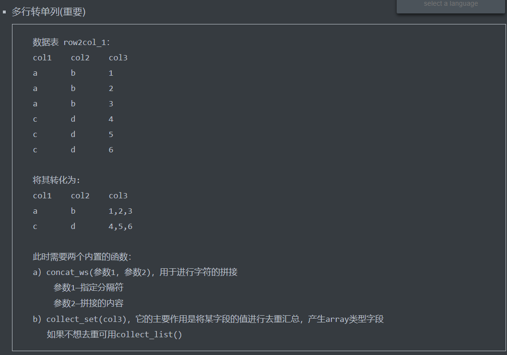

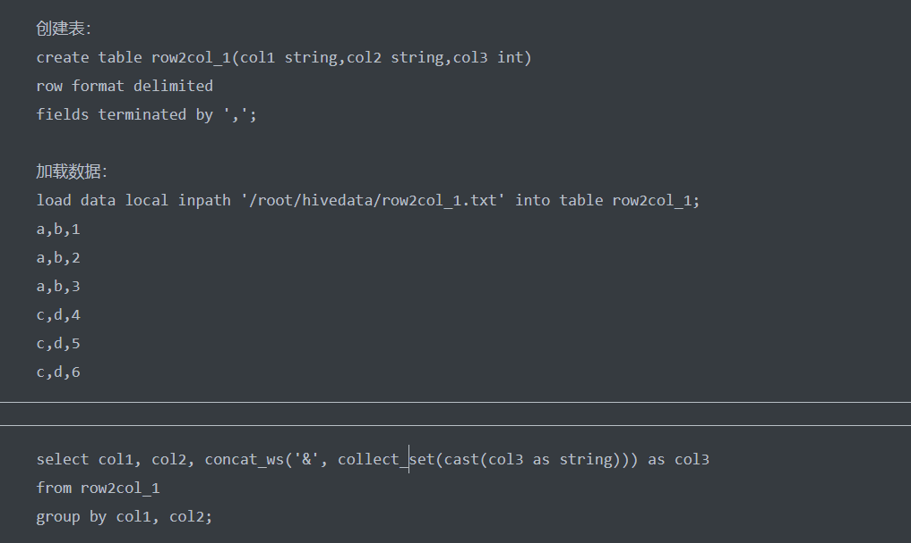

### 单列转多行： lateral view + explode

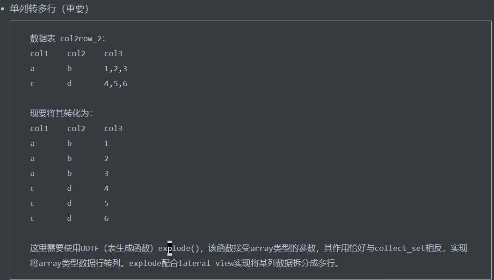

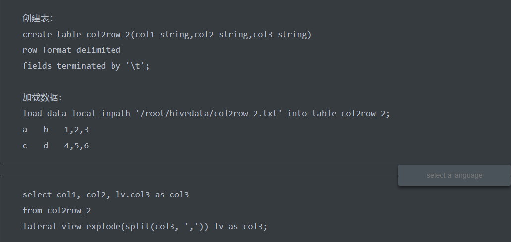

## Hive自定义UDF函数的流程? --面试真题 （☆☆☆☆☆）

1）写一个类继承（org.apache.hadoop.hive.ql.）UDF类；

2）重写方法evaluate()；

3）打JAR包；

4）通过hive命令将JAR添加到Hive的类路径：

> hive> add jar /home/ubuntu/ToDate.jar;

5）注册函数：

hive> create temporary function xxx方法名 as 'XXX方法名';

6）使用函数；

7）[可选] drop临时函数

hive>drop temporary function xxx方法名；

面试题： 你有没有写过UDF函数？

可以回答写过，比如自定义UDF解析user agent，提取出浏览器版本，系统平台等信息

以下是自定义解析UA的UDF函数关键步骤：

需要导入UserAgent的依赖，

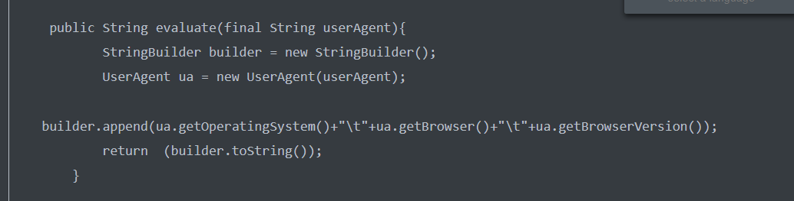

## 3.21 hive你是怎么处理json数据的？（☆☆☆☆☆）---面试真题

hive 处理json数据总体来说有两个方式：

方式1：将json以字符串的方式整个入Hive表，然后通过使用UDF函数解析已经导入到hive中的数据，比如使用LATERAL VIEW json_tuple的方法，获取所需要的列名。

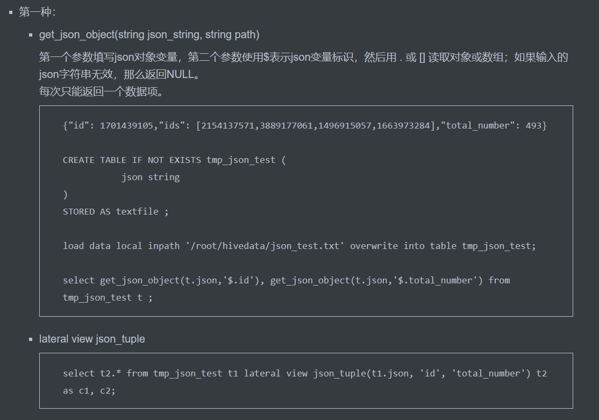

方式2：在导入之前将json拆成各个字段，导入Hive表的数据是已经解析过得。这将需要使用第三方的SerDe

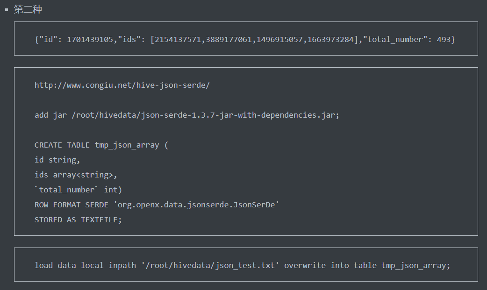

## 3.21 说说对Hive桶表的理解？--要知道

桶表是对数据进行哈希取值，然后放到不同文件中存储。

数据加载到桶表时，会对字段取hash值，然后与桶的数量取模。把数据放到对应的文件中。物理上，每个桶就是表(或分区）目录里的一个文件，一个作业产生的桶(输出文件)和reduce任务个数相同。

桶表专门用于抽样查询，是很专业性的，不是日常用来存储数据的表，需要抽样查询时，才创建和使用桶表。

## 3.25 你们所写的Hive的HQL语句大概有多少条？

## 3.26 你们的Hive处理数据能达到的指标是多少？

## 3.27 Hive优化措施（☆☆☆☆☆）

抓本表并倾，严重推压缩。

小大表，大大表，

map端join，Group by聚合，

先group by后count，不要count（distinct），

行列过滤，不要笛卡尔，

还有分桶和分区，都是表的优化。

数据倾斜有妙招，

map数，reduce数，不能多不能少，

小文件先合并，用来减少map数，

复杂文件加map，还有参数可配置。

### 3.27.1 Fetch抓取(避免执行mapreduce)

Fetch抓取是指，Hive中对某些情况的查询可以不必使用MapReduce计算。例如：SELECT * FROM employees;在这种情况下，Hive可以简单地读取employee对应的存储目录下的文件，然后输出查询结果到控制台。

在hive-default.xml.template文件中hive.fetch.task.conversion默认是more，老版本hive默认是minimal，该属性修改为more以后，在全局查找、字段查找、limit查找等都不走mapreduce。

+------------------------------------------------------------------------------------------+
| <property>                                                                             |
|                                                                                          |
| <name>hive.fetch.task.conversion</name>                                              |
|                                                                                          |
| <value>more</value>                                                                  |
|                                                                                          |
| <description>                                                                          |
|                                                                                          |
| Expects one of [none, minimal, more].                                                  |
|                                                                                          |
| Some select queries can be converted to single FETCH task minimizing latency.            |
|                                                                                          |
| Currently the query should be single sourced not having any subquery and should not have |
|                                                                                          |
| any aggregations or distincts (which incurs RS), lateral views and joins.                |
|                                                                                          |
| 0. none : disable hive.fetch.task.conversion                                            |
|                                                                                          |
| 1. minimal : SELECT STAR, FILTER on partition columns, LIMIT only                       |
|                                                                                          |
| 2. more : SELECT, FILTER, LIMIT only (support TABLESAMPLE and virtual columns)          |
|                                                                                          |
| </description>                                                                         |
|                                                                                          |
| </property>                                                                            |
+------------------------------------------------------------------------------------------+

案例实操：

1）把hive.fetch.task.conversion设置成none，然后执行查询语句，都会执行mapreduce程序。

> hive (default)> set hive.fetch.task.conversion=none;
>
> hive (default)> select * from emp;
>
> hive (default)> select ename from emp;
>
> hive (default)> select ename from emp limit 3;

2）把hive.fetch.task.conversion设置成more，然后执行查询语句，如下查询方式都不会执行mapreduce程序。

> hive (default)> set hive.fetch.task.conversion=more;
>
> hive (default)> select * from emp;
>
> hive (default)> select ename from emp;
>
> hive (default)> select ename from emp limit 3;

### 3.27.2 本地模式

大多数的Hadoop Job是需要Hadoop提供的完整的可扩展性来处理大数据集的。不过，有时Hive的输入数据量是非常小的。在这种情况下，为查询触发执行任务时消耗可能会比实际job的执行时间要多的多。对于大多数这种情况，Hive可以通过本地模式在单台机器上处理所有的任务。对于小数据集，执行时间可以明显被缩短。

用户可以通过设置hive.exec.mode.local.auto的值为true，来让Hive在适当的时候自动启动这个优化。

+------------------------------------------------------------------------------------------------------+
| set hive.exec.mode.local.auto=true;  //开启本地mr                                                    |
|                                                                                                      |
| //设置local mr的最大输入数据量，当输入数据量小于这个值时采用local  mr的方式，默认为134217728，即128M |
|                                                                                                      |
| set hive.exec.mode.local.auto.inputbytes.max=50000000;                                               |
|                                                                                                      |
| //设置local mr的最大输入文件个数，当输入文件个数小于这个值时采用local mr的方式，默认为4              |
|                                                                                                      |
| set hive.exec.mode.local.auto.input.files.max=10;                                                    |
+------------------------------------------------------------------------------------------------------+

案例实操：

1）开启本地模式，并执行查询语句

> hive (default)> set hive.exec.mode.local.auto=true; 
>
> hive (default)> select * from emp cluster by deptno;
>
> Time taken: 1.328 seconds, Fetched: 14 row(s)

2）关闭本地模式，并执行查询语句

> hive (default)> set hive.exec.mode.local.auto=false; 
>
> hive (default)> select * from emp cluster by deptno;
>
> Time taken: 20.09 seconds, Fetched: 14 row(s)

### 3.27.3 表的优化

#### 3.27.3.1 小表、大表Join

将key相对分散，并且数据量小的表放在join的左边，这样可以有效减少内存溢出错误发生的几率；再进一步，可以使用Group让小的维度表（1000条以下的记录条数）先进内存。在map端完成reduce。

实际测试发现：新版的hive已经对小表JOIN大表和大表JOIN小表进行了优化。小表放在左边和右边已经没有明显区别。

案例实操

（0）需求：测试大表JOIN小表和小表JOIN大表的效率

（1）建大表、小表和JOIN后表的语句

+----------------------------------------------------------------------------------------------------------------------------------------------------------------------------------+
| create table bigtable(id bigint, time bigint, uid string, keyword string, url_rank int, click_num int, click_url string) row format delimited fields terminated by 't';   |
|                                                                                                                                                                                  |
| create table smalltable(id bigint, time bigint, uid string, keyword string, url_rank int, click_num int, click_url string) row format delimited fields terminated by 't'; |
|                                                                                                                                                                                  |
| create table jointable(id bigint, time bigint, uid string, keyword string, url_rank int, click_num int, click_url string) row format delimited fields terminated by 't';  |
+----------------------------------------------------------------------------------------------------------------------------------------------------------------------------------+

（2）分别向大表和小表中导入数据

hive (default)> load data local inpath '/opt/module/datas/bigtable' into table bigtable;

hive (default)>load data local inpath '/opt/module/datas/smalltable' into table smalltable;

（3）关闭mapjoin功能（默认是打开的）

set hive.auto.convert.join = false;

（4）执行小表JOIN大表语句

+--------------------------------------------------------------------------------+
| insert overwrite table jointable                                               |
|                                                                                |
| select b.id, b.time, b.uid, b.keyword, b.url_rank, b.click_num, b.click_url |
|                                                                                |
| from smalltable s                                                              |
|                                                                                |
| left join bigtable b                                                           |
|                                                                                |
| on b.id = s.id;                                                                |
+--------------------------------------------------------------------------------+

Time taken: 35.921 seconds

（5）执行大表JOIN小表语句

+--------------------------------------------------------------------------------+
| insert overwrite table jointable                                               |
|                                                                                |
| select b.id, b.time, b.uid, b.keyword, b.url_rank, b.click_num, b.click_url |
|                                                                                |
| from bigtable b                                                                |
|                                                                                |
| left join smalltable s                                                         |
|                                                                                |
| on s.id = b.id;                                                                |
+--------------------------------------------------------------------------------+

Time taken: 34.196 seconds

#### 3.27.3.2 大表Join大表

1）空KEY过滤

有时join超时是因为某些key对应的数据太多，而相同key对应的数据都会发送到相同的reducer上，从而导致内存不够。此时我们应该仔细分析这些异常的key，很多情况下，这些key对应的数据是异常数据，我们需要在SQL语句中进行过滤。例如key对应的字段为空，操作如下：

案例实操

（1）配置历史服务器

配置mapred-site.xml

+------------------------------------------------------+
| <property>                                         |
|                                                      |
| > <name>mapreduce.jobhistory.address</name>      |
| >                                                    |
| > <value>hadoop102:10020</value>                 |
|                                                      |
| </property>                                        |
|                                                      |
| <property>                                         |
|                                                      |
| <name>mapreduce.jobhistory.webapp.address</name> |
|                                                      |
| <value>hadoop102:19888</value>                   |
|                                                      |
| </property>                                        |
+------------------------------------------------------+

启动历史服务器

sbin/mr-jobhistory-daemon.sh start historyserver

查看jobhistory

[http://192.168.1.102:19888/jobhistory](http://192.168.1.102:19888/jobhistory)

（2）创建原始数据表、空id表、合并后数据表

+-----------------------------------------------------------------------------------------------------------------------------------------------------------------------------------+
| create table ori(id bigint, time bigint, uid string, keyword string, url_rank int, click_num int, click_url string) row format delimited fields terminated by 't';         |
|                                                                                                                                                                                   |
| create table nullidtable(id bigint, time bigint, uid string, keyword string, url_rank int, click_num int, click_url string) row format delimited fields terminated by 't'; |
|                                                                                                                                                                                   |
| create table jointable(id bigint, time bigint, uid string, keyword string, url_rank int, click_num int, click_url string) row format delimited fields terminated by 't';   |
+-----------------------------------------------------------------------------------------------------------------------------------------------------------------------------------+

（3）分别加载原始数据和空id数据到对应表中

hive (default)> load data local inpath '/opt/module/datas/ori' into table ori;

hive (default)> load data local inpath '/opt/module/datas/nullid' into table nullidtable;

（4）测试不过滤空id

hive (default)> insert overwrite table jointable

> select n.* from nullidtable n left join ori o on n.id = o.id;

Time taken: 42.038 seconds

（5）测试过滤空id

hive (default)> insert overwrite table jointable

> select n.* from (select * from nullidtable where id is not null ) n left join ori o on n.id = o.id;

Time taken: 31.725 seconds

2）空key转换

有时虽然某个key为空对应的数据很多，但是相应的数据不是异常数据，必须要包含在join的结果中，此时我们可以表a中key为空的字段赋一个随机的值，使得数据随机均匀地分不到不同的reducer上。例如：

案例实操：

不随机分布空null值：

（1）设置5个reduce个数

> set mapreduce.job.reduces = 5;

（2）JOIN两张表

+----------------------------------------------------------------+
| insert overwrite table jointable                               |
|                                                                |
| select n.* from nullidtable n left join ori b on n.id = b.id; |
+----------------------------------------------------------------+

结果：可以看出来，出现了数据倾斜，某些reducer的资源消耗远大于其他reducer。


随机分布空null值

（1）设置5个reduce个数

> set mapreduce.job.reduces = 5;

（2）JOIN两张表

+----------------------------------------------------------------------------+
| insert overwrite table jointable                                           |
|                                                                            |
| select n.* from nullidtable n full join ori o on                          |
|                                                                            |
| case when n.id is null then concat('hive', rand()) else n.id end = o.id; |
+----------------------------------------------------------------------------+

结果：可以看出来，消除了数据倾斜，负载均衡reducer的资源消耗


#### 3.27.3.3 MapJoin

如果不指定MapJoin或者不符合MapJoin的条件，那么Hive解析器会将Join操作转换成Common Join，即：在Reduce阶段完成join。容易发生数据倾斜。可以用MapJoin把小表全部加载到内存在map端进行join，避免reducer处理。

1）开启MapJoin参数设置：

（1）设置自动选择Mapjoin

> set hive.auto.convert.join = true; 默认为true

（2）大表小表的阀值设置（默认25M一下认为是小表）：

> set hive.mapjoin.smalltable.filesize=25000000;

2）MapJoin工作机制(map join的原理☆☆☆)

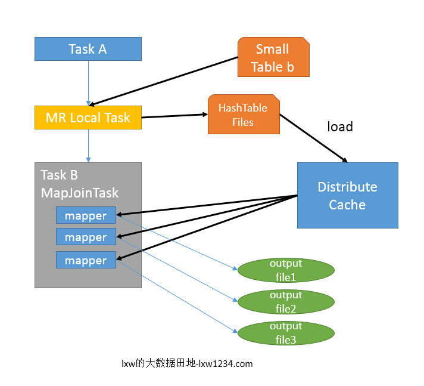

首先是Task A，它是一个Local Task（在客户端本地执行的Task），负责扫描小表b的数据，将其转换成一个HashTable的数据结构的文件，并写入本地的文件中，之后将该文件加载到DistributeCache中。

接下来是Task B，该任务是一个没有Reduce的MR，启动MapTasks扫描大表a,在Map阶段，根据a的每一条记录去和DistributeCache中b表对应的HashTable关联，并直接输出结果。

由于MapJoin没有Reduce，所以由Map直接输出结果文件，有多少个Map Task，就有多少个结果文件。

案例实操：

（1）开启Mapjoin功能

> set hive.auto.convert.join = true; 默认为true

（2）执行小表JOIN大表语句

+--------------------------------------------------------------------------------+
| insert overwrite table jointable                                               |
|                                                                                |
| select b.id, b.time, b.uid, b.keyword, b.url_rank, b.click_num, b.click_url |
|                                                                                |
| from smalltable s                                                              |
|                                                                                |
| join bigtable b                                                                |
|                                                                                |
| on s.id = b.id;                                                                |
+--------------------------------------------------------------------------------+

Time taken: 24.594 seconds

（3）执行大表JOIN小表语句

+--------------------------------------------------------------------------------+
| insert overwrite table jointable                                               |
|                                                                                |
| select b.id, b.time, b.uid, b.keyword, b.url_rank, b.click_num, b.click_url |
|                                                                                |
| from bigtable b                                                                |
|                                                                                |
| join smalltable s                                                              |
|                                                                                |
| on s.id = b.id;                                                                |
+--------------------------------------------------------------------------------+

Time taken: 24.315 seconds

#### 3.27.3.4 开启Group By聚合 （两段聚合，第一个mr部分聚合，第二个mr最终聚合）

简单说就是开启group by聚合后, 查询时会生成两个MR job, 第一个job做部分聚合,有可能相同key的数据会发到不同的reduce当中. 第二个job做最终聚合,按照Group By Key将key相同的数据发到同一个reduce中

默认情况下，Map阶段同一Key数据分发给一个reduce，当一个key数据过大时就倾斜了。

并不是所有的聚合操作都需要在Reduce端完成，很多聚合操作都可以先在Map端进行部分聚合，最后在Reduce端得出最终结果。

1）开启Map端聚合参数设置

（1）是否在Map端进行聚合，默认为True

> hive.map.aggr = true

（2）在Map端进行聚合操作的条目数目

hive.groupby.mapaggr.checkinterval = 100000

（3）有数据倾斜的时候进行负载均衡（默认是false）

hive.groupby.skewindata = true

当选项设定为 true，生成的查询计划会有两个MR Job。第一个MR Job中，Map的输出结果会随机分布到Reduce中，每个Reduce做部分聚合操作，并输出结果，这样处理的结果是相同的Group By Key有可能被分发到不同的Reduce中，从而达到负载均衡的目的；第二个MR Job再根据预处理的数据结果按照Group By Key分布到Reduce中（这个过程可以保证相同的Group By Key被分布到同一个Reduce中），最后完成最终的聚合操作。

#### 3.27.3.5 使用先group by再count的方式代替Count(Distinct colum) 去重统计(只适合于特别大的数据量情况, 数据少时反而耗时长)

数据量小的时候无所谓，数据量大的情况下，由于COUNT DISTINCT操作需要用一个Reduce Task来完成，这一个Reduce需要处理的数据量太大，就会导致整个Job很难完成，一般COUNT DISTINCT使用先GROUP BY再COUNT的方式替换：

案例实操

（1）创建一张大表

-------------------------------------------------------------------------------------------------------------------------------------------------------------------------------------------------
  hive (default)> create table bigtable(id bigint, time bigint, uid string, keyword string, url_rank int, click_num int, click_url string) row format delimited fields terminated by 't';
  -------------------------------------------------------------------------------------------------------------------------------------------------------------------------------------------------

（2）加载数据

> hive (default)> load data local inpath '/opt/module/datas/bigtable' into table bigtable;

（3）设置5个reduce个数

> set mapreduce.job.reduces = 5;

（4）执行去重id查询

> hive (default)> select count(distinct id) from bigtable;
>
> Stage-Stage-1: Map: 1 Reduce: 1 Cumulative CPU: 7.12 sec HDFS Read: 120741990 HDFS Write: 7 SUCCESS
>
> Total MapReduce CPU Time Spent: 7 seconds 120 msec
>
> OK
>
> c0
>
> 100001
>
> Time taken: 23.607 seconds, Fetched: 1 row(s)
>
> Time taken: 34.941 seconds, Fetched: 1 row(s)

（5）采用GROUP by去重id

> hive (default)> select count(id) from (select id from bigtable group by id) a;
>
> Stage-Stage-1: Map: 1 Reduce: 5 Cumulative CPU: 17.53 sec HDFS Read: 120752703 HDFS Write: 580 SUCCESS
>
> Stage-Stage-2: Map: 3 Reduce: 1 Cumulative CPU: 4.29 sec HDFS Read: 9409 HDFS Write: 7 SUCCESS
>
> Total MapReduce CPU Time Spent: 21 seconds 820 msec
>
> OK
>
> _c0
>
> 100001
>
> Time taken: 50.795 seconds, Fetched: 1 row(s)

虽然会多用一个Job来完成，但在数据量大的情况下，这个绝对是值得的。

#### 3.27.3.6 避免笛卡尔积,因为会查询出所有的可能结果

尽量避免笛卡尔积，join的时候不加on条件，或者无效的on条件，Hive只能使用1个reducer来完成笛卡尔积

#### 3.27.3.7 行列过滤

列处理：在SELECT中，只拿需要的列，如果有，尽量使用列过滤SELECT 列名，少用SELECT *。

行处理：先关联表再where过滤的方式效率低, 而先where过滤再关联表效率高

案例实操：

（1）测试先关联两张表，再用where条件过滤

> hive (default)> select o.id from bigtable b
>
> join ori o on o.id = b.id
>
> where o.id <= 10;

Time taken: 34.406 seconds, Fetched: 100 row(s)

Time taken: 26.043 seconds, Fetched: 100 row(s)

（2）通过子查询后，再关联表

> hive (default)> select b.id from bigtable b
>
> join (select id from ori where id <= 10 ) o on b.id = o.id;

Time taken: 30.058 seconds, Fetched: 100 row(s)

Time taken: 29.106 seconds, Fetched: 100 row(s)

#### 3.27.3.8 动态分区调整 (不是很懂可以不用回答)

关系型数据库中，对分区表Insert数据时候，数据库自动会根据分区字段的值，将数据插入到相应的分区中，Hive中也提供了类似的机制，即动态分区(Dynamic Partition)，只不过，使用Hive的动态分区，需要进行相应的配置。

1）开启动态分区参数设置

（1）开启动态分区功能（默认true，开启）

> hive.exec.dynamic.partition=true

（2）设置为非严格模式（动态分区的模式，默认strict，表示必须指定至少一个分区为静态分区，nonstrict模式表示允许所有的分区字段都可以使用动态分区。）

> hive.exec.dynamic.partition.mode=nonstrict

（3）在所有执行MR的节点上，最大一共可以创建多少个动态分区。

> hive.exec.max.dynamic.partitions=1000

（4）在每个执行MR的节点上，最大可以创建多少个动态分区。该参数需要根据实际的数据来设定。比如：源数据中包含了一年的数据，即day字段有365个值，那么该参数就需要设置成大于365，如果使用默认值100，则会报错。

> hive.exec.max.dynamic.partitions.pernode=100

（5）整个MR Job中，最大可以创建多少个HDFS文件。

> hive.exec.max.created.files=100000

（6）当有空分区生成时，是否抛出异常。一般不需要设置。

> hive.error.on.empty.partition=false

2）案例实操

需求：将ori中的数据按照时间(如：20111230000008)，插入到目标表ori_partitioned_target的相应分区中。

（1）创建分区表

+-------------------------------------------------------------------------------------------------------------------------------------+
| create table ori_partitioned(id bigint, time bigint, uid string, keyword string, url_rank int, click_num int, click_url string) |
|                                                                                                                                     |
| partitioned by (p_time bigint)                                                                                                     |
|                                                                                                                                     |
| row format delimited fields terminated by 't';                                                                                  |
+-------------------------------------------------------------------------------------------------------------------------------------+

（2）加载数据到分区表中

+---------------------------------------------------------------------------------------------------------------------------------------+
| hive (default)> load data local inpath '/opt/module/datas/ds1' into table ori_partitioned partition(p_time='20111230000010') ; |
|                                                                                                                                       |
| hive (default)> load data local inpath '/opt/module/datas/ds2' into table ori_partitioned partition(p_time='20111230000011') ; |
+---------------------------------------------------------------------------------------------------------------------------------------+

（3）创建目标分区表

--------------------------------------------------------------------------------------------------------------------------------------------------------------------------------------------------------------------------------
  create table ori_partitioned_target(id bigint, time bigint, uid string, keyword string, url_rank int, click_num int, click_url string) PARTITIONED BY (p_time STRING) row format delimited fields terminated by 't';
  --------------------------------------------------------------------------------------------------------------------------------------------------------------------------------------------------------------------------------

（4）设置动态分区

+--------------------------------------------------------------------------------------------------+
| set hive.exec.dynamic.partition = true;                                                          |
|                                                                                                  |
| set hive.exec.dynamic.partition.mode = nonstrict;                                                |
|                                                                                                  |
| set hive.exec.max.dynamic.partitions = 1000;                                                     |
|                                                                                                  |
| set hive.exec.max.dynamic.partitions.pernode = 100;                                              |
|                                                                                                  |
| set hive.exec.max.created.files = 100000;                                                        |
|                                                                                                  |
| set hive.error.on.empty.partition = false;                                                       |
|                                                                                                  |
| hive (default)> insert overwrite table ori_partitioned_target partition (p_time)             |
|                                                                                                  |
| select id, time, uid, keyword, url_rank, click_num, click_url, p_time from ori_partitioned; |
+--------------------------------------------------------------------------------------------------+

> （5）查看目标分区表的分区情况
>
> hive (default)> show partitions ori_partitioned_target;

#### 3.27.3.9 分桶

就是将一个大文件分成多个文件

分桶的原理: 类似MR的hash分区原理, 将分桶的字段的hash值模以分桶数

分桶的作用:

> 1, 方便抽样查询
>
> 2, 提高join查询效率 解释: 比如两个大表,都是分桶表, 且A表的桶数是B表桶数的倍数或因子, 这样join查询时候，表A的每个桶就可以和表B对应的桶直接join，而不用全表join，提高查询效率

#### 3.27.3.10 分区

> 分区表的意义在于优化查询。查询时尽量利用分区字段。如果不使用分区字段，就会全部扫描。

### 3.27.4 数据倾斜

#### 3.27.4.1 合理设置Map数, 多和少都不行

1）通常情况下，作业会通过input的目录产生一个或者多个map任务。

主要的决定因素有：input的文件总个数，input的文件大小，集群设置的文件块大小。

> 2）是不是map数越多越好？

答案是否定的。如果一个任务有很多小文件（远远小于块大小128m），则每个小文件也会被当做一个块用一个map任务来完成，而一个map任务启动和初始化的时间远远大于逻辑处理的时间，就会造成很大的资源浪费。而且，同时可执行的map数是受限的。

3）是不是保证每个map处理接近128m的文件块，就高枕无忧了？

答案也是不一定。比如有一个127m的文件，正常会用一个map去完成，但这个文件只有一个或者两个小字段，却有几千万的记录，如果map处理的逻辑比较复杂，用一个map任务去做，肯定也比较耗时。

针对上面的问题2和3，我们需要采取两种方式来解决：即减少map数和增加map数；

#### 3.27.4.2 小文件进行合并

在map执行前合并小文件，减少map数：CombineHiveInputFormat具有对小文件进行合并的功能（系统默认的格式）。HiveInputFormat没有对小文件合并功能。

> set hive.input.format= org.apache.hadoop.hive.ql.io.CombineHiveInputFormat;

#### 3.27.4.3 复杂文件增加Map数

当input的文件都很大，任务逻辑复杂，map执行非常慢的时候，可以考虑增加Map数，来使得每个map处理的数据量减少，从而提高任务的执行效率。

增加map的方法为：根据computeSliteSize(Math.max(minSize,Math.min(maxSize,blocksize)))=blocksize=128M公式，调整maxSize最大值。让maxSize最大值低于blocksize就可以增加map的个数。

案例实操：

（1）执行查询

> hive (default)> select count(*) from emp;
>
> Hadoop job information for Stage-1: number of mappers: 1; number of reducers: 1

（2）设置最大切片值为100个字节

> hive (default)> set mapreduce.input.fileinputformat.split.maxsize=100;
>
> hive (default)> select count(*) from emp;
>
> Hadoop job information for Stage-1: number of mappers: 6; number of reducers: 1

#### 3.27.4.4 合理设置Reduce数

1）调整reduce个数方法一

（1）每个Reduce处理的数据量默认是256MB

> hive.exec.reducers.bytes.per.reducer=256000000

（2）每个任务最大的reduce数，默认为1009

> hive.exec.reducers.max=1009

（3）计算reducer数的公式

> N=min(参数2，总输入数据量/参数1)

2）调整reduce个数方法二

在hadoop的mapred-default.xml文件中修改

设置每个job的Reduce个数

set mapreduce.job.reduces = 15;

3）reduce个数并不是越多越好

> 1）过多的启动和初始化reduce也会消耗时间和资源；

2）另外，有多少个reduce，就会有多少个输出文件，如果生成了很多个小文件，那么如果这些小文件作为下一个任务的输入，则也会出现小文件过多的问题；

在设置reduce个数的时候也需要考虑这两个原则：处理大数据量利用合适的reduce数；使单个reduce任务处理数据量大小要合适；

### 3.27.5 开启并行执行

Hive会将一个查询转化成一个或者多个阶段。这样的阶段可以是MapReduce阶段、抽样阶段、合并阶段、limit阶段。或者Hive执行过程中可能需要的其他阶段。默认情况下，Hive一次只会执行一个阶段。不过，某个特定的job可能包含众多的阶段，而这些阶段可能并非完全互相依赖的，也就是说有些阶段是可以并行执行的，这样可能使得整个job的执行时间缩短。不过，如果有更多的阶段可以并行执行，那么job可能就越快完成。

通过设置参数hive.exec.parallel值为true，就可以开启并发执行。不过，在共享集群中，需要注意下，如果job中并行阶段增多，那么集群利用率就会增加。

+-------------------------------------------------------------------------------+
| set hive.exec.parallel=true;   //打开任务并行执行                             |
|                                                                               |
| set hive.exec.parallel.thread.number=16; //同一个sql允许最大并行度，默认为8。 |
+-------------------------------------------------------------------------------+

当然，得是在系统资源比较空闲的时候才有优势，否则，没资源，并行也起不来。

### 3.27.6 开启严格模式,会限制三种查询

Hive提供了一个严格模式，可以防止用户执行那些可能意向不到的不好的影响的查询。

通过设置属性hive.mapred.mode值为默认是非严格模式nonstrict 。开启严格模式需要修改hive.mapred.mode值为strict，开启严格模式可以禁止3种类型的查询。

+--------------------------------------------------------------------------+
| <property>                                                             |
|                                                                          |
| <name>hive.mapred.mode</name>                                        |
|                                                                          |
| <value>strict</value>                                                |
|                                                                          |
| <description>                                                          |
|                                                                          |
| The mode in which the Hive operations are being performed.               |
|                                                                          |
| In strict mode, some risky queries are not allowed to run. They include: |
|                                                                          |
| Cartesian Product.                                                       |
|                                                                          |
| No partition being picked up for a query.                                |
|                                                                          |
| Comparing bigints and strings.                                           |
|                                                                          |
| Comparing bigints and doubles.                                           |
|                                                                          |
| Orderby without limit.                                                   |
|                                                                          |
| </description>                                                         |
|                                                                          |
| </property>                                                            |
+--------------------------------------------------------------------------+

1）对于分区表，除非where语句中含有分区字段过滤条件来限制范围，否则不允许执行。换句话说，就是用户不允许扫描所有分区。进行这个限制的原因是，通常分区表都拥有非常大的数据集，而且数据增加迅速。没有进行分区限制的查询可能会消耗令人不可接受的巨大资源来处理这个表。

2）对于使用了order by语句的查询，要求必须使用limit语句。因为order by为了执行排序过程会将所有的结果数据分发到同一个Reducer中进行处理，强制要求用户增加这个LIMIT语句可以防止Reducer额外执行很长一段时间。

3）限制笛卡尔积的查询。对关系型数据库非常了解的用户可能期望在执行JOIN查询的时候不使用ON语句而是使用where语句，这样关系数据库的执行优化器就可以高效地将WHERE语句转化成那个ON语句。不幸的是，Hive并不会执行这种优化，因此，如果表足够大，那么这个查询就会出现不可控的情况。

### 3.27.7 开启JVM重用

JVM重用是Hadoop调优参数的内容，其对Hive的性能具有非常大的影响，特别是对于很难避免小文件的场景或task特别多的场景，这类场景大多数执行时间都很短。

Hadoop的默认配置通常是使用派生JVM来执行map和Reduce任务的。这时JVM的启动过程可能会造成相当大的开销，尤其是执行的job包含有成百上千task任务的情况。JVM重用可以使得JVM实例在同一个job中重新使用N次。N的值可以在Hadoop的mapred-site.xml文件中进行配置。通常在10-20之间，具体多少需要根据具体业务场景测试得出。

+----------------------------------------------------------------------+
| <property>                                                         |
|                                                                      |
| <name>mapreduce.job.jvm.numtasks</name>                          |
|                                                                      |
| <value>10</value>                                                |
|                                                                      |
| <description>How many tasks to run per jvm. If set to -1, there is |
|                                                                      |
| no limit.                                                            |
|                                                                      |
| </description>                                                     |
|                                                                      |
| </property>                                                        |
+----------------------------------------------------------------------+

这个功能的缺点是，开启JVM重用将一直占用使用到的task插槽，以便进行重用，直到任务完成后才能释放。如果某个"不平衡的"job中有某几个reduce task执行的时间要比其他Reduce task消耗的时间多的多的话，那么保留的插槽就会一直空闲着却无法被其他的job使用，直到所有的task都结束了才会释放。

### 3.27.8 开启推测执行

在分布式集群环境下，因为程序Bug（包括Hadoop本身的bug），负载不均衡或者资源分布不均等原因，会造成同一个作业的多个任务之间运行速度不一致，有些任务的运行速度可能明显慢于其他任务（比如一个作业的某个任务进度只有50%，而其他所有任务已经运行完毕），则这些任务会拖慢作业的整体执行进度。为了避免这种情况发生，Hadoop采用了推测执行（Speculative Execution）机制，它根据一定的法则推测出"拖后腿"的任务，并为这样的任务启动一个备份任务，让该任务与原始任务同时处理同一份数据，并最终选用最先成功运行完成任务的计算结果作为最终结果。

设置开启推测执行参数：Hadoop的mapred-site.xml文件中进行配置

+----------------------------------------------------------------------+
| <property>                                                         |
|                                                                      |
| <name>mapreduce.map.speculative</name>                           |
|                                                                      |
| <value>true</value>                                              |
|                                                                      |
| <description>If true, then multiple instances of some map tasks    |
|                                                                      |
| may be executed in parallel.</description>                         |
|                                                                      |
| </property>                                                        |
|                                                                      |
| <property>                                                         |
|                                                                      |
| <name>mapreduce.reduce.speculative</name>                        |
|                                                                      |
| <value>true</value>                                              |
|                                                                      |
| <description>If true, then multiple instances of some reduce tasks |
|                                                                      |
| may be executed in parallel.</description>                         |
|                                                                      |
| </property>                                                        |
+----------------------------------------------------------------------+

不过hive本身也提供了配置项来控制reduce-side的推测执行：

+-------------------------------------------------------------------------------------------------+
| <property>                                                                                    |
|                                                                                                 |
| <name>hive.mapred.reduce.tasks.speculative.execution</name>                                 |
|                                                                                                 |
| <value>true</value>                                                                         |
|                                                                                                 |
| <description>Whether speculative execution for reducers should be turned on. </description> |
|                                                                                                 |
| </property>                                                                                   |
+-------------------------------------------------------------------------------------------------+

关于调优这些推测执行变量，还很难给一个具体的建议。如果用户对于运行时的偏差非常敏感的话，那么可以将这些功能关闭掉。如果用户因为输入数据量很大而需要执行长时间的map或者Reduce task的话，那么启动推测执行造成的浪费是非常巨大大。

### 3.27.9 使用压缩,开启map端输出压缩和reduce端输出压缩

map端输出压缩可以减少map端和reduce端的数据传输， reduce端输出压缩可以减少输出到磁盘的文件大小

### 3.27.10 EXPLAIN（执行计划）(不是很懂可以不用回答)

1）基本语法

EXPLAIN [EXTENDED | DEPENDENCY | AUTHORIZATION] query

2）案例实操

（1）查看下面这条语句的执行计划

hive (default)> explain select * from emp;

hive (default)> explain select deptno, avg(sal) avg_sal from emp group by deptno;

（2）查看详细执行计划

hive (default)> explain extended select * from emp;

hive (default)> explain extended select deptno, avg(sal) avg_sal from emp group by deptno;

## 3.28 用select做查询时，用哪个函数给值为null的数据设置默认值？---要知道

NVL函数, 比如select nvl(name,-1) from user; 查询当name为null时,用-1代替name的值

## 3.31 数据仓库的整体架构是什么，其中最重要的是哪个环节？

按照数据流入流出的过程，数据仓库架构可分为三层------源数据层(ODS)、数据仓库层(DW)、数据应用层(APP)。


数据仓库的数据来源于不同的源数据，并提供多样的数据应用，数据自下而上流入数据仓库后向上层开放应用，而数据仓库只是中间集成化数据管理的一个平台。

-   源数据层（ODS）：此层数据无任何更改，直接沿用外围系统数据结构和数据，不对外开放；为临时存储层，是接口数据的临时存储区域，为后一步的数据处理做准备。

-   数据仓库层（DW）：也称为细节层，DW层的数据应该是一致的、准确的、干净的数据，即对源系统数据进行了清洗（去除了杂质）后的数据。

-   数据应用层（DA或APP）：前端应用直接读取的数据源；根据报表、专题分析需求而计算生成的数据。

## 3.32 现有两张大表所有字段都得保留不能再过滤了,join操作就发生oom怎么解决？ 如果两张大表join没有发生oom也没有数据倾斜,那么怎么优化速度呢?（☆☆☆☆☆）

hive的join操作发生oom其实就是mapreduce的oom,可以通过

1, 调大jvm内存参数: odps.stage.mapper.jvm.mem 和odps.stage.reducer.jvm.mem

2, 调大 mapper和reducer阶段的堆内存大小

## 

## 3.33 Hive数据分析面试题

场景举例.北京市学生成绩分析.

成绩的数据格式:时间,学校,年纪,姓名,科目,成绩

样例数据如下:

2013,北大,1,裘容絮,语文,97

2013,北大,1,庆眠拔,语文,52

2013,北大,1,乌洒筹,语文,85

2012,清华,0,钦尧,英语,61

2015,北理工,3,冼殿,物理,81

2016,北科,4,况飘索,化学,92

2014,北航,2,孔须,数学,70

2012,清华,0,王脊,英语,59

2014,北航,2,方部盾,数学,49

2014,北航,2,东门雹,数学,77

问题:

### 3.33.1 情景题：分组TOPN

+----------------------------------------------------------------------------------------+
| # 1.分组TOPN选出 今年每个学校,每个年级,分数前三的科目.                                |
|                                                                                        |
| hive -e "                                                                             |
|                                                                                        |
| set mapreduce.job.queuename=low;                                                       |
|                                                                                        |
| select t.*                                                                            |
|                                                                                        |
| from                                                                                   |
|                                                                                        |
| (                                                                                      |
|                                                                                        |
| select                                                                                 |
|                                                                                        |
| school,                                                                                |
|                                                                                        |
| class,                                                                                 |
|                                                                                        |
| subjects,                                                                              |
|                                                                                        |
| score,                                                                                 |
|                                                                                        |
| row_number() over (partition by school,class,subjects order by score desc) rank_code |
|                                                                                        |
| from spark_test_wx                                                                   |
|                                                                                        |
| where partition_id = "2017"                                                         |
|                                                                                        |
| ) t                                                                                    |
|                                                                                        |
| where t.rank_code <= 3;                                                              |
|                                                                                        |
| "                                                                                     |
+----------------------------------------------------------------------------------------+

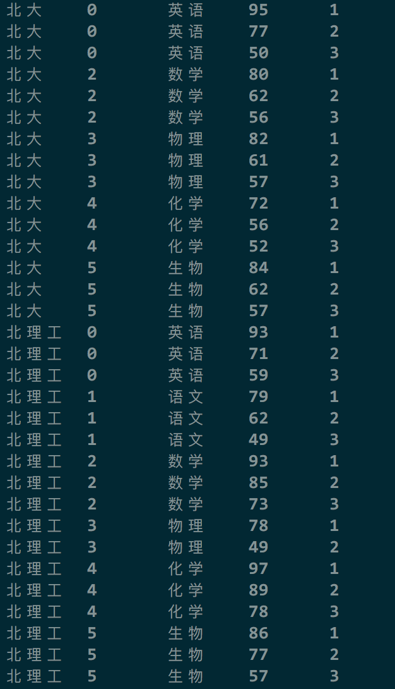

1）row_number函数: row_number() 按指定的列进行分组生成行序列, 从 1 开始, 如果两行记录的分组列相同, 则行序列+1。

2）over 函数:是一个窗口函数.

over（order by score） 按照score排序进行累计，order by是个默认的开窗函数.

over（partition by class）按照班级分区

over（partition by class order by score）按照班级分区,并按着分数排序.

over（order by score range between 2 preceding and 2 following）：窗口范围为当前行的数据幅度减2加2后的范围内的数据求和。

+----------------------------------------------------------------------------------+
| -- 今年,北航,每个班级,每科的分数,及分数上下浮动2分的总和                        |
|                                                                                  |
| select school,class,subjects,score,                                              |
|                                                                                  |
| sum(score) over(order by score range between 2 preceding and 2 following) sscore |
|                                                                                  |
| from spark_test_wx                                                             |
|                                                                                  |
| where partition_id = "2017" and school="北航"                               |
+----------------------------------------------------------------------------------+

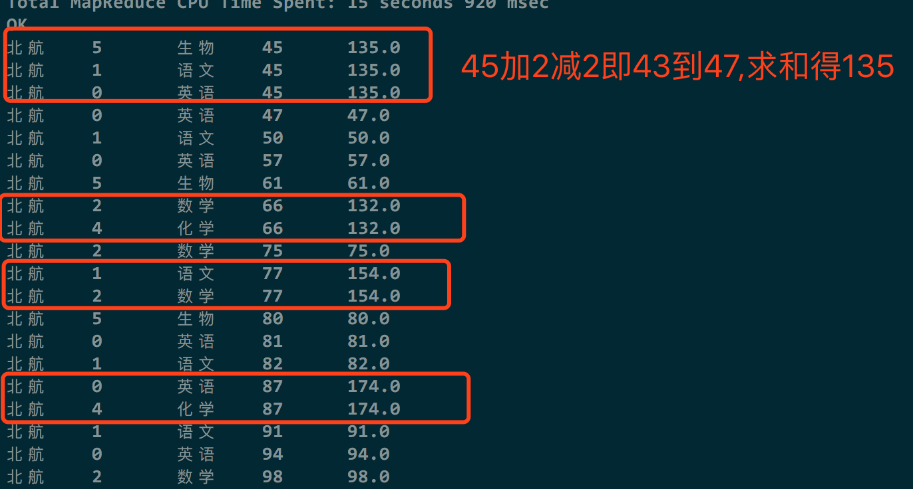

over（order by score rows between 2 preceding and 2 following）：窗口范围为当前行前后各移动2行。

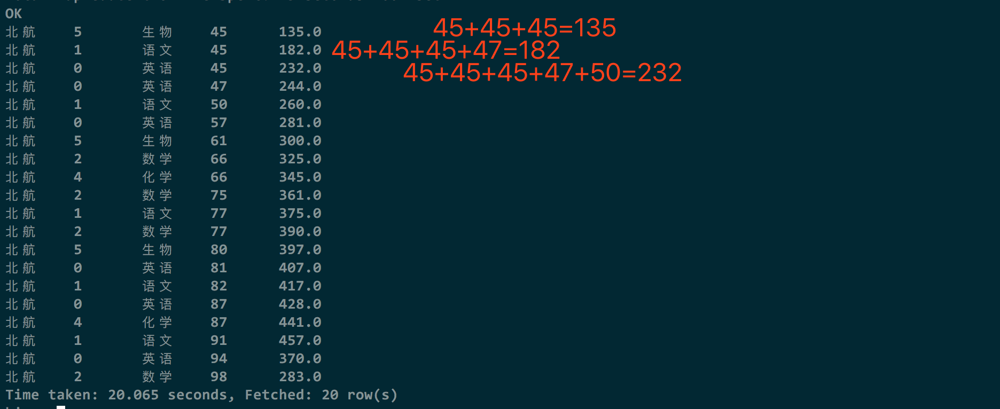

提问,上述sql有没有可优化的点.

-- row_number() over (distribute by school,class,subjects sort by score desc) rank_code

### 3.33.2 情景题：where与having

+------------------------------------------------------------------+
| hive -e "                                                       |
|                                                                  |
| -- 今年 清华 1年级 总成绩大于200分的学生 以及学生数             |
|                                                                  |
| set mapreduce.job.queuename=low;                                 |
|                                                                  |
| select school,class,name,sum(score) as total_score,             |
|                                                                  |
| count(1) over (partition by school,class) nct                    |
|                                                                  |
| from spark_test_wx                                             |
|                                                                  |
| where partition_id = "2017" and school="清华" and class = 1 |
|                                                                  |
| group by school,class,name                                       |
|                                                                  |
| having total_score>200;                                        |
|                                                                  |
| ;                                                                |
|                                                                  |
| "                                                               |
+------------------------------------------------------------------+

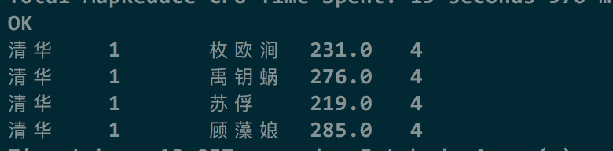

having是分组（group by）后的筛选条件，分组后的数据组内再筛选，也就是说HAVING子句可以让我们筛选成组后的各组数据。

where则是在分组,聚合前先筛选记录。也就是说作用在GROUP BY子句和HAVING子句前。

### 3.33.3 情景题：数据倾斜

今年加入进来了10个学校,学校数据差异很大计算每个学校的平均分。

该题主要是考察数据倾斜的处理方式。

Group by 方式很容易产生数据倾斜。需要注意一下几点

1）Map端部分聚合

> hive.map.aggr=true（用于设定是否在 map 端进行聚合，默认值为真，相当于combine）
>
> hive.groupby.mapaggr.checkinterval=100000（用于设定 map 端进行聚合操作的条数）

2）有数据倾斜时进行负载均衡

> 设定hive.groupby.skewindata，当选项设定为true是，生成的查询计划有两个MapReduce任务。
>
> 在第一个MapReduce中，map的输出结果集合会随机分布到reduce中， 每个reduce做部分聚合操作，并输出结果。这样处理的结果是，相同的Group By Key有可能分发到不同的reduce中，从而达到负载均衡的目的；
>
> 第二个MapReduce任务再根据预处理的数据结果按照Group By Key分布到reduce 中（这个过程可以保证相同的Group By Key分布到同一个reduce 中），最后完成最终的聚合操作。

### 3.33.4 情景题：分区表

假设我创建了一张表，其中包含了2016年客户完成的所有交易的详细信息：CREATE TABLE transaction_details (cust_id INT, amount FLOAT, month STRING, country STRING) ROW FORMAT DELIMITED FIELDS TERMINATED BY ',' ;

现在我插入了100万条数据，我想知道每个月的总收入。

问：如何高效的统计出结果。写出步骤即可。

1）首先分析这个需求，其实并不难，但是由于题目说了，要高效。而且数据量也不小,直接写sql查询估计肯定会挂。

2）分析：

（1）我们可以通过根据每个月对表进行分区来解决查询慢的问题。 因此，对于每个月我们将只扫描分区的数据，而不是整个数据集。

（2）但是我们不能直接对现有的非分区表进行分区。 所以我们会采取以下步骤来解决这个问题：

（3）创建一个分区表，partitioned_transaction：

create table partitioned_transaction (cust_id int, amount float, country string) partitioned by (month string) row format delimited fields terminated by ',' ;

（4）在Hive中启用动态分区：

SET hive.exec.dynamic.partition = true;

SET hive.exec.dynamic.partition.mode = nonstrict;

（5）将数据从非分区表导入到新创建的分区表中：

insert overwrite table partitioned_transaction partition (month) select cust_id, amount, country, month from transaction_details;

（6）使用新建的分区表实现需求。

## 3.34解释一下下列sql语句运行步骤，是否有优化空间，如果有，如何优化：

SELECT a.id, b.name FROM a LEFT OUTER JOIN b ON a.id = b.id WHERE a.dt = '2016-01-01' AND b.dt = '2016-01-01';

通过分析发现该语句是先关联表后进行where过滤的. 可以优化为先过滤再关联表,如:

SELECT a.id, b.name FROM a LEFT OUTER JOIN (SELECT * FROM b WHERE dt = '2016-01-01') b ON a.id = b.id;

## 3.35 订单详情表ord_det(order_id订单号，sku_id商品编号，sale_qtty销售数量，dt日期分区)任务计算2016年1月1日商品销量的Top100，并按销量降级排序 (某时间段内某字段的topN问题,重点理解☆☆☆☆☆)

## 3.36 某日志的格式如下：

pin|-|request_tm|-url|-|sku_id|-|amount

分隔符为'|-|',

数据样例为:

张三|-|q2013-11-23 11:59:30|-|www.jd.com|-|100023|-|110.15

假设本地数据文件为sample.txt,先将其导入到hive的test库的表t_sample中，并计算每个用户的总消费金额，写出详细过程包括表结构

## 3.37 有一张很大的表：TRLOG，该表大概有2T左右

CREATE TABLE TRLOG

( PLATFORM string,

> USER_ID int,
>
> CLICK_TIME string,
>
> CLICK_URL string)
>
> row format delimited fields terminated by 't';

数据:

PLATFORM USER_ID CLICK_TIME CLICK_URL

WEB 12332321 2013-03-21 13:48:31.324 /home/

WEB 12332321 2013-03-21 13:48:32.954 /selectcat/er/

WEB 12332321 2013-03-21 13:48:46.365 /er/viewad/12.html

WEB 12332321 2013-03-21 13:48:53.651 /er/viewad/13.html

...... ...... ...... ......

把上述数据处理为如下结构的表ALLOG:

CREATE TABLE ALLOG

( PLATFORM string,

> USER_ID int,
>
> SEQ int,
>
> FROM_URL string,
>
> TO_URL string)
>
> row format delimited fields terminated by 't';

整理后的数据结构：

PLATFORM USER_ID SEQ FROM_URL TO_URL

WEB 12332321 1 NULL /home/

WEB 12332321 2 /home/ /selectcat/er/

WEB 12332321 3 /selectcat/er/ /er/viewad/12.html

WEB 12332321 4 /er/viewad/12.html /er/viewad/13.html

WEB 12332321 1 NULL /m/home/

WEB 12332321 2 /m/home/ /m/selectcat/fang/

PLATFORM和USER_ID还是代表平台和用户ID:SEQ字段代表用户按时间排序后的访问顺序，FROM_URL和TO_URL分别代表用户从哪一页跳转到哪一页。某个用户的第一条访问记录的FROM_URL是NULL（空值）。两种办法做出来:

1.  实现一个能加速上述处理过程的Hive GenericUDF，并给出此UDF实现ETL过程的Hive SQL

2.  实现基于纯Hive SQL的ETL过程，从TRLOG表生成ALLOG表:（结果是一套SQL）

## 3.38 有一个5000万的用户文件(user_id,name,age),一个2亿记录的用户看电影的记录文件(user_id,url),根据年龄段观看电影的次数进行排序？

# 四 HBase（☆☆☆☆☆）

## 4.1 HBase的架构以及角色说明 （☆☆☆☆面试真题）

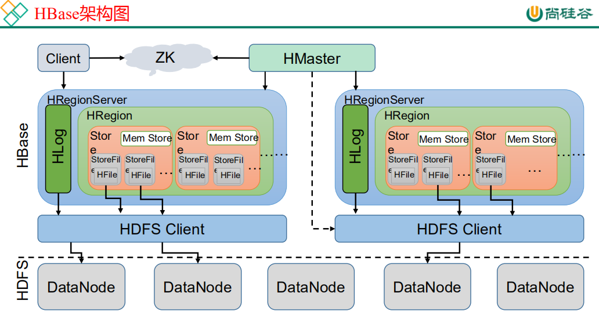

角色说明:

Client

HMaster

HRegionServer: 负责存储HBase实际数据的机器

HLog: wal(write-ahead-logs)预写日志. 由于读写操作不是直接存进磁盘, 并且直接存进 内存中也不安全,所以会先写到一个wal预写日志中然后再写入内存. 当系统挂掉 可以从日志中恢复数据

HRegion: 如果HRegionServer中只有一个HRegion,那么可以把它看成一个mysql中的 表. 但是当数据量大时会按照rowkey切分成多个HRegion

Store: 一个Store对应hbase表的一个列族

Mem Store: 内存存储, 用来保存当前的数据操作，所以当数据保存在WAL中之后， RegsionServer会在内存中存储键值对

StoreFile: 到一定时间或一定数据量内存存储不下时会溢写到磁盘文件, 而Hfile就是实际存储在hdfs的文件格式

## 4.1 HBase在实际开发中的经常用法

1, hbase集成mapreduce. 比如使用MapReduce 将数据从本地文件系统导入到 HBase 的表中，比如我们从 HBase 中读取一些原始数据后使用 MapReduce 做数据分析

2, hbase集成hive. 因为hive与hbase的数据最终都是存储在hdfs上面的. 为了节约存储空间, 我们可以直接将数据存入hbase，然后通过hive整合hbase直接使用sql语句分析hbase里面的数据,最关键的步骤就是建立hive表和hbase表之间的映射

3, hbase集成sqoop. 比如mysql和hbase的数据的导入导出

## 4.1 HBase的特点是什么？

1）大：一个表可以有数十亿行，上百万列；

2）无模式：每行都有一个可排序的主键和任意多的列，列可以根据需要动态的增加，同一张表中不同的行可以有截然不同的列；

3）面向列：面向列（族）的存储和权限控制，列（族）独立检索；

4）稀疏：空（null）列并不占用存储空间，表可以设计的非常稀疏；

5）数据多版本：每个单元中的数据可以有多个版本，默认情况下版本号自动分配，是单元格插入时的时间戳；

6）数据类型单一：Hbase中的数据都是字符串，没有类型。

## 4.3 HBase适用于怎样的情景？--了解

① 半结构化或非结构化数据

对于数据结构字段不够确定或杂乱无章很难按一个概念去进行抽取的数据适合用HBase。以上面的例子为例，当业务发展需要存储author的email，phone，address信息时RDBMS需要停机维护，而HBase支持动态增加。

② 记录非常稀疏

RDBMS的行有多少列是固定的，为null的列浪费了存储空间。而如上文提到的，HBase为null的Column不会被存储，这样既节省了空间又提高了读性能。

③ 多版本数据

如上文提到的根据Row key和Column key定位到的Value可以有任意数量的版本值，因此对于需要存储变动历史记录的数据，用HBase就非常方便了。比如上例中的author的Address是会变动的，业务上一般只需要最新的值，但有时可能需要查询到历史值。

④ 超大数据量

当数据量越来越大，RDBMS数据库撑不住了，就出现了读写分离策略，通过一个Master专门负责写操作，多个Slave负责读操作，服务器成本倍增。随着压力增加，Master撑不住了，这时就要分库了，把关联不大的数据分开部署，一些join查询不能用了，需要借助中间层。随着数据量的进一步增加，一个表的记录越来越大，查询就变得很慢，于是又得搞分表，比如按ID取模分成多个表以减少单个表的记录数。经历过这些事的人都知道过程是多么的折腾。采用HBase就简单了，只需要加机器即可，HBase会自动水平切分扩展，跟Hadoop的无缝集成保障了其数据可靠性（HDFS）和海量数据分析的高性能（MapReduce）。

## 4.4 描述HBase的rowKey的设计原则？（☆☆☆☆☆面试真题）

① Rowkey长度原则

Rowkey 是最大长度是64k，但在实际开发中是10~100 个字节，不过建议是越短越好， 不要超过16 个字节。

原因如下：

（1）(占磁盘)数据的持久化文件HFile 中是按照KeyValue 存储的，如果Rowkey 过长 比如100 个字节，1000 万列数据光Rowkey 就要占用100*1000 万=10 亿个字节，将 近1G 数据，这会极大影响HFile 的存储效率；

（2）(占内存) MemStore 将缓存部分数据到内存，如果Rowkey 字段过长内存的有效利 用率会降低，系统将无法缓存更多的数据，这会降低检索效率。因此Rowkey 的字节长 度越短越好。

② Rowkey散列原则

如果Rowkey 是按时间戳的方式递增，不要将时间放在二进制码的前面，建议将Rowkey 的高位作为散列字段，由程序循环生成，低位放时间字段，这样将提高数据均衡分布在 每个Regionserver 实现负载均衡的几率。如果没有散列字段，首字段直接是时间信息 将产生所有新数据都在一个 RegionServer 上堆积的热点现象，这样在做数据检索的时 候负载将会集中在个别RegionServer，降低查询效率。

具体如何避免热点呢？

1.  加盐（在rowkey前增加随机字符）

2.  哈希（rowkey做hash处理，类似加盐）

3.  反转（某些以固定字符串开头的如手机号开头部分135,158等等会进入一个region， 反转后手机号后面部分在开头，这样就避免了热点）

③ Rowkey唯一原则

必须在设计上保证其唯一性。

## 4.5 描述HBase中scan和get的功能以及实现的异同？--了解

HBase的查询实现只提供两种方式：

1）按指定RowKey 获取唯一一条记录，get方法（org.apache.hadoop.hbase.client.Get）

Get 的方法处理分两种 : 设置了ClosestRowBefore 和没有设置ClosestRowBefore的rowlock。主要是用来保证行的事务性，即每个get 是以一个row 来标记的。一个row中可以有很多family 和column。

2）按指定的条件获取一批记录，scan方法(org.apache.Hadoop.hbase.client.Scan）实现条件查询功能使用的就是scan 方式。

（1）scan 可以通过setCaching 与setBatch 方法提高速度(以空间换时间)；

（2）scan 可以通过setStartRow 与setEndRow 来限定范围([start，end)start 是闭区间，end 是开区间)。范围越小，性能越高。

（3）scan 可以通过setFilter 方法添加过滤器，这也是分页、多条件查询的基础。

## 4.6 请描述HBase中scan对象的setCache和setBatch方法的使用？--了解

setCache用于设置缓存，即设置一次RPC请求可以获取多行数据。对于缓存操作，如果行的数据量非常大，多行数据有可能超过客户端进程的内存容量，由此引入批量处理这一解决方案。

setBatch 用于设置批量处理，批量可以让用户选择每一次ResultScanner实例的next操作要取回多少列，例如，在扫描中设置setBatch(5)，则一次next()返回的Result实例会包括5列。如果一行包括的列数超过了批量中设置的值，则可以将这一行分片，每次next操作返回一片，当一行的列数不能被批量中设置的值整除时，最后一次返回的Result实例会包含比较少的列，如，一行17列，batch设置为5，则一共返回4个Result实例，这4个实例中包括的列数分别为5、5、5、2。

  组合使用扫描器缓存和批量大小，可以让用户方便地控制扫描一个范围内的行键所需要的RPC调用次数。Cache设置了服务器一次返回的行数，而Batch设置了服务器一次返回的列数。

假如我们建立了一张有两个列族的表，添加了10行数据，每个行的每个列族下有10列，这意味着整个表一共有200列（或单元格，因为每个列只有一个版本），其中每行有20列。

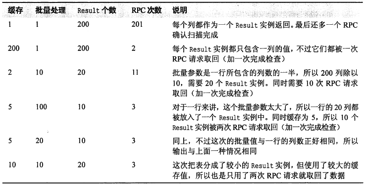

① Batch参数决定了一行数据分为几个Result，它只针对一行数据，Batch再大，也只能将一行的数据放入一个Result中。所以当一行数据有10列，而Batch为100时，也只能将一行的所有列都放入一个Result，不会混合其他行；

② 缓存值决定一次RPC返回几个Result，根据Batch划分的Result个数除以缓存个数可以得到RPC消息个数（之前定义缓存值决定一次返回的行数，这是不准确的，准确来说是决定一次RPC返回的Result个数，由于在引入Batch之前，一行封装为一个Result，因此定义缓存值决定一次返回的行数，但引入Batch后，更准确的说法是缓存值决定了一次RPC返回的Result个数）；

RPC请求次数 = （行数 * 每行列数） / Min（每行的列数，批量大小） / 扫描器缓存

下图展示了缓存和批量两个参数如何联动，下图中有一个包含9行数据的表，每行都包含一些列。使用了一个缓存为6、批量大小为3的扫描器，需要三次RPC请求来传送数据：

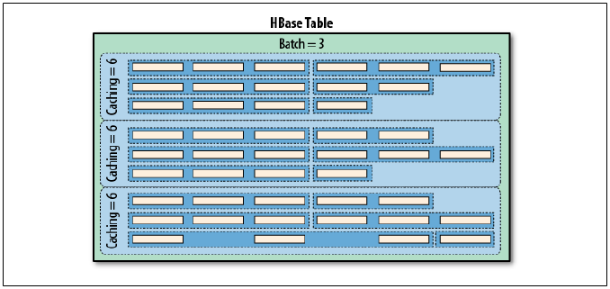

## 4.7 请详细描述HBase中一个cell的结构？--要知道

HBase中通过row和columns确定的为一个存贮单元称为cell。

Cell：由{row key, column(=<family> + <label>), version}唯一确定的单元。cell 中的数据是没有类型的，全部是字节码形式存贮。

## 4.9 简述HBase中compact用途是什么，什么时候触发，分为哪两种，有什么区别，有哪些相关配置参数？（☆☆合并操作的细节知识）

在hbase中每当有memstore数据flush到磁盘之后，就形成一个storefile，当storeFile的数量达到一定程度后，就需要将 storefile 文件来进行 compaction 操作。

Compact 的作用：

① 合并文件

② 清除过期，多余版本的数据

③ 提高读写数据的效率

HBase 中实现了两种 compaction 的方式：minor 和major. 这两种 compaction 方式的区别是：

1、Minor 操作只用来做部分文件的合并操作以及包括 minVersion=0 并且设置 ttl 的过期版本清理，不做任何删除数据、多版本数据的清理工作。

2、Major 操作是对 Region 下的HStore下的所有StoreFile执行合并操作，最终的结果是整理合并出一个文件。

## 4.10 每天百亿数据存入HBase，如何保证数据的存储正确和在规定的时间里全部录入完毕，不残留数据？（☆☆☆☆）---主要看思路

需求分析：

1）百亿数据：证明数据量非常大；

2）存入HBase：证明是跟HBase的写入数据有关；

> 3）保证数据的正确：要设计正确的数据结构保证正确性；
>
> 4）在规定时间内完成：对存入速度是有要求的。

解决思路：

1）数据量百亿条，什么概念呢？假设一整天60x60x24 = 86400秒都在写入数据，那么每秒的写入条数高达100万条，HBase当然是支持不了每秒百万条数据的，所以这百亿条数据可能不是通过实时地写入，而是批量地导入。批量导入推荐使用BulkLoad方式（推荐阅读：Spark之读写HBase），性能是普通写入方式几倍以上；

> 2）存入HBase：普通写入是用JavaAPI put来实现，批量导入推荐使用BulkLoad；
>
> 3）保证数据的正确：这里需要考虑RowKey的设计、预建分区和列族设计等问题；
>
> 4）在规定时间内完成也就是存入速度不能过慢，并且当然是越快越好，使用BulkLoad。

## 4.11 HBase如何给web前端提供接口来访问？--不懂

使用JavaAPI来编写WEB应用，使用HBase提供的RESTFul接口。

## 4.12 请列举几个HBase优化方法？（☆☆☆☆☆）

总结：

1.  预分区操作

2.  良好的rowkey设计----可以讲rowkey设计原则，以及具体怎么设计

3.  几个自动操作改为手动操作，比如flush，compact，split

4.  关闭wal预写日志，即不写hlog

5.  开启blockcache

6.  根据实际情况设置flush、compact、memstore的阈值

预key手，设阈值；

关wal，开blockcache；

1）减少调整---包括region拆分参数的调整， hfile合并参数的调整

减少调整这个如何理解呢？HBase中有几个内容会动态调整，如region（分区）、HFile，所以通过一些方法来减少这些会带来I/O开销的调整。

-   Region

如果没有预建分区的话，那么随着region中条数的增加，region会进行分裂，这将增加I/O开销，所以解决方法就是根据你的RowKey设计来进行预建分区，减少region的动态分裂。

-   HFile

HFile是数据底层存储文件，在每个memstore进行刷新时会生成一个HFile，当HFile增加到一定程度时，会将属于一个region的HFile进行合并，这个步骤会带来开销但不可避免，但是合并后HFile大小如果大于设定的值，那么HFile会重新分裂。为了减少这样的无谓的I/O开销，建议估计项目数据量大小，给HFile设定一个合适的值。

2）减少启停

数据库事务机制就是为了更好地实现批量写入，较少数据库的开启关闭带来的开销，那么HBase中也存在频繁开启关闭带来的问题。

· 关闭Compaction，在闲时进行手动Compaction(压缩)。

因为HBase中存在Minor Compaction(较小压缩)和Major Compaction(较大压缩)，也就是对HFile进行合并，所谓合并就是I/O读写，大量的HFile进行肯定会带来I/O开销，甚至是I/O风暴，所以为了避免这种不受控制的意外发生，建议关闭自动Compaction，在闲时进行compaction。

-   批量数据写入时采用BulkLoad。

如果通过HBase-Shell或者JavaAPI的put来实现大量数据的写入，那么性能差是肯定并且还可能带来一些意想不到的问题，所以当需要写入大量离线数据时建议使用BulkLoad

3）减少数据量

虽然我们是在进行大数据开发，但是如果可以通过某些方式在保证数据准确性同时减少数据量，何乐而不为呢？

-   开启过滤，提高查询速度

开启BloomFilter，BloomFilter是列族级别的过滤，在生成一个StoreFile同时会生成一个MetaBlock，用于查询时过滤数据

· 使用压缩：一般推荐使用Snappy和LZO压缩

4）合理设计

在一张HBase表格中RowKey和ColumnFamily的设计是非常重要，好的设计能够提高性能和保证数据的准确性

-   RowKey设计：应该具备以下几个属性

散列性：散列性能够保证相同相似的rowkey聚合，相异的rowkey分散，有利于查询。

简短性：rowkey作为key的一部分存储在HFile中，如果为了可读性将rowKey设计得过长，那么将会增加存储压力。

唯一性：rowKey必须是唯一的。

业务性：举例来说：

假如我的查询条件比较多，而且不是针对列的条件，那么rowKey的设计就应该支持多条件查询。

如果我的查询要求是最近插入的数据优先，那么rowKey则可以采用叫上Long.Max-时间戳的方式，这样rowKey就是递减排列。

-   列族的设计

列族的设计需要看应用场景

多列族设计的优劣：

优势：HBase中数据时按列进行存储的，那么查询某一列族的某一列时就不需要全盘扫描，只需要扫描某一列族，减少了读I/O；其实多列族设计对减少的作用不是很明显，适用于读多写少的场景

劣势：降低了写的I/O性能。原因如下：数据写到store以后是先缓存在memstore中，同一个region中存在多个列族则存在多个store，每个store都一个memstore，当其实memstore进行flush时，属于同一个region的stor(储存)e中的memstore都会进行flush，增加I/O开销。

## 4.13 HBase中RowFilter和BloomFilter原理？--不懂就说不清楚

1）RowFilter原理简析

RowFilter顾名思义就是对rowkey进行过滤，那么rowkey的过滤无非就是相等（EQUAL）、大于(GREATER)、小于(LESS)，大于等于(GREATER_OR_EQUAL)，小于等于(LESS_OR_EQUAL)和不等于(NOT_EQUAL)几种过滤方式。Hbase中的RowFilter采用比较符结合比较器的方式来进行过滤。

比较器的类型如下：

BinaryComparator

BinaryPrefixComparator

NullComparator

BitComparator

RegexStringComparator

SubStringComparator

例子：

Filter rowFilter = new RowFilter(CompareFilter.CompareOp.EQUAL,

new BinaryComparator(Bytes.toBytes(rowKeyValue)));

Scan scan = new Scan();

scan.setFilter(rowFilter)

...

在上面例子中，比较符为EQUAL，比较器为BinaryComparator

2）BloomFilter原理简析

· 主要功能：提供随机读的性能

> · 存储开销：BloomFilter是列族级别的配置，一旦表格中开启BloomFilter，那么在生成StoreFile时同时会生成一份包含BloomFilter结构的文件MetaBlock，所以会增加一定的存储开销和内存开销

-   粒度控制：ROW和ROWCOL

-   BloomFilter的原理

简单说一下BloomFilter原理：

① 内部是一个bit数组，初始值均为0

② 插入元素时对元素进行hash并且映射到数组中的某一个index，将其置为1，再进行多次不同的hash算法，将映射到的index置为1，同一个index只需要置1次。

③ 查询时使用跟插入时相同的hash算法，如果在对应的index的值都为1，那么就可以认为该元素可能存在，注意，只是可能存在

④ 所以BlomFilter只能保证过滤掉不包含的元素，而不能保证误判包含

-   设置：在建表时对某一列设置BloomFilter即可

## 4.14 HBase的导入导出方式？---了解

1）导入：bin/hbase org.apache.hadoop.hbase.mapreduce.Driver import 表名 路径

路径：来源

本地路径 file:///path

HDFS hdfs://cluster1/path

2）导出：bin/hbase org.apache.hadoop.hbase.mapreduce.Driver export 表名 路径

路径：目的地

本地路径 file:///path

HDFS hdfs://cluster1/path

## 4.15 Region如何预建分区？（☆☆☆☆）

为什么要预分区？

hbase默认建表只有一个分区，所有操作都在这个分区里，可能造成数据热点问题。一个region大量数据放到里面，regionServer有可能出问题，所以进行预分区，数据同时插入多个region。 实质就是提前划分region

预分区的目的主要是在创建表的时候指定分区数，提前规划表有多个分区，以及每个分区的区间范围，这样在存储的时候rowkey按照分区的区间存储，可以避免region热点问题。

通常有两种方案：

方案1:shell 方法主要有三种方式

> 方式1： 手动指定预分区
>
> create 'tb_splits', {NAME => 'cf',VERSIONS=> 3},{SPLITS => ['10','20','30']}
>
> 以上表示分为4个区，分别是：空白-10,10-20,20-30,30-空白
>
> 方式2： 使用16进制算法预分区
>
> create 'tb_splits','info','partition1', {NUMREGIONS=>10, SPLITALGO=>'HexStringSplit'}
>
> 以上表示分为10个区，用的是16进制算法
>
> 方式3： 将分区规则写在文件中
>
> create 'tb_splits','info','partition1', SPLITS_FILE=>'/export/files/xxx.file'

方案2: JAVA程序控制

-   取样，先随机生成一定数量的rowkey,将取样数据按升序排序放到一个集合里；

-   根据预分区的region个数，对整个集合平均分割，即是相关的splitKeys；

· HBaseAdmin.createTable(HTableDescriptor tableDescriptor,byte[][]splitkeys)可以指定预分区的splitKey，即是指定region间的rowkey临界值。

## 4.16 HRegionServer宕机如何处理？（☆☆☆☆☆）

1）ZooKeeper会监控HRegionServer的上下线情况，当ZK发现某个HRegionServer宕机之后会通知HMaster进行失效备援；

2）该HRegionServer会停止对外提供服务，就是它所负责的region暂时停止对外提供服务；

3）HMaster会将该HRegionServer所负责的region转移到其他HRegionServer上，并且会对HRegionServer上存在memstore中还未持久化到磁盘中的数据进行恢复；

4.  这个恢复的工作是由WAL重播来完成，这个过程如下：

· wal实际上就是一个文件，存在/hbase/WAL/对应RegionServer路径下。

-   宕机发生时，读取该RegionServer所对应的路径下的wal文件，然后根据不同的region切分成不同的临时文件recover.edits。

· 当region被分配到新的RegionServer中，RegionServer读取region时会进行是否存在recover.edits，如果有则进行恢复。

## 4.17 HBase读写流程？（☆☆☆☆☆）

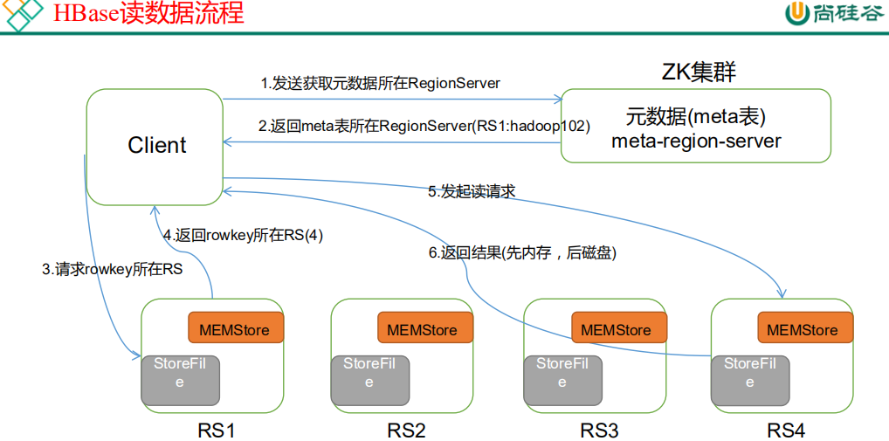

读：

① HRegionServer保存着meta表以及表数据，要访问表数据，首先Client先去访问zookeeper，从zookeeper里面获取meta表所在的位置信息，即找到这个meta表在哪个HRegionServer上保存着。

② 接着Client通过刚才获取到的HRegionServer的IP来访问Meta表所在的HRegionServer，从而读取到Meta，进而获取到Meta表中存放的元数据。

③ 找到对应的region, 先从Mem Store找数据,如果没有就从BlockCache里读,

如果BlockCache里面还没有,再到StoreFile里读(不直接读取storefile 是为了效率)

④ 最后HRegionServer把查询到的数据响应给Client。 注意如果是从StoreFile里读取的数据不直接返回给Client,而是先写入BlockChche再返回给Client

写：

① Client先访问zookeeper，找到Meta表所在的HRegionServer，并获取Meta表元数据。

② 确定当前将要写入的数据所对应的HRegion和HRegionServer服务器。

③ Client向该HRegionServer服务器发起写入数据请求，然后HRegionServer收到请求并响应。

④ Client先把数据写入到HLog，以防止数据丢失,HLog不会丢失是因为它会同步到hdfs。

⑤ 然后将数据写入到Memstore。

⑥ 如果HLog和Memstore均写入成功，则这条数据写入成功

⑦ 如果Memstore达到阈值(有三个条件可以触发flush: 1,当前节点所有的HRegion的MemStore之和占了当前节点堆内存的40%. 2，或者单个HRegion里所有的MemStore之和达到128M. 3,或者任意MemStore存储数据时间达到1小时)，会把Memstore中的数据flush到Storefile中。 同时删除Mem Store中的数据和HLog中的历史数据 (数据Flush过程)

⑧ 当Storefile数量越来越多，会触发Compact合并操作，把过多的Storefile合并成一个大的Storefile(合并的条件有两个: 1, 7天 2, StoreFile数量超过3个)。

⑨ 当Storefile越来越大，Region也会变大达到阈值后(10G???)，会触发Split拆分操作，将Region一分为二,并将拆分的Region交给不同的HRegionServer管理。(数据合并拆分过程)

## 4.18 HBase过滤器实现原则？（☆☆☆☆☆） ---不懂

2、Hbase过滤器实现原则

 所有的过滤器都在服务端生效，叫做谓语下推(predicate push down),这样可以保证被过滤掉的数据不会被传送到客户端。

注意：

  基于字符串的比较器，如RegexStringComparator和SubstringComparator，比基于字节的比较器更慢，更消耗资源。因为每次比较时它们都需要将给定的值转化为String.截取字符串子串和正则式的处理也需要花费额外的时间。

  过滤器本来的目的是为了筛掉无用的信息，所有基于CompareFilter的过滤处理过程是返回匹配的值。

filter ==> SQL 中的Where

## 4.19 HBase内部机制是什么？--回答思路： 是什么，数据存在哪里，表是分为哪些部分存储的？

Hbase是一个能适应联机业务的数据库系统

物理存储：hbase的持久化数据是将数据存储在HDFS上。

存储管理：一个表是划分为很多region的，这些region分布式地存放在很多regionserver上Region内部还可以划分为store，store内部有memstore和storefile。

版本管理：hbase中的数据更新本质上是不断追加新的版本，通过compact操作来做版本间的文件合并Region的split。

集群管理：ZooKeeper + HMaster + HRegionServer。

## 4.21 HBase有没有并发问题？（☆☆☆）--回答：没测试过

> 针对HBase在高并发情况下的性能，我们进行如下测试：

测试版本：hbase 0.94.1、 hadoop 1.0.2、 jdk-6u32-linux-x64.bin、snappy-1.0.5.tar.gz

测试hbase搭建：14台存储机器+2台master、DataNode和regionserver放在一起。

测试一：高并发读(4w+/s) + 少量写(允许分拆、负载均衡)

症状：1-2天后，hbase挂掉(系统性能极差，不到正常的10%)。其实并非全部挂掉，而是某些regionserver挂了，并在几个小时内引发其他regionserver挂掉。系统无法恢复：单独启regionserver无法恢复正常。重启后正常。

测试二：高并发读(4w+/s)

症状：1-2天后，hbase挂掉(系统性能极差，不到正常的10%)。后发现是由于zookeeper.session.timeout设置不正确导致(参见regionserver部分：http://hbase.apache.org/book.html#trouble)。重启后正常。

测试三：高并发读(4w+/s)

症状：1-2天后，hbase挂掉(系统性能极差，不到正常的10%)。从log未看出问题，但regionserver宕机，且datanode也宕机。重启后正常。

测试四：高并发读(4w+/s)+禁止分拆、禁止majorcompaction、禁止负载均衡(balance_switch命令)

症状：1-2天后，hbase挂掉(系统性能极差，不到正常的10%)。从log未看出问题，但regionserver宕机，且datanode也宕机。重启后正常。

测试期间，还发现过：无法获取".MATE."表的内容(想知道regionserver的分布情况)、hbase无法正确停止、hbase无法正确启动(日志恢复失败，文件错误，最终手动删除日志重启)。

## 4.22 你们的HBase大概在公司业务中（主要是网上商城）大概都几个表？几个表簇？都存什么样的数据？

## 4.24 HBase在进行模型设计时重点在什么地方？一张表中定义多少个Column Family最合适？为什么？

Column Family的个数具体看表的数据，一般来说划分标准是根据数据访问频度，如一张表里有些列访问相对频繁，而另一些列访问很少，这时可以把这张表划分成两个列族，分开存储，提高访问效率。

## 4.25 如何提高HBase客户端的读写性能？请举例说明（☆☆☆☆☆） ----不懂

1.  开启bloomfilter过滤器，开启bloomfilter比没开启要快3、4倍

2.  Hbase对于内存有特别的需求，在硬件允许的情况下配足够多的内存给它

3.  通过修改hbase-env.sh中的

> export HBASE_HEAPSIZE=3000 #这里默认为1000m

4.  增大RPC数量

> 通过修改hbase-site.xml中的hbase.regionserver.handler.count属性，可以适当的放大RPC数量，默认值为10有点小。

## 4.27 直接将时间戳作为行健，在写入单个region 时候会发生热点问题，为什么呢？（☆☆☆☆☆）

region中的rowkey是有序存储，若时间比较集中。就会存储到一个region中，这样一个region的数据变多，其它的region数据很少，加载数据就会很慢，直到region分裂，此问题才会得到缓解。

## 4.28 请描述如何解决HBase中region太小和region太大带来的冲突？（☆☆☆☆☆）

Region太小会发生多次compaction，将数据读一遍并重写一遍到hdfs 上，占用io，region过大会造成多次split，region 会下线，影响访问服务，最佳的解决方法是调整hbase.hregion. max.filesize 为256m。

## 4.29 解释一下布隆过滤器原理（☆☆☆☆☆）--不懂，了解红色字体就行

在日常生活中，包括在设计计算机软件时，我们经常要判断一个元素是否在一个集合中。比如在字处理软件中，需要检查一个英语单词是否拼写正确（也就是要判断它是否在已知的字典中）；在 FBI，一个嫌疑人的名字是否已经在嫌疑名单上；在网络爬虫里，一个网址是否被访问过等等。最直接的方法就是将集合中全部的元素存在计算机中，遇到一个新元素时，将它和集合中的元素直接比较即可。一般来讲，计算机中的集合是用哈希表（hash table）来存储的。它的好处是快速准确，缺点是费存储空间。当集合比较小时，这个问题不显著，但是当集合巨大时，哈希表存储效率低的问题就显现出来了。比如说，一个象 Yahoo,Hotmail 和 Gmai 那样的公众电子邮件（email）提供商，总是需要过滤来自发送垃圾邮件的人（spamer）的垃圾邮件。一个办法就是记录下那些发垃圾邮件的 email 地址。由于那些发送者不停地在注册新的地址，全世界少说也有几十亿个发垃圾邮件的地址，将他们都存起来则需要大量的网络服务器。如果用哈希表，每存储一亿个 email 地址， 就需要 1.6GB 的内存（用哈希表实现的具体办法是将每一个 email 地址对应成一个八字节的信息指纹googlechinablog.com/2006/08/blog-post.html，然后将这些信息指纹存入哈希表，由于哈希表的存储效率一般只有 50%，因此一个 email 地址需要占用十六个字节。一亿个地址大约要 1.6GB， 即十六亿字节的内存）。因此存贮几十亿个邮件地址可能需要上百 GB 的内存。除非是超级计算机，一般服务器是无法存储的。

布隆过滤器只需要哈希表 1/8 到 1/4 的大小就能解决同样的问题。

Bloom Filter是一种空间效率很高的随机数据结构，它利用位数组很简洁地表示一个集合，并能判断一个元素是否属于这个集合。Bloom Filter的这种高效是有一定代价的：在判断一个元素是否属于某个集合时，有可能会把不属于这个集合的元素误认为属于这个集合（false positive）。因此，Bloom Filter不适合那些"零错误"的应用场合。而在能容忍低错误率的应用场合下，Bloom Filter通过极少的错误换取了存储空间的极大节省。

下面我们具体来看Bloom Filter是如何用位数组表示集合的。初始状态时，Bloom Filter是一个包含m位的位数组，每一位都置为0。

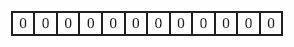

为了表达S={x1, x2,...,xn}这样一个n个元素的集合，Bloom Filter使用k个相互独立的哈希函数（Hash Function），它们分别将集合中的每个元素映射到{1,...,m}的范围中。对任意一个元素x，第i个哈希函数映射的位置hi(x)就会被置为1（1≤i≤k）。注意，如果一个位置多次被置为1，那么只有第一次会起作用，后面几次将没有任何效果。在下图中，k=3，且有两个哈希函数选中同一个位置（从左边数第五位）。

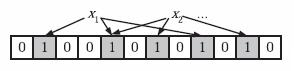

在判断y是否属于这个集合时，我们对y应用k次哈希函数，如果所有h~i~(y)的位置都是1（1≤i≤k），那么我们就认为y是集合中的元素，否则就认为y不是集合中的元素。下图中y~1~就不是集合中的元素。y~2~或者属于这个集合，或者刚好是一个false positive。

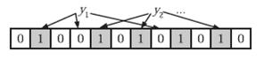

· 为了add一个元素，用k个hash function将它hash得到bloom filter中k个bit位，将这k个bit位置1。

· 为了query一个元素，即判断它是否在集合中，用k个hash function将它hash得到k个bit位。若这k bits全为1，则此元素在集合中；若其中任一位不为1，则此元素比不在集合中（因为如果在，则在add时已经把对应的k个bits位置为1）。

· 不允许remove元素，因为那样的话会把相应的k个bits位置为0，而其中很有可能有其他元素对应的位。因此remove会引入false negative，这是绝对不被允许的。

布隆过滤器决不会漏掉任何一个在黑名单中的可疑地址。但是，它有一条不足之处，也就是它有极小的可能将一个不在黑名单中的电子邮件地址判定为在黑名单中，因为有可能某个好的邮件地址正巧对应个八个都被设置成一的二进制位。好在这种可能性很小，我们把它称为误识概率。

布隆过滤器的好处在于快速，省空间，但是有一定的误识别率，常见的补救办法是在建立一个小的白名单，存储那些可能别误判的邮件地址。

布隆过滤器具体算法高级内容，如错误率估计，最优哈希函数个数计算，位数组大小计算，请参见[http://blog.csdn.net/jiaomeng/article/details/1495500](http://blog.csdn.net/jiaomeng/article/details/1495500)。

# 五 Flume（☆☆☆☆）

## 5.1 flume的内部原理: 

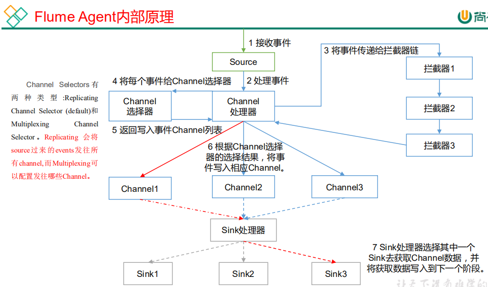

## 5.3 Flume与Kafka的采集日志，两者怎么选取？

采集层主要可以使用Flume、Kafka两种技术。

Flume：Flume 是管道流方式，提供了很多的默认实现，让用户通过参数部署，及扩展API。

Kafka：Kafka是一个可持久化的分布式的消息队列。

Kafka 是一个非常通用的系统。你可以有许多生产者和很多的消费者共享多个主题Topics。相比之下，Flume是一个专用工具被设计为旨在往HDFS，HBase发送数据。它对HDFS有特殊的优化，并且集成了Hadoop的安全特性。所以，Cloudera 建议如果数据被多个系统消费的话，使用kafka；如果数据被设计给Hadoop使用，使用Flume。

正如你们所知Flume内置很多的source和sink组件。然而，Kafka明显有一个更小的生产消费者生态系统，并且Kafka的社区支持不好。希望将来这种情况会得到改善，但是目前：使用Kafka意味着你准备好了编写你自己的生产者和消费者代码。如果已经存在的Flume Sources和Sinks满足你的需求，并且你更喜欢不需要任何开发的系统，请使用Flume。

Flume可以使用拦截器实时处理数据。这些对数据屏蔽或者过量是很有用的。Kafka需要外部的流处理系统才能做到。

Kafka和Flume都是可靠的系统,通过适当的配置能保证零数据丢失。然而，Flume不支持副本事件。于是，如果Flume代理的一个节点奔溃了，即使使用了可靠的文件管道方式，你也将丢失这些事件直到你恢复这些磁盘。如果你需要一个高可靠行的管道，那么使用Kafka是个更好的选择。

Flume和Kafka可以很好地结合起来使用。如果你的设计需要从Kafka到Hadoop的流数据，使用Flume代理并配置Kafka的Source读取数据也是可行的：你没有必要实现自己的消费者。你可以直接利用Flume与HDFS及HBase的结合的所有好处。你可以使用Cloudera Manager对消费者的监控，并且你甚至可以添加拦截器进行一些流处理。

## 5.4 数据怎么采集到Kafka，实现方式

使用官方提供的flumeKafka插件，插件的实现方式是自定义了flume的sink，将数据从channle中取出，通过kafka的producer写入到kafka中，可以自定义分区等。

可以回答使用下沉组件是------ KafkaSink

## 5.5 flume使用内存管道，flume宕机了数据丢失怎么解决 --要知道

1）Flume的channel分为很多种，可以将数据写入到文件----File Channel。

2）搭建高可用的flume集群

## 5.6 flume配置方式，flume集群（问的很详细）

Flume的配置围绕着source、channel、sink叙述，flume的集群是做在agent上的，而非机器上。

## 5.7 flume不采集Nginx日志，通过Logger4j采集日志，优缺点是什么？---不懂

优点：Nginx的日志格式是固定的，但是缺少sessionid，通过logger4j采集的日志是带有sessionid的，而session可以通过redis共享，保证了集群日志中的同一session落到不同的tomcat时，sessionId还是一样的，而且logger4j的方式比较稳定，不会宕机。

缺点：不够灵活，logger4j的方式和项目结合过于紧密，而flume的方式比较灵活，拔插式比较好，不会影响项目性能。

## 5.8 flume和kafka采集日志区别，采集日志时中间停了，怎么记录之前的日志。（笔试题出现过☆☆☆☆☆）

Flume采集日志是通过流的方式直接将日志收集到存储层，而kafka是将日志缓存在kafka集群，待后期可以采集到存储层。

Flume采集中间停了，可以采用文件的方式记录之前的日志，而kafka是采用offset的方式记录之前的日志。

## 5.9 flume有哪些组件，flume的source、channel、sink具体是做什么的

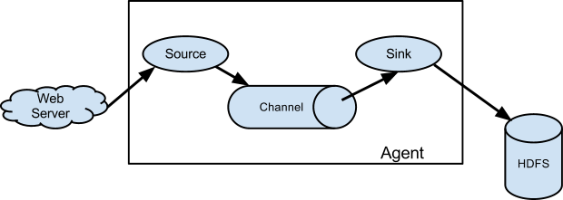

1）source：用于采集数据，Source是产生数据流的地方，同时Source会将产生的数据流传输到Channel，这个有点类似于Java IO部分的Channel。

2）channel：用于桥接Sources和Sinks，类似于一个队列。

3）sink：从Channel收集数据，将数据写到目标源(可以是下一个Source，也可以是HDFS或者HBase)。

更详细的可以参考下图:

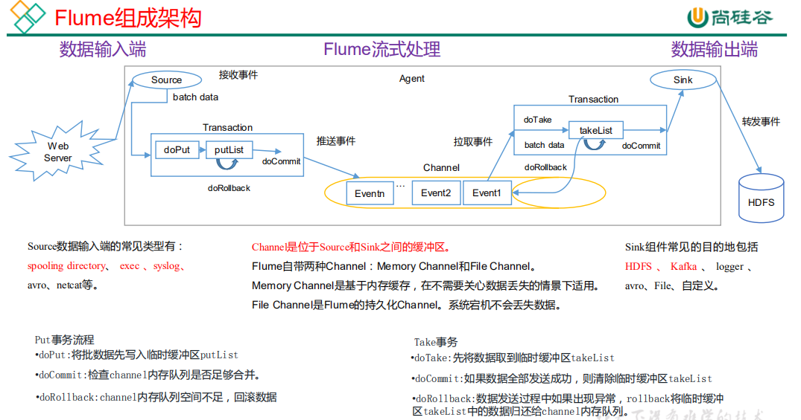

## 5.10 你是如何实现flume数据传输的监控的 --了解

使用第三方框架 Ganglia 实时监控 Flume

## 5.12 Flume的Channel selector --了解

channel选择器主要分为两种， 区别是:Replicating 会 将source过来的events发往所有channel,而Multiplexing可以选择该发往哪些Channel。

## 5.13 Flume 的事务机制 --了解

Flume 的事务机制（类似数据库的事务机制）：Flume 使用两个独立的事务分别负责从Soucrce 到 Channel，以及从 Channel 到 Sink 的事件传递。比如 spooling directory source 为文件的每一行创建一个事件，一旦事务中所有的事件全部传递到 Channel 且提交成功，那么Soucrce 就将该文件标记为完成。同理，事务以类似的方式处理从 Channel 到 Sink 的传递过程，如果因为某种原因使得事件无法记录，那么事务将会回滚。且所有的事件都会保持到Channel 中，等待重新传递。

比如File Channel就有这样的事务机制， 所以File Channel一般不会丢失数据。 但是Mem Channel就可能丢失数据，agent宕机时数据在内存中会丢失、内存中数据满了时source进不来数据导致未写入的数据丢失

## Flume可能遇到的问题：

### 5.2 Flume丢包问题（数据丢失率问题☆☆☆☆☆）

当Flume的数据量达到100+M/s时就开始大量丢包，但是根据Flume的架构原理，采用FileChannel的Flume是不可能丢失数据的，因为其内部有完善的事务机制（ACID）

Source到Channel是事务性的，

Channel到Sink也是事务性的，

这两个环节都不可能丢失数据，唯一可能丢失数据的是Channel采用MemoryChannel，

1.  在agent宕机时候导致数据在内存中丢失

2.  Channel存储数据已满，导致Source不再写入数据，造成未写入的数据丢失；

一些公司在Flume工作过程中，会对业务日志进行监控，例如Flume agent中有多少条日志，Flume到Kafka后有多少条日志等等，如果数据丢失保持在1%左右是没有问题的，当数据丢失达到5%左右时就必须采取相应措施。

面试怎么回答： 可以说没有出现数据丢失的情况

### 5.2 Flume采集数据时在hdfs上产生大量小文件问题

解决： 设置几个滚动控制参数的值为0或者比较大的数值

删除：

a1.sinks.k1.hdfs.round=true

新增：

a1.sinks.k1.hdfs.rollInterval=0

a1.sinks.k1.hdfs.rollSize=0

a1.sinks.k1.hdfs.rollCount=0

说明：如果不设置为0，设置成一个比较大的数值也行。 rollSize默认值1024，当临时文件大小达到该值时滚动成目标文件，设置为0表示不根据临时文件大小来滚动文件。 rollCount表示当events数据达到该值时将临时文件滚动目标文件。

### 5.3 Flume采集数据时发现滚动控制参数失效的问题

flume在采集数据到hdfs中一台datanode的一个副本中时，如果hdfs默认副本数是3，那么还需要通过pipeline管道将该副本发送给其他datanode，只有当所有副本都复制完毕才真正算采集成功。

但是在副本复制时flume的滚动控制参数会失效。

解决： 设置hdfs.minBlockReplicas=1， 让flume感知不到块的复制

# 五 Azkaban(☆)

1,是什么----工作调度器

2,为什么需要工作调度器---- 实际开发中有多个任务,它们之间存在执行先后顺序问题或者 依赖关系

3, 工作调度有哪些实现方式----

a,简单的调度可以使用linux的crontab ---分，时，日，月，星期

b,复杂的任务调度可以使用一些工具, 如azkaban(轻量级),oozie(重量级)

4, azkaban的两种服务模式

a,单服务模式--solo server模式

b,两个服务模式--exec server和web server模式

5,azkaban实战

a, 单job示例 关键词: .job文件,

b, 多job流示例 关键词: dependencies

6,azkaban定时任务

# 五 Sqoop(☆)

1,是什么

sqoop是apache旗下一款"Hadoop和关系数据库服务器之间传送数据"的工具。

导入数据：MySQL，Oracle导入数据到Hadoop的HDFS、HIVE、HBASE等数据存储系统；

mysql 到 hdfs：

> bin/sqoop import --connect jdbc:mysql://xxx --username root --password 123456 --target-dir /xxx --table emp --m 1
>
> 可以使用hadoop命令查看导入的数据，可以看出是用逗号进行分割的

mysql 到 hive：

> bin/sqoop import --connect jdbc:mysql://xxx --username root --password 123456 --hive-table /xxx --table emp

面试真题： 你导入mysql表的数据到hdfs是全量导入还是增量导入？如果是增量导入那么你是怎么判断增量数据的？

答：增量导入

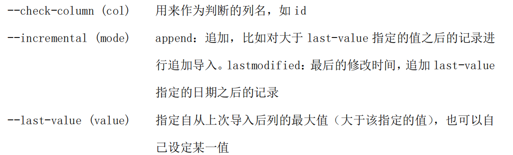

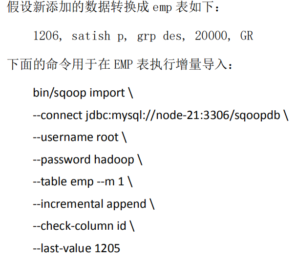

导出数据：从Hadoop的文件系统中导出数据到关系数据库mysql等

hdfs 到 mysql：

> bin/sqoop export --connect jdbc:mysql://xxx --username root --password 123456 --export-dir /xxx --table emp --input-fileds-terminated-by 't';

2,工作机制 ---将导入或导出命令翻译成mapreduce程序来实现，因为没有数据的改变，所以只有maptask。在翻译出的mapreduce中主要是对inputformat和outputformat进行定制

# 六 Kafka（☆☆☆☆）

## 6.1 Kafka的生产的数据的分区策略(生产的数据会落到哪个分区)（☆☆☆☆）

查看Partitioner接口的默认实现类DefaultPartitioner类可以看到分区规则:

第一种分区策略：给定了分区号，直接将数据发送到指定的分区里面去

第二种分区策略：没有给定分区号，给定数据的key值，通过key取上hashCode进行分区

第三种分区策略：既没有给定分区号，也没有给定key值，直接轮循进行分区

第四种分区策略：自定义分区

## 6.1 Kafka消费者分区分配策略（消费者会消费哪个分区的数据）（☆☆☆☆）

主要有两种，一种是默认的range范围策略，一种是roundrobin轮询策略

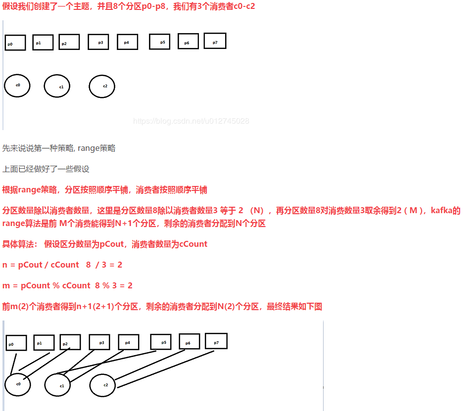


## 6.1 Kafka的架构（☆☆☆☆☆ 面试真题）

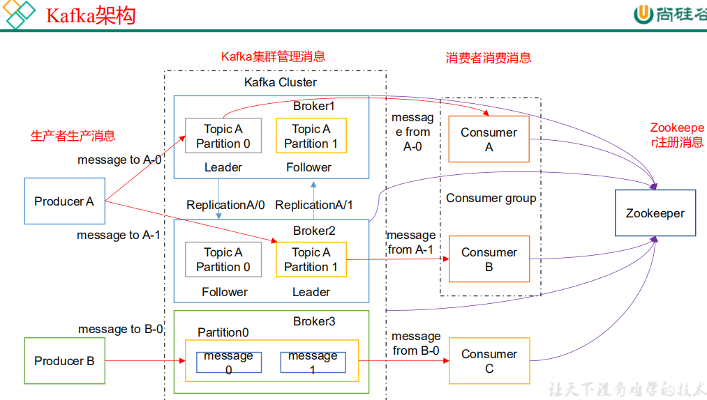

## 6.1 Kafka的作用？ --了解

解耦: 解除了生产者和消费者之间的直接关联；kafka下游的多个终端只需实现kafka 的接口规范

异步: 消息可以存放在kafka中, 不用立即处理, 等想要处理这些数据的时候再去消费

## 6.2 请说明什么是传统的消息传递方法？ --了解

传统的消息传递方法主要是发布-订阅模式：如activeMQ，在这个模型中，消息被广播给所有的用户。 只要生产者发布了消息, 消费者(用户)就会收到消息, 是一种被动的方式

另外说一下kafka的消息传递方式是push推送和pull拉取模式, 消费者(用户)需要主动去pull拉取消息

## 6.3 请说明Kafka相对于传统的消息传递方法有什么优势？-了解

高性能：单一的Kafka代理可以处理成千上万的客户端，每秒处理数兆字节的读写操作，Kafka性能远超过传统的ActiveMQ、RabbitMQ等，而且Kafka支持Batch操作；

可扩展：Kafka集群可以透明的扩展，增加新的服务器进集群；

容错性： Kafka每个Partition数据会复制到几台服务器，当某个Broker失效时，Zookeeper将通知生产者和消费者从而使用其他的Broker；

## 6.5 Kafka处理大消息的问题分析（☆☆☆☆☆）

message.max.bytes ---kafka服务器broker能接受生产者最大消息数据大小，默认是1M

replica.fetch.max.bytes ---消息在集群键复制的最大消息数据大小，默认1M

retch.message.max.bytes ---消费者可以消费的最大消息数据大小，默认1M

对于一些问题比如生产端的消息过大， 或者消费端的数据过大导致未能消费，我们都可以调大相应的参数。

kafka设计用于处理小量消息，对于处理10K左右的消息性能最好。 但有时候确实需要处理几十M的大消息，这时候可以将大消息切块， 或者使用Snappy压缩大消息，再配合设置上述的一些参数

## 6.7 解释Kafka的用户如何消费信息？

在Kafka中传递消息是通过使用sendfile API完成的。它支持将字节Socket转移到磁盘，通过内核空间保存副本，并在内核用户之间调用内核。

通过高阶api和低阶api进行消费,

高阶api不需要自行去管理 offset，系统通过 zookeeper 存储管理。

不需要管理分区，副本等情况，.系统自动管理

消费者断线会自动根据上一次记录在 zk中的 offset 去接着获取数据（默认设置

1 分钟更新一下 zookeeper 中存的 offset）

缺点是不能自行控制 offset

低阶api能够让开发者自己控制 offset，想从哪里读取就从哪里读取

## 6.10 解释如何减少ISR中的扰动？broker什么时候离开ISR？--了解

ISR是一组与leaders完全同步的消息副本，也就是说ISR中包含了所有提交的消息。ISR应该总是包含所有的副本，直到出现真正的故障。如果一个副本从leader中脱离出来，将会从ISR中删除。

## 6.11 Kafka为什么需要复制？ --了解

问题分析： 问的是消息进入集群后，在集群间的副本复制吗

Kafka的信息复制确保了任何已发布的消息不会丢失，并且可以在机器错误、程序错误或更常见些的软件升级中使用。

## 6.15 请说明Kafka 的消息投递保证（delivery guarantee）机制以及如何实现？（☆☆☆☆☆）

> Kafka支持三种消息投递语义：

① At most once 消息可能会丢，但绝不会重复传递

② At least one 消息绝不会丢，但可能会重复传递

③ Exactly once 每条消息肯定会被传输一次且仅传输一次，很多时候这是用户想要的

consumer在从broker读取消息后，可以选择commit，该操作会在Zookeeper中存下该consumer在该partition下读取的消息的offset，该consumer下一次再读该partition时会从下一条开始读取。如未commit，下一次读取的开始位置会跟上一次commit之后的开始位置相同。

可以将consumer设置为autocommit，即consumer一旦读到数据立即自动commit。如果只讨论这一读取消息的过程，那Kafka是确保了Exactly once。但实际上实际使用中consumer并非读取完数据就结束了，而是要进行进一步处理，而数据处理与commit的顺序在很大程度上决定了消息从broker和consumer的delivery guarantee semantic。

·读完消息先commit再处理消息。这种模式下，如果consumer在commit后还没来得及处理消息就crash了，下次重新开始工作后就无法读到刚刚已提交而未处理的消息，这就对应于At most once。

·读完消息先处理再commit消费状态(保存offset)。这种模式下，如果在处理完消息之后commit之前Consumer crash了，下次重新开始工作时还会处理刚刚未commit的消息，实际上该消息已经被处理过了，这就对应于At least once。

·如果一定要做到Exactly once，就需要协调offset和实际操作的输出。经典的做法是引入两阶段提交，但由于许多输出系统不支持两阶段提交，更为通用的方式是将offset和操作输入存在同一个地方。比如，consumer拿到数据后可能把数据放到HDFS，如果把最新的offset和数据本身一起写到HDFS，那就可以保证数据的输出和offset的更新要么都完成，要么都不完成，间接实现Exactly once。（目前就high level API而言，offset是存于Zookeeper中的，无法存于HDFS，而low level API的offset是由自己去维护的，可以将之存于HDFS中）。

总之，Kafka默认保证At least once，并且允许通过设置producer异步提交来实现At most once，而Exactly once要求与目标存储系统协作，Kafka提供的offset可以较为容易地实现这种方式。

## 6.16 如何保证Kafka的消息有序（☆☆☆☆ 面试真题）

Kafka对于消息的重复、丢失、错误以及顺序没有严格的要求。

Kafka只能保证一个partition中的消息被某个consumer消费时是顺序的，事实上，从Topic角度来说，当有多个partition时，消息仍然不是全局有序的。

## 6.17 kafka数据丢失问题,及如何保证数据不丢失（☆☆☆☆☆）

ack确认机制介绍：

acks=1的时候(只保证写入leader成功)，如果刚好leader挂了。数据会丢失。

acks=0的时候，使用异步模式的时候，该模式下kafka无法保证消息，有可能会丢。

acks=all的时候可以保证leader和follower都成功

1）生产者如何保证数据不丢失: ----ack机制

设置acks=all : 意思是所有follower都写入成功并向leader发送ack确认,leader收到ISR中的ack确认后会向producer发送ack确认。

retries = 一个合理值。

min.insync.replicas=2 消息至少要被写入到这么多副本才算成功。

unclean.leader.election.enable=false 关闭unclean leader选举，即不允许非ISR中的副本被选举为leader，以避免数据丢失。

2）Consumer如何保证不丢失 ---手动提交offset

enable.auto.commit=false 关闭自动提交offset, 处理完数据之后手动提交。 一旦出现问题可以通过offset恢复

3）brocker如何保证不丢失 ---副本机制

## 6.19 kafka的消费者方式

consumer采用pull（拉）模式从broker中读取数据。

push（推）模式很难适应消费速率不同的消费者，因为消息发送速率是由broker决定的。它的目标是尽可能以最快速度传递消息，但是这样很容易造成consumer来不及处理消息，典型的表现就是拒绝服务以及网络拥塞。而pull模式则可以根据consumer的消费能力以适当的速率消费消息。

对于Kafka而言，pull模式更合适，它可简化broker的设计，consumer可自主控制消费消息的速率，同时consumer可以自己控制消费方式------即可批量消费也可逐条消费，同时还能选择不同的提交方式从而实现不同的传输语义。

pull模式不足之处是，如果kafka没有数据，消费者可能会陷入循环中，一直等待数据到达。为了避免这种情况，我们在我们的拉请求中有参数，允许消费者请求在等待数据到达的"长轮询"中进行阻塞。

## 6.20 为什么kafka可以实现高吞吐？单节点kafka的吞吐量也比其他消息队列大，为什么？ ---要知道

1, kafka的消息是不断追加到文件中的，这个特性使kafka可以充分利用磁盘的顺序读写性能

顺序读写不需要硬盘磁头的寻道时间，只需很少的扇区旋转时间，所以速度远快于随机读写

2, kafka允许进行批量发送消息，producter发送消息的时候，可以将消息缓存在本地,等到了固定条件发送到kafka

## 6.21 Kafka 工作流程分析（☆☆☆☆☆☆☆）

分为三个部分的流程: 生产过程, 消息保存过程, 消费过程

生产过程分析:

1.1 写入方式

producer 采用推（push）模式将消息发布到 broker，每条消息都被追加（append）到分

区（patition）中，属于顺序写磁盘（顺序写磁盘效率比随机写内存要高，保障 kafka 高吞吐量）。

1.2 写入流程

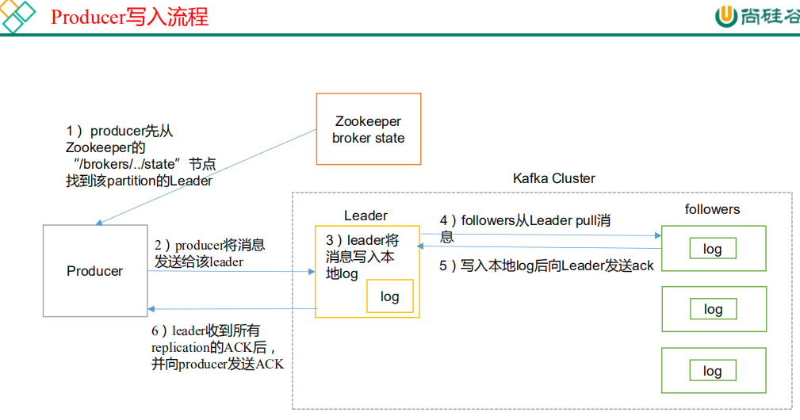

1）producer 先从 zookeeper 的 "/brokers/.../state"节点找到该 partition 的 leader

2）producer 将消息发送给该 leader

3）leader 将消息写入本地 log

4）followers 从 leader pull 消息，写入本地 log 后向 leader 发送 ACK

5）leader 收到所有 ISR 中的 replication 的 ACK 后，增加 HW（high watermark，最后 commit 的 offset）并向 producer 发送 ACK

消息保存过程分析:

1.1 存储方式:

物理上把 topic 分成一个或多个 patition（对应 server.properties 中的 num.partitions=3 配置），每个 patition 物理上对应一个文件夹（该文件夹存储该 patition 的所有.log消息文件和.index索引文件）

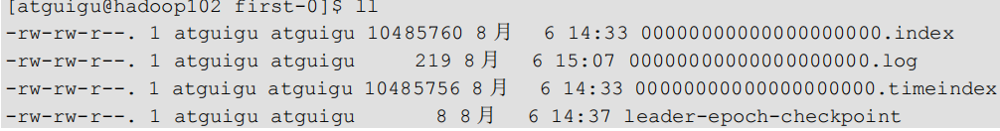

1,2 存储策略

无论消息是否被消费，kafka 都会保留所有消息。有两种策略可以删除旧数据：

1）基于时间：log.retention.hours=168 （7天）

2）基于大小：log.retention.bytes=1073741824 （1G）

需要注意的是，因为 Kafka 读取特定消息的时间复杂度为 O(1)，即与文件大小无关， 所以这里删除过期文件与提高 Kafka 性能无关

消费过程分析:

1,1 消费的api

kafka 提供了两套 consumer API：高级 Consumer API 和低级 Consumer API。

高级消费api的优点是不需要自行去管理 offset，系统通过 zookeeper 自行管理。

不需要管理分区，副本等情况，.系统自动管理。

消费者断线会自动根据上一次记录在 zookeeper 中的 offset 去接着获取数据（默认设 置1 分钟更新一下 zookeeper 中存的 offset）. 缺点是不能自行控制 offset

低级消费api的优点是能够让开发者自己控制 offset，想从哪里读取就从哪里读取,offset可 以不用zk存储. 缺点就是实现起来复杂

1.2 消费组的概念

消费者是以 consumer group 消费者组的方式工作，由一个或者多个消费者组成一个组，

共同消费一个 topic。每个分区在同一时间只能由 group 中的一个消费者读取，但是多 个 group可以同时消费这个 partition。

1.3 消费方式

consumer以拉(pull)的方式消费数据, consumer可以自己控制消费的速度, 是一次消费一条 还是一批数据. 缺点是当没有数据时消费者可能陷入循环pull数据中

## 6.21 Kafka 中Producer的Interceptor拦截器（☆） --要知道

Producer 拦截器(interceptor)是在 Kafka 0.10 版本被引入的，主要用于实现 clients 端的定

制化控制逻辑。

对于 producer 而言，interceptor 使得用户在消息发送前以及 producer 回调逻辑前有机会

对消息做一些定制化需求，比如修改消息等。同时，producer 允许用户指定多个 interceptor

按序作用于同一条消息从而形成一个拦截链(interceptor chain)。Intercetpor 的实现接口是

org.apache.kafka.clients.producer.ProducerInterceptor，

## 6.21 Kafka 容错机制（☆☆☆☆☆）

主要靠几个方面：

1.  副本机制

2.  broker容错机制---broker宕机后的恢复

3.  leader选举机制---leader挂掉后从followers中选举出新的leader

## 6.21 Kafka 数据积压怎么解决（☆☆☆☆☆ 面试真题）

分析： 一般来说生产消息的速度比消费消息的速度快， 这就容易造成数据积压

解决：

1.  增大partition数量从而提高consumer并行消费的能力

2.  对于提交offset变自动为手动，之前就是由于自动提交总是失败导致offset一直没有更新，重复消费数据导致消费速度赶不上

# 六 Impala（☆）

1,是什么------一款基于hive并使用内存计算的sql查询工具, 比hive快, 比sparksql快,号称最快.

基于hive是因为和hive共享元数据仓库metastore

2,impala的优缺点

优点: 在内存中计算所以快. 与hive不同底层不使用mr计算,而用c++,所以快

缺点: 对内存要求高 用c++编写所以维护难度大 与hive紧耦合共存亡

# 六 hue,oozie,clouderaManager（☆）

hue是一款基于可视化界面的整合工具, 可以直接让开发者在ui界面上与hadoop集群进行交互来分析处理数据, 比如操作hdfs,mr任务,hive的sql查询,浏览hbase数据库等等

oozie是一款重量级的工作流调度引擎, 根据有向无环图进行任务调度. oozie的一个很大的好处并且是实际中开发中常用的就是可以和hue进行整合。

但是oozie的工作流配置过程是通过xml配置，比较复杂，不易于维护

clouderamanager是一种大数据的解决方案，可以通过ClouderaManager管理界面来对我们的集群进行安装和操作

# 六 Elasticsearch（☆☆☆） 

1,是什么-----基于lucene的搜索服务器.

2,和solr的比较-----对已有数据的搜索solr更快, 实时建立索引es更快, 当数据量变得越来越大时solr搜索速度会变慢,而es速度几乎和原来一样

3,es的一些概念:

索引----任何搜索的数据都存放在索引对象上, 可以看成关系型数据库的表

文档----一条记录,存放在索引对象上, 可以看成数据库表的一行数据, 对应的有文档id

文档类型----es的一个索引对象下可以存储不同的文档类型对象,比如对一篇文章建立索 引,那么里面可以存储文章内容和评论两种文档类型

映射----数据如何存放到索引对象上，需要有一个映射配置， 包括：数据类型、是否存 储、是否分词 ... 等。

使用curl命令（curl可以认为是通过命令行访问url的一个工具）来操作：

创建索引：

4, 搜索时的一些基本概念

curl工具以及curl命令----用命令的方式对索引和文档的增删改查

条件查询QueryBuilder----

各种查询对象----WildcardQuery通配符查询,TermQuery词条查询,FuzzyQuery模糊查 询,BooleanQuery布尔查询

分词----es有默认的分词器是按单个字符分词,效果差, 用ik分词器代替

# 六 数据仓库设计（☆☆☆）

数仓的概念有广义和狭义的概念：

广义上指由ODS，DW，APP多个层次组成的数据仓库；

狭义上指DW层

## 6.1 维度表和事实表

维度表(dimension)

维度表示你要对数据进行分析时所用的一个量,比如你要分析产品销售情况, 你可以选择按类别来进行分析,或按区域来分析。这样的按..分析就构成一个维度。再比如"昨天下午我在星巴克花费200元喝了一杯卡布奇诺"。那么以消费为主题进行分析，可从这段信息中提取三个维度：时间维度(昨天下午)，地点维度(星巴克), 商品维度(卡布奇诺)。通常来说维度表信息比较固定，且数据量小。

事实表(fact table)

表示对分析主题的度量。事实表包含了与各维度表相关联的外键，并通过JOIN方式与维度表关联。事实表的度量通常是数值类型，且记录数会不断增加，表规模迅速增长。比如上面的消费例子，它的消费事实表结构示例如下：

消费事实表：Prod_id(引用商品维度表), TimeKey(引用时间维度表), Place_id(引用地点维度表), Unit(销售量)。

## 6.2 维度建模三种模式

#### 星型模式

星形模式(Star Schema)是最常用的维度建模方式。星型模式是以事实表为中心，所有的维度表直接连接在事实表上，像星星一样。

星形模式的维度建模由一个事实表和一组维表成，且具有以下特点：

a. 维表只和事实表关联，维表之间没有关联；

b. 每个维表主键为单列，且该主键放置在事实表中，作为两边连接的外键；

c. 以事实表为核心，维表围绕核心呈星形分布；


优点：查询效率高

缺点：有数据的冗余，如在地域维度表中，存在国家A 省B的城市C以及国家A省B的城市D两条记录，那么国家A和省B的信息分别存储了两次，即存在冗余。

#### 雪花模式

雪花模式(Snowflake Schema)是对星形模式的扩展。雪花模式的维度表可以拥有其他维度表的，虽然这种模型相比星型更规范一些，但是由于这种模型不太容易理解，维护成本比较高，而且性能方面需要关联多层维表，性能也比星型模型要低。虽然说去除了数据冗余，但是在实际中用的比星型模式少。

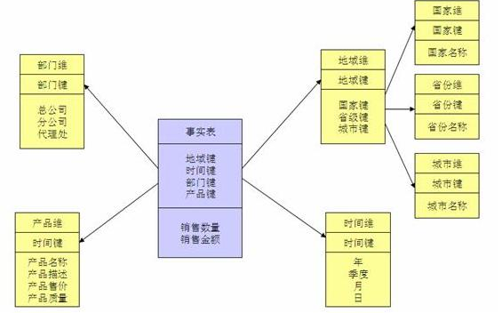

#### 星座模式

星座模式是星型模式延伸而来，星型模式是基于一张事实表的，而星座模式是基于多张事实表的，而且共享维度信息。

前面介绍的两种维度建模方法都是多维表对应单事实表，但在很多时候维度空间内的事实表不止一个，而一个维表也可能被多个事实表用到。在业务发展后期，绝大部分维度建模都采用的是星座模式。

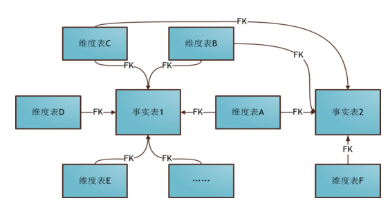

## 6.2 数据库和数据仓库的区别

数据库：

用于OLTP（联机事务处理），可以增删改查

存储瞬时的数据；

数据仓库：

用于OLAP（联机分析处理），可以查数据，可以追加数据

存储历史的各种主题的数据；

## 6.3 数仓面试时的一些需要准备的问题

#### 设计数仓：

有哪些数仓建模的方式：

1.  范式建模

2.  维度建模 ---就是星星模型，雪花模型，星座模型

设计数据仓库的具体工作就是构建事实表和维度表，前面已经通过hive对数据进行了预处理，产生了很多数据表， 比如构建订单事实表可能需要通过订单表，购物车表，用户表，商家表等多个表的数据包含进来。 构建维度表就需要去掉其他统计数据，仅仅保留与主题相关的列。

前面分析完了怎么创建事实表和维度表，接下来就是基真正基于某个模型比如星型模型构建数据仓库了。 使用hive构建数仓，步骤如下：

1，创建数据库：

> create database xxx；

2，创建数仓事实表：

> create table order_fact as (select xxxxx from 表1xx join 表2xx on xx=xx
>
> join 表3xx on xx=xx
>
> ...
>
> );

3，创建数仓维度表：

4，测试创建的表是否正确： 运行一些查询测试

#### 当问到维度表和事实表的时候

除了讲它们是什么, 还要举例自己的项目中的维度表和事实表,比如: 事实表举例-------原始数据表,有哪些字段比如访客ip,请求时间,url等.

维度表举例-----时间维度表, 有哪些字段比如年,月,日,时等.

答： 对订单进行分析， 以订单表为例

事实表：

分为订单表order_fact， 字段：订单id，商品id，时间id，用户id，地域id，金额，下单时间，付款时间，订单状态等等

维度表：

商品维度product_dim 字段： 商品id，名称，分类，单价，颜色等等

用户维度user_dim 字段：用户id，名字，性别，收货地址等等

时间维度time_dim 字段：时间id，日期，是否周末，是否节假日等等

地域维度area_dim 字段：地域id，省份id，省份，市id，市等等

一些面试细节问题：

1.  你们的维度表有多少个？ 这些维度表都是自己手动建立的吗？

> 回答思路： 如果项目中涉及的维度表比价少，可以说手动建立的。 但是一般不要说手动建立，要说通过脚本按照规则生成，也可以使用工具生成。 如果面试官问脚本怎么怎么写的？就回答具体怎么写不会，公司本来就有写好的脚本

2，明细表，宽表，窄表的概念

在事实表中，有些属性可以糅合在一起形成一个字段，比如年月日时分秒构成时间字段，比如时间字段中某数据是2019-06-29 06：49：16。当需要根据某一属性如小时进行分组统计时，需要通过截取拼接之类的操作，效率低下。

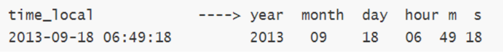

为了分析方便，可以事实表中的一个字段切割提取多个属性出来构成新的字段，因为字段变多了，所以称为宽表，原来的成为窄表。这里一般要用到行列互转函数

又因为宽表的信息更加清晰明细，所以也可以称之为明细表。

#### 数仓数据分层

可以说三层，也可以说四层，三层的话就没有数据集市DM层

ODS： 源数据层

DW：数据仓库层

DM：数据集市层

APP：应用层

# 六 电商数据处理流程

1.  数据源

业务数据：

> 就是电商系统中产生的数据，比如用户信息表，订单表，一般都是存储在关 系型数据库中如mysql

点击流数据：

> 用户在页面上的点击流日志，也叫网站日志。通过Nginx服务器搭建的后台产生的 日志文件格式为access.log ，里面的字段一般是ip、访问时间、请求方式、响 应码、UserAgent
>
> 
>
> 但是网站日志信息不够全，比如用户的一些鼠标停留等操作通过网站日志没法收集，只能通过自定义收集，如JS埋点
>
> 不管是网站日志还是JS埋点采集的数据都是在后台生成的文件中。 但是Nginx有一个缺点就是不会自动滚动成新文件，所有的日志数据都生成在一个文件中，这时候实际开发中都是用写脚本+crontab定时去滚动新文件，比如每隔一小时滚动一个新文件
>
> 还有关于日志格式分隔符的问题：
>
> 分隔符不能乱写，一般用的比较多的是空格，制表符， 最好用默认的001
>
> 日志的生成渠道：
>
> 网站web服务器记录的访问日志；
>
> js埋点获取用户的访问行为，然后通过ajax请求到后台日志；

2.  数据采集， 保存到hdfs

flume采集搭建在哪台机器上？------ 日志文件生成在哪台机器上，flume就搭建在哪里， 因为从flume的source源来看需要监控生成日志的目录或文件

业务数据采集：

> 通过sqoop每天定时把昨天业务系统中的增量数据导入到hdfs，每天数据分区存储

点击流数据采集：

> 通过flume实时收集到hdfs，每天的数据按照分区存储；
>
> 细节： 之前flume采集文件夹的source是spooldir， 采集文件的是exec， 如果同时需要监控文件夹和其他文件，那么可以搭建两个source（一个spooldir source，一个exec source）， 但在flume1.7版本之后新增了一个taildir，可以同时监控目录里文件的变化，也可以监控文件实时内容的变化
>
> 也可以通过shell脚本采集；
>
> 也可以通过写java程序采集；

3.  数据的预处理

> 通过mapreduce程序(当然也可以用Python，java原生程序，shell等做数据预处理，使用MR是因为基于java语言有很多lib库，另外MR分布式处理效率高)对采集到的数据预处理，比如过滤脏数据，清洗，格式整理等
>
> 技巧:
>
> 1, 过滤脏数据往往是通过自定义标记位，比如使用0/1表示数据是否有效，而不是直接物理删除；
>
> 2, 在MR中如果涉及到需要频繁使用但数据量又特别小的数据怎么办？
>
> 答： 如果用程序外部的方式处理----可以将这些数据存到redis中，需要用的使用 读取redis中的数据取出来。 如果用程序内部处理方式---可以将这些数据加 载到内存中，在mr的setup方法中实现

3，如果涉及多属性传递最好封装成JavaBean对象，在MR数据输入时可以是(JavaBean， NullWritable)，当然JavaBean需要实现Hadoop的序列化接口Writable

4，在JavaBean里的toString方法中最好用'001'进行字段分割，方便后续入库

> 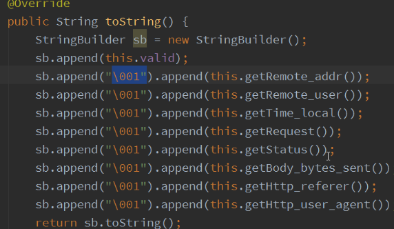

实际操作：

1.  过滤：

    1.  每一行数据切割后通过判断数组长度， 长度不符合的通过设置JavaBean中的一个定义的属性：setValid(false)

    2.  静态资源过滤 -- 比如在静态资源过滤中要判断每次请求中是否包含静态资源，包含就要setValid(false)

<!-- -->

4.  数据预处理完后要入库 -----更专业的说法叫ETL

ETL的实现方式有自动操作的工具（kettle，pdi），手动实现（hive sql，shell）， 在实际开发中通常是两者结合使用

将预处理后的数据导入到hive的数据库和表中

一般流程如下：

创建ODS层数据表：创建原始日志数据表；创建点击流模型pageviews表；创建点击 流visit模型表：

> drop table if exsits xxx;
>
> create table xxx(字段...) partittioned by (xx) row formated delimited fileds terminated by '001';

导入ODS数据： ---注意在实际开发中是将导入命令写在脚本中通过azkaban定时 运行，注意是在预处理数据完成之后

> load data inpath '/xxx' overwrite into table xxx partition(xx);

建立明细宽表：---- 通过查询ODS层数据表将某些复杂字段如url，时间等转成多个字 段抽取到中间表

> 比如要将refer_url分离出多个字段host，path，query，query id到一个中间表：
>
> create table tmp_url as select a.*,b.* from ods_log_origin a
>
> lateral view parse_url_tuple(regexp_replaee(http_refer,"",""),'host','path','query') b as host,path,query;
>
> 比如将time分离出多个字段year，month，day，hour到一个中间表：
>
> create table tmp_time as select b.*,substring(time,0,10) as daystr, substring(time,12) as tmstr xxxx from xxx表；

5.  数据的处理

项目的核心内容，即根据需求开发etl分析语句，得出各种统计结果

基础指标举例：

> PV: 页面加载总次数， 打开一个页面计数一次，多次打开同一个页面多次计数
>
> select count(*) from xxx where datestr="20190615";
>
> UV：独立访客数，以cookie为准
>
> select count(distinct remote_addr) as uvs from xxx where datestr="20190615";
>
> VV：访问次数，从进入网站到离开计为一次访问，所以一次VV可能包含多个PV
>
> select count(distinct session) as uvs from xxx where datestr="20190615";
>
> IP：

复合级指标举例：

> 人均浏览页数：
>
> 平均访问时长：
>
> 跳出率： 指用户在网站上只浏览一个页面就离开， 这样的访问次数占所有访问 次数的比重

分组求TOP N问题：

> 比如对每小时的来访host次数进行倒序排序排列：
>
> select xx, row_number() over(partition by concat(month,day,hour) order by ref_host desc ) as rank from xxx表；

以下就是一些可选流程：

6.  hive整合hbase用来提供海量数据的存储和查询

或者hive表直接通过sqoop导出到mysql去给前端获取展示

7.  数据可视化， 写java web项目

# 七 Spark（☆☆☆☆☆）

## 知识点：

spark基础：

1.  spark四种运行模式

> 本地模式（起多个线程的方式执行任务），
>
> standalone集群模式（Spark自己进行资源管理），
>
> spark on yarn (有两种模式：cluster模式，driver运行在worker节点，适 合实际生产； client模式，driver运行在客户端，适合做测试)
>
> spark on mesos （有两种模式： 粗粒度模式，任务运行之前就已经申请 好资源直到程序结束才回收资源，容易造成资源浪费。 细粒度模 式，资源是按需分配，启动一个任务就分配一些资源，程序执行效 率低）

SparkCore知识：

1.  rdd是什么---不可变可分区的弹性分布式数据集

2.  rdd的弹性---内存和磁盘自动切换，lineage血统，task重试，stage重试

3.  rdd的创建方式--- 有多种， 千万不能只说教学笔记里三种

4.  rdd常用算子

> 转换算子：
>
> map,mapPartitions,filter,flatmap,union,intersection,distinct,reduceByKey,
>
> groupByKey,sortByKey,sortBy,join,coalesce,repartition,patitionBy, sample(参数1：是否放回，参数2：取出多少数据，参数3：种子)
>
> 注意map和mapPartitions的异同
>
> 注意三个分区算子的异同
>
> 注意reduceByKey和groupByKey的异同
>
> 动作算子：
>
> reduce，collect，count，countByKey, take，saveAsTextFile,foreach
>
> 控制算子：
>
> persist，cache

5.  rdd宽窄依赖以及rdd容错机制之血统

6.  rdd的缓存----persist和cache的区别

> cache源码就是调用的persisit（MEMRORY_ONLY）

7.  DAG的生成以及shuffle过程

> DAG生成：rdd的一系列转换计算形成DAG， 根据rdd之间的宽依赖关系划分stage
>
> shuffle过程： 负责该过程的是ShuffleManager，在Spark1.2之前是HashShuffleManager，有一个弊端会产生大量中间文件影响磁盘io。 在Spark1.2之后变成SortShuffleManager，改进了之前的弊端会将大量中间文件合并成一个磁盘文件

8.  Spark的任务调度流程、运行架构

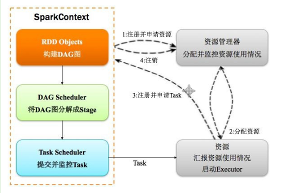

客户端提交jar包（提交任务）--- sc申请资源--资源管理器给Executor分配资源并启动Executor --- sc构建DAG图 --- 将DAG交给DAGSchedule去划分stage和TaskSet --- 将TaskSet交给TaskSchedule去划分一个个task -- 将task运行在Executor里

9.  rdd容错机制之checkpoint

> checkpoint： 将rdd结果保存到hdfs上实现高容错。 与rdd缓存的区别就是rdd缓存数据后之前的依赖关系还在， 而checkpoint后没了依赖关系
>
> 怎么实现rdd的checkpoint： 调用sc的setCheckPointDir方法设置hdfs目录，然后对rdd调用checkpoint方法就实现了rdd的保存

SparkSql知识：

1.  rdd、dataframe和dataset的区别和联系 以及相互转化方式

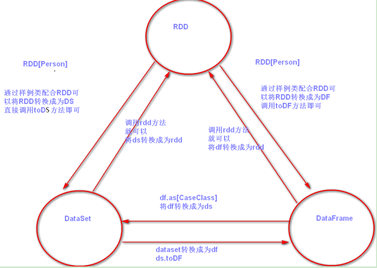

2.  创建dataframe的两种方式

> 方式1：通过rdd配合样例类转化成dataframe --- .toDF
>
> 方式2：通过sparksesstion对象读取各种格式文件 --- spark.read.text

3.  创建dataset的方式

> 方式1：通过sparksesstion对象的createDataset方法 ---spark.createDataset
>
> 方式2：配合样例类最后调用.toDS
>
> 方式3：dataframe.as[类型]转化为dataset

4.  SparkSql常见数据源---关系型数据库比如mysql

> sparksql读取mysql的数据
>
> 代码方式----val df = sparksession.read.jdbc()
>
> shell方式----val df = spark.read.format("jdbc").options()
>
> sparksql将数据写到mysql中
>
> 代码方式----读取文件转化成df，将df注册成表（df.createTempView）, 然后sparksession.sql()方法获得结果df,最后df.write.mode().jdbc() 写入mysql中

5.  常用开窗函数以及行列互转函数（难点）

6.  udf函数 （不是很会）

SparkStreaming知识：

1.  SparkStreaming的原理---- 将输入数据按时间间隔批量处理。 在Spark2.x 中sparkstreaming的时间间隔小到0.1秒，近乎实时处理

2.  SparkStreaming的计算流程、架构

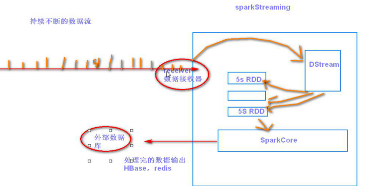

将输入的一段段数据流通过SparkCore组件转换成一个个rdd进行操作，将操作的结 果保存在内存或外部存储

3.  SparkStreaming的容错----依赖的是rdd的容错：lineage血统和checkpoint

4.  DStream的操作

> DStream表示数据流，可以理解为多个rdd串起来，每个rdd内含有一段 时间的数据
>
> 操作： 跟rdd的算子操作类似

5.  SparkStreaming数据源

> 1，文件数据源---- 读取文件 streamingContext.fileStream()
>
> 2，自定义数据源---- 定义类继承Receiver类，实现onStart，onStop方法， 在onStart中接收数据 streamingContext.receiverStream(MyReceiver())
>
> 3，flume数据源---- 分为push推和poll拉两种
>
> push方式关键词：sink方式：avro
>
> poll方式关键词：sink方式：SparkSink
>
> 4，kafka数据源----
>
> 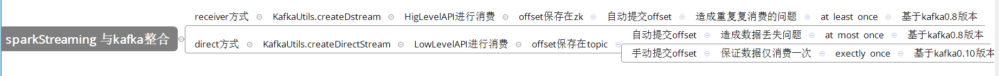

如果要统计一个文本中的单词出现次数，写出主要代码实现
(py or scala or java皆可)

rdd = sc.textFile(....)
val words = rdd.flatMap(x=>x.split(" "))
val result = words.map(x=>(x,1)).reduceByKey((x,y)=>x+y)

spark如何将一个目录下的所有文件读到一个pair rdd中？
sc.wholetextFiles("file://root/home/dir")

## 7.1 Spark的Job，Stage，Task概念区分 ---知道

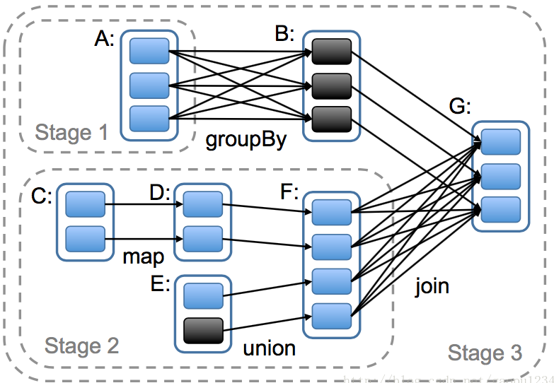

上面这张图就可以很清晰的说明这个问题。（图中最小的方块代表一个partition，包裹partition的方块是RDD，忽略颜色）

Job--------------（一个action算子操作就是一个job）

Spark的Job来源于用户执行action操作，就是从RDD中获取结果的操作，而不是将一个RDD转换成另一个RDD的transformation操作。

Stage--------------

Spark的Stage是分割RDD执行的各种transformation而来。如上图，将这些转化步骤分为了3个Stage，分别为Stage1，Stage2和Stage3。这里最重要的是搞清楚分割Stage的规则，其实只有一个：从宽依赖处分割。

Task--------------

一个Stage内，最终的RDD有多少个partition，就会产生多少个task。看一看上图就明白了

总结： 用户提交的任务是application（每个application都对应一个SparkContext对象），由于一个action算子操作就会产生一个job所以一个任务中会有多个job，每个job中有多个stage，每个stage中有多个task

这里要注意区分hadoop的job和task，hadoop的job就是一个个任务，job下包含maptask和reducetask

## 7.6 driver的功能是什么？ ---了解

1）一个Spark作业运行时包括一个Driver进程，也是作业的主进程，具有main函数，并且有SparkContext的实例，是程序的人口点； 如果是spark-shell时driver运行在master节点,如果是在idea开发或者spark-submit提交时driver运行在本地

2）功能：负责向集群申请资源，向master注册信息，负责了作业的调度，负责作业的解析、生成Stage并调度Task到Executor上。包括DAGScheduler，TaskScheduler。

## 7.7 spark的有几种部署/运行模式，每种模式特点？（☆☆☆☆☆）

1）本地模式

Spark不一定非要跑在hadoop集群，可以在本地，起多个线程的方式来指定。将Spark应用以多线程的方式直接运行在本地，一般都是为了方便调试，本地模式分三类

> ·local：只启动一个executor
>
> ·local[k]:启动k个executor
>
> ·local[*]：启动跟cpu数目相同的 executor

2）standalone模式

分布式部署集群，自带完整的服务，资源管理和任务监控是Spark自己监控，这个模式也是其他模式的基础。

3）Spark on yarn模式

分布式部署集群，资源和任务监控交给yarn管理，但是目前仅支持粗粒度资源分配方式，包含cluster和client运行模式，cluster适合生产，driver运行在集群子节点，具有容错功能，client适合调试，dirver运行在客户端

4）Spark On Mesos模式。

官方推荐这种模式（当然，原因之一是血缘关系）。正是由于Spark开发之初就考虑到支持Mesos，因此，目前而言，Spark运行在Mesos上会比运行在YARN上更加灵活，更加自然。用户可选择两种调度模式之一运行自己的应用程序：

（1）粗粒度模式（Coarse-grained Mode）：每个应用程序的运行环境由一个Dirver和若干个Executor组成，其中，每个Executor占用若干资源，内部可运行多个Task（对应多少个"slot"）。应用程序的各个任务正式运行之前，需要将运行环境中的资源全部申请好，且运行过程中要一直占用这些资源，即使不用，最后程序运行结束后，回收这些资源。

（2）细粒度模式（Fine-grained Mode）：鉴于粗粒度模式会造成大量资源浪费，Spark On Mesos还提供了另外一种调度模式：细粒度模式，这种模式类似于现在的云计算，思想是按需分配。

## 7.10 Spark为什么比mapreduce快？（☆☆☆☆☆）

1）基于内存计算，减少低效的磁盘交互；

2）高效的调度算法，基于DAG；

3）容错机制Linage，精华部分就是DAG和Lingae

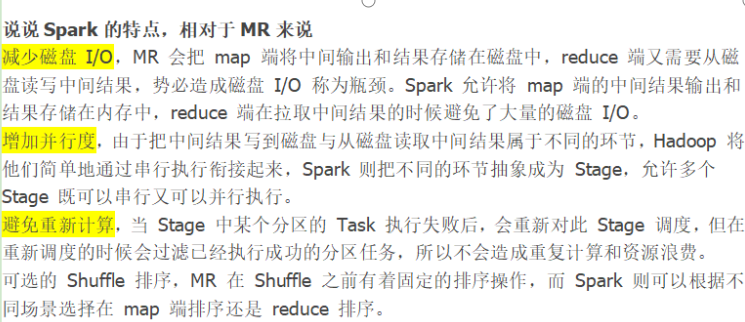

## 7.11 简单说一下hadoop和spark的shuffle相同和差异？（☆☆☆☆☆）

1）从 high-level 的角度来看，两者并没有大的差别。 都是将 mapper（Spark 里是 ShuffleMapTask）的输出进行 partition，不同的 partition 送到不同的 reducer（Spark 里 reducer 可能是下一个 stage 里的 ShuffleMapTask，也可能是 ResultTask）。Reducer 以内存作缓冲区，边 shuffle 边 aggregate 数据，等到数据 aggregate 好以后进行 reduce() （Spark 里可能是后续的一系列操作）。

2）从 low-level 的角度来看，两者差别大。 Hadoop MapReduce 是 sort-based，进入 combine() 和 reduce() 的 records 必须先 sort。这样的好处在于 combine/reduce() 可以处理大规模的数据，因为其输入数据可以通过外排得到（mapper 对每段数据先做排序，reducer 的 shuffle 对排好序的每段数据做归并）。目前的 Spark 默认选择的是 hash-based，通常使用 HashMap 来对 shuffle 来的数据进行 aggregate，不会对数据进行提前排序。如果用户需要经过排序的数据，那么需要自己调用类似 sortByKey() 的操作；如果你是Spark 1.1的用户，可以将spark.shuffle.manager设置为sort，则会对数据进行排序。在Spark 1.2中，sort将作为默认的Shuffle实现。

3）从实现角度来看，两者也有不少差别。 Hadoop MapReduce 将处理流程划分出明显的几个阶段：map(), spill, merge, shuffle, sort, reduce() 等。每个阶段各司其职，可以按照过程式的编程思想来逐一实现每个阶段的功能。在 Spark 中，没有这样功能明确的阶段，只有不同的 stage 和一系列的 transformation()，所以 spill, merge, aggregate 等操作需要蕴含在 transformation() 中。

如果我们将 map 端划分数据、持久化数据的过程称为 shuffle write，而将 reducer 读入数据、aggregate 数据的过程称为 shuffle read。那么在 Spark 中，问题就变为怎么在 job 的逻辑或者物理执行图中加入 shuffle write 和 shuffle read 的处理逻辑？以及两个处理逻辑应该怎么高效实现？ 

Shuffle write由于不要求数据有序，shuffle write 的任务很简单：将数据 partition 好，并持久化。之所以要持久化，一方面是要减少内存存储空间压力，另一方面也是为了 fault-tolerance。

## 7.14 spark有哪些组件？ ---了解

1）master：管理集群和节点，不参与计算。 

2）worker：计算节点，进程本身不参与计算，和master汇报。 

3）Driver：运行程序的main方法，创建spark context对象。 

4）spark context：控制整个application的生命周期，包括dagsheduler和task scheduler等组件。 

5）client：用户提交程序的入口。

## 7.15 spark工作机制？ （☆☆☆☆☆）

答：用户在client端提交作业后，会由Driver运行main方法并创建spark context上下文。 

执行rdd算子，形成dag图输入dagscheduler，按照rdd之间的依赖关系划分stage输入task scheduler。 task scheduler会将stage划分为task set分发到各个节点的executor中执行。

## 7.15 reduceByKey和groupByKey的区别 

它们的区别要理解以下两图:

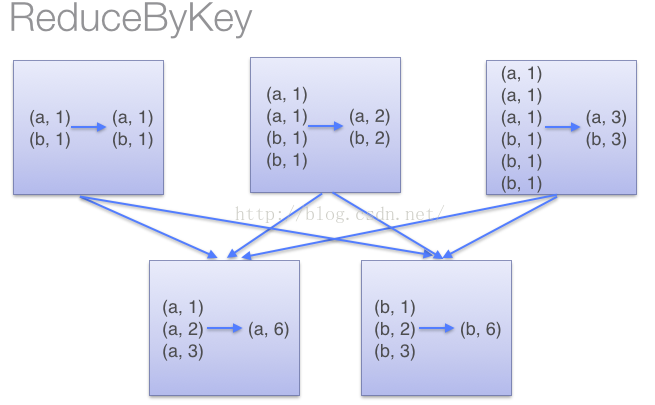

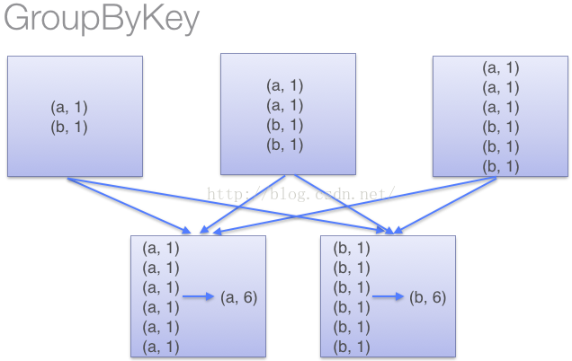

总结: 因为reduceByKey底层调用的是combinerByKey，会在map端先进行局部聚合，而groupByKey不会

有map端聚合的算子有哪些： reduceByKey，combinerByKey，aggregateByKey

## 7.16 spark的优化怎么做？ （☆☆☆☆☆☆☆☆）

影响一个Spark作业性能的因素，主要是代码开发、资源参数以及数据倾斜. 另外在spark优化中还有小部分影响的是shuffle的优化

### 代码层面: 

1,避免创建重复的rdd,比如对于同一份数据源多次创建rdd,这样就需要多次进行计算增 加开销

2, 尽可能复用同一个rdd,比如rdd-a是rdd-b的子集的情况

3, 对于同一个rdd需要多次进行不同的算子操作时,可以调用persist或cache方法将该 rdd加入缓存持久化. 因为在spark中对于同一个rdd的每一次算子操作默认都会调 用一个初始化计算后再执行我们的算子操作. 如果加入缓存后,后面每次算子操作 都是从缓存中读取rdd

4,使用高性能的算子代替普通算子,比如mapPartitions代替map，reduceByKey代替 groupByKey

### 资源层面:

在submit任务的时候设置合适的资源参数, 举例： executor-memory、driver-memory、executor-cores、spark.default.parallisim

### 数据倾斜层面:

数据倾斜现象: 大多数的task一分钟内执行完,某几个task执行一个小时. 或者原本正常执行的任务突然爆OOM

数据倾斜原理: 在shffle阶段, 不同节点不同分区里相同key的数据聚合到一起,某个key对应的数据量特别大就倾斜了

如何定位倾斜的地方: 数据倾斜只会发生在shuffle阶段, 而可能引起倾斜的的算子比如:reduceByKey, groupBykey, join, repartition等

某个task执行特别慢的情况-----从Spark Web UI上查看当前stage各个task分配的数据 量和执行时间. 知道倾斜发生在哪个stage之后推算对应代码中的算子

某个task莫名其妙内存溢出的情况----直接看log

### 数据倾斜的解决方案（☆☆☆☆☆）

#### 解决方案一（规避Spark阶段的倾斜，将倾斜提前到上游的hive，没有根本上解决倾斜）：使用Hive ETL预处理数据 

方案适用场景：导致数据倾斜的是Hive表。如果该Hive表中的数据本身很不均匀（比如某个key对应了100万数据，其他key才对应了10条数据），而且业务场景需要频繁使用Spark对Hive表执行某个分析操作，那么比较适合使用这种技术方案。

方案实现思路：此时可以评估一下，是否可以通过Hive来进行数据预处理（即通过Hive ETL预先对数据按照key进行聚合，或者是预先和其他表进行join），然后在Spark作业中针对的数据源就不是原来的Hive表了，而是预处理后的Hive表。此时由于数据已经预先进行过聚合或join操作了，那么在Spark作业中也就不需要使用原先的shuffle类算子执行这类操作了。

方案实现原理：这种方案从根源上解决了数据倾斜，因为彻底避免了在Spark中执行shuffle类算子，那么肯定就不会有数据倾斜的问题了。但是这里也要提醒一下大家，这种方式属于治标不治本。因为毕竟数据本身就存在分布不均匀的问题，所以Hive ETL中进行group by或者join等shuffle操作时，还是会出现数据倾斜，导致Hive ETL的速度很慢。我们只是把数据倾斜的发生提前到了Hive ETL中，避免Spark程序发生数据倾斜而已。

方案优点：实现起来简单便捷，效果还非常好，完全规避掉了数据倾斜，Spark作业的性能会大幅度提升。

方案缺点：治标不治本，Hive ETL中还是会发生数据倾斜。

方案实践经验：在一些Java系统与Spark结合使用的项目中，会出现Java代码频繁调用Spark作业的场景，而且对Spark作业的执行性能要求很高，就比较适合使用这种方案。将数据倾斜提前到上游的Hive ETL，每天仅执行一次，只有那一次是比较慢的，而之后每次Java调用Spark作业时，执行速度都会很快，能够提供更好的用户体验。

项目实践经验：在美团·点评的交互式用户行为分析系统中使用了这种方案，该系统主要是允许用户通过Java Web系统提交数据分析统计任务，后端通过Java提交Spark作业进行数据分析统计。要求Spark作业速度必须要快，尽量在10分钟以内，否则速度太慢，用户体验会很差。所以我们将有些Spark作业的shuffle操作提前到了Hive ETL中，从而让Spark直接使用预处理的Hive中间表，尽可能地减少Spark的shuffle操作，大幅度提升了性能，将部分作业的性能提升了6倍以上

#### 解决方案二（适用场景少，通常数据量大的key不止几个）：过滤少数导致倾斜的key

方案适用场景：如果发现导致倾斜的key就少数几个，而且对计算本身的影响并不大的话，那么很适合使用这种方案。比如99%的key就对应10条数据，但是只有一个key对应了100万数据，从而导致了数据倾斜。

方案实现思路：如果我们判断那少数几个数据量特别多的key，对作业的执行和计算结果不是特别重要的话，那么干脆就直接过滤掉那少数几个key。比如，在Spark SQL中可以使用where子句过滤掉这些key或者在Spark Core中对RDD执行filter算子过滤掉这些key。如果需要每次作业执行时，动态判定哪些key的数据量最多然后再进行过滤，那么可以使用sample算子对RDD进行采样，然后计算出每个key的数量，取数据量最多的key过滤掉即可。

方案实现原理：将导致数据倾斜的key给过滤掉之后，这些key就不会参与计算了，自然不可能产生数据倾斜。

方案优点：实现简单，而且效果也很好，可以完全规避掉数据倾斜。

方案缺点：适用场景不多，大多数情况下，导致倾斜的key还是很多的，并不是只有少数几个。

方案实践经验：在项目中我们也采用过这种方案解决数据倾斜。有一次发现某一天Spark作业在运行的时候突然OOM了，追查之后发现，是Hive表中的某一个key在那天数据异常，导致数据量暴增。因此就采取每次执行前先进行采样，计算出样本中数据量最大的几个key之后，直接在程序中将那些key给过滤掉。

#### 解决方案三（缓解倾斜，效果有限）：提高shuffle操作的并行度 --- 在shuffle类算子的参数中设置一个值，代表partitions数量，也即计算时的task数量，默认是200， 设置的值大于200就行

方案适用场景：如果我们必须要对数据倾斜迎难而上，那么建议优先使用这种方案，因为这是处理数据倾斜最简单的一种方案。

方案实现思路：在对RDD执行shuffle算子时，给shuffle算子传入一个参数，比如reduceByKey(1000)，该参数就设置了这个shuffle算子执行时shuffle read task的数量。对于Spark SQL中的shuffle类语句，比如group by、join等，需要设置一个参数，即spark.sql.shuffle.partitions，该参数代表了shuffle read task的并行度，该值默认是200，对于很多场景来说都有点过小。

方案实现原理：增加shuffle read task的数量，可以让原本分配给一个task的多个key分配给多个task，从而让每个task处理比原来更少的数据。举例来说，如果原本有5个key，每个key对应10条数据，这5个key都是分配给一个task的，那么这个task就要处理50条数据。而增加了shuffle read task以后，每个task就分配到一个key，即每个task就处理10条数据，那么自然每个task的执行时间都会变短了。

方案优点：实现起来比较简单，可以有效缓解和减轻数据倾斜的影响。

方案缺点：只是缓解了数据倾斜而已，没有彻底根除问题，根据实践经验来看，其效果有限。

方案实践经验：该方案通常无法彻底解决数据倾斜，因为如果出现一些极端情况，比如某个key对应的数据量有100万，那么无论你的task数量增加到多少，这个对应着100万数据的key肯定还是会分配到一个task中去处理，因此注定还是会发生数据倾斜的。所以这种方案只能说是在发现数据倾斜时尝试使用的第一种手段，尝试去用最简单的方法缓解数据倾斜而已，或者是和其他方案结合起来使用。

#### 解决方案四（只适用于聚合类shuffle算子操作）：两阶段聚合（局部聚合+全局聚合）

方案适用场景：对RDD执行reduceByKey等聚合类shuffle算子或者在Spark SQL中使用group by语句进行分组聚合时，比较适用这种方案。

方案实现思路：这个方案的核心实现思路就是进行两阶段聚合。第一次是局部聚合，先给每个key都打上一个随机字符，比如10以内的随机数，此时原先一样的key就变成不一样的了，比如(hello, 1) (hello, 1) (hello, 1) (hello, 1)，就会变成(1_hello, 1) (1_hello, 1) (2_hello, 1) (2_hello, 1)。接着对打上随机数后的数据，执行reduceByKey等聚合操作，进行局部聚合，那么局部聚合结果，就会变成了(1_hello, 2) (2_hello, 2)。然后将各个key的前缀给去掉，就会变成(hello,2)(hello,2)，再次进行全局聚合操作，就可以得到最终结果了，比如(hello, 4)。

方案实现原理：将原本相同的key通过附加随机前缀的方式，变成多个不同的key，就可以让原本被一个task处理的数据分散到多个task上去做局部聚合，进而解决单个task处理数据量过多的问题。接着去除掉随机前缀，再次进行全局聚合，就可以得到最终的结果。

方案优点：对于聚合类的shuffle操作导致的数据倾斜，效果是非常不错的。通常都可以解决掉数据倾斜，或者至少是大幅度缓解数据倾斜，将Spark作业的性能提升数倍以上。

方案缺点：仅仅适用于聚合类的shuffle操作，适用范围相对较窄。如果是join类的shuffle操作，还得用其他的解决方案

#### 五：自定义Partitioner，分散key的分布

六：

## 7.18 什么是RDD宽依赖和窄依赖？（☆☆☆）

RDD和它依赖的parent RDD(s)的关系有两种不同的类型，即窄依赖（narrow dependency）和宽依赖（wide dependency）。

1）窄依赖指的是每一个父RDD的Partition只被子RDD的一个Partition使用

2）宽依赖指的是多个子RDD的Partition会依赖同一个parent RDD的Partition

## 7.19 spark-submit的时候如何引入外部jar包 --了解

方法一：spark-submit --jars

根据spark官网，在提交任务的时候指定--jars，用逗号分开。这样做的缺点是每次都要指定jar包，如果jar包少的话可以这么做，但是如果多的话会很麻烦。

命令：spark-submit --master yarn-client --jars ***.jar,***.jar

方法二：extraClassPath

提交时在spark-default中设定参数，将所有需要的jar包考到一个文件里，然后在参数中指定该目录就可以了，较上一个方便很多：

spark.executor.extraClassPath=/home/hadoop/wzq_workspace/lib/* spark.driver.extraClassPath=/home/hadoop/wzq_workspace/lib/*

需要注意的是，你要在所有可能运行spark任务的机器上保证该目录存在，并且将jar包考到所有机器上。这样做的好处是提交代码的时候不用再写一长串jar了，缺点是要把所有的jar包都拷一遍。

## 7.20 cache和pesist的区别 （☆☆）

1）cache和persist都是用于将一个RDD进行缓存的，这样在之后使用的过程中就不需要重新计算了，可以大大节省程序运行时间；

2） cache只有一个默认的缓存级别MEMORY_ONLY ，cache调用了persist，而persist可以根据情况设置其它的缓存级别；

3）executor执行的时候，默认60%做cache，40%做task操作，persist最根本的函数，最底层的函数

## 7.24 RDD的弹性表现在哪几点？（☆☆☆☆☆）

1）自动的进行内存和磁盘的存储切换；

2）基于Lingage的高效容错；

3）task如果失败会自动进行特定次数的重试；

4）stage如果失败会自动进行特定次数的重试，而且只会计算失败的分片；

5）checkpoint和persist，persist持久化到内存或磁盘，rdd进行检查点会将数据保存hdfs

6）数据调度弹性，DAG TASK调度和资源无关

7）数据分片的高度弹性，a.分片很多碎片可以合并成大的，b.par

## 7.27 RDD有哪些缺陷？（☆☆☆☆☆）

1）不支持细粒度的写和更新操作（如网络爬虫），spark写数据是粗粒度的，所谓粗粒度就是批量写入数据，为了提高效率。但是读数据是细粒度的也就是说可以一条条的读。

2）不支持增量迭代计算，Flink支持

## 7.28 说一说Spark程序编写的一般步骤？--按照wordcount讲

答：初始化，资源，数据源，并行化，rdd转化，action算子打印输出结果或者也可以存至相应的数据存储质

获取SparkConf和SparkContext对象， 读取数据源，rdd操作得到结果

## 7.29概述一下spark中的常用算子区别 --了解

map mapPartition foreach foreachpartition

提示从几个方面回答:

1,返回值是RDD(transformation)还是无返回值(action)

2,作用于一个元素还是一个分区的元素

reduceByKey和groupByKey的区别

Pair RDD{(1,2),(3,4),(3,6)}转化操作.reduceByKey((x,y)=>x+y)的结果是什么？
{(1,2),(3,10)} ----相同key的值会累加

 

Pair RDD{(1,2),(3,4),(3,6)}转化操作.groupByKey()的结果是什么？
{(1,[2]),(3,[4,6])} ----相同key的值会聚合在一起形成集合

## 7.31 Spark有哪些聚合类的算子,我们应该尽量避免什么类型的算子？

答：在我们的开发过程中，能避免则尽可能避免使用reduceByKey、join、distinct、repartition等会进行shuffle的算子，尽量使用map类的非shuffle算子。这样的话，没有shuffle操作或者仅有较少shuffle操作的Spark作业，可以大大减少性能开销。

## 7.32 Spark的shuffle过程？（☆☆☆☆☆ 面试真题）

答：HashShuffleManager运行原理从下面三点去展开

1.  shuffle过程的划分

shuffle过程：由ShuffleManager负责，计算引擎HashShuffleManager，新版本是SortShuffleManager

spark根据shuffle类算子进行stage的划分，当执行某个shuffle类算子（reduceByKey、join）时，算子之前的代码被划分为一个stage，之后的代码被划分为下一个stage。当前stage开始执行时，它的每个task会从上一个stage的task坐在的节点通过网络拉取所需的数据

2.  shuffle的中间结果如何存储

shuffle write：

1，stage结束之后，每个task处理的数据按key进行"分类"

2，数据先写入内存缓冲区

3，缓冲区满，溢出到磁盘文件

4，最终，相同key被写入同一个磁盘文件

创建的磁盘文件数量 = 当前stagetask数量 * 下一个stage的task数量

3.  shuffle的数据如何拉取过来

shuffle read：

1，从上游stage的所有task节点上拉取属于自己的磁盘文件

2，每个read task会有自己的buffer缓冲，每次只能拉取与buffer缓冲相同大小的数据， 然后聚合，聚合完一批后拉取下一批

以上是未经优化的HashShuffleManager运行原理， 如果开启spark.shuffle.consolidate为true则开启优化机制（consolidate机制）， 优化后的原理略。

SortShuffleManager运行原理如下， 有两种机制：普通机制和bypass机制

普通机制：

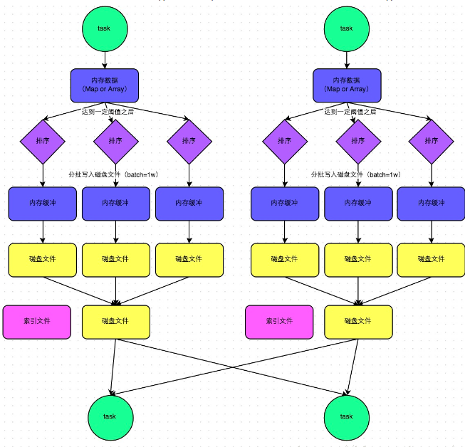

1，数据写入内存

2，达到阈值后根据key排序，先将数据写到内存缓存再溢出到磁盘文件

3，合并所有磁盘文件，归并排序，依次写入同一个磁盘文件

4，单独写一份索引文件，标识下游task数据在文件中的start和end

bypass机制:

当reduce的task数量 < 200 时shuffle write过程不排序，最后合并所有磁盘文件成一个，并创建索引文件

可以参考这篇博文：[http://www.cnblogs.com/jxhd1/p/6528540.html](http://www.cnblogs.com/jxhd1/p/6528540.html) 或者

https://blog.csdn.net/quitozang/article/details/80904040

## 7.33 你如何从Kafka中获取数据(kafka数据源整合spark)？--前面有答案

1）基于Receiver的方式

这种方式使用Receiver来获取数据。Receiver是使用Kafka的高层次Consumer API来实现的。receiver从Kafka中获取的数据都是存储在Spark Executor的内存中的，然后Spark Streaming启动的job会去处理那些数据。

2）基于Direct的方式

这种新的不基于Receiver的直接方式，是在Spark 1.3中引入的，从而能够确保更加健壮的机制。替代掉使用Receiver来接收数据后，这种方式会周期性地查询Kafka，来获得每个topic+partition的最新的offset，从而定义每个batch的offset的范围。当处理数据的job启动时，就会使用Kafka的简单consumer api来获取Kafka指定offset范围的数据

## 7.35 RDD创建有哪几种方式？ -- 不能只说三种

1）使用程序中的集合创建rdd

2）使用本地文件系统创建rdd

3）使用hdfs创建rdd，

4）基于数据库db创建rdd

5）基于Nosql创建rdd，如hbase

6）基于s3创建rdd，

7）基于数据流，如socket创建rdd

如果只回答了前面三种，是不够的，只能说明你的水平还是入门级的，实践过程中有很多种创建方式。

## 7.36 Spark并行度怎么设置比较合适（☆☆☆）--要知道

spark并行度，每个core承载2~4个partition,如，32个core，那么64~128之间的并行度，也就是设置64~128个partion，并行度和数据规模无关，只和内存使用量和cpu使用时间有关。

## 7.38 Spark的数据本地性有哪几种？（☆☆☆☆☆）

答：Spark中的数据本地性有三种：

1）PROCESS_LOCAL是指读取缓存在本地节点的数据

2）NODE_LOCAL是指读取本地节点硬盘数据

3）ANY是指读取非本地节点数据

通常读取数据PROCESS_LOCAL>NODE_LOCAL>ANY，尽量使数据以PROCESS_LOCAL或NODE_LOCAL方式读取。其中PROCESS_LOCAL还和cache有关，如果RDD经常用的话将该RDD cache到内存中，注意，由于cache是lazy的，所以必须通过一个action的触发，才能真正的将该RDD cache到内存中。

## 7.23数据本地性是在哪个环节确定的？--了解

具体的task运行在哪台机器上，dag划分stage的时候确定的

## 7.39 rdd有几种操作类型？（☆☆☆☆☆）--一定要说三种

1）transformation，rdd由一种转为另一种rdd

2）action

3）cronroller，crontroller是控制算子,cache,persist，对性能和效率的有很好的支持

三种类型，不要回答只有2中操作

## 7.43 为什么Spark Application在没有获得足够的资源，job就开始执行了，可能会导致什么什么问题发生?

答：会导致执行该job时候集群资源不足，导致执行job结束也没有分配足够的资源，分配了部分Executor，该job就开始执行task，应该是task的调度线程和Executor资源申请是异步的；如果想等待申请完所有的资源再执行job的：需要将spark.scheduler.maxRegisteredResourcesWaitingTime设置的很大；spark.scheduler.minRegisteredResourcesRatio 设置为1，但是应该结合实际考虑

否则很容易出现长时间分配不到资源，job一直不能运行的情况。

## 7.46 Spark为什么要持久化，一般什么场景下要进行persist操作？

为什么要进行持久化？

spark所有复杂一点的算法都会有persist身影，spark默认数据放在内存，spark很多内容都是放在内存的，非常适合高速迭代，1000个步骤

只有第一个输入数据，中间不产生临时数据，但分布式系统风险很高，所以容易出错，就要容错，rdd出错或者分片可以根据血统算出来，如果没有对父rdd进行persist 或者cache的化，就需要重头做。

以下场景会使用persist

1）某个步骤计算非常耗时，需要进行persist持久化

2）计算链条非常长，重新恢复要算很多步骤，很好使，persist

3）checkpoint所在的rdd要持久化persist，

lazy级别，框架发现有checnkpoint，checkpoint时单独触发一个job，需要重算一遍，checkpoint前，要持久化，写个rdd.cache或者rdd.persist，将结果保存起来，再写checkpoint操作，这样执行起来会非常快，不需要重新计算rdd链条了。checkpoint之前一定会进行persist。

4）shuffle之后为什么要persist，shuffle要进性网络传输，风险很大，数据丢失重来，恢复代价很大

5）shuffle之前进行persist，框架默认将数据持久化到磁盘，这个是框架自动做的。

## 7.47 为什么要进行序列化 --要知道

序列化可以减少数据的体积，减少存储空间，高效存储和传输数据，不好的是使用的时候要反序列化，非常消耗CPU。

## 7.48 介绍一下join操作优化经验？（☆☆☆☆☆）

主要说一下使用map端join， 而不要使用reduce端join

join其实常见的就分为两类： map-side join 和  reduce-side join。当大表和小表join时，用map-side join能显著提高效率。将多份数据进行关联是数据处理过程中非常普遍的用法，不过在分布式计算系统中，这个问题往往会变的非常麻烦，因为框架提供的 join 操作一般会将所有数据根据 key 发送到所有的 reduce 分区中去，也就是 shuffle 的过程。造成大量的网络以及磁盘IO消耗，运行效率极其低下，这个过程一般被称为 reduce-side-join。如果其中有张表较小的话，我们则可以自己实现在 map 端实现数据关联，跳过大量数据进行 shuffle 的过程，运行时间得到大量缩短，根据不同数据可能会有几倍到数十倍的性能提升。

备注：这个题目面试中非常非常大概率见到，务必搜索相关资料掌握，这里抛砖引玉。

## 7.54 提交任务时，如何指定Spark Application的运行模式？

1）cluster模式：./spark-submit --class xx.xx.xx --master yarn --deploy-mode cluster xx.jar

2）client模式：./spark-submit --class xx.xx.xx --master yarn --deploy-mode client xx.jar

## 7.55 不启动Spark集群Master和work服务，可不可以运行Spark程序？--了解

可以，只要资源管理器第三方管理就可以，如由yarn管理，spark集群不启动也可以使用spark；spark集群启动的是work和master，这个其实就是资源管理框架，yarn中的resourceManager相当于master，NodeManager相当于worker，做计算是Executor，和spark集群的work和manager可以没关系，归根接底还是JVM的运行，只要所在的JVM上安装了spark就可以。

## 7.63 Executor启动时，资源通过哪几个参数指定？--要知道

1）num-executors是executor的数量

2）executor-memory 是每个executor使用的内存

3）executor-cores 是每个executor分配的CPU

## 7.69 你们提交的job任务大概有多少个？这些job执行完大概用多少时间？（☆☆☆☆☆）

## 

## 7.73 YarnClient模式下，执行Spark SQL报这个错，Exception in thread "Thread-2" java.lang.OutOfMemoryError: PermGen space，但是在Yarn Cluster模式下正常运行，可能是什么原因？

1）原因查询过程中调用的是Hive的获取元数据信息、SQL解析，并且使用Cglib等进行序列化反序列化，中间可能产生较多的class文件，导致JVM中的持久代使用较多Cluster模式的持久代默认大小是64M，Client模式的持久代默认大小是32M，而Driver端进行SQL处理时，其持久代的使用可能会达到90M，导致OOM溢出，任务失败。

yarn-cluster模式下出现，yarn-client模式运行时倒是正常的，原来在$SPARK_HOME/bin/spark-class文件中已经设置了持久代大小：

JAVA_OPTS="-XX:MaxPermSize=256m $OUR_JAVA_OPTS"

2）解决方法:在Spark的conf目录中的spark-defaults.conf里，增加对Driver的JVM配置，因为Driver才负责SQL的解析和元数据获取。配置如下：

spark.driver.extraJavaOptions -XX:PermSize=128M -XX:MaxPermSize=256M   

## 7.75 导致Executor产生FULL gc 的原因，可能导致什么问题？

答：可能导致Executor僵死问题，海量数据的shuffle和数据倾斜等都可能导致full gc。以shuffle为例，伴随着大量的Shuffle写操作，JVM的新生代不断GC，Eden Space写满了就往Survivor Space写，同时超过一定大小的数据会直接写到老生代，当新生代写满了之后，也会把老的数据搞到老生代，如果老生代空间不足了，就触发FULL GC，还是空间不够，那就OOM错误了，此时线程被Blocked，导致整个Executor处理数据的进程被卡住。

## 7.77 Spark执行任务时出现java.lang.OutOfMemoryError: GC overhead limit exceeded和java.lang.OutOfMemoryError: java heap space原因和解决方法？（☆☆☆☆☆）

答：原因：加载了太多资源到内存，本地的性能也不好，gc时间消耗的较多

解决方法：

1）增加参数，-XX:-UseGCOverheadLimit，关闭这个特性，同时增加heap大小，-Xmx1024m

2）下面这个两个参数调大点

> export SPARK_EXECUTOR_MEMORY=6000M
>
> export SPARK_DRIVER_MEMORY=7000M
>
> 可以参考这个：http://www.cnblogs.com/hucn/p/3572384.html

## 7.80 Spark使用parquet文件存储格式能带来哪些好处？（☆☆☆☆☆）

1）如果说HDFS 是大数据时代分布式文件系统首选标准，那么parquet则是整个大数据时代文件存储格式实时首选标准。

2）速度更快：从使用spark sql操作普通文件CSV和parquet文件速度对比上看，绝大多数情况会比使用csv等普通文件速度提升10倍左右，在一些普通文件系统无法在spark上成功运行的情况下，使用parquet很多时候可以成功运行。

3）parquet的压缩技术非常稳定出色，在spark sql中对压缩技术的处理可能无法正常的完成工作（例如会导致lost task，lost executor）但是此时如果使用parquet就可以正常的完成。

4）极大的减少磁盘I/o,通常情况下能够减少75%的存储空间，由此可以极大的减少spark sql处理数据的时候的数据输入内容，尤其是在spark1.6x中有个下推过滤器在一些情况下可以极大的减少磁盘的IO和内存的占用，（下推过滤器）。

5）spark 1.6x parquet方式极大的提升了扫描的吞吐量，极大提高了数据的查找速度spark1.6和spark1.5x相比而言，提升了大约1倍的速度，在spark1.6X中，操作parquet时候cpu也进行了极大的优化，有效的降低了cpu消耗。

6）采用parquet可以极大的优化spark的调度和执行。我们测试spark如果用parquet可以有效的减少stage的执行消耗，同时可以优化执行路径。

## 7.84 spark hashParitioner的弊端是什么？（☆☆☆）

HashPartitioner分区的原理很简单，对于给定的key，计算其hashCode，并模以分区个数，如果余数小于0，则用余数+分区的个数，最后返回的值就是这个key所属的分区ID；弊端是数据不均匀，容易导致数据倾斜，极端情况下某几个分区会拥有rdd的所有数据。

## 7.85 RangePartitioner分区的原理?（☆☆☆）

RangePartitioner分区则尽量保证每个分区中数据量的均匀，而且分区与分区之间是有序的，也就是说一个分区中的元素肯定都是比另一个分区内的元素小或者大；但是分区内的元素是不能保证顺序的。简单的说就是将一定范围内的数映射到某一个分区内。其原理是水塘抽样。

## 7.86 介绍parition和block有什么关联关系？（☆☆☆）--要知道

1）hdfs中的block是分布式存储的最小单元，等分，可设置冗余，这样设计有一部分磁盘空间的浪费，但是整齐的block大小，便于快速找到、读取对应的内容；

2）Spark中的partion是弹性分布式数据集RDD的最小单元，RDD是由分布在各个节点上的partion组成的。partion是指的spark在计算过程中，生成的数据在计算空间内最小单元，同一份数据（RDD）的partion大小不一，数量不定，是根据application里的算子和最初读入的数据分块数量决定；

3）block是相对于存储来说的、partion是相对于计算来说的，block的大小是固定的、partion大小是不固定的，是从2个不同的角度去看数据。

## 7.87 Spark应用程序的执行过程？（☆☆☆☆☆）--前面有答案

1）构建Spark Application的运行环境（启动SparkContext），SparkContext向资源管理器（可以是Standalone、Mesos或YARN）注册并申请运行Executor资源；

2）资源管理器分配Executor资源并启动StandaloneExecutorBackend，Executor运行情况将随着心跳发送到资源管理器上；

3）SparkContext构建成DAG图，将DAG图分解成Stage，并把Taskset发送给Task Scheduler。Executor向SparkContext申请Task，Task Scheduler将Task发放给Executor运行同时SparkContext将应用程序代码发放给Executor；

4）Task在Executor上运行，运行完毕释放所有资源。

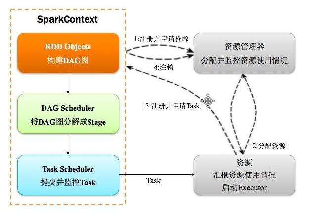

## 7.90 Spark如何自定义partitioner分区器？--要知道

1）spark默认实现了HashPartitioner和RangePartitioner两种分区策略，我们也可以自己扩展分区策略，自定义分区器的时候继承org.apache.spark.Partitioner类，实现类中的三个方法：

def numPartitions: Int：这个方法需要返回你想要创建分区的个数；

def getPartition(key: Any): Int：这个函数需要对输入的key做计算，然后返回该key的分区ID，范围一定是0到numPartitions-1；

equals()：这个是Java标准的判断相等的函数，之所以要求用户实现这个函数是因为Spark内部会比较两个RDD的分区是否一样。

2）使用，调用parttionBy方法中传入自定义分区对象。

## 7.94 什么是二次排序，你是如何用spark实现二次排序的？（☆☆☆☆☆） 

 原理:

二次排序就是首先按照第一字段排序，然后再对第一字段相同的行按照第二字段排序，注意不能破坏第一次排序的结果

怎么实现:

java版本的二次排序非常繁琐，而使用scala实现就简捷，首先我们需要一个继承Ordered和Serializable的类。类中重写了compare方法,在方法中先判断第一个字段是否相等，如果不相等，就直接排序.如果第一个字段相等，就比较第二个字段. 然后就是实现二次排序的代码: 读取数据为RDD,获取每一行数据的用来排序的字段封装到上述类中作为key,将整行数据作为value, 直接调用sortByKey进行排序

## 7.95 如何使用Spark解决TopN问题？ （☆☆☆☆☆） 

数据组织形式：

aa 11

bb 11

cc 34

aa 22

bb 67

cc 29

aa 36

bb 33

cc 30

aa 42

bb 44

cc 49

需求：

1）对上述数据按key值进行分组

2）对分组后的值进行排序

3）截取分组后值得top 3位以key-value形式返回结果

答案

val groupTopNRdd = sc.textFile("hdfs://db02:8020/user/hadoop/groupsorttop/groupsorttop.data")

groupTopNRdd.map(_.split(" ")).map(x => (x(0),x(1))).groupByKey().map(

x => {

val xx = x._1

val yy = x._2

(xx,yy.toList.sorted.reverse.take(3))

}).collect

## 7.97 窄依赖父RDD的partition和子RDD的parition是不是都是一对一的关系？ --了解

不一定，除了一对一的窄依赖，还包含一对固定个数的窄依赖（就是对父RDD的依赖的Partition的数量不会随着RDD数量规模的改变而改变），比如join操作的每个partiion仅仅和已知的partition进行join，这个join操作是窄依赖，依赖固定数量的父rdd，因为是确定的partition关系。

## 7.100 不需要排序的hash shuffle是否一定比需要排序的sort shuffle速度快？（☆☆☆）--要知道

不一定，当数据规模小，Hash shuffle快于Sorted Shuffle；当数据量大时，sorted Shuffle会比Hash shuffle快很多，因为数量大的有很多小文件，不均匀，甚至出现数据倾斜，消耗内存大，1.x(1.2)之前spark默认使用hash，由于在shuffle时一个task会产生大量中间磁盘文件,影响磁盘IO,所以适合处理中小规模，1.x之后的版本，增加了Sorted shuffle并默认使用这个，虽然每个task也会产生大量中间磁盘文件,但是会merge成一个磁盘文件, 所以Spark更能胜任大规模处理了,但是还是有一点不足---当task数量多时也会有很多磁盘文件。

## 7.102 conslidate是如何优化Hash shuffle时在map端产生的小文件？ --不懂，源码级别

1）conslidate为了解决Hash Shuffle同时打开过多文件导致Writer handler内存使用过大以及产生过多文件导致大量的随机读写带来的低效磁盘IO；

2）conslidate根据CPU的个数来决定每个task shuffle map端产生多少个文件，假设原来有10个task，100个reduce，每个CPU有10个CPU，那么使用hash shuffle会产生10*100=1000个文件，conslidate产生10*10=100个文件

备注：conslidate部分减少了文件和文件句柄，并行读很高的情况下（task很多时）还是会很多文件。

## 7.103 Sort-basesd shuffle产生多少个临时文件 --了解

2*Map阶段所有的task数量，Mapper阶段中并行的Partition的总数量，其实就是Mapper端task。

## 7.106 spark.default.parallelism这个参数有什么意义，实际生产中如何设置？

1）参数用于设置每个stage的默认task数量。这个参数极为重要，如果不设置可能会直接影响你的Spark作业性能；

2）很多人都不会设置这个参数，会使得集群非常低效，你的cpu，内存再多，如果task始终为1，那也是浪费，spark官网建议task个数为CPU的核数*executor的个数的2~3倍。

## 7.107 spark.storage.memoryFraction参数的含义,实际生产中如何调优？（☆☆☆☆☆） 

1）用于设置RDD持久化数据在Executor内存中能占的比例，默认是0.6,，默认Executor 60%的内存，可以用来保存持久化的RDD数据。根据你选择的不同的持久化策略，如果内存不够时，可能数据就不会持久化，或者数据会写入磁盘；

2）如果持久化操作比较多，可以提高spark.storage.memoryFraction参数，使得更多的持久化数据保存在内存中，提高数据的读取性能，如果shuffle的操作比较多，有很多的数据读写操作到JVM中，那么应该调小一点，节约出更多的内存给JVM，避免过多的JVM gc发生。在web ui中观察如果发现gc时间很长，可以设置spark.storage.memoryFraction更小一点。

## 7.108 spark.shuffle.memoryFraction参数的含义，以及优化经验？

1）spark.shuffle.memoryFraction是shuffle调优中 重要参数，shuffle从上一个task拉去数据过来，要在Executor进行聚合操作，聚合操作时使用Executor内存的比例由该参数决定，默认是20%如果聚合时数据超过了该大小，那么就会spill到磁盘，极大降低性能；

2）如果Spark作业中的RDD持久化操作较少，shuffle操作较多时，建议降低持久化操作的内存占比，提高shuffle操作的内存占比比例，避免shuffle过程中数据过多时内存不够用，必须溢写到磁盘上，降低了性能。此外，如果发现作业由于频繁的gc导致运行缓慢，意味着task执行用户代码的内存不够用，那么同样建议调低这个参数的值。

## 7.112 Spark中standalone模式特点，有哪些优点和缺点？--前面有答案

1）特点：

（1）standalone是master/slave架构，集群由Master与Worker节点组成，程序通过与Master节点交互申请资源，Worker节点启动Executor运行；

（2）standalone调度模式使用FIFO调度方式；

（3）无依赖任何其他资源管理系统，Master负责管理集群资源

2）优点：

（1）部署简单；

（2）不依赖其他资源管理系统。

3）缺点：

（1）默认每个应用程序会独占所有可用节点的资源，当然可以通过spark.cores.max来决定一个应用可以申请的CPU cores个数；

（2）可能有单点故障，需要自己配置master HA

## 7.117 常见的数压缩方式，你们生产集群采用了什么压缩方式，提升了多少效率？ --要知道

1）数据压缩，大片连续区域进行数据存储并且存储区域中数据重复性高的状况下，可以使用适当的压缩算法。数组，对象序列化后都可以使用压缩，数更紧凑，减少空间开销。常见的压缩方式有snappy，LZO，gz等

2）Hadoop生产环境常用的是snappy压缩方式（使用压缩，实际上是CPU换IO吞吐量和磁盘空间，所以如果CPU利用率不高，不忙的情况下，可以大大提升集群处理效率）。snappy压缩比一般20%~30%之间，并且压缩和解压缩效率也非常高（参考数据如下）：

（1）GZIP的压缩率最高，但是其实CPU密集型的，对CPU的消耗比其他算法要多，压缩和解压速度也慢；

（2）LZO的压缩率居中，比GZIP要低一些，但是压缩和解压速度明显要比GZIP快很多，其中解压速度快的更多；

（3）Zippy/Snappy的压缩率最低，而压缩和解压速度要稍微比LZO要快一些。

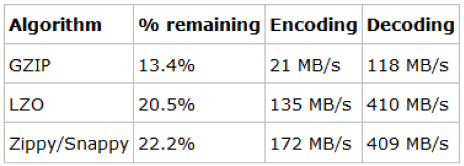

提升了多少效率可以从2方面回答，1）数据存储节约多少存储，2）任务执行消耗时间节约了多少，可以举个实际例子展开描述。

## 7.118 简要描述Spark写数据的流程？（☆☆☆☆☆） 不懂

1）RDD调用compute方法，进行指定分区的写入

2）CacheManager中调用BlockManager判断数据是否已经写入，如果未写，则写入

3）BlockManager中数据与其他节点同步

4）BlockManager根据存储级别写入指定的存储层

5）BlockManager向主节点汇报存储状态中

## 7.120 使用spark shell实现WordCount？（☆☆☆☆☆）

这个题目即考察了你对shell的掌握，又考察了你对scala的了解，还考察了你动手写代码的能力，是比较好的一道题（实际开发中，有些代码是必须要背下来的，烂熟于心，劣等的程序员就是百度+copy，是不可取的）

val conf = new SparkConf()

val sc = new SparkContext(conf)

val line = sc.textFile("xxxx.txt") line.flatMap(_.split(" ")).map((_,1)).reduceByKey(_+_). collect().foreach(println)

## 7.123 Spark读取hdfs上的文件，然后count有多少行的操作，你可以说说过程吗。那这个count是在内存中，还是磁盘中计算的呢？

1）从任务执行的角度分析执行过程

driver生成逻辑执行计划->driver生成物理执行计划->driver任务调度->executor任务执行 。

·四个阶段

逻辑执行计划-》成物理执行计划-》任务调度-》任务执行

·四个对象

driver-》DAGScheduler-》TaskScheduler-》Executor

·两种模式

任务解析、优化和提交单机模式-》任务执行分布式模式

2）计算过程发生在内存

## 7.125 Spark sql又为什么比hive快呢？（☆☆☆☆☆）

Spark SQL 比 Hive 快，是有一定条件的，而且不是 Spark SQL 的引擎比 Hive 的引擎快，相反，Hive 的 HQL 引擎还比 Spark SQL 的引擎更快。其实，关键还是在于 Spark 本身快。

消除了冗余的 HDFS 读写: Hadoop 每次 shuffle 操作后，必须写到磁盘，而 Spark 在 shuffle 后不一定落盘，可以 cache 到内存中

消除了冗余的 MapReduce 阶段: Hadoop 的 shuffle 操作一定连着完整的 MapReduce 操作，冗余繁琐。而 Spark 基于 RDD 提供了丰富的算子操作，且 reduce 操作产生 shuffle 数据，可以缓存在内存中。

JVM 的优化: Hadoop 每次 MapReduce 操作，启动一个 Task 便会启动一次 JVM，基于进程的操作。而 Spark 每次 MapReduce 操作是基于线程的，只在启动 Executor 时启动一次 JVM，内存的 Task 操作是在线程复用的

## 7.127 RDD算子里操作一个外部map比如往里面put数据，然后算子外再遍历map，会有什么问题吗？

频繁创建额外对象，容易oom。

## 7.131 怎么用spark做数据清洗 ---要知道

通过spark的RDD的转化。

## 7.132 spark怎么整合hive？

1）将hive的配置文件hive-site.xml复制到Spark conf目录下

2）根据hive的配置参数hive.metastore.uris的情况，采用不同的集成方式

a. jdbc方式：hive.metastore.uris没有给定配置值，为空(默认情况),SparkSQL通过hive配置的javax.jdo.option.XXX相关配置值直接连接metastore数据库直接获取hive表元数据, 需要将连接数据库的驱动添加到Spark应用的classpath中

b.metastore服务方式：hive.metastore.uris给定了具体的参数值,SparkSQL通过连接hive提供的metastore服务来获取hive表的元数据, 直接启动hive的metastore服务即可完成SparkSQL和Hive的集成:

3）使用metastore服务方式，对hive-site.xml进行配置

<property>

<name>hive.metastore.uris</name>

<value> trhift://mfg-hadoop:9083</value>

</property>

4）启动hive service metastore服务

bin/hive --service metastore &

5）启动spark-sql测试，执行 show databases命令，检查是不是和hive的数据库一样的。

## 7.133 spark读取数据，是怎么确定有多少Partition呢？ 

从2方面介绍和回答，一是说下partition是什么，二是说下partition如何建的。

1）spark中的partion是弹性分布式数据集RDD的最小单元，RDD是由分布在各个节点上的partion组成的。partion是指的spark在计算过程中，生成的数据在计算空间内最小单元，同一份数据（RDD）的partion大小不一，数量不定，是根据application里的算子和最初读入的数据分块数量决定的，这也是为什么叫"弹性分布式"数据集的原因之一。Partition不会根据文件的偏移量来截取的（比如有3个Partition，1个是头多少M的数据，1个是中间多少M的数据，1个是尾部多少M的数据），而是从一个原文件这个大的集合里根据某种计算规则抽取符合的数据来形成一个Partition的；

2）如何创建分区，有两种情况，创建 RDD 时和通过转换操作得到新 RDD 时。对于前者，在调用 textFile 和 parallelize 方法时候手动指定分区个数即可。例如 sc.parallelize(Array(1, 2, 3, 5, 6), 2) 指定创建得到的 RDD 分区个数为 2。如果没有指定，partition数等于block数，如果想指定直接调用 repartition 方法即可。实际上分区的个数是根据转换操作对应多个 RDD 之间的依赖关系来确定，窄依赖子 RDD 由父 RDD 分区个数决定，例如 map 操作，父 RDD 和子 RDD 分区个数一致；Shuffle 依赖则由分区器（Partitioner）决定，例如 groupByKey(new HashPartitioner(2)) 或者直接 groupByKey(2) 得到的新 RDD 分区个数等于 2。

## 7.141 sparkStreaming UpdateStateByKey底层是如何实现保存数据原来的状态的？--不懂

## 7.142 SparkStreaming 读取kafka数据的方式(receiver 和 direct)？ --前面有答案


## 7.143 SparkStreaming 读取kafka时如何保证实时数据不丢失的问题（☆☆☆）--要知道

问题分析：

这里问的是SparkStreaming整合kafka读取数据时数据不丢失问题

读取数据要不丢失可以启动wal预写日志，将接收的数据同步保存到hdfs

## 7.144 spark streming在实时处理时会发生什么故障，如何停止，解决（☆☆☆☆☆） ---要查一下资料

比如和Kafka整合时消息无序：

解决: 消息确认机制-------修改Kafka的ack参数，当ack=1时，master确认收到消息就算投递成功。ack=0时，不需要收到消息便算成功，高效不准确。sck=all，master和server都要受到消息才算成功，准确不高效。

## 7.144 spark streming输出很多小文件问题怎么解决？ 是在程序里解决的吗？（☆☆☆☆☆）

程序内部处理方式：

1，增加batch大小，也就是数据的批次时间变长。 不过会带来实时性变差的弊端

2，减少初始的分区数， rdd.coalesce()、rdd.rePartition()。 弊端就是每个分区的数据处 理压力变大

外部处理方式：

3，在spark streaming外启动定时任务来合并小文件, hadoop提供了工具类FileUtils，里 面有一个copyMerge()方法专门用来合并小文件。 这是最佳的方式

最后提一下如果采用Flink就不会产生这种问题。

## 7.144 spark streming怎么存数据到hdfs上？ 存一个文件有多大？（☆☆☆☆☆）

rdd.saveAsTextFile()

# 十 JVM、Java

## 10.1 垃圾回收算法分类

### 10.1.1 算法一：引用计数法。

这个方法是最经典点的一种方法。具体是对于对象设置一个引用计数器，每增加一个变量对它的引用，引用计数器就会加1，没减少一个变量的引用，引用计数器就会减1，只有当对象的引用计数器变成0时，该对象才会被回收。可见这个算法很简单，但是简单往往会存在很多问题，这里我列举最明显的两个问题。

一是采用这种方法后，每次在增加变量引用和减少引用时都要进行加法或减法操作，如果频繁操作对象的话，在一定程度上增加的系统的消耗。

二是这种方法无法处理循环引用的情况。再解释下什么是循环引用，假设有两个对象 A和B，A中引用了B对象，并且B中也引用了A对象，

那么这时两个对象的引用计数器都不为0，但是由于存在相互引用导致无法垃圾回收A和 B，导致内存泄漏。

### 10.1.2 算法二：标记清除法

这个方法是将垃圾回收分成了两个阶段：标记阶段和清除阶段。

在标记阶段，通过跟对象，标记所有从跟节点开始的可达的对象，那么未标记的对象就是未被引用的垃圾对象。

在清除阶段，清除掉所以的未被标记的对象。

这个方法的缺点是，垃圾回收后可能存在大量的磁盘碎片，准确的说是内存碎片。因为对象所占用的地址空间是固定的。对于这个算法还有改进的算法，就是我后面要说的算法三。

### 10.1.3 算法三：标记压缩清除法（Java中老年代采用）。

在算法二的基础上做了一个改进，可以说这个算法分为三个阶段：标记阶段，压缩阶段，清除阶段。标记阶段和清除阶段不变，只不过增加了一个压缩阶段，就是在做完标记阶段后，将这些标记过的对象集中放到一起，确定开始和结束地址，比如全部放到开始处，这样再去清除，将不会产生磁盘碎片。但是我们也要注意到几个问题，压缩阶段占用了系统的消耗，并且如果标记对象过多的话，损耗可能会很大，在标记对象相对较少的时候，效率较高。

### 10.1.4 算法四：复制算法（Java中新生代采用）。

核心思想是将内存空间分成两块，同一时刻只使用其中的一块，在垃圾回收时将正在使用的内存中的存活的对象复制到未使用的内存中，然后清除正在使用的内存块中所有的对象，然后把未使用的内存块变成正在使用的内存块，把原来使用的内存块变成未使用的内存块。很明显如果存活对象较多的话，算法效率会比较差，并且这样会使内存的空间折半，但是这种方法也不会产生内存碎片。

### 10.1.5 算法五：分代法（Java堆采用）。

主要思想是根据对象的生命周期长短特点将其进行分块，根据每块内存区间的特点，使用不同的回收算法，从而提高垃圾回收的效率。

比如Java虚拟机中的堆就采用了这种方法分成了新生代和老年代。然后对于不同的代采用不同的垃圾回收算法。

新生代使用了复制算法，老年代使用了标记压缩清除算法。

### 10.1.6 算法六：分区算法。

这种方法将整个空间划分成连续的不同的小区间，每个区间都独立使用，独立回收，好处是可以控制一次回收多少个小区间。

## 10.2 JAVA内存区域划分方法（☆☆☆☆☆）---面试真题

程序计数器：

> 用来存储执行哪条指令的，每个线程都有自己的独立程序计数器，在多线程切换工作时知道该从哪里执行

栈：

> 为执行java方法服务的，当执行方法时方法进栈，执行完方法弹栈

本地方法栈：

> 和栈的原理类似，但是不同于栈的是栈是为java方法准备的，而本地方法栈是为 native本地方法准备的

方法区：

> 在方法区中，存储了每个类的信息(包括类名，方法信息，属性信息)、静态变量、 常量等。
>
> 所以方法区里有个重要的概念：运行时常量池

堆：


### 10.2.1 程序计数器

程序计数器（Program Counter Register）是一块较小的内存空间，它的作用可以看做是当前线程所执行的字节码的行号指示器。在虚拟机的概念模型里（仅是概念模型，各种虚拟机可能会通过一些更高效的方式去实现），字节码解释器工作时就是通过改变这个计数器的值来选取下一条需要执行的字节码指令，分支、循环、跳转、异常处理、线程恢复等基础功能都需要依赖这个计数器来完成。

由于Java 虚拟机的多线程是通过线程轮流切换并分配处理器执行时间的方式来实现的，在任何一个确定的时刻，一个处理器（对于多核处理器来说是一个内核）只会执行一条线程中的指令。因此，为了线程切换后能恢复到正确的执行位置，每条线程都需要有一个独立的程序计数器，各条线程之间的计数器互不影响，独立存储，我们称这类内存区域为"线程私有"的内存。

如果线程正在执行的是一个Java 方法，这个计数器记录的是正在执行的虚拟机字节码指令的地址；如果正在执行的是Natvie 方法，这个计数器值则为空（Undefined）。此内存区域是唯一一个在Java 虚拟机规范中没有规定任何OutOfMemoryError 情况的区域。

### 10.2.2 Java 虚拟机栈

与程序计数器一样，Java 虚拟机栈（Java Virtual Machine Stacks）也是线程私有的，它的生命周期与线程相同。虚拟机栈描述的是Java 方法执行的内存模型：每个方法被执行的时候都会同时创建一个栈帧（Stack Frame ①）用于存储局部变量表、操作栈、动态链接、方法出口等信息。每一个方法被调用直至执行完成的过程，就对应着一个栈帧在虚拟机栈中从入栈到出栈的过程。

经常有人把Java 内存区分为堆内存（Heap）和栈内存（Stack），这种分法比较粗糙，Java 内存区域的划分实际上远比这复杂。这种划分方式的流行只能说明大多数程序员最关注的、与对象内存分配关系最密切的内存区域是这两块。其中所指的"堆"在后面会专门讲述，而所指的"栈"就是现在讲的虚拟机栈，或者说是虚拟机栈中的局部变量表部分。

局部变量表存放了编译期可知的各种基本数据类型（boolean、byte、char、short、int、float、long、double）、对象引用（reference 类型，它不等同于对象本身，根据不同的虚拟机实现，它可能是一个指向对象起始地址的引用指针，也可能指向一个代表对象的句柄或者其他与此对象相关的位置）和returnAddress 类型（指向了一条字节码指令的地址）。其中64 位长度的long 和double 类型的数据会占用2 个局部变量空间（Slot），其余的数据类型只占用1 个。局部变量表所需的内存空间在编译期间完成分配，当进入一个方法时，这个方法需要在帧中分配多大的局部变量空间是完全确定的，在方法运行期间不会改变局部变量表的大小。

在Java 虚拟机规范中，对这个区域规定了两种异常状况：如果线程请求的栈深度大于虚拟机所允许的深度，将抛出StackOverflowError 异常；如果虚拟机栈可以动态扩展（当前大部分的Java 虚拟机都可动态扩展，只不过Java 虚拟机规范中也允许固定长度的虚拟机栈），当扩展时无法申请到足够的内存时会抛出OutOfMemoryError 异常。

### 10.2.3 本地方法栈

本地方法栈（Native Method Stacks）与虚拟机栈所发挥的作用是非常相似的，其区别不过是虚拟机栈为虚拟机执行Java 方法（也就是字节码）服务，而本地方法栈则是为虚拟机使用到的Native 方法服务。虚拟机规范中对本地方法栈中的方法使用的语言、使用方式与数据结构并没有强制规定，因此具体的虚拟机可以自由实现它。甚至有的虚拟机（譬如Sun HotSpot 虚拟机）直接就把本地方法栈和虚拟机栈合二为一。与虚拟机栈一样，本地方法栈区域也会抛出StackOverflowError 和OutOfMemoryError异常。

### 10.2.4 Java 堆

对于大多数应用来说，Java 堆（Java Heap）是Java 虚拟机所管理的内存中最大的一块。Java 堆是被所有线程共享的一块内存区域，在虚拟机启动时创建。此内存区域的唯一目的就是存放对象实例，几乎所有的对象实例都在这里分配内存。这一点在Java 虚拟机规范中的描述是：所有的对象实例以及数组都要在堆上分配①，但是随着JIT 编译器的发展与逃逸分析技术的逐渐成熟，栈上分配、标量替换②优化技术将会导致一些微妙的变化发生，所有的对象都分配在堆上也渐渐变得不是那么"绝对"了。

Java 堆是垃圾收集器管理的主要区域，因此很多时候也被称做"GC 堆"（Garbage Collected Heap，幸好国内没翻译成"垃圾堆"）。如果从内存回收的角度看，由于现在收集器基本都是采用的分代收集算法，所以Java 堆中还可以细分为：新生代和老年代；

再细致一点的有Eden 空间、From Survivor 空间、To Survivor 空间等。如果从内存分配的角度看，线程共享的Java 堆中可能划分出多个线程私有的分配缓冲区（Thread Local Allocation Buffer，TLAB）。不过，无论如何划分，都与存放内容无关，无论哪个区域，存储的都仍然是对象实例，进一步划分的目的是为了更好地回收内存，或者更快地分配内存。在本章中，我们仅仅针对内存区域的作用进行讨论，Java 堆中的上述各个区域的分配和回收等细节将会是下一章的主题。

根据Java 虚拟机规范的规定，Java 堆可以处于物理上不连续的内存空间中，只要逻辑上是连续的即可，就像我们的磁盘空间一样。在实现时，既可以实现成固定大小的，也可以是可扩展的，不过当前主流的虚拟机都是按照可扩展来实现的（通过-Xmx和-Xms 控制）。如果在堆中没有内存完成实例分配，并且堆也无法再扩展时，将会抛出OutOfMemoryError 异常。

### 10.2.5 方法区

方法区（Method Area）与Java 堆一样，是各个线程共享的内存区域，它用于存储已被虚拟机加载的类信息、常量、静态变量、即时编译器编译后的代码等数据。虽然Java 虚拟机规范把方法区描述为堆的一个逻辑部分，但是它却有一个别名叫做Non-Heap（非堆），目的应该是与Java 堆区分开来。

对于习惯在HotSpot 虚拟机上开发和部署程序的开发者来说，很多人愿意把方法区称为"永久代"（Permanent Generation），本质上两者并不等价，仅仅是因为HotSpot 虚拟机的设计团队选择把GC 分代收集扩展至方法区，或者说使用永久代来实现方法区而已。对于其他虚拟机（如BEA JRockit、IBM J9 等）来说是不存在永久代的概念的。即使是HotSpot 虚拟机本身，根据官方发布的路线图信息，现在也有放弃永久代并"搬家"至Native Memory 来实现方法区的规划了。

Java 虚拟机规范对这个区域的限制非常宽松，除了和Java 堆一样不需要连续的内存和可以选择固定大小或者可扩展外，还可以选择不实现垃圾收集。相对而言，垃圾收集行为在这个区域是比较少出现的，但并非数据进入了方法区就如永久代的名字一样"永久"存在了。这个区域的内存回收目标主要是针对常量池的回收和对类型的卸载，一般来说这个区域的回收"成绩"比较难以令人满意，尤其是类型的卸载，条件相当苛刻，但是这部分区域的回收确实是有必要的。在Sun 公司的BUG 列表中，曾出现过的若干个严重的BUG 就是由于低版本的HotSpot 虚拟机对此区域未完全回收而导致内存泄漏。根据Java 虚拟机规范的规定，当方法区无法满足内存分配需求时，将抛出OutOfMemoryError 异常。

### 10.2.6 运行时常量池

运行时常量池（Runtime Constant Pool）是方法区的一部分。Class 文件中除了有类的版本、字段、方法、接口等描述等信息外，还有一项信息是常量池（Constant Pool Table），用于存放编译期生成的各种字面量和符号引用，这部分内容将在类加载后存放到方法区的运行时常量池中。

Java 虚拟机对Class 文件的每一部分（自然也包括常量池）的格式都有严格的规定，每一个字节用于存储哪种数据都必须符合规范上的要求，这样才会被虚拟机认可、装载和执行。但对于运行时常量池，Java 虚拟机规范没有做任何细节的要求，不同的提供商实现的虚拟机可以按照自己的需要来实现这个内存区域。不过，一般来说，除了保存Class 文件中描述的符号引用外，还会把翻译出来的直接引用也存储在运行时常量池中①。

运行时常量池相对于Class 文件常量池的另外一个重要特征是具备动态性，Java 语言并不要求常量一定只能在编译期产生，也就是并非预置入Class 文件中常量池的内容才能进入方法区运行时常量池，运行期间也可能将新的常量放入池中，这种特性被开发人员利用得比较多的便是String 类的intern() 方法。既然运行时常量池是方法区的一部分，自然会受到方法区内存的限制，当常量池无法再申请到内存时会抛出OutOfMemoryError 异常

### 10.2.7 直接内存

直接内存（Direct Memory）并不是虚拟机运行时数据区的一部分，也不是Java虚拟机规范中定义的内存区域，但是这部分内存也被频繁地使用，而且也可能导致OutOfMemoryError 异常出现，所以我们放到这里一起讲解。

在JDK 1.4 中新加入了NIO（New Input/Output）类，引入了一种基于通道（Channel）与缓冲区（Buffer）的I/O 方式，它可以使用Native 函数库直接分配堆外内存，然后通过一个存储在Java 堆里面的DirectByteBuffer 对象作为这块内存的引用进行操作。这样能在一些场景中显著提高性能，因为避免了在Java 堆和Native 堆中来回复制数据。

显然，本机直接内存的分配不会受到Java 堆大小的限制，但是，既然是内存，则肯定还是会受到本机总内存（包括RAM 及SWAP 区或者分页文件）的大小及处理器寻址空间的限制。服务器管理员配置虚拟机参数时，一般会根据实际内存设置-Xmx等参数信息，但经常会忽略掉直接内存，使得各个内存区域的总和大于物理内存限制（包括物理上的和操作系统级的限制），从而导致动态扩展时出现OutOfMemoryError异常。

逻辑内存模型我们已经看到了，那当我们建立一个对象的时候是怎么进行访问的呢？在Java 语言中，对象访问是如何进行的？对象访问在Java 语言中无处不在，是最普通的程序行为，但即使是最简单的访问，也会却涉及Java 栈、Java 堆、方法区这三个最重要内存区域之间的关联关系，如下面的这句代码：

Object obj = new Object();

假设这句代码出现在方法体中，那"Object obj"这部分的语义将会反映到Java 栈的本地变量表中，作为一个reference 类型数据出现。而"new Object()"这部分的语义将会反映到Java 堆中，形成一块存储了Object 类型所有实例数据值（Instance Data，对象中各个实例字段的数据）的结构化内存，根据具体类型以及虚拟机实现的对象内存布局（Object Memory Layout）的不同，这块内存的长度是不固定的。另外，在Java 堆中还必须包含能查找到此对象类型数据（如对象类型、父类、实现的接口、方法等）的地址信息，这些类型数据则存储在方法区中。

由于reference 类型在Java 虚拟机规范里面只规定了一个指向对象的引用，并没有定义这个引用应该通过哪种方式去定位，以及访问到Java 堆中的对象的具体位置，因此不同虚拟机实现的对象访问方式会有所不同，主流的访问方式有两种：使用句柄和直接指针。

## 10.3 内存大小的分配方法

•Young generation -->新生代

•Tenured / Old Generation -->老年代

•Perm Area -->永久代

年轻代:

所有新生成的对象首先都是放在年轻代的。年轻代的目标就是尽可能快速的收集掉那些生命周期短的对象。年轻代分三个区。一个Eden区，两个 Survivor区(一般而言)。大部分对象在Eden区中生成。当Eden区满时，还存活的对象将被复制到Survivor区（两个中的一个），当这个 Survivor区满时，此区的存活对象将被复制到另外一个Survivor区，当这个Survivor去也满了的时候，从第一个Survivor区复制过来的并且此时还存活的对象，将被复制"年老区(Tenured)"。需要注意，Survivor的两个区是对称的，没先后关系，所以同一个区中可能同时存在从Eden复制过来对象，和从前一个Survivor复制过来的对象，而复制到年老区的只有从第一个Survivor去过来的对象。而且，Survivor区总有一个是空的。同时，根据程序需要，Survivor区是可以配置为多个的（多于两个），这样可以增加对象在年轻代中的存在时间，减少被放到年老代的可能。

年老代:

在年轻代中经历了N次垃圾回收后仍然存活的对象，就会被放到年老代中。因此，可以认为年老代中存放的都是一些生命周期较长的对象。

持久代：

用于存放静态文件，如今Java类、方法等。持久代对垃圾回收没有显著影响，但是有些应用可能动态生成或者调用一些class，例如Hibernate 等，在这种时候需要设置一个比较大的持久代空间来存放这些运行过程中新增的类。持久代大小通过-XX:MaxPermSize=<N>进行设置。

Java中对象都在堆上创建。为了GC，堆内存分为三个部分，也可以说三代，分别称为新生代，老年代和永久代。其中新生代又进一步分为Eden区，Survivor 1区和Survivor 2区(如下图)。新创建的对象会分配在Eden区,在经历一次Minor GC后会被移到Survivor 1区，再经历一次Minor GC后会被移到Survivor 2区，直到升至老年代,需要注意的是，一些大对象(长字符串或数组)可能会直接存放到老年代。

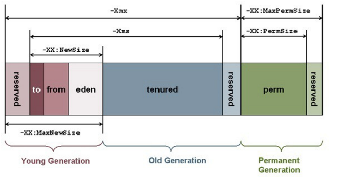

## 10.4 JVM GC介绍

在Java中，对象实例都是在堆上创建。一些类信息，常量，静态变量等存储在方法区。堆和方法区都是线程共享的。

GC机制是由JVM提供，用来清理需要清除的对象，回收堆内存。

GC机制将Java程序员从内存管理中解放了出来，可以更关注于业务逻辑。

在Java中，GC是由一个被称为垃圾回收器的守护线程执行的。

在从内存回收一个对象之前会调用对象的finalize()方法。

作为一个Java开发者不能强制JVM执行GC；GC的触发由JVM依据堆内存的大小来决定。

System.gc()和Runtime.gc()会向JVM发送执行GC的请求，但是JVM不保证一定会执行GC。

如果堆没有内存创建新的对象了，会抛出OutOfMemoryError。

## 10.5 GC针对什么对象 ---对象的引用为null时需要回收对象

了解GC机制的第一步就是理解什么样的对象会被回收。当一个对象通过一系列根对象(比如：静态属性引用的常量)都不可达时就会被回收。简而言之，当一个对象的所有引用都为null。循环依赖不算做引用，如果对象A有一个指向对象B的引用，对象B也有一个指向对象A的引用，除此之外，它们没有其他引用，那么对象A和对象B都、需要被回收(如下图,ObjA和ObjB需要被回收)。

## 10.6 Java常用的垃圾回收器配置

Java提供多种类型的垃圾回收器。JVM中的垃圾收集一般都采用"分代收集"，不同的堆内存区域采用不同的收集算法，主要目的就是为了增加吞吐量或降低停顿时间。

Serial收集器：新生代收集器，使用复制算法，使用一个线程进行GC，串行，其它工作线程暂停。

ParNew收集器：新生代收集器，使用复制算法，Serial收集器的多线程版，用多个线程进行GC，并行，其它工作线程暂停。使用-XX:+UseParNewGC开关来控制使用ParNew+Serial Old收集器组合收集内存；使用-XX:ParallelGCThreads来设置执行内存回收的线程数。

Parallel Scavenge 收集器：吞吐量优先的垃圾回收器，作用在新生代，使用复制算法，关注CPU吞吐量，即运行用户代码的时间/总时间。使用-XX:+UseParallelGC开关控制使用Parallel Scavenge+Serial Old收集器组合回收垃圾。

Serial Old收集器：老年代收集器，单线程收集器，串行，使用标记整理算法，使用单线程进行GC，其它工作线程暂停。

Parallel Old收集器：吞吐量优先的垃圾回收器，作用在老年代，多线程，并行，多线程机制与Parallel Scavenge差不错，使用标记整理算法，在Parallel Old执行时，仍然需要暂停其它线程。

CMS（Concurrent Mark Sweep）收集器：老年代收集器，致力于获取最短回收停顿时间（即缩短垃圾回收的时间），使用标记清除算法，多线程，优点是并发收集（用户线程可以和GC线程同时工作），停顿小。使用-XX:+UseConcMarkSweepGC进行ParNew+CMS+Serial Old进行内存回收，优先使用ParNew+CMS（原因见Full GC和并发垃圾回收一节），当用户线程内存不足时，采用备用方案Serial Old收集。

## 10.7 Java 服务死锁问题排查

当多条线程以不同的顺序抢占同步资源的时候，就有可能发生死锁。

如下图所示，线程1持有锁对象A而希望获得锁对象B；另一方面，线程2持有锁对象B而希望获得锁对象A。并且这两个线程的操作是交错执行的，因此它们会发生死锁。

总结：死锁常见于，线程在锁定对象还没释放时，又需要锁定另一个对象，并且此时该对象可能被另一个线程锁定。这种时候很容易导致死锁。因此在开发时需要慎重使用锁，尤其是需要注意尽量不要在锁里又加锁。

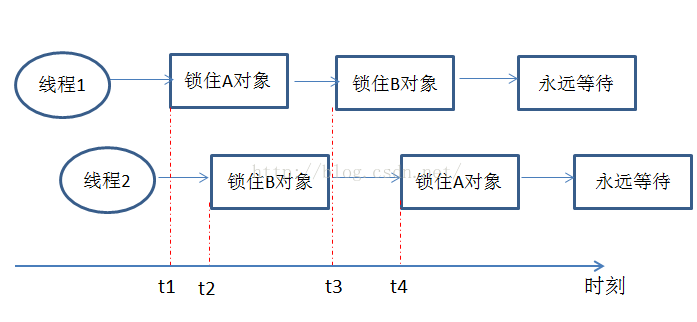

当发生的死锁后，JDK自带了两个工具(jstack和JConsole)，可以用来监测分析死锁的发生原因。

jstack工具用于生于生成虚拟机当前时刻的线程快照。线程快照就是当前虚拟机每一条线程正在执行的方法堆栈的集合，生成快照可以用于定位诸如线程死锁、死循环等问题。

Java 应用程序性能和跟踪 Java 中的代码。

下面以一个死锁例子来说明如何使用这两个工具来分析线程死锁。死锁示例代码如下：

+--------------------------------------------------------------------+
| class SynThread implements Runnable{                               |
|                                                                    |
|     int a ,b;                                                      |
|                                                                    |
|     public SynThread(int a,int b){                                 |
|                                                                    |
|         this.a=a;                                                  |
|                                                                    |
|          this.b=b;                                                 |
|                                                                    |
|      }                                                             |
|                                                                    |
|     public void run() {                                            |
|                                                                    |
|         synchronized (Integer.valueOf(a)) {//必须用valueOf()方法   |
|                                                                    |
|             synchronized (Integer.valueOf(b)) {                    |
|                                                                    |
|                  System.err.println("a+b=="+(a+b));              |
|                                                                    |
|             }                                                      |
|                                                                    |
|          }                                                         |
|                                                                    |
|     }                                                              |
|                                                                    |
| }                                                                  |
|                                                                    |
| public class entry {                                               |
|                                                                    |
|   public static void main(String[] args) {                       |
|                                                                    |
|          //循环主要是为了加大死锁概率                              |
|                                                                    |
|         for(int i=0;i<100;i++){                                   |
|                                                                    |
|             new Thread(new SynThread(1,2)).start();                |
|                                                                    |
|             new Thread(new SynThread(2,1)).start();                |
|                                                                    |
|          }                                                         |
|                                                                    |
|      }                                                             |
|                                                                    |
| }                                                                  |
+--------------------------------------------------------------------+

说明：以上代码有可能发生死锁，原因是Integer.valueOf()方法作了缓存优化，对[-128,127]之间的数字会被缓存。也就是说，循环代码中一共只创建了两个不同的对象。假设在两个synchronized块之间发生了线程切换，那就有可能造成，线程A等待被线程B持有Integer.valueOf(1)对象，线程B等待被线程A持有Integer.valueOf(2)对象，结果出现了死锁。（可能需要多次执行直到程序出现阻塞现象）

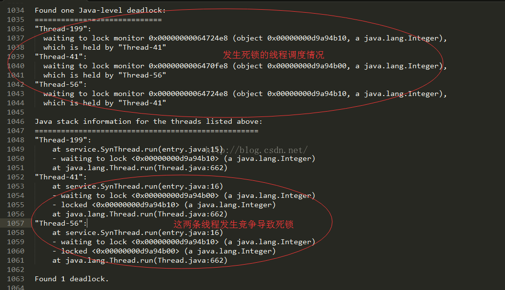

直接从堆栈信息不能直观得到结论，没关系，我们可以画图理清线程间的调度情况（出现闭合环路，发生死锁）

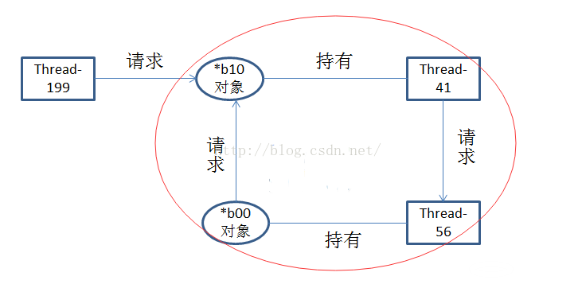

## 10.8 JVM 之排查进程cpu使用异常

可使用如下命令查看程序中各个线程CPU占用情况

top -H -p pid

另一种方法通过pstree pid查到pid下所有的thread 然后top查看，按下H找到对应的线程即可。

## 10.9 JVM之查看java内存情况命令

jinfo:可以输出并修改运行时的java 进程的opts。

jps:与unix上的ps类似，用来显示本地的java进程，可以查看本地运行着几个java程序，并显示他们的进程号。

jstat:一个极强的监视VM内存工具。可以用来监视VM内存内的各种堆和非堆的大小及其内存使用量。

jmap:打印出某个java进程（使用pid）内存内的所有'对象'的情况（如：产生那些对象，及其数量）。

jconsole:一个java GUI监视工具，可以以图表化的形式显示各种数据。并可通过远程连接监视远程的服务器VM。

详细：在使用这些工具前，先用JPS命令获取当前的每个JVM进程号，然后选择要查看的JVM。

jstat工具特别强大，有众多的可选项，详细查看堆内各个部分的使用量，以及加载类的数量。使用时，需加上查看进程的进程id，和所选参数。以下详细介绍各个参数的意义。

jstat -class pid:显示加载class的数量，及所占空间等信息。

jstat -compiler pid:显示VM实时编译的数量等信息。

jstat -gc pid:可以显示gc的信息，查看gc的次数，及时间。其中最后五项，分别是young gc的次数，young gc的时间，full gc的次数，full gc的时间，gc的总时间。

jstat -gccapacity:可以显示，VM内存中三代（young,old,perm）对象的使用和占用大小，如：PGCMN显示的是最小perm的内存使用量，PGCMX显示的是perm的内存最大使用量，PGC是当前新生成的perm内存占用量，PC是但前perm内存占用量。其他的可以根据这个类推， OC是old内纯的占用量。

jstat -gcnew pid:new对象的信息。

jstat -gcnewcapacity pid:new对象的信息及其占用量。

jstat -gcold pid:old对象的信息。

jstat -gcoldcapacity pid:old对象的信息及其占用量。

jstat -gcpermcapacity pid: perm对象的信息及其占用量。

jstat -util pid:统计gc信息统计。

jstat -printcompilation pid:当前VM执行的信息。

除了以上一个参数外，还可以同时加上 两个数字，如：jstat -printcompilation 3024 250 6是每250毫秒打印一次，一共打印6次，还可以加上-h3每三行显示一下标题。

jmap是一个可以输出所有内存中对象的工具，甚至可以将VM 中的heap，以二进制输出成文本。

命令：jmap -dump:format=b,file=heap.bin <pid>

file：保存路径及文件名

pid：进程编号

•jmap -histo:live pid| less :堆中活动的对象以及大小

•jmap -heap pid : 查看堆的使用状况信息

jinfo:的用处比较简单，就是能输出并修改运行时的java进程的运行参数。用法是jinfo -opt pid 如：查看2788的MaxPerm大小可以用 jinfo -flag MaxPermSize 2788。

jconsole是一个用java写的GUI程序，用来监控VM，并可监控远程的VM，非常易用，而且功能非常强。使用方法：命令行里打 jconsole，选则进程就可以了。

JConsole中关于内存分区的说明。

Eden Space (heap)： 内存最初从这个线程池分配给大部分对象。

Survivor Space (heap)：用于保存在eden space内存池中经过垃圾回收后没有被回收的对象。

Tenured Generation (heap)：用于保持已经在 survivor space内存池中存在了一段时间的对象。

Permanent Generation (non-heap): 保存虚拟机自己的静态(refective)数据，例如类（class）和方法（method）对象。Java虚拟机共享这些类数据。这个区域被分割为只读的和只写的，

Code Cache (non-heap):HotSpot Java虚拟机包括一个用于编译和保存本地代码（native code）的内存，叫做"代码缓存区"（code cache）

•jstack ( 查看jvm线程运行状态，是否有死锁现象等等信息) : jstack pid : thread dump

•jstat -gcutil pid 1000 100 : 1000ms统计一次gc情况统计100次；

## 10.10 如果写了JVM调优：堆内存溢出如何查看解决，用的那些命令工具；CMS和G1有什么不同？

## 10.11 说一下你了解的JVM 模型 算法 为什么要使用复制算法(优势,劣势) 怎么查看full gc日志出现的问题 什么时候发生full Gc 栈存储索引的大小 如何查看当前进程的GC。

## 10.12 full GC和old GC区别

## 10.13 JAVA支持的数据类型有哪些？什么是自动拆装箱？

八种基本数据类型： byte,short,int,long,float,double,char,boolean

引用类型：包括String，类，接口，数组

自动装箱： 基本数据类型转化成引用数据类型，比如Integer i = 1；

## 10.14 Volatile等线程安全操作的关键字的理解个使用？ （☆☆☆☆面试真题）

Volatile 中文解释：易变得，不稳定的。 在java中用该关键字修饰变量表示变量是同步的，是共享的。 也就是所有线程都可以修改它并将值更新到最新状态，每次获取该变量的值时都是最新的

## 10.15 创建线程有几种不同的方式？你喜欢哪一种？为什么？启动线程调用什么方法？

创建线程的三种方式：

继承Thread类、

实现Runnable接口、

实现Callable接口。

## 10.16 什么是死锁(deadlock),如何确保N个线程可以访问N个资源同时又不导致死锁？

死锁产生的四个条件：

互斥请求：同一时间段只能有一个线程获取资源锁，其他的需要等待

不剥夺条件：在第一个线程获取到资源锁，没有运行结束的时候，其他线程不能强行剥夺资 源锁

请求与保持条件：在线程获得了第一把资源锁的时候，保持自身资源锁并请求另外一个资源 锁

循环与等待条件：存在进程循环请求资源锁，自身获得的资源锁被其他线程请求

破坏死锁只需要破坏掉其中的任何一个条件，最简单的是破坏循环。通过wait()，notify(),notifyAll()等方法控制线程对资源锁的获取与释放

## 10.17 GC算法有哪些、垃圾回收器有哪些、如何调优JVM？

## 10.18 判断下列表达式是否相等

String a = "abc";

String b = "abc";

String c = new String("abc");

String d = "ab" + "c";

## 10.19 Java线程的理解

## 10.20 对池的了解（线程池、数据库连接池），Java线程池是怎么实现的，Java线程池都有哪些组件，具体作用是什么

池的理解：

就是提前准备好一些资源，不需要频繁创建销毁资源，而是直接从池里取用完放回池里。

java线程池怎么实现：

通过new ThreadPollExecutor（）构造一个。 java额外提供了四种构造线程池的方式。

## 7.137 java自带有哪几种线程池。（☆☆☆☆☆）

1）newCachedThreadPool ---可缓存

创建一个可缓存线程池，如果线程池长度超过处理需要，可灵活回收空闲线程，若无可回收，则新建线程。这种类型的线程池特点是：

 工作线程的创建数量几乎没有限制(其实也有限制的,数目为Interger. MAX_VALUE), 这样可灵活的往线程池中添加线程。

 如果长时间没有往线程池中提交任务，即如果工作线程空闲了指定的时间(默认为1分钟)，则该工作线程将自动终止。终止后，如果你又提交了新的任务，则线程池重新创建一个工作线程。

 在使用CachedThreadPool时，一定要注意控制任务的数量，否则，由于大量线程同时运行，很有会造成系统瘫痪。

2）newFixedThreadPool ---指定数量

创建一个指定工作线程数量的线程池。每当提交一个任务就创建一个工作线程，如果工作线程数量达到线程池初始的最大数，则将提交的任务存入到池队列中。FixedThreadPool是一个典型且优秀的线程池，它具有线程池提高程序效率和节省创建线程时所耗的开销的优点。但是，在线程池空闲时，即线程池中没有可运行任务时，它不会释放工作线程，还会占用一定的系统资源。

3）newSingleThreadExecutor --单线程

创建一个单线程化的Executor，即只创建唯一的工作者线程来执行任务，它只会用唯一的工作线程来执行任务，保证所有任务按照指定顺序(FIFO, LIFO, 优先级)执行。如果这个线程异常结束，会有另一个取代它，保证顺序执行。单工作线程最大的特点是可保证顺序地执行各个任务，并且在任意给定的时间不会有多个线程是活动的。

4）newScheduleThreadPool --定长定时

创建一个定长的线程池，而且支持定时的以及周期性的任务执行，支持定时及周期性任务执行。延迟3秒执行。

## 10.21 编程简单实现一个阻塞队列？

## 10.22 Java的NIO是否了解 --不懂

## 10.23 Java中的数据结构，ArrayList和LinkedList的区别，ArrayList为什么查询快（为什么用数组就快）、LinkedList为什么增删快，哪些Map是线程安全的？

## 10.23 hashmap hashtable currentHashMap的使用区别

hashmap hashtable 的醉的的区别在于hashtable 是线程安全的，而hashmap 不是线程安全的，currentHashMap也是线程安全的。

     ConcurrentHashMap是使用了锁分段技术技术来保证线程安全的。所分段的技术是：讲数据分成一段一段的储存，给每一段的数据添加一把锁，当线程访问一个数据时，其他的数据可以被访问。

## 10.24 Jdk1.7hashmap怎么设计的，为什么引入红黑树？链表的查找方式和红黑树的查找方式有什么不同？

# 十一 基础算法、数据结构、设计模式

## 11.1 快速排序算法Java实现 --- 知道原理思路就行

### 11.1.1 算法概念。

快速排序（Quicksort）是对冒泡排序的一种改进。

### 11.1.2 算法思想。

通过一趟排序将要排序的数据分割成独立的两部分，其中一部分的所有数据都比另外一部分的所有数据都要小，然后再按此方法对这两部分数据分别进行快速排序，整个排序过程可以递归进行，以此达到整个数据变成有序序列。

### 11.1.3 实现思路。

①以第一个关键字 K 1 为控制字，将 [K 1 ,K 2 ,...,K n ] 分成两个子区，使左区所有关键字小于等于 K 1 ，右区所有关键字大于等于 K 1 ，最后控制字居两个子区中间的适当位置。在子区内数据尚处于无序状态。

②把左区作为一个整体，用①的步骤进行处理，右区进行相同的处理。（即递归）

③重复第①、②步，直到左区处理完毕。

### 11.1.4 代码实现（递归方式）

+---------------------------------------------------------+
| static void quicksort(int n[], int left, int right) { |
|                                                         |
| int dp;                                                 |
|                                                         |
| if (left < right) {                                    |
|                                                         |
| dp = partition(n, left, right);                         |
|                                                         |
| quicksort(n, left, dp - 1);                             |
|                                                         |
| quicksort(n, dp + 1, right);                            |
|                                                         |
| }                                                       |
|                                                         |
| }                                                       |
|                                                         |
| static int partition(int n[], int left, int right) {  |
|                                                         |
| int pivot = n[left];                                  |
|                                                         |
| while (left < right) {                                 |
|                                                         |
| while (left < right && n[right] >= pivot)           |
|                                                         |
| right--;                                               |
|                                                         |
| if (left < right)                                      |
|                                                         |
| n[left++] = n[right];                               |
|                                                         |
| while (left < right && n[left] <= pivot)            |
|                                                         |
| left++;                                                 |
|                                                         |
| if (left < right)                                      |
|                                                         |
| n[right--] = n[left];                              |
|                                                         |
| }                                                       |
|                                                         |
| n[left] = pivot;                                      |
|                                                         |
| return left;                                            |
|                                                         |
| }                                                       |
+---------------------------------------------------------+

### 11.1.5 代码实现（非递归方式）

+-----------------------------------------------------------------+
| package sort.algorithm;                                         |
|                                                                 |
| import java.util.Stack;                                         |
|                                                                 |
| //快速排序的非递归实现，利用系统的栈stack                       |
|                                                                 |
| public class QuickSortNonRecursion {                            |
|                                                                 |
| public static void main(String[] args) {                      |
|                                                                 |
| QuickSortNonRecursion qsnr = new QuickSortNonRecursion();       |
|                                                                 |
| int[] array = {0, 2, 11, 121, 18, 99, 3, 5, 101, 22, 9, 100}; |
|                                                                 |
| qsnr.quicksort(array);                                          |
|                                                                 |
| for (int i : array) {                                           |
|                                                                 |
| System.out.print(i + " ");                                    |
|                                                                 |
| }                                                               |
|                                                                 |
| }                                                               |
|                                                                 |
| public void quicksort(int[] array) {                          |
|                                                                 |
| if (array == null || array.length == 1) return;               |
|                                                                 |
| //存放开始与结束索引                                            |
|                                                                 |
| Stack<Integer> s = new Stack<Integer>();                    |
|                                                                 |
| //压栈                                                          |
|                                                                 |
| s.push(0);                                                      |
|                                                                 |
| s.push(array.length - 1);                                       |
|                                                                 |
| //利用循环里实现                                                |
|                                                                 |
| while (!s.empty()) {                                            |
|                                                                 |
| int right = s.pop();                                            |
|                                                                 |
| int left = s.pop();                                             |
|                                                                 |
| //如果最大索引小于等于左边索引，说明结束了                      |
|                                                                 |
| if (right <= left) continue;                                   |
|                                                                 |
| int i = partition(array, left, right);                          |
|                                                                 |
| if (left < i - 1) {                                            |
|                                                                 |
| s.push(left);                                                   |
|                                                                 |
| s.push(i - 1);                                                  |
|                                                                 |
| }                                                               |
|                                                                 |
| if (i + 1 < right) {                                           |
|                                                                 |
| s.push(i+1);                                                    |
|                                                                 |
| s.push(right);                                                  |
|                                                                 |
| }                                                               |
|                                                                 |
| }                                                               |
|                                                                 |
| }                                                               |
|                                                                 |
| //找到轴心，进行交换                                            |
|                                                                 |
| public int partition (int[] data, int first, int end)         |
|                                                                 |
| {                                                               |
|                                                                 |
| int temp;                                                       |
|                                                                 |
| int i=first,j=end;                                              |
|                                                                 |
| if(first<end)                                                  |
|                                                                 |
| {                                                               |
|                                                                 |
| temp=data[i];                                                 |
|                                                                 |
| //当i=j的时候，则说明扫描完成了                                 |
|                                                                 |
| while(i<j)                                                     |
|                                                                 |
| {                                                               |
|                                                                 |
| //从右边向左边扫描找到一个小于temp的元素                        |
|                                                                 |
| while(j>i&&data[j]>temp)j--;                               |
|                                                                 |
| if(i<j)                                                        |
|                                                                 |
| {                                                               |
|                                                                 |
| //将该元素赋值给temp                                            |
|                                                                 |
| data[i]=data[j];                                            |
|                                                                 |
| //赋值后就应该将i+1指向下一个序号                               |
|                                                                 |
| i++;                                                            |
|                                                                 |
| }                                                               |
|                                                                 |
| //然后从左边向右边开始扫描，找到一个大于temp的元素              |
|                                                                 |
| while(i<j&&temp>data[i])i++;                                |
|                                                                 |
| if(i<j)                                                        |
|                                                                 |
| {                                                               |
|                                                                 |
| //将该元素赋值给temp                                            |
|                                                                 |
| data[j]=data[i];                                            |
|                                                                 |
| //赋值后就应该将j-1指向前一个序号                               |
|                                                                 |
| j--;                                                           |
|                                                                 |
| }                                                               |
|                                                                 |
| }                                                               |
|                                                                 |
| //将轴数据放在i位置中                                           |
|                                                                 |
| data[i]=temp;                                                 |
|                                                                 |
| }                                                               |
|                                                                 |
| return i;                                                       |
|                                                                 |
| }                                                               |
|                                                                 |
| }                                                               |
+-----------------------------------------------------------------+

## 11.2 二分查找算法之JAVA实现 ---知道思路就行

### 11.2.1 算法概念。

二分查找算法也称为折半搜索、二分搜索，是一种在有序数组中查找某一特定元素的搜索算法。请注意这种算法是建立在有序数组基础上的。

### 11.2.2 算法思想。

①搜素过程从数组的中间元素开始，如果中间元素正好是要查找的元素，则搜素过程结束；

②如果某一特定元素大于或者小于中间元素，则在数组大于或小于中间元素的那一半中查找，而且跟开始一样从中间元素开始比较。

③如果在某一步骤数组为空，则代表找不到。

这种搜索算法每一次比较都使搜索范围缩小一半。

### 11.2.3 实现思路。

①找出位于数组中间的值，并存放在一个变量中（为了下面的说明，变量暂时命名为temp）；

②需要找到的key和temp进行比较；

③如果key值大于temp，则把数组中间位置作为下一次计算的起点；重复① ②。

④如果key值小于temp，则把数组中间位置作为下一次计算的终点；重复① ② ③。

⑤如果key值等于temp，则返回数组下标，完成查找。

### 11.2.4 实现代码。

+-----------------------------------------------------------------------------------------------------------------------+
| /**                                                                                                                 |
|                                                                                                                       |
| * @param <E>                                                                                                      |
|                                                                                                                       |
| * @param array 需要查找的有序数组                                                                                   |
|                                                                                                                       |
| * @param from 起始下标                                                                                              |
|                                                                                                                       |
| * @param to 终止下标                                                                                                |
|                                                                                                                       |
| * @param key 需要查找的关键字                                                                                       |
|                                                                                                                       |
| * @return                                                                                                           |
|                                                                                                                       |
| * @throws Exception                                                                                                 |
|                                                                                                                       |
| */                                                                                                                   |
|                                                                                                                       |
| public static <E extends Comparable<E>> int binarySearch(E[] array, int from, int to, E key) throws Exception { |
|                                                                                                                       |
| if (from < 0 || to < 0) {                                                                                         |
|                                                                                                                       |
| throw new IllegalArgumentException("params from & length must larger than 0 .");                                    |
|                                                                                                                       |
| }                                                                                                                     |
|                                                                                                                       |
| if (from <= to) {                                                                                                    |
|                                                                                                                       |
| int middle = (from >>> 1) + (to >>> 1); // 右移即除2                                                            |
|                                                                                                                       |
| E temp = array[middle];                                                                                             |
|                                                                                                                       |
| if (temp.compareTo(key) > 0) {                                                                                       |
|                                                                                                                       |
| to = middle - 1;                                                                                                      |
|                                                                                                                       |
| } else if (temp.compareTo(key) < 0) {                                                                                |
|                                                                                                                       |
| from = middle + 1;                                                                                                    |
|                                                                                                                       |
| } else {                                                                                                              |
|                                                                                                                       |
| return middle;                                                                                                        |
|                                                                                                                       |
| }                                                                                                                     |
|                                                                                                                       |
| }                                                                                                                     |
|                                                                                                                       |
| return binarySearch(array, from, to, key);                                                                            |
|                                                                                                                       |
| }                                                                                                                     |
+-----------------------------------------------------------------------------------------------------------------------+

## 11.3 二叉树之Java实现 -- 不懂

### 11.3.1 二叉树概念

二叉树是一种非常重要的数据结构，它同时具有数组和链表各自的特点：它可以像数组一样快速查找，也可以像链表一样快速添加。但是他也有自己的缺点：删除操作复杂。

二叉树：是每个结点最多有两个子树的有序树，在使用二叉树的时候，数据并不是随便插入到节点中的，一个节点的左子节点的关键值必须小于此节点，右子节点的关键值必须大于或者是等于此节点，所以又称二叉查找树、二叉排序树、二叉搜索树。

完全二叉树：若设二叉树的高度为h，除第 h 层外，其它各层 (1～h-1) 的结点数都达到最大个数，第h层有叶子结点，并且叶子结点都是从左到右依次排布，这就是完全二叉树。

满二叉树------除了叶结点外每一个结点都有左右子叶且叶子结点都处在最底层的二叉树。

深度------二叉树的层数，就是深度。

### 11.3.2 二叉树的特点：

1）树执行查找、删除、插入的时间复杂度都是O(logN)

2）遍历二叉树的方法包括前序、中序、后序

3）非平衡树指的是根的左右两边的子节点的数量不一致

4） 在非空二叉树中，第i层的结点总数不超过 , i>=1；

5）深度为h的二叉树最多有个结点(h>=1)，最少有h个结点；

6）对于任意一棵二叉树，如果其叶结点数为N0，而度数为2的结点总数为N2，则N0=N2+1；

### 11.3.3 二叉树的Java代码实现

首先是树的节点的定义，下面的代码中使用的是最简单的int基本数据类型作为节点的数据，如果要使用节点带有更加复杂的数据类型，换成对应的对象即可。

+----------------------------------------------------------------------+
| public class TreeNode {                                              |
|                                                                      |
| // 左节点                                                            |
|                                                                      |
| private TreeNode lefTreeNode;                                        |
|                                                                      |
| // 右节点                                                            |
|                                                                      |
| private TreeNode rightNode;                                          |
|                                                                      |
| // 数据                                                              |
|                                                                      |
| private int value;                                                   |
|                                                                      |
| private boolean isDelete;                                            |
|                                                                      |
| public TreeNode getLefTreeNode() {                                   |
|                                                                      |
| return lefTreeNode;                                                  |
|                                                                      |
| }                                                                    |
|                                                                      |
| public void setLefTreeNode(TreeNode lefTreeNode) {                   |
|                                                                      |
| this.lefTreeNode = lefTreeNode;                                      |
|                                                                      |
| }                                                                    |
|                                                                      |
| public TreeNode getRightNode() {                                     |
|                                                                      |
| return rightNode;                                                    |
|                                                                      |
| }                                                                    |
|                                                                      |
| public void setRightNode(TreeNode rightNode) {                       |
|                                                                      |
| this.rightNode = rightNode;                                          |
|                                                                      |
| }                                                                    |
|                                                                      |
| public int getValue() {                                              |
|                                                                      |
| return value;                                                        |
|                                                                      |
| }                                                                    |
|                                                                      |
| public void setValue(int value) {                                    |
|                                                                      |
| this.value = value;                                                  |
|                                                                      |
| }                                                                    |
|                                                                      |
| public boolean isDelete() {                                          |
|                                                                      |
| return isDelete;                                                     |
|                                                                      |
| }                                                                    |
|                                                                      |
| public void setDelete(boolean isDelete) {                            |
|                                                                      |
| this.isDelete = isDelete;                                            |
|                                                                      |
| }                                                                    |
|                                                                      |
| public TreeNode() {                                                  |
|                                                                      |
| super();                                                             |
|                                                                      |
| }                                                                    |
|                                                                      |
| public TreeNode(int value) {                                         |
|                                                                      |
| this(null, null, value, false);                                      |
|                                                                      |
| }                                                                    |
|                                                                      |
| public TreeNode(TreeNode lefTreeNode, TreeNode rightNode, int value, |
|                                                                      |
| boolean isDelete) {                                                  |
|                                                                      |
| super();                                                             |
|                                                                      |
| this.lefTreeNode = lefTreeNode;                                      |
|                                                                      |
| this.rightNode = rightNode;                                          |
|                                                                      |
| this.value = value;                                                  |
|                                                                      |
| this.isDelete = isDelete;                                            |
|                                                                      |
| }                                                                    |
|                                                                      |
| @Override                                                           |
|                                                                      |
| public String toString() {                                           |
|                                                                      |
| return "TreeNode [lefTreeNode=" + lefTreeNode + ", rightNode="  |
|                                                                      |
| + rightNode + ", value=" + value + ", isDelete=" + isDelete     |
|                                                                      |
| + "]";                                                           |
|                                                                      |
| }                                                                    |
|                                                                      |
| }                                                                    |
+----------------------------------------------------------------------+

下面给出二叉树的代码实现。由于在二叉树中进行节点的删除非常繁琐，因此，下面的代码使用的是利用节点的isDelete字段对节点的状态进行标识

+---------------------------------------------------------+
| public class BinaryTree {                               |
|                                                         |
| // 根节点                                               |
|                                                         |
| private TreeNode root;                                  |
|                                                         |
| public TreeNode getRoot() {                             |
|                                                         |
| return root;                                            |
|                                                         |
| }                                                       |
|                                                         |
| /**                                                   |
|                                                         |
| * 插入操作                                             |
|                                                         |
| *                                                      |
|                                                         |
| * @param value                                        |
|                                                         |
| */                                                     |
|                                                         |
| public void insert(int value) {                         |
|                                                         |
| TreeNode newNode = new TreeNode(value);                 |
|                                                         |
| if (root == null) {                                     |
|                                                         |
| root = newNode;                                         |
|                                                         |
| root.setLefTreeNode(null);                              |
|                                                         |
| root.setRightNode(null);                                |
|                                                         |
| } else {                                                |
|                                                         |
| TreeNode currentNode = root;                            |
|                                                         |
| TreeNode parentNode;                                    |
|                                                         |
| while (true) {                                          |
|                                                         |
| parentNode = currentNode;                               |
|                                                         |
| // 往右放                                               |
|                                                         |
| if (newNode.getValue() > currentNode.getValue()) {     |
|                                                         |
| currentNode = currentNode.getRightNode();               |
|                                                         |
| if (currentNode == null) {                              |
|                                                         |
| parentNode.setRightNode(newNode);                       |
|                                                         |
| return;                                                 |
|                                                         |
| }                                                       |
|                                                         |
| } else {                                                |
|                                                         |
| // 往左放                                               |
|                                                         |
| currentNode = currentNode.getLefTreeNode();             |
|                                                         |
| if (currentNode == null) {                              |
|                                                         |
| parentNode.setLefTreeNode(newNode);                     |
|                                                         |
| return;                                                 |
|                                                         |
| }                                                       |
|                                                         |
| }                                                       |
|                                                         |
| }                                                       |
|                                                         |
| }                                                       |
|                                                         |
| }                                                       |
|                                                         |
| /**                                                   |
|                                                         |
| * 查找                                                 |
|                                                         |
| *                                                      |
|                                                         |
| * @param key                                          |
|                                                         |
| * @return                                             |
|                                                         |
| */                                                     |
|                                                         |
| public TreeNode find(int key) {                         |
|                                                         |
| TreeNode currentNode = root;                            |
|                                                         |
| if (currentNode != null) {                              |
|                                                         |
| while (currentNode.getValue() != key) {                 |
|                                                         |
| if (currentNode.getValue() > key) {                    |
|                                                         |
| currentNode = currentNode.getLefTreeNode();             |
|                                                         |
| } else {                                                |
|                                                         |
| currentNode = currentNode.getRightNode();               |
|                                                         |
| }                                                       |
|                                                         |
| if (currentNode == null) {                              |
|                                                         |
| return null;                                            |
|                                                         |
| }                                                       |
|                                                         |
| }                                                       |
|                                                         |
| if (currentNode.isDelete()) {                           |
|                                                         |
| return null;                                            |
|                                                         |
| } else {                                                |
|                                                         |
| return currentNode;                                     |
|                                                         |
| }                                                       |
|                                                         |
| } else {                                                |
|                                                         |
| return null;                                            |
|                                                         |
| }                                                       |
|                                                         |
| }                                                       |
|                                                         |
| /**                                                   |
|                                                         |
| * 中序遍历                                             |
|                                                         |
| *                                                      |
|                                                         |
| * @param treeNode                                     |
|                                                         |
| */                                                     |
|                                                         |
| public void inOrder(TreeNode treeNode) {                |
|                                                         |
| if (treeNode != null && treeNode.isDelete() == false) { |
|                                                         |
| inOrder(treeNode.getLefTreeNode());                     |
|                                                         |
| System.out.println("--" + treeNode.getValue());      |
|                                                         |
| inOrder(treeNode.getRightNode());                       |
|                                                         |
| }                                                       |
|                                                         |
| }                                                       |
|                                                         |
| }                                                       |
+---------------------------------------------------------+

在上面对二叉树的遍历操作中，使用的是中序遍历，这样遍历出来的数据是增序的。

下面是测试代码:

+------------------------------------------------------------+
| public class Main {                                        |
|                                                            |
| public static void main(String[] args) {                 |
|                                                            |
| BinaryTree tree = new BinaryTree();                        |
|                                                            |
| // 添加数据测试                                            |
|                                                            |
| tree.insert(10);                                           |
|                                                            |
| tree.insert(40);                                           |
|                                                            |
| tree.insert(20);                                           |
|                                                            |
| tree.insert(3);                                            |
|                                                            |
| tree.insert(49);                                           |
|                                                            |
| tree.insert(13);                                           |
|                                                            |
| tree.insert(123);                                          |
|                                                            |
| System.out.println("root=" + tree.getRoot().getValue()); |
|                                                            |
| // 排序测试                                                |
|                                                            |
| tree.inOrder(tree.getRoot());                              |
|                                                            |
| // 查找测试                                                |
|                                                            |
| if (tree.find(10) != null) {                               |
|                                                            |
| System.out.println("找到了");                            |
|                                                            |
| } else {                                                   |
|                                                            |
| System.out.println("没找到");                            |
|                                                            |
| }                                                          |
|                                                            |
| // 删除测试                                                |
|                                                            |
| tree.find(40).setDelete(true);                             |
|                                                            |
| if (tree.find(40) != null) {                               |
|                                                            |
| System.out.println("找到了");                            |
|                                                            |
| } else {                                                   |
|                                                            |
| System.out.println("没找到");                            |
|                                                            |
| }                                                          |
|                                                            |
| }                                                          |
|                                                            |
| }                                                          |
+------------------------------------------------------------+

## 11.4 遍历树形结构之java实现（深度优先+广度优先）

在编程生活中，我们总会遇见树性结构，这几天刚好需要对树形结构操作，就记录下自己的操作方式以及过程。现在假设有一颗这样树，（是不是二叉树都没关系，原理都是一样的）

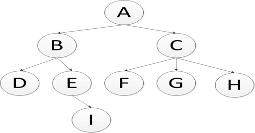

### 11.4.1 深度优先 ---用到堆结构

英文缩写为DFS即Depth First Search.其过程简要来说是对每一个可能的分支路径深入到不能再深入为止，而且每个节点只能访问一次。对于上面的例子来说深度优先遍历的结果就是：A,B,D,E,I,C,F,G,H.(假设先走子节点的的左侧)。

深度优先遍历各个节点，需要使用到堆（Stack）这种数据结构。stack的特点是是先进后出。整个遍历过程如下：

首先将A节点压入堆中，stack（A）;

将A节点弹出，同时将A的子节点C，B压入堆中，此时B在堆的顶部，stack(B,C)；

将B节点弹出，同时将B的子节点E，D压入堆中，此时D在堆的顶部，stack（D,E,C）；

将D节点弹出，没有子节点压入,此时E在堆的顶部，stack（E，C）；

将E节点弹出，同时将E的子节点I压入，stack（I,C）；

...依次往下，最终遍历完成，Java代码大概如下：

+----------------------------------------------------------------------------------+
| public void depthFirst() {                                                       |
|                                                                                  |
| Stack<Map<String, Object>> nodeStack = new Stack<Map<String, Object>>(); |
|                                                                                  |
| Map<String, Object> node = new HashMap<String, Object>();                    |
|                                                                                  |
| nodeStack.add(node);                                                             |
|                                                                                  |
| while (!nodeStack.isEmpty()) {                                                   |
|                                                                                  |
| node = nodeStack.pop();                                                          |
|                                                                                  |
| System.out.println(node);                                                        |
|                                                                                  |
| //获得节点的子节点，对于二叉树就是获得节点的左子结点和右子节点                   |
|                                                                                  |
| List<Map<String, Object>> children = getChildren(node);                      |
|                                                                                  |
| if (children != null && !children.isEmpty()) {                                   |
|                                                                                  |
| for (Map child : children) {                                                     |
|                                                                                  |
| nodeStack.push(child);                                                           |
|                                                                                  |
| }                                                                                |
|                                                                                  |
| }                                                                                |
|                                                                                  |
| }                                                                                |
|                                                                                  |
| }                                                                                |
|                                                                                  |
| ​//节点使用Map存放                                                               |
+----------------------------------------------------------------------------------+

### 11.4.2 广度优先 --用到队列结构

英文缩写为BFS即Breadth FirstSearch。其过程检验来说是对每一层节点依次访问，访问完一层进入下一层，而且每个节点只能访问一次。对于上面的例子来说，广度优先遍历的 结果是：A,B,C,D,E,F,G,H,I(假设每层节点从左到右访问)。

广度优先遍历各个节点，需要使用到队列（Queue）这种数据结构，queue的特点是先进先出，其实也可以使用双端队列，区别就是双端队列首尾都可以插入和弹出节点。整个遍历过程如下：

首先将A节点插入队列中，queue（A）;

将A节点弹出，同时将A的子节点B，C插入队列中，此时B在队列首，C在队列尾部，queue（B，C）；

将B节点弹出，同时将B的子节点D，E插入队列中，此时C在队列首，E在队列尾部，queue（C，D，E）;

将C节点弹出，同时将C的子节点F，G，H插入队列中，此时D在队列首，H在队列尾部，queue（D，E，F，G，H）；

将D节点弹出，D没有子节点，此时E在队列首，H在队列尾部，queue（E，F，G，H）；

...依次往下，最终遍历完成，Java代码大概如下：

+---------------------------------------------------------------------------------------+
| public void breadthFirst() {                                                          |
|                                                                                       |
| Deque<Map<String, Object>> nodeDeque = new ArrayDeque<Map<String, Object>>(); |
|                                                                                       |
| Map<String, Object> node = new HashMap<String, Object>();                         |
|                                                                                       |
| nodeDeque.add(node);                                                                  |
|                                                                                       |
| while (!nodeDeque.isEmpty()) {                                                        |
|                                                                                       |
| node = nodeDeque.peekFirst();                                                         |
|                                                                                       |
| System.out.println(node);                                                             |
|                                                                                       |
| //获得节点的子节点，对于二叉树就是获得节点的左子结点和右子节点                        |
|                                                                                       |
| List<Map<String, Object>> children = getChildren(node);                           |
|                                                                                       |
| if (children != null && !children.isEmpty()) {                                        |
|                                                                                       |
| for (Map child : children) {                                                          |
|                                                                                       |
| nodeDeque.add(child);                                                                 |
|                                                                                       |
| }                                                                                     |
|                                                                                       |
| }                                                                                     |
|                                                                                       |
| }                                                                                     |
|                                                                                       |
| }                                                                                     |
|                                                                                       |
| //这里使用的是双端队列，和使用queue是一样的                                           |
+---------------------------------------------------------------------------------------+

## 11.5 归并排序之java实现 ---不用看

归并排序（Merge）是将两个（或两个以上）有序表合并成一个新的有序表，即把待排序序列分为若干个子序列，每个子序列是有序的。然后再把有序子序列合并为整体有序序列。

归并排序是建立在归并操作上的一种有效的排序算法。该算法是采用分治法（Divide and Conquer）的一个非常典型的应用。 将已有序的子序列合并，得到完全有序的序列；即先使每个子序列有序，再使子序列段间有序。若将两个有序表合并成一个有序表，称为2-路归并。

归并排序算法稳定，数组需要O(n)的额外空间，链表需要O(log(n))的额外空间，时间复杂度为O(nlog(n))，算法不是自适应的，不需要对数据的随机读取。

工作原理：

1）申请空间，使其大小为两个已经排序序列之和，该空间用来存放合并后的序列

2）设定两个指针，最初位置分别为两个已经排序序列的起始位置

3）比较两个指针所指向的元素，选择相对小的元素放入到合并空间，并移动指针到下一位置

4）重复步骤3直到某一指针达到序列尾

5）将另一序列剩下的所有元素直接复制到合并序列尾

+--------------------------------------------------------------------------------+
| public class MergeSortTest {                                                   |
|                                                                                |
| public static void main(String[] args) {                                     |
|                                                                                |
| int[] data = new int[] { 5, 3, 6, 2, 1, 9, 4, 8, 7 };                      |
|                                                                                |
| print(data);                                                                   |
|                                                                                |
| mergeSort(data);                                                               |
|                                                                                |
| System.out.println("排序后的数组：");                                        |
|                                                                                |
| print(data);                                                                   |
|                                                                                |
| }                                                                              |
|                                                                                |
| public static void mergeSort(int[] data) {                                   |
|                                                                                |
| sort(data, 0, data.length - 1);                                                |
|                                                                                |
| }                                                                              |
|                                                                                |
| public static void sort(int[] data, int left, int right) {                   |
|                                                                                |
| if (left >= right)                                                            |
|                                                                                |
| return;                                                                        |
|                                                                                |
| // 找出中间索引                                                                |
|                                                                                |
| int center = (left + right) / 2;                                               |
|                                                                                |
| // 对左边数组进行递归                                                          |
|                                                                                |
| sort(data, left, center);                                                      |
|                                                                                |
| // 对右边数组进行递归                                                          |
|                                                                                |
| sort(data, center + 1, right);                                                 |
|                                                                                |
| // 合并                                                                        |
|                                                                                |
| merge(data, left, center, right);                                              |
|                                                                                |
| print(data);                                                                   |
|                                                                                |
| }                                                                              |
|                                                                                |
| /**                                                                          |
|                                                                                |
| * 将两个数组进行归并，归并前面2个数组已有序，归并后依然有序                   |
|                                                                                |
| *                                                                             |
|                                                                                |
| * @param data 数组对象                                                       |
|                                                                                |
| * @param left 左数组的第一个元素的索引                                       |
|                                                                                |
| * @param center 左数组的最后一个元素的索引，center+1是右数组第一个元素的索引 |
|                                                                                |
| * @param right 右数组最后一个元素的索引                                      |
|                                                                                |
| */                                                                            |
|                                                                                |
| public static void merge(int[] data, int left, int center, int right) {      |
|                                                                                |
| // 临时数组                                                                    |
|                                                                                |
| int[] tmpArr = new int[data.length];                                       |
|                                                                                |
| // 右数组第一个元素索引                                                        |
|                                                                                |
| int mid = center + 1;                                                          |
|                                                                                |
| // third 记录临时数组的索引                                                    |
|                                                                                |
| int third = left;                                                              |
|                                                                                |
| // 缓存左数组第一个元素的索引                                                  |
|                                                                                |
| int tmp = left;                                                                |
|                                                                                |
| while (left <= center && mid <= right) {                                     |
|                                                                                |
| // 从两个数组中取出最小的放入临时数组                                          |
|                                                                                |
| if (data[left] <= data[mid]) {                                            |
|                                                                                |
| tmpArr[third++] = data[left++];                                            |
|                                                                                |
| } else {                                                                       |
|                                                                                |
| tmpArr[third++] = data[mid++];                                             |
|                                                                                |
| }                                                                              |
|                                                                                |
| }                                                                              |
|                                                                                |
| // 剩余部分依次放入临时数组（实际上两个while只会执行其中一个）                 |
|                                                                                |
| while (mid <= right) {                                                        |
|                                                                                |
| tmpArr[third++] = data[mid++];                                             |
|                                                                                |
| }                                                                              |
|                                                                                |
| while (left <= center) {                                                      |
|                                                                                |
| tmpArr[third++] = data[left++];                                            |
|                                                                                |
| }                                                                              |
|                                                                                |
| // 将临时数组中的内容拷贝回原数组中                                            |
|                                                                                |
| // （原left-right范围的内容被复制回原数组）                                    |
|                                                                                |
| while (tmp <= right) {                                                        |
|                                                                                |
| data[tmp] = tmpArr[tmp++];                                                 |
|                                                                                |
| }                                                                              |
|                                                                                |
| }                                                                              |
|                                                                                |
| public static void print(int[] data) {                                       |
|                                                                                |
| for (int i = 0; i < data.length; i++) {                                       |
|                                                                                |
| System.out.print(data[i] + "t");                                         |
|                                                                                |
| }                                                                              |
|                                                                                |
| System.out.println();                                                          |
|                                                                                |
| }                                                                              |
|                                                                                |
| }                                                                              |
+--------------------------------------------------------------------------------+

运行结果：

[java] view plain copy

5 3 6 2 1 9 4 8 7

3 5 6 2 1 9 4 8 7

3 5 6 2 1 9 4 8 7

3 5 6 1 2 9 4 8 7

1 2 3 5 6 9 4 8 7

1 2 3 5 6 4 9 8 7

1 2 3 5 6 4 9 7 8

1 2 3 5 6 4 7 8 9

1 2 3 4 5 6 7 8 9

排序后的数组：

1 2 3 4 5 6 7 8 9

## 11.6 堆排序之java实现 --不用看

堆积排序(Heapsort)是指利用堆积树（堆）这种资料结构所设计的一种排序算法，可以利用数组的特点快速定位指定索引的元素。堆排序是不稳定的排序方法，辅助空间为O(1)， 最坏时间复杂度为O(nlog2n) ，堆排序的堆序的平均性能较接近于最坏性能。

堆排序利用了大根堆(或小根堆)堆顶记录的关键字最大(或最小)这一特征，使得在当前无序区中选取最大(或最小)关键字的记录变得简单。

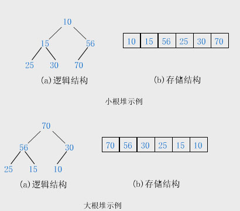

1）用大根堆排序的基本思想

① 先将初始文件R[1..n]建成一个大根堆,此堆为初始的无序区

② 再将关键字最大的记录R[1](即堆顶)和无序区的最后一个记录R[n]交换，由此得到新的无序区R[1..n-1]和有序区R[n]，且满足R[1..n-1].keys≤R[n].key

③由于交换后新的根R[1]可能违反堆性质，故应将当前无序区R[1..n-1]调整为堆。然后再次将R[1..n-1]中关键字最大的记录R[1]和该区间的最后一个记录R[n-1]交换，由此得到新的无序区R[1..n-2]和有序区R[n-1..n]，且仍满足关系R[1..n-2].keys≤R[n-1..n].keys，同样要将R[1..n-2]调整为堆。

......

直到无序区只有一个元素为止。

2）大根堆排序算法的基本操作：

① 初始化操作：将R[1..n]构造为初始堆；

② 每一趟排序的基本操作：将当前无序区的堆顶记录R[1]和该区间的最后一个记录交换，然后将新的无序区调整为堆(亦称重建堆)。

注意：

①只需做n-1趟排序，选出较大的n-1个关键字即可以使得文件递增有序。

②用小根堆排序与利用大根堆类似，只不过其排序结果是递减有序的。堆排序和直接选择排序相反：在任何时刻堆排序中无序区总是在有序区之前，且有序区是在原向量的尾部由后往前逐步扩大至整个向量为止。

代码实现：

+------------------------------------------------------------------------------+
| public class HeapSortTest {                                                  |
|                                                                              |
| public static void main(String[] args) {                                   |
|                                                                              |
| int[] data5 = new int[] { 5, 3, 6, 2, 1, 9, 4, 8, 7 };                   |
|                                                                              |
| print(data5);                                                                |
|                                                                              |
| heapSort(data5);                                                             |
|                                                                              |
| System.out.println("排序后的数组：");                                      |
|                                                                              |
| print(data5);                                                                |
|                                                                              |
| }                                                                            |
|                                                                              |
| public static void swap(int[] data, int i, int j) {                        |
|                                                                              |
| if (i == j) {                                                                |
|                                                                              |
| return;                                                                      |
|                                                                              |
| }                                                                            |
|                                                                              |
| data[i] = data[i] + data[j];                                           |
|                                                                              |
| data[j] = data[i] - data[j];                                           |
|                                                                              |
| data[i] = data[i] - data[j];                                           |
|                                                                              |
| }                                                                            |
|                                                                              |
| public static void heapSort(int[] data) {                                  |
|                                                                              |
| for (int i = 0; i < data.length; i++) {                                     |
|                                                                              |
| createMaxdHeap(data, data.length - 1 - i);                                   |
|                                                                              |
| swap(data, 0, data.length - 1 - i);                                          |
|                                                                              |
| print(data);                                                                 |
|                                                                              |
| }                                                                            |
|                                                                              |
| }                                                                            |
|                                                                              |
| public static void createMaxdHeap(int[] data, int lastIndex) {             |
|                                                                              |
| for (int i = (lastIndex - 1) / 2; i >= 0; i--) {                           |
|                                                                              |
| // 保存当前正在判断的节点                                                    |
|                                                                              |
| int k = i;                                                                   |
|                                                                              |
| // 若当前节点的子节点存在                                                    |
|                                                                              |
| while (2 * k + 1 <= lastIndex) {                                           |
|                                                                              |
| // biggerIndex总是记录较大节点的值,先赋值为当前判断节点的左子节点            |
|                                                                              |
| int biggerIndex = 2 * k + 1;                                                |
|                                                                              |
| if (biggerIndex < lastIndex) {                                              |
|                                                                              |
| // 若右子节点存在，否则此时biggerIndex应该等于 lastIndex                     |
|                                                                              |
| if (data[biggerIndex] < data[biggerIndex + 1]) {                        |
|                                                                              |
| // 若右子节点值比左子节点值大，则biggerIndex记录的是右子节点的值             |
|                                                                              |
| biggerIndex++;                                                               |
|                                                                              |
| }                                                                            |
|                                                                              |
| }                                                                            |
|                                                                              |
| if (data[k] < data[biggerIndex]) {                                      |
|                                                                              |
| // 若当前节点值比子节点最大值小，则交换2者得值，交换后将biggerIndex值赋值给k |
|                                                                              |
| swap(data, k, biggerIndex);                                                  |
|                                                                              |
| k = biggerIndex;                                                             |
|                                                                              |
| } else {                                                                     |
|                                                                              |
| break;                                                                       |
|                                                                              |
| }                                                                            |
|                                                                              |
| }                                                                            |
|                                                                              |
| }                                                                            |
|                                                                              |
| }                                                                            |
|                                                                              |
| public static void print(int[] data) {                                     |
|                                                                              |
| for (int i = 0; i < data.length; i++) {                                     |
|                                                                              |
| System.out.print(data[i] + "t");                                       |
|                                                                              |
| }                                                                            |
|                                                                              |
| System.out.println();                                                        |
|                                                                              |
| }                                                                            |
|                                                                              |
| }                                                                            |
+------------------------------------------------------------------------------+

运行结果：

[java] view plain copy

5 3 6 2 1 9 4 8 7

3 8 6 7 1 5 4 2 9

2 7 6 3 1 5 4 8 9

4 3 6 2 1 5 7 8 9

4 3 5 2 1 6 7 8 9

1 3 4 2 5 6 7 8 9

2 3 1 4 5 6 7 8 9

1 2 3 4 5 6 7 8 9

1 2 3 4 5 6 7 8 9

1 2 3 4 5 6 7 8 9

排序后的数组：

1 2 3 4 5 6 7 8 9

## 11.7 冒泡排序之java实现 ---重点

原理：比较两个相邻的元素，将值大的元素交换至右端。

思路：依次比较相邻的两个数，将小数放在前面，大数放在后面。即在第一趟：首先比较第1个和第2个数，将小数放前，大数放后。然后比较第2个数和第3个数，将小数放前，大数放后，如此继续，直至比较最后两个数，将小数放前，大数放后。重复第一趟步骤，直至全部排序完成。

举例说明：要排序数组：int[] arr={6,3,8,2,9,1};

第一趟排序：

　　第一次排序：6和3比较，6大于3，交换位置： 3 6 8 2 9 1

　　第二次排序：6和8比较，6小于8，不交换位置：3 6 8 2 9 1

　　第三次排序：8和2比较，8大于2，交换位置： 3 6 2 8 9 1

　　第四次排序：8和9比较，8小于9，不交换位置：3 6 2 8 9 1

　　第五次排序：9和1比较：9大于1，交换位置： 3 6 2 8 1 9

　　第一趟总共进行了5次比较， 排序结果： 3 6 2 8 1 9

第二趟排序：

　　第一次排序：3和6比较，3小于6，不交换位置：3 6 2 8 1 9

　　第二次排序：6和2比较，6大于2，交换位置： 3 2 6 8 1 9

　　第三次排序：6和8比较，6大于8，不交换位置：3 2 6 8 1 9

　　第四次排序：8和1比较，8大于1，交换位置： 3 2 6 1 8 9

　　第二趟总共进行了4次比较， 排序结果： 3 2 6 1 8 9

第三趟排序：

　　第一次排序：3和2比较，3大于2，交换位置： 2 3 6 1 8 9

　　第二次排序：3和6比较，3小于6，不交换位置：2 3 6 1 8 9

　　第三次排序：6和1比较，6大于1，交换位置： 2 3 1 6 8 9

　　第二趟总共进行了3次比较， 排序结果： 2 3 1 6 8 9

第四趟排序：

　　第一次排序：2和3比较，2小于3，不交换位置：2 3 1 6 8 9

　　第二次排序：3和1比较，3大于1，交换位置： 2 1 3 6 8 9

　　第二趟总共进行了2次比较， 排序结果： 2 1 3 6 8 9

第五趟排序：

　　第一次排序：2和1比较，2大于1，交换位置： 1 2 3 6 8 9

　　第二趟总共进行了1次比较， 排序结果： 1 2 3 6 8 9

最终结果：1 2 3 6 8 9

由此可见：N个数字要排序完成，总共进行N-1趟排序，每i趟的排序次数为(N-i)次，所以可以用双重循环语句，外层控制循环多少趟，内层控制每一趟的循环次数，即

+-----------------------------------+
| for(int i=1;i<arr.length;i++){   |
|                                   |
| for(int j=1;j<arr.length-i;j++){ |
|                                   |
| //交换位置                        |
|                                   |
| }                                 |
+-----------------------------------+

冒泡排序的优点：每进行一趟排序，就会少比较一次，因为每进行一趟排序都会找出一个较大值。如上例：第一趟比较之后，排在最后的一个数一定是最大的一个数，第二趟排序的时候，只需要比较除了最后一个数以外的其他的数，同样也能找出一个最大的数排在参与第二趟比较的数后面，第三趟比较的时候，只需要比较除了最后两个数以外的其他的数，以此类推......也就是说，没进行一趟比较，每一趟少比较一次，一定程度上减少了算法的量。

用时间复杂度来说：

1）如果我们的数据正序，只需要走一趟即可完成排序。所需的比较次数和记录移动次数均达到最小值，即：Cmin=n-1;Mmin=0;所以，冒泡排序最好的时间复杂度为O(n)。

2）如果很不幸我们的数据是反序的，则需要进行n-1趟排序。每趟排序要进行n-i次比较(1≤i≤n-1)，且每次比较都必须移动记录三次来达到交换记录位置。在这种情况下，比较和移动次数均达到最大值：冒泡排序的最坏时间复杂度为：O(n2) 。

综上所述：冒泡排序总的平均时间复杂度为：O(n2) 。

代码实现：

+-------------------------------------------------------------------------------+
| /*                                                                           |
|                                                                               |
| * 冒泡排序                                                                   |
|                                                                               |
| */                                                                           |
|                                                                               |
| public class BubbleSort {                                                     |
|                                                                               |
| 　　public static void main(String[] args) {                                |
|                                                                               |
| 　　　　int[] arr={6,3,8,2,9,1};                                            |
|                                                                               |
| 　　　　System.out.println("排序前数组为：");                               |
|                                                                               |
| 　　　　for(int num:arr){                                                     |
|                                                                               |
| 　　　　　　System.out.print(num+" ");                                      |
|                                                                               |
| 　　　　}                                                                     |
|                                                                               |
| 　　　　for(int i=0;i<arr.length-1;i++){//外层循环控制排序趟数               |
|                                                                               |
| 　　　　　　for(int j=0;j<arr.length-1-i;j++){//内层循环控制每一趟排序多少次 |
|                                                                               |
| 　　　　　　　　if(arr[j]>arr[j+1]){                                     |
|                                                                               |
| 　　　　　　　　　　int temp=arr[j];                                        |
|                                                                               |
| 　　　　　　　　　　arr[j]=arr[j+1];                                      |
|                                                                               |
| 　　　　　　　　　　arr[j+1]=temp;                                          |
|                                                                               |
| 　　　　　　　　}                                                             |
|                                                                               |
| 　　　　　　}                                                                 |
|                                                                               |
| 　　　　}                                                                     |
|                                                                               |
| 　　　　System.out.println();                                                 |
|                                                                               |
| 　　　　System.out.println("排序后的数组为：");                             |
|                                                                               |
| 　　　　for(int num:arr){                                                     |
|                                                                               |
| 　　　　　　System.out.print(num+" ");                                      |
|                                                                               |
| 　　　　}                                                                     |
|                                                                               |
| 　　}                                                                         |
|                                                                               |
| }                                                                             |
+-------------------------------------------------------------------------------+

## 11.8 设计模式：生产者消费者模式之java实现 -- 不懂

重点使用BlockingQueue，它也是java.util.concurrent下的主要用来控制线程同步的工具。

BlockingQueue有四个具体的实现类,根据不同需求,选择不同的实现类

1）ArrayBlockingQueue：一个由数组支持的有界阻塞队列，规定大小的BlockingQueue,其构造函数必须带一个int参数来指明其大小.其所含的对象是以FIFO(先入先出)顺序排序的。

2）LinkedBlockingQueue：大小不定的BlockingQueue,若其构造函数带一个规定大小的参数,生成的BlockingQueue有大小限制,若不带大小参数,所生成的BlockingQueue的大小由Integer.MAX_VALUE来决定.其所含的对象是以FIFO(先入先出)顺序排序的。

3）PriorityBlockingQueue：类似于LinkedBlockQueue,但其所含对象的排序不是FIFO,而是依据对象的自然排序顺序或者是构造函数的Comparator决定的顺序。

4）SynchronousQueue：特殊的BlockingQueue,对其的操作必须是放和取交替完成的。

LinkedBlockingQueue 可以指定容量，也可以不指定，不指定的话，默认最大是Integer.MAX_VALUE,其中主要用到put和take方法，put方法在队列满的时候会阻塞直到有队列成员被消费，take方法在队列空的时候会阻塞，直到有队列成员被放进来。

生产者消费者的示例代码：

+----------------------------------------------------+
| 生产者：                                           |
|                                                    |
| import java.util.concurrent.BlockingQueue;         |
|                                                    |
| public class Producer implements Runnable {        |
|                                                    |
| BlockingQueue<String> queue;                     |
|                                                    |
| public Producer(BlockingQueue<String> queue) {   |
|                                                    |
| this.queue = queue;                                |
|                                                    |
| }                                                  |
|                                                    |
| @Override                                         |
|                                                    |
| public void run() {                                |
|                                                    |
| try {                                              |
|                                                    |
| String temp = "A Product, 生产线程："            |
|                                                    |
| + Thread.currentThread().getName();               |
|                                                    |
| System.out.println("I have made a product:"      |
|                                                    |
| + Thread.currentThread().getName());              |
|                                                    |
| queue.put(temp);//如果队列是满的话，会阻塞当前线程 |
|                                                    |
| } catch (InterruptedException e) {                 |
|                                                    |
| e.printStackTrace();                               |
|                                                    |
| }                                                  |
|                                                    |
| }                                                  |
|                                                    |
| }                                                  |
+----------------------------------------------------+

+-----------------------------------------------------------+
| 消费者：                                                  |
|                                                           |
| import java.util.concurrent.BlockingQueue;                |
|                                                           |
| public class Consumer implements Runnable{                |
|                                                           |
| BlockingQueue<String> queue;                            |
|                                                           |
| public Consumer(BlockingQueue<String> queue){           |
|                                                           |
| this.queue = queue;                                       |
|                                                           |
| }                                                         |
|                                                           |
| @Override                                                |
|                                                           |
| public void run() {                                       |
|                                                           |
| try {                                                     |
|                                                           |
| String temp = queue.take();//如果队列为空，会阻塞当前线程 |
|                                                           |
| System.out.println(temp);                                 |
|                                                           |
| } catch (InterruptedException e) {                        |
|                                                           |
| e.printStackTrace();                                      |
|                                                           |
| }                                                         |
|                                                           |
| }                                                         |
|                                                           |
| }                                                         |
+-----------------------------------------------------------+

+-------------------------------------------------------------------------+
| 测试类：                                                                |
|                                                                         |
| import java.util.concurrent.ArrayBlockingQueue;                         |
|                                                                         |
| import java.util.concurrent.BlockingQueue;                              |
|                                                                         |
| import java.util.concurrent.LinkedBlockingQueue;                        |
|                                                                         |
| public class Test3 {                                                    |
|                                                                         |
| public static void main(String[] args) {                              |
|                                                                         |
| BlockingQueue<String> queue = new LinkedBlockingQueue<String>(2);   |
|                                                                         |
| // BlockingQueue<String> queue = new LinkedBlockingQueue<String>(); |
|                                                                         |
| //不设置的话，LinkedBlockingQueue默认大小为Integer.MAX_VALUE           |
|                                                                         |
| // BlockingQueue<String> queue = new ArrayBlockingQueue<String>(2); |
|                                                                         |
| Consumer consumer = new Consumer(queue);                                |
|                                                                         |
| Producer producer = new Producer(queue);                                |
|                                                                         |
| for (int i = 0; i < 5; i++) {                                          |
|                                                                         |
| new Thread(producer, "Producer" + (i + 1)).start();                   |
|                                                                         |
| new Thread(consumer, "Consumer" + (i + 1)).start();                   |
|                                                                         |
| }                                                                       |
|                                                                         |
| }                                                                       |
|                                                                         |
| }                                                                       |
+-------------------------------------------------------------------------+

由于队列的大小限定成了2，所以最多只有两个产品被加入到队列当中，而且消费者取到产品的顺序也是按照生产的先后顺序，原因就是LinkedBlockingQueue和ArrayBlockingQueue都是按照FIFO的顺序存取元素的。

## 11.10 链表转置/二叉树转置 --不懂

## 11.11 设计模式：单例模式 ---重点

单例模式详解： [https://www.cnblogs.com/kuangdaoyizhimei/p/4000953.html](https://www.cnblogs.com/kuangdaoyizhimei/p/4000953.html)

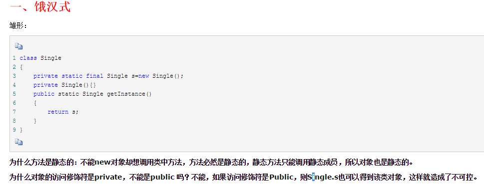

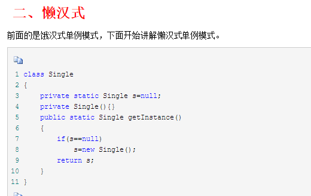

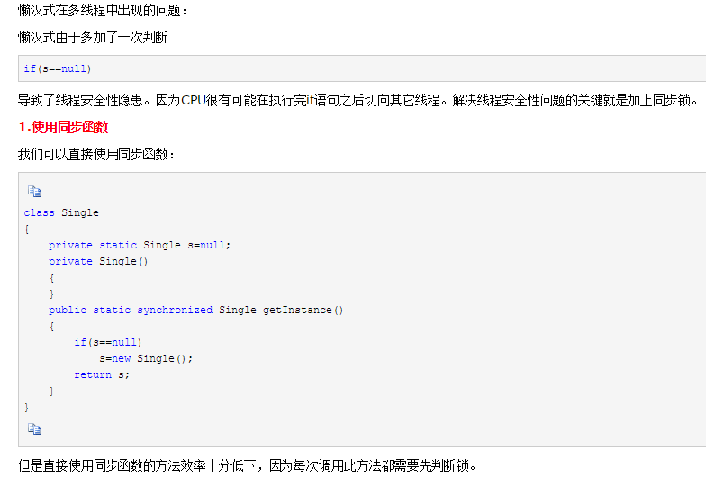

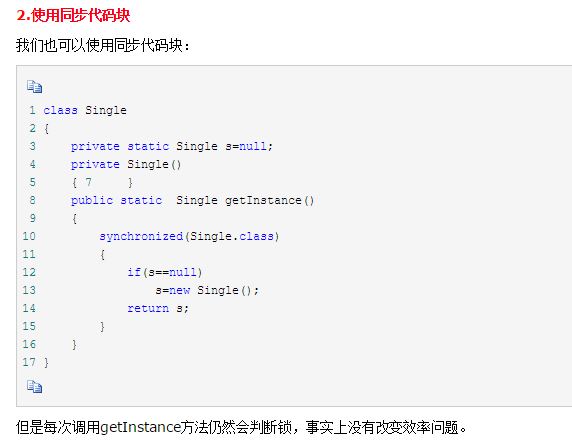

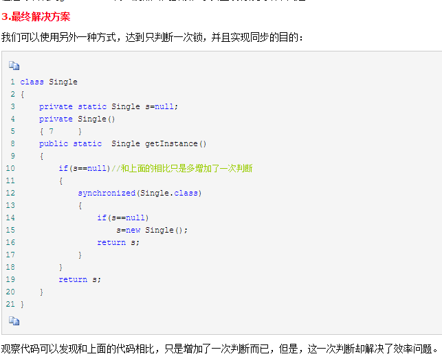

## 11.17 写出你知道的协同过滤算法的名称。--不懂

## 11.18 写出你知道的聚类算法和分类算法名称。 --不懂

## 11.18 栈和队列的特点

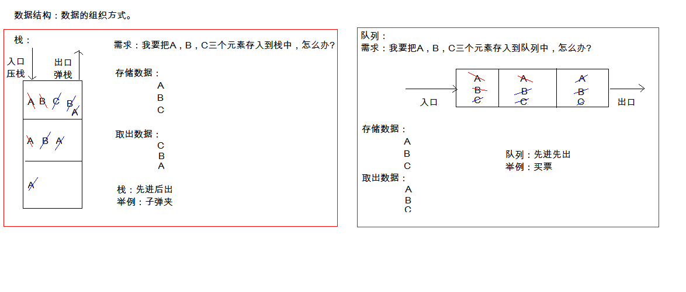

## 11.18 数组和链表的特点

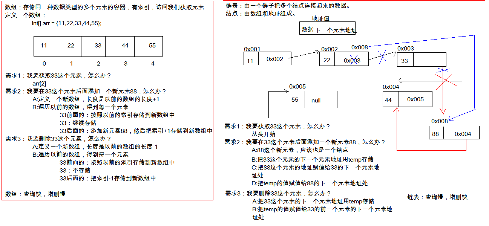

# 十三 数据库 mysql redis

## redis知识点：

1.  是什么 ---可存内存，也可存磁盘的key-value型数据库。 所以数据访问高效， 存储安全

mysql只能存磁盘

2.  redis支持的数据类型

string，list，set，hash,zset

3.  redis常见数据类型的操作

    1.  string类型：

> set key value
>
> get key
>
> mset key value [key value] ---mset 设置多个key-value
>
> mget key [key] ---mget 获取多个key

2.  list类型：（在redis里叫链表，除了头尾，其他地方的数据都是增删快，查询慢）

> lpush key value [value] ---创建list并插入元素
>
> lrange key start stop --遍历
>
> lpop key --移除第一个元素
>
> llen key ---返回集合长度

3.  hash类型：

4.  set类型：

<!-- -->

4.  通过java api的方式操作redis

主要就是创建Jedis对象（Jedis客户端）去操作

5.  redis数据持久化的几种机制 以及具体怎么使用RDB和AOF持久化略

    5.  RDB持久化 --该机制是指在指定的时间间隔内将内存中的数据集快照写入磁盘。

    6.  AOF(append only file)持久化 -- 该机制将以日志的形式记录服务器所处理的每一个写操作，在Redis服务器启动之初会读取该文件来重新构建数据库，以保证启动后数据库中的数据是完整的。

    7.  同时应用AOF和RDB。

    8.  无持久化 --- 不推荐使用

## 13.1 数据库存储数据的具体文件是什么，有几种

如果是myisam引擎：

.frm ----框架的缩写， 存储数据库表的框架结构

.myd ----my data的缩写， 存储表的数据的文件

.myi ----my index的缩写， 存储索引文件

如果是innodb引擎：

.frm

.ibdata1

.ibd

## 13.2 myisam和innodb存储引擎的区别

答：

1.MyISAM 是非事务的存储引擎，适合用于频繁查询的应用。表锁，不会出现死锁，适合小数据，小并发。

2.innodb是支持事务的存储引擎，合于插入和更新操作比较多的应用，设计合理的话是行锁（最大区别就在锁的级别上），适合大数据，大并发。

## 13.2 写出三种以上数据库存储引擎： 

MyISAM ， Innodb， csv

## 13.3 什么是数据库锁， 以及数据库锁的类型

答：数据库是一个多用户使用的共享资源。当多个用户并发地存取数据时，在数据库中就会产生多个事务同时存取同一数据的情况。若对并发操作不加控制就可能会读取和存储不正确的数据，破坏数据库的一致性。

加锁是实现数据库并发控制的一个非常重要的技术。当事务在对某个数据对象进行操作前，先向系统发出请求，对其加锁。加锁后事务就对该数据对象有了一定的控制，在该事务释放锁之前，其他的事务不能对此数据对象进行更新操作。

基本锁类型：锁包括行级锁和表级锁

## 13.4 数据库索引是什么，作用，优缺点

答：索引就一种特殊的查询表，数据库的搜索引擎可以利用它加速对数据的检索。它很类似与现实生活中书的目录，不需要查询整本书内容就可以找到想要的数据。索引可以是唯一的，创建索引允许指定单个列或者是多个列。缺点是它减慢了数据录入的速度，同时也增加了数据库的尺寸大小。

## 13.5 redis的五种基本类型，redis的AOF是什么，redis的sentinel哨兵模式

五种基本类型： string，list，hash，set，zset（sorted-set）

AOF和RDB都是redis中的持久化机制，用于当crash后redis的恢复

## 13.6 Mysql单表数据量过大可以采取什么措施进行性能调优？

## 13.7 redis版本多少？ --- v3.2.8

## 13.8 redis实现分布式锁，怎么实现？ ---不懂

## 13.9 千万级的数据落地到MySQL中，MySQL查询比较慢，落地到ES中，检索快。

# 十四 Scala

## 14.1 akka和netty通信框架的区别？

akka是spark底层中client，master和worker之间的通信框架。

在spark中，client，master和worker实际上都是actor， 所以说akka是一个基于actor的并发处理框架

## 14.2 说说Scala伴生对象？

-   如果有一个class文件，还有一个与class同名的object文件，那么就称这个object是class的伴生对象，class是object的伴生类；

-   伴生类和伴生对象必须存放在一个.scala文件中；

-   伴生类和伴生对象的最大特点是，可以相互访问；

伴生对象中有一个apply方法，它的作用是当遇到了类名（参数）时就会调用apply方法

## 14.3 Scala中协变逆变的应用场景？

使用场景： 用来解决java中泛型的缺点----java中使用泛型时有这么一个问题： 当A是B的子类，但Card[A]却不是Card[B]的子类。 而scala中利用协变逆变就能解决这个问题。

-   C[+T]：如果A是B的子类，那么C[A]是C[B]的子类。

-   C[-T]：如果A是B的子类，那么C[B]是C[A]的子类。

-   C[T]： 无论A和B是什么关系，C[A]和C[B]没有从属关系。

## 14.4 Spark中隐式转化的应用场景？

使用场景： 将某种类型的对象转换成其他类型的对象或者是给一个类增加方法

比如说定义一个Cat类，里面有catchMouse的方法，再定义一个Dog类，里面有lookDoor的方法。 然后通过implicit修饰一个方法，该方法就是用来给类加方法加功能的： implicit def dogCatchMouse(dog:Dog) = new Cat()

## 14.5 Map和 FlatMap区别 对结果集的影响有什么不同？

# 十五 Flink

## 1，是什么 

分布式计算引擎。 其他分布式计算引擎有MapReduce， Spark，Storm

## 2，对比其他计算引擎的优势：

与hadoop比，Flink基于内存计算，速度更快

与Storm比，Storm吞吐量大概30万条/秒，而Flink速度大概是Storm的3-5 倍

与同样基于内存计算的Spark，Flink对于流的计算实时性更好，延迟更低

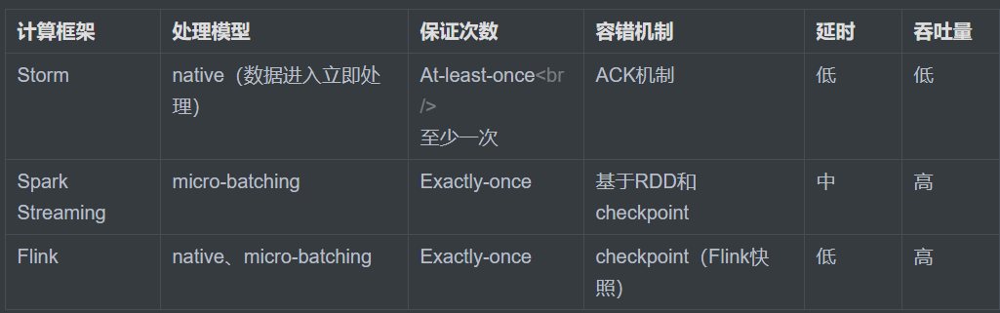

## 3，体系架构


## 4，Flink的程序提交方式

任务执行的流程图：

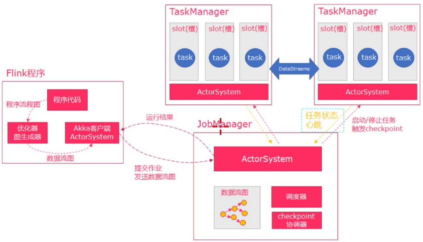

Client提交job任务，该job形成一个DAG图发送到JobManager，JobManager收到后也生成一个DAG数据流图。 实际task的执行是在TaskManager的一个个slot槽里，槽里分配的是内存资源。

运行在slots中的task是什么呢？

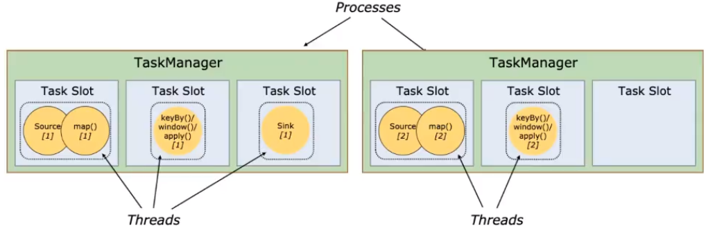

以下是一个计算单词数量的代码示例：

def main(args: Array[String]): Unit = {

//创建运行环境

val env: ExecutionEnvironment = ExecutionEnvironment.getExecutionEnvironment

//加载数据源source

val dataSet: DataSet[String] = env.fromElements("hello", "world", "java", "hello", "java")

//实际算子操作

val result: AggregateDataSet[(String, Int)] = dataSet.map(line => (line, 1)).groupBy(0).sum(1)

result.setParallelism(1) //默认并行度是8会产生8个结果文件

//结果落地sink

result.writeAsText("hdfs://node01:8020/wordcount")

env.execute() //真正开启任务执行的方法

}

程序提交方式：

方式1： session

--- 先在yarn上启动一个flink job

bin/yarn-session.sh -n 2 -tm 800 -s 2

> -n: 表示分配多少个TaskManager
>
> -tm： 表示每个TaskManager的内存大小
>
> -s：表示每个TaskManager的slots数量

--- 然后使用flink提交任务

bin/flink run xxx.jar

方式2： job

--- 直接使用flink提交任务

bin/flink run -m yarn-cluster -yn 2 xxx.jar

> -yn表示TaskManager的个数

两种任务提交方式对比：

Session方式适合提交小任务，因为资源的开辟需要的时间长

job方式适合提交长时间运行的任务，实际中job方式用的多

## 5，Operator chain（操作链）

Flink的所有操作都称之为Operator,客户端在提交任务的时候会对Operator进行优化操作,能进行合并的Operator会被合并为一个Operator,合并后的Operator称为Operator chain

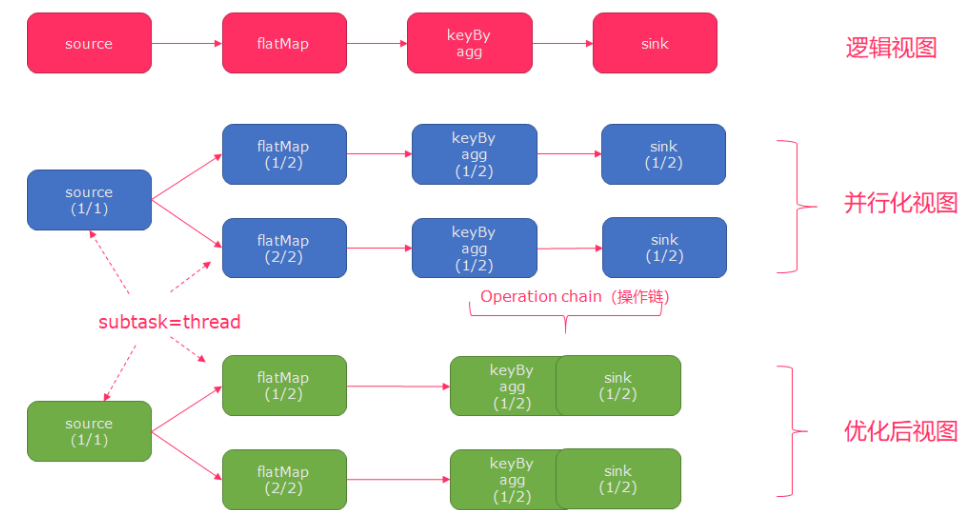

## 6，Flink的算子操作

### DataSet的转换操作

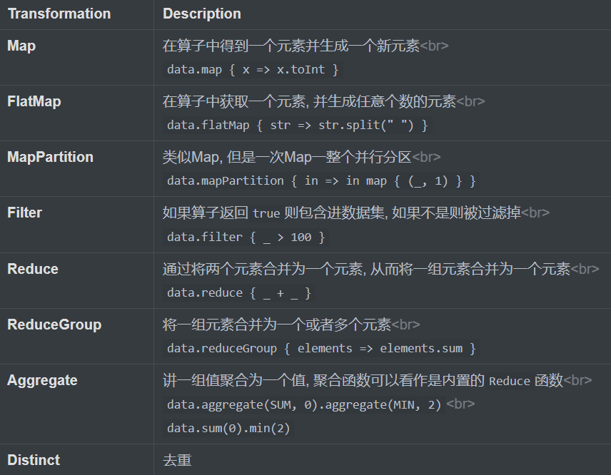

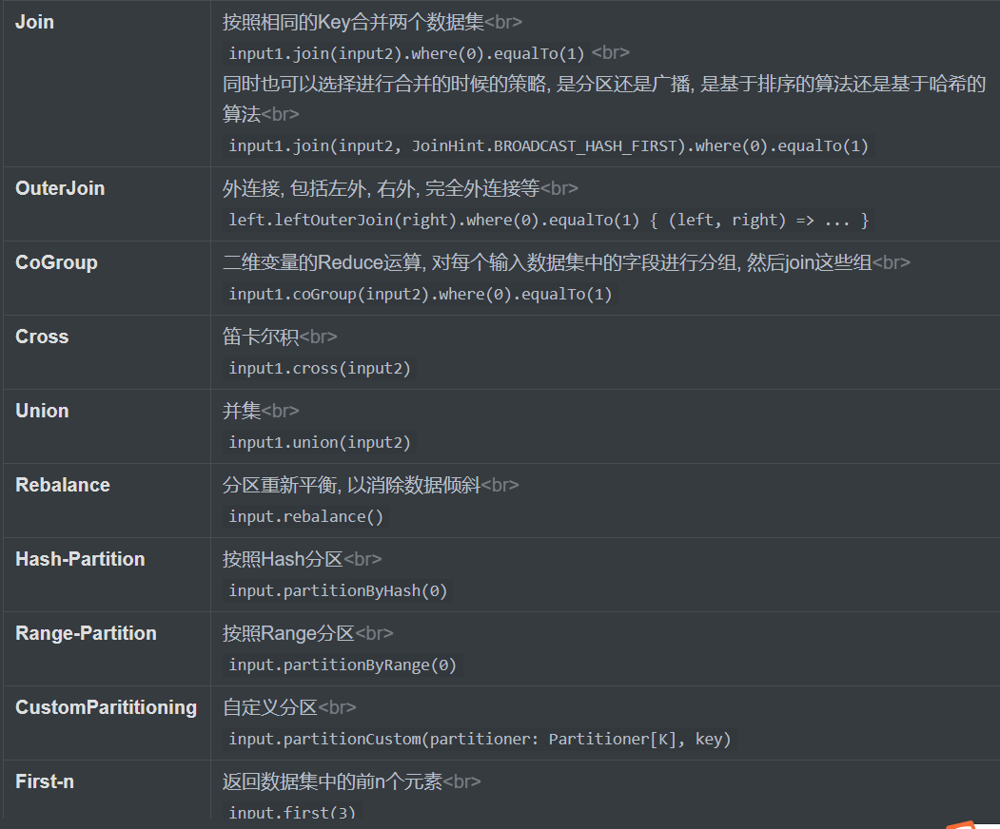

注意： reduce和reduceGroup的区别：

reduceGroup和reduce都会先分组reduce， 但是reduceGroup还会做整体reduce，好处是减少网络IO

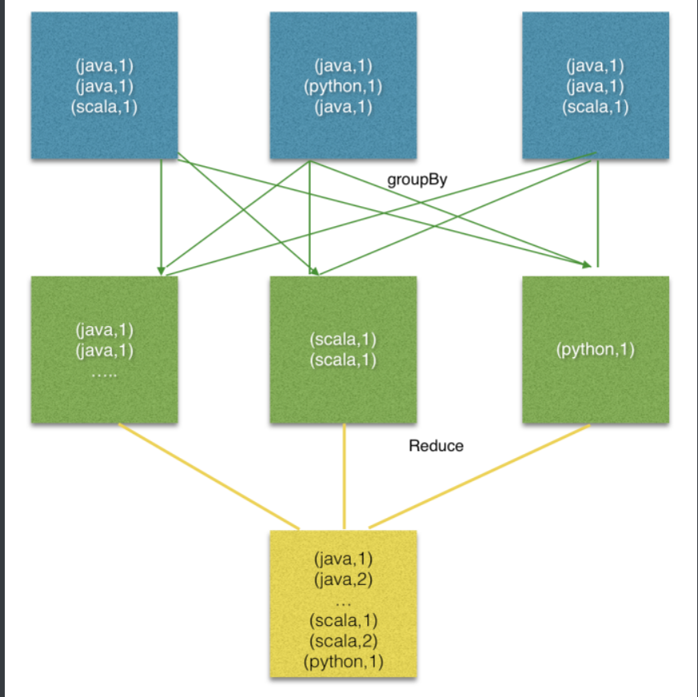

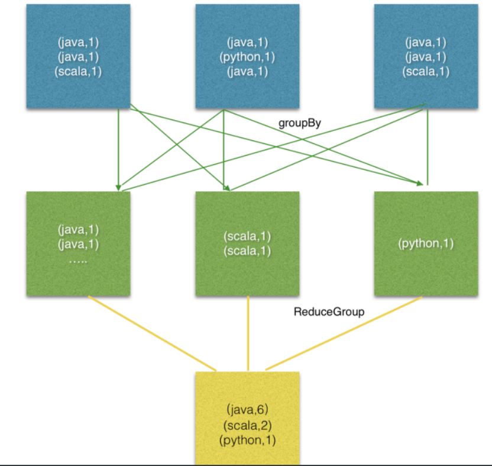

### DataStream的转换操作：

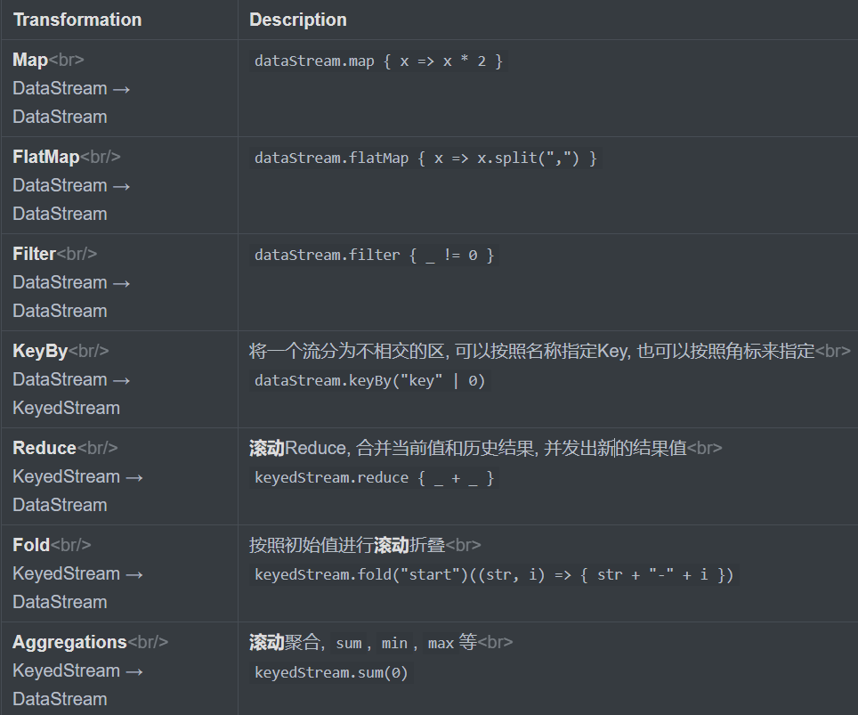

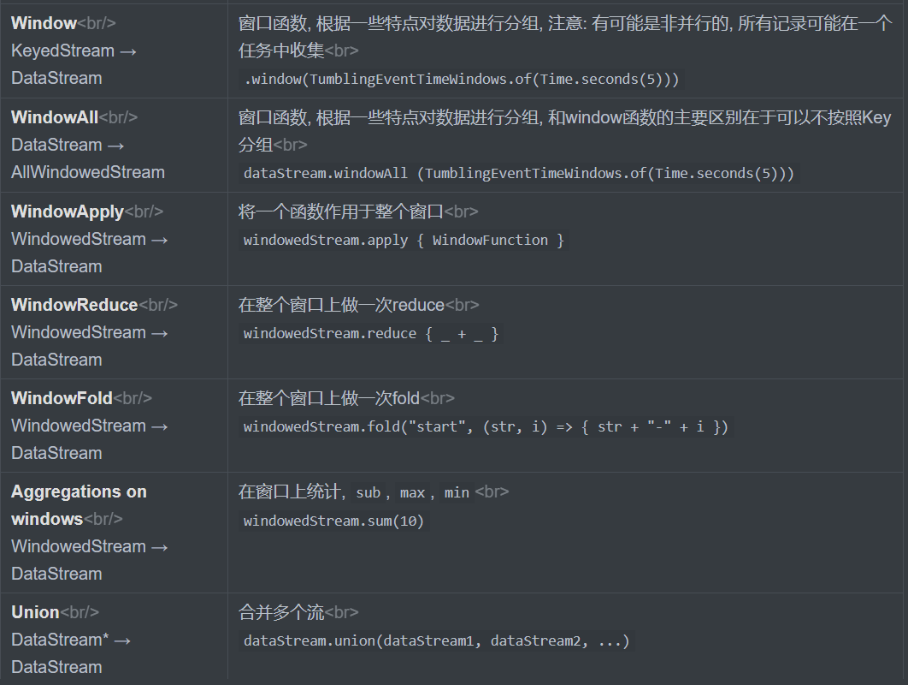

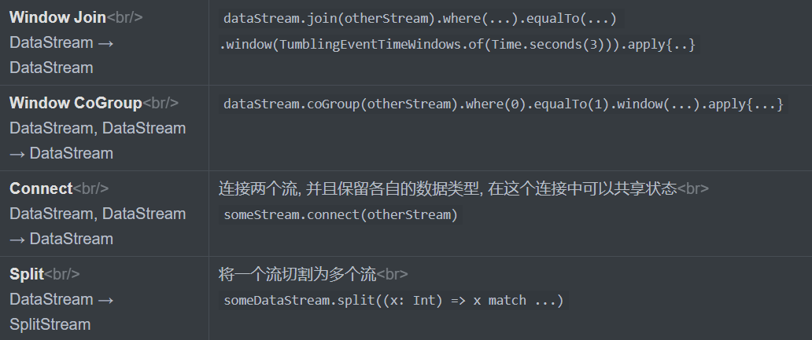

## 7，窗口（Window操作）

源源不断地数据是无法进行统计工作的，因为数据流没有边界，无法统计到 底有多少数据经过了这个流

window操作就是在数据流上，截取固定大小的一部分，这个部分是可以统 计的

截取方式有两种：

按照时间截取（time），例如：10秒钟、10分钟统计一次

按照消息数量截取（count），例如：每5个数据、或者50个数据统计一次

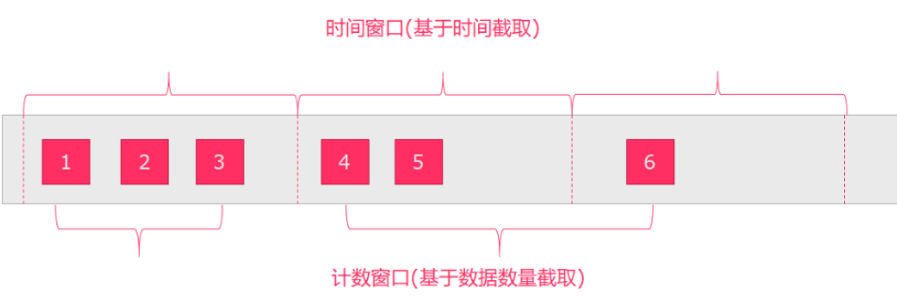

tumbling-time-window(无重叠数据)

sliding-time-window(有重叠数据)

tumbling-count-window(无重叠数据)

sliding-count-window(有重叠数据)

总结：

如果窗口滑动时间 > 窗口时间，会出现数据丢失

如果窗口滑动时间 < 窗口时间，会出现数据重复计算,比较适合实时排行榜

如果窗口滑动时间 = 窗口时间，数据不会被重复计算

## 8，水印

Flink的时间划分方式：

事件时间（Event Time）：每条事件产生的时间，该时间记录在事件中，在 处理的时候可以提取出来

摄入时间（Ingestion Time）：事件进入Flink的时间

处理时间（Processing Time）： 当前机器处理该条事件的时间

简单说明什么是水印： 在使用事件时间划分窗口进行计算时会出很多问题：接收不到数据或者接收的数据不准确。 这是因为在Flink设计之初就考虑到了网络延迟，网络乱序等问题，所以提出了一个抽象概念---水印

水印分两种情况：

情况1： 水印时间为当前时间 ----相当于没有水印

情况2： 水印时间比当前时间慢N秒，比如慢5秒

## 9，checkpoint --- 可以理解为保存快照

checkpoint流程：


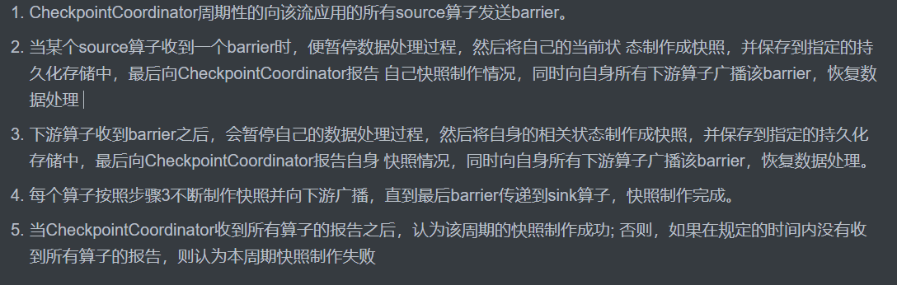

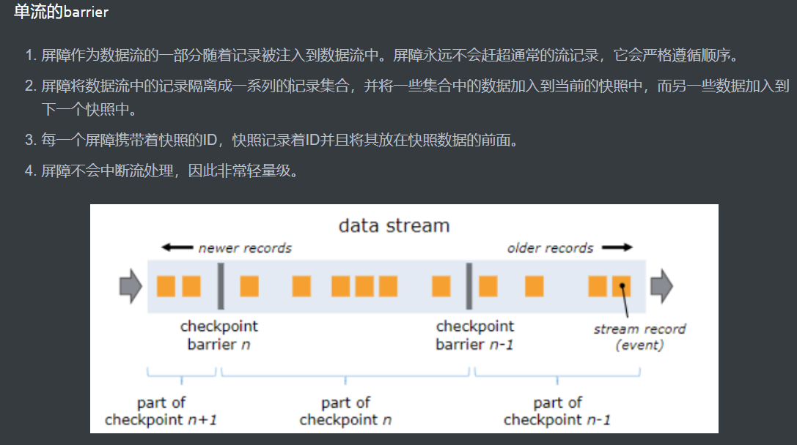


## 10，持久化存储 ---checkpoint保存到哪里


以下是持久化到hdfs的示例：

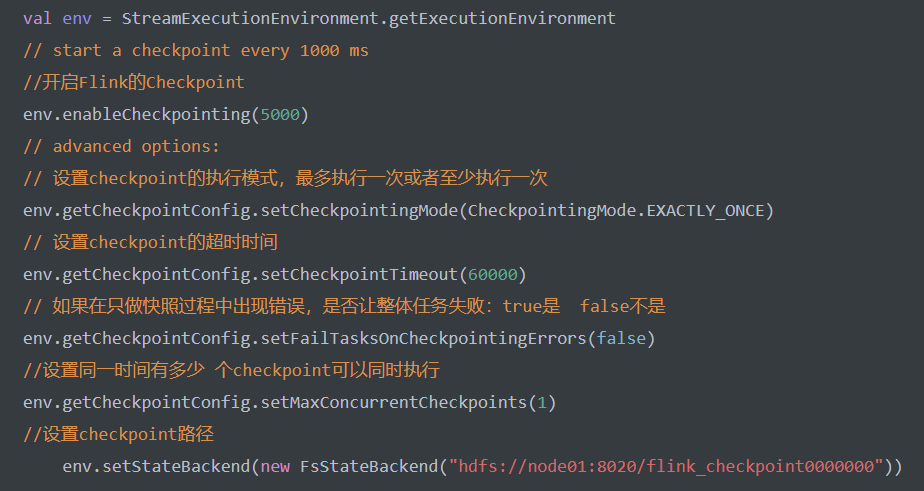

11，Flink SQL

批数据SQL：

> 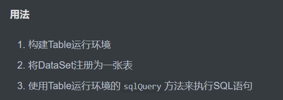

流数据SQL：

> 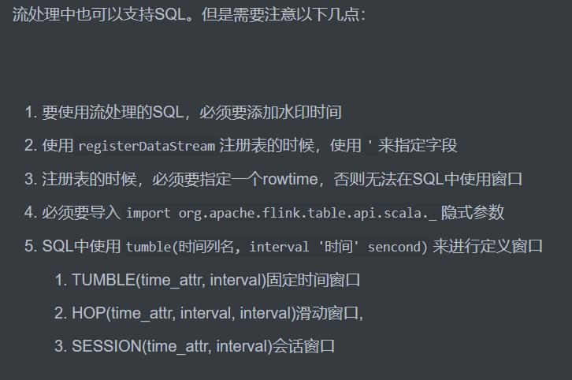

## 11，Table转化为DataSet或DataStream

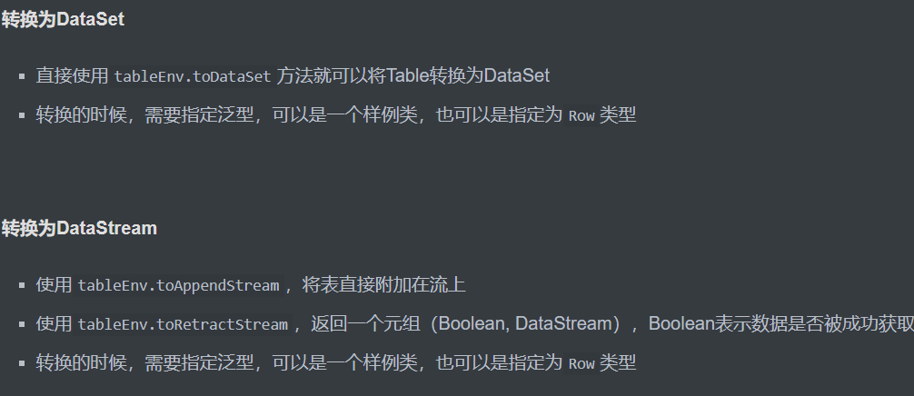

# 十六 ETL讲解

G:bigdata新建文件夹盘析点击流项目(全)day02--项目架构、flume采集、数据预处理代码资料ETL讲解（很详细！！！） - 雪儿飘 - 博客园.mhtml

ETL是将业务系统的数据经过抽取、清洗转换之后加载到数据仓库的过程，目的是将企业中的分散、零乱、标准不统一的数据整合到一起，为企业的决策提供分析依据。 ETL是BI项目重要的一个环节。 通常情况下，在BI项目中ETL会花掉整个项目至少1/3的时间,ETL设计的好坏直接关接到BI项目的成败。       

　　ETL的设计分三部分：数据抽取、数据的清洗转换、数据的加载。在设计ETL的时候我们也是从这三部分出发。数据的抽取是从各个不同的数据源抽取到ODS(Operational Data Store，操作型数据存储)中------这个过程也可以做一些数据的清洗和转换)，在抽取的过程中需要挑选不同的抽取方法，尽可能的提高ETL的运行效率。ETL三个部分中，花费时间最长的是"T"(Transform，清洗、转换)的部分，一般情况下这部分工作量是整个ETL的2/3。数据的加载一般在数据清洗完了之后直接写入DW(Data Warehousing，数据仓库)中去。

　　ETL的实现有多种方法，常用的有三种。一种是借助ETL工具(如Oracle的OWB、SQL Server 2000的DTS、SQL Server2005的SSIS服务、Informatic等)实现，一种是SQL方式实现，另外一种是ETL工具和SQL相结合。前两种方法各有各的优缺点，借助工具可以快速的建立起ETL工程，屏蔽了复杂的编码任务，提高了速度，降低了难度，但是缺少灵活性。SQL的方法优点是灵活，提高ETL运行效率，但是编码复杂，对技术要求比较高。第三种是综合了前面二种的优点，会极大地提高ETL的开发速度和效率。

　　一、 数据的抽取（Extract）

　　这一部分需要在调研阶段做大量的工作，首先要搞清楚数据是从几个业务系统中来,各个业务系统的数据库服务器运行什么DBMS,是否存在手工数据，手工数据量有多大，是否存在非结构化的数据等等，当收集完这些信息之后才可以进行数据抽取的设计。

　　1、对于与存放DW的数据库系统相同的数据源处理方法

　　这一类数据源在设计上比较容易。一般情况下，DBMS(SQLServer、Oracle)都会提供数据库链接功能，在DW数据库服务器和原业务系统之间建立直接的链接关系就可以写Select 语句直接访问。

　　2、对于与DW数据库系统不同的数据源的处理方法

　　对于这一类数据源，一般情况下也可以通过ODBC的方式建立数据库链接------如SQL Server和Oracle之间。如果不能建立数据库链接，可以有两种方式完成，一种是通过工具将源数据导出成.txt或者是.xls文件，然后再将这些源系统文件导入到ODS中。另外一种方法是通过程序接口来完成。

　　3、对于文件类型数据源(.txt,.xls)，可以培训业务人员利用数据库工具将这些数据导入到指定的数据库，然后从指定的数据库中抽取。或者还可以借助工具实现。

　　4、增量更新的问题

　　对于数据量大的系统，必须考虑增量抽取。一般情况下，业务系统会记录业务发生的时间，我们可以用来做增量的标志,每次抽取之前首先判断ODS中记录最大的时间，然后根据这个时间去业务系统取大于这个时间所有的记录。利用业务系统的时间戳，一般情况下，业务系统没有或者部分有时间戳。

二、数据的清洗转换（Cleaning、Transform）

　　一般情况下，数据仓库分为ODS、DW两部分。通常的做法是从业务系统到ODS做清洗，将脏数据和不完整数据过滤掉，在从ODS到DW的过程中转换，进行一些业务规则的计算和聚合。

　　1、 数据清洗

　　数据清洗的任务是过滤那些不符合要求的数据，将过滤的结果交给业务主管部门，确认是否过滤掉还是由业务单位修正之后再进行抽取。

不符合要求的数据主要是有不完整的数据、错误的数据、重复的数据三大类。

　　(1)不完整的数据：这一类数据主要是一些应该有的信息缺失，如供应商的名称、分公司的名称、客户的区域信息缺失、业务系统中主表与明细表不能匹配等。对于这一类数据过滤出来，按缺失的内容分别写入不同Excel文件向客户提交，要求在规定的时间内补全。补全后才写入数据仓库。

　　(2)错误的数据：这一类错误产生的原因是业务系统不够健全，在接收输入后没有进行判断直接写入后台数据库造成的，比如数值数据输成全角数字字符、字符串数据后面有一个回车操作、日期格式不正确、日期越界等。这一类数据也要分类，对于类似于全角字符、数据前后有不可见字符的问题，只能通过写SQL语句的方式找出来，然后要求客户在业务系统修正之后抽取。日期格式不正确的或者是日期越界的这一类错误会导致ETL运行失败，这一类错误需要去业务系统数据库用SQL的方式挑出来，交给业务主管部门要求限期修正，修正之后再抽取。

　　(3)重复的数据：对于这一类数据------特别是维表中会出现这种情况------将重复数据记录的所有字段导出来，让客户确认并整理。

　　数据清洗是一个反复的过程，不可能在几天内完成，只有不断的发现问题，解决问题。对于是否过滤，是否修正一般要求客户确认，对于过滤掉的数据，写入Excel文件或者将过滤数据写入数据表，在ETL开发的初期可以每天向业务单位发送过滤数据的邮件，促使他们尽快地修正错误,同时也可以做为将来验证数据的依据。数据清洗需要注意的是不要将有用的数据过滤掉，对于每个过滤规则认真进行验证，并要用户确认。

　　2、 数据转换

　　数据转换的任务主要进行不一致的数据转换、数据粒度的转换，以及一些商务规则的计算。

　　(1)不一致数据转换：这个过程是一个整合的过程，将不同业务系统的相同类型的数据统一，比如同一个供应商在结算系统的编码是XX0001,而在CRM中编码是YY0001，这样在抽取过来之后统一转换成一个编码。

　　(2)数据粒度的转换：业务系统一般存储非常明细的数据，而数据仓库中数据是用来分析的，不需要非常明细的数据。一般情况下，会将业务系统数据按照数据仓库粒度进行聚合。

　　(3)商务规则的计算：不同的企业有不同的业务规则、不同的数据指标，这些指标有的时候不是简单的加加减减就能完成，这个时候需要在ETL中将这些数据指标计算好了之后存储在数据仓库中，以供分析使用。

三、ETL日志、警告发送

　　1、 ETL日志

　　ETL日志分为三类。

一类是执行过程日志，这一部分日志是在ETL执行过程中每执行一步的记录，记录每次运行每一步骤的起始时间，影响了多少行数据，流水账形式。

一类是错误日志，当某个模块出错的时候写错误日志，记录每次出错的时间、出错的模块以及出错的信息等。

第三类日志是总体日志，只记录ETL开始时间、结束时间是否成功信息。如果使用ETL工具,ETL工具会自动产生一些日志，这一类日志也可以作为ETL日志的一部分。

记录日志的目的是随时可以知道ETL运行情况，如果出错了，可以知道哪里出错。

　　2、 警告发送

　　如果ETL出错了，不仅要形成ETL出错日志，而且要向系统管理员发送警告。发送警告的方式多种，一般常用的就是给系统管理员发送邮件，并附上出错的信息，方便管理员排查错误。

　　ETL是BI项目的关键部分，也是一个长期的过程，只有不断的发现问题并解决问题，才能使ETL运行效率更高，为BI项目后期开发提供准确与高效的数据。

后记

     做数据仓库系统，ETL是关键的一环。说大了，ETL是数据整合解决方案，说小了，就是倒数据的工具。回忆一下工作这么长时间以来，处理数据迁移、转换的工作倒还真的不少。但是那些工作基本上是一次性工作或者很小数据量。可是在数据仓库系统中，ETL上升到了一定的理论高度，和原来小打小闹的工具使用不同了。究竟什么不同，从名字上就可以看到，人家已经将倒数据的过程分成3个步骤，E、T、L分别代表抽取、转换和装载。

其实ETL过程就是数据流动的过程，从不同的数据源流向不同的目标数据。但在数据仓库中，

ETL有几个特点，

一是数据同步，它不是一次性倒完数据就拉到，它是经常性的活动，按照固定周期运行的，甚至现在还有人提出了实时ETL的概念。

二是数据量，一般都是巨大的，值得你将数据流动的过程拆分成E、T和L。

    现在有很多成熟的工具提供ETL功能，且不说他们的好坏。从应用角度来说，ETL的过程其实不是非常复杂，这些工具给数据仓库工程带来和很大的便利性，特别是开发的便利和维护的便利。但另一方面，开发人员容易迷失在这些工具中。这些工具为我们提供图形化界面，让我们将主要的精力放在规则上，以期提高开发效率。从使用效果来说，确实使用这些工具能够非常快速地构建一个job来处理某个数据，不过从整体来看，并不见得他的整体效率会高多少。问题主要不是出在工具上，而是在设计、开发人员上。他们迷失在工具中，没有去探求ETL的本质。可以说这些工具应用了这么长时间，在这么多项目、环境中应用，它必然有它成功之处，它必定体现了ETL的本质。如果我们不透过表面这些工具的简单使用去看它背后蕴涵的思想，最终我们作出来的东西也就是一个个独立的job，将他们整合起来仍然有巨大的工作量。大家都知道"理论与实践相结合"，如果在一个领域有所超越，必须要在理论水平上达到一定的高度.
## word

```text


1） 队列调度器（FIFO）
把提交的任务放到一个先进先出的队列里,先进队列的任务先获得资源. 有一个缺点就是如果先进队列的是大任务可能或占用所有资源导致后面的任务没有资源从而阻塞
2） 容量调度器（Capacity Scheduler）
apache版本默认使用的调度器, 多个队列共享集群资源. 但是在每个队列内部又是采用的fifo,所以每个队列内部的任务获得的资源占比各不相同
3） 公平调度器（Fair Scheduler）
cdh版本默认使用的调度器, 为每个任务公平分配资源. 但是要注意的是公平是对于每个用户或队列来说的,比如有两个队列A,B, A中只有一个任务a, B中有两个任务b1和b2,那么任务a占集群1/2资源,  任务b1和b2各占1/4的资源

1.4.6 MapReduce 2.0 容错性（☆☆☆☆☆）
1）MRAppMaster容错性
一旦运行失败，由YARN的ResourceManager负责重新启动，最多重启次数可由用户设置，默认是2次。一旦超过最高重启次数，则作业运行失败。
2）Map Task/Reduce Task
Task周期性向MRAppMaster汇报心跳；一旦Task 挂掉，则MRAppMaster将为之重新申请资源，并运行之。最多重新运行次数可由用户设置，默认4 次。 
1.4.7 mapreduce推测执行算法及原理（☆☆☆☆☆）
1）作业完成时间取决于最慢的任务完成时间
一个作业由若干个Map任务和Reduce任务构成。因硬件老化、软件Bug等，某些任务可能运行非常慢。
典型案例：系统中有99%的Map任务都完成了，只有少数几个Map老是进度很慢，完不成，怎么办？
2）推测执行机制：
发现拖后腿的任务，比如某个任务运行速度远慢于任务平均速度。为拖后腿任务启动一个备份任务，同时运行。谁先运行完，则采用谁的结果。
3）执行推测任务的前提条件
（1）每个task只能有一个备份任务；
（2）当前job已完成的task必须不小于0.05（5%）
（3）开启推测执行参数设置。Hadoop2.7.2 mapred-site.xml文件中默认是打开的。
   <property>
  <name>mapreduce.map.speculative</name>
  <value>true</value>
  <description>If true, then multiple instances of some map tasks 
               may be executed in parallel.</description>
</property>

<property>
  <name>mapreduce.reduce.speculative</name>
  <value>true</value>
  <description>If true, then multiple instances of some reduce tasks 
               may be executed in parallel.</description>
</property>


4）不能启用推测执行机制情况--- 不懂为什么
   （1）任务间存在严重的负载倾斜；
   （2）特殊任务，比如任务向数据库中写数据。
5）算法原理：  回答没了解过


1.4.8 Hadoop升级 Hadoop 源代码 mapreduce的map output的实现（☆☆☆☆☆） ---不懂
http://blog.csdn.net/lw305080/article/details/56479170


1.4.9 Hadoop相关源码，遇到的问题描述（☆☆☆☆☆）


1.4.10 Hadoop安全，及资源管理方案介绍（☆☆☆☆☆）

1.4.11 介绍Yarn调度器如何分配作业，源代码层面分析（☆☆☆☆☆）


1.4.12 mesos和yarn资源管理器对比，及使用场景（☆☆☆☆☆）

1.5 优化（☆☆☆☆☆）
1.5.1 mapreduce 跑的慢的原因（☆☆☆☆☆）
硬件倾斜小文件，
map数reduce数spill数merge数

Mapreduce 程序效率的瓶颈在于两点：
1）计算机性能
   CPU、内存、磁盘健康、网络
2）I/O 操作优化
（1）数据倾斜
（2）map和reduce数设置不合理
（3）reduce等待过久
（4）小文件过多
（5）大量的不可分块的超大文件
（6）spill次数过多
（7）merge次数过多等。
1.5.2 mapreduce 优化方法（☆☆☆☆☆）
1）数据输入：
（1）合并小文件：在执行mr任务前将小文件进行合并，大量的小文件会产生大量的map任务，增大map任务装载次数，而任务的装载比较耗时，从而导致 mr 运行较慢。
怎么合并小文件----
方式1: 自定义inputformat, 读取小文件合并成为sequencefile
方式2: 采用ConbineFileInputFormat从逻辑上将小文件切成一片
2）map阶段
（1）减少spill次数：通过调整io.sort.mb及sort.spill.percent参数值，增大触发spill的内存上限，减少spill次数，从而减少磁盘 IO。
（2）减少merge次数：通过调整io.sort.factor参数，增大merge的文件数目，减少merge的次数，从而缩短mr处理时间。
（3）在 map 之后先进行combine处理，减少 I/O。
3）reduce阶段
（1）合理设置map和reduce数：两个都不能设置太少，也不能设置太多。太少，会导致task等待，延长处理时间；太多，会导致 map、reduce任务间竞争资源，造成处理超时等错误。
（2）设置map、reduce共存：调整slowstart.completedmaps参数，使map运行到一定程度后，reduce也开始运行，减少reduce的等待时间。
（3）规避使用reduce，因为Reduce在用于连接数据集的时候将会产生大量的网络消耗。
（4）合理设置reduc端的buffer，默认情况下，数据达到一个阈值的时候，buffer中的数据就会写入磁盘，然后reduce会从磁盘中获得所有的数据。也就是说，buffer和reduce是没有直接关联的，中间多个一个写磁盘->读磁盘的过程，既然有这个弊端，那么就可以通过参数来配置，使得buffer中的一部分数据可以直接输送到reduce，从而减少IO开销：mapred.job.reduce.input.buffer.percent，默认为0.0。当值大于0的时候，会保留指定比例的内存读buffer中的数据直接拿给reduce使用。这样一来，设置buffer需要内存，读取数据需要内存，reduce计算也要内存，所以要根据作业的运行情况进行调整。
4）IO传输
（1）采用数据压缩的方式，减少网络IO的的时间。安装Snappy和LZOP压缩编码器。
（2）使用SequenceFile二进制文件
5）数据倾斜问题
   （1）数据倾斜现象
数据频率倾斜——某一个区域的数据量要远远大于其他区域。
数据大小倾斜——部分记录的大小远远大于平均值。
   （2）如何收集倾斜数据
在reduce方法中统计计数map输出的key
   public static final String MAX_VALUES = "skew.maxvalues"; 
private int maxValueThreshold; 
 
@Override
public void configure(JobConf job) { 
     maxValueThreshold = job.getInt(MAX_VALUES, 100); 
} 
@Override
public void reduce(Text key, Iterator<Text> values,
                     OutputCollector<Text, Text> output, 
                     Reporter reporter) throws IOException {
     int i = 0;
     while (values.hasNext()) {
         values.next();
         i++;
     }

     if (++i > maxValueThreshold) {
         log.info("Received " + i + " values for key " + key);
     }
}


   （3）减少数据倾斜的方法
方法1：
将数据量大的key分成多个组， 后面随机加上字符，比如数字1到10， 先进行一次运算，之后恢复key进行最终运算
方法2：Combine
使用Combine可以大量地减小数据频率倾斜和数据大小倾斜。在可能的情况下，combine的目的就是聚合并精简数据。

6）常用的参数调优
（1）资源相关参数
（a）以下参数是在用户自己的mr应用程序中配置就可以生效（mapred-default.xml）
   配置参数
   参数说明

   mapreduce.map.memory.mb
   一个Map Task可使用的资源上限（单位:MB），默认为1024。如果Map Task实际使用的资源量超过该值，则会被强制杀死。

   mapreduce.reduce.memory.mb
   一个Reduce Task可使用的资源上限（单位:MB），默认为1024。如果Reduce Task实际使用的资源量超过该值，则会被强制杀死。

   mapreduce.map.cpu.vcores
   每个Map task可使用的最多cpu core数目，默认值: 1

   mapreduce.reduce.cpu.vcores
   每个Reduce task可使用的最多cpu core数目，默认值: 1

   mapreduce.reduce.shuffle.parallelcopies
   每个reduce去map中拿数据的并行数。默认值是5

   mapreduce.reduce.shuffle.merge.percent
   buffer中的数据达到多少比例开始写入磁盘。默认值0.66

   mapreduce.reduce.shuffle.input.buffer.percent
   buffer大小占reduce可用内存的比例。默认值0.7

   mapreduce.reduce.input.buffer.percent
   指定多少比例的内存用来存放buffer中的数据，默认值是0.0


（b）应该在yarn启动之前就配置在服务器的配置文件中才能生效（yarn-default.xml）
   配置参数
   参数说明

   yarn.scheduler.minimum-allocation-mb     1024
   给应用程序container分配的最小内存

   yarn.scheduler.maximum-allocation-mb     8192
   给应用程序container分配的最大内存

   yarn.scheduler.minimum-allocation-vcores   1
   每个container申请的最小CPU核数

   yarn.scheduler.maximum-allocation-vcores   32
   每个container申请的最大CPU核数

   yarn.nodemanager.resource.memory-mb   8192
   给containers分配的最大物理内存


（c）shuffle性能优化的关键参数，应在yarn启动之前就配置好（mapred-default.xml）
   配置参数
   参数说明

   mapreduce.task.io.sort.mb   100
   shuffle的环形缓冲区大小，默认100m

   mapreduce.map.sort.spill.percent   0.8
   环形缓冲区溢出的阈值，默认80%


（2）容错相关参数(mapreduce性能优化)
   配置参数
   参数说明

   mapreduce.map.maxattempts
   每个Map Task最大重试次数，一旦重试参数超过该值，则认为Map Task运行失败，默认值：4。

   mapreduce.reduce.maxattempts
   每个Reduce Task最大重试次数，一旦重试参数超过该值，则认为Map Task运行失败，默认值：4。

   mapreduce.task.timeout
   Task超时时间，经常需要设置的一个参数，该参数表达的意思为：如果一个task在一定时间内没有任何进入，即不会读取新的数据，也没有输出数据，则认为该task处于block状态，可能是卡住了，也许永远会卡主，为了防止因为用户程序永远block住不退出，则强制设置了一个该超时时间（单位毫秒），默认是600000。如果你的程序对每条输入数据的处理时间过长（比如会访问数据库，通过网络拉取数据等），建议将该参数调大，该参数过小常出现的错误提示是“AttemptID:attempt_14267829456721_123456_m_000224_0 Timed out after 300 secsContainer killed by the ApplicationMaster.”。


1.5.3 HDFS小文件优化方法（☆☆☆☆☆）
1）HDFS小文件弊端
HDFS上每个文件都要在namenode上建立一个索引，这个索引的大小约为150byte，这样当小文件比较多的时候，就会产生很多的索引文件，一方面会大量占用namenode的内存空间，另一方面就是索引文件过大是的索引速度变慢。
2）解决方案
1）Hadoop Archive:
 是一个高效地将小文件放入HDFS块中的文件存档工具，它能够将多个小文件打包成一个HAR文件，这样在减少namenode内存使用的同时。
2）Sequence file：
 sequence file由一系列的二进制key/value组成，如果key为文件名，value为文件内容，则可以将大批小文件合并成一个大文件。
3）CombineFileInputFormat：
  CombineFileInputFormat是一种新的inputformat，用于将多个文件合并成一个单独的split，另外，它会考虑数据的存储位置。
4）开启JVM重用
对于大量小文件Job，可以开启JVM重用会减少45%运行时间。
JVM重用理解：一个map运行一个jvm，重用的话，在一个map在jvm上运行完毕后，jvm继续运行其他jvm
具体设置：mapreduce.job.jvm.numtasks值在10-20之间。
1.6 企业运维相关（☆☆☆☆）
1.6.1 Hadoop会有哪些重大故障，如何应对？至少给出 5个。
1）namenode单点故障：通过zookeeper搭建HA高可用，可自动切换namenode。
2）ResourceManager单点故障：可通过配置YARN的HA，并在配置的namenode上手动启动ResourceManager作为Slave，在Master 故障后，Slave 会自动切换为Master。
3）reduce阶段内存溢出：是由于单个reduce任务处理的数据量过多，通过增大reducetasks数目、优化partition 规则使数据分布均匀进行解决。
4）datanode内存溢出：是由于创建的线程过多，通过调整linux的maxuserprocesses参数，增大可用线程数进行解决。
5）集群间时间不同步导致运行异常：通过配置内网时间同步服务器进行解决。
1.6.2 什么情况下会触发recovery过程，recover是怎么做的。--不懂
当 jobtracker.restart.recover 参数值设置为 true， jobtracker 重启之时会触发recovery。
在JobTracker重启前，会在history log中记录各个作业的运行状态，这样在JobTracker关闭后，系统中所有数据目录、临时目录均会被保留，待 JobTracker 重启之后，JobTracker 自动重新提交这些作业，并只对未运行完成的 task 进行重新调度，这样可避免已经计算完的 task 重新计算。
1.6.3 从2.7.0升级为2.7.2，升级步骤如下：--不用看
1）下载安装包后，下载native的64位包，替换新版本中的native。
2）修改2.7.2中的配置文件，保持与当前集群配置一致，修改配置文件后，分发到各台hadoop集群机器的一个临时目录中。我的配置文件列表有：core-site.xml、excludes、hadoop-env.sh、hdfs-site.xml、mapred-env.sh、mapred-site.xml、master、slaves、yarn-env.sh、yarn-site.xml
3）停掉hadoop集群。
4）登录每台hadoop节点的服务器，先备份hadoop的安装文件目录。然后进入hadoop安装目录，执行rm -rf bin etc include lib libexec LICENSE.txt NOTICE.txt README.txt sbin share
5）将临时目录中的2.7.2的hadoop文件拷贝至安装目录。
6）执行start-all.sh，启动hadoop集群，访问http://localhost:50070/dfshealth.html#tab-overview ，查看hadoop版本是否已更新，查看各节点状态是否正常。
1.6.4 如何测压hadoop集群（☆☆☆☆☆）
答: 一般在hadoop集群搭建完毕后第一件事就是要做集群的压力测试, 测试分为写入速度和读取速度测试

1.6.5 你认为 hadoop 有哪些设计不合理的地方。
1）不支持文件的并发写入和对文件内容的随机修改。
2）不支持低延迟、高吞吐的数据访问。
3）存取大量小文件，会占用namenode大量内存，小文件的查找时间超过读取时间。
4）hadoop环境搭建比较复杂。
5）数据无法实时处理。
6）mapreduce的shuffle 阶段IO太多。
7）编写mapreduce难度较高，实现复杂逻辑时，代码量太大。
1.6.6 你们公司业务数据量多大？有多少行数据？ 
开发时使用的是部分数据，不是全量数据，有将近一亿行（8、9 千万，具体不详，一般开发中也没人会特别关心这个问题） 
1.6.7 一个网络商城1天大概产生多少 G 的日志？ 
回答大概5、60G
1.6.8 大概有多少条日志记录（在不清洗的情况下）？ 
3000万条, 每条大概2kb,  所以日增数据量是57G(回答大概5、60G)
1.6.9 日访问量大概有多少个？ 
几十万到百万
1.6.10 注册数大概多少？ 
不清楚  几十万或者几百万吧
1.6.11 假设我们有其他的日志是不是可以对这个日志有其他的业务分析？这些业务分析都有什么？ 
 除了apache的访问日志, 还有log4j的日志

1.6.12 你们的集群规模（服务器多少台、CPU几个、内存多大）？ 
开发集群：15台(10台可用), 24核 cpu ，内存128G, 硬盘24T
1.6.13 问：你们的服务器怎么分布的？（这里说地理位置分布，最好也从机架方面也谈谈） ----回答不清楚


1.6.14 你们的数据是用什么导入到数据库的？导入到什么数据库？ 
数据处理之前的导入：通过 hadoop 命令导入到 hdfs 文件系统 
数据处理完成之后的导出：利用 hive 处理完成之后的数据，通过 sqoop 导出到 mysql 数据库中，以供报表层使用。 
1.6.15 你们处理数据是直接读数据库的数据还是读文本数据？ 
将日志数据导入到hdfs之后进行处理 
1.6.16 你们提交的job任务大概有多少个？这些 job 执行完大概用多少时间？ 
500多个，每天凌晨开始跑，大概跑到上午9点左右。白天一般跑一些临时数据或者测试数据。小时任务不多。
1.6.17 问：你平常在公司都干些什么（一些建议）
   

1.6.18 你在项目中遇到了哪些难题，是怎么解决的？ 
某些任务执行时间过长，且失败率过高，检查日志后发现没有执行完就失败，原因出在hadoop 的 job 的 timeout 过短（相对于集群的能力来说），设置长一点即可
1.6.19 列举你了解的海量数据的处理方法及适用范围，如果有相关使用经验，可简要说明。
1）mapreduce 分布式计算 mapreduce 的思想就是分而治之；
2）倒排索引：一种索引方法，用来存储在全文搜索下某个单词在一个文档或者一组文档中的存储位置的映射，在倒排索引中单词指向了包含单词的文档。
3）消息队列：大量的数据写入首先存入消息队列进行缓冲，再把消息队列作为数据来源进行数据读取。
4）数据库读写分离：向一台数据库写入数据，另外的多台数据库从这台数据库中进行读取。
1.7 企业案例分析（☆☆☆☆）
1.7.1 海量日志数据，提取出某日访问百度次数最多的那个IP。
首先是这一天，并且是访问百度的日志中的 IP 取出来，逐个写入到一个大文件中。注意到IP 是 32 位的，最多有个 2^32 个 IP。同样可以采用映射的方法， 比如模 1000，把整个大文件映射为 1000 个小文件，再找出每个小文中出现频率最大的 IP（可以采用 hash_map进行频率统计，然后再找出频率最大 的几个）及相应的频率。然后再在这 1000 个最大的IP 中，找出那个频率最大的 IP，即为所求。 
或者如下阐述（雪域之鹰）： 
算法思想：分而治之+Hash 
（1）IP 地址最多有2^32=4G种取值情况，所以不能完全加载到内存中处理； 
（2）可以考虑采用“分而治之”的思想，按照IP地址的Hash(IP)%1024值，把海量IP日志分别存储到1024个小文件中。这样，每个小文件最多包含4MB个IP地址；
（3）对于每一个小文件，可以构建一个IP为 key，出现次数为value的Hash map，同时记录当前出现次数最多的那个IP地址；
（4）可以得到1024个小文件中的出现次数最多的IP，再依据常规的排序算法得到总体上出现次数最多的IP；
1.7.2 搜索引擎会通过日志文件把用户每次检索使用的所有检索串都记录下来，每个查询串的长度为1-255字节。 
    假设目前有一千万个记录（这些查询串的重复度比较高，虽然总数是1千万，但如果除去重复后，不超过3百万个。一个查询串的重复度越高，说明查询它的用户越多，也就是越热门。），请你统计最热门的10个查询串，要求使用的内存不能超过1G。 
典型的 Top K 算法，还是在这篇文章里头有所阐述，详情请参见：十一、从头到尾彻底解析 Hash 表算法。 文中，给出的最终算法是： 
第一步、先对这批海量数据预处理，在O（N）的时间内用Hash表完成统计（之前写成了排序，特此订正。July、2011.04.27）； 
第二步、借助堆这个数据结构，找出 Top K，时间复杂度为 N‘logK。 即，借助堆结构，我们可以在log量级的时间内查找和调整/移动。因此，维护一个K(该题目中是 10)大小的小根堆，然后遍历300万的Query，分别和根元素进行对比所以，我们最终的时间复杂度是：O（N） + N’*O（logK），（N 为 1000 万，N’为 300 万）。ok，更多，详情，请参考原文。 
或者：采用 trie 树，关键字域存该查询串出现的次数，没有出现为 0。最后用 10 个元素的最小推来对出现频率进行排序。
1.7.3 有一个1G大小的一个文件，里面每一行是一个词，词的大小不超过16字节，内存限制大小是1M。返回频数最高的100 个词。 
方案：顺序读文件中，对于每个词 x，取 hash(x)%5000，然后按照该值存到 5000 个小文件（记为 x0,x1,…x4999）中。这样每个文件大概是 200k 左右。 
如果其中的有的文件超过了1M 大小，还可以按照类似的方法继续往下分，直到分解得到的小文件的大小都不超过 1M。 
对每个小文件，统计每个文件中出现的词以及相应的频率（可以采用 trie 树/hash_map 等），并取出出现频率最大的100个词（可以用含100个结点的最小堆），并把100个词及相应的频率存入文件，这样又得到了5000个文件。下一步就是把这5000个文件进行归并（类似与归并排序）的过程了。
1.7.4 有 10 个文件，每个文件1G，每个文件的每一行存放的都是用户的query，每个文件的query都可能重复。要求你按照query的频度排序。 
还是典型的 TOP K 算法，解决方案如下： 
方案 1： 
顺序读取10个文件，按照hash(query)%10 的结果将query写入到另外10个文件（记为）中。这样新生成的文件每个的大小大约也1G（假设hash函数是随机的）。找一台内存在2G左右的机器，依次对用 hash_map(query, query_count)来统计每个query出现的次数。利用快速/堆/归并排序按照出现次数进行排序。将排序好的query和对应的query_cout输出到文件中。这样得到了10个排好序的文件（记为）。对这10个文件进行归并排序（内排序与外排序相结合）。 
方案 2： 
一般query的总量是有限的，只是重复的次数比较多而已，可能对于所有的query，一次性就可以加入到内存了。这样，我们就可以采用trie树/hash_map等直接来统计每个query出现的次数，然后按出现次数做快速/堆/归并排序就可以了。 
方案 3： 
与方案 1 类似，但在做完 hash，分成多个文件后，可以交给多个文件来处理，采用分布式的架构来处理（比如 MapReduce），最后再进行合并。
1.7.5 给定 a、b 两个文件，各存放 50 亿个 url，每个 url 各占 64 字节，内存限制是 4G，让你找出 a、b 文件共同的 url？ 
方案 1：可以估计每个文件安的大小为 5G×64=320G，远远大于内存限制的 4G。所以不可能将其完全加载到内存中处理。考虑采取分而治之的方法。 
遍历文件a，对每个url求取 hash(url)%1000，然后根据所取得的值将url分别存储到 1000个小文件（记为 a0,a1,…,a999）中。这样每个小文件的大约为300M。遍历文件b，采取和a相同的方式将url分别存储到1000小文件（记为b0,b1,…,b999）。
这样处理后，所有可能相同的url都在对应的小文件（a0vsb0,a1vsb1,…,a999vsb999）中，不对应的小文件不可能有相同的url。然后我们只要求出 1000 对小文件中相同的 url即可。 
求每对小文件中相同的url时，可以把其中一个小文件的url存储到hash_set中。然后遍历另一个小文件的每个url，看其是否在刚才构建的hash_set中，如果是，那么就是共同的url，存到文件里面就可以了。 
方案2：如果允许有一定的错误率，可以使用Bloom filter，4G内存大概可以表示340亿bit。将其中一个文件中的url使用Bloom filter映射为这340亿 bit，然后挨个读取另外一个文件的url，检查是否与 Bloom filter，如果是，那么该 url 应该是共同的 url（注意会有一定的错误率）。 
Bloom filter 日后会在本 BLOG 内详细阐述。
1.7.6 在 2.5 亿个整数中找出不重复的整数，注，内存不足以容纳这 2.5 亿个整数。 
方案 1：采用2-Bitmap（每个数分配 2bit，00 表示不存在，01 表示出现一次，10 表示多次，11 无意义）进行，共需内存 2^32 * 2 bit=1 GB 内存，还可以接受。然后扫描这2.5亿个整数，查看Bitmap中相对应位，如果是00变01，01变10，10保持不变。所描完事后，查看bitmap，把对应位是01的整数输出即可。 
方案 2：也可采用与第 1 题类似的方法，进行划分小文件的方法。然后在小文件中找出不重复的整数，并排序。然后再进行归并，注意去除重复的元素。
1.7.7 腾讯面试题：给40亿个不重复的 unsigned int 的整数，没排过序的，然后再给一个数，如何快速判断这个数是否在那40亿个数当中？ 
与上第 6 题类似，我的第一反应时快速排序+二分查找。以下是其它更好的方法： 
方案 1：oo，申请 512M 的内存，一个 bit 位代表一个 unsigned int 值。读入 40 亿个数，设置相应的 bit 位，读入要查询的数，查看相应 bit 位是否为 1，为 1 表示存在，为 0 表示不存在。 
dizengrong： 
方案 2：这个问题在《编程珠玑》里有很好的描述，大家可以参考下面的思路，探讨一下： 
又因为 2^32 为 40 亿多，所以给定一个数可能在，也可能不在其中； 
这里我们把 40 亿个数中的每一个用 32 位的二进制来表示，假设这 40 亿个数开始放在一个文件中。 
然后将这 40 亿个数分成两类: 1.最高位为0；2.最高位为1。
并将这两类分别写入到两个文件中，其中一个文件中数的个数<=20 亿，而另一个>=20 亿（这相当于折半了）； 
与要查找的数的最高位比较并接着进入相应的文件再查找，再然后把这个文件为又分成两类: 
1.次最高位为 0 
2.次最高位为 1 
并将这两类分别写入到两个文件中，其中一个文件中数的个数<=10 亿，而另一个>=10 亿
（这相当于折半了）； 
与要查找的数的次最高位比较并接着进入相应的文件再查找。 
……. 
以此类推，就可以找到了,而且时间复杂度为 O(logn)，方案 2 完。 
附：这里，再简单介绍下，位图方法： 
使用位图法判断整形数组是否存在重复判断集合中存在重复是常见编程任务之一，当集合中数据量比较大时我们通常希望少进行几次扫描，这时双重循环法就不可取了。 
位图法比较适合于这种情况，它的做法是按照集合中最大元素 max 创建一个长度为 max+1的新数组，然后再次扫描原数组，遇到几就给新数组的第几位置上 1，如遇到 5 就给新数组的第六个元素置 1，这样下次再遇到 5 想置位时发现新数组的第六个元素已经是 1 了，这说明这次的数据肯定和以前的数据存在着重复。这种给新数组初始化时置零其后置一的做法类似于位图的处理方法故称位图法。它的运算次数最坏的情况为 2N。如果已知数组的最大值即能事先给新数组定长的话效 率还能提高一倍。 
1.7.8 怎么在海量数据中找出重复次数最多的一个？ 
方案 1：先做hash，然后求模映射为小文件，求出每个小文件中重复次数最多的一个，并记录重复次数。然后找出上一步求出的数据中重复次数最多的一个就是所求（具体参考前面的题）。 
1.7.9 上千万或上亿数据（有重复），统计其中出现次数最多的前 N 个数据。 
方案 1：上千万或上亿的数据，现在的机器的内存应该能存下。所以考虑采用hash_map/搜索二叉树/红黑树等来进行统计次数。然后就是取出前N个出现次数最多的数据了，可以用第 2 题提到的堆机制完成。
1.7.10 一个文本文件，大约有一万行，每行一个词，要求统计出其中最频繁出现的前10个词，请给出思想，给出时间复杂度分析。 
方案 1：这题是考虑时间效率。用trie树统计每个词出现的次数，时间复杂度是 O(n*le)（le表示单词的平准长度）。然后是找出出现最频繁的前10个词，可以用堆来实现，前面的题中已经讲到了，时间复杂度是 O(n*lg10)。所以总的时间复杂度，是O(n*le)与 O(n*lg10)中较大的哪一个。 
附、100w个数中找出最大的100个数。 
方案1：在前面的题中，我们已经提到了，用一个含100个元素的最小堆完成。复杂度为O(100w*lg100)。 
方案 2：采用快速排序的思想，每次分割之后只考虑比轴大的一部分，知道比轴大的一部分在比100多的时候，采用传统排序算法排序，取前100个。复杂度为 O(100w*100)。 
方案3：采用局部淘汰法。选取前100个元素，并排序，记为序列L。然后一次扫描剩余的元素x，与排好序的100个元素中最小的元素比，如果比这个最小的要大，那么把这个最小的元素删除，并把x利用插入排序的思想，插入到序列L中。依次循环，知道扫描了所有的元素。复杂度为 O(100w*100)。
二 ZooKeeper（☆☆☆）
知识点：
1， zk定义、本质 ---分布式协调服务，本质是分布式小文件存储系统
2， zk特性：server节点数据一致性
3， zk角色： 
(1) leader：事务操作（增删改）的调度者
(2) follower：非事务操作（读）的处理、转发事务操作、选举
(3) observer：观察并同步集群状态、非事务操作（读）的处理、转发事务操作、没有选举功能
4， zk的数据模型： 树状结构，每个节点成为znode。 节点分为临时节点和永久节点，他们的主要区别是声明周期是否依赖会话，会话结束节点就消失的是临时节点。  并且临时节点没有子节点
5， zk的Watch机制 ---了解
6， zk的选举机制 ---重点
7， zk的典型应用 ---重点
作为配置中心

2.1 请简述ZooKeeper的选举机制   --要知道
假设有五台服务器组成的zookeeper集群，它们的id从1-5，同时它们都是最新启动的，也就是没有历史数据，在存放数据量这一点上，都是一样的。假设这些服务器依序启动，来看看会发生什么。

（1）服务器1启动，此时只有它一台服务器启动了，它发出去的报没有任何响应，所以它的选举状态一直是LOOKING状态。
（2）服务器2启动，它与最开始启动的服务器1进行通信，互相交换自己的选举结果，由于两者都没有历史数据，所以id值较大的服务器2胜出，但是由于没有达到超过半数以上的服务器都同意选举它(这个例子中的半数以上是3)，所以服务器1、2还是继续保持LOOKING状态。
（3）服务器3启动，根据前面的理论分析，服务器3成为服务器1、2、3中的Leader，而与上面不同的是，此时有三台服务器选举了它，所以它成为了这次选举的Leader。
（4）服务器4启动，根据前面的分析，理论上服务器4应该是服务器1、2、3、4中最大的，但是由于前面已经有半数以上的服务器选举了服务器3，所以它成为Follower。
（5）服务器5启动，同4一样成为Follower。
注意，如果按照5,4,3,2,1的顺序启动，那么5将成为Leader，因为在满足半数条件后，ZooKeeper集群启动，5的Id最大，被选举为Leader。
2.2 客户端对ZooKeeper的ServerList的轮询机制 -- 了解
随机，客户端在初始化( new ZooKeeper(String connectString, int sessionTimeout, Watcher watcher) )的过程中，将所有Server保存在一个List中，然后随机打散，形成一个环。之后从0号位开始一个一个使用。 
两个注意点：
    Server地址能够重复配置，这样能够弥补客户端无法设置Server权重的缺陷，但是也会加大风险。（比如: 192.168.1.1:2181,192.168.1.1:2181,192.168.1.2:2181).
如果客户端在进行Server切换过程中耗时过长，那么将会收到SESSION_EXPIRED. 这也是上面第1点中的加大风险之处。
2.3 客户端如何正确处理CONNECTIONLOSS(连接断开) 和 SESSIONEXPIRED(Session 过期)两类连接异常？
在ZooKeeper中，服务器和客户端之间维持的是一个长连接，在 SESSION_TIMEOUT 时间内，服务器会确定客户端是否正常连接(客户端会定时向服务器发送heart_beat),服务器重置下次SESSION_TIMEOUT时间。因此，在正常情况下，Session一直有效，并且zk集群所有机器上都保存这个Session信息。在出现问题的情况下，客户端与服务器之间连接断了（客户端所连接的那台zk机器挂了，或是其它原因的网络闪断），这个时候客户端会主动在地址列表（初始化的时候传入构造方法的那个参数connectString）中选择新的地址进行连接。
以上即为服务器与客户端之间维持长连接的过程，在这个过程中，用户可能会看到两类异常CONNECTIONLOSS(连接断开) 和SESSIONEXPIRED(Session 过期)。
发生CONNECTIONLOSS后，此时用户不需要关心我的会话是否可用，应用所要做的就是等待客户端帮我们自动连接上新的zk机器，一旦成功连接上新的zk机器后，确认之前的操作是否执行成功了。
2.4 一个客户端修改了某个节点的数据，其他客户端能够马上获取到这个最新数据吗？-----答: 一般不会, 需要先同步一下再获取数据
ZooKeeper不能确保任何客户端能够获取（即Read Request）到一样的数据，除非客户端自己要求，方法是客户端在获取数据之前调用org.apache.zookeeper.AsyncCallbac k.VoidCallback, java.lang.Object) sync。
通常情况下（这里所说的通常情况满足：1. 对获取的数据是否是最新版本不敏感，2. 一个客户端修改了数据，其它客户端是否需要立即能够获取最新数据），可以不关心这点。 
在其它情况下，最清晰的场景是这样：ZK客户端A对 /my_test 的内容从 v1->v2, 但是ZK客户端B对 /my_test 的内容获取，依然得到的是 v1. 请注意，这个是实际存在的现象，当然延时很短。解决的方法是客户端B先调用 sync(), 再调用 getData()。
2.5 ZooKeeper对节点的watch监听是永久的吗？为什么？
不是。
官方声明：一个Watch事件是一个一次性的触发器，当被设置了Watch的数据发生了改变的时候，则服务器将这个改变发送给设置了Watch的客户端，以便通知它们。
为什么不是永久的，举个例子，如果服务端变动频繁，而监听的客户端很多情况下，每次变动都要通知到所有的客户端，这太消耗性能了。
一般是客户端执行getData(“/节点A”,true)，如果节点A发生了变更或删除，客户端会得到它的watch事件，但是在之后节点A又发生了变更，而客户端又没有设置watch事件，就不再给客户端发送。
在实际应用中，很多情况下，我们的客户端不需要知道服务端的每一次变动，我只要最新的数据即可。
2.6 ZooKeeper中使用watch的注意事项有哪些？
使用watch需要注意的几点：
① Watches通知是一次性的，必须重复注册.
② 发生CONNECTIONLOSS之后，只要在session_timeout之内再次连接上（即不发生SESSIONEXPIRED），那么这个连接注册的watches依然在。
③ 节点数据的版本变化会触发NodeDataChanged，注意，这里特意说明了是版本变化。存在这样的情况，只要成功执行了setData()方法，无论内容是否和之前一致，都会触发NodeDataChanged。
④ 对某个节点注册了watch，但是节点被删除了，那么注册在这个节点上的watches都会被移除。
⑤ 同一个zk客户端对某一个节点注册相同的watch，只会收到一次通知。
⑥ Watcher对象只会保存在客户端，不会传递到服务端。
2.7 能否收到每次节点变化的通知？
如果节点数据的更新频率很高的话，不能。 
原因在于：当一次数据修改，通知客户端，客户端再次注册watch，在这个过程中，可能数据已经发生了许多次数据修改，因此，千万不要做这样的测试：”数据被修改了n次，一定会收到n次通知”来测试server是否正常工作。
2.8 能否为临时节点创建子节点？
ZooKeeper中不能为临时节点创建子节点，如果需要创建子节点，应该将要创建子节点的节点创建为永久性节点。
2.9 是否可以拒绝单个IP对ZooKeeper的访问？如何实现？
ZK本身不提供这样的功能，它仅仅提供了对单个IP的连接数的限制。你可以通过修改iptables来实现对单个ip的限制。
2.10 在getChildren(String path, boolean watch)是注册了对节点子节点的变化，那么子节点的子节点变化能通知吗？
不能通知。
2.11 创建的临时节点什么时候会被删除，是连接一断就删除吗？延时是多少？
连接断了之后，ZK不会马上移除临时数据，只有当SESSIONEXPIRED之后，才会把这个会话建立的临时数据移除。因此，用户需要谨慎设置Session_TimeOut。
2.12 ZooKeeper是否支持动态进行机器扩容？如果目前不支持，那么要如何扩容呢？
ZooKeeper中的动态扩容其实就是水平扩容，Zookeeper对这方面的支持不太好，目前有两种方式：
全部重启：关闭所有Zookeeper服务，修改配置之后启动，不影响之前客户端的会话。
逐个重启：这是比较常用的方式。
2.13 ZooKeeper集群中服务器之间是怎样通信的？
Leader服务器会和每一个Follower/Observer服务器都建立TCP连接，同时为每个F/O都创建一个叫做LearnerHandler的实体。LearnerHandler主要负责Leader和F/O之间的网络通讯，包括数据同步，请求转发和Proposal提议的投票等。Leader服务器保存了所有F/O的LearnerHandler。
2.14 ZooKeeper是否会自动进行日志清理？如何进行日志清理？
zk自己不会进行日志清理，需要运维人员进行日志清理。
2.15 谈谈你对ZooKeeper的理解？
Zookeeper 作为一个分布式的服务框架，主要用来解决分布式集群中应用系统的一致性问题。ZooKeeper提供的服务包括：分布式消息同步和协调机制、服务器节点动态上下线、统一配置管理、负载均衡、集群管理等。
ZooKeeper提供基于类似于Linux文件系统的目录节点树方式的数据存储，即分层命名空间。Zookeeper 并不是用来专门存储数据的，它的作用主要是用来维护和监控你存储的数据的状态变化，通过监控这些数据状态的变化，从而可以达到基于数据的集群管理，ZooKeeper节点的数据上限是1MB。
我们可以认为Zookeeper=文件系统+通知机制，
   对于ZooKeeper的数据结构，每个子目录项如 NameService 都被称作为 znode，这个 znode 是被它所在的路径唯一标识，如 Server1 这个 znode 的标识为 /NameService/Server1；
znode 可以有子节点目录，并且每个 znode 可以存储数据，注意 EPHEMERAL 类型的目录节点不能有子节点目录(因为它是临时节点)；
znode 是有版本的，每个 znode 中存储的数据可以有多个版本，也就是一个访问路径中可以存储多份数据；
znode 可以是临时节点，一旦创建这个 znode 的客户端与服务器失去联系，这个 znode 也将自动删除，Zookeeper 的客户端和服务器通信采用长连接方式，每个客户端和服务器通过心跳来保持连接，这个连接状态称为 session，如果 znode 是临时节点，这个 session 失效，znode 也就删除了；
znode 的目录名可以自动编号，如 App1 已经存在，再创建的话，将会自动命名为 App2；
znode 可以被监控，包括这个目录节点中存储的数据的修改，子节点目录的变化等，一旦变化可以通知设置监控的客户端，这个是 Zookeeper 的核心特性，Zookeeper 的很多功能都是基于这个特性实现的，后面在典型的应用场景中会有实例介绍。
2.16 ZooKeeper节点类型？
1）Znode有两种类型：
短暂（ephemeral）：客户端和服务器端断开连接后，创建的节点自己删除 。
持久（persistent）：客户端和服务器端断开连接后，创建的节点不删除 。
2）Znode有四种形式的目录节点（默认是persistent ）
（1）持久化目录节点（PERSISTENT）
客户端与zookeeper断开连接后，该节点依旧存在 。
（2）持久化顺序编号目录节点（PERSISTENT_SEQUENTIAL）
客户端与zookeeper断开连接后，该节点依旧存在，只是Zookeeper给该节点名称进行顺序编号 。
（3）临时目录节点（EPHEMERAL）
客户端与zookeeper断开连接后，该节点被删除 。
（4）临时顺序编号目录节点（EPHEMERAL_SEQUENTIAL）
客户端与zookeeper断开连接后，该节点被删除，只是Zookeeper给该节点名称进行顺序编号。
2.17 请说明ZooKeeper的通知机制？
ZooKeeper选择了基于通知（notification）的机制，即：客户端向ZooKeeper注册需要接受通知的znode，通过znode设置监控点（watch）来接受通知。监视点是一个单次触发的操作，意即监视点会触发一个通知。为了接收多个通知，客户端必须在每次通知后设置一个新的监视点。在下图阐述的情况下，当节点/task发生变化时，客户端会受到一个通知，并从ZooKeeper读取一个新值。

2.18 ZooKeeper的监听原理是什么？
在应用程序中，mian()方法首先会创建zkClient，创建zkClient的同时就会产生两个进程，即Listener进程（监听进程）和connect进程（网络连接/传输进程），当zkClient调用getChildren()等方法注册监视器时，connect进程向ZooKeeper注册监听器，注册后的监听器位于ZooKeeper的监听器列表中，监听器列表中记录了zkClient的IP，端口号以及要监控的路径，一旦目标文件发生变化，ZooKeeper就会把这条消息发送给对应的zkClient的Listener()进程，Listener进程接收到后，就会执行process()方法，在process()方法中针对发生的事件进行处理。

2.19 请说明ZooKeeper使用到的各个端口的作用？
2888：Follower与Leader交换信息的端口。
3888：万一集群中的Leader服务器挂了，需要一个端口来重新进行选举，选出一个新的Leader，而这个端口就是用来执行选举时服务器相互通信的端口。
2.20 ZooKeeper的部署方式有哪几种？集群中的角色有哪些？集群最少需要几台机器？
ZooKeeper的部署方式有单机模式和集群模式，集群中的角色有Leader和Follower，集群最少3（2N+1）台，根据选举算法，应保证奇数。
2.21 ZooKeeper集群如果有3台机器，挂掉一台是否还能工作？挂掉两台呢？
对于ZooKeeper集群，过半存活即可使用。
2.22 ZooKeeper使用的ZAB协议与Paxo算法的异同？
Paxos算法是分布式选举算法，Zookeeper使用的 ZAB协议（Zookeeper原子广播），两者的异同如下：
① 相同之处：
比如都有一个Leader，用来协调N个Follower的运行；Leader要等待超半数的Follower做出正确反馈之后才进行提案；二者都有一个值来代表Leader的周期。
② 不同之处：
ZAB用来构建高可用的分布式数据主备系统（Zookeeper），Paxos是用来构建分布式一致性状态机系统。
2.23 请谈谈对ZooKeeper对事务性的支持？
ZooKeeper对于事务性的支持主要依赖于四个函数，zoo_create_op_init， zoo_delete_op_init， zoo_set_op_init以及zoo_check_op_init。每一个函数都会在客户端初始化一个operation，客户端程序有义务保留这些operations。当准备好一个事务中的所有操作后，可以使用zoo_multi来提交所有的操作，由zookeeper服务来保证这一系列操作的原子性。也就是说只要其中有一个操作失败了，相当于此次提交的任何一个操作都没有对服务端的数据造成影响。Zoo_multi的返回值是第一个失败操作的状态信号。
2.24 zk的watch观察机制、选举机制


三 Hive（☆☆☆☆☆）
知识点： 
1， hive是什么，本质？
2， hive的优缺点：
(1) 优点：不用写复杂的MapReduce程序，但是底层基于mr，所以执行延迟高，适合处理实时性要求不高的数据分析
(2) 缺点： 效率低
3， hive的架构（面试真题）

hive的架构主要分为4部分：客户端接口，元数据，Driver，MR，HDFS，
其中Driver的作用是负责hql语句的解析和优化并转换成一个hvie job（比如mr），最后交给hadoop集群。   
底层原理核心部分就是Driver里的解析器，编译器，优化器和执行器所做的事。


3.3 hive中 Sort By，Order By，Cluster By，Distrbute By各代表什么意思？--面试常问
order by：会对输入做全局排序，因此只有一个reducer（多个reducer无法保证全局有序）。只有一个reducer，会导致当输入规模较大时，需要较长的计算时间。
sort by：不是全局排序，是每个reducer内部的排序
distribute by：分区，类似MR的partition，结合sort by使用才有了分区排序的功能
cluster by：除了具有 distribute by 的功能外还兼具 sort by 的功能。
3.7 Hive内部表和外部表的区别？以及相互转化的方式（☆☆☆☆）--面试常问
创建表时：创建内部表时，会将数据移动到数据仓库指向的路径；若创建外部表，仅记录数据所在的路径， 不对数据的位置做任何改变。
删除表时：在删除表的时候，内部表的元数据和数据会被一起删除， 而外部表只删除元数据，不删除数据。这样外部表相对来说更加安全些，数据组织也更加灵活，方便共享源数据。

内部表和外部表怎么相互转化: 
内部表--->外部表: alter table student2 set tblproperties('EXTERNAL'='TRUE');
外部表--->内部表: alter table student2 set tblproperties('EXTERNAL'=FALSE);

3.8 Hive的HQL转换为MapReduce的过程？（☆☆☆☆☆）
HiveSQL ->AST(抽象语法树) -> QB(查询块) ->OperatorTree（操作树）->优化后的操作树->mapreduce任务树->优化后的mapreduce任务树


过程描述如下：
SQL Parser：Antlr定义SQL的语法规则，完成SQL词法，语法解析，将SQL转化为抽象 语法树AST Tree；
Semantic Analyzer：遍历AST Tree，抽象出查询的基本组成单元QueryBlock；
Logical plan：遍历QueryBlock，翻译为执行操作树OperatorTree；
Logical plan optimizer: 逻辑层优化器进行OperatorTree变换，合并不必要的ReduceSinkOperator，减少shuffle数据量；
Physical plan：遍历OperatorTree，翻译为MapReduce任务；
Logical plan optimizer：物理层优化器进行MapReduce任务的变换，生成最终的执行计划；
3.9 Hive底层与数据库交互原理？ ---了解
由于Hive的元数据可能要面临不断地更新、修改和读取操作，所以它显然不适合使用Hadoop文件系统进行存储。目前Hive将元数据存储在RDBMS中，比如存储在MySQL、Derby中。元数据信息包括：存在的表、表的列、权限和更多的其他信息。


3.12 Hive如何进行权限控制？ --- 不懂
目前hive支持简单的权限管理，默认情况下是不开启，这样所有的用户都具有相同的权限，同时也是超级管理员，也就对hive中的所有表都有查看和改动的权利，这样是不符合一般数据仓库的安全原则的。Hive可以是基于元数据的权限管理，也可以基于文件存储级别的权限管理。
为了使用Hive的授权机制，有两个参数必须在hive-site.xml中设置：
<property> 
<name>hive.security.authorization.enabled</name> 
<value>true</value> 
 <description>enable or disable the hive client authorization</description> 
</property> 
<property> 
 <name>hive.security.authorization.createtable.owner.grants</name> 
 <value>ALL</value> 
 <description>the privileges automatically granted to the owner whenever a table gets created. An example like "select,drop" will grant select and drop privilege to the owner of the table</description>
</property>
   Hive支持以下权限：

Hive授权的核心就是用户（user）、组（group）、角色（role）。
Hive中的角色和平常我们认知的角色是有区别的，Hive中的角色可以理解为一部分有一些相同“属性”的用户或组或角色的集合。这里有个递归的概念，就是一个角色可以是一些角色的集合。
下面举例进行说明：
用户    组
张三    G_db1
李四    G_db2
王五    G_bothdb
如上有三个用户分别属于G_db1、G_db2、G_alldb。G_db1、G_db2、G_ bothdb分别表示该组用户可以访问数据库1、数据库2和可以访问1、2两个数据库。现在可以创建role_db1和role_db2，分别并授予访问数据库1和数据库2的权限。这样只要将role_eb1赋给G_db1（或者该组的所有用户），将role_eb2赋给G_db2，就可以是实现指定用户访问指定数据库。最后创建role_bothdb指向role_db1、role_db2（role_bothdb不需要指定访问那个数据库），然后role_bothdb授予G_bothdb，则G_bothdb中的用户可以访问两个数据库。
Hive的用户和组使用的是Linux机器上的用户和组，而角色必须自己创建。
角色管理：
--创建和删除角色  
create role role_name;  
drop role role_name;  
--展示所有roles  
show roles  
--赋予角色权限  
grant select on database db_name to role role_name;    
grant select on [table] t_name to role role_name;    
--查看角色权限  
show grant role role_name on database db_name;   
show grant role role_name on [table] t_name;   
--角色赋予用户  
grant role role_name to user user_name  
--回收角色权限  
revoke select on database db_name from role role_name;  
revoke select on [table] t_name from role role_name;  
--查看某个用户所有角色  
show role grant user user_name;
3.13 对于hive，你写过哪些udf函数，作用是什么？--面试真题
 回答没写过, 但是知道udf函数, 然后讲怎么自定义udf函数： 继承UDF类，重写evaluate方法

3.13 hive的存储引擎和执行引擎有哪些（☆☆☆☆☆）--面试真题
存储方面：textfile、sequencefile 、rcfile、orcfile、parquet
执行引擎：mr、tez、spark 

3.14 Hive 中的存储格式TextFile、SequenceFile、RCfile 、ORCfile各有什么区别？ --面试真题
从存储类型来说分为行式存储和列式存储, TextFile和SequenceFile是行式存储, ORC和Paquet是列式存储. 行式存储适合读取一整行数据, 列式存储适合读取某几个列的数据
从存储文件的压缩比来看, ORC > Paquet > TextFile
从存储文件的查询速度来看, ORC > TextFile > Paquet

在实际的项目开发当中，hive表的数据存储格式一般选择：orc或parquet。压缩方式一般选择snappy。

TextFile不做压缩，所以磁盘开销大， 一般要结合压缩一起使用，一般流程如下：
创建表存储格式为textfiel： 
create table xxx(...) stored as textfile;
设置压缩方式后插入数据：
set hive.exec.compress.output=true;
set mapred.output.compress=true;
set mapred.output.compresstion.codec=xxx.GzipCodec;
insert overwrite table xxx select * from xxx;
SequenceFile是一种二进制文件，以key-value形式序列化到文件中，支持block级压缩
 创建表存储格式为textfiel： 
create table xxx(...) stored as sequencefile;
设置压缩方式后插入数据：
set hive.exec.compress.output=true;
set mapred.output.compress=true;
set mapred.output.compresstion.codec=xxx.GzipCodec;
set mapred.outpuot.compresstion.type=BLOCK;
insert overwrite table xxx select * from xxx;
RCFile是一种行列存储相结合的存储方式。 首先数据按行分块，然后块数据按列存储。
相比于TextFile和SequenceFile行式存储，RCFile是列式存储，数据加载时性能消耗大，   但是具有良好的压缩比和查询速度。
ORCFile指优化的RCFile。数据按行分块，然后块数据按列存储。每个块都存储一个索引。   特点是数据压缩非常高。

3.16 Hive的两张表关联，使用MapReduce怎么实现？（☆☆☆☆☆） ---能说出来map端jion的方式就行，两张大表的情况不知
如果其中有一张表为小表，直接使用map端join的方式（map端加载小表）进行聚合。
如果两张都是大表，那么采用联合key，联合key的第一个组成部分是join on中的公共字段，第二部分是一个flag，0代表表A，1代表表B，由此让Reduce区分客户信息和订单信息；在Mapper中同时处理两张表的信息，将join on公共字段相同的数据划分到同一个分区中，进而传递到一个Reduce中，然后在Reduce中实现聚合。
3.19 Hive的函数：UDF、UDAF、UDTF的区别？ (☆☆☆☆☆面试真题)
UDF:   单行进入，单行输出
UDAF:  多行进入，单行输出
UDTF:  单行输入，多行输出

面试一般会问，你知道UDAF和UDTF吗？  其实就是问你有没有自定义过UDAF和UDTF函数？
自定义UDTF函数流程： 继承GenericUDTF类，实现initialize，process，close方法

UATF函数的使用方式： 
1， 直接跟在select 关键字后面
select explode_map(properties) as (col1,col2) from user;
2， 跟在lateral view后面一起使用
select user.id, mytable.col1, mytable.col2 from src lateral view explode_map(properties)       mytable as col1, col2;

自定义UDAF函数流程：

3.19 hive中的lateral view，explode，json_tuple函数的使用（☆☆☆☆☆）
explode函数可以将array或map展开---- explode（array）将array里的每一个元素作为一行； explode（map）将map中的每一对元素作为一行，key为一列，value为一列

lateral view为侧视图，用来配合UDTF函数使用。 不加lateral view的UDTF只能提取单个字段拆分,并不能塞回原来数据表中.加上lateral view就可以将拆分的单个字段数据与原始表数据关联上。  写法格式：
表名 lateral view UDTF(xxx) 视图别名 as 新列别名

select subview.* from test_message lateral view explode(location) subview as lc;
subview为视图别名,lc为指定新列别名

json_tuple()函数也是UDTF函数,因为一个json字符串对应了解析出n个字段.与原表数据关联的时候需要使用lateral view
select id from 表名 lateral view json_tuple(property,'tag_id','tag_type’);


3.19 hive中的行列互转 （☆☆☆☆☆）
多行转单列：  concat_ws  + collect_set


单列转多行： lateral view + explode


3.22 Hive自定义UDF函数的流程? --面试真题  （☆☆☆☆☆）
1）写一个类继承（org.apache.hadoop.hive.ql.）UDF类；
2）重写方法evaluate()；
3）打JAR包； 
4）通过hive命令将JAR添加到Hive的类路径：
 hive> add  jar  /home/ubuntu/ToDate.jar;
5）注册函数：
   hive> create  temporary  function  xxx方法名  as  'XXX方法名';
6）使用函数；
7）[可选] drop临时函数 
hive>drop temporary function xxx方法名；

面试题： 你有没有写过UDF函数？ 
可以回答写过，比如自定义UDF解析user agent，提取出浏览器版本，系统平台等信息

以下是自定义解析UA的UDF函数关键步骤：
需要导入UserAgent的依赖，


3.21  hive你是怎么处理json数据的？（☆☆☆☆☆）---面试真题
hive 处理json数据总体来说有两个方式：
方式1：将json以字符串的方式整个入Hive表，然后通过使用UDF函数解析已经导入到hive中的数据，比如使用LATERAL VIEW json_tuple的方法，获取所需要的列名。

方式2：在导入之前将json拆成各个字段，导入Hive表的数据是已经解析过得。这将需要使用第三方的SerDe


3.21 说说对Hive桶表的理解？--要知道
桶表是对数据进行哈希取值，然后放到不同文件中存储。
数据加载到桶表时，会对字段取hash值，然后与桶的数量取模。把数据放到对应的文件中。物理上，每个桶就是表(或分区）目录里的一个文件，一个作业产生的桶(输出文件)和reduce任务个数相同。
桶表专门用于抽样查询，是很专业性的，不是日常用来存储数据的表，需要抽样查询时，才创建和使用桶表。


3.25 你们所写的Hive的HQL语句大概有多少条？

3.26 你们的Hive处理数据能达到的指标是多少？

3.27 Hive优化措施（☆☆☆☆☆）
抓本表并倾，严重推压缩。 

小大表，大大表，
map端join，Group by聚合，
先group by后count，不要count（distinct），
行列过滤，不要笛卡尔，
还有分桶和分区，都是表的优化。

数据倾斜有妙招，
map数，reduce数，不能多不能少，
小文件先合并，用来减少map数，
复杂文件加map，还有参数可配置。


3.27.1 Fetch抓取(避免执行mapreduce)
Fetch抓取是指，Hive中对某些情况的查询可以不必使用MapReduce计算。例如：SELECT * FROM employees;在这种情况下，Hive可以简单地读取employee对应的存储目录下的文件，然后输出查询结果到控制台。
在hive-default.xml.template文件中hive.fetch.task.conversion默认是more，老版本hive默认是minimal，该属性修改为more以后，在全局查找、字段查找、limit查找等都不走mapreduce。
   <property>
    <name>hive.fetch.task.conversion</name>
    <value>more</value>
    <description>
      Expects one of [none, minimal, more].
      Some select queries can be converted to single FETCH task minimizing latency.
      Currently the query should be single sourced not having any subquery and should not have
      any aggregations or distincts (which incurs RS), lateral views and joins.
      0. none : disable hive.fetch.task.conversion
      1. minimal : SELECT STAR, FILTER on partition columns, LIMIT only
      2. more  : SELECT, FILTER, LIMIT only (support TABLESAMPLE and virtual columns)
    </description>
  </property>


案例实操：
   1）把hive.fetch.task.conversion设置成none，然后执行查询语句，都会执行mapreduce程序。
hive (default)> set hive.fetch.task.conversion=none;
hive (default)> select * from emp;
hive (default)> select ename from emp;
hive (default)> select ename from emp limit 3;
   2）把hive.fetch.task.conversion设置成more，然后执行查询语句，如下查询方式都不会执行mapreduce程序。
hive (default)> set hive.fetch.task.conversion=more;
hive (default)> select * from emp;
hive (default)> select ename from emp;
hive (default)> select ename from emp limit 3;
3.27.2 本地模式
大多数的Hadoop Job是需要Hadoop提供的完整的可扩展性来处理大数据集的。不过，有时Hive的输入数据量是非常小的。在这种情况下，为查询触发执行任务时消耗可能会比实际job的执行时间要多的多。对于大多数这种情况，Hive可以通过本地模式在单台机器上处理所有的任务。对于小数据集，执行时间可以明显被缩短。
用户可以通过设置hive.exec.mode.local.auto的值为true，来让Hive在适当的时候自动启动这个优化。
   set hive.exec.mode.local.auto=true;  //开启本地mr
//设置local mr的最大输入数据量，当输入数据量小于这个值时采用local  mr的方式，默认为134217728，即128M
set hive.exec.mode.local.auto.inputbytes.max=50000000;
//设置local mr的最大输入文件个数，当输入文件个数小于这个值时采用local mr的方式，默认为4
set hive.exec.mode.local.auto.input.files.max=10;


案例实操：
1）开启本地模式，并执行查询语句
hive (default)> set hive.exec.mode.local.auto=true; 
hive (default)> select * from emp cluster by deptno;
Time taken: 1.328 seconds, Fetched: 14 row(s)
2）关闭本地模式，并执行查询语句
hive (default)> set hive.exec.mode.local.auto=false; 
hive (default)> select * from emp cluster by deptno;
Time taken: 20.09 seconds, Fetched: 14 row(s)
3.27.3 表的优化
3.27.3.1 小表、大表Join
将key相对分散，并且数据量小的表放在join的左边，这样可以有效减少内存溢出错误发生的几率；再进一步，可以使用Group让小的维度表（1000条以下的记录条数）先进内存。在map端完成reduce。
实际测试发现：新版的hive已经对小表JOIN大表和大表JOIN小表进行了优化。小表放在左边和右边已经没有明显区别。
案例实操
（0）需求：测试大表JOIN小表和小表JOIN大表的效率
（1）建大表、小表和JOIN后表的语句
   create table bigtable(id bigint, time bigint, uid string, keyword string, url_rank int, click_num int, click_url string) row format delimited fields terminated by 't';

create table smalltable(id bigint, time bigint, uid string, keyword string, url_rank int, click_num int, click_url string) row format delimited fields terminated by 't';

create table jointable(id bigint, time bigint, uid string, keyword string, url_rank int, click_num int, click_url string) row format delimited fields terminated by 't';


（2）分别向大表和小表中导入数据
hive (default)> load data local inpath '/opt/module/datas/bigtable' into table bigtable;
hive (default)>load data local inpath '/opt/module/datas/smalltable' into table smalltable;
（3）关闭mapjoin功能（默认是打开的）
set hive.auto.convert.join = false;
（4）执行小表JOIN大表语句
   insert overwrite table jointable
select b.id, b.time, b.uid, b.keyword, b.url_rank, b.click_num, b.click_url
from smalltable s
left join bigtable  b
on b.id = s.id;


Time taken: 35.921 seconds
（5）执行大表JOIN小表语句
   insert overwrite table jointable
select b.id, b.time, b.uid, b.keyword, b.url_rank, b.click_num, b.click_url
from bigtable  b
left join smalltable  s
on s.id = b.id;


Time taken: 34.196 seconds
3.27.3.2 大表Join大表
1）空KEY过滤
有时join超时是因为某些key对应的数据太多，而相同key对应的数据都会发送到相同的reducer上，从而导致内存不够。此时我们应该仔细分析这些异常的key，很多情况下，这些key对应的数据是异常数据，我们需要在SQL语句中进行过滤。例如key对应的字段为空，操作如下：
案例实操
（1）配置历史服务器
   配置mapred-site.xml
   <property>
<name>mapreduce.jobhistory.address</name>
<value>hadoop102:10020</value>
</property>
<property>
    <name>mapreduce.jobhistory.webapp.address</name>
    <value>hadoop102:19888</value>
</property>


   启动历史服务器
sbin/mr-jobhistory-daemon.sh start historyserver
   查看jobhistory
http://192.168.1.102:19888/jobhistory
（2）创建原始数据表、空id表、合并后数据表
   create table ori(id bigint, time bigint, uid string, keyword string, url_rank int, click_num int, click_url string) row format delimited fields terminated by 't';

create table nullidtable(id bigint, time bigint, uid string, keyword string, url_rank int, click_num int, click_url string) row format delimited fields terminated by 't';

create table jointable(id bigint, time bigint, uid string, keyword string, url_rank int, click_num int, click_url string) row format delimited fields terminated by 't';


（3）分别加载原始数据和空id数据到对应表中
hive (default)> load data local inpath '/opt/module/datas/ori' into table ori;
hive (default)> load data local inpath '/opt/module/datas/nullid' into table nullidtable;
（4）测试不过滤空id
hive (default)> insert overwrite table jointable 
select n.* from nullidtable n left join ori o on n.id = o.id;
Time taken: 42.038 seconds
（5）测试过滤空id
hive (default)> insert overwrite table jointable 
select n.* from (select * from nullidtable where id is not null ) n  left join ori o on n.id = o.id;
Time taken: 31.725 seconds
2）空key转换
有时虽然某个key为空对应的数据很多，但是相应的数据不是异常数据，必须要包含在join的结果中，此时我们可以表a中key为空的字段赋一个随机的值，使得数据随机均匀地分不到不同的reducer上。例如：
案例实操：
不随机分布空null值：
（1）设置5个reduce个数
set mapreduce.job.reduces = 5;
（2）JOIN两张表
   insert overwrite table jointable
select n.* from nullidtable n left join ori b on n.id = b.id;


结果：可以看出来，出现了数据倾斜，某些reducer的资源消耗远大于其他reducer。

随机分布空null值
（1）设置5个reduce个数
set mapreduce.job.reduces = 5;
（2）JOIN两张表
   insert overwrite table jointable
select n.* from nullidtable n full join ori o on 
case when n.id is null then concat('hive', rand()) else n.id end = o.id;


结果：可以看出来，消除了数据倾斜，负载均衡reducer的资源消耗

3.27.3.3 MapJoin
如果不指定MapJoin或者不符合MapJoin的条件，那么Hive解析器会将Join操作转换成Common Join，即：在Reduce阶段完成join。容易发生数据倾斜。可以用MapJoin把小表全部加载到内存在map端进行join，避免reducer处理。
1）开启MapJoin参数设置：
（1）设置自动选择Mapjoin
set hive.auto.convert.join = true; 默认为true
（2）大表小表的阀值设置（默认25M一下认为是小表）：
set hive.mapjoin.smalltable.filesize=25000000;
2）MapJoin工作机制(map join的原理☆☆☆)

首先是Task A，它是一个Local Task（在客户端本地执行的Task），负责扫描小表b的数据，将其转换成一个HashTable的数据结构的文件，并写入本地的文件中，之后将该文件加载到DistributeCache中。
接下来是Task B，该任务是一个没有Reduce的MR，启动MapTasks扫描大表a,在Map阶段，根据a的每一条记录去和DistributeCache中b表对应的HashTable关联，并直接输出结果。
由于MapJoin没有Reduce，所以由Map直接输出结果文件，有多少个Map Task，就有多少个结果文件。
案例实操：
（1）开启Mapjoin功能
set hive.auto.convert.join = true; 默认为true
（2）执行小表JOIN大表语句
   insert overwrite table jointable
select b.id, b.time, b.uid, b.keyword, b.url_rank, b.click_num, b.click_url
from smalltable s
join bigtable  b
on s.id = b.id;


Time taken: 24.594 seconds
（3）执行大表JOIN小表语句
   insert overwrite table jointable
select b.id, b.time, b.uid, b.keyword, b.url_rank, b.click_num, b.click_url
from bigtable  b
join smalltable  s
on s.id = b.id;


Time taken: 24.315 seconds
3.27.3.4  开启Group By聚合  （两段聚合，第一个mr部分聚合，第二个mr最终聚合）
  简单说就是开启group by聚合后, 查询时会生成两个MR job, 第一个job做部分聚合,有可能相同key的数据会发到不同的reduce当中. 第二个job做最终聚合,按照Group By Key将key相同的数据发到同一个reduce中
默认情况下，Map阶段同一Key数据分发给一个reduce，当一个key数据过大时就倾斜了。
    并不是所有的聚合操作都需要在Reduce端完成，很多聚合操作都可以先在Map端进行部分聚合，最后在Reduce端得出最终结果。
1）开启Map端聚合参数设置
   （1）是否在Map端进行聚合，默认为True
hive.map.aggr = true
（2）在Map端进行聚合操作的条目数目
    hive.groupby.mapaggr.checkinterval = 100000
（3）有数据倾斜的时候进行负载均衡（默认是false）
    hive.groupby.skewindata = true
    当选项设定为 true，生成的查询计划会有两个MR Job。第一个MR Job中，Map的输出结果会随机分布到Reduce中，每个Reduce做部分聚合操作，并输出结果，这样处理的结果是相同的Group By Key有可能被分发到不同的Reduce中，从而达到负载均衡的目的；第二个MR Job再根据预处理的数据结果按照Group By Key分布到Reduce中（这个过程可以保证相同的Group By Key被分布到同一个Reduce中），最后完成最终的聚合操作。
3.27.3.5 使用先group by再count的方式代替Count(Distinct colum) 去重统计(只适合于特别大的数据量情况, 数据少时反而耗时长)
数据量小的时候无所谓，数据量大的情况下，由于COUNT DISTINCT操作需要用一个Reduce Task来完成，这一个Reduce需要处理的数据量太大，就会导致整个Job很难完成，一般COUNT DISTINCT使用先GROUP BY再COUNT的方式替换：
案例实操
   （1）创建一张大表
   hive (default)> create table bigtable(id bigint, time bigint, uid string, keyword string, url_rank int, click_num int, click_url string) row format delimited fields terminated by 't';


   （2）加载数据
hive (default)> load data local inpath '/opt/module/datas/bigtable' into table bigtable;
（3）设置5个reduce个数
set mapreduce.job.reduces = 5;
（4）执行去重id查询
hive (default)> select count(distinct id) from bigtable;
Stage-Stage-1: Map: 1  Reduce: 1   Cumulative CPU: 7.12 sec   HDFS Read: 120741990 HDFS Write: 7 SUCCESS
Total MapReduce CPU Time Spent: 7 seconds 120 msec
OK
c0
100001
Time taken: 23.607 seconds, Fetched: 1 row(s)
Time taken: 34.941 seconds, Fetched: 1 row(s)
   （5）采用GROUP by去重id
hive (default)> select count(id) from (select id from bigtable group by id) a;
Stage-Stage-1: Map: 1  Reduce: 5   Cumulative CPU: 17.53 sec   HDFS Read: 120752703 HDFS Write: 580 SUCCESS
Stage-Stage-2: Map: 3  Reduce: 1   Cumulative CPU: 4.29 sec   HDFS Read: 9409 HDFS Write: 7 SUCCESS
Total MapReduce CPU Time Spent: 21 seconds 820 msec
OK
_c0
100001
Time taken: 50.795 seconds, Fetched: 1 row(s)
虽然会多用一个Job来完成，但在数据量大的情况下，这个绝对是值得的。
3.27.3.6 避免笛卡尔积,因为会查询出所有的可能结果
尽量避免笛卡尔积，join的时候不加on条件，或者无效的on条件，Hive只能使用1个reducer来完成笛卡尔积
3.27.3.7 行列过滤
列处理：在SELECT中，只拿需要的列，如果有，尽量使用列过滤SELECT 列名，少用SELECT  *。
行处理：先关联表再where过滤的方式效率低,  而先where过滤再关联表效率高
案例实操：
   （1）测试先关联两张表，再用where条件过滤
hive (default)> select o.id from bigtable b
join ori o on o.id = b.id
where o.id <= 10;
Time taken: 34.406 seconds, Fetched: 100 row(s)
Time taken: 26.043 seconds, Fetched: 100 row(s)
（2）通过子查询后，再关联表
hive (default)> select b.id from bigtable b
join (select id from ori where id <= 10 ) o on b.id = o.id;
Time taken: 30.058 seconds, Fetched: 100 row(s)
Time taken: 29.106 seconds, Fetched: 100 row(s)
3.27.3.8 动态分区调整 (不是很懂可以不用回答)
关系型数据库中，对分区表Insert数据时候，数据库自动会根据分区字段的值，将数据插入到相应的分区中，Hive中也提供了类似的机制，即动态分区(Dynamic Partition)，只不过，使用Hive的动态分区，需要进行相应的配置。
1）开启动态分区参数设置
（1）开启动态分区功能（默认true，开启）
hive.exec.dynamic.partition=true
（2）设置为非严格模式（动态分区的模式，默认strict，表示必须指定至少一个分区为静态分区，nonstrict模式表示允许所有的分区字段都可以使用动态分区。）
hive.exec.dynamic.partition.mode=nonstrict
（3）在所有执行MR的节点上，最大一共可以创建多少个动态分区。
hive.exec.max.dynamic.partitions=1000
   （4）在每个执行MR的节点上，最大可以创建多少个动态分区。该参数需要根据实际的数据来设定。比如：源数据中包含了一年的数据，即day字段有365个值，那么该参数就需要设置成大于365，如果使用默认值100，则会报错。
hive.exec.max.dynamic.partitions.pernode=100
（5）整个MR Job中，最大可以创建多少个HDFS文件。
hive.exec.max.created.files=100000
（6）当有空分区生成时，是否抛出异常。一般不需要设置。
hive.error.on.empty.partition=false
2）案例实操
需求：将ori中的数据按照时间(如：20111230000008)，插入到目标表ori_partitioned_target的相应分区中。
（1）创建分区表
   create table ori_partitioned(id bigint, time bigint, uid string, keyword string, url_rank int, click_num int, click_url string) 
partitioned by (p_time bigint) 
row format delimited fields terminated by 't';


（2）加载数据到分区表中
   hive (default)> load data local inpath '/opt/module/datas/ds1' into table ori_partitioned partition(p_time='20111230000010') ;
hive (default)> load data local inpath '/opt/module/datas/ds2' into table ori_partitioned partition(p_time='20111230000011') ;


（3）创建目标分区表
   create table ori_partitioned_target(id bigint, time bigint, uid string, keyword string, url_rank int, click_num int, click_url string) PARTITIONED BY (p_time STRING) row format delimited fields terminated by 't';


（4）设置动态分区
   set hive.exec.dynamic.partition = true;
set hive.exec.dynamic.partition.mode = nonstrict;
set hive.exec.max.dynamic.partitions = 1000;
set hive.exec.max.dynamic.partitions.pernode = 100;
set hive.exec.max.created.files = 100000;
set hive.error.on.empty.partition = false;

hive (default)> insert overwrite table ori_partitioned_target partition (p_time) 
select id, time, uid, keyword, url_rank, click_num, click_url, p_time from ori_partitioned;


（5）查看目标分区表的分区情况
hive (default)> show partitions ori_partitioned_target;
3.27.3.9 分桶
就是将一个大文件分成多个文件
分桶的原理: 类似MR的hash分区原理,  将分桶的字段的hash值模以分桶数
分桶的作用:
1, 方便抽样查询
2, 提高join查询效率   解释: 比如两个大表,都是分桶表, 且A表的桶数是B表桶数的倍数或因子, 这样join查询时候，表A的每个桶就可以和表B对应的桶直接join，而不用全表join，提高查询效率
3.27.3.10 分区
分区表的意义在于优化查询。查询时尽量利用分区字段。如果不使用分区字段，就会全部扫描。


3.27.4 数据倾斜
3.27.4.1  合理设置Map数, 多和少都不行
1）通常情况下，作业会通过input的目录产生一个或者多个map任务。
主要的决定因素有：input的文件总个数，input的文件大小，集群设置的文件块大小。
2）是不是map数越多越好？
答案是否定的。如果一个任务有很多小文件（远远小于块大小128m），则每个小文件也会被当做一个块用一个map任务来完成，而一个map任务启动和初始化的时间远远大于逻辑处理的时间，就会造成很大的资源浪费。而且，同时可执行的map数是受限的。
3）是不是保证每个map处理接近128m的文件块，就高枕无忧了？
答案也是不一定。比如有一个127m的文件，正常会用一个map去完成，但这个文件只有一个或者两个小字段，却有几千万的记录，如果map处理的逻辑比较复杂，用一个map任务去做，肯定也比较耗时。
针对上面的问题2和3，我们需要采取两种方式来解决：即减少map数和增加map数；
3.27.4.2  小文件进行合并
在map执行前合并小文件，减少map数：CombineHiveInputFormat具有对小文件进行合并的功能（系统默认的格式）。HiveInputFormat没有对小文件合并功能。
set hive.input.format= org.apache.hadoop.hive.ql.io.CombineHiveInputFormat;
3.27.4.3  复杂文件增加Map数
当input的文件都很大，任务逻辑复杂，map执行非常慢的时候，可以考虑增加Map数，来使得每个map处理的数据量减少，从而提高任务的执行效率。
增加map的方法为：根据computeSliteSize(Math.max(minSize,Math.min(maxSize,blocksize)))=blocksize=128M公式，调整maxSize最大值。让maxSize最大值低于blocksize就可以增加map的个数。
案例实操：
（1）执行查询
hive (default)> select count(*) from emp;
Hadoop job information for Stage-1: number of mappers: 1; number of reducers: 1
   （2）设置最大切片值为100个字节
hive (default)> set mapreduce.input.fileinputformat.split.maxsize=100;
hive (default)> select count(*) from emp;
Hadoop job information for Stage-1: number of mappers: 6; number of reducers: 1
3.27.4.4  合理设置Reduce数
1）调整reduce个数方法一
（1）每个Reduce处理的数据量默认是256MB
hive.exec.reducers.bytes.per.reducer=256000000
   （2）每个任务最大的reduce数，默认为1009
hive.exec.reducers.max=1009
（3）计算reducer数的公式
N=min(参数2，总输入数据量/参数1)
2）调整reduce个数方法二
在hadoop的mapred-default.xml文件中修改
设置每个job的Reduce个数
set mapreduce.job.reduces = 15;
3）reduce个数并不是越多越好
1）过多的启动和初始化reduce也会消耗时间和资源；
2）另外，有多少个reduce，就会有多少个输出文件，如果生成了很多个小文件，那么如果这些小文件作为下一个任务的输入，则也会出现小文件过多的问题；
在设置reduce个数的时候也需要考虑这两个原则：处理大数据量利用合适的reduce数；使单个reduce任务处理数据量大小要合适；
3.27.5 开启并行执行
Hive会将一个查询转化成一个或者多个阶段。这样的阶段可以是MapReduce阶段、抽样阶段、合并阶段、limit阶段。或者Hive执行过程中可能需要的其他阶段。默认情况下，Hive一次只会执行一个阶段。不过，某个特定的job可能包含众多的阶段，而这些阶段可能并非完全互相依赖的，也就是说有些阶段是可以并行执行的，这样可能使得整个job的执行时间缩短。不过，如果有更多的阶段可以并行执行，那么job可能就越快完成。
   通过设置参数hive.exec.parallel值为true，就可以开启并发执行。不过，在共享集群中，需要注意下，如果job中并行阶段增多，那么集群利用率就会增加。
   set hive.exec.parallel=true;              //打开任务并行执行
set hive.exec.parallel.thread.number=16;  //同一个sql允许最大并行度，默认为8。


当然，得是在系统资源比较空闲的时候才有优势，否则，没资源，并行也起不来。
3.27.6 开启严格模式,会限制三种查询
Hive提供了一个严格模式，可以防止用户执行那些可能意向不到的不好的影响的查询。
   通过设置属性hive.mapred.mode值为默认是非严格模式nonstrict 。开启严格模式需要修改hive.mapred.mode值为strict，开启严格模式可以禁止3种类型的查询。
   <property>
    <name>hive.mapred.mode</name>
    <value>strict</value>
    <description>
      The mode in which the Hive operations are being performed. 
      In strict mode, some risky queries are not allowed to run. They include:
        Cartesian Product.
        No partition being picked up for a query.
        Comparing bigints and strings.
        Comparing bigints and doubles.
        Orderby without limit.
    </description>
  </property>


1）对于分区表，除非where语句中含有分区字段过滤条件来限制范围，否则不允许执行。换句话说，就是用户不允许扫描所有分区。进行这个限制的原因是，通常分区表都拥有非常大的数据集，而且数据增加迅速。没有进行分区限制的查询可能会消耗令人不可接受的巨大资源来处理这个表。
2）对于使用了order by语句的查询，要求必须使用limit语句。因为order by为了执行排序过程会将所有的结果数据分发到同一个Reducer中进行处理，强制要求用户增加这个LIMIT语句可以防止Reducer额外执行很长一段时间。
3）限制笛卡尔积的查询。对关系型数据库非常了解的用户可能期望在执行JOIN查询的时候不使用ON语句而是使用where语句，这样关系数据库的执行优化器就可以高效地将WHERE语句转化成那个ON语句。不幸的是，Hive并不会执行这种优化，因此，如果表足够大，那么这个查询就会出现不可控的情况。
3.27.7 开启JVM重用
JVM重用是Hadoop调优参数的内容，其对Hive的性能具有非常大的影响，特别是对于很难避免小文件的场景或task特别多的场景，这类场景大多数执行时间都很短。
Hadoop的默认配置通常是使用派生JVM来执行map和Reduce任务的。这时JVM的启动过程可能会造成相当大的开销，尤其是执行的job包含有成百上千task任务的情况。JVM重用可以使得JVM实例在同一个job中重新使用N次。N的值可以在Hadoop的mapred-site.xml文件中进行配置。通常在10-20之间，具体多少需要根据具体业务场景测试得出。
   <property>
  <name>mapreduce.job.jvm.numtasks</name>
  <value>10</value>
  <description>How many tasks to run per jvm. If set to -1, there is
  no limit. 
  </description>
</property>


这个功能的缺点是，开启JVM重用将一直占用使用到的task插槽，以便进行重用，直到任务完成后才能释放。如果某个“不平衡的”job中有某几个reduce task执行的时间要比其他Reduce task消耗的时间多的多的话，那么保留的插槽就会一直空闲着却无法被其他的job使用，直到所有的task都结束了才会释放。
3.27.8 开启推测执行
在分布式集群环境下，因为程序Bug（包括Hadoop本身的bug），负载不均衡或者资源分布不均等原因，会造成同一个作业的多个任务之间运行速度不一致，有些任务的运行速度可能明显慢于其他任务（比如一个作业的某个任务进度只有50%，而其他所有任务已经运行完毕），则这些任务会拖慢作业的整体执行进度。为了避免这种情况发生，Hadoop采用了推测执行（Speculative Execution）机制，它根据一定的法则推测出“拖后腿”的任务，并为这样的任务启动一个备份任务，让该任务与原始任务同时处理同一份数据，并最终选用最先成功运行完成任务的计算结果作为最终结果。
设置开启推测执行参数：Hadoop的mapred-site.xml文件中进行配置
   <property>
  <name>mapreduce.map.speculative</name>
  <value>true</value>
  <description>If true, then multiple instances of some map tasks 
               may be executed in parallel.</description>
</property>

<property>
  <name>mapreduce.reduce.speculative</name>
  <value>true</value>
  <description>If true, then multiple instances of some reduce tasks 
               may be executed in parallel.</description>
</property>


不过hive本身也提供了配置项来控制reduce-side的推测执行：
     <property>
    <name>hive.mapred.reduce.tasks.speculative.execution</name>
    <value>true</value>
    <description>Whether speculative execution for reducers should be turned on. </description>
  </property>


关于调优这些推测执行变量，还很难给一个具体的建议。如果用户对于运行时的偏差非常敏感的话，那么可以将这些功能关闭掉。如果用户因为输入数据量很大而需要执行长时间的map或者Reduce task的话，那么启动推测执行造成的浪费是非常巨大大。
3.27.9 使用压缩,开启map端输出压缩和reduce端输出压缩
map端输出压缩可以减少map端和reduce端的数据传输， reduce端输出压缩可以减少输出到磁盘的文件大小

3.27.10 EXPLAIN（执行计划）(不是很懂可以不用回答)
1）基本语法
EXPLAIN [EXTENDED | DEPENDENCY | AUTHORIZATION] query
2）案例实操
（1）查看下面这条语句的执行计划
hive (default)> explain select * from emp;
hive (default)> explain select deptno, avg(sal) avg_sal from emp group by deptno;
（2）查看详细执行计划
hive (default)> explain extended select * from emp;
hive (default)> explain extended select deptno, avg(sal) avg_sal from emp group by deptno;

3.28 用select做查询时，用哪个函数给值为null的数据设置默认值？---要知道
NVL函数,  比如select  nvl(name,-1) from user;  查询当name为null时,用-1代替name的值

3.31 数据仓库的整体架构是什么，其中最重要的是哪个环节？
按照数据流入流出的过程，数据仓库架构可分为三层——源数据层(ODS)、数据仓库层(DW)、数据应用层(APP)。

数据仓库的数据来源于不同的源数据，并提供多样的数据应用，数据自下而上流入数据仓库后向上层开放应用，而数据仓库只是中间集成化数据管理的一个平台。
· 源数据层（ODS）：此层数据无任何更改，直接沿用外围系统数据结构和数据，不对外开放；为临时存储层，是接口数据的临时存储区域，为后一步的数据处理做准备。
· 数据仓库层（DW）：也称为细节层，DW层的数据应该是一致的、准确的、干净的数据，即对源系统数据进行了清洗（去除了杂质）后的数据。
· 数据应用层（DA或APP）：前端应用直接读取的数据源；根据报表、专题分析需求而计算生成的数据。

3.32 现有两张大表所有字段都得保留不能再过滤了,join操作就发生oom怎么解决？ 如果两张大表join没有发生oom也没有数据倾斜,那么怎么优化速度呢?（☆☆☆☆☆）
hive的join操作发生oom其实就是mapreduce的oom,可以通过
1,  调大jvm内存参数: odps.stage.mapper.jvm.mem 和odps.stage.reducer.jvm.mem
2,  调大 mapper和reducer阶段的堆内存大小


3.33 Hive数据分析面试题
场景举例.北京市学生成绩分析.
成绩的数据格式:时间,学校,年纪,姓名,科目,成绩
样例数据如下:
2013,北大,1,裘容絮,语文,97
2013,北大,1,庆眠拔,语文,52
2013,北大,1,乌洒筹,语文,85
2012,清华,0,钦尧,英语,61
2015,北理工,3,冼殿,物理,81
2016,北科,4,况飘索,化学,92
2014,北航,2,孔须,数学,70
2012,清华,0,王脊,英语,59
2014,北航,2,方部盾,数学,49
2014,北航,2,东门雹,数学,77
问题:
3.33.1 情景题：分组TOPN
   # 1.分组TOPN选出 今年每个学校,每个年级,分数前三的科目.
hive -e "

set mapreduce.job.queuename=low;
select t.*
from
(
select
       school,
       class,
       subjects,
       score,
       row_number() over (partition by school,class,subjects order by score desc) rank_code
from spark_test_wx
where partition_id = "2017"
) t
where t.rank_code <= 3;
"


1）row_number函数: row_number() 按指定的列进行分组生成行序列, 从 1 开始, 如果两行记录的分组列相同, 则行序列+1。
2）over 函数:是一个窗口函数.
over（order by score） 按照score排序进行累计，order by是个默认的开窗函数.
over（partition by class）按照班级分区
over（partition by class order by score）按照班级分区,并按着分数排序.
over（order by score range between 2 preceding and 2 following）：窗口范围为当前行的数据幅度减2加2后的范围内的数据求和。
   -- 今年,北航,每个班级,每科的分数,及分数上下浮动2分的总和
select school,class,subjects,score,
sum(score) over(order by score range between 2 preceding and 2 following) sscore
from spark_test_wx
where partition_id = "2017" and school="北航"


over（order by score rows between 2 preceding and 2 following）：窗口范围为当前行前后各移动2行。

提问,上述sql有没有可优化的点.
-- row_number() over (distribute by school,class,subjects sort by score desc) rank_code
3.33.2 情景题：where与having
   hive -e "
-- 今年 清华 1年级 总成绩大于200分的学生 以及学生数
set mapreduce.job.queuename=low;
select school,class,name,sum(score) as total_score,
count(1)  over (partition by school,class) nct
from spark_test_wx
where partition_id = "2017" and school="清华" and class = 1
group by school,class,name
having total_score>200;
;
"


having是分组（group by）后的筛选条件，分组后的数据组内再筛选，也就是说HAVING子句可以让我们筛选成组后的各组数据。
   where则是在分组,聚合前先筛选记录。也就是说作用在GROUP BY子句和HAVING子句前。
3.33.3 情景题：数据倾斜
今年加入进来了10个学校,学校数据差异很大计算每个学校的平均分。
该题主要是考察数据倾斜的处理方式。
Group by 方式很容易产生数据倾斜。需要注意一下几点
1）Map端部分聚合
hive.map.aggr=true（用于设定是否在 map 端进行聚合，默认值为真，相当于combine） 
hive.groupby.mapaggr.checkinterval=100000（用于设定 map 端进行聚合操作的条数）
2）有数据倾斜时进行负载均衡
设定hive.groupby.skewindata，当选项设定为true是，生成的查询计划有两个MapReduce任务。
在第一个MapReduce中，map的输出结果集合会随机分布到reduce中， 每个reduce做部分聚合操作，并输出结果。这样处理的结果是，相同的Group By Key有可能分发到不同的reduce中，从而达到负载均衡的目的；
第二个MapReduce任务再根据预处理的数据结果按照Group By Key分布到reduce 中（这个过程可以保证相同的Group By Key分布到同一个reduce 中），最后完成最终的聚合操作。
3.33.4 情景题：分区表
假设我创建了一张表，其中包含了2016年客户完成的所有交易的详细信息：CREATE TABLE transaction_details (cust_id INT, amount FLOAT, month STRING, country STRING) ROW FORMAT DELIMITED FIELDS TERMINATED BY ‘,’ ;
现在我插入了100万条数据，我想知道每个月的总收入。
问：如何高效的统计出结果。写出步骤即可。
1）首先分析这个需求，其实并不难，但是由于题目说了，要高效。而且数据量也不小,直接写sql查询估计肯定会挂。
2）分析：
（1）我们可以通过根据每个月对表进行分区来解决查询慢的问题。 因此，对于每个月我们将只扫描分区的数据，而不是整个数据集。
（2）但是我们不能直接对现有的非分区表进行分区。 所以我们会采取以下步骤来解决这个问题：
（3）创建一个分区表，partitioned_transaction：
create table partitioned_transaction (cust_id int, amount float, country string) partitioned by (month string) row format delimited fields terminated by ‘,’ ;
（4）在Hive中启用动态分区：
SET hive.exec.dynamic.partition = true;
SET hive.exec.dynamic.partition.mode = nonstrict;
（5）将数据从非分区表导入到新创建的分区表中：
insert overwrite table partitioned_transaction partition (month) select cust_id, amount, country, month from transaction_details;
（6）使用新建的分区表实现需求。

3.34解释一下下列sql语句运行步骤，是否有优化空间，如果有，如何优化：
SELECT a.id, b.name FROM a LEFT OUTER JOIN b ON a.id = b.id WHERE a.dt = ‘2016-01-01’ AND b.dt = ‘2016-01-01’;

通过分析发现该语句是先关联表后进行where过滤的. 可以优化为先过滤再关联表,如: 
SELECT a.id, b.name FROM a LEFT OUTER JOIN (SELECT * FROM b WHERE dt =  ‘2016-01-01’) b ON a.id = b.id;


3.35 订单详情表ord_det(order_id订单号，sku_id商品编号，sale_qtty销售数量，dt日期分区)任务计算2016年1月1日商品销量的Top100，并按销量降级排序 (某时间段内某字段的topN问题,重点理解☆☆☆☆☆)
3.36 某日志的格式如下：
pin|-|request_tm|-url|-|sku_id|-|amount
分隔符为‘|-|’,
数据样例为:
张三|-|q2013-11-23 11:59:30|-|www.jd.com|-|100023|-|110.15
假设本地数据文件为sample.txt,先将其导入到hive的test库的表t_sample中，并计算每个用户的总消费金额，写出详细过程包括表结构

3.37 有一张很大的表：TRLOG，该表大概有2T左右
CREATE TABLE TRLOG
(   PLATFORM string,
USER_ID int,
CLICK_TIME string,
CLICK_URL string)
row format delimited fields terminated by ‘t’;
数据:
PLATFORM      USER_ID      CLICK_TIME      CLICK_URL
WEB            12332321      2013-03-21 13:48:31.324      /home/
WEB            12332321      2013-03-21 13:48:32.954      /selectcat/er/
WEB            12332321      2013-03-21 13:48:46.365      /er/viewad/12.html
WEB            12332321      2013-03-21 13:48:53.651      /er/viewad/13.html
……   ……   ……   ……
把上述数据处理为如下结构的表ALLOG:
CREATE TABLE ALLOG
(   PLATFORM string,
USER_ID int,
SEQ int,
FROM_URL string,
TO_URL string)
row format delimited fields terminated by ‘t’;
整理后的数据结构：
PLATFORM      USER_ID      SEQ      FROM_URL      TO_URL
WEB         12332321      1      NULL         /home/
WEB         12332321      2      /home/         /selectcat/er/
WEB         12332321      3      /selectcat/er/      /er/viewad/12.html
WEB         12332321      4      /er/viewad/12.html   /er/viewad/13.html
WEB         12332321      1      NULL         /m/home/
WEB         12332321      2      /m/home/         /m/selectcat/fang/
PLATFORM和USER_ID还是代表平台和用户ID:SEQ字段代表用户按时间排序后的访问顺序，FROM_URL和TO_URL分别代表用户从哪一页跳转到哪一页。某个用户的第一条访问记录的FROM_URL是NULL（空值）。两种办法做出来:
1、 实现一个能加速上述处理过程的Hive GenericUDF，并给出此UDF实现ETL过程的Hive SQL
2、 实现基于纯Hive SQL的ETL过程，从TRLOG表生成ALLOG表:（结果是一套SQL）

3.38 有一个5000万的用户文件(user_id,name,age),一个2亿记录的用户看电影的记录文件(user_id,url),根据年龄段观看电影的次数进行排序？


四 HBase（☆☆☆☆☆）
4.1 HBase的架构以及角色说明 （☆☆☆☆面试真题）

角色说明:
Client 
HMaster
HRegionServer: 负责存储HBase实际数据的机器
HLog: wal(write-ahead-logs)预写日志. 由于读写操作不是直接存进磁盘, 并且直接存进      内存中也不安全,所以会先写到一个wal预写日志中然后再写入内存. 当系统挂掉      可以从日志中恢复数据
HRegion: 如果HRegionServer中只有一个HRegion,那么可以把它看成一个mysql中的      表. 但是当数据量大时会按照rowkey切分成多个HRegion
Store: 一个Store对应hbase表的一个列族
Mem Store:  内存存储, 用来保存当前的数据操作，所以当数据保存在WAL中之后，      RegsionServer会在内存中存储键值对
StoreFile: 到一定时间或一定数据量内存存储不下时会溢写到磁盘文件, 而Hfile就是实际存储在hdfs的文件格式

4.1 HBase在实际开发中的经常用法
1, hbase集成mapreduce.  比如使用MapReduce 将数据从本地文件系统导入到 HBase 的表中，比如我们从 HBase 中读取一些原始数据后使用 MapReduce 做数据分析
2, hbase集成hive.  因为hive与hbase的数据最终都是存储在hdfs上面的. 为了节约存储空间, 我们可以直接将数据存入hbase，然后通过hive整合hbase直接使用sql语句分析hbase里面的数据,最关键的步骤就是建立hive表和hbase表之间的映射
3, hbase集成sqoop. 比如mysql和hbase的数据的导入导出

4.1 HBase的特点是什么？
1）大：一个表可以有数十亿行，上百万列；
2）无模式：每行都有一个可排序的主键和任意多的列，列可以根据需要动态的增加，同一张表中不同的行可以有截然不同的列；
3）面向列：面向列（族）的存储和权限控制，列（族）独立检索；
4）稀疏：空（null）列并不占用存储空间，表可以设计的非常稀疏；
5）数据多版本：每个单元中的数据可以有多个版本，默认情况下版本号自动分配，是单元格插入时的时间戳；
6）数据类型单一：Hbase中的数据都是字符串，没有类型。
4.3 HBase适用于怎样的情景？--了解
① 半结构化或非结构化数据
对于数据结构字段不够确定或杂乱无章很难按一个概念去进行抽取的数据适合用HBase。以上面的例子为例，当业务发展需要存储author的email，phone，address信息时RDBMS需要停机维护，而HBase支持动态增加。
② 记录非常稀疏
RDBMS的行有多少列是固定的，为null的列浪费了存储空间。而如上文提到的，HBase为null的Column不会被存储，这样既节省了空间又提高了读性能。
③ 多版本数据
如上文提到的根据Row key和Column key定位到的Value可以有任意数量的版本值，因此对于需要存储变动历史记录的数据，用HBase就非常方便了。比如上例中的author的Address是会变动的，业务上一般只需要最新的值，但有时可能需要查询到历史值。
④ 超大数据量
当数据量越来越大，RDBMS数据库撑不住了，就出现了读写分离策略，通过一个Master专门负责写操作，多个Slave负责读操作，服务器成本倍增。随着压力增加，Master撑不住了，这时就要分库了，把关联不大的数据分开部署，一些join查询不能用了，需要借助中间层。随着数据量的进一步增加，一个表的记录越来越大，查询就变得很慢，于是又得搞分表，比如按ID取模分成多个表以减少单个表的记录数。经历过这些事的人都知道过程是多么的折腾。采用HBase就简单了，只需要加机器即可，HBase会自动水平切分扩展，跟Hadoop的无缝集成保障了其数据可靠性（HDFS）和海量数据分析的高性能（MapReduce）。
4.4 描述HBase的rowKey的设计原则？（☆☆☆☆☆面试真题）
① Rowkey长度原则
Rowkey 是最大长度是64k，但在实际开发中是10~100 个字节，不过建议是越短越好，   不要超过16 个字节。
原因如下：
（1）(占磁盘)数据的持久化文件HFile 中是按照KeyValue 存储的，如果Rowkey 过长   比如100 个字节，1000 万列数据光Rowkey 就要占用100*1000 万=10 亿个字节，将   近1G 数据，这会极大影响HFile 的存储效率；   
（2）(占内存) MemStore 将缓存部分数据到内存，如果Rowkey 字段过长内存的有效利   用率会降低，系统将无法缓存更多的数据，这会降低检索效率。因此Rowkey 的字节长   度越短越好。  
② Rowkey散列原则
如果Rowkey 是按时间戳的方式递增，不要将时间放在二进制码的前面，建议将Rowkey   的高位作为散列字段，由程序循环生成，低位放时间字段，这样将提高数据均衡分布在   每个Regionserver 实现负载均衡的几率。如果没有散列字段，首字段直接是时间信息   将产生所有新数据都在一个 RegionServer 上堆积的热点现象，这样在做数据检索的时   候负载将会集中在个别RegionServer，降低查询效率。 
具体如何避免热点呢？
1， 加盐（在rowkey前增加随机字符）
2， 哈希（rowkey做hash处理，类似加盐）
3， 反转（某些以固定字符串开头的如手机号开头部分135,158等等会进入一个region，      反转后手机号后面部分在开头，这样就避免了热点）
③ Rowkey唯一原则
必须在设计上保证其唯一性。
4.5 描述HBase中scan和get的功能以及实现的异同？--了解
HBase的查询实现只提供两种方式：
1）按指定RowKey 获取唯一一条记录，get方法（org.apache.hadoop.hbase.client.Get）
Get 的方法处理分两种 : 设置了ClosestRowBefore 和没有设置ClosestRowBefore的rowlock。主要是用来保证行的事务性，即每个get 是以一个row 来标记的。一个row中可以有很多family 和column。
2）按指定的条件获取一批记录，scan方法(org.apache.Hadoop.hbase.client.Scan）实现条件查询功能使用的就是scan 方式。
（1）scan 可以通过setCaching 与setBatch 方法提高速度(以空间换时间)；
（2）scan 可以通过setStartRow 与setEndRow 来限定范围([start，end)start 是闭区间，end 是开区间)。范围越小，性能越高。
（3）scan 可以通过setFilter 方法添加过滤器，这也是分页、多条件查询的基础。
4.6 请描述HBase中scan对象的setCache和setBatch方法的使用？--了解
   setCache用于设置缓存，即设置一次RPC请求可以获取多行数据。对于缓存操作，如果行的数据量非常大，多行数据有可能超过客户端进程的内存容量，由此引入批量处理这一解决方案。
   setBatch 用于设置批量处理，批量可以让用户选择每一次ResultScanner实例的next操作要取回多少列，例如，在扫描中设置setBatch(5)，则一次next()返回的Result实例会包括5列。如果一行包括的列数超过了批量中设置的值，则可以将这一行分片，每次next操作返回一片，当一行的列数不能被批量中设置的值整除时，最后一次返回的Result实例会包含比较少的列，如，一行17列，batch设置为5，则一共返回4个Result实例，这4个实例中包括的列数分别为5、5、5、2。
    组合使用扫描器缓存和批量大小，可以让用户方便地控制扫描一个范围内的行键所需要的RPC调用次数。Cache设置了服务器一次返回的行数，而Batch设置了服务器一次返回的列数。
假如我们建立了一张有两个列族的表，添加了10行数据，每个行的每个列族下有10列，这意味着整个表一共有200列（或单元格，因为每个列只有一个版本），其中每行有20列。

① Batch参数决定了一行数据分为几个Result，它只针对一行数据，Batch再大，也只能将一行的数据放入一个Result中。所以当一行数据有10列，而Batch为100时，也只能将一行的所有列都放入一个Result，不会混合其他行；
② 缓存值决定一次RPC返回几个Result，根据Batch划分的Result个数除以缓存个数可以得到RPC消息个数（之前定义缓存值决定一次返回的行数，这是不准确的，准确来说是决定一次RPC返回的Result个数，由于在引入Batch之前，一行封装为一个Result，因此定义缓存值决定一次返回的行数，但引入Batch后，更准确的说法是缓存值决定了一次RPC返回的Result个数）；
RPC请求次数 = （行数 * 每行列数） / Min（每行的列数，批量大小） / 扫描器缓存
下图展示了缓存和批量两个参数如何联动，下图中有一个包含9行数据的表，每行都包含一些列。使用了一个缓存为6、批量大小为3的扫描器，需要三次RPC请求来传送数据：

4.7 请详细描述HBase中一个cell的结构？--要知道
HBase中通过row和columns确定的为一个存贮单元称为cell。
Cell：由{row key, column(=<family> + <label>), version}唯一确定的单元。cell 中的数据是没有类型的，全部是字节码形式存贮。
4.9 简述HBase中compact用途是什么，什么时候触发，分为哪两种，有什么区别，有哪些相关配置参数？（☆☆合并操作的细节知识）
在hbase中每当有memstore数据flush到磁盘之后，就形成一个storefile，当storeFile的数量达到一定程度后，就需要将 storefile 文件来进行 compaction 操作。
Compact 的作用：
① 合并文件
② 清除过期，多余版本的数据
③ 提高读写数据的效率
HBase 中实现了两种 compaction 的方式：minor 和major. 这两种 compaction 方式的区别是：
1、Minor 操作只用来做部分文件的合并操作以及包括 minVersion=0 并且设置 ttl 的过期版本清理，不做任何删除数据、多版本数据的清理工作。
2、Major 操作是对 Region 下的HStore下的所有StoreFile执行合并操作，最终的结果是整理合并出一个文件。
4.10 每天百亿数据存入HBase，如何保证数据的存储正确和在规定的时间里全部录入完毕，不残留数据？（☆☆☆☆）---主要看思路
需求分析：
   1）百亿数据：证明数据量非常大；
2）存入HBase：证明是跟HBase的写入数据有关；
3）保证数据的正确：要设计正确的数据结构保证正确性；
4）在规定时间内完成：对存入速度是有要求的。
解决思路：
1）数据量百亿条，什么概念呢？假设一整天60x60x24 = 86400秒都在写入数据，那么每秒的写入条数高达100万条，HBase当然是支持不了每秒百万条数据的，所以这百亿条数据可能不是通过实时地写入，而是批量地导入。批量导入推荐使用BulkLoad方式（推荐阅读：Spark之读写HBase），性能是普通写入方式几倍以上；
2）存入HBase：普通写入是用JavaAPI put来实现，批量导入推荐使用BulkLoad；
3）保证数据的正确：这里需要考虑RowKey的设计、预建分区和列族设计等问题；
4）在规定时间内完成也就是存入速度不能过慢，并且当然是越快越好，使用BulkLoad。
4.11 HBase如何给web前端提供接口来访问？--不懂
   使用JavaAPI来编写WEB应用，使用HBase提供的RESTFul接口。
4.12 请列举几个HBase优化方法？（☆☆☆☆☆）
总结： 
1、 预分区操作
2、 良好的rowkey设计----可以讲rowkey设计原则，以及具体怎么设计
3、 几个自动操作改为手动操作，比如flush，compact，split
4、 关闭wal预写日志，即不写hlog
5、 开启blockcache
6、 根据实际情况设置flush、compact、memstore的阈值

预key手，设阈值；
关wal，开blockcache；


1）减少调整---包括region拆分参数的调整， hfile合并参数的调整
减少调整这个如何理解呢？HBase中有几个内容会动态调整，如region（分区）、HFile，所以通过一些方法来减少这些会带来I/O开销的调整。
· Region
如果没有预建分区的话，那么随着region中条数的增加，region会进行分裂，这将增加I/O开销，所以解决方法就是根据你的RowKey设计来进行预建分区，减少region的动态分裂。   
· HFile
    HFile是数据底层存储文件，在每个memstore进行刷新时会生成一个HFile，当HFile增加到一定程度时，会将属于一个region的HFile进行合并，这个步骤会带来开销但不可避免，但是合并后HFile大小如果大于设定的值，那么HFile会重新分裂。为了减少这样的无谓的I/O开销，建议估计项目数据量大小，给HFile设定一个合适的值。
2）减少启停
数据库事务机制就是为了更好地实现批量写入，较少数据库的开启关闭带来的开销，那么HBase中也存在频繁开启关闭带来的问题。
    · 关闭Compaction，在闲时进行手动Compaction(压缩)。
因为HBase中存在Minor Compaction(较小压缩)和Major Compaction(较大压缩)，也就是对HFile进行合并，所谓合并就是I/O读写，大量的HFile进行肯定会带来I/O开销，甚至是I/O风暴，所以为了避免这种不受控制的意外发生，建议关闭自动Compaction，在闲时进行compaction。
· 批量数据写入时采用BulkLoad。
    如果通过HBase-Shell或者JavaAPI的put来实现大量数据的写入，那么性能差是肯定并且还可能带来一些意想不到的问题，所以当需要写入大量离线数据时建议使用BulkLoad
3）减少数据量
虽然我们是在进行大数据开发，但是如果可以通过某些方式在保证数据准确性同时减少数据量，何乐而不为呢？
· 开启过滤，提高查询速度
    开启BloomFilter，BloomFilter是列族级别的过滤，在生成一个StoreFile同时会生成一个MetaBlock，用于查询时过滤数据
    · 使用压缩：一般推荐使用Snappy和LZO压缩
4）合理设计
在一张HBase表格中RowKey和ColumnFamily的设计是非常重要，好的设计能够提高性能和保证数据的准确性
· RowKey设计：应该具备以下几个属性
散列性：散列性能够保证相同相似的rowkey聚合，相异的rowkey分散，有利于查询。
    简短性：rowkey作为key的一部分存储在HFile中，如果为了可读性将rowKey设计得过长，那么将会增加存储压力。
    唯一性：rowKey必须是唯一的。
    业务性：举例来说：
假如我的查询条件比较多，而且不是针对列的条件，那么rowKey的设计就应该支持多条件查询。
如果我的查询要求是最近插入的数据优先，那么rowKey则可以采用叫上Long.Max-时间戳的方式，这样rowKey就是递减排列。
· 列族的设计
    列族的设计需要看应用场景
    多列族设计的优劣：
优势：HBase中数据时按列进行存储的，那么查询某一列族的某一列时就不需要全盘扫描，只需要扫描某一列族，减少了读I/O；其实多列族设计对减少的作用不是很明显，适用于读多写少的场景
劣势：降低了写的I/O性能。原因如下：数据写到store以后是先缓存在memstore中，同一个region中存在多个列族则存在多个store，每个store都一个memstore，当其实memstore进行flush时，属于同一个region的stor(储存)e中的memstore都会进行flush，增加I/O开销。
4.13 HBase中RowFilter和BloomFilter原理？--不懂就说不清楚
1）RowFilter原理简析
RowFilter顾名思义就是对rowkey进行过滤，那么rowkey的过滤无非就是相等（EQUAL）、大于(GREATER)、小于(LESS)，大于等于(GREATER_OR_EQUAL)，小于等于(LESS_OR_EQUAL)和不等于(NOT_EQUAL)几种过滤方式。Hbase中的RowFilter采用比较符结合比较器的方式来进行过滤。
比较器的类型如下：
    BinaryComparator
    BinaryPrefixComparator
    NullComparator
    BitComparator
    RegexStringComparator
    SubStringComparator
例子：
Filter rowFilter = new RowFilter(CompareFilter.CompareOp.EQUAL,
new BinaryComparator(Bytes.toBytes(rowKeyValue)));
Scan scan = new Scan();
scan.setFilter(rowFilter)
...

在上面例子中，比较符为EQUAL，比较器为BinaryComparator
2）BloomFilter原理简析
·  主要功能：提供随机读的性能
·  存储开销：BloomFilter是列族级别的配置，一旦表格中开启BloomFilter，那么在生成StoreFile时同时会生成一份包含BloomFilter结构的文件MetaBlock，所以会增加一定的存储开销和内存开销
· 粒度控制：ROW和ROWCOL
· BloomFilter的原理
    简单说一下BloomFilter原理：
    ① 内部是一个bit数组，初始值均为0
② 插入元素时对元素进行hash并且映射到数组中的某一个index，将其置为1，再进行多次不同的hash算法，将映射到的index置为1，同一个index只需要置1次。
③ 查询时使用跟插入时相同的hash算法，如果在对应的index的值都为1，那么就可以认为该元素可能存在，注意，只是可能存在
④ 所以BlomFilter只能保证过滤掉不包含的元素，而不能保证误判包含
· 设置：在建表时对某一列设置BloomFilter即可
4.14 HBase的导入导出方式？---了解
1）导入：bin/hbase org.apache.hadoop.hbase.mapreduce.Driver import 表名 路径
路径：来源
    本地路径 file:///path
    HDFS hdfs://cluster1/path
2）导出：bin/hbase org.apache.hadoop.hbase.mapreduce.Driver export 表名 路径
路径：目的地
    本地路径 file:///path
    HDFS hdfs://cluster1/path
4.15 Region如何预建分区？（☆☆☆☆）
为什么要预分区？
hbase默认建表只有一个分区，所有操作都在这个分区里，可能造成数据热点问题。一个region大量数据放到里面，regionServer有可能出问题，所以进行预分区，数据同时插入多个region。    实质就是提前划分region

预分区的目的主要是在创建表的时候指定分区数，提前规划表有多个分区，以及每个分区的区间范围，这样在存储的时候rowkey按照分区的区间存储，可以避免region热点问题。
通常有两种方案：
方案1:shell 方法主要有三种方式
方式1： 手动指定预分区
create 'tb_splits', {NAME => 'cf',VERSIONS=> 3},{SPLITS => ['10','20','30']}
以上表示分为4个区，分别是：空白-10,10-20,20-30,30-空白
方式2： 使用16进制算法预分区
create 'tb_splits',’info’,’partition1’, {NUMREGIONS=>10, SPLITALGO=>’HexStringSplit’}
以上表示分为10个区，用的是16进制算法
方式3： 将分区规则写在文件中
create 'tb_splits',’info’,’partition1’, SPLITS_FILE=>’/export/files/xxx.file’
方案2: JAVA程序控制
· 取样，先随机生成一定数量的rowkey,将取样数据按升序排序放到一个集合里；
· 根据预分区的region个数，对整个集合平均分割，即是相关的splitKeys；
·  HBaseAdmin.createTable(HTableDescriptor tableDescriptor,byte[][]splitkeys)可以指定预分区的splitKey，即是指定region间的rowkey临界值。
4.16 HRegionServer宕机如何处理？（☆☆☆☆☆）
   1）ZooKeeper会监控HRegionServer的上下线情况，当ZK发现某个HRegionServer宕机之后会通知HMaster进行失效备援；
2）该HRegionServer会停止对外提供服务，就是它所负责的region暂时停止对外提供服务；
3）HMaster会将该HRegionServer所负责的region转移到其他HRegionServer上，并且会对HRegionServer上存在memstore中还未持久化到磁盘中的数据进行恢复；
4） 这个恢复的工作是由WAL重播来完成，这个过程如下：
· wal实际上就是一个文件，存在/hbase/WAL/对应RegionServer路径下。
· 宕机发生时，读取该RegionServer所对应的路径下的wal文件，然后根据不同的region切分成不同的临时文件recover.edits。
    · 当region被分配到新的RegionServer中，RegionServer读取region时会进行是否存在recover.edits，如果有则进行恢复。
4.17 HBase读写流程？（☆☆☆☆☆）

读：
① HRegionServer保存着meta表以及表数据，要访问表数据，首先Client先去访问zookeeper，从zookeeper里面获取meta表所在的位置信息，即找到这个meta表在哪个HRegionServer上保存着。
② 接着Client通过刚才获取到的HRegionServer的IP来访问Meta表所在的HRegionServer，从而读取到Meta，进而获取到Meta表中存放的元数据。
③ 找到对应的region,  先从Mem Store找数据,如果没有就从BlockCache里读,
如果BlockCache里面还没有,再到StoreFile里读(不直接读取storefile 是为了效率)
④ 最后HRegionServer把查询到的数据响应给Client。 注意如果是从StoreFile里读取的数据不直接返回给Client,而是先写入BlockChche再返回给Client
写：
① Client先访问zookeeper，找到Meta表所在的HRegionServer，并获取Meta表元数据。
② 确定当前将要写入的数据所对应的HRegion和HRegionServer服务器。
③ Client向该HRegionServer服务器发起写入数据请求，然后HRegionServer收到请求并响应。
④ Client先把数据写入到HLog，以防止数据丢失,HLog不会丢失是因为它会同步到hdfs。
⑤ 然后将数据写入到Memstore。
⑥ 如果HLog和Memstore均写入成功，则这条数据写入成功
⑦ 如果Memstore达到阈值(有三个条件可以触发flush: 1,当前节点所有的HRegion的MemStore之和占了当前节点堆内存的40%.  2，或者单个HRegion里所有的MemStore之和达到128M.  3,或者任意MemStore存储数据时间达到1小时)，会把Memstore中的数据flush到Storefile中。   同时删除Mem Store中的数据和HLog中的历史数据 (数据Flush过程)
⑧ 当Storefile数量越来越多，会触发Compact合并操作，把过多的Storefile合并成一个大的Storefile(合并的条件有两个: 1, 7天  2, StoreFile数量超过3个)。
⑨ 当Storefile越来越大，Region也会变大达到阈值后(10G???)，会触发Split拆分操作，将Region一分为二,并将拆分的Region交给不同的HRegionServer管理。(数据合并拆分过程)
4.18 HBase过滤器实现原则？（☆☆☆☆☆）  ---不懂
2、Hbase过滤器实现原则

 所有的过滤器都在服务端生效，叫做谓语下推(predicate push down),这样可以保证被过滤掉的数据不会被传送到客户端。

注意：

  基于字符串的比较器，如RegexStringComparator和SubstringComparator，比基于字节的比较器更慢，更消耗资源。因为每次比较时它们都需要将给定的值转化为String.截取字符串子串和正则式的处理也需要花费额外的时间。
  过滤器本来的目的是为了筛掉无用的信息，所有基于CompareFilter的过滤处理过程是返回匹配的值。

filter ==> SQL 中的Where

4.19 HBase内部机制是什么？--回答思路： 是什么，数据存在哪里，表是分为哪些部分存储的？
Hbase是一个能适应联机业务的数据库系统
物理存储：hbase的持久化数据是将数据存储在HDFS上。
存储管理：一个表是划分为很多region的，这些region分布式地存放在很多regionserver上Region内部还可以划分为store，store内部有memstore和storefile。
版本管理：hbase中的数据更新本质上是不断追加新的版本，通过compact操作来做版本间的文件合并Region的split。
集群管理：ZooKeeper + HMaster + HRegionServer。
4.21 HBase有没有并发问题？（☆☆☆）--回答：没测试过
针对HBase在高并发情况下的性能，我们进行如下测试：
测试版本：hbase 0.94.1、 hadoop 1.0.2、 jdk-6u32-linux-x64.bin、snappy-1.0.5.tar.gz
测试hbase搭建：14台存储机器+2台master、DataNode和regionserver放在一起。
测试一：高并发读(4w+/s) + 少量写(允许分拆、负载均衡)
症状：1-2天后，hbase挂掉(系统性能极差，不到正常的10%)。其实并非全部挂掉，而是某些regionserver挂了，并在几个小时内引发其他regionserver挂掉。系统无法恢复：单独启regionserver无法恢复正常。重启后正常。
测试二：高并发读(4w+/s)
症状：1-2天后，hbase挂掉(系统性能极差，不到正常的10%)。后发现是由于zookeeper.session.timeout设置不正确导致(参见regionserver部分：http://hbase.apache.org/book.html#trouble)。重启后正常。
测试三：高并发读(4w+/s)
症状：1-2天后，hbase挂掉(系统性能极差，不到正常的10%)。从log未看出问题，但regionserver宕机，且datanode也宕机。重启后正常。
测试四：高并发读(4w+/s)+禁止分拆、禁止majorcompaction、禁止负载均衡(balance_switch命令)
症状：1-2天后，hbase挂掉(系统性能极差，不到正常的10%)。从log未看出问题，但regionserver宕机，且datanode也宕机。重启后正常。
测试期间，还发现过：无法获取".MATE."表的内容(想知道regionserver的分布情况)、hbase无法正确停止、hbase无法正确启动(日志恢复失败，文件错误，最终手动删除日志重启)。
4.22 你们的HBase大概在公司业务中（主要是网上商城）大概都几个表？几个表簇？都存什么样的数据？


4.24 HBase在进行模型设计时重点在什么地方？一张表中定义多少个Column Family最合适？为什么？
Column Family的个数具体看表的数据，一般来说划分标准是根据数据访问频度，如一张表里有些列访问相对频繁，而另一些列访问很少，这时可以把这张表划分成两个列族，分开存储，提高访问效率。
4.25 如何提高HBase客户端的读写性能？请举例说明（☆☆☆☆☆）   ----不懂
1 开启bloomfilter过滤器，开启bloomfilter比没开启要快3、4倍
2 Hbase对于内存有特别的需求，在硬件允许的情况下配足够多的内存给它
3 通过修改hbase-env.sh中的
export HBASE_HEAPSIZE=3000 #这里默认为1000m
4 增大RPC数量
通过修改hbase-site.xml中的hbase.regionserver.handler.count属性，可以适当的放大RPC数量，默认值为10有点小。

4.27 直接将时间戳作为行健，在写入单个region 时候会发生热点问题，为什么呢？（☆☆☆☆☆）
region中的rowkey是有序存储，若时间比较集中。就会存储到一个region中，这样一个region的数据变多，其它的region数据很少，加载数据就会很慢，直到region分裂，此问题才会得到缓解。
4.28 请描述如何解决HBase中region太小和region太大带来的冲突？（☆☆☆☆☆）
   Region太小会发生多次compaction，将数据读一遍并重写一遍到hdfs 上，占用io，region过大会造成多次split，region 会下线，影响访问服务，最佳的解决方法是调整hbase.hregion. max.filesize 为256m。
4.29 解释一下布隆过滤器原理（☆☆☆☆☆）--不懂，了解红色字体就行
在日常生活中，包括在设计计算机软件时，我们经常要判断一个元素是否在一个集合中。比如在字处理软件中，需要检查一个英语单词是否拼写正确（也就是要判断它是否在已知的字典中）；在 FBI，一个嫌疑人的名字是否已经在嫌疑名单上；在网络爬虫里，一个网址是否被访问过等等。最直接的方法就是将集合中全部的元素存在计算机中，遇到一个新元素时，将它和集合中的元素直接比较即可。一般来讲，计算机中的集合是用哈希表（hash table）来存储的。它的好处是快速准确，缺点是费存储空间。当集合比较小时，这个问题不显著，但是当集合巨大时，哈希表存储效率低的问题就显现出来了。比如说，一个象 Yahoo,Hotmail 和 Gmai 那样的公众电子邮件（email）提供商，总是需要过滤来自发送垃圾邮件的人（spamer）的垃圾邮件。一个办法就是记录下那些发垃圾邮件的 email 地址。由于那些发送者不停地在注册新的地址，全世界少说也有几十亿个发垃圾邮件的地址，将他们都存起来则需要大量的网络服务器。如果用哈希表，每存储一亿个 email 地址， 就需要 1.6GB 的内存（用哈希表实现的具体办法是将每一个 email 地址对应成一个八字节的信息指纹googlechinablog.com/2006/08/blog-post.html，然后将这些信息指纹存入哈希表，由于哈希表的存储效率一般只有 50%，因此一个 email 地址需要占用十六个字节。一亿个地址大约要 1.6GB， 即十六亿字节的内存）。因此存贮几十亿个邮件地址可能需要上百 GB 的内存。除非是超级计算机，一般服务器是无法存储的。
   布隆过滤器只需要哈希表 1/8 到 1/4 的大小就能解决同样的问题。
Bloom Filter是一种空间效率很高的随机数据结构，它利用位数组很简洁地表示一个集合，并能判断一个元素是否属于这个集合。Bloom Filter的这种高效是有一定代价的：在判断一个元素是否属于某个集合时，有可能会把不属于这个集合的元素误认为属于这个集合（false positive）。因此，Bloom Filter不适合那些“零错误”的应用场合。而在能容忍低错误率的应用场合下，Bloom Filter通过极少的错误换取了存储空间的极大节省。
下面我们具体来看Bloom Filter是如何用位数组表示集合的。初始状态时，Bloom Filter是一个包含m位的位数组，每一位都置为0。

为了表达S={x1, x2,…,xn}这样一个n个元素的集合，Bloom Filter使用k个相互独立的哈希函数（Hash Function），它们分别将集合中的每个元素映射到{1,…,m}的范围中。对任意一个元素x，第i个哈希函数映射的位置hi(x)就会被置为1（1≤i≤k）。注意，如果一个位置多次被置为1，那么只有第一次会起作用，后面几次将没有任何效果。在下图中，k=3，且有两个哈希函数选中同一个位置（从左边数第五位）。

在判断y是否属于这个集合时，我们对y应用k次哈希函数，如果所有hi(y)的位置都是1（1≤i≤k），那么我们就认为y是集合中的元素，否则就认为y不是集合中的元素。下图中y1就不是集合中的元素。y2或者属于这个集合，或者刚好是一个false positive。

· 为了add一个元素，用k个hash function将它hash得到bloom filter中k个bit位，将这k个bit位置1。
· 为了query一个元素，即判断它是否在集合中，用k个hash function将它hash得到k个bit位。若这k bits全为1，则此元素在集合中；若其中任一位不为1，则此元素比不在集合中（因为如果在，则在add时已经把对应的k个bits位置为1）。
· 不允许remove元素，因为那样的话会把相应的k个bits位置为0，而其中很有可能有其他元素对应的位。因此remove会引入false negative，这是绝对不被允许的。
布隆过滤器决不会漏掉任何一个在黑名单中的可疑地址。但是，它有一条不足之处，也就是它有极小的可能将一个不在黑名单中的电子邮件地址判定为在黑名单中，因为有可能某个好的邮件地址正巧对应个八个都被设置成一的二进制位。好在这种可能性很小，我们把它称为误识概率。 
布隆过滤器的好处在于快速，省空间，但是有一定的误识别率，常见的补救办法是在建立一个小的白名单，存储那些可能别误判的邮件地址。
布隆过滤器具体算法高级内容，如错误率估计，最优哈希函数个数计算，位数组大小计算，请参见http://blog.csdn.net/jiaomeng/article/details/1495500。
五 Flume（☆☆☆☆）
5.1 flume的内部原理: 

5.3 Flume与Kafka的采集日志，两者怎么选取？
采集层主要可以使用Flume、Kafka两种技术。
Flume：Flume 是管道流方式，提供了很多的默认实现，让用户通过参数部署，及扩展API。
Kafka：Kafka是一个可持久化的分布式的消息队列。
Kafka 是一个非常通用的系统。你可以有许多生产者和很多的消费者共享多个主题Topics。相比之下，Flume是一个专用工具被设计为旨在往HDFS，HBase发送数据。它对HDFS有特殊的优化，并且集成了Hadoop的安全特性。所以，Cloudera 建议如果数据被多个系统消费的话，使用kafka；如果数据被设计给Hadoop使用，使用Flume。
正如你们所知Flume内置很多的source和sink组件。然而，Kafka明显有一个更小的生产消费者生态系统，并且Kafka的社区支持不好。希望将来这种情况会得到改善，但是目前：使用Kafka意味着你准备好了编写你自己的生产者和消费者代码。如果已经存在的Flume Sources和Sinks满足你的需求，并且你更喜欢不需要任何开发的系统，请使用Flume。
Flume可以使用拦截器实时处理数据。这些对数据屏蔽或者过量是很有用的。Kafka需要外部的流处理系统才能做到。
Kafka和Flume都是可靠的系统,通过适当的配置能保证零数据丢失。然而，Flume不支持副本事件。于是，如果Flume代理的一个节点奔溃了，即使使用了可靠的文件管道方式，你也将丢失这些事件直到你恢复这些磁盘。如果你需要一个高可靠行的管道，那么使用Kafka是个更好的选择。
Flume和Kafka可以很好地结合起来使用。如果你的设计需要从Kafka到Hadoop的流数据，使用Flume代理并配置Kafka的Source读取数据也是可行的：你没有必要实现自己的消费者。你可以直接利用Flume与HDFS及HBase的结合的所有好处。你可以使用Cloudera Manager对消费者的监控，并且你甚至可以添加拦截器进行一些流处理。
5.4 数据怎么采集到Kafka，实现方式
使用官方提供的flumeKafka插件，插件的实现方式是自定义了flume的sink，将数据从channle中取出，通过kafka的producer写入到kafka中，可以自定义分区等。
可以回答使用下沉组件是------ KafkaSink
5.5 flume使用内存管道，flume宕机了数据丢失怎么解决 --要知道
1）Flume的channel分为很多种，可以将数据写入到文件----File Channel。
2）搭建高可用的flume集群
5.6 flume配置方式，flume集群（问的很详细）
Flume的配置围绕着source、channel、sink叙述，flume的集群是做在agent上的，而非机器上。
5.7 flume不采集Nginx日志，通过Logger4j采集日志，优缺点是什么？---不懂
优点：Nginx的日志格式是固定的，但是缺少sessionid，通过logger4j采集的日志是带有sessionid的，而session可以通过redis共享，保证了集群日志中的同一session落到不同的tomcat时，sessionId还是一样的，而且logger4j的方式比较稳定，不会宕机。
缺点：不够灵活，logger4j的方式和项目结合过于紧密，而flume的方式比较灵活，拔插式比较好，不会影响项目性能。
5.8 flume和kafka采集日志区别，采集日志时中间停了，怎么记录之前的日志。（笔试题出现过☆☆☆☆☆）
Flume采集日志是通过流的方式直接将日志收集到存储层，而kafka是将日志缓存在kafka集群，待后期可以采集到存储层。
Flume采集中间停了，可以采用文件的方式记录之前的日志，而kafka是采用offset的方式记录之前的日志。
5.9 flume有哪些组件，flume的source、channel、sink具体是做什么的

1）source：用于采集数据，Source是产生数据流的地方，同时Source会将产生的数据流传输到Channel，这个有点类似于Java IO部分的Channel。
2）channel：用于桥接Sources和Sinks，类似于一个队列。
3）sink：从Channel收集数据，将数据写到目标源(可以是下一个Source，也可以是HDFS或者HBase)。

更详细的可以参考下图:


5.10 你是如何实现flume数据传输的监控的 --了解
使用第三方框架 Ganglia 实时监控 Flume
5.12 Flume的Channel selector  --了解
channel选择器主要分为两种， 区别是:Replicating 会 将source过来的events发往所有channel,而Multiplexing可以选择该发往哪些Channel。

5.13 Flume 的事务机制  --了解
Flume 的事务机制（类似数据库的事务机制）：Flume 使用两个独立的事务分别负责从Soucrce 到 Channel，以及从 Channel 到 Sink 的事件传递。比如 spooling directory source 为文件的每一行创建一个事件，一旦事务中所有的事件全部传递到 Channel 且提交成功，那么Soucrce 就将该文件标记为完成。同理，事务以类似的方式处理从 Channel 到 Sink 的传递过程，如果因为某种原因使得事件无法记录，那么事务将会回滚。且所有的事件都会保持到Channel 中，等待重新传递。
比如File Channel就有这样的事务机制， 所以File Channel一般不会丢失数据。 但是Mem Channel就可能丢失数据，agent宕机时数据在内存中会丢失、内存中数据满了时source进不来数据导致未写入的数据丢失


Flume可能遇到的问题：
5.2 Flume丢包问题（数据丢失率问题☆☆☆☆☆）
   当Flume的数据量达到100+M/s时就开始大量丢包，但是根据Flume的架构原理，采用FileChannel的Flume是不可能丢失数据的，因为其内部有完善的事务机制（ACID）
Source到Channel是事务性的，
Channel到Sink也是事务性的，
这两个环节都不可能丢失数据，唯一可能丢失数据的是Channel采用MemoryChannel，
（1） 在agent宕机时候导致数据在内存中丢失
（2） Channel存储数据已满，导致Source不再写入数据，造成未写入的数据丢失；
   一些公司在Flume工作过程中，会对业务日志进行监控，例如Flume agent中有多少条日志，Flume到Kafka后有多少条日志等等，如果数据丢失保持在1%左右是没有问题的，当数据丢失达到5%左右时就必须采取相应措施。
面试怎么回答： 可以说没有出现数据丢失的情况


5.2 Flume采集数据时在hdfs上产生大量小文件问题
解决： 设置几个滚动控制参数的值为0或者比较大的数值
删除： 
a1.sinks.k1.hdfs.round=true
新增：
a1.sinks.k1.hdfs.rollInterval=0 
a1.sinks.k1.hdfs.rollSize=0         
a1.sinks.k1.hdfs.rollCount=0

说明：如果不设置为0，设置成一个比较大的数值也行。  rollSize默认值1024，当临时文件大小达到该值时滚动成目标文件，设置为0表示不根据临时文件大小来滚动文件。 rollCount表示当events数据达到该值时将临时文件滚动目标文件。

5.3 Flume采集数据时发现滚动控制参数失效的问题
flume在采集数据到hdfs中一台datanode的一个副本中时，如果hdfs默认副本数是3，那么还需要通过pipeline管道将该副本发送给其他datanode，只有当所有副本都复制完毕才真正算采集成功。
但是在副本复制时flume的滚动控制参数会失效。
解决： 设置hdfs.minBlockReplicas=1， 让flume感知不到块的复制
五 Azkaban(☆)
1,是什么----工作调度器
2,为什么需要工作调度器---- 实际开发中有多个任务,它们之间存在执行先后顺序问题或者   依赖关系
3, 工作调度有哪些实现方式----  
a,简单的调度可以使用linux的crontab   ---分，时，日，月，星期
b,复杂的任务调度可以使用一些工具, 如azkaban(轻量级),oozie(重量级)  
4, azkaban的两种服务模式
a,单服务模式--solo server模式
b,两个服务模式--exec server和web server模式
5,azkaban实战
a, 单job示例     关键词: .job文件, 
b, 多job流示例   关键词: dependencies
6,azkaban定时任务
五 Sqoop(☆)
1,是什么
sqoop是apache旗下一款“Hadoop和关系数据库服务器之间传送数据”的工具。
导入数据：MySQL，Oracle导入数据到Hadoop的HDFS、HIVE、HBASE等数据存储系统；
mysql 到 hdfs：
bin/sqoop import --connect jdbc:mysql://xxx --username root --password 123456       --target-dir  /xxx  --table emp  --m 1
可以使用hadoop命令查看导入的数据，可以看出是用逗号进行分割的
mysql 到 hive：
bin/sqoop import --connect jdbc:mysql://xxx --username root --password 123456       --hive-table  /xxx  --table emp

面试真题： 你导入mysql表的数据到hdfs是全量导入还是增量导入？如果是增量导入那么你是怎么判断增量数据的？
答：增量导入


导出数据：从Hadoop的文件系统中导出数据到关系数据库mysql等
hdfs 到 mysql：
bin/sqoop export --connect jdbc:mysql://xxx --username root --password 123456       --export-dir  /xxx  --table emp  --input-fileds-terminated-by ‘t’;


2,工作机制 ---将导入或导出命令翻译成mapreduce程序来实现，因为没有数据的改变，所以只有maptask。在翻译出的mapreduce中主要是对inputformat和outputformat进行定制


六 Kafka（☆☆☆☆）
6.1 Kafka的生产的数据的分区策略(生产的数据会落到哪个分区)（☆☆☆☆）
查看Partitioner接口的默认实现类DefaultPartitioner类可以看到分区规则:
第一种分区策略：给定了分区号，直接将数据发送到指定的分区里面去
第二种分区策略：没有给定分区号，给定数据的key值，通过key取上hashCode进行分区
第三种分区策略：既没有给定分区号，也没有给定key值，直接轮循进行分区
第四种分区策略：自定义分区

6.1 Kafka消费者分区分配策略（消费者会消费哪个分区的数据）（☆☆☆☆）
主要有两种，一种是默认的range范围策略，一种是roundrobin轮询策略


6.1 Kafka的架构（☆☆☆☆☆ 面试真题）


6.1 Kafka的作用？  --了解
解耦:  解除了生产者和消费者之间的直接关联；kafka下游的多个终端只需实现kafka         的接口规范
异步: 消息可以存放在kafka中, 不用立即处理, 等想要处理这些数据的时候再去消费
6.2 请说明什么是传统的消息传递方法？  --了解
传统的消息传递方法主要是发布-订阅模式：如activeMQ，在这个模型中，消息被广播给所有的用户。 只要生产者发布了消息, 消费者(用户)就会收到消息, 是一种被动的方式
另外说一下kafka的消息传递方式是push推送和pull拉取模式,  消费者(用户)需要主动去pull拉取消息

6.3 请说明Kafka相对于传统的消息传递方法有什么优势？-了解
高性能：单一的Kafka代理可以处理成千上万的客户端，每秒处理数兆字节的读写操作，Kafka性能远超过传统的ActiveMQ、RabbitMQ等，而且Kafka支持Batch操作；
可扩展：Kafka集群可以透明的扩展，增加新的服务器进集群；
容错性： Kafka每个Partition数据会复制到几台服务器，当某个Broker失效时，Zookeeper将通知生产者和消费者从而使用其他的Broker；

6.5 Kafka处理大消息的问题分析（☆☆☆☆☆）
message.max.bytes   ---kafka服务器broker能接受生产者最大消息数据大小，默认是1M
replica.fetch.max.bytes  ---消息在集群键复制的最大消息数据大小，默认1M
retch.message.max.bytes  ---消费者可以消费的最大消息数据大小，默认1M
对于一些问题比如生产端的消息过大， 或者消费端的数据过大导致未能消费，我们都可以调大相应的参数。  
kafka设计用于处理小量消息，对于处理10K左右的消息性能最好。  但有时候确实需要处理几十M的大消息，这时候可以将大消息切块， 或者使用Snappy压缩大消息，再配合设置上述的一些参数


6.7 解释Kafka的用户如何消费信息？
在Kafka中传递消息是通过使用sendfile API完成的。它支持将字节Socket转移到磁盘，通过内核空间保存副本，并在内核用户之间调用内核。

通过高阶api和低阶api进行消费,  
高阶api不需要自行去管理 offset，系统通过 zookeeper 存储管理。
不需要管理分区，副本等情况，.系统自动管理
消费者断线会自动根据上一次记录在 zk中的 offset 去接着获取数据（默认设置
1 分钟更新一下 zookeeper 中存的 offset）
缺点是不能自行控制 offset
低阶api能够让开发者自己控制 offset，想从哪里读取就从哪里读取
6.10 解释如何减少ISR中的扰动？broker什么时候离开ISR？--了解
ISR是一组与leaders完全同步的消息副本，也就是说ISR中包含了所有提交的消息。ISR应该总是包含所有的副本，直到出现真正的故障。如果一个副本从leader中脱离出来，将会从ISR中删除。
6.11 Kafka为什么需要复制？  --了解
问题分析： 问的是消息进入集群后，在集群间的副本复制吗
Kafka的信息复制确保了任何已发布的消息不会丢失，并且可以在机器错误、程序错误或更常见些的软件升级中使用。

6.15 请说明Kafka 的消息投递保证（delivery guarantee）机制以及如何实现？（☆☆☆☆☆）
Kafka支持三种消息投递语义：
① At most once 消息可能会丢，但绝不会重复传递
② At least one  消息绝不会丢，但可能会重复传递
③ Exactly once 每条消息肯定会被传输一次且仅传输一次，很多时候这是用户想要的
   consumer在从broker读取消息后，可以选择commit，该操作会在Zookeeper中存下该consumer在该partition下读取的消息的offset，该consumer下一次再读该partition时会从下一条开始读取。如未commit，下一次读取的开始位置会跟上一次commit之后的开始位置相同。
可以将consumer设置为autocommit，即consumer一旦读到数据立即自动commit。如果只讨论这一读取消息的过程，那Kafka是确保了Exactly once。但实际上实际使用中consumer并非读取完数据就结束了，而是要进行进一步处理，而数据处理与commit的顺序在很大程度上决定了消息从broker和consumer的delivery guarantee semantic。
·读完消息先commit再处理消息。这种模式下，如果consumer在commit后还没来得及处理消息就crash了，下次重新开始工作后就无法读到刚刚已提交而未处理的消息，这就对应于At most once。
·读完消息先处理再commit消费状态(保存offset)。这种模式下，如果在处理完消息之后commit之前Consumer crash了，下次重新开始工作时还会处理刚刚未commit的消息，实际上该消息已经被处理过了，这就对应于At least once。
·如果一定要做到Exactly once，就需要协调offset和实际操作的输出。经典的做法是引入两阶段提交，但由于许多输出系统不支持两阶段提交，更为通用的方式是将offset和操作输入存在同一个地方。比如，consumer拿到数据后可能把数据放到HDFS，如果把最新的offset和数据本身一起写到HDFS，那就可以保证数据的输出和offset的更新要么都完成，要么都不完成，间接实现Exactly once。（目前就high level API而言，offset是存于Zookeeper中的，无法存于HDFS，而low level API的offset是由自己去维护的，可以将之存于HDFS中）。
总之，Kafka默认保证At least once，并且允许通过设置producer异步提交来实现At most once，而Exactly once要求与目标存储系统协作，Kafka提供的offset可以较为容易地实现这种方式。
6.16 如何保证Kafka的消息有序（☆☆☆☆ 面试真题）
Kafka对于消息的重复、丢失、错误以及顺序没有严格的要求。
Kafka只能保证一个partition中的消息被某个consumer消费时是顺序的，事实上，从Topic角度来说，当有多个partition时，消息仍然不是全局有序的。
6.17 kafka数据丢失问题,及如何保证数据不丢失（☆☆☆☆☆）
ack确认机制介绍：
acks=1的时候(只保证写入leader成功)，如果刚好leader挂了。数据会丢失。
acks=0的时候，使用异步模式的时候，该模式下kafka无法保证消息，有可能会丢。
acks=all的时候可以保证leader和follower都成功
1）生产者如何保证数据不丢失:   ----ack机制
设置acks=all :  意思是所有follower都写入成功并向leader发送ack确认,leader收到ISR中的ack确认后会向producer发送ack确认。
retries = 一个合理值。
min.insync.replicas=2  消息至少要被写入到这么多副本才算成功。
unclean.leader.election.enable=false 关闭unclean leader选举，即不允许非ISR中的副本被选举为leader，以避免数据丢失。
2）Consumer如何保证不丢失 ---手动提交offset
enable.auto.commit=false 关闭自动提交offset, 处理完数据之后手动提交。 一旦出现问题可以通过offset恢复
3）brocker如何保证不丢失 ---副本机制

6.19 kafka的消费者方式
consumer采用pull（拉）模式从broker中读取数据。
push（推）模式很难适应消费速率不同的消费者，因为消息发送速率是由broker决定的。它的目标是尽可能以最快速度传递消息，但是这样很容易造成consumer来不及处理消息，典型的表现就是拒绝服务以及网络拥塞。而pull模式则可以根据consumer的消费能力以适当的速率消费消息。
对于Kafka而言，pull模式更合适，它可简化broker的设计，consumer可自主控制消费消息的速率，同时consumer可以自己控制消费方式——即可批量消费也可逐条消费，同时还能选择不同的提交方式从而实现不同的传输语义。
pull模式不足之处是，如果kafka没有数据，消费者可能会陷入循环中，一直等待数据到达。为了避免这种情况，我们在我们的拉请求中有参数，允许消费者请求在等待数据到达的“长轮询”中进行阻塞。
6.20 为什么kafka可以实现高吞吐？单节点kafka的吞吐量也比其他消息队列大，为什么？ ---要知道
1, kafka的消息是不断追加到文件中的，这个特性使kafka可以充分利用磁盘的顺序读写性能
顺序读写不需要硬盘磁头的寻道时间，只需很少的扇区旋转时间，所以速度远快于随机读写
2, kafka允许进行批量发送消息，producter发送消息的时候，可以将消息缓存在本地,等到了固定条件发送到kafka

6.21 Kafka 工作流程分析（☆☆☆☆☆☆☆）
分为三个部分的流程: 生产过程, 消息保存过程, 消费过程
生产过程分析: 
1.1 写入方式
producer 采用推（push）模式将消息发布到 broker，每条消息都被追加（append）到分
区（patition）中，属于顺序写磁盘（顺序写磁盘效率比随机写内存要高，保障 kafka 高吞吐量）。
1.2 写入流程

1）producer 先从 zookeeper 的 "/brokers/.../state"节点找到该 partition 的 leader
2）producer 将消息发送给该 leader
3）leader 将消息写入本地 log
4）followers 从 leader pull 消息，写入本地 log 后向 leader 发送 ACK
5）leader 收到所有 ISR 中的 replication 的 ACK 后，增加 HW（high watermark，最后 commit 的 offset）并向 producer 发送 ACK

消息保存过程分析: 
1.1 存储方式: 
物理上把 topic 分成一个或多个 patition（对应 server.properties 中的 num.partitions=3 配置），每个 patition 物理上对应一个文件夹（该文件夹存储该 patition 的所有.log消息文件和.index索引文件） 

1,2 存储策略
无论消息是否被消费，kafka 都会保留所有消息。有两种策略可以删除旧数据：
1）基于时间：log.retention.hours=168   （7天）
2）基于大小：log.retention.bytes=1073741824  （1G）
需要注意的是，因为 Kafka 读取特定消息的时间复杂度为 O(1)，即与文件大小无关，   所以这里删除过期文件与提高 Kafka 性能无关

消费过程分析:
1,1 消费的api
kafka 提供了两套 consumer API：高级 Consumer API 和低级 Consumer API。
高级消费api的优点是不需要自行去管理 offset，系统通过 zookeeper 自行管理。
不需要管理分区，副本等情况，.系统自动管理。
消费者断线会自动根据上一次记录在 zookeeper 中的 offset 去接着获取数据（默认设   置1 分钟更新一下 zookeeper 中存的 offset）. 缺点是不能自行控制 offset
低级消费api的优点是能够让开发者自己控制 offset，想从哪里读取就从哪里读取,offset可   以不用zk存储. 缺点就是实现起来复杂
1.2 消费组的概念
消费者是以 consumer group 消费者组的方式工作，由一个或者多个消费者组成一个组，
共同消费一个 topic。每个分区在同一时间只能由 group 中的一个消费者读取，但是多   个 group可以同时消费这个 partition。
1.3 消费方式
consumer以拉(pull)的方式消费数据, consumer可以自己控制消费的速度, 是一次消费一条   还是一批数据.  缺点是当没有数据时消费者可能陷入循环pull数据中

6.21 Kafka 中Producer的Interceptor拦截器（☆） --要知道
Producer 拦截器(interceptor)是在 Kafka 0.10 版本被引入的，主要用于实现 clients 端的定
制化控制逻辑。
对于 producer 而言，interceptor 使得用户在消息发送前以及 producer 回调逻辑前有机会
对消息做一些定制化需求，比如修改消息等。同时，producer 允许用户指定多个 interceptor
按序作用于同一条消息从而形成一个拦截链(interceptor chain)。Intercetpor 的实现接口是
org.apache.kafka.clients.producer.ProducerInterceptor，

6.21 Kafka 容错机制（☆☆☆☆☆）
主要靠几个方面：
1， 副本机制
2， broker容错机制---broker宕机后的恢复
3， leader选举机制---leader挂掉后从followers中选举出新的leader

6.21 Kafka 数据积压怎么解决（☆☆☆☆☆ 面试真题）
分析： 一般来说生产消息的速度比消费消息的速度快， 这就容易造成数据积压
解决：
1， 增大partition数量从而提高consumer并行消费的能力
2， 对于提交offset变自动为手动，之前就是由于自动提交总是失败导致offset一直没有更新，重复消费数据导致消费速度赶不上

六 Impala（☆）
1,是什么------一款基于hive并使用内存计算的sql查询工具,  比hive快, 比sparksql快,号称最快. 
基于hive是因为和hive共享元数据仓库metastore
2,impala的优缺点
优点:  在内存中计算所以快.     与hive不同底层不使用mr计算,而用c++,所以快
缺点:  对内存要求高           用c++编写所以维护难度大    与hive紧耦合共存亡
六 hue,oozie,clouderaManager（☆）
hue是一款基于可视化界面的整合工具, 可以直接让开发者在ui界面上与hadoop集群进行交互来分析处理数据, 比如操作hdfs,mr任务,hive的sql查询,浏览hbase数据库等等

oozie是一款重量级的工作流调度引擎, 根据有向无环图进行任务调度.  oozie的一个很大的好处并且是实际中开发中常用的就是可以和hue进行整合。
但是oozie的工作流配置过程是通过xml配置，比较复杂，不易于维护

clouderamanager是一种大数据的解决方案，可以通过ClouderaManager管理界面来对我们的集群进行安装和操作


六 Elasticsearch（☆☆☆） 
1,是什么-----基于lucene的搜索服务器.
2,和solr的比较-----对已有数据的搜索solr更快,  实时建立索引es更快,  当数据量变得越来越大时solr搜索速度会变慢,而es速度几乎和原来一样
3,es的一些概念: 
索引----任何搜索的数据都存放在索引对象上,  可以看成关系型数据库的表
文档----一条记录,存放在索引对象上,  可以看成数据库表的一行数据, 对应的有文档id
文档类型----es的一个索引对象下可以存储不同的文档类型对象,比如对一篇文章建立索      引,那么里面可以存储文章内容和评论两种文档类型
映射----数据如何存放到索引对象上，需要有一个映射配置， 包括：数据类型、是否存      储、是否分词 … 等。

使用curl命令（curl可以认为是通过命令行访问url的一个工具）来操作： 
创建索引： 
4, 搜索时的一些基本概念
curl工具以及curl命令----用命令的方式对索引和文档的增删改查
条件查询QueryBuilder----
各种查询对象----WildcardQuery通配符查询,TermQuery词条查询,FuzzyQuery模糊查      询,BooleanQuery布尔查询 
分词----es有默认的分词器是按单个字符分词,效果差, 用ik分词器代替

## 六 数据仓库设计（☆☆☆）

数仓的概念有广义和狭义的概念：
广义上指由ODS，DW，APP多个层次组成的数据仓库；
狭义上指DW层

6.1 维度表和事实表
维度表(dimension)
维度表示你要对数据进行分析时所用的一个量,比如你要分析产品销售情况, 你可以选择按类别来进行分析,或按区域来分析。这样的按..分析就构成一个维度。再比如"昨天下午我在星巴克花费200元喝了一杯卡布奇诺"。那么以消费为主题进行分析，可从这段信息中提取三个维度：时间维度(昨天下午)，地点维度(星巴克), 商品维度(卡布奇诺)。通常来说维度表信息比较固定，且数据量小。
事实表(fact table)
表示对分析主题的度量。事实表包含了与各维度表相关联的外键，并通过JOIN方式与维度表关联。事实表的度量通常是数值类型，且记录数会不断增加，表规模迅速增长。比如上面的消费例子，它的消费事实表结构示例如下：
消费事实表：Prod_id(引用商品维度表), TimeKey(引用时间维度表), Place_id(引用地点维度表), Unit(销售量)。

6.2 维度建模三种模式
星型模式
星形模式(Star Schema)是最常用的维度建模方式。星型模式是以事实表为中心，所有的维度表直接连接在事实表上，像星星一样。
星形模式的维度建模由一个事实表和一组维表成，且具有以下特点：
 a. 维表只和事实表关联，维表之间没有关联；
 b. 每个维表主键为单列，且该主键放置在事实表中，作为两边连接的外键；
c. 以事实表为核心，维表围绕核心呈星形分布；


优点：查询效率高
缺点：有数据的冗余，如在地域维度表中，存在国家A 省B的城市C以及国家A省B的城市D两条记录，那么国家A和省B的信息分别存储了两次，即存在冗余。


雪花模式
雪花模式(Snowflake Schema)是对星形模式的扩展。雪花模式的维度表可以拥有其他维度表的，虽然这种模型相比星型更规范一些，但是由于这种模型不太容易理解，维护成本比较高，而且性能方面需要关联多层维表，性能也比星型模型要低。虽然说去除了数据冗余，但是在实际中用的比星型模式少。


星座模式
星座模式是星型模式延伸而来，星型模式是基于一张事实表的，而星座模式是基于多张事实表的，而且共享维度信息。
前面介绍的两种维度建模方法都是多维表对应单事实表，但在很多时候维度空间内的事实表不止一个，而一个维表也可能被多个事实表用到。在业务发展后期，绝大部分维度建模都采用的是星座模式。


6.2 数据库和数据仓库的区别
数据库：
用于OLTP（联机事务处理），可以增删改查
存储瞬时的数据；

数据仓库：
用于OLAP（联机分析处理），可以查数据，可以追加数据
存储历史的各种主题的数据；

6.3 数仓面试时的一些需要准备的问题
设计数仓：
有哪些数仓建模的方式： 
1， 范式建模
2， 维度建模   ---就是星星模型，雪花模型，星座模型

设计数据仓库的具体工作就是构建事实表和维度表，前面已经通过hive对数据进行了预处理，产生了很多数据表， 比如构建订单事实表可能需要通过订单表，购物车表，用户表，商家表等多个表的数据包含进来。  构建维度表就需要去掉其他统计数据，仅仅保留与主题相关的列。
前面分析完了怎么创建事实表和维度表，接下来就是基真正基于某个模型比如星型模型构建数据仓库了。 使用hive构建数仓，步骤如下： 
1，创建数据库：
create database xxx；
2，创建数仓事实表：
create table order_fact as (select  xxxxx  from 表1xx  join  表2xx  on  xx=xx 
join 表3xx  on  xx=xx
...
);
3，创建数仓维度表：
4，测试创建的表是否正确： 运行一些查询测试
当问到维度表和事实表的时候
除了讲它们是什么,  还要举例自己的项目中的维度表和事实表,比如: 事实表举例-------原始数据表,有哪些字段比如访客ip,请求时间,url等.  
维度表举例-----时间维度表, 有哪些字段比如年,月,日,时等.  
答：  对订单进行分析， 以订单表为例
事实表：
分为订单表order_fact， 字段：订单id，商品id，时间id，用户id，地域id，金额，下单时间，付款时间，订单状态等等

维度表：
商品维度product_dim  字段： 商品id，名称，分类，单价，颜色等等
用户维度user_dim  字段：用户id，名字，性别，收货地址等等
时间维度time_dim  字段：时间id，日期，是否周末，是否节

Process finished with exit code 0
```
