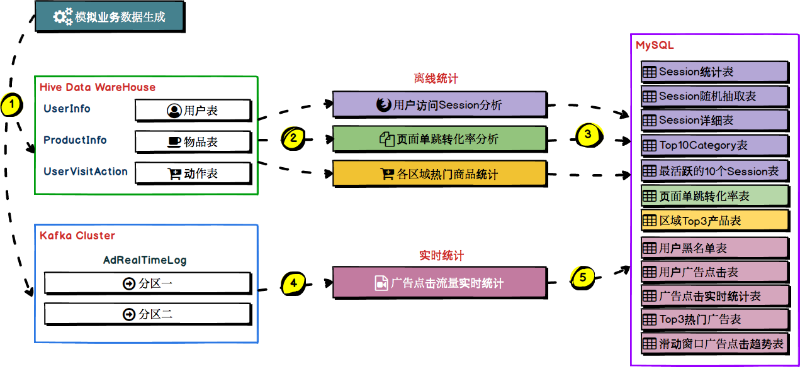

# 九 电商业务分析平台

## 9.1 这个平台的情况你能够阐述一下吗？

这个平台主要是配套电商平台做的一个分析平台，主要是获取电商平台中的用户访问数据进行一些离线指标的统计和分析，中间使用到了Hive、Spark和MySQL；还有实时对接用户对电商平台中广告的点击流，对广告的点击进行的实时分析。使用到了flume、kafka、Spark和MySQL。架构如下：

需要根据上图的架构来编一些话术。

## 9.2 这个平台中有哪些业务？怎么实现的？

【离线统计业务】

1）根据用户的行为数据，根据提供的用户筛选条件，进行访问时长和访问步长的统计，比如访问时长在1s~3s、4s~6s、7s~9s、10s~30s、30s~60s、1m~3m、3m~10m、10m~30m、30m以上各个范围内的session占比；访问步长在1~3、4~6、7~9、10~30、30~60、60以上各个范围内的session占比。这个功能的作用，其实就是，可以让人从全局的角度看到，符合某些条件的用户群体，使用我们的产品的一些习惯。比如大多数人，到底是会在产品中停留多长时间，大多数人，会在一次使用产品的过程中，访问多少个页面。那么对于使用者来说，有一个全局和清晰的认识。

2）在符合条件的session中，按照时间比例随机抽取1000个session。这个功能的作用，是说，可以让使用者，能够对于符合条件的session，按照时间比例均匀的随机采样出1000个session，然后观察每个session具体的点击流/行为。

3）在符合条件的session中，获取点击、下单和支付数量排名前10的品类。这个功能，很重要，就可以让我们明白，就是符合条件的用户，他最感兴趣的商品是什么种类。这个可以让公司里的人，清晰地了解到不同层次、不同类型的用户的心理和喜好。

4）对于排名前10的品类，分别获取其点击次数排名前10的session。这个功能，可以让我们看到，对某个用户群体最感兴趣的品类，各个品类最感兴趣最典型的用户的session的行为。

5）计算页面单跳转化率。计算一连串页面的PV，计算每一对页面的单跳转化率。这个主要是让产品经理，可以根据这个指标，去尝试分析，整个网站，产品，各个页面的表现怎么样，是不是需要去优化产品的布局；吸引用户最终可以进入最后的支付页面；让数据分析师，可以基于咱们的这个数据，做更深一步的计算和分析。让企业管理层，可以看到整个公司的网站，各个页面的之间的跳转的表现如何？心里有数，可以适当调整公司的经营战略或策略。

6）统计各个区域下的最热门的top3商品。让管理者可以清楚的指导用户对于每个区域下的商品的喜好程度。

【广告的实时算法】

1）实时统一广告点击的用户黑名单，我们将每天对某个广告点击超过100次的用户拉黑。

2）统计每天各省各城市各广告的点击流量实时统计，将统计后的数据

3）统计每天各省top3热门广告

4）统计各广告最近1小时内的点击量趋势：各广告最近1小时内各分钟的点击量

## 9.3 这个平台中你担任什么角色？

这个平台中主要是进行算法的研发工作。

## 9.4 研发过程中有没有遇到什么问题？怎么解决的？

问题一：在研发过程中遇到的主要问题就是数据倾斜问题。

这个结合我们的Spark数据倾斜解决方案来说。！！！【重点】

## 9.5 你们每天处理的数据量大概是多少？ 

一天的流量大概几十GB，有效流量大概几GB，计算后的增量数据在几百MB左右。

