 

# 八 电影推荐系统（☆☆☆☆☆）

## 8.1 你们做的推荐系统中架构能够阐述一下吗？

整个推荐系统包含了离线推荐和实时推荐两个主体部分，架构如下：

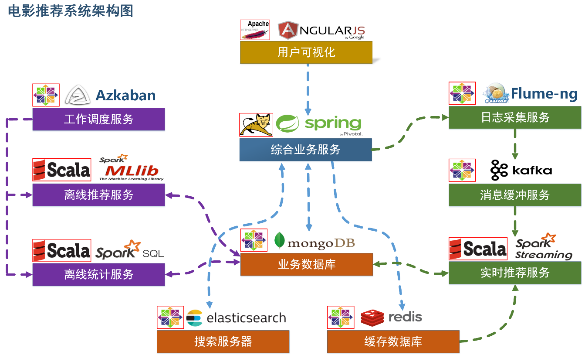

**用户可视化：**主要负责实现和用户的交互以及业务数据的展示，主体采用AngularJS2进行实现，部署在Apache服务上。

**综合业务服务：**主要实现JavaEE层面整体的业务逻辑，通过Spring进行构建，对接业务需求。部署在Tomcat上。

**【数据存储部分】**

**业务数据库：**项目采用广泛应用的文档数据库MongDB作为主数据库，主要负责平台业务逻辑数据的存储。

**搜索服务器：**项目爱用ElasticSearch作为模糊检索服务器，通过利用ES强大的匹配查询能力实现基于内容的推荐服务。

**缓存数据库：**项目采用Redis作为缓存数据库，主要用来支撑实时推荐系统部分对于数据的高速获取需求。

**【离线推荐部分】**

**离线统计服务：**批处理统计性业务采用Spark Core + Spark SQL进行实现，实现对指标类数据的统计任务。

**离线推荐服务：**离线推荐业务采用Spark Core + Spark MLlib进行实现，采用ALS算法进行实现。

**工作调度服务：**对于离线推荐部分需要以一定的时间频率对算法进行调度，采用Azkaban进行任务的调度。

**【实时推荐部分】**

**日志采集服务：**通过利用Flume-ng对业务平台中用户对于电影的一次评分行为进行采集，实时发送到Kafka集群。

**消息缓冲服务：**项目采用Kafka作为流式数据的缓存组件，接受来自Flume的数据采集请求。并将数据推送到项目的实时推荐系统部分。

**实时推荐服务：**项目采用Spark Streaming作为实时推荐系统，通过接收Kafka中缓存的数据，通过设计的推荐算法实现对实时推荐的数据处理，并将结构合并更新到MongoDB数据库。

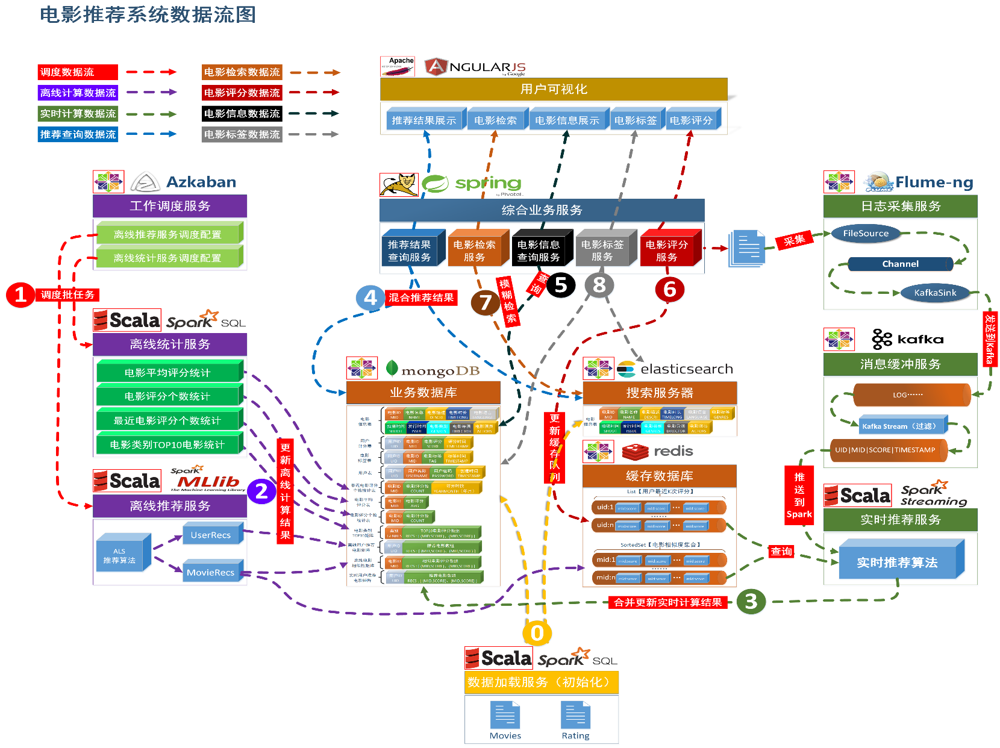

## 8.2 你们的推荐引擎用了哪些推荐算法？ （☆☆☆☆☆）

​    推荐引擎主要包括了离线推荐算法和实时推荐算法，离线推荐算法使用了基于隐语义模型的推荐算法ALS、基于内容的推荐算法以及基于统计的推荐算法。实时推荐算法使用了基于模型的推荐算法。

​    基于隐语义模型的思想采用了矩阵分解技术中的ALS算法，通过ALS算法获取电影和用户潜在的特征模型，利用这些潜在的特征模型进行推荐和相似度比较。

基于内容的推荐算法主要是通过ElasticSearch 中的more like this查询功能实现物品之间的相似度比较。

​    基于统计的推荐算法是通过SparkSQL对一些热门物品进行统计分析。

​    基于模型的推荐算法是构建了一个实现快速推荐的业务模型，这个模型根据用户产生的新的偏好需求，快速根据用户的近期表现推荐相对应的物品。

## 8.3 你们的实时推荐是怎么做的？

设计了一个模型用于快速的对于用户近期的行为进行推荐，基本思想是用户在一段时间之内的口味都是相同的，那么这个模型就从用户最近的K次评分身上入手，获取当前评分的电影的最相近的K个电影作为推荐的候选电影，然后依次将每一个候选电影与用户最近K次评分的电影分别做相似度查询，然后用相似度作为权重乘以用户对他们的评分，最后求分均值作为用户对该电影的预测评分，将这些电影按照预测评分排序，然后推荐给用户。

通过Spark Streaming实现了实时推荐。

## 8.4 你们的离线推荐是怎么做的？

​    离线推荐这块在这一期的项目中，我们调研了基于领域概念的协同过滤算法和基于隐语义模型概念的ALS算法，由于最后我们的技术架构选择了Spark，而Spark对于推荐这块只提供了ALS算法，我们选择了ALS算法进行实现。

ALS是通过矩阵分解的技术以交替最小二乘法的方式来通过用户物品评分矩阵来获取用户的潜在特征模型以及物品的潜在特征模型。通过这些特征模型周期性的计算用户电影推荐矩阵以及电影相似度矩阵，并将结构写入到MySQL和Redis。

上层业务通过访问MySQL来获取我们的离线推荐结果。

## 8.5 你在项目中担任什么职务？

我主要负责Spark算法模块的实现，并协助我们的领导进行算法的设计。

## 8.6 你在项目研发过程中遇到了什么困难？怎么解决的？（☆☆☆☆☆）

**1****）****困****难****一：如何在****实时****推荐中快速的****获****取到****电****影相似度矩****阵****的数据？**

在基于模型的实时推荐模块中，设计的算法需要经常使用到电影相似度矩阵数据，包括获取电影最相似的电影集合以及获取任意两个电影之间的相似度的需求。因为是基于Spark Streaming的实时推荐，每一次计算都需要非常快，所以如何保存和快速获取电影相似信息成为一个难题。

**（****1****）****解决****办****法一****:**考虑将整个电影相似度矩阵数据做成一个比较大的共享变量，在Streaming的任务中去共享。

后来发现这样做有几个问题，1、实时推荐模块第一次加载整个电影相似度矩阵数据比较慢，导致模块启动起来比较慢。2、如果电影相似度矩阵数据有更新，那么需要销毁以前的共享变量，重新进行共享。3、电影相似度矩阵数据比较大，而且会随着电影的增加越来越大，那么内存问题就是一个隐藏的问题。

**（****2****）****解决办法二：**解决办法一在用了一段时间后，发现并不能很好的满足需求，这次次用将电影相似度矩阵数据保存到Redis集群进行实现。

怎么做的呢？考虑到实时推荐模块对电影相似度矩阵有排序和快速查询的需求，使用了两种结构来保存电影相似度矩阵数据。

考虑到排序：使用redis中的SortedSet数据结构，将每一个当前电影的ID加上‘list’作为key，每一个电影都有一个SortedSet，将[mid:score](mid:score)这样的数据作为一项保存到redis中，同时设置这一项的排序分数为score，这样通过这个数据结构，项在数据结构中就自动有序，当需要获取当前电影最近的几个电影的时候，只要获取前几个数据就好了。

考虑到快速查询：使用redis中的Map数据结构，将每一个当前电影的ID加上‘map’作为key，每一个电邮都有一个Map，将和电影相似的电影ID以及相似度评分score，分别插入到Map中。

连接池：在Streaming应用中通过Apache commons-pool2 来实现了jedis的连接池，减少了连接创建和销毁的时间。

解决方案二目前比较稳定。

2）困难二：实时推荐模型算法的设计

在实时推荐模块的建设中，他有两个比较大的特点，第一个是：要求速度比较快，第二个是结果的精确性可以适当放宽。

**（****1****）****解决方案一：**采用ALS模型进行实时推荐。

这种方式在前期的模型研发中进行过尝试，通过离线算法周期性的训练模型，并将模型保存下来，然后在实时推荐模块中进行模型加载，然后在进行推荐。但是在测试的过程中发现了一个致命的问题：模型具有周期不变性，不能够实时根据用户的需求倾向改变推荐，好像一个周期内每次推荐结果都是一样的。

**（****2****）****解决方案二：**采用基于模型的实时推荐。

设计一个模型用于快速的对于用户近期的行为进行推荐，基本思想是用户在一段时间之内的口味都是相同的，那么这个模型就从用户最近的K次评分身上入手，获取当前评分的电影的最相近的K个电影作为推荐的候选电影，然后依次将每一个候选电影与用户最近K次评分的电影分别做相似度查询，然后用相似度作为权重乘以用户对他们的评分，最后求分均值作为用户对该电影的预测评分，将这些电影按照预测评分排序，然后推荐给用户。这种算法在推荐的合理性上非常满足我们的需求，而且配合Redis计算速度也非常快。

## 8.7 你们的项目总共有多少电影？流量多少？后台配置如何？

总共大概有3、4万部电影，每天大概2、3000用户的访问量。处理大概2GB左右的日志数据。

大数据这边有6台IBM X3850 4路服务器，内存大概256GB、磁盘2TB每台（硬件层面不了解的可以隐晦一些说）

如果问给谁做的，你可以编一个说是给某某学院做的一个校内的电影网站，外包的。

## 8.8 核心推荐算法（隐语义模型+ALS）（☆☆☆☆☆）

### 8.8.1 损失函数

损失函数度量模型一次预测的好坏。

损失函数值越小，那么模型与真实模型的差距越小，效果越好。

平方损失函数：

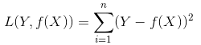

### 8.8.2 过拟合

如果一味地追求提高对训练数据的预测能力，所选模型的复杂度往往会比真模型更高，这种现象称为过拟合（over-fitting）。过拟合是指学习时选择的模型包含的参数过多，以致于出现这一模型对已知数据预测得很好，但对未知数据预测得很差的现象。可以说模型选择旨在避免过拟合并提高模型的预测能力。

通俗的讲，过拟合就是给了你一套题库，你把题库里面的题目死记硬背下来了，但是这不是马哲毛概考试，而是数学考试，题库中的题目随便一道你都可以写出正确答案，但是一旦给出了不在题库中的题目，你基本无法正确解答，这就是过拟合。

### 8.8.3 正则化项

正则化是结构风险最小化策略的实现，是在经验风险上加一个正则化项或罚项，正则化项一般是模型复杂度的单调递增函数，模型越复杂，正则化值越大。比如，正则化项可以是模型参数向量的范数。使用最为广泛的是一范数和二范数正则化项。

通俗的将，正则化项就是拯救过拟合问题的小天使， 你模型越复杂，那么就越有可能过拟合，那么我正则化项的值就越大，你不是损失函数越小越好吗，那么你模型复杂了，在我正则化项的作用下损失函数就不可能小，因此，在这一层面去降低模型的复杂度，也就尽量避免过拟合现象的发生。

### 8.8.4 梯度下降

由于对于函数来说，沿某点的梯度方向下降速度最快，因此在求损失函数的最优解时，经常采用梯度下降方法求解minL(w)，即当损失函数最小时所对应的参数值。

### 8.8.5 隐语义模型

​       我们有用户评分矩阵，其中部分位置是空着的。

​       我们希望尽量正确地填满未打分的项。

​       主要想法是，应该有一些隐藏的因素，影响用户的打分：

​              比如电影：演员、题材、年代…；

​              不一定是人直接可以理解的隐藏因子；

​              找到隐藏因子，可以对user和item进行关联（找到是由于什么使得user喜欢/不喜欢此item，什么会决定user喜欢/不喜欢此item）；

​       我们假定：

​              隐藏因子的个数小于user和item数（拆分太细导致不一定每个user和每个item都可以映射到这些维度上，通俗地讲，隐藏因子设定过多导致无法填满）。

​       隐语义模型如下图所示：

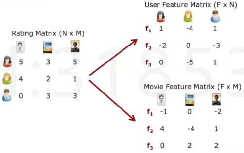

​       我们认为每个用户给每个电影打的分是有原因的，我们可以将打分矩阵拆分到若干factor上，例如演员、题材、年代等等，用户和电影在这些factor上分别有不通过的关联值，当用户在这几个维度上的挑剔程度和电影在这几个维度上的关联程度接近时，最后的得分就会很高，正是这些factor使得用户打出了这样的分数。

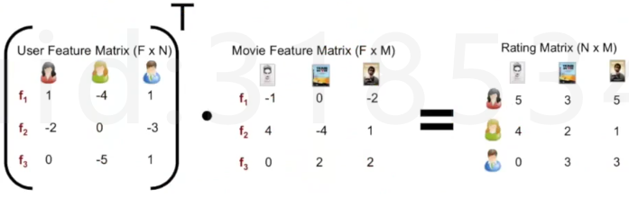

​       根据矩阵点乘关系，两个矩阵在相同维度上的值越一致，那么对应评分矩阵的分数就越高。

​       而ALS算法就是在实际数学模型层面去求解隐语义模型。

### 8.8.6 ALS算法

下图即为电影评分矩阵：

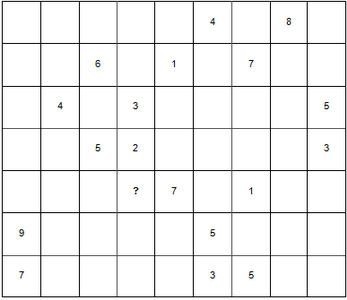

​       ALS算法来自于以下的假设：

​       一个m*n的打分矩阵R可以用两个小矩阵P(m *ｋ)和Q(n * k)来近似：

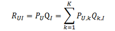

​       损失函数如下：

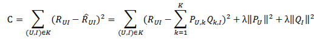

​       上式中的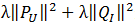是用来防止过拟合的正则化项，λ需要根据具体应用场景反复实验得到。损失函数的优化使用随机梯度下降算法：

\1.     通过求参数PUK和QKI的偏导确定最快的下降方向；

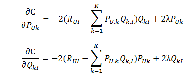

\2.     迭代计算不断优化参数（迭代次数事先人为设置），直到参数收敛。

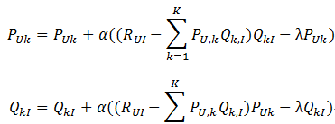

​       其中，α是学习速率，α越大，迭代下降的越快。α和λ一样，也需要根据实际的应用场景反复实验得到。

​       由此，通过迭代就求利用ALS算法求解出了隐语义模型，我们在电影推荐项目中从模型中提取出了电影特征矩阵，我们就可以把它当成电影与各个factor，如演员、题材、年代等等因素的关联度，那么两个电影特征矩阵的相乘就是这两个电影在这些公共factor下的相似度。

​       详细的模型推导过程参见http://blog.csdn.net/oucpowerman/article/details/49847979，如果有手推公式需要的同学，请单独找我。